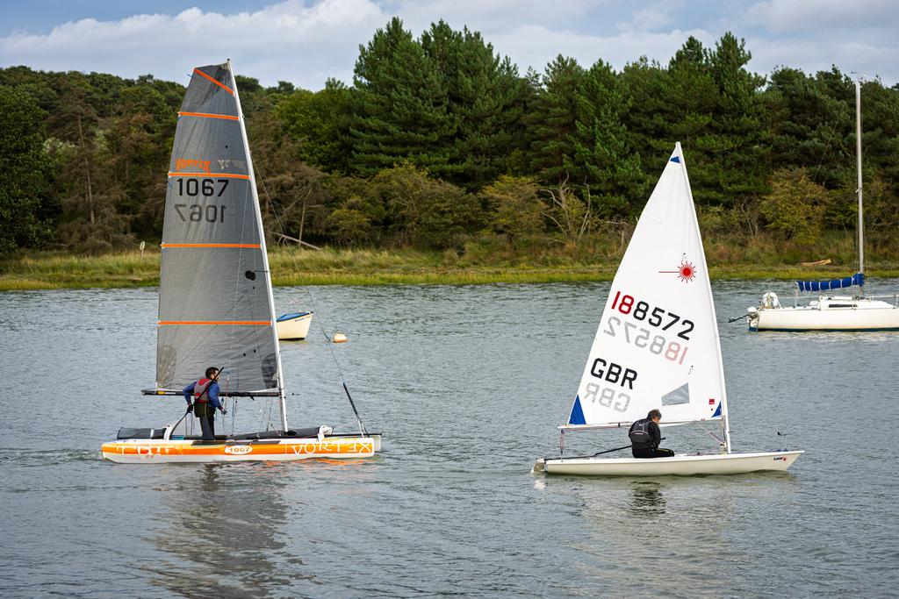

# Model Output Gallery

Generated on: 2026-09-25 22:19:51 BST

- *Evaluation lane:* assisted
- *Prompt hints:* the image's description and keyword hints were included in the prompt, so field content may be copied from them rather than seen
- *Assessment:* General checks + metadata fields and duplicate keywords; length limits and factual accuracy not assessed
- *Input image:* JPEG, 9,984 x 6,656 pixels (66.5 MP), 49.4 MB

This run records model responses to one shared image and prompt (evaluation
lane: assisted). Mechanical checks are not factual-accuracy judgments; inspect
the image, prompt and final answers before choosing a model. Results do not
establish fitness for other tasks.

Complete per-model evidence artifact with image metadata, the source prompt, a
facts-only chooser, and full generated or crash output for every attempted
model.

## Reference Image



## Current-run Chooser

Mechanical observations and captured resource facts for this run only. No concerns detected does not mean the response fulfilled an arbitrary prompt or described the image accurately. Consult the assessment scope above. Total time is end-to-end; throughput covers generation only and requires at least 16 generated tokens. Prefill/first is the measured time to first token (input preparation, prefill and the first decode step) when captured, else upstream's model-loop first-token time; Prompt tok is the full rendered prompt including image tokens, which drives prefill cost. For cross-attention architectures the token count reflects the tokenised text burden only, not total vision prefill compute.

<!-- markdownlint-disable MD034 MD037 MD049 -->

| Model                                                                                                                   | Mechanical checks      | Total s | Gen TPS    | Prefill/first s | Peak GB | Prompt tok | Gen tok | Observations                                                                                      |
|-------------------------------------------------------------------------------------------------------------------------|------------------------|---------|------------|-----------------|---------|------------|---------|---------------------------------------------------------------------------------------------------|
| [`LiquidAI/LFM2.5-VL-450M-MLX-bf16`](#model-liquidai-lfm25-vl-450m-mlx-bf16)                                            | `no concerns detected` | 2.24s   | 480 tok/s  | 0.70            | 1.9     | 2,119      | 141     | none                                                                                              |
| [`mlx-community/Devstral-Small-2-24B-Instruct-2512-5bit`](#model-mlx-community-devstral-small-2-24b-instruct-2512-5bit) | `no concerns detected` | 10.54s  | 30.6 tok/s | 3.92            | 23      | 2,394      | 123     | none                                                                                              |
| [`mlx-community/GLM-4.6V-Flash-4bit`](#model-mlx-community-glm-46v-flash-4bit)                                          | `no concerns detected` | 9.50s   | 75.7 tok/s | 5.75            | 8.7     | 6,454      | 139     | none                                                                                              |
| [`mlx-community/GLM-4.6V-nvfp4`](#model-mlx-community-glm-46v-nvfp4)                                                    | `no concerns detected` | 26.53s  | 42.8 tok/s | 14.87           | 78      | 6,454      | 142     | none                                                                                              |
| [`mlx-community/InternVL3-14B-4bit`](#model-mlx-community-internvl3-14b-4bit)                                           | `no concerns detected` | 6.40s   | 56.8 tok/s | 2.52            | 10      | 2,115      | 116     | none                                                                                              |
| [`mlx-community/InternVL3-8B-bf16`](#model-mlx-community-internvl3-8b-bf16)                                             | `no concerns detected` | 6.62s   | 37.4 tok/s | 1.55            | 17      | 2,115      | 103     | none                                                                                              |
| [`mlx-community/Kimi-VL-A3B-Thinking-2506-8bit`](#model-mlx-community-kimi-vl-a3b-thinking-2506-8bit)                   | `no concerns detected` | 15.43s  | 66.6 tok/s | 1.68            | 20      | 1,331      | 729     | none                                                                                              |
| [`mlx-community/LFM2.5-VL-3B-OptiQ-4bit`](#model-mlx-community-lfm25-vl-3b-optiq-4bit)                                  | `no concerns detected` | 3.46s   | 210 tok/s  | 1.26            | 4.0     | 2,111      | 110     | none                                                                                              |
| [`mlx-community/MiniCPM-o-4_5-4bit`](#model-mlx-community-minicpm-o-45-4bit)                                            | `no concerns detected` | 3.47s   | 105 tok/s  | 0.85            | 7.0     | 393        | 114     | none                                                                                              |
| [`mlx-community/Ministral-3-14B-Instruct-2512-mxfp4`](#model-mlx-community-ministral-3-14b-instruct-2512-mxfp4)         | `no concerns detected` | 7.08s   | 66.6 tok/s | 2.76            | 13      | 2,927      | 160     | none                                                                                              |
| [`mlx-community/Ministral-3-3B-Instruct-2512-4bit`](#model-mlx-community-ministral-3-3b-instruct-2512-4bit)             | `no concerns detected` | 3.96s   | 189 tok/s  | 1.51            | 7.8     | 2,926      | 152     | none                                                                                              |
| [`mlx-community/North-Micro-Vision-Instruct-4bit`](#model-mlx-community-north-micro-vision-instruct-4bit)               | `no concerns detected` | 4.97s   | 209 tok/s  | 2.65            | 3.9     | 4,085      | 112     | none                                                                                              |
| [`mlx-community/Ornith-1.5-35B-A3B-OptiQ-4bit`](#model-mlx-community-ornith-15-35b-a3b-optiq-4bit)                      | `no concerns detected` | 6.30s   | 102 tok/s  | 1.53            | 24      | 1,291      | 151     | none                                                                                              |
| [`mlx-community/Phi-3.5-vision-instruct-bf16`](#model-mlx-community-phi-35-vision-instruct-bf16)                        | `no concerns detected` | 4.80s   | 58.8 tok/s | 0.99            | 9.3     | 1,141      | 136     | none                                                                                              |
| [`mlx-community/Qwen3-VL-2B-Thinking-bf16`](#model-mlx-community-qwen3-vl-2b-thinking-bf16)                             | `no concerns detected` | 27.58s  | 87.2 tok/s | 15.30           | 8.4     | 16,551     | 918     | none                                                                                              |
| [`mlx-community/Qwen3-VL-30B-A3B-Instruct-4bit`](#model-mlx-community-qwen3-vl-30b-a3b-instruct-4bit)                   | `no concerns detected` | 38.68s  | 79.6 tok/s | 34.11           | 23      | 16,549     | 128     | none                                                                                              |
| [`mlx-community/Qwen3-VL-32B-Instruct-4bit`](#model-mlx-community-qwen3-vl-32b-instruct-4bit)                           | `no concerns detected` | 76.57s  | 19.7 tok/s | 64.38           | 26      | 16,549     | 181     | none                                                                                              |
| [`mlx-community/Qwen3-VL-8B-Instruct-4bit`](#model-mlx-community-qwen3-vl-8b-instruct-4bit)                             | `no concerns detected` | 38.78s  | 69.0 tok/s | 35.35           | 11      | 16,549     | 104     | none                                                                                              |
| [`mlx-community/Qwen3.5-35B-A3B-4bit`](#model-mlx-community-qwen35-35b-a3b-4bit)                                        | `no concerns detected` | 36.19s  | 103 tok/s  | 31.54           | 25      | 16,565     | 111     | none                                                                                              |
| [`mlx-community/Qwen3.5-9B-MLX-4bit`](#model-mlx-community-qwen35-9b-mlx-4bit)                                          | `no concerns detected` | 37.02s  | 87.7 tok/s | 32.99           | 11      | 16,565     | 142     | none                                                                                              |
| [`mlx-community/Qwen3.8-27B-nvfp4`](#model-mlx-community-qwen38-27b-nvfp4)                                              | `no concerns detected` | 60.89s  | 28.2 tok/s | 52.80           | 21      | 16,565     | 144     | none                                                                                              |
| [`mlx-community/SmolVLM2-2.2B-Instruct-mlx`](#model-mlx-community-smolvlm2-22b-instruct-mlx)                            | `no concerns detected` | 3.37s   | 126 tok/s  | 1.32            | 5.6     | 1,433      | 78      | none                                                                                              |
| [`mlx-community/Step-3.7-Flash-oQ3e`](#model-mlx-community-step-37-flash-oq3e)                                          | `no concerns detected` | 42.10s  | 50.9 tok/s | 23.67           | 92      | 3,494      | 147     | none                                                                                              |
| [`mlx-community/aya-vision-8b-4bit`](#model-mlx-community-aya-vision-8b-4bit)                                           | `no concerns detected` | 4.98s   | 96.4 tok/s | 1.72            | 6.5     | 2,089      | 112     | none                                                                                              |
| [`mlx-community/diffusiongemma-26B-A4B-it-mxfp8`](#model-mlx-community-diffusiongemma-26b-a4b-it-mxfp8)                 | `no concerns detected` | 7.10s   | 48.6 tok/s | 3.07            | 28      | 592        | 85      | none                                                                                              |
| [`mlx-community/gemma-3-27b-it-qat-4bit`](#model-mlx-community-gemma-3-27b-it-qat-4bit)                                 | `no concerns detected` | 10.46s  | 29.6 tok/s | 1.55            | 17      | 591        | 175     | none                                                                                              |
| [`mlx-community/gemma-4-26b-a4b-it-4bit`](#model-mlx-community-gemma-4-26b-a4b-it-4bit)                                 | `no concerns detected` | 5.26s   | 114 tok/s  | 1.02            | 16      | 596        | 130     | none                                                                                              |
| [`mlx-community/gemma-4-31b-it-4bit`](#model-mlx-community-gemma-4-31b-it-4bit)                                         | `no concerns detected` | 8.44s   | 26.0 tok/s | 1.69            | 20      | 596        | 89      | none                                                                                              |
| [`mlx-community/gemma-4-e4b-it-4bit`](#model-mlx-community-gemma-4-e4b-it-4bit)                                         | `no concerns detected` | 4.17s   | 122 tok/s  | 1.05            | 5.9     | 592        | 94      | none                                                                                              |
| [`mlx-community/granite-4.0-3b-vision-4bit`](#model-mlx-community-granite-40-3b-vision-4bit)                            | `no concerns detected` | 3.77s   | 165 tok/s  | 1.70            | 4.7     | 1,383      | 99      | none                                                                                              |
| [`mlx-community/pixtral-12b-8bit`](#model-mlx-community-pixtral-12b-8bit)                                               | `no concerns detected` | 7.74s   | 38.5 tok/s | 2.39            | 16      | 3,117      | 114     | none                                                                                              |
| [`mlx-community/Idefics3-8B-Llama3-bf16`](#model-mlx-community-idefics3-8b-llama3-bf16)                                 | `concerns detected`    | 9.25s   | 35.2 tok/s | 1.93            | 18      | 2,619      | 164     | duplicate keywords                                                                                |
| [`mlx-community/gemma-4-12B-it-4bit`](#model-mlx-community-gemma-4-12b-it-4bit)                                         | `concerns detected`    | 5.30s   | 59.0 tok/s | 0.97            | 7.6     | 596        | 108     | duplicate keywords                                                                                |
| [`mlx-community/ERNIE-4.5-VL-28B-A3B-Thinking-4bit`](#model-mlx-community-ernie-45-vl-28b-a3b-thinking-4bit)            | `major concerns`       | 7.59s   | 112 tok/s  | 1.54            | 19      | 1,639      | 425     | stopped early: repeating; labelled fields not detected; incomplete thinking block                 |
| [`mlx-community/FastVLM-0.5B-bf16`](#model-mlx-community-fastvlm-05b-bf16)                                              | `major concerns`       | 2.96s   | 361 tok/s  | 1.16            | 2.2     | 336        | 51      | labelled fields not detected                                                                      |
| [`mlx-community/Llama-3.2-11B-Vision-Instruct-8bit`](#model-mlx-community-llama-32-11b-vision-instruct-8bit)            | `major concerns`       | 57.73s  | 18.8 tok/s | 2.33            | 15      | 308        | 1,000   | repeated text; cut off at token limit; duplicate keywords                                         |
| [`mlx-community/MiniCPM-V-4.6-4bit`](#model-mlx-community-minicpm-v-46-4bit)                                            | `major concerns`       | 2.95s   | 308 tok/s  | 1.02            | 3.3     | 934        | 84      | incomplete thinking block                                                                         |
| [`mlx-community/Molmo2-8B-4bit`](#model-mlx-community-molmo2-8b-4bit)                                                   | `major concerns`       | 7.05s   | 73.0 tok/s | 2.23            | 8.1     | 1,526      | 225     | stopped early: repeating; duplicate keywords                                                      |
| [`mlx-community/Muse-Glimmer-30B-OptiQ-4bit`](#model-mlx-community-muse-glimmer-30b-optiq-4bit)                         | `major concerns`       | 54.66s  | 24.2 tok/s | 9.73            | 25      | 4,409      | 1,000   | control tokens visible; labelled fields not detected; cut off at token limit; role tokens visible |
| [`mlx-community/Qwen2-VL-7B-Instruct-4bit`](#model-mlx-community-qwen2-vl-7b-instruct-4bit)                             | `major concerns`       | 43.19s  | 91.2 tok/s | 39.04           | 9.3     | 16,560     | 225     | repeated text; stopped early: repeating; duplicate keywords                                       |
| [`mlx-community/SmolVLM-256M-Instruct-4bit`](#model-mlx-community-smolvlm-256m-instruct-4bit)                           | `major concerns`       | 2.34s   | 545 tok/s  | 1.04            | 1.1     | 1,212      | 38      | labelled fields not detected                                                                      |
| [`mlx-community/X-Reasoner-7B-8bit`](#model-mlx-community-x-reasoner-7b-8bit)                                           | `major concerns`       | 20.22s  | 57.2 tok/s | 12.63           | 14      | 16,560     | 250     | stopped early: repeating; duplicate keywords                                                      |
| [`mlx-community/gemma-3n-E4B-it-4bit`](#model-mlx-community-gemma-3n-e4b-it-4bit)                                       | `major concerns`       | 5.86s   | 86.1 tok/s | 1.22            | 7.0     | 590        | 196     | labelled fields not detected                                                                      |
| [`mlx-community/granite-vision-3.2-2b-nvfp4`](#model-mlx-community-granite-vision-32-2b-nvfp4)                          | `major concerns`       | 4.43s   | 149 tok/s  | 2.50            | 4.2     | 5,581      | 102     | labelled fields not detected                                                                      |
| [`mlx-community/llm-jp-4-vl-9b-mlx-4bit`](#model-mlx-community-llm-jp-4-vl-9b-mlx-4bit)                                 | `major concerns`       | 3.47s   | 103 tok/s  | 1.52            | 6.7     | 2,197      | 16      | control tokens visible; labelled fields not detected                                              |
| [`mlx-community/nanoLLaVA-1.5-4bit`](#model-mlx-community-nanollava-15-4bit)                                            | `major concerns`       | 1.97s   | 341 tok/s  | 0.76            | 1.6     | 332        | 21      | labelled fields not detected                                                                      |
| [`mlx-community/InternVL3_5-1B-4bit`](#model-mlx-community-internvl35-1b-4bit)                                          | `not assessed`         | 0.17s   | -          | -               | -       | -          | -       | none                                                                                              |
| [`mlx-community/Mage-VL-OptiQ-4bit`](#model-mlx-community-mage-vl-optiq-4bit)                                           | `not assessed`         | 3.21s   | -          | -               | -       | -          | -       | none                                                                                              |
<!-- markdownlint-enable MD034 MD037 MD049 -->

## Resource Highlights

Quickest completion without detected concerns (end-to-end, including model load): `LiquidAI/LFM2.5-VL-450M-MLX-bf16` at 2.24s

Lowest peak memory among completions without detected concerns: `LiquidAI/LFM2.5-VL-450M-MLX-bf16` at 1.9 GB

Decode tok/s stays per model in the chooser and is not averaged across models: tokenizers, image-token expansion and reasoning lengths differ too much for a cross-model mean to guide a choice.

## Avoid for This Run

<!-- markdownlint-disable MD034 MD037 MD049 -->

| Model                                                                                                        | Mechanical checks | Observations                                                                                      |
|--------------------------------------------------------------------------------------------------------------|-------------------|---------------------------------------------------------------------------------------------------|
| [`mlx-community/ERNIE-4.5-VL-28B-A3B-Thinking-4bit`](#model-mlx-community-ernie-45-vl-28b-a3b-thinking-4bit) | `major concerns`  | stopped early: repeating; labelled fields not detected; incomplete thinking block                 |
| [`mlx-community/FastVLM-0.5B-bf16`](#model-mlx-community-fastvlm-05b-bf16)                                   | `major concerns`  | labelled fields not detected                                                                      |
| [`mlx-community/Llama-3.2-11B-Vision-Instruct-8bit`](#model-mlx-community-llama-32-11b-vision-instruct-8bit) | `major concerns`  | repeated text; cut off at token limit; duplicate keywords                                         |
| [`mlx-community/MiniCPM-V-4.6-4bit`](#model-mlx-community-minicpm-v-46-4bit)                                 | `major concerns`  | incomplete thinking block                                                                         |
| [`mlx-community/Molmo2-8B-4bit`](#model-mlx-community-molmo2-8b-4bit)                                        | `major concerns`  | stopped early: repeating; duplicate keywords                                                      |
| [`mlx-community/Muse-Glimmer-30B-OptiQ-4bit`](#model-mlx-community-muse-glimmer-30b-optiq-4bit)              | `major concerns`  | control tokens visible; labelled fields not detected; cut off at token limit; role tokens visible |
| [`mlx-community/Qwen2-VL-7B-Instruct-4bit`](#model-mlx-community-qwen2-vl-7b-instruct-4bit)                  | `major concerns`  | repeated text; stopped early: repeating; duplicate keywords                                       |
| [`mlx-community/SmolVLM-256M-Instruct-4bit`](#model-mlx-community-smolvlm-256m-instruct-4bit)                | `major concerns`  | labelled fields not detected                                                                      |
| [`mlx-community/X-Reasoner-7B-8bit`](#model-mlx-community-x-reasoner-7b-8bit)                                | `major concerns`  | stopped early: repeating; duplicate keywords                                                      |
| [`mlx-community/gemma-3n-E4B-it-4bit`](#model-mlx-community-gemma-3n-e4b-it-4bit)                            | `major concerns`  | labelled fields not detected                                                                      |
| [`mlx-community/granite-vision-3.2-2b-nvfp4`](#model-mlx-community-granite-vision-32-2b-nvfp4)               | `major concerns`  | labelled fields not detected                                                                      |
| [`mlx-community/llm-jp-4-vl-9b-mlx-4bit`](#model-mlx-community-llm-jp-4-vl-9b-mlx-4bit)                      | `major concerns`  | control tokens visible; labelled fields not detected                                              |
| [`mlx-community/nanoLLaVA-1.5-4bit`](#model-mlx-community-nanollava-15-4bit)                                 | `major concerns`  | labelled fields not detected                                                                      |
| [`mlx-community/InternVL3_5-1B-4bit`](#model-mlx-community-internvl35-1b-4bit)                               | `not assessed`    | none                                                                                              |
| [`mlx-community/Mage-VL-OptiQ-4bit`](#model-mlx-community-mage-vl-optiq-4bit)                                | `not assessed`    | none                                                                                              |
<!-- markdownlint-enable MD034 MD037 MD049 -->

## Output at a Glance

A compact preview of each model's final answer (or failure evidence for crashes), in chooser order. Where the requested catalogue fields were detected, the preview shows a little of each: the title, the start of the description, and the first keywords with their count, so the weakest field is not hidden behind a long description. Otherwise it is the first 280 characters. A closed reasoning trace is left out of the preview and reported as an omitted-character count; the complete output, trace included, is in the model's evidence block below.

<!-- markdownlint-disable MD034 MD037 MD049 -->

| Model                                                                                                                   | Mechanical checks      | Output preview                                                                                                                                                                                                                                                                                                                                                                            |
|-------------------------------------------------------------------------------------------------------------------------|------------------------|-------------------------------------------------------------------------------------------------------------------------------------------------------------------------------------------------------------------------------------------------------------------------------------------------------------------------------------------------------------------------------------------|
| [`LiquidAI/LFM2.5-VL-450M-MLX-bf16`](#model-liquidai-lfm25-vl-450m-mlx-bf16)                                            | `no concerns detected` | Title: Sailboats on a River \| Description: Two sailboats glide across a calm river, surrounded by dense green forest and a partly cloudy sky. The sailboat on t... \| Keywords (15): Boat, Boating, Catamaran, Sailboat, Sailing, Life jacket, Man, Sail, Sails, Water, Forest, Sky, Trees, River, ...                                                                                   |
| [`mlx-community/Devstral-Small-2-24B-Instruct-2512-5bit`](#model-mlx-community-devstral-small-2-24b-instruct-2512-5bit) | `no concerns detected` | Title: Two sailors on a catamaran and dinghy \| Description: Two sailors navigate a catamaran (sail number 1067) and a Laser dinghy (sail number GBR 188572) on calm waters,... \| Keywords (20): Boat, Boating, Catamaran, Clouds, Dinghy, Estuary, Forest, Laser dinghy, Life jacket, Man, Mast, ...                                                                                    |
| [`mlx-community/GLM-4.6V-Flash-4bit`](#model-mlx-community-glm-46v-flash-4bit)                                          | `no concerns detected` | Title: Two Sailors on Dinghies \| Description: Two sailors steer small dinghies—a Vortex catamaran (sail number 1067) on the left and a Laser dinghy (sail number... \| Keywords (19): Boat, Boating, Catamaran, Dinghy, Estuary, Forest, Laser dinghy, Life jacket, Man, Mast, Outdoor recreation, ...                                                                                   |
| [`mlx-community/GLM-4.6V-nvfp4`](#model-mlx-community-glm-46v-nvfp4)                                                    | `no concerns detected` | Title: Two Sailors in Vortex and Laser Dinghies on Calm Waters \| Description: Two sailors navigate a Vortex catamaran (sail number 1067) and a Laser dinghy (sail... \| Keywords (19): Boat, Boating, Catamaran, Clouds, Dinghy, Forest, Laser dinghy, Life jacket, Man, Mast, Outdoor recreation, ...                                                                                   |
| [`mlx-community/InternVL3-14B-4bit`](#model-mlx-community-internvl3-14b-4bit)                                           | `no concerns detected` | Title: Sailing Dinghies on Calm Waters \| Description: Two sailors navigate small dinghies, a Vortex catamaran (1067) and a Laser dinghy (GBR 188572), on calm waters with a... \| Keywords (20): Boat, Boating, Catamaran, Clouds, Dinghy, Estuary, Forest, Laser dinghy, Life jacket, Man, Mast, ...                                                                                    |
| [`mlx-community/InternVL3-8B-bf16`](#model-mlx-community-internvl3-8b-bf16)                                             | `no concerns detected` | Title: Sailing on Calm Waters with Catamaran and Laser Dinghy \| Description: Two sailors navigate a Vortex catamaran and a Laser dinghy on calm waters near a fo... \| Keywords (17): Sailing, Catamaran, Laser dinghy, Vortex, GBR, 188572, 1067, Dinghy, Life jacket, Outdoor recreation, River, ...                                                                                   |
| [`mlx-community/Kimi-VL-A3B-Thinking-2506-8bit`](#model-mlx-community-kimi-vl-a3b-thinking-2506-8bit)                   | `no concerns detected` | Title: Two Sailors Navigate dinghies in Calm Waters Near Forested Shoreline \| Description: Two sailors steer a Vortex catamaran (sail 1067) and a Laser dinghy (... \| Keywords (19): Boat, Boating, Catamaran, Dinghy, Estuary, Forest, Laser dinghy, Life jacket, Man, Mast, Outdoor recreation, ...[2,349 characters of reasoning omitted; complete output in the evidence block]     |
| [`mlx-community/LFM2.5-VL-3B-OptiQ-4bit`](#model-mlx-community-lfm25-vl-3b-optiq-4bit)                                  | `no concerns detected` | Title: Sailors race dinghies across calm waters. \| Description: Two sailors compete in a Vortex catamaran and Laser dinghy against a backdrop of dense green woodland. The s... \| Keywords (19): Boat, Boating, Catamaran, Clouds, Dinghy, Estuary, Forest, Laser dinghy, Life jacket, Man, Mast, ...                                                                                   |
| [`mlx-community/MiniCPM-o-4_5-4bit`](#model-mlx-community-minicpm-o-45-4bit)                                            | `no concerns detected` | Title: Sailboats on Calm Water near Green Woodland \| Description: Two sailors navigate a Vortex catamaran and Laser dinghy across tranquil waters, with dense fo... \| Keywords (17): Sailboat, Dinghy, Sailor, Vortex catamaran, Laser dinghy, Sail number 1067, Sail number 188572, Life jacket, ...                                                                                   |
| [`mlx-community/Ministral-3-14B-Instruct-2512-mxfp4`](#model-mlx-community-ministral-3-14b-instruct-2512-mxfp4)         | `no concerns detected` | Title: **Sailing Dinghies in Coastal Waters – Vortex and Laser** \| Description: Two sailors navigate a Vortex catamaran (sail number 1067) and a Laser dinghy... \| Keywords (16): Boating, coastal waters, dinghy sailing, Laser dinghy, life jackets, manoeuvring, outdoor recreation, sailing, ...                                                                                    |
| [`mlx-community/Ministral-3-3B-Instruct-2512-4bit`](#model-mlx-community-ministral-3-3b-instruct-2512-4bit)             | `no concerns detected` | Title: Coastal Sailing Adventure with Catamaran and Laser Dinghy \| Description: Two sailors navigate small boats—one a Vortex catamaran (sail number 1067) and... \| Keywords (19): Catamaran, Coastal waters, Dinghy, Estuary, Forest, Laser dinghy, Life jacket, Man, Mast, Outdoor recreation, ...                                                                                    |
| [`mlx-community/North-Micro-Vision-Instruct-4bit`](#model-mlx-community-north-micro-vision-instruct-4bit)               | `no concerns detected` | Title: Sailboats on Calm Waters \| Description: Two sailors navigate small dinghies across tranquil waters, one steering a Vortex catamaran (sail number 1067) and the other... \| Keywords (20): Boat, Boating, Catamaran, Clouds, Dinghy, Estuary, Forest, Laser dinghy, Life jacket, Man, Mast, ...                                                                                    |
| [`mlx-community/Ornith-1.5-35B-A3B-OptiQ-4bit`](#model-mlx-community-ornith-15-35b-a3b-optiq-4bit)                      | `no concerns detected` | Title: Two Sailboats Racing on Calm Waters \| Description: On 19 September 2026, an orange Vortex catamaran (sail number 1067) helmed by a sailor in a blue jacket a... \| Keywords (19): Sailing, Sailboat, Catamaran, Dinghy, Laser, Man, Sailor, Life jacket, Mast, Boat, Water, River, Estuary, ...                                                                                   |
| [`mlx-community/Phi-3.5-vision-instruct-bf16`](#model-mlx-community-phi-35-vision-instruct-bf16)                        | `no concerns detected` | Title: Sailors on Dinghies in Coastal Waters \| Description: On September 19, 2026, two sailors navigate their respective dinghies, a Vortex catamaran and a Laser dinghy,... \| Keywords (18): Sailors, Dinghies, Vortex, Laser, Coastal Waters, Forest, Sailing, Trees, Water, Clouds, Man, Mast, ...                                                                                   |
| [`mlx-community/Qwen3-VL-2B-Thinking-bf16`](#model-mlx-community-qwen3-vl-2b-thinking-bf16)                             | `no concerns detected` | Title: Sailors Steering Vortex &amp; Laser Dinghies on Calm Water \| Description: Two sailors steer Vortex (1067) and Laser dinghy (GBR 188572) across calm river wat... \| Keywords (19): Boat, Boating, Catamaran, Clouds, Dinghy, Estuary, Laser dinghy, Life jacket, Man, Mast, Outdoor recreation, ...[2,719 characters of reasoning omitted; complete output in the evidence block] |
| [`mlx-community/Qwen3-VL-30B-A3B-Instruct-4bit`](#model-mlx-community-qwen3-vl-30b-a3b-instruct-4bit)                   | `no concerns detected` | Title: Two sailboats racing on calm water \| Description: Two sailors compete in a race on small dinghies—a Vortex catamaran (number 1067) and a Laser dinghy (num... \| Keywords (19): Boat, Boating, Catamaran, Clouds, Dinghy, Forest, Laser dinghy, Life jacket, Man, Mast, Outdoor recreation, ...                                                                                   |
| [`mlx-community/Qwen3-VL-32B-Instruct-4bit`](#model-mlx-community-qwen3-vl-32b-instruct-4bit)                           | `no concerns detected` | Title: Sailors in Vortex Catamaran and Laser Dinghy on Calm Water \| Description: On 2026-09-19, two sailors navigate small dinghies on calm waters: a Vortex catam... \| Keywords (24): Sailboat, Sailing, Dinghy, Catamaran, Vortex, Laser, Sail number, GBR, 1067, 188572, Sailor, Water, River, ...                                                                                   |
| [`mlx-community/Qwen3-VL-8B-Instruct-4bit`](#model-mlx-community-qwen3-vl-8b-instruct-4bit)                             | `no concerns detected` | Title: Sailors race dinghies on calm water \| Description: Two sailors navigate a Vortex catamaran and Laser dinghy across tranquil waters, framed by dense green fore... \| Keywords (18): Sailboat, Dinghy, Catamaran, Laser, Sailing, Water, Forest, Trees, Shoreline, Sky, Clouds, Man, Sailor, ...                                                                                   |
| [`mlx-community/Qwen3.5-35B-A3B-4bit`](#model-mlx-community-qwen35-35b-a3b-4bit)                                        | `no concerns detected` | Title: Vortex Catamaran and Laser Sailing on Water \| Description: Two sailors navigate a Vortex catamaran and a Laser dinghy on calm river waters on 19 Septe... \| Keywords (16): Vortex catamaran, Laser dinghy, sailors, calm water, river, shoreline, dense green woodland, partly cloudy sky, ...                                                                                   |
| [`mlx-community/Qwen3.5-9B-MLX-4bit`](#model-mlx-community-qwen35-9b-mlx-4bit)                                          | `no concerns detected` | Title: Two Sailors Navigate Vortex Catamaran and Laser Dinghy on Calm Waters \| Description: Two sailors steer a Vortex catamaran (sail 1067) and a Laser dingh... \| Keywords (21): Sailing, Dinghy, Catamaran, Vortex, Laser, Sailboat, Sailor, Life jacket, Mast, River, Estuary, Forest, Trees, ...                                                                                   |
| [`mlx-community/Qwen3.8-27B-nvfp4`](#model-mlx-community-qwen38-27b-nvfp4)                                              | `no concerns detected` | Title: Two sailors racing Vortex and Laser dinghies on calm waters \| Description: A Vortex catamaran with sail number 1067 on the left and a Laser dinghy with sail n... \| Keywords (15): Vortex, Laser, catamaran, dinghy, sailing, sailors, estuary, woodland, boats, water, masts, GBR 188572, ...                                                                                   |
| [`mlx-community/SmolVLM2-2.2B-Instruct-mlx`](#model-mlx-community-smolvlm2-22b-instruct-mlx)                            | `no concerns detected` | Title: Sailing on the River \| Description: Two sailors are sailing their boats across the river. \| Keywords (20): Boat, Boating, Catamaran, Clouds, Dinghy, Estuary, Forest, Laser dinghy, Life jacket, Man, Mast, ...                                                                                                                                                                  |
| [`mlx-community/Step-3.7-Flash-oQ3e`](#model-mlx-community-step-37-flash-oq3e)                                          | `no concerns detected` | Title: Two sailors on dinghies across calm waters \| Description: On 19 September 2026 at 17:12 UTC+1, two sailors steer small dinghies across calm coastal or river... \| Keywords (18): Sailboat, Sailing, Sailor, Dinghy, Catamaran, Laser dinghy, Vortex, Boat, Boating, Water, River, Estuary, ...                                                                                   |
| [`mlx-community/aya-vision-8b-4bit`](#model-mlx-community-aya-vision-8b-4bit)                                           | `no concerns detected` | Title: Sailing Adventure on the River \| Description: Two sailors navigate their boats across a serene river, with one in a Vortex catamaran and the other in a Laser dinghy, bot... \| Keywords (16): Catamaran, Dinghy, River, Sailing, Trees, Water, Sky, Boat, Boating, Mast, Life jacket, Man, ...                                                                                   |
| [`mlx-community/diffusiongemma-26B-A4B-it-mxfp8`](#model-mlx-community-diffusiongemma-26b-a4b-it-mxfp8)                 | `no concerns detected` | Title: Two Sailors Sailing Dinghies on Calm Water \| Description: Two sailors steer a grey Vortex catamaran and a white Laser dinghy across calm waters agains... \| Keywords (15): Sailing, Sailboat, Catamaran, Dinghy, Sailor, Mast, Water, Forest, River, Outdoor Recreation, Boating, Estuary, ...                                                                                   |
| [`mlx-community/gemma-3-27b-it-qat-4bit`](#model-mlx-community-gemma-3-27b-it-qat-4bit)                                 | `no concerns detected` | Title: Sailing Dinghies on Calm Water, September 2026 \| Description: Captured on 19th September 2026, this image shows a Vortex catamaran (sail number 1067) and a Laser din... \| Keywords (27): Boat, Boating, Catamaran, Clouds, Dinghy, Estuary, Forest, Laser dinghy, Life jacket, Man, Mast, ...                                                                                   |
| [`mlx-community/gemma-4-26b-a4b-it-4bit`](#model-mlx-community-gemma-4-26b-a4b-it-4bit)                                 | `no concerns detected` | Title: Two sailors steering small boats across calm water \| Description: Two sailors navigate small boats across calm waters against a backdrop of dense green wo... \| Keywords (18): Boat, Boating, Catamaran, Clouds, Dinghy, Forest, Laser dinghy, Life jacket, Man, Mast, Outdoor recreation, ...                                                                                   |
| [`mlx-community/gemma-4-31b-it-4bit`](#model-mlx-community-gemma-4-31b-it-4bit)                                         | `no concerns detected` | Title: Two Sailors Steering Dinghies on Calm Water \| Description: A Vortex catamaran and a Laser dinghy sail across calm waters against a backdrop of dense green woodland u... \| Keywords (19): Boat, Boating, Catamaran, Clouds, Dinghy, Estuary, Forest, Laser dinghy, Life jacket, Man, Mast, ...                                                                                   |
| [`mlx-community/gemma-4-e4b-it-4bit`](#model-mlx-community-gemma-4-e4b-it-4bit)                                         | `no concerns detected` | Title: Two Dinghies Sail on Calm Woodland Water \| Description: Two small dinghies navigate placid waters beneath a backdrop of dense green woodland under partly... \| Keywords (15): Catamaran, Dinghy, Laser, Sailing, Boating, Woodland, Estuary, Sailboat, Water, Outdoor, Recreation, Trees, ...                                                                                    |
| [`mlx-community/granite-4.0-3b-vision-4bit`](#model-mlx-community-granite-40-3b-vision-4bit)                            | `no concerns detected` | Title: "Sailors in Dinghies on a Calm Day" \| Description: Two sailors navigate their dinghies, a Vortex catamaran and a Laser dinghy, across a serene body of water wi... \| Keywords (13): Sailors, Dinghies, Vortex catamaran, Laser dinghy, Water, Trees, Coastline, Sailing, Life jacket, Man, ...                                                                                   |
| [`mlx-community/pixtral-12b-8bit`](#model-mlx-community-pixtral-12b-8bit)                                               | `no concerns detected` | Title: Sailors Navigate Calm Waters in Dinghies \| Description: Two sailors steer small dinghies—a Vortex catamaran and a Laser dinghy—across calm waters with dense green wo... \| Keywords (21): Boat, Boating, Catamaran, Clouds, Dinghy, Estuary, Forest, Laser dinghy, Life jacket, Man, Mast, ...                                                                                   |
| [`mlx-community/Idefics3-8B-Llama3-bf16`](#model-mlx-community-idefics3-8b-llama3-bf16)                                 | `concerns detected`    | Title: Laser and Vortex catamaran sailboats on a river with trees. \| Description: Two sailboats, a Laser dinghy with sail number GBR 188572 and a Vortex catam... \| Keywords (12): Laser dinghy, Vortex catamaran, sailboats, river, woodland, sail number GBR 188572, sail number 1067, sailors, ...                                                                                   |
| [`mlx-community/gemma-4-12B-it-4bit`](#model-mlx-community-gemma-4-12b-it-4bit)                                         | `concerns detected`    | Title: Two Sailors Steering Small Dinghies on Calm Water \| Description: Two sailors navigate a Vortex catamaran and a Laser dinghy across calm water against a back... \| Keywords (19): Boat, Boating, Catamaran, Sailing, Sailor, Laser dinghy, Water, River, Estuary, Forest, Trees, Shoreline, ...                                                                                   |
| [`mlx-community/ERNIE-4.5-VL-28B-A3B-Thinking-4bit`](#model-mlx-community-ernie-45-vl-28b-a3b-thinking-4bit)            | `major concerns`       | Alright, let's get this done. I need to create some metadata for this image, and it's my job to be precise.<br><br>First, I need to figure out a good title. "Sailboats on the Water" is too generic. "Two Sailors on Dinghies" is better, but I want something more specific. "Sailors on...                                                                                             |
| [`mlx-community/FastVLM-0.5B-bf16`](#model-mlx-community-fastvlm-05b-bf16)                                              | `major concerns`       | A serene scene of two sailors navigating calm waters in a Vortex catamaran and Laser dinghy, set against a backdrop of dense green woodland, under a clear sky, with a sailboat and a man in a life jacket in the distance.                                                                                                                                                               |
| [`mlx-community/Llama-3.2-11B-Vision-Instruct-8bit`](#model-mlx-community-llama-32-11b-vision-instruct-8bit)            | `major concerns`       | Title: Two Sailors Navigate Calm Waters in a Forested Estuary \| Description: On a sunny day in September 2026, two sailors, one in a Vortex catamaran and the o... \| Keywords (343): Sailboat, Catamaran, Estuary, Forest, Sailing, Sailors, Vortex, Laser, GBR, 1067, 188572, Sail, Boat, Water, ...                                                                                   |
| [`mlx-community/MiniCPM-V-4.6-4bit`](#model-mlx-community-minicpm-v-46-4bit)                                            | `major concerns`       | Title: Sailing vessels on calm waters \| Description: Two sailors are sailing small dinghies, a Vortex catamaran and a Laser dinghy, across calm water with green forest... \| Keywords (12): boats, sailing, dinghy, catamaran, water, nature, forest, sail, person, life jacket, outdoor, recreation                                                                                    |
| [`mlx-community/Molmo2-8B-4bit`](#model-mlx-community-molmo2-8b-4bit)                                                   | `major concerns`       | Title: Catamaran and Laser Dinghy Sail on Calm River \| Description: Two sailors navigate small dinghies across a tranquil river, with a Vortex catamaran on the... \| Keywords (52): Boat, Boating, Catamaran, Dinghy, Estuary, Forest, Laser dinghy, Life jacket, Man, Mast, Outdoor recreation, ...                                                                                    |
| [`mlx-community/Muse-Glimmer-30B-OptiQ-4bit`](#model-mlx-community-muse-glimmer-30b-optiq-4bit)                         | `major concerns`       | Title: (not detected) \| Description: (not detected) \| Keywords (1): Need title 5-10 words. Let's craft: "Two Sailors on Vortex Catamaran and Laser Dinghy" That's 8 words? Two(1) Sailors2 on3 Vortex4 Catamaran5 and6 Laser7 Dinghy8. Good.                                                                                                                                            |
| [`mlx-community/Qwen2-VL-7B-Instruct-4bit`](#model-mlx-community-qwen2-vl-7b-instruct-4bit)                             | `major concerns`       | Title: Sailing Adventure \| Description: Two sailors navigate a Vortex catamaran (sail number 1067) and a Laser dinghy (sail number GBR 188572) across calm waters,... \| Keywords (67): Sailing, Catamaran, Laser dinghy, Vortex, Sail number, Water, Trees, Forest, Woodland, Adventure, Outdoor, ...                                                                                   |
| [`mlx-community/SmolVLM-256M-Instruct-4bit`](#model-mlx-community-smolvlm-256m-instruct-4bit)                           | `major concerns`       | A 5-10-word, 1-2-sentence, factual description combining relevant context with the main visible subject, setting, action, lighting, and distinctive details.                                                                                                                                                                                                                              |
| [`mlx-community/X-Reasoner-7B-8bit`](#model-mlx-community-x-reasoner-7b-8bit)                                           | `major concerns`       | Title: Sailing Catamaran and Laser Dinghy on Calm Waters \| Description: Two sailors navigate a Vortex catamaran (sail number 1067) and a Laser dinghy (sail number GBR 18857... \| Keywords (39): Sailing, Catamaran, Laser dinghy, Vortex, Sail number 1067, Sail number GBR 188572, Calm waters, ...                                                                                   |
| [`mlx-community/gemma-3n-E4B-it-4bit`](#model-mlx-community-gemma-3n-e4b-it-4bit)                                       | `major concerns`       | Two sailors are engaged in a sailing competition on a calm body of water, likely an estuary or a sheltered bay, surrounded by lush green vegetation. On the left, a vibrant orange and white catamaran, identified by the sail number 1067 and the name "VORTEX," is being steered by...                                                                                                  |
| [`mlx-community/granite-vision-3.2-2b-nvfp4`](#model-mlx-community-granite-vision-32-2b-nvfp4)                          | `major concerns`       | Title: "Harmony on the Water" \| Description: Two sailors navigate their small dinghies, a Vortex catamaran and a Laser dinghy, across calm waters, with a dense green woodland backdrop. The scene is set in an estuary, with a clear sky overhead. The sailors are equ... \| Keywords: (not detected)                                                                                   |
| [`mlx-community/llm-jp-4-vl-9b-mlx-4bit`](#model-mlx-community-llm-jp-4-vl-9b-mlx-4bit)                                 | `major concerns`       | <\|channel\|> analysis<\|message\|> The image shows two small sailboats racing on a river.                                                                                                                                                                                                                                                                                                |
| [`mlx-community/nanoLLaVA-1.5-4bit`](#model-mlx-community-nanollava-15-4bit)                                            | `major concerns`       | "Boating in the Countryside: A Glimpse of Sailboats and Forests"                                                                                                                                                                                                                                                                                                                          |
| [`mlx-community/InternVL3_5-1B-4bit`](#model-mlx-community-internvl35-1b-4bit)                                          | `not assessed`         | Model loading failed: Model type internvl not supported. Error: No module named 'mlx_vlm.speculative.drafters.internvl'                                                                                                                                                                                                                                                                   |
| [`mlx-community/Mage-VL-OptiQ-4bit`](#model-mlx-community-mage-vl-optiq-4bit)                                           | `not assessed`         | Model generation failed for mlx-community/Mage-VL-OptiQ-4bit: cu_seqlens mismatch: total_patches=7600 calculated=3800 grid=[(1, 50, 76)]                                                                                                                                                                                                                                                  |
<!-- markdownlint-enable MD034 MD037 MD049 -->

## Run Stamps

- `mlx-vlm`: `0.7.3`
- `mlx`: `0.32.3.dev20260925+073d2252c`
- `transformers`: `5.17.0`
- `tokenizers`: `0.23.2`
- `huggingface-hub`: `1.33.0`
- *Python Version:* 3.14.7
- *OS:* Darwin 27.0.0
- *macOS Version:* 27.0
- *GPU/Chip:* Apple M5 Max
- *MLX Device:* Apple M5 Max
- *GPU Architecture:* applegpu_g17s
- *RAM:* 128.0 GB
- *Recommended Working Set:* 108 GB
- *Fused Attention:* Available

## Image Metadata

- *Description:* Two sailors steer small dinghies—a Vortex catamaran (sail
  number 1067) on the left and a Laser dinghy (sail number GBR 188572) on the
  right—across calm coastal or river waters against a backdrop of dense green
  woodland.
- *Keywords:* Boat, Boating, Catamaran, Clouds, Dinghy, Estuary, Forest, Laser
  dinghy, Life jacket, Man, Mast, Outdoor recreation, River, Sailboat,
  Sailing, Sailor, Shoreline, Sky, Trees, Water, Water sports, Yacht, active
  lifestyle, adventure, aquatic sports, boat race, buoyancy aid, calm water,
  coastal, competition, daytime, hobby, lake, leisure, maritime, nature,
  navigation, outdoor, recreation, regatta, rigging, sail, sailing boat,
  scenic, single-handed, skiff, sport, summer, vessel, water sport,
  watercraft, watersport, yachting
- *Date:* 2026-09-19 17:12:46 UTC+01:00
- *Time:* 17:12:46

## Prompt

<!-- markdownlint-disable MD011 MD028 MD037 MD045 -->
>
> Create British-English catalogue metadata from the image and supplied
> context.
>
> Treat any capture date/time and GPS as authoritative facts, but do not claim
> they are visible. Descriptive hints may be incomplete or wrong: retain
> details supported by the image, correct conflicts, and add important visible
> details. Prefer image evidence when a hint conflicts, and omit uncertain
> details.
>
> Context: Authoritative context:
> &#45; Capture date/time: 2026-09-19 17:12:46 UTC+01:00
>
> &#8203;Descriptive hints:
> &#45; Description hint: Two sailors steer small dinghies—a Vortex catamaran
> (sail number 1067) on the left and a Laser dinghy (sail number GBR 188572)
> on the right—across calm coastal or river waters against a backdrop of dense
> green woodland.
> &#45; Keyword hints: Boat, Boating, Catamaran, Clouds, Dinghy, Estuary, Forest,
> Laser dinghy, Life jacket, Man, Mast, Outdoor recreation, River, Sailboat,
> Sailing, Sailor, Shoreline, Sky, Trees, Water
>
> &#8203;Write:
> &#45; a concrete 5-10-word title;
> &#45; a 1-2-sentence factual description combining relevant context with the
> main visible subject, setting, action, lighting, and distinctive details;
> &#45; 10-18 unique, comma-separated keywords covering relevant context and
> visible details.
>
> &#8203;Return exactly these three sections and nothing else:
> &#8203;Title:
> &#8203;Description:
> &#8203;Keywords:
<!-- markdownlint-enable MD011 MD028 MD037 MD045 -->

## Complete Per-model Evidence

Complete generated or crash evidence for every attempted model.

<a id="model-liquidai-lfm25-vl-450m-mlx-bf16"></a>

### LiquidAI/LFM2.5-VL-450M-MLX-bf16

<details>
<summary>Complete evidence: LiquidAI/LFM2.5-VL-450M-MLX-bf16</summary>

- *Execution:* completed
- *Mechanical checks:* no concerns detected
- *Assessment:* General checks + metadata fields and duplicate keywords;
  length limits and factual accuracy not assessed
- *Maintainer status:* none
- *Observations:* none
- *Arch supported by installed mlx-vlm:* yes (model_type lfm2-vl via lfm2_vl)
- *Model load time:* 0.39s
- *Generation time:* 0.99s
- *Total time:* 2.24s
- *Prompt preparation time:* 0.514
- *First-token latency:* 0.207
- *Cleanup time:* 0.0623
- *Prompt tokens:* 2,119
- *Generation tokens:* 141
- *Total tokens:* 2,260
- *Prompt throughput (raw):* 10,217 tok/s
- *Generation throughput (raw):* 480 tok/s
- *Peak memory (GB):* 1.9
- *Active memory (GB):* 0.90
- *Cache memory (GB):* 0.08
- *Model-load active memory (GB):* 0.897
- *Post-cleanup active memory (GB):* 0.000134
- *Post-cleanup cache memory (GB):* 0.0
- *Stop reason:* completed
- *Requested maximum tokens:* 1000
- *Rendered prompt characters:* 1357
- *Image placeholders:* 1
- *Processor:* transformers.models.lfm2_vl.processing_lfm2_vl.Lfm2VlProcessor
- *Tokenizer:* transformers.tokenization_utils_tokenizers.TokenizersBackend
- *Requested model revision:* not requested
- *Resolved model revision:* ed71acdae0799c98cb450787d049d1343b65cd52
- *Resolved snapshot path:* ~/.cache/huggingface/hub/models--LiquidAI--LFM2.5-VL-450M-MLX-bf16/snapshots/ed71acdae0799c98cb450787d049d1343b65cd52
- *Generation settings:* {"max_tokens": 1000, "prefill_step_size": 2048,
  "seed": 0, "temperature": 0.0, "top_p": 1.0}
- *EOS token:* <\|im_end\|>

*Readable output:*

<pre class="model-output-readable">
Title:
Sailboats on a River

Description:
Two sailboats glide across a calm river, surrounded by dense green forest and a partly cloudy sky. The sailboat on the left, a Vortex catamaran, has a prominent sail marked with the number 1067 and a life jacket on the man steering it. The sailboat on the right, a Laser dinghy, features a white sail with the number 188572 and the letters GBR.

Keywords:
Boat, Boating, Catamaran, Sailboat, Sailing, Life jacket, Man, Sail, Sails, Water, Forest, Sky, Trees, River, Clouds
</pre>

</details>

---

<a id="model-mlx-community-devstral-small-2-24b-instruct-2512-5bit"></a>

### mlx-community/Devstral-Small-2-24B-Instruct-2512-5bit

<details>
<summary>Complete evidence: mlx-community/Devstral-Small-2-24B-Instruct-2512-5bit</summary>

- *Execution:* completed
- *Mechanical checks:* no concerns detected
- *Assessment:* General checks + metadata fields and duplicate keywords;
  length limits and factual accuracy not assessed
- *Maintainer status:* none
- *Observations:* none
- *Arch supported by installed mlx-vlm:* yes (model_type mistral3)
- *Model load time:* 2.06s
- *Generation time:* 7.95s
- *Total time:* 10.54s
- *Prompt preparation time:* 0.524
- *First-token latency:* 3.36
- *Cleanup time:* 0.0896
- *Prompt tokens:* 2,394
- *Generation tokens:* 123
- *Total tokens:* 2,517
- *Prompt throughput (raw):* 712 tok/s
- *Generation throughput (raw):* 30.6 tok/s
- *Peak memory (GB):* 23
- *Active memory (GB):* 18
- *Cache memory (GB):* 0.47
- *Model-load active memory (GB):* 18
- *Post-cleanup active memory (GB):* 0.000396
- *Post-cleanup cache memory (GB):* 0.0
- *Stop reason:* completed
- *Requested maximum tokens:* 1000
- *Rendered prompt characters:* 1306
- *Processor:* mlx_vlm.models.mistral3.processing_mistral3.Mistral3Processor
- *Tokenizer:* transformers.tokenization_utils_tokenizers.TokenizersBackend
- *Requested model revision:* not requested
- *Resolved model revision:* 0a970d20ad7da57b0e2accc35c5b8628f5d02063
- *Resolved snapshot path:* ~/.cache/huggingface/hub/models--mlx-community--Devstral-Small-2-24B-Instruct-2512-5bit/snapshots/0a970d20ad7da57b0e2accc35c5b8628f5d02063
- *Generation settings:* {"max_tokens": 1000, "prefill_step_size": 2048,
  "seed": 0, "temperature": 0.15, "top_p": 1.0}
- *EOS token:* &lt;/s&gt;

*Readable output:*

<pre class="model-output-readable">
Title:
Two sailors on a catamaran and dinghy

Description:
Two sailors navigate a catamaran (sail number 1067) and a Laser dinghy (sail number GBR 188572) on calm waters, surrounded by dense green woodland under a partly cloudy sky.

Keywords:
Boat, Boating, Catamaran, Clouds, Dinghy, Estuary, Forest, Laser dinghy, Life jacket, Man, Mast, Outdoor recreation, River, Sailboat, Sailing, Sailor, Shoreline, Sky, Trees, Water
</pre>

</details>

---

<a id="model-mlx-community-glm-46v-flash-4bit"></a>

### mlx-community/GLM-4.6V-Flash-4bit

<details>
<summary>Complete evidence: mlx-community/GLM-4.6V-Flash-4bit</summary>

- *Execution:* completed
- *Mechanical checks:* no concerns detected
- *Assessment:* General checks + metadata fields and duplicate keywords;
  length limits and factual accuracy not assessed
- *Maintainer status:* none
- *Observations:* none
- *Arch supported by installed mlx-vlm:* yes (model_type glm4v)
- *Model load time:* 1.34s
- *Generation time:* 7.59s
- *Total time:* 9.50s
- *Prompt preparation time:* 0.565
- *First-token latency:* 5.25
- *Cleanup time:* 0.088
- *Prompt tokens:* 6,454
- *Generation tokens:* 139
- *Total tokens:* 6,593
- *Prompt throughput (raw):* 1,230 tok/s
- *Generation throughput (raw):* 75.7 tok/s
- *Peak memory (GB):* 8.7
- *Active memory (GB):* 7.1
- *Cache memory (GB):* 0.47
- *Model-load active memory (GB):* 7.07
- *Post-cleanup active memory (GB):* 0.00123
- *Post-cleanup cache memory (GB):* 0.0
- *Stop reason:* completed
- *Requested maximum tokens:* 1000
- *Rendered prompt characters:* 1387
- *Image placeholders:* 1
- *Processor:* mlx_vlm.models.glm4v.processing.Glm46VProcessor
- *Tokenizer:* transformers.tokenization_utils_tokenizers.TokenizersBackend
- *Requested model revision:* not requested
- *Resolved model revision:* bd7b20686e8cbf22ad221a3de8399cdc5a2a7e0e
- *Resolved snapshot path:* ~/.cache/huggingface/hub/models--mlx-community--GLM-4.6V-Flash-4bit/snapshots/bd7b20686e8cbf22ad221a3de8399cdc5a2a7e0e
- *Generation settings:* {"max_tokens": 1000, "prefill_step_size": 2048,
  "seed": 0, "temperature": 0.8, "top_k": 2, "top_p": 0.6}
- *EOS token:* <\|endoftext\|>

*Readable output:*

<pre class="model-output-readable">
Title: Two Sailors on Dinghies
Description: Two sailors steer small dinghies—a Vortex catamaran (sail number 1067) on the left and a Laser dinghy (sail number GBR 188572) on the right—across calm waters against a backdrop of dense green woodland, captured on 2026-09-19 at 17:12:46.
Keywords: Boat, Boating, Catamaran, Dinghy, Estuary, Forest, Laser dinghy, Life jacket, Man, Mast, Outdoor recreation, River, Sailboat, Sailing, Sailor, Shoreline, Sky, Trees, Water
</pre>

</details>

---

<a id="model-mlx-community-glm-46v-nvfp4"></a>

### mlx-community/GLM-4.6V-nvfp4

<details>
<summary>Complete evidence: mlx-community/GLM-4.6V-nvfp4</summary>

- *Execution:* completed
- *Mechanical checks:* no concerns detected
- *Assessment:* General checks + metadata fields and duplicate keywords;
  length limits and factual accuracy not assessed
- *Maintainer status:* none
- *Observations:* none
- *Arch supported by installed mlx-vlm:* yes (model_type glm4v_moe)
- *Model load time:* 7.71s
- *Generation time:* 18.19s
- *Total time:* 26.53s
- *Prompt preparation time:* 0.613
- *First-token latency:* 13.3
- *Cleanup time:* 0.27
- *Prompt tokens:* 6,454
- *Generation tokens:* 142
- *Total tokens:* 6,596
- *Prompt throughput (raw):* 484 tok/s
- *Generation throughput (raw):* 42.8 tok/s
- *Peak memory (GB):* 78
- *Active memory (GB):* 62
- *Cache memory (GB):* 1.4
- *Model-load active memory (GB):* 61.9
- *Post-cleanup active memory (GB):* 0.00154
- *Post-cleanup cache memory (GB):* 0.0
- *Stop reason:* completed
- *Requested maximum tokens:* 1000
- *Rendered prompt characters:* 1387
- *Image placeholders:* 1
- *Processor:* mlx_vlm.models.glm4v_moe.processing.Glm46VMoEProcessor
- *Tokenizer:* transformers.tokenization_utils_tokenizers.TokenizersBackend
- *Requested model revision:* not requested
- *Resolved model revision:* 2da6855d4e28a0e61c84543262074bc17ac27d6e
- *Resolved snapshot path:* ~/.cache/huggingface/hub/models--mlx-community--GLM-4.6V-nvfp4/snapshots/2da6855d4e28a0e61c84543262074bc17ac27d6e
- *Generation settings:* {"max_tokens": 1000, "prefill_step_size": 2048,
  "seed": 0, "temperature": 0.8, "top_k": 2, "top_p": 0.6}
- *EOS token:* <\|endoftext\|>

*Readable output:*

<pre class="model-output-readable">
Title: Two Sailors in Vortex and Laser Dinghies on Calm Waters

Description: Two sailors navigate a Vortex catamaran (sail number 1067) and a Laser dinghy (sail number GBR 188572) across calm river waters, with dense green woodland and a partly cloudy sky in the background; the catamaran sailor wears a life jacket, and both vessels are under sail.

Keywords: Boat, Boating, Catamaran, Clouds, Dinghy, Forest, Laser dinghy, Life jacket, Man, Mast, Outdoor recreation, River, Sailboat, Sailing, Sailor, Shoreline, Sky, Trees, Water
</pre>

</details>

---

<a id="model-mlx-community-internvl3-14b-4bit"></a>

### mlx-community/InternVL3-14B-4bit

<details>
<summary>Complete evidence: mlx-community/InternVL3-14B-4bit</summary>

- *Execution:* completed
- *Mechanical checks:* no concerns detected
- *Assessment:* General checks + metadata fields and duplicate keywords;
  length limits and factual accuracy not assessed
- *Maintainer status:* none
- *Observations:* none
- *Arch supported by installed mlx-vlm:* yes (model_type internvl_chat)
- *Model load time:* 1.15s
- *Generation time:* 4.56s
- *Total time:* 6.40s
- *Prompt preparation time:* 0.676
- *First-token latency:* 1.88
- *Cleanup time:* 0.0988
- *Prompt tokens:* 2,115
- *Generation tokens:* 116
- *Total tokens:* 2,231
- *Prompt throughput (raw):* 1,125 tok/s
- *Generation throughput (raw):* 56.8 tok/s
- *Peak memory (GB):* 10
- *Active memory (GB):* 8.9
- *Cache memory (GB):* 0.51
- *Model-load active memory (GB):* 8.94
- *Post-cleanup active memory (GB):* 0.00212
- *Post-cleanup cache memory (GB):* 0.0
- *Stop reason:* completed
- *Requested maximum tokens:* 1000
- *Rendered prompt characters:* 1311
- *Image placeholders:* 1
- *Processor:* mlx_vlm.models.internvl_chat.processor.InternVLChatProcessor
- *Tokenizer:* transformers.models.qwen2.tokenization_qwen2.Qwen2Tokenizer
- *Requested model revision:* not requested
- *Resolved model revision:* 26328eaab82cdc642fa3b73d8fa0b73db398710d
- *Resolved snapshot path:* ~/.cache/huggingface/hub/models--mlx-community--InternVL3-14B-4bit/snapshots/26328eaab82cdc642fa3b73d8fa0b73db398710d
- *Generation settings:* {"max_tokens": 1000, "prefill_step_size": 2048,
  "seed": 0, "temperature": 0.0, "top_p": 1.0}
- *EOS token:* <\|im_end\|>

*Readable output:*

<pre class="model-output-readable">
Title: Sailing Dinghies on Calm Waters

Description: Two sailors navigate small dinghies, a Vortex catamaran (1067) and a Laser dinghy (GBR 188572), on calm waters with a backdrop of dense green woodland.

Keywords: Boat, Boating, Catamaran, Clouds, Dinghy, Estuary, Forest, Laser dinghy, Life jacket, Man, Mast, Outdoor recreation, River, Sailboat, Sailing, Sailor, Shoreline, Sky, Trees, Water
</pre>

</details>

---

<a id="model-mlx-community-internvl3-8b-bf16"></a>

### mlx-community/InternVL3-8B-bf16

<details>
<summary>Complete evidence: mlx-community/InternVL3-8B-bf16</summary>

- *Execution:* completed
- *Mechanical checks:* no concerns detected
- *Assessment:* General checks + metadata fields and duplicate keywords;
  length limits and factual accuracy not assessed
- *Maintainer status:* none
- *Observations:* none
- *Arch supported by installed mlx-vlm:* yes (model_type internvl_chat)
- *Model load time:* 1.65s
- *Generation time:* 4.31s
- *Total time:* 6.62s
- *Prompt preparation time:* 0.653
- *First-token latency:* 0.908
- *Cleanup time:* 0.1
- *Prompt tokens:* 2,115
- *Generation tokens:* 103
- *Total tokens:* 2,218
- *Prompt throughput (raw):* 2,330 tok/s
- *Generation throughput (raw):* 37.4 tok/s
- *Peak memory (GB):* 17
- *Active memory (GB):* 16
- *Cache memory (GB):* 0.17
- *Model-load active memory (GB):* 15.9
- *Post-cleanup active memory (GB):* 0.00243
- *Post-cleanup cache memory (GB):* 0.0
- *Stop reason:* completed
- *Requested maximum tokens:* 1000
- *Rendered prompt characters:* 1311
- *Image placeholders:* 1
- *Processor:* mlx_vlm.models.internvl_chat.processor.InternVLChatProcessor
- *Tokenizer:* transformers.models.qwen2.tokenization_qwen2.Qwen2Tokenizer
- *Requested model revision:* not requested
- *Resolved model revision:* e0df3dd79263467173214b67ef6d6a0cc5a475fd
- *Resolved snapshot path:* ~/.cache/huggingface/hub/models--mlx-community--InternVL3-8B-bf16/snapshots/e0df3dd79263467173214b67ef6d6a0cc5a475fd
- *Generation settings:* {"max_tokens": 1000, "prefill_step_size": 2048,
  "seed": 0, "temperature": 0.0, "top_p": 1.0}
- *EOS token:* <\|im_end\|>

*Readable output:*

<pre class="model-output-readable">
Title: Sailing on Calm Waters with Catamaran and Laser Dinghy

Description: Two sailors navigate a Vortex catamaran and a Laser dinghy on calm waters near a forested shoreline during the late afternoon.

Keywords: Sailing, Catamaran, Laser dinghy, Vortex, GBR, 188572, 1067, Dinghy, Life jacket, Outdoor recreation, River, Trees, Water, Forest, Mast, Sails, Man
</pre>

</details>

---

<a id="model-mlx-community-kimi-vl-a3b-thinking-2506-8bit"></a>

### mlx-community/Kimi-VL-A3B-Thinking-2506-8bit

<details>
<summary>Complete evidence: mlx-community/Kimi-VL-A3B-Thinking-2506-8bit</summary>

- *Execution:* completed
- *Mechanical checks:* no concerns detected
- *Assessment:* General checks + metadata fields and duplicate keywords;
  length limits and factual accuracy not assessed
- *Maintainer status:* none
- *Observations:* none
- *Arch supported by installed mlx-vlm:* yes (model_type kimi_vl)
- *Model load time:* 2.20s
- *Generation time:* 12.62s
- *Total time:* 15.43s
- *Prompt preparation time:* 0.603
- *First-token latency:* 1.01
- *Cleanup time:* 0.11
- *Prompt tokens:* 1,331
- *Generation tokens:* 729
- *Total tokens:* 2,060
- *Prompt throughput (raw):* 1,316 tok/s
- *Generation throughput (raw):* 66.6 tok/s
- *Peak memory (GB):* 20
- *Active memory (GB):* 18
- *Cache memory (GB):* 1.5
- *Model-load active memory (GB):* 17.8
- *Post-cleanup active memory (GB):* 0.00308
- *Post-cleanup cache memory (GB):* 0.0
- *Stop reason:* completed
- *Requested maximum tokens:* 1000
- *Rendered prompt characters:* 1493
- *Processor:* mlx_vlm.models.kimi_vl.processing_kimi_vl.KimiVLProcessor
- *Tokenizer:* transformers.tokenization_utils_tokenizers.TokenizersBackend
- *Requested model revision:* not requested
- *Resolved model revision:* e5abbe34cbfabd829fafd0362856e5b468d19f85
- *Resolved snapshot path:* ~/.cache/huggingface/hub/models--mlx-community--Kimi-VL-A3B-Thinking-2506-8bit/snapshots/e5abbe34cbfabd829fafd0362856e5b468d19f85
- *Generation settings:* {"max_tokens": 1000, "prefill_step_size": 2048,
  "seed": 0, "temperature": 0.6, "top_p": 1.0}
- *EOS token:* [EOS]

*Readable output:*

<pre class="model-output-readable">
◁think▷Okay, let's tackle this task step by step. First, I need to create a British-English catalogue metadata based on the provided context and image. The key points from the context are:

1. **Authoritative context**:
   - Capture date/time: 2026-09-19 17:12:46 UTC+01:00
   - Descriptive hints: Two sailors steer dinghies (Vortex catamaran with sail number 1067 on the left, Laser dinghy GBR 188572 on the right) across calm waters with dense green woodland in the background.
   - Keywords: Boat, Boating, Catamaran, Clouds, Dinghy, Estuary, Forest, Laser dinghy, Life jacket, Man, Mast, Outdoor recreation, River, Sailboat, Sailor, Shoreline, Sky, Trees, Water

2. **Image details**:
   - Two sailboats: Vortex catamaran (sail 1067) and Laser dinghy (GBR 188572)
   - Sailors on each boat
   - Calm waters, likely an estuary or river
   - Dense green woodland in the background
   - Sky with clouds
   - Other boats in the distance

3. **Constraints**:
   - Treat capture date/time and GPS as facts but not visible
   - Descriptive hints may be incomplete or wrong: retain image details, correct conflicts, add important visible details
   - Prefer image evidence over hints, omit uncertain details

Now, let's process the image:

**Title**: Need a 5-10 word title. Focus on the main elements: two dinghies, sailors, setting. Maybe "Two Sailors Navigate Dinghies in Calm Waters Near Forested Shoreline"

**Description**: A concise 1-2 sentence description combining context and visible details. Mention the two dinghies (catamaran and Laser), sailors, calm waters, forested shoreline, and the time (though not visible but authoritative context). So: "Two sailors navigate a Vortex catamaran (sail 1067) and a Laser dinghy (GBR 188572) across calm waters near a forested shoreline under a partly cloudy sky."

**Keywords**: Need 10-18 unique keywords from the context and image. Let's list them:
- Boat
- Boating
- Catamaran
- Dinghy
- Estuary
- Forest
- Laser dinghy
- Life jacket
- Man
- Mast
- Outdoor recreation
- River
- Sailboat
- Sailor
- Shoreline
- Sky
- Trees
- Water
- Vortex catamaran

Now, check if all important elements are covered and no conflicting info. The title and description are clear. Keywords are all from the context and image, no conflicts. Make sure to retain all key elements without adding uncertain info.◁/think▷Title: Two Sailors Navigate dinghies in Calm Waters Near Forested Shoreline
Description: Two sailors steer a Vortex catamaran (sail 1067) and a Laser dinghy (GBR 188572) across calm waters near a forested shoreline under a partly cloudy sky.
Keywords: Boat, Boating, Catamaran, Dinghy, Estuary, Forest, Laser dinghy, Life jacket, Man, Mast, Outdoor recreation, River, Sailboat, Sailor, Shoreline, Sky, Trees, Water, Vortex catamaran
</pre>

<details>
<summary>Exact raw output</summary>

```text
◁think▷Okay, let's tackle this task step by step. First, I need to create a British-English catalogue metadata based on the provided context and image. The key points from the context are:

1. **Authoritative context**: 
   - Capture date/time: 2026-09-19 17:12:46 UTC+01:00
   - Descriptive hints: Two sailors steer dinghies (Vortex catamaran with sail number 1067 on the left, Laser dinghy GBR 188572 on the right) across calm waters with dense green woodland in the background.
   - Keywords: Boat, Boating, Catamaran, Clouds, Dinghy, Estuary, Forest, Laser dinghy, Life jacket, Man, Mast, Outdoor recreation, River, Sailboat, Sailor, Shoreline, Sky, Trees, Water

2. **Image details**: 
   - Two sailboats: Vortex catamaran (sail 1067) and Laser dinghy (GBR 188572)
   - Sailors on each boat
   - Calm waters, likely an estuary or river
   - Dense green woodland in the background
   - Sky with clouds
   - Other boats in the distance

3. **Constraints**:
   - Treat capture date/time and GPS as facts but not visible
   - Descriptive hints may be incomplete or wrong: retain image details, correct conflicts, add important visible details
   - Prefer image evidence over hints, omit uncertain details

Now, let's process the image:

**Title**: Need a 5-10 word title. Focus on the main elements: two dinghies, sailors, setting. Maybe "Two Sailors Navigate Dinghies in Calm Waters Near Forested Shoreline"

**Description**: A concise 1-2 sentence description combining context and visible details. Mention the two dinghies (catamaran and Laser), sailors, calm waters, forested shoreline, and the time (though not visible but authoritative context). So: "Two sailors navigate a Vortex catamaran (sail 1067) and a Laser dinghy (GBR 188572) across calm waters near a forested shoreline under a partly cloudy sky."

**Keywords**: Need 10-18 unique keywords from the context and image. Let's list them:
- Boat
- Boating
- Catamaran
- Dinghy
- Estuary
- Forest
- Laser dinghy
- Life jacket
- Man
- Mast
- Outdoor recreation
- River
- Sailboat
- Sailor
- Shoreline
- Sky
- Trees
- Water
- Vortex catamaran

Now, check if all important elements are covered and no conflicting info. The title and description are clear. Keywords are all from the context and image, no conflicts. Make sure to retain all key elements without adding uncertain info.◁/think▷Title: Two Sailors Navigate dinghies in Calm Waters Near Forested Shoreline  
Description: Two sailors steer a Vortex catamaran (sail 1067) and a Laser dinghy (GBR 188572) across calm waters near a forested shoreline under a partly cloudy sky.  
Keywords: Boat, Boating, Catamaran, Dinghy, Estuary, Forest, Laser dinghy, Life jacket, Man, Mast, Outdoor recreation, River, Sailboat, Sailor, Shoreline, Sky, Trees, Water, Vortex catamaran
```

</details>

</details>

---

<a id="model-mlx-community-lfm25-vl-3b-optiq-4bit"></a>

### mlx-community/LFM2.5-VL-3B-OptiQ-4bit

<details>
<summary>Complete evidence: mlx-community/LFM2.5-VL-3B-OptiQ-4bit</summary>

- *Execution:* completed
- *Mechanical checks:* no concerns detected
- *Assessment:* General checks + metadata fields and duplicate keywords;
  length limits and factual accuracy not assessed
- *Maintainer status:* none
- *Observations:* none
- *Arch supported by installed mlx-vlm:* yes (model_type lfm2_vl)
- *Model load time:* 0.97s
- *Generation time:* 1.79s
- *Total time:* 3.46s
- *Prompt preparation time:* 0.696
- *First-token latency:* 0.576
- *Cleanup time:* 0.0796
- *Prompt tokens:* 2,111
- *Generation tokens:* 110
- *Total tokens:* 2,221
- *Prompt throughput (raw):* 3,664 tok/s
- *Generation throughput (raw):* 210 tok/s
- *Peak memory (GB):* 4.0
- *Active memory (GB):* 2.8
- *Cache memory (GB):* 0.08
- *Model-load active memory (GB):* 2.81
- *Post-cleanup active memory (GB):* 0.00334
- *Post-cleanup cache memory (GB):* 0.0
- *Stop reason:* completed
- *Requested maximum tokens:* 1000
- *Rendered prompt characters:* 1357
- *Image placeholders:* 1
- *Processor:* transformers.models.lfm2_vl.processing_lfm2_vl.Lfm2VlProcessor
- *Tokenizer:* transformers.tokenization_utils_tokenizers.TokenizersBackend
- *Requested model revision:* not requested
- *Resolved model revision:* 7886c0b4a4b529265c226a45aa8763ea9ac46ebd
- *Resolved snapshot path:* ~/.cache/huggingface/hub/models--mlx-community--LFM2.5-VL-3B-OptiQ-4bit/snapshots/7886c0b4a4b529265c226a45aa8763ea9ac46ebd
- *Generation settings:* {"max_tokens": 1000, "prefill_step_size": 2048,
  "seed": 0, "temperature": 0.0, "top_p": 1.0}
- *EOS token:* <\|im_end\|>

*Readable output:*

<pre class="model-output-readable">
Title: Sailors race dinghies across calm waters.
Description: Two sailors compete in a Vortex catamaran and Laser dinghy against a backdrop of dense green woodland. The scene is set on a calm day with a blue sky and scattered clouds.
Keywords: Boat, Boating, Catamaran, Clouds, Dinghy, Estuary, Forest, Laser dinghy, Life jacket, Man, Mast, Outdoor recreation, River, Sailboat, Sailing, Sailor, Shoreline, Sky, Trees
</pre>

</details>

---

<a id="model-mlx-community-minicpm-o-45-4bit"></a>

### mlx-community/MiniCPM-o-4_5-4bit

<details>
<summary>Complete evidence: mlx-community/MiniCPM-o-4_5-4bit</summary>

- *Execution:* completed
- *Mechanical checks:* no concerns detected
- *Assessment:* General checks + metadata fields and duplicate keywords;
  length limits and factual accuracy not assessed
- *Maintainer status:* none
- *Observations:* none
- *Arch supported by installed mlx-vlm:* yes (model_type minicpmo)
- *Model load time:* 1.01s
- *Generation time:* 1.93s
- *Total time:* 3.47s
- *Prompt preparation time:* 0.517
- *First-token latency:* 0.353
- *Cleanup time:* 0.0963
- *Prompt tokens:* 393
- *Generation tokens:* 114
- *Total tokens:* 507
- *Prompt throughput (raw):* 1,114 tok/s
- *Generation throughput (raw):* 105 tok/s
- *Peak memory (GB):* 7.0
- *Active memory (GB):* 6.1
- *Cache memory (GB):* 0.09
- *Model-load active memory (GB):* 6.15
- *Post-cleanup active memory (GB):* 0.00469
- *Post-cleanup cache memory (GB):* 0.0
- *Stop reason:* completed
- *Requested maximum tokens:* 1000
- *Rendered prompt characters:* 1361
- *Image placeholders:* 1
- *Processor:* mlx_vlm.models.minicpmo.processing_minicpmo.MiniCPMOProcessor
- *Tokenizer:* transformers.models.qwen2.tokenization_qwen2.Qwen2Tokenizer
- *Requested model revision:* not requested
- *Resolved model revision:* 592c09d85e7bffbc8f8e45a417aa8e9a96119814
- *Resolved snapshot path:* ~/.cache/huggingface/hub/models--mlx-community--MiniCPM-o-4_5-4bit/snapshots/592c09d85e7bffbc8f8e45a417aa8e9a96119814
- *Generation settings:* {"max_tokens": 1000, "prefill_step_size": 2048,
  "seed": 0, "temperature": 0.6, "top_k": 20, "top_p": 0.95}
- *EOS token:* <\|im_end\|>

*Readable output:*

<pre class="model-output-readable">
Title: Sailboats on Calm Water near Green Woodland

Description: Two sailors navigate a Vortex catamaran and Laser dinghy across tranquil waters, with dense forest and scattered clouds under daylight conditions, showcasing outdoor sailing activity near a shoreline.

Keywords: Sailboat, Dinghy, Sailor, Vortex catamaran, Laser dinghy, Sail number 1067, Sail number 188572, Life jacket, Mast, Water, Forest, Shoreline, Estuary, Boating, Outdoor recreation, Sky, Clouds
</pre>

</details>

---

<a id="model-mlx-community-ministral-3-14b-instruct-2512-mxfp4"></a>

### mlx-community/Ministral-3-14B-Instruct-2512-mxfp4

<details>
<summary>Complete evidence: mlx-community/Ministral-3-14B-Instruct-2512-mxfp4</summary>

- *Execution:* completed
- *Mechanical checks:* no concerns detected
- *Assessment:* General checks + metadata fields and duplicate keywords;
  length limits and factual accuracy not assessed
- *Maintainer status:* none
- *Observations:* none
- *Arch supported by installed mlx-vlm:* yes (model_type mistral3)
- *Model load time:* 1.34s
- *Generation time:* 5.17s
- *Total time:* 7.08s
- *Prompt preparation time:* 0.559
- *First-token latency:* 2.23
- *Cleanup time:* 0.0935
- *Prompt tokens:* 2,927
- *Generation tokens:* 160
- *Total tokens:* 3,087
- *Prompt throughput (raw):* 1,310 tok/s
- *Generation throughput (raw):* 66.6 tok/s
- *Peak memory (GB):* 13
- *Active memory (GB):* 8.0
- *Cache memory (GB):* 0.60
- *Model-load active memory (GB):* 8.01
- *Post-cleanup active memory (GB):* 0.00495
- *Post-cleanup cache memory (GB):* 0.0
- *Stop reason:* completed
- *Requested maximum tokens:* 1000
- *Rendered prompt characters:* 3744
- *Processor:* mlx_vlm.models.mistral3.processing_mistral3.Mistral3Processor
- *Tokenizer:* transformers.tokenization_utils_tokenizers.TokenizersBackend
- *Requested model revision:* not requested
- *Resolved model revision:* 7c992876448fc5426841a85c6eb951b056fe38d2
- *Resolved snapshot path:* ~/.cache/huggingface/hub/models--mlx-community--Ministral-3-14B-Instruct-2512-mxfp4/snapshots/7c992876448fc5426841a85c6eb951b056fe38d2
- *Generation settings:* {"max_tokens": 1000, "prefill_step_size": 2048,
  "seed": 0, "temperature": 0.0, "top_p": 1.0}
- *EOS token:* &lt;/s&gt;

*Readable output:*

<pre class="model-output-readable">
Title:
**Sailing Dinghies in Coastal Waters – Vortex and Laser**

Description:
Two sailors navigate a Vortex catamaran (sail number 1067) and a Laser dinghy (GBR 188572) on calm waters near a dense woodland shoreline, captured on 19 September 2026 under overcast daylight conditions.

Keywords:
Boating, coastal waters, dinghy sailing, Laser dinghy, life jackets, manoeuvring, outdoor recreation, sailing, shoreline woodland, small catamaran (Vortex), two-person dinghies, UK sail number (GBR), calm water, overcast sky, recreational sailing, 2026-09-19
</pre>

</details>

---

<a id="model-mlx-community-ministral-3-3b-instruct-2512-4bit"></a>

### mlx-community/Ministral-3-3B-Instruct-2512-4bit

<details>
<summary>Complete evidence: mlx-community/Ministral-3-3B-Instruct-2512-4bit</summary>

- *Execution:* completed
- *Mechanical checks:* no concerns detected
- *Assessment:* General checks + metadata fields and duplicate keywords;
  length limits and factual accuracy not assessed
- *Maintainer status:* none
- *Observations:* none
- *Arch supported by installed mlx-vlm:* yes (model_type mistral3)
- *Model load time:* 1.08s
- *Generation time:* 2.31s
- *Total time:* 3.96s
- *Prompt preparation time:* 0.559
- *First-token latency:* 0.977
- *Cleanup time:* 0.0847
- *Prompt tokens:* 2,926
- *Generation tokens:* 152
- *Total tokens:* 3,078
- *Prompt throughput (raw):* 2,996 tok/s
- *Generation throughput (raw):* 189 tok/s
- *Peak memory (GB):* 7.8
- *Active memory (GB):* 2.8
- *Cache memory (GB):* 0.41
- *Model-load active memory (GB):* 2.75
- *Post-cleanup active memory (GB):* 0.00521
- *Post-cleanup cache memory (GB):* 0.0
- *Stop reason:* completed
- *Requested maximum tokens:* 1000
- *Rendered prompt characters:* 3743
- *Processor:* mlx_vlm.models.mistral3.processing_mistral3.Mistral3Processor
- *Tokenizer:* transformers.tokenization_utils_tokenizers.TokenizersBackend
- *Requested model revision:* not requested
- *Resolved model revision:* a962dcb09eee4169c890e544c9eb938f1113fdee
- *Resolved snapshot path:* ~/.cache/huggingface/hub/models--mlx-community--Ministral-3-3B-Instruct-2512-4bit/snapshots/a962dcb09eee4169c890e544c9eb938f1113fdee
- *Generation settings:* {"max_tokens": 1000, "prefill_step_size": 2048,
  "seed": 0, "temperature": 0.0, "top_p": 1.0}
- *EOS token:* &lt;/s&gt;

*Readable output:*

<pre class="model-output-readable">
Title:
Coastal Sailing Adventure with Catamaran and Laser Dinghy

Description:
Two sailors navigate small boats—one a Vortex catamaran (sail number 1067) and the other a Laser dinghy (GBR 188572)—on calm waters under a partly cloudy sky, surrounded by dense green woodland. Both wear life jackets, with the catamaran equipped with a small outboard motor.

Keywords:
Catamaran, Coastal waters, Dinghy, Estuary, Forest, Laser dinghy, Life jacket, Man, Mast, Outdoor recreation, River, Sailboat, Sailing, Shoreline, Sky, Trees, Vortex boat, Watercraft, Wind conditions
</pre>

</details>

---

<a id="model-mlx-community-north-micro-vision-instruct-4bit"></a>

### mlx-community/North-Micro-Vision-Instruct-4bit

<details>
<summary>Complete evidence: mlx-community/North-Micro-Vision-Instruct-4bit</summary>

- *Execution:* completed
- *Mechanical checks:* no concerns detected
- *Assessment:* General checks + metadata fields and duplicate keywords;
  length limits and factual accuracy not assessed
- *Maintainer status:* none
- *Observations:* none
- *Arch supported by installed mlx-vlm:* yes (model_type cohere_compass)
- *Model load time:* 0.99s
- *Generation time:* 3.19s
- *Total time:* 4.97s
- *Prompt preparation time:* 0.782
- *First-token latency:* 1.91
- *Cleanup time:* 0.0902
- *Prompt tokens:* 4,085
- *Generation tokens:* 112
- *Total tokens:* 4,197
- *Prompt throughput (raw):* 2,140 tok/s
- *Generation throughput (raw):* 209 tok/s
- *Peak memory (GB):* 3.9
- *Active memory (GB):* 2.2
- *Cache memory (GB):* 0.66
- *Model-load active memory (GB):* 2.18
- *Post-cleanup active memory (GB):* 0.00646
- *Post-cleanup cache memory (GB):* 0.0
- *Stop reason:* completed
- *Requested maximum tokens:* 1000
- *Rendered prompt characters:* 1437
- *Processor:* mlx_vlm.models.cohere_compass.processing_cohere_compass.CohereCompassProcessor
- *Tokenizer:* transformers.models.cohere.tokenization_cohere.CohereTokenizer
- *Requested model revision:* not requested
- *Resolved model revision:* 87466363e6c5f57adf91c18c3a62c3c74765f8df
- *Resolved snapshot path:* ~/.cache/huggingface/hub/models--mlx-community--North-Micro-Vision-Instruct-4bit/snapshots/87466363e6c5f57adf91c18c3a62c3c74765f8df
- *Generation settings:* {"max_tokens": 1000, "prefill_step_size": 2048,
  "seed": 0, "temperature": 0.7, "top_k": 20, "top_p": 0.8}
- *EOS token:* <\|END_OF_TURN_TOKEN\|>

*Readable output:*

<pre class="model-output-readable">
Title: Sailboats on Calm Waters

Description: Two sailors navigate small dinghies across tranquil waters, one steering a Vortex catamaran (sail number 1067) and the other a Laser dinghy (sail number GBR 1888572) amidst a backdrop of dense green woodland.

Keywords: Boat, Boating, Catamaran, Clouds, Dinghy, Estuary, Forest, Laser dinghy, Life jacket, Man, Mast, Outdoor recreation, River, Sailboat, Sailing, Sailor, Shoreline, Sky, Trees, Water
</pre>

</details>

---

<a id="model-mlx-community-ornith-15-35b-a3b-optiq-4bit"></a>

### mlx-community/Ornith-1.5-35B-A3B-OptiQ-4bit

<details>
<summary>Complete evidence: mlx-community/Ornith-1.5-35B-A3B-OptiQ-4bit</summary>

- *Execution:* completed
- *Mechanical checks:* no concerns detected
- *Assessment:* General checks + metadata fields and duplicate keywords;
  length limits and factual accuracy not assessed
- *Maintainer status:* none
- *Observations:* none
- *Arch supported by installed mlx-vlm:* yes (model_type qwen3_5_moe)
- *Model load time:* 2.60s
- *Generation time:* 3.02s
- *Total time:* 6.30s
- *Prompt preparation time:* 0.673
- *First-token latency:* 0.911
- *Cleanup time:* 0.117
- *Prompt tokens:* 1,291
- *Generation tokens:* 151
- *Total tokens:* 1,442
- *Prompt throughput (raw):* 1,418 tok/s
- *Generation throughput (raw):* 102 tok/s
- *Peak memory (GB):* 24
- *Active memory (GB):* 23
- *Cache memory (GB):* 0.15
- *Model-load active memory (GB):* 23.1
- *Post-cleanup active memory (GB):* 0.00697
- *Post-cleanup cache memory (GB):* 0.0
- *Stop reason:* completed
- *Requested maximum tokens:* 1000
- *Rendered prompt characters:* 1397
- *Processor:* mlx_vlm.models.qwen3_vl.processing_qwen3_vl.Qwen3VLProcessor
- *Tokenizer:* transformers.models.qwen2.tokenization_qwen2.Qwen2Tokenizer
- *Requested model revision:* not requested
- *Resolved model revision:* 4620fdbbd1e7a1f14f936d49f1aa012abcda4569
- *Resolved snapshot path:* ~/.cache/huggingface/hub/models--mlx-community--Ornith-1.5-35B-A3B-OptiQ-4bit/snapshots/4620fdbbd1e7a1f14f936d49f1aa012abcda4569
- *Generation settings:* {"max_tokens": 1000, "prefill_step_size": 2048,
  "seed": 0, "temperature": 1.0, "top_k": 20, "top_p": 0.95}
- *EOS token:* <\|im_end\|>

*Readable output:*

<pre class="model-output-readable">
Title:
Two Sailboats Racing on Calm Waters

Description:
On 19 September 2026, an orange Vortex catamaran (sail number 1067) helmed by a sailor in a blue jacket and life jacket sails alongside a white Laser dinghy (GBR 188572) helmed by a crew member in dark clothing, both crossing calm waters with dense green woodland and a moored sailing vessel beyond.

Keywords:
Sailing, Sailboat, Catamaran, Dinghy, Laser, Man, Sailor, Life jacket, Mast, Boat, Water, River, Estuary, Shoreline, Trees, Forest, Sky, Clouds, Outdoor recreation
</pre>

</details>

---

<a id="model-mlx-community-phi-35-vision-instruct-bf16"></a>

### mlx-community/Phi-3.5-vision-instruct-bf16

<details>
<summary>Complete evidence: mlx-community/Phi-3.5-vision-instruct-bf16</summary>

- *Execution:* completed
- *Mechanical checks:* no concerns detected
- *Assessment:* General checks + metadata fields and duplicate keywords;
  length limits and factual accuracy not assessed
- *Maintainer status:* none
- *Observations:* none
- *Arch supported by installed mlx-vlm:* yes (model_type phi3_v)
- *Model load time:* 0.97s
- *Generation time:* 3.31s
- *Total time:* 4.80s
- *Prompt preparation time:* 0.519
- *First-token latency:* 0.498
- *Cleanup time:* 0.0864
- *Prompt tokens:* 1,141
- *Generation tokens:* 136
- *Total tokens:* 1,277
- *Prompt throughput (raw):* 2,291 tok/s
- *Generation throughput (raw):* 58.8 tok/s
- *Peak memory (GB):* 9.3
- *Active memory (GB):* 8.3
- *Cache memory (GB):* 0.52
- *Model-load active memory (GB):* 8.3
- *Post-cleanup active memory (GB):* 0.00703
- *Post-cleanup cache memory (GB):* 0.0
- *Stop reason:* completed
- *Requested maximum tokens:* 1000
- *Rendered prompt characters:* 1327
- *Image placeholders:* 1
- *Processor:* mlx_vlm.models.phi3_v.processing_phi3_v.Phi3VProcessor
- *Tokenizer:* transformers.tokenization_utils_tokenizers.TokenizersBackend
- *Requested model revision:* not requested
- *Resolved model revision:* d8da684308c275a86659e2b36a9189b2f4aec8ea
- *Resolved snapshot path:* ~/.cache/huggingface/hub/models--mlx-community--Phi-3.5-vision-instruct-bf16/snapshots/d8da684308c275a86659e2b36a9189b2f4aec8ea
- *Generation settings:* {"max_tokens": 1000, "prefill_step_size": 2048,
  "seed": 0, "temperature": 0.0, "top_p": 1.0}
- *EOS token:* <\|endoftext\|>

*Readable output:*

<pre class="model-output-readable">
Title: Sailors on Dinghies in Coastal Waters

Description: On September 19, 2026, two sailors navigate their respective dinghies, a Vortex catamaran and a Laser dinghy, across calm waters near a forested shoreline.

Keywords: Sailors, Dinghies, Vortex, Laser, Coastal Waters, Forest, Sailing, Trees, Water, Clouds, Man, Mast, Outdoor Recreation, Sailboat, Shoreline, Sky, Estuary, Life Jacket
</pre>

</details>

---

<a id="model-mlx-community-qwen3-vl-2b-thinking-bf16"></a>

### mlx-community/Qwen3-VL-2B-Thinking-bf16

<details>
<summary>Complete evidence: mlx-community/Qwen3-VL-2B-Thinking-bf16</summary>

- *Execution:* completed
- *Mechanical checks:* no concerns detected
- *Assessment:* General checks + metadata fields and duplicate keywords;
  length limits and factual accuracy not assessed
- *Maintainer status:* none
- *Observations:* none
- *Arch supported by installed mlx-vlm:* yes (model_type qwen3_vl)
- *Model load time:* 0.76s
- *Generation time:* 25.83s
- *Total time:* 27.58s
- *Prompt preparation time:* 0.981
- *First-token latency:* 14.4
- *Cleanup time:* 0.0947
- *Prompt tokens:* 16,551
- *Generation tokens:* 918
- *Total tokens:* 17,469
- *Prompt throughput (raw):* 1,148 tok/s
- *Generation throughput (raw):* 87.2 tok/s
- *Peak memory (GB):* 8.4
- *Active memory (GB):* 4.3
- *Cache memory (GB):* 2.7
- *Model-load active memory (GB):* 4.26
- *Post-cleanup active memory (GB):* 0.00765
- *Post-cleanup cache memory (GB):* 0.0
- *Stop reason:* completed
- *Requested maximum tokens:* 1000
- *Rendered prompt characters:* 1386
- *Processor:* mlx_vlm.models.qwen3_vl.processing_qwen3_vl.Qwen3VLProcessor
- *Tokenizer:* transformers.models.qwen2.tokenization_qwen2.Qwen2Tokenizer
- *Requested model revision:* not requested
- *Resolved model revision:* c325e5ea14c215bb08fa0d668c81fa2581f9050b
- *Resolved snapshot path:* ~/.cache/huggingface/hub/models--mlx-community--Qwen3-VL-2B-Thinking-bf16/snapshots/c325e5ea14c215bb08fa0d668c81fa2581f9050b
- *Generation settings:* {"enable_thinking": true, "max_tokens": 1000,
  "prefill_step_size": 2048, "repetition_context_size": 20,
  "repetition_penalty": 1.0, "seed": 0, "temperature": 1.0, "thinking_budget":
  800, "thinking_end_token": "&lt;/think&gt;", "thinking_start_token":
  "&lt;think&gt;", "top_k": 20, "top_p": 0.95}
- *EOS token:* <\|im_end\|>

*Readable output:*

<pre class="model-output-readable">
Got it, let's tackle this. First, the title needs to be concrete and 5-10 words. Looking at the image: two sailors on dinghies, Vortex catamaran (1067) and Laser (GBR 188572). Title could be "Sailors Steering Vortex &amp; Laser Dinghies on Calm Water".

Then description: combine context and visible details. Context is capture date/time but we don't need to include that in the description, but the main subject is the two boats. The description should mention the boats, action (steering), setting (calm waters, woodland), lighting (sunny, maybe), and distinctive details like the sail numbers and the life jackets. So: "Two sailors on Vortex catamaran (1067) and Laser dinghy (GBR 188572) steer small boats across calm water, with green woodland and blue sky."

Wait, check the context: capture date is given but not needed in description. The descriptive hints have Vortex catamaran, Laser dinghy, sail numbers, life jackets, etc. So the description should include those. Let's make sure to include key details: Vortex (with 1067), Laser (GBR 188572), sailors, calm water, woodland, sky.

Then keywords: need 10-18 unique, comma-separated. From context and visible: Boat, Boating, Catamaran, Clouds (there are clouds in the sky), Dinghy, Estuary (wait, the image says "coastal or river waters"—maybe estuary? But let's check: the background is dense trees, so maybe river or estuary. But "Estuary" is a keyword hint, so include that. Laser dinghy, Life jacket (on the Vortex sailor, the other is a sailor on Laser), Man, Mast (sails have masts), Outdoor recreation, River, Sailboat, Sailing, Sailor, Shoreline, Sky, Trees, Water. Let's list them:

Boat, Boating, Catamaran, Clouds, Dinghy, Estuary, Laser dinghy, Life jacket, Man, Mast, Outdoor recreation, River, Sailboat, Sailing, Sailor, Shoreline, Sky, Trees, Water.

Wait, need to check if all these are visible. Life jacket: yes, the Vortex sailor has one. Mast: both have masts. Sailor: visible. Sky: yes, blue sky with clouds. Trees: background. Water: yes. Estuary: the water looks like a river or estuary, but the hints say Estuary, so include. River: also possible. Let's make sure it's 10-18. Let's count: 1. Boat, 2. Boating, 3. Catamaran, 4. Clouds, 5. Dinghy, 6. Estuary, 7. Laser dinghy, 8. Life jacket, 9. Man, 10. Mast, 11. Outdoor recreation, 12. River, 13. Sailboat, 14. Sailing, 15. Sailor, 16. Shoreline, 17. Sky, 18. Trees, 19. Water. Wait, but need 10-18, so maybe cut some. Let's pick the essential ones:

Boat, Boating, Catamaran, Clouds, Dinghy, Estuary, Laser dinghy, Life jacket, Man, Mast, Outdoor recreation, River, Sailboat, Sailing, Sailor, Shoreline, Sky, Trees, Water. That's 19. Let's adjust: 10-18.

Wait, the context has "
&lt;/think&gt;

Title: Sailors Steering Vortex &amp; Laser Dinghies on Calm Water

Description: Two sailors steer Vortex (1067) and Laser dinghy (GBR 188572) across calm river waters, with dense woodland backdrop and blue sky under sunny conditions.

Keywords: Boat, Boating, Catamaran, Clouds, Dinghy, Estuary, Laser dinghy, Life jacket, Man, Mast, Outdoor recreation, River, Sailboat, Sailing, Sailor, Shoreline, Sky, Trees, Water
</pre>

<details>
<summary>Exact raw output</summary>

```text
Got it, let's tackle this. First, the title needs to be concrete and 5-10 words. Looking at the image: two sailors on dinghies, Vortex catamaran (1067) and Laser (GBR 188572). Title could be "Sailors Steering Vortex & Laser Dinghies on Calm Water".

Then description: combine context and visible details. Context is capture date/time but we don't need to include that in the description, but the main subject is the two boats. The description should mention the boats, action (steering), setting (calm waters, woodland), lighting (sunny, maybe), and distinctive details like the sail numbers and the life jackets. So: "Two sailors on Vortex catamaran (1067) and Laser dinghy (GBR 188572) steer small boats across calm water, with green woodland and blue sky."

Wait, check the context: capture date is given but not needed in description. The descriptive hints have Vortex catamaran, Laser dinghy, sail numbers, life jackets, etc. So the description should include those. Let's make sure to include key details: Vortex (with 1067), Laser (GBR 188572), sailors, calm water, woodland, sky.

Then keywords: need 10-18 unique, comma-separated. From context and visible: Boat, Boating, Catamaran, Clouds (there are clouds in the sky), Dinghy, Estuary (wait, the image says "coastal or river waters"—maybe estuary? But let's check: the background is dense trees, so maybe river or estuary. But "Estuary" is a keyword hint, so include that. Laser dinghy, Life jacket (on the Vortex sailor, the other is a sailor on Laser), Man, Mast (sails have masts), Outdoor recreation, River, Sailboat, Sailing, Sailor, Shoreline, Sky, Trees, Water. Let's list them:

Boat, Boating, Catamaran, Clouds, Dinghy, Estuary, Laser dinghy, Life jacket, Man, Mast, Outdoor recreation, River, Sailboat, Sailing, Sailor, Shoreline, Sky, Trees, Water.

Wait, need to check if all these are visible. Life jacket: yes, the Vortex sailor has one. Mast: both have masts. Sailor: visible. Sky: yes, blue sky with clouds. Trees: background. Water: yes. Estuary: the water looks like a river or estuary, but the hints say Estuary, so include. River: also possible. Let's make sure it's 10-18. Let's count: 1. Boat, 2. Boating, 3. Catamaran, 4. Clouds, 5. Dinghy, 6. Estuary, 7. Laser dinghy, 8. Life jacket, 9. Man, 10. Mast, 11. Outdoor recreation, 12. River, 13. Sailboat, 14. Sailing, 15. Sailor, 16. Shoreline, 17. Sky, 18. Trees, 19. Water. Wait, but need 10-18, so maybe cut some. Let's pick the essential ones:

Boat, Boating, Catamaran, Clouds, Dinghy, Estuary, Laser dinghy, Life jacket, Man, Mast, Outdoor recreation, River, Sailboat, Sailing, Sailor, Shoreline, Sky, Trees, Water. That's 19. Let's adjust: 10-18.

Wait, the context has "
</think>

Title: Sailors Steering Vortex & Laser Dinghies on Calm Water

Description: Two sailors steer Vortex (1067) and Laser dinghy (GBR 188572) across calm river waters, with dense woodland backdrop and blue sky under sunny conditions.

Keywords: Boat, Boating, Catamaran, Clouds, Dinghy, Estuary, Laser dinghy, Life jacket, Man, Mast, Outdoor recreation, River, Sailboat, Sailing, Sailor, Shoreline, Sky, Trees, Water
```

</details>

</details>

---

<a id="model-mlx-community-qwen3-vl-30b-a3b-instruct-4bit"></a>

### mlx-community/Qwen3-VL-30B-A3B-Instruct-4bit

<details>
<summary>Complete evidence: mlx-community/Qwen3-VL-30B-A3B-Instruct-4bit</summary>

- *Execution:* completed
- *Mechanical checks:* no concerns detected
- *Assessment:* General checks + metadata fields and duplicate keywords;
  length limits and factual accuracy not assessed
- *Maintainer status:* none
- *Observations:* none
- *Arch supported by installed mlx-vlm:* yes (model_type qwen3_vl_moe)
- *Model load time:* 1.94s
- *Generation time:* 35.72s
- *Total time:* 38.68s
- *Prompt preparation time:* 1.01
- *First-token latency:* 33.2
- *Cleanup time:* 0.128
- *Prompt tokens:* 16,549
- *Generation tokens:* 128
- *Total tokens:* 16,677
- *Prompt throughput (raw):* 498 tok/s
- *Generation throughput (raw):* 79.6 tok/s
- *Peak memory (GB):* 23
- *Active memory (GB):* 18
- *Cache memory (GB):* 2.4
- *Model-load active memory (GB):* 18.3
- *Post-cleanup active memory (GB):* 0.00797
- *Post-cleanup cache memory (GB):* 0.0
- *Stop reason:* completed
- *Requested maximum tokens:* 1000
- *Rendered prompt characters:* 1378
- *Processor:* mlx_vlm.models.qwen3_vl.processing_qwen3_vl.Qwen3VLProcessor
- *Tokenizer:* transformers.models.qwen2.tokenization_qwen2.Qwen2Tokenizer
- *Requested model revision:* not requested
- *Resolved model revision:* 0555d34cb1ed80c0e61a5635194c70027b4c2ff3
- *Resolved snapshot path:* ~/.cache/huggingface/hub/models--mlx-community--Qwen3-VL-30B-A3B-Instruct-4bit/snapshots/0555d34cb1ed80c0e61a5635194c70027b4c2ff3
- *Generation settings:* {"max_tokens": 1000, "prefill_step_size": 2048,
  "repetition_context_size": 20, "repetition_penalty": 1.0, "seed": 0,
  "temperature": 0.7, "top_k": 20, "top_p": 0.8}
- *EOS token:* <\|im_end\|>

*Readable output:*

<pre class="model-output-readable">
Title: Two sailboats racing on calm water
Description: Two sailors compete in a race on small dinghies—a Vortex catamaran (number 1067) and a Laser dinghy (number GBR 188572)—on calm water. The scene is set against a backdrop of a dense green forest under a partly cloudy sky.
Keywords: Boat, Boating, Catamaran, Clouds, Dinghy, Forest, Laser dinghy, Life jacket, Man, Mast, Outdoor recreation, River, Sailboat, Sailing, Sailor, Shoreline, Sky, Trees, Water
</pre>

</details>

---

<a id="model-mlx-community-qwen3-vl-32b-instruct-4bit"></a>

### mlx-community/Qwen3-VL-32B-Instruct-4bit

<details>
<summary>Complete evidence: mlx-community/Qwen3-VL-32B-Instruct-4bit</summary>

- *Execution:* completed
- *Mechanical checks:* no concerns detected
- *Assessment:* General checks + metadata fields and duplicate keywords;
  length limits and factual accuracy not assessed
- *Maintainer status:* none
- *Observations:* none
- *Arch supported by installed mlx-vlm:* yes (model_type qwen3_vl)
- *Model load time:* 2.01s
- *Generation time:* 73.55s
- *Total time:* 76.57s
- *Prompt preparation time:* 1
- *First-token latency:* 63.5
- *Cleanup time:* 0.145
- *Prompt tokens:* 16,549
- *Generation tokens:* 181
- *Total tokens:* 16,730
- *Prompt throughput (raw):* 261 tok/s
- *Generation throughput (raw):* 19.7 tok/s
- *Peak memory (GB):* 26
- *Active memory (GB):* 20
- *Cache memory (GB):* 5.5
- *Model-load active memory (GB):* 19.6
- *Post-cleanup active memory (GB):* 0.00828
- *Post-cleanup cache memory (GB):* 0.0
- *Stop reason:* completed
- *Requested maximum tokens:* 1000
- *Rendered prompt characters:* 1378
- *Processor:* mlx_vlm.models.qwen3_vl.processing_qwen3_vl.Qwen3VLProcessor
- *Tokenizer:* transformers.models.qwen2.tokenization_qwen2.Qwen2Tokenizer
- *Requested model revision:* not requested
- *Resolved model revision:* 6e5644d3ea4b953b5221ffd02339bf897041038a
- *Resolved snapshot path:* ~/.cache/huggingface/hub/models--mlx-community--Qwen3-VL-32B-Instruct-4bit/snapshots/6e5644d3ea4b953b5221ffd02339bf897041038a
- *Generation settings:* {"max_tokens": 1000, "prefill_step_size": 2048,
  "repetition_context_size": 20, "repetition_penalty": 1.0, "seed": 0,
  "temperature": 0.7, "top_k": 20, "top_p": 0.8}
- *EOS token:* <\|im_end\|>

*Readable output:*

<pre class="model-output-readable">
Title: Sailors in Vortex Catamaran and Laser Dinghy on Calm Water

Description: On 2026-09-19, two sailors navigate small dinghies on calm waters: a Vortex catamaran (sail number 1067) with an orange and grey sail, and a white Laser dinghy (sail number GBR 188572) with a red sun emblem, against a backdrop of dense green woodland under a partly cloudy sky.

Keywords: Sailboat, Sailing, Dinghy, Catamaran, Vortex, Laser, Sail number, GBR, 1067, 188572, Sailor, Water, River, Estuary, Forest, Trees, Shoreline, Sky, Clouds, Life jacket, Outdoor recreation, Mast, Boating, Boat
</pre>

</details>

---

<a id="model-mlx-community-qwen3-vl-8b-instruct-4bit"></a>

### mlx-community/Qwen3-VL-8B-Instruct-4bit

<details>
<summary>Complete evidence: mlx-community/Qwen3-VL-8B-Instruct-4bit</summary>

- *Execution:* completed
- *Mechanical checks:* no concerns detected
- *Assessment:* General checks + metadata fields and duplicate keywords;
  length limits and factual accuracy not assessed
- *Maintainer status:* none
- *Observations:* none
- *Arch supported by installed mlx-vlm:* yes (model_type qwen3_vl)
- *Model load time:* 0.94s
- *Generation time:* 36.86s
- *Total time:* 38.78s
- *Prompt preparation time:* 0.975
- *First-token latency:* 34.4
- *Cleanup time:* 0.11
- *Prompt tokens:* 16,549
- *Generation tokens:* 104
- *Total tokens:* 16,653
- *Prompt throughput (raw):* 480 tok/s
- *Generation throughput (raw):* 69.0 tok/s
- *Peak memory (GB):* 11
- *Active memory (GB):* 5.8
- *Cache memory (GB):* 3.4
- *Model-load active memory (GB):* 5.77
- *Post-cleanup active memory (GB):* 0.00859
- *Post-cleanup cache memory (GB):* 0.0
- *Stop reason:* completed
- *Requested maximum tokens:* 1000
- *Rendered prompt characters:* 1378
- *Processor:* mlx_vlm.models.qwen3_vl.processing_qwen3_vl.Qwen3VLProcessor
- *Tokenizer:* transformers.models.qwen2.tokenization_qwen2.Qwen2Tokenizer
- *Requested model revision:* not requested
- *Resolved model revision:* defcdea7cc7a4b0858fea563cbbce171d328e457
- *Resolved snapshot path:* ~/.cache/huggingface/hub/models--mlx-community--Qwen3-VL-8B-Instruct-4bit/snapshots/defcdea7cc7a4b0858fea563cbbce171d328e457
- *Generation settings:* {"max_tokens": 1000, "prefill_step_size": 2048,
  "repetition_context_size": 20, "repetition_penalty": 1.0, "seed": 0,
  "temperature": 0.7, "top_k": 20, "top_p": 0.8}
- *EOS token:* <\|im_end\|>

*Readable output:*

<pre class="model-output-readable">
Title: Sailors race dinghies on calm water

Description: Two sailors navigate a Vortex catamaran and Laser dinghy across tranquil waters, framed by dense green forest under a partly cloudy sky. The scene captures active sailing with visible sail numbers and life jackets.

Keywords: Sailboat, Dinghy, Catamaran, Laser, Sailing, Water, Forest, Trees, Shoreline, Sky, Clouds, Man, Sailor, Life jacket, Outdoor recreation, Estuary, Boat, Boating
</pre>

</details>

---

<a id="model-mlx-community-qwen35-35b-a3b-4bit"></a>

### mlx-community/Qwen3.5-35B-A3B-4bit

<details>
<summary>Complete evidence: mlx-community/Qwen3.5-35B-A3B-4bit</summary>

- *Execution:* completed
- *Mechanical checks:* no concerns detected
- *Assessment:* General checks + metadata fields and duplicate keywords;
  length limits and factual accuracy not assessed
- *Maintainer status:* none
- *Observations:* none
- *Arch supported by installed mlx-vlm:* yes (model_type qwen3_5_moe)
- *Model load time:* 2.53s
- *Generation time:* 32.62s
- *Total time:* 36.19s
- *Prompt preparation time:* 1.02
- *First-token latency:* 30.6
- *Cleanup time:* 0.132
- *Prompt tokens:* 16,565
- *Generation tokens:* 111
- *Total tokens:* 16,676
- *Prompt throughput (raw):* 541 tok/s
- *Generation throughput (raw):* 103 tok/s
- *Peak memory (GB):* 25
- *Active memory (GB):* 20
- *Cache memory (GB):* 0.91
- *Model-load active memory (GB):* 20.4
- *Post-cleanup active memory (GB):* 0.0091
- *Post-cleanup cache memory (GB):* 0.0
- *Stop reason:* completed
- *Requested maximum tokens:* 1000
- *Rendered prompt characters:* 1397
- *Processor:* mlx_vlm.models.qwen3_vl.processing_qwen3_vl.Qwen3VLProcessor
- *Tokenizer:* transformers.tokenization_utils_tokenizers.TokenizersBackend
- *Requested model revision:* not requested
- *Resolved model revision:* 1e20fd8d42056f870933bf98ca6211024744f7ec
- *Resolved snapshot path:* ~/.cache/huggingface/hub/models--mlx-community--Qwen3.5-35B-A3B-4bit/snapshots/1e20fd8d42056f870933bf98ca6211024744f7ec
- *Generation settings:* {"max_tokens": 1000, "prefill_step_size": 2048,
  "seed": 0, "temperature": 1.0, "top_k": 20, "top_p": 0.95}
- *EOS token:* <\|im_end\|>

*Readable output:*

<pre class="model-output-readable">
Title: Vortex Catamaran and Laser Sailing on Water

Description: Two sailors navigate a Vortex catamaran and a Laser dinghy on calm river waters on 19 September 2026. The scene is framed by dense green woodland along the shoreline under a partly cloudy sky.

Keywords: Vortex catamaran, Laser dinghy, sailors, calm water, river, shoreline, dense green woodland, partly cloudy sky, outdoor recreation, sailing, man, mast, forest, Boating, sailboat, Water
</pre>

</details>

---

<a id="model-mlx-community-qwen35-9b-mlx-4bit"></a>

### mlx-community/Qwen3.5-9B-MLX-4bit

<details>
<summary>Complete evidence: mlx-community/Qwen3.5-9B-MLX-4bit</summary>

- *Execution:* completed
- *Mechanical checks:* no concerns detected
- *Assessment:* General checks + metadata fields and duplicate keywords;
  length limits and factual accuracy not assessed
- *Maintainer status:* none
- *Observations:* none
- *Arch supported by installed mlx-vlm:* yes (model_type qwen3_5)
- *Model load time:* 1.41s
- *Generation time:* 34.62s
- *Total time:* 37.02s
- *Prompt preparation time:* 0.986
- *First-token latency:* 32.1
- *Cleanup time:* 0.11
- *Prompt tokens:* 16,565
- *Generation tokens:* 142
- *Total tokens:* 16,707
- *Prompt throughput (raw):* 516 tok/s
- *Generation throughput (raw):* 87.7 tok/s
- *Peak memory (GB):* 11
- *Active memory (GB):* 6.0
- *Cache memory (GB):* 1.2
- *Model-load active memory (GB):* 5.96
- *Post-cleanup active memory (GB):* 0.00962
- *Post-cleanup cache memory (GB):* 0.0
- *Stop reason:* completed
- *Requested maximum tokens:* 1000
- *Rendered prompt characters:* 1397
- *Processor:* mlx_vlm.models.qwen3_vl.processing_qwen3_vl.Qwen3VLProcessor
- *Tokenizer:* transformers.tokenization_utils_tokenizers.TokenizersBackend
- *Requested model revision:* not requested
- *Resolved model revision:* 938d8919941c6e7efd3c7150eff7fe9d12afa631
- *Resolved snapshot path:* ~/.cache/huggingface/hub/models--mlx-community--Qwen3.5-9B-MLX-4bit/snapshots/938d8919941c6e7efd3c7150eff7fe9d12afa631
- *Generation settings:* {"max_tokens": 1000, "prefill_step_size": 2048,
  "seed": 0, "temperature": 0.0, "top_p": 1.0}
- *EOS token:* <\|im_end\|>

*Readable output:*

<pre class="model-output-readable">
Title:
Two Sailors Navigate Vortex Catamaran and Laser Dinghy on Calm Waters

Description:
Two sailors steer a Vortex catamaran (sail 1067) and a Laser dinghy (GBR 188572) across calm waters, with dense woodland lining the shore under an overcast sky.

Keywords:
Sailing, Dinghy, Catamaran, Vortex, Laser, Sailboat, Sailor, Life jacket, Mast, River, Estuary, Forest, Trees, Sky, Clouds, Outdoor recreation, Shoreline, Water, GBR, 1067, 188572
</pre>

<details>
<summary>Exact raw output</summary>

```text
Title:  
Two Sailors Navigate Vortex Catamaran and Laser Dinghy on Calm Waters

Description:  
Two sailors steer a Vortex catamaran (sail 1067) and a Laser dinghy (GBR 188572) across calm waters, with dense woodland lining the shore under an overcast sky.

Keywords:  
Sailing, Dinghy, Catamaran, Vortex, Laser, Sailboat, Sailor, Life jacket, Mast, River, Estuary, Forest, Trees, Sky, Clouds, Outdoor recreation, Shoreline, Water, GBR, 1067, 188572
```

</details>

</details>

---

<a id="model-mlx-community-qwen38-27b-nvfp4"></a>

### mlx-community/Qwen3.8-27B-nvfp4

<details>
<summary>Complete evidence: mlx-community/Qwen3.8-27B-nvfp4</summary>

- *Execution:* completed
- *Mechanical checks:* no concerns detected
- *Assessment:* General checks + metadata fields and duplicate keywords;
  length limits and factual accuracy not assessed
- *Maintainer status:* none
- *Observations:* none
- *Arch supported by installed mlx-vlm:* yes (model_type qwen3_5)
- *Model load time:* 1.97s
- *Generation time:* 57.90s
- *Total time:* 60.89s
- *Prompt preparation time:* 1.01
- *First-token latency:* 51.9
- *Cleanup time:* 0.14
- *Prompt tokens:* 16,565
- *Generation tokens:* 144
- *Total tokens:* 16,709
- *Prompt throughput (raw):* 319 tok/s
- *Generation throughput (raw):* 28.2 tok/s
- *Peak memory (GB):* 21
- *Active memory (GB):* 16
- *Cache memory (GB):* 1.9
- *Model-load active memory (GB):* 16.1
- *Post-cleanup active memory (GB):* 0.0101
- *Post-cleanup cache memory (GB):* 0.0
- *Stop reason:* completed
- *Requested maximum tokens:* 1000
- *Rendered prompt characters:* 1397
- *Processor:* mlx_vlm.models.qwen3_vl.processing_qwen3_vl.Qwen3VLProcessor
- *Tokenizer:* transformers.models.qwen2.tokenization_qwen2.Qwen2Tokenizer
- *Requested model revision:* not requested
- *Resolved model revision:* 5ff8ef173ad0d7c3aae92f0be43031a6ab8067c6
- *Resolved snapshot path:* ~/.cache/huggingface/hub/models--mlx-community--Qwen3.8-27B-nvfp4/snapshots/5ff8ef173ad0d7c3aae92f0be43031a6ab8067c6
- *Generation settings:* {"max_tokens": 1000, "prefill_step_size": 2048,
  "seed": 0, "temperature": 1.0, "top_k": 20, "top_p": 0.95}
- *EOS token:* <\|im_end\|>

*Readable output:*

<pre class="model-output-readable">
Title:
Two sailors racing Vortex and Laser dinghies on calm waters

Description:
A Vortex catamaran with sail number 1067 on the left and a Laser dinghy with sail number GBR 188572 on the right are sailed by individuals across a calm estuary. Both boats are set against a shoreline of dense green woodland under a bright, cloudy sky, with other moored vessels visible in the background.

Keywords:
Vortex, Laser, catamaran, dinghy, sailing, sailors, estuary, woodland, boats, water, masts, GBR 188572, sail numbers, outdoor, sky
</pre>

</details>

---

<a id="model-mlx-community-smolvlm2-22b-instruct-mlx"></a>

### mlx-community/SmolVLM2-2.2B-Instruct-mlx

<details>
<summary>Complete evidence: mlx-community/SmolVLM2-2.2B-Instruct-mlx</summary>

- *Execution:* completed
- *Mechanical checks:* no concerns detected
- *Assessment:* General checks + metadata fields and duplicate keywords;
  length limits and factual accuracy not assessed
- *Maintainer status:* none
- *Observations:* none
- *Arch supported by installed mlx-vlm:* yes (model_type smolvlm)
- *Model load time:* 0.66s
- *Generation time:* 1.94s
- *Total time:* 3.37s
- *Prompt preparation time:* 0.773
- *First-token latency:* 0.6
- *Cleanup time:* 0.0911
- *Prompt tokens:* 1,433
- *Generation tokens:* 78
- *Total tokens:* 1,511
- *Prompt throughput (raw):* 2,387 tok/s
- *Generation throughput (raw):* 126 tok/s
- *Peak memory (GB):* 5.6
- *Active memory (GB):* 4.5
- *Cache memory (GB):* 0.35
- *Model-load active memory (GB):* 4.5
- *Post-cleanup active memory (GB):* 0.0104
- *Post-cleanup cache memory (GB):* 0.0
- *Stop reason:* completed
- *Requested maximum tokens:* 1000
- *Rendered prompt characters:* 1338
- *Image placeholders:* 1
- *Processor:* mlx_vlm.models.smolvlm.processing_smolvlm.SmolVLMProcessor
- *Tokenizer:* transformers.tokenization_utils_tokenizers.TokenizersBackend
- *Requested model revision:* not requested
- *Resolved model revision:* 844516024a1c4400d34489b89ee067d794e432ed
- *Resolved snapshot path:* ~/.cache/huggingface/hub/models--mlx-community--SmolVLM2-2.2B-Instruct-mlx/snapshots/844516024a1c4400d34489b89ee067d794e432ed
- *Generation settings:* {"max_tokens": 1000, "prefill_step_size": 2048,
  "seed": 0, "temperature": 0.0, "top_p": 1.0}
- *EOS token:* <end_of_utterance>

*Readable output:*

<pre class="model-output-readable">
 Title: Sailing on the River
Description: Two sailors are sailing their boats across the river.
Keywords: Boat, Boating, Catamaran, Clouds, Dinghy, Estuary, Forest, Laser dinghy, Life jacket, Man, Mast, Outdoor recreation, River, Sailboat, Sailing, Sailor, Shoreline, Sky, Trees, Water
</pre>

</details>

---

<a id="model-mlx-community-step-37-flash-oq3e"></a>

### mlx-community/Step-3.7-Flash-oQ3e

<details>
<summary>Complete evidence: mlx-community/Step-3.7-Flash-oQ3e</summary>

- *Execution:* completed
- *Mechanical checks:* no concerns detected
- *Assessment:* General checks + metadata fields and duplicate keywords;
  length limits and factual accuracy not assessed
- *Maintainer status:* none
- *Observations:* none
- *Arch supported by installed mlx-vlm:* yes (model_type step3p7)
- *Model load time:* 14.32s
- *Generation time:* 26.57s
- *Total time:* 42.10s
- *Prompt preparation time:* 1.21
- *First-token latency:* 21.3
- *Cleanup time:* 0.306
- *Prompt tokens:* 3,494
- *Generation tokens:* 147
- *Total tokens:* 3,641
- *Prompt throughput (raw):* 164 tok/s
- *Generation throughput (raw):* 50.9 tok/s
- *Peak memory (GB):* 92
- *Active memory (GB):* 85
- *Cache memory (GB):* 0.41
- *Model-load active memory (GB):* 85
- *Post-cleanup active memory (GB):* 0.0106
- *Post-cleanup cache memory (GB):* 0.0
- *Stop reason:* completed
- *Requested maximum tokens:* 1000
- *Rendered prompt characters:* 1384
- *Processor:* mlx_vlm.models.step3p7.processing_step3p7.Step3VLProcessor
- *Tokenizer:* transformers.tokenization_utils_tokenizers.TokenizersBackend
- *Requested model revision:* not requested
- *Resolved model revision:* 41d17ee00e168a2918bb839e4a7b6e445c6f03f1
- *Resolved snapshot path:* ~/.cache/huggingface/hub/models--mlx-community--Step-3.7-Flash-oQ3e/snapshots/41d17ee00e168a2918bb839e4a7b6e445c6f03f1
- *Generation settings:* {"max_tokens": 1000, "prefill_step_size": 2048,
  "seed": 0, "temperature": 0.0, "top_p": 1.0}
- *EOS token:* <\|im_end\|>

*Readable output:*

<pre class="model-output-readable">
Title:
Two sailors on dinghies across calm waters

Description:
On 19 September 2026 at 17:12 UTC+1, two sailors steer small dinghies across calm coastal or river waters, with a Vortex catamaran (sail number 1067) on the left and a Laser dinghy (sail number GBR 188572) on the right, set against a backdrop of dense green woodland under a partly cloudy sky.

Keywords:
Sailboat, Sailing, Sailor, Dinghy, Catamaran, Laser dinghy, Vortex, Boat, Boating, Water, River, Estuary, Shoreline, Forest, Trees, Mast, Life jacket, Outdoor recreation
</pre>

</details>

---

<a id="model-mlx-community-aya-vision-8b-4bit"></a>

### mlx-community/aya-vision-8b-4bit

<details>
<summary>Complete evidence: mlx-community/aya-vision-8b-4bit</summary>

- *Execution:* completed
- *Mechanical checks:* no concerns detected
- *Assessment:* General checks + metadata fields and duplicate keywords;
  length limits and factual accuracy not assessed
- *Maintainer status:* none
- *Observations:* none
- *Arch supported by installed mlx-vlm:* yes (model_type aya_vision)
- *Model load time:* 1.09s
- *Generation time:* 2.89s
- *Total time:* 4.98s
- *Prompt preparation time:* 0.986
- *First-token latency:* 0.85
- *Cleanup time:* 0.105
- *Prompt tokens:* 2,089
- *Generation tokens:* 112
- *Total tokens:* 2,201
- *Prompt throughput (raw):* 2,459 tok/s
- *Generation throughput (raw):* 96.4 tok/s
- *Peak memory (GB):* 6.5
- *Active memory (GB):* 5.5
- *Cache memory (GB):* 0.34
- *Model-load active memory (GB):* 5.46
- *Post-cleanup active memory (GB):* 0.0115
- *Post-cleanup cache memory (GB):* 0.0
- *Stop reason:* completed
- *Requested maximum tokens:* 1000
- *Rendered prompt characters:* 4244
- *Image placeholders:* 1
- *Processor:* mlx_vlm.models.aya_vision.processing_aya_vision.AyaVisionOutputProcessor
- *Tokenizer:* transformers.models.cohere.tokenization_cohere.CohereTokenizer
- *Requested model revision:* not requested
- *Resolved model revision:* 3e679b3e08f04d741c8965ebf0cb258295e8acf7
- *Resolved snapshot path:* ~/.cache/huggingface/hub/models--mlx-community--aya-vision-8b-4bit/snapshots/3e679b3e08f04d741c8965ebf0cb258295e8acf7
- *Generation settings:* {"max_tokens": 1000, "prefill_step_size": 2048,
  "seed": 0, "temperature": 0.0, "top_p": 1.0}
- *EOS token:* <\|END_OF_TURN_TOKEN\|>

*Readable output:*

<pre class="model-output-readable">
Title: Sailing Adventure on the River

Description: Two sailors navigate their boats across a serene river, with one in a Vortex catamaran and the other in a Laser dinghy, both wearing life jackets and skillfully steering their vessels against the backdrop of dense green woodland. The scene captures a peaceful moment of outdoor recreation under a partly cloudy sky.

Keywords: Catamaran, Dinghy, River, Sailing, Trees, Water, Sky, Boat, Boating, Mast, Life jacket, Man, Outdoor recreation, Forest, Clouds, Estuary
</pre>

</details>

---

<a id="model-mlx-community-diffusiongemma-26b-a4b-it-mxfp8"></a>

### mlx-community/diffusiongemma-26B-A4B-it-mxfp8

<details>
<summary>Complete evidence: mlx-community/diffusiongemma-26B-A4B-it-mxfp8</summary>

- *Execution:* completed
- *Mechanical checks:* no concerns detected
- *Assessment:* General checks + metadata fields and duplicate keywords;
  length limits and factual accuracy not assessed
- *Maintainer status:* none
- *Observations:* none
- *Arch supported by installed mlx-vlm:* yes (model_type diffusion_gemma)
- *Model load time:* 3.36s
- *Generation time:* 3.08s
- *Total time:* 7.10s
- *Prompt preparation time:* 0.657
- *First-token latency:* 0.531
- *Cleanup time:* 0.14
- *Prompt tokens:* 592
- *Generation tokens:* 85
- *Total tokens:* 677
- *Prompt throughput (raw):* 1,115 tok/s
- *Generation throughput (raw):* 48.6 tok/s
- *Peak memory (GB):* 28
- *Active memory (GB):* 27
- *Cache memory (GB):* 0.01
- *Model-load active memory (GB):* 27.2
- *Post-cleanup active memory (GB):* 0.0115
- *Post-cleanup cache memory (GB):* 0.0
- *Stop reason:* completed
- *Requested maximum tokens:* 1000
- *Rendered prompt characters:* 1332
- *Image placeholders:* 1
- *Processor:* mlx_vlm.models.diffusion_gemma.processing_diffusion_gemma.DiffusionGemma4Processor
- *Tokenizer:* transformers.models.gemma.tokenization_gemma.GemmaTokenizer
- *Requested model revision:* not requested
- *Resolved model revision:* ded389e478f86d498ad9e7f47666e83b166a28f1
- *Resolved snapshot path:* ~/.cache/huggingface/hub/models--mlx-community--diffusiongemma-26B-A4B-it-mxfp8/snapshots/ded389e478f86d498ad9e7f47666e83b166a28f1
- *Generation settings:* {"max_tokens": 1000, "prefill_step_size": 2048,
  "seed": 0, "temperature": 0.0, "top_p": 1.0}
- *EOS token:* &lt;eos&gt;

*Readable output:*

<pre class="model-output-readable">
Title: Two Sailors Sailing Dinghies on Calm Water
Description: Two sailors steer a grey Vortex catamaran and a white Laser dinghy across calm waters against a dense woodland backdrop under a cloudy sky.
Keywords: Sailing, Sailboat, Catamaran, Dinghy, Sailor, Mast, Water, Forest, River, Outdoor Recreation, Boating, Estuary, Sky, Clouds, Life jacket,
</pre>

</details>

---

<a id="model-mlx-community-gemma-3-27b-it-qat-4bit"></a>

### mlx-community/gemma-3-27b-it-qat-4bit

<details>
<summary>Complete evidence: mlx-community/gemma-3-27b-it-qat-4bit</summary>

- *Execution:* completed
- *Mechanical checks:* no concerns detected
- *Assessment:* General checks + metadata fields and duplicate keywords;
  length limits and factual accuracy not assessed
- *Maintainer status:* none
- *Observations:* none
- *Arch supported by installed mlx-vlm:* yes (model_type gemma3)
- *Model load time:* 2.36s
- *Generation time:* 7.47s
- *Total time:* 10.46s
- *Prompt preparation time:* 0.609
- *First-token latency:* 0.99
- *Cleanup time:* 0.13
- *Prompt tokens:* 591
- *Generation tokens:* 175
- *Total tokens:* 766
- *Prompt throughput (raw):* 597 tok/s
- *Generation throughput (raw):* 29.6 tok/s
- *Peak memory (GB):* 17
- *Active memory (GB):* 16
- *Cache memory (GB):* 0.44
- *Model-load active memory (GB):* 16.1
- *Post-cleanup active memory (GB):* 0.012
- *Post-cleanup cache memory (GB):* 0.0
- *Stop reason:* completed
- *Requested maximum tokens:* 1000
- *Rendered prompt characters:* 1361
- *Image placeholders:* 1
- *Processor:* mlx_vlm.models.gemma3.processing_gemma3.Gemma3Processor
- *Tokenizer:* transformers.models.gemma.tokenization_gemma.GemmaTokenizer
- *Requested model revision:* not requested
- *Resolved model revision:* fc4e000f32af1b7b6779294e490a7d2a80bac611
- *Resolved snapshot path:* ~/.cache/huggingface/hub/models--mlx-community--gemma-3-27b-it-qat-4bit/snapshots/fc4e000f32af1b7b6779294e490a7d2a80bac611
- *Generation settings:* {"max_tokens": 1000, "prefill_step_size": 2048,
  "seed": 0, "temperature": 0.0, "top_k": 64, "top_p": 0.95}
- *EOS token:* &lt;eos&gt;

*Readable output:*

<pre class="model-output-readable">
Title: Sailing Dinghies on Calm Water, September 2026

Description: Captured on 19th September 2026, this image shows a Vortex catamaran (sail number 1067) and a Laser dinghy (sail number GBR 188572) sailing on calm water, with dense woodland forming the backdrop. The scene is lit by bright daylight, revealing details of the boats, sailors, and shoreline.

Keywords: Boat, Boating, Catamaran, Clouds, Dinghy, Estuary, Forest, Laser dinghy, Life jacket, Man, Mast, Outdoor recreation, River, Sailboat, Sailing, Sailor, Shoreline, Sky, Trees, Water, Vortex, GBR 188572, 1067, Daylight, September, Woodland, Reflection
</pre>

</details>

---

<a id="model-mlx-community-gemma-4-26b-a4b-it-4bit"></a>

### mlx-community/gemma-4-26b-a4b-it-4bit

<details>
<summary>Complete evidence: mlx-community/gemma-4-26b-a4b-it-4bit</summary>

- *Execution:* completed
- *Mechanical checks:* no concerns detected
- *Assessment:* General checks + metadata fields and duplicate keywords;
  length limits and factual accuracy not assessed
- *Maintainer status:* none
- *Observations:* none
- *Arch supported by installed mlx-vlm:* yes (model_type gemma4)
- *Model load time:* 2.47s
- *Generation time:* 2.15s
- *Total time:* 5.26s
- *Prompt preparation time:* 0.632
- *First-token latency:* 0.425
- *Cleanup time:* 0.128
- *Prompt tokens:* 596
- *Generation tokens:* 130
- *Total tokens:* 726
- *Prompt throughput (raw):* 1,403 tok/s
- *Generation throughput (raw):* 114 tok/s
- *Peak memory (GB):* 16
- *Active memory (GB):* 15
- *Cache memory (GB):* 0.22
- *Model-load active memory (GB):* 15.4
- *Post-cleanup active memory (GB):* 0.0136
- *Post-cleanup cache memory (GB):* 0.0
- *Stop reason:* completed
- *Requested maximum tokens:* 1000
- *Rendered prompt characters:* 1360
- *Image placeholders:* 1
- *Processor:* mlx_vlm.models.gemma4.processing_gemma4.Gemma4Processor
- *Tokenizer:* transformers.models.gemma.tokenization_gemma.GemmaTokenizer
- *Requested model revision:* not requested
- *Resolved model revision:* 0d77464eeb233a2da68ebf9d7dc4edaac7db956d
- *Resolved snapshot path:* ~/.cache/huggingface/hub/models--mlx-community--gemma-4-26b-a4b-it-4bit/snapshots/0d77464eeb233a2da68ebf9d7dc4edaac7db956d
- *Generation settings:* {"max_tokens": 1000, "prefill_step_size": 2048,
  "seed": 0, "temperature": 1.0, "top_k": 64, "top_p": 0.95}
- *EOS token:* &lt;eos&gt;

*Readable output:*

<pre class="model-output-readable">
Title: Two sailors steering small boats across calm water

Description: Two sailors navigate small boats across calm waters against a backdrop of dense green woodland under a cloudy sky. On the left, a person in a blue life jacket steers a Vortex catamaran with sail number 1067, while on the right, another person steers a white Laser dinghy with sail number GBR 188572.

Keywords: Boat, Boating, Catamaran, Clouds, Dinghy, Forest, Laser dinghy, Life jacket, Man, Mast, Outdoor recreation, River, Sailboat, Sailing, Sailor, Sky, Trees, Water
</pre>

</details>

---

<a id="model-mlx-community-gemma-4-31b-it-4bit"></a>

### mlx-community/gemma-4-31b-it-4bit

<details>
<summary>Complete evidence: mlx-community/gemma-4-31b-it-4bit</summary>

- *Execution:* completed
- *Mechanical checks:* no concerns detected
- *Assessment:* General checks + metadata fields and duplicate keywords;
  length limits and factual accuracy not assessed
- *Maintainer status:* none
- *Observations:* none
- *Arch supported by installed mlx-vlm:* yes (model_type gemma4)
- *Model load time:* 2.68s
- *Generation time:* 5.12s
- *Total time:* 8.44s
- *Prompt preparation time:* 0.634
- *First-token latency:* 1.1
- *Cleanup time:* 0.138
- *Prompt tokens:* 596
- *Generation tokens:* 89
- *Total tokens:* 685
- *Prompt throughput (raw):* 542 tok/s
- *Generation throughput (raw):* 26.0 tok/s
- *Peak memory (GB):* 20
- *Active memory (GB):* 18
- *Cache memory (GB):* 0.79
- *Model-load active memory (GB):* 18.4
- *Post-cleanup active memory (GB):* 0.0141
- *Post-cleanup cache memory (GB):* 0.0
- *Stop reason:* completed
- *Requested maximum tokens:* 1000
- *Rendered prompt characters:* 1360
- *Image placeholders:* 1
- *Processor:* mlx_vlm.models.gemma4.processing_gemma4.Gemma4Processor
- *Tokenizer:* transformers.models.gemma.tokenization_gemma.GemmaTokenizer
- *Requested model revision:* not requested
- *Resolved model revision:* 696d436c404745a59f30e4939a658162b0a9e57f
- *Resolved snapshot path:* ~/.cache/huggingface/hub/models--mlx-community--gemma-4-31b-it-4bit/snapshots/696d436c404745a59f30e4939a658162b0a9e57f
- *Generation settings:* {"max_tokens": 1000, "prefill_step_size": 2048,
  "seed": 0, "temperature": 1.0, "top_k": 64, "top_p": 0.95}
- *EOS token:* &lt;eos&gt;

*Readable output:*

<pre class="model-output-readable">
Title: Two Sailors Steering Dinghies on Calm Water
Description: A Vortex catamaran and a Laser dinghy sail across calm waters against a backdrop of dense green woodland under a cloudy sky.
Keywords: Boat, Boating, Catamaran, Clouds, Dinghy, Estuary, Forest, Laser dinghy, Life jacket, Man, Mast, Outdoor recreation, River, Sailboat, Sailing, Sailor, Shoreline, Trees, Water
</pre>

</details>

---

<a id="model-mlx-community-gemma-4-e4b-it-4bit"></a>

### mlx-community/gemma-4-e4b-it-4bit

<details>
<summary>Complete evidence: mlx-community/gemma-4-e4b-it-4bit</summary>

- *Execution:* completed
- *Mechanical checks:* no concerns detected
- *Assessment:* General checks + metadata fields and duplicate keywords;
  length limits and factual accuracy not assessed
- *Maintainer status:* none
- *Observations:* none
- *Arch supported by installed mlx-vlm:* yes (model_type gemma4)
- *Model load time:* 1.70s
- *Generation time:* 1.83s
- *Total time:* 4.17s
- *Prompt preparation time:* 0.64
- *First-token latency:* 0.432
- *Cleanup time:* 0.104
- *Prompt tokens:* 592
- *Generation tokens:* 94
- *Total tokens:* 686
- *Prompt throughput (raw):* 1,370 tok/s
- *Generation throughput (raw):* 122 tok/s
- *Peak memory (GB):* 5.9
- *Active memory (GB):* 5.2
- *Cache memory (GB):* 0.08
- *Model-load active memory (GB):* 5.16
- *Post-cleanup active memory (GB):* 0.0146
- *Post-cleanup cache memory (GB):* 0.0
- *Stop reason:* completed
- *Requested maximum tokens:* 1000
- *Rendered prompt characters:* 1332
- *Image placeholders:* 1
- *Processor:* mlx_vlm.models.gemma4.processing_gemma4.Gemma4Processor
- *Tokenizer:* transformers.models.gemma.tokenization_gemma.GemmaTokenizer
- *Requested model revision:* not requested
- *Resolved model revision:* 475b9088d29754a3379866cf5aeb6b41acd313c2
- *Resolved snapshot path:* ~/.cache/huggingface/hub/models--mlx-community--gemma-4-e4b-it-4bit/snapshots/475b9088d29754a3379866cf5aeb6b41acd313c2
- *Generation settings:* {"max_tokens": 1000, "prefill_step_size": 2048,
  "seed": 0, "temperature": 1.0, "top_k": 64, "top_p": 0.95}
- *EOS token:* &lt;eos&gt;

*Readable output:*

<pre class="model-output-readable">
Title: Two Dinghies Sail on Calm Woodland Water
Description: Two small dinghies navigate placid waters beneath a backdrop of dense green woodland under partly cloudy skies. The catamaran on the left and the Laser dinghy on the right feature distinctive sail numbers.
Keywords: Catamaran, Dinghy, Laser, Sailing, Boating, Woodland, Estuary, Sailboat, Water, Outdoor, Recreation, Trees, Small Craft, Sky, Dinghy Racing
</pre>

</details>

---

<a id="model-mlx-community-granite-40-3b-vision-4bit"></a>

### mlx-community/granite-4.0-3b-vision-4bit

<details>
<summary>Complete evidence: mlx-community/granite-4.0-3b-vision-4bit</summary>

- *Execution:* completed
- *Mechanical checks:* no concerns detected
- *Assessment:* General checks + metadata fields and duplicate keywords;
  length limits and factual accuracy not assessed
- *Maintainer status:* none
- *Observations:* none
- *Arch supported by installed mlx-vlm:* yes (model_type granite4_vision)
- *Model load time:* 0.61s
- *Generation time:* 2.31s
- *Total time:* 3.77s
- *Prompt preparation time:* 0.849
- *First-token latency:* 0.896
- *Cleanup time:* 0.0984
- *Prompt tokens:* 1,383
- *Generation tokens:* 99
- *Total tokens:* 1,482
- *Prompt throughput (raw):* 1,544 tok/s
- *Generation throughput (raw):* 165 tok/s
- *Peak memory (GB):* 4.7
- *Active memory (GB):* 3.0
- *Cache memory (GB):* 0.22
- *Model-load active memory (GB):* 3.03
- *Post-cleanup active memory (GB):* 0.0148
- *Post-cleanup cache memory (GB):* 0.0
- *Stop reason:* completed
- *Requested maximum tokens:* 1000
- *Rendered prompt characters:* 1530
- *Image placeholders:* 1
- *Processor:* mlx_vlm.models.granite4_vision.processing_granite4_vision.Granite4VisionProcessor
- *Tokenizer:* transformers.models.gpt2.tokenization_gpt2.GPT2Tokenizer
- *Requested model revision:* not requested
- *Resolved model revision:* 70fe1d89f42c71b5635cd945ed304bed438fa1e3
- *Resolved snapshot path:* ~/.cache/huggingface/hub/models--mlx-community--granite-4.0-3b-vision-4bit/snapshots/70fe1d89f42c71b5635cd945ed304bed438fa1e3
- *Generation settings:* {"max_tokens": 1000, "prefill_step_size": 2048,
  "seed": 0, "temperature": 0.0, "top_p": 1.0}
- *EOS token:* <\|end_of_text\|>

*Readable output:*

<pre class="model-output-readable">
Title: "Sailors in Dinghies on a Calm Day"
Description: Two sailors navigate their dinghies, a Vortex catamaran and a Laser dinghy, across a serene body of water with dense green woodland in the background.
Keywords: Sailors, Dinghies, Vortex catamaran, Laser dinghy, Water, Trees, Coastline, Sailing, Life jacket, Man, Sail number, 1067, 188572
</pre>

</details>

---

<a id="model-mlx-community-pixtral-12b-8bit"></a>

### mlx-community/pixtral-12b-8bit

<details>
<summary>Complete evidence: mlx-community/pixtral-12b-8bit</summary>

- *Execution:* completed
- *Mechanical checks:* no concerns detected
- *Assessment:* General checks + metadata fields and duplicate keywords;
  length limits and factual accuracy not assessed
- *Maintainer status:* none
- *Observations:* none
- *Arch supported by installed mlx-vlm:* yes (model_type pixtral)
- *Model load time:* 1.83s
- *Generation time:* 5.36s
- *Total time:* 7.74s
- *Prompt preparation time:* 0.545
- *First-token latency:* 1.86
- *Cleanup time:* 0.109
- *Prompt tokens:* 3,117
- *Generation tokens:* 114
- *Total tokens:* 3,231
- *Prompt throughput (raw):* 1,676 tok/s
- *Generation throughput (raw):* 38.5 tok/s
- *Peak memory (GB):* 16
- *Active memory (GB):* 13
- *Cache memory (GB):* 0.59
- *Model-load active memory (GB):* 13.5
- *Post-cleanup active memory (GB):* 0.0163
- *Post-cleanup cache memory (GB):* 0.0
- *Stop reason:* completed
- *Requested maximum tokens:* 1000
- *Rendered prompt characters:* 1306
- *Processor:* mlx_vlm.models.pixtral.processing_pixtral.PixtralProcessor
- *Tokenizer:* transformers.tokenization_utils_tokenizers.TokenizersBackend
- *Requested model revision:* not requested
- *Resolved model revision:* 79e24b66302d4ac5e75491767f8914b2aa6ac1f8
- *Resolved snapshot path:* ~/.cache/huggingface/hub/models--mlx-community--pixtral-12b-8bit/snapshots/79e24b66302d4ac5e75491767f8914b2aa6ac1f8
- *Generation settings:* {"max_tokens": 1000, "prefill_step_size": 2048,
  "seed": 0, "temperature": 0.0, "top_p": 1.0}
- *EOS token:* &lt;/s&gt;

*Readable output:*

<pre class="model-output-readable">
Title:
Sailors Navigate Calm Waters in Dinghies

Description:
Two sailors steer small dinghies—a Vortex catamaran and a Laser dinghy—across calm waters with dense green woodland in the background under a partly cloudy sky.

Keywords:
Boat, Boating, Catamaran, Clouds, Dinghy, Estuary, Forest, Laser dinghy, Life jacket, Man, Mast, Outdoor recreation, River, Sailboat, Sailing, Sailor, Shoreline, Sky, Trees, Water, Woodland
</pre>

</details>

---

<a id="model-mlx-community-idefics3-8b-llama3-bf16"></a>

### mlx-community/Idefics3-8B-Llama3-bf16

<details>
<summary>Complete evidence: mlx-community/Idefics3-8B-Llama3-bf16</summary>

- *Execution:* completed
- *Mechanical checks:* concerns detected
- *Assessment:* General checks + metadata fields and duplicate keywords;
  length limits and factual accuracy not assessed
- *Maintainer status:* none
- *Observations:* Duplicate keywords: river
- *Arch supported by installed mlx-vlm:* yes (model_type idefics3)
- *Model load time:* 1.91s
- *Generation time:* 6.58s
- *Total time:* 9.25s
- *Prompt preparation time:* 0.752
- *First-token latency:* 1.21
- *Cleanup time:* 0.108
- *Prompt tokens:* 2,619
- *Generation tokens:* 164
- *Total tokens:* 2,783
- *Prompt throughput (raw):* 2,163 tok/s
- *Generation throughput (raw):* 35.2 tok/s
- *Peak memory (GB):* 18
- *Active memory (GB):* 17
- *Cache memory (GB):* 0.43
- *Model-load active memory (GB):* 16.9
- *Post-cleanup active memory (GB):* 0.0018
- *Post-cleanup cache memory (GB):* 0.0
- *Stop reason:* completed
- *Requested maximum tokens:* 1000
- *Rendered prompt characters:* 1343
- *Image placeholders:* 1
- *Processor:* mlx_vlm.models.idefics3.processing_idefics3.Idefics3Processor
- *Tokenizer:* transformers.tokenization_utils_tokenizers.TokenizersBackend
- *Requested model revision:* not requested
- *Resolved model revision:* 8c2a30c48864f3251701b7bde40f601d25535098
- *Resolved snapshot path:* ~/.cache/huggingface/hub/models--mlx-community--Idefics3-8B-Llama3-bf16/snapshots/8c2a30c48864f3251701b7bde40f601d25535098
- *Generation settings:* {"max_tokens": 1000, "prefill_step_size": 2048,
  "seed": 0, "temperature": 0.0, "top_p": 1.0}
- *EOS token:* <\|end_of_text\|>

*Readable output:*

<pre class="model-output-readable">
 Title: Laser and Vortex catamaran sailboats on a river with trees.

Description: Two sailboats, a Laser dinghy with sail number GBR 188572 and a Vortex catamaran with sail number 1067, are sailing on a calm river. The Laser dinghy is on the right, and the Vortex catamaran is on the left. Both boats have their sails up and are being steered by their respective sailors. In the background, there is a dense green woodland. The sky is partly cloudy, and the lighting is natural daylight.

Keywords: Laser dinghy, Vortex catamaran, sailboats, river, woodland, sail number GBR 188572, sail number 1067, sailors, sail, river, natural daylight, partly cloudy sky.
</pre>

</details>

---

<a id="model-mlx-community-gemma-4-12b-it-4bit"></a>

### mlx-community/gemma-4-12B-it-4bit

<details>
<summary>Complete evidence: mlx-community/gemma-4-12B-it-4bit</summary>

- *Execution:* completed
- *Mechanical checks:* concerns detected
- *Assessment:* General checks + metadata fields and duplicate keywords;
  length limits and factual accuracy not assessed
- *Maintainer status:* none
- *Observations:* Duplicate keywords: sailing
- *Arch supported by installed mlx-vlm:* yes (model_type gemma4_unified)
- *Model load time:* 1.83s
- *Generation time:* 2.81s
- *Total time:* 5.30s
- *Prompt preparation time:* 0.656
- *First-token latency:* 0.377
- *Cleanup time:* 0.112
- *Prompt tokens:* 596
- *Generation tokens:* 108
- *Total tokens:* 704
- *Prompt throughput (raw):* 1,582 tok/s
- *Generation throughput (raw):* 59.0 tok/s
- *Peak memory (GB):* 7.6
- *Active memory (GB):* 6.8
- *Cache memory (GB):* 0.32
- *Model-load active memory (GB):* 6.76
- *Post-cleanup active memory (GB):* 0.0131
- *Post-cleanup cache memory (GB):* 0.0
- *Stop reason:* completed
- *Requested maximum tokens:* 1000
- *Rendered prompt characters:* 1360
- *Image placeholders:* 1
- *Processor:* mlx_vlm.models.gemma4_unified.processing_gemma4_unified.Gemma4UnifiedProcessor
- *Tokenizer:* transformers.models.gemma.tokenization_gemma.GemmaTokenizer
- *Requested model revision:* not requested
- *Resolved model revision:* 73bcf09092aa277861d5a191b989b666f7f32e8f
- *Resolved snapshot path:* ~/.cache/huggingface/hub/models--mlx-community--gemma-4-12B-it-4bit/snapshots/73bcf09092aa277861d5a191b989b666f7f32e8f
- *Generation settings:* {"max_tokens": 1000, "prefill_step_size": 2048,
  "seed": 0, "temperature": 1.0, "top_k": 64, "top_p": 0.95}
- *EOS token:* &lt;eos&gt;

*Readable output:*

<pre class="model-output-readable">
Title: Two Sailors Steering Small Dinghies on Calm Water
Description: Two sailors navigate a Vortex catamaran and a Laser dinghy across calm water against a backdrop of dense green woodland. The scene captures a moment of outdoor sailing with the boats positioned in front of a forested shoreline.
Keywords: Boat, Boating, Catamaran, Sailing, Sailor, Laser dinghy, Water, River, Estuary, Forest, Trees, Shoreline, Sailboat, Life jacket, Outdoor recreation, Mast, Clouds, Sailing, Sailing_sport
</pre>

</details>

---

<a id="model-mlx-community-ernie-45-vl-28b-a3b-thinking-4bit"></a>

### mlx-community/ERNIE-4.5-VL-28B-A3B-Thinking-4bit

<details>
<summary>Complete evidence: mlx-community/ERNIE-4.5-VL-28B-A3B-Thinking-4bit</summary>

- *Execution:* completed
- *Mechanical checks:* major concerns
- *Assessment:* General checks + metadata fields and duplicate keywords;
  length limits and factual accuracy not assessed
- *Maintainer status:* observation_needs_reproduction
- *Observations:* Generation was stopped early after sustained repeated
  output; Required labelled fields not detected: title, description, keywords;
  Internal reasoning block appears incomplete
- *Arch supported by installed mlx-vlm:* yes (model_type ernie4_5_moe_vl)
- *Model load time:* 1.63s
- *Generation time:* 5.34s
- *Total time:* 7.59s
- *Prompt preparation time:* 0.607
- *First-token latency:* 0.95
- *Cleanup time:* 0.0967
- *Prompt tokens:* 1,639
- *Generation tokens:* 425
- *Total tokens:* 2,064
- *Prompt throughput (raw):* 1,726 tok/s
- *Generation throughput (raw):* 112 tok/s
- *Peak memory (GB):* 19
- *Active memory (GB):* 17
- *Cache memory (GB):* 0.29
- *Model-load active memory (GB):* 17.4
- *Post-cleanup active memory (GB):* 0.000609
- *Post-cleanup cache memory (GB):* 0.0
- *Stop reason:* repetition_abort
- *Requested maximum tokens:* 1000
- *Rendered prompt characters:* 1496
- *Processor:* mlx_vlm.models.ernie4_5_moe_vl.processing_ernie4_5_moe_vl.Ernie4_5_VLProcessor
- *Tokenizer:* mlx_vlm.models.ernie4_5_moe_vl.processing_ernie4_5_moe_vl.Ernie4_5_VLTokenizer
- *Requested model revision:* not requested
- *Resolved model revision:* 846ea5576854468f25af3767d769b0805b1b08b6
- *Resolved snapshot path:* ~/.cache/huggingface/hub/models--mlx-community--ERNIE-4.5-VL-28B-A3B-Thinking-4bit/snapshots/846ea5576854468f25af3767d769b0805b1b08b6
- *Generation settings:* {"enable_thinking": true, "max_tokens": 1000,
  "prefill_step_size": 2048, "repetition_context_size": 20,
  "repetition_penalty": 1.0, "seed": 0, "temperature": 0.6, "thinking_budget":
  800, "thinking_end_token": "&lt;/think&gt;", "thinking_start_token":
  "&lt;think&gt;", "top_p": 0.95}
- *EOS token:* &lt;/s&gt;

*Readable output:*

<pre class="model-output-readable">
Alright, let's get this done. I need to create some metadata for this image, and it's my job to be precise.

First, I need to figure out a good title. "Sailboats on the Water" is too generic. "Two Sailors on Dinghies" is better, but I want something more specific. "Sailors on Catamaran and Laser Dinghy" - that's it! Concise and accurate.

Next, the description. I'll start with the basics: date, time, and location. Then I'll describe the scene. I'll mention the two boats, the sailors, and the setting. The hint about the boats is great. Let me work that in. Okay, I'm going to use the hint about the catamaran and laser. I'll refine that. "On a calm day, two sailors navigate a Vortex catamaran and a Laser dinghy on a lake in the UK." That's good, it's accurate, and it's a good length.

Finally, the keywords. I'll go through the hints and add in some keywords that are relevant. Let's see, "sailboat," "dinghy," "catamaran," "laser," "sailor," "boat," "water," "lake," "sky," "trees," "shoreline," "recreation," "sport," "vessel," "wind," "man," "life jacket," "hull," "rigging," "sail number," "1067," "GBR 188572," "green," "calm," "daytime," "September," "UK," "England," "solent," "estuary," "marina," "hull number," "hull number," "hull number," "hull number," "hull number," "hull number," "hull number," "hull number," "hull
</pre>

</details>

---

<a id="model-mlx-community-fastvlm-05b-bf16"></a>

### mlx-community/FastVLM-0.5B-bf16

<details>
<summary>Complete evidence: mlx-community/FastVLM-0.5B-bf16</summary>

- *Execution:* completed
- *Mechanical checks:* major concerns
- *Assessment:* General checks + metadata fields and duplicate keywords;
  length limits and factual accuracy not assessed
- *Maintainer status:* none
- *Observations:* Required labelled fields not detected: title, description,
  keywords
- *Arch supported by installed mlx-vlm:* yes (model_type llava_qwen2 via
  fastvlm)
- *Model load time:* 0.59s
- *Generation time:* 1.30s
- *Total time:* 2.96s
- *Prompt preparation time:* 1.07
- *First-token latency:* 0.103
- *Cleanup time:* 0.0812
- *Prompt tokens:* 336
- *Generation tokens:* 51
- *Total tokens:* 387
- *Prompt throughput (raw):* 3,266 tok/s
- *Generation throughput (raw):* 361 tok/s
- *Peak memory (GB):* 2.2
- *Active memory (GB):* 1.2
- *Cache memory (GB):* 0.02
- *Model-load active memory (GB):* 1.25
- *Post-cleanup active memory (GB):* 0.00092
- *Post-cleanup cache memory (GB):* 0.0
- *Stop reason:* completed
- *Requested maximum tokens:* 1000
- *Rendered prompt characters:* 1401
- *Image placeholders:* 1
- *Processor:* mlx_vlm.models.fastvlm.processing.FastVLMProcessor
- *Tokenizer:* transformers.models.qwen2.tokenization_qwen2.Qwen2Tokenizer
- *Requested model revision:* not requested
- *Resolved model revision:* 81ffe929046666c43de53691147b1669ba0f3a4c
- *Resolved snapshot path:* ~/.cache/huggingface/hub/models--mlx-community--FastVLM-0.5B-bf16/snapshots/81ffe929046666c43de53691147b1669ba0f3a4c
- *Generation settings:* {"max_tokens": 1000, "prefill_step_size": 2048,
  "seed": 0, "temperature": 0.0, "top_p": 1.0}
- *EOS token:* <\|im_end\|>

*Readable output:*

<pre class="model-output-readable">
A serene scene of two sailors navigating calm waters in a Vortex catamaran and Laser dinghy, set against a backdrop of dense green woodland, under a clear sky, with a sailboat and a man in a life jacket in the distance.
</pre>

</details>

---

<a id="model-mlx-community-llama-32-11b-vision-instruct-8bit"></a>

### mlx-community/Llama-3.2-11B-Vision-Instruct-8bit

<details>
<summary>Complete evidence: mlx-community/Llama-3.2-11B-Vision-Instruct-8bit</summary>

- *Execution:* completed
- *Mechanical checks:* major concerns
- *Assessment:* General checks + metadata fields and duplicate keywords;
  length limits and factual accuracy not assessed
- *Maintainer status:* observation_needs_reproduction
- *Observations:* Response repeats the same text; Response appears cut off at
  the token limit; Duplicate keywords: adventure, learning, education,
  training, practice, improvement, progress, success, achievement,
  accomplishment, pride, satisfaction, happiness, joy, laughter, smiles,
  gratitude, appreciation, wonder, awe, amazement, enthusiasm, excitement,
  exploration, discovery
- *Arch supported by installed mlx-vlm:* yes (model_type mllama)
- *Model load time:* 1.52s
- *Generation time:* 55.62s
- *Total time:* 57.73s
- *Prompt preparation time:* 0.579
- *First-token latency:* 1.78
- *Cleanup time:* 0.0966
- *Prompt tokens:* 308
- *Generation tokens:* 1,000
- *Total tokens:* 1,308
- *Prompt throughput (raw):* 173 tok/s
- *Generation throughput (raw):* 18.8 tok/s
- *Peak memory (GB):* 15
- *Active memory (GB):* 11
- *Cache memory (GB):* 0.40
- *Model-load active memory (GB):* 11.3
- *Post-cleanup active memory (GB):* 0.00387
- *Post-cleanup cache memory (GB):* 0.0
- *Stop reason:* max_tokens
- *Requested maximum tokens:* 1000
- *Rendered prompt characters:* 1410
- *Image placeholders:* 1
- *Processor:* mlx_vlm.models.mllama.processing_mllama.MllamaProcessor
- *Tokenizer:* transformers.tokenization_utils_tokenizers.TokenizersBackend
- *Requested model revision:* not requested
- *Resolved model revision:* 8451adc50203b50b8f4199e75e753fb9c06e2af6
- *Resolved snapshot path:* ~/.cache/huggingface/hub/models--mlx-community--Llama-3.2-11B-Vision-Instruct-8bit/snapshots/8451adc50203b50b8f4199e75e753fb9c06e2af6
- *Generation settings:* {"max_tokens": 1000, "prefill_step_size": 2048,
  "seed": 0, "temperature": 0.0, "top_p": 1.0}
- *EOS token:* <\|eot_id\|>

*Readable output:*

<pre class="model-output-readable">
Title: Two Sailors Navigate Calm Waters in a Forested Estuary

Description: On a sunny day in September 2026, two sailors, one in a Vortex catamaran and the other in a Laser dinghy, navigate their boats across the calm waters of an estuary, surrounded by dense green woodland and a blue sky with clouds. The Vortex catamaran, with its distinctive orange and grey sail, is sail number 1067, while the Laser dinghy, with its white sail bearing the GBR 188572 number, is a British vessel.

Keywords: Sailboat, Catamaran, Estuary, Forest, Sailing, Sailors, Vortex, Laser, GBR, 1067, 188572, Sail, Boat, Water, Trees, Clouds, Sky, Blue, Green, Woodland, Nature, Outdoor, Recreation, Sport, Activity, Adventure, Fun, Relaxation, Peaceful, Calm, Serene, Scenic, Breathtaking, Beautiful, Picturesque, Idyllic, Tranquil, Soothing, Uplifting, Inspiring, Motivational, Encouraging, Empowering, Confidence-Boosting, Self-Improvement, Personal-Growth, Development, Learning, Education, Training, Practice, Improvement, Progress, Success, Achievement, Accomplishment, Pride, Satisfaction, Happiness, Joy, Laughter, Smiles, Gratitude, Appreciation, Wonder, Awe, Amazement, Enthusiasm, Excitement, Adventure, Exploration, Discovery, Learning, Education, Training, Practice, Improvement, Progress, Success, Achievement, Accomplishment, Pride, Satisfaction, Happiness, Joy, Laughter, Smiles, Gratitude, Appreciation, Wonder, Awe, Amazement, Enthusiasm, Excitement, Adventure, Exploration, Discovery, Learning, Education, Training, Practice, Improvement, Progress, Success, Achievement, Accomplishment, Pride, Satisfaction, Happiness, Joy, Laughter, Smiles, Gratitude, Appreciation, Wonder, Awe, Amazement, Enthusiasm, Excitement, Adventure, Exploration, Discovery, Learning, Education, Training, Practice, Improvement, Progress, Success, Achievement, Accomplishment, Pride, Satisfaction, Happiness, Joy, Laughter, Smiles, Gratitude, Appreciation, Wonder, Awe, Amazement, Enthusiasm, Excitement, Adventure, Exploration, Discovery, Learning, Education, Training, Practice, Improvement, Progress, Success, Achievement, Accomplishment, Pride, Satisfaction, Happiness, Joy, Laughter, Smiles, Gratitude, Appreciation, Wonder, Awe, Amazement, Enthusiasm, Excitement, Adventure, Exploration, Discovery, Learning, Education, Training, Practice, Improvement, Progress, Success, Achievement, Accomplishment, Pride, Satisfaction, Happiness, Joy, Laughter, Smiles, Gratitude, Appreciation, Wonder, Awe, Amazement, Enthusiasm, Excitement, Adventure, Exploration, Discovery, Learning, Education, Training, Practice, Improvement, Progress, Success, Achievement, Accomplishment, Pride, Satisfaction, Happiness, Joy, Laughter, Smiles, Gratitude, Appreciation, Wonder, Awe, Amazement, Enthusiasm, Excitement, Adventure, Exploration, Discovery, Learning, Education, Training, Practice, Improvement, Progress, Success, Achievement, Accomplishment, Pride, Satisfaction, Happiness, Joy, Laughter, Smiles, Gratitude, Appreciation, Wonder, Awe, Amazement, Enthusiasm, Excitement, Adventure, Exploration, Discovery, Learning, Education, Training, Practice, Improvement, Progress, Success, Achievement, Accomplishment, Pride, Satisfaction, Happiness, Joy, Laughter, Smiles, Gratitude, Appreciation, Wonder, Awe, Amazement, Enthusiasm, Excitement, Adventure, Exploration, Discovery, Learning, Education, Training, Practice, Improvement, Progress, Success, Achievement, Accomplishment, Pride, Satisfaction, Happiness, Joy, Laughter, Smiles, Gratitude, Appreciation, Wonder, Awe, Amazement, Enthusiasm, Excitement, Adventure, Exploration, Discovery, Learning, Education, Training, Practice, Improvement, Progress, Success, Achievement, Accomplishment, Pride, Satisfaction, Happiness, Joy, Laughter, Smiles, Gratitude, Appreciation, Wonder, Awe, Amazement, Enthusiasm, Excitement, Adventure, Exploration, Discovery, Learning, Education, Training, Practice, Improvement, Progress, Success, Achievement, Accomplishment, Pride, Satisfaction, Happiness, Joy, Laughter, Smiles, Gratitude, Appreciation, Wonder, Awe, Amazement, En
</pre>

</details>

---

<a id="model-mlx-community-minicpm-v-46-4bit"></a>

### mlx-community/MiniCPM-V-4.6-4bit

<details>
<summary>Complete evidence: mlx-community/MiniCPM-V-4.6-4bit</summary>

- *Execution:* completed
- *Mechanical checks:* major concerns
- *Assessment:* General checks + metadata fields and duplicate keywords;
  length limits and factual accuracy not assessed
- *Maintainer status:* observation_needs_reproduction
- *Observations:* Internal reasoning block appears incomplete
- *Arch supported by installed mlx-vlm:* yes (model_type minicpmv4_6)
- *Model load time:* 0.94s
- *Generation time:* 1.30s
- *Total time:* 2.95s
- *Prompt preparation time:* 0.701
- *First-token latency:* 0.353
- *Cleanup time:* 0.0914
- *Prompt tokens:* 934
- *Generation tokens:* 84
- *Total tokens:* 1,018
- *Prompt throughput (raw):* 2,645 tok/s
- *Generation throughput (raw):* 308 tok/s
- *Peak memory (GB):* 3.3
- *Active memory (GB):* 2.2
- *Cache memory (GB):* 0.06
- *Model-load active memory (GB):* 2.16
- *Post-cleanup active memory (GB):* 0.00438
- *Post-cleanup cache memory (GB):* 0.0
- *Stop reason:* completed
- *Requested maximum tokens:* 1000
- *Rendered prompt characters:* 1374
- *Image placeholders:* 1
- *Processor:* mlx_vlm.models.minicpmv4_6.processing_minicpmv4_6.MiniCPMVProcessor
- *Tokenizer:* transformers.models.qwen2.tokenization_qwen2.Qwen2Tokenizer
- *Requested model revision:* not requested
- *Resolved model revision:* 86cd463d33a946e4481b77e3c10fc63121b60a19
- *Resolved snapshot path:* ~/.cache/huggingface/hub/models--mlx-community--MiniCPM-V-4.6-4bit/snapshots/86cd463d33a946e4481b77e3c10fc63121b60a19
- *Generation settings:* {"max_tokens": 1000, "prefill_step_size": 2048,
  "repetition_context_size": 20, "repetition_penalty": 1.0, "seed": 0,
  "temperature": 0.7, "top_k": 0, "top_p": 1.0}
- *EOS token:* <\|im_end\|>

*Readable output:*

<pre class="model-output-readable">
&lt;think&gt;
Here's the response following the instructions:

Title: Sailing vessels on calm waters

Description: Two sailors are sailing small dinghies, a Vortex catamaran and a Laser dinghy, across calm water with green forest in the background.

Keywords: boats, sailing, dinghy, catamaran, water, nature, forest, sail, person, life jacket, outdoor, recreation
</pre>

<details>
<summary>Exact raw output</summary>

```text
<think>
Here's the response following the instructions:

Title: Sailing vessels on calm waters

Description: Two sailors are sailing small dinghies, a Vortex catamaran and a Laser dinghy, across calm water with green forest in the background.

Keywords: boats, sailing, dinghy, catamaran, water, nature, forest, sail, person, life jacket, outdoor, recreation
```

</details>

</details>

---

<a id="model-mlx-community-molmo2-8b-4bit"></a>

### mlx-community/Molmo2-8B-4bit

<details>
<summary>Complete evidence: mlx-community/Molmo2-8B-4bit</summary>

- *Execution:* completed
- *Mechanical checks:* major concerns
- *Assessment:* General checks + metadata fields and duplicate keywords;
  length limits and factual accuracy not assessed
- *Maintainer status:* observation_needs_reproduction
- *Observations:* Generation was stopped early after sustained repeated
  output; Duplicate keywords: blue stripes, white boat, blue canopy, white
  hull
- *Arch supported by installed mlx-vlm:* yes (model_type molmo2)
- *Model load time:* 1.05s
- *Generation time:* 5.31s
- *Total time:* 7.05s
- *Prompt preparation time:* 0.676
- *First-token latency:* 1.6
- *Cleanup time:* 0.0859
- *Prompt tokens:* 1,526
- *Generation tokens:* 225
- *Total tokens:* 1,751
- *Prompt throughput (raw):* 956 tok/s
- *Generation throughput (raw):* 73.0 tok/s
- *Peak memory (GB):* 8.1
- *Active memory (GB):* 6.5
- *Cache memory (GB):* 1.8
- *Model-load active memory (GB):* 6.45
- *Post-cleanup active memory (GB):* 0.00552
- *Post-cleanup cache memory (GB):* 0.0
- *Stop reason:* repetition_abort
- *Requested maximum tokens:* 1000
- *Rendered prompt characters:* 1344
- *Image placeholders:* 1
- *Processor:* mlx_vlm.models.molmo2.processing.Molmo2Processor
- *Tokenizer:* transformers.tokenization_utils_tokenizers.TokenizersBackend
- *Requested model revision:* not requested
- *Resolved model revision:* 4fcbe926577641af12aa5086cf5c292db9dd9730
- *Resolved snapshot path:* ~/.cache/huggingface/hub/models--mlx-community--Molmo2-8B-4bit/snapshots/4fcbe926577641af12aa5086cf5c292db9dd9730
- *Generation settings:* {"max_tokens": 1000, "prefill_step_size": 2048,
  "seed": 0, "temperature": 0.0, "top_p": 1.0}
- *EOS token:* <\|im_end\|>

*Readable output:*

<pre class="model-output-readable">
Title: Catamaran and Laser Dinghy Sail on Calm River

Description: Two sailors navigate small dinghies across a tranquil river, with a Vortex catamaran on the left and a Laser dinghy on the right. The scene features calm waters, dense green woodland, and a clear blue sky with scattered clouds.

Keywords: Boat, Boating, Catamaran, Dinghy, Estuary, Forest, Laser dinghy, Life jacket, Man, Mast, Outdoor recreation, River, Sailboat, Sailing, Sailor, Shoreline, Sky, Trees, Water, Sail number, Vortex, Calm waters, Dense woodland, Clear sky, Scattered clouds, Small dinghies, Two sailors, White hulls, Blue life jackets, White sails, Orange stripes, White text, Blue stripes, White boat, Blue canopy, White hull, Blue stripes, White boat, Blue canopy, White hull, Blue stripes, White boat, Blue canopy, White hull, Blue stripes, White boat, Blue canopy, White hull, Blue stripes, White boat, Blue canopy, White hull,
</pre>

</details>

---

<a id="model-mlx-community-muse-glimmer-30b-optiq-4bit"></a>

### mlx-community/Muse-Glimmer-30B-OptiQ-4bit

<details>
<summary>Complete evidence: mlx-community/Muse-Glimmer-30B-OptiQ-4bit</summary>

- *Execution:* completed
- *Mechanical checks:* major concerns
- *Assessment:* General checks + metadata fields and duplicate keywords;
  length limits and factual accuracy not assessed
- *Maintainer status:* observation_needs_reproduction
- *Observations:* Unrecognised model control tokens remain visible; Required
  labelled fields not detected: title, description; Response appears cut off
  at the token limit; Conversation-role control tokens remain visible
- *Arch supported by installed mlx-vlm:* yes (model_type muse_glimmer)
- *Model load time:* 2.91s
- *Generation time:* 51.06s
- *Total time:* 54.66s
- *Prompt preparation time:* 0.681
- *First-token latency:* 9.1
- *Cleanup time:* 0.12
- *Prompt tokens:* 4,409
- *Generation tokens:* 1,000
- *Total tokens:* 5,409
- *Prompt throughput (raw):* 484 tok/s
- *Generation throughput (raw):* 24.2 tok/s
- *Peak memory (GB):* 25
- *Active memory (GB):* 24
- *Cache memory (GB):* 0.23
- *Model-load active memory (GB):* 23.9
- *Post-cleanup active memory (GB):* 0.00593
- *Post-cleanup cache memory (GB):* 0.0
- *Stop reason:* max_tokens
- *Requested maximum tokens:* 1000
- *Rendered prompt characters:* 1544
- *Processor:* mlx_vlm.models.muse_glimmer.processing_muse_glimmer.MuseGlimmerProcessor
- *Tokenizer:* transformers.tokenization_utils_tokenizers.TokenizersBackend
- *Requested model revision:* not requested
- *Resolved model revision:* 98377360cbc84f982e90336f956b08adb46cad88
- *Resolved snapshot path:* ~/.cache/huggingface/hub/models--mlx-community--Muse-Glimmer-30B-OptiQ-4bit/snapshots/98377360cbc84f982e90336f956b08adb46cad88
- *Generation settings:* {"max_tokens": 1000, "prefill_step_size": 2048,
  "seed": 0, "temperature": 1.0, "top_k": 64, "top_p": 0.95}
- *EOS token:* <\|end_of_text\|>

*Readable output:*

<pre class="model-output-readable">
 to=self&lt;|message|&gt;Create British-English catalogue metadata from the image and supplied context.

Treat any capture date/time and GPS as authoritative facts, but do not claim they are visible. Descriptive hints may be incomplete or wrong: retain details supported by the image, correct conflicts, and add important visible details. Prefer image evidence when a hint conflicts, and omit uncertain details.

Context: Authoritative context:
- Capture date/time: 2026-09-19 17:12:46 UTC+01:00

Descriptive hints:
- Description hint: Two sailors steer small dinghies—a Vortex catamaran (sail number 1067) on the left and a Laser dinghy (sail number GBR 188572) on the right—across calm coastal or river waters against a backdrop of dense green woodland.
- Keyword hints: Boat, Boating, Catamaran, Clouds, Dinghy, Estuary, Forest, Laser dinghy, Life jacket, Man, Mast, Outdoor recreation, River, Sailboat, Sailing, Sailor, Shoreline, Sky, Trees, Water

Write:
- a concrete 5-10-word title;
- a 1-2-sentence factual description combining relevant context with the main visible subject, setting, action, lighting, and distinctive details;
- 10-18 unique, comma-separated keywords covering relevant context and visible details.

Return exactly these three sections and nothing else:
Title:
Description:
Keywords:

Need title 5-10 words. Let's craft: "Two Sailors on Vortex Catamaran and Laser Dinghy" That's 8 words? Two(1) Sailors2 on3 Vortex4 Catamaran5 and6 Laser7 Dinghy8. Good.

Description: 1-2 sentence factual description combining relevant context with main visible subject, setting, action, lighting, distinctive details. Include capture date/time? It says treat capture date/time as authoritative facts, but do not claim they are visible. So can mention captured on 2026-09-19 17:12:46 UTC+01:00? Might be okay to include. Probably include date.

We need combine relevant context with main visible subject, setting, action, lighting, distinctive details.

Image shows two small sailboats on water. Left is Vortex with sail number 1067, grey sail with orange stripes, hull orange/white. Sailor wearing blue top and red life jacket standing. Right is Laser with sail number 188572 GBR, white sail with blue corners, red sunburst logo. Sailor sitting wearing black jacket and life jacket. Background dense green trees, shoreline, partly cloudy sky. Another boat in background: white boat with blue cover and mast. Also a small white boat with blue trim mid background, buoy.

Lighting is daylight, overcast partly.

Make description 1-2 sentences.

Maybe: On 2026-09-19 at 17:12:46 UTC+01:00, a Vortex catamaran sail number 1067 and a Laser dinghy sail number GBR 188572 sail on calm water with wooded shoreline and partly cloudy sky behind them; the Vortex sailor stands at the helm in a life jacket while the Laser sailor sits. That's one sentence maybe long.

Need British English. Use "behaviour"? Okay.

Keywords: 10-18 unique comma-separated. Use hints but correct. Boat, Boating, Catamaran, Clouds, Dinghy, Estuary, Forest, Laser dinghy, Life jacket, Man, Mast, Outdoor recreation, River, Sailboat, Sailing, Sailor, Shoreline, Sky, Trees, Water

We need unique. Possibly include Vortex catamaran, sail number, etc. But keywords list likely generic.

Make 15 keywords.

Let's produce:

Title:
Two Sailors on Vortex Catamaran and Laser Dinghy

Description:
Captured on 2026-09-19 17:12:46 UTC+01:00, a Vortex catamaran numbered 1067 and a Laser dinghy numbered GBR 188572 are under sail on calm water with a wooded shoreline and partly cloudy sky beyond; the Vortex sailor stands wearing a life jacket at the helm while the Laser sailor sits in the cockpit, with additional moored vessels in the background.

Keywords: sailboat, sailing, dinghy, catamaran, Vortex, Laser dinghy, sailor, life jacket, water, shoreline, trees, forest, sky, clouds, outdoor recreation

That's 15.

Ensure format exactly:

Title:
Description:
Keywords:

Return exactly these three sections and nothing else.

Make sure Title is 5-10 words. Ours is 8.

Description is 1-2 sentences. It's one sentence? It's maybe two sentences due to semicolon? Might be okay. Could make one sentence. Let's keep as one sentence maybe with
</pre>

<details>
<summary>Exact raw output</summary>

```text
 to=self<|message|>Create British-English catalogue metadata from the image and supplied context.

Treat any capture date/time and GPS as authoritative facts, but do not claim they are visible. Descriptive hints may be incomplete or wrong: retain details supported by the image, correct conflicts, and add important visible details. Prefer image evidence when a hint conflicts, and omit uncertain details.

Context: Authoritative context:
- Capture date/time: 2026-09-19 17:12:46 UTC+01:00

Descriptive hints:
- Description hint: Two sailors steer small dinghies—a Vortex catamaran (sail number 1067) on the left and a Laser dinghy (sail number GBR 188572) on the right—across calm coastal or river waters against a backdrop of dense green woodland.
- Keyword hints: Boat, Boating, Catamaran, Clouds, Dinghy, Estuary, Forest, Laser dinghy, Life jacket, Man, Mast, Outdoor recreation, River, Sailboat, Sailing, Sailor, Shoreline, Sky, Trees, Water

Write:
- a concrete 5-10-word title;
- a 1-2-sentence factual description combining relevant context with the main visible subject, setting, action, lighting, and distinctive details;
- 10-18 unique, comma-separated keywords covering relevant context and visible details.

Return exactly these three sections and nothing else:
Title:
Description:
Keywords:

Need title 5-10 words. Let's craft: "Two Sailors on Vortex Catamaran and Laser Dinghy" That's 8 words? Two(1) Sailors2 on3 Vortex4 Catamaran5 and6 Laser7 Dinghy8. Good.

Description: 1-2 sentence factual description combining relevant context with main visible subject, setting, action, lighting, distinctive details. Include capture date/time? It says treat capture date/time as authoritative facts, but do not claim they are visible. So can mention captured on 2026-09-19 17:12:46 UTC+01:00? Might be okay to include. Probably include date.

We need combine relevant context with main visible subject, setting, action, lighting, distinctive details.

Image shows two small sailboats on water. Left is Vortex with sail number 1067, grey sail with orange stripes, hull orange/white. Sailor wearing blue top and red life jacket standing. Right is Laser with sail number 188572 GBR, white sail with blue corners, red sunburst logo. Sailor sitting wearing black jacket and life jacket. Background dense green trees, shoreline, partly cloudy sky. Another boat in background: white boat with blue cover and mast. Also a small white boat with blue trim mid background, buoy.

Lighting is daylight, overcast partly.

Make description 1-2 sentences.

Maybe: On 2026-09-19 at 17:12:46 UTC+01:00, a Vortex catamaran sail number 1067 and a Laser dinghy sail number GBR 188572 sail on calm water with wooded shoreline and partly cloudy sky behind them; the Vortex sailor stands at the helm in a life jacket while the Laser sailor sits. That's one sentence maybe long.

Need British English. Use "behaviour"? Okay.

Keywords: 10-18 unique comma-separated. Use hints but correct. Boat, Boating, Catamaran, Clouds, Dinghy, Estuary, Forest, Laser dinghy, Life jacket, Man, Mast, Outdoor recreation, River, Sailboat, Sailing, Sailor, Shoreline, Sky, Trees, Water

We need unique. Possibly include Vortex catamaran, sail number, etc. But keywords list likely generic.

Make 15 keywords.

Let's produce:

Title:
Two Sailors on Vortex Catamaran and Laser Dinghy

Description:
Captured on 2026-09-19 17:12:46 UTC+01:00, a Vortex catamaran numbered 1067 and a Laser dinghy numbered GBR 188572 are under sail on calm water with a wooded shoreline and partly cloudy sky beyond; the Vortex sailor stands wearing a life jacket at the helm while the Laser sailor sits in the cockpit, with additional moored vessels in the background.

Keywords: sailboat, sailing, dinghy, catamaran, Vortex, Laser dinghy, sailor, life jacket, water, shoreline, trees, forest, sky, clouds, outdoor recreation

That's 15.

Ensure format exactly:

Title:
Description:
Keywords:

Return exactly these three sections and nothing else.

Make sure Title is 5-10 words. Ours is 8.

Description is 1-2 sentences. It's one sentence? It's maybe two sentences due to semicolon? Might be okay. Could make one sentence. Let's keep as one sentence maybe with
```

</details>

</details>

---

<a id="model-mlx-community-qwen2-vl-7b-instruct-4bit"></a>

### mlx-community/Qwen2-VL-7B-Instruct-4bit

<details>
<summary>Complete evidence: mlx-community/Qwen2-VL-7B-Instruct-4bit</summary>

- *Execution:* completed
- *Mechanical checks:* major concerns
- *Assessment:* General checks + metadata fields and duplicate keywords;
  length limits and factual accuracy not assessed
- *Maintainer status:* observation_needs_reproduction
- *Observations:* Response repeats the same text; Generation was stopped early
  after sustained repeated output; Duplicate keywords: trees, forest, mast,
  life jacket, river, estuary, sky, shoreline, sail, boat, boating
- *Arch supported by installed mlx-vlm:* yes (model_type qwen2_vl)
- *Model load time:* 0.76s
- *Generation time:* 41.51s
- *Total time:* 43.19s
- *Prompt preparation time:* 0.918
- *First-token latency:* 38.2
- *Cleanup time:* 0.099
- *Prompt tokens:* 16,560
- *Generation tokens:* 225
- *Total tokens:* 16,785
- *Prompt throughput (raw):* 434 tok/s
- *Generation throughput (raw):* 91.2 tok/s
- *Peak memory (GB):* 9.3
- *Active memory (GB):* 4.7
- *Cache memory (GB):* 2.4
- *Model-load active memory (GB):* 4.68
- *Post-cleanup active memory (GB):* 0.00734
- *Post-cleanup cache memory (GB):* 0.0
- *Stop reason:* repetition_abort
- *Requested maximum tokens:* 1000
- *Rendered prompt characters:* 1436
- *Processor:* mlx_vlm.models.qwen2_vl.processing_qwen2_vl.Qwen2VLProcessor
- *Tokenizer:* transformers.models.qwen2.tokenization_qwen2.Qwen2Tokenizer
- *Requested model revision:* not requested
- *Resolved model revision:* 1c638e970be36948e087e77d103b9147e1a9a1dd
- *Resolved snapshot path:* ~/.cache/huggingface/hub/models--mlx-community--Qwen2-VL-7B-Instruct-4bit/snapshots/1c638e970be36948e087e77d103b9147e1a9a1dd
- *Generation settings:* {"max_tokens": 1000, "prefill_step_size": 2048,
  "seed": 0, "temperature": 0.0, "top_p": 1.0}
- *EOS token:* <\|im_end\|>

*Readable output:*

<pre class="model-output-readable">
Title: Sailing Adventure

Description: Two sailors navigate a Vortex catamaran (sail number 1067) and a Laser dinghy (sail number GBR 188572) across calm waters, with dense green woodland in the background.

Keywords: Sailing, Catamaran, Laser dinghy, Vortex, Sail number, Water, Trees, Forest, Woodland, Adventure, Outdoor, Action, Sailboat, Mast, Life jacket, River, Estuary, Sky, Clouds, Trees, Shoreline, Sail, Boat, Boating, Estuary, Forest, Life jacket, Mast, River, Sky, Trees, Shoreline, Sail, Boat, Boating, Estuary, Forest, Life jacket, Mast, River, Sky, Trees, Shoreline, Sail, Boat, Boating, Estuary, Forest, Life jacket, Mast, River, Sky, Trees, Shoreline, Sail, Boat, Boating, Estuary, Forest, Life jacket, Mast, River, Sky, Trees, Shoreline, Sail, Boat,
</pre>

</details>

---

<a id="model-mlx-community-smolvlm-256m-instruct-4bit"></a>

### mlx-community/SmolVLM-256M-Instruct-4bit

<details>
<summary>Complete evidence: mlx-community/SmolVLM-256M-Instruct-4bit</summary>

- *Execution:* completed
- *Mechanical checks:* major concerns
- *Assessment:* General checks + metadata fields and duplicate keywords;
  length limits and factual accuracy not assessed
- *Maintainer status:* none
- *Observations:* Required labelled fields not detected: title, description,
  keywords
- *Arch supported by installed mlx-vlm:* yes (model_type idefics3)
- *Model load time:* 0.34s
- *Generation time:* 1.11s
- *Total time:* 2.34s
- *Prompt preparation time:* 0.892
- *First-token latency:* 0.209
- *Cleanup time:* 0.0888
- *Prompt tokens:* 1,212
- *Generation tokens:* 38
- *Total tokens:* 1,250
- *Prompt throughput (raw):* 5,790 tok/s
- *Generation throughput (raw):* 545 tok/s
- *Peak memory (GB):* 1.1
- *Active memory (GB):* 0.16
- *Cache memory (GB):* 0.10
- *Model-load active memory (GB):* 0.16
- *Post-cleanup active memory (GB):* 0.0102
- *Post-cleanup cache memory (GB):* 0.0
- *Stop reason:* completed
- *Requested maximum tokens:* 1000
- *Rendered prompt characters:* 1338
- *Image placeholders:* 1
- *Processor:* mlx_vlm.models.idefics3.processing_idefics3.Idefics3Processor
- *Tokenizer:* transformers.models.gpt2.tokenization_gpt2.GPT2Tokenizer
- *Requested model revision:* not requested
- *Resolved model revision:* 69cb5195f414ceb6398c5581254673d2c6c8d0d8
- *Resolved snapshot path:* ~/.cache/huggingface/hub/models--mlx-community--SmolVLM-256M-Instruct-4bit/snapshots/69cb5195f414ceb6398c5581254673d2c6c8d0d8
- *Generation settings:* {"max_tokens": 1000, "prefill_step_size": 2048,
  "seed": 0, "temperature": 0.0, "top_p": 1.0}
- *EOS token:* <\|im_end\|>

*Readable output:*

<pre class="model-output-readable">
 A 5-10-word, 1-2-sentence, factual description combining relevant context with the main visible subject, setting, action, lighting, and distinctive details.
</pre>

</details>

---

<a id="model-mlx-community-x-reasoner-7b-8bit"></a>

### mlx-community/X-Reasoner-7B-8bit

<details>
<summary>Complete evidence: mlx-community/X-Reasoner-7B-8bit</summary>

- *Execution:* completed
- *Mechanical checks:* major concerns
- *Assessment:* General checks + metadata fields and duplicate keywords;
  length limits and factual accuracy not assessed
- *Maintainer status:* observation_needs_reproduction
- *Observations:* Generation was stopped early after sustained repeated
  output; Duplicate keywords: blue and white forest, blue and white sky, blue
  and white water, blue and white sail
- *Arch supported by installed mlx-vlm:* yes (model_type qwen2_5_vl)
- *Model load time:* 1.17s
- *Generation time:* 17.00s
- *Total time:* 20.22s
- *Prompt preparation time:* 2.04
- *First-token latency:* 11.8
- *Cleanup time:* 0.103
- *Prompt tokens:* 16,560
- *Generation tokens:* 250
- *Total tokens:* 16,810
- *Prompt throughput (raw):* 1,405 tok/s
- *Generation throughput (raw):* 57.2 tok/s
- *Peak memory (GB):* 14
- *Active memory (GB):* 9.5
- *Cache memory (GB):* 2.4
- *Model-load active memory (GB):* 9.46
- *Post-cleanup active memory (GB):* 0.0109
- *Post-cleanup cache memory (GB):* 0.0
- *Stop reason:* repetition_abort
- *Requested maximum tokens:* 1000
- *Rendered prompt characters:* 1436
- *Processor:* mlx_vlm.models.qwen2_5_vl.processing_qwen2_5_vl.Qwen2_5_VLProcessor
- *Tokenizer:* transformers.models.qwen2.tokenization_qwen2.Qwen2Tokenizer
- *Requested model revision:* not requested
- *Resolved model revision:* 21732e74613b465bc98e9d5ec210aba5c7adbcc1
- *Resolved snapshot path:* ~/.cache/huggingface/hub/models--mlx-community--X-Reasoner-7B-8bit/snapshots/21732e74613b465bc98e9d5ec210aba5c7adbcc1
- *Generation settings:* {"max_tokens": 1000, "prefill_step_size": 2048,
  "seed": 0, "temperature": 0.0, "top_p": 1.0}
- *EOS token:* <\|im_end\|>

*Readable output:*

<pre class="model-output-readable">
Title:
Sailing Catamaran and Laser Dinghy on Calm Waters

Description:
Two sailors navigate a Vortex catamaran (sail number 1067) and a Laser dinghy (sail number GBR 188572) across tranquil waters, set against a backdrop of dense green woodland under a partly cloudy sky.

Keywords: Sailing, Catamaran, Laser dinghy, Vortex, Sail number 1067, Sail number GBR 188572, Calm waters, Distant shoreline, Forest, Cloudy sky, Life jackets, Outdoor recreation, River, Shoreline, Trees, Water, Man, Mast, Sunburst logo, Blue and white sails, Orange and black sail, Blue and white catamaran, White Laser dinghy, Blue and white forest, Blue and white sky, Blue and white water, Blue and white sail, Blue and white forest, Blue and white sky, Blue and white water, Blue and white sail, Blue and white forest, Blue and white sky, Blue and white water, Blue and white sail, Blue and white forest, Blue and white sky, Blue and white water, Blue and white sail,
</pre>

</details>

---

<a id="model-mlx-community-gemma-3n-e4b-it-4bit"></a>

### mlx-community/gemma-3n-E4B-it-4bit

<details>
<summary>Complete evidence: mlx-community/gemma-3n-E4B-it-4bit</summary>

- *Execution:* completed
- *Mechanical checks:* major concerns
- *Assessment:* General checks + metadata fields and duplicate keywords;
  length limits and factual accuracy not assessed
- *Maintainer status:* none
- *Observations:* Required labelled fields not detected: title, description,
  keywords
- *Arch supported by installed mlx-vlm:* yes (model_type gemma3n)
- *Model load time:* 1.76s
- *Generation time:* 3.50s
- *Total time:* 5.86s
- *Prompt preparation time:* 0.588
- *First-token latency:* 0.674
- *Cleanup time:* 0.107
- *Prompt tokens:* 590
- *Generation tokens:* 196
- *Total tokens:* 786
- *Prompt throughput (raw):* 875 tok/s
- *Generation throughput (raw):* 86.1 tok/s
- *Peak memory (GB):* 7.0
- *Active memory (GB):* 5.8
- *Cache memory (GB):* 0.05
- *Model-load active memory (GB):* 5.83
- *Post-cleanup active memory (GB):* 0.0125
- *Post-cleanup cache memory (GB):* 0.0
- *Stop reason:* completed
- *Requested maximum tokens:* 1000
- *Rendered prompt characters:* 1363
- *Image placeholders:* 1
- *Processor:* mlx_vlm.models.gemma3n.processing_gemma3n.Gemma3nProcessor
- *Tokenizer:* transformers.models.gemma.tokenization_gemma.GemmaTokenizer
- *Requested model revision:* not requested
- *Resolved model revision:* 505468a22e5703ff090e222aae9beedec49b383f
- *Resolved snapshot path:* ~/.cache/huggingface/hub/models--mlx-community--gemma-3n-E4B-it-4bit/snapshots/505468a22e5703ff090e222aae9beedec49b383f
- *Generation settings:* {"max_tokens": 1000, "prefill_step_size": 2048,
  "seed": 0, "temperature": 0.0, "top_k": 64, "top_p": 0.95}
- *EOS token:* &lt;eos&gt;

*Readable output:*

<pre class="model-output-readable">
Two sailors are engaged in a sailing competition on a calm body of water, likely an estuary or a sheltered bay, surrounded by lush green vegetation. On the left, a vibrant orange and white catamaran, identified by the sail number 1067 and the name "VORTEX," is being steered by a person wearing a blue jacket and dark pants. The catamaran has a grey and orange striped sail with the sail number prominently displayed. On the right, a white and blue Laser dinghy, bearing the sail number GBR 188572, is being sailed by a person in a dark jacket and dark pants. The Laser has a white sail with a red logo and the British flag. Both boats are relatively close to each other, suggesting a close race. The water is calm, reflecting the boats and the surrounding greenery. The sky is partly cloudy, providing ample daylight for the sailing activity. The overall scene depicts a competitive yet serene sporting event.
</pre>

</details>

---

<a id="model-mlx-community-granite-vision-32-2b-nvfp4"></a>

### mlx-community/granite-vision-3.2-2b-nvfp4

<details>
<summary>Complete evidence: mlx-community/granite-vision-3.2-2b-nvfp4</summary>

- *Execution:* completed
- *Mechanical checks:* major concerns
- *Assessment:* General checks + metadata fields and duplicate keywords;
  length limits and factual accuracy not assessed
- *Maintainer status:* none
- *Observations:* Required labelled fields not detected: keywords
- *Arch supported by installed mlx-vlm:* yes (model_type granite_vision)
- *Model load time:* 0.41s
- *Generation time:* 3.19s
- *Total time:* 4.43s
- *Prompt preparation time:* 0.831
- *First-token latency:* 1.71
- *Cleanup time:* 0.0894
- *Prompt tokens:* 5,581
- *Generation tokens:* 102
- *Total tokens:* 5,683
- *Prompt throughput (raw):* 3,258 tok/s
- *Generation throughput (raw):* 149 tok/s
- *Peak memory (GB):* 4.2
- *Active memory (GB):* 2.4
- *Cache memory (GB):* 0.94
- *Model-load active memory (GB):* 2.36
- *Post-cleanup active memory (GB):* 0.015
- *Post-cleanup cache memory (GB):* 0.0
- *Stop reason:* completed
- *Requested maximum tokens:* 1000
- *Rendered prompt characters:* 1483
- *Image placeholders:* 1
- *Processor:* mlx_vlm.models.granite_vision.processing_granite_vision.GraniteVisionProcessor
- *Tokenizer:* transformers.models.gpt2.tokenization_gpt2.GPT2Tokenizer
- *Requested model revision:* not requested
- *Resolved model revision:* f0c70965cdae87ebf38e84ff958e841ad943e8e6
- *Resolved snapshot path:* ~/.cache/huggingface/hub/models--mlx-community--granite-vision-3.2-2b-nvfp4/snapshots/f0c70965cdae87ebf38e84ff958e841ad943e8e6
- *Generation settings:* {"max_tokens": 1000, "prefill_step_size": 2048,
  "seed": 0, "temperature": 0.0, "top_p": 1.0}
- *EOS token:* <\|end_of_text\|>

*Readable output:*

<pre class="model-output-readable">
Title: "Harmony on the Water"
Description: Two sailors navigate their small dinghies, a Vortex catamaran and a Laser dinghy, across calm waters, with a dense green woodland backdrop. The scene is set in an estuary, with a clear sky overhead. The sailors are equipped with life jackets, and the boats are moored in a serene, outdoor recreational setting.
</pre>

</details>

---

<a id="model-mlx-community-llm-jp-4-vl-9b-mlx-4bit"></a>

### mlx-community/llm-jp-4-vl-9b-mlx-4bit

<details>
<summary>Complete evidence: mlx-community/llm-jp-4-vl-9b-mlx-4bit</summary>

- *Execution:* completed
- *Mechanical checks:* major concerns
- *Assessment:* General checks + metadata fields and duplicate keywords;
  length limits and factual accuracy not assessed
- *Maintainer status:* observation_needs_reproduction
- *Observations:* Unrecognised model control tokens remain visible; Required
  labelled fields not detected: title, description, keywords
- *Arch supported by installed mlx-vlm:* yes (model_type llmjpvl)
- *Model load time:* 1.10s
- *Generation time:* 1.68s
- *Total time:* 3.47s
- *Prompt preparation time:* 0.692
- *First-token latency:* 0.859
- *Cleanup time:* 0.161
- *Prompt tokens:* 2,197
- *Generation tokens:* 16
- *Total tokens:* 2,213
- *Prompt throughput (raw):* 2,559 tok/s
- *Generation throughput (raw):* 103 tok/s
- *Peak memory (GB):* 6.7
- *Active memory (GB):* 5.7
- *Cache memory (GB):* 0.35
- *Model-load active memory (GB):* 5.7
- *Post-cleanup active memory (GB):* 0.0154
- *Post-cleanup cache memory (GB):* 0.0
- *Stop reason:* completed
- *Requested maximum tokens:* 1000
- *Rendered prompt characters:* 1565
- *Image placeholders:* 1
- *Processor:* transformers_modules._9c056d48b1e611dc586139a5deb927ae363cfe6f.0e62407644efd7c3.processing_llmjpvl.LLMjpVLProcessor
- *Tokenizer:* transformers.tokenization_utils_tokenizers.TokenizersBackend
- *Requested model revision:* not requested
- *Resolved model revision:* 9c056d48b1e611dc586139a5deb927ae363cfe6f
- *Resolved snapshot path:* ~/.cache/huggingface/hub/models--mlx-community--llm-jp-4-vl-9b-mlx-4bit/snapshots/9c056d48b1e611dc586139a5deb927ae363cfe6f
- *Generation settings:* {"max_tokens": 1000, "prefill_step_size": 2048,
  "seed": 0, "temperature": 0.0, "top_p": 1.0}
- *EOS token:* <\|return\|>

*Readable output:*

<pre class="model-output-readable">
&lt;|channel|&gt; analysis&lt;|message|&gt; The image shows two small sailboats racing on a river.
</pre>

<details>
<summary>Exact raw output</summary>

```text
<|channel|> analysis<|message|> The image shows two small sailboats racing on a river.
```

</details>

</details>

---

<a id="model-mlx-community-nanollava-15-4bit"></a>

### mlx-community/nanoLLaVA-1.5-4bit

<details>
<summary>Complete evidence: mlx-community/nanoLLaVA-1.5-4bit</summary>

- *Execution:* completed
- *Mechanical checks:* major concerns
- *Assessment:* General checks + metadata fields and duplicate keywords;
  length limits and factual accuracy not assessed
- *Maintainer status:* none
- *Observations:* Required labelled fields not detected: title, description,
  keywords
- *Arch supported by installed mlx-vlm:* yes (model_type llava-qwen2 via
  llava_bunny)
- *Model load time:* 0.50s
- *Generation time:* 0.82s
- *Total time:* 1.97s
- *Prompt preparation time:* 0.64
- *First-token latency:* 0.17
- *Cleanup time:* 0.0973
- *Prompt tokens:* 332
- *Generation tokens:* 21
- *Total tokens:* 353
- *Prompt throughput (raw):* 1,956 tok/s
- *Generation throughput (raw):* 341 tok/s
- *Peak memory (GB):* 1.6
- *Active memory (GB):* 0.61
- *Cache memory (GB):* 0.30
- *Model-load active memory (GB):* 0.614
- *Post-cleanup active memory (GB):* 0.016
- *Post-cleanup cache memory (GB):* 0.0
- *Stop reason:* completed
- *Requested maximum tokens:* 1000
- *Rendered prompt characters:* 1392
- *Image placeholders:* 1
- *Processor:* transformers.models.qwen2.tokenization_qwen2.Qwen2Tokenizer
- *Tokenizer:* transformers.models.qwen2.tokenization_qwen2.Qwen2Tokenizer
- *Requested model revision:* not requested
- *Resolved model revision:* 5240204744963d72823e5de933c528c4aa82dfca
- *Resolved snapshot path:* ~/.cache/huggingface/hub/models--mlx-community--nanoLLaVA-1.5-4bit/snapshots/5240204744963d72823e5de933c528c4aa82dfca
- *Generation settings:* {"max_tokens": 1000, "prefill_step_size": 2048,
  "seed": 0, "temperature": 0.0, "top_p": 1.0}
- *EOS token:* <\|im_end\|>

*Readable output:*

<pre class="model-output-readable">
"Boating in the Countryside: A Glimpse of Sailboats and Forests"
</pre>

</details>

---

<a id="model-mlx-community-internvl35-1b-4bit"></a>

### mlx-community/InternVL3_5-1B-4bit

<details>
<summary>Complete evidence: mlx-community/InternVL3_5-1B-4bit</summary>

- *Execution:* crashed
- *Mechanical checks:* not assessed
- *Assessment:* General checks + metadata fields and duplicate keywords;
  length limits and factual accuracy not assessed
- *Maintainer status:* actionable_failure
- *Observations:* none
- *Failure phase:* model_load
- *Error stage:* Unsupported Arch
- *Error code:* MLX_VLM_MODEL_LOAD_UNSUPPORTED_ARCH
- *Error type:* ValueError
- *Error package:* mlx-vlm
- *Error message:* Model loading failed: Model type internvl not supported.
  Error: No module named 'mlx_vlm.speculative.drafters.internvl'
- *Root exception type:* ValueError
- *Root exception module:* builtins
- *Root exception message:* Model type internvl not supported. Error: No
  module named 'mlx_vlm.speculative.drafters.internvl'
- *Arch supported by installed mlx-vlm:* no (model_type internvl)
- *Model load time:* 0.17s
- *Generation time:* -
- *Total time:* 0.17s
- *Prompt preparation time:* -
- *First-token latency:* -
- *Cleanup time:* 0.0817
- *Prompt tokens:* -
- *Generation tokens:* -
- *Total tokens:* -
- *Prompt throughput (raw):* -
- *Generation throughput (raw):* -
- *Peak memory (GB):* -
- *Active memory (GB):* -
- *Cache memory (GB):* -
- *Model-load active memory (GB):* -
- *Post-cleanup active memory (GB):* 0.00243
- *Post-cleanup cache memory (GB):* 0.0
- *Stop reason:* exception
- *Requested maximum tokens:* 1000
- *Rendered prompt characters:* not captured
- *Processor:* not captured
- *Tokenizer:* not captured
- *Requested model revision:* not requested
- *Resolved model revision:* f9d179a8be8ac53e96c6ee5cce8493856d4b8f09
- *Resolved snapshot path:* ~/.cache/huggingface/hub/models--mlx-community--InternVL3_5-1B-4bit/snapshots/f9d179a8be8ac53e96c6ee5cce8493856d4b8f09
- *Generation settings:* not captured
- *EOS token:* not captured

#### Complete traceback

```python
Traceback (most recent call last):
  File "~/Documents/AI/mlx/check_models/src/check_models.py", line 14470, in _run_model_generation
    model, processor, config = _load_model(params)
                               ~~~~~~~~~~~^^^^^^^^
  File "~/Documents/AI/mlx/check_models/src/check_models.py", line 13427, in _load_model
    model, processor = load(
                       ~~~~^
        path_or_hf_repo=params.model_identifier,
        ^^^^^^^^^^^^^^^^^^^^^^^^^^^^^^^^^^^^^^^^
    ...<5 lines>...
        quantize_activations=params.quantize_activations,
        ^^^^^^^^^^^^^^^^^^^^^^^^^^^^^^^^^^^^^^^^^^^^^^^^^
    )
    ^
  File "~/Documents/AI/mlx/check_models/src/check_models.py", line 842, in _typed_mlx_vlm_load
    loaded: tuple[nn.Module, ProcessorMixin] = _mlx_vlm_load(
                                               ~~~~~~~~~~~~~^
        path_or_hf_repo=path_or_hf_repo,
        ^^^^^^^^^^^^^^^^^^^^^^^^^^^^^^^^
    ...<5 lines>...
        **kwargs,
        ^^^^^^^^^
    )
    ^
  File "~/Documents/AI/mlx/mlx-vlm/mlx_vlm/utils.py", line 1307, in load
    model = load_model(model_path, lazy, strict=strict, **kwargs)
  File "~/Documents/AI/mlx/mlx-vlm/mlx_vlm/utils.py", line 965, in load_model
    model_class, _ = get_model_and_args(config=config, model_path=model_path)
                     ~~~~~~~~~~~~~~~~~~^^^^^^^^^^^^^^^^^^^^^^^^^^^^^^^^^^^^^^
  File "~/Documents/AI/mlx/mlx-vlm/mlx_vlm/utils.py", line 785, in get_model_and_args
    raise ValueError(msg)
ValueError: Model type internvl not supported. Error: No module named 'mlx_vlm.speculative.drafters.internvl'

The above exception was the direct cause of the following exception:

Traceback (most recent call last):
  File "~/Documents/AI/mlx/check_models/src/check_models.py", line 15569, in process_image_with_model
    output: GenerationResult | SupportsGenerationResult = _run_model_generation(
                                                          ~~~~~~~~~~~~~~~~~~~~~^
        params=params,
        ^^^^^^^^^^^^^^
        phase_callback=_update_phase,
        ^^^^^^^^^^^^^^^^^^^^^^^^^^^^^
        phase_timer=phase_timer,
        ^^^^^^^^^^^^^^^^^^^^^^^^
    )
    ^
  File "~/Documents/AI/mlx/check_models/src/check_models.py", line 14485, in _run_model_generation
    raise _tag_exception_failure_phase(ValueError(error_details), "model_load") from load_err
ValueError: Model loading failed: Model type internvl not supported. Error: No module named 'mlx_vlm.speculative.drafters.internvl'

```

#### Captured upstream output

```text
=== STDERR ===
Downloading bytes:           |  0.00B
Reconstructing (incomplete total...): |          |  0.00B /  0.00B
Fetching 14 files:   0%|          | 0/14 [00:00<?, ?it/s]
Fetching 14 files: 100%|##########| 14/14 [00:00<00:00, 2276.51it/s]
Download complete:           |  0.00B
Reconstruction complete: |          |  0.00B /  0.00B                         ERROR:root:Model type internvl not supported. Error: No module named 'mlx_vlm.speculative.drafters.internvl'
[22:08:20] DEBUG    HF Cache Info for mlx-community/InternVL3_5-1B-4bit: size=1046.5 MB, files=16
```

</details>

---

<a id="model-mlx-community-mage-vl-optiq-4bit"></a>

### mlx-community/Mage-VL-OptiQ-4bit

<details>
<summary>Complete evidence: mlx-community/Mage-VL-OptiQ-4bit</summary>

- *Execution:* crashed
- *Mechanical checks:* not assessed
- *Assessment:* General checks + metadata fields and duplicate keywords;
  length limits and factual accuracy not assessed
- *Maintainer status:* actionable_failure
- *Observations:* none
- *Failure phase:* generation_before_first_token
- *Error stage:* Model Error
- *Error code:* MLX_VLM_GENERATION_BEFORE_FIRST_TOKEN_MODEL
- *Error type:* ValueError
- *Error package:* mlx-vlm
- *Error message:* Model generation failed for
  mlx-community/Mage-VL-OptiQ-4bit: cu_seqlens mismatch: total_patches=7600
  calculated=3800 grid=[(1, 50, 76)]
- *Root exception type:* ValueError
- *Root exception module:* builtins
- *Root exception message:* cu_seqlens mismatch: total_patches=7600
  calculated=3800 grid=[(1, 50, 76)]
- *Arch supported by installed mlx-vlm:* yes (model_type mage_vl)
- *Model load time:* 0.81s
- *Generation time:* 1.72s
- *Total time:* 3.21s
- *Prompt preparation time:* 0.677
- *First-token latency:* -
- *Cleanup time:* 0.13
- *Prompt tokens:* -
- *Generation tokens:* -
- *Total tokens:* -
- *Prompt throughput (raw):* -
- *Generation throughput (raw):* -
- *Peak memory (GB):* -
- *Active memory (GB):* -
- *Cache memory (GB):* -
- *Model-load active memory (GB):* -
- *Post-cleanup active memory (GB):* 0.00387
- *Post-cleanup cache memory (GB):* 0.0
- *Stop reason:* exception
- *Requested maximum tokens:* 1000
- *Rendered prompt characters:* 1436
- *Processor:* mlx_vlm.models.mage_vl.processing_mage_vl.MageVLProcessor
- *Tokenizer:* transformers.models.qwen2.tokenization_qwen2.Qwen2Tokenizer
- *Requested model revision:* not requested
- *Resolved model revision:* c98dad5f92f13334cc679c93fb9f185ab49ed626
- *Resolved snapshot path:* ~/.cache/huggingface/hub/models--mlx-community--Mage-VL-OptiQ-4bit/snapshots/c98dad5f92f13334cc679c93fb9f185ab49ed626
- *Generation settings:* {"max_tokens": 1000, "prefill_step_size": 2048,
  "seed": 0, "temperature": 0.0, "top_p": 1.0}
- *EOS token:* <\|im_end\|>

#### Complete traceback

```python
Traceback (most recent call last):
  File "~/Documents/AI/mlx/check_models/src/check_models.py", line 13761, in _run_generation_guarded
    return generate_once()
  File "~/Documents/AI/mlx/check_models/src/check_models.py", line 14392, in _generate_once
    return _generate_with_repetition_guard(
        model=prepared.model,
    ...<6 lines>...
        **prepared.generate_kwargs,
    )
  File "~/Documents/AI/mlx/check_models/src/check_models.py", line 14296, in _generate_with_repetition_guard
    for chunk in stream_generate(
                 ~~~~~~~~~~~~~~~^
        model=model, processor=processor, prompt=prompt, image=image, **kwargs
        ^^^^^^^^^^^^^^^^^^^^^^^^^^^^^^^^^^^^^^^^^^^^^^^^^^^^^^^^^^^^^^^^^^^^^^
    ):
    ^
  File "~/Documents/AI/mlx/mlx-vlm/mlx_vlm/generate/dispatch.py", line 1083, in stream_generate
    for n, (token, logprobs) in enumerate(gen):
                                ~~~~~~~~~^^^^^
  File "~/Documents/AI/mlx/mlx-vlm/mlx_vlm/generate/ar.py", line 424, in generate_step
    embedding_output = model.get_input_embeddings(
        input_ids, pixel_values, mask=mask, **kwargs
    )
  File "~/Documents/AI/mlx/mlx-vlm/mlx_vlm/models/mage_vl/mage_vl.py", line 66, in get_input_embeddings
    hidden_states = self.vision_tower(
        pixel_values.astype(inputs_embeds.dtype), patch_positions, grid_thw
    )
  File "~/Documents/AI/mlx/mlx-vlm/mlx_vlm/models/mage_vl/vision.py", line 381, in __call__
    cu = build_cu_seqlens(grid_thw, total_patches, self.config.frame_windows_size)
  File "~/Documents/AI/mlx/mlx-vlm/mlx_vlm/models/mage_vl/vision.py", line 309, in build_cu_seqlens
    raise ValueError(
        f"cu_seqlens mismatch: total_patches={total_patches} calculated={cu[-1]} grid={grid_thw}"
    )
ValueError: cu_seqlens mismatch: total_patches=7600 calculated=3800 grid=[(1, 50, 76)]

The above exception was the direct cause of the following exception:

Traceback (most recent call last):
  File "~/Documents/AI/mlx/check_models/src/check_models.py", line 15569, in process_image_with_model
    output: GenerationResult | SupportsGenerationResult = _run_model_generation(
                                                          ~~~~~~~~~~~~~~~~~~~~~^
        params=params,
        ^^^^^^^^^^^^^^
        phase_callback=_update_phase,
        ^^^^^^^^^^^^^^^^^^^^^^^^^^^^^
        phase_timer=phase_timer,
        ^^^^^^^^^^^^^^^^^^^^^^^^
    )
    ^
  File "~/Documents/AI/mlx/check_models/src/check_models.py", line 14497, in _run_model_generation
    output, duration = _execute_prepared_generation(
                       ~~~~~~~~~~~~~~~~~~~~~~~~~~~~^
        params,
        ^^^^^^^
    ...<2 lines>...
        phase_timer=phase_timer,
        ^^^^^^^^^^^^^^^^^^^^^^^^
    )
    ^
  File "~/Documents/AI/mlx/check_models/src/check_models.py", line 14413, in _execute_prepared_generation
    output = _run_generation_guarded(
        params=params,
        generate_once=_generate_once,
    )
  File "~/Documents/AI/mlx/check_models/src/check_models.py", line 13770, in _run_generation_guarded
    raise _tag_exception_failure_phase(
        ValueError(msg), _generation_failure_phase(gen_known_err)
    ) from gen_known_err
ValueError: Model generation failed for mlx-community/Mage-VL-OptiQ-4bit: cu_seqlens mismatch: total_patches=7600 calculated=3800 grid=[(1, 50, 76)]

```

#### Captured upstream output

```text
=== STDERR ===
Downloading bytes:           |  0.00B
Reconstructing (incomplete total...): |          |  0.00B /  0.00B
Fetching 10 files:   0%|          | 0/10 [00:00<?, ?it/s]
Fetching 10 files: 100%|##########| 10/10 [00:00<00:00, 2093.91it/s]
Download complete:           |  0.00B
Reconstruction complete: |          |  0.00B /  0.00B
Download complete:           |  0.00B
Reconstruction complete: |          |  0.00B /  0.00B
[22:09:39] DEBUG    Legacy snapshot note for mlx-community/Mage-VL-OptiQ-4bit: processor config missing from snapshot
                    (preprocessor_config.json, processor_config.json).
[22:09:40] ERROR    Generation error for mlx-community/Mage-VL-OptiQ-4bit
                    ValueError: cu_seqlens mismatch: total_patches=7600 calculated=3800 grid=[(1, 50, 76)]
```

</details>

---
