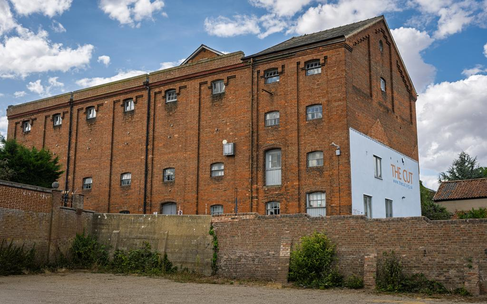

# Model Output Gallery

Generated on: 2026-08-24 23:59:44 BST

Complete per-model evidence artifact with image metadata, the source prompt, a
facts-only chooser, and full generated or crash output for every attempted
model.

## Reference Image



## Current-run Chooser

Current-run usability and captured resource facts only. Total time is end-to-end; throughput covers generation only and requires at least 16 generated tokens. Prefill/first is first-token latency when captured; Prompt tok is the full rendered prompt including image tokens, which drives prefill cost. For cross-attention architectures the token count reflects the tokenised text burden only, not total vision prefill compute.

<!-- markdownlint-disable MD034 MD037 MD049 -->

| Model                                                                                                                   | Usability             | Total s | Gen TPS    | Prefill/first s | Peak GB | Prompt tok | Gen tok | Observations                                                                                           |
|-------------------------------------------------------------------------------------------------------------------------|-----------------------|---------|------------|-----------------|---------|------------|---------|--------------------------------------------------------------------------------------------------------|
| [`LiquidAI/LFM2.5-VL-450M-MLX-bf16`](#model-liquidai-lfm25-vl-450m-mlx-bf16)                                            | `usable`              | 2.09s   | 481 tok/s  | 0.54            | 1.9     | 2,072      | 132     | none                                                                                                   |
| [`mlx-community/Devstral-Small-2-24B-Instruct-2512-5bit`](#model-mlx-community-devstral-small-2-24b-instruct-2512-5bit) | `usable`              | 11.04s  | 29.7 tok/s | 3.68            | 24      | 2,658      | 131     | none                                                                                                   |
| [`mlx-community/Idefics3-8B-Llama3-bf16`](#model-mlx-community-idefics3-8b-llama3-bf16)                                 | `usable`              | 9.75s   | 34.2 tok/s | 1.09            | 18      | 2,587      | 202     | none                                                                                                   |
| [`mlx-community/LFM2.5-VL-1.6B-bf16`](#model-mlx-community-lfm25-vl-16b-bf16)                                           | `usable`              | 2.28s   | 192 tok/s  | 0.34            | 4.0     | 2,072      | 140     | none                                                                                                   |
| [`mlx-community/Ministral-3-14B-Instruct-2512-mxfp4`](#model-mlx-community-ministral-3-14b-instruct-2512-mxfp4)         | `usable`              | 6.62s   | 66.3 tok/s | 2.25            | 14      | 3,191      | 162     | none                                                                                                   |
| [`mlx-community/Ministral-3-3B-Instruct-2512-4bit`](#model-mlx-community-ministral-3-3b-instruct-2512-4bit)             | `usable`              | 3.51s   | 184 tok/s  | 1.20            | 9.0     | 3,190      | 123     | none                                                                                                   |
| [`mlx-community/Ornith-1.0-35B-bf16`](#model-mlx-community-ornith-10-35b-bf16)                                          | `usable`              | 75.27s  | 63.9 tok/s | 62.84           | 74      | 16,482     | 122     | none                                                                                                   |
| [`mlx-community/Qwen3.5-35B-A3B-4bit`](#model-mlx-community-qwen35-35b-a3b-4bit)                                        | `usable`              | 69.17s  | 96.4 tok/s | 64.54           | 24      | 16,482     | 94      | none                                                                                                   |
| [`mlx-community/Qwen3.5-9B-MLX-4bit`](#model-mlx-community-qwen35-9b-mlx-4bit)                                          | `usable`              | 70.79s  | 90.9 tok/s | 66.92           | 10.0    | 16,482     | 102     | none                                                                                                   |
| [`mlx-community/Qwen3.8-27B-4bit`](#model-mlx-community-qwen38-27b-4bit)                                                | `usable`              | 91.08s  | 27.7 tok/s | 83.55           | 21      | 16,482     | 120     | none                                                                                                   |
| [`mlx-community/SmolVLM2-2.2B-Instruct-mlx`](#model-mlx-community-smolvlm2-22b-instruct-mlx)                            | `usable`              | 2.59s   | 126 tok/s  | 0.40            | 5.5     | 1,400      | 89      | none                                                                                                   |
| [`mlx-community/Step-3.7-Flash-oQ2e`](#model-mlx-community-step-37-flash-oq2e)                                          | `usable`              | 28.91s  | 44.2 tok/s | 18.15           | 70      | 3,468      | 114     | none                                                                                                   |
| [`mlx-community/gemma-4-26b-a4b-it-4bit`](#model-mlx-community-gemma-4-26b-a4b-it-4bit)                                 | `usable`              | 4.35s   | 126 tok/s  | 0.40            | 16      | 580        | 98      | none                                                                                                   |
| [`mlx-community/gemma-4-31b-it-4bit`](#model-mlx-community-gemma-4-31b-it-4bit)                                         | `usable`              | 9.14s   | 24.9 tok/s | 1.38            | 20      | 580        | 111     | none                                                                                                   |
| [`mlx-community/pixtral-12b-8bit`](#model-mlx-community-pixtral-12b-8bit)                                               | `usable`              | 7.37s   | 39.3 tok/s | 2.57            | 16      | 3,429      | 99      | none                                                                                                   |
| [`mlx-community/GLM-4.6V-nvfp4`](#model-mlx-community-glm-46v-nvfp4)                                                    | `usable_with_caveats` | 29.45s  | 40.7 tok/s | 18.57           | 78      | 6,311      | 96      | control tokens visible; title/keyword constraints failed                                               |
| [`mlx-community/InternVL3-8B-bf16`](#model-mlx-community-internvl3-8b-bf16)                                             | `usable_with_caveats` | 6.48s   | 36.0 tok/s | 1.74            | 17      | 3,623      | 85      | title/keyword constraints failed                                                                       |
| [`mlx-community/Kimi-VL-A3B-Thinking-2506-bf16`](#model-mlx-community-kimi-vl-a3b-thinking-2506-bf16)                   | `usable_with_caveats` | 133.22s | 4.8 tok/s  | 1.84            | 40      | 1,257      | 610     | role tokens visible                                                                                    |
| [`mlx-community/MiniCPM-V-4.6-8bit`](#model-mlx-community-minicpm-v-46-8bit)                                            | `usable_with_caveats` | 2.29s   | 266 tok/s  | 0.26            | 3.8     | 964        | 73      | title/keyword constraints failed                                                                       |
| [`mlx-community/Ministral-3-14B-Instruct-2512-nvfp4`](#model-mlx-community-ministral-3-14b-instruct-2512-nvfp4)         | `usable_with_caveats` | 7.29s   | 63.2 tok/s | 2.48            | 15      | 3,191      | 174     | title/keyword constraints failed                                                                       |
| [`mlx-community/Molmo-7B-D-0924-8bit`](#model-mlx-community-molmo-7b-d-0924-8bit)                                       | `usable_with_caveats` | 5.44s   | 52.9 tok/s | 0.86            | 11      | 1,495      | 122     | title/keyword constraints failed                                                                       |
| [`mlx-community/Phi-3.5-vision-instruct-bf16`](#model-mlx-community-phi-35-vision-instruct-bf16)                        | `usable_with_caveats` | 3.42s   | 57.1 tok/s | 0.42            | 9.6     | 1,094      | 81      | title/keyword constraints failed                                                                       |
| [`mlx-community/Qwen3-VL-2B-Thinking-bf16`](#model-mlx-community-qwen3-vl-2b-thinking-bf16)                             | `usable_with_caveats` | 33.82s  | 89.1 tok/s | 21.82           | 8.4     | 16,469     | 903     | title/keyword constraints failed                                                                       |
| [`mlx-community/Qwen3.6-27B-mxfp8`](#model-mlx-community-qwen36-27b-mxfp8)                                              | `usable_with_caveats` | 98.06s  | 16.3 tok/s | 86.66           | 33      | 16,482     | 117     | title/keyword constraints failed                                                                       |
| [`mlx-community/X-Reasoner-7B-8bit`](#model-mlx-community-x-reasoner-7b-8bit)                                           | `usable_with_caveats` | 26.69s  | 54.1 tok/s | 20.10           | 13      | 16,478     | 241     | title/keyword constraints failed                                                                       |
| [`mlx-community/diffusiongemma-26B-A4B-it-8bit`](#model-mlx-community-diffusiongemma-26b-a4b-it-8bit)                   | `usable_with_caveats` | 6.14s   | 64.8 tok/s | 0.59            | 29      | 576        | 84      | control tokens visible                                                                                 |
| [`mlx-community/diffusiongemma-26B-A4B-it-mxfp8`](#model-mlx-community-diffusiongemma-26b-a4b-it-mxfp8)                 | `usable_with_caveats` | 5.68s   | 67.1 tok/s | 0.33            | 28      | 576        | 83      | control tokens visible; title/keyword constraints failed                                               |
| [`mlx-community/gemma-3-27b-it-qat-4bit`](#model-mlx-community-gemma-3-27b-it-qat-4bit)                                 | `usable_with_caveats` | 9.26s   | 27.7 tok/s | 1.26            | 17      | 569        | 139     | title/keyword constraints failed                                                                       |
| [`Qwen/Qwen3-VL-2B-Instruct`](#model-qwen-qwen3-vl-2b-instruct)                                                         | `unusable`            | 27.27s  | 90.7 tok/s | 14.72           | 8.4     | 16,467     | 1,000   | repeated text; cut off at token limit; title/keyword constraints failed                                |
| [`mlx-community/Apriel-1.5-15b-Thinker-6bit-MLX`](#model-mlx-community-apriel-15-15b-thinker-6bit-mlx)                  | `unusable`            | 29.18s  | 40.8 tok/s | 2.37            | 15      | 3,520      | 1,000   | echoes instructions; extra text before Title; cut off at token limit; title/keyword constraints failed |
| [`mlx-community/ERNIE-4.5-VL-28B-A3B-Thinking-bf16`](#model-mlx-community-ernie-45-vl-28b-a3b-thinking-bf16)            | `unusable`            | 29.01s  | 56.1 tok/s | 2.77            | 60      | 1,584      | 1,000   | cut off at token limit; title/keyword constraints failed                                               |
| [`mlx-community/FastVLM-0.5B-bf16`](#model-mlx-community-fastvlm-05b-bf16)                                              | `unusable`            | 2.40s   | 353 tok/s  | 0.22            | 2.1     | 308        | 147     | missing required fields; echoes instructions; extra text before Title                                  |
| [`mlx-community/GLM-4.1V-9B-Thinking-8bit`](#model-mlx-community-glm-41v-9b-thinking-8bit)                              | `unusable`            | 32.32s  | 44.5 tok/s | 7.77            | 13      | 6,307      | 994     | missing required fields; extra text before Title                                                       |
| [`mlx-community/GLM-4.6V-Flash-mxfp4`](#model-mlx-community-glm-46v-flash-mxfp4)                                        | `unusable`            | 22.69s  | 74.2 tok/s | 7.24            | 8.4     | 6,311      | 1,000   | repeated text; cut off at token limit; title/keyword constraints failed                                |
| [`mlx-community/Llama-3.2-11B-Vision-Instruct-8bit`](#model-mlx-community-llama-32-11b-vision-instruct-8bit)            | `unusable`            | 57.08s  | 18.8 tok/s | 1.74            | 15      | 275        | 1,000   | repeated text; cut off at token limit; title/keyword constraints failed                                |
| [`mlx-community/MolmoPoint-8B-fp16`](#model-mlx-community-molmopoint-8b-fp16)                                           | `unusable`            | 27.90s  | 6.49 tok/s | 2.80            | 24      | 3,119      | 142     | missing required fields                                                                                |
| [`mlx-community/Qwen2-VL-2B-Instruct-4bit`](#model-mlx-community-qwen2-vl-2b-instruct-4bit)                             | `unusable`            | 77.46s  | 216 tok/s  | 71.34           | 5.1     | 16,478     | 1,000   | repeated text; cut off at token limit; title/keyword constraints failed                                |
| [`mlx-community/Qwen3-VL-2B-Instruct-bf16`](#model-mlx-community-qwen3-vl-2b-instruct-bf16)                             | `unusable`            | 33.81s  | 88.6 tok/s | 20.63           | 8.4     | 16,467     | 1,000   | repeated text; cut off at token limit; title/keyword constraints failed                                |
| [`mlx-community/gemma-3n-E4B-it-bf16`](#model-mlx-community-gemma-3n-e4b-it-bf16)                                       | `unusable`            | 7.31s   | 47.9 tok/s | 0.90            | 17      | 568        | 162     | missing required fields                                                                                |
| [`mlx-community/llava-v1.6-mistral-7b-8bit`](#model-mlx-community-llava-v16-mistral-7b-8bit)                            | `unusable`            | 4.64s   | 64.8 tok/s | 2.61            | 9.7     | 2,692      | 18      | missing required fields                                                                                |
| [`mlx-community/nanoLLaVA-1.5-4bit`](#model-mlx-community-nanollava-15-4bit)                                            | `unusable`            | 1.70s   | 300 tok/s  | 0.07            | 2.3     | 304        | 151     | missing required fields; echoes instructions                                                           |
| [`mlx-community/paligemma2-3b-pt-896-4bit`](#model-mlx-community-paligemma2-3b-pt-896-4bit)                             | `unusable`            | 25.70s  | 44.8 tok/s | 1.33            | 4.4     | 4,397      | 1,000   | repeated text; missing required fields; echoes instructions; cut off at token limit                    |
<!-- markdownlint-enable MD034 MD037 MD049 -->

## Resource Highlights

Fastest clean completion: `LiquidAI/LFM2.5-VL-450M-MLX-bf16` at 481 tok/s

Average clean-completion throughput: 108 tok/s (indicative only: tokenizers and architectures differ across models)

Lowest peak memory among clean completions: `LiquidAI/LFM2.5-VL-450M-MLX-bf16` at 1.9 GB

## Avoid for This Run

<!-- markdownlint-disable MD034 MD037 MD049 -->

| Model                                                                                                        | Usability  | Observations                                                                                           |
|--------------------------------------------------------------------------------------------------------------|------------|--------------------------------------------------------------------------------------------------------|
| [`Qwen/Qwen3-VL-2B-Instruct`](#model-qwen-qwen3-vl-2b-instruct)                                              | `unusable` | repeated text; cut off at token limit; title/keyword constraints failed                                |
| [`mlx-community/Apriel-1.5-15b-Thinker-6bit-MLX`](#model-mlx-community-apriel-15-15b-thinker-6bit-mlx)       | `unusable` | echoes instructions; extra text before Title; cut off at token limit; title/keyword constraints failed |
| [`mlx-community/ERNIE-4.5-VL-28B-A3B-Thinking-bf16`](#model-mlx-community-ernie-45-vl-28b-a3b-thinking-bf16) | `unusable` | cut off at token limit; title/keyword constraints failed                                               |
| [`mlx-community/FastVLM-0.5B-bf16`](#model-mlx-community-fastvlm-05b-bf16)                                   | `unusable` | missing required fields; echoes instructions; extra text before Title                                  |
| [`mlx-community/GLM-4.1V-9B-Thinking-8bit`](#model-mlx-community-glm-41v-9b-thinking-8bit)                   | `unusable` | missing required fields; extra text before Title                                                       |
| [`mlx-community/GLM-4.6V-Flash-mxfp4`](#model-mlx-community-glm-46v-flash-mxfp4)                             | `unusable` | repeated text; cut off at token limit; title/keyword constraints failed                                |
| [`mlx-community/Llama-3.2-11B-Vision-Instruct-8bit`](#model-mlx-community-llama-32-11b-vision-instruct-8bit) | `unusable` | repeated text; cut off at token limit; title/keyword constraints failed                                |
| [`mlx-community/MolmoPoint-8B-fp16`](#model-mlx-community-molmopoint-8b-fp16)                                | `unusable` | missing required fields                                                                                |
| [`mlx-community/Qwen2-VL-2B-Instruct-4bit`](#model-mlx-community-qwen2-vl-2b-instruct-4bit)                  | `unusable` | repeated text; cut off at token limit; title/keyword constraints failed                                |
| [`mlx-community/Qwen3-VL-2B-Instruct-bf16`](#model-mlx-community-qwen3-vl-2b-instruct-bf16)                  | `unusable` | repeated text; cut off at token limit; title/keyword constraints failed                                |
| [`mlx-community/gemma-3n-E4B-it-bf16`](#model-mlx-community-gemma-3n-e4b-it-bf16)                            | `unusable` | missing required fields                                                                                |
| [`mlx-community/llava-v1.6-mistral-7b-8bit`](#model-mlx-community-llava-v16-mistral-7b-8bit)                 | `unusable` | missing required fields                                                                                |
| [`mlx-community/nanoLLaVA-1.5-4bit`](#model-mlx-community-nanollava-15-4bit)                                 | `unusable` | missing required fields; echoes instructions                                                           |
| [`mlx-community/paligemma2-3b-pt-896-4bit`](#model-mlx-community-paligemma2-3b-pt-896-4bit)                  | `unusable` | repeated text; missing required fields; echoes instructions; cut off at token limit                    |
<!-- markdownlint-enable MD034 MD037 MD049 -->

## Output at a Glance

The first 280 characters of each model's actual output (or failure evidence for crashes), in chooser order. Complete exact evidence for every model follows below.

<!-- markdownlint-disable MD034 MD037 MD049 -->

| Model                                                                                                                   | Usability             | Output preview                                                                                                                                                                                                                                                                                                                     |
|-------------------------------------------------------------------------------------------------------------------------|-----------------------|------------------------------------------------------------------------------------------------------------------------------------------------------------------------------------------------------------------------------------------------------------------------------------------------------------------------------------|
| [`LiquidAI/LFM2.5-VL-450M-MLX-bf16`](#model-liquidai-lfm25-vl-450m-mlx-bf16)                                            | `usable`              | Title:<br>Seafront, Felixstowe, England, UK, GBR, Europe<br><br>Description:<br>A tall, white column stands prominently on a coastal promenade, overlooking the sea. The column is adorned with a statue of an eagle perched atop, and a string of colorful lights runs along its base. The scene...                               |
| [`mlx-community/Devstral-Small-2-24B-Instruct-2512-5bit`](#model-mlx-community-devstral-small-2-24b-instruct-2512-5bit) | `usable`              | Title:<br>War Memorial by the Sea<br><br>Description:<br>A tall stone war memorial column topped with a winged figure stands on a seafront promenade in Felixstowe, England, overlooking the North Sea. The monument is flanked by a lamp post with barbed wire decorations and surrounded by roc...                               |
| [`mlx-community/Idefics3-8B-Llama3-bf16`](#model-mlx-community-idefics3-8b-llama3-bf16)                                 | `usable`              | Title: Felixstowe Seafront Monument with Ocean View.<br>Description: The image depicts a monument situated on the seafront in Felixstowe, England, UK. The monument is a tall, white column with a Doric column style, topped with a statue of an eagle. The column is surrounded by a c...                                        |
| [`mlx-community/LFM2.5-VL-1.6B-bf16`](#model-mlx-community-lfm25-vl-16b-bf16)                                           | `usable`              | Title: Seafront War Memorial, Felixstowe, England, UK, GBR<br><br>Description: A war memorial stands prominently on a seaside promenade in Felixstowe, England, overlooking the ocean. The monument features a tall column topped with an eagle statue, surrounded by a decorative light fi...                                     |
| [`mlx-community/Ministral-3-14B-Instruct-2512-mxfp4`](#model-mlx-community-ministral-3-14b-instruct-2512-mxfp4)         | `usable`              | Title:<br>**Felixstowe War Memorial and Seafront View**<br><br>Description:<br>A tall classical war memorial column stands prominently on Felixstowe’s seafront, overlooking the ocean under clear blue skies. The monument features engraved plaques and a bronze eagle finial, with two modern...                                |
| [`mlx-community/Ministral-3-3B-Instruct-2512-4bit`](#model-mlx-community-ministral-3-3b-instruct-2512-4bit)             | `usable`              | Title:<br>War Memorial Column at Felixstowe Seafront<br><br>Description:<br>A tall, classical column stands prominently at the seafront of Felixstowe, England, dedicated to honoring fallen soldiers. It features inscriptions, a sculpted eagle atop, and is surrounded by coastal rocks under...                                |
| [`mlx-community/Ornith-1.0-35B-bf16`](#model-mlx-community-ornith-10-35b-bf16)                                          | `usable`              | Title: War memorial column on Felixstowe seafront<br><br>Description: A tall fluted stone column topped with a bronze eagle stands on a stepped plinth inscribed with names, set against the blue sea and clear sky at Felixstowe seafront. Festive coloured light strings and a modern com...                                     |
| [`mlx-community/Qwen3.5-35B-A3B-4bit`](#model-mlx-community-qwen35-35b-a3b-4bit)                                        | `usable`              | Title: War Memorial Column on Felixstowe Seafront<br><br>Description: A tall stone column topped with a bronze eagle stands on a plinth inscribed with names, situated on a paved promenade overlooking the sea under a clear blue sky.<br><br>Keywords: Felixstowe, seafront, war memorial, colu...                               |
| [`mlx-community/Qwen3.5-9B-MLX-4bit`](#model-mlx-community-qwen35-9b-mlx-4bit)                                          | `usable`              | Title: Felixstowe Seafront Memorial Column with Eagle<br><br>Description: A tall stone column topped with an eagle statue stands on a seafront promenade in Felixstowe, England, under a clear blue sky, with the sea and rocky shoreline visible in the background.<br><br>Keywords: Felixstowe,...                               |
| [`mlx-community/Qwen3.8-27B-4bit`](#model-mlx-community-qwen38-27b-4bit)                                                | `usable`              | Title:<br>War Memorial Column on the Felixstowe Seafront<br><br>Description:<br>A tall, fluted stone column topped with a bronze eagle stands on a stepped plinth inscribed with names, overlooking the calm sea. The scene is set on a sunny day with a clear blue sky, featuring a blue lamppos...                               |
| [`mlx-community/SmolVLM2-2.2B-Instruct-mlx`](#model-mlx-community-smolvlm2-22b-instruct-mlx)                            | `usable`              | Title:<br>Seafront, Felixstowe, England, UK, GBR, Europe<br>Description:<br>A tall, white column stands on a rocky beach, overlooking the ocean. The column is topped with a statue of an eagle, and there are several plaques on the column.<br>Keywords:<br>Felixstowe, England, UK, GBR, Europe,...                             |
| [`mlx-community/Step-3.7-Flash-oQ2e`](#model-mlx-community-step-37-flash-oq2e)                                          | `usable`              | Title:<br>Column monument on Felixstowe seafront<br><br>Description:<br>A tall column monument topped with a bird statue stands on a paved seafront area in Felixstowe, Suffolk, England, overlooking the ocean under a clear blue sky, with two men walking nearby and decorative streetlights a...                               |
| [`mlx-community/gemma-4-26b-a4b-it-4bit`](#model-mlx-community-gemma-4-26b-a4b-it-4bit)                                 | `usable`              | Title: War Memorial Column on Felixstowe Seafront<br>Description: A tall stone war memorial column topped with a bird sculpture stands against a clear blue sky on the Felixstowe seafront. The monument features inscribed plaques and is set against a backdrop of the sea and rocky c...                                        |
| [`mlx-community/gemma-4-31b-it-4bit`](#model-mlx-community-gemma-4-31b-it-4bit)                                         | `usable`              | Title: War Memorial on the Seafront in Felixstowe, Suffolk<br>Description: A tall, fluted Corinthian column topped with an eagle sculpture stands on the seafront in Felixstowe, England, under a clear blue sky. The monument features inscribed plaques at its base, overlooking the c...                                        |
| [`mlx-community/pixtral-12b-8bit`](#model-mlx-community-pixtral-12b-8bit)                                               | `usable`              | Title:<br>Seafront Monument in Felixstowe, England<br><br>Description:<br>A tall column monument with an eagle statue at the top stands prominently by the seaside in Felixstowe, England, with a clear blue sky and calm sea in the background.<br><br>Keywords:<br>Felixstowe, England, UK, seafront, mo...                      |
| [`mlx-community/GLM-4.6V-nvfp4`](#model-mlx-community-glm-46v-nvfp4)                                                    | `usable_with_caveats` | <\|begin_of_box\|>Title: Seafront monument, Felixstowe, England<br>Description: A tall stone column with an eagle statue atop stands on a paved plaza by the sea, with rocky shores, the ocean, and two men walking in the background under a clear blue sky.<br>Keywords: seafront, Felixsto...                                   |
| [`mlx-community/InternVL3-8B-bf16`](#model-mlx-community-internvl3-8b-bf16)                                             | `usable_with_caveats` | Title: Felixstowe Seafront Monument<br>Description: A tall column with an eagle statue stands on a seafront promenade in Felixstowe, England, under clear blue skies, with people walking nearby and festive lights strung overhead.<br>Keywords: Felixstowe, seafront, monument, eagle sta...                                     |
| [`mlx-community/Kimi-VL-A3B-Thinking-2506-bf16`](#model-mlx-community-kimi-vl-a3b-thinking-2506-bf16)                   | `usable_with_caveats` | ◁think▷Got it, let's tackle this. First, I need to create a British-English catalogue metadata based on the image and the provided context. Let's start by analyzing the image. The image shows a tall column monument by the sea, likely a war memorial, with an eagle statue on top...                                           |
| [`mlx-community/MiniCPM-V-4.6-8bit`](#model-mlx-community-minicpm-v-46-8bit)                                            | `usable_with_caveats` | &lt;think&gt;<br><br>&lt;/think&gt;<br><br>Title:<br>War Memorial by Seafront<br><br>Description:<br>A tall war memorial stands by the sea, under clear skies, with people walking nearby.<br><br>Keywords: war memorial, seafront, Felixstowe, England, UK, gbr, ocean, rocks, pedestrians, clear sky, decorative lights, ston... |
| [`mlx-community/Ministral-3-14B-Instruct-2512-nvfp4`](#model-mlx-community-ministral-3-14b-instruct-2512-nvfp4)         | `usable_with_caveats` | **Title:**<br>*Felixstowe War Memorial, Seafront, Suffolk, UK*<br><br>**Description:**<br>A classical stone column monument dedicated to WWI and WWII servicemen stands on Felixstowe’s seafront, overlooking the North Sea under clear daylight. Decorated with inscriptions, plaques, and toppe...                               |
| [`mlx-community/Molmo-7B-D-0924-8bit`](#model-mlx-community-molmo-7b-d-0924-8bit)                                       | `usable_with_caveats` | Title: Felixstowe Seafront, England, UK, GBR<br><br>Description: A man in a blue shirt walks along a concrete path near a tall white column with a bird statue, surrounded by rocks and water, with a blue pole and string lights in the background. The scene is bathed in warm sunlight,...                                      |
| [`mlx-community/Phi-3.5-vision-instruct-bf16`](#model-mlx-community-phi-35-vision-instruct-bf16)                        | `usable_with_caveats` | Title: Felixstowe Seafront Monument<br><br>Description: A prominent white column with a bird sculpture at the top stands at the seafront in Felixstowe, England, UK, with a clear blue sky and the sea in the background.<br><br>Keywords: Felixstowe, seafront, monument, column, bird sculpture...                               |
| [`mlx-community/Qwen3-VL-2B-Thinking-bf16`](#model-mlx-community-qwen3-vl-2b-thinking-bf16)                             | `usable_with_caveats` | Got it, let's tackle this step by step. First, the title. The context says Felixstowe, England, UK, so we need a concise title. The main subject is the memorial column. Let's see: "Felixstowe Seafront Memorial Column" – that's 10 words, which is good.<br><br>Next, the description. N...                                     |
| [`mlx-community/Qwen3.6-27B-mxfp8`](#model-mlx-community-qwen36-27b-mxfp8)                                              | `usable_with_caveats` | Title:<br>Felixstowe War Memorial Column by the Seafront<br><br>Description:<br>A tall stone column topped with a bronze bird statue stands on a paved promenade overlooking the sea. The monument features inscribed plaques and is situated near a blue lamppost with festive lights, under a c...                               |
| [`mlx-community/X-Reasoner-7B-8bit`](#model-mlx-community-x-reasoner-7b-8bit)                                           | `usable_with_caveats` | Title:<br>Felixstowe War Memorial, Seafront<br><br>Description:<br>A tall, ornate war memorial stands on the seafront at Felixstowe, East Suffolk, UK, with a bronze eagle perched atop, set against a clear blue sky and the calm sea. The structure bears inscriptions and plaques, marking its...                               |
| [`mlx-community/diffusiongemma-26B-A4B-it-8bit`](#model-mlx-community-diffusiongemma-26b-a4b-it-8bit)                   | `usable_with_caveats` | <\|channel>thought<br><channel\|>Title: War Memorial Column on the Felixstowe Seafront, England<br>Description: A tall fluted stone column topped with a bronze eagle stands on the coastal promenade overlooking the sea under a clear blue sky.<br>Keywords: Felixstowe, Suffolk, England, UK,...                                |
| [`mlx-community/diffusiongemma-26B-A4B-it-mxfp8`](#model-mlx-community-diffusiongemma-26b-a4b-it-mxfp8)                 | `usable_with_caveats` | <\|channel>thought<br><channel\|>Title: War Memorial Column on the Felixstowe Seafront England<br>Description: A fluted stone war memorial topped with a bronze eagle stands on the Felixstowe seafront under a clear blue sky.<br>Keywords: Felixstowe, Suffolk, East Suffolk, UK, seafront, wa...                                |
| [`mlx-community/gemma-3-27b-it-qat-4bit`](#model-mlx-community-gemma-3-27b-it-qat-4bit)                                 | `usable_with_caveats` | Title: Felixstowe Seafront War Memorial, Suffolk<br><br>Description: Captured on 13th August 2026, this photograph shows the War Memorial on Felixstowe seafront, Suffolk, bathed in bright sunlight with the North Sea visible beyond. The memorial stands prominently on a stone plinth,...                                      |
| [`Qwen/Qwen3-VL-2B-Instruct`](#model-qwen-qwen3-vl-2b-instruct)                                                         | `unusable`            | Title:<br>Felixstowe Seafront Memorial<br><br>Description:<br>A stone memorial column stands at the seafront in Felixstowe, England, topped with a bronze eagle, commemorating the 1939-1945 war, with plaques listing names and a blue lamppost nearby under a clear blue sky.<br><br>Keywords: Felixs...                         |
| [`mlx-community/Apriel-1.5-15b-Thinker-6bit-MLX`](#model-mlx-community-apriel-15-15b-thinker-6bit-mlx)                  | `unusable`            | Here are my reasoning steps:<br>The user wants British-English catalogue metadata from the image and supplied context. They want:<br><br>- Title: a concrete 5-10-word title.<br>- Description: 1-2 sentences factual description combining relevant context with main visible subject, setting,...                                |
| [`mlx-community/ERNIE-4.5-VL-28B-A3B-Thinking-bf16`](#model-mlx-community-ernie-45-vl-28b-a3b-thinking-bf16)            | `unusable`            | Alright, let's get to work. I've got an image of a seaside scene, and I need to generate some metadata for it. First things first, I need to break down the request. The core task is to create a title, description, and keywords for this image, all in British English. The image...                                            |
| [`mlx-community/FastVLM-0.5B-bf16`](#model-mlx-community-fastvlm-05b-bf16)                                              | `unusable`            | A concrete 5-10-word title: "Felixstowe, UK, Seafront, GBR, East Suffolk, England, Europe, GBR, Seafront"<br>Description: The image features a prominent 5-10-word title describing a concrete 5-10-word description of a seafront in Felixstowe, UK, with a GBR (Great Britain) locatio...                                        |
| [`mlx-community/GLM-4.1V-9B-Thinking-8bit`](#model-mlx-community-glm-41v-9b-thinking-8bit)                              | `unusable`            | &lt;think&gt;Got it, let's tackle this. First, the title needs to be 5-10 words. The image shows a monument by the sea, so maybe "Felixstowe Seafront Monument". Then the description should combine context (date, location) with the main subject (monument), setting (seafront), action...                                      |
| [`mlx-community/GLM-4.6V-Flash-mxfp4`](#model-mlx-community-glm-46v-flash-mxfp4)                                        | `unusable`            | Title: Felixstowe War Memorial<br>Description: The Felixstowe War Memorial, a tall stone column topped with an eagle, stands by the seafront in Felixstowe, England.<br>Keywords: Felixstowe War Memorial, seafront, Felixstowe, Suffolk, England, UK, gbr, Europe, war memorial, stone col...                                     |
| [`mlx-community/Llama-3.2-11B-Vision-Instruct-8bit`](#model-mlx-community-llama-32-11b-vision-instruct-8bit)            | `unusable`            | Title:<br>Felixstowe Seafront Memorial Column<br><br>Description:<br>The image features a prominent memorial column situated on the seafront in Felixstowe, England, with a columnar structure and a bird statue at the top, set against a clear blue sky and the calm sea in the background.<br><br>Ke...                         |
| [`mlx-community/MolmoPoint-8B-fp16`](#model-mlx-community-molmopoint-8b-fp16)                                           | `unusable`            | Felixstowe War Memorial, East Suffolk Coast<br><br>The image shows a war memorial monument on a rocky seafront in Felixstowe, England. A tall white column with an eagle statue stands prominently, surrounded by a stone base with plaques. The memorial overlooks the ocean, with a clear...                                     |
| [`mlx-community/Qwen2-VL-2B-Instruct-4bit`](#model-mlx-community-qwen2-vl-2b-instruct-4bit)                             | `unusable`            | Title:<br>Seafront, Felixstowe, England, UK, GBR, Europe<br><br>Description:<br>The Seafront of Felixstowe, England, UK, GBR, Europe, features a prominent seafront monument with a stone column and a bird statue on top. The monument is situated near the sea, with a clear blue sky and a cal...                               |
| [`mlx-community/Qwen3-VL-2B-Instruct-bf16`](#model-mlx-community-qwen3-vl-2b-instruct-bf16)                             | `unusable`            | Title:<br>Felixstowe Seafront Memorial<br><br>Description:<br>A stone memorial column stands at the seafront in Felixstowe, England, topped with a bronze eagle, commemorating the 1939-1945 war, with plaques listing names and a blue lamppost nearby under a clear blue sky.<br><br>Keywords: Felixs...                         |
| [`mlx-community/gemma-3n-E4B-it-bf16`](#model-mlx-community-gemma-3n-e4b-it-bf16)                                       | `unusable`            | A tall, light-colored stone monument stands prominently on a rocky coastline under a clear blue sky. The monument features a fluted column topped with a bronze eagle with outstretched wings. The base of the monument is multi-tiered and adorned with several dark plaques bearing...                                           |
| [`mlx-community/llava-v1.6-mistral-7b-8bit`](#model-mlx-community-llava-v16-mistral-7b-8bit)                            | `unusable`            | Seafront, Felixstowe, England, UK, GBR, Europe,                                                                                                                                                                                                                                                                                    |
| [`mlx-community/nanoLLaVA-1.5-4bit`](#model-mlx-community-nanollava-15-4bit)                                            | `unusable`            | Title: Seafront, Felixstowe, England, UK, GBR, Europe<br>Description: A concrete 5-10-word title, followed by a 1-2-sentence factual description that combines relevant context with the main visible subject, setting, action, lighting, and distinctive details. The description inclu...                                        |
| [`mlx-community/paligemma2-3b-pt-896-4bit`](#model-mlx-community-paligemma2-3b-pt-896-4bit)                             | `unusable`            | - Adobe Stock, Any Vision, East Suffolk, England, Europe, Felixstowe, Suffolk, UK, GBR,<br>- Description hint: Seafront, Felixstowe, England, UK, GBR,<br>- Description hint: Seafront, Felixstowe, England, UK, GBR,<br>- Keyword hints: Adobe Stock, Any Vision, East Suffolk, England, Euro...                                  |
<!-- markdownlint-enable MD034 MD037 MD049 -->

## Run Stamps

- `mlx-vlm`: `0.6.16`
- `mlx`: `0.32.2.dev20260824+43d2f06cb`
- `mlx-lm`: `0.32.0`
- `transformers`: `5.15.1`
- `tokenizers`: `0.22.2`
- `huggingface-hub`: `1.28.0`
- *Python Version:* 3.14.7
- *OS:* Darwin 25.6.0
- *macOS Version:* 26.6.2
- *GPU/Chip:* Apple M5 Max
- *MLX Device:* Apple M5 Max
- *GPU Architecture:* applegpu_g17s
- *RAM:* 128.0 GB
- *Recommended Working Set:* 108 GB
- *Fused Attention:* Available

## Image Metadata

- *Title:* , Seafront, Felixstowe, England, UK, GBR, Europe
- *Description:* , Seafront, Felixstowe, England, UK, GBR
- *Keywords:* Adobe Stock, Any Vision, East Suffolk, England, Europe,
  Felixstowe, Suffolk, UK, gbr, seafront
- *Date:* 2026-08-13 17:14:49 UTC+01:00
- *Time:* 17:14:49
- *GPS:* 51.959333°N, 1.349050°E

## Prompt

<!-- markdownlint-disable MD011 MD028 MD037 MD045 -->
>
> Create British-English catalogue metadata from the image and supplied
> context.
>
> Treat any capture date/time and GPS as authoritative facts, but do not claim
> they are visible. Descriptive hints may be incomplete or wrong: retain
> details supported by the image, correct conflicts, and add important visible
> details. Prefer image evidence when a hint conflicts, and omit uncertain
> details.
>
> Context: Authoritative context:
> &#45; Capture date/time: 2026-08-13 17:14:49 UTC+01:00
> &#45; GPS: 51.959333°N, 1.349050°E
>
> &#8203;Descriptive hints:
> &#45; Title hint: Seafront, Felixstowe, England, UK, GBR, Europe
> &#45; Description hint: Seafront, Felixstowe, England, UK, GBR
> &#45; Keyword hints: Adobe Stock, Any Vision, East Suffolk, England, Europe,
> Felixstowe, Suffolk, UK, gbr, seafront
>
> &#8203;Write:
> &#45; a concrete 5-10-word title;
> &#45; a 1-2-sentence factual description combining relevant context with the
> main visible subject, setting, action, lighting, and distinctive details;
> &#45; 10-18 unique, comma-separated keywords covering relevant context and
> visible details.
>
> &#8203;Return exactly these three sections and nothing else:
> &#8203;Title:
> &#8203;Description:
> &#8203;Keywords:
<!-- markdownlint-enable MD011 MD028 MD037 MD045 -->

## Complete Per-model Evidence

Complete generated or crash evidence for every attempted model.

<a id="model-liquidai-lfm25-vl-450m-mlx-bf16"></a>

### LiquidAI/LFM2.5-VL-450M-MLX-bf16

<details>
<summary>Complete evidence: LiquidAI/LFM2.5-VL-450M-MLX-bf16</summary>

- *Execution:* completed
- *Usability:* usable
- *Maintainer status:* none
- *Observations:* none
- *Arch supported by installed mlx-vlm:* yes (model_type lfm2-vl via lfm2_vl)
- *Model load time:* 0.58s
- *Generation time:* 1.24s
- *Total time:* 2.09s
- *Input validation time:* 0.268
- *Prompt preparation time:* 0.00723
- *First-token latency:* 0.54
- *Cleanup time:* 0.0684
- *Prompt tokens:* 2,072
- *Generation tokens:* 132
- *Total tokens:* 2,204
- *Prompt throughput (raw):* 3,840 tok/s
- *Generation throughput (raw):* 481 tok/s
- *Peak memory:* 1.9
- *Active memory:* 0.90
- *Cache memory:* 0.08
- *Model-load active memory:* 0.897
- *Post-cleanup active memory:* 0.000132
- *Post-cleanup cache memory:* 0.0
- *Stop reason:* completed
- *Requested maximum tokens:* 1000
- *Rendered prompt characters:* 1183
- *Image placeholders:* 1
- *Processed image:* not captured
- *Image patch count:* not captured
- *Processor:* transformers.models.lfm2_vl.processing_lfm2_vl.Lfm2VlProcessor
- *Tokenizer:* transformers.tokenization_utils_tokenizers.TokenizersBackend
- *Requested model revision:* not requested
- *Resolved model revision:* ed71acdae0799c98cb450787d049d1343b65cd52
- *Resolved snapshot path:* ~/.cache/huggingface/hub/models--LiquidAI--LFM2.5-VL-450M-MLX-bf16/snapshots/ed71acdae0799c98cb450787d049d1343b65cd52
- *Generation settings:* {"max_tokens": 1000, "prefill_step_size": 2048,
  "temperature": 0.0, "top_p": 1.0}
- *EOS token:* <\|im_end\|>

*Readable output:*

<pre class="model-output-readable">
Title:
Seafront, Felixstowe, England, UK, GBR, Europe

Description:
A tall, white column stands prominently on a coastal promenade, overlooking the sea. The column is adorned with a statue of an eagle perched atop, and a string of colorful lights runs along its base. The scene is set against a clear blue sky, with a few people walking along the promenade, and the ocean stretches out in the background.

Keywords:
Seafront, Felixstowe, England, UK, GBR, Europe, statue, eagle, coastal promenade, lights, sky, sea
</pre>

</details>

---

<a id="model-mlx-community-devstral-small-2-24b-instruct-2512-5bit"></a>

### mlx-community/Devstral-Small-2-24B-Instruct-2512-5bit

<details>
<summary>Complete evidence: mlx-community/Devstral-Small-2-24B-Instruct-2512-5bit</summary>

- *Execution:* completed
- *Usability:* usable
- *Maintainer status:* none
- *Observations:* none
- *Arch supported by installed mlx-vlm:* yes (model_type mistral3)
- *Model load time:* 2.40s
- *Generation time:* 8.63s
- *Total time:* 11.04s
- *Input validation time:* 6.4e-05
- *Prompt preparation time:* 0.00744
- *First-token latency:* 3.68
- *Cleanup time:* 0.111
- *Prompt tokens:* 2,658
- *Generation tokens:* 131
- *Total tokens:* 2,789
- *Prompt throughput (raw):* 723 tok/s
- *Generation throughput (raw):* 29.7 tok/s
- *Peak memory:* 24
- *Active memory:* 18
- *Cache memory:* 0.52
- *Model-load active memory:* 18
- *Post-cleanup active memory:* 0.000968
- *Post-cleanup cache memory:* 0.0
- *Stop reason:* completed
- *Requested maximum tokens:* 1000
- *Rendered prompt characters:* 1132
- *Image placeholders:* 0
- *Processed image:* not captured
- *Image patch count:* not captured
- *Processor:* mlx_vlm.models.mistral3.processing_mistral3.Mistral3Processor
- *Tokenizer:* transformers.tokenization_utils_tokenizers.TokenizersBackend
- *Requested model revision:* not requested
- *Resolved model revision:* 0a970d20ad7da57b0e2accc35c5b8628f5d02063
- *Resolved snapshot path:* ~/.cache/huggingface/hub/models--mlx-community--Devstral-Small-2-24B-Instruct-2512-5bit/snapshots/0a970d20ad7da57b0e2accc35c5b8628f5d02063
- *Generation settings:* {"max_tokens": 1000, "prefill_step_size": 2048,
  "temperature": 0.0, "top_p": 1.0}
- *EOS token:* &lt;/s&gt;

*Readable output:*

<pre class="model-output-readable">
Title:
War Memorial by the Sea

Description:
A tall stone war memorial column topped with a winged figure stands on a seafront promenade in Felixstowe, England, overlooking the North Sea. The monument is flanked by a lamp post with barbed wire decorations and surrounded by rocky outcrops, with people walking nearby under a clear blue sky.

Keywords:
war memorial, seafront, Felixstowe, England, UK, North Sea, stone column, winged figure, barbed wire, lamp post, rocky outcrops, promenade, clear sky, people walking, historical monument, coastal view, Suffolk, Europe
</pre>

</details>

---

<a id="model-mlx-community-idefics3-8b-llama3-bf16"></a>

### mlx-community/Idefics3-8B-Llama3-bf16

<details>
<summary>Complete evidence: mlx-community/Idefics3-8B-Llama3-bf16</summary>

- *Execution:* completed
- *Usability:* usable
- *Maintainer status:* none
- *Observations:* none
- *Arch supported by installed mlx-vlm:* yes (model_type idefics3)
- *Model load time:* 2.12s
- *Generation time:* 7.63s
- *Total time:* 9.75s
- *Input validation time:* 6.63e-05
- *Prompt preparation time:* 0.00165
- *First-token latency:* 1.09
- *Cleanup time:* 0.115
- *Prompt tokens:* 2,587
- *Generation tokens:* 202
- *Total tokens:* 2,789
- *Prompt throughput (raw):* 2,373 tok/s
- *Generation throughput (raw):* 34.2 tok/s
- *Peak memory:* 18
- *Active memory:* 17
- *Cache memory:* 0.43
- *Model-load active memory:* 16.9
- *Post-cleanup active memory:* 0.00269
- *Post-cleanup cache memory:* 0.0
- *Stop reason:* completed
- *Requested maximum tokens:* 1000
- *Rendered prompt characters:* 1169
- *Image placeholders:* 1
- *Processed image:* not captured
- *Image patch count:* not captured
- *Processor:* mlx_vlm.models.idefics3.processing_idefics3.Idefics3Processor
- *Tokenizer:* transformers.tokenization_utils_tokenizers.TokenizersBackend
- *Requested model revision:* not requested
- *Resolved model revision:* 8c2a30c48864f3251701b7bde40f601d25535098
- *Resolved snapshot path:* ~/.cache/huggingface/hub/models--mlx-community--Idefics3-8B-Llama3-bf16/snapshots/8c2a30c48864f3251701b7bde40f601d25535098
- *Generation settings:* {"max_tokens": 1000, "prefill_step_size": 2048,
  "temperature": 0.0, "top_p": 1.0}
- *EOS token:* <\|end_of_text\|>

*Readable output:*

<pre class="model-output-readable">
 Title: Felixstowe Seafront Monument with Ocean View.
Description: The image depicts a monument situated on the seafront in Felixstowe, England, UK. The monument is a tall, white column with a Doric column style, topped with a statue of an eagle. The column is surrounded by a circular base and has a plaque with inscriptions. In the background, the vast expanse of the ocean stretches towards the horizon, meeting the clear blue sky. To the left of the monument, there are two people standing on a stone embankment, overlooking the sea. The lighting suggests it is either early morning or late afternoon, with the sun casting soft shadows. The scene is serene and picturesque, capturing the beauty of the coastal landscape.
Keywords: Felixstowe, seafront, England, UK, monument, Doric column, eagle statue, ocean, plaque, inscriptions, stone embankment, coastal landscape, serene, picturesque, early morning, late afternoon, soft shadows.
</pre>

</details>

---

<a id="model-mlx-community-lfm25-vl-16b-bf16"></a>

### mlx-community/LFM2.5-VL-1.6B-bf16

<details>
<summary>Complete evidence: mlx-community/LFM2.5-VL-1.6B-bf16</summary>

- *Execution:* completed
- *Usability:* usable
- *Maintainer status:* none
- *Observations:* none
- *Arch supported by installed mlx-vlm:* yes (model_type lfm2_vl)
- *Model load time:* 0.76s
- *Generation time:* 1.51s
- *Total time:* 2.28s
- *Input validation time:* 6.66e-05
- *Prompt preparation time:* 0.00385
- *First-token latency:* 0.337
- *Cleanup time:* 0.0858
- *Prompt tokens:* 2,072
- *Generation tokens:* 140
- *Total tokens:* 2,212
- *Prompt throughput (raw):* 6,156 tok/s
- *Generation throughput (raw):* 192 tok/s
- *Peak memory:* 4.0
- *Active memory:* 3.2
- *Cache memory:* 0.06
- *Model-load active memory:* 3.2
- *Post-cleanup active memory:* 0.00379
- *Post-cleanup cache memory:* 0.0
- *Stop reason:* completed
- *Requested maximum tokens:* 1000
- *Rendered prompt characters:* 1183
- *Image placeholders:* 1
- *Processed image:* not captured
- *Image patch count:* not captured
- *Processor:* transformers.models.lfm2_vl.processing_lfm2_vl.Lfm2VlProcessor
- *Tokenizer:* transformers.tokenization_utils_tokenizers.TokenizersBackend
- *Requested model revision:* not requested
- *Resolved model revision:* 16a710cf8afca206ff16a95a4ad6fe657f876ce1
- *Resolved snapshot path:* ~/.cache/huggingface/hub/models--mlx-community--LFM2.5-VL-1.6B-bf16/snapshots/16a710cf8afca206ff16a95a4ad6fe657f876ce1
- *Generation settings:* {"max_tokens": 1000, "prefill_step_size": 2048,
  "temperature": 0.0, "top_p": 1.0}
- *EOS token:* <\|im_end\|>

*Readable output:*

<pre class="model-output-readable">
Title: Seafront War Memorial, Felixstowe, England, UK, GBR

Description: A war memorial stands prominently on a seaside promenade in Felixstowe, England, overlooking the ocean. The monument features a tall column topped with an eagle statue, surrounded by a decorative light fixture and a plaque listing names of the fallen. The scene is bathed in bright daylight, with clear blue skies and a few people strolling along the path.

Keywords: Seafront, Felixstowe, England, UK, GBR, War Memorial, Eagle Statue, Light Fixture, Plaque, Ocean View, Promenade, Daylight, People
</pre>

</details>

---

<a id="model-mlx-community-ministral-3-14b-instruct-2512-mxfp4"></a>

### mlx-community/Ministral-3-14B-Instruct-2512-mxfp4

<details>
<summary>Complete evidence: mlx-community/Ministral-3-14B-Instruct-2512-mxfp4</summary>

- *Execution:* completed
- *Usability:* usable
- *Maintainer status:* none
- *Observations:* none
- *Arch supported by installed mlx-vlm:* yes (model_type mistral3)
- *Model load time:* 1.45s
- *Generation time:* 5.16s
- *Total time:* 6.62s
- *Input validation time:* 5.91e-05
- *Prompt preparation time:* 0.00754
- *First-token latency:* 2.25
- *Cleanup time:* 0.101
- *Prompt tokens:* 3,191
- *Generation tokens:* 162
- *Total tokens:* 3,353
- *Prompt throughput (raw):* 1,417 tok/s
- *Generation throughput (raw):* 66.3 tok/s
- *Peak memory:* 14
- *Active memory:* 8.0
- *Cache memory:* 0.65
- *Model-load active memory:* 8.01
- *Post-cleanup active memory:* 0.0051
- *Post-cleanup cache memory:* 0.0
- *Stop reason:* completed
- *Requested maximum tokens:* 1000
- *Rendered prompt characters:* 3570
- *Image placeholders:* 0
- *Processed image:* not captured
- *Image patch count:* not captured
- *Processor:* mlx_vlm.models.mistral3.processing_mistral3.Mistral3Processor
- *Tokenizer:* transformers.tokenization_utils_tokenizers.TokenizersBackend
- *Requested model revision:* not requested
- *Resolved model revision:* 7c992876448fc5426841a85c6eb951b056fe38d2
- *Resolved snapshot path:* ~/.cache/huggingface/hub/models--mlx-community--Ministral-3-14B-Instruct-2512-mxfp4/snapshots/7c992876448fc5426841a85c6eb951b056fe38d2
- *Generation settings:* {"max_tokens": 1000, "prefill_step_size": 2048,
  "temperature": 0.0, "top_p": 1.0}
- *EOS token:* &lt;/s&gt;

*Readable output:*

<pre class="model-output-readable">
Title:
**Felixstowe War Memorial and Seafront View**

Description:
A tall classical war memorial column stands prominently on Felixstowe’s seafront, overlooking the ocean under clear blue skies. The monument features engraved plaques and a bronze eagle finial, with two modern lamp posts and decorative string lights nearby. Two individuals are seen walking along the paved path beside the rocky shore.

Keywords:
Felixstowe, Suffolk, UK, GBR, Europe, seafront, war memorial, ocean view, classical column, engraved plaques, bronze eagle, lamp posts, string lights, rocky shore, coastal path, 2026-08-13, 51.959333°N, 1.349050°E
</pre>

</details>

---

<a id="model-mlx-community-ministral-3-3b-instruct-2512-4bit"></a>

### mlx-community/Ministral-3-3B-Instruct-2512-4bit

<details>
<summary>Complete evidence: mlx-community/Ministral-3-3B-Instruct-2512-4bit</summary>

- *Execution:* completed
- *Usability:* usable
- *Maintainer status:* none
- *Observations:* none
- *Arch supported by installed mlx-vlm:* yes (model_type mistral3)
- *Model load time:* 1.15s
- *Generation time:* 2.35s
- *Total time:* 3.51s
- *Input validation time:* 5.78e-05
- *Prompt preparation time:* 0.00767
- *First-token latency:* 1.2
- *Cleanup time:* 0.0905
- *Prompt tokens:* 3,190
- *Generation tokens:* 123
- *Total tokens:* 3,313
- *Prompt throughput (raw):* 2,650 tok/s
- *Generation throughput (raw):* 184 tok/s
- *Peak memory:* 9.0
- *Active memory:* 2.8
- *Cache memory:* 0.41
- *Model-load active memory:* 2.75
- *Post-cleanup active memory:* 0.00562
- *Post-cleanup cache memory:* 0.0
- *Stop reason:* completed
- *Requested maximum tokens:* 1000
- *Rendered prompt characters:* 3569
- *Image placeholders:* 0
- *Processed image:* not captured
- *Image patch count:* not captured
- *Processor:* mlx_vlm.models.mistral3.processing_mistral3.Mistral3Processor
- *Tokenizer:* transformers.tokenization_utils_tokenizers.TokenizersBackend
- *Requested model revision:* not requested
- *Resolved model revision:* a962dcb09eee4169c890e544c9eb938f1113fdee
- *Resolved snapshot path:* ~/.cache/huggingface/hub/models--mlx-community--Ministral-3-3B-Instruct-2512-4bit/snapshots/a962dcb09eee4169c890e544c9eb938f1113fdee
- *Generation settings:* {"max_tokens": 1000, "prefill_step_size": 2048,
  "temperature": 0.0, "top_p": 1.0}
- *EOS token:* &lt;/s&gt;

*Readable output:*

<pre class="model-output-readable">
Title:
War Memorial Column at Felixstowe Seafront

Description:
A tall, classical column stands prominently at the seafront of Felixstowe, England, dedicated to honoring fallen soldiers. It features inscriptions, a sculpted eagle atop, and is surrounded by coastal rocks under clear blue skies with decorative string lights strung nearby.

Keywords:
war memorial, Felixstowe, seafront, Suffolk, UK, coastal column, commemorative plaque, eagle sculpture, maritime setting, string lights, historic monument, East Anglian coast, UK GBR, coastal defense, memorial inscriptions, coastal lighting.
</pre>

</details>

---

<a id="model-mlx-community-ornith-10-35b-bf16"></a>

### mlx-community/Ornith-1.0-35B-bf16

<details>
<summary>Complete evidence: mlx-community/Ornith-1.0-35B-bf16</summary>

- *Execution:* completed
- *Usability:* usable
- *Maintainer status:* none
- *Observations:* none
- *Arch supported by installed mlx-vlm:* yes (model_type qwen3_5_moe)
- *Model load time:* 9.22s
- *Generation time:* 66.02s
- *Total time:* 75.27s
- *Input validation time:* 7.69e-05
- *Prompt preparation time:* 0.0152
- *First-token latency:* 62.8
- *Cleanup time:* 0.234
- *Prompt tokens:* 16,482
- *Generation tokens:* 122
- *Total tokens:* 16,604
- *Prompt throughput (raw):* 262 tok/s
- *Generation throughput (raw):* 63.9 tok/s
- *Peak memory:* 74
- *Active memory:* 70
- *Cache memory:* 0.88
- *Model-load active memory:* 70.2
- *Post-cleanup active memory:* 0.00706
- *Post-cleanup cache memory:* 0.0
- *Stop reason:* completed
- *Requested maximum tokens:* 1000
- *Rendered prompt characters:* 1223
- *Image placeholders:* 0
- *Processed image:* not captured
- *Image patch count:* not captured
- *Processor:* mlx_vlm.models.qwen3_vl.processing_qwen3_vl.Qwen3VLProcessor
- *Tokenizer:* transformers.models.qwen2.tokenization_qwen2.Qwen2Tokenizer
- *Requested model revision:* not requested
- *Resolved model revision:* 9ef631ad2d0c4c26783d4f94d0a0de9516e41a4b
- *Resolved snapshot path:* ~/.cache/huggingface/hub/models--mlx-community--Ornith-1.0-35B-bf16/snapshots/9ef631ad2d0c4c26783d4f94d0a0de9516e41a4b
- *Generation settings:* {"max_tokens": 1000, "prefill_step_size": 2048,
  "temperature": 0.0, "top_p": 1.0}
- *EOS token:* <\|im_end\|>

*Readable output:*

<pre class="model-output-readable">
Title: War memorial column on Felixstowe seafront

Description: A tall fluted stone column topped with a bronze eagle stands on a stepped plinth inscribed with names, set against the blue sea and clear sky at Felixstowe seafront. Festive coloured light strings and a modern communications mast are visible nearby, with two pedestrians walking along the promenade.

Keywords: Felixstowe, seafront, war memorial, column, eagle, plinth, inscriptions, sea, sky, promenade, pedestrians, lights, communications mast, Suffolk, England, UK, GBR, Europe
</pre>

</details>

---

<a id="model-mlx-community-qwen35-35b-a3b-4bit"></a>

### mlx-community/Qwen3.5-35B-A3B-4bit

<details>
<summary>Complete evidence: mlx-community/Qwen3.5-35B-A3B-4bit</summary>

- *Execution:* completed
- *Usability:* usable
- *Maintainer status:* none
- *Observations:* none
- *Arch supported by installed mlx-vlm:* yes (model_type qwen3_5_moe)
- *Model load time:* 2.75s
- *Generation time:* 66.40s
- *Total time:* 69.17s
- *Input validation time:* 6.85e-05
- *Prompt preparation time:* 0.0157
- *First-token latency:* 64.5
- *Cleanup time:* 0.136
- *Prompt tokens:* 16,482
- *Generation tokens:* 94
- *Total tokens:* 16,576
- *Prompt throughput (raw):* 255 tok/s
- *Generation throughput (raw):* 96.4 tok/s
- *Peak memory:* 24
- *Active memory:* 20
- *Cache memory:* 0.88
- *Model-load active memory:* 20.4
- *Post-cleanup active memory:* 0.00857
- *Post-cleanup cache memory:* 0.0
- *Stop reason:* completed
- *Requested maximum tokens:* 1000
- *Rendered prompt characters:* 1223
- *Image placeholders:* 0
- *Processed image:* not captured
- *Image patch count:* not captured
- *Processor:* mlx_vlm.models.qwen3_vl.processing_qwen3_vl.Qwen3VLProcessor
- *Tokenizer:* transformers.tokenization_utils_tokenizers.TokenizersBackend
- *Requested model revision:* not requested
- *Resolved model revision:* 1e20fd8d42056f870933bf98ca6211024744f7ec
- *Resolved snapshot path:* ~/.cache/huggingface/hub/models--mlx-community--Qwen3.5-35B-A3B-4bit/snapshots/1e20fd8d42056f870933bf98ca6211024744f7ec
- *Generation settings:* {"max_tokens": 1000, "prefill_step_size": 2048,
  "temperature": 0.0, "top_p": 1.0}
- *EOS token:* <\|im_end\|>

*Readable output:*

<pre class="model-output-readable">
Title: War Memorial Column on Felixstowe Seafront

Description: A tall stone column topped with a bronze eagle stands on a plinth inscribed with names, situated on a paved promenade overlooking the sea under a clear blue sky.

Keywords: Felixstowe, seafront, war memorial, column, eagle, stone, promenade, ocean, blue sky, monument, Suffolk, England, UK, coastal, architecture, commemoration, daylight, seaside
</pre>

</details>

---

<a id="model-mlx-community-qwen35-9b-mlx-4bit"></a>

### mlx-community/Qwen3.5-9B-MLX-4bit

<details>
<summary>Complete evidence: mlx-community/Qwen3.5-9B-MLX-4bit</summary>

- *Execution:* completed
- *Usability:* usable
- *Maintainer status:* none
- *Observations:* none
- *Arch supported by installed mlx-vlm:* yes (model_type qwen3_5)
- *Model load time:* 1.81s
- *Generation time:* 68.97s
- *Total time:* 70.79s
- *Input validation time:* 7.23e-05
- *Prompt preparation time:* 0.000633
- *First-token latency:* 66.9
- *Cleanup time:* 0.0953
- *Prompt tokens:* 16,482
- *Generation tokens:* 102
- *Total tokens:* 16,584
- *Prompt throughput (raw):* 246 tok/s
- *Generation throughput (raw):* 90.9 tok/s
- *Peak memory:* 10.0
- *Active memory:* 6.0
- *Cache memory:* 1.2
- *Model-load active memory:* 5.96
- *Post-cleanup active memory:* 0.00909
- *Post-cleanup cache memory:* 0.0
- *Stop reason:* completed
- *Requested maximum tokens:* 1000
- *Rendered prompt characters:* 1223
- *Image placeholders:* 0
- *Processed image:* not captured
- *Image patch count:* not captured
- *Processor:* mlx_vlm.models.qwen3_vl.processing_qwen3_vl.Qwen3VLProcessor
- *Tokenizer:* transformers.tokenization_utils_tokenizers.TokenizersBackend
- *Requested model revision:* not requested
- *Resolved model revision:* 938d8919941c6e7efd3c7150eff7fe9d12afa631
- *Resolved snapshot path:* ~/.cache/huggingface/hub/models--mlx-community--Qwen3.5-9B-MLX-4bit/snapshots/938d8919941c6e7efd3c7150eff7fe9d12afa631
- *Generation settings:* {"max_tokens": 1000, "prefill_step_size": 2048,
  "temperature": 0.0, "top_p": 1.0}
- *EOS token:* <\|im_end\|>

*Readable output:*

<pre class="model-output-readable">
Title: Felixstowe Seafront Memorial Column with Eagle

Description: A tall stone column topped with an eagle statue stands on a seafront promenade in Felixstowe, England, under a clear blue sky, with the sea and rocky shoreline visible in the background.

Keywords: Felixstowe, seafront, memorial column, eagle statue, stone pillar, coastal view, blue sky, UK, England, East Suffolk, commemorative plaque, public space, historic monument, seaside town, British heritage
</pre>

</details>

---

<a id="model-mlx-community-qwen38-27b-4bit"></a>

### mlx-community/Qwen3.8-27B-4bit

<details>
<summary>Complete evidence: mlx-community/Qwen3.8-27B-4bit</summary>

- *Execution:* completed
- *Usability:* usable
- *Maintainer status:* none
- *Observations:* none
- *Arch supported by installed mlx-vlm:* yes (model_type qwen3_5)
- *Model load time:* 2.27s
- *Generation time:* 88.78s
- *Total time:* 91.08s
- *Input validation time:* 7.21e-05
- *Prompt preparation time:* 0.0165
- *First-token latency:* 83.5
- *Cleanup time:* 0.139
- *Prompt tokens:* 16,482
- *Generation tokens:* 120
- *Total tokens:* 16,602
- *Prompt throughput (raw):* 197 tok/s
- *Generation throughput (raw):* 27.7 tok/s
- *Peak memory:* 21
- *Active memory:* 16
- *Cache memory:* 1.8
- *Model-load active memory:* 16.1
- *Post-cleanup active memory:* 0.0101
- *Post-cleanup cache memory:* 0.0
- *Stop reason:* completed
- *Requested maximum tokens:* 1000
- *Rendered prompt characters:* 1223
- *Image placeholders:* 0
- *Processed image:* not captured
- *Image patch count:* not captured
- *Processor:* mlx_vlm.models.qwen3_vl.processing_qwen3_vl.Qwen3VLProcessor
- *Tokenizer:* transformers.models.qwen2.tokenization_qwen2.Qwen2Tokenizer
- *Requested model revision:* not requested
- *Resolved model revision:* 3e6447f082e89cc7f0bc6e5441afd38dfce760ff
- *Resolved snapshot path:* ~/.cache/huggingface/hub/models--mlx-community--Qwen3.8-27B-4bit/snapshots/3e6447f082e89cc7f0bc6e5441afd38dfce760ff
- *Generation settings:* {"max_tokens": 1000, "prefill_step_size": 2048,
  "temperature": 0.0, "top_p": 1.0}
- *EOS token:* <\|im_end\|>

*Readable output:*

<pre class="model-output-readable">
Title:
War Memorial Column on the Felixstowe Seafront

Description:
A tall, fluted stone column topped with a bronze eagle stands on a stepped plinth inscribed with names, overlooking the calm sea. The scene is set on a sunny day with a clear blue sky, featuring a blue lamppost with decorative lights and pedestrians walking along the promenade.

Keywords:
Felixstowe, seafront, war memorial, column, eagle, statue, Suffolk, England, UK, sea, sky, promenade, architecture, monument, coastal, stone, sculpture
</pre>

</details>

---

<a id="model-mlx-community-smolvlm2-22b-instruct-mlx"></a>

### mlx-community/SmolVLM2-2.2B-Instruct-mlx

<details>
<summary>Complete evidence: mlx-community/SmolVLM2-2.2B-Instruct-mlx</summary>

- *Execution:* completed
- *Usability:* usable
- *Maintainer status:* none
- *Observations:* none
- *Arch supported by installed mlx-vlm:* yes (model_type smolvlm)
- *Model load time:* 0.82s
- *Generation time:* 1.77s
- *Total time:* 2.59s
- *Input validation time:* 8.24e-05
- *Prompt preparation time:* 0.00251
- *First-token latency:* 0.402
- *Cleanup time:* 0.0942
- *Prompt tokens:* 1,400
- *Generation tokens:* 89
- *Total tokens:* 1,489
- *Prompt throughput (raw):* 3,481 tok/s
- *Generation throughput (raw):* 126 tok/s
- *Peak memory:* 5.5
- *Active memory:* 4.5
- *Cache memory:* 0.35
- *Model-load active memory:* 4.5
- *Post-cleanup active memory:* 0.0102
- *Post-cleanup cache memory:* 0.0
- *Stop reason:* completed
- *Requested maximum tokens:* 1000
- *Rendered prompt characters:* 1164
- *Image placeholders:* 1
- *Processed image:* not captured
- *Image patch count:* not captured
- *Processor:* mlx_vlm.models.smolvlm.processing_smolvlm.SmolVLMProcessor
- *Tokenizer:* transformers.tokenization_utils_tokenizers.TokenizersBackend
- *Requested model revision:* not requested
- *Resolved model revision:* 844516024a1c4400d34489b89ee067d794e432ed
- *Resolved snapshot path:* ~/.cache/huggingface/hub/models--mlx-community--SmolVLM2-2.2B-Instruct-mlx/snapshots/844516024a1c4400d34489b89ee067d794e432ed
- *Generation settings:* {"max_tokens": 1000, "prefill_step_size": 2048,
  "temperature": 0.0, "top_p": 1.0}
- *EOS token:* <end_of_utterance>

*Readable output:*

<pre class="model-output-readable">
 Title:
Seafront, Felixstowe, England, UK, GBR, Europe
Description:
A tall, white column stands on a rocky beach, overlooking the ocean. The column is topped with a statue of an eagle, and there are several plaques on the column.
Keywords:
Felixstowe, England, UK, GBR, Europe, Column, Eagle, Plaques, Beach, Ocean
</pre>

</details>

---

<a id="model-mlx-community-step-37-flash-oq2e"></a>

### mlx-community/Step-3.7-Flash-oQ2e

<details>
<summary>Complete evidence: mlx-community/Step-3.7-Flash-oQ2e</summary>

- *Execution:* completed
- *Usability:* usable
- *Maintainer status:* none
- *Observations:* none
- *Arch supported by installed mlx-vlm:* yes (model_type step3p7)
- *Model load time:* 7.40s
- *Generation time:* 21.48s
- *Total time:* 28.91s
- *Input validation time:* 7.17e-05
- *Prompt preparation time:* 0.0178
- *First-token latency:* 18.1
- *Cleanup time:* 0.247
- *Prompt tokens:* 3,468
- *Generation tokens:* 114
- *Total tokens:* 3,582
- *Prompt throughput (raw):* 191 tok/s
- *Generation throughput (raw):* 44.2 tok/s
- *Peak memory:* 70
- *Active memory:* 63
- *Cache memory:* 0.39
- *Model-load active memory:* 63
- *Post-cleanup active memory:* 0.0105
- *Post-cleanup cache memory:* 0.0
- *Stop reason:* completed
- *Requested maximum tokens:* 1000
- *Rendered prompt characters:* 1210
- *Image placeholders:* 0
- *Processed image:* not captured
- *Image patch count:* not captured
- *Processor:* mlx_vlm.models.step3p7.processing_step3p7.Step3VLProcessor
- *Tokenizer:* transformers.tokenization_utils_tokenizers.TokenizersBackend
- *Requested model revision:* not requested
- *Resolved model revision:* 3dacb46f724ac89725bcd922fb779c7ed1499fe7
- *Resolved snapshot path:* ~/.cache/huggingface/hub/models--mlx-community--Step-3.7-Flash-oQ2e/snapshots/3dacb46f724ac89725bcd922fb779c7ed1499fe7
- *Generation settings:* {"max_tokens": 1000, "prefill_step_size": 2048,
  "temperature": 0.0, "top_p": 1.0}
- *EOS token:* <\|im_end\|>

*Readable output:*

<pre class="model-output-readable">
Title:
Column monument on Felixstowe seafront

Description:
A tall column monument topped with a bird statue stands on a paved seafront area in Felixstowe, Suffolk, England, overlooking the ocean under a clear blue sky, with two men walking nearby and decorative streetlights and a WiFi sign present.

Keywords:
Felixstowe, Suffolk, England, UK, seafront, column monument, bird statue, ocean view, blue sky, streetlights, WiFi sign, coastal promenade, war memorial, public monument, East Suffolk, Europe
</pre>

</details>

---

<a id="model-mlx-community-gemma-4-26b-a4b-it-4bit"></a>

### mlx-community/gemma-4-26b-a4b-it-4bit

<details>
<summary>Complete evidence: mlx-community/gemma-4-26b-a4b-it-4bit</summary>

- *Execution:* completed
- *Usability:* usable
- *Maintainer status:* none
- *Observations:* none
- *Arch supported by installed mlx-vlm:* yes (model_type gemma4)
- *Model load time:* 2.63s
- *Generation time:* 1.68s
- *Total time:* 4.35s
- *Input validation time:* 6.26e-05
- *Prompt preparation time:* 0.0232
- *First-token latency:* 0.403
- *Cleanup time:* 0.135
- *Prompt tokens:* 580
- *Generation tokens:* 98
- *Total tokens:* 678
- *Prompt throughput (raw):* 1,438 tok/s
- *Generation throughput (raw):* 126 tok/s
- *Peak memory:* 16
- *Active memory:* 15
- *Cache memory:* 0.20
- *Model-load active memory:* 15.4
- *Post-cleanup active memory:* 0.0124
- *Post-cleanup cache memory:* 0.0
- *Stop reason:* completed
- *Requested maximum tokens:* 1000
- *Rendered prompt characters:* 1186
- *Image placeholders:* 1
- *Processed image:* not captured
- *Image patch count:* not captured
- *Processor:* mlx_vlm.models.gemma4.processing_gemma4.Gemma4Processor
- *Tokenizer:* transformers.models.gemma.tokenization_gemma.GemmaTokenizer
- *Requested model revision:* not requested
- *Resolved model revision:* 0d77464eeb233a2da68ebf9d7dc4edaac7db956d
- *Resolved snapshot path:* ~/.cache/huggingface/hub/models--mlx-community--gemma-4-26b-a4b-it-4bit/snapshots/0d77464eeb233a2da68ebf9d7dc4edaac7db956d
- *Generation settings:* {"max_tokens": 1000, "prefill_step_size": 2048,
  "temperature": 0.0, "top_p": 1.0}
- *EOS token:* &lt;eos&gt;

*Readable output:*

<pre class="model-output-readable">
Title: War Memorial Column on Felixstowe Seafront
Description: A tall stone war memorial column topped with a bird sculpture stands against a clear blue sky on the Felixstowe seafront. The monument features inscribed plaques and is set against a backdrop of the sea and rocky coastline.
Keywords: Felixstowe, Suffolk, England, UK, war memorial, column, monument, seafront, coast, sea, blue sky, stone, sculpture, memorial, East Suffolk, maritime, daylight
</pre>

</details>

---

<a id="model-mlx-community-gemma-4-31b-it-4bit"></a>

### mlx-community/gemma-4-31b-it-4bit

<details>
<summary>Complete evidence: mlx-community/gemma-4-31b-it-4bit</summary>

- *Execution:* completed
- *Usability:* usable
- *Maintainer status:* none
- *Observations:* none
- *Arch supported by installed mlx-vlm:* yes (model_type gemma4)
- *Model load time:* 2.76s
- *Generation time:* 6.37s
- *Total time:* 9.14s
- *Input validation time:* 0.000111
- *Prompt preparation time:* 0.000341
- *First-token latency:* 1.38
- *Cleanup time:* 0.145
- *Prompt tokens:* 580
- *Generation tokens:* 111
- *Total tokens:* 691
- *Prompt throughput (raw):* 421 tok/s
- *Generation throughput (raw):* 24.9 tok/s
- *Peak memory:* 20
- *Active memory:* 18
- *Cache memory:* 0.76
- *Model-load active memory:* 18.4
- *Post-cleanup active memory:* 0.0129
- *Post-cleanup cache memory:* 0.0
- *Stop reason:* completed
- *Requested maximum tokens:* 1000
- *Rendered prompt characters:* 1186
- *Image placeholders:* 1
- *Processed image:* not captured
- *Image patch count:* not captured
- *Processor:* mlx_vlm.models.gemma4.processing_gemma4.Gemma4Processor
- *Tokenizer:* transformers.models.gemma.tokenization_gemma.GemmaTokenizer
- *Requested model revision:* not requested
- *Resolved model revision:* 696d436c404745a59f30e4939a658162b0a9e57f
- *Resolved snapshot path:* ~/.cache/huggingface/hub/models--mlx-community--gemma-4-31b-it-4bit/snapshots/696d436c404745a59f30e4939a658162b0a9e57f
- *Generation settings:* {"max_tokens": 1000, "prefill_step_size": 2048,
  "temperature": 0.0, "top_p": 1.0}
- *EOS token:* &lt;eos&gt;

*Readable output:*

<pre class="model-output-readable">
Title: War Memorial on the Seafront in Felixstowe, Suffolk
Description: A tall, fluted Corinthian column topped with an eagle sculpture stands on the seafront in Felixstowe, England, under a clear blue sky. The monument features inscribed plaques at its base, overlooking the coast and sea.
Keywords: Felixstowe, Suffolk, East Suffolk, England, UK, seafront, war memorial, monument, Corinthian column, eagle sculpture, coast, seaside, public art, commemorative, blue sky, outdoor, Europe, gbr
</pre>

</details>

---

<a id="model-mlx-community-pixtral-12b-8bit"></a>

### mlx-community/pixtral-12b-8bit

<details>
<summary>Complete evidence: mlx-community/pixtral-12b-8bit</summary>

- *Execution:* completed
- *Usability:* usable
- *Maintainer status:* none
- *Observations:* none
- *Arch supported by installed mlx-vlm:* yes (model_type pixtral)
- *Model load time:* 1.83s
- *Generation time:* 5.54s
- *Total time:* 7.37s
- *Input validation time:* 7.1e-05
- *Prompt preparation time:* 0.00293
- *First-token latency:* 2.57
- *Cleanup time:* 0.118
- *Prompt tokens:* 3,429
- *Generation tokens:* 99
- *Total tokens:* 3,528
- *Prompt throughput (raw):* 1,335 tok/s
- *Generation throughput (raw):* 39.3 tok/s
- *Peak memory:* 16
- *Active memory:* 13
- *Cache memory:* 0.64
- *Model-load active memory:* 13.5
- *Post-cleanup active memory:* 0.0149
- *Post-cleanup cache memory:* 0.0
- *Stop reason:* completed
- *Requested maximum tokens:* 1000
- *Rendered prompt characters:* 1132
- *Image placeholders:* 0
- *Processed image:* not captured
- *Image patch count:* not captured
- *Processor:* mlx_vlm.models.pixtral.processing_pixtral.PixtralProcessor
- *Tokenizer:* transformers.tokenization_utils_tokenizers.TokenizersBackend
- *Requested model revision:* not requested
- *Resolved model revision:* 79e24b66302d4ac5e75491767f8914b2aa6ac1f8
- *Resolved snapshot path:* ~/.cache/huggingface/hub/models--mlx-community--pixtral-12b-8bit/snapshots/79e24b66302d4ac5e75491767f8914b2aa6ac1f8
- *Generation settings:* {"max_tokens": 1000, "prefill_step_size": 2048,
  "temperature": 0.0, "top_p": 1.0}
- *EOS token:* &lt;/s&gt;

*Readable output:*

<pre class="model-output-readable">
Title:
Seafront Monument in Felixstowe, England

Description:
A tall column monument with an eagle statue at the top stands prominently by the seaside in Felixstowe, England, with a clear blue sky and calm sea in the background.

Keywords:
Felixstowe, England, UK, seafront, monument, column, eagle statue, seaside, blue sky, calm sea, coastal, memorial, stone, plaque, commemorative, seascape, East Suffolk
</pre>

</details>

---

<a id="model-mlx-community-glm-46v-nvfp4"></a>

### mlx-community/GLM-4.6V-nvfp4

<details>
<summary>Complete evidence: mlx-community/GLM-4.6V-nvfp4</summary>

- *Execution:* completed
- *Usability:* usable_with_caveats
- *Maintainer status:* observation_needs_reproduction
- *Observations:* Unrecognised model control tokens remain visible; Title has
  4 words (requested 5-10)
- *Arch supported by installed mlx-vlm:* yes (model_type glm4v_moe)
- *Model load time:* 7.98s
- *Generation time:* 21.46s
- *Total time:* 29.45s
- *Input validation time:* 7.65e-05
- *Prompt preparation time:* 0.00832
- *First-token latency:* 18.6
- *Cleanup time:* 0.249
- *Prompt tokens:* 6,311
- *Generation tokens:* 96
- *Total tokens:* 6,407
- *Prompt throughput (raw):* 340 tok/s
- *Generation throughput (raw):* 40.7 tok/s
- *Peak memory:* 78
- *Active memory:* 62
- *Cache memory:* 1.4
- *Model-load active memory:* 61.9
- *Post-cleanup active memory:* 0.00243
- *Post-cleanup cache memory:* 0.0
- *Stop reason:* completed
- *Requested maximum tokens:* 1000
- *Rendered prompt characters:* 1213
- *Image placeholders:* 1
- *Processed image:* not captured
- *Image patch count:* not captured
- *Processor:* mlx_vlm.models.glm4v_moe.processing.Glm46VMoEProcessor
- *Tokenizer:* transformers.tokenization_utils_tokenizers.TokenizersBackend
- *Requested model revision:* not requested
- *Resolved model revision:* 2da6855d4e28a0e61c84543262074bc17ac27d6e
- *Resolved snapshot path:* ~/.cache/huggingface/hub/models--mlx-community--GLM-4.6V-nvfp4/snapshots/2da6855d4e28a0e61c84543262074bc17ac27d6e
- *Generation settings:* {"max_tokens": 1000, "prefill_step_size": 2048,
  "temperature": 0.0, "top_p": 1.0}
- *EOS token:* <\|endoftext\|>

*Readable output:*

<pre class="model-output-readable">
&lt;|begin_of_box|&gt;Title: Seafront monument, Felixstowe, England
Description: A tall stone column with an eagle statue atop stands on a paved plaza by the sea, with rocky shores, the ocean, and two men walking in the background under a clear blue sky.
Keywords: seafront, Felixstowe, England, UK, GBR, Europe, monument, column, eagle statue, stone, plaza, ocean, rocky shores, clear sky, East Suffolk, Suffolk&lt;|end_of_box|&gt;
</pre>

<details>
<summary>Exact raw output</summary>

```text
<|begin_of_box|>Title: Seafront monument, Felixstowe, England
Description: A tall stone column with an eagle statue atop stands on a paved plaza by the sea, with rocky shores, the ocean, and two men walking in the background under a clear blue sky.
Keywords: seafront, Felixstowe, England, UK, GBR, Europe, monument, column, eagle statue, stone, plaza, ocean, rocky shores, clear sky, East Suffolk, Suffolk<|end_of_box|>
```

</details>

</details>

---

<a id="model-mlx-community-internvl3-8b-bf16"></a>

### mlx-community/InternVL3-8B-bf16

<details>
<summary>Complete evidence: mlx-community/InternVL3-8B-bf16</summary>

- *Execution:* completed
- *Usability:* usable_with_caveats
- *Maintainer status:* none
- *Observations:* Title has 3 words (requested 5-10)
- *Arch supported by installed mlx-vlm:* yes (model_type internvl_chat)
- *Model load time:* 1.81s
- *Generation time:* 4.67s
- *Total time:* 6.48s
- *Input validation time:* 7.47e-05
- *Prompt preparation time:* 0.00218
- *First-token latency:* 1.74
- *Cleanup time:* 0.111
- *Prompt tokens:* 3,623
- *Generation tokens:* 85
- *Total tokens:* 3,708
- *Prompt throughput (raw):* 2,079 tok/s
- *Generation throughput (raw):* 36.0 tok/s
- *Peak memory:* 17
- *Active memory:* 16
- *Cache memory:* 0.28
- *Model-load active memory:* 15.9
- *Post-cleanup active memory:* 0.003
- *Post-cleanup cache memory:* 0.0
- *Stop reason:* completed
- *Requested maximum tokens:* 1000
- *Rendered prompt characters:* 1137
- *Image placeholders:* 1
- *Processed image:* not captured
- *Image patch count:* not captured
- *Processor:* mlx_vlm.models.internvl_chat.processor.InternVLChatProcessor
- *Tokenizer:* transformers.models.qwen2.tokenization_qwen2.Qwen2Tokenizer
- *Requested model revision:* not requested
- *Resolved model revision:* e0df3dd79263467173214b67ef6d6a0cc5a475fd
- *Resolved snapshot path:* ~/.cache/huggingface/hub/models--mlx-community--InternVL3-8B-bf16/snapshots/e0df3dd79263467173214b67ef6d6a0cc5a475fd
- *Generation settings:* {"max_tokens": 1000, "prefill_step_size": 2048,
  "temperature": 0.0, "top_p": 1.0}
- *EOS token:* <\|im_end\|>

*Readable output:*

<pre class="model-output-readable">
Title: Felixstowe Seafront Monument
Description: A tall column with an eagle statue stands on a seafront promenade in Felixstowe, England, under clear blue skies, with people walking nearby and festive lights strung overhead.
Keywords: Felixstowe, seafront, monument, eagle statue, column, promenade, England, Suffolk, UK, Europe, clear skies, festive lights, people, walking
</pre>

</details>

---

<a id="model-mlx-community-kimi-vl-a3b-thinking-2506-bf16"></a>

### mlx-community/Kimi-VL-A3B-Thinking-2506-bf16

<details>
<summary>Complete evidence: mlx-community/Kimi-VL-A3B-Thinking-2506-bf16</summary>

- *Execution:* completed
- *Usability:* usable_with_caveats
- *Maintainer status:* observation_needs_reproduction
- *Observations:* Conversation-role control tokens remain visible
- *Arch supported by installed mlx-vlm:* yes (model_type kimi_vl)
- *Model load time:* 3.49s
- *Generation time:* 129.72s
- *Total time:* 133.22s
- *Input validation time:* 7.83e-05
- *Prompt preparation time:* 0.00221
- *First-token latency:* 1.84
- *Cleanup time:* 0.164
- *Prompt tokens:* 1,257
- *Generation tokens:* 610
- *Total tokens:* 1,867
- *Prompt throughput (raw):* 684 tok/s
- *Generation throughput (raw):* 4.8 tok/s
- *Peak memory:* 40
- *Active memory:* 33
- *Cache memory:* 5.6
- *Model-load active memory:* 32.8
- *Post-cleanup active memory:* 0.00365
- *Post-cleanup cache memory:* 0.0
- *Stop reason:* completed
- *Requested maximum tokens:* 1000
- *Rendered prompt characters:* 1319
- *Image placeholders:* 0
- *Processed image:* not captured
- *Image patch count:* not captured
- *Processor:* mlx_vlm.models.kimi_vl.processing_kimi_vl.KimiVLProcessor
- *Tokenizer:* transformers.tokenization_utils_tokenizers.TokenizersBackend
- *Requested model revision:* not requested
- *Resolved model revision:* fb254434d4026bee7aa840dea1c5d59feea8fd48
- *Resolved snapshot path:* ~/.cache/huggingface/hub/models--mlx-community--Kimi-VL-A3B-Thinking-2506-bf16/snapshots/fb254434d4026bee7aa840dea1c5d59feea8fd48
- *Generation settings:* {"max_tokens": 1000, "prefill_step_size": 2048,
  "temperature": 0.0, "top_p": 1.0}
- *EOS token:* [EOS]

*Readable output:*

<pre class="model-output-readable">
◁think▷Got it, let's tackle this. First, I need to create a British-English catalogue metadata based on the image and the provided context. Let's start by analyzing the image. The image shows a tall column monument by the sea, likely a war memorial, with an eagle statue on top. The background has the sea, rocks, a clear blue sky, and some people walking. The location is Felixstowe, England, UK, as per the context.

First, the title: needs to be a 5-10 word concrete title. Maybe " Felixstowe Seafront Memorial Column by the Coast". That's 7 words.

Description: 1-2 sentences. It should combine context (Felixstowe, England, UK), main subject (memorial column), setting (seafront, sea, rocks), action (people walking), lighting (bright sunny day), distinctive details (column with eagle, plaques, string lights). So: "A tall stone memorial column with an eagle statue stands on the seafront of Felixstowe, England, UK, near the coast with people walking nearby under a clear blue sky."

Keywords: Need 10-18 unique keywords. Let's list: Felixstowe, England, UK, seafront, memorial column, eagle statue, coastal rocks, clear sky, people walking, plaques, string lights, blue sky. That's 10 keywords.

Wait, check if all context and visible details are covered. The context mentions East Suffolk, UK, Europe, but the image doesn't show East Suffolk specifically, but Felixstowe is in Suffolk. The keywords should include Felixstowe, England, UK, Europe. Also, the eagle statue, the column, the sea, rocks, people, string lights, plaques, clear sky. Let's adjust: Felixstowe, England, UK, seafront, memorial column, eagle statue, coastal rocks, clear blue sky, people walking, plaques, string lights. That's 10. Maybe add "war memorial" but the hint says to omit uncertain details. The plaques might be part of the memorial, so include plaques. Let's finalize:

Title: Felixstowe Seafront Memorial Column by the Coast

Description: A tall stone memorial column topped with an eagle statue stands on the seafront of Felixstowe, England, UK, near coastal rocks with people walking nearby under a clear blue sky.

Keywords: Felixstowe, England, UK, seafront, memorial column, eagle statue, coastal rocks, clear blue sky, people walking, plaques, string lights◁/think▷Title: Felixstowe Seafront Memorial Column by the Coast

Description: A tall stone memorial column topped with an eagle statue stands on the seafront of Felixstowe, England, UK, near coastal rocks with people walking nearby under a clear blue sky.

Keywords: Felixstowe, England, UK, seafront, memorial column, eagle statue, coastal rocks, clear blue sky, people walking, plaques, string lights&lt;|im_assistant|&gt;
</pre>

<details>
<summary>Exact raw output</summary>

```text
◁think▷Got it, let's tackle this. First, I need to create a British-English catalogue metadata based on the image and the provided context. Let's start by analyzing the image. The image shows a tall column monument by the sea, likely a war memorial, with an eagle statue on top. The background has the sea, rocks, a clear blue sky, and some people walking. The location is Felixstowe, England, UK, as per the context. 

First, the title: needs to be a 5-10 word concrete title. Maybe " Felixstowe Seafront Memorial Column by the Coast". That's 7 words.

Description: 1-2 sentences. It should combine context (Felixstowe, England, UK), main subject (memorial column), setting (seafront, sea, rocks), action (people walking), lighting (bright sunny day), distinctive details (column with eagle, plaques, string lights). So: "A tall stone memorial column with an eagle statue stands on the seafront of Felixstowe, England, UK, near the coast with people walking nearby under a clear blue sky."

Keywords: Need 10-18 unique keywords. Let's list: Felixstowe, England, UK, seafront, memorial column, eagle statue, coastal rocks, clear sky, people walking, plaques, string lights, blue sky. That's 10 keywords.

Wait, check if all context and visible details are covered. The context mentions East Suffolk, UK, Europe, but the image doesn't show East Suffolk specifically, but Felixstowe is in Suffolk. The keywords should include Felixstowe, England, UK, Europe. Also, the eagle statue, the column, the sea, rocks, people, string lights, plaques, clear sky. Let's adjust: Felixstowe, England, UK, seafront, memorial column, eagle statue, coastal rocks, clear blue sky, people walking, plaques, string lights. That's 10. Maybe add "war memorial" but the hint says to omit uncertain details. The plaques might be part of the memorial, so include plaques. Let's finalize:

Title: Felixstowe Seafront Memorial Column by the Coast

Description: A tall stone memorial column topped with an eagle statue stands on the seafront of Felixstowe, England, UK, near coastal rocks with people walking nearby under a clear blue sky.

Keywords: Felixstowe, England, UK, seafront, memorial column, eagle statue, coastal rocks, clear blue sky, people walking, plaques, string lights◁/think▷Title: Felixstowe Seafront Memorial Column by the Coast

Description: A tall stone memorial column topped with an eagle statue stands on the seafront of Felixstowe, England, UK, near coastal rocks with people walking nearby under a clear blue sky.

Keywords: Felixstowe, England, UK, seafront, memorial column, eagle statue, coastal rocks, clear blue sky, people walking, plaques, string lights<|im_assistant|>
```

</details>

</details>

---

<a id="model-mlx-community-minicpm-v-46-8bit"></a>

### mlx-community/MiniCPM-V-4.6-8bit

<details>
<summary>Complete evidence: mlx-community/MiniCPM-V-4.6-8bit</summary>

- *Execution:* completed
- *Usability:* usable_with_caveats
- *Maintainer status:* none
- *Observations:* Title has 4 words (requested 5-10)
- *Arch supported by installed mlx-vlm:* yes (model_type minicpmv4_6)
- *Model load time:* 1.14s
- *Generation time:* 1.13s
- *Total time:* 2.29s
- *Input validation time:* 7.21e-05
- *Prompt preparation time:* 0.00867
- *First-token latency:* 0.259
- *Cleanup time:* 0.0994
- *Prompt tokens:* 964
- *Generation tokens:* 73
- *Total tokens:* 1,037
- *Prompt throughput (raw):* 3,719 tok/s
- *Generation throughput (raw):* 266 tok/s
- *Peak memory:* 3.8
- *Active memory:* 2.3
- *Cache memory:* 0.06
- *Model-load active memory:* 2.32
- *Post-cleanup active memory:* 0.00483
- *Post-cleanup cache memory:* 0.0
- *Stop reason:* completed
- *Requested maximum tokens:* 1000
- *Rendered prompt characters:* 1200
- *Image placeholders:* 1
- *Processed image:* not captured
- *Image patch count:* not captured
- *Processor:* mlx_vlm.models.minicpmv4_6.processing_minicpmv4_6.MiniCPMVProcessor
- *Tokenizer:* transformers.models.qwen2.tokenization_qwen2.Qwen2Tokenizer
- *Requested model revision:* not requested
- *Resolved model revision:* 03721395f6b82cd000cc74cde28fcff8abd9a04c
- *Resolved snapshot path:* ~/.cache/huggingface/hub/models--mlx-community--MiniCPM-V-4.6-8bit/snapshots/03721395f6b82cd000cc74cde28fcff8abd9a04c
- *Generation settings:* {"max_tokens": 1000, "prefill_step_size": 2048,
  "temperature": 0.0, "top_p": 1.0}
- *EOS token:* <\|im_end\|>

*Readable output:*

<pre class="model-output-readable">
&lt;think&gt;

&lt;/think&gt;

Title:
War Memorial by Seafront

Description:
A tall war memorial stands by the sea, under clear skies, with people walking nearby.

Keywords: war memorial, seafront, Felixstowe, England, UK, gbr, ocean, rocks, pedestrians, clear sky, decorative lights, stone, commemoration, Europe
</pre>

<details>
<summary>Exact raw output</summary>

```text
<think>

</think>

Title:
War Memorial by Seafront

Description:
A tall war memorial stands by the sea, under clear skies, with people walking nearby.

Keywords: war memorial, seafront, Felixstowe, England, UK, gbr, ocean, rocks, pedestrians, clear sky, decorative lights, stone, commemoration, Europe
```

</details>

</details>

---

<a id="model-mlx-community-ministral-3-14b-instruct-2512-nvfp4"></a>

### mlx-community/Ministral-3-14B-Instruct-2512-nvfp4

<details>
<summary>Complete evidence: mlx-community/Ministral-3-14B-Instruct-2512-nvfp4</summary>

- *Execution:* completed
- *Usability:* usable_with_caveats
- *Maintainer status:* none
- *Observations:* Keyword list has 20 terms (requested 10-18)
- *Arch supported by installed mlx-vlm:* yes (model_type mistral3)
- *Model load time:* 1.58s
- *Generation time:* 5.71s
- *Total time:* 7.29s
- *Input validation time:* 6.26e-05
- *Prompt preparation time:* 0.000361
- *First-token latency:* 2.48
- *Cleanup time:* 0.1
- *Prompt tokens:* 3,191
- *Generation tokens:* 174
- *Total tokens:* 3,365
- *Prompt throughput (raw):* 1,288 tok/s
- *Generation throughput (raw):* 63.2 tok/s
- *Peak memory:* 15
- *Active memory:* 8.4
- *Cache memory:* 0.65
- *Model-load active memory:* 8.43
- *Post-cleanup active memory:* 0.00536
- *Post-cleanup cache memory:* 0.0
- *Stop reason:* completed
- *Requested maximum tokens:* 1000
- *Rendered prompt characters:* 3570
- *Image placeholders:* 0
- *Processed image:* not captured
- *Image patch count:* not captured
- *Processor:* mlx_vlm.models.mistral3.processing_mistral3.Mistral3Processor
- *Tokenizer:* transformers.tokenization_utils_tokenizers.TokenizersBackend
- *Requested model revision:* not requested
- *Resolved model revision:* 28777b889d841a86369c736175cb77258c8134b2
- *Resolved snapshot path:* ~/.cache/huggingface/hub/models--mlx-community--Ministral-3-14B-Instruct-2512-nvfp4/snapshots/28777b889d841a86369c736175cb77258c8134b2
- *Generation settings:* {"max_tokens": 1000, "prefill_step_size": 2048,
  "temperature": 0.0, "top_p": 1.0}
- *EOS token:* &lt;/s&gt;

*Readable output:*

<pre class="model-output-readable">
**Title:**
*Felixstowe War Memorial, Seafront, Suffolk, UK*

**Description:**
A classical stone column monument dedicated to WWI and WWII servicemen stands on Felixstowe’s seafront, overlooking the North Sea under clear daylight. Decorated with inscriptions, plaques, and topped with a winged figure, it sits beside a modern lamp post adorned with festive lights, surrounded by rocky breakwaters and visited by pedestrians.

**Keywords:**
Felixstowe, Suffolk, United Kingdom, seafront, war memorial, WWI, WWII, stone column, winged figure, rocky breakwaters, North Sea, classical monument, inscriptions, festive lights, daylight, pedestrians, East Anglia, commemorative site, authoritative context, 2026-08-13
</pre>

</details>

---

<a id="model-mlx-community-molmo-7b-d-0924-8bit"></a>

### mlx-community/Molmo-7B-D-0924-8bit

<details>
<summary>Complete evidence: mlx-community/Molmo-7B-D-0924-8bit</summary>

- *Execution:* completed
- *Usability:* usable_with_caveats
- *Maintainer status:* none
- *Observations:* Keyword list has 19 terms (requested 10-18)
- *Arch supported by installed mlx-vlm:* yes (model_type molmo)
- *Model load time:* 1.37s
- *Generation time:* 4.06s
- *Total time:* 5.44s
- *Input validation time:* 8.38e-05
- *Prompt preparation time:* 0.00176
- *First-token latency:* 0.858
- *Cleanup time:* 0.0913
- *Prompt tokens:* 1,495
- *Generation tokens:* 122
- *Total tokens:* 1,617
- *Prompt throughput (raw):* 1,742 tok/s
- *Generation throughput (raw):* 52.9 tok/s
- *Peak memory:* 11
- *Active memory:* 9.0
- *Cache memory:* 0.14
- *Model-load active memory:* 9.04
- *Post-cleanup active memory:* 0.00593
- *Post-cleanup cache memory:* 0.0
- *Stop reason:* completed
- *Requested maximum tokens:* 1000
- *Rendered prompt characters:* 1128
- *Image placeholders:* 0
- *Processed image:* not captured
- *Image patch count:* not captured
- *Processor:* mlx_vlm.models.molmo.processing_molmo.MolmoProcessor
- *Tokenizer:* transformers.tokenization_utils_tokenizers.TokenizersBackend
- *Requested model revision:* not requested
- *Resolved model revision:* 90a14ed7a230088904c7556fbe6d67b295c33f5f
- *Resolved snapshot path:* ~/.cache/huggingface/hub/models--mlx-community--Molmo-7B-D-0924-8bit/snapshots/90a14ed7a230088904c7556fbe6d67b295c33f5f
- *Generation settings:* {"max_tokens": 1000, "prefill_step_size": 2048,
  "temperature": 0.0, "top_p": 1.0}
- *EOS token:* <\|endoftext\|>

*Readable output:*

<pre class="model-output-readable">
 Title: Felixstowe Seafront, England, UK, GBR

Description: A man in a blue shirt walks along a concrete path near a tall white column with a bird statue, surrounded by rocks and water, with a blue pole and string lights in the background. The scene is bathed in warm sunlight, creating a picturesque coastal atmosphere.

Keywords: Adobe Stock, Any Vision, East Suffolk, England, Europe, Felixstowe, Suffolk, UK, gbr, seafront, concrete, column, bird statue, man in blue shirt, walk, water, rocks, sun, warm lighting
</pre>

</details>

---

<a id="model-mlx-community-phi-35-vision-instruct-bf16"></a>

### mlx-community/Phi-3.5-vision-instruct-bf16

<details>
<summary>Complete evidence: mlx-community/Phi-3.5-vision-instruct-bf16</summary>

- *Execution:* completed
- *Usability:* usable_with_caveats
- *Maintainer status:* none
- *Observations:* Title has 3 words (requested 5-10)
- *Arch supported by installed mlx-vlm:* yes (model_type phi3_v)
- *Model load time:* 1.15s
- *Generation time:* 2.27s
- *Total time:* 3.42s
- *Input validation time:* 9.82e-05
- *Prompt preparation time:* 0.00125
- *First-token latency:* 0.423
- *Cleanup time:* 0.0941
- *Prompt tokens:* 1,094
- *Generation tokens:* 81
- *Total tokens:* 1,175
- *Prompt throughput (raw):* 2,587 tok/s
- *Generation throughput (raw):* 57.1 tok/s
- *Peak memory:* 9.6
- *Active memory:* 8.3
- *Cache memory:* 0.52
- *Model-load active memory:* 8.3
- *Post-cleanup active memory:* 0.00713
- *Post-cleanup cache memory:* 0.0
- *Stop reason:* completed
- *Requested maximum tokens:* 1000
- *Rendered prompt characters:* 1153
- *Image placeholders:* 1
- *Processed image:* not captured
- *Image patch count:* not captured
- *Processor:* mlx_vlm.models.phi3_v.processing_phi3_v.Phi3VProcessor
- *Tokenizer:* transformers.tokenization_utils_tokenizers.TokenizersBackend
- *Requested model revision:* not requested
- *Resolved model revision:* d8da684308c275a86659e2b36a9189b2f4aec8ea
- *Resolved snapshot path:* ~/.cache/huggingface/hub/models--mlx-community--Phi-3.5-vision-instruct-bf16/snapshots/d8da684308c275a86659e2b36a9189b2f4aec8ea
- *Generation settings:* {"max_tokens": 1000, "prefill_step_size": 2048,
  "temperature": 0.0, "top_p": 1.0}
- *EOS token:* <\|endoftext\|>

*Readable output:*

<pre class="model-output-readable">
Title: Felixstowe Seafront Monument

Description: A prominent white column with a bird sculpture at the top stands at the seafront in Felixstowe, England, UK, with a clear blue sky and the sea in the background.

Keywords: Felixstowe, seafront, monument, column, bird sculpture, blue sky, sea, rocks, people, coast
</pre>

</details>

---

<a id="model-mlx-community-qwen3-vl-2b-thinking-bf16"></a>

### mlx-community/Qwen3-VL-2B-Thinking-bf16

<details>
<summary>Complete evidence: mlx-community/Qwen3-VL-2B-Thinking-bf16</summary>

- *Execution:* completed
- *Usability:* usable_with_caveats
- *Maintainer status:* none
- *Observations:* Title has 4 words (requested 5-10)
- *Arch supported by installed mlx-vlm:* yes (model_type qwen3_vl)
- *Model load time:* 0.95s
- *Generation time:* 32.85s
- *Total time:* 33.82s
- *Input validation time:* 7.18e-05
- *Prompt preparation time:* 0.0118
- *First-token latency:* 21.8
- *Cleanup time:* 0.126
- *Prompt tokens:* 16,469
- *Generation tokens:* 903
- *Total tokens:* 17,372
- *Prompt throughput (raw):* 755 tok/s
- *Generation throughput (raw):* 89.1 tok/s
- *Peak memory:* 8.4
- *Active memory:* 4.3
- *Cache memory:* 2.7
- *Model-load active memory:* 4.26
- *Post-cleanup active memory:* 0.00806
- *Post-cleanup cache memory:* 0.0
- *Stop reason:* completed
- *Requested maximum tokens:* 1000
- *Rendered prompt characters:* 1212
- *Image placeholders:* 0
- *Processed image:* not captured
- *Image patch count:* not captured
- *Processor:* mlx_vlm.models.qwen3_vl.processing_qwen3_vl.Qwen3VLProcessor
- *Tokenizer:* transformers.models.qwen2.tokenization_qwen2.Qwen2Tokenizer
- *Requested model revision:* not requested
- *Resolved model revision:* c325e5ea14c215bb08fa0d668c81fa2581f9050b
- *Resolved snapshot path:* ~/.cache/huggingface/hub/models--mlx-community--Qwen3-VL-2B-Thinking-bf16/snapshots/c325e5ea14c215bb08fa0d668c81fa2581f9050b
- *Generation settings:* {"enable_thinking": true, "max_tokens": 1000,
  "prefill_step_size": 2048, "temperature": 0.0, "thinking_budget": 800,
  "thinking_end_token": "&lt;/think&gt;", "thinking_start_token":
  "&lt;think&gt;", "top_p": 1.0}
- *EOS token:* <\|im_end\|>

*Readable output:*

<pre class="model-output-readable">
Got it, let's tackle this step by step. First, the title. The context says Felixstowe, England, UK, so we need a concise title. The main subject is the memorial column. Let's see: "Felixstowe Seafront Memorial Column" – that's 10 words, which is good.

Next, the description. Need to combine context with visible subject, setting, action, lighting, details. The image shows a seafront with a tall column monument, blue sky, people walking, rocks, a blue pole with lights. The capture date is 2026-08-13, but we don't claim that. The main subject is the memorial. So: "A tall stone memorial column with an eagle statue stands at Felixstowe seafront, overlooking the ocean under a clear blue sky, with people walking along the rocky shore and colorful string lights."

Wait, check the context: "Seafront, Felixstowe, England, UK, GBR, Europe" – so the description should include that. Also, the monument has inscriptions, the blue pole with lights. Let's make sure it's factual. The lighting is sunny, clear sky. The people are walking, rocks in the background. The monument is the central feature.

Now keywords. Need 10-18 unique, comma-separated. From context: Felixstowe, England, UK, GBR, Europe, Seafront, Suffolk, UK, gbr. Visible details: memorial column, eagle statue, blue sky, ocean, rocky shore, string lights, people walking, stone monument, inscriptions. Let's list: Felixstowe, Seafront, England, UK, GBR, Europe, Memorial Column, Eagle Statue, Ocean, Rocky Shore, String Lights, People Walking, Stone Monument, Inscriptions, Blue Sky, Sunny Day.

Wait, need to check if they are unique. Let's pick 10-18. Let's see: Felixstowe, Seafront, England, UK, GBR, Europe, Memorial Column, Eagle Statue, Ocean, Rocky Shore, String Lights, People Walking, Stone Monument, Inscriptions, Blue Sky, Sunny Day. That's 15. Let's check if any are redundant. Maybe "Suffolk" is in the context, but the image doesn't show Suffolk specifically, but the context has "East Suffolk" as a keyword hint. Wait, the context says "East Suffolk, England, UK, Europe" – but the image is Felixstowe, which is in Suffolk. So "East Suffolk" might be part of the context. Wait, the descriptive hints have "East Suffolk" as a keyword hint. So include that. Let's see: Felixstowe, Seafront, England, UK, GBR, Europe, Memorial Column, Eagle Statue, Ocean, Rocky Shore, String Lights, People Walking, Stone Monument, Inscriptions, Blue Sky, Suffolk, East Suffolk. Wait, but the context says "East Suffolk" is a keyword hint, so include that. Let's count: Felixstowe, Seafront, England, UK, GBR, Europe, Memorial Column, Eagle Statue, Ocean, Rocky Shore, String Lights, People Walking, Stone Monument, Inscriptions, Blue Sky, Suffolk, East Suffolk. That's 16. Let's check if all are visible or context. The context has "East Suffolk" as a keyword hint, so include it. The image shows Felixstowe, so "Felixstowe" is key. The memorial column is the main subject. The eagle statue is on top. The ocean, rocky shore, string lights, people walking, blue sky. So the keywords should be: Felixstowe, Seafront, England, UK, GBR, Europe, Memorial Column, Eagle Statue, Ocean, Rocky Shore, String Lights, People Walking, Stone Monument,
&lt;/think&gt;

Title: Felixstowe Seafront Memorial Column
Description: A tall stone memorial column with an eagle statue stands at Felixstowe seafront, overlooking the ocean under a clear blue sky, with people walking along the rocky shore and colorful string lights.
Keywords: Felixstowe, Seafront, England, UK, GBR, Europe, Memorial Column, Eagle Statue, Ocean, Rocky Shore, String Lights, People Walking, Stone Monument, Inscriptions, Blue Sky, Suffolk, East Suffolk
</pre>

<details>
<summary>Exact raw output</summary>

```text
Got it, let's tackle this step by step. First, the title. The context says Felixstowe, England, UK, so we need a concise title. The main subject is the memorial column. Let's see: "Felixstowe Seafront Memorial Column" – that's 10 words, which is good.

Next, the description. Need to combine context with visible subject, setting, action, lighting, details. The image shows a seafront with a tall column monument, blue sky, people walking, rocks, a blue pole with lights. The capture date is 2026-08-13, but we don't claim that. The main subject is the memorial. So: "A tall stone memorial column with an eagle statue stands at Felixstowe seafront, overlooking the ocean under a clear blue sky, with people walking along the rocky shore and colorful string lights."

Wait, check the context: "Seafront, Felixstowe, England, UK, GBR, Europe" – so the description should include that. Also, the monument has inscriptions, the blue pole with lights. Let's make sure it's factual. The lighting is sunny, clear sky. The people are walking, rocks in the background. The monument is the central feature.

Now keywords. Need 10-18 unique, comma-separated. From context: Felixstowe, England, UK, GBR, Europe, Seafront, Suffolk, UK, gbr. Visible details: memorial column, eagle statue, blue sky, ocean, rocky shore, string lights, people walking, stone monument, inscriptions. Let's list: Felixstowe, Seafront, England, UK, GBR, Europe, Memorial Column, Eagle Statue, Ocean, Rocky Shore, String Lights, People Walking, Stone Monument, Inscriptions, Blue Sky, Sunny Day.

Wait, need to check if they are unique. Let's pick 10-18. Let's see: Felixstowe, Seafront, England, UK, GBR, Europe, Memorial Column, Eagle Statue, Ocean, Rocky Shore, String Lights, People Walking, Stone Monument, Inscriptions, Blue Sky, Sunny Day. That's 15. Let's check if any are redundant. Maybe "Suffolk" is in the context, but the image doesn't show Suffolk specifically, but the context has "East Suffolk" as a keyword hint. Wait, the context says "East Suffolk, England, UK, Europe" – but the image is Felixstowe, which is in Suffolk. So "East Suffolk" might be part of the context. Wait, the descriptive hints have "East Suffolk" as a keyword hint. So include that. Let's see: Felixstowe, Seafront, England, UK, GBR, Europe, Memorial Column, Eagle Statue, Ocean, Rocky Shore, String Lights, People Walking, Stone Monument, Inscriptions, Blue Sky, Suffolk, East Suffolk. Wait, but the context says "East Suffolk" is a keyword hint, so include that. Let's count: Felixstowe, Seafront, England, UK, GBR, Europe, Memorial Column, Eagle Statue, Ocean, Rocky Shore, String Lights, People Walking, Stone Monument, Inscriptions, Blue Sky, Suffolk, East Suffolk. That's 16. Let's check if all are visible or context. The context has "East Suffolk" as a keyword hint, so include it. The image shows Felixstowe, so "Felixstowe" is key. The memorial column is the main subject. The eagle statue is on top. The ocean, rocky shore, string lights, people walking, blue sky. So the keywords should be: Felixstowe, Seafront, England, UK, GBR, Europe, Memorial Column, Eagle Statue, Ocean, Rocky Shore, String Lights, People Walking, Stone Monument,
</think>

Title: Felixstowe Seafront Memorial Column
Description: A tall stone memorial column with an eagle statue stands at Felixstowe seafront, overlooking the ocean under a clear blue sky, with people walking along the rocky shore and colorful string lights.
Keywords: Felixstowe, Seafront, England, UK, GBR, Europe, Memorial Column, Eagle Statue, Ocean, Rocky Shore, String Lights, People Walking, Stone Monument, Inscriptions, Blue Sky, Suffolk, East Suffolk
```

</details>

</details>

---

<a id="model-mlx-community-qwen36-27b-mxfp8"></a>

### mlx-community/Qwen3.6-27B-mxfp8

<details>
<summary>Complete evidence: mlx-community/Qwen3.6-27B-mxfp8</summary>

- *Execution:* completed
- *Usability:* usable_with_caveats
- *Maintainer status:* none
- *Observations:* Keyword list has 19 terms (requested 10-18)
- *Arch supported by installed mlx-vlm:* yes (model_type qwen3_5)
- *Model load time:* 3.30s
- *Generation time:* 94.73s
- *Total time:* 98.06s
- *Input validation time:* 6.87e-05
- *Prompt preparation time:* 0.015
- *First-token latency:* 86.7
- *Cleanup time:* 0.159
- *Prompt tokens:* 16,482
- *Generation tokens:* 117
- *Total tokens:* 16,599
- *Prompt throughput (raw):* 190 tok/s
- *Generation throughput (raw):* 16.3 tok/s
- *Peak memory:* 33
- *Active memory:* 29
- *Cache memory:* 1.8
- *Model-load active memory:* 28.7
- *Post-cleanup active memory:* 0.0096
- *Post-cleanup cache memory:* 0.0
- *Stop reason:* completed
- *Requested maximum tokens:* 1000
- *Rendered prompt characters:* 1223
- *Image placeholders:* 0
- *Processed image:* not captured
- *Image patch count:* not captured
- *Processor:* mlx_vlm.models.qwen3_vl.processing_qwen3_vl.Qwen3VLProcessor
- *Tokenizer:* transformers.tokenization_utils_tokenizers.TokenizersBackend
- *Requested model revision:* not requested
- *Resolved model revision:* 5db9fd9c38ce083048ee12217eceed7482ca7ad4
- *Resolved snapshot path:* ~/.cache/huggingface/hub/models--mlx-community--Qwen3.6-27B-mxfp8/snapshots/5db9fd9c38ce083048ee12217eceed7482ca7ad4
- *Generation settings:* {"max_tokens": 1000, "prefill_step_size": 2048,
  "temperature": 0.0, "top_p": 1.0}
- *EOS token:* <\|im_end\|>

*Readable output:*

<pre class="model-output-readable">
Title:
Felixstowe War Memorial Column by the Seafront

Description:
A tall stone column topped with a bronze bird statue stands on a paved promenade overlooking the sea. The monument features inscribed plaques and is situated near a blue lamppost with festive lights, under a clear blue sky.

Keywords:
Felixstowe, Suffolk, England, UK, Europe, seafront, war memorial, monument, column, statue, bird, ocean, coast, promenade, lamppost, blue sky, stone, plaques, East Suffolk
</pre>

</details>

---

<a id="model-mlx-community-x-reasoner-7b-8bit"></a>

### mlx-community/X-Reasoner-7B-8bit

<details>
<summary>Complete evidence: mlx-community/X-Reasoner-7B-8bit</summary>

- *Execution:* completed
- *Usability:* usable_with_caveats
- *Maintainer status:* none
- *Observations:* Title has 4 words (requested 5-10); Keyword list has 37
  terms (requested 10-18); Duplicate keywords: felixstowe, east suffolk, uk,
  europe
- *Arch supported by installed mlx-vlm:* yes (model_type qwen2_5_vl)
- *Model load time:* 1.29s
- *Generation time:* 25.40s
- *Total time:* 26.69s
- *Input validation time:* 8.39e-05
- *Prompt preparation time:* 0.000532
- *First-token latency:* 20.1
- *Cleanup time:* 0.139
- *Prompt tokens:* 16,478
- *Generation tokens:* 241
- *Total tokens:* 16,719
- *Prompt throughput (raw):* 820 tok/s
- *Generation throughput (raw):* 54.1 tok/s
- *Peak memory:* 13
- *Active memory:* 9.5
- *Cache memory:* 1.4
- *Model-load active memory:* 9.46
- *Post-cleanup active memory:* 0.0108
- *Post-cleanup cache memory:* 0.0
- *Stop reason:* completed
- *Requested maximum tokens:* 1000
- *Rendered prompt characters:* 1262
- *Image placeholders:* 0
- *Processed image:* not captured
- *Image patch count:* not captured
- *Processor:* mlx_vlm.models.qwen2_5_vl.processing_qwen2_5_vl.Qwen2_5_VLProcessor
- *Tokenizer:* transformers.models.qwen2.tokenization_qwen2.Qwen2Tokenizer
- *Requested model revision:* not requested
- *Resolved model revision:* 21732e74613b465bc98e9d5ec210aba5c7adbcc1
- *Resolved snapshot path:* ~/.cache/huggingface/hub/models--mlx-community--X-Reasoner-7B-8bit/snapshots/21732e74613b465bc98e9d5ec210aba5c7adbcc1
- *Generation settings:* {"max_tokens": 1000, "prefill_step_size": 2048,
  "temperature": 0.0, "top_p": 1.0}
- *EOS token:* <\|im_end\|>

*Readable output:*

<pre class="model-output-readable">
Title:
Felixstowe War Memorial, Seafront

Description:
A tall, ornate war memorial stands on the seafront at Felixstowe, East Suffolk, UK, with a bronze eagle perched atop, set against a clear blue sky and the calm sea. The structure bears inscriptions and plaques, marking its historical significance.

Keywords: Felixstowe, East Suffolk, England, UK, Europe, war memorial, seafront, bronze eagle, clear sky, calm sea, plaques, historical monument, East Suffolk, Felixstowe, Suffolk, UK, GBR, Europe, sea, blue sky, public space, memorial, 1939-1945, 1939-1945 plaques, publicWiFi, streetlight, decorative lights, stone steps, concrete base, sunny day, blue sea, clear horizon, publicWiFi sign, GPS coordinates, 2026-08-13 17:14:49 UTC+01:00, 51.959333°N, 1.349050°E.
</pre>

<details>
<summary>Exact raw output</summary>

```text
Title:
Felixstowe War Memorial, Seafront

Description:
A tall, ornate war memorial stands on the seafront at Felixstowe, East Suffolk, UK, with a bronze eagle perched atop, set against a clear blue sky and the calm sea. The structure bears inscriptions and plaques, marking its historical significance. 

Keywords: Felixstowe, East Suffolk, England, UK, Europe, war memorial, seafront, bronze eagle, clear sky, calm sea, plaques, historical monument, East Suffolk, Felixstowe, Suffolk, UK, GBR, Europe, sea, blue sky, public space, memorial, 1939-1945, 1939-1945 plaques, publicWiFi, streetlight, decorative lights, stone steps, concrete base, sunny day, blue sea, clear horizon, publicWiFi sign, GPS coordinates, 2026-08-13 17:14:49 UTC+01:00, 51.959333°N, 1.349050°E.
```

</details>

</details>

---

<a id="model-mlx-community-diffusiongemma-26b-a4b-it-8bit"></a>

### mlx-community/diffusiongemma-26B-A4B-it-8bit

<details>
<summary>Complete evidence: mlx-community/diffusiongemma-26B-A4B-it-8bit</summary>

- *Execution:* completed
- *Usability:* usable_with_caveats
- *Maintainer status:* observation_needs_reproduction
- *Observations:* Unrecognised model control tokens remain visible
- *Arch supported by installed mlx-vlm:* yes (model_type diffusion_gemma)
- *Model load time:* 3.55s
- *Generation time:* 2.56s
- *Total time:* 6.14s
- *Input validation time:* 7.14e-05
- *Prompt preparation time:* 0.0232
- *First-token latency:* 0.593
- *Cleanup time:* 0.14
- *Prompt tokens:* 576
- *Generation tokens:* 84
- *Total tokens:* 660
- *Prompt throughput (raw):* 971 tok/s
- *Generation throughput (raw):* 64.8 tok/s
- *Peak memory:* 29
- *Active memory:* 28
- *Cache memory:* 0.01
- *Model-load active memory:* 28
- *Post-cleanup active memory:* 0.0108
- *Post-cleanup cache memory:* 0.0
- *Stop reason:* completed
- *Requested maximum tokens:* 1000
- *Rendered prompt characters:* 1158
- *Image placeholders:* 1
- *Processed image:* not captured
- *Image patch count:* not captured
- *Processor:* mlx_vlm.models.diffusion_gemma.processing_diffusion_gemma.DiffusionGemma4Processor
- *Tokenizer:* transformers.models.gemma.tokenization_gemma.GemmaTokenizer
- *Requested model revision:* not requested
- *Resolved model revision:* 7b95e3887078ba56283c24f2578d6e5a06b9d7e8
- *Resolved snapshot path:* ~/.cache/huggingface/hub/models--mlx-community--diffusiongemma-26B-A4B-it-8bit/snapshots/7b95e3887078ba56283c24f2578d6e5a06b9d7e8
- *Generation settings:* {"max_tokens": 1000, "prefill_step_size": 2048,
  "temperature": 0.0, "top_p": 1.0}
- *EOS token:* &lt;eos&gt;

*Readable output:*

<pre class="model-output-readable">
&lt;|channel&gt;thought
&lt;channel|&gt;Title: War Memorial Column on the Felixstowe Seafront, England
Description: A tall fluted stone column topped with a bronze eagle stands on the coastal promenade overlooking the sea under a clear blue sky.
Keywords: Felixstowe, Suffolk, England, UK, seafront, war memorial, column, eagle, coast, ocean, coastal, monument, stone, sculpture, memorial, Europe
</pre>

<details>
<summary>Exact raw output</summary>

```text
<|channel>thought
<channel|>Title: War Memorial Column on the Felixstowe Seafront, England
Description: A tall fluted stone column topped with a bronze eagle stands on the coastal promenade overlooking the sea under a clear blue sky.
Keywords: Felixstowe, Suffolk, England, UK, seafront, war memorial, column, eagle, coast, ocean, coastal, monument, stone, sculpture, memorial, Europe
```

</details>

</details>

---

<a id="model-mlx-community-diffusiongemma-26b-a4b-it-mxfp8"></a>

### mlx-community/diffusiongemma-26B-A4B-it-mxfp8

<details>
<summary>Complete evidence: mlx-community/diffusiongemma-26B-A4B-it-mxfp8</summary>

- *Execution:* completed
- *Usability:* usable_with_caveats
- *Maintainer status:* observation_needs_reproduction
- *Observations:* Unrecognised model control tokens remain visible; Duplicate
  keywords: memorial
- *Arch supported by installed mlx-vlm:* yes (model_type diffusion_gemma)
- *Model load time:* 3.44s
- *Generation time:* 2.22s
- *Total time:* 5.68s
- *Input validation time:* 6.94e-05
- *Prompt preparation time:* 0.000364
- *First-token latency:* 0.327
- *Cleanup time:* 0.157
- *Prompt tokens:* 576
- *Generation tokens:* 83
- *Total tokens:* 659
- *Prompt throughput (raw):* 1,760 tok/s
- *Generation throughput (raw):* 67.1 tok/s
- *Peak memory:* 28
- *Active memory:* 27
- *Cache memory:* 0.01
- *Model-load active memory:* 27.2
- *Post-cleanup active memory:* 0.0108
- *Post-cleanup cache memory:* 0.0
- *Stop reason:* completed
- *Requested maximum tokens:* 1000
- *Rendered prompt characters:* 1158
- *Image placeholders:* 1
- *Processed image:* not captured
- *Image patch count:* not captured
- *Processor:* mlx_vlm.models.diffusion_gemma.processing_diffusion_gemma.DiffusionGemma4Processor
- *Tokenizer:* transformers.models.gemma.tokenization_gemma.GemmaTokenizer
- *Requested model revision:* not requested
- *Resolved model revision:* ded389e478f86d498ad9e7f47666e83b166a28f1
- *Resolved snapshot path:* ~/.cache/huggingface/hub/models--mlx-community--diffusiongemma-26B-A4B-it-mxfp8/snapshots/ded389e478f86d498ad9e7f47666e83b166a28f1
- *Generation settings:* {"max_tokens": 1000, "prefill_step_size": 2048,
  "temperature": 0.0, "top_p": 1.0}
- *EOS token:* &lt;eos&gt;

*Readable output:*

<pre class="model-output-readable">
&lt;|channel&gt;thought
&lt;channel|&gt;Title: War Memorial Column on the Felixstowe Seafront England
Description: A fluted stone war memorial topped with a bronze eagle stands on the Felixstowe seafront under a clear blue sky.
Keywords: Felixstowe, Suffolk, East Suffolk, UK, seafront, war memorial, column, monument, eagle, stone, ocean, coastal, sculpture, memorial, memorial, remembrance
</pre>

<details>
<summary>Exact raw output</summary>

```text
<|channel>thought
<channel|>Title: War Memorial Column on the Felixstowe Seafront England
Description: A fluted stone war memorial topped with a bronze eagle stands on the Felixstowe seafront under a clear blue sky.
Keywords: Felixstowe, Suffolk, East Suffolk, UK, seafront, war memorial, column, monument, eagle, stone, ocean, coastal, sculpture, memorial, memorial, remembrance
```

</details>

</details>

---

<a id="model-mlx-community-gemma-3-27b-it-qat-4bit"></a>

### mlx-community/gemma-3-27b-it-qat-4bit

<details>
<summary>Complete evidence: mlx-community/gemma-3-27b-it-qat-4bit</summary>

- *Execution:* completed
- *Usability:* usable_with_caveats
- *Maintainer status:* none
- *Observations:* Keyword list has 20 terms (requested 10-18)
- *Arch supported by installed mlx-vlm:* yes (model_type gemma3)
- *Model load time:* 2.47s
- *Generation time:* 6.78s
- *Total time:* 9.26s
- *Input validation time:* 6.58e-05
- *Prompt preparation time:* 0.00285
- *First-token latency:* 1.26
- *Cleanup time:* 0.134
- *Prompt tokens:* 569
- *Generation tokens:* 139
- *Total tokens:* 708
- *Prompt throughput (raw):* 451 tok/s
- *Generation throughput (raw):* 27.7 tok/s
- *Peak memory:* 17
- *Active memory:* 16
- *Cache memory:* 0.43
- *Model-load active memory:* 16.1
- *Post-cleanup active memory:* 0.0113
- *Post-cleanup cache memory:* 0.0
- *Stop reason:* completed
- *Requested maximum tokens:* 1000
- *Rendered prompt characters:* 1187
- *Image placeholders:* 1
- *Processed image:* not captured
- *Image patch count:* not captured
- *Processor:* mlx_vlm.models.gemma3.processing_gemma3.Gemma3Processor
- *Tokenizer:* transformers.models.gemma.tokenization_gemma.GemmaTokenizer
- *Requested model revision:* not requested
- *Resolved model revision:* fc4e000f32af1b7b6779294e490a7d2a80bac611
- *Resolved snapshot path:* ~/.cache/huggingface/hub/models--mlx-community--gemma-3-27b-it-qat-4bit/snapshots/fc4e000f32af1b7b6779294e490a7d2a80bac611
- *Generation settings:* {"max_tokens": 1000, "prefill_step_size": 2048,
  "temperature": 0.0, "top_p": 1.0}
- *EOS token:* &lt;eos&gt;

*Readable output:*

<pre class="model-output-readable">
Title: Felixstowe Seafront War Memorial, Suffolk

Description: Captured on 13th August 2026, this photograph shows the War Memorial on Felixstowe seafront, Suffolk, bathed in bright sunlight with the North Sea visible beyond. The memorial stands prominently on a stone plinth, flanked by flagpoles and string lights, with a sea wall and promenade in the foreground.

Keywords: Felixstowe, Suffolk, England, UK, GBR, Europe, seafront, war memorial, North Sea, coastal defence, stone plinth, flagpoles, string lights, promenade, East Suffolk, monument, inscription, 2026, August, daylight.
</pre>

</details>

---

<a id="model-qwen-qwen3-vl-2b-instruct"></a>

### Qwen/Qwen3-VL-2B-Instruct

<details>
<summary>Complete evidence: Qwen/Qwen3-VL-2B-Instruct</summary>

- *Execution:* completed
- *Usability:* unusable
- *Maintainer status:* observation_needs_reproduction
- *Observations:* Response repeats the same text; Response appears cut off at
  the token limit; Title has 3 words (requested 5-10); Keyword list has 330
  terms (requested 10-18); Duplicate keywords: seafront, memorial, sea,
  england, uk, europe, 1939 1945, war, commemoration, plaques, lamppost, blue,
  sky, stone, column, bronze, eagle
- *Arch supported by installed mlx-vlm:* yes (model_type qwen3_vl)
- *Model load time:* 0.72s
- *Generation time:* 26.53s
- *Total time:* 27.27s
- *Input validation time:* 5.58e-05
- *Prompt preparation time:* 0.0103
- *First-token latency:* 14.7
- *Cleanup time:* 0.106
- *Prompt tokens:* 16,467
- *Generation tokens:* 1,000
- *Total tokens:* 17,467
- *Prompt throughput (raw):* 1,119 tok/s
- *Generation throughput (raw):* 90.7 tok/s
- *Peak memory:* 8.4
- *Active memory:* 4.3
- *Cache memory:* 2.4
- *Model-load active memory:* 4.26
- *Post-cleanup active memory:* 0.000443
- *Post-cleanup cache memory:* 0.0
- *Stop reason:* max_tokens
- *Requested maximum tokens:* 1000
- *Rendered prompt characters:* 1204
- *Image placeholders:* 0
- *Processed image:* not captured
- *Image patch count:* not captured
- *Processor:* mlx_vlm.models.qwen3_vl.processing_qwen3_vl.Qwen3VLProcessor
- *Tokenizer:* transformers.models.qwen2.tokenization_qwen2.Qwen2Tokenizer
- *Requested model revision:* not requested
- *Resolved model revision:* 89644892e4d85e24eaac8bacfd4f463576704203
- *Resolved snapshot path:* ~/.cache/huggingface/hub/models--Qwen--Qwen3-VL-2B-Instruct/snapshots/89644892e4d85e24eaac8bacfd4f463576704203
- *Generation settings:* {"max_tokens": 1000, "prefill_step_size": 2048,
  "temperature": 0.0, "top_p": 1.0}
- *EOS token:* <\|im_end\|>

*Readable output:*

<pre class="model-output-readable">
Title:
Felixstowe Seafront Memorial

Description:
A stone memorial column stands at the seafront in Felixstowe, England, topped with a bronze eagle, commemorating the 1939-1945 war, with plaques listing names and a blue lamppost nearby under a clear blue sky.

Keywords: Felixstowe, seafront, memorial, war memorial, stone column, bronze eagle, sea, England, UK, Europe, 1939-1945, war, commemoration, plaques, lamppost, blue, sky, seafront, memorial, stone, war, England, UK, Europe, sea, seafront, memorial, stone, column, bronze, eagle, sea, England, UK, Europe, 1939-1945, war, commemoration, plaques, lamppost, blue, sky, seafront, memorial, stone, column, bronze, eagle, sea, England, UK, Europe, 1939-1945, war, commemoration, plaques, lamppost, blue, sky, seafront, memorial, stone, column, bronze, eagle, sea, England, UK, Europe, 1939-1945, war, commemoration, plaques, lamppost, blue, sky, seafront, memorial, stone, column, bronze, eagle, sea, England, UK, Europe, 1939-1945, war, commemoration, plaques, lamppost, blue, sky, seafront, memorial, stone, column, bronze, eagle, sea, England, UK, Europe, 1939-1945, war, commemoration, plaques, lamppost, blue, sky, seafront, memorial, stone, column, bronze, eagle, sea, England, UK, Europe, 1939-1945, war, commemoration, plaques, lamppost, blue, sky, seafront, memorial, stone, column, bronze, eagle, sea, England, UK, Europe, 1939-1945, war, commemoration, plaques, lamppost, blue, sky, seafront, memorial, stone, column, bronze, eagle, sea, England, UK, Europe, 1939-1945, war, commemoration, plaques, lamppost, blue, sky, seafront, memorial, stone, column, bronze, eagle, sea, England, UK, Europe, 1939-1945, war, commemoration, plaques, lamppost, blue, sky, seafront, memorial, stone, column, bronze, eagle, sea, England, UK, Europe, 1939-1945, war, commemoration, plaques, lamppost, blue, sky, seafront, memorial, stone, column, bronze, eagle, sea, England, UK, Europe, 1939-1945, war, commemoration, plaques, lamppost, blue, sky, seafront, memorial, stone, column, bronze, eagle, sea, England, UK, Europe, 1939-1945, war, commemoration, plaques, lamppost, blue, sky, seafront, memorial, stone, column, bronze, eagle, sea, England, UK, Europe, 1939-1945, war, commemoration, plaques, lamppost, blue, sky, seafront, memorial, stone, column, bronze, eagle, sea, England, UK, Europe, 1939-1945, war, commemoration, plaques, lamppost, blue, sky, seafront, memorial, stone, column, bronze, eagle, sea, England, UK, Europe, 1939-1945, war, commemoration, plaques, lamppost, blue, sky, seafront, memorial, stone, column, bronze, eagle, sea, England, UK, Europe, 1939-1945, war, commemoration, plaques, lamppost, blue, sky, seafront, memorial, stone, column, bronze, eagle, sea, England, UK, Europe, 1939-1945, war, commemoration, plaques, lamppost, blue, sky, seafront, memorial, stone, column, bronze, eagle, sea, England, UK, Europe, 1939-1945, war, commemoration, plaques, lamppost, blue
</pre>

</details>

---

<a id="model-mlx-community-apriel-15-15b-thinker-6bit-mlx"></a>

### mlx-community/Apriel-1.5-15b-Thinker-6bit-MLX

<details>
<summary>Complete evidence: mlx-community/Apriel-1.5-15b-Thinker-6bit-MLX</summary>

- *Execution:* completed
- *Usability:* unusable
- *Maintainer status:* none
- *Observations:* Response repeats the task instructions instead of only
  returning the requested fields; Extra text appears before the Title field;
  Response appears cut off at the token limit; Title has 4 words (requested
  5-10); Keyword list has 40 terms (requested 10-18); Duplicate keywords: east
  suffolk
- *Arch supported by installed mlx-vlm:* yes (model_type pixtral)
- *Model load time:* 1.80s
- *Generation time:* 27.37s
- *Total time:* 29.18s
- *Input validation time:* 7.77e-05
- *Prompt preparation time:* 0.00843
- *First-token latency:* 2.37
- *Cleanup time:* 0.115
- *Prompt tokens:* 3,520
- *Generation tokens:* 1,000
- *Total tokens:* 4,520
- *Prompt throughput (raw):* 1,487 tok/s
- *Generation throughput (raw):* 40.8 tok/s
- *Peak memory:* 15
- *Active memory:* 13
- *Cache memory:* 0.92
- *Model-load active memory:* 12.6
- *Post-cleanup active memory:* 0.000706
- *Post-cleanup cache memory:* 0.0
- *Stop reason:* max_tokens
- *Requested maximum tokens:* 1000
- *Rendered prompt characters:* 1506
- *Image placeholders:* 0
- *Processed image:* not captured
- *Image patch count:* not captured
- *Processor:* mlx_vlm.models.pixtral.processing_pixtral.PixtralProcessor
- *Tokenizer:* transformers.tokenization_utils_tokenizers.TokenizersBackend
- *Requested model revision:* not requested
- *Resolved model revision:* 24cb8fef6052e8d6e0dd7d467cf2d3db2dec19b2
- *Resolved snapshot path:* ~/.cache/huggingface/hub/models--mlx-community--Apriel-1.5-15b-Thinker-6bit-MLX/snapshots/24cb8fef6052e8d6e0dd7d467cf2d3db2dec19b2
- *Generation settings:* {"max_tokens": 1000, "prefill_step_size": 2048,
  "temperature": 0.0, "top_p": 1.0}
- *EOS token:* &lt;/s&gt;

*Readable output:*

<pre class="model-output-readable">
Here are my reasoning steps:
The user wants British-English catalogue metadata from the image and supplied context. They want:

- Title: a concrete 5-10-word title.
- Description: 1-2 sentences factual description combining relevant context with main visible subject, setting, action, lighting, distinctive details.
- Keywords: 10-18 unique, comma-separated keywords covering relevant context and visible details.

We have the image: a tall column (a war memorial?) with a statue of an eagle at the top, on a seafront. There's a blue pole with decorative lights (string lights) overhead. The sea is visible, clear blue sky. There's a rocky breakwater. Two men are walking on a path near the column. The column is on a stone base with plaques. The column is a classical column with Corinthian capitals? Actually it's a tall column with a statue of an eagle on top, reminiscent of a war memorial. The base has inscriptions (likely names). The column is white, maybe marble. The location is Felixstowe, East Suffolk, England. The capture date/time is 2026-08-13 17:14:49 UTC+01:00. GPS: 51.959333°N, 1.349050°E.

We need to produce metadata in British English. Title: 5-10 words. Something like "Felixstowe Seafront War Memorial at Sunset". That's 6 words: Felixstowe (1) Seafront (2) War (3) Memorial (4) at (5) Sunset (6). Or "Felixstowe Seafront Column with Eagle". That's 5 words: Felixstowe (1) Seafront (2) Column (3) with (4) Eagle (5). But maybe include "Sunset" to capture lighting. The lighting appears to be late afternoon, maybe golden hour. The sky is clear blue, not deep orange. The sun is low? The shadows are long? The column casts a shadow on the ground. The lighting is bright, clear. So "Felixstowe Seafront Column at Dusk" (5 words). Or "Felixstowe Seafront War Memorial, Eagle Top". That's 6 words. Let's think.

The description: 1-2 sentences. Must combine relevant context (Felixstowe, East Suffolk, England, UK) with main visible subject (the column, the eagle statue, the seafront, the sea, the sky, the string lights, the two men). Setting: seafront, rocky breakwater, clear sky. Action: two men walking, maybe a tourist. Lighting: bright, clear, late afternoon. Distinctive details: column with Corinthian capital, eagle statue, plaques, string lights overhead, blue pole, rocky shoreline.

We need to be factual, not speculation. So we can say: "The image shows the Felixstowe seafront war memorial, a tall white column topped by a bronze eagle, standing on a stone plinth with inscribed plaques, with the sea and a clear blue sky in the background. Two men walk along the promenade beside a blue streetlamp adorned with decorative lights." That's two sentences. That's fine.

Keywords: 10-18 unique, comma-separated. Must cover relevant context and visible details. So we can include: Felixstowe, Seafront, War memorial, Column, Eagle statue, Stone plinth, Inscriptions, Sea, Sky, Blue pole, Decorative lights, Rocky breakwater, Promenade, East Suffolk, England, United Kingdom, Europe, Adobe Stock, Any Vision. That's 18? Let's count: Felixstowe (1), Seafront (2), War memorial (3), Column (4), Eagle statue (5), Stone plinth (6), Inscriptions (7), Sea (8), Sky (9), Blue pole (10), Decorative lights (11), Rocky breakwater (12), Promenade (13), East Suffolk (14), England (15), United Kingdom (16), Europe (17), Adobe Stock (18), Any Vision (19). That's 19, too many. We need 10-18. So we need to limit to 10-18. Let's pick 14 maybe. Let's list: Felixstowe, Seafront, War memorial, Column, Eagle statue, Stone plinth, Inscriptions, Sea, Sky, Decorative lights, Rocky breakwater, Promenade, East Suffolk, United Kingdom. That's 14. That
</pre>

</details>

---

<a id="model-mlx-community-ernie-45-vl-28b-a3b-thinking-bf16"></a>

### mlx-community/ERNIE-4.5-VL-28B-A3B-Thinking-bf16

<details>
<summary>Complete evidence: mlx-community/ERNIE-4.5-VL-28B-A3B-Thinking-bf16</summary>

- *Execution:* completed
- *Usability:* unusable
- *Maintainer status:* none
- *Observations:* Response appears cut off at the token limit; Keyword list
  has 52 terms (requested 10-18)
- *Arch supported by installed mlx-vlm:* yes (model_type ernie4_5_moe_vl)
- *Model load time:* 7.26s
- *Generation time:* 21.74s
- *Total time:* 29.01s
- *Input validation time:* 8.07e-05
- *Prompt preparation time:* 0.00921
- *First-token latency:* 2.77
- *Cleanup time:* 0.213
- *Prompt tokens:* 1,584
- *Generation tokens:* 1,000
- *Total tokens:* 2,584
- *Prompt throughput (raw):* 572 tok/s
- *Generation throughput (raw):* 56.1 tok/s
- *Peak memory:* 60
- *Active memory:* 59
- *Cache memory:* 0.17
- *Model-load active memory:* 58.8
- *Post-cleanup active memory:* 0.00118
- *Post-cleanup cache memory:* 0.0
- *Stop reason:* max_tokens
- *Requested maximum tokens:* 1000
- *Rendered prompt characters:* 1322
- *Image placeholders:* 0
- *Processed image:* not captured
- *Image patch count:* not captured
- *Processor:* mlx_vlm.models.ernie4_5_moe_vl.processing_ernie4_5_moe_vl.Ernie4_5_VLProcessor
- *Tokenizer:* mlx_vlm.models.ernie4_5_moe_vl.processing_ernie4_5_moe_vl.Ernie4_5_VLTokenizer
- *Requested model revision:* not requested
- *Resolved model revision:* 32dae5c38006e20ac158bc94cd1d5967d19b2652
- *Resolved snapshot path:* ~/.cache/huggingface/hub/models--mlx-community--ERNIE-4.5-VL-28B-A3B-Thinking-bf16/snapshots/32dae5c38006e20ac158bc94cd1d5967d19b2652
- *Generation settings:* {"enable_thinking": true, "max_tokens": 1000,
  "prefill_step_size": 2048, "temperature": 0.0, "thinking_budget": 800,
  "thinking_end_token": "&lt;/think&gt;", "thinking_start_token":
  "&lt;think&gt;", "top_p": 1.0}
- *EOS token:* &lt;/s&gt;

*Readable output:*

<pre class="model-output-readable">
Alright, let's get to work. I've got an image of a seaside scene, and I need to generate some metadata for it. First things first, I need to break down the request. The core task is to create a title, description, and keywords for this image, all in British English. The image itself is a seaside view, and I have some hints to work with, but I need to be careful. The hints are a bit jumbled, so I'll have to sift through them.

The hints mention "Albion," "St. Mary's," and "Suffolk," which is a good starting point. The GPS coordinates are crucial, and the date/time are important too. I'll use the GPS to pinpoint the location. The hints are a bit of a mess, but I can see the key elements: a seaside view, a statue, and some people.

Now, let's analyze the image itself. It's a seaside view, and the main subject is a statue. It's a tall, white, classical-style monument, and it has a statue on top. The base is made of stone, and there's a plaque. The setting is a beach or promenade, with the sea in the background. The lighting is bright, so it's probably daytime. There are a couple of people in the foreground.

Okay, time to synthesize. The location is definitely Felixstowe, Suffolk, England. The statue is the focal point. The description needs to be concise and factual. I'll start with the location and the main subject. I'll mention the sea, the statue, and the people. I'll also include the date and time.

The title needs to be short and descriptive. I'll go with "Felixstowe Seafront with Altar of Peace Monument."

The description will be a bit longer. I'll start with the location and date, then describe the scene. I'll mention the statue, the sea, and the people.

Finally, the keywords. I need to cover the location, the subject, the setting, and the details. I'll include "Felixstowe," "Suffolk," "England," "UK," "GBR," "seafront," "beach," "monument," "statue," "altar," "peace," "memorial," "people," "walkers," "sunny day," "bright," "blue sky," "sea," "ocean," "coast," "cliff," "rock," "stone," "plaque," "bronze," "golden," "sunlight," "shadow," "summer," "August," "2026," "pavilion," "pier," "harbour," "harbor," "promenade," "walkway," "path," "grass," "rocky," "sandy," "blue," "clear," "calm," "peaceful," "serene," "scenic," "landscape," "view," "outdoor," "recreation," "leisure," "tourism," "history," "commemorative," "memorial," "war," "remembrance," "remembrance day," "memorial day," "Albion," "St. Mary's," "East Suffolk," "Europe," "GBR," "UK," "England," "Suffolk," "Felixstowe," "Suffolk," "UK," "GBR," "Europe," "seafront," "beach," "monument," "statue," "altar," "peace," "memorial," "people," "walkers," "sunny day," "bright,"
&lt;/think&gt;

Title: Felixstowe Seafront with Altar of Peace Monument

Description: A sunny day in August 2026 at the Felixstowe seafront in Suffolk, England, UK. A tall white classical monument with a golden eagle statue stands on a rocky shore, with a few people walking nearby.

Keywords: Felixstowe, Suffolk, England, UK, GBR, Europe, seafront, beach, monument, statue, altar, peace, memorial, people, walkers, sunny day, bright, blue sky, sea, ocean, coast, cliff, rock, stone, plaque, bronze, golden, sunlight, shadow, summer, August, 2026, pavilion, pier, harbour, harbor, promenade, walkway, path, grass, rocky, sandy, blue, clear, calm, peaceful, serene, scenic, landscape, view, outdoor, recreation,
</pre>

<details>
<summary>Exact raw output</summary>

```text
Alright, let's get to work. I've got an image of a seaside scene, and I need to generate some metadata for it. First things first, I need to break down the request. The core task is to create a title, description, and keywords for this image, all in British English. The image itself is a seaside view, and I have some hints to work with, but I need to be careful. The hints are a bit jumbled, so I'll have to sift through them.

The hints mention "Albion," "St. Mary's," and "Suffolk," which is a good starting point. The GPS coordinates are crucial, and the date/time are important too. I'll use the GPS to pinpoint the location. The hints are a bit of a mess, but I can see the key elements: a seaside view, a statue, and some people.

Now, let's analyze the image itself. It's a seaside view, and the main subject is a statue. It's a tall, white, classical-style monument, and it has a statue on top. The base is made of stone, and there's a plaque. The setting is a beach or promenade, with the sea in the background. The lighting is bright, so it's probably daytime. There are a couple of people in the foreground.

Okay, time to synthesize. The location is definitely Felixstowe, Suffolk, England. The statue is the focal point. The description needs to be concise and factual. I'll start with the location and the main subject. I'll mention the sea, the statue, and the people. I'll also include the date and time.

The title needs to be short and descriptive. I'll go with "Felixstowe Seafront with Altar of Peace Monument."

The description will be a bit longer. I'll start with the location and date, then describe the scene. I'll mention the statue, the sea, and the people.

Finally, the keywords. I need to cover the location, the subject, the setting, and the details. I'll include "Felixstowe," "Suffolk," "England," "UK," "GBR," "seafront," "beach," "monument," "statue," "altar," "peace," "memorial," "people," "walkers," "sunny day," "bright," "blue sky," "sea," "ocean," "coast," "cliff," "rock," "stone," "plaque," "bronze," "golden," "sunlight," "shadow," "summer," "August," "2026," "pavilion," "pier," "harbour," "harbor," "promenade," "walkway," "path," "grass," "rocky," "sandy," "blue," "clear," "calm," "peaceful," "serene," "scenic," "landscape," "view," "outdoor," "recreation," "leisure," "tourism," "history," "commemorative," "memorial," "war," "remembrance," "remembrance day," "memorial day," "Albion," "St. Mary's," "East Suffolk," "Europe," "GBR," "UK," "England," "Suffolk," "Felixstowe," "Suffolk," "UK," "GBR," "Europe," "seafront," "beach," "monument," "statue," "altar," "peace," "memorial," "people," "walkers," "sunny day," "bright,"
</think>

Title: Felixstowe Seafront with Altar of Peace Monument

Description: A sunny day in August 2026 at the Felixstowe seafront in Suffolk, England, UK. A tall white classical monument with a golden eagle statue stands on a rocky shore, with a few people walking nearby.

Keywords: Felixstowe, Suffolk, England, UK, GBR, Europe, seafront, beach, monument, statue, altar, peace, memorial, people, walkers, sunny day, bright, blue sky, sea, ocean, coast, cliff, rock, stone, plaque, bronze, golden, sunlight, shadow, summer, August, 2026, pavilion, pier, harbour, harbor, promenade, walkway, path, grass, rocky, sandy, blue, clear, calm, peaceful, serene, scenic, landscape, view, outdoor, recreation,
```

</details>

</details>

---

<a id="model-mlx-community-fastvlm-05b-bf16"></a>

### mlx-community/FastVLM-0.5B-bf16

<details>
<summary>Complete evidence: mlx-community/FastVLM-0.5B-bf16</summary>

- *Execution:* completed
- *Usability:* unusable
- *Maintainer status:* none
- *Observations:* Missing or empty fields: Title, Keywords; Response repeats
  the task instructions instead of only returning the requested fields; Extra
  text appears before the Title field
- *Arch supported by installed mlx-vlm:* yes (model_type llava_qwen2 via
  fastvlm)
- *Model load time:* 0.81s
- *Generation time:* 1.58s
- *Total time:* 2.40s
- *Input validation time:* 7.61e-05
- *Prompt preparation time:* 0.00191
- *First-token latency:* 0.219
- *Cleanup time:* 0.0821
- *Prompt tokens:* 308
- *Generation tokens:* 147
- *Total tokens:* 455
- *Prompt throughput (raw):* 1,408 tok/s
- *Generation throughput (raw):* 353 tok/s
- *Peak memory:* 2.1
- *Active memory:* 1.2
- *Cache memory:* 0.03
- *Model-load active memory:* 1.25
- *Post-cleanup active memory:* 0.00149
- *Post-cleanup cache memory:* 0.0
- *Stop reason:* completed
- *Requested maximum tokens:* 1000
- *Rendered prompt characters:* 1227
- *Image placeholders:* 1
- *Processed image:* not captured
- *Image patch count:* not captured
- *Processor:* mlx_vlm.models.fastvlm.processing.FastVLMProcessor
- *Tokenizer:* transformers.models.qwen2.tokenization_qwen2.Qwen2Tokenizer
- *Requested model revision:* not requested
- *Resolved model revision:* 81ffe929046666c43de53691147b1669ba0f3a4c
- *Resolved snapshot path:* ~/.cache/huggingface/hub/models--mlx-community--FastVLM-0.5B-bf16/snapshots/81ffe929046666c43de53691147b1669ba0f3a4c
- *Generation settings:* {"max_tokens": 1000, "prefill_step_size": 2048,
  "temperature": 0.0, "top_p": 1.0}
- *EOS token:* <\|im_end\|>

*Readable output:*

<pre class="model-output-readable">
A concrete 5-10-word title: "Felixstowe, UK, Seafront, GBR, East Suffolk, England, Europe, GBR, Seafront"
Description: The image features a prominent 5-10-word title describing a concrete 5-10-word description of a seafront in Felixstowe, UK, with a GBR (Great Britain) location, East Suffolk, England, and a GBR (Great Britain) context. The setting is a seafront with a 5-10-word title, a 1-2-sentence description of the main subject, and a 10-18 unique, comma-separated keywords covering relevant context and visible details.
</pre>

</details>

---

<a id="model-mlx-community-glm-41v-9b-thinking-8bit"></a>

### mlx-community/GLM-4.1V-9B-Thinking-8bit

<details>
<summary>Complete evidence: mlx-community/GLM-4.1V-9B-Thinking-8bit</summary>

- *Execution:* completed
- *Usability:* unusable
- *Maintainer status:* none
- *Observations:* Missing or empty fields: Title; Extra text appears before
  the Title field
- *Arch supported by installed mlx-vlm:* yes (model_type glm4v)
- *Model load time:* 1.77s
- *Generation time:* 30.54s
- *Total time:* 32.32s
- *Input validation time:* 6.05e-05
- *Prompt preparation time:* 0.00219
- *First-token latency:* 7.77
- *Cleanup time:* 0.104
- *Prompt tokens:* 6,307
- *Generation tokens:* 994
- *Total tokens:* 7,301
- *Prompt throughput (raw):* 812 tok/s
- *Generation throughput (raw):* 44.5 tok/s
- *Peak memory:* 13
- *Active memory:* 12
- *Cache memory:* 0.48
- *Model-load active memory:* 11.8
- *Post-cleanup active memory:* 0.0018
- *Post-cleanup cache memory:* 0.0
- *Stop reason:* completed
- *Requested maximum tokens:* 1000
- *Rendered prompt characters:* 1189
- *Image placeholders:* 1
- *Processed image:* not captured
- *Image patch count:* not captured
- *Processor:* mlx_vlm.models.glm4v.processing.Glm46VProcessor
- *Tokenizer:* transformers.tokenization_utils_tokenizers.TokenizersBackend
- *Requested model revision:* not requested
- *Resolved model revision:* 9677807f106500eb7690391c27645d59f6855cfb
- *Resolved snapshot path:* ~/.cache/huggingface/hub/models--mlx-community--GLM-4.1V-9B-Thinking-8bit/snapshots/9677807f106500eb7690391c27645d59f6855cfb
- *Generation settings:* {"max_tokens": 1000, "prefill_step_size": 2048,
  "temperature": 0.0, "top_p": 1.0}
- *EOS token:* <\|endoftext\|>

*Readable output:*

<pre class="model-output-readable">
&lt;think&gt;Got it, let's tackle this. First, the title needs to be 5-10 words. The image shows a monument by the sea, so maybe "Felixstowe Seafront Monument". Then the description should combine context (date, location) with the main subject (monument), setting (seafront), action (people walking), lighting (sunny), distinctive details (column, eagle statue, sea). Let's make sure it's factual. Then keywords need to cover context and visible details, like location, monument type, etc.

Title: Felixstowe Seafront Monument
Description: A monument with a column and eagle statue stands on Felixstowe's seafront, with people walking nearby under sunny lighting, overlooking the sea.
Keywords: Felixstowe, seafront, monument, column, eagle statue, East Suffolk, England, UK, GBR, Europe, sea, coastal, memorial, stone structure, coastal walkway, sunny day, people walking, coastal rocks, memorial plaque

Wait, need to check the hints. The title hint was Seafront, Felixstowe... so maybe "Felixstowe Seafront Memorial" or similar. Let's make sure the description includes the capture date/time? Wait, the context says capture date/time is 2026-08-13 17:14:49 UTC+01:00, but maybe include that? Wait, the description should combine context with main subject, setting, action, lighting, distinctive details. So maybe: "A monument with a column and eagle statue is located on Felixstowe's seafront, with people walking nearby under clear, sunny lighting, overlooking the sea, captured on 2026-08-13."

Wait, let's structure:

Title: Felixstowe Seafront Monument
Description: A monument with a column and eagle statue stands on Felixstowe's seafront, with people walking nearby under sunny lighting, overlooking the sea, captured on 2026-08-13.
Keywords: Felixstowe, seafront, monument, column, eagle statue, East Suffolk, England, UK, GBR, Europe, sea, coastal, memorial, stone structure, coastal rocks, sunny day, people walking, memorial plaque, coastal promenade

Wait, need to make sure keywords are unique, comma-separated, 10-18. Let's check the hints: keyword hints include Adobe Stock, Any Vision, East Suffolk, England, Europe, Felixstowe, Suffolk, UK, gbr, seafront. So include those. Also visible details: column, eagle statue, sea, rocks, people, lighting.

Finalizing:

Title: Felixstowe Seafront Monument
Description: A monument with a column and eagle statue is situated on Felixstowe's seafront, with people walking nearby under sunny lighting, overlooking the sea, captured on 2026-08-13.
Keywords: Felixstowe, seafront, monument, column, eagle statue, East Suffolk, England, UK, GBR, Europe, sea, coastal, memorial, stone structure, coastal rocks, sunny day, people walking, memorial plaque, coastal promenade

Wait, check the length. Title is 5 words (Felixstowe Seafront Monument) – 5 words, good. Description is 2 sentences? Wait, the user said 1-2 sentence. Let's make it one sentence. "A monument with a column and eagle statue stands on Felixstowe's seafront, with people walking nearby under sunny lighting, overlooking the sea, captured on 2026-08-13." That's one sentence. Then keywords need 10-18. Let's count: Felixstowe, seafront, monument, column, eagle statue, East Suffolk, England, UK, GBR, Europe, sea, coastal, memorial, stone structure, coastal rocks, sunny day, people walking – that's 16, which is good.

Wait, the context says "capture date/time" is authoritative, so include that in description. So description: "A monument with a column and eagle statue stands on Felixstowe's seafront, with people walking nearby under sunny lighting, overlooking the sea, captured on 2026-08-13 UTC+01:00."

Yes, that's better. Then keywords include all the hints and visible details.&lt;/think&gt;&lt;answer&gt;Title: Felixstowe Seafront Monument
Description: A monument with a column and eagle statue stands on Felixstowe's seafront, with people walking nearby under sunny lighting, overlooking the sea, captured on 2026-08-13 UTC+01:00.
Keywords: Felixstowe, seafront, monument, column, eagle statue, East Suffolk, England, UK, GBR, Europe, sea, coastal, memorial, stone structure, coastal rocks, sunny day, people walking, memorial plaque, coastal promenade
</pre>

<details>
<summary>Exact raw output</summary>

```text
<think>Got it, let's tackle this. First, the title needs to be 5-10 words. The image shows a monument by the sea, so maybe "Felixstowe Seafront Monument". Then the description should combine context (date, location) with the main subject (monument), setting (seafront), action (people walking), lighting (sunny), distinctive details (column, eagle statue, sea). Let's make sure it's factual. Then keywords need to cover context and visible details, like location, monument type, etc.

Title: Felixstowe Seafront Monument
Description: A monument with a column and eagle statue stands on Felixstowe's seafront, with people walking nearby under sunny lighting, overlooking the sea.
Keywords: Felixstowe, seafront, monument, column, eagle statue, East Suffolk, England, UK, GBR, Europe, sea, coastal, memorial, stone structure, coastal walkway, sunny day, people walking, coastal rocks, memorial plaque

Wait, need to check the hints. The title hint was Seafront, Felixstowe... so maybe "Felixstowe Seafront Memorial" or similar. Let's make sure the description includes the capture date/time? Wait, the context says capture date/time is 2026-08-13 17:14:49 UTC+01:00, but maybe include that? Wait, the description should combine context with main subject, setting, action, lighting, distinctive details. So maybe: "A monument with a column and eagle statue is located on Felixstowe's seafront, with people walking nearby under clear, sunny lighting, overlooking the sea, captured on 2026-08-13."

Wait, let's structure:

Title: Felixstowe Seafront Monument
Description: A monument with a column and eagle statue stands on Felixstowe's seafront, with people walking nearby under sunny lighting, overlooking the sea, captured on 2026-08-13.
Keywords: Felixstowe, seafront, monument, column, eagle statue, East Suffolk, England, UK, GBR, Europe, sea, coastal, memorial, stone structure, coastal rocks, sunny day, people walking, memorial plaque, coastal promenade

Wait, need to make sure keywords are unique, comma-separated, 10-18. Let's check the hints: keyword hints include Adobe Stock, Any Vision, East Suffolk, England, Europe, Felixstowe, Suffolk, UK, gbr, seafront. So include those. Also visible details: column, eagle statue, sea, rocks, people, lighting.

Finalizing:

Title: Felixstowe Seafront Monument
Description: A monument with a column and eagle statue is situated on Felixstowe's seafront, with people walking nearby under sunny lighting, overlooking the sea, captured on 2026-08-13.
Keywords: Felixstowe, seafront, monument, column, eagle statue, East Suffolk, England, UK, GBR, Europe, sea, coastal, memorial, stone structure, coastal rocks, sunny day, people walking, memorial plaque, coastal promenade

Wait, check the length. Title is 5 words (Felixstowe Seafront Monument) – 5 words, good. Description is 2 sentences? Wait, the user said 1-2 sentence. Let's make it one sentence. "A monument with a column and eagle statue stands on Felixstowe's seafront, with people walking nearby under sunny lighting, overlooking the sea, captured on 2026-08-13." That's one sentence. Then keywords need 10-18. Let's count: Felixstowe, seafront, monument, column, eagle statue, East Suffolk, England, UK, GBR, Europe, sea, coastal, memorial, stone structure, coastal rocks, sunny day, people walking – that's 16, which is good.

Wait, the context says "capture date/time" is authoritative, so include that in description. So description: "A monument with a column and eagle statue stands on Felixstowe's seafront, with people walking nearby under sunny lighting, overlooking the sea, captured on 2026-08-13 UTC+01:00."

Yes, that's better. Then keywords include all the hints and visible details.</think><answer>Title: Felixstowe Seafront Monument
Description: A monument with a column and eagle statue stands on Felixstowe's seafront, with people walking nearby under sunny lighting, overlooking the sea, captured on 2026-08-13 UTC+01:00.
Keywords: Felixstowe, seafront, monument, column, eagle statue, East Suffolk, England, UK, GBR, Europe, sea, coastal, memorial, stone structure, coastal rocks, sunny day, people walking, memorial plaque, coastal promenade
```

</details>

</details>

---

<a id="model-mlx-community-glm-46v-flash-mxfp4"></a>

### mlx-community/GLM-4.6V-Flash-mxfp4

<details>
<summary>Complete evidence: mlx-community/GLM-4.6V-Flash-mxfp4</summary>

- *Execution:* completed
- *Usability:* unusable
- *Maintainer status:* observation_needs_reproduction
- *Observations:* Response repeats the same text; Response appears cut off at
  the token limit; Title has 3 words (requested 5-10); Keyword list has 382
  terms (requested 10-18); Duplicate keywords: seafront, uk, gbr, europe, war
  memorial, stone column, eagle statue, sea, coastal, memorial, remembrance,
  war, suffolk county
- *Arch supported by installed mlx-vlm:* yes (model_type glm4v)
- *Model load time:* 1.53s
- *Generation time:* 21.14s
- *Total time:* 22.69s
- *Input validation time:* 5.91e-05
- *Prompt preparation time:* 0.00747
- *First-token latency:* 7.24
- *Cleanup time:* 0.0992
- *Prompt tokens:* 6,311
- *Generation tokens:* 1,000
- *Total tokens:* 7,311
- *Prompt throughput (raw):* 872 tok/s
- *Generation throughput (raw):* 74.2 tok/s
- *Peak memory:* 8.4
- *Active memory:* 6.8
- *Cache memory:* 0.44
- *Model-load active memory:* 6.78
- *Post-cleanup active memory:* 0.00211
- *Post-cleanup cache memory:* 0.0
- *Stop reason:* max_tokens
- *Requested maximum tokens:* 1000
- *Rendered prompt characters:* 1213
- *Image placeholders:* 1
- *Processed image:* not captured
- *Image patch count:* not captured
- *Processor:* mlx_vlm.models.glm4v.processing.Glm46VProcessor
- *Tokenizer:* transformers.tokenization_utils_tokenizers.TokenizersBackend
- *Requested model revision:* not requested
- *Resolved model revision:* 773591fa7388b5f0db2f5ec11ed9dc3a23779f1b
- *Resolved snapshot path:* ~/.cache/huggingface/hub/models--mlx-community--GLM-4.6V-Flash-mxfp4/snapshots/773591fa7388b5f0db2f5ec11ed9dc3a23779f1b
- *Generation settings:* {"max_tokens": 1000, "prefill_step_size": 2048,
  "temperature": 0.0, "top_p": 1.0}
- *EOS token:* <\|endoftext\|>

*Readable output:*

<pre class="model-output-readable">
Title: Felixstowe War Memorial
Description: The Felixstowe War Memorial, a tall stone column topped with an eagle, stands by the seafront in Felixstowe, England.
Keywords: Felixstowe War Memorial, seafront, Felixstowe, Suffolk, England, UK, gbr, Europe, war memorial, stone column, eagle statue, sea, coastal, memorial, remembrance, war, Suffolk County, UK, gbr, Europe, seafront, coastal, war memorial, stone column, eagle statue, sea, coastal, memorial, remembrance, war, Suffolk County, UK, gbr, Europe, seafront, coastal, war memorial, stone column, eagle statue, sea, coastal, memorial, remembrance, war, Suffolk County, UK, gbr, Europe, seafront, coastal, war memorial, stone column, eagle statue, sea, coastal, memorial, remembrance, war, Suffolk County, UK, gbr, Europe, seafront, coastal, war memorial, stone column, eagle statue, sea, coastal, memorial, remembrance, war, Suffolk County, UK, gbr, Europe, seafront, coastal, war memorial, stone column, eagle statue, sea, coastal, memorial, remembrance, war, Suffolk County, UK, gbr, Europe, seafront, coastal, war memorial, stone column, eagle statue, sea, coastal, memorial, remembrance, war, Suffolk County, UK, gbr, Europe, seafront, coastal, war memorial, stone column, eagle statue, sea, coastal, memorial, remembrance, war, Suffolk County, UK, gbr, Europe, seafront, coastal, war memorial, stone column, eagle statue, sea, coastal, memorial, remembrance, war, Suffolk County, UK, gbr, Europe, seafront, coastal, war memorial, stone column, eagle statue, sea, coastal, memorial, remembrance, war, Suffolk County, UK, gbr, Europe, seafront, coastal, war memorial, stone column, eagle statue, sea, coastal, memorial, remembrance, war, Suffolk County, UK, gbr, Europe, seafront, coastal, war memorial, stone column, eagle statue, sea, coastal, memorial, remembrance, war, Suffolk County, UK, gbr, Europe, seafront, coastal, war memorial, stone column, eagle statue, sea, coastal, memorial, remembrance, war, Suffolk County, UK, gbr, Europe, seafront, coastal, war memorial, stone column, eagle statue, sea, coastal, memorial, remembrance, war, Suffolk County, UK, gbr, Europe, seafront, coastal, war memorial, stone column, eagle statue, sea, coastal, memorial, remembrance, war, Suffolk County, UK, gbr, Europe, seafront, coastal, war memorial, stone column, eagle statue, sea, coastal, memorial, remembrance, war, Suffolk County, UK, gbr, Europe, seafront, coastal, war memorial, stone column, eagle statue, sea, coastal, memorial, remembrance, war, Suffolk County, UK, gbr, Europe, seafront, coastal, war memorial, stone column, eagle statue, sea, coastal, memorial, remembrance, war, Suffolk County, UK, gbr, Europe, seafront, coastal, war memorial, stone column, eagle statue, sea, coastal, memorial, remembrance, war, Suffolk County, UK, gbr, Europe, seafront, coastal, war memorial, stone column, eagle statue, sea, coastal, memorial, remembrance, war, Suffolk County, UK, gbr, Europe, seafront, coastal, war memorial, stone column, eagle statue, sea, coastal, memorial, remembrance, war, Suffolk County, UK, gbr, Europe, seafront, coastal, war memorial, stone column, eagle statue, sea, coastal, memorial, remembrance, war, Suffolk County, UK, gbr, Europe, seafront, coastal, war memorial, stone column, eagle statue, sea, coastal, memorial, remembrance, war, Suffolk County, UK, gbr, Europe, seafront, coastal, war memorial, stone column, eagle statue, sea, coastal, memorial, remembrance, war, Suffolk County, UK, gbr, Europe, seafront, coastal, war memorial, stone column, eagle statue, sea, coastal, memorial, remembrance, war, Suffolk County, UK, gbr, Europe, seafront, coastal, war memorial, stone column, eagle statue, sea, coastal, memorial, remembrance, war, Suffolk County, UK, gbr, Europe, seafront, coastal, war memorial, stone column, eagle statue, sea, coastal, memorial, remembrance, war, Suffolk County, UK,
</pre>

<details>
<summary>Exact raw output</summary>

```text
Title: Felixstowe War Memorial
Description: The Felixstowe War Memorial, a tall stone column topped with an eagle, stands by the seafront in Felixstowe, England. 
Keywords: Felixstowe War Memorial, seafront, Felixstowe, Suffolk, England, UK, gbr, Europe, war memorial, stone column, eagle statue, sea, coastal, memorial, remembrance, war, Suffolk County, UK, gbr, Europe, seafront, coastal, war memorial, stone column, eagle statue, sea, coastal, memorial, remembrance, war, Suffolk County, UK, gbr, Europe, seafront, coastal, war memorial, stone column, eagle statue, sea, coastal, memorial, remembrance, war, Suffolk County, UK, gbr, Europe, seafront, coastal, war memorial, stone column, eagle statue, sea, coastal, memorial, remembrance, war, Suffolk County, UK, gbr, Europe, seafront, coastal, war memorial, stone column, eagle statue, sea, coastal, memorial, remembrance, war, Suffolk County, UK, gbr, Europe, seafront, coastal, war memorial, stone column, eagle statue, sea, coastal, memorial, remembrance, war, Suffolk County, UK, gbr, Europe, seafront, coastal, war memorial, stone column, eagle statue, sea, coastal, memorial, remembrance, war, Suffolk County, UK, gbr, Europe, seafront, coastal, war memorial, stone column, eagle statue, sea, coastal, memorial, remembrance, war, Suffolk County, UK, gbr, Europe, seafront, coastal, war memorial, stone column, eagle statue, sea, coastal, memorial, remembrance, war, Suffolk County, UK, gbr, Europe, seafront, coastal, war memorial, stone column, eagle statue, sea, coastal, memorial, remembrance, war, Suffolk County, UK, gbr, Europe, seafront, coastal, war memorial, stone column, eagle statue, sea, coastal, memorial, remembrance, war, Suffolk County, UK, gbr, Europe, seafront, coastal, war memorial, stone column, eagle statue, sea, coastal, memorial, remembrance, war, Suffolk County, UK, gbr, Europe, seafront, coastal, war memorial, stone column, eagle statue, sea, coastal, memorial, remembrance, war, Suffolk County, UK, gbr, Europe, seafront, coastal, war memorial, stone column, eagle statue, sea, coastal, memorial, remembrance, war, Suffolk County, UK, gbr, Europe, seafront, coastal, war memorial, stone column, eagle statue, sea, coastal, memorial, remembrance, war, Suffolk County, UK, gbr, Europe, seafront, coastal, war memorial, stone column, eagle statue, sea, coastal, memorial, remembrance, war, Suffolk County, UK, gbr, Europe, seafront, coastal, war memorial, stone column, eagle statue, sea, coastal, memorial, remembrance, war, Suffolk County, UK, gbr, Europe, seafront, coastal, war memorial, stone column, eagle statue, sea, coastal, memorial, remembrance, war, Suffolk County, UK, gbr, Europe, seafront, coastal, war memorial, stone column, eagle statue, sea, coastal, memorial, remembrance, war, Suffolk County, UK, gbr, Europe, seafront, coastal, war memorial, stone column, eagle statue, sea, coastal, memorial, remembrance, war, Suffolk County, UK, gbr, Europe, seafront, coastal, war memorial, stone column, eagle statue, sea, coastal, memorial, remembrance, war, Suffolk County, UK, gbr, Europe, seafront, coastal, war memorial, stone column, eagle statue, sea, coastal, memorial, remembrance, war, Suffolk County, UK, gbr, Europe, seafront, coastal, war memorial, stone column, eagle statue, sea, coastal, memorial, remembrance, war, Suffolk County, UK, gbr, Europe, seafront, coastal, war memorial, stone column, eagle statue, sea, coastal, memorial, remembrance, war, Suffolk County, UK, gbr, Europe, seafront, coastal, war memorial, stone column, eagle statue, sea, coastal, memorial, remembrance, war, Suffolk County, UK, gbr, Europe, seafront, coastal, war memorial, stone column, eagle statue, sea, coastal, memorial, remembrance, war, Suffolk County, UK, gbr, Europe, seafront, coastal, war memorial, stone column, eagle statue, sea, coastal, memorial, remembrance, war, Suffolk County, UK,
```

</details>

</details>

---

<a id="model-mlx-community-llama-32-11b-vision-instruct-8bit"></a>

### mlx-community/Llama-3.2-11B-Vision-Instruct-8bit

<details>
<summary>Complete evidence: mlx-community/Llama-3.2-11B-Vision-Instruct-8bit</summary>

- *Execution:* completed
- *Usability:* unusable
- *Maintainer status:* observation_needs_reproduction
- *Observations:* Response repeats the same text; Response appears cut off at
  the token limit; Title has 4 words (requested 5-10); Keyword list has 306
  terms (requested 10-18); Duplicate keywords: historical landmark, historical
  significance, cultural icon, historical icon
- *Arch supported by installed mlx-vlm:* yes (model_type mllama)
- *Model load time:* 1.64s
- *Generation time:* 55.43s
- *Total time:* 57.08s
- *Input validation time:* 6.95e-05
- *Prompt preparation time:* 0.00172
- *First-token latency:* 1.74
- *Cleanup time:* 0.107
- *Prompt tokens:* 275
- *Generation tokens:* 1,000
- *Total tokens:* 1,275
- *Prompt throughput (raw):* 158 tok/s
- *Generation throughput (raw):* 18.8 tok/s
- *Peak memory:* 15
- *Active memory:* 11
- *Cache memory:* 0.76
- *Model-load active memory:* 11.4
- *Post-cleanup active memory:* 0.00431
- *Post-cleanup cache memory:* 0.0
- *Stop reason:* max_tokens
- *Requested maximum tokens:* 1000
- *Rendered prompt characters:* 1236
- *Image placeholders:* 1
- *Processed image:* not captured
- *Image patch count:* not captured
- *Processor:* mlx_vlm.models.mllama.processing_mllama.MllamaProcessor
- *Tokenizer:* transformers.tokenization_utils_tokenizers.TokenizersBackend
- *Requested model revision:* not requested
- *Resolved model revision:* 8451adc50203b50b8f4199e75e753fb9c06e2af6
- *Resolved snapshot path:* ~/.cache/huggingface/hub/models--mlx-community--Llama-3.2-11B-Vision-Instruct-8bit/snapshots/8451adc50203b50b8f4199e75e753fb9c06e2af6
- *Generation settings:* {"max_tokens": 1000, "prefill_step_size": 2048,
  "temperature": 0.0, "top_p": 1.0}
- *EOS token:* <\|eot_id\|>

*Readable output:*

<pre class="model-output-readable">
Title:
Felixstowe Seafront Memorial Column

Description:
The image features a prominent memorial column situated on the seafront in Felixstowe, England, with a columnar structure and a bird statue at the top, set against a clear blue sky and the calm sea in the background.

Keywords:
Felixstowe, England, UK, Seafront, Memorial, Column, Bird Statue, Blue Sky, Calm Sea, Coastal, Seaside, Public Monument, Historical Landmark, Stone Structure, Ornate Details, Seafront Promenade, Coastal Town, British Architecture, Coastal Scenery, Seaside Atmosphere, Peaceful Scene, Memorial Day, Remembrance, Commemoration, Historical Significance, Cultural Heritage, Architectural Landmark, Iconic Structure, Seafront Landmark, Coastal Icon, British History, Historical Monument, Cultural Significance, Architectural Style, Historical Landmark, Cultural Icon, British Culture, Historical Significance, Architectural Icon, Cultural Landmark, Historical Icon, Cultural Monument, Architectural Heritage, Cultural Icon, Historical Icon, Cultural Icon, Historical Icon, Cultural Icon, Historical Icon, Cultural Icon, Historical Icon, Cultural Icon, Historical Icon, Cultural Icon, Historical Icon, Cultural Icon, Historical Icon, Cultural Icon, Historical Icon, Cultural Icon, Historical Icon, Cultural Icon, Historical Icon, Cultural Icon, Historical Icon, Cultural Icon, Historical Icon, Cultural Icon, Historical Icon, Cultural Icon, Historical Icon, Cultural Icon, Historical Icon, Cultural Icon, Historical Icon, Cultural Icon, Historical Icon, Cultural Icon, Historical Icon, Cultural Icon, Historical Icon, Cultural Icon, Historical Icon, Cultural Icon, Historical Icon, Cultural Icon, Historical Icon, Cultural Icon, Historical Icon, Cultural Icon, Historical Icon, Cultural Icon, Historical Icon, Cultural Icon, Historical Icon, Cultural Icon, Historical Icon, Cultural Icon, Historical Icon, Cultural Icon, Historical Icon, Cultural Icon, Historical Icon, Cultural Icon, Historical Icon, Cultural Icon, Historical Icon, Cultural Icon, Historical Icon, Cultural Icon, Historical Icon, Cultural Icon, Historical Icon, Cultural Icon, Historical Icon, Cultural Icon, Historical Icon, Cultural Icon, Historical Icon, Cultural Icon, Historical Icon, Cultural Icon, Historical Icon, Cultural Icon, Historical Icon, Cultural Icon, Historical Icon, Cultural Icon, Historical Icon, Cultural Icon, Historical Icon, Cultural Icon, Historical Icon, Cultural Icon, Historical Icon, Cultural Icon, Historical Icon, Cultural Icon, Historical Icon, Cultural Icon, Historical Icon, Cultural Icon, Historical Icon, Cultural Icon, Historical Icon, Cultural Icon, Historical Icon, Cultural Icon, Historical Icon, Cultural Icon, Historical Icon, Cultural Icon, Historical Icon, Cultural Icon, Historical Icon, Cultural Icon, Historical Icon, Cultural Icon, Historical Icon, Cultural Icon, Historical Icon, Cultural Icon, Historical Icon, Cultural Icon, Historical Icon, Cultural Icon, Historical Icon, Cultural Icon, Historical Icon, Cultural Icon, Historical Icon, Cultural Icon, Historical Icon, Cultural Icon, Historical Icon, Cultural Icon, Historical Icon, Cultural Icon, Historical Icon, Cultural Icon, Historical Icon, Cultural Icon, Historical Icon, Cultural Icon, Historical Icon, Cultural Icon, Historical Icon, Cultural Icon, Historical Icon, Cultural Icon, Historical Icon, Cultural Icon, Historical Icon, Cultural Icon, Historical Icon, Cultural Icon, Historical Icon, Cultural Icon, Historical Icon, Cultural Icon, Historical Icon, Cultural Icon, Historical Icon, Cultural Icon, Historical Icon, Cultural Icon, Historical Icon, Cultural Icon, Historical Icon, Cultural Icon, Historical Icon, Cultural Icon, Historical Icon, Cultural Icon, Historical Icon, Cultural Icon, Historical Icon, Cultural Icon, Historical Icon, Cultural Icon, Historical Icon, Cultural Icon, Historical Icon, Cultural Icon, Historical Icon, Cultural Icon, Historical Icon, Cultural Icon, Historical Icon, Cultural Icon, Historical Icon, Cultural Icon, Historical Icon, Cultural Icon, Historical Icon, Cultural Icon, Historical Icon, Cultural Icon, Historical Icon, Cultural Icon, Historical Icon, Cultural Icon, Historical Icon, Cultural Icon, Historical Icon, Cultural Icon, Historical Icon, Cultural Icon, Historical Icon, Cultural Icon, Historical Icon, Cultural Icon, Historical Icon, Cultural Icon, Historical Icon, Cultural Icon, Historical Icon, Cultural Icon, Historical Icon, Cultural Icon, Historical Icon, Cultural Icon, Historical Icon, Cultural Icon, Historical Icon, Cultural Icon, Historical Icon, Cultural Icon, Historical Icon, Cultural Icon, Historical Icon, Cultural Icon, Historical Icon, Cultural Icon, Historical Icon, Cultural Icon, Historical Icon, Cultural Icon, Historical Icon, Cultural Icon, Historical Icon, Cultural Icon, Historical Icon, Cultural Icon, Historical Icon, Cultural Icon, Historical Icon, Cultural Icon, Historical Icon, Cultural Icon, Historical Icon, Cultural Icon, Historical Icon, Cultural Icon, Historical Icon, Cultural Icon, Historical Icon, Cultural Icon, Historical Icon, Cultural Icon, Historical Icon, Cultural Icon, Historical Icon, Cultural Icon, Historical Icon, Cultural Icon,
</pre>

<details>
<summary>Exact raw output</summary>

```text
Title: 
Felixstowe Seafront Memorial Column

Description:
The image features a prominent memorial column situated on the seafront in Felixstowe, England, with a columnar structure and a bird statue at the top, set against a clear blue sky and the calm sea in the background.

Keywords:
Felixstowe, England, UK, Seafront, Memorial, Column, Bird Statue, Blue Sky, Calm Sea, Coastal, Seaside, Public Monument, Historical Landmark, Stone Structure, Ornate Details, Seafront Promenade, Coastal Town, British Architecture, Coastal Scenery, Seaside Atmosphere, Peaceful Scene, Memorial Day, Remembrance, Commemoration, Historical Significance, Cultural Heritage, Architectural Landmark, Iconic Structure, Seafront Landmark, Coastal Icon, British History, Historical Monument, Cultural Significance, Architectural Style, Historical Landmark, Cultural Icon, British Culture, Historical Significance, Architectural Icon, Cultural Landmark, Historical Icon, Cultural Monument, Architectural Heritage, Cultural Icon, Historical Icon, Cultural Icon, Historical Icon, Cultural Icon, Historical Icon, Cultural Icon, Historical Icon, Cultural Icon, Historical Icon, Cultural Icon, Historical Icon, Cultural Icon, Historical Icon, Cultural Icon, Historical Icon, Cultural Icon, Historical Icon, Cultural Icon, Historical Icon, Cultural Icon, Historical Icon, Cultural Icon, Historical Icon, Cultural Icon, Historical Icon, Cultural Icon, Historical Icon, Cultural Icon, Historical Icon, Cultural Icon, Historical Icon, Cultural Icon, Historical Icon, Cultural Icon, Historical Icon, Cultural Icon, Historical Icon, Cultural Icon, Historical Icon, Cultural Icon, Historical Icon, Cultural Icon, Historical Icon, Cultural Icon, Historical Icon, Cultural Icon, Historical Icon, Cultural Icon, Historical Icon, Cultural Icon, Historical Icon, Cultural Icon, Historical Icon, Cultural Icon, Historical Icon, Cultural Icon, Historical Icon, Cultural Icon, Historical Icon, Cultural Icon, Historical Icon, Cultural Icon, Historical Icon, Cultural Icon, Historical Icon, Cultural Icon, Historical Icon, Cultural Icon, Historical Icon, Cultural Icon, Historical Icon, Cultural Icon, Historical Icon, Cultural Icon, Historical Icon, Cultural Icon, Historical Icon, Cultural Icon, Historical Icon, Cultural Icon, Historical Icon, Cultural Icon, Historical Icon, Cultural Icon, Historical Icon, Cultural Icon, Historical Icon, Cultural Icon, Historical Icon, Cultural Icon, Historical Icon, Cultural Icon, Historical Icon, Cultural Icon, Historical Icon, Cultural Icon, Historical Icon, Cultural Icon, Historical Icon, Cultural Icon, Historical Icon, Cultural Icon, Historical Icon, Cultural Icon, Historical Icon, Cultural Icon, Historical Icon, Cultural Icon, Historical Icon, Cultural Icon, Historical Icon, Cultural Icon, Historical Icon, Cultural Icon, Historical Icon, Cultural Icon, Historical Icon, Cultural Icon, Historical Icon, Cultural Icon, Historical Icon, Cultural Icon, Historical Icon, Cultural Icon, Historical Icon, Cultural Icon, Historical Icon, Cultural Icon, Historical Icon, Cultural Icon, Historical Icon, Cultural Icon, Historical Icon, Cultural Icon, Historical Icon, Cultural Icon, Historical Icon, Cultural Icon, Historical Icon, Cultural Icon, Historical Icon, Cultural Icon, Historical Icon, Cultural Icon, Historical Icon, Cultural Icon, Historical Icon, Cultural Icon, Historical Icon, Cultural Icon, Historical Icon, Cultural Icon, Historical Icon, Cultural Icon, Historical Icon, Cultural Icon, Historical Icon, Cultural Icon, Historical Icon, Cultural Icon, Historical Icon, Cultural Icon, Historical Icon, Cultural Icon, Historical Icon, Cultural Icon, Historical Icon, Cultural Icon, Historical Icon, Cultural Icon, Historical Icon, Cultural Icon, Historical Icon, Cultural Icon, Historical Icon, Cultural Icon, Historical Icon, Cultural Icon, Historical Icon, Cultural Icon, Historical Icon, Cultural Icon, Historical Icon, Cultural Icon, Historical Icon, Cultural Icon, Historical Icon, Cultural Icon, Historical Icon, Cultural Icon, Historical Icon, Cultural Icon, Historical Icon, Cultural Icon, Historical Icon, Cultural Icon, Historical Icon, Cultural Icon, Historical Icon, Cultural Icon, Historical Icon, Cultural Icon, Historical Icon, Cultural Icon, Historical Icon, Cultural Icon, Historical Icon, Cultural Icon, Historical Icon, Cultural Icon, Historical Icon, Cultural Icon, Historical Icon, Cultural Icon, Historical Icon, Cultural Icon, Historical Icon, Cultural Icon, Historical Icon, Cultural Icon, Historical Icon, Cultural Icon, Historical Icon, Cultural Icon, Historical Icon, Cultural Icon, Historical Icon, Cultural Icon, Historical Icon, Cultural Icon, Historical Icon, Cultural Icon, Historical Icon, Cultural Icon, Historical Icon, Cultural Icon, Historical Icon, Cultural Icon, Historical Icon, Cultural Icon, Historical Icon, Cultural Icon, Historical Icon, Cultural Icon, Historical Icon, Cultural Icon, Historical Icon, Cultural Icon, Historical Icon, Cultural Icon, Historical Icon, Cultural Icon, Historical Icon, Cultural Icon, Historical Icon, Cultural Icon, Historical Icon, Cultural Icon, Historical Icon, Cultural Icon, Historical Icon, Cultural Icon,
```

</details>

</details>

---

<a id="model-mlx-community-molmopoint-8b-fp16"></a>

### mlx-community/MolmoPoint-8B-fp16

<details>
<summary>Complete evidence: mlx-community/MolmoPoint-8B-fp16</summary>

- *Execution:* completed
- *Usability:* unusable
- *Maintainer status:* none
- *Observations:* Missing or empty fields: Title, Description, Keywords
- *Arch supported by installed mlx-vlm:* yes (model_type molmo_point)
- *Model load time:* 2.43s
- *Generation time:* 25.45s
- *Total time:* 27.90s
- *Input validation time:* 6.98e-05
- *Prompt preparation time:* 0.00583
- *First-token latency:* 2.8
- *Cleanup time:* 0.123
- *Prompt tokens:* 3,119
- *Generation tokens:* 142
- *Total tokens:* 3,261
- *Prompt throughput (raw):* 1,113 tok/s
- *Generation throughput (raw):* 6.49 tok/s
- *Peak memory:* 24
- *Active memory:* 19
- *Cache memory:* 5.0
- *Model-load active memory:* 17.4
- *Post-cleanup active memory:* 0.00655
- *Post-cleanup cache memory:* 0.0
- *Stop reason:* completed
- *Requested maximum tokens:* 1000
- *Rendered prompt characters:* 1170
- *Image placeholders:* 1
- *Processed image:* not captured
- *Image patch count:* not captured
- *Processor:* mlx_vlm.models.molmo_point.processing_molmo_point.MolmoPointProcessor
- *Tokenizer:* transformers.tokenization_utils_tokenizers.TokenizersBackend
- *Requested model revision:* not requested
- *Resolved model revision:* 0a60033b4e4813fb53df4c7523857d2ec972c7d9
- *Resolved snapshot path:* ~/.cache/huggingface/hub/models--mlx-community--MolmoPoint-8B-fp16/snapshots/0a60033b4e4813fb53df4c7523857d2ec972c7d9
- *Generation settings:* {"max_tokens": 1000, "prefill_step_size": 2048,
  "temperature": 0.0, "top_p": 1.0}
- *EOS token:* <\|im_end\|>

*Readable output:*

<pre class="model-output-readable">
Felixstowe War Memorial, East Suffolk Coast

The image shows a war memorial monument on a rocky seafront in Felixstowe, England. A tall white column with an eagle statue stands prominently, surrounded by a stone base with plaques. The memorial overlooks the ocean, with a clear blue sky and a few people visible in the distance. The scene captures a peaceful seaside setting with the memorial as the focal point.

Felixstowe, England, UK, GBR, East Suffolk, seafront, war memorial, white column, eagle statue, stone base, plaques, rocky coast, ocean, clear sky, people, memorial, monument, seaside, Suffolk, UK, gbr
</pre>

</details>

---

<a id="model-mlx-community-qwen2-vl-2b-instruct-4bit"></a>

### mlx-community/Qwen2-VL-2B-Instruct-4bit

<details>
<summary>Complete evidence: mlx-community/Qwen2-VL-2B-Instruct-4bit</summary>

- *Execution:* completed
- *Usability:* unusable
- *Maintainer status:* observation_needs_reproduction
- *Observations:* Response repeats the same text; Response appears cut off at
  the token limit; Keyword list has 259 terms (requested 10-18); Duplicate
  keywords: stone column, bird statue, people walking, clear sky, calm sea,
  stone pathway, landmark, scenic beauty, seaside town
- *Arch supported by installed mlx-vlm:* yes (model_type qwen2_vl)
- *Model load time:* 0.65s
- *Generation time:* 76.80s
- *Total time:* 77.46s
- *Input validation time:* 6.03e-05
- *Prompt preparation time:* 0.00413
- *First-token latency:* 71.3
- *Cleanup time:* 0.0964
- *Prompt tokens:* 16,478
- *Generation tokens:* 1,000
- *Total tokens:* 17,478
- *Prompt throughput (raw):* 231 tok/s
- *Generation throughput (raw):* 216 tok/s
- *Peak memory:* 5.1
- *Active memory:* 1.3
- *Cache memory:* 0.83
- *Model-load active memory:* 1.26
- *Post-cleanup active memory:* 0.00744
- *Post-cleanup cache memory:* 0.0
- *Stop reason:* max_tokens
- *Requested maximum tokens:* 1000
- *Rendered prompt characters:* 1262
- *Image placeholders:* 0
- *Processed image:* not captured
- *Image patch count:* not captured
- *Processor:* mlx_vlm.models.qwen2_vl.processing_qwen2_vl.Qwen2VLProcessor
- *Tokenizer:* transformers.models.qwen2.tokenization_qwen2.Qwen2Tokenizer
- *Requested model revision:* not requested
- *Resolved model revision:* 01af461cdb9574acc09084a0ef94e216e142b085
- *Resolved snapshot path:* ~/.cache/huggingface/hub/models--mlx-community--Qwen2-VL-2B-Instruct-4bit/snapshots/01af461cdb9574acc09084a0ef94e216e142b085
- *Generation settings:* {"max_tokens": 1000, "prefill_step_size": 2048,
  "temperature": 0.0, "top_p": 1.0}
- *EOS token:* <\|im_end\|>

*Readable output:*

<pre class="model-output-readable">
Title:
Seafront, Felixstowe, England, UK, GBR, Europe

Description:
The Seafront of Felixstowe, England, UK, GBR, Europe, features a prominent seafront monument with a stone column and a bird statue on top. The monument is situated near the sea, with a clear blue sky and a calm sea in the background. The monument is surrounded by a stone pathway and a few people walking nearby. The monument is a notable landmark in the area, and its presence adds to the scenic beauty of the seaside town.

Keywords:
Seafront, Felixstowe, England, UK, GBR, Europe, Monument, Stone Column, Bird Statue, People Walking, Clear Sky, Calm Sea, Stone Pathway, Landmark, Scenic Beauty, Seaside Town, People Walking, Stone Column, Bird Statue, Clear Sky, Calm Sea, Stone Pathway, Landmark, Scenic Beauty, Seaside Town, People Walking, Stone Column, Bird Statue, Clear Sky, Calm Sea, Stone Pathway, Landmark, Scenic Beauty, Seaside Town, People Walking, Stone Column, Bird Statue, Clear Sky, Calm Sea, Stone Pathway, Landmark, Scenic Beauty, Seaside Town, People Walking, Stone Column, Bird Statue, Clear Sky, Calm Sea, Stone Pathway, Landmark, Scenic Beauty, Seaside Town, People Walking, Stone Column, Bird Statue, Clear Sky, Calm Sea, Stone Pathway, Landmark, Scenic Beauty, Seaside Town, People Walking, Stone Column, Bird Statue, Clear Sky, Calm Sea, Stone Pathway, Landmark, Scenic Beauty, Seaside Town, People Walking, Stone Column, Bird Statue, Clear Sky, Calm Sea, Stone Pathway, Landmark, Scenic Beauty, Seaside Town, People Walking, Stone Column, Bird Statue, Clear Sky, Calm Sea, Stone Pathway, Landmark, Scenic Beauty, Seaside Town, People Walking, Stone Column, Bird Statue, Clear Sky, Calm Sea, Stone Pathway, Landmark, Scenic Beauty, Seaside Town, People Walking, Stone Column, Bird Statue, Clear Sky, Calm Sea, Stone Pathway, Landmark, Scenic Beauty, Seaside Town, People Walking, Stone Column, Bird Statue, Clear Sky, Calm Sea, Stone Pathway, Landmark, Scenic Beauty, Seaside Town, People Walking, Stone Column, Bird Statue, Clear Sky, Calm Sea, Stone Pathway, Landmark, Scenic Beauty, Seaside Town, People Walking, Stone Column, Bird Statue, Clear Sky, Calm Sea, Stone Pathway, Landmark, Scenic Beauty, Seaside Town, People Walking, Stone Column, Bird Statue, Clear Sky, Calm Sea, Stone Pathway, Landmark, Scenic Beauty, Seaside Town, People Walking, Stone Column, Bird Statue, Clear Sky, Calm Sea, Stone Pathway, Landmark, Scenic Beauty, Seaside Town, People Walking, Stone Column, Bird Statue, Clear Sky, Calm Sea, Stone Pathway, Landmark, Scenic Beauty, Seaside Town, People Walking, Stone Column, Bird Statue, Clear Sky, Calm Sea, Stone Pathway, Landmark, Scenic Beauty, Seaside Town, People Walking, Stone Column, Bird Statue, Clear Sky, Calm Sea, Stone Pathway, Landmark, Scenic Beauty, Seaside Town, People Walking, Stone Column, Bird Statue, Clear Sky, Calm Sea, Stone Pathway, Landmark, Scenic Beauty, Seaside Town, People Walking, Stone Column, Bird Statue, Clear Sky, Calm Sea, Stone Pathway, Landmark, Scenic Beauty, Seaside Town, People Walking, Stone Column, Bird Statue, Clear Sky, Calm Sea, Stone Pathway, Landmark, Scenic Beauty, Seaside Town, People Walking, Stone Column, Bird Statue, Clear Sky, Calm Sea, Stone Pathway, Landmark, Scenic Beauty, Seaside Town, People Walking, Stone Column, Bird Statue, Clear Sky, Calm Sea, Stone Pathway, Landmark, Scenic Beauty, Seaside Town, People Walking, Stone Column, Bird Statue, Clear Sky, Calm Sea, Stone Pathway, Landmark, Scenic Beauty, Seaside Town, People Walking, Stone Column, Bird Statue, Clear Sky, Calm Sea, Stone Pathway, Landmark, Scenic Beauty, Seaside Town, People Walking, Stone Column, Bird Statue, Clear Sky, Calm Sea, Stone Pathway, Landmark, Scenic Beauty, Seaside Town, People Walking, Stone Column, Bird Statue, Clear Sky, Calm Sea, Stone Pathway, Landmark, Scenic Beauty, Seaside Town
</pre>

</details>

---

<a id="model-mlx-community-qwen3-vl-2b-instruct-bf16"></a>

### mlx-community/Qwen3-VL-2B-Instruct-bf16

<details>
<summary>Complete evidence: mlx-community/Qwen3-VL-2B-Instruct-bf16</summary>

- *Execution:* completed
- *Usability:* unusable
- *Maintainer status:* observation_needs_reproduction
- *Observations:* Response repeats the same text; Response appears cut off at
  the token limit; Title has 3 words (requested 5-10); Keyword list has 330
  terms (requested 10-18); Duplicate keywords: seafront, memorial, sea,
  england, uk, europe, 1939 1945, war, commemoration, plaques, lamppost, blue,
  sky, stone, column, bronze, eagle
- *Arch supported by installed mlx-vlm:* yes (model_type qwen3_vl)
- *Model load time:* 0.99s
- *Generation time:* 32.81s
- *Total time:* 33.81s
- *Input validation time:* 7.3e-05
- *Prompt preparation time:* 0.000358
- *First-token latency:* 20.6
- *Cleanup time:* 0.121
- *Prompt tokens:* 16,467
- *Generation tokens:* 1,000
- *Total tokens:* 17,467
- *Prompt throughput (raw):* 798 tok/s
- *Generation throughput (raw):* 88.6 tok/s
- *Peak memory:* 8.4
- *Active memory:* 4.3
- *Cache memory:* 2.4
- *Model-load active memory:* 4.26
- *Post-cleanup active memory:* 0.00775
- *Post-cleanup cache memory:* 0.0
- *Stop reason:* max_tokens
- *Requested maximum tokens:* 1000
- *Rendered prompt characters:* 1204
- *Image placeholders:* 0
- *Processed image:* not captured
- *Image patch count:* not captured
- *Processor:* mlx_vlm.models.qwen3_vl.processing_qwen3_vl.Qwen3VLProcessor
- *Tokenizer:* transformers.models.qwen2.tokenization_qwen2.Qwen2Tokenizer
- *Requested model revision:* not requested
- *Resolved model revision:* c8a67a84327484ba87f5ec4f8fb927cdafd791aa
- *Resolved snapshot path:* ~/.cache/huggingface/hub/models--mlx-community--Qwen3-VL-2B-Instruct-bf16/snapshots/c8a67a84327484ba87f5ec4f8fb927cdafd791aa
- *Generation settings:* {"max_tokens": 1000, "prefill_step_size": 2048,
  "temperature": 0.0, "top_p": 1.0}
- *EOS token:* <\|im_end\|>

*Readable output:*

<pre class="model-output-readable">
Title:
Felixstowe Seafront Memorial

Description:
A stone memorial column stands at the seafront in Felixstowe, England, topped with a bronze eagle, commemorating the 1939-1945 war, with plaques listing names and a blue lamppost nearby under a clear blue sky.

Keywords: Felixstowe, seafront, memorial, war memorial, stone column, bronze eagle, sea, England, UK, Europe, 1939-1945, war, commemoration, plaques, lamppost, blue, sky, seafront, memorial, stone, war, England, UK, Europe, sea, seafront, memorial, stone, column, bronze, eagle, sea, England, UK, Europe, 1939-1945, war, commemoration, plaques, lamppost, blue, sky, seafront, memorial, stone, column, bronze, eagle, sea, England, UK, Europe, 1939-1945, war, commemoration, plaques, lamppost, blue, sky, seafront, memorial, stone, column, bronze, eagle, sea, England, UK, Europe, 1939-1945, war, commemoration, plaques, lamppost, blue, sky, seafront, memorial, stone, column, bronze, eagle, sea, England, UK, Europe, 1939-1945, war, commemoration, plaques, lamppost, blue, sky, seafront, memorial, stone, column, bronze, eagle, sea, England, UK, Europe, 1939-1945, war, commemoration, plaques, lamppost, blue, sky, seafront, memorial, stone, column, bronze, eagle, sea, England, UK, Europe, 1939-1945, war, commemoration, plaques, lamppost, blue, sky, seafront, memorial, stone, column, bronze, eagle, sea, England, UK, Europe, 1939-1945, war, commemoration, plaques, lamppost, blue, sky, seafront, memorial, stone, column, bronze, eagle, sea, England, UK, Europe, 1939-1945, war, commemoration, plaques, lamppost, blue, sky, seafront, memorial, stone, column, bronze, eagle, sea, England, UK, Europe, 1939-1945, war, commemoration, plaques, lamppost, blue, sky, seafront, memorial, stone, column, bronze, eagle, sea, England, UK, Europe, 1939-1945, war, commemoration, plaques, lamppost, blue, sky, seafront, memorial, stone, column, bronze, eagle, sea, England, UK, Europe, 1939-1945, war, commemoration, plaques, lamppost, blue, sky, seafront, memorial, stone, column, bronze, eagle, sea, England, UK, Europe, 1939-1945, war, commemoration, plaques, lamppost, blue, sky, seafront, memorial, stone, column, bronze, eagle, sea, England, UK, Europe, 1939-1945, war, commemoration, plaques, lamppost, blue, sky, seafront, memorial, stone, column, bronze, eagle, sea, England, UK, Europe, 1939-1945, war, commemoration, plaques, lamppost, blue, sky, seafront, memorial, stone, column, bronze, eagle, sea, England, UK, Europe, 1939-1945, war, commemoration, plaques, lamppost, blue, sky, seafront, memorial, stone, column, bronze, eagle, sea, England, UK, Europe, 1939-1945, war, commemoration, plaques, lamppost, blue, sky, seafront, memorial, stone, column, bronze, eagle, sea, England, UK, Europe, 1939-1945, war, commemoration, plaques, lamppost, blue, sky, seafront, memorial, stone, column, bronze, eagle, sea, England, UK, Europe, 1939-1945, war, commemoration, plaques, lamppost, blue
</pre>

</details>

---

<a id="model-mlx-community-gemma-3n-e4b-it-bf16"></a>

### mlx-community/gemma-3n-E4B-it-bf16

<details>
<summary>Complete evidence: mlx-community/gemma-3n-E4B-it-bf16</summary>

- *Execution:* completed
- *Usability:* unusable
- *Maintainer status:* none
- *Observations:* Missing or empty fields: Title, Description, Keywords
- *Arch supported by installed mlx-vlm:* yes (model_type gemma3n)
- *Model load time:* 2.54s
- *Generation time:* 4.75s
- *Total time:* 7.31s
- *Input validation time:* 6.95e-05
- *Prompt preparation time:* 0.00367
- *First-token latency:* 0.902
- *Cleanup time:* 0.137
- *Prompt tokens:* 568
- *Generation tokens:* 162
- *Total tokens:* 730
- *Prompt throughput (raw):* 630 tok/s
- *Generation throughput (raw):* 47.9 tok/s
- *Peak memory:* 17
- *Active memory:* 16
- *Cache memory:* 0.05
- *Model-load active memory:* 15.7
- *Post-cleanup active memory:* 0.0119
- *Post-cleanup cache memory:* 0.0
- *Stop reason:* completed
- *Requested maximum tokens:* 1000
- *Rendered prompt characters:* 1189
- *Image placeholders:* 1
- *Processed image:* not captured
- *Image patch count:* not captured
- *Processor:* mlx_vlm.models.gemma3n.processing_gemma3n.Gemma3nProcessor
- *Tokenizer:* transformers.models.gemma.tokenization_gemma.GemmaTokenizer
- *Requested model revision:* not requested
- *Resolved model revision:* d9c02d0b2fa8cf26c1cb5dd9e756db59cdbe8a4a
- *Resolved snapshot path:* ~/.cache/huggingface/hub/models--mlx-community--gemma-3n-E4B-it-bf16/snapshots/d9c02d0b2fa8cf26c1cb5dd9e756db59cdbe8a4a
- *Generation settings:* {"max_tokens": 1000, "prefill_step_size": 2048,
  "temperature": 0.0, "top_p": 1.0}
- *EOS token:* &lt;eos&gt;

*Readable output:*

<pre class="model-output-readable">
A tall, light-colored stone monument stands prominently on a rocky coastline under a clear blue sky. The monument features a fluted column topped with a bronze eagle with outstretched wings. The base of the monument is multi-tiered and adorned with several dark plaques bearing inscriptions.

The monument is situated near a paved walkway and a rocky shoreline. In the background, the calm, light blue sea stretches out to the horizon. A few people are visible walking along the walkway to the left of the monument. Overhead, strings of colorful lights are strung between poles, adding a festive touch to the scene. A blue lamppost with decorative metalwork stands to the right of the monument.

The overall impression is one of a historical landmark in a coastal setting, captured on a bright, sunny day.
</pre>

<details>
<summary>Exact raw output</summary>

```text
A tall, light-colored stone monument stands prominently on a rocky coastline under a clear blue sky. The monument features a fluted column topped with a bronze eagle with outstretched wings. The base of the monument is multi-tiered and adorned with several dark plaques bearing inscriptions. 

The monument is situated near a paved walkway and a rocky shoreline. In the background, the calm, light blue sea stretches out to the horizon. A few people are visible walking along the walkway to the left of the monument. Overhead, strings of colorful lights are strung between poles, adding a festive touch to the scene. A blue lamppost with decorative metalwork stands to the right of the monument. 

The overall impression is one of a historical landmark in a coastal setting, captured on a bright, sunny day.
```

</details>

</details>

---

<a id="model-mlx-community-llava-v16-mistral-7b-8bit"></a>

### mlx-community/llava-v1.6-mistral-7b-8bit

<details>
<summary>Complete evidence: mlx-community/llava-v1.6-mistral-7b-8bit</summary>

- *Execution:* completed
- *Usability:* unusable
- *Maintainer status:* none
- *Observations:* Missing or empty fields: Title, Description, Keywords
- *Arch supported by installed mlx-vlm:* yes (model_type llava_next)
- *Model load time:* 1.07s
- *Generation time:* 3.57s
- *Total time:* 4.64s
- *Input validation time:* 7.4e-05
- *Prompt preparation time:* 0.00201
- *First-token latency:* 2.61
- *Cleanup time:* 0.107
- *Prompt tokens:* 2,692
- *Generation tokens:* 18
- *Total tokens:* 2,710
- *Prompt throughput (raw):* 1,033 tok/s
- *Generation throughput (raw):* 64.8 tok/s
- *Peak memory:* 9.7
- *Active memory:* 8.1
- *Cache memory:* 0.87
- *Model-load active memory:* 8.05
- *Post-cleanup active memory:* 0.013
- *Post-cleanup cache memory:* 0.0
- *Stop reason:* completed
- *Requested maximum tokens:* 1000
- *Rendered prompt characters:* 1134
- *Image placeholders:* 1
- *Processed image:* not captured
- *Image patch count:* not captured
- *Processor:* mlx_vlm.models.llava_next.processing_llava_next.LlavaNextProcessor
- *Tokenizer:* transformers.tokenization_utils_tokenizers.TokenizersBackend
- *Requested model revision:* not requested
- *Resolved model revision:* b8df5f329d95a7abe6429ed46093f9b84e8e6396
- *Resolved snapshot path:* ~/.cache/huggingface/hub/models--mlx-community--llava-v1.6-mistral-7b-8bit/snapshots/b8df5f329d95a7abe6429ed46093f9b84e8e6396
- *Generation settings:* {"max_tokens": 1000, "prefill_step_size": 2048,
  "temperature": 0.0, "top_p": 1.0}
- *EOS token:* &lt;/s&gt;

*Readable output:*

<pre class="model-output-readable">
Seafront, Felixstowe, England, UK, GBR, Europe,
</pre>

<details>
<summary>Exact raw output</summary>

```text
Seafront, Felixstowe, England, UK, GBR, Europe, 
```

</details>

</details>

---

<a id="model-mlx-community-nanollava-15-4bit"></a>

### mlx-community/nanoLLaVA-1.5-4bit

<details>
<summary>Complete evidence: mlx-community/nanoLLaVA-1.5-4bit</summary>

- *Execution:* completed
- *Usability:* unusable
- *Maintainer status:* none
- *Observations:* Missing or empty fields: Keywords; Response repeats the task
  instructions instead of only returning the requested fields
- *Arch supported by installed mlx-vlm:* yes (model_type llava-qwen2 via
  llava_bunny)
- *Model load time:* 0.60s
- *Generation time:* 1.09s
- *Total time:* 1.70s
- *Input validation time:* 9.28e-05
- *Prompt preparation time:* 0.00179
- *First-token latency:* 0.0745
- *Cleanup time:* 0.0982
- *Prompt tokens:* 304
- *Generation tokens:* 151
- *Total tokens:* 455
- *Prompt throughput (raw):* 4,081 tok/s
- *Generation throughput (raw):* 300 tok/s
- *Peak memory:* 2.3
- *Active memory:* 0.61
- *Cache memory:* 0.30
- *Model-load active memory:* 0.612
- *Post-cleanup active memory:* 0.0136
- *Post-cleanup cache memory:* 0.0
- *Stop reason:* completed
- *Requested maximum tokens:* 1000
- *Rendered prompt characters:* 1218
- *Image placeholders:* 1
- *Processed image:* not captured
- *Image patch count:* not captured
- *Processor:* transformers.models.qwen2.tokenization_qwen2.Qwen2Tokenizer
- *Tokenizer:* transformers.models.qwen2.tokenization_qwen2.Qwen2Tokenizer
- *Requested model revision:* not requested
- *Resolved model revision:* 5240204744963d72823e5de933c528c4aa82dfca
- *Resolved snapshot path:* ~/.cache/huggingface/hub/models--mlx-community--nanoLLaVA-1.5-4bit/snapshots/5240204744963d72823e5de933c528c4aa82dfca
- *Generation settings:* {"max_tokens": 1000, "prefill_step_size": 2048,
  "temperature": 0.0, "top_p": 1.0}
- *EOS token:* <\|im_end\|>

*Readable output:*

<pre class="model-output-readable">
Title: Seafront, Felixstowe, England, UK, GBR, Europe
Description: A concrete 5-10-word title, followed by a 1-2-sentence factual description that combines relevant context with the main visible subject, setting, action, lighting, and distinctive details. The description includes the title, the geographic location, the GBR code, and the name of the location. The keywords are provided in a comma-separated format, with the GBR code included in the second line. The context is provided in the third line, with the location being Felixstowe, England, UK, GBR, and the context being a photograph of the seafront in Felixstowe, England, UK, GBR.
</pre>

</details>

---

<a id="model-mlx-community-paligemma2-3b-pt-896-4bit"></a>

### mlx-community/paligemma2-3b-pt-896-4bit

<details>
<summary>Complete evidence: mlx-community/paligemma2-3b-pt-896-4bit</summary>

- *Execution:* completed
- *Usability:* unusable
- *Maintainer status:* observation_needs_reproduction
- *Observations:* Response repeats the same text; Missing or empty fields:
  Title, Description, Keywords; Response repeats the task instructions instead
  of only returning the requested fields; Response appears cut off at the
  token limit
- *Arch supported by installed mlx-vlm:* yes (model_type paligemma)
- *Model load time:* 1.29s
- *Generation time:* 24.39s
- *Total time:* 25.70s
- *Input validation time:* 5.55e-05
- *Prompt preparation time:* 0.0002
- *First-token latency:* 1.33
- *Cleanup time:* 0.186
- *Prompt tokens:* 4,397
- *Generation tokens:* 1,000
- *Total tokens:* 5,397
- *Prompt throughput (raw):* 3,305 tok/s
- *Generation throughput (raw):* 44.8 tok/s
- *Peak memory:* 4.4
- *Active memory:* 1.7
- *Cache memory:* 2.1
- *Model-load active memory:* 1.73
- *Post-cleanup active memory:* 0.0146
- *Post-cleanup cache memory:* 0.0
- *Stop reason:* max_tokens
- *Requested maximum tokens:* 1000
- *Rendered prompt characters:* 1118
- *Image placeholders:* 1
- *Processed image:* not captured
- *Image patch count:* not captured
- *Processor:* mlx_vlm.models.paligemma.processing_paligemma.PaliGemmaProcessor
- *Tokenizer:* transformers.models.gemma.tokenization_gemma.GemmaTokenizer
- *Requested model revision:* not requested
- *Resolved model revision:* a26bac48c7a661dfdafe1799c90177f818e79925
- *Resolved snapshot path:* ~/.cache/huggingface/hub/models--mlx-community--paligemma2-3b-pt-896-4bit/snapshots/a26bac48c7a661dfdafe1799c90177f818e79925
- *Generation settings:* {"max_tokens": 1000, "prefill_step_size": 2048,
  "temperature": 0.0, "top_p": 1.0}
- *EOS token:* &lt;eos&gt;

*Readable output:*

<pre class="model-output-readable">
- Adobe Stock, Any Vision, East Suffolk, England, Europe, Felixstowe, Suffolk, UK, GBR,
- Description hint: Seafront, Felixstowe, England, UK, GBR,
- Description hint: Seafront, Felixstowe, England, UK, GBR,
- Keyword hints: Adobe Stock, Any Vision, East Suffolk, England, Europe, Felixstowe, Suffolk, UK, GBR
- Title hint: Seafront, Felixstowe, England, UK, GBR
- Description hint: Seafront, Felixstowe, England, UK, GBR
- Description hint: Seafront, Felixstowe, England, UK, GBR
- Description hint: Seafront, Felixstowe, England, UK, GBR
- Description hint: Seafront, Felixstowe, England, UK, GBR
- Description hint: Seafront, Felixstowe, England, UK, GBR
- Description hint: Seafront, Felixstowe, England, UK, GBR
- Description hint: Seafront, Felixstowe, England, UK, GBR
- Description hint: Seafront, Felixstowe, England, UK, GBR
- Description hint: Seafront, Felixstowe, England, UK, GBR
- Description hint: Seafront, Felixstowe, England, UK, GBR
- Description hint: Seafront, Felixstowe, England, UK, GBR
- Description hint: Seafront, Felixstowe, England, UK, GBR
- Description hint: Seafront, Felixstowe, England, UK, GBR
- Description hint: Seafront, Felixstowe, England, UK, GBR
- Description hint: Seafront, Felixstowe, England, UK, GBR
- Description hint: Seafront, Felixstowe, England, UK, GBR
- Description hint: Seafront, Felixstowe, England, UK, GBR
- Description hint: Seafront, Felixstowe, England, UK, GBR
- Description hint: Seafront, Felixstowe, England, UK, GBR
- Description hint: Seafront, Felixstowe, England, UK, GBR
- Description hint: Seafront, Felixstowe, England, UK, GBR
- Description hint: Seafront, Felixstowe, England, UK, GBR
- Description hint: Seafront, Felixstowe, England, UK, GBR
- Description hint: Seafront, Felixstowe, England, UK, GBR
- Description hint: Seafront, Felixstowe, England, UK, GBR
- Description hint: Seafront, Felixstowe, England, UK, GBR
- Description hint: Seafront, Felixstowe, England, UK, GBR
- Description hint: Seafront, Felixstowe, England, UK, GBR
- Description hint: Seafront, Felixstowe, England, UK, GBR
- Description hint: Seafront, Felixstowe, England, UK, GBR
- Description hint: Seafront, Felixstowe, England, UK, GBR
- Description hint: Seafront, Felixstowe, England, UK, GBR
- Description hint: Seafront, Felixstowe, England, UK, GBR
- Description hint: Seafront, Felixstowe, England, UK, GBR
- Description hint: Seafront, Felixstowe, England, UK, GBR
- Description hint: Seafront, Felixstowe, England, UK, GBR
- Description hint: Seafront, Felixstowe, England, UK, GBR
- Description hint: Seafront, Felixstowe, England, UK, GBR
- Description hint: Seafront, Felixstowe, England, UK, GBR
- Description hint: Seafront, Felixstowe, England, UK, GBR
- Description hint: Seafront, Felixstowe, England, UK, GBR
- Description hint: Seafront, Felixstowe, England, UK, GBR
- Description hint: Seafront, Felixstowe, England, UK, GBR
- Description hint: Seafront, Felixstowe, England, UK, GBR
- Description hint: Seafront, Felixstowe, England, UK, GBR
- Description hint: Seafront, Felixstowe, England, UK, GBR
- Description hint: Seafront, Felixstowe, England, UK, GBR
- Description hint: Seafront, Felixstowe, England, UK, GBR
- Description hint: Seafront, Felixstowe, England, UK, GBR
- Description hint: Seafront, Felix
</pre>

</details>

---
