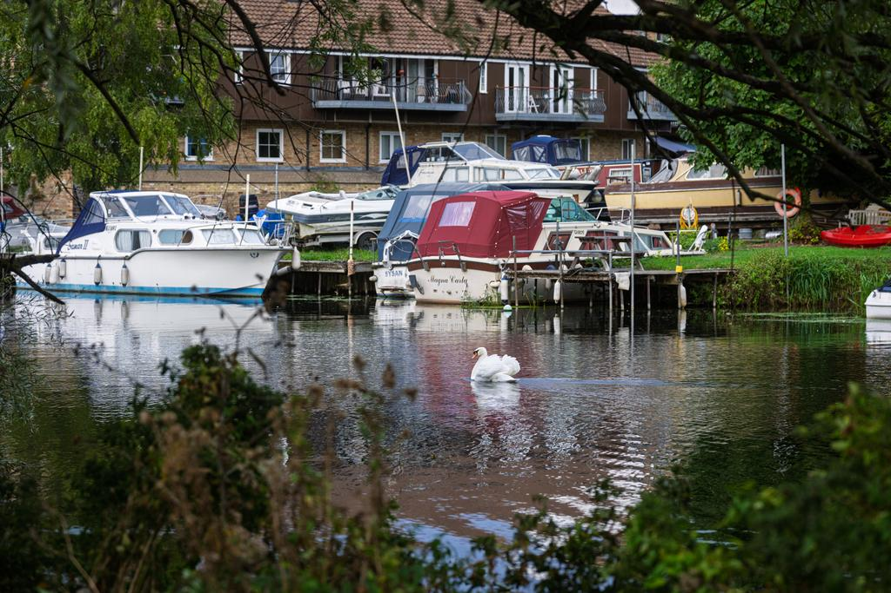

# Model Output Gallery

Generated on: 2026-09-12 23:20:29 BST

- *Evaluation lane:* assisted
- *Prompt hints:* the image's description and keyword hints were included in the prompt, so field content may be copied from them rather than seen
- *Assessment:* General checks + metadata fields and duplicate keywords; length limits and factual accuracy not assessed
- *Input image:* JPEG, 9,984 x 6,656 pixels (66.5 MP), 44.7 MB

This run records model responses to one shared image and prompt (evaluation
lane: assisted). Mechanical checks are not factual-accuracy judgments; inspect
the image, prompt and final answers before choosing a model. Results do not
establish fitness for other tasks.

Complete per-model evidence artifact with image metadata, the source prompt, a
facts-only chooser, and full generated or crash output for every attempted
model.

## Reference Image



## Current-run Chooser

Mechanical observations and captured resource facts for this run only. No concerns detected does not mean the response fulfilled an arbitrary prompt or described the image accurately. Consult the assessment scope above. Total time is end-to-end; throughput covers generation only and requires at least 16 generated tokens. Prefill/first is the measured time to first token (input preparation, prefill and the first decode step) when captured, else upstream's model-loop first-token time; Prompt tok is the full rendered prompt including image tokens, which drives prefill cost. For cross-attention architectures the token count reflects the tokenised text burden only, not total vision prefill compute.

<!-- markdownlint-disable MD034 MD037 MD049 -->

| Model                                                                                                                   | Mechanical checks      | Total s | Gen TPS    | Prefill/first s | Peak GB | Prompt tok | Gen tok | Observations                                                                                  |
|-------------------------------------------------------------------------------------------------------------------------|------------------------|---------|------------|-----------------|---------|------------|---------|-----------------------------------------------------------------------------------------------|
| [`mlx-community/Devstral-Small-2-24B-Instruct-2512-5bit`](#model-mlx-community-devstral-small-2-24b-instruct-2512-5bit) | `no concerns detected` | 11.24s  | 30.4 tok/s | 3.42            | 23      | 2,393      | 159     | none                                                                                          |
| [`mlx-community/GLM-4.6V-Flash-4bit`](#model-mlx-community-glm-46v-flash-4bit)                                          | `no concerns detected` | 8.82s   | 77.9 tok/s | 5.69            | 8.7     | 6,450      | 106     | none                                                                                          |
| [`mlx-community/GLM-4.6V-nvfp4`](#model-mlx-community-glm-46v-nvfp4)                                                    | `no concerns detected` | 32.21s  | 43.1 tok/s | 17.89           | 78      | 6,450      | 107     | none                                                                                          |
| [`mlx-community/Idefics3-8B-Llama3-bf16`](#model-mlx-community-idefics3-8b-llama3-bf16)                                 | `no concerns detected` | 8.76s   | 32.2 tok/s | 1.86            | 18      | 2,612      | 138     | none                                                                                          |
| [`mlx-community/InternVL3-8B-bf16`](#model-mlx-community-internvl3-8b-bf16)                                             | `no concerns detected` | 5.97s   | 34.4 tok/s | 1.47            | 17      | 2,113      | 77      | none                                                                                          |
| [`mlx-community/Kimi-VL-A3B-Thinking-2506-8bit`](#model-mlx-community-kimi-vl-a3b-thinking-2506-8bit)                   | `no concerns detected` | 16.29s  | 66.3 tok/s | 1.37            | 20      | 1,324      | 807     | none                                                                                          |
| [`mlx-community/LFM2.5-VL-3B-OptiQ-4bit`](#model-mlx-community-lfm25-vl-3b-optiq-4bit)                                  | `no concerns detected` | 2.81s   | 213 tok/s  | 0.96            | 4.0     | 2,103      | 80      | none                                                                                          |
| [`mlx-community/MiniCPM-o-4_5-4bit`](#model-mlx-community-minicpm-o-45-4bit)                                            | `no concerns detected` | 3.38s   | 111 tok/s  | 0.94            | 7.0     | 391        | 98      | none                                                                                          |
| [`mlx-community/Ministral-3-14B-Instruct-2512-mxfp4`](#model-mlx-community-ministral-3-14b-instruct-2512-mxfp4)         | `no concerns detected` | 6.07s   | 66.9 tok/s | 2.57            | 13      | 2,926      | 109     | none                                                                                          |
| [`mlx-community/Ministral-3-14B-Instruct-2512-nvfp4`](#model-mlx-community-ministral-3-14b-instruct-2512-nvfp4)         | `no concerns detected` | 7.47s   | 64.0 tok/s | 2.62            | 13      | 2,926      | 187     | none                                                                                          |
| [`mlx-community/Ministral-3-3B-Instruct-2512-4bit`](#model-mlx-community-ministral-3-3b-instruct-2512-4bit)             | `no concerns detected` | 3.70s   | 189 tok/s  | 1.53            | 7.8     | 2,925      | 102     | none                                                                                          |
| [`mlx-community/Ornith-1.5-35B-A3B-OptiQ-4bit`](#model-mlx-community-ornith-15-35b-a3b-optiq-4bit)                      | `no concerns detected` | 5.76s   | 105 tok/s  | 1.29            | 24      | 1,289      | 135     | none                                                                                          |
| [`mlx-community/Phi-3.5-vision-instruct-bf16`](#model-mlx-community-phi-35-vision-instruct-bf16)                        | `no concerns detected` | 4.08s   | 56.8 tok/s | 0.79            | 9.3     | 1,133      | 107     | none                                                                                          |
| [`mlx-community/Qwen3-VL-2B-Thinking-bf16`](#model-mlx-community-qwen3-vl-2b-thinking-bf16)                             | `no concerns detected` | 31.85s  | 88.0 tok/s | 19.89           | 8.4     | 16,549     | 899     | none                                                                                          |
| [`mlx-community/Qwen3-VL-30B-A3B-Instruct-4bit`](#model-mlx-community-qwen3-vl-30b-a3b-instruct-4bit)                   | `no concerns detected` | 48.59s  | 83.0 tok/s | 43.66           | 23      | 16,547     | 171     | none                                                                                          |
| [`mlx-community/Qwen3.5-35B-A3B-4bit`](#model-mlx-community-qwen35-35b-a3b-4bit)                                        | `no concerns detected` | 45.02s  | 103 tok/s  | 40.48           | 25      | 16,563     | 108     | none                                                                                          |
| [`mlx-community/Qwen3.5-9B-MLX-4bit`](#model-mlx-community-qwen35-9b-mlx-4bit)                                          | `no concerns detected` | 44.41s  | 90.8 tok/s | 41.12           | 11      | 16,563     | 86      | none                                                                                          |
| [`mlx-community/Qwen3.8-27B-4bit`](#model-mlx-community-qwen38-27b-4bit)                                                | `no concerns detected` | 65.15s  | 30.0 tok/s | 58.39           | 21      | 16,563     | 112     | none                                                                                          |
| [`mlx-community/SmolVLM2-2.2B-Instruct-mlx`](#model-mlx-community-smolvlm2-22b-instruct-mlx)                            | `no concerns detected` | 3.23s   | 125 tok/s  | 1.08            | 5.6     | 1,426      | 98      | none                                                                                          |
| [`mlx-community/Step-3.7-Flash-oQ3e`](#model-mlx-community-step-37-flash-oq3e)                                          | `no concerns detected` | 38.56s  | 50.2 tok/s | 21.39           | 92      | 3,491      | 121     | none                                                                                          |
| [`mlx-community/X-Reasoner-7B-8bit`](#model-mlx-community-x-reasoner-7b-8bit)                                           | `no concerns detected` | 19.43s  | 59.1 tok/s | 14.96           | 14      | 16,558     | 136     | none                                                                                          |
| [`mlx-community/diffusiongemma-26B-A4B-it-mxfp8`](#model-mlx-community-diffusiongemma-26b-a4b-it-mxfp8)                 | `no concerns detected` | 6.42s   | 53.2 tok/s | 2.52            | 28      | 591        | 79      | none                                                                                          |
| [`mlx-community/gemma-3-27b-it-qat-4bit`](#model-mlx-community-gemma-3-27b-it-qat-4bit)                                 | `no concerns detected` | 9.52s   | 29.7 tok/s | 1.49            | 17      | 590        | 152     | none                                                                                          |
| [`mlx-community/gemma-4-26b-a4b-it-4bit`](#model-mlx-community-gemma-4-26b-a4b-it-4bit)                                 | `no concerns detected` | 4.71s   | 130 tok/s  | 0.96            | 16      | 595        | 99      | none                                                                                          |
| [`mlx-community/gemma-4-31b-it-4bit`](#model-mlx-community-gemma-4-31b-it-4bit)                                         | `no concerns detected` | 8.35s   | 26.4 tok/s | 1.67            | 20      | 595        | 93      | none                                                                                          |
| [`mlx-community/gemma-4-e4b-it-4bit`](#model-mlx-community-gemma-4-e4b-it-4bit)                                         | `no concerns detected` | 3.73s   | 133 tok/s  | 1.00            | 6.0     | 591        | 73      | none                                                                                          |
| [`mlx-community/granite-4.0-3b-vision-4bit`](#model-mlx-community-granite-40-3b-vision-4bit)                            | `no concerns detected` | 2.88s   | 179 tok/s  | 1.13            | 4.7     | 1,379      | 65      | none                                                                                          |
| [`mlx-community/pixtral-12b-8bit`](#model-mlx-community-pixtral-12b-8bit)                                               | `no concerns detected` | 7.02s   | 39.1 tok/s | 2.18            | 16      | 3,116      | 102     | none                                                                                          |
| [`LiquidAI/LFM2.5-VL-450M-MLX-bf16`](#model-liquidai-lfm25-vl-450m-mlx-bf16)                                            | `concerns detected`    | 2.02s   | 483 tok/s  | 0.59            | 1.9     | 2,112      | 120     | duplicate keywords                                                                            |
| [`mlx-community/ERNIE-4.5-VL-28B-A3B-Thinking-4bit`](#model-mlx-community-ernie-45-vl-28b-a3b-thinking-4bit)            | `concerns detected`    | 15.25s  | 84.1 tok/s | 1.31            | 19      | 1,634      | 985     | duplicate keywords                                                                            |
| [`mlx-community/LFM2.5-VL-1.6B-bf16`](#model-mlx-community-lfm25-vl-16b-bf16)                                           | `concerns detected`    | 2.48s   | 190 tok/s  | 0.84            | 4.1     | 2,112      | 99      | duplicate keywords                                                                            |
| [`mlx-community/Molmo2-8B-4bit`](#model-mlx-community-molmo2-8b-4bit)                                                   | `concerns detected`    | 6.12s   | 72.7 tok/s | 1.40            | 8.1     | 1,524      | 216     | duplicate keywords                                                                            |
| [`mlx-community/MiniCPM-V-4.6-4bit`](#model-mlx-community-minicpm-v-46-4bit)                                            | `major concerns`       | 3.51s   | 305 tok/s  | 1.57            | 3.2     | 932        | 122     | incomplete thinking block                                                                     |
| [`mlx-community/Muse-Glimmer-30B-OptiQ-4bit`](#model-mlx-community-muse-glimmer-30b-optiq-4bit)                         | `major concerns`       | 52.45s  | 24.2 tok/s | 7.61            | 25      | 4,403      | 1,000   | labelled fields not detected; cut off at token limit                                          |
| [`mlx-community/North-Micro-Vision-Instruct-4bit`](#model-mlx-community-north-micro-vision-instruct-4bit)               | `major concerns`       | 5.37s   | 219 tok/s  | 2.74            | 3.9     | 4,083      | 200     | repeated text; stopped early: repeating; duplicate keywords                                   |
| [`mlx-community/llm-jp-4-vl-9b-mlx-4bit`](#model-mlx-community-llm-jp-4-vl-9b-mlx-4bit)                                 | `major concerns`       | 5.17s   | 102 tok/s  | 1.51            | 6.7     | 2,195      | 200     | repeated text; stopped early: repeating; control tokens visible; labelled fields not detected |
| [`mlx-community/nanoLLaVA-1.5-4bit`](#model-mlx-community-nanollava-15-4bit)                                            | `major concerns`       | 2.00s   | 376 tok/s  | 0.66            | 1.8     | 330        | 92      | labelled fields not detected                                                                  |
| [`mlx-community/Mage-VL-OptiQ-4bit`](#model-mlx-community-mage-vl-optiq-4bit)                                           | `not assessed`         | 0.15s   | -          | -               | -       | -          | -       | none                                                                                          |
<!-- markdownlint-enable MD034 MD037 MD049 -->

## Resource Highlights

Quickest completion without detected concerns (end-to-end, including model load): `mlx-community/LFM2.5-VL-3B-OptiQ-4bit` at 2.81s

Lowest peak memory among completions without detected concerns: `mlx-community/LFM2.5-VL-3B-OptiQ-4bit` at 4.0 GB

Decode tok/s stays per model in the chooser and is not averaged across models: tokenizers, image-token expansion and reasoning lengths differ too much for a cross-model mean to guide a choice.

## Avoid for This Run

<!-- markdownlint-disable MD034 MD037 MD049 -->

| Model                                                                                                     | Mechanical checks | Observations                                                                                  |
|-----------------------------------------------------------------------------------------------------------|-------------------|-----------------------------------------------------------------------------------------------|
| [`mlx-community/MiniCPM-V-4.6-4bit`](#model-mlx-community-minicpm-v-46-4bit)                              | `major concerns`  | incomplete thinking block                                                                     |
| [`mlx-community/Muse-Glimmer-30B-OptiQ-4bit`](#model-mlx-community-muse-glimmer-30b-optiq-4bit)           | `major concerns`  | labelled fields not detected; cut off at token limit                                          |
| [`mlx-community/North-Micro-Vision-Instruct-4bit`](#model-mlx-community-north-micro-vision-instruct-4bit) | `major concerns`  | repeated text; stopped early: repeating; duplicate keywords                                   |
| [`mlx-community/llm-jp-4-vl-9b-mlx-4bit`](#model-mlx-community-llm-jp-4-vl-9b-mlx-4bit)                   | `major concerns`  | repeated text; stopped early: repeating; control tokens visible; labelled fields not detected |
| [`mlx-community/nanoLLaVA-1.5-4bit`](#model-mlx-community-nanollava-15-4bit)                              | `major concerns`  | labelled fields not detected                                                                  |
| [`mlx-community/Mage-VL-OptiQ-4bit`](#model-mlx-community-mage-vl-optiq-4bit)                             | `not assessed`    | none                                                                                          |
<!-- markdownlint-enable MD034 MD037 MD049 -->

## Output at a Glance

A compact preview of each model's final answer (or failure evidence for crashes), in chooser order. Where the requested catalogue fields were detected, the preview shows a little of each: the title, the start of the description, and the first keywords with their count, so the weakest field is not hidden behind a long description. Otherwise it is the first 280 characters. A closed reasoning trace is left out of the preview and reported as an omitted-character count; the complete output, trace included, is in the model's evidence block below.

<!-- markdownlint-disable MD034 MD037 MD049 -->

| Model                                                                                                                   | Mechanical checks      | Output preview                                                                                                                                                                                                                                                                                                                                                                        |
|-------------------------------------------------------------------------------------------------------------------------|------------------------|---------------------------------------------------------------------------------------------------------------------------------------------------------------------------------------------------------------------------------------------------------------------------------------------------------------------------------------------------------------------------------------|
| [`mlx-community/Devstral-Small-2-24B-Instruct-2512-5bit`](#model-mlx-community-devstral-small-2-24b-instruct-2512-5bit) | `no concerns detected` | Title: Swan on a Calm River with Moored Boats \| Description: A solitary white swan swims gracefully on a calm river, with leisure boats and cruisers moored alongs... \| Keywords (19): Swan, River, Boats, Marina, Mooring, Residential Buildings, Water Reflection, Greenery, Trees, Waterfront, ...                                                                               |
| [`mlx-community/GLM-4.6V-Flash-4bit`](#model-mlx-community-glm-46v-flash-4bit)                                          | `no concerns detected` | Title: Swan on River with Boats \| Description: A white swan glides on calm river waters, with leisure boats moored alongside riverside residential buildings in the backgroun... \| Keywords (9): Swan, River, Boats, Marina, Residential, Calm water, White swan, Leisure boats, Riverside buildings.                                                                               |
| [`mlx-community/GLM-4.6V-nvfp4`](#model-mlx-community-glm-46v-nvfp4)                                                    | `no concerns detected` | Title: Solitary swan glides on calm river waters \| Description: A solitary white swan glides gracefully across calm river waters, framed by lush foliage, with... \| Keywords (18): swan, river, water, foliage, boats, cruisers, residential buildings, moored, calm waters, overcast, waterfowl, ...                                                                               |
| [`mlx-community/Idefics3-8B-Llama3-bf16`](#model-mlx-community-idefics3-8b-llama3-bf16)                                 | `no concerns detected` | Title: Solitary Swan on Calm River Waters with Moored Boats and Riverside Buildings. \| Description: A solitary white swan glides gracefully across the calm river wate... \| Keywords (20): swan, river, boats, moored, residential buildings, foliage, calm waters, leisure, cruisers, riverside, ...                                                                               |
| [`mlx-community/InternVL3-8B-bf16`](#model-mlx-community-internvl3-8b-bf16)                                             | `no concerns detected` | Title: Swan on Calm River \| Description: A white swan glides on tranquil river waters near a marina with moored boats and residential buildings, captured at dusk. \| Keywords (15): swan, river, marina, boats, residential buildings, foliage, trees, water reflection, architecture, motorboat, ...                                                                               |
| [`mlx-community/Kimi-VL-A3B-Thinking-2506-8bit`](#model-mlx-community-kimi-vl-a3b-thinking-2506-8bit)                   | `no concerns detected` | Title: A white swan glides on a canal with moored boats and residential buildings in... \| Description: A solitary white swan glides gracefully across calm canal w... \| Keywords (15): white swan, canal, moored boats, residential buildings, lush foliage, calm water, water reflection, trees, ...[3,004 characters of reasoning omitted; complete output in the evidence block] |
| [`mlx-community/LFM2.5-VL-3B-OptiQ-4bit`](#model-mlx-community-lfm25-vl-3b-optiq-4bit)                                  | `no concerns detected` | Title: Swan gliding on river near moored boats and houses \| Description: A white swan swims gracefully on calm river waters framed by lush greenery, with leisure boats... \| Keywords (14): swan, river, boats, houses, greenery, water, reflection, leisure, architecture, waterfront, waterway, ...                                                                               |
| [`mlx-community/MiniCPM-o-4_5-4bit`](#model-mlx-community-minicpm-o-45-4bit)                                            | `no concerns detected` | Title: Swan Glides on Calm River Near Moored Boats \| Description: A white swan swims peacefully on a tranquil waterway, framed by overhanging branches and lus... \| Keywords (19): swan, river, water, boats, mooring, marina, greenery, trees, vegetation, reflection, waterfront, architecture, ...                                                                               |
| [`mlx-community/Ministral-3-14B-Instruct-2512-mxfp4`](#model-mlx-community-ministral-3-14b-instruct-2512-mxfp4)         | `no concerns detected` | Title: **Swan Gliding Past Moored Boats on a Serene River** \| Description: A solitary white swan swims calmly on a tranquil river, surrounded by reflections of... \| Keywords (16): swan, river, moored boats, marina, residential waterfront, greenery, calm water, reflections, leisure boats, ...                                                                                |
| [`mlx-community/Ministral-3-14B-Instruct-2512-nvfp4`](#model-mlx-community-ministral-3-14b-instruct-2512-nvfp4)         | `no concerns detected` | Title: *Elegant Swan Glides Past Moored Boats on Serene River* \| Description: A solitary white swan gracefully swims across calm river waters on **September 12, 2026,... \| Keywords (20): swan, river, leisure boats, moored boats, riverside residential buildings, greenery, golden sunlight, ...                                                                                |
| [`mlx-community/Ministral-3-3B-Instruct-2512-4bit`](#model-mlx-community-ministral-3-3b-instruct-2512-4bit)             | `no concerns detected` | Title: Swans by Riverside Marina \| Description: A white swan swims serenely in calm waters at dusk near a marina moored with leisure boats, framed by lush greenery... \| Keywords (17): swan, canal, marina, mooring, motorboat, pier, waterfront, waterway, greenery, residential architecture, ...                                                                                |
| [`mlx-community/Ornith-1.5-35B-A3B-OptiQ-4bit`](#model-mlx-community-ornith-15-35b-a3b-optiq-4bit)                      | `no concerns detected` | Title: White Swan Glides Past Moored Boats on Calm River \| Description: A solitary white swan glides gracefully across calm, reflective river water in the for... \| Keywords (19): swan, waterfowl, aquatic bird, river, motorboat, cruiser, mooring, marina, jetty, pier, riverbank, waterfront, ...                                                                               |
| [`mlx-community/Phi-3.5-vision-instruct-bf16`](#model-mlx-community-phi-35-vision-instruct-bf16)                        | `no concerns detected` | Title: Serene Swan on the River \| Description: A white swan is seen swimming peacefully on a calm river, with boats and houses in the background, captured on S... \| Keywords (18): swan, river, calm, boats, houses, foliage, waterfront, mooring, leisure, tranquility, architecture, waterway, ...                                                                               |
| [`mlx-community/Qwen3-VL-2B-Thinking-bf16`](#model-mlx-community-qwen3-vl-2b-thinking-bf16)                             | `no concerns detected` | Title: Swan on Riverfront with Boats and Houses \| Description: Solitary white swan glides across calm river waters, framed by lush greenery and moored boats, with r... \| Keywords (17): Bird, Canal, Greenery, Marina, Mooring, Motorboat, Pier, Riverbank, Trees, Vegetation, Water reflection, ...[3,161 characters of reasoning omitted; complete output in the evidence block] |
| [`mlx-community/Qwen3-VL-30B-A3B-Instruct-4bit`](#model-mlx-community-qwen3-vl-30b-a3b-instruct-4bit)                   | `no concerns detected` | Title: Solitary swan on a calm river with moored boats \| Description: A white swan glides across the calm water of a river, framed by green foliage in the fore... \| Keywords (24): swan, river, boats, mooring, residential, building, water reflection, greenery, trees, vegetation, motorboat, ...                                                                               |
| [`mlx-community/Qwen3.5-35B-A3B-4bit`](#model-mlx-community-qwen35-35b-a3b-4bit)                                        | `no concerns detected` | Title: Swan Gliding Past Moored Boats on River \| Description: A solitary white swan swims calmly on a river in front of a wooden jetty where several leisure boats... \| Keywords (18): swan, river, moored boats, leisure boats, cruisers, wooden jetty, residential buildings, water reflection, ...                                                                               |
| [`mlx-community/Qwen3.5-9B-MLX-4bit`](#model-mlx-community-qwen35-9b-mlx-4bit)                                          | `no concerns detected` | Title: Swan Glides Past Moored Boats on Calm Riverbank \| Description: A solitary white swan swims peacefully on a reflective river, with leisure boats moored along t... \| Keywords (15): swan, river, boats, mooring, residential buildings, water reflection, foliage, trees, motorboat, canal, ...                                                                               |
| [`mlx-community/Qwen3.8-27B-4bit`](#model-mlx-community-qwen38-27b-4bit)                                                | `no concerns detected` | Title: Mute Swan on the River Lee at Greenwich \| Description: A solitary white mute swan floats on the calm, reflective waters of a river, framed by out-of-f... \| Keywords (18): swan, river, boats, marina, mooring, water, reflection, foliage, residential, architecture, waterway, wildlife, ...                                                                               |
| [`mlx-community/SmolVLM2-2.2B-Instruct-mlx`](#model-mlx-community-smolvlm2-22b-instruct-mlx)                            | `no concerns detected` | Title: Swan on River \| Description: A solitary white swan glides gracefully across calm river waters framed by lush foliage, with leisure boats and cruisers mo... \| Keywords (20): Adobe Stock, Any Vision, Bird, Canal, Greenery, Marina, Mooring, Motorboat, Pier, Riverbank, Swimming, Trees, ...                                                                               |
| [`mlx-community/Step-3.7-Flash-oQ3e`](#model-mlx-community-step-37-flash-oq3e)                                          | `no concerns detected` | Title: Swan glides past moored boats on a calm river \| Description: A solitary white swan swims across calm river waters, framed by lush foreground foliage and... \| Keywords (18): Swan, waterfowl, river, marina, mooring, motorboat, pier, waterfront, waterway, canal, bird, swimming, trees, ...                                                                               |
| [`mlx-community/X-Reasoner-7B-8bit`](#model-mlx-community-x-reasoner-7b-8bit)                                           | `no concerns detected` | Title: Swan Gliding on Calm River with Moored Boats \| Description: A serene scene captures a solitary white swan gracefully swimming across calm river waters, frame... \| Keywords (23): Swan, River, Calm, Moored Boats, Residential Buildings, Greenery, Waterfront, Waterway, Motorboat, Pier, ...                                                                               |
| [`mlx-community/diffusiongemma-26B-A4B-it-mxfp8`](#model-mlx-community-diffusiongemma-26b-a4b-it-mxfp8)                 | `no concerns detected` | Title: White Swan on Calm River Near Moored Boats \| Description: A solitary white swan glides across calm river water framed by lush foliage, with leisure boats moore... \| Keywords (15): swan, river, waterway, marina, mooring, motorboat, waterfront, waterfowl, greenery, trees, reflection, ...                                                                               |
| [`mlx-community/gemma-3-27b-it-qat-4bit`](#model-mlx-community-gemma-3-27b-it-qat-4bit)                                 | `no concerns detected` | Title: Swan on River Cam, Cambridge – September 2026 \| Description: A white swan swims on the River Cam at 52.393850°N, 0.270830°E, captured on 12 September... \| Keywords (18): Swan, River Cam, Cambridge, Waterfowl, Boat, Mooring, Marina, Riverbank, Waterway, Residential building, Trees, ...                                                                                |
| [`mlx-community/gemma-4-26b-a4b-it-4bit`](#model-mlx-community-gemma-4-26b-a4b-it-4bit)                                 | `no concerns detected` | Title: White swan swimming on calm river with moored boats \| Description: A solitary white swan glides across calm river waters, framed by lush greenery with sever... \| Keywords (17): swan, waterfowl, river, boat, motorboat, marina, greenery, reflection, architecture, waterfront, leisure, ...                                                                               |
| [`mlx-community/gemma-4-31b-it-4bit`](#model-mlx-community-gemma-4-31b-it-4bit)                                         | `no concerns detected` | Title: White Swan Swimming Past Moored River Boats \| Description: A solitary white swan glides across calm river waters in front of leisure boats and cruisers moored... \| Keywords (18): swan, river, boats, marina, mooring, waterway, waterfront, residential, architecture, greenery, trees, ...                                                                                |
| [`mlx-community/gemma-4-e4b-it-4bit`](#model-mlx-community-gemma-4-e4b-it-4bit)                                         | `no concerns detected` | Title: Swan glides on calm water before moored boats \| Description: A solitary white swan gracefully swims on the still water of a canal, with various leisur... \| Keywords (15): swan, water, canal, boats, mooring, trees, vegetation, river, marina, architecture, quiet, afternoon, wildlife, ...                                                                               |
| [`mlx-community/granite-4.0-3b-vision-4bit`](#model-mlx-community-granite-40-3b-vision-4bit)                            | `no concerns detected` | Title: "Swan on the Canal" \| Description: A white swan glides gracefully across a calm river, framed by lush foliage and moored boats, with a serene residential backdrop. \| Keywords (10): swan, canal, water, foliage, boats, mooring, residential, reflection, serene, waterway                                                                                                  |
| [`mlx-community/pixtral-12b-8bit`](#model-mlx-community-pixtral-12b-8bit)                                               | `no concerns detected` | Title: Swan in River with Moored Boats \| Description: A solitary white swan gracefully swims across calm river waters, framed by lush foliage, with leisure boats... \| Keywords (18): Swan, River, Boats, Marina, Water, Foliage, Residential, Mooring, Waterfront, Waterway, Trees, Vegetation, ...                                                                                |
| [`LiquidAI/LFM2.5-VL-450M-MLX-bf16`](#model-liquidai-lfm25-vl-450m-mlx-bf16)                                            | `concerns detected`    | Title: Swans glide across calm river waters in a serene canal setting. \| Description: A solitary white swan glides gracefully across calm river waters framed by lu... \| Keywords (24): Swans, canal, water, serene, leisure, boats, water, architecture, greenery, water, reflection, waterfowl, ...                                                                               |
| [`mlx-community/ERNIE-4.5-VL-28B-A3B-Thinking-4bit`](#model-mlx-community-ernie-45-vl-28b-a3b-thinking-4bit)            | `concerns detected`    | Title: Solitary White Swan Glides on Calm River with Boats \| Description: On 12 September 2026 at 17:41 UTC+01:00, a solitary white swan glides across calm river waters... \| Keywords (17): White swan, river, boats, foliage, mooring, canal, greenery, riverbank, water reflection, waterfowl, ...[2,591 characters of reasoning omitted; complete output in the evidence block] |
| [`mlx-community/LFM2.5-VL-1.6B-bf16`](#model-mlx-community-lfm25-vl-16b-bf16)                                           | `concerns detected`    | Title: Serene Swan on Calm River \| Description: A solitary white swan glides gracefully across calm river waters framed by lush foliage, with leisure boats and c... \| Keywords (18): swan, river, calm waters, foliage, boats, residential buildings, riverside, leisure, tranquility, greenery, ...                                                                               |
| [`mlx-community/Molmo2-8B-4bit`](#model-mlx-community-molmo2-8b-4bit)                                                   | `concerns detected`    | Title: Serene River Scene with White Swan and Moored Boats \| Description: A tranquil riverside view features a solitary white swan gliding across calm water, surro... \| Keywords (42): swan, river, boats, mooring, canal, greenery, trees, vegetation, water reflection, waterfowl, waterfront, ...                                                                               |
| [`mlx-community/MiniCPM-V-4.6-4bit`](#model-mlx-community-minicpm-v-46-4bit)                                            | `major concerns`       | Title: A graceful swan glides among moored boats on a tranquil river. \| Description: The image shows a white swan moving through calm water, surrounded by leisu... \| Keywords (19): swan, river, boats, marina, greenery, reflection, water, architecture, trees, vegetation, waterway, aquatic, ...                                                                               |
| [`mlx-community/Muse-Glimmer-30B-OptiQ-4bit`](#model-mlx-community-muse-glimmer-30b-optiq-4bit)                         | `major concerns`       | Title: Mute Swan Gliding on River Beside Moored Boats \| Description: Captured on 2026-09-12 17:41:02 UTC+01:00 at 52.393850°N, 0.270830°E, a mute swan swims on calm water reflecting moored leisure cruisers and riverside apartments, framed by overhanging tree bran... \| Keywords: (not detected)                                                                               |
| [`mlx-community/North-Micro-Vision-Instruct-4bit`](#model-mlx-community-north-micro-vision-instruct-4bit)               | `major concerns`       | Title: Swan on River, Waterfront Scene \| Description: A solitary white swan glides gracefully across calm river waters, framed by lush greenery and leisure boats moore... \| Keywords (40): Swan, River, Waterfront, Marina, Leisure boats, Residential buildings, Greenery, Water, Aquatic bird, ...                                                                               |
| [`mlx-community/llm-jp-4-vl-9b-mlx-4bit`](#model-mlx-community-llm-jp-4-vl-9b-mlx-4bit)                                 | `major concerns`       | <\|channel\|> analysis<\|message\|> The image shows a white swan swimming in a river with a white swan swimming in a river with a white swan swimming in a river with a white swan swimming in a river with a white swan swimming in a river with a white swan swimming in a river with a...                                                                                          |
| [`mlx-community/nanoLLaVA-1.5-4bit`](#model-mlx-community-nanollava-15-4bit)                                            | `major concerns`       | "Amidst the Riverbank, a solitary white swan glides gracefully across calm waters, framed by lush foliage, with leisure boats and cruisers moored alongside riverside residential buildings in the background. The serene setting is complemented by the presence of greenery, archit...                                                                                              |
| [`mlx-community/Mage-VL-OptiQ-4bit`](#model-mlx-community-mage-vl-optiq-4bit)                                           | `not assessed`         | Model loading failed: Received 904 parameters not in model:<br>model.embed_tokens.biases,<br>model.embed_tokens.scales,<br>model.embed_tokens.weight,<br>model.layers.0.input_layernorm.weight,<br>model.layers.0.mlp.down_proj.biases,<br>model.layers.0.mlp.down_proj.scales,<br>model.layers.0.mlp.down...                                                                         |
<!-- markdownlint-enable MD034 MD037 MD049 -->

## Run Stamps

- `mlx-vlm`: `0.7.0`
- `mlx`: `0.32.3.dev20260912+229f5b430`
- `transformers`: `5.17.0`
- `tokenizers`: `0.23.2`
- `huggingface-hub`: `1.31.0`
- *Python Version:* 3.14.7
- *OS:* Darwin 25.6.0
- *macOS Version:* 26.6.2
- *GPU/Chip:* Apple M5 Max
- *MLX Device:* Apple M5 Max
- *GPU Architecture:* applegpu_g17s
- *RAM:* 128.0 GB
- *Recommended Working Set:* 108 GB
- *Fused Attention:* Available

## Image Metadata

- *Description:* A solitary white swan glides gracefully across calm river
  waters framed by lush foliage, with leisure boats and cruisers moored
  alongside riverside residential buildings in the background.
- *Keywords:* Adobe Stock, Any Vision, Bird, Canal, Greenery, Marina, Mooring,
  Motorboat, Pier, Riverbank, Swimming, Trees, Vegetation, Water reflection,
  Waterfowl, Waterfront, Waterway, aquatic bird, architecture, boat, boating,
  boats, cabin cruiser, calm water, cruiser, daytime, dock, environment,
  foliage, harbor, houses, landscape, leisure, mute swan, natural, nature,
  outdoor, peaceful, recreation, reflection, residential, river, riverside,
  scenic, serene, swan, tranquility, travel, watercraft, white swan, wildlife
- *Date:* 2026-09-12 17:41:02 UTC+01:00
- *Time:* 17:41:02
- *GPS:* 52.393850°N, 0.270830°E

## Prompt

<!-- markdownlint-disable MD011 MD028 MD037 MD045 -->
>
> Create British-English catalogue metadata from the image and supplied
> context.
>
> Treat any capture date/time and GPS as authoritative facts, but do not claim
> they are visible. Descriptive hints may be incomplete or wrong: retain
> details supported by the image, correct conflicts, and add important visible
> details. Prefer image evidence when a hint conflicts, and omit uncertain
> details.
>
> Context: Authoritative context:
> &#45; Capture date/time: 2026-09-12 17:41:02 UTC+01:00
> &#45; GPS: 52.393850°N, 0.270830°E
>
> &#8203;Descriptive hints:
> &#45; Description hint: A solitary white swan glides gracefully across calm
> river waters framed by lush foliage, with leisure boats and cruisers moored
> alongside riverside residential buildings in the background.
> &#45; Keyword hints: Adobe Stock, Any Vision, Bird, Canal, Greenery, Marina,
> Mooring, Motorboat, Pier, Riverbank, Swimming, Trees, Vegetation, Water
> reflection, Waterfowl, Waterfront, Waterway, aquatic bird, architecture,
> boat
>
> &#8203;Write:
> &#45; a concrete 5-10-word title;
> &#45; a 1-2-sentence factual description combining relevant context with the
> main visible subject, setting, action, lighting, and distinctive details;
> &#45; 10-18 unique, comma-separated keywords covering relevant context and
> visible details.
>
> &#8203;Return exactly these three sections and nothing else:
> &#8203;Title:
> &#8203;Description:
> &#8203;Keywords:
<!-- markdownlint-enable MD011 MD028 MD037 MD045 -->

## Complete Per-model Evidence

Complete generated or crash evidence for every attempted model.

<a id="model-mlx-community-devstral-small-2-24b-instruct-2512-5bit"></a>

### mlx-community/Devstral-Small-2-24B-Instruct-2512-5bit

<details>
<summary>Complete evidence: mlx-community/Devstral-Small-2-24B-Instruct-2512-5bit</summary>

- *Execution:* completed
- *Mechanical checks:* no concerns detected
- *Assessment:* General checks + metadata fields and duplicate keywords;
  length limits and factual accuracy not assessed
- *Maintainer status:* none
- *Observations:* none
- *Arch supported by installed mlx-vlm:* yes (model_type mistral3)
- *Model load time:* 2.07s
- *Generation time:* 8.66s
- *Total time:* 11.24s
- *Prompt preparation time:* 0.508
- *First-token latency:* 2.88
- *Cleanup time:* 0.0991
- *Prompt tokens:* 2,393
- *Generation tokens:* 159
- *Total tokens:* 2,552
- *Prompt throughput (raw):* 831 tok/s
- *Generation throughput (raw):* 30.4 tok/s
- *Peak memory (GB):* 23
- *Active memory (GB):* 18
- *Cache memory (GB):* 0.47
- *Model-load active memory (GB):* 18
- *Post-cleanup active memory (GB):* 0.000394
- *Post-cleanup cache memory (GB):* 0.0
- *Stop reason:* completed
- *Requested maximum tokens:* 1000
- *Rendered prompt characters:* 1332
- *Processor:* mlx_vlm.models.mistral3.processing_mistral3.Mistral3Processor
- *Tokenizer:* transformers.tokenization_utils_tokenizers.TokenizersBackend
- *Requested model revision:* not requested
- *Resolved model revision:* 0a970d20ad7da57b0e2accc35c5b8628f5d02063
- *Resolved snapshot path:* ~/.cache/huggingface/hub/models--mlx-community--Devstral-Small-2-24B-Instruct-2512-5bit/snapshots/0a970d20ad7da57b0e2accc35c5b8628f5d02063
- *Generation settings:* {"max_tokens": 1000, "prefill_step_size": 2048,
  "temperature": 0.0, "top_p": 1.0}
- *EOS token:* &lt;/s&gt;

*Readable output:*

<pre class="model-output-readable">
Title:
Swan on a Calm River with Moored Boats

Description:
A solitary white swan swims gracefully on a calm river, with leisure boats and cruisers moored alongside riverside residential buildings in the background, captured on 12 September 2026 at 17:41 UTC+01:00 near 52.393850°N, 0.270830°E.

Keywords:
Swan, River, Boats, Marina, Mooring, Residential Buildings, Water Reflection, Greenery, Trees, Waterfront, Waterway, Aquatic Bird, Architecture, Calm Waters, Leisure Boats, Cruisers, Riverside, Vegetation, Waterfowl
</pre>

</details>

---

<a id="model-mlx-community-glm-46v-flash-4bit"></a>

### mlx-community/GLM-4.6V-Flash-4bit

<details>
<summary>Complete evidence: mlx-community/GLM-4.6V-Flash-4bit</summary>

- *Execution:* completed
- *Mechanical checks:* no concerns detected
- *Assessment:* General checks + metadata fields and duplicate keywords;
  length limits and factual accuracy not assessed
- *Maintainer status:* none
- *Observations:* none
- *Arch supported by installed mlx-vlm:* yes (model_type glm4v)
- *Model load time:* 1.22s
- *Generation time:* 7.06s
- *Total time:* 8.82s
- *Prompt preparation time:* 0.53
- *First-token latency:* 5.21
- *Cleanup time:* 0.084
- *Prompt tokens:* 6,450
- *Generation tokens:* 106
- *Total tokens:* 6,556
- *Prompt throughput (raw):* 1,239 tok/s
- *Generation throughput (raw):* 77.9 tok/s
- *Peak memory (GB):* 8.7
- *Active memory (GB):* 7.1
- *Cache memory (GB):* 0.46
- *Model-load active memory (GB):* 7.07
- *Post-cleanup active memory (GB):* 0.000919
- *Post-cleanup cache memory (GB):* 0.0
- *Stop reason:* completed
- *Requested maximum tokens:* 1000
- *Rendered prompt characters:* 1413
- *Image placeholders:* 1
- *Processor:* mlx_vlm.models.glm4v.processing.Glm46VProcessor
- *Tokenizer:* transformers.tokenization_utils_tokenizers.TokenizersBackend
- *Requested model revision:* not requested
- *Resolved model revision:* bd7b20686e8cbf22ad221a3de8399cdc5a2a7e0e
- *Resolved snapshot path:* ~/.cache/huggingface/hub/models--mlx-community--GLM-4.6V-Flash-4bit/snapshots/bd7b20686e8cbf22ad221a3de8399cdc5a2a7e0e
- *Generation settings:* {"max_tokens": 1000, "prefill_step_size": 2048,
  "temperature": 0.0, "top_p": 1.0}
- *EOS token:* <\|endoftext\|>

*Readable output:*

<pre class="model-output-readable">
Title: Swan on River with Boats
Description: A white swan glides on calm river waters, with leisure boats moored alongside riverside residential buildings in the background, captured on 2026-09-12 at 17:41:02 UTC+01:00 at 52.393850°N, 0.270830°E.
Keywords: Swan, River, Boats, Marina, Residential, Calm water, White swan, Leisure boats, Riverside buildings.
</pre>

</details>

---

<a id="model-mlx-community-glm-46v-nvfp4"></a>

### mlx-community/GLM-4.6V-nvfp4

<details>
<summary>Complete evidence: mlx-community/GLM-4.6V-nvfp4</summary>

- *Execution:* completed
- *Mechanical checks:* no concerns detected
- *Assessment:* General checks + metadata fields and duplicate keywords;
  length limits and factual accuracy not assessed
- *Maintainer status:* none
- *Observations:* none
- *Arch supported by installed mlx-vlm:* yes (model_type glm4v_moe)
- *Model load time:* 11.20s
- *Generation time:* 20.37s
- *Total time:* 32.21s
- *Prompt preparation time:* 0.635
- *First-token latency:* 16.1
- *Cleanup time:* 0.303
- *Prompt tokens:* 6,450
- *Generation tokens:* 107
- *Total tokens:* 6,557
- *Prompt throughput (raw):* 400 tok/s
- *Generation throughput (raw):* 43.1 tok/s
- *Peak memory (GB):* 78
- *Active memory (GB):* 62
- *Cache memory (GB):* 1.4
- *Model-load active memory (GB):* 61.9
- *Post-cleanup active memory (GB):* 0.00123
- *Post-cleanup cache memory (GB):* 0.0
- *Stop reason:* completed
- *Requested maximum tokens:* 1000
- *Rendered prompt characters:* 1413
- *Image placeholders:* 1
- *Processor:* mlx_vlm.models.glm4v_moe.processing.Glm46VMoEProcessor
- *Tokenizer:* transformers.tokenization_utils_tokenizers.TokenizersBackend
- *Requested model revision:* not requested
- *Resolved model revision:* 2da6855d4e28a0e61c84543262074bc17ac27d6e
- *Resolved snapshot path:* ~/.cache/huggingface/hub/models--mlx-community--GLM-4.6V-nvfp4/snapshots/2da6855d4e28a0e61c84543262074bc17ac27d6e
- *Generation settings:* {"max_tokens": 1000, "prefill_step_size": 2048,
  "temperature": 0.0, "top_p": 1.0}
- *EOS token:* <\|endoftext\|>

*Readable output:*

<pre class="model-output-readable">
Title: Solitary swan glides on calm river waters
Description: A solitary white swan glides gracefully across calm river waters, framed by lush foliage, with leisure boats and cruisers moored alongside riverside residential buildings in the background under overcast lighting.
Keywords: swan, river, water, foliage, boats, cruisers, residential buildings, moored, calm waters, overcast, waterfowl, waterfront, water reflection, vegetation, marina, motorboat, riverbank, aquatic bird
</pre>

</details>

---

<a id="model-mlx-community-idefics3-8b-llama3-bf16"></a>

### mlx-community/Idefics3-8B-Llama3-bf16

<details>
<summary>Complete evidence: mlx-community/Idefics3-8B-Llama3-bf16</summary>

- *Execution:* completed
- *Mechanical checks:* no concerns detected
- *Assessment:* General checks + metadata fields and duplicate keywords;
  length limits and factual accuracy not assessed
- *Maintainer status:* none
- *Observations:* none
- *Arch supported by installed mlx-vlm:* yes (model_type idefics3)
- *Model load time:* 1.87s
- *Generation time:* 6.16s
- *Total time:* 8.76s
- *Prompt preparation time:* 0.733
- *First-token latency:* 1.16
- *Cleanup time:* 0.0978
- *Prompt tokens:* 2,612
- *Generation tokens:* 138
- *Total tokens:* 2,750
- *Prompt throughput (raw):* 2,251 tok/s
- *Generation throughput (raw):* 32.2 tok/s
- *Peak memory (GB):* 18
- *Active memory (GB):* 17
- *Cache memory (GB):* 0.43
- *Model-load active memory (GB):* 16.9
- *Post-cleanup active memory (GB):* 0.00149
- *Post-cleanup cache memory (GB):* 0.0
- *Stop reason:* completed
- *Requested maximum tokens:* 1000
- *Rendered prompt characters:* 1369
- *Image placeholders:* 1
- *Processor:* mlx_vlm.models.idefics3.processing_idefics3.Idefics3Processor
- *Tokenizer:* transformers.tokenization_utils_tokenizers.TokenizersBackend
- *Requested model revision:* not requested
- *Resolved model revision:* 8c2a30c48864f3251701b7bde40f601d25535098
- *Resolved snapshot path:* ~/.cache/huggingface/hub/models--mlx-community--Idefics3-8B-Llama3-bf16/snapshots/8c2a30c48864f3251701b7bde40f601d25535098
- *Generation settings:* {"max_tokens": 1000, "prefill_step_size": 2048,
  "temperature": 0.0, "top_p": 1.0}
- *EOS token:* <\|end_of_text\|>

*Readable output:*

<pre class="model-output-readable">
 Title: Solitary Swan on Calm River Waters with Moored Boats and Riverside Buildings.

Description: A solitary white swan glides gracefully across the calm river waters, framed by lush foliage, with leisure boats and cruisers moored alongside riverside residential buildings in the background. The serene and peaceful atmosphere is enhanced by the soft play of light on the water, creating a picturesque scene of natural beauty and human habitation.

Keywords: swan, river, boats, moored, residential buildings, foliage, calm waters, leisure, cruisers, riverside, solitary, white, graceful, serene, peaceful, picturesque, light, water, natural beauty, human habitation.
</pre>

</details>

---

<a id="model-mlx-community-internvl3-8b-bf16"></a>

### mlx-community/InternVL3-8B-bf16

<details>
<summary>Complete evidence: mlx-community/InternVL3-8B-bf16</summary>

- *Execution:* completed
- *Mechanical checks:* no concerns detected
- *Assessment:* General checks + metadata fields and duplicate keywords;
  length limits and factual accuracy not assessed
- *Maintainer status:* none
- *Observations:* none
- *Arch supported by installed mlx-vlm:* yes (model_type internvl_chat)
- *Model load time:* 1.60s
- *Generation time:* 3.71s
- *Total time:* 5.97s
- *Prompt preparation time:* 0.65
- *First-token latency:* 0.842
- *Cleanup time:* 0.107
- *Prompt tokens:* 2,113
- *Generation tokens:* 77
- *Total tokens:* 2,190
- *Prompt throughput (raw):* 2,510 tok/s
- *Generation throughput (raw):* 34.4 tok/s
- *Peak memory (GB):* 17
- *Active memory (GB):* 16
- *Cache memory (GB):* 0.17
- *Model-load active memory (GB):* 15.9
- *Post-cleanup active memory (GB):* 0.0018
- *Post-cleanup cache memory (GB):* 0.0
- *Stop reason:* completed
- *Requested maximum tokens:* 1000
- *Rendered prompt characters:* 1337
- *Image placeholders:* 1
- *Processor:* mlx_vlm.models.internvl_chat.processor.InternVLChatProcessor
- *Tokenizer:* transformers.models.qwen2.tokenization_qwen2.Qwen2Tokenizer
- *Requested model revision:* not requested
- *Resolved model revision:* e0df3dd79263467173214b67ef6d6a0cc5a475fd
- *Resolved snapshot path:* ~/.cache/huggingface/hub/models--mlx-community--InternVL3-8B-bf16/snapshots/e0df3dd79263467173214b67ef6d6a0cc5a475fd
- *Generation settings:* {"max_tokens": 1000, "prefill_step_size": 2048,
  "temperature": 0.0, "top_p": 1.0}
- *EOS token:* <\|im_end\|>

*Readable output:*

<pre class="model-output-readable">
Title: Swan on Calm River
Description: A white swan glides on tranquil river waters near a marina with moored boats and residential buildings, captured at dusk.
Keywords: swan, river, marina, boats, residential buildings, foliage, trees, water reflection, architecture, motorboat, mooring, waterfront, aquatic bird, vegetation, calm waters
</pre>

<details>
<summary>Exact raw output</summary>

```text
Title: Swan on Calm River
Description: A white swan glides on tranquil river waters near a marina with moored boats and residential buildings, captured at dusk. 
Keywords: swan, river, marina, boats, residential buildings, foliage, trees, water reflection, architecture, motorboat, mooring, waterfront, aquatic bird, vegetation, calm waters
```

</details>

</details>

---

<a id="model-mlx-community-kimi-vl-a3b-thinking-2506-8bit"></a>

### mlx-community/Kimi-VL-A3B-Thinking-2506-8bit

<details>
<summary>Complete evidence: mlx-community/Kimi-VL-A3B-Thinking-2506-8bit</summary>

- *Execution:* completed
- *Mechanical checks:* no concerns detected
- *Assessment:* General checks + metadata fields and duplicate keywords;
  length limits and factual accuracy not assessed
- *Maintainer status:* none
- *Observations:* none
- *Arch supported by installed mlx-vlm:* yes (model_type kimi_vl)
- *Model load time:* 2.15s
- *Generation time:* 13.55s
- *Total time:* 16.29s
- *Prompt preparation time:* 0.584
- *First-token latency:* 0.72
- *Cleanup time:* 0.107
- *Prompt tokens:* 1,324
- *Generation tokens:* 807
- *Total tokens:* 2,131
- *Prompt throughput (raw):* 1,838 tok/s
- *Generation throughput (raw):* 66.3 tok/s
- *Peak memory (GB):* 20
- *Active memory (GB):* 18
- *Cache memory (GB):* 1.5
- *Model-load active memory (GB):* 17.8
- *Post-cleanup active memory (GB):* 0.00246
- *Post-cleanup cache memory (GB):* 0.0
- *Stop reason:* completed
- *Requested maximum tokens:* 1000
- *Rendered prompt characters:* 1519
- *Processor:* mlx_vlm.models.kimi_vl.processing_kimi_vl.KimiVLProcessor
- *Tokenizer:* transformers.tokenization_utils_tokenizers.TokenizersBackend
- *Requested model revision:* not requested
- *Resolved model revision:* e5abbe34cbfabd829fafd0362856e5b468d19f85
- *Resolved snapshot path:* ~/.cache/huggingface/hub/models--mlx-community--Kimi-VL-A3B-Thinking-2506-8bit/snapshots/e5abbe34cbfabd829fafd0362856e5b468d19f85
- *Generation settings:* {"max_tokens": 1000, "prefill_step_size": 2048,
  "temperature": 0.0, "top_p": 1.0}
- *EOS token:* [EOS]

*Readable output:*

<pre class="model-output-readable">
◁think▷Okay, let's tackle this. First, I need to create a British-English catalogue metadata based on the image and the provided context. The user wants a title, a descriptive paragraph, and 10-18 keywords.

Starting with the title: The main subject is a white swan on a river with boats and residential buildings. The context mentions a canal, boats, greenery, and a marina. So the title should be concise. Maybe "A white swan glides on a canal with moored boats and residential buildings in the background." That's 10 words.

Next, the description. The context says "solitary white swan glides gracefully across calm river waters framed by lush foliage, with leisure boats and cruisers moored alongside riverside residential buildings." But the image shows a canal with boats, so adjust to "canal" instead of river. Also, the time is 2026-09-12 17:41:02 UTC+01:00, but the user said not to claim it's visible. So focus on visible elements. The swan is central, boats, buildings, greenery, water reflection, and the overall scene. So the description should combine these: "A solitary white swan glides gracefully across calm canal waters, framed by lush foliage, with moored boats and residential buildings in the background, reflecting in the water under daylight."

Keywords: Need 10-18 unique ones. From the image: white swan, canal, boats, residential buildings, foliage, calm water, moored boats, leisure boats, cruisers, greenery, water reflection, trees, vegetation, aquatic bird, architecture, waterfront, waterway. Let me count: that's 15. Check if they cover all elements. Yes, swan, canal, boats, buildings, foliage, water, reflection, trees, vegetation, boats, cruisers, waterfront, waterway, aquatic bird, architecture, greenery, water reflection. Maybe add "leisure boats" instead of "boats" to be more specific. So keywords: white swan, canal, moored boats, residential buildings, lush foliage, calm water, water reflection, trees, vegetation, aquatic bird, architecture, waterfront, waterway, leisure boats, cruisers, greenery, water reflection. Wait, "water reflection" is repeated. Remove one. Maybe "water reflection" once. So: white swan, canal, moored boats, residential buildings, lush foliage, calm water, water reflection, trees, vegetation, aquatic bird, architecture, waterfront, waterway, leisure boats, cruisers, greenery. That's 14. Maybe add "daylight" since the time is given but not visible, but the user said not to claim visible. So stick to visible. Maybe "moored boats" and "cruisers" are enough. Let me check the image again. The boats are moored, so "moored boats" is good. "Cruisers" as a keyword. So final keywords: white swan, canal, moored boats, residential buildings, lush foliage, calm water, water reflection, trees, vegetation, aquatic bird, architecture, waterfront, waterway, leisure boats, cruisers, greenery. That's 14. Maybe add "daylight" but not visible. No, better to stick to visible. Maybe "water reflection" is okay. Alright, that's 14.◁/think▷Title: A white swan glides on a canal with moored boats and residential buildings in the background.
Description: A solitary white swan glides gracefully across calm canal waters, framed by lush foliage, with moored boats and residential buildings in the background, reflecting in the water under daylight.
Keywords: white swan, canal, moored boats, residential buildings, lush foliage, calm water, water reflection, trees, vegetation, aquatic bird, architecture, waterfront, waterway, leisure boats, cruisers
</pre>

<details>
<summary>Exact raw output</summary>

```text
◁think▷Okay, let's tackle this. First, I need to create a British-English catalogue metadata based on the image and the provided context. The user wants a title, a descriptive paragraph, and 10-18 keywords. 

Starting with the title: The main subject is a white swan on a river with boats and residential buildings. The context mentions a canal, boats, greenery, and a marina. So the title should be concise. Maybe "A white swan glides on a canal with moored boats and residential buildings in the background." That's 10 words.

Next, the description. The context says "solitary white swan glides gracefully across calm river waters framed by lush foliage, with leisure boats and cruisers moored alongside riverside residential buildings." But the image shows a canal with boats, so adjust to "canal" instead of river. Also, the time is 2026-09-12 17:41:02 UTC+01:00, but the user said not to claim it's visible. So focus on visible elements. The swan is central, boats, buildings, greenery, water reflection, and the overall scene. So the description should combine these: "A solitary white swan glides gracefully across calm canal waters, framed by lush foliage, with moored boats and residential buildings in the background, reflecting in the water under daylight."

Keywords: Need 10-18 unique ones. From the image: white swan, canal, boats, residential buildings, foliage, calm water, moored boats, leisure boats, cruisers, greenery, water reflection, trees, vegetation, aquatic bird, architecture, waterfront, waterway. Let me count: that's 15. Check if they cover all elements. Yes, swan, canal, boats, buildings, foliage, water, reflection, trees, vegetation, boats, cruisers, waterfront, waterway, aquatic bird, architecture, greenery, water reflection. Maybe add "leisure boats" instead of "boats" to be more specific. So keywords: white swan, canal, moored boats, residential buildings, lush foliage, calm water, water reflection, trees, vegetation, aquatic bird, architecture, waterfront, waterway, leisure boats, cruisers, greenery, water reflection. Wait, "water reflection" is repeated. Remove one. Maybe "water reflection" once. So: white swan, canal, moored boats, residential buildings, lush foliage, calm water, water reflection, trees, vegetation, aquatic bird, architecture, waterfront, waterway, leisure boats, cruisers, greenery. That's 14. Maybe add "daylight" since the time is given but not visible, but the user said not to claim visible. So stick to visible. Maybe "moored boats" and "cruisers" are enough. Let me check the image again. The boats are moored, so "moored boats" is good. "Cruisers" as a keyword. So final keywords: white swan, canal, moored boats, residential buildings, lush foliage, calm water, water reflection, trees, vegetation, aquatic bird, architecture, waterfront, waterway, leisure boats, cruisers, greenery. That's 14. Maybe add "daylight" but not visible. No, better to stick to visible. Maybe "water reflection" is okay. Alright, that's 14.◁/think▷Title: A white swan glides on a canal with moored boats and residential buildings in the background.  
Description: A solitary white swan glides gracefully across calm canal waters, framed by lush foliage, with moored boats and residential buildings in the background, reflecting in the water under daylight.  
Keywords: white swan, canal, moored boats, residential buildings, lush foliage, calm water, water reflection, trees, vegetation, aquatic bird, architecture, waterfront, waterway, leisure boats, cruisers
```

</details>

</details>

---

<a id="model-mlx-community-lfm25-vl-3b-optiq-4bit"></a>

### mlx-community/LFM2.5-VL-3B-OptiQ-4bit

<details>
<summary>Complete evidence: mlx-community/LFM2.5-VL-3B-OptiQ-4bit</summary>

- *Execution:* completed
- *Mechanical checks:* no concerns detected
- *Assessment:* General checks + metadata fields and duplicate keywords;
  length limits and factual accuracy not assessed
- *Maintainer status:* none
- *Observations:* none
- *Arch supported by installed mlx-vlm:* yes (model_type lfm2_vl)
- *Model load time:* 0.91s
- *Generation time:* 1.34s
- *Total time:* 2.81s
- *Prompt preparation time:* 0.558
- *First-token latency:* 0.43
- *Cleanup time:* 0.0735
- *Prompt tokens:* 2,103
- *Generation tokens:* 80
- *Total tokens:* 2,183
- *Prompt throughput (raw):* 4,895 tok/s
- *Generation throughput (raw):* 213 tok/s
- *Peak memory (GB):* 4.0
- *Active memory (GB):* 2.8
- *Cache memory (GB):* 0.08
- *Model-load active memory (GB):* 2.81
- *Post-cleanup active memory (GB):* 0.00285
- *Post-cleanup cache memory (GB):* 0.0
- *Stop reason:* completed
- *Requested maximum tokens:* 1000
- *Rendered prompt characters:* 1383
- *Image placeholders:* 1
- *Processor:* transformers.models.lfm2_vl.processing_lfm2_vl.Lfm2VlProcessor
- *Tokenizer:* transformers.tokenization_utils_tokenizers.TokenizersBackend
- *Requested model revision:* not requested
- *Resolved model revision:* 12c5ae49304158b0a133fcea9ba4486a6d6c8cad
- *Resolved snapshot path:* ~/.cache/huggingface/hub/models--mlx-community--LFM2.5-VL-3B-OptiQ-4bit/snapshots/12c5ae49304158b0a133fcea9ba4486a6d6c8cad
- *Generation settings:* {"max_tokens": 1000, "prefill_step_size": 2048,
  "temperature": 0.0, "top_p": 1.0}
- *EOS token:* <\|im_end\|>

*Readable output:*

<pre class="model-output-readable">
Title: Swan gliding on river near moored boats and houses
Description: A white swan swims gracefully on calm river waters framed by lush greenery, with leisure boats and residential buildings in the background.
Keywords: swan, river, boats, houses, greenery, water, reflection, leisure, architecture, waterfront, waterway, aquatic bird, trees, vegetation
</pre>

</details>

---

<a id="model-mlx-community-minicpm-o-45-4bit"></a>

### mlx-community/MiniCPM-o-4_5-4bit

<details>
<summary>Complete evidence: mlx-community/MiniCPM-o-4_5-4bit</summary>

- *Execution:* completed
- *Mechanical checks:* no concerns detected
- *Assessment:* General checks + metadata fields and duplicate keywords;
  length limits and factual accuracy not assessed
- *Maintainer status:* none
- *Observations:* none
- *Arch supported by installed mlx-vlm:* yes (model_type minicpmo)
- *Model load time:* 1.03s
- *Generation time:* 1.83s
- *Total time:* 3.38s
- *Prompt preparation time:* 0.506
- *First-token latency:* 0.46
- *Cleanup time:* 0.0871
- *Prompt tokens:* 391
- *Generation tokens:* 98
- *Total tokens:* 489
- *Prompt throughput (raw):* 850 tok/s
- *Generation throughput (raw):* 111 tok/s
- *Peak memory (GB):* 7.0
- *Active memory (GB):* 6.1
- *Cache memory (GB):* 0.08
- *Model-load active memory (GB):* 6.15
- *Post-cleanup active memory (GB):* 0.00367
- *Post-cleanup cache memory (GB):* 0.0
- *Stop reason:* completed
- *Requested maximum tokens:* 1000
- *Rendered prompt characters:* 1387
- *Image placeholders:* 1
- *Processor:* mlx_vlm.models.minicpmo.processing_minicpmo.MiniCPMOProcessor
- *Tokenizer:* transformers.models.qwen2.tokenization_qwen2.Qwen2Tokenizer
- *Requested model revision:* not requested
- *Resolved model revision:* 592c09d85e7bffbc8f8e45a417aa8e9a96119814
- *Resolved snapshot path:* ~/.cache/huggingface/hub/models--mlx-community--MiniCPM-o-4_5-4bit/snapshots/592c09d85e7bffbc8f8e45a417aa8e9a96119814
- *Generation settings:* {"max_tokens": 1000, "prefill_step_size": 2048,
  "temperature": 0.0, "top_p": 1.0}
- *EOS token:* <\|im_end\|>

*Readable output:*

<pre class="model-output-readable">
Title: Swan Glides on Calm River Near Moored Boats

Description: A white swan swims peacefully on a tranquil waterway, framed by overhanging branches and lush greenery, with leisure boats docked near residential buildings under soft daylight.

Keywords: swan, river, water, boats, mooring, marina, greenery, trees, vegetation, reflection, waterfront, architecture, motorboat, pier, waterway, bird, aquatic, leisure, canal
</pre>

</details>

---

<a id="model-mlx-community-ministral-3-14b-instruct-2512-mxfp4"></a>

### mlx-community/Ministral-3-14B-Instruct-2512-mxfp4

<details>
<summary>Complete evidence: mlx-community/Ministral-3-14B-Instruct-2512-mxfp4</summary>

- *Execution:* completed
- *Mechanical checks:* no concerns detected
- *Assessment:* General checks + metadata fields and duplicate keywords;
  length limits and factual accuracy not assessed
- *Maintainer status:* none
- *Observations:* none
- *Arch supported by installed mlx-vlm:* yes (model_type mistral3)
- *Model load time:* 1.31s
- *Generation time:* 4.20s
- *Total time:* 6.07s
- *Prompt preparation time:* 0.545
- *First-token latency:* 2.04
- *Cleanup time:* 0.0901
- *Prompt tokens:* 2,926
- *Generation tokens:* 109
- *Total tokens:* 3,035
- *Prompt throughput (raw):* 1,432 tok/s
- *Generation throughput (raw):* 66.9 tok/s
- *Peak memory (GB):* 13
- *Active memory (GB):* 8.0
- *Cache memory (GB):* 0.56
- *Model-load active memory (GB):* 8
- *Post-cleanup active memory (GB):* 0.00393
- *Post-cleanup cache memory (GB):* 0.0
- *Stop reason:* completed
- *Requested maximum tokens:* 1000
- *Rendered prompt characters:* 3770
- *Processor:* mlx_vlm.models.mistral3.processing_mistral3.Mistral3Processor
- *Tokenizer:* transformers.tokenization_utils_tokenizers.TokenizersBackend
- *Requested model revision:* not requested
- *Resolved model revision:* 7c992876448fc5426841a85c6eb951b056fe38d2
- *Resolved snapshot path:* ~/.cache/huggingface/hub/models--mlx-community--Ministral-3-14B-Instruct-2512-mxfp4/snapshots/7c992876448fc5426841a85c6eb951b056fe38d2
- *Generation settings:* {"max_tokens": 1000, "prefill_step_size": 2048,
  "temperature": 0.0, "top_p": 1.0}
- *EOS token:* &lt;/s&gt;

*Readable output:*

<pre class="model-output-readable">
Title:
**Swan Gliding Past Moored Boats on a Serene River**

Description:
A solitary white swan swims calmly on a tranquil river, surrounded by reflections of lush greenery and moored leisure boats, with residential buildings and marina infrastructure visible in the background under soft evening light.

Keywords:
swan, river, moored boats, marina, residential waterfront, greenery, calm water, reflections, leisure boats, pier, waterfowl, aquatic bird, trees, vegetation, waterway, evening light
</pre>

</details>

---

<a id="model-mlx-community-ministral-3-14b-instruct-2512-nvfp4"></a>

### mlx-community/Ministral-3-14B-Instruct-2512-nvfp4

<details>
<summary>Complete evidence: mlx-community/Ministral-3-14B-Instruct-2512-nvfp4</summary>

- *Execution:* completed
- *Mechanical checks:* no concerns detected
- *Assessment:* General checks + metadata fields and duplicate keywords;
  length limits and factual accuracy not assessed
- *Maintainer status:* none
- *Observations:* none
- *Arch supported by installed mlx-vlm:* yes (model_type mistral3)
- *Model load time:* 1.38s
- *Generation time:* 5.55s
- *Total time:* 7.47s
- *Prompt preparation time:* 0.542
- *First-token latency:* 2.09
- *Cleanup time:* 0.0932
- *Prompt tokens:* 2,926
- *Generation tokens:* 187
- *Total tokens:* 3,113
- *Prompt throughput (raw):* 1,400 tok/s
- *Generation throughput (raw):* 64.0 tok/s
- *Peak memory (GB):* 13
- *Active memory (GB):* 8.4
- *Cache memory (GB):* 0.60
- *Model-load active memory (GB):* 8.43
- *Post-cleanup active memory (GB):* 0.0042
- *Post-cleanup cache memory (GB):* 0.0
- *Stop reason:* completed
- *Requested maximum tokens:* 1000
- *Rendered prompt characters:* 3770
- *Processor:* mlx_vlm.models.mistral3.processing_mistral3.Mistral3Processor
- *Tokenizer:* transformers.tokenization_utils_tokenizers.TokenizersBackend
- *Requested model revision:* not requested
- *Resolved model revision:* 28777b889d841a86369c736175cb77258c8134b2
- *Resolved snapshot path:* ~/.cache/huggingface/hub/models--mlx-community--Ministral-3-14B-Instruct-2512-nvfp4/snapshots/28777b889d841a86369c736175cb77258c8134b2
- *Generation settings:* {"max_tokens": 1000, "prefill_step_size": 2048,
  "temperature": 0.0, "top_p": 1.0}
- *EOS token:* &lt;/s&gt;

*Readable output:*

<pre class="model-output-readable">
**Title:**
*Elegant Swan Glides Past Moored Boats on Serene River*

**Description:**
A solitary white swan gracefully swims across calm river waters on **September 12, 2026, near 52.393850°N, 0.270830°E (UTC+01:00)**, framed by lush greenery and leisure boats moored alongside riverside residential buildings. Golden late-afternoon sunlight enhances reflections, while distinctive mooring posts and varied boat designs add character to the tranquil waterfront scene.

**Keywords:**
swan, river, leisure boats, moored boats, riverside residential buildings, greenery, golden sunlight, reflections, mooring posts, calm waters, waterfront, aquatic bird, waterway, canal, marina, trees, vegetation, waterfowl, late afternoon, serene river
</pre>

</details>

---

<a id="model-mlx-community-ministral-3-3b-instruct-2512-4bit"></a>

### mlx-community/Ministral-3-3B-Instruct-2512-4bit

<details>
<summary>Complete evidence: mlx-community/Ministral-3-3B-Instruct-2512-4bit</summary>

- *Execution:* completed
- *Mechanical checks:* no concerns detected
- *Assessment:* General checks + metadata fields and duplicate keywords;
  length limits and factual accuracy not assessed
- *Maintainer status:* none
- *Observations:* none
- *Arch supported by installed mlx-vlm:* yes (model_type mistral3)
- *Model load time:* 1.06s
- *Generation time:* 2.08s
- *Total time:* 3.70s
- *Prompt preparation time:* 0.551
- *First-token latency:* 0.997
- *Cleanup time:* 0.0831
- *Prompt tokens:* 2,925
- *Generation tokens:* 102
- *Total tokens:* 3,027
- *Prompt throughput (raw):* 2,935 tok/s
- *Generation throughput (raw):* 189 tok/s
- *Peak memory (GB):* 7.8
- *Active memory (GB):* 2.8
- *Cache memory (GB):* 0.38
- *Model-load active memory (GB):* 2.75
- *Post-cleanup active memory (GB):* 0.00446
- *Post-cleanup cache memory (GB):* 0.0
- *Stop reason:* completed
- *Requested maximum tokens:* 1000
- *Rendered prompt characters:* 3769
- *Processor:* mlx_vlm.models.mistral3.processing_mistral3.Mistral3Processor
- *Tokenizer:* transformers.tokenization_utils_tokenizers.TokenizersBackend
- *Requested model revision:* not requested
- *Resolved model revision:* a962dcb09eee4169c890e544c9eb938f1113fdee
- *Resolved snapshot path:* ~/.cache/huggingface/hub/models--mlx-community--Ministral-3-3B-Instruct-2512-4bit/snapshots/a962dcb09eee4169c890e544c9eb938f1113fdee
- *Generation settings:* {"max_tokens": 1000, "prefill_step_size": 2048,
  "temperature": 0.0, "top_p": 1.0}
- *EOS token:* &lt;/s&gt;

*Readable output:*

<pre class="model-output-readable">
Title:
Swans by Riverside Marina

Description:
A white swan swims serenely in calm waters at dusk near a marina moored with leisure boats, framed by lush greenery and riverside residential brick buildings under soft, natural lighting.

Keywords:
swan, canal, marina, mooring, motorboat, pier, waterfront, waterway, greenery, residential architecture, boat moorings, aquatic bird, water reflection, trees, vegetation, swan grace, evening lighting
</pre>

</details>

---

<a id="model-mlx-community-ornith-15-35b-a3b-optiq-4bit"></a>

### mlx-community/Ornith-1.5-35B-A3B-OptiQ-4bit

<details>
<summary>Complete evidence: mlx-community/Ornith-1.5-35B-A3B-OptiQ-4bit</summary>

- *Execution:* completed
- *Mechanical checks:* no concerns detected
- *Assessment:* General checks + metadata fields and duplicate keywords;
  length limits and factual accuracy not assessed
- *Maintainer status:* none
- *Observations:* none
- *Arch supported by installed mlx-vlm:* yes (model_type qwen3_5_moe)
- *Model load time:* 2.53s
- *Generation time:* 2.58s
- *Total time:* 5.76s
- *Prompt preparation time:* 0.644
- *First-token latency:* 0.676
- *Cleanup time:* 0.124
- *Prompt tokens:* 1,289
- *Generation tokens:* 135
- *Total tokens:* 1,424
- *Prompt throughput (raw):* 1,907 tok/s
- *Generation throughput (raw):* 105 tok/s
- *Peak memory (GB):* 24
- *Active memory (GB):* 23
- *Cache memory (GB):* 0.14
- *Model-load active memory (GB):* 23.1
- *Post-cleanup active memory (GB):* 0.00621
- *Post-cleanup cache memory (GB):* 0.0
- *Stop reason:* completed
- *Requested maximum tokens:* 1000
- *Rendered prompt characters:* 1423
- *Processor:* mlx_vlm.models.qwen3_vl.processing_qwen3_vl.Qwen3VLProcessor
- *Tokenizer:* transformers.models.qwen2.tokenization_qwen2.Qwen2Tokenizer
- *Requested model revision:* not requested
- *Resolved model revision:* 5f31fcd089ce6f47f1073d3ae43dcb3a0bd1869f
- *Resolved snapshot path:* ~/.cache/huggingface/hub/models--mlx-community--Ornith-1.5-35B-A3B-OptiQ-4bit/snapshots/5f31fcd089ce6f47f1073d3ae43dcb3a0bd1869f
- *Generation settings:* {"max_tokens": 1000, "prefill_step_size": 2048,
  "temperature": 0.0, "top_p": 1.0}
- *EOS token:* <\|im_end\|>

*Readable output:*

<pre class="model-output-readable">
Title: White Swan Glides Past Moored Boats on Calm River

Description: A solitary white swan glides gracefully across calm, reflective river water in the foreground, while a collection of motorboats and cruisers are moored along a wooden riverside jetty. Behind the boats, brick residential buildings with balconies rise above the bank, framed by overhanging tree branches and lush green foliage.

Keywords: swan, waterfowl, aquatic bird, river, motorboat, cruiser, mooring, marina, jetty, pier, riverbank, waterfront, water reflection, greenery, trees, vegetation, architecture, boating, leisure
</pre>

</details>

---

<a id="model-mlx-community-phi-35-vision-instruct-bf16"></a>

### mlx-community/Phi-3.5-vision-instruct-bf16

<details>
<summary>Complete evidence: mlx-community/Phi-3.5-vision-instruct-bf16</summary>

- *Execution:* completed
- *Mechanical checks:* no concerns detected
- *Assessment:* General checks + metadata fields and duplicate keywords;
  length limits and factual accuracy not assessed
- *Maintainer status:* none
- *Observations:* none
- *Arch supported by installed mlx-vlm:* yes (model_type phi3_v)
- *Model load time:* 0.90s
- *Generation time:* 2.67s
- *Total time:* 4.08s
- *Prompt preparation time:* 0.505
- *First-token latency:* 0.304
- *Cleanup time:* 0.0795
- *Prompt tokens:* 1,133
- *Generation tokens:* 107
- *Total tokens:* 1,240
- *Prompt throughput (raw):* 3,725 tok/s
- *Generation throughput (raw):* 56.8 tok/s
- *Peak memory (GB):* 9.3
- *Active memory (GB):* 8.3
- *Cache memory (GB):* 0.52
- *Model-load active memory (GB):* 8.3
- *Post-cleanup active memory (GB):* 0.00628
- *Post-cleanup cache memory (GB):* 0.0
- *Stop reason:* completed
- *Requested maximum tokens:* 1000
- *Rendered prompt characters:* 1353
- *Image placeholders:* 1
- *Processor:* mlx_vlm.models.phi3_v.processing_phi3_v.Phi3VProcessor
- *Tokenizer:* transformers.tokenization_utils_tokenizers.TokenizersBackend
- *Requested model revision:* not requested
- *Resolved model revision:* d8da684308c275a86659e2b36a9189b2f4aec8ea
- *Resolved snapshot path:* ~/.cache/huggingface/hub/models--mlx-community--Phi-3.5-vision-instruct-bf16/snapshots/d8da684308c275a86659e2b36a9189b2f4aec8ea
- *Generation settings:* {"max_tokens": 1000, "prefill_step_size": 2048,
  "temperature": 0.0, "top_p": 1.0}
- *EOS token:* <\|endoftext\|>

*Readable output:*

<pre class="model-output-readable">
Title: Serene Swan on the River

Description: A white swan is seen swimming peacefully on a calm river, with boats and houses in the background, captured on September 12, 2026.

Keywords: swan, river, calm, boats, houses, foliage, waterfront, mooring, leisure, tranquility, architecture, waterway, aquatic bird, greenery, water reflection, motorboat, pier, vegetation
</pre>

</details>

---

<a id="model-mlx-community-qwen3-vl-2b-thinking-bf16"></a>

### mlx-community/Qwen3-VL-2B-Thinking-bf16

<details>
<summary>Complete evidence: mlx-community/Qwen3-VL-2B-Thinking-bf16</summary>

- *Execution:* completed
- *Mechanical checks:* no concerns detected
- *Assessment:* General checks + metadata fields and duplicate keywords;
  length limits and factual accuracy not assessed
- *Maintainer status:* none
- *Observations:* none
- *Arch supported by installed mlx-vlm:* yes (model_type qwen3_vl)
- *Model load time:* 0.79s
- *Generation time:* 30.11s
- *Total time:* 31.85s
- *Prompt preparation time:* 0.95
- *First-token latency:* 19
- *Cleanup time:* 0.148
- *Prompt tokens:* 16,549
- *Generation tokens:* 899
- *Total tokens:* 17,448
- *Prompt throughput (raw):* 871 tok/s
- *Generation throughput (raw):* 88.0 tok/s
- *Peak memory (GB):* 8.4
- *Active memory (GB):* 4.3
- *Cache memory (GB):* 2.7
- *Model-load active memory (GB):* 4.26
- *Post-cleanup active memory (GB):* 0.00659
- *Post-cleanup cache memory (GB):* 0.0
- *Stop reason:* completed
- *Requested maximum tokens:* 1000
- *Rendered prompt characters:* 1412
- *Processor:* mlx_vlm.models.qwen3_vl.processing_qwen3_vl.Qwen3VLProcessor
- *Tokenizer:* transformers.models.qwen2.tokenization_qwen2.Qwen2Tokenizer
- *Requested model revision:* not requested
- *Resolved model revision:* c325e5ea14c215bb08fa0d668c81fa2581f9050b
- *Resolved snapshot path:* ~/.cache/huggingface/hub/models--mlx-community--Qwen3-VL-2B-Thinking-bf16/snapshots/c325e5ea14c215bb08fa0d668c81fa2581f9050b
- *Generation settings:* {"enable_thinking": true, "max_tokens": 1000,
  "prefill_step_size": 2048, "temperature": 0.0, "thinking_budget": 800,
  "thinking_end_token": "&lt;/think&gt;", "thinking_start_token":
  "&lt;think&gt;", "top_p": 1.0}
- *EOS token:* <\|im_end\|>

*Readable output:*

<pre class="model-output-readable">
Got it, let's tackle this step by step. First, the title needs to be 5-10 words. The main elements are the swan, the river, the residential area. So maybe "Swan on Riverfront with Boats and Houses" – that's 8 words, good.

Next, the description. It has to combine context and visible details. The capture date is 2026-09-12 17:41:02 UTC+01:00, but we don't claim that's visible. The GPS is 52.393850°N, 0.270830°E, but again, not visible. The main subject is a white swan on calm river, framed by foliage, with boats and residential buildings in the background. Lighting: probably overcast since it's a calm day, maybe soft light. Distinctive details: the swan is solitary, the boats are moored, the buildings have balconies, the water has reflections. So the description should be: "Solitary white swan glides across calm river waters, framed by lush greenery, with moored boats and residential buildings in the background under soft daylight."

Wait, need to check if the context is included. The context says capture date/time is 2026-09-12 17:41:02 UTC+01:00, but we don't claim it's visible. So the description should mention the time as part of the context? Wait, the instruction says: "combining relevant context with the main visible subject, setting, action, lighting, and distinctive details". So the context is the capture date/time and GPS, but we don't include them in the description. Wait, the context is authoritative, but we don't claim they are visible. So the description should have the main visible subject (swan), setting (river, residential buildings), action (glides), lighting (soft daylight), and distinctive details (moored boats, greenery, reflections). So maybe: "A solitary white swan glides across calm river waters, surrounded by lush greenery and moored boats, with residential buildings in the background under soft daylight."

Now keywords. Need 10-18 unique, comma-separated. From the context and visible details: Bird, Canal, Greenery, Marina, Mooring, Motorboat, Pier, Riverbank, Swimming, Trees, Vegetation, Water reflection, Waterfowl, Waterfront, Waterway, aquatic bird, architecture, boat. Let's pick the ones that are visible. The image has a swan (waterfowl), canal (river), greenery (trees, vegetation), marina (boats moored), mooring (boats tied), motorboat (some boats), pier (the dock), riverbank (the shore), trees (the foliage), water reflection (the water's surface), waterway (the river), aquatic bird (swan), architecture (the buildings), boat (the moored boats). Let's list them: Bird, Canal, Greenery, Marina, Mooring, Motorboat, Pier, Riverbank, Trees, Vegetation, Water reflection, Waterfowl, Waterfront, Waterway, Aquatic bird, Architecture, Boat. Wait, need to check if they are all visible. The image has a swan (waterfowl), canal (river), greenery (trees, vegetation), marina (boats moored), mooring (the boats are moored), motorboat (some boats), pier (the dock), riverbank (the shore), trees (the branches in foreground), vegetation (the grassy area), water reflection (the water's surface), waterway (the river), aquatic bird (swan), architecture (the buildings), boat (the moored boats).
&lt;/think&gt;

Title: Swan on Riverfront with Boats and Houses

Description: Solitary white swan glides across calm river waters, framed by lush greenery and moored boats, with residential buildings in the background under soft daylight.

Keywords: Bird, Canal, Greenery, Marina, Mooring, Motorboat, Pier, Riverbank, Trees, Vegetation, Water reflection, Waterfowl, Waterfront, Waterway, Aquatic bird, Architecture, Boat
</pre>

<details>
<summary>Exact raw output</summary>

```text
Got it, let's tackle this step by step. First, the title needs to be 5-10 words. The main elements are the swan, the river, the residential area. So maybe "Swan on Riverfront with Boats and Houses" – that's 8 words, good.

Next, the description. It has to combine context and visible details. The capture date is 2026-09-12 17:41:02 UTC+01:00, but we don't claim that's visible. The GPS is 52.393850°N, 0.270830°E, but again, not visible. The main subject is a white swan on calm river, framed by foliage, with boats and residential buildings in the background. Lighting: probably overcast since it's a calm day, maybe soft light. Distinctive details: the swan is solitary, the boats are moored, the buildings have balconies, the water has reflections. So the description should be: "Solitary white swan glides across calm river waters, framed by lush greenery, with moored boats and residential buildings in the background under soft daylight."

Wait, need to check if the context is included. The context says capture date/time is 2026-09-12 17:41:02 UTC+01:00, but we don't claim it's visible. So the description should mention the time as part of the context? Wait, the instruction says: "combining relevant context with the main visible subject, setting, action, lighting, and distinctive details". So the context is the capture date/time and GPS, but we don't include them in the description. Wait, the context is authoritative, but we don't claim they are visible. So the description should have the main visible subject (swan), setting (river, residential buildings), action (glides), lighting (soft daylight), and distinctive details (moored boats, greenery, reflections). So maybe: "A solitary white swan glides across calm river waters, surrounded by lush greenery and moored boats, with residential buildings in the background under soft daylight."

Now keywords. Need 10-18 unique, comma-separated. From the context and visible details: Bird, Canal, Greenery, Marina, Mooring, Motorboat, Pier, Riverbank, Swimming, Trees, Vegetation, Water reflection, Waterfowl, Waterfront, Waterway, aquatic bird, architecture, boat. Let's pick the ones that are visible. The image has a swan (waterfowl), canal (river), greenery (trees, vegetation), marina (boats moored), mooring (boats tied), motorboat (some boats), pier (the dock), riverbank (the shore), trees (the foliage), water reflection (the water's surface), waterway (the river), aquatic bird (swan), architecture (the buildings), boat (the moored boats). Let's list them: Bird, Canal, Greenery, Marina, Mooring, Motorboat, Pier, Riverbank, Trees, Vegetation, Water reflection, Waterfowl, Waterfront, Waterway, Aquatic bird, Architecture, Boat. Wait, need to check if they are all visible. The image has a swan (waterfowl), canal (river), greenery (trees, vegetation), marina (boats moored), mooring (the boats are moored), motorboat (some boats), pier (the dock), riverbank (the shore), trees (the branches in foreground), vegetation (the grassy area), water reflection (the water's surface), waterway (the river), aquatic bird (swan), architecture (the buildings), boat (the moored boats).
</think>

Title: Swan on Riverfront with Boats and Houses  

Description: Solitary white swan glides across calm river waters, framed by lush greenery and moored boats, with residential buildings in the background under soft daylight.  

Keywords: Bird, Canal, Greenery, Marina, Mooring, Motorboat, Pier, Riverbank, Trees, Vegetation, Water reflection, Waterfowl, Waterfront, Waterway, Aquatic bird, Architecture, Boat
```

</details>

</details>

---

<a id="model-mlx-community-qwen3-vl-30b-a3b-instruct-4bit"></a>

### mlx-community/Qwen3-VL-30B-A3B-Instruct-4bit

<details>
<summary>Complete evidence: mlx-community/Qwen3-VL-30B-A3B-Instruct-4bit</summary>

- *Execution:* completed
- *Mechanical checks:* no concerns detected
- *Assessment:* General checks + metadata fields and duplicate keywords;
  length limits and factual accuracy not assessed
- *Maintainer status:* none
- *Observations:* none
- *Arch supported by installed mlx-vlm:* yes (model_type qwen3_vl_moe)
- *Model load time:* 1.86s
- *Generation time:* 45.72s
- *Total time:* 48.59s
- *Prompt preparation time:* 1
- *First-token latency:* 42.8
- *Cleanup time:* 0.13
- *Prompt tokens:* 16,547
- *Generation tokens:* 171
- *Total tokens:* 16,718
- *Prompt throughput (raw):* 387 tok/s
- *Generation throughput (raw):* 83.0 tok/s
- *Peak memory (GB):* 23
- *Active memory (GB):* 18
- *Cache memory (GB):* 2.3
- *Model-load active memory (GB):* 18.3
- *Post-cleanup active memory (GB):* 0.0069
- *Post-cleanup cache memory (GB):* 0.0
- *Stop reason:* completed
- *Requested maximum tokens:* 1000
- *Rendered prompt characters:* 1404
- *Processor:* mlx_vlm.models.qwen3_vl.processing_qwen3_vl.Qwen3VLProcessor
- *Tokenizer:* transformers.models.qwen2.tokenization_qwen2.Qwen2Tokenizer
- *Requested model revision:* not requested
- *Resolved model revision:* 0555d34cb1ed80c0e61a5635194c70027b4c2ff3
- *Resolved snapshot path:* ~/.cache/huggingface/hub/models--mlx-community--Qwen3-VL-30B-A3B-Instruct-4bit/snapshots/0555d34cb1ed80c0e61a5635194c70027b4c2ff3
- *Generation settings:* {"max_tokens": 1000, "prefill_step_size": 2048,
  "temperature": 0.0, "top_p": 1.0}
- *EOS token:* <\|im_end\|>

*Readable output:*

<pre class="model-output-readable">
Title: Solitary swan on a calm river with moored boats
Description: A white swan glides across the calm water of a river, framed by green foliage in the foreground. In the background, a row of moored boats and cruisers are docked beside a riverside residential building under an overcast sky.
Keywords: swan, river, boats, mooring, residential, building, water reflection, greenery, trees, vegetation, motorboat, pier, waterfront, waterway, aquatic bird, bird, leisure, architecture, calm, overcast, 2026-09-12, 17:41:02 UTC+01:00, 52.393850°N, 0.270830°E
</pre>

</details>

---

<a id="model-mlx-community-qwen35-35b-a3b-4bit"></a>

### mlx-community/Qwen3.5-35B-A3B-4bit

<details>
<summary>Complete evidence: mlx-community/Qwen3.5-35B-A3B-4bit</summary>

- *Execution:* completed
- *Mechanical checks:* no concerns detected
- *Assessment:* General checks + metadata fields and duplicate keywords;
  length limits and factual accuracy not assessed
- *Maintainer status:* none
- *Observations:* none
- *Arch supported by installed mlx-vlm:* yes (model_type qwen3_5_moe)
- *Model load time:* 2.50s
- *Generation time:* 41.53s
- *Total time:* 45.02s
- *Prompt preparation time:* 0.972
- *First-token latency:* 39.6
- *Cleanup time:* 0.126
- *Prompt tokens:* 16,563
- *Generation tokens:* 108
- *Total tokens:* 16,671
- *Prompt throughput (raw):* 418 tok/s
- *Generation throughput (raw):* 103 tok/s
- *Peak memory (GB):* 25
- *Active memory (GB):* 20
- *Cache memory (GB):* 0.89
- *Model-load active memory (GB):* 20.4
- *Post-cleanup active memory (GB):* 0.00741
- *Post-cleanup cache memory (GB):* 0.0
- *Stop reason:* completed
- *Requested maximum tokens:* 1000
- *Rendered prompt characters:* 1423
- *Processor:* mlx_vlm.models.qwen3_vl.processing_qwen3_vl.Qwen3VLProcessor
- *Tokenizer:* transformers.tokenization_utils_tokenizers.TokenizersBackend
- *Requested model revision:* not requested
- *Resolved model revision:* 1e20fd8d42056f870933bf98ca6211024744f7ec
- *Resolved snapshot path:* ~/.cache/huggingface/hub/models--mlx-community--Qwen3.5-35B-A3B-4bit/snapshots/1e20fd8d42056f870933bf98ca6211024744f7ec
- *Generation settings:* {"max_tokens": 1000, "prefill_step_size": 2048,
  "temperature": 0.0, "top_p": 1.0}
- *EOS token:* <\|im_end\|>

*Readable output:*

<pre class="model-output-readable">
Title: Swan Gliding Past Moored Boats on River

Description: A solitary white swan swims calmly on a river in front of a wooden jetty where several leisure boats and cruisers are moored, with residential buildings visible in the background under soft daylight.

Keywords: swan, river, moored boats, leisure boats, cruisers, wooden jetty, residential buildings, water reflection, greenery, trees, vegetation, waterfront, waterway, aquatic bird, waterfowl, marina, mooring, architecture
</pre>

</details>

---

<a id="model-mlx-community-qwen35-9b-mlx-4bit"></a>

### mlx-community/Qwen3.5-9B-MLX-4bit

<details>
<summary>Complete evidence: mlx-community/Qwen3.5-9B-MLX-4bit</summary>

- *Execution:* completed
- *Mechanical checks:* no concerns detected
- *Assessment:* General checks + metadata fields and duplicate keywords;
  length limits and factual accuracy not assessed
- *Maintainer status:* none
- *Observations:* none
- *Arch supported by installed mlx-vlm:* yes (model_type qwen3_5)
- *Model load time:* 1.36s
- *Generation time:* 42.07s
- *Total time:* 44.41s
- *Prompt preparation time:* 0.96
- *First-token latency:* 40.2
- *Cleanup time:* 0.101
- *Prompt tokens:* 16,563
- *Generation tokens:* 86
- *Total tokens:* 16,649
- *Prompt throughput (raw):* 412 tok/s
- *Generation throughput (raw):* 90.8 tok/s
- *Peak memory (GB):* 11
- *Active memory (GB):* 6.0
- *Cache memory (GB):* 1.2
- *Model-load active memory (GB):* 5.96
- *Post-cleanup active memory (GB):* 0.00793
- *Post-cleanup cache memory (GB):* 0.0
- *Stop reason:* completed
- *Requested maximum tokens:* 1000
- *Rendered prompt characters:* 1423
- *Processor:* mlx_vlm.models.qwen3_vl.processing_qwen3_vl.Qwen3VLProcessor
- *Tokenizer:* transformers.tokenization_utils_tokenizers.TokenizersBackend
- *Requested model revision:* not requested
- *Resolved model revision:* 938d8919941c6e7efd3c7150eff7fe9d12afa631
- *Resolved snapshot path:* ~/.cache/huggingface/hub/models--mlx-community--Qwen3.5-9B-MLX-4bit/snapshots/938d8919941c6e7efd3c7150eff7fe9d12afa631
- *Generation settings:* {"max_tokens": 1000, "prefill_step_size": 2048,
  "temperature": 0.0, "top_p": 1.0}
- *EOS token:* <\|im_end\|>

*Readable output:*

<pre class="model-output-readable">
Title: Swan Glides Past Moored Boats on Calm Riverbank

Description: A solitary white swan swims peacefully on a reflective river, with leisure boats moored along the bank beside residential buildings under soft daylight.

Keywords: swan, river, boats, mooring, residential buildings, water reflection, foliage, trees, motorboat, canal, waterfront, waterway, aquatic bird, architecture, greenery
</pre>

</details>

---

<a id="model-mlx-community-qwen38-27b-4bit"></a>

### mlx-community/Qwen3.8-27B-4bit

<details>
<summary>Complete evidence: mlx-community/Qwen3.8-27B-4bit</summary>

- *Execution:* completed
- *Mechanical checks:* no concerns detected
- *Assessment:* General checks + metadata fields and duplicate keywords;
  length limits and factual accuracy not assessed
- *Maintainer status:* none
- *Observations:* none
- *Arch supported by installed mlx-vlm:* yes (model_type qwen3_5)
- *Model load time:* 2.03s
- *Generation time:* 62.13s
- *Total time:* 65.15s
- *Prompt preparation time:* 0.976
- *First-token latency:* 57.5
- *Cleanup time:* 0.115
- *Prompt tokens:* 16,563
- *Generation tokens:* 112
- *Total tokens:* 16,675
- *Prompt throughput (raw):* 288 tok/s
- *Generation throughput (raw):* 30.0 tok/s
- *Peak memory (GB):* 21
- *Active memory (GB):* 16
- *Cache memory (GB):* 1.9
- *Model-load active memory (GB):* 16.1
- *Post-cleanup active memory (GB):* 0.00844
- *Post-cleanup cache memory (GB):* 0.0
- *Stop reason:* completed
- *Requested maximum tokens:* 1000
- *Rendered prompt characters:* 1423
- *Processor:* mlx_vlm.models.qwen3_vl.processing_qwen3_vl.Qwen3VLProcessor
- *Tokenizer:* transformers.models.qwen2.tokenization_qwen2.Qwen2Tokenizer
- *Requested model revision:* not requested
- *Resolved model revision:* 3e6447f082e89cc7f0bc6e5441afd38dfce760ff
- *Resolved snapshot path:* ~/.cache/huggingface/hub/models--mlx-community--Qwen3.8-27B-4bit/snapshots/3e6447f082e89cc7f0bc6e5441afd38dfce760ff
- *Generation settings:* {"max_tokens": 1000, "prefill_step_size": 2048,
  "temperature": 0.0, "top_p": 1.0}
- *EOS token:* <\|im_end\|>

*Readable output:*

<pre class="model-output-readable">
Title:
Mute Swan on the River Lee at Greenwich

Description:
A solitary white mute swan floats on the calm, reflective waters of a river, framed by out-of-focus green foliage in the foreground. In the background, several leisure boats and cruisers are moored alongside a residential building with a tiled roof and balconies.

Keywords:
swan, river, boats, marina, mooring, water, reflection, foliage, residential, architecture, waterway, wildlife, Greenwich, London, calm, leisure, cruising, waterfront
</pre>

</details>

---

<a id="model-mlx-community-smolvlm2-22b-instruct-mlx"></a>

### mlx-community/SmolVLM2-2.2B-Instruct-mlx

<details>
<summary>Complete evidence: mlx-community/SmolVLM2-2.2B-Instruct-mlx</summary>

- *Execution:* completed
- *Mechanical checks:* no concerns detected
- *Assessment:* General checks + metadata fields and duplicate keywords;
  length limits and factual accuracy not assessed
- *Maintainer status:* none
- *Observations:* none
- *Arch supported by installed mlx-vlm:* yes (model_type smolvlm)
- *Model load time:* 0.62s
- *Generation time:* 1.86s
- *Total time:* 3.23s
- *Prompt preparation time:* 0.745
- *First-token latency:* 0.372
- *Cleanup time:* 0.0786
- *Prompt tokens:* 1,426
- *Generation tokens:* 98
- *Total tokens:* 1,524
- *Prompt throughput (raw):* 3,834 tok/s
- *Generation throughput (raw):* 125 tok/s
- *Peak memory (GB):* 5.6
- *Active memory (GB):* 4.5
- *Cache memory (GB):* 0.35
- *Model-load active memory (GB):* 4.5
- *Post-cleanup active memory (GB):* 0.00855
- *Post-cleanup cache memory (GB):* 0.0
- *Stop reason:* completed
- *Requested maximum tokens:* 1000
- *Rendered prompt characters:* 1364
- *Image placeholders:* 1
- *Processor:* mlx_vlm.models.smolvlm.processing_smolvlm.SmolVLMProcessor
- *Tokenizer:* transformers.tokenization_utils_tokenizers.TokenizersBackend
- *Requested model revision:* not requested
- *Resolved model revision:* 844516024a1c4400d34489b89ee067d794e432ed
- *Resolved snapshot path:* ~/.cache/huggingface/hub/models--mlx-community--SmolVLM2-2.2B-Instruct-mlx/snapshots/844516024a1c4400d34489b89ee067d794e432ed
- *Generation settings:* {"max_tokens": 1000, "prefill_step_size": 2048,
  "temperature": 0.0, "top_p": 1.0}
- *EOS token:* <end_of_utterance>

*Readable output:*

<pre class="model-output-readable">
 Title: Swan on River
Description: A solitary white swan glides gracefully across calm river waters framed by lush foliage, with leisure boats and cruisers moored alongside riverside residential buildings in the background.
Keywords: Adobe Stock, Any Vision, Bird, Canal, Greenery, Marina, Mooring, Motorboat, Pier, Riverbank, Swimming, Trees, Vegetation, Water reflection, Waterfowl, Waterfront, Waterway, aquatic bird, architecture, boat
</pre>

</details>

---

<a id="model-mlx-community-step-37-flash-oq3e"></a>

### mlx-community/Step-3.7-Flash-oQ3e

<details>
<summary>Complete evidence: mlx-community/Step-3.7-Flash-oQ3e</summary>

- *Execution:* completed
- *Mechanical checks:* no concerns detected
- *Assessment:* General checks + metadata fields and duplicate keywords;
  length limits and factual accuracy not assessed
- *Maintainer status:* none
- *Observations:* none
- *Arch supported by installed mlx-vlm:* yes (model_type step3p7)
- *Model load time:* 13.89s
- *Generation time:* 23.80s
- *Total time:* 38.56s
- *Prompt preparation time:* 0.856
- *First-token latency:* 19.6
- *Cleanup time:* 0.337
- *Prompt tokens:* 3,491
- *Generation tokens:* 121
- *Total tokens:* 3,612
- *Prompt throughput (raw):* 178 tok/s
- *Generation throughput (raw):* 50.2 tok/s
- *Peak memory (GB):* 92
- *Active memory (GB):* 85
- *Cache memory (GB):* 0.41
- *Model-load active memory (GB):* 85
- *Post-cleanup active memory (GB):* 0.00882
- *Post-cleanup cache memory (GB):* 0.0
- *Stop reason:* completed
- *Requested maximum tokens:* 1000
- *Rendered prompt characters:* 1410
- *Processor:* mlx_vlm.models.step3p7.processing_step3p7.Step3VLProcessor
- *Tokenizer:* transformers.tokenization_utils_tokenizers.TokenizersBackend
- *Requested model revision:* not requested
- *Resolved model revision:* 41d17ee00e168a2918bb839e4a7b6e445c6f03f1
- *Resolved snapshot path:* ~/.cache/huggingface/hub/models--mlx-community--Step-3.7-Flash-oQ3e/snapshots/41d17ee00e168a2918bb839e4a7b6e445c6f03f1
- *Generation settings:* {"max_tokens": 1000, "prefill_step_size": 2048,
  "temperature": 0.0, "top_p": 1.0}
- *EOS token:* <\|im_end\|>

*Readable output:*

<pre class="model-output-readable">
Title:
Swan glides past moored boats on a calm river
Description:
A solitary white swan swims across calm river waters, framed by lush foreground foliage and a background of moored leisure boats alongside brick residential buildings with balconies. The scene is lit by soft, overcast daylight, with reflections of the boats and trees visible on the water's surface.
Keywords:
Swan, waterfowl, river, marina, mooring, motorboat, pier, waterfront, waterway, canal, bird, swimming, trees, vegetation, greenery, architecture, boat, water reflection
</pre>

</details>

---

<a id="model-mlx-community-x-reasoner-7b-8bit"></a>

### mlx-community/X-Reasoner-7B-8bit

<details>
<summary>Complete evidence: mlx-community/X-Reasoner-7B-8bit</summary>

- *Execution:* completed
- *Mechanical checks:* no concerns detected
- *Assessment:* General checks + metadata fields and duplicate keywords;
  length limits and factual accuracy not assessed
- *Maintainer status:* none
- *Observations:* none
- *Arch supported by installed mlx-vlm:* yes (model_type qwen2_5_vl)
- *Model load time:* 1.25s
- *Generation time:* 17.27s
- *Total time:* 19.43s
- *Prompt preparation time:* 0.904
- *First-token latency:* 14.2
- *Cleanup time:* 0.0926
- *Prompt tokens:* 16,558
- *Generation tokens:* 136
- *Total tokens:* 16,694
- *Prompt throughput (raw):* 1,170 tok/s
- *Generation throughput (raw):* 59.1 tok/s
- *Peak memory (GB):* 14
- *Active memory (GB):* 9.5
- *Cache memory (GB):* 1.4
- *Model-load active memory (GB):* 9.46
- *Post-cleanup active memory (GB):* 0.00913
- *Post-cleanup cache memory (GB):* 0.0
- *Stop reason:* completed
- *Requested maximum tokens:* 1000
- *Rendered prompt characters:* 1462
- *Processor:* mlx_vlm.models.qwen2_5_vl.processing_qwen2_5_vl.Qwen2_5_VLProcessor
- *Tokenizer:* transformers.models.qwen2.tokenization_qwen2.Qwen2Tokenizer
- *Requested model revision:* not requested
- *Resolved model revision:* 21732e74613b465bc98e9d5ec210aba5c7adbcc1
- *Resolved snapshot path:* ~/.cache/huggingface/hub/models--mlx-community--X-Reasoner-7B-8bit/snapshots/21732e74613b465bc98e9d5ec210aba5c7adbcc1
- *Generation settings:* {"max_tokens": 1000, "prefill_step_size": 2048,
  "temperature": 0.0, "top_p": 1.0}
- *EOS token:* <\|im_end\|>

*Readable output:*

<pre class="model-output-readable">
Title:
Swan Gliding on Calm River with Moored Boats

Description:
A serene scene captures a solitary white swan gracefully swimming across calm river waters, framed by lush greenery and leisure boats moored alongside riverside residential buildings. The setting is illuminated by soft, natural light, highlighting the tranquil atmosphere of the waterfront.

Keywords:
Swan, River, Calm, Moored Boats, Residential Buildings, Greenery, Waterfront, Waterway, Motorboat, Pier, Marina, Reflection, Architecture, Canals, Waterfowl, Trees, Vegetation, Riverbank, Swimming, Leisure, Reflections, Soft Lighting, Natural Setting.
</pre>

<details>
<summary>Exact raw output</summary>

```text
Title:
Swan Gliding on Calm River with Moored Boats

Description:
A serene scene captures a solitary white swan gracefully swimming across calm river waters, framed by lush greenery and leisure boats moored alongside riverside residential buildings. The setting is illuminated by soft, natural light, highlighting the tranquil atmosphere of the waterfront.

Keywords: 
Swan, River, Calm, Moored Boats, Residential Buildings, Greenery, Waterfront, Waterway, Motorboat, Pier, Marina, Reflection, Architecture, Canals, Waterfowl, Trees, Vegetation, Riverbank, Swimming, Leisure, Reflections, Soft Lighting, Natural Setting.
```

</details>

</details>

---

<a id="model-mlx-community-diffusiongemma-26b-a4b-it-mxfp8"></a>

### mlx-community/diffusiongemma-26B-A4B-it-mxfp8

<details>
<summary>Complete evidence: mlx-community/diffusiongemma-26B-A4B-it-mxfp8</summary>

- *Execution:* completed
- *Mechanical checks:* no concerns detected
- *Assessment:* General checks + metadata fields and duplicate keywords;
  length limits and factual accuracy not assessed
- *Maintainer status:* none
- *Observations:* none
- *Arch supported by installed mlx-vlm:* yes (model_type diffusion_gemma)
- *Model load time:* 3.26s
- *Generation time:* 2.53s
- *Total time:* 6.42s
- *Prompt preparation time:* 0.623
- *First-token latency:* 0.328
- *Cleanup time:* 0.129
- *Prompt tokens:* 591
- *Generation tokens:* 79
- *Total tokens:* 670
- *Prompt throughput (raw):* 1,802 tok/s
- *Generation throughput (raw):* 53.2 tok/s
- *Peak memory (GB):* 28
- *Active memory (GB):* 27
- *Cache memory (GB):* 0.01
- *Model-load active memory (GB):* 27.2
- *Post-cleanup active memory (GB):* 0.00913
- *Post-cleanup cache memory (GB):* 0.0
- *Stop reason:* completed
- *Requested maximum tokens:* 1000
- *Rendered prompt characters:* 1358
- *Image placeholders:* 1
- *Processor:* mlx_vlm.models.diffusion_gemma.processing_diffusion_gemma.DiffusionGemma4Processor
- *Tokenizer:* transformers.models.gemma.tokenization_gemma.GemmaTokenizer
- *Requested model revision:* not requested
- *Resolved model revision:* ded389e478f86d498ad9e7f47666e83b166a28f1
- *Resolved snapshot path:* ~/.cache/huggingface/hub/models--mlx-community--diffusiongemma-26B-A4B-it-mxfp8/snapshots/ded389e478f86d498ad9e7f47666e83b166a28f1
- *Generation settings:* {"max_tokens": 1000, "prefill_step_size": 2048,
  "temperature": 0.0, "top_p": 1.0}
- *EOS token:* &lt;eos&gt;

*Readable output:*

<pre class="model-output-readable">
Title: White Swan on Calm River Near Moored Boats
Description: A solitary white swan glides across calm river water framed by lush foliage, with leisure boats moored alongside riverside residential buildings under daylight.
Keywords: swan, river, waterway, marina, mooring, motorboat, waterfront, waterfowl, greenery, trees, reflection, aquatic bird, architecture, pier, vegetation
</pre>

</details>

---

<a id="model-mlx-community-gemma-3-27b-it-qat-4bit"></a>

### mlx-community/gemma-3-27b-it-qat-4bit

<details>
<summary>Complete evidence: mlx-community/gemma-3-27b-it-qat-4bit</summary>

- *Execution:* completed
- *Mechanical checks:* no concerns detected
- *Assessment:* General checks + metadata fields and duplicate keywords;
  length limits and factual accuracy not assessed
- *Maintainer status:* none
- *Observations:* none
- *Arch supported by installed mlx-vlm:* yes (model_type gemma3)
- *Model load time:* 2.32s
- *Generation time:* 6.62s
- *Total time:* 9.52s
- *Prompt preparation time:* 0.568
- *First-token latency:* 0.961
- *Cleanup time:* 0.123
- *Prompt tokens:* 590
- *Generation tokens:* 152
- *Total tokens:* 742
- *Prompt throughput (raw):* 614 tok/s
- *Generation throughput (raw):* 29.7 tok/s
- *Peak memory (GB):* 17
- *Active memory (GB):* 16
- *Cache memory (GB):* 0.44
- *Model-load active memory (GB):* 16.1
- *Post-cleanup active memory (GB):* 0.00967
- *Post-cleanup cache memory (GB):* 0.0
- *Stop reason:* completed
- *Requested maximum tokens:* 1000
- *Rendered prompt characters:* 1387
- *Image placeholders:* 1
- *Processor:* mlx_vlm.models.gemma3.processing_gemma3.Gemma3Processor
- *Tokenizer:* transformers.models.gemma.tokenization_gemma.GemmaTokenizer
- *Requested model revision:* not requested
- *Resolved model revision:* fc4e000f32af1b7b6779294e490a7d2a80bac611
- *Resolved snapshot path:* ~/.cache/huggingface/hub/models--mlx-community--gemma-3-27b-it-qat-4bit/snapshots/fc4e000f32af1b7b6779294e490a7d2a80bac611
- *Generation settings:* {"max_tokens": 1000, "prefill_step_size": 2048,
  "temperature": 0.0, "top_p": 1.0}
- *EOS token:* &lt;eos&gt;

*Readable output:*

<pre class="model-output-readable">
Title: Swan on River Cam, Cambridge – September 2026
Description: A white swan swims on the River Cam at 52.393850°N, 0.270830°E, captured on 12 September 2026 at 17:41 UTC+01:00; moored leisure boats and residential buildings line the riverbank under overcast conditions. The calm water reflects the boats and surrounding greenery.
Keywords: Swan, River Cam, Cambridge, Waterfowl, Boat, Mooring, Marina, Riverbank, Waterway, Residential building, Trees, Vegetation, Water reflection, Leisure boat, Cruiser, September, Aquatic bird, Overcast sky
</pre>

</details>

---

<a id="model-mlx-community-gemma-4-26b-a4b-it-4bit"></a>

### mlx-community/gemma-4-26b-a4b-it-4bit

<details>
<summary>Complete evidence: mlx-community/gemma-4-26b-a4b-it-4bit</summary>

- *Execution:* completed
- *Mechanical checks:* no concerns detected
- *Assessment:* General checks + metadata fields and duplicate keywords;
  length limits and factual accuracy not assessed
- *Maintainer status:* none
- *Observations:* none
- *Arch supported by installed mlx-vlm:* yes (model_type gemma4)
- *Model load time:* 2.34s
- *Generation time:* 1.72s
- *Total time:* 4.71s
- *Prompt preparation time:* 0.632
- *First-token latency:* 0.392
- *Cleanup time:* 0.112
- *Prompt tokens:* 595
- *Generation tokens:* 99
- *Total tokens:* 694
- *Prompt throughput (raw):* 1,516 tok/s
- *Generation throughput (raw):* 130 tok/s
- *Peak memory (GB):* 16
- *Active memory (GB):* 15
- *Cache memory (GB):* 0.20
- *Model-load active memory (GB):* 15.4
- *Post-cleanup active memory (GB):* 0.0102
- *Post-cleanup cache memory (GB):* 0.0
- *Stop reason:* completed
- *Requested maximum tokens:* 1000
- *Rendered prompt characters:* 1386
- *Image placeholders:* 1
- *Processor:* mlx_vlm.models.gemma4.processing_gemma4.Gemma4Processor
- *Tokenizer:* transformers.models.gemma.tokenization_gemma.GemmaTokenizer
- *Requested model revision:* not requested
- *Resolved model revision:* 0d77464eeb233a2da68ebf9d7dc4edaac7db956d
- *Resolved snapshot path:* ~/.cache/huggingface/hub/models--mlx-community--gemma-4-26b-a4b-it-4bit/snapshots/0d77464eeb233a2da68ebf9d7dc4edaac7db956d
- *Generation settings:* {"max_tokens": 1000, "prefill_step_size": 2048,
  "temperature": 0.0, "top_p": 1.0}
- *EOS token:* &lt;eos&gt;

*Readable output:*

<pre class="model-output-readable">
Title: White swan swimming on calm river with moored boats
Description: A solitary white swan glides across calm river waters, framed by lush greenery with several leisure boats moored near riverside residential buildings in the background. The scene captures a peaceful afternoon with soft natural light reflecting off the water's surface.
Keywords: swan, waterfowl, river, boat, motorboat, marina, greenery, reflection, architecture, waterfront, leisure, nature, aquatic bird, vegetation, mooring, canal, waterway
</pre>

</details>

---

<a id="model-mlx-community-gemma-4-31b-it-4bit"></a>

### mlx-community/gemma-4-31b-it-4bit

<details>
<summary>Complete evidence: mlx-community/gemma-4-31b-it-4bit</summary>

- *Execution:* completed
- *Mechanical checks:* no concerns detected
- *Assessment:* General checks + metadata fields and duplicate keywords;
  length limits and factual accuracy not assessed
- *Maintainer status:* none
- *Observations:* none
- *Arch supported by installed mlx-vlm:* yes (model_type gemma4)
- *Model load time:* 2.55s
- *Generation time:* 5.20s
- *Total time:* 8.35s
- *Prompt preparation time:* 0.594
- *First-token latency:* 1.11
- *Cleanup time:* 0.131
- *Prompt tokens:* 595
- *Generation tokens:* 93
- *Total tokens:* 688
- *Prompt throughput (raw):* 538 tok/s
- *Generation throughput (raw):* 26.4 tok/s
- *Peak memory (GB):* 20
- *Active memory (GB):* 18
- *Cache memory (GB):* 0.78
- *Model-load active memory (GB):* 18.4
- *Post-cleanup active memory (GB):* 0.0107
- *Post-cleanup cache memory (GB):* 0.0
- *Stop reason:* completed
- *Requested maximum tokens:* 1000
- *Rendered prompt characters:* 1386
- *Image placeholders:* 1
- *Processor:* mlx_vlm.models.gemma4.processing_gemma4.Gemma4Processor
- *Tokenizer:* transformers.models.gemma.tokenization_gemma.GemmaTokenizer
- *Requested model revision:* not requested
- *Resolved model revision:* 696d436c404745a59f30e4939a658162b0a9e57f
- *Resolved snapshot path:* ~/.cache/huggingface/hub/models--mlx-community--gemma-4-31b-it-4bit/snapshots/696d436c404745a59f30e4939a658162b0a9e57f
- *Generation settings:* {"max_tokens": 1000, "prefill_step_size": 2048,
  "temperature": 0.0, "top_p": 1.0}
- *EOS token:* &lt;eos&gt;

*Readable output:*

<pre class="model-output-readable">
Title: White Swan Swimming Past Moored River Boats
Description: A solitary white swan glides across calm river waters in front of leisure boats and cruisers moored by riverside residential buildings. The scene is framed by lush green foliage under soft, natural daylight.
Keywords: swan, river, boats, marina, mooring, waterway, waterfront, residential, architecture, greenery, trees, water reflection, waterfowl, motorboat, cruiser, riverbank, England, aquatic bird
</pre>

</details>

---

<a id="model-mlx-community-gemma-4-e4b-it-4bit"></a>

### mlx-community/gemma-4-e4b-it-4bit

<details>
<summary>Complete evidence: mlx-community/gemma-4-e4b-it-4bit</summary>

- *Execution:* completed
- *Mechanical checks:* no concerns detected
- *Assessment:* General checks + metadata fields and duplicate keywords;
  length limits and factual accuracy not assessed
- *Maintainer status:* none
- *Observations:* none
- *Arch supported by installed mlx-vlm:* yes (model_type gemma4)
- *Model load time:* 1.58s
- *Generation time:* 1.55s
- *Total time:* 3.73s
- *Prompt preparation time:* 0.591
- *First-token latency:* 0.428
- *Cleanup time:* 0.0931
- *Prompt tokens:* 591
- *Generation tokens:* 73
- *Total tokens:* 664
- *Prompt throughput (raw):* 1,381 tok/s
- *Generation throughput (raw):* 133 tok/s
- *Peak memory (GB):* 6.0
- *Active memory (GB):* 5.2
- *Cache memory (GB):* 0.06
- *Model-load active memory (GB):* 5.16
- *Post-cleanup active memory (GB):* 0.0112
- *Post-cleanup cache memory (GB):* 0.0
- *Stop reason:* completed
- *Requested maximum tokens:* 1000
- *Rendered prompt characters:* 1358
- *Image placeholders:* 1
- *Processor:* mlx_vlm.models.gemma4.processing_gemma4.Gemma4Processor
- *Tokenizer:* transformers.models.gemma.tokenization_gemma.GemmaTokenizer
- *Requested model revision:* not requested
- *Resolved model revision:* 475b9088d29754a3379866cf5aeb6b41acd313c2
- *Resolved snapshot path:* ~/.cache/huggingface/hub/models--mlx-community--gemma-4-e4b-it-4bit/snapshots/475b9088d29754a3379866cf5aeb6b41acd313c2
- *Generation settings:* {"max_tokens": 1000, "prefill_step_size": 2048,
  "temperature": 0.0, "top_p": 1.0}
- *EOS token:* &lt;eos&gt;

*Readable output:*

<pre class="model-output-readable">
Title: Swan glides on calm water before moored boats
Description: A solitary white swan gracefully swims on the still water of a canal, with various leisure boats moored against a backdrop of residential buildings.
Keywords: swan, water, canal, boats, mooring, trees, vegetation, river, marina, architecture, quiet, afternoon, wildlife, peaceful, waterway
</pre>

</details>

---

<a id="model-mlx-community-granite-40-3b-vision-4bit"></a>

### mlx-community/granite-4.0-3b-vision-4bit

<details>
<summary>Complete evidence: mlx-community/granite-4.0-3b-vision-4bit</summary>

- *Execution:* completed
- *Mechanical checks:* no concerns detected
- *Assessment:* General checks + metadata fields and duplicate keywords;
  length limits and factual accuracy not assessed
- *Maintainer status:* none
- *Observations:* none
- *Arch supported by installed mlx-vlm:* yes (model_type granite4_vision)
- *Model load time:* 0.58s
- *Generation time:* 1.50s
- *Total time:* 2.88s
- *Prompt preparation time:* 0.796
- *First-token latency:* 0.391
- *Cleanup time:* 0.0831
- *Prompt tokens:* 1,379
- *Generation tokens:* 65
- *Total tokens:* 1,444
- *Prompt throughput (raw):* 3,523 tok/s
- *Generation throughput (raw):* 179 tok/s
- *Peak memory (GB):* 4.7
- *Active memory (GB):* 3.0
- *Cache memory (GB):* 0.22
- *Model-load active memory (GB):* 3.03
- *Post-cleanup active memory (GB):* 0.0115
- *Post-cleanup cache memory (GB):* 0.0
- *Stop reason:* completed
- *Requested maximum tokens:* 1000
- *Rendered prompt characters:* 1556
- *Image placeholders:* 1
- *Processor:* mlx_vlm.models.granite4_vision.processing_granite4_vision.Granite4VisionProcessor
- *Tokenizer:* transformers.models.gpt2.tokenization_gpt2.GPT2Tokenizer
- *Requested model revision:* not requested
- *Resolved model revision:* 70fe1d89f42c71b5635cd945ed304bed438fa1e3
- *Resolved snapshot path:* ~/.cache/huggingface/hub/models--mlx-community--granite-4.0-3b-vision-4bit/snapshots/70fe1d89f42c71b5635cd945ed304bed438fa1e3
- *Generation settings:* {"max_tokens": 1000, "prefill_step_size": 2048,
  "temperature": 0.0, "top_p": 1.0}
- *EOS token:* <\|end_of_text\|>

*Readable output:*

<pre class="model-output-readable">
Title: "Swan on the Canal"
Description: A white swan glides gracefully across a calm river, framed by lush foliage and moored boats, with a serene residential backdrop.
Keywords: swan, canal, water, foliage, boats, mooring, residential, reflection, serene, waterway
</pre>

</details>

---

<a id="model-mlx-community-pixtral-12b-8bit"></a>

### mlx-community/pixtral-12b-8bit

<details>
<summary>Complete evidence: mlx-community/pixtral-12b-8bit</summary>

- *Execution:* completed
- *Mechanical checks:* no concerns detected
- *Assessment:* General checks + metadata fields and duplicate keywords;
  length limits and factual accuracy not assessed
- *Maintainer status:* none
- *Observations:* none
- *Arch supported by installed mlx-vlm:* yes (model_type pixtral)
- *Model load time:* 1.70s
- *Generation time:* 4.79s
- *Total time:* 7.02s
- *Prompt preparation time:* 0.526
- *First-token latency:* 1.66
- *Cleanup time:* 0.119
- *Prompt tokens:* 3,116
- *Generation tokens:* 102
- *Total tokens:* 3,218
- *Prompt throughput (raw):* 1,882 tok/s
- *Generation throughput (raw):* 39.1 tok/s
- *Peak memory (GB):* 16
- *Active memory (GB):* 13
- *Cache memory (GB):* 0.59
- *Model-load active memory (GB):* 13.5
- *Post-cleanup active memory (GB):* 0.0127
- *Post-cleanup cache memory (GB):* 0.0
- *Stop reason:* completed
- *Requested maximum tokens:* 1000
- *Rendered prompt characters:* 1332
- *Processor:* mlx_vlm.models.pixtral.processing_pixtral.PixtralProcessor
- *Tokenizer:* transformers.tokenization_utils_tokenizers.TokenizersBackend
- *Requested model revision:* not requested
- *Resolved model revision:* 79e24b66302d4ac5e75491767f8914b2aa6ac1f8
- *Resolved snapshot path:* ~/.cache/huggingface/hub/models--mlx-community--pixtral-12b-8bit/snapshots/79e24b66302d4ac5e75491767f8914b2aa6ac1f8
- *Generation settings:* {"max_tokens": 1000, "prefill_step_size": 2048,
  "temperature": 0.0, "top_p": 1.0}
- *EOS token:* &lt;/s&gt;

*Readable output:*

<pre class="model-output-readable">
### Title:
Swan in River with Moored Boats

### Description:
A solitary white swan gracefully swims across calm river waters, framed by lush foliage, with leisure boats and residential buildings in the background.

### Keywords:
Swan, River, Boats, Marina, Water, Foliage, Residential, Mooring, Waterfront, Waterway, Trees, Vegetation, Reflection, Waterfowl, Architecture, Calm, Leisure, Riverbank
</pre>

</details>

---

<a id="model-liquidai-lfm25-vl-450m-mlx-bf16"></a>

### LiquidAI/LFM2.5-VL-450M-MLX-bf16

<details>
<summary>Complete evidence: LiquidAI/LFM2.5-VL-450M-MLX-bf16</summary>

- *Execution:* completed
- *Mechanical checks:* concerns detected
- *Assessment:* General checks + metadata fields and duplicate keywords;
  length limits and factual accuracy not assessed
- *Maintainer status:* none
- *Observations:* Duplicate keywords: canal, water, architecture, waterway,
  aquatic bird, waterfront
- *Arch supported by installed mlx-vlm:* yes (model_type lfm2-vl via lfm2_vl)
- *Model load time:* 0.35s
- *Generation time:* 0.84s
- *Total time:* 2.02s
- *Prompt preparation time:* 0.491
- *First-token latency:* 0.114
- *Cleanup time:* 0.0631
- *Prompt tokens:* 2,112
- *Generation tokens:* 120
- *Total tokens:* 2,232
- *Prompt throughput (raw):* 18,497 tok/s
- *Generation throughput (raw):* 483 tok/s
- *Peak memory (GB):* 1.9
- *Active memory (GB):* 0.90
- *Cache memory (GB):* 0.08
- *Model-load active memory (GB):* 0.897
- *Post-cleanup active memory (GB):* 0.000132
- *Post-cleanup cache memory (GB):* 0.0
- *Stop reason:* completed
- *Requested maximum tokens:* 1000
- *Rendered prompt characters:* 1383
- *Image placeholders:* 1
- *Processor:* transformers.models.lfm2_vl.processing_lfm2_vl.Lfm2VlProcessor
- *Tokenizer:* transformers.tokenization_utils_tokenizers.TokenizersBackend
- *Requested model revision:* not requested
- *Resolved model revision:* ed71acdae0799c98cb450787d049d1343b65cd52
- *Resolved snapshot path:* ~/.cache/huggingface/hub/models--LiquidAI--LFM2.5-VL-450M-MLX-bf16/snapshots/ed71acdae0799c98cb450787d049d1343b65cd52
- *Generation settings:* {"max_tokens": 1000, "prefill_step_size": 2048,
  "temperature": 0.0, "top_p": 1.0}
- *EOS token:* <\|im_end\|>

*Readable output:*

<pre class="model-output-readable">
Title:
Swans glide across calm river waters in a serene canal setting.

Description:
A solitary white swan glides gracefully across calm river waters framed by lush foliage, with leisure boats and cruisers moored alongside riverside residential buildings in the background.

Keywords:
Swans, canal, water, serene, leisure, boats, water, architecture, greenery, water, reflection, waterfowl, architecture, riverbank, waterway, aquatic bird, canal, mooring, waterfront, waterway, aquatic bird, waterfront, architecture, boat
</pre>

</details>

---

<a id="model-mlx-community-ernie-45-vl-28b-a3b-thinking-4bit"></a>

### mlx-community/ERNIE-4.5-VL-28B-A3B-Thinking-4bit

<details>
<summary>Complete evidence: mlx-community/ERNIE-4.5-VL-28B-A3B-Thinking-4bit</summary>

- *Execution:* completed
- *Mechanical checks:* concerns detected
- *Assessment:* General checks + metadata fields and duplicate keywords;
  length limits and factual accuracy not assessed
- *Maintainer status:* none
- *Observations:* Duplicate keywords: boats
- *Arch supported by installed mlx-vlm:* yes (model_type ernie4_5_moe_vl)
- *Model load time:* 1.60s
- *Generation time:* 13.01s
- *Total time:* 15.25s
- *Prompt preparation time:* 0.633
- *First-token latency:* 0.728
- *Cleanup time:* 0.0987
- *Prompt tokens:* 1,634
- *Generation tokens:* 985
- *Total tokens:* 2,619
- *Prompt throughput (raw):* 2,243 tok/s
- *Generation throughput (raw):* 84.1 tok/s
- *Peak memory (GB):* 19
- *Active memory (GB):* 17
- *Cache memory (GB):* 0.18
- *Model-load active memory (GB):* 17.4
- *Post-cleanup active memory (GB):* 0.000607
- *Post-cleanup cache memory (GB):* 0.0
- *Stop reason:* completed
- *Requested maximum tokens:* 1000
- *Rendered prompt characters:* 1522
- *Processor:* mlx_vlm.models.ernie4_5_moe_vl.processing_ernie4_5_moe_vl.Ernie4_5_VLProcessor
- *Tokenizer:* mlx_vlm.models.ernie4_5_moe_vl.processing_ernie4_5_moe_vl.Ernie4_5_VLTokenizer
- *Requested model revision:* not requested
- *Resolved model revision:* 846ea5576854468f25af3767d769b0805b1b08b6
- *Resolved snapshot path:* ~/.cache/huggingface/hub/models--mlx-community--ERNIE-4.5-VL-28B-A3B-Thinking-4bit/snapshots/846ea5576854468f25af3767d769b0805b1b08b6
- *Generation settings:* {"enable_thinking": true, "max_tokens": 1000,
  "prefill_step_size": 2048, "temperature": 0.0, "thinking_budget": 800,
  "thinking_end_token": "&lt;/think&gt;", "thinking_start_token":
  "&lt;think&gt;", "top_p": 1.0}
- *EOS token:* &lt;/s&gt;

*Readable output:*

<pre class="model-output-readable">
Let's tackle this step by step. First, the title needs to be concrete, 5-10 words. The main elements are the swan, river, boats, foliage. Maybe "Solitary White Swan Glides on Calm River with Boats" – that's 8 words, covers the key points.

Next, the description. Need to combine context (date/time, GPS) with subject, setting, action, lighting, details. The image has a calm river, lush foliage, moored boats (yachts, motorboats), a white swan gliding. The lighting is probably golden hour since it's 17:41, so warm light. Let's put it together: "On 12 September 2026 at 17:41 UTC+01:00, a solitary white swan glides across calm river waters framed by lush foliage, with leisure boats and cruisers moored alongside riverside buildings in the background of the 52.393850°N, 0.270830°E area." Wait, but need to be concise. Maybe: "On 12 September 2026 at 17:41 UTC+01:00, a solitary white swan glides across calm river waters with lush foliage, moored leisure boats, and riverside buildings in the background of the 52.393850°N, 0.270830°E area." That's 2 sentences, includes date/time, GPS, subject, setting, action, details.

Keywords: Need 10-18 unique, comma-separated. From the hints: Adobe Stock (but maybe not, since it's a stock photo? Wait, the context says "descriptive hints" include Adobe Stock, but let's see the image elements: white swan, river, boats (yachts, motorboats), foliage, mooring, canal (wait, is it a canal? The context says "riverside", but the GPS is 52.393850°N, 0.270830°E – that's near London, maybe a river like the Thames? But the hint says "Canal" is a keyword. Wait, the user said to use descriptive hints. The keywords from the hints: Adobe Stock, Any Vision, Bird, Canal, Greenery, Marina, Mooring, Motorboat, Pier, Riverbank, Swimming, Trees, Vegetation, Water reflection, Waterfowl, Waterfront, Waterway, aquatic bird, architecture, boat. Let's pick the most relevant: White swan, river, boats (yachts, motorboats), foliage, mooring, canal, greenery, riverbank, water reflection, waterfowl, architecture, boats, leisure boats, calm water, golden hour (but wait, the date is 2026-09-12, 17:41, so golden hour). Wait, but need to be from the hints or image. Let's list the key ones: White swan, river, boats (yachts, motorboats), foliage, mooring, canal, greenery, riverbank, water reflection, waterfowl, architecture, boats, leisure boats, calm water. Let's make sure they are unique. Let's check: White swan, river, boats, foliage, mooring, canal, greenery, riverbank, water reflection, waterfowl, architecture, boats, leisure boats, calm water
&lt;/think&gt;

Title: Solitary White Swan Glides on Calm River with Boats

Description: On 12 September 2026 at 17:41 UTC+01:00, a solitary white swan glides across calm river waters framed by lush foliage, with leisure boats and cruisers moored alongside riverside buildings in the background of the 52.393850°N, 0.270830°E area.

Keywords: White swan, river, boats, foliage, mooring, canal, greenery, riverbank, water reflection, waterfowl, architecture, boats, leisure boats, calm water, golden hour, 52.393850°N, 0.270830°E
</pre>

<details>
<summary>Exact raw output</summary>

```text
Let's tackle this step by step. First, the title needs to be concrete, 5-10 words. The main elements are the swan, river, boats, foliage. Maybe "Solitary White Swan Glides on Calm River with Boats" – that's 8 words, covers the key points.

Next, the description. Need to combine context (date/time, GPS) with subject, setting, action, lighting, details. The image has a calm river, lush foliage, moored boats (yachts, motorboats), a white swan gliding. The lighting is probably golden hour since it's 17:41, so warm light. Let's put it together: "On 12 September 2026 at 17:41 UTC+01:00, a solitary white swan glides across calm river waters framed by lush foliage, with leisure boats and cruisers moored alongside riverside buildings in the background of the 52.393850°N, 0.270830°E area." Wait, but need to be concise. Maybe: "On 12 September 2026 at 17:41 UTC+01:00, a solitary white swan glides across calm river waters with lush foliage, moored leisure boats, and riverside buildings in the background of the 52.393850°N, 0.270830°E area." That's 2 sentences, includes date/time, GPS, subject, setting, action, details.

Keywords: Need 10-18 unique, comma-separated. From the hints: Adobe Stock (but maybe not, since it's a stock photo? Wait, the context says "descriptive hints" include Adobe Stock, but let's see the image elements: white swan, river, boats (yachts, motorboats), foliage, mooring, canal (wait, is it a canal? The context says "riverside", but the GPS is 52.393850°N, 0.270830°E – that's near London, maybe a river like the Thames? But the hint says "Canal" is a keyword. Wait, the user said to use descriptive hints. The keywords from the hints: Adobe Stock, Any Vision, Bird, Canal, Greenery, Marina, Mooring, Motorboat, Pier, Riverbank, Swimming, Trees, Vegetation, Water reflection, Waterfowl, Waterfront, Waterway, aquatic bird, architecture, boat. Let's pick the most relevant: White swan, river, boats (yachts, motorboats), foliage, mooring, canal, greenery, riverbank, water reflection, waterfowl, architecture, boats, leisure boats, calm water, golden hour (but wait, the date is 2026-09-12, 17:41, so golden hour). Wait, but need to be from the hints or image. Let's list the key ones: White swan, river, boats (yachts, motorboats), foliage, mooring, canal, greenery, riverbank, water reflection, waterfowl, architecture, boats, leisure boats, calm water. Let's make sure they are unique. Let's check: White swan, river, boats, foliage, mooring, canal, greenery, riverbank, water reflection, waterfowl, architecture, boats, leisure boats, calm water
</think>

Title: Solitary White Swan Glides on Calm River with Boats

Description: On 12 September 2026 at 17:41 UTC+01:00, a solitary white swan glides across calm river waters framed by lush foliage, with leisure boats and cruisers moored alongside riverside buildings in the background of the 52.393850°N, 0.270830°E area.

Keywords: White swan, river, boats, foliage, mooring, canal, greenery, riverbank, water reflection, waterfowl, architecture, boats, leisure boats, calm water, golden hour, 52.393850°N, 0.270830°E
```

</details>

</details>

---

<a id="model-mlx-community-lfm25-vl-16b-bf16"></a>

### mlx-community/LFM2.5-VL-1.6B-bf16

<details>
<summary>Complete evidence: mlx-community/LFM2.5-VL-1.6B-bf16</summary>

- *Execution:* completed
- *Mechanical checks:* concerns detected
- *Assessment:* General checks + metadata fields and duplicate keywords;
  length limits and factual accuracy not assessed
- *Maintainer status:* none
- *Observations:* Duplicate keywords: architecture
- *Arch supported by installed mlx-vlm:* yes (model_type lfm2_vl)
- *Model load time:* 0.55s
- *Generation time:* 1.37s
- *Total time:* 2.48s
- *Prompt preparation time:* 0.558
- *First-token latency:* 0.305
- *Cleanup time:* 0.0722
- *Prompt tokens:* 2,112
- *Generation tokens:* 99
- *Total tokens:* 2,211
- *Prompt throughput (raw):* 6,927 tok/s
- *Generation throughput (raw):* 190 tok/s
- *Peak memory (GB):* 4.1
- *Active memory (GB):* 3.2
- *Cache memory (GB):* 0.06
- *Model-load active memory (GB):* 3.2
- *Post-cleanup active memory (GB):* 0.00259
- *Post-cleanup cache memory (GB):* 0.0
- *Stop reason:* completed
- *Requested maximum tokens:* 1000
- *Rendered prompt characters:* 1383
- *Image placeholders:* 1
- *Processor:* transformers.models.lfm2_vl.processing_lfm2_vl.Lfm2VlProcessor
- *Tokenizer:* transformers.tokenization_utils_tokenizers.TokenizersBackend
- *Requested model revision:* not requested
- *Resolved model revision:* 16a710cf8afca206ff16a95a4ad6fe657f876ce1
- *Resolved snapshot path:* ~/.cache/huggingface/hub/models--mlx-community--LFM2.5-VL-1.6B-bf16/snapshots/16a710cf8afca206ff16a95a4ad6fe657f876ce1
- *Generation settings:* {"max_tokens": 1000, "prefill_step_size": 2048,
  "temperature": 0.0, "top_p": 1.0}
- *EOS token:* <\|im_end\|>

*Readable output:*

<pre class="model-output-readable">
Title: Serene Swan on Calm River

Description: A solitary white swan glides gracefully across calm river waters framed by lush foliage, with leisure boats and cruisers moored alongside riverside residential buildings in the background.

Keywords: swan, river, calm waters, foliage, boats, residential buildings, riverside, leisure, tranquility, greenery, architecture, water reflection, aquatic bird, waterfront, vegetation, architecture, leisure boats, residential area
</pre>

</details>

---

<a id="model-mlx-community-molmo2-8b-4bit"></a>

### mlx-community/Molmo2-8B-4bit

<details>
<summary>Complete evidence: mlx-community/Molmo2-8B-4bit</summary>

- *Execution:* completed
- *Mechanical checks:* concerns detected
- *Assessment:* General checks + metadata fields and duplicate keywords;
  length limits and factual accuracy not assessed
- *Maintainer status:* none
- *Observations:* Duplicate keywords: london eye souvenir stall, london eye
  souvenir booth, london eye souvenir kiosk
- *Arch supported by installed mlx-vlm:* yes (model_type molmo2)
- *Model load time:* 1.05s
- *Generation time:* 4.38s
- *Total time:* 6.12s
- *Prompt preparation time:* 0.689
- *First-token latency:* 0.767
- *Cleanup time:* 0.0811
- *Prompt tokens:* 1,524
- *Generation tokens:* 216
- *Total tokens:* 1,740
- *Prompt throughput (raw):* 1,987 tok/s
- *Generation throughput (raw):* 72.7 tok/s
- *Peak memory (GB):* 8.1
- *Active memory (GB):* 6.4
- *Cache memory (GB):* 0.31
- *Model-load active memory (GB):* 6.45
- *Post-cleanup active memory (GB):* 0.00477
- *Post-cleanup cache memory (GB):* 0.0
- *Stop reason:* completed
- *Requested maximum tokens:* 1000
- *Rendered prompt characters:* 1370
- *Image placeholders:* 1
- *Processor:* mlx_vlm.models.molmo2.processing.Molmo2Processor
- *Tokenizer:* transformers.tokenization_utils_tokenizers.TokenizersBackend
- *Requested model revision:* not requested
- *Resolved model revision:* 4fcbe926577641af12aa5086cf5c292db9dd9730
- *Resolved snapshot path:* ~/.cache/huggingface/hub/models--mlx-community--Molmo2-8B-4bit/snapshots/4fcbe926577641af12aa5086cf5c292db9dd9730
- *Generation settings:* {"max_tokens": 1000, "prefill_step_size": 2048,
  "temperature": 0.0, "top_p": 1.0}
- *EOS token:* <\|im_end\|>

*Readable output:*

<pre class="model-output-readable">
Title: Serene River Scene with White Swan and Moored Boats

Description: A tranquil riverside view features a solitary white swan gliding across calm water, surrounded by lush greenery and trees. In the background, various leisure boats and cruisers are moored along the riverbank, with residential buildings visible beyond the foliage.

Keywords: swan, river, boats, mooring, canal, greenery, trees, vegetation, water reflection, waterfowl, waterfront, waterway, aquatic bird, architecture, boat, marina, leisure, residential, calm, serene, UK, London, Thames, London Eye, London Bridge, London Underground, London Tower, London Tower Bridge, London Eye Tower, London Eye Pier, London Eye Walkway, London Eye Observation Deck, London Eye Restaurant, London Eye Cafe, London Eye Gift Shop, London Eye Souvenir Shop, London Eye Souvenir Stall, London Eye Souvenir Booth, London Eye Souvenir Kiosk, London Eye Souvenir Stall, London Eye Souvenir Booth, London Eye Souvenir Kiosk
</pre>

</details>

---

<a id="model-mlx-community-minicpm-v-46-4bit"></a>

### mlx-community/MiniCPM-V-4.6-4bit

<details>
<summary>Complete evidence: mlx-community/MiniCPM-V-4.6-4bit</summary>

- *Execution:* completed
- *Mechanical checks:* major concerns
- *Assessment:* General checks + metadata fields and duplicate keywords;
  length limits and factual accuracy not assessed
- *Maintainer status:* observation_needs_reproduction
- *Observations:* Internal reasoning block appears incomplete
- *Arch supported by installed mlx-vlm:* yes (model_type minicpmv4_6)
- *Model load time:* 0.83s
- *Generation time:* 1.98s
- *Total time:* 3.51s
- *Prompt preparation time:* 0.697
- *First-token latency:* 0.898
- *Cleanup time:* 0.0897
- *Prompt tokens:* 932
- *Generation tokens:* 122
- *Total tokens:* 1,054
- *Prompt throughput (raw):* 1,038 tok/s
- *Generation throughput (raw):* 305 tok/s
- *Peak memory (GB):* 3.2
- *Active memory (GB):* 2.2
- *Cache memory (GB):* 0.06
- *Model-load active memory (GB):* 2.16
- *Post-cleanup active memory (GB):* 0.00336
- *Post-cleanup cache memory (GB):* 0.0
- *Stop reason:* completed
- *Requested maximum tokens:* 1000
- *Rendered prompt characters:* 1400
- *Image placeholders:* 1
- *Processor:* mlx_vlm.models.minicpmv4_6.processing_minicpmv4_6.MiniCPMVProcessor
- *Tokenizer:* transformers.models.qwen2.tokenization_qwen2.Qwen2Tokenizer
- *Requested model revision:* not requested
- *Resolved model revision:* 86cd463d33a946e4481b77e3c10fc63121b60a19
- *Resolved snapshot path:* ~/.cache/huggingface/hub/models--mlx-community--MiniCPM-V-4.6-4bit/snapshots/86cd463d33a946e4481b77e3c10fc63121b60a19
- *Generation settings:* {"max_tokens": 1000, "prefill_step_size": 2048,
  "temperature": 0.0, "top_p": 1.0}
- *EOS token:* <\|im_end\|>

*Readable output:*

<pre class="model-output-readable">
&lt;think&gt;
Here's the structured output based on the provided context and hints:

Title:
A graceful swan glides among moored boats on a tranquil river.

Description:
The image shows a white swan moving through calm water, surrounded by leisure boats and greenery, with residential buildings in the background. The scene is peaceful and reflects the natural and man-made elements.

Keywords: swan, river, boats, marina, greenery, reflection, water, architecture, trees, vegetation, waterway, aquatic, bird, leisure, residential, buildings, calm, peaceful, daylight
</pre>

<details>
<summary>Exact raw output</summary>

```text
<think>
Here's the structured output based on the provided context and hints:

Title:
A graceful swan glides among moored boats on a tranquil river.

Description:
The image shows a white swan moving through calm water, surrounded by leisure boats and greenery, with residential buildings in the background. The scene is peaceful and reflects the natural and man-made elements.

Keywords: swan, river, boats, marina, greenery, reflection, water, architecture, trees, vegetation, waterway, aquatic, bird, leisure, residential, buildings, calm, peaceful, daylight
```

</details>

</details>

---

<a id="model-mlx-community-muse-glimmer-30b-optiq-4bit"></a>

### mlx-community/Muse-Glimmer-30B-OptiQ-4bit

<details>
<summary>Complete evidence: mlx-community/Muse-Glimmer-30B-OptiQ-4bit</summary>

- *Execution:* completed
- *Mechanical checks:* major concerns
- *Assessment:* General checks + metadata fields and duplicate keywords;
  length limits and factual accuracy not assessed
- *Maintainer status:* none
- *Observations:* Required labelled fields not detected: keywords; Response
  appears cut off at the token limit
- *Arch supported by installed mlx-vlm:* yes (model_type muse_glimmer)
- *Model load time:* 2.89s
- *Generation time:* 48.86s
- *Total time:* 52.45s
- *Prompt preparation time:* 0.681
- *First-token latency:* 6.98
- *Cleanup time:* 0.147
- *Prompt tokens:* 4,403
- *Generation tokens:* 1,000
- *Total tokens:* 5,403
- *Prompt throughput (raw):* 631 tok/s
- *Generation throughput (raw):* 24.2 tok/s
- *Peak memory (GB):* 25
- *Active memory (GB):* 24
- *Cache memory (GB):* 0.24
- *Model-load active memory (GB):* 23.9
- *Post-cleanup active memory (GB):* 0.00518
- *Post-cleanup cache memory (GB):* 0.0
- *Stop reason:* max_tokens
- *Requested maximum tokens:* 1000
- *Rendered prompt characters:* 1570
- *Processor:* mlx_vlm.models.muse_glimmer.processing_muse_glimmer.MuseGlimmerProcessor
- *Tokenizer:* transformers.tokenization_utils_tokenizers.TokenizersBackend
- *Requested model revision:* not requested
- *Resolved model revision:* b4a74fa6001f1eca3b23eeeb702ffad2773a218f
- *Resolved snapshot path:* ~/.cache/huggingface/hub/models--mlx-community--Muse-Glimmer-30B-OptiQ-4bit/snapshots/b4a74fa6001f1eca3b23eeeb702ffad2773a218f
- *Generation settings:* {"max_tokens": 1000, "prefill_step_size": 2048,
  "temperature": 0.0, "top_p": 1.0}
- *EOS token:* <\|end_of_text\|>

*Readable output:*

<pre class="model-output-readable">
Title:
Mute Swan Gliding on River Beside Moored Boats

Description:
Captured on 2026-09-12 17:41:02 UTC+01:00 at 52.393850°N, 0.270830°E, a mute swan swims on calm water reflecting moored leisure cruisers and riverside apartments, framed by overhanging tree branches and foreground vegetation. The docked boats include a white ‘Samar
</pre>

</details>

---

<a id="model-mlx-community-north-micro-vision-instruct-4bit"></a>

### mlx-community/North-Micro-Vision-Instruct-4bit

<details>
<summary>Complete evidence: mlx-community/North-Micro-Vision-Instruct-4bit</summary>

- *Execution:* completed
- *Mechanical checks:* major concerns
- *Assessment:* General checks + metadata fields and duplicate keywords;
  length limits and factual accuracy not assessed
- *Maintainer status:* observation_needs_reproduction
- *Observations:* Response repeats the same text; Generation was stopped early
  after sustained repeated output; Duplicate keywords: swan, water, foliage,
  swan in the water, swan in the river
- *Arch supported by installed mlx-vlm:* yes (model_type cohere_compass)
- *Model load time:* 0.94s
- *Generation time:* 3.66s
- *Total time:* 5.37s
- *Prompt preparation time:* 0.759
- *First-token latency:* 2.01
- *Cleanup time:* 0.0876
- *Prompt tokens:* 4,083
- *Generation tokens:* 200
- *Total tokens:* 4,283
- *Prompt throughput (raw):* 2,027 tok/s
- *Generation throughput (raw):* 219 tok/s
- *Peak memory (GB):* 3.9
- *Active memory (GB):* 2.2
- *Cache memory (GB):* 0.76
- *Model-load active memory (GB):* 2.18
- *Post-cleanup active memory (GB):* 0.0057
- *Post-cleanup cache memory (GB):* 0.0
- *Stop reason:* repetition_abort
- *Requested maximum tokens:* 1000
- *Rendered prompt characters:* 1463
- *Processor:* mlx_vlm.models.cohere_compass.processing_cohere_compass.CohereCompassProcessor
- *Tokenizer:* transformers.models.cohere.tokenization_cohere.CohereTokenizer
- *Requested model revision:* not requested
- *Resolved model revision:* 87466363e6c5f57adf91c18c3a62c3c74765f8df
- *Resolved snapshot path:* ~/.cache/huggingface/hub/models--mlx-community--North-Micro-Vision-Instruct-4bit/snapshots/87466363e6c5f57adf91c18c3a62c3c74765f8df
- *Generation settings:* {"max_tokens": 1000, "prefill_step_size": 2048,
  "temperature": 0.0, "top_p": 1.0}
- *EOS token:* <\|END_OF_TURN_TOKEN\|>

*Readable output:*

<pre class="model-output-readable">
Title: Swan on River, Waterfront Scene

Description: A solitary white swan glides gracefully across calm river waters, framed by lush greenery and leisure boats moored alongside riverside residential buildings. The scene captures a serene moment with the swan as the focal point, reflecting on the tranquil waterway and the architectural backdrop.

Keywords: Swan, River, Waterfront, Marina, Leisure boats, Residential buildings, Greenery, Water, Aquatic bird, Architecture, Boat, Reflection, Calm, Tranquil, Nature, Wildlife, Waterfowl, Foliage, Foliage, Water, Swan, Riverbank, Swan on water, Swan gliding, Swan in water, Swan in the water, Swan in the river, Swan in the water, Swan in the river, Swan in the water, Swan in the water, Swan in the water, Swan in the water, Swan in the water, Swan in the water, Swan in the water, Swan in the water, Swan in the water, Swan in the water, Swan in
</pre>

</details>

---

<a id="model-mlx-community-llm-jp-4-vl-9b-mlx-4bit"></a>

### mlx-community/llm-jp-4-vl-9b-mlx-4bit

<details>
<summary>Complete evidence: mlx-community/llm-jp-4-vl-9b-mlx-4bit</summary>

- *Execution:* completed
- *Mechanical checks:* major concerns
- *Assessment:* General checks + metadata fields and duplicate keywords;
  length limits and factual accuracy not assessed
- *Maintainer status:* observation_needs_reproduction
- *Observations:* Response repeats the same text; Generation was stopped early
  after sustained repeated output; Unrecognised model control tokens remain
  visible; Required labelled fields not detected: title, description, keywords
- *Arch supported by installed mlx-vlm:* yes (model_type llmjpvl)
- *Model load time:* 1.03s
- *Generation time:* 3.47s
- *Total time:* 5.17s
- *Prompt preparation time:* 0.67
- *First-token latency:* 0.871
- *Cleanup time:* 0.144
- *Prompt tokens:* 2,195
- *Generation tokens:* 200
- *Total tokens:* 2,395
- *Prompt throughput (raw):* 2,520 tok/s
- *Generation throughput (raw):* 102 tok/s
- *Peak memory (GB):* 6.7
- *Active memory (GB):* 5.7
- *Cache memory (GB):* 0.70
- *Model-load active memory (GB):* 5.69
- *Post-cleanup active memory (GB):* 0.0119
- *Post-cleanup cache memory (GB):* 0.0
- *Stop reason:* repetition_abort
- *Requested maximum tokens:* 1000
- *Rendered prompt characters:* 1591
- *Image placeholders:* 1
- *Processor:* transformers_modules._9c056d48b1e611dc586139a5deb927ae363cfe6f.0e62407644efd7c3.processing_llmjpvl.LLMjpVLProcessor
- *Tokenizer:* transformers.tokenization_utils_tokenizers.TokenizersBackend
- *Requested model revision:* not requested
- *Resolved model revision:* 9c056d48b1e611dc586139a5deb927ae363cfe6f
- *Resolved snapshot path:* ~/.cache/huggingface/hub/models--mlx-community--llm-jp-4-vl-9b-mlx-4bit/snapshots/9c056d48b1e611dc586139a5deb927ae363cfe6f
- *Generation settings:* {"max_tokens": 1000, "prefill_step_size": 2048,
  "temperature": 0.0, "top_p": 1.0}
- *EOS token:* <\|return\|>

*Readable output:*

<pre class="model-output-readable">
&lt;|channel|&gt; analysis&lt;|message|&gt; The image shows a white swan swimming in a river with a white swan swimming in a river with a white swan swimming in a river with a white swan swimming in a river with a white swan swimming in a river with a white swan swimming in a river with a white swan swimming in a river with a white swan swimming in a river with a white swan swimming in a river with a white swan swimming in a river with a white swan swimming in a river with a white swan swimming in a river with a white swan swimming in a river with a white swan swimming in a river with a white swan swimming in a river with a white swan swimming in a river with a white swan swimming in a river with a white swan swimming in a river with a white swan swimming in a river with a white swan swimming in a river with a white swan swimming in a river with a white swan swimming in a river with a white swan swimming in a river with a white swan swimming in a river with a white
</pre>

<details>
<summary>Exact raw output</summary>

```text
<|channel|> analysis<|message|> The image shows a white swan swimming in a river with a white swan swimming in a river with a white swan swimming in a river with a white swan swimming in a river with a white swan swimming in a river with a white swan swimming in a river with a white swan swimming in a river with a white swan swimming in a river with a white swan swimming in a river with a white swan swimming in a river with a white swan swimming in a river with a white swan swimming in a river with a white swan swimming in a river with a white swan swimming in a river with a white swan swimming in a river with a white swan swimming in a river with a white swan swimming in a river with a white swan swimming in a river with a white swan swimming in a river with a white swan swimming in a river with a white swan swimming in a river with a white swan swimming in a river with a white swan swimming in a river with a white swan swimming in a river with a white
```

</details>

</details>

---

<a id="model-mlx-community-nanollava-15-4bit"></a>

### mlx-community/nanoLLaVA-1.5-4bit

<details>
<summary>Complete evidence: mlx-community/nanoLLaVA-1.5-4bit</summary>

- *Execution:* completed
- *Mechanical checks:* major concerns
- *Assessment:* General checks + metadata fields and duplicate keywords;
  length limits and factual accuracy not assessed
- *Maintainer status:* none
- *Observations:* Required labelled fields not detected: title, description,
  keywords
- *Arch supported by installed mlx-vlm:* yes (model_type llava-qwen2 via
  llava_bunny)
- *Model load time:* 0.49s
- *Generation time:* 0.90s
- *Total time:* 2.00s
- *Prompt preparation time:* 0.601
- *First-token latency:* 0.0862
- *Cleanup time:* 0.0828
- *Prompt tokens:* 330
- *Generation tokens:* 92
- *Total tokens:* 422
- *Prompt throughput (raw):* 3,829 tok/s
- *Generation throughput (raw):* 376 tok/s
- *Peak memory (GB):* 1.8
- *Active memory (GB):* 0.61
- *Cache memory (GB):* 0.30
- *Model-load active memory (GB):* 0.611
- *Post-cleanup active memory (GB):* 0.0125
- *Post-cleanup cache memory (GB):* 0.0
- *Stop reason:* completed
- *Requested maximum tokens:* 1000
- *Rendered prompt characters:* 1418
- *Image placeholders:* 1
- *Processor:* transformers.models.qwen2.tokenization_qwen2.Qwen2Tokenizer
- *Tokenizer:* transformers.models.qwen2.tokenization_qwen2.Qwen2Tokenizer
- *Requested model revision:* not requested
- *Resolved model revision:* 5240204744963d72823e5de933c528c4aa82dfca
- *Resolved snapshot path:* ~/.cache/huggingface/hub/models--mlx-community--nanoLLaVA-1.5-4bit/snapshots/5240204744963d72823e5de933c528c4aa82dfca
- *Generation settings:* {"max_tokens": 1000, "prefill_step_size": 2048,
  "temperature": 0.0, "top_p": 1.0}
- *EOS token:* <\|im_end\|>

*Readable output:*

<pre class="model-output-readable">
"Amidst the Riverbank, a solitary white swan glides gracefully across calm waters, framed by lush foliage, with leisure boats and cruisers moored alongside riverside residential buildings in the background. The serene setting is complemented by the presence of greenery, architecture, and waterfowl, all under the watchful gaze of the canal. The image captures the essence of a peaceful riverside community, where nature and human life intersect."
</pre>

</details>

---

<a id="model-mlx-community-mage-vl-optiq-4bit"></a>

### mlx-community/Mage-VL-OptiQ-4bit

<details>
<summary>Complete evidence: mlx-community/Mage-VL-OptiQ-4bit</summary>

- *Execution:* crashed
- *Mechanical checks:* not assessed
- *Assessment:* General checks + metadata fields and duplicate keywords;
  length limits and factual accuracy not assessed
- *Maintainer status:* actionable_failure
- *Observations:* none
- *Failure phase:* model_load
- *Error stage:* Model Error
- *Error code:* MLX_VLM_MODEL_LOAD_MODEL
- *Error type:* ValueError
- *Error package:* mlx-vlm
- *Error message:* Model loading failed: Received 904 parameters not in model:
  <br>model.embed_tokens.biases,<br>model.embed_tokens.scales,<br>model.embed_tokens.weight,<br>model.layers.0.input_layernorm.weight,<br>model.layers.0.mlp.down_proj.biases,<br>model.layers.0.mlp.down_proj.scales,<br>model.layers.0.mlp.down_proj.weight,<br>model.layers.0.mlp.gate_proj.biases,<br>model.layers.0.mlp.gate_proj.scales,<br>model.layers.0.mlp.gate_proj.weight,<br>model.layers.0.mlp.up_proj.biases,<br>model.layers.0.mlp.up_proj.scales,<br>model.layers.0.mlp.up_proj.weight,<br>model.layers.0.post_attention_layernorm.weight,<br>model.layers.0.self_attn.k_norm.weight,<br>model.layers.0.self_attn.k_proj.biases,<br>model.layers.0.self_attn.k_proj.scales,<br>model.layers.0.self_attn.k_proj.weight,<br>model.layers.0.self_attn.o_proj.biases,<br>model.layers.0.self_attn.o_proj.scales,<br>model.layers.0.self_attn.o_proj.weight,<br>model.layers.0.self_attn.q_norm.weight,<br>model.layers.0.self_attn.q_proj.biases,<br>model.layers.0.self_attn.q_proj.scales,<br>model.layers.0.self_attn.q_proj.weight,<br>model.layers.0.self_attn.v_proj.biases,<br>model.layers.0.self_attn.v_proj.scales,<br>model.layers.0.self_attn.v_proj.weight,<br>model.layers.1.input_layernorm.weight,<br>model.layers.1.mlp.down_proj.biases,<br>model.layers.1.mlp.down_proj.scales,<br>model.layers.1.mlp.down_proj.weight,<br>model.layers.1.mlp.gate_proj.biases,<br>model.layers.1.mlp.gate_proj.scales,<br>model.layers.1.mlp.gate_proj.weight,<br>model.layers.1.mlp.up_proj.biases,<br>model.layers.1.mlp.up_proj.scales,<br>model.layers.1.mlp.up_proj.weight,<br>model.layers.1.post_attention_layernorm.weight,<br>model.layers.1.self_attn.k_norm.weight,<br>model.layers.1.self_attn.k_proj.biases,<br>model.layers.1.self_attn.k_proj.scales,<br>model.layers.1.self_attn.k_proj.weight,<br>model.layers.1.self_attn.o_proj.biases,<br>model.layers.1.self_attn.o_proj.scales,<br>model.layers.1.self_attn.o_proj.weight,<br>model.layers.1.self_attn.q_norm.weight,<br>model.layers.1.self_attn.q_proj.biases,<br>model.layers.1.self_attn.q_proj.scales,<br>model.layers.1.self_attn.q_proj.weight,<br>model.layers.1.self_attn.v_proj.biases,<br>model.layers.1.self_attn.v_proj.scales,<br>model.layers.1.self_attn.v_proj.weight,<br>model.layers.10.input_layernorm.weight,<br>model.layers.10.mlp.down_proj.biases,<br>model.layers.10.mlp.down_proj.scales,<br>model.layers.10.mlp.down_proj.weight,<br>model.layers.10.mlp.gate_proj.biases,<br>model.layers.10.mlp.gate_proj.scales,<br>model.layers.10.mlp.gate_proj.weight,<br>model.layers.10.mlp.up_proj.biases,<br>model.layers.10.mlp.up_proj.scales,<br>model.layers.10.mlp.up_proj.weight,<br>model.layers.10.post_attention_layernorm.weight,<br>model.layers.10.self_attn.k_norm.weight,<br>model.layers.10.self_attn.k_proj.biases,<br>model.layers.10.self_attn.k_proj.scales,<br>model.layers.10.self_attn.k_proj.weight,<br>model.layers.10.self_attn.o_proj.biases,<br>model.layers.10.self_attn.o_proj.scales,<br>model.layers.10.self_attn.o_proj.weight,<br>model.layers.10.self_attn.q_norm.weight,<br>model.layers.10.self_attn.q_proj.biases,<br>model.layers.10.self_attn.q_proj.scales,<br>model.layers.10.self_attn.q_proj.weight,<br>model.layers.10.self_attn.v_proj.biases,<br>model.layers.10.self_attn.v_proj.scales,<br>model.layers.10.self_attn.v_proj.weight,<br>model.layers.11.input_layernorm.weight,<br>model.layers.11.mlp.down_proj.biases,<br>model.layers.11.mlp.down_proj.scales,<br>model.layers.11.mlp.down_proj.weight,<br>model.layers.11.mlp.gate_proj.biases,<br>model.layers.11.mlp.gate_proj.scales,<br>model.layers.11.mlp.gate_proj.weight,<br>model.layers.11.mlp.up_proj.biases,<br>model.layers.11.mlp.up_proj.scales,<br>model.layers.11.mlp.up_proj.weight,<br>model.layers.11.post_attention_layernorm.weight,<br>model.layers.11.self_attn.k_norm.weight,<br>model.layers.11.self_attn.k_proj.biases,<br>model.layers.11.self_attn.k_proj.scales,<br>model.layers.11.self_attn.k_proj.weight,<br>model.layers.11.self_attn.o_proj.biases,<br>model.layers.11.self_attn.o_proj.scales,<br>model.layers.11.self_attn.o_proj.weight,<br>model.layers.11.self_attn.q_norm.weight,<br>model.layers.11.self_attn.q_proj.biases,<br>model.layers.11.self_attn.q_proj.scales,<br>model.layers.11.self_attn.q_proj.weight,<br>model.layers.11.self_attn.v_proj.biases,<br>model.layers.11.self_attn.v_proj.scales,<br>model.layers.11.self_attn.v_proj.weight,<br>model.layers.12.input_layernorm.weight,<br>model.layers.12.mlp.down_proj.biases,<br>model.layers.12.mlp.down_proj.scales,<br>model.layers.12.mlp.down_proj.weight,<br>model.layers.12.mlp.gate_proj.biases,<br>model.layers.12.mlp.gate_proj.scales,<br>model.layers.12.mlp.gate_proj.weight,<br>model.layers.12.mlp.up_proj.biases,<br>model.layers.12.mlp.up_proj.scales,<br>model.layers.12.mlp.up_proj.weight,<br>model.layers.12.post_attention_layernorm.weight,<br>model.layers.12.self_attn.k_norm.weight,<br>model.layers.12.self_attn.k_proj.biases,<br>model.layers.12.self_attn.k_proj.scales,<br>model.layers.12.self_attn.k_proj.weight,<br>model.layers.12.self_attn.o_proj.biases,<br>model.layers.12.self_attn.o_proj.scales,<br>model.layers.12.self_attn.o_proj.weight,<br>model.layers.12.self_attn.q_norm.weight,<br>model.layers.12.self_attn.q_proj.biases,<br>model.layers.12.self_attn.q_proj.scales,<br>model.layers.12.self_attn.q_proj.weight,<br>model.layers.12.self_attn.v_proj.biases,<br>model.layers.12.self_attn.v_proj.scales,<br>model.layers.12.self_attn.v_proj.weight,<br>model.layers.13.input_layernorm.weight,<br>model.layers.13.mlp.down_proj.biases,<br>model.layers.13.mlp.down_proj.scales,<br>model.layers.13.mlp.down_proj.weight,<br>model.layers.13.mlp.gate_proj.biases,<br>model.layers.13.mlp.gate_proj.scales,<br>model.layers.13.mlp.gate_proj.weight,<br>model.layers.13.mlp.up_proj.biases,<br>model.layers.13.mlp.up_proj.scales,<br>model.layers.13.mlp.up_proj.weight,<br>model.layers.13.post_attention_layernorm.weight,<br>model.layers.13.self_attn.k_norm.weight,<br>model.layers.13.self_attn.k_proj.biases,<br>model.layers.13.self_attn.k_proj.scales,<br>model.layers.13.self_attn.k_proj.weight,<br>model.layers.13.self_attn.o_proj.biases,<br>model.layers.13.self_attn.o_proj.scales,<br>model.layers.13.self_attn.o_proj.weight,<br>model.layers.13.self_attn.q_norm.weight,<br>model.layers.13.self_attn.q_proj.biases,<br>model.layers.13.self_attn.q_proj.scales,<br>model.layers.13.self_attn.q_proj.weight,<br>model.layers.13.self_attn.v_proj.biases,<br>model.layers.13.self_attn.v_proj.scales,<br>model.layers.13.self_attn.v_proj.weight,<br>model.layers.14.input_layernorm.weight,<br>model.layers.14.mlp.down_proj.biases,<br>model.layers.14.mlp.down_proj.scales,<br>model.layers.14.mlp.down_proj.weight,<br>model.layers.14.mlp.gate_proj.biases,<br>model.layers.14.mlp.gate_proj.scales,<br>model.layers.14.mlp.gate_proj.weight,<br>model.layers.14.mlp.up_proj.biases,<br>model.layers.14.mlp.up_proj.scales,<br>model.layers.14.mlp.up_proj.weight,<br>model.layers.14.post_attention_layernorm.weight,<br>model.layers.14.self_attn.k_norm.weight,<br>model.layers.14.self_attn.k_proj.biases,<br>model.layers.14.self_attn.k_proj.scales,<br>model.layers.14.self_attn.k_proj.weight,<br>model.layers.14.self_attn.o_proj.biases,<br>model.layers.14.self_attn.o_proj.scales,<br>model.layers.14.self_attn.o_proj.weight,<br>model.layers.14.self_attn.q_norm.weight,<br>model.layers.14.self_attn.q_proj.biases,<br>model.layers.14.self_attn.q_proj.scales,<br>model.layers.14.self_attn.q_proj.weight,<br>model.layers.14.self_attn.v_proj.biases,<br>model.layers.14.self_attn.v_proj.scales,<br>model.layers.14.self_attn.v_proj.weight,<br>model.layers.15.input_layernorm.weight,<br>model.layers.15.mlp.down_proj.biases,<br>model.layers.15.mlp.down_proj.scales,<br>model.layers.15.mlp.down_proj.weight,<br>model.layers.15.mlp.gate_proj.biases,<br>model.layers.15.mlp.gate_proj.scales,<br>model.layers.15.mlp.gate_proj.weight,<br>model.layers.15.mlp.up_proj.biases,<br>model.layers.15.mlp.up_proj.scales,<br>model.layers.15.mlp.up_proj.weight,<br>model.layers.15.post_attention_layernorm.weight,<br>model.layers.15.self_attn.k_norm.weight,<br>model.layers.15.self_attn.k_proj.biases,<br>model.layers.15.self_attn.k_proj.scales,<br>model.layers.15.self_attn.k_proj.weight,<br>model.layers.15.self_attn.o_proj.biases,<br>model.layers.15.self_attn.o_proj.scales,<br>model.layers.15.self_attn.o_proj.weight,<br>model.layers.15.self_attn.q_norm.weight,<br>model.layers.15.self_attn.q_proj.biases,<br>model.layers.15.self_attn.q_proj.scales,<br>model.layers.15.self_attn.q_proj.weight,<br>model.layers.15.self_attn.v_proj.biases,<br>model.layers.15.self_attn.v_proj.scales,<br>model.layers.15.self_attn.v_proj.weight,<br>model.layers.16.input_layernorm.weight,<br>model.layers.16.mlp.down_proj.biases,<br>model.layers.16.mlp.down_proj.scales,<br>model.layers.16.mlp.down_proj.weight,<br>model.layers.16.mlp.gate_proj.biases,<br>model.layers.16.mlp.gate_proj.scales,<br>model.layers.16.mlp.gate_proj.weight,<br>model.layers.16.mlp.up_proj.biases,<br>model.layers.16.mlp.up_proj.scales,<br>model.layers.16.mlp.up_proj.weight,<br>model.layers.16.post_attention_layernorm.weight,<br>model.layers.16.self_attn.k_norm.weight,<br>model.layers.16.self_attn.k_proj.biases,<br>model.layers.16.self_attn.k_proj.scales,<br>model.layers.16.self_attn.k_proj.weight,<br>model.layers.16.self_attn.o_proj.biases,<br>model.layers.16.self_attn.o_proj.scales,<br>model.layers.16.self_attn.o_proj.weight,<br>model.layers.16.self_attn.q_norm.weight,<br>model.layers.16.self_attn.q_proj.biases,<br>model.layers.16.self_attn.q_proj.scales,<br>model.layers.16.self_attn.q_proj.weight,<br>model.layers.16.self_attn.v_proj.biases,<br>model.layers.16.self_attn.v_proj.scales,<br>model.layers.16.self_attn.v_proj.weight,<br>model.layers.17.input_layernorm.weight,<br>model.layers.17.mlp.down_proj.biases,<br>model.layers.17.mlp.down_proj.scales,<br>model.layers.17.mlp.down_proj.weight,<br>model.layers.17.mlp.gate_proj.biases,<br>model.layers.17.mlp.gate_proj.scales,<br>model.layers.17.mlp.gate_proj.weight,<br>model.layers.17.mlp.up_proj.biases,<br>model.layers.17.mlp.up_proj.scales,<br>model.layers.17.mlp.up_proj.weight,<br>model.layers.17.post_attention_layernorm.weight,<br>model.layers.17.self_attn.k_norm.weight,<br>model.layers.17.self_attn.k_proj.biases,<br>model.layers.17.self_attn.k_proj.scales,<br>model.layers.17.self_attn.k_proj.weight,<br>model.layers.17.self_attn.o_proj.biases,<br>model.layers.17.self_attn.o_proj.scales,<br>model.layers.17.self_attn.o_proj.weight,<br>model.layers.17.self_attn.q_norm.weight,<br>model.layers.17.self_attn.q_proj.biases,<br>model.layers.17.self_attn.q_proj.scales,<br>model.layers.17.self_attn.q_proj.weight,<br>model.layers.17.self_attn.v_proj.biases,<br>model.layers.17.self_attn.v_proj.scales,<br>model.layers.17.self_attn.v_proj.weight,<br>model.layers.18.input_layernorm.weight,<br>model.layers.18.mlp.down_proj.biases,<br>model.layers.18.mlp.down_proj.scales,<br>model.layers.18.mlp.down_proj.weight,<br>model.layers.18.mlp.gate_proj.biases,<br>model.layers.18.mlp.gate_proj.scales,<br>model.layers.18.mlp.gate_proj.weight,<br>model.layers.18.mlp.up_proj.biases,<br>model.layers.18.mlp.up_proj.scales,<br>model.layers.18.mlp.up_proj.weight,<br>model.layers.18.post_attention_layernorm.weight,<br>model.layers.18.self_attn.k_norm.weight,<br>model.layers.18.self_attn.k_proj.biases,<br>model.layers.18.self_attn.k_proj.scales,<br>model.layers.18.self_attn.k_proj.weight,<br>model.layers.18.self_attn.o_proj.biases,<br>model.layers.18.self_attn.o_proj.scales,<br>model.layers.18.self_attn.o_proj.weight,<br>model.layers.18.self_attn.q_norm.weight,<br>model.layers.18.self_attn.q_proj.biases,<br>model.layers.18.self_attn.q_proj.scales,<br>model.layers.18.self_attn.q_proj.weight,<br>model.layers.18.self_attn.v_proj.biases,<br>model.layers.18.self_attn.v_proj.scales,<br>model.layers.18.self_attn.v_proj.weight,<br>model.layers.19.input_layernorm.weight,<br>model.layers.19.mlp.down_proj.biases,<br>model.layers.19.mlp.down_proj.scales,<br>model.layers.19.mlp.down_proj.weight,<br>model.layers.19.mlp.gate_proj.biases,<br>model.layers.19.mlp.gate_proj.scales,<br>model.layers.19.mlp.gate_proj.weight,<br>model.layers.19.mlp.up_proj.biases,<br>model.layers.19.mlp.up_proj.scales,<br>model.layers.19.mlp.up_proj.weight,<br>model.layers.19.post_attention_layernorm.weight,<br>model.layers.19.self_attn.k_norm.weight,<br>model.layers.19.self_attn.k_proj.biases,<br>model.layers.19.self_attn.k_proj.scales,<br>model.layers.19.self_attn.k_proj.weight,<br>model.layers.19.self_attn.o_proj.biases,<br>model.layers.19.self_attn.o_proj.scales,<br>model.layers.19.self_attn.o_proj.weight,<br>model.layers.19.self_attn.q_norm.weight,<br>model.layers.19.self_attn.q_proj.biases,<br>model.layers.19.self_attn.q_proj.scales,<br>model.layers.19.self_attn.q_proj.weight,<br>model.layers.19.self_attn.v_proj.biases,<br>model.layers.19.self_attn.v_proj.scales,<br>model.layers.19.self_attn.v_proj.weight,<br>model.layers.2.input_layernorm.weight,<br>model.layers.2.mlp.down_proj.biases,<br>model.layers.2.mlp.down_proj.scales,<br>model.layers.2.mlp.down_proj.weight,<br>model.layers.2.mlp.gate_proj.biases,<br>model.layers.2.mlp.gate_proj.scales,<br>model.layers.2.mlp.gate_proj.weight,<br>model.layers.2.mlp.up_proj.biases,<br>model.layers.2.mlp.up_proj.scales,<br>model.layers.2.mlp.up_proj.weight,<br>model.layers.2.post_attention_layernorm.weight,<br>model.layers.2.self_attn.k_norm.weight,<br>model.layers.2.self_attn.k_proj.biases,<br>model.layers.2.self_attn.k_proj.scales,<br>model.layers.2.self_attn.k_proj.weight,<br>model.layers.2.self_attn.o_proj.biases,<br>model.layers.2.self_attn.o_proj.scales,<br>model.layers.2.self_attn.o_proj.weight,<br>model.layers.2.self_attn.q_norm.weight,<br>model.layers.2.self_attn.q_proj.biases,<br>model.layers.2.self_attn.q_proj.scales,<br>model.layers.2.self_attn.q_proj.weight,<br>model.layers.2.self_attn.v_proj.biases,<br>model.layers.2.self_attn.v_proj.scales,<br>model.layers.2.self_attn.v_proj.weight,<br>model.layers.20.input_layernorm.weight,<br>model.layers.20.mlp.down_proj.biases,<br>model.layers.20.mlp.down_proj.scales,<br>model.layers.20.mlp.down_proj.weight,<br>model.layers.20.mlp.gate_proj.biases,<br>model.layers.20.mlp.gate_proj.scales,<br>model.layers.20.mlp.gate_proj.weight,<br>model.layers.20.mlp.up_proj.biases,<br>model.layers.20.mlp.up_proj.scales,<br>model.layers.20.mlp.up_proj.weight,<br>model.layers.20.post_attention_layernorm.weight,<br>model.layers.20.self_attn.k_norm.weight,<br>model.layers.20.self_attn.k_proj.biases,<br>model.layers.20.self_attn.k_proj.scales,<br>model.layers.20.self_attn.k_proj.weight,<br>model.layers.20.self_attn.o_proj.biases,<br>model.layers.20.self_attn.o_proj.scales,<br>model.layers.20.self_attn.o_proj.weight,<br>model.layers.20.self_attn.q_norm.weight,<br>model.layers.20.self_attn.q_proj.biases,<br>model.layers.20.self_attn.q_proj.scales,<br>model.layers.20.self_attn.q_proj.weight,<br>model.layers.20.self_attn.v_proj.biases,<br>model.layers.20.self_attn.v_proj.scales,<br>model.layers.20.self_attn.v_proj.weight,<br>model.layers.21.input_layernorm.weight,<br>model.layers.21.mlp.down_proj.biases,<br>model.layers.21.mlp.down_proj.scales,<br>model.layers.21.mlp.down_proj.weight,<br>model.layers.21.mlp.gate_proj.biases,<br>model.layers.21.mlp.gate_proj.scales,<br>model.layers.21.mlp.gate_proj.weight,<br>model.layers.21.mlp.up_proj.biases,<br>model.layers.21.mlp.up_proj.scales,<br>model.layers.21.mlp.up_proj.weight,<br>model.layers.21.post_attention_layernorm.weight,<br>model.layers.21.self_attn.k_norm.weight,<br>model.layers.21.self_attn.k_proj.biases,<br>model.layers.21.self_attn.k_proj.scales,<br>model.layers.21.self_attn.k_proj.weight,<br>model.layers.21.self_attn.o_proj.biases,<br>model.layers.21.self_attn.o_proj.scales,<br>model.layers.21.self_attn.o_proj.weight,<br>model.layers.21.self_attn.q_norm.weight,<br>model.layers.21.self_attn.q_proj.biases,<br>model.layers.21.self_attn.q_proj.scales,<br>model.layers.21.self_attn.q_proj.weight,<br>model.layers.21.self_attn.v_proj.biases,<br>model.layers.21.self_attn.v_proj.scales,<br>model.layers.21.self_attn.v_proj.weight,<br>model.layers.22.input_layernorm.weight,<br>model.layers.22.mlp.down_proj.biases,<br>model.layers.22.mlp.down_proj.scales,<br>model.layers.22.mlp.down_proj.weight,<br>model.layers.22.mlp.gate_proj.biases,<br>model.layers.22.mlp.gate_proj.scales,<br>model.layers.22.mlp.gate_proj.weight,<br>model.layers.22.mlp.up_proj.biases,<br>model.layers.22.mlp.up_proj.scales,<br>model.layers.22.mlp.up_proj.weight,<br>model.layers.22.post_attention_layernorm.weight,<br>model.layers.22.self_attn.k_norm.weight,<br>model.layers.22.self_attn.k_proj.biases,<br>model.layers.22.self_attn.k_proj.scales,<br>model.layers.22.self_attn.k_proj.weight,<br>model.layers.22.self_attn.o_proj.biases,<br>model.layers.22.self_attn.o_proj.scales,<br>model.layers.22.self_attn.o_proj.weight,<br>model.layers.22.self_attn.q_norm.weight,<br>model.layers.22.self_attn.q_proj.biases,<br>model.layers.22.self_attn.q_proj.scales,<br>model.layers.22.self_attn.q_proj.weight,<br>model.layers.22.self_attn.v_proj.biases,<br>model.layers.22.self_attn.v_proj.scales,<br>model.layers.22.self_attn.v_proj.weight,<br>model.layers.23.input_layernorm.weight,<br>model.layers.23.mlp.down_proj.biases,<br>model.layers.23.mlp.down_proj.scales,<br>model.layers.23.mlp.down_proj.weight,<br>model.layers.23.mlp.gate_proj.biases,<br>model.layers.23.mlp.gate_proj.scales,<br>model.layers.23.mlp.gate_proj.weight,<br>model.layers.23.mlp.up_proj.biases,<br>model.layers.23.mlp.up_proj.scales,<br>model.layers.23.mlp.up_proj.weight,<br>model.layers.23.post_attention_layernorm.weight,<br>model.layers.23.self_attn.k_norm.weight,<br>model.layers.23.self_attn.k_proj.biases,<br>model.layers.23.self_attn.k_proj.scales,<br>model.layers.23.self_attn.k_proj.weight,<br>model.layers.23.self_attn.o_proj.biases,<br>model.layers.23.self_attn.o_proj.scales,<br>model.layers.23.self_attn.o_proj.weight,<br>model.layers.23.self_attn.q_norm.weight,<br>model.layers.23.self_attn.q_proj.biases,<br>model.layers.23.self_attn.q_proj.scales,<br>model.layers.23.self_attn.q_proj.weight,<br>model.layers.23.self_attn.v_proj.biases,<br>model.layers.23.self_attn.v_proj.scales,<br>model.layers.23.self_attn.v_proj.weight,<br>model.layers.24.input_layernorm.weight,<br>model.layers.24.mlp.down_proj.biases,<br>model.layers.24.mlp.down_proj.scales,<br>model.layers.24.mlp.down_proj.weight,<br>model.layers.24.mlp.gate_proj.biases,<br>model.layers.24.mlp.gate_proj.scales,<br>model.layers.24.mlp.gate_proj.weight,<br>model.layers.24.mlp.up_proj.biases,<br>model.layers.24.mlp.up_proj.scales,<br>model.layers.24.mlp.up_proj.weight,<br>model.layers.24.post_attention_layernorm.weight,<br>model.layers.24.self_attn.k_norm.weight,<br>model.layers.24.self_attn.k_proj.biases,<br>model.layers.24.self_attn.k_proj.scales,<br>model.layers.24.self_attn.k_proj.weight,<br>model.layers.24.self_attn.o_proj.biases,<br>model.layers.24.self_attn.o_proj.scales,<br>model.layers.24.self_attn.o_proj.weight,<br>model.layers.24.self_attn.q_norm.weight,<br>model.layers.24.self_attn.q_proj.biases,<br>model.layers.24.self_attn.q_proj.scales,<br>model.layers.24.self_attn.q_proj.weight,<br>model.layers.24.self_attn.v_proj.biases,<br>model.layers.24.self_attn.v_proj.scales,<br>model.layers.24.self_attn.v_proj.weight,<br>model.layers.25.input_layernorm.weight,<br>model.layers.25.mlp.down_proj.biases,<br>model.layers.25.mlp.down_proj.scales,<br>model.layers.25.mlp.down_proj.weight,<br>model.layers.25.mlp.gate_proj.biases,<br>model.layers.25.mlp.gate_proj.scales,<br>model.layers.25.mlp.gate_proj.weight,<br>model.layers.25.mlp.up_proj.biases,<br>model.layers.25.mlp.up_proj.scales,<br>model.layers.25.mlp.up_proj.weight,<br>model.layers.25.post_attention_layernorm.weight,<br>model.layers.25.self_attn.k_norm.weight,<br>model.layers.25.self_attn.k_proj.biases,<br>model.layers.25.self_attn.k_proj.scales,<br>model.layers.25.self_attn.k_proj.weight,<br>model.layers.25.self_attn.o_proj.biases,<br>model.layers.25.self_attn.o_proj.scales,<br>model.layers.25.self_attn.o_proj.weight,<br>model.layers.25.self_attn.q_norm.weight,<br>model.layers.25.self_attn.q_proj.biases,<br>model.layers.25.self_attn.q_proj.scales,<br>model.layers.25.self_attn.q_proj.weight,<br>model.layers.25.self_attn.v_proj.biases,<br>model.layers.25.self_attn.v_proj.scales,<br>model.layers.25.self_attn.v_proj.weight,<br>model.layers.26.input_layernorm.weight,<br>model.layers.26.mlp.down_proj.biases,<br>model.layers.26.mlp.down_proj.scales,<br>model.layers.26.mlp.down_proj.weight,<br>model.layers.26.mlp.gate_proj.biases,<br>model.layers.26.mlp.gate_proj.scales,<br>model.layers.26.mlp.gate_proj.weight,<br>model.layers.26.mlp.up_proj.biases,<br>model.layers.26.mlp.up_proj.scales,<br>model.layers.26.mlp.up_proj.weight,<br>model.layers.26.post_attention_layernorm.weight,<br>model.layers.26.self_attn.k_norm.weight,<br>model.layers.26.self_attn.k_proj.biases,<br>model.layers.26.self_attn.k_proj.scales,<br>model.layers.26.self_attn.k_proj.weight,<br>model.layers.26.self_attn.o_proj.biases,<br>model.layers.26.self_attn.o_proj.scales,<br>model.layers.26.self_attn.o_proj.weight,<br>model.layers.26.self_attn.q_norm.weight,<br>model.layers.26.self_attn.q_proj.biases,<br>model.layers.26.self_attn.q_proj.scales,<br>model.layers.26.self_attn.q_proj.weight,<br>model.layers.26.self_attn.v_proj.biases,<br>model.layers.26.self_attn.v_proj.scales,<br>model.layers.26.self_attn.v_proj.weight,<br>model.layers.27.input_layernorm.weight,<br>model.layers.27.mlp.down_proj.biases,<br>model.layers.27.mlp.down_proj.scales,<br>model.layers.27.mlp.down_proj.weight,<br>model.layers.27.mlp.gate_proj.biases,<br>model.layers.27.mlp.gate_proj.scales,<br>model.layers.27.mlp.gate_proj.weight,<br>model.layers.27.mlp.up_proj.biases,<br>model.layers.27.mlp.up_proj.scales,<br>model.layers.27.mlp.up_proj.weight,<br>model.layers.27.post_attention_layernorm.weight,<br>model.layers.27.self_attn.k_norm.weight,<br>model.layers.27.self_attn.k_proj.biases,<br>model.layers.27.self_attn.k_proj.scales,<br>model.layers.27.self_attn.k_proj.weight,<br>model.layers.27.self_attn.o_proj.biases,<br>model.layers.27.self_attn.o_proj.scales,<br>model.layers.27.self_attn.o_proj.weight,<br>model.layers.27.self_attn.q_norm.weight,<br>model.layers.27.self_attn.q_proj.biases,<br>model.layers.27.self_attn.q_proj.scales,<br>model.layers.27.self_attn.q_proj.weight,<br>model.layers.27.self_attn.v_proj.biases,<br>model.layers.27.self_attn.v_proj.scales,<br>model.layers.27.self_attn.v_proj.weight,<br>model.layers.28.input_layernorm.weight,<br>model.layers.28.mlp.down_proj.biases,<br>model.layers.28.mlp.down_proj.scales,<br>model.layers.28.mlp.down_proj.weight,<br>model.layers.28.mlp.gate_proj.biases,<br>model.layers.28.mlp.gate_proj.scales,<br>model.layers.28.mlp.gate_proj.weight,<br>model.layers.28.mlp.up_proj.biases,<br>model.layers.28.mlp.up_proj.scales,<br>model.layers.28.mlp.up_proj.weight,<br>model.layers.28.post_attention_layernorm.weight,<br>model.layers.28.self_attn.k_norm.weight,<br>model.layers.28.self_attn.k_proj.biases,<br>model.layers.28.self_attn.k_proj.scales,<br>model.layers.28.self_attn.k_proj.weight,<br>model.layers.28.self_attn.o_proj.biases,<br>model.layers.28.self_attn.o_proj.scales,<br>model.layers.28.self_attn.o_proj.weight,<br>model.layers.28.self_attn.q_norm.weight,<br>model.layers.28.self_attn.q_proj.biases,<br>model.layers.28.self_attn.q_proj.scales,<br>model.layers.28.self_attn.q_proj.weight,<br>model.layers.28.self_attn.v_proj.biases,<br>model.layers.28.self_attn.v_proj.scales,<br>model.layers.28.self_attn.v_proj.weight,<br>model.layers.29.input_layernorm.weight,<br>model.layers.29.mlp.down_proj.biases,<br>model.layers.29.mlp.down_proj.scales,<br>model.layers.29.mlp.down_proj.weight,<br>model.layers.29.mlp.gate_proj.biases,<br>model.layers.29.mlp.gate_proj.scales,<br>model.layers.29.mlp.gate_proj.weight,<br>model.layers.29.mlp.up_proj.biases,<br>model.layers.29.mlp.up_proj.scales,<br>model.layers.29.mlp.up_proj.weight,<br>model.layers.29.post_attention_layernorm.weight,<br>model.layers.29.self_attn.k_norm.weight,<br>model.layers.29.self_attn.k_proj.biases,<br>model.layers.29.self_attn.k_proj.scales,<br>model.layers.29.self_attn.k_proj.weight,<br>model.layers.29.self_attn.o_proj.biases,<br>model.layers.29.self_attn.o_proj.scales,<br>model.layers.29.self_attn.o_proj.weight,<br>model.layers.29.self_attn.q_norm.weight,<br>model.layers.29.self_attn.q_proj.biases,<br>model.layers.29.self_attn.q_proj.scales,<br>model.layers.29.self_attn.q_proj.weight,<br>model.layers.29.self_attn.v_proj.biases,<br>model.layers.29.self_attn.v_proj.scales,<br>model.layers.29.self_attn.v_proj.weight,<br>model.layers.3.input_layernorm.weight,<br>model.layers.3.mlp.down_proj.biases,<br>model.layers.3.mlp.down_proj.scales,<br>model.layers.3.mlp.down_proj.weight,<br>model.layers.3.mlp.gate_proj.biases,<br>model.layers.3.mlp.gate_proj.scales,<br>model.layers.3.mlp.gate_proj.weight,<br>model.layers.3.mlp.up_proj.biases,<br>model.layers.3.mlp.up_proj.scales,<br>model.layers.3.mlp.up_proj.weight,<br>model.layers.3.post_attention_layernorm.weight,<br>model.layers.3.self_attn.k_norm.weight,<br>model.layers.3.self_attn.k_proj.biases,<br>model.layers.3.self_attn.k_proj.scales,<br>model.layers.3.self_attn.k_proj.weight,<br>model.layers.3.self_attn.o_proj.biases,<br>model.layers.3.self_attn.o_proj.scales,<br>model.layers.3.self_attn.o_proj.weight,<br>model.layers.3.self_attn.q_norm.weight,<br>model.layers.3.self_attn.q_proj.biases,<br>model.layers.3.self_attn.q_proj.scales,<br>model.layers.3.self_attn.q_proj.weight,<br>model.layers.3.self_attn.v_proj.biases,<br>model.layers.3.self_attn.v_proj.scales,<br>model.layers.3.self_attn.v_proj.weight,<br>model.layers.30.input_layernorm.weight,<br>model.layers.30.mlp.down_proj.biases,<br>model.layers.30.mlp.down_proj.scales,<br>model.layers.30.mlp.down_proj.weight,<br>model.layers.30.mlp.gate_proj.biases,<br>model.layers.30.mlp.gate_proj.scales,<br>model.layers.30.mlp.gate_proj.weight,<br>model.layers.30.mlp.up_proj.biases,<br>model.layers.30.mlp.up_proj.scales,<br>model.layers.30.mlp.up_proj.weight,<br>model.layers.30.post_attention_layernorm.weight,<br>model.layers.30.self_attn.k_norm.weight,<br>model.layers.30.self_attn.k_proj.biases,<br>model.layers.30.self_attn.k_proj.scales,<br>model.layers.30.self_attn.k_proj.weight,<br>model.layers.30.self_attn.o_proj.biases,<br>model.layers.30.self_attn.o_proj.scales,<br>model.layers.30.self_attn.o_proj.weight,<br>model.layers.30.self_attn.q_norm.weight,<br>model.layers.30.self_attn.q_proj.biases,<br>model.layers.30.self_attn.q_proj.scales,<br>model.layers.30.self_attn.q_proj.weight,<br>model.layers.30.self_attn.v_proj.biases,<br>model.layers.30.self_attn.v_proj.scales,<br>model.layers.30.self_attn.v_proj.weight,<br>model.layers.31.input_layernorm.weight,<br>model.layers.31.mlp.down_proj.biases,<br>model.layers.31.mlp.down_proj.scales,<br>model.layers.31.mlp.down_proj.weight,<br>model.layers.31.mlp.gate_proj.biases,<br>model.layers.31.mlp.gate_proj.scales,<br>model.layers.31.mlp.gate_proj.weight,<br>model.layers.31.mlp.up_proj.biases,<br>model.layers.31.mlp.up_proj.scales,<br>model.layers.31.mlp.up_proj.weight,<br>model.layers.31.post_attention_layernorm.weight,<br>model.layers.31.self_attn.k_norm.weight,<br>model.layers.31.self_attn.k_proj.biases,<br>model.layers.31.self_attn.k_proj.scales,<br>model.layers.31.self_attn.k_proj.weight,<br>model.layers.31.self_attn.o_proj.biases,<br>model.layers.31.self_attn.o_proj.scales,<br>model.layers.31.self_attn.o_proj.weight,<br>model.layers.31.self_attn.q_norm.weight,<br>model.layers.31.self_attn.q_proj.biases,<br>model.layers.31.self_attn.q_proj.scales,<br>model.layers.31.self_attn.q_proj.weight,<br>model.layers.31.self_attn.v_proj.biases,<br>model.layers.31.self_attn.v_proj.scales,<br>model.layers.31.self_attn.v_proj.weight,<br>model.layers.32.input_layernorm.weight,<br>model.layers.32.mlp.down_proj.biases,<br>model.layers.32.mlp.down_proj.scales,<br>model.layers.32.mlp.down_proj.weight,<br>model.layers.32.mlp.gate_proj.biases,<br>model.layers.32.mlp.gate_proj.scales,<br>model.layers.32.mlp.gate_proj.weight,<br>model.layers.32.mlp.up_proj.biases,<br>model.layers.32.mlp.up_proj.scales,<br>model.layers.32.mlp.up_proj.weight,<br>model.layers.32.post_attention_layernorm.weight,<br>model.layers.32.self_attn.k_norm.weight,<br>model.layers.32.self_attn.k_proj.biases,<br>model.layers.32.self_attn.k_proj.scales,<br>model.layers.32.self_attn.k_proj.weight,<br>model.layers.32.self_attn.o_proj.biases,<br>model.layers.32.self_attn.o_proj.scales,<br>model.layers.32.self_attn.o_proj.weight,<br>model.layers.32.self_attn.q_norm.weight,<br>model.layers.32.self_attn.q_proj.biases,<br>model.layers.32.self_attn.q_proj.scales,<br>model.layers.32.self_attn.q_proj.weight,<br>model.layers.32.self_attn.v_proj.biases,<br>model.layers.32.self_attn.v_proj.scales,<br>model.layers.32.self_attn.v_proj.weight,<br>model.layers.33.input_layernorm.weight,<br>model.layers.33.mlp.down_proj.biases,<br>model.layers.33.mlp.down_proj.scales,<br>model.layers.33.mlp.down_proj.weight,<br>model.layers.33.mlp.gate_proj.biases,<br>model.layers.33.mlp.gate_proj.scales,<br>model.layers.33.mlp.gate_proj.weight,<br>model.layers.33.mlp.up_proj.biases,<br>model.layers.33.mlp.up_proj.scales,<br>model.layers.33.mlp.up_proj.weight,<br>model.layers.33.post_attention_layernorm.weight,<br>model.layers.33.self_attn.k_norm.weight,<br>model.layers.33.self_attn.k_proj.biases,<br>model.layers.33.self_attn.k_proj.scales,<br>model.layers.33.self_attn.k_proj.weight,<br>model.layers.33.self_attn.o_proj.biases,<br>model.layers.33.self_attn.o_proj.scales,<br>model.layers.33.self_attn.o_proj.weight,<br>model.layers.33.self_attn.q_norm.weight,<br>model.layers.33.self_attn.q_proj.biases,<br>model.layers.33.self_attn.q_proj.scales,<br>model.layers.33.self_attn.q_proj.weight,<br>model.layers.33.self_attn.v_proj.biases,<br>model.layers.33.self_attn.v_proj.scales,<br>model.layers.33.self_attn.v_proj.weight,<br>model.layers.34.input_layernorm.weight,<br>model.layers.34.mlp.down_proj.biases,<br>model.layers.34.mlp.down_proj.scales,<br>model.layers.34.mlp.down_proj.weight,<br>model.layers.34.mlp.gate_proj.biases,<br>model.layers.34.mlp.gate_proj.scales,<br>model.layers.34.mlp.gate_proj.weight,<br>model.layers.34.mlp.up_proj.biases,<br>model.layers.34.mlp.up_proj.scales,<br>model.layers.34.mlp.up_proj.weight,<br>model.layers.34.post_attention_layernorm.weight,<br>model.layers.34.self_attn.k_norm.weight,<br>model.layers.34.self_attn.k_proj.biases,<br>model.layers.34.self_attn.k_proj.scales,<br>model.layers.34.self_attn.k_proj.weight,<br>model.layers.34.self_attn.o_proj.biases,<br>model.layers.34.self_attn.o_proj.scales,<br>model.layers.34.self_attn.o_proj.weight,<br>model.layers.34.self_attn.q_norm.weight,<br>model.layers.34.self_attn.q_proj.biases,<br>model.layers.34.self_attn.q_proj.scales,<br>model.layers.34.self_attn.q_proj.weight,<br>model.layers.34.self_attn.v_proj.biases,<br>model.layers.34.self_attn.v_proj.scales,<br>model.layers.34.self_attn.v_proj.weight,<br>model.layers.35.input_layernorm.weight,<br>model.layers.35.mlp.down_proj.biases,<br>model.layers.35.mlp.down_proj.scales,<br>model.layers.35.mlp.down_proj.weight,<br>model.layers.35.mlp.gate_proj.biases,<br>model.layers.35.mlp.gate_proj.scales,<br>model.layers.35.mlp.gate_proj.weight,<br>model.layers.35.mlp.up_proj.biases,<br>model.layers.35.mlp.up_proj.scales,<br>model.layers.35.mlp.up_proj.weight,<br>model.layers.35.post_attention_layernorm.weight,<br>model.layers.35.self_attn.k_norm.weight,<br>model.layers.35.self_attn.k_proj.biases,<br>model.layers.35.self_attn.k_proj.scales,<br>model.layers.35.self_attn.k_proj.weight,<br>model.layers.35.self_attn.o_proj.biases,<br>model.layers.35.self_attn.o_proj.scales,<br>model.layers.35.self_attn.o_proj.weight,<br>model.layers.35.self_attn.q_norm.weight,<br>model.layers.35.self_attn.q_proj.biases,<br>model.layers.35.self_attn.q_proj.scales,<br>model.layers.35.self_attn.q_proj.weight,<br>model.layers.35.self_attn.v_proj.biases,<br>model.layers.35.self_attn.v_proj.scales,<br>model.layers.35.self_attn.v_proj.weight,<br>model.layers.4.input_layernorm.weight,<br>model.layers.4.mlp.down_proj.biases,<br>model.layers.4.mlp.down_proj.scales,<br>model.layers.4.mlp.down_proj.weight,<br>model.layers.4.mlp.gate_proj.biases,<br>model.layers.4.mlp.gate_proj.scales,<br>model.layers.4.mlp.gate_proj.weight,<br>model.layers.4.mlp.up_proj.biases,<br>model.layers.4.mlp.up_proj.scales,<br>model.layers.4.mlp.up_proj.weight,<br>model.layers.4.post_attention_layernorm.weight,<br>model.layers.4.self_attn.k_norm.weight,<br>model.layers.4.self_attn.k_proj.biases,<br>model.layers.4.self_attn.k_proj.scales,<br>model.layers.4.self_attn.k_proj.weight,<br>model.layers.4.self_attn.o_proj.biases,<br>model.layers.4.self_attn.o_proj.scales,<br>model.layers.4.self_attn.o_proj.weight,<br>model.layers.4.self_attn.q_norm.weight,<br>model.layers.4.self_attn.q_proj.biases,<br>model.layers.4.self_attn.q_proj.scales,<br>model.layers.4.self_attn.q_proj.weight,<br>model.layers.4.self_attn.v_proj.biases,<br>model.layers.4.self_attn.v_proj.scales,<br>model.layers.4.self_attn.v_proj.weight,<br>model.layers.5.input_layernorm.weight,<br>model.layers.5.mlp.down_proj.biases,<br>model.layers.5.mlp.down_proj.scales,<br>model.layers.5.mlp.down_proj.weight,<br>model.layers.5.mlp.gate_proj.biases,<br>model.layers.5.mlp.gate_proj.scales,<br>model.layers.5.mlp.gate_proj.weight,<br>model.layers.5.mlp.up_proj.biases,<br>model.layers.5.mlp.up_proj.scales,<br>model.layers.5.mlp.up_proj.weight,<br>model.layers.5.post_attention_layernorm.weight,<br>model.layers.5.self_attn.k_norm.weight,<br>model.layers.5.self_attn.k_proj.biases,<br>model.layers.5.self_attn.k_proj.scales,<br>model.layers.5.self_attn.k_proj.weight,<br>model.layers.5.self_attn.o_proj.biases,<br>model.layers.5.self_attn.o_proj.scales,<br>model.layers.5.self_attn.o_proj.weight,<br>model.layers.5.self_attn.q_norm.weight,<br>model.layers.5.self_attn.q_proj.biases,<br>model.layers.5.self_attn.q_proj.scales,<br>model.layers.5.self_attn.q_proj.weight,<br>model.layers.5.self_attn.v_proj.biases,<br>model.layers.5.self_attn.v_proj.scales,<br>model.layers.5.self_attn.v_proj.weight,<br>model.layers.6.input_layernorm.weight,<br>model.layers.6.mlp.down_proj.biases,<br>model.layers.6.mlp.down_proj.scales,<br>model.layers.6.mlp.down_proj.weight,<br>model.layers.6.mlp.gate_proj.biases,<br>model.layers.6.mlp.gate_proj.scales,<br>model.layers.6.mlp.gate_proj.weight,<br>model.layers.6.mlp.up_proj.biases,<br>model.layers.6.mlp.up_proj.scales,<br>model.layers.6.mlp.up_proj.weight,<br>model.layers.6.post_attention_layernorm.weight,<br>model.layers.6.self_attn.k_norm.weight,<br>model.layers.6.self_attn.k_proj.biases,<br>model.layers.6.self_attn.k_proj.scales,<br>model.layers.6.self_attn.k_proj.weight,<br>model.layers.6.self_attn.o_proj.biases,<br>model.layers.6.self_attn.o_proj.scales,<br>model.layers.6.self_attn.o_proj.weight,<br>model.layers.6.self_attn.q_norm.weight,<br>model.layers.6.self_attn.q_proj.biases,<br>model.layers.6.self_attn.q_proj.scales,<br>model.layers.6.self_attn.q_proj.weight,<br>model.layers.6.self_attn.v_proj.biases,<br>model.layers.6.self_attn.v_proj.scales,<br>model.layers.6.self_attn.v_proj.weight,<br>model.layers.7.input_layernorm.weight,<br>model.layers.7.mlp.down_proj.biases,<br>model.layers.7.mlp.down_proj.scales,<br>model.layers.7.mlp.down_proj.weight,<br>model.layers.7.mlp.gate_proj.biases,<br>model.layers.7.mlp.gate_proj.scales,<br>model.layers.7.mlp.gate_proj.weight,<br>model.layers.7.mlp.up_proj.biases,<br>model.layers.7.mlp.up_proj.scales,<br>model.layers.7.mlp.up_proj.weight,<br>model.layers.7.post_attention_layernorm.weight,<br>model.layers.7.self_attn.k_norm.weight,<br>model.layers.7.self_attn.k_proj.biases,<br>model.layers.7.self_attn.k_proj.scales,<br>model.layers.7.self_attn.k_proj.weight,<br>model.layers.7.self_attn.o_proj.biases,<br>model.layers.7.self_attn.o_proj.scales,<br>model.layers.7.self_attn.o_proj.weight,<br>model.layers.7.self_attn.q_norm.weight,<br>model.layers.7.self_attn.q_proj.biases,<br>model.layers.7.self_attn.q_proj.scales,<br>model.layers.7.self_attn.q_proj.weight,<br>model.layers.7.self_attn.v_proj.biases,<br>model.layers.7.self_attn.v_proj.scales,<br>model.layers.7.self_attn.v_proj.weight,<br>model.layers.8.input_layernorm.weight,<br>model.layers.8.mlp.down_proj.biases,<br>model.layers.8.mlp.down_proj.scales,<br>model.layers.8.mlp.down_proj.weight,<br>model.layers.8.mlp.gate_proj.biases,<br>model.layers.8.mlp.gate_proj.scales,<br>model.layers.8.mlp.gate_proj.weight,<br>model.layers.8.mlp.up_proj.biases,<br>model.layers.8.mlp.up_proj.scales,<br>model.layers.8.mlp.up_proj.weight,<br>model.layers.8.post_attention_layernorm.weight,<br>model.layers.8.self_attn.k_norm.weight,<br>model.layers.8.self_attn.k_proj.biases,<br>model.layers.8.self_attn.k_proj.scales,<br>model.layers.8.self_attn.k_proj.weight,<br>model.layers.8.self_attn.o_proj.biases,<br>model.layers.8.self_attn.o_proj.scales,<br>model.layers.8.self_attn.o_proj.weight,<br>model.layers.8.self_attn.q_norm.weight,<br>model.layers.8.self_attn.q_proj.biases,<br>model.layers.8.self_attn.q_proj.scales,<br>model.layers.8.self_attn.q_proj.weight,<br>model.layers.8.self_attn.v_proj.biases,<br>model.layers.8.self_attn.v_proj.scales,<br>model.layers.8.self_attn.v_proj.weight,<br>model.layers.9.input_layernorm.weight,<br>model.layers.9.mlp.down_proj.biases,<br>model.layers.9.mlp.down_proj.scales,<br>model.layers.9.mlp.down_proj.weight,<br>model.layers.9.mlp.gate_proj.biases,<br>model.layers.9.mlp.gate_proj.scales,<br>model.layers.9.mlp.gate_proj.weight,<br>model.layers.9.mlp.up_proj.biases,<br>model.layers.9.mlp.up_proj.scales,<br>model.layers.9.mlp.up_proj.weight,<br>model.layers.9.post_attention_layernorm.weight,<br>model.layers.9.self_attn.k_norm.weight,<br>model.layers.9.self_attn.k_proj.biases,<br>model.layers.9.self_attn.k_proj.scales,<br>model.layers.9.self_attn.k_proj.weight,<br>model.layers.9.self_attn.o_proj.biases,<br>model.layers.9.self_attn.o_proj.scales,<br>model.layers.9.self_attn.o_proj.weight,<br>model.layers.9.self_attn.q_norm.weight,<br>model.layers.9.self_attn.q_proj.biases,<br>model.layers.9.self_attn.q_proj.scales,<br>model.layers.9.self_attn.q_proj.weight,<br>model.layers.9.self_attn.v_proj.biases,<br>model.layers.9.self_attn.v_proj.scales,<br>model.layers.9.self_attn.v_proj.weight,<br>model.norm.weight.
- *Root exception type:* ValueError
- *Root exception module:* builtins
- *Root exception message:* Received 904 parameters not in model:
  <br>model.embed_tokens.biases,<br>model.embed_tokens.scales,<br>model.embed_tokens.weight,<br>model.layers.0.input_layernorm.weight,<br>model.layers.0.mlp.down_proj.biases,<br>model.layers.0.mlp.down_proj.scales,<br>model.layers.0.mlp.down_proj.weight,<br>model.layers.0.mlp.gate_proj.biases,<br>model.layers.0.mlp.gate_proj.scales,<br>model.layers.0.mlp.gate_proj.weight,<br>model.layers.0.mlp.up_proj.biases,<br>model.layers.0.mlp.up_proj.scales,<br>model.layers.0.mlp.up_proj.weight,<br>model.layers.0.post_attention_layernorm.weight,<br>model.layers.0.self_attn.k_norm.weight,<br>model.layers.0.self_attn.k_proj.biases,<br>model.layers.0.self_attn.k_proj.scales,<br>model.layers.0.self_attn.k_proj.weight,<br>model.layers.0.self_attn.o_proj.biases,<br>model.layers.0.self_attn.o_proj.scales,<br>model.layers.0.self_attn.o_proj.weight,<br>model.layers.0.self_attn.q_norm.weight,<br>model.layers.0.self_attn.q_proj.biases,<br>model.layers.0.self_attn.q_proj.scales,<br>model.layers.0.self_attn.q_proj.weight,<br>model.layers.0.self_attn.v_proj.biases,<br>model.layers.0.self_attn.v_proj.scales,<br>model.layers.0.self_attn.v_proj.weight,<br>model.layers.1.input_layernorm.weight,<br>model.layers.1.mlp.down_proj.biases,<br>model.layers.1.mlp.down_proj.scales,<br>model.layers.1.mlp.down_proj.weight,<br>model.layers.1.mlp.gate_proj.biases,<br>model.layers.1.mlp.gate_proj.scales,<br>model.layers.1.mlp.gate_proj.weight,<br>model.layers.1.mlp.up_proj.biases,<br>model.layers.1.mlp.up_proj.scales,<br>model.layers.1.mlp.up_proj.weight,<br>model.layers.1.post_attention_layernorm.weight,<br>model.layers.1.self_attn.k_norm.weight,<br>model.layers.1.self_attn.k_proj.biases,<br>model.layers.1.self_attn.k_proj.scales,<br>model.layers.1.self_attn.k_proj.weight,<br>model.layers.1.self_attn.o_proj.biases,<br>model.layers.1.self_attn.o_proj.scales,<br>model.layers.1.self_attn.o_proj.weight,<br>model.layers.1.self_attn.q_norm.weight,<br>model.layers.1.self_attn.q_proj.biases,<br>model.layers.1.self_attn.q_proj.scales,<br>model.layers.1.self_attn.q_proj.weight,<br>model.layers.1.self_attn.v_proj.biases,<br>model.layers.1.self_attn.v_proj.scales,<br>model.layers.1.self_attn.v_proj.weight,<br>model.layers.10.input_layernorm.weight,<br>model.layers.10.mlp.down_proj.biases,<br>model.layers.10.mlp.down_proj.scales,<br>model.layers.10.mlp.down_proj.weight,<br>model.layers.10.mlp.gate_proj.biases,<br>model.layers.10.mlp.gate_proj.scales,<br>model.layers.10.mlp.gate_proj.weight,<br>model.layers.10.mlp.up_proj.biases,<br>model.layers.10.mlp.up_proj.scales,<br>model.layers.10.mlp.up_proj.weight,<br>model.layers.10.post_attention_layernorm.weight,<br>model.layers.10.self_attn.k_norm.weight,<br>model.layers.10.self_attn.k_proj.biases,<br>model.layers.10.self_attn.k_proj.scales,<br>model.layers.10.self_attn.k_proj.weight,<br>model.layers.10.self_attn.o_proj.biases,<br>model.layers.10.self_attn.o_proj.scales,<br>model.layers.10.self_attn.o_proj.weight,<br>model.layers.10.self_attn.q_norm.weight,<br>model.layers.10.self_attn.q_proj.biases,<br>model.layers.10.self_attn.q_proj.scales,<br>model.layers.10.self_attn.q_proj.weight,<br>model.layers.10.self_attn.v_proj.biases,<br>model.layers.10.self_attn.v_proj.scales,<br>model.layers.10.self_attn.v_proj.weight,<br>model.layers.11.input_layernorm.weight,<br>model.layers.11.mlp.down_proj.biases,<br>model.layers.11.mlp.down_proj.scales,<br>model.layers.11.mlp.down_proj.weight,<br>model.layers.11.mlp.gate_proj.biases,<br>model.layers.11.mlp.gate_proj.scales,<br>model.layers.11.mlp.gate_proj.weight,<br>model.layers.11.mlp.up_proj.biases,<br>model.layers.11.mlp.up_proj.scales,<br>model.layers.11.mlp.up_proj.weight,<br>model.layers.11.post_attention_layernorm.weight,<br>model.layers.11.self_attn.k_norm.weight,<br>model.layers.11.self_attn.k_proj.biases,<br>model.layers.11.self_attn.k_proj.scales,<br>model.layers.11.self_attn.k_proj.weight,<br>model.layers.11.self_attn.o_proj.biases,<br>model.layers.11.self_attn.o_proj.scales,<br>model.layers.11.self_attn.o_proj.weight,<br>model.layers.11.self_attn.q_norm.weight,<br>model.layers.11.self_attn.q_proj.biases,<br>model.layers.11.self_attn.q_proj.scales,<br>model.layers.11.self_attn.q_proj.weight,<br>model.layers.11.self_attn.v_proj.biases,<br>model.layers.11.self_attn.v_proj.scales,<br>model.layers.11.self_attn.v_proj.weight,<br>model.layers.12.input_layernorm.weight,<br>model.layers.12.mlp.down_proj.biases,<br>model.layers.12.mlp.down_proj.scales,<br>model.layers.12.mlp.down_proj.weight,<br>model.layers.12.mlp.gate_proj.biases,<br>model.layers.12.mlp.gate_proj.scales,<br>model.layers.12.mlp.gate_proj.weight,<br>model.layers.12.mlp.up_proj.biases,<br>model.layers.12.mlp.up_proj.scales,<br>model.layers.12.mlp.up_proj.weight,<br>model.layers.12.post_attention_layernorm.weight,<br>model.layers.12.self_attn.k_norm.weight,<br>model.layers.12.self_attn.k_proj.biases,<br>model.layers.12.self_attn.k_proj.scales,<br>model.layers.12.self_attn.k_proj.weight,<br>model.layers.12.self_attn.o_proj.biases,<br>model.layers.12.self_attn.o_proj.scales,<br>model.layers.12.self_attn.o_proj.weight,<br>model.layers.12.self_attn.q_norm.weight,<br>model.layers.12.self_attn.q_proj.biases,<br>model.layers.12.self_attn.q_proj.scales,<br>model.layers.12.self_attn.q_proj.weight,<br>model.layers.12.self_attn.v_proj.biases,<br>model.layers.12.self_attn.v_proj.scales,<br>model.layers.12.self_attn.v_proj.weight,<br>model.layers.13.input_layernorm.weight,<br>model.layers.13.mlp.down_proj.biases,<br>model.layers.13.mlp.down_proj.scales,<br>model.layers.13.mlp.down_proj.weight,<br>model.layers.13.mlp.gate_proj.biases,<br>model.layers.13.mlp.gate_proj.scales,<br>model.layers.13.mlp.gate_proj.weight,<br>model.layers.13.mlp.up_proj.biases,<br>model.layers.13.mlp.up_proj.scales,<br>model.layers.13.mlp.up_proj.weight,<br>model.layers.13.post_attention_layernorm.weight,<br>model.layers.13.self_attn.k_norm.weight,<br>model.layers.13.self_attn.k_proj.biases,<br>model.layers.13.self_attn.k_proj.scales,<br>model.layers.13.self_attn.k_proj.weight,<br>model.layers.13.self_attn.o_proj.biases,<br>model.layers.13.self_attn.o_proj.scales,<br>model.layers.13.self_attn.o_proj.weight,<br>model.layers.13.self_attn.q_norm.weight,<br>model.layers.13.self_attn.q_proj.biases,<br>model.layers.13.self_attn.q_proj.scales,<br>model.layers.13.self_attn.q_proj.weight,<br>model.layers.13.self_attn.v_proj.biases,<br>model.layers.13.self_attn.v_proj.scales,<br>model.layers.13.self_attn.v_proj.weight,<br>model.layers.14.input_layernorm.weight,<br>model.layers.14.mlp.down_proj.biases,<br>model.layers.14.mlp.down_proj.scales,<br>model.layers.14.mlp.down_proj.weight,<br>model.layers.14.mlp.gate_proj.biases,<br>model.layers.14.mlp.gate_proj.scales,<br>model.layers.14.mlp.gate_proj.weight,<br>model.layers.14.mlp.up_proj.biases,<br>model.layers.14.mlp.up_proj.scales,<br>model.layers.14.mlp.up_proj.weight,<br>model.layers.14.post_attention_layernorm.weight,<br>model.layers.14.self_attn.k_norm.weight,<br>model.layers.14.self_attn.k_proj.biases,<br>model.layers.14.self_attn.k_proj.scales,<br>model.layers.14.self_attn.k_proj.weight,<br>model.layers.14.self_attn.o_proj.biases,<br>model.layers.14.self_attn.o_proj.scales,<br>model.layers.14.self_attn.o_proj.weight,<br>model.layers.14.self_attn.q_norm.weight,<br>model.layers.14.self_attn.q_proj.biases,<br>model.layers.14.self_attn.q_proj.scales,<br>model.layers.14.self_attn.q_proj.weight,<br>model.layers.14.self_attn.v_proj.biases,<br>model.layers.14.self_attn.v_proj.scales,<br>model.layers.14.self_attn.v_proj.weight,<br>model.layers.15.input_layernorm.weight,<br>model.layers.15.mlp.down_proj.biases,<br>model.layers.15.mlp.down_proj.scales,<br>model.layers.15.mlp.down_proj.weight,<br>model.layers.15.mlp.gate_proj.biases,<br>model.layers.15.mlp.gate_proj.scales,<br>model.layers.15.mlp.gate_proj.weight,<br>model.layers.15.mlp.up_proj.biases,<br>model.layers.15.mlp.up_proj.scales,<br>model.layers.15.mlp.up_proj.weight,<br>model.layers.15.post_attention_layernorm.weight,<br>model.layers.15.self_attn.k_norm.weight,<br>model.layers.15.self_attn.k_proj.biases,<br>model.layers.15.self_attn.k_proj.scales,<br>model.layers.15.self_attn.k_proj.weight,<br>model.layers.15.self_attn.o_proj.biases,<br>model.layers.15.self_attn.o_proj.scales,<br>model.layers.15.self_attn.o_proj.weight,<br>model.layers.15.self_attn.q_norm.weight,<br>model.layers.15.self_attn.q_proj.biases,<br>model.layers.15.self_attn.q_proj.scales,<br>model.layers.15.self_attn.q_proj.weight,<br>model.layers.15.self_attn.v_proj.biases,<br>model.layers.15.self_attn.v_proj.scales,<br>model.layers.15.self_attn.v_proj.weight,<br>model.layers.16.input_layernorm.weight,<br>model.layers.16.mlp.down_proj.biases,<br>model.layers.16.mlp.down_proj.scales,<br>model.layers.16.mlp.down_proj.weight,<br>model.layers.16.mlp.gate_proj.biases,<br>model.layers.16.mlp.gate_proj.scales,<br>model.layers.16.mlp.gate_proj.weight,<br>model.layers.16.mlp.up_proj.biases,<br>model.layers.16.mlp.up_proj.scales,<br>model.layers.16.mlp.up_proj.weight,<br>model.layers.16.post_attention_layernorm.weight,<br>model.layers.16.self_attn.k_norm.weight,<br>model.layers.16.self_attn.k_proj.biases,<br>model.layers.16.self_attn.k_proj.scales,<br>model.layers.16.self_attn.k_proj.weight,<br>model.layers.16.self_attn.o_proj.biases,<br>model.layers.16.self_attn.o_proj.scales,<br>model.layers.16.self_attn.o_proj.weight,<br>model.layers.16.self_attn.q_norm.weight,<br>model.layers.16.self_attn.q_proj.biases,<br>model.layers.16.self_attn.q_proj.scales,<br>model.layers.16.self_attn.q_proj.weight,<br>model.layers.16.self_attn.v_proj.biases,<br>model.layers.16.self_attn.v_proj.scales,<br>model.layers.16.self_attn.v_proj.weight,<br>model.layers.17.input_layernorm.weight,<br>model.layers.17.mlp.down_proj.biases,<br>model.layers.17.mlp.down_proj.scales,<br>model.layers.17.mlp.down_proj.weight,<br>model.layers.17.mlp.gate_proj.biases,<br>model.layers.17.mlp.gate_proj.scales,<br>model.layers.17.mlp.gate_proj.weight,<br>model.layers.17.mlp.up_proj.biases,<br>model.layers.17.mlp.up_proj.scales,<br>model.layers.17.mlp.up_proj.weight,<br>model.layers.17.post_attention_layernorm.weight,<br>model.layers.17.self_attn.k_norm.weight,<br>model.layers.17.self_attn.k_proj.biases,<br>model.layers.17.self_attn.k_proj.scales,<br>model.layers.17.self_attn.k_proj.weight,<br>model.layers.17.self_attn.o_proj.biases,<br>model.layers.17.self_attn.o_proj.scales,<br>model.layers.17.self_attn.o_proj.weight,<br>model.layers.17.self_attn.q_norm.weight,<br>model.layers.17.self_attn.q_proj.biases,<br>model.layers.17.self_attn.q_proj.scales,<br>model.layers.17.self_attn.q_proj.weight,<br>model.layers.17.self_attn.v_proj.biases,<br>model.layers.17.self_attn.v_proj.scales,<br>model.layers.17.self_attn.v_proj.weight,<br>model.layers.18.input_layernorm.weight,<br>model.layers.18.mlp.down_proj.biases,<br>model.layers.18.mlp.down_proj.scales,<br>model.layers.18.mlp.down_proj.weight,<br>model.layers.18.mlp.gate_proj.biases,<br>model.layers.18.mlp.gate_proj.scales,<br>model.layers.18.mlp.gate_proj.weight,<br>model.layers.18.mlp.up_proj.biases,<br>model.layers.18.mlp.up_proj.scales,<br>model.layers.18.mlp.up_proj.weight,<br>model.layers.18.post_attention_layernorm.weight,<br>model.layers.18.self_attn.k_norm.weight,<br>model.layers.18.self_attn.k_proj.biases,<br>model.layers.18.self_attn.k_proj.scales,<br>model.layers.18.self_attn.k_proj.weight,<br>model.layers.18.self_attn.o_proj.biases,<br>model.layers.18.self_attn.o_proj.scales,<br>model.layers.18.self_attn.o_proj.weight,<br>model.layers.18.self_attn.q_norm.weight,<br>model.layers.18.self_attn.q_proj.biases,<br>model.layers.18.self_attn.q_proj.scales,<br>model.layers.18.self_attn.q_proj.weight,<br>model.layers.18.self_attn.v_proj.biases,<br>model.layers.18.self_attn.v_proj.scales,<br>model.layers.18.self_attn.v_proj.weight,<br>model.layers.19.input_layernorm.weight,<br>model.layers.19.mlp.down_proj.biases,<br>model.layers.19.mlp.down_proj.scales,<br>model.layers.19.mlp.down_proj.weight,<br>model.layers.19.mlp.gate_proj.biases,<br>model.layers.19.mlp.gate_proj.scales,<br>model.layers.19.mlp.gate_proj.weight,<br>model.layers.19.mlp.up_proj.biases,<br>model.layers.19.mlp.up_proj.scales,<br>model.layers.19.mlp.up_proj.weight,<br>model.layers.19.post_attention_layernorm.weight,<br>model.layers.19.self_attn.k_norm.weight,<br>model.layers.19.self_attn.k_proj.biases,<br>model.layers.19.self_attn.k_proj.scales,<br>model.layers.19.self_attn.k_proj.weight,<br>model.layers.19.self_attn.o_proj.biases,<br>model.layers.19.self_attn.o_proj.scales,<br>model.layers.19.self_attn.o_proj.weight,<br>model.layers.19.self_attn.q_norm.weight,<br>model.layers.19.self_attn.q_proj.biases,<br>model.layers.19.self_attn.q_proj.scales,<br>model.layers.19.self_attn.q_proj.weight,<br>model.layers.19.self_attn.v_proj.biases,<br>model.layers.19.self_attn.v_proj.scales,<br>model.layers.19.self_attn.v_proj.weight,<br>model.layers.2.input_layernorm.weight,<br>model.layers.2.mlp.down_proj.biases,<br>model.layers.2.mlp.down_proj.scales,<br>model.layers.2.mlp.down_proj.weight,<br>model.layers.2.mlp.gate_proj.biases,<br>model.layers.2.mlp.gate_proj.scales,<br>model.layers.2.mlp.gate_proj.weight,<br>model.layers.2.mlp.up_proj.biases,<br>model.layers.2.mlp.up_proj.scales,<br>model.layers.2.mlp.up_proj.weight,<br>model.layers.2.post_attention_layernorm.weight,<br>model.layers.2.self_attn.k_norm.weight,<br>model.layers.2.self_attn.k_proj.biases,<br>model.layers.2.self_attn.k_proj.scales,<br>model.layers.2.self_attn.k_proj.weight,<br>model.layers.2.self_attn.o_proj.biases,<br>model.layers.2.self_attn.o_proj.scales,<br>model.layers.2.self_attn.o_proj.weight,<br>model.layers.2.self_attn.q_norm.weight,<br>model.layers.2.self_attn.q_proj.biases,<br>model.layers.2.self_attn.q_proj.scales,<br>model.layers.2.self_attn.q_proj.weight,<br>model.layers.2.self_attn.v_proj.biases,<br>model.layers.2.self_attn.v_proj.scales,<br>model.layers.2.self_attn.v_proj.weight,<br>model.layers.20.input_layernorm.weight,<br>model.layers.20.mlp.down_proj.biases,<br>model.layers.20.mlp.down_proj.scales,<br>model.layers.20.mlp.down_proj.weight,<br>model.layers.20.mlp.gate_proj.biases,<br>model.layers.20.mlp.gate_proj.scales,<br>model.layers.20.mlp.gate_proj.weight,<br>model.layers.20.mlp.up_proj.biases,<br>model.layers.20.mlp.up_proj.scales,<br>model.layers.20.mlp.up_proj.weight,<br>model.layers.20.post_attention_layernorm.weight,<br>model.layers.20.self_attn.k_norm.weight,<br>model.layers.20.self_attn.k_proj.biases,<br>model.layers.20.self_attn.k_proj.scales,<br>model.layers.20.self_attn.k_proj.weight,<br>model.layers.20.self_attn.o_proj.biases,<br>model.layers.20.self_attn.o_proj.scales,<br>model.layers.20.self_attn.o_proj.weight,<br>model.layers.20.self_attn.q_norm.weight,<br>model.layers.20.self_attn.q_proj.biases,<br>model.layers.20.self_attn.q_proj.scales,<br>model.layers.20.self_attn.q_proj.weight,<br>model.layers.20.self_attn.v_proj.biases,<br>model.layers.20.self_attn.v_proj.scales,<br>model.layers.20.self_attn.v_proj.weight,<br>model.layers.21.input_layernorm.weight,<br>model.layers.21.mlp.down_proj.biases,<br>model.layers.21.mlp.down_proj.scales,<br>model.layers.21.mlp.down_proj.weight,<br>model.layers.21.mlp.gate_proj.biases,<br>model.layers.21.mlp.gate_proj.scales,<br>model.layers.21.mlp.gate_proj.weight,<br>model.layers.21.mlp.up_proj.biases,<br>model.layers.21.mlp.up_proj.scales,<br>model.layers.21.mlp.up_proj.weight,<br>model.layers.21.post_attention_layernorm.weight,<br>model.layers.21.self_attn.k_norm.weight,<br>model.layers.21.self_attn.k_proj.biases,<br>model.layers.21.self_attn.k_proj.scales,<br>model.layers.21.self_attn.k_proj.weight,<br>model.layers.21.self_attn.o_proj.biases,<br>model.layers.21.self_attn.o_proj.scales,<br>model.layers.21.self_attn.o_proj.weight,<br>model.layers.21.self_attn.q_norm.weight,<br>model.layers.21.self_attn.q_proj.biases,<br>model.layers.21.self_attn.q_proj.scales,<br>model.layers.21.self_attn.q_proj.weight,<br>model.layers.21.self_attn.v_proj.biases,<br>model.layers.21.self_attn.v_proj.scales,<br>model.layers.21.self_attn.v_proj.weight,<br>model.layers.22.input_layernorm.weight,<br>model.layers.22.mlp.down_proj.biases,<br>model.layers.22.mlp.down_proj.scales,<br>model.layers.22.mlp.down_proj.weight,<br>model.layers.22.mlp.gate_proj.biases,<br>model.layers.22.mlp.gate_proj.scales,<br>model.layers.22.mlp.gate_proj.weight,<br>model.layers.22.mlp.up_proj.biases,<br>model.layers.22.mlp.up_proj.scales,<br>model.layers.22.mlp.up_proj.weight,<br>model.layers.22.post_attention_layernorm.weight,<br>model.layers.22.self_attn.k_norm.weight,<br>model.layers.22.self_attn.k_proj.biases,<br>model.layers.22.self_attn.k_proj.scales,<br>model.layers.22.self_attn.k_proj.weight,<br>model.layers.22.self_attn.o_proj.biases,<br>model.layers.22.self_attn.o_proj.scales,<br>model.layers.22.self_attn.o_proj.weight,<br>model.layers.22.self_attn.q_norm.weight,<br>model.layers.22.self_attn.q_proj.biases,<br>model.layers.22.self_attn.q_proj.scales,<br>model.layers.22.self_attn.q_proj.weight,<br>model.layers.22.self_attn.v_proj.biases,<br>model.layers.22.self_attn.v_proj.scales,<br>model.layers.22.self_attn.v_proj.weight,<br>model.layers.23.input_layernorm.weight,<br>model.layers.23.mlp.down_proj.biases,<br>model.layers.23.mlp.down_proj.scales,<br>model.layers.23.mlp.down_proj.weight,<br>model.layers.23.mlp.gate_proj.biases,<br>model.layers.23.mlp.gate_proj.scales,<br>model.layers.23.mlp.gate_proj.weight,<br>model.layers.23.mlp.up_proj.biases,<br>model.layers.23.mlp.up_proj.scales,<br>model.layers.23.mlp.up_proj.weight,<br>model.layers.23.post_attention_layernorm.weight,<br>model.layers.23.self_attn.k_norm.weight,<br>model.layers.23.self_attn.k_proj.biases,<br>model.layers.23.self_attn.k_proj.scales,<br>model.layers.23.self_attn.k_proj.weight,<br>model.layers.23.self_attn.o_proj.biases,<br>model.layers.23.self_attn.o_proj.scales,<br>model.layers.23.self_attn.o_proj.weight,<br>model.layers.23.self_attn.q_norm.weight,<br>model.layers.23.self_attn.q_proj.biases,<br>model.layers.23.self_attn.q_proj.scales,<br>model.layers.23.self_attn.q_proj.weight,<br>model.layers.23.self_attn.v_proj.biases,<br>model.layers.23.self_attn.v_proj.scales,<br>model.layers.23.self_attn.v_proj.weight,<br>model.layers.24.input_layernorm.weight,<br>model.layers.24.mlp.down_proj.biases,<br>model.layers.24.mlp.down_proj.scales,<br>model.layers.24.mlp.down_proj.weight,<br>model.layers.24.mlp.gate_proj.biases,<br>model.layers.24.mlp.gate_proj.scales,<br>model.layers.24.mlp.gate_proj.weight,<br>model.layers.24.mlp.up_proj.biases,<br>model.layers.24.mlp.up_proj.scales,<br>model.layers.24.mlp.up_proj.weight,<br>model.layers.24.post_attention_layernorm.weight,<br>model.layers.24.self_attn.k_norm.weight,<br>model.layers.24.self_attn.k_proj.biases,<br>model.layers.24.self_attn.k_proj.scales,<br>model.layers.24.self_attn.k_proj.weight,<br>model.layers.24.self_attn.o_proj.biases,<br>model.layers.24.self_attn.o_proj.scales,<br>model.layers.24.self_attn.o_proj.weight,<br>model.layers.24.self_attn.q_norm.weight,<br>model.layers.24.self_attn.q_proj.biases,<br>model.layers.24.self_attn.q_proj.scales,<br>model.layers.24.self_attn.q_proj.weight,<br>model.layers.24.self_attn.v_proj.biases,<br>model.layers.24.self_attn.v_proj.scales,<br>model.layers.24.self_attn.v_proj.weight,<br>model.layers.25.input_layernorm.weight,<br>model.layers.25.mlp.down_proj.biases,<br>model.layers.25.mlp.down_proj.scales,<br>model.layers.25.mlp.down_proj.weight,<br>model.layers.25.mlp.gate_proj.biases,<br>model.layers.25.mlp.gate_proj.scales,<br>model.layers.25.mlp.gate_proj.weight,<br>model.layers.25.mlp.up_proj.biases,<br>model.layers.25.mlp.up_proj.scales,<br>model.layers.25.mlp.up_proj.weight,<br>model.layers.25.post_attention_layernorm.weight,<br>model.layers.25.self_attn.k_norm.weight,<br>model.layers.25.self_attn.k_proj.biases,<br>model.layers.25.self_attn.k_proj.scales,<br>model.layers.25.self_attn.k_proj.weight,<br>model.layers.25.self_attn.o_proj.biases,<br>model.layers.25.self_attn.o_proj.scales,<br>model.layers.25.self_attn.o_proj.weight,<br>model.layers.25.self_attn.q_norm.weight,<br>model.layers.25.self_attn.q_proj.biases,<br>model.layers.25.self_attn.q_proj.scales,<br>model.layers.25.self_attn.q_proj.weight,<br>model.layers.25.self_attn.v_proj.biases,<br>model.layers.25.self_attn.v_proj.scales,<br>model.layers.25.self_attn.v_proj.weight,<br>model.layers.26.input_layernorm.weight,<br>model.layers.26.mlp.down_proj.biases,<br>model.layers.26.mlp.down_proj.scales,<br>model.layers.26.mlp.down_proj.weight,<br>model.layers.26.mlp.gate_proj.biases,<br>model.layers.26.mlp.gate_proj.scales,<br>model.layers.26.mlp.gate_proj.weight,<br>model.layers.26.mlp.up_proj.biases,<br>model.layers.26.mlp.up_proj.scales,<br>model.layers.26.mlp.up_proj.weight,<br>model.layers.26.post_attention_layernorm.weight,<br>model.layers.26.self_attn.k_norm.weight,<br>model.layers.26.self_attn.k_proj.biases,<br>model.layers.26.self_attn.k_proj.scales,<br>model.layers.26.self_attn.k_proj.weight,<br>model.layers.26.self_attn.o_proj.biases,<br>model.layers.26.self_attn.o_proj.scales,<br>model.layers.26.self_attn.o_proj.weight,<br>model.layers.26.self_attn.q_norm.weight,<br>model.layers.26.self_attn.q_proj.biases,<br>model.layers.26.self_attn.q_proj.scales,<br>model.layers.26.self_attn.q_proj.weight,<br>model.layers.26.self_attn.v_proj.biases,<br>model.layers.26.self_attn.v_proj.scales,<br>model.layers.26.self_attn.v_proj.weight,<br>model.layers.27.input_layernorm.weight,<br>model.layers.27.mlp.down_proj.biases,<br>model.layers.27.mlp.down_proj.scales,<br>model.layers.27.mlp.down_proj.weight,<br>model.layers.27.mlp.gate_proj.biases,<br>model.layers.27.mlp.gate_proj.scales,<br>model.layers.27.mlp.gate_proj.weight,<br>model.layers.27.mlp.up_proj.biases,<br>model.layers.27.mlp.up_proj.scales,<br>model.layers.27.mlp.up_proj.weight,<br>model.layers.27.post_attention_layernorm.weight,<br>model.layers.27.self_attn.k_norm.weight,<br>model.layers.27.self_attn.k_proj.biases,<br>model.layers.27.self_attn.k_proj.scales,<br>model.layers.27.self_attn.k_proj.weight,<br>model.layers.27.self_attn.o_proj.biases,<br>model.layers.27.self_attn.o_proj.scales,<br>model.layers.27.self_attn.o_proj.weight,<br>model.layers.27.self_attn.q_norm.weight,<br>model.layers.27.self_attn.q_proj.biases,<br>model.layers.27.self_attn.q_proj.scales,<br>model.layers.27.self_attn.q_proj.weight,<br>model.layers.27.self_attn.v_proj.biases,<br>model.layers.27.self_attn.v_proj.scales,<br>model.layers.27.self_attn.v_proj.weight,<br>model.layers.28.input_layernorm.weight,<br>model.layers.28.mlp.down_proj.biases,<br>model.layers.28.mlp.down_proj.scales,<br>model.layers.28.mlp.down_proj.weight,<br>model.layers.28.mlp.gate_proj.biases,<br>model.layers.28.mlp.gate_proj.scales,<br>model.layers.28.mlp.gate_proj.weight,<br>model.layers.28.mlp.up_proj.biases,<br>model.layers.28.mlp.up_proj.scales,<br>model.layers.28.mlp.up_proj.weight,<br>model.layers.28.post_attention_layernorm.weight,<br>model.layers.28.self_attn.k_norm.weight,<br>model.layers.28.self_attn.k_proj.biases,<br>model.layers.28.self_attn.k_proj.scales,<br>model.layers.28.self_attn.k_proj.weight,<br>model.layers.28.self_attn.o_proj.biases,<br>model.layers.28.self_attn.o_proj.scales,<br>model.layers.28.self_attn.o_proj.weight,<br>model.layers.28.self_attn.q_norm.weight,<br>model.layers.28.self_attn.q_proj.biases,<br>model.layers.28.self_attn.q_proj.scales,<br>model.layers.28.self_attn.q_proj.weight,<br>model.layers.28.self_attn.v_proj.biases,<br>model.layers.28.self_attn.v_proj.scales,<br>model.layers.28.self_attn.v_proj.weight,<br>model.layers.29.input_layernorm.weight,<br>model.layers.29.mlp.down_proj.biases,<br>model.layers.29.mlp.down_proj.scales,<br>model.layers.29.mlp.down_proj.weight,<br>model.layers.29.mlp.gate_proj.biases,<br>model.layers.29.mlp.gate_proj.scales,<br>model.layers.29.mlp.gate_proj.weight,<br>model.layers.29.mlp.up_proj.biases,<br>model.layers.29.mlp.up_proj.scales,<br>model.layers.29.mlp.up_proj.weight,<br>model.layers.29.post_attention_layernorm.weight,<br>model.layers.29.self_attn.k_norm.weight,<br>model.layers.29.self_attn.k_proj.biases,<br>model.layers.29.self_attn.k_proj.scales,<br>model.layers.29.self_attn.k_proj.weight,<br>model.layers.29.self_attn.o_proj.biases,<br>model.layers.29.self_attn.o_proj.scales,<br>model.layers.29.self_attn.o_proj.weight,<br>model.layers.29.self_attn.q_norm.weight,<br>model.layers.29.self_attn.q_proj.biases,<br>model.layers.29.self_attn.q_proj.scales,<br>model.layers.29.self_attn.q_proj.weight,<br>model.layers.29.self_attn.v_proj.biases,<br>model.layers.29.self_attn.v_proj.scales,<br>model.layers.29.self_attn.v_proj.weight,<br>model.layers.3.input_layernorm.weight,<br>model.layers.3.mlp.down_proj.biases,<br>model.layers.3.mlp.down_proj.scales,<br>model.layers.3.mlp.down_proj.weight,<br>model.layers.3.mlp.gate_proj.biases,<br>model.layers.3.mlp.gate_proj.scales,<br>model.layers.3.mlp.gate_proj.weight,<br>model.layers.3.mlp.up_proj.biases,<br>model.layers.3.mlp.up_proj.scales,<br>model.layers.3.mlp.up_proj.weight,<br>model.layers.3.post_attention_layernorm.weight,<br>model.layers.3.self_attn.k_norm.weight,<br>model.layers.3.self_attn.k_proj.biases,<br>model.layers.3.self_attn.k_proj.scales,<br>model.layers.3.self_attn.k_proj.weight,<br>model.layers.3.self_attn.o_proj.biases,<br>model.layers.3.self_attn.o_proj.scales,<br>model.layers.3.self_attn.o_proj.weight,<br>model.layers.3.self_attn.q_norm.weight,<br>model.layers.3.self_attn.q_proj.biases,<br>model.layers.3.self_attn.q_proj.scales,<br>model.layers.3.self_attn.q_proj.weight,<br>model.layers.3.self_attn.v_proj.biases,<br>model.layers.3.self_attn.v_proj.scales,<br>model.layers.3.self_attn.v_proj.weight,<br>model.layers.30.input_layernorm.weight,<br>model.layers.30.mlp.down_proj.biases,<br>model.layers.30.mlp.down_proj.scales,<br>model.layers.30.mlp.down_proj.weight,<br>model.layers.30.mlp.gate_proj.biases,<br>model.layers.30.mlp.gate_proj.scales,<br>model.layers.30.mlp.gate_proj.weight,<br>model.layers.30.mlp.up_proj.biases,<br>model.layers.30.mlp.up_proj.scales,<br>model.layers.30.mlp.up_proj.weight,<br>model.layers.30.post_attention_layernorm.weight,<br>model.layers.30.self_attn.k_norm.weight,<br>model.layers.30.self_attn.k_proj.biases,<br>model.layers.30.self_attn.k_proj.scales,<br>model.layers.30.self_attn.k_proj.weight,<br>model.layers.30.self_attn.o_proj.biases,<br>model.layers.30.self_attn.o_proj.scales,<br>model.layers.30.self_attn.o_proj.weight,<br>model.layers.30.self_attn.q_norm.weight,<br>model.layers.30.self_attn.q_proj.biases,<br>model.layers.30.self_attn.q_proj.scales,<br>model.layers.30.self_attn.q_proj.weight,<br>model.layers.30.self_attn.v_proj.biases,<br>model.layers.30.self_attn.v_proj.scales,<br>model.layers.30.self_attn.v_proj.weight,<br>model.layers.31.input_layernorm.weight,<br>model.layers.31.mlp.down_proj.biases,<br>model.layers.31.mlp.down_proj.scales,<br>model.layers.31.mlp.down_proj.weight,<br>model.layers.31.mlp.gate_proj.biases,<br>model.layers.31.mlp.gate_proj.scales,<br>model.layers.31.mlp.gate_proj.weight,<br>model.layers.31.mlp.up_proj.biases,<br>model.layers.31.mlp.up_proj.scales,<br>model.layers.31.mlp.up_proj.weight,<br>model.layers.31.post_attention_layernorm.weight,<br>model.layers.31.self_attn.k_norm.weight,<br>model.layers.31.self_attn.k_proj.biases,<br>model.layers.31.self_attn.k_proj.scales,<br>model.layers.31.self_attn.k_proj.weight,<br>model.layers.31.self_attn.o_proj.biases,<br>model.layers.31.self_attn.o_proj.scales,<br>model.layers.31.self_attn.o_proj.weight,<br>model.layers.31.self_attn.q_norm.weight,<br>model.layers.31.self_attn.q_proj.biases,<br>model.layers.31.self_attn.q_proj.scales,<br>model.layers.31.self_attn.q_proj.weight,<br>model.layers.31.self_attn.v_proj.biases,<br>model.layers.31.self_attn.v_proj.scales,<br>model.layers.31.self_attn.v_proj.weight,<br>model.layers.32.input_layernorm.weight,<br>model.layers.32.mlp.down_proj.biases,<br>model.layers.32.mlp.down_proj.scales,<br>model.layers.32.mlp.down_proj.weight,<br>model.layers.32.mlp.gate_proj.biases,<br>model.layers.32.mlp.gate_proj.scales,<br>model.layers.32.mlp.gate_proj.weight,<br>model.layers.32.mlp.up_proj.biases,<br>model.layers.32.mlp.up_proj.scales,<br>model.layers.32.mlp.up_proj.weight,<br>model.layers.32.post_attention_layernorm.weight,<br>model.layers.32.self_attn.k_norm.weight,<br>model.layers.32.self_attn.k_proj.biases,<br>model.layers.32.self_attn.k_proj.scales,<br>model.layers.32.self_attn.k_proj.weight,<br>model.layers.32.self_attn.o_proj.biases,<br>model.layers.32.self_attn.o_proj.scales,<br>model.layers.32.self_attn.o_proj.weight,<br>model.layers.32.self_attn.q_norm.weight,<br>model.layers.32.self_attn.q_proj.biases,<br>model.layers.32.self_attn.q_proj.scales,<br>model.layers.32.self_attn.q_proj.weight,<br>model.layers.32.self_attn.v_proj.biases,<br>model.layers.32.self_attn.v_proj.scales,<br>model.layers.32.self_attn.v_proj.weight,<br>model.layers.33.input_layernorm.weight,<br>model.layers.33.mlp.down_proj.biases,<br>model.layers.33.mlp.down_proj.scales,<br>model.layers.33.mlp.down_proj.weight,<br>model.layers.33.mlp.gate_proj.biases,<br>model.layers.33.mlp.gate_proj.scales,<br>model.layers.33.mlp.gate_proj.weight,<br>model.layers.33.mlp.up_proj.biases,<br>model.layers.33.mlp.up_proj.scales,<br>model.layers.33.mlp.up_proj.weight,<br>model.layers.33.post_attention_layernorm.weight,<br>model.layers.33.self_attn.k_norm.weight,<br>model.layers.33.self_attn.k_proj.biases,<br>model.layers.33.self_attn.k_proj.scales,<br>model.layers.33.self_attn.k_proj.weight,<br>model.layers.33.self_attn.o_proj.biases,<br>model.layers.33.self_attn.o_proj.scales,<br>model.layers.33.self_attn.o_proj.weight,<br>model.layers.33.self_attn.q_norm.weight,<br>model.layers.33.self_attn.q_proj.biases,<br>model.layers.33.self_attn.q_proj.scales,<br>model.layers.33.self_attn.q_proj.weight,<br>model.layers.33.self_attn.v_proj.biases,<br>model.layers.33.self_attn.v_proj.scales,<br>model.layers.33.self_attn.v_proj.weight,<br>model.layers.34.input_layernorm.weight,<br>model.layers.34.mlp.down_proj.biases,<br>model.layers.34.mlp.down_proj.scales,<br>model.layers.34.mlp.down_proj.weight,<br>model.layers.34.mlp.gate_proj.biases,<br>model.layers.34.mlp.gate_proj.scales,<br>model.layers.34.mlp.gate_proj.weight,<br>model.layers.34.mlp.up_proj.biases,<br>model.layers.34.mlp.up_proj.scales,<br>model.layers.34.mlp.up_proj.weight,<br>model.layers.34.post_attention_layernorm.weight,<br>model.layers.34.self_attn.k_norm.weight,<br>model.layers.34.self_attn.k_proj.biases,<br>model.layers.34.self_attn.k_proj.scales,<br>model.layers.34.self_attn.k_proj.weight,<br>model.layers.34.self_attn.o_proj.biases,<br>model.layers.34.self_attn.o_proj.scales,<br>model.layers.34.self_attn.o_proj.weight,<br>model.layers.34.self_attn.q_norm.weight,<br>model.layers.34.self_attn.q_proj.biases,<br>model.layers.34.self_attn.q_proj.scales,<br>model.layers.34.self_attn.q_proj.weight,<br>model.layers.34.self_attn.v_proj.biases,<br>model.layers.34.self_attn.v_proj.scales,<br>model.layers.34.self_attn.v_proj.weight,<br>model.layers.35.input_layernorm.weight,<br>model.layers.35.mlp.down_proj.biases,<br>model.layers.35.mlp.down_proj.scales,<br>model.layers.35.mlp.down_proj.weight,<br>model.layers.35.mlp.gate_proj.biases,<br>model.layers.35.mlp.gate_proj.scales,<br>model.layers.35.mlp.gate_proj.weight,<br>model.layers.35.mlp.up_proj.biases,<br>model.layers.35.mlp.up_proj.scales,<br>model.layers.35.mlp.up_proj.weight,<br>model.layers.35.post_attention_layernorm.weight,<br>model.layers.35.self_attn.k_norm.weight,<br>model.layers.35.self_attn.k_proj.biases,<br>model.layers.35.self_attn.k_proj.scales,<br>model.layers.35.self_attn.k_proj.weight,<br>model.layers.35.self_attn.o_proj.biases,<br>model.layers.35.self_attn.o_proj.scales,<br>model.layers.35.self_attn.o_proj.weight,<br>model.layers.35.self_attn.q_norm.weight,<br>model.layers.35.self_attn.q_proj.biases,<br>model.layers.35.self_attn.q_proj.scales,<br>model.layers.35.self_attn.q_proj.weight,<br>model.layers.35.self_attn.v_proj.biases,<br>model.layers.35.self_attn.v_proj.scales,<br>model.layers.35.self_attn.v_proj.weight,<br>model.layers.4.input_layernorm.weight,<br>model.layers.4.mlp.down_proj.biases,<br>model.layers.4.mlp.down_proj.scales,<br>model.layers.4.mlp.down_proj.weight,<br>model.layers.4.mlp.gate_proj.biases,<br>model.layers.4.mlp.gate_proj.scales,<br>model.layers.4.mlp.gate_proj.weight,<br>model.layers.4.mlp.up_proj.biases,<br>model.layers.4.mlp.up_proj.scales,<br>model.layers.4.mlp.up_proj.weight,<br>model.layers.4.post_attention_layernorm.weight,<br>model.layers.4.self_attn.k_norm.weight,<br>model.layers.4.self_attn.k_proj.biases,<br>model.layers.4.self_attn.k_proj.scales,<br>model.layers.4.self_attn.k_proj.weight,<br>model.layers.4.self_attn.o_proj.biases,<br>model.layers.4.self_attn.o_proj.scales,<br>model.layers.4.self_attn.o_proj.weight,<br>model.layers.4.self_attn.q_norm.weight,<br>model.layers.4.self_attn.q_proj.biases,<br>model.layers.4.self_attn.q_proj.scales,<br>model.layers.4.self_attn.q_proj.weight,<br>model.layers.4.self_attn.v_proj.biases,<br>model.layers.4.self_attn.v_proj.scales,<br>model.layers.4.self_attn.v_proj.weight,<br>model.layers.5.input_layernorm.weight,<br>model.layers.5.mlp.down_proj.biases,<br>model.layers.5.mlp.down_proj.scales,<br>model.layers.5.mlp.down_proj.weight,<br>model.layers.5.mlp.gate_proj.biases,<br>model.layers.5.mlp.gate_proj.scales,<br>model.layers.5.mlp.gate_proj.weight,<br>model.layers.5.mlp.up_proj.biases,<br>model.layers.5.mlp.up_proj.scales,<br>model.layers.5.mlp.up_proj.weight,<br>model.layers.5.post_attention_layernorm.weight,<br>model.layers.5.self_attn.k_norm.weight,<br>model.layers.5.self_attn.k_proj.biases,<br>model.layers.5.self_attn.k_proj.scales,<br>model.layers.5.self_attn.k_proj.weight,<br>model.layers.5.self_attn.o_proj.biases,<br>model.layers.5.self_attn.o_proj.scales,<br>model.layers.5.self_attn.o_proj.weight,<br>model.layers.5.self_attn.q_norm.weight,<br>model.layers.5.self_attn.q_proj.biases,<br>model.layers.5.self_attn.q_proj.scales,<br>model.layers.5.self_attn.q_proj.weight,<br>model.layers.5.self_attn.v_proj.biases,<br>model.layers.5.self_attn.v_proj.scales,<br>model.layers.5.self_attn.v_proj.weight,<br>model.layers.6.input_layernorm.weight,<br>model.layers.6.mlp.down_proj.biases,<br>model.layers.6.mlp.down_proj.scales,<br>model.layers.6.mlp.down_proj.weight,<br>model.layers.6.mlp.gate_proj.biases,<br>model.layers.6.mlp.gate_proj.scales,<br>model.layers.6.mlp.gate_proj.weight,<br>model.layers.6.mlp.up_proj.biases,<br>model.layers.6.mlp.up_proj.scales,<br>model.layers.6.mlp.up_proj.weight,<br>model.layers.6.post_attention_layernorm.weight,<br>model.layers.6.self_attn.k_norm.weight,<br>model.layers.6.self_attn.k_proj.biases,<br>model.layers.6.self_attn.k_proj.scales,<br>model.layers.6.self_attn.k_proj.weight,<br>model.layers.6.self_attn.o_proj.biases,<br>model.layers.6.self_attn.o_proj.scales,<br>model.layers.6.self_attn.o_proj.weight,<br>model.layers.6.self_attn.q_norm.weight,<br>model.layers.6.self_attn.q_proj.biases,<br>model.layers.6.self_attn.q_proj.scales,<br>model.layers.6.self_attn.q_proj.weight,<br>model.layers.6.self_attn.v_proj.biases,<br>model.layers.6.self_attn.v_proj.scales,<br>model.layers.6.self_attn.v_proj.weight,<br>model.layers.7.input_layernorm.weight,<br>model.layers.7.mlp.down_proj.biases,<br>model.layers.7.mlp.down_proj.scales,<br>model.layers.7.mlp.down_proj.weight,<br>model.layers.7.mlp.gate_proj.biases,<br>model.layers.7.mlp.gate_proj.scales,<br>model.layers.7.mlp.gate_proj.weight,<br>model.layers.7.mlp.up_proj.biases,<br>model.layers.7.mlp.up_proj.scales,<br>model.layers.7.mlp.up_proj.weight,<br>model.layers.7.post_attention_layernorm.weight,<br>model.layers.7.self_attn.k_norm.weight,<br>model.layers.7.self_attn.k_proj.biases,<br>model.layers.7.self_attn.k_proj.scales,<br>model.layers.7.self_attn.k_proj.weight,<br>model.layers.7.self_attn.o_proj.biases,<br>model.layers.7.self_attn.o_proj.scales,<br>model.layers.7.self_attn.o_proj.weight,<br>model.layers.7.self_attn.q_norm.weight,<br>model.layers.7.self_attn.q_proj.biases,<br>model.layers.7.self_attn.q_proj.scales,<br>model.layers.7.self_attn.q_proj.weight,<br>model.layers.7.self_attn.v_proj.biases,<br>model.layers.7.self_attn.v_proj.scales,<br>model.layers.7.self_attn.v_proj.weight,<br>model.layers.8.input_layernorm.weight,<br>model.layers.8.mlp.down_proj.biases,<br>model.layers.8.mlp.down_proj.scales,<br>model.layers.8.mlp.down_proj.weight,<br>model.layers.8.mlp.gate_proj.biases,<br>model.layers.8.mlp.gate_proj.scales,<br>model.layers.8.mlp.gate_proj.weight,<br>model.layers.8.mlp.up_proj.biases,<br>model.layers.8.mlp.up_proj.scales,<br>model.layers.8.mlp.up_proj.weight,<br>model.layers.8.post_attention_layernorm.weight,<br>model.layers.8.self_attn.k_norm.weight,<br>model.layers.8.self_attn.k_proj.biases,<br>model.layers.8.self_attn.k_proj.scales,<br>model.layers.8.self_attn.k_proj.weight,<br>model.layers.8.self_attn.o_proj.biases,<br>model.layers.8.self_attn.o_proj.scales,<br>model.layers.8.self_attn.o_proj.weight,<br>model.layers.8.self_attn.q_norm.weight,<br>model.layers.8.self_attn.q_proj.biases,<br>model.layers.8.self_attn.q_proj.scales,<br>model.layers.8.self_attn.q_proj.weight,<br>model.layers.8.self_attn.v_proj.biases,<br>model.layers.8.self_attn.v_proj.scales,<br>model.layers.8.self_attn.v_proj.weight,<br>model.layers.9.input_layernorm.weight,<br>model.layers.9.mlp.down_proj.biases,<br>model.layers.9.mlp.down_proj.scales,<br>model.layers.9.mlp.down_proj.weight,<br>model.layers.9.mlp.gate_proj.biases,<br>model.layers.9.mlp.gate_proj.scales,<br>model.layers.9.mlp.gate_proj.weight,<br>model.layers.9.mlp.up_proj.biases,<br>model.layers.9.mlp.up_proj.scales,<br>model.layers.9.mlp.up_proj.weight,<br>model.layers.9.post_attention_layernorm.weight,<br>model.layers.9.self_attn.k_norm.weight,<br>model.layers.9.self_attn.k_proj.biases,<br>model.layers.9.self_attn.k_proj.scales,<br>model.layers.9.self_attn.k_proj.weight,<br>model.layers.9.self_attn.o_proj.biases,<br>model.layers.9.self_attn.o_proj.scales,<br>model.layers.9.self_attn.o_proj.weight,<br>model.layers.9.self_attn.q_norm.weight,<br>model.layers.9.self_attn.q_proj.biases,<br>model.layers.9.self_attn.q_proj.scales,<br>model.layers.9.self_attn.q_proj.weight,<br>model.layers.9.self_attn.v_proj.biases,<br>model.layers.9.self_attn.v_proj.scales,<br>model.layers.9.self_attn.v_proj.weight,<br>model.norm.weight.
- *Arch supported by installed mlx-vlm:* yes (model_type mage_vl)
- *Model load time:* 0.15s
- *Generation time:* -
- *Total time:* 0.15s
- *Prompt preparation time:* -
- *First-token latency:* -
- *Cleanup time:* 0.067
- *Prompt tokens:* -
- *Generation tokens:* -
- *Total tokens:* -
- *Prompt throughput (raw):* -
- *Generation throughput (raw):* -
- *Peak memory (GB):* -
- *Active memory (GB):* -
- *Cache memory (GB):* -
- *Model-load active memory (GB):* -
- *Post-cleanup active memory (GB):* 0.00285
- *Post-cleanup cache memory (GB):* 0.0
- *Stop reason:* exception
- *Requested maximum tokens:* 1000
- *Rendered prompt characters:* not captured
- *Processor:* not captured
- *Tokenizer:* not captured
- *Requested model revision:* not requested
- *Resolved model revision:* bde6c9c7146acff6af09e203245014f19306c5c5
- *Resolved snapshot path:* ~/.cache/huggingface/hub/models--mlx-community--Mage-VL-OptiQ-4bit/snapshots/bde6c9c7146acff6af09e203245014f19306c5c5
- *Generation settings:* not captured
- *EOS token:* not captured

#### Complete traceback

```python
Traceback (most recent call last):
  File "~/Documents/AI/mlx/check_models/src/check_models.py", line 14034, in _run_model_generation
    model, processor, config = _load_model(params)
                               ~~~~~~~~~~~^^^^^^^^
  File "~/Documents/AI/mlx/check_models/src/check_models.py", line 12976, in _load_model
    model, processor = load(
                       ~~~~^
        path_or_hf_repo=params.model_identifier,
        ^^^^^^^^^^^^^^^^^^^^^^^^^^^^^^^^^^^^^^^^
    ...<5 lines>...
        quantize_activations=params.quantize_activations,
        ^^^^^^^^^^^^^^^^^^^^^^^^^^^^^^^^^^^^^^^^^^^^^^^^^
    )
    ^
  File "~/Documents/AI/mlx/check_models/src/check_models.py", line 823, in _typed_mlx_vlm_load
    loaded: tuple[nn.Module, ProcessorMixin] = _mlx_vlm_load(
                                               ~~~~~~~~~~~~~^
        path_or_hf_repo=path_or_hf_repo,
        ^^^^^^^^^^^^^^^^^^^^^^^^^^^^^^^^
    ...<5 lines>...
        **kwargs,
        ^^^^^^^^^
    )
    ^
  File "~/Documents/AI/mlx/mlx-vlm/mlx_vlm/utils.py", line 1306, in load
    model = load_model(model_path, lazy, strict=strict, **kwargs)
  File "~/Documents/AI/mlx/mlx-vlm/mlx_vlm/utils.py", line 1171, in load_model
    model.load_weights(list(weights.items()), strict=strict)
    ~~~~~~~~~~~~~~~~~~^^^^^^^^^^^^^^^^^^^^^^^^^^^^^^^^^^^^^^
  File "~/Documents/AI/mlx/mlx/python/mlx/nn/layers/base.py", line 185, in load_weights
    raise ValueError(
        f"Received {num_extra} parameters not in model: \n{extras}."
    )
ValueError: Received 904 parameters not in model: 
model.embed_tokens.biases,
model.embed_tokens.scales,
model.embed_tokens.weight,
model.layers.0.input_layernorm.weight,
model.layers.0.mlp.down_proj.biases,
model.layers.0.mlp.down_proj.scales,
model.layers.0.mlp.down_proj.weight,
model.layers.0.mlp.gate_proj.biases,
model.layers.0.mlp.gate_proj.scales,
model.layers.0.mlp.gate_proj.weight,
model.layers.0.mlp.up_proj.biases,
model.layers.0.mlp.up_proj.scales,
model.layers.0.mlp.up_proj.weight,
model.layers.0.post_attention_layernorm.weight,
model.layers.0.self_attn.k_norm.weight,
model.layers.0.self_attn.k_proj.biases,
model.layers.0.self_attn.k_proj.scales,
model.layers.0.self_attn.k_proj.weight,
model.layers.0.self_attn.o_proj.biases,
model.layers.0.self_attn.o_proj.scales,
model.layers.0.self_attn.o_proj.weight,
model.layers.0.self_attn.q_norm.weight,
model.layers.0.self_attn.q_proj.biases,
model.layers.0.self_attn.q_proj.scales,
model.layers.0.self_attn.q_proj.weight,
model.layers.0.self_attn.v_proj.biases,
model.layers.0.self_attn.v_proj.scales,
model.layers.0.self_attn.v_proj.weight,
model.layers.1.input_layernorm.weight,
model.layers.1.mlp.down_proj.biases,
model.layers.1.mlp.down_proj.scales,
model.layers.1.mlp.down_proj.weight,
model.layers.1.mlp.gate_proj.biases,
model.layers.1.mlp.gate_proj.scales,
model.layers.1.mlp.gate_proj.weight,
model.layers.1.mlp.up_proj.biases,
model.layers.1.mlp.up_proj.scales,
model.layers.1.mlp.up_proj.weight,
model.layers.1.post_attention_layernorm.weight,
model.layers.1.self_attn.k_norm.weight,
model.layers.1.self_attn.k_proj.biases,
model.layers.1.self_attn.k_proj.scales,
model.layers.1.self_attn.k_proj.weight,
model.layers.1.self_attn.o_proj.biases,
model.layers.1.self_attn.o_proj.scales,
model.layers.1.self_attn.o_proj.weight,
model.layers.1.self_attn.q_norm.weight,
model.layers.1.self_attn.q_proj.biases,
model.layers.1.self_attn.q_proj.scales,
model.layers.1.self_attn.q_proj.weight,
model.layers.1.self_attn.v_proj.biases,
model.layers.1.self_attn.v_proj.scales,
model.layers.1.self_attn.v_proj.weight,
model.layers.10.input_layernorm.weight,
model.layers.10.mlp.down_proj.biases,
model.layers.10.mlp.down_proj.scales,
model.layers.10.mlp.down_proj.weight,
model.layers.10.mlp.gate_proj.biases,
model.layers.10.mlp.gate_proj.scales,
model.layers.10.mlp.gate_proj.weight,
model.layers.10.mlp.up_proj.biases,
model.layers.10.mlp.up_proj.scales,
model.layers.10.mlp.up_proj.weight,
model.layers.10.post_attention_layernorm.weight,
model.layers.10.self_attn.k_norm.weight,
model.layers.10.self_attn.k_proj.biases,
model.layers.10.self_attn.k_proj.scales,
model.layers.10.self_attn.k_proj.weight,
model.layers.10.self_attn.o_proj.biases,
model.layers.10.self_attn.o_proj.scales,
model.layers.10.self_attn.o_proj.weight,
model.layers.10.self_attn.q_norm.weight,
model.layers.10.self_attn.q_proj.biases,
model.layers.10.self_attn.q_proj.scales,
model.layers.10.self_attn.q_proj.weight,
model.layers.10.self_attn.v_proj.biases,
model.layers.10.self_attn.v_proj.scales,
model.layers.10.self_attn.v_proj.weight,
model.layers.11.input_layernorm.weight,
model.layers.11.mlp.down_proj.biases,
model.layers.11.mlp.down_proj.scales,
model.layers.11.mlp.down_proj.weight,
model.layers.11.mlp.gate_proj.biases,
model.layers.11.mlp.gate_proj.scales,
model.layers.11.mlp.gate_proj.weight,
model.layers.11.mlp.up_proj.biases,
model.layers.11.mlp.up_proj.scales,
model.layers.11.mlp.up_proj.weight,
model.layers.11.post_attention_layernorm.weight,
model.layers.11.self_attn.k_norm.weight,
model.layers.11.self_attn.k_proj.biases,
model.layers.11.self_attn.k_proj.scales,
model.layers.11.self_attn.k_proj.weight,
model.layers.11.self_attn.o_proj.biases,
model.layers.11.self_attn.o_proj.scales,
model.layers.11.self_attn.o_proj.weight,
model.layers.11.self_attn.q_norm.weight,
model.layers.11.self_attn.q_proj.biases,
model.layers.11.self_attn.q_proj.scales,
model.layers.11.self_attn.q_proj.weight,
model.layers.11.self_attn.v_proj.biases,
model.layers.11.self_attn.v_proj.scales,
model.layers.11.self_attn.v_proj.weight,
model.layers.12.input_layernorm.weight,
model.layers.12.mlp.down_proj.biases,
model.layers.12.mlp.down_proj.scales,
model.layers.12.mlp.down_proj.weight,
model.layers.12.mlp.gate_proj.biases,
model.layers.12.mlp.gate_proj.scales,
model.layers.12.mlp.gate_proj.weight,
model.layers.12.mlp.up_proj.biases,
model.layers.12.mlp.up_proj.scales,
model.layers.12.mlp.up_proj.weight,
model.layers.12.post_attention_layernorm.weight,
model.layers.12.self_attn.k_norm.weight,
model.layers.12.self_attn.k_proj.biases,
model.layers.12.self_attn.k_proj.scales,
model.layers.12.self_attn.k_proj.weight,
model.layers.12.self_attn.o_proj.biases,
model.layers.12.self_attn.o_proj.scales,
model.layers.12.self_attn.o_proj.weight,
model.layers.12.self_attn.q_norm.weight,
model.layers.12.self_attn.q_proj.biases,
model.layers.12.self_attn.q_proj.scales,
model.layers.12.self_attn.q_proj.weight,
model.layers.12.self_attn.v_proj.biases,
model.layers.12.self_attn.v_proj.scales,
model.layers.12.self_attn.v_proj.weight,
model.layers.13.input_layernorm.weight,
model.layers.13.mlp.down_proj.biases,
model.layers.13.mlp.down_proj.scales,
model.layers.13.mlp.down_proj.weight,
model.layers.13.mlp.gate_proj.biases,
model.layers.13.mlp.gate_proj.scales,
model.layers.13.mlp.gate_proj.weight,
model.layers.13.mlp.up_proj.biases,
model.layers.13.mlp.up_proj.scales,
model.layers.13.mlp.up_proj.weight,
model.layers.13.post_attention_layernorm.weight,
model.layers.13.self_attn.k_norm.weight,
model.layers.13.self_attn.k_proj.biases,
model.layers.13.self_attn.k_proj.scales,
model.layers.13.self_attn.k_proj.weight,
model.layers.13.self_attn.o_proj.biases,
model.layers.13.self_attn.o_proj.scales,
model.layers.13.self_attn.o_proj.weight,
model.layers.13.self_attn.q_norm.weight,
model.layers.13.self_attn.q_proj.biases,
model.layers.13.self_attn.q_proj.scales,
model.layers.13.self_attn.q_proj.weight,
model.layers.13.self_attn.v_proj.biases,
model.layers.13.self_attn.v_proj.scales,
model.layers.13.self_attn.v_proj.weight,
model.layers.14.input_layernorm.weight,
model.layers.14.mlp.down_proj.biases,
model.layers.14.mlp.down_proj.scales,
model.layers.14.mlp.down_proj.weight,
model.layers.14.mlp.gate_proj.biases,
model.layers.14.mlp.gate_proj.scales,
model.layers.14.mlp.gate_proj.weight,
model.layers.14.mlp.up_proj.biases,
model.layers.14.mlp.up_proj.scales,
model.layers.14.mlp.up_proj.weight,
model.layers.14.post_attention_layernorm.weight,
model.layers.14.self_attn.k_norm.weight,
model.layers.14.self_attn.k_proj.biases,
model.layers.14.self_attn.k_proj.scales,
model.layers.14.self_attn.k_proj.weight,
model.layers.14.self_attn.o_proj.biases,
model.layers.14.self_attn.o_proj.scales,
model.layers.14.self_attn.o_proj.weight,
model.layers.14.self_attn.q_norm.weight,
model.layers.14.self_attn.q_proj.biases,
model.layers.14.self_attn.q_proj.scales,
model.layers.14.self_attn.q_proj.weight,
model.layers.14.self_attn.v_proj.biases,
model.layers.14.self_attn.v_proj.scales,
model.layers.14.self_attn.v_proj.weight,
model.layers.15.input_layernorm.weight,
model.layers.15.mlp.down_proj.biases,
model.layers.15.mlp.down_proj.scales,
model.layers.15.mlp.down_proj.weight,
model.layers.15.mlp.gate_proj.biases,
model.layers.15.mlp.gate_proj.scales,
model.layers.15.mlp.gate_proj.weight,
model.layers.15.mlp.up_proj.biases,
model.layers.15.mlp.up_proj.scales,
model.layers.15.mlp.up_proj.weight,
model.layers.15.post_attention_layernorm.weight,
model.layers.15.self_attn.k_norm.weight,
model.layers.15.self_attn.k_proj.biases,
model.layers.15.self_attn.k_proj.scales,
model.layers.15.self_attn.k_proj.weight,
model.layers.15.self_attn.o_proj.biases,
model.layers.15.self_attn.o_proj.scales,
model.layers.15.self_attn.o_proj.weight,
model.layers.15.self_attn.q_norm.weight,
model.layers.15.self_attn.q_proj.biases,
model.layers.15.self_attn.q_proj.scales,
model.layers.15.self_attn.q_proj.weight,
model.layers.15.self_attn.v_proj.biases,
model.layers.15.self_attn.v_proj.scales,
model.layers.15.self_attn.v_proj.weight,
model.layers.16.input_layernorm.weight,
model.layers.16.mlp.down_proj.biases,
model.layers.16.mlp.down_proj.scales,
model.layers.16.mlp.down_proj.weight,
model.layers.16.mlp.gate_proj.biases,
model.layers.16.mlp.gate_proj.scales,
model.layers.16.mlp.gate_proj.weight,
model.layers.16.mlp.up_proj.biases,
model.layers.16.mlp.up_proj.scales,
model.layers.16.mlp.up_proj.weight,
model.layers.16.post_attention_layernorm.weight,
model.layers.16.self_attn.k_norm.weight,
model.layers.16.self_attn.k_proj.biases,
model.layers.16.self_attn.k_proj.scales,
model.layers.16.self_attn.k_proj.weight,
model.layers.16.self_attn.o_proj.biases,
model.layers.16.self_attn.o_proj.scales,
model.layers.16.self_attn.o_proj.weight,
model.layers.16.self_attn.q_norm.weight,
model.layers.16.self_attn.q_proj.biases,
model.layers.16.self_attn.q_proj.scales,
model.layers.16.self_attn.q_proj.weight,
model.layers.16.self_attn.v_proj.biases,
model.layers.16.self_attn.v_proj.scales,
model.layers.16.self_attn.v_proj.weight,
model.layers.17.input_layernorm.weight,
model.layers.17.mlp.down_proj.biases,
model.layers.17.mlp.down_proj.scales,
model.layers.17.mlp.down_proj.weight,
model.layers.17.mlp.gate_proj.biases,
model.layers.17.mlp.gate_proj.scales,
model.layers.17.mlp.gate_proj.weight,
model.layers.17.mlp.up_proj.biases,
model.layers.17.mlp.up_proj.scales,
model.layers.17.mlp.up_proj.weight,
model.layers.17.post_attention_layernorm.weight,
model.layers.17.self_attn.k_norm.weight,
model.layers.17.self_attn.k_proj.biases,
model.layers.17.self_attn.k_proj.scales,
model.layers.17.self_attn.k_proj.weight,
model.layers.17.self_attn.o_proj.biases,
model.layers.17.self_attn.o_proj.scales,
model.layers.17.self_attn.o_proj.weight,
model.layers.17.self_attn.q_norm.weight,
model.layers.17.self_attn.q_proj.biases,
model.layers.17.self_attn.q_proj.scales,
model.layers.17.self_attn.q_proj.weight,
model.layers.17.self_attn.v_proj.biases,
model.layers.17.self_attn.v_proj.scales,
model.layers.17.self_attn.v_proj.weight,
model.layers.18.input_layernorm.weight,
model.layers.18.mlp.down_proj.biases,
model.layers.18.mlp.down_proj.scales,
model.layers.18.mlp.down_proj.weight,
model.layers.18.mlp.gate_proj.biases,
model.layers.18.mlp.gate_proj.scales,
model.layers.18.mlp.gate_proj.weight,
model.layers.18.mlp.up_proj.biases,
model.layers.18.mlp.up_proj.scales,
model.layers.18.mlp.up_proj.weight,
model.layers.18.post_attention_layernorm.weight,
model.layers.18.self_attn.k_norm.weight,
model.layers.18.self_attn.k_proj.biases,
model.layers.18.self_attn.k_proj.scales,
model.layers.18.self_attn.k_proj.weight,
model.layers.18.self_attn.o_proj.biases,
model.layers.18.self_attn.o_proj.scales,
model.layers.18.self_attn.o_proj.weight,
model.layers.18.self_attn.q_norm.weight,
model.layers.18.self_attn.q_proj.biases,
model.layers.18.self_attn.q_proj.scales,
model.layers.18.self_attn.q_proj.weight,
model.layers.18.self_attn.v_proj.biases,
model.layers.18.self_attn.v_proj.scales,
model.layers.18.self_attn.v_proj.weight,
model.layers.19.input_layernorm.weight,
model.layers.19.mlp.down_proj.biases,
model.layers.19.mlp.down_proj.scales,
model.layers.19.mlp.down_proj.weight,
model.layers.19.mlp.gate_proj.biases,
model.layers.19.mlp.gate_proj.scales,
model.layers.19.mlp.gate_proj.weight,
model.layers.19.mlp.up_proj.biases,
model.layers.19.mlp.up_proj.scales,
model.layers.19.mlp.up_proj.weight,
model.layers.19.post_attention_layernorm.weight,
model.layers.19.self_attn.k_norm.weight,
model.layers.19.self_attn.k_proj.biases,
model.layers.19.self_attn.k_proj.scales,
model.layers.19.self_attn.k_proj.weight,
model.layers.19.self_attn.o_proj.biases,
model.layers.19.self_attn.o_proj.scales,
model.layers.19.self_attn.o_proj.weight,
model.layers.19.self_attn.q_norm.weight,
model.layers.19.self_attn.q_proj.biases,
model.layers.19.self_attn.q_proj.scales,
model.layers.19.self_attn.q_proj.weight,
model.layers.19.self_attn.v_proj.biases,
model.layers.19.self_attn.v_proj.scales,
model.layers.19.self_attn.v_proj.weight,
model.layers.2.input_layernorm.weight,
model.layers.2.mlp.down_proj.biases,
model.layers.2.mlp.down_proj.scales,
model.layers.2.mlp.down_proj.weight,
model.layers.2.mlp.gate_proj.biases,
model.layers.2.mlp.gate_proj.scales,
model.layers.2.mlp.gate_proj.weight,
model.layers.2.mlp.up_proj.biases,
model.layers.2.mlp.up_proj.scales,
model.layers.2.mlp.up_proj.weight,
model.layers.2.post_attention_layernorm.weight,
model.layers.2.self_attn.k_norm.weight,
model.layers.2.self_attn.k_proj.biases,
model.layers.2.self_attn.k_proj.scales,
model.layers.2.self_attn.k_proj.weight,
model.layers.2.self_attn.o_proj.biases,
model.layers.2.self_attn.o_proj.scales,
model.layers.2.self_attn.o_proj.weight,
model.layers.2.self_attn.q_norm.weight,
model.layers.2.self_attn.q_proj.biases,
model.layers.2.self_attn.q_proj.scales,
model.layers.2.self_attn.q_proj.weight,
model.layers.2.self_attn.v_proj.biases,
model.layers.2.self_attn.v_proj.scales,
model.layers.2.self_attn.v_proj.weight,
model.layers.20.input_layernorm.weight,
model.layers.20.mlp.down_proj.biases,
model.layers.20.mlp.down_proj.scales,
model.layers.20.mlp.down_proj.weight,
model.layers.20.mlp.gate_proj.biases,
model.layers.20.mlp.gate_proj.scales,
model.layers.20.mlp.gate_proj.weight,
model.layers.20.mlp.up_proj.biases,
model.layers.20.mlp.up_proj.scales,
model.layers.20.mlp.up_proj.weight,
model.layers.20.post_attention_layernorm.weight,
model.layers.20.self_attn.k_norm.weight,
model.layers.20.self_attn.k_proj.biases,
model.layers.20.self_attn.k_proj.scales,
model.layers.20.self_attn.k_proj.weight,
model.layers.20.self_attn.o_proj.biases,
model.layers.20.self_attn.o_proj.scales,
model.layers.20.self_attn.o_proj.weight,
model.layers.20.self_attn.q_norm.weight,
model.layers.20.self_attn.q_proj.biases,
model.layers.20.self_attn.q_proj.scales,
model.layers.20.self_attn.q_proj.weight,
model.layers.20.self_attn.v_proj.biases,
model.layers.20.self_attn.v_proj.scales,
model.layers.20.self_attn.v_proj.weight,
model.layers.21.input_layernorm.weight,
model.layers.21.mlp.down_proj.biases,
model.layers.21.mlp.down_proj.scales,
model.layers.21.mlp.down_proj.weight,
model.layers.21.mlp.gate_proj.biases,
model.layers.21.mlp.gate_proj.scales,
model.layers.21.mlp.gate_proj.weight,
model.layers.21.mlp.up_proj.biases,
model.layers.21.mlp.up_proj.scales,
model.layers.21.mlp.up_proj.weight,
model.layers.21.post_attention_layernorm.weight,
model.layers.21.self_attn.k_norm.weight,
model.layers.21.self_attn.k_proj.biases,
model.layers.21.self_attn.k_proj.scales,
model.layers.21.self_attn.k_proj.weight,
model.layers.21.self_attn.o_proj.biases,
model.layers.21.self_attn.o_proj.scales,
model.layers.21.self_attn.o_proj.weight,
model.layers.21.self_attn.q_norm.weight,
model.layers.21.self_attn.q_proj.biases,
model.layers.21.self_attn.q_proj.scales,
model.layers.21.self_attn.q_proj.weight,
model.layers.21.self_attn.v_proj.biases,
model.layers.21.self_attn.v_proj.scales,
model.layers.21.self_attn.v_proj.weight,
model.layers.22.input_layernorm.weight,
model.layers.22.mlp.down_proj.biases,
model.layers.22.mlp.down_proj.scales,
model.layers.22.mlp.down_proj.weight,
model.layers.22.mlp.gate_proj.biases,
model.layers.22.mlp.gate_proj.scales,
model.layers.22.mlp.gate_proj.weight,
model.layers.22.mlp.up_proj.biases,
model.layers.22.mlp.up_proj.scales,
model.layers.22.mlp.up_proj.weight,
model.layers.22.post_attention_layernorm.weight,
model.layers.22.self_attn.k_norm.weight,
model.layers.22.self_attn.k_proj.biases,
model.layers.22.self_attn.k_proj.scales,
model.layers.22.self_attn.k_proj.weight,
model.layers.22.self_attn.o_proj.biases,
model.layers.22.self_attn.o_proj.scales,
model.layers.22.self_attn.o_proj.weight,
model.layers.22.self_attn.q_norm.weight,
model.layers.22.self_attn.q_proj.biases,
model.layers.22.self_attn.q_proj.scales,
model.layers.22.self_attn.q_proj.weight,
model.layers.22.self_attn.v_proj.biases,
model.layers.22.self_attn.v_proj.scales,
model.layers.22.self_attn.v_proj.weight,
model.layers.23.input_layernorm.weight,
model.layers.23.mlp.down_proj.biases,
model.layers.23.mlp.down_proj.scales,
model.layers.23.mlp.down_proj.weight,
model.layers.23.mlp.gate_proj.biases,
model.layers.23.mlp.gate_proj.scales,
model.layers.23.mlp.gate_proj.weight,
model.layers.23.mlp.up_proj.biases,
model.layers.23.mlp.up_proj.scales,
model.layers.23.mlp.up_proj.weight,
model.layers.23.post_attention_layernorm.weight,
model.layers.23.self_attn.k_norm.weight,
model.layers.23.self_attn.k_proj.biases,
model.layers.23.self_attn.k_proj.scales,
model.layers.23.self_attn.k_proj.weight,
model.layers.23.self_attn.o_proj.biases,
model.layers.23.self_attn.o_proj.scales,
model.layers.23.self_attn.o_proj.weight,
model.layers.23.self_attn.q_norm.weight,
model.layers.23.self_attn.q_proj.biases,
model.layers.23.self_attn.q_proj.scales,
model.layers.23.self_attn.q_proj.weight,
model.layers.23.self_attn.v_proj.biases,
model.layers.23.self_attn.v_proj.scales,
model.layers.23.self_attn.v_proj.weight,
model.layers.24.input_layernorm.weight,
model.layers.24.mlp.down_proj.biases,
model.layers.24.mlp.down_proj.scales,
model.layers.24.mlp.down_proj.weight,
model.layers.24.mlp.gate_proj.biases,
model.layers.24.mlp.gate_proj.scales,
model.layers.24.mlp.gate_proj.weight,
model.layers.24.mlp.up_proj.biases,
model.layers.24.mlp.up_proj.scales,
model.layers.24.mlp.up_proj.weight,
model.layers.24.post_attention_layernorm.weight,
model.layers.24.self_attn.k_norm.weight,
model.layers.24.self_attn.k_proj.biases,
model.layers.24.self_attn.k_proj.scales,
model.layers.24.self_attn.k_proj.weight,
model.layers.24.self_attn.o_proj.biases,
model.layers.24.self_attn.o_proj.scales,
model.layers.24.self_attn.o_proj.weight,
model.layers.24.self_attn.q_norm.weight,
model.layers.24.self_attn.q_proj.biases,
model.layers.24.self_attn.q_proj.scales,
model.layers.24.self_attn.q_proj.weight,
model.layers.24.self_attn.v_proj.biases,
model.layers.24.self_attn.v_proj.scales,
model.layers.24.self_attn.v_proj.weight,
model.layers.25.input_layernorm.weight,
model.layers.25.mlp.down_proj.biases,
model.layers.25.mlp.down_proj.scales,
model.layers.25.mlp.down_proj.weight,
model.layers.25.mlp.gate_proj.biases,
model.layers.25.mlp.gate_proj.scales,
model.layers.25.mlp.gate_proj.weight,
model.layers.25.mlp.up_proj.biases,
model.layers.25.mlp.up_proj.scales,
model.layers.25.mlp.up_proj.weight,
model.layers.25.post_attention_layernorm.weight,
model.layers.25.self_attn.k_norm.weight,
model.layers.25.self_attn.k_proj.biases,
model.layers.25.self_attn.k_proj.scales,
model.layers.25.self_attn.k_proj.weight,
model.layers.25.self_attn.o_proj.biases,
model.layers.25.self_attn.o_proj.scales,
model.layers.25.self_attn.o_proj.weight,
model.layers.25.self_attn.q_norm.weight,
model.layers.25.self_attn.q_proj.biases,
model.layers.25.self_attn.q_proj.scales,
model.layers.25.self_attn.q_proj.weight,
model.layers.25.self_attn.v_proj.biases,
model.layers.25.self_attn.v_proj.scales,
model.layers.25.self_attn.v_proj.weight,
model.layers.26.input_layernorm.weight,
model.layers.26.mlp.down_proj.biases,
model.layers.26.mlp.down_proj.scales,
model.layers.26.mlp.down_proj.weight,
model.layers.26.mlp.gate_proj.biases,
model.layers.26.mlp.gate_proj.scales,
model.layers.26.mlp.gate_proj.weight,
model.layers.26.mlp.up_proj.biases,
model.layers.26.mlp.up_proj.scales,
model.layers.26.mlp.up_proj.weight,
model.layers.26.post_attention_layernorm.weight,
model.layers.26.self_attn.k_norm.weight,
model.layers.26.self_attn.k_proj.biases,
model.layers.26.self_attn.k_proj.scales,
model.layers.26.self_attn.k_proj.weight,
model.layers.26.self_attn.o_proj.biases,
model.layers.26.self_attn.o_proj.scales,
model.layers.26.self_attn.o_proj.weight,
model.layers.26.self_attn.q_norm.weight,
model.layers.26.self_attn.q_proj.biases,
model.layers.26.self_attn.q_proj.scales,
model.layers.26.self_attn.q_proj.weight,
model.layers.26.self_attn.v_proj.biases,
model.layers.26.self_attn.v_proj.scales,
model.layers.26.self_attn.v_proj.weight,
model.layers.27.input_layernorm.weight,
model.layers.27.mlp.down_proj.biases,
model.layers.27.mlp.down_proj.scales,
model.layers.27.mlp.down_proj.weight,
model.layers.27.mlp.gate_proj.biases,
model.layers.27.mlp.gate_proj.scales,
model.layers.27.mlp.gate_proj.weight,
model.layers.27.mlp.up_proj.biases,
model.layers.27.mlp.up_proj.scales,
model.layers.27.mlp.up_proj.weight,
model.layers.27.post_attention_layernorm.weight,
model.layers.27.self_attn.k_norm.weight,
model.layers.27.self_attn.k_proj.biases,
model.layers.27.self_attn.k_proj.scales,
model.layers.27.self_attn.k_proj.weight,
model.layers.27.self_attn.o_proj.biases,
model.layers.27.self_attn.o_proj.scales,
model.layers.27.self_attn.o_proj.weight,
model.layers.27.self_attn.q_norm.weight,
model.layers.27.self_attn.q_proj.biases,
model.layers.27.self_attn.q_proj.scales,
model.layers.27.self_attn.q_proj.weight,
model.layers.27.self_attn.v_proj.biases,
model.layers.27.self_attn.v_proj.scales,
model.layers.27.self_attn.v_proj.weight,
model.layers.28.input_layernorm.weight,
model.layers.28.mlp.down_proj.biases,
model.layers.28.mlp.down_proj.scales,
model.layers.28.mlp.down_proj.weight,
model.layers.28.mlp.gate_proj.biases,
model.layers.28.mlp.gate_proj.scales,
model.layers.28.mlp.gate_proj.weight,
model.layers.28.mlp.up_proj.biases,
model.layers.28.mlp.up_proj.scales,
model.layers.28.mlp.up_proj.weight,
model.layers.28.post_attention_layernorm.weight,
model.layers.28.self_attn.k_norm.weight,
model.layers.28.self_attn.k_proj.biases,
model.layers.28.self_attn.k_proj.scales,
model.layers.28.self_attn.k_proj.weight,
model.layers.28.self_attn.o_proj.biases,
model.layers.28.self_attn.o_proj.scales,
model.layers.28.self_attn.o_proj.weight,
model.layers.28.self_attn.q_norm.weight,
model.layers.28.self_attn.q_proj.biases,
model.layers.28.self_attn.q_proj.scales,
model.layers.28.self_attn.q_proj.weight,
model.layers.28.self_attn.v_proj.biases,
model.layers.28.self_attn.v_proj.scales,
model.layers.28.self_attn.v_proj.weight,
model.layers.29.input_layernorm.weight,
model.layers.29.mlp.down_proj.biases,
model.layers.29.mlp.down_proj.scales,
model.layers.29.mlp.down_proj.weight,
model.layers.29.mlp.gate_proj.biases,
model.layers.29.mlp.gate_proj.scales,
model.layers.29.mlp.gate_proj.weight,
model.layers.29.mlp.up_proj.biases,
model.layers.29.mlp.up_proj.scales,
model.layers.29.mlp.up_proj.weight,
model.layers.29.post_attention_layernorm.weight,
model.layers.29.self_attn.k_norm.weight,
model.layers.29.self_attn.k_proj.biases,
model.layers.29.self_attn.k_proj.scales,
model.layers.29.self_attn.k_proj.weight,
model.layers.29.self_attn.o_proj.biases,
model.layers.29.self_attn.o_proj.scales,
model.layers.29.self_attn.o_proj.weight,
model.layers.29.self_attn.q_norm.weight,
model.layers.29.self_attn.q_proj.biases,
model.layers.29.self_attn.q_proj.scales,
model.layers.29.self_attn.q_proj.weight,
model.layers.29.self_attn.v_proj.biases,
model.layers.29.self_attn.v_proj.scales,
model.layers.29.self_attn.v_proj.weight,
model.layers.3.input_layernorm.weight,
model.layers.3.mlp.down_proj.biases,
model.layers.3.mlp.down_proj.scales,
model.layers.3.mlp.down_proj.weight,
model.layers.3.mlp.gate_proj.biases,
model.layers.3.mlp.gate_proj.scales,
model.layers.3.mlp.gate_proj.weight,
model.layers.3.mlp.up_proj.biases,
model.layers.3.mlp.up_proj.scales,
model.layers.3.mlp.up_proj.weight,
model.layers.3.post_attention_layernorm.weight,
model.layers.3.self_attn.k_norm.weight,
model.layers.3.self_attn.k_proj.biases,
model.layers.3.self_attn.k_proj.scales,
model.layers.3.self_attn.k_proj.weight,
model.layers.3.self_attn.o_proj.biases,
model.layers.3.self_attn.o_proj.scales,
model.layers.3.self_attn.o_proj.weight,
model.layers.3.self_attn.q_norm.weight,
model.layers.3.self_attn.q_proj.biases,
model.layers.3.self_attn.q_proj.scales,
model.layers.3.self_attn.q_proj.weight,
model.layers.3.self_attn.v_proj.biases,
model.layers.3.self_attn.v_proj.scales,
model.layers.3.self_attn.v_proj.weight,
model.layers.30.input_layernorm.weight,
model.layers.30.mlp.down_proj.biases,
model.layers.30.mlp.down_proj.scales,
model.layers.30.mlp.down_proj.weight,
model.layers.30.mlp.gate_proj.biases,
model.layers.30.mlp.gate_proj.scales,
model.layers.30.mlp.gate_proj.weight,
model.layers.30.mlp.up_proj.biases,
model.layers.30.mlp.up_proj.scales,
model.layers.30.mlp.up_proj.weight,
model.layers.30.post_attention_layernorm.weight,
model.layers.30.self_attn.k_norm.weight,
model.layers.30.self_attn.k_proj.biases,
model.layers.30.self_attn.k_proj.scales,
model.layers.30.self_attn.k_proj.weight,
model.layers.30.self_attn.o_proj.biases,
model.layers.30.self_attn.o_proj.scales,
model.layers.30.self_attn.o_proj.weight,
model.layers.30.self_attn.q_norm.weight,
model.layers.30.self_attn.q_proj.biases,
model.layers.30.self_attn.q_proj.scales,
model.layers.30.self_attn.q_proj.weight,
model.layers.30.self_attn.v_proj.biases,
model.layers.30.self_attn.v_proj.scales,
model.layers.30.self_attn.v_proj.weight,
model.layers.31.input_layernorm.weight,
model.layers.31.mlp.down_proj.biases,
model.layers.31.mlp.down_proj.scales,
model.layers.31.mlp.down_proj.weight,
model.layers.31.mlp.gate_proj.biases,
model.layers.31.mlp.gate_proj.scales,
model.layers.31.mlp.gate_proj.weight,
model.layers.31.mlp.up_proj.biases,
model.layers.31.mlp.up_proj.scales,
model.layers.31.mlp.up_proj.weight,
model.layers.31.post_attention_layernorm.weight,
model.layers.31.self_attn.k_norm.weight,
model.layers.31.self_attn.k_proj.biases,
model.layers.31.self_attn.k_proj.scales,
model.layers.31.self_attn.k_proj.weight,
model.layers.31.self_attn.o_proj.biases,
model.layers.31.self_attn.o_proj.scales,
model.layers.31.self_attn.o_proj.weight,
model.layers.31.self_attn.q_norm.weight,
model.layers.31.self_attn.q_proj.biases,
model.layers.31.self_attn.q_proj.scales,
model.layers.31.self_attn.q_proj.weight,
model.layers.31.self_attn.v_proj.biases,
model.layers.31.self_attn.v_proj.scales,
model.layers.31.self_attn.v_proj.weight,
model.layers.32.input_layernorm.weight,
model.layers.32.mlp.down_proj.biases,
model.layers.32.mlp.down_proj.scales,
model.layers.32.mlp.down_proj.weight,
model.layers.32.mlp.gate_proj.biases,
model.layers.32.mlp.gate_proj.scales,
model.layers.32.mlp.gate_proj.weight,
model.layers.32.mlp.up_proj.biases,
model.layers.32.mlp.up_proj.scales,
model.layers.32.mlp.up_proj.weight,
model.layers.32.post_attention_layernorm.weight,
model.layers.32.self_attn.k_norm.weight,
model.layers.32.self_attn.k_proj.biases,
model.layers.32.self_attn.k_proj.scales,
model.layers.32.self_attn.k_proj.weight,
model.layers.32.self_attn.o_proj.biases,
model.layers.32.self_attn.o_proj.scales,
model.layers.32.self_attn.o_proj.weight,
model.layers.32.self_attn.q_norm.weight,
model.layers.32.self_attn.q_proj.biases,
model.layers.32.self_attn.q_proj.scales,
model.layers.32.self_attn.q_proj.weight,
model.layers.32.self_attn.v_proj.biases,
model.layers.32.self_attn.v_proj.scales,
model.layers.32.self_attn.v_proj.weight,
model.layers.33.input_layernorm.weight,
model.layers.33.mlp.down_proj.biases,
model.layers.33.mlp.down_proj.scales,
model.layers.33.mlp.down_proj.weight,
model.layers.33.mlp.gate_proj.biases,
model.layers.33.mlp.gate_proj.scales,
model.layers.33.mlp.gate_proj.weight,
model.layers.33.mlp.up_proj.biases,
model.layers.33.mlp.up_proj.scales,
model.layers.33.mlp.up_proj.weight,
model.layers.33.post_attention_layernorm.weight,
model.layers.33.self_attn.k_norm.weight,
model.layers.33.self_attn.k_proj.biases,
model.layers.33.self_attn.k_proj.scales,
model.layers.33.self_attn.k_proj.weight,
model.layers.33.self_attn.o_proj.biases,
model.layers.33.self_attn.o_proj.scales,
model.layers.33.self_attn.o_proj.weight,
model.layers.33.self_attn.q_norm.weight,
model.layers.33.self_attn.q_proj.biases,
model.layers.33.self_attn.q_proj.scales,
model.layers.33.self_attn.q_proj.weight,
model.layers.33.self_attn.v_proj.biases,
model.layers.33.self_attn.v_proj.scales,
model.layers.33.self_attn.v_proj.weight,
model.layers.34.input_layernorm.weight,
model.layers.34.mlp.down_proj.biases,
model.layers.34.mlp.down_proj.scales,
model.layers.34.mlp.down_proj.weight,
model.layers.34.mlp.gate_proj.biases,
model.layers.34.mlp.gate_proj.scales,
model.layers.34.mlp.gate_proj.weight,
model.layers.34.mlp.up_proj.biases,
model.layers.34.mlp.up_proj.scales,
model.layers.34.mlp.up_proj.weight,
model.layers.34.post_attention_layernorm.weight,
model.layers.34.self_attn.k_norm.weight,
model.layers.34.self_attn.k_proj.biases,
model.layers.34.self_attn.k_proj.scales,
model.layers.34.self_attn.k_proj.weight,
model.layers.34.self_attn.o_proj.biases,
model.layers.34.self_attn.o_proj.scales,
model.layers.34.self_attn.o_proj.weight,
model.layers.34.self_attn.q_norm.weight,
model.layers.34.self_attn.q_proj.biases,
model.layers.34.self_attn.q_proj.scales,
model.layers.34.self_attn.q_proj.weight,
model.layers.34.self_attn.v_proj.biases,
model.layers.34.self_attn.v_proj.scales,
model.layers.34.self_attn.v_proj.weight,
model.layers.35.input_layernorm.weight,
model.layers.35.mlp.down_proj.biases,
model.layers.35.mlp.down_proj.scales,
model.layers.35.mlp.down_proj.weight,
model.layers.35.mlp.gate_proj.biases,
model.layers.35.mlp.gate_proj.scales,
model.layers.35.mlp.gate_proj.weight,
model.layers.35.mlp.up_proj.biases,
model.layers.35.mlp.up_proj.scales,
model.layers.35.mlp.up_proj.weight,
model.layers.35.post_attention_layernorm.weight,
model.layers.35.self_attn.k_norm.weight,
model.layers.35.self_attn.k_proj.biases,
model.layers.35.self_attn.k_proj.scales,
model.layers.35.self_attn.k_proj.weight,
model.layers.35.self_attn.o_proj.biases,
model.layers.35.self_attn.o_proj.scales,
model.layers.35.self_attn.o_proj.weight,
model.layers.35.self_attn.q_norm.weight,
model.layers.35.self_attn.q_proj.biases,
model.layers.35.self_attn.q_proj.scales,
model.layers.35.self_attn.q_proj.weight,
model.layers.35.self_attn.v_proj.biases,
model.layers.35.self_attn.v_proj.scales,
model.layers.35.self_attn.v_proj.weight,
model.layers.4.input_layernorm.weight,
model.layers.4.mlp.down_proj.biases,
model.layers.4.mlp.down_proj.scales,
model.layers.4.mlp.down_proj.weight,
model.layers.4.mlp.gate_proj.biases,
model.layers.4.mlp.gate_proj.scales,
model.layers.4.mlp.gate_proj.weight,
model.layers.4.mlp.up_proj.biases,
model.layers.4.mlp.up_proj.scales,
model.layers.4.mlp.up_proj.weight,
model.layers.4.post_attention_layernorm.weight,
model.layers.4.self_attn.k_norm.weight,
model.layers.4.self_attn.k_proj.biases,
model.layers.4.self_attn.k_proj.scales,
model.layers.4.self_attn.k_proj.weight,
model.layers.4.self_attn.o_proj.biases,
model.layers.4.self_attn.o_proj.scales,
model.layers.4.self_attn.o_proj.weight,
model.layers.4.self_attn.q_norm.weight,
model.layers.4.self_attn.q_proj.biases,
model.layers.4.self_attn.q_proj.scales,
model.layers.4.self_attn.q_proj.weight,
model.layers.4.self_attn.v_proj.biases,
model.layers.4.self_attn.v_proj.scales,
model.layers.4.self_attn.v_proj.weight,
model.layers.5.input_layernorm.weight,
model.layers.5.mlp.down_proj.biases,
model.layers.5.mlp.down_proj.scales,
model.layers.5.mlp.down_proj.weight,
model.layers.5.mlp.gate_proj.biases,
model.layers.5.mlp.gate_proj.scales,
model.layers.5.mlp.gate_proj.weight,
model.layers.5.mlp.up_proj.biases,
model.layers.5.mlp.up_proj.scales,
model.layers.5.mlp.up_proj.weight,
model.layers.5.post_attention_layernorm.weight,
model.layers.5.self_attn.k_norm.weight,
model.layers.5.self_attn.k_proj.biases,
model.layers.5.self_attn.k_proj.scales,
model.layers.5.self_attn.k_proj.weight,
model.layers.5.self_attn.o_proj.biases,
model.layers.5.self_attn.o_proj.scales,
model.layers.5.self_attn.o_proj.weight,
model.layers.5.self_attn.q_norm.weight,
model.layers.5.self_attn.q_proj.biases,
model.layers.5.self_attn.q_proj.scales,
model.layers.5.self_attn.q_proj.weight,
model.layers.5.self_attn.v_proj.biases,
model.layers.5.self_attn.v_proj.scales,
model.layers.5.self_attn.v_proj.weight,
model.layers.6.input_layernorm.weight,
model.layers.6.mlp.down_proj.biases,
model.layers.6.mlp.down_proj.scales,
model.layers.6.mlp.down_proj.weight,
model.layers.6.mlp.gate_proj.biases,
model.layers.6.mlp.gate_proj.scales,
model.layers.6.mlp.gate_proj.weight,
model.layers.6.mlp.up_proj.biases,
model.layers.6.mlp.up_proj.scales,
model.layers.6.mlp.up_proj.weight,
model.layers.6.post_attention_layernorm.weight,
model.layers.6.self_attn.k_norm.weight,
model.layers.6.self_attn.k_proj.biases,
model.layers.6.self_attn.k_proj.scales,
model.layers.6.self_attn.k_proj.weight,
model.layers.6.self_attn.o_proj.biases,
model.layers.6.self_attn.o_proj.scales,
model.layers.6.self_attn.o_proj.weight,
model.layers.6.self_attn.q_norm.weight,
model.layers.6.self_attn.q_proj.biases,
model.layers.6.self_attn.q_proj.scales,
model.layers.6.self_attn.q_proj.weight,
model.layers.6.self_attn.v_proj.biases,
model.layers.6.self_attn.v_proj.scales,
model.layers.6.self_attn.v_proj.weight,
model.layers.7.input_layernorm.weight,
model.layers.7.mlp.down_proj.biases,
model.layers.7.mlp.down_proj.scales,
model.layers.7.mlp.down_proj.weight,
model.layers.7.mlp.gate_proj.biases,
model.layers.7.mlp.gate_proj.scales,
model.layers.7.mlp.gate_proj.weight,
model.layers.7.mlp.up_proj.biases,
model.layers.7.mlp.up_proj.scales,
model.layers.7.mlp.up_proj.weight,
model.layers.7.post_attention_layernorm.weight,
model.layers.7.self_attn.k_norm.weight,
model.layers.7.self_attn.k_proj.biases,
model.layers.7.self_attn.k_proj.scales,
model.layers.7.self_attn.k_proj.weight,
model.layers.7.self_attn.o_proj.biases,
model.layers.7.self_attn.o_proj.scales,
model.layers.7.self_attn.o_proj.weight,
model.layers.7.self_attn.q_norm.weight,
model.layers.7.self_attn.q_proj.biases,
model.layers.7.self_attn.q_proj.scales,
model.layers.7.self_attn.q_proj.weight,
model.layers.7.self_attn.v_proj.biases,
model.layers.7.self_attn.v_proj.scales,
model.layers.7.self_attn.v_proj.weight,
model.layers.8.input_layernorm.weight,
model.layers.8.mlp.down_proj.biases,
model.layers.8.mlp.down_proj.scales,
model.layers.8.mlp.down_proj.weight,
model.layers.8.mlp.gate_proj.biases,
model.layers.8.mlp.gate_proj.scales,
model.layers.8.mlp.gate_proj.weight,
model.layers.8.mlp.up_proj.biases,
model.layers.8.mlp.up_proj.scales,
model.layers.8.mlp.up_proj.weight,
model.layers.8.post_attention_layernorm.weight,
model.layers.8.self_attn.k_norm.weight,
model.layers.8.self_attn.k_proj.biases,
model.layers.8.self_attn.k_proj.scales,
model.layers.8.self_attn.k_proj.weight,
model.layers.8.self_attn.o_proj.biases,
model.layers.8.self_attn.o_proj.scales,
model.layers.8.self_attn.o_proj.weight,
model.layers.8.self_attn.q_norm.weight,
model.layers.8.self_attn.q_proj.biases,
model.layers.8.self_attn.q_proj.scales,
model.layers.8.self_attn.q_proj.weight,
model.layers.8.self_attn.v_proj.biases,
model.layers.8.self_attn.v_proj.scales,
model.layers.8.self_attn.v_proj.weight,
model.layers.9.input_layernorm.weight,
model.layers.9.mlp.down_proj.biases,
model.layers.9.mlp.down_proj.scales,
model.layers.9.mlp.down_proj.weight,
model.layers.9.mlp.gate_proj.biases,
model.layers.9.mlp.gate_proj.scales,
model.layers.9.mlp.gate_proj.weight,
model.layers.9.mlp.up_proj.biases,
model.layers.9.mlp.up_proj.scales,
model.layers.9.mlp.up_proj.weight,
model.layers.9.post_attention_layernorm.weight,
model.layers.9.self_attn.k_norm.weight,
model.layers.9.self_attn.k_proj.biases,
model.layers.9.self_attn.k_proj.scales,
model.layers.9.self_attn.k_proj.weight,
model.layers.9.self_attn.o_proj.biases,
model.layers.9.self_attn.o_proj.scales,
model.layers.9.self_attn.o_proj.weight,
model.layers.9.self_attn.q_norm.weight,
model.layers.9.self_attn.q_proj.biases,
model.layers.9.self_attn.q_proj.scales,
model.layers.9.self_attn.q_proj.weight,
model.layers.9.self_attn.v_proj.biases,
model.layers.9.self_attn.v_proj.scales,
model.layers.9.self_attn.v_proj.weight,
model.norm.weight.

The above exception was the direct cause of the following exception:

Traceback (most recent call last):
  File "~/Documents/AI/mlx/check_models/src/check_models.py", line 15055, in process_image_with_model
    output: GenerationResult | SupportsGenerationResult = _run_model_generation(
                                                          ~~~~~~~~~~~~~~~~~~~~~^
        params=params,
        ^^^^^^^^^^^^^^
        phase_callback=_update_phase,
        ^^^^^^^^^^^^^^^^^^^^^^^^^^^^^
        phase_timer=phase_timer,
        ^^^^^^^^^^^^^^^^^^^^^^^^
    )
    ^
  File "~/Documents/AI/mlx/check_models/src/check_models.py", line 14049, in _run_model_generation
    raise _tag_exception_failure_phase(ValueError(error_details), "model_load") from load_err
ValueError: Model loading failed: Received 904 parameters not in model: 
model.embed_tokens.biases,
model.embed_tokens.scales,
model.embed_tokens.weight,
model.layers.0.input_layernorm.weight,
model.layers.0.mlp.down_proj.biases,
model.layers.0.mlp.down_proj.scales,
model.layers.0.mlp.down_proj.weight,
model.layers.0.mlp.gate_proj.biases,
model.layers.0.mlp.gate_proj.scales,
model.layers.0.mlp.gate_proj.weight,
model.layers.0.mlp.up_proj.biases,
model.layers.0.mlp.up_proj.scales,
model.layers.0.mlp.up_proj.weight,
model.layers.0.post_attention_layernorm.weight,
model.layers.0.self_attn.k_norm.weight,
model.layers.0.self_attn.k_proj.biases,
model.layers.0.self_attn.k_proj.scales,
model.layers.0.self_attn.k_proj.weight,
model.layers.0.self_attn.o_proj.biases,
model.layers.0.self_attn.o_proj.scales,
model.layers.0.self_attn.o_proj.weight,
model.layers.0.self_attn.q_norm.weight,
model.layers.0.self_attn.q_proj.biases,
model.layers.0.self_attn.q_proj.scales,
model.layers.0.self_attn.q_proj.weight,
model.layers.0.self_attn.v_proj.biases,
model.layers.0.self_attn.v_proj.scales,
model.layers.0.self_attn.v_proj.weight,
model.layers.1.input_layernorm.weight,
model.layers.1.mlp.down_proj.biases,
model.layers.1.mlp.down_proj.scales,
model.layers.1.mlp.down_proj.weight,
model.layers.1.mlp.gate_proj.biases,
model.layers.1.mlp.gate_proj.scales,
model.layers.1.mlp.gate_proj.weight,
model.layers.1.mlp.up_proj.biases,
model.layers.1.mlp.up_proj.scales,
model.layers.1.mlp.up_proj.weight,
model.layers.1.post_attention_layernorm.weight,
model.layers.1.self_attn.k_norm.weight,
model.layers.1.self_attn.k_proj.biases,
model.layers.1.self_attn.k_proj.scales,
model.layers.1.self_attn.k_proj.weight,
model.layers.1.self_attn.o_proj.biases,
model.layers.1.self_attn.o_proj.scales,
model.layers.1.self_attn.o_proj.weight,
model.layers.1.self_attn.q_norm.weight,
model.layers.1.self_attn.q_proj.biases,
model.layers.1.self_attn.q_proj.scales,
model.layers.1.self_attn.q_proj.weight,
model.layers.1.self_attn.v_proj.biases,
model.layers.1.self_attn.v_proj.scales,
model.layers.1.self_attn.v_proj.weight,
model.layers.10.input_layernorm.weight,
model.layers.10.mlp.down_proj.biases,
model.layers.10.mlp.down_proj.scales,
model.layers.10.mlp.down_proj.weight,
model.layers.10.mlp.gate_proj.biases,
model.layers.10.mlp.gate_proj.scales,
model.layers.10.mlp.gate_proj.weight,
model.layers.10.mlp.up_proj.biases,
model.layers.10.mlp.up_proj.scales,
model.layers.10.mlp.up_proj.weight,
model.layers.10.post_attention_layernorm.weight,
model.layers.10.self_attn.k_norm.weight,
model.layers.10.self_attn.k_proj.biases,
model.layers.10.self_attn.k_proj.scales,
model.layers.10.self_attn.k_proj.weight,
model.layers.10.self_attn.o_proj.biases,
model.layers.10.self_attn.o_proj.scales,
model.layers.10.self_attn.o_proj.weight,
model.layers.10.self_attn.q_norm.weight,
model.layers.10.self_attn.q_proj.biases,
model.layers.10.self_attn.q_proj.scales,
model.layers.10.self_attn.q_proj.weight,
model.layers.10.self_attn.v_proj.biases,
model.layers.10.self_attn.v_proj.scales,
model.layers.10.self_attn.v_proj.weight,
model.layers.11.input_layernorm.weight,
model.layers.11.mlp.down_proj.biases,
model.layers.11.mlp.down_proj.scales,
model.layers.11.mlp.down_proj.weight,
model.layers.11.mlp.gate_proj.biases,
model.layers.11.mlp.gate_proj.scales,
model.layers.11.mlp.gate_proj.weight,
model.layers.11.mlp.up_proj.biases,
model.layers.11.mlp.up_proj.scales,
model.layers.11.mlp.up_proj.weight,
model.layers.11.post_attention_layernorm.weight,
model.layers.11.self_attn.k_norm.weight,
model.layers.11.self_attn.k_proj.biases,
model.layers.11.self_attn.k_proj.scales,
model.layers.11.self_attn.k_proj.weight,
model.layers.11.self_attn.o_proj.biases,
model.layers.11.self_attn.o_proj.scales,
model.layers.11.self_attn.o_proj.weight,
model.layers.11.self_attn.q_norm.weight,
model.layers.11.self_attn.q_proj.biases,
model.layers.11.self_attn.q_proj.scales,
model.layers.11.self_attn.q_proj.weight,
model.layers.11.self_attn.v_proj.biases,
model.layers.11.self_attn.v_proj.scales,
model.layers.11.self_attn.v_proj.weight,
model.layers.12.input_layernorm.weight,
model.layers.12.mlp.down_proj.biases,
model.layers.12.mlp.down_proj.scales,
model.layers.12.mlp.down_proj.weight,
model.layers.12.mlp.gate_proj.biases,
model.layers.12.mlp.gate_proj.scales,
model.layers.12.mlp.gate_proj.weight,
model.layers.12.mlp.up_proj.biases,
model.layers.12.mlp.up_proj.scales,
model.layers.12.mlp.up_proj.weight,
model.layers.12.post_attention_layernorm.weight,
model.layers.12.self_attn.k_norm.weight,
model.layers.12.self_attn.k_proj.biases,
model.layers.12.self_attn.k_proj.scales,
model.layers.12.self_attn.k_proj.weight,
model.layers.12.self_attn.o_proj.biases,
model.layers.12.self_attn.o_proj.scales,
model.layers.12.self_attn.o_proj.weight,
model.layers.12.self_attn.q_norm.weight,
model.layers.12.self_attn.q_proj.biases,
model.layers.12.self_attn.q_proj.scales,
model.layers.12.self_attn.q_proj.weight,
model.layers.12.self_attn.v_proj.biases,
model.layers.12.self_attn.v_proj.scales,
model.layers.12.self_attn.v_proj.weight,
model.layers.13.input_layernorm.weight,
model.layers.13.mlp.down_proj.biases,
model.layers.13.mlp.down_proj.scales,
model.layers.13.mlp.down_proj.weight,
model.layers.13.mlp.gate_proj.biases,
model.layers.13.mlp.gate_proj.scales,
model.layers.13.mlp.gate_proj.weight,
model.layers.13.mlp.up_proj.biases,
model.layers.13.mlp.up_proj.scales,
model.layers.13.mlp.up_proj.weight,
model.layers.13.post_attention_layernorm.weight,
model.layers.13.self_attn.k_norm.weight,
model.layers.13.self_attn.k_proj.biases,
model.layers.13.self_attn.k_proj.scales,
model.layers.13.self_attn.k_proj.weight,
model.layers.13.self_attn.o_proj.biases,
model.layers.13.self_attn.o_proj.scales,
model.layers.13.self_attn.o_proj.weight,
model.layers.13.self_attn.q_norm.weight,
model.layers.13.self_attn.q_proj.biases,
model.layers.13.self_attn.q_proj.scales,
model.layers.13.self_attn.q_proj.weight,
model.layers.13.self_attn.v_proj.biases,
model.layers.13.self_attn.v_proj.scales,
model.layers.13.self_attn.v_proj.weight,
model.layers.14.input_layernorm.weight,
model.layers.14.mlp.down_proj.biases,
model.layers.14.mlp.down_proj.scales,
model.layers.14.mlp.down_proj.weight,
model.layers.14.mlp.gate_proj.biases,
model.layers.14.mlp.gate_proj.scales,
model.layers.14.mlp.gate_proj.weight,
model.layers.14.mlp.up_proj.biases,
model.layers.14.mlp.up_proj.scales,
model.layers.14.mlp.up_proj.weight,
model.layers.14.post_attention_layernorm.weight,
model.layers.14.self_attn.k_norm.weight,
model.layers.14.self_attn.k_proj.biases,
model.layers.14.self_attn.k_proj.scales,
model.layers.14.self_attn.k_proj.weight,
model.layers.14.self_attn.o_proj.biases,
model.layers.14.self_attn.o_proj.scales,
model.layers.14.self_attn.o_proj.weight,
model.layers.14.self_attn.q_norm.weight,
model.layers.14.self_attn.q_proj.biases,
model.layers.14.self_attn.q_proj.scales,
model.layers.14.self_attn.q_proj.weight,
model.layers.14.self_attn.v_proj.biases,
model.layers.14.self_attn.v_proj.scales,
model.layers.14.self_attn.v_proj.weight,
model.layers.15.input_layernorm.weight,
model.layers.15.mlp.down_proj.biases,
model.layers.15.mlp.down_proj.scales,
model.layers.15.mlp.down_proj.weight,
model.layers.15.mlp.gate_proj.biases,
model.layers.15.mlp.gate_proj.scales,
model.layers.15.mlp.gate_proj.weight,
model.layers.15.mlp.up_proj.biases,
model.layers.15.mlp.up_proj.scales,
model.layers.15.mlp.up_proj.weight,
model.layers.15.post_attention_layernorm.weight,
model.layers.15.self_attn.k_norm.weight,
model.layers.15.self_attn.k_proj.biases,
model.layers.15.self_attn.k_proj.scales,
model.layers.15.self_attn.k_proj.weight,
model.layers.15.self_attn.o_proj.biases,
model.layers.15.self_attn.o_proj.scales,
model.layers.15.self_attn.o_proj.weight,
model.layers.15.self_attn.q_norm.weight,
model.layers.15.self_attn.q_proj.biases,
model.layers.15.self_attn.q_proj.scales,
model.layers.15.self_attn.q_proj.weight,
model.layers.15.self_attn.v_proj.biases,
model.layers.15.self_attn.v_proj.scales,
model.layers.15.self_attn.v_proj.weight,
model.layers.16.input_layernorm.weight,
model.layers.16.mlp.down_proj.biases,
model.layers.16.mlp.down_proj.scales,
model.layers.16.mlp.down_proj.weight,
model.layers.16.mlp.gate_proj.biases,
model.layers.16.mlp.gate_proj.scales,
model.layers.16.mlp.gate_proj.weight,
model.layers.16.mlp.up_proj.biases,
model.layers.16.mlp.up_proj.scales,
model.layers.16.mlp.up_proj.weight,
model.layers.16.post_attention_layernorm.weight,
model.layers.16.self_attn.k_norm.weight,
model.layers.16.self_attn.k_proj.biases,
model.layers.16.self_attn.k_proj.scales,
model.layers.16.self_attn.k_proj.weight,
model.layers.16.self_attn.o_proj.biases,
model.layers.16.self_attn.o_proj.scales,
model.layers.16.self_attn.o_proj.weight,
model.layers.16.self_attn.q_norm.weight,
model.layers.16.self_attn.q_proj.biases,
model.layers.16.self_attn.q_proj.scales,
model.layers.16.self_attn.q_proj.weight,
model.layers.16.self_attn.v_proj.biases,
model.layers.16.self_attn.v_proj.scales,
model.layers.16.self_attn.v_proj.weight,
model.layers.17.input_layernorm.weight,
model.layers.17.mlp.down_proj.biases,
model.layers.17.mlp.down_proj.scales,
model.layers.17.mlp.down_proj.weight,
model.layers.17.mlp.gate_proj.biases,
model.layers.17.mlp.gate_proj.scales,
model.layers.17.mlp.gate_proj.weight,
model.layers.17.mlp.up_proj.biases,
model.layers.17.mlp.up_proj.scales,
model.layers.17.mlp.up_proj.weight,
model.layers.17.post_attention_layernorm.weight,
model.layers.17.self_attn.k_norm.weight,
model.layers.17.self_attn.k_proj.biases,
model.layers.17.self_attn.k_proj.scales,
model.layers.17.self_attn.k_proj.weight,
model.layers.17.self_attn.o_proj.biases,
model.layers.17.self_attn.o_proj.scales,
model.layers.17.self_attn.o_proj.weight,
model.layers.17.self_attn.q_norm.weight,
model.layers.17.self_attn.q_proj.biases,
model.layers.17.self_attn.q_proj.scales,
model.layers.17.self_attn.q_proj.weight,
model.layers.17.self_attn.v_proj.biases,
model.layers.17.self_attn.v_proj.scales,
model.layers.17.self_attn.v_proj.weight,
model.layers.18.input_layernorm.weight,
model.layers.18.mlp.down_proj.biases,
model.layers.18.mlp.down_proj.scales,
model.layers.18.mlp.down_proj.weight,
model.layers.18.mlp.gate_proj.biases,
model.layers.18.mlp.gate_proj.scales,
model.layers.18.mlp.gate_proj.weight,
model.layers.18.mlp.up_proj.biases,
model.layers.18.mlp.up_proj.scales,
model.layers.18.mlp.up_proj.weight,
model.layers.18.post_attention_layernorm.weight,
model.layers.18.self_attn.k_norm.weight,
model.layers.18.self_attn.k_proj.biases,
model.layers.18.self_attn.k_proj.scales,
model.layers.18.self_attn.k_proj.weight,
model.layers.18.self_attn.o_proj.biases,
model.layers.18.self_attn.o_proj.scales,
model.layers.18.self_attn.o_proj.weight,
model.layers.18.self_attn.q_norm.weight,
model.layers.18.self_attn.q_proj.biases,
model.layers.18.self_attn.q_proj.scales,
model.layers.18.self_attn.q_proj.weight,
model.layers.18.self_attn.v_proj.biases,
model.layers.18.self_attn.v_proj.scales,
model.layers.18.self_attn.v_proj.weight,
model.layers.19.input_layernorm.weight,
model.layers.19.mlp.down_proj.biases,
model.layers.19.mlp.down_proj.scales,
model.layers.19.mlp.down_proj.weight,
model.layers.19.mlp.gate_proj.biases,
model.layers.19.mlp.gate_proj.scales,
model.layers.19.mlp.gate_proj.weight,
model.layers.19.mlp.up_proj.biases,
model.layers.19.mlp.up_proj.scales,
model.layers.19.mlp.up_proj.weight,
model.layers.19.post_attention_layernorm.weight,
model.layers.19.self_attn.k_norm.weight,
model.layers.19.self_attn.k_proj.biases,
model.layers.19.self_attn.k_proj.scales,
model.layers.19.self_attn.k_proj.weight,
model.layers.19.self_attn.o_proj.biases,
model.layers.19.self_attn.o_proj.scales,
model.layers.19.self_attn.o_proj.weight,
model.layers.19.self_attn.q_norm.weight,
model.layers.19.self_attn.q_proj.biases,
model.layers.19.self_attn.q_proj.scales,
model.layers.19.self_attn.q_proj.weight,
model.layers.19.self_attn.v_proj.biases,
model.layers.19.self_attn.v_proj.scales,
model.layers.19.self_attn.v_proj.weight,
model.layers.2.input_layernorm.weight,
model.layers.2.mlp.down_proj.biases,
model.layers.2.mlp.down_proj.scales,
model.layers.2.mlp.down_proj.weight,
model.layers.2.mlp.gate_proj.biases,
model.layers.2.mlp.gate_proj.scales,
model.layers.2.mlp.gate_proj.weight,
model.layers.2.mlp.up_proj.biases,
model.layers.2.mlp.up_proj.scales,
model.layers.2.mlp.up_proj.weight,
model.layers.2.post_attention_layernorm.weight,
model.layers.2.self_attn.k_norm.weight,
model.layers.2.self_attn.k_proj.biases,
model.layers.2.self_attn.k_proj.scales,
model.layers.2.self_attn.k_proj.weight,
model.layers.2.self_attn.o_proj.biases,
model.layers.2.self_attn.o_proj.scales,
model.layers.2.self_attn.o_proj.weight,
model.layers.2.self_attn.q_norm.weight,
model.layers.2.self_attn.q_proj.biases,
model.layers.2.self_attn.q_proj.scales,
model.layers.2.self_attn.q_proj.weight,
model.layers.2.self_attn.v_proj.biases,
model.layers.2.self_attn.v_proj.scales,
model.layers.2.self_attn.v_proj.weight,
model.layers.20.input_layernorm.weight,
model.layers.20.mlp.down_proj.biases,
model.layers.20.mlp.down_proj.scales,
model.layers.20.mlp.down_proj.weight,
model.layers.20.mlp.gate_proj.biases,
model.layers.20.mlp.gate_proj.scales,
model.layers.20.mlp.gate_proj.weight,
model.layers.20.mlp.up_proj.biases,
model.layers.20.mlp.up_proj.scales,
model.layers.20.mlp.up_proj.weight,
model.layers.20.post_attention_layernorm.weight,
model.layers.20.self_attn.k_norm.weight,
model.layers.20.self_attn.k_proj.biases,
model.layers.20.self_attn.k_proj.scales,
model.layers.20.self_attn.k_proj.weight,
model.layers.20.self_attn.o_proj.biases,
model.layers.20.self_attn.o_proj.scales,
model.layers.20.self_attn.o_proj.weight,
model.layers.20.self_attn.q_norm.weight,
model.layers.20.self_attn.q_proj.biases,
model.layers.20.self_attn.q_proj.scales,
model.layers.20.self_attn.q_proj.weight,
model.layers.20.self_attn.v_proj.biases,
model.layers.20.self_attn.v_proj.scales,
model.layers.20.self_attn.v_proj.weight,
model.layers.21.input_layernorm.weight,
model.layers.21.mlp.down_proj.biases,
model.layers.21.mlp.down_proj.scales,
model.layers.21.mlp.down_proj.weight,
model.layers.21.mlp.gate_proj.biases,
model.layers.21.mlp.gate_proj.scales,
model.layers.21.mlp.gate_proj.weight,
model.layers.21.mlp.up_proj.biases,
model.layers.21.mlp.up_proj.scales,
model.layers.21.mlp.up_proj.weight,
model.layers.21.post_attention_layernorm.weight,
model.layers.21.self_attn.k_norm.weight,
model.layers.21.self_attn.k_proj.biases,
model.layers.21.self_attn.k_proj.scales,
model.layers.21.self_attn.k_proj.weight,
model.layers.21.self_attn.o_proj.biases,
model.layers.21.self_attn.o_proj.scales,
model.layers.21.self_attn.o_proj.weight,
model.layers.21.self_attn.q_norm.weight,
model.layers.21.self_attn.q_proj.biases,
model.layers.21.self_attn.q_proj.scales,
model.layers.21.self_attn.q_proj.weight,
model.layers.21.self_attn.v_proj.biases,
model.layers.21.self_attn.v_proj.scales,
model.layers.21.self_attn.v_proj.weight,
model.layers.22.input_layernorm.weight,
model.layers.22.mlp.down_proj.biases,
model.layers.22.mlp.down_proj.scales,
model.layers.22.mlp.down_proj.weight,
model.layers.22.mlp.gate_proj.biases,
model.layers.22.mlp.gate_proj.scales,
model.layers.22.mlp.gate_proj.weight,
model.layers.22.mlp.up_proj.biases,
model.layers.22.mlp.up_proj.scales,
model.layers.22.mlp.up_proj.weight,
model.layers.22.post_attention_layernorm.weight,
model.layers.22.self_attn.k_norm.weight,
model.layers.22.self_attn.k_proj.biases,
model.layers.22.self_attn.k_proj.scales,
model.layers.22.self_attn.k_proj.weight,
model.layers.22.self_attn.o_proj.biases,
model.layers.22.self_attn.o_proj.scales,
model.layers.22.self_attn.o_proj.weight,
model.layers.22.self_attn.q_norm.weight,
model.layers.22.self_attn.q_proj.biases,
model.layers.22.self_attn.q_proj.scales,
model.layers.22.self_attn.q_proj.weight,
model.layers.22.self_attn.v_proj.biases,
model.layers.22.self_attn.v_proj.scales,
model.layers.22.self_attn.v_proj.weight,
model.layers.23.input_layernorm.weight,
model.layers.23.mlp.down_proj.biases,
model.layers.23.mlp.down_proj.scales,
model.layers.23.mlp.down_proj.weight,
model.layers.23.mlp.gate_proj.biases,
model.layers.23.mlp.gate_proj.scales,
model.layers.23.mlp.gate_proj.weight,
model.layers.23.mlp.up_proj.biases,
model.layers.23.mlp.up_proj.scales,
model.layers.23.mlp.up_proj.weight,
model.layers.23.post_attention_layernorm.weight,
model.layers.23.self_attn.k_norm.weight,
model.layers.23.self_attn.k_proj.biases,
model.layers.23.self_attn.k_proj.scales,
model.layers.23.self_attn.k_proj.weight,
model.layers.23.self_attn.o_proj.biases,
model.layers.23.self_attn.o_proj.scales,
model.layers.23.self_attn.o_proj.weight,
model.layers.23.self_attn.q_norm.weight,
model.layers.23.self_attn.q_proj.biases,
model.layers.23.self_attn.q_proj.scales,
model.layers.23.self_attn.q_proj.weight,
model.layers.23.self_attn.v_proj.biases,
model.layers.23.self_attn.v_proj.scales,
model.layers.23.self_attn.v_proj.weight,
model.layers.24.input_layernorm.weight,
model.layers.24.mlp.down_proj.biases,
model.layers.24.mlp.down_proj.scales,
model.layers.24.mlp.down_proj.weight,
model.layers.24.mlp.gate_proj.biases,
model.layers.24.mlp.gate_proj.scales,
model.layers.24.mlp.gate_proj.weight,
model.layers.24.mlp.up_proj.biases,
model.layers.24.mlp.up_proj.scales,
model.layers.24.mlp.up_proj.weight,
model.layers.24.post_attention_layernorm.weight,
model.layers.24.self_attn.k_norm.weight,
model.layers.24.self_attn.k_proj.biases,
model.layers.24.self_attn.k_proj.scales,
model.layers.24.self_attn.k_proj.weight,
model.layers.24.self_attn.o_proj.biases,
model.layers.24.self_attn.o_proj.scales,
model.layers.24.self_attn.o_proj.weight,
model.layers.24.self_attn.q_norm.weight,
model.layers.24.self_attn.q_proj.biases,
model.layers.24.self_attn.q_proj.scales,
model.layers.24.self_attn.q_proj.weight,
model.layers.24.self_attn.v_proj.biases,
model.layers.24.self_attn.v_proj.scales,
model.layers.24.self_attn.v_proj.weight,
model.layers.25.input_layernorm.weight,
model.layers.25.mlp.down_proj.biases,
model.layers.25.mlp.down_proj.scales,
model.layers.25.mlp.down_proj.weight,
model.layers.25.mlp.gate_proj.biases,
model.layers.25.mlp.gate_proj.scales,
model.layers.25.mlp.gate_proj.weight,
model.layers.25.mlp.up_proj.biases,
model.layers.25.mlp.up_proj.scales,
model.layers.25.mlp.up_proj.weight,
model.layers.25.post_attention_layernorm.weight,
model.layers.25.self_attn.k_norm.weight,
model.layers.25.self_attn.k_proj.biases,
model.layers.25.self_attn.k_proj.scales,
model.layers.25.self_attn.k_proj.weight,
model.layers.25.self_attn.o_proj.biases,
model.layers.25.self_attn.o_proj.scales,
model.layers.25.self_attn.o_proj.weight,
model.layers.25.self_attn.q_norm.weight,
model.layers.25.self_attn.q_proj.biases,
model.layers.25.self_attn.q_proj.scales,
model.layers.25.self_attn.q_proj.weight,
model.layers.25.self_attn.v_proj.biases,
model.layers.25.self_attn.v_proj.scales,
model.layers.25.self_attn.v_proj.weight,
model.layers.26.input_layernorm.weight,
model.layers.26.mlp.down_proj.biases,
model.layers.26.mlp.down_proj.scales,
model.layers.26.mlp.down_proj.weight,
model.layers.26.mlp.gate_proj.biases,
model.layers.26.mlp.gate_proj.scales,
model.layers.26.mlp.gate_proj.weight,
model.layers.26.mlp.up_proj.biases,
model.layers.26.mlp.up_proj.scales,
model.layers.26.mlp.up_proj.weight,
model.layers.26.post_attention_layernorm.weight,
model.layers.26.self_attn.k_norm.weight,
model.layers.26.self_attn.k_proj.biases,
model.layers.26.self_attn.k_proj.scales,
model.layers.26.self_attn.k_proj.weight,
model.layers.26.self_attn.o_proj.biases,
model.layers.26.self_attn.o_proj.scales,
model.layers.26.self_attn.o_proj.weight,
model.layers.26.self_attn.q_norm.weight,
model.layers.26.self_attn.q_proj.biases,
model.layers.26.self_attn.q_proj.scales,
model.layers.26.self_attn.q_proj.weight,
model.layers.26.self_attn.v_proj.biases,
model.layers.26.self_attn.v_proj.scales,
model.layers.26.self_attn.v_proj.weight,
model.layers.27.input_layernorm.weight,
model.layers.27.mlp.down_proj.biases,
model.layers.27.mlp.down_proj.scales,
model.layers.27.mlp.down_proj.weight,
model.layers.27.mlp.gate_proj.biases,
model.layers.27.mlp.gate_proj.scales,
model.layers.27.mlp.gate_proj.weight,
model.layers.27.mlp.up_proj.biases,
model.layers.27.mlp.up_proj.scales,
model.layers.27.mlp.up_proj.weight,
model.layers.27.post_attention_layernorm.weight,
model.layers.27.self_attn.k_norm.weight,
model.layers.27.self_attn.k_proj.biases,
model.layers.27.self_attn.k_proj.scales,
model.layers.27.self_attn.k_proj.weight,
model.layers.27.self_attn.o_proj.biases,
model.layers.27.self_attn.o_proj.scales,
model.layers.27.self_attn.o_proj.weight,
model.layers.27.self_attn.q_norm.weight,
model.layers.27.self_attn.q_proj.biases,
model.layers.27.self_attn.q_proj.scales,
model.layers.27.self_attn.q_proj.weight,
model.layers.27.self_attn.v_proj.biases,
model.layers.27.self_attn.v_proj.scales,
model.layers.27.self_attn.v_proj.weight,
model.layers.28.input_layernorm.weight,
model.layers.28.mlp.down_proj.biases,
model.layers.28.mlp.down_proj.scales,
model.layers.28.mlp.down_proj.weight,
model.layers.28.mlp.gate_proj.biases,
model.layers.28.mlp.gate_proj.scales,
model.layers.28.mlp.gate_proj.weight,
model.layers.28.mlp.up_proj.biases,
model.layers.28.mlp.up_proj.scales,
model.layers.28.mlp.up_proj.weight,
model.layers.28.post_attention_layernorm.weight,
model.layers.28.self_attn.k_norm.weight,
model.layers.28.self_attn.k_proj.biases,
model.layers.28.self_attn.k_proj.scales,
model.layers.28.self_attn.k_proj.weight,
model.layers.28.self_attn.o_proj.biases,
model.layers.28.self_attn.o_proj.scales,
model.layers.28.self_attn.o_proj.weight,
model.layers.28.self_attn.q_norm.weight,
model.layers.28.self_attn.q_proj.biases,
model.layers.28.self_attn.q_proj.scales,
model.layers.28.self_attn.q_proj.weight,
model.layers.28.self_attn.v_proj.biases,
model.layers.28.self_attn.v_proj.scales,
model.layers.28.self_attn.v_proj.weight,
model.layers.29.input_layernorm.weight,
model.layers.29.mlp.down_proj.biases,
model.layers.29.mlp.down_proj.scales,
model.layers.29.mlp.down_proj.weight,
model.layers.29.mlp.gate_proj.biases,
model.layers.29.mlp.gate_proj.scales,
model.layers.29.mlp.gate_proj.weight,
model.layers.29.mlp.up_proj.biases,
model.layers.29.mlp.up_proj.scales,
model.layers.29.mlp.up_proj.weight,
model.layers.29.post_attention_layernorm.weight,
model.layers.29.self_attn.k_norm.weight,
model.layers.29.self_attn.k_proj.biases,
model.layers.29.self_attn.k_proj.scales,
model.layers.29.self_attn.k_proj.weight,
model.layers.29.self_attn.o_proj.biases,
model.layers.29.self_attn.o_proj.scales,
model.layers.29.self_attn.o_proj.weight,
model.layers.29.self_attn.q_norm.weight,
model.layers.29.self_attn.q_proj.biases,
model.layers.29.self_attn.q_proj.scales,
model.layers.29.self_attn.q_proj.weight,
model.layers.29.self_attn.v_proj.biases,
model.layers.29.self_attn.v_proj.scales,
model.layers.29.self_attn.v_proj.weight,
model.layers.3.input_layernorm.weight,
model.layers.3.mlp.down_proj.biases,
model.layers.3.mlp.down_proj.scales,
model.layers.3.mlp.down_proj.weight,
model.layers.3.mlp.gate_proj.biases,
model.layers.3.mlp.gate_proj.scales,
model.layers.3.mlp.gate_proj.weight,
model.layers.3.mlp.up_proj.biases,
model.layers.3.mlp.up_proj.scales,
model.layers.3.mlp.up_proj.weight,
model.layers.3.post_attention_layernorm.weight,
model.layers.3.self_attn.k_norm.weight,
model.layers.3.self_attn.k_proj.biases,
model.layers.3.self_attn.k_proj.scales,
model.layers.3.self_attn.k_proj.weight,
model.layers.3.self_attn.o_proj.biases,
model.layers.3.self_attn.o_proj.scales,
model.layers.3.self_attn.o_proj.weight,
model.layers.3.self_attn.q_norm.weight,
model.layers.3.self_attn.q_proj.biases,
model.layers.3.self_attn.q_proj.scales,
model.layers.3.self_attn.q_proj.weight,
model.layers.3.self_attn.v_proj.biases,
model.layers.3.self_attn.v_proj.scales,
model.layers.3.self_attn.v_proj.weight,
model.layers.30.input_layernorm.weight,
model.layers.30.mlp.down_proj.biases,
model.layers.30.mlp.down_proj.scales,
model.layers.30.mlp.down_proj.weight,
model.layers.30.mlp.gate_proj.biases,
model.layers.30.mlp.gate_proj.scales,
model.layers.30.mlp.gate_proj.weight,
model.layers.30.mlp.up_proj.biases,
model.layers.30.mlp.up_proj.scales,
model.layers.30.mlp.up_proj.weight,
model.layers.30.post_attention_layernorm.weight,
model.layers.30.self_attn.k_norm.weight,
model.layers.30.self_attn.k_proj.biases,
model.layers.30.self_attn.k_proj.scales,
model.layers.30.self_attn.k_proj.weight,
model.layers.30.self_attn.o_proj.biases,
model.layers.30.self_attn.o_proj.scales,
model.layers.30.self_attn.o_proj.weight,
model.layers.30.self_attn.q_norm.weight,
model.layers.30.self_attn.q_proj.biases,
model.layers.30.self_attn.q_proj.scales,
model.layers.30.self_attn.q_proj.weight,
model.layers.30.self_attn.v_proj.biases,
model.layers.30.self_attn.v_proj.scales,
model.layers.30.self_attn.v_proj.weight,
model.layers.31.input_layernorm.weight,
model.layers.31.mlp.down_proj.biases,
model.layers.31.mlp.down_proj.scales,
model.layers.31.mlp.down_proj.weight,
model.layers.31.mlp.gate_proj.biases,
model.layers.31.mlp.gate_proj.scales,
model.layers.31.mlp.gate_proj.weight,
model.layers.31.mlp.up_proj.biases,
model.layers.31.mlp.up_proj.scales,
model.layers.31.mlp.up_proj.weight,
model.layers.31.post_attention_layernorm.weight,
model.layers.31.self_attn.k_norm.weight,
model.layers.31.self_attn.k_proj.biases,
model.layers.31.self_attn.k_proj.scales,
model.layers.31.self_attn.k_proj.weight,
model.layers.31.self_attn.o_proj.biases,
model.layers.31.self_attn.o_proj.scales,
model.layers.31.self_attn.o_proj.weight,
model.layers.31.self_attn.q_norm.weight,
model.layers.31.self_attn.q_proj.biases,
model.layers.31.self_attn.q_proj.scales,
model.layers.31.self_attn.q_proj.weight,
model.layers.31.self_attn.v_proj.biases,
model.layers.31.self_attn.v_proj.scales,
model.layers.31.self_attn.v_proj.weight,
model.layers.32.input_layernorm.weight,
model.layers.32.mlp.down_proj.biases,
model.layers.32.mlp.down_proj.scales,
model.layers.32.mlp.down_proj.weight,
model.layers.32.mlp.gate_proj.biases,
model.layers.32.mlp.gate_proj.scales,
model.layers.32.mlp.gate_proj.weight,
model.layers.32.mlp.up_proj.biases,
model.layers.32.mlp.up_proj.scales,
model.layers.32.mlp.up_proj.weight,
model.layers.32.post_attention_layernorm.weight,
model.layers.32.self_attn.k_norm.weight,
model.layers.32.self_attn.k_proj.biases,
model.layers.32.self_attn.k_proj.scales,
model.layers.32.self_attn.k_proj.weight,
model.layers.32.self_attn.o_proj.biases,
model.layers.32.self_attn.o_proj.scales,
model.layers.32.self_attn.o_proj.weight,
model.layers.32.self_attn.q_norm.weight,
model.layers.32.self_attn.q_proj.biases,
model.layers.32.self_attn.q_proj.scales,
model.layers.32.self_attn.q_proj.weight,
model.layers.32.self_attn.v_proj.biases,
model.layers.32.self_attn.v_proj.scales,
model.layers.32.self_attn.v_proj.weight,
model.layers.33.input_layernorm.weight,
model.layers.33.mlp.down_proj.biases,
model.layers.33.mlp.down_proj.scales,
model.layers.33.mlp.down_proj.weight,
model.layers.33.mlp.gate_proj.biases,
model.layers.33.mlp.gate_proj.scales,
model.layers.33.mlp.gate_proj.weight,
model.layers.33.mlp.up_proj.biases,
model.layers.33.mlp.up_proj.scales,
model.layers.33.mlp.up_proj.weight,
model.layers.33.post_attention_layernorm.weight,
model.layers.33.self_attn.k_norm.weight,
model.layers.33.self_attn.k_proj.biases,
model.layers.33.self_attn.k_proj.scales,
model.layers.33.self_attn.k_proj.weight,
model.layers.33.self_attn.o_proj.biases,
model.layers.33.self_attn.o_proj.scales,
model.layers.33.self_attn.o_proj.weight,
model.layers.33.self_attn.q_norm.weight,
model.layers.33.self_attn.q_proj.biases,
model.layers.33.self_attn.q_proj.scales,
model.layers.33.self_attn.q_proj.weight,
model.layers.33.self_attn.v_proj.biases,
model.layers.33.self_attn.v_proj.scales,
model.layers.33.self_attn.v_proj.weight,
model.layers.34.input_layernorm.weight,
model.layers.34.mlp.down_proj.biases,
model.layers.34.mlp.down_proj.scales,
model.layers.34.mlp.down_proj.weight,
model.layers.34.mlp.gate_proj.biases,
model.layers.34.mlp.gate_proj.scales,
model.layers.34.mlp.gate_proj.weight,
model.layers.34.mlp.up_proj.biases,
model.layers.34.mlp.up_proj.scales,
model.layers.34.mlp.up_proj.weight,
model.layers.34.post_attention_layernorm.weight,
model.layers.34.self_attn.k_norm.weight,
model.layers.34.self_attn.k_proj.biases,
model.layers.34.self_attn.k_proj.scales,
model.layers.34.self_attn.k_proj.weight,
model.layers.34.self_attn.o_proj.biases,
model.layers.34.self_attn.o_proj.scales,
model.layers.34.self_attn.o_proj.weight,
model.layers.34.self_attn.q_norm.weight,
model.layers.34.self_attn.q_proj.biases,
model.layers.34.self_attn.q_proj.scales,
model.layers.34.self_attn.q_proj.weight,
model.layers.34.self_attn.v_proj.biases,
model.layers.34.self_attn.v_proj.scales,
model.layers.34.self_attn.v_proj.weight,
model.layers.35.input_layernorm.weight,
model.layers.35.mlp.down_proj.biases,
model.layers.35.mlp.down_proj.scales,
model.layers.35.mlp.down_proj.weight,
model.layers.35.mlp.gate_proj.biases,
model.layers.35.mlp.gate_proj.scales,
model.layers.35.mlp.gate_proj.weight,
model.layers.35.mlp.up_proj.biases,
model.layers.35.mlp.up_proj.scales,
model.layers.35.mlp.up_proj.weight,
model.layers.35.post_attention_layernorm.weight,
model.layers.35.self_attn.k_norm.weight,
model.layers.35.self_attn.k_proj.biases,
model.layers.35.self_attn.k_proj.scales,
model.layers.35.self_attn.k_proj.weight,
model.layers.35.self_attn.o_proj.biases,
model.layers.35.self_attn.o_proj.scales,
model.layers.35.self_attn.o_proj.weight,
model.layers.35.self_attn.q_norm.weight,
model.layers.35.self_attn.q_proj.biases,
model.layers.35.self_attn.q_proj.scales,
model.layers.35.self_attn.q_proj.weight,
model.layers.35.self_attn.v_proj.biases,
model.layers.35.self_attn.v_proj.scales,
model.layers.35.self_attn.v_proj.weight,
model.layers.4.input_layernorm.weight,
model.layers.4.mlp.down_proj.biases,
model.layers.4.mlp.down_proj.scales,
model.layers.4.mlp.down_proj.weight,
model.layers.4.mlp.gate_proj.biases,
model.layers.4.mlp.gate_proj.scales,
model.layers.4.mlp.gate_proj.weight,
model.layers.4.mlp.up_proj.biases,
model.layers.4.mlp.up_proj.scales,
model.layers.4.mlp.up_proj.weight,
model.layers.4.post_attention_layernorm.weight,
model.layers.4.self_attn.k_norm.weight,
model.layers.4.self_attn.k_proj.biases,
model.layers.4.self_attn.k_proj.scales,
model.layers.4.self_attn.k_proj.weight,
model.layers.4.self_attn.o_proj.biases,
model.layers.4.self_attn.o_proj.scales,
model.layers.4.self_attn.o_proj.weight,
model.layers.4.self_attn.q_norm.weight,
model.layers.4.self_attn.q_proj.biases,
model.layers.4.self_attn.q_proj.scales,
model.layers.4.self_attn.q_proj.weight,
model.layers.4.self_attn.v_proj.biases,
model.layers.4.self_attn.v_proj.scales,
model.layers.4.self_attn.v_proj.weight,
model.layers.5.input_layernorm.weight,
model.layers.5.mlp.down_proj.biases,
model.layers.5.mlp.down_proj.scales,
model.layers.5.mlp.down_proj.weight,
model.layers.5.mlp.gate_proj.biases,
model.layers.5.mlp.gate_proj.scales,
model.layers.5.mlp.gate_proj.weight,
model.layers.5.mlp.up_proj.biases,
model.layers.5.mlp.up_proj.scales,
model.layers.5.mlp.up_proj.weight,
model.layers.5.post_attention_layernorm.weight,
model.layers.5.self_attn.k_norm.weight,
model.layers.5.self_attn.k_proj.biases,
model.layers.5.self_attn.k_proj.scales,
model.layers.5.self_attn.k_proj.weight,
model.layers.5.self_attn.o_proj.biases,
model.layers.5.self_attn.o_proj.scales,
model.layers.5.self_attn.o_proj.weight,
model.layers.5.self_attn.q_norm.weight,
model.layers.5.self_attn.q_proj.biases,
model.layers.5.self_attn.q_proj.scales,
model.layers.5.self_attn.q_proj.weight,
model.layers.5.self_attn.v_proj.biases,
model.layers.5.self_attn.v_proj.scales,
model.layers.5.self_attn.v_proj.weight,
model.layers.6.input_layernorm.weight,
model.layers.6.mlp.down_proj.biases,
model.layers.6.mlp.down_proj.scales,
model.layers.6.mlp.down_proj.weight,
model.layers.6.mlp.gate_proj.biases,
model.layers.6.mlp.gate_proj.scales,
model.layers.6.mlp.gate_proj.weight,
model.layers.6.mlp.up_proj.biases,
model.layers.6.mlp.up_proj.scales,
model.layers.6.mlp.up_proj.weight,
model.layers.6.post_attention_layernorm.weight,
model.layers.6.self_attn.k_norm.weight,
model.layers.6.self_attn.k_proj.biases,
model.layers.6.self_attn.k_proj.scales,
model.layers.6.self_attn.k_proj.weight,
model.layers.6.self_attn.o_proj.biases,
model.layers.6.self_attn.o_proj.scales,
model.layers.6.self_attn.o_proj.weight,
model.layers.6.self_attn.q_norm.weight,
model.layers.6.self_attn.q_proj.biases,
model.layers.6.self_attn.q_proj.scales,
model.layers.6.self_attn.q_proj.weight,
model.layers.6.self_attn.v_proj.biases,
model.layers.6.self_attn.v_proj.scales,
model.layers.6.self_attn.v_proj.weight,
model.layers.7.input_layernorm.weight,
model.layers.7.mlp.down_proj.biases,
model.layers.7.mlp.down_proj.scales,
model.layers.7.mlp.down_proj.weight,
model.layers.7.mlp.gate_proj.biases,
model.layers.7.mlp.gate_proj.scales,
model.layers.7.mlp.gate_proj.weight,
model.layers.7.mlp.up_proj.biases,
model.layers.7.mlp.up_proj.scales,
model.layers.7.mlp.up_proj.weight,
model.layers.7.post_attention_layernorm.weight,
model.layers.7.self_attn.k_norm.weight,
model.layers.7.self_attn.k_proj.biases,
model.layers.7.self_attn.k_proj.scales,
model.layers.7.self_attn.k_proj.weight,
model.layers.7.self_attn.o_proj.biases,
model.layers.7.self_attn.o_proj.scales,
model.layers.7.self_attn.o_proj.weight,
model.layers.7.self_attn.q_norm.weight,
model.layers.7.self_attn.q_proj.biases,
model.layers.7.self_attn.q_proj.scales,
model.layers.7.self_attn.q_proj.weight,
model.layers.7.self_attn.v_proj.biases,
model.layers.7.self_attn.v_proj.scales,
model.layers.7.self_attn.v_proj.weight,
model.layers.8.input_layernorm.weight,
model.layers.8.mlp.down_proj.biases,
model.layers.8.mlp.down_proj.scales,
model.layers.8.mlp.down_proj.weight,
model.layers.8.mlp.gate_proj.biases,
model.layers.8.mlp.gate_proj.scales,
model.layers.8.mlp.gate_proj.weight,
model.layers.8.mlp.up_proj.biases,
model.layers.8.mlp.up_proj.scales,
model.layers.8.mlp.up_proj.weight,
model.layers.8.post_attention_layernorm.weight,
model.layers.8.self_attn.k_norm.weight,
model.layers.8.self_attn.k_proj.biases,
model.layers.8.self_attn.k_proj.scales,
model.layers.8.self_attn.k_proj.weight,
model.layers.8.self_attn.o_proj.biases,
model.layers.8.self_attn.o_proj.scales,
model.layers.8.self_attn.o_proj.weight,
model.layers.8.self_attn.q_norm.weight,
model.layers.8.self_attn.q_proj.biases,
model.layers.8.self_attn.q_proj.scales,
model.layers.8.self_attn.q_proj.weight,
model.layers.8.self_attn.v_proj.biases,
model.layers.8.self_attn.v_proj.scales,
model.layers.8.self_attn.v_proj.weight,
model.layers.9.input_layernorm.weight,
model.layers.9.mlp.down_proj.biases,
model.layers.9.mlp.down_proj.scales,
model.layers.9.mlp.down_proj.weight,
model.layers.9.mlp.gate_proj.biases,
model.layers.9.mlp.gate_proj.scales,
model.layers.9.mlp.gate_proj.weight,
model.layers.9.mlp.up_proj.biases,
model.layers.9.mlp.up_proj.scales,
model.layers.9.mlp.up_proj.weight,
model.layers.9.post_attention_layernorm.weight,
model.layers.9.self_attn.k_norm.weight,
model.layers.9.self_attn.k_proj.biases,
model.layers.9.self_attn.k_proj.scales,
model.layers.9.self_attn.k_proj.weight,
model.layers.9.self_attn.o_proj.biases,
model.layers.9.self_attn.o_proj.scales,
model.layers.9.self_attn.o_proj.weight,
model.layers.9.self_attn.q_norm.weight,
model.layers.9.self_attn.q_proj.biases,
model.layers.9.self_attn.q_proj.scales,
model.layers.9.self_attn.q_proj.weight,
model.layers.9.self_attn.v_proj.biases,
model.layers.9.self_attn.v_proj.scales,
model.layers.9.self_attn.v_proj.weight,
model.norm.weight.

```

#### Captured upstream output

```text
=== STDERR ===
Downloading bytes:           |  0.00B
Reconstructing (incomplete total...): |          |  0.00B /  0.00B
Fetching 9 files:   0%|          | 0/9 [00:00<?, ?it/s]
Fetching 9 files: 100%|##########| 9/9 [00:00<00:00, 3259.54it/s]
Download complete: :           |  0.00B
Reconstruction complete: |          |  0.00B /  0.00B
Download complete: :           |  0.00B
Reconstruction complete: |          |  0.00B /  0.00B
[23:12:58] DEBUG    HF Cache Info for mlx-community/Mage-VL-OptiQ-4bit: size=3745.9 MB, files=11
```

</details>

---
