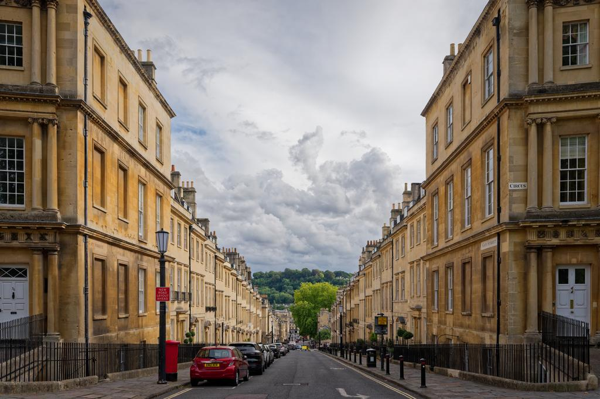

# Model Output Gallery

Generated on: 2026-09-11 21:56:43 BST

- *Evaluation lane:* assisted
- *Assessment:* General checks + metadata fields and duplicate keywords; length limits and factual accuracy not assessed
- *Input image:* JPEG, 8,693 x 5,796 pixels (50.4 MP), 43.9 MB

This run records model responses to one shared image and prompt (evaluation
lane: assisted). Mechanical checks are not factual-accuracy judgments; inspect
the image, prompt and final answers before choosing a model. Results do not
establish fitness for other tasks.

Complete per-model evidence artifact with image metadata, the source prompt, a
facts-only chooser, and full generated or crash output for every attempted
model.

## Reference Image



## Current-run Chooser

Mechanical observations and captured resource facts for this run only. No concerns detected does not mean the response fulfilled an arbitrary prompt or described the image accurately. Consult the assessment scope above. Total time is end-to-end; throughput covers generation only and requires at least 16 generated tokens. Prefill/first is first-token latency when captured; Prompt tok is the full rendered prompt including image tokens, which drives prefill cost. For cross-attention architectures the token count reflects the tokenised text burden only, not total vision prefill compute.

<!-- markdownlint-disable MD034 MD037 MD049 -->

| Model                                                                                                                   | Mechanical checks      | Total s | Gen TPS    | Prefill/first s | Peak GB | Prompt tok | Gen tok | Observations                                                              |
|-------------------------------------------------------------------------------------------------------------------------|------------------------|---------|------------|-----------------|---------|------------|---------|---------------------------------------------------------------------------|
| [`mlx-community/Devstral-Small-2-24B-Instruct-2512-5bit`](#model-mlx-community-devstral-small-2-24b-instruct-2512-5bit) | `no concerns detected` | 9.51s   | 29.8 tok/s | 3.58            | 23      | 2,400      | 98      | none                                                                      |
| [`mlx-community/ERNIE-4.5-VL-28B-A3B-Thinking-4bit`](#model-mlx-community-ernie-45-vl-28b-a3b-thinking-4bit)            | `no concerns detected` | 12.11s  | 108 tok/s  | 1.26            | 19      | 1,644      | 940     | none                                                                      |
| [`mlx-community/GLM-4.6V-Flash-4bit`](#model-mlx-community-glm-46v-flash-4bit)                                          | `no concerns detected` | 9.30s   | 77.2 tok/s | 5.90            | 8.7     | 6,393      | 128     | none                                                                      |
| [`mlx-community/Idefics3-8B-Llama3-bf16`](#model-mlx-community-idefics3-8b-llama3-bf16)                                 | `no concerns detected` | 10.38s  | 31.7 tok/s | 1.92            | 18      | 2,619      | 185     | none                                                                      |
| [`mlx-community/InternVL3-8B-bf16`](#model-mlx-community-internvl3-8b-bf16)                                             | `no concerns detected` | 6.40s   | 33.9 tok/s | 1.44            | 17      | 2,119      | 92      | none                                                                      |
| [`mlx-community/Kimi-VL-A3B-Thinking-2506-8bit`](#model-mlx-community-kimi-vl-a3b-thinking-2506-8bit)                   | `no concerns detected` | 21.71s  | 62.4 tok/s | 2.76            | 20      | 1,331      | 1,000   | none                                                                      |
| [`mlx-community/LFM2.5-VL-1.6B-bf16`](#model-mlx-community-lfm25-vl-16b-bf16)                                           | `no concerns detected` | 2.45s   | 188 tok/s  | 0.67            | 4.1     | 2,120      | 132     | none                                                                      |
| [`mlx-community/LFM2.5-VL-3B-OptiQ-4bit`](#model-mlx-community-lfm25-vl-3b-optiq-4bit)                                  | `no concerns detected` | 2.36s   | 212 tok/s  | 0.51            | 4.0     | 2,110      | 92      | none                                                                      |
| [`mlx-community/Ministral-3-14B-Instruct-2512-mxfp4`](#model-mlx-community-ministral-3-14b-instruct-2512-mxfp4)         | `no concerns detected` | 6.35s   | 67.0 tok/s | 2.11            | 13      | 2,933      | 163     | none                                                                      |
| [`mlx-community/Ministral-3-14B-Instruct-2512-nvfp4`](#model-mlx-community-ministral-3-14b-instruct-2512-nvfp4)         | `no concerns detected` | 7.20s   | 59.8 tok/s | 2.29            | 13      | 2,933      | 181     | none                                                                      |
| [`mlx-community/Ministral-3-3B-Instruct-2512-4bit`](#model-mlx-community-ministral-3-3b-instruct-2512-4bit)             | `no concerns detected` | 3.21s   | 180 tok/s  | 1.03            | 7.8     | 2,932      | 128     | none                                                                      |
| [`mlx-community/North-Micro-Vision-Instruct-4bit`](#model-mlx-community-north-micro-vision-instruct-4bit)               | `no concerns detected` | 4.36s   | 224 tok/s  | 2.26            | 3.9     | 4,094      | 104     | none                                                                      |
| [`mlx-community/Ornith-1.5-35B-A3B-OptiQ-4bit`](#model-mlx-community-ornith-15-35b-a3b-optiq-4bit)                      | `no concerns detected` | 5.59s   | 104 tok/s  | 1.27            | 24      | 1,295      | 124     | none                                                                      |
| [`mlx-community/Qwen3-VL-2B-Thinking-bf16`](#model-mlx-community-qwen3-vl-2b-thinking-bf16)                             | `no concerns detected` | 27.36s  | 88.1 tok/s | 15.66           | 8.4     | 16,555     | 893     | none                                                                      |
| [`mlx-community/Qwen3-VL-30B-A3B-Instruct-4bit`](#model-mlx-community-qwen3-vl-30b-a3b-instruct-4bit)                   | `no concerns detected` | 39.85s  | 84.4 tok/s | 35.44           | 23      | 16,553     | 140     | none                                                                      |
| [`mlx-community/Qwen3.5-35B-A3B-4bit`](#model-mlx-community-qwen35-35b-a3b-4bit)                                        | `no concerns detected` | 37.02s  | 109 tok/s  | 32.62           | 25      | 16,569     | 104     | none                                                                      |
| [`mlx-community/Qwen3.5-9B-MLX-4bit`](#model-mlx-community-qwen35-9b-mlx-4bit)                                          | `no concerns detected` | 40.85s  | 91.2 tok/s | 37.37           | 11      | 16,569     | 110     | none                                                                      |
| [`mlx-community/Qwen3.8-27B-4bit`](#model-mlx-community-qwen38-27b-4bit)                                                | `no concerns detected` | 59.40s  | 29.7 tok/s | 52.03           | 21      | 16,569     | 131     | none                                                                      |
| [`mlx-community/Step-3.7-Flash-oQ3e`](#model-mlx-community-step-37-flash-oq3e)                                          | `no concerns detected` | 37.78s  | 50.2 tok/s | 20.13           | 92      | 3,497      | 110     | none                                                                      |
| [`mlx-community/diffusiongemma-26B-A4B-it-mxfp8`](#model-mlx-community-diffusiongemma-26b-a4b-it-mxfp8)                 | `no concerns detected` | 6.89s   | 50.7 tok/s | 1.29            | 28      | 603        | 87      | none                                                                      |
| [`mlx-community/gemma-3-27b-it-qat-4bit`](#model-mlx-community-gemma-3-27b-it-qat-4bit)                                 | `no concerns detected` | 9.11s   | 29.3 tok/s | 1.06            | 17      | 602        | 155     | none                                                                      |
| [`mlx-community/gemma-4-26b-a4b-it-4bit`](#model-mlx-community-gemma-4-26b-a4b-it-4bit)                                 | `no concerns detected` | 4.26s   | 130 tok/s  | 0.52            | 16      | 607        | 109     | none                                                                      |
| [`mlx-community/gemma-4-31b-it-4bit`](#model-mlx-community-gemma-4-31b-it-4bit)                                         | `no concerns detected` | 8.42s   | 26.1 tok/s | 1.12            | 20      | 607        | 111     | none                                                                      |
| [`mlx-community/granite-4.0-3b-vision-4bit`](#model-mlx-community-granite-40-3b-vision-4bit)                            | `no concerns detected` | 2.77s   | 178 tok/s  | 1.07            | 4.6     | 1,386      | 70      | none                                                                      |
| [`mlx-community/pixtral-12b-8bit`](#model-mlx-community-pixtral-12b-8bit)                                               | `no concerns detected` | 7.58s   | 39.3 tok/s | 2.44            | 16      | 3,123      | 119     | none                                                                      |
| [`LiquidAI/LFM2.5-VL-450M-MLX-bf16`](#model-liquidai-lfm25-vl-450m-mlx-bf16)                                            | `concerns detected`    | 1.62s   | 484 tok/s  | 0.26            | 1.9     | 2,120      | 94      | duplicate keywords                                                        |
| [`mlx-community/GLM-4.6V-nvfp4`](#model-mlx-community-glm-46v-nvfp4)                                                    | `concerns detected`    | 26.44s  | 42.7 tok/s | 13.93           | 78      | 6,393      | 121     | control tokens visible                                                    |
| [`mlx-community/Phi-3.5-vision-instruct-bf16`](#model-mlx-community-phi-35-vision-instruct-bf16)                        | `concerns detected`    | 4.48s   | 55.9 tok/s | 0.57            | 9.3     | 1,141      | 142     | duplicate keywords                                                        |
| [`mlx-community/X-Reasoner-7B-8bit`](#model-mlx-community-x-reasoner-7b-8bit)                                           | `concerns detected`    | 20.10s  | 58.1 tok/s | 14.76           | 14      | 16,564     | 195     | duplicate keywords                                                        |
| [`mlx-community/Molmo2-8B-4bit`](#model-mlx-community-molmo2-8b-4bit)                                                   | `major concerns`       | 6.49s   | 71.0 tok/s | 3.07            | 8.1     | 1,530      | 127     | labelled fields not detected                                              |
| [`mlx-community/Muse-Glimmer-30B-OptiQ-4bit`](#model-mlx-community-muse-glimmer-30b-optiq-4bit)                         | `major concerns`       | 58.28s  | 22.3 tok/s | 9.74            | 25      | 4,411      | 1,000   | labelled fields not detected; cut off at token limit; role tokens visible |
| [`mlx-community/SmolVLM2-2.2B-Instruct-mlx`](#model-mlx-community-smolvlm2-22b-instruct-mlx)                            | `major concerns`       | 2.32s   | 127 tok/s  | 0.60            | 5.6     | 1,434      | 56      | labelled fields not detected                                              |
| [`mlx-community/nanoLLaVA-1.5-4bit`](#model-mlx-community-nanollava-15-4bit)                                            | `major concerns`       | 1.45s   | 338 tok/s  | 0.20            | 1.8     | 336        | 98      | labelled fields not detected                                              |
<!-- markdownlint-enable MD034 MD037 MD049 -->

## Resource Highlights

Quickest completion without detected concerns (end-to-end, including model load): `mlx-community/LFM2.5-VL-3B-OptiQ-4bit` at 2.36s

Lowest peak memory among completions without detected concerns: `mlx-community/North-Micro-Vision-Instruct-4bit` at 3.9 GB

Decode tok/s stays per model in the chooser and is not averaged across models: tokenizers, image-token expansion and reasoning lengths differ too much for a cross-model mean to guide a choice.

## Avoid for This Run

<!-- markdownlint-disable MD034 MD037 MD049 -->

| Model                                                                                           | Mechanical checks | Observations                                                              |
|-------------------------------------------------------------------------------------------------|-------------------|---------------------------------------------------------------------------|
| [`mlx-community/Molmo2-8B-4bit`](#model-mlx-community-molmo2-8b-4bit)                           | `major concerns`  | labelled fields not detected                                              |
| [`mlx-community/Muse-Glimmer-30B-OptiQ-4bit`](#model-mlx-community-muse-glimmer-30b-optiq-4bit) | `major concerns`  | labelled fields not detected; cut off at token limit; role tokens visible |
| [`mlx-community/SmolVLM2-2.2B-Instruct-mlx`](#model-mlx-community-smolvlm2-22b-instruct-mlx)    | `major concerns`  | labelled fields not detected                                              |
| [`mlx-community/nanoLLaVA-1.5-4bit`](#model-mlx-community-nanollava-15-4bit)                    | `major concerns`  | labelled fields not detected                                              |
<!-- markdownlint-enable MD034 MD037 MD049 -->

## Output at a Glance

A compact preview of each model's final answer (or failure evidence for crashes), in chooser order. Where the requested catalogue fields were detected, the preview shows a little of each: the title, the start of the description, and the first keywords with their count, so the weakest field is not hidden behind a long description. Otherwise it is the first 280 characters. A closed reasoning trace is left out of the preview and reported as an omitted-character count; the complete output, trace included, is in the model's evidence block below.

<!-- markdownlint-disable MD034 MD037 MD049 -->

| Model                                                                                                                   | Mechanical checks      | Output preview                                                                                                                                                                                                                                                                                                                                                                        |
|-------------------------------------------------------------------------------------------------------------------------|------------------------|---------------------------------------------------------------------------------------------------------------------------------------------------------------------------------------------------------------------------------------------------------------------------------------------------------------------------------------------------------------------------------------|
| [`mlx-community/Devstral-Small-2-24B-Instruct-2512-5bit`](#model-mlx-community-devstral-small-2-24b-instruct-2512-5bit) | `no concerns detected` | Title: Gay Street, Bath, Georgian Architecture \| Description: A street-level view downhill along Gay Street in Bath, England, showcasing classic Georgian terraced townho... \| Keywords (16): Gay Street, Bath, Georgian architecture, Bath stone, terraced townhouses, cloudy sky, street scene, ...                                                                               |
| [`mlx-community/ERNIE-4.5-VL-28B-A3B-Thinking-4bit`](#model-mlx-community-ernie-45-vl-28b-a3b-thinking-4bit)            | `no concerns detected` | Title: Gay Street, Bath: Georgian Terraces Under Dramatic Clouds \| Description: A street-level view from Gay Street in Bath, Somerset, England, looking downhill tow... \| Keywords (13): Gay Street, Bath, Somerset, England, Georgian architecture, Bath Stone, Terraced Townhouses, Cloudy Sky, ...[2,834 characters of reasoning omitted; complete output in the evidence block] |
| [`mlx-community/GLM-4.6V-Flash-4bit`](#model-mlx-community-glm-46v-flash-4bit)                                          | `no concerns detected` | Title: Gay Street, Bath \| Description: A street-level view looking downhill along Gay Street from The Circus, showcasing the classic Georgian architecture of Bath... \| Keywords (20): Architecture, Bath, Bath England, Bath Stone, Cars, Chimneys, Cityscape, Cloudy Sky, England, Gay Street, ...                                                                                |
| [`mlx-community/Idefics3-8B-Llama3-bf16`](#model-mlx-community-idefics3-8b-llama3-bf16)                                 | `no concerns detected` | Title: Georgian Architecture on Gay Street in Bath, England. \| Description: This image captures a picturesque street-level view of Gay Street in Bath, England, sho... \| Keywords (20): Architecture, Bath, Bath England, Bath Stone, Cars, Chimneys, Cityscape, Cloudy Sky, England, Gay Street, ...                                                                               |
| [`mlx-community/InternVL3-8B-bf16`](#model-mlx-community-internvl3-8b-bf16)                                             | `no concerns detected` | Title: Georgian Bath Street Scene \| Description: A picturesque street view from The Circus along Gay Street, showcasing classic Bath stone terraced townhouses under a dramatic c... \| Keywords (18): Architecture, Bath, Bath Stone, Cars, Chimneys, Cityscape, Cloudy Sky, England, Gay Street, ...                                                                               |
| [`mlx-community/Kimi-VL-A3B-Thinking-2506-8bit`](#model-mlx-community-kimi-vl-a3b-thinking-2506-8bit)                   | `no concerns detected` | Title: Georgian Architecture on Gay Street, Bath \| Description: A street-level view looking downhill along Gay Street from The Circus, showcasing classic Georgian architecture o... \| Keywords (15): Architecture, Bath, Bath Stone, Cars, Chimneys, Cityscape, Cloudy Sky, England, Gay Street, ...[3,684 characters of reasoning omitted; complete output in the evidence block] |
| [`mlx-community/LFM2.5-VL-1.6B-bf16`](#model-mlx-community-lfm25-vl-16b-bf16)                                           | `no concerns detected` | Title: Georgian Architecture on Gay Street, Bath, Somerset \| Description: This image captures a picturesque street scene in Bath, Somerset, England, showcasing the cl... \| Keywords (12): Georgian architecture, Bath, Somerset, Bath stone, terraced townhouses, chimneys, cloudy sky, England, ...                                                                               |
| [`mlx-community/LFM2.5-VL-3B-OptiQ-4bit`](#model-mlx-community-lfm25-vl-3b-optiq-4bit)                                  | `no concerns detected` | Title: Georgian architecture along Gay Street in Bath, England \| Description: A street-level view looking downhill along Gay Street from The Circus, showcasi... \| Keywords (15): Bath, England, Georgian architecture, Gay Street, Bath Stone, Cars, Chimneys, Cityscape, Cloudy Sky, Lamp post, ...                                                                               |
| [`mlx-community/Ministral-3-14B-Instruct-2512-mxfp4`](#model-mlx-community-ministral-3-14b-instruct-2512-mxfp4)         | `no concerns detected` | Title: **Gay Street, Bath: Georgian Terraces under Dramatic Skies** \| Description: A street-level photograph captures Gay Street in Bath, England, showcasing its icon... \| Keywords (18): Gay Street, Bath, Georgian architecture, Bath stone, townhouses, sash windows, chimneys, street scene, ...                                                                               |
| [`mlx-community/Ministral-3-14B-Instruct-2512-nvfp4`](#model-mlx-community-ministral-3-14b-instruct-2512-nvfp4)         | `no concerns detected` | Title: *Gay Street, Bath: Georgian Terraces in Twilight* \| Description: A dramatic street-level view of Gay Street, Bath, captured on **September 1, 2026, at 16:08 UTC+... \| Keywords (21): Gay Street, Bath, Georgian architecture, Bath stone, Georgian terraces, Twilight, Twilight lighting, ...                                                                               |
| [`mlx-community/Ministral-3-3B-Instruct-2512-4bit`](#model-mlx-community-ministral-3-3b-instruct-2512-4bit)             | `no concerns detected` | Title: Gay Street’s Georgian Bath Stone Terrace Walk \| Description: A cloudy September afternoon captures the rolling hills of Bath’s historic streets, framed by el... \| Keywords (14): Bath stone terraced townhouses, Bath England, Bath stone, Gay Street, Georgian architecture, cloudy sky, ...                                                                               |
| [`mlx-community/North-Micro-Vision-Instruct-4bit`](#model-mlx-community-north-micro-vision-instruct-4bit)               | `no concerns detected` | Title: Gay Street, Bath, England \| Description: A street-level view looking downhill along Gay Street from The Circus, showcasing the classic Georgian architecture... \| Keywords (20): Architecture, Bath, Bath England, Bath Stone, Cars, Chimneys, Cityscape, Cloudy Sky, England, Gay Street, ...                                                                               |
| [`mlx-community/Ornith-1.5-35B-A3B-OptiQ-4bit`](#model-mlx-community-ornith-15-35b-a3b-optiq-4bit)                      | `no concerns detected` | Title: Gay Street View from The Circus, Bath \| Description: A street-level view looking downhill along Gay Street from The Circus, showcasing rows of Georgian Bath stone terrace... \| Keywords (19): Architecture, Bath, Bath Stone, Cars, Chimneys, Cityscape, Cloudy Sky, England, Gay Street, ...                                                                               |
| [`mlx-community/Qwen3-VL-2B-Thinking-bf16`](#model-mlx-community-qwen3-vl-2b-thinking-bf16)                             | `no concerns detected` | Title: Gay Street, Bath: Georgian Architecture with Circus Sign \| Description: Downhill street view of Gay Street, Bath, England, showcasing Georgian stone terrace... \| Keywords (12): Bath, Georgian architecture, Gay Street, Bath Stone, Cloudy Sky, Cars, Chimneys, Lamp post, Sash Windows, ...[3,237 characters of reasoning omitted; complete output in the evidence block] |
| [`mlx-community/Qwen3-VL-30B-A3B-Instruct-4bit`](#model-mlx-community-qwen3-vl-30b-a3b-instruct-4bit)                   | `no concerns detected` | Title: Gay Street, Bath, under a dramatic cloudy sky \| Description: A street-level view looking downhill along Gay Street in Bath, Somerset, England, showcasing classic Georgian... \| Keywords (19): Bath, Bath England, Bath Stone, Cars, Chimneys, Cityscape, Cloudy Sky, England, Gay Street, ...                                                                               |
| [`mlx-community/Qwen3.5-35B-A3B-4bit`](#model-mlx-community-qwen35-35b-a3b-4bit)                                        | `no concerns detected` | Title: Gay Street View from The Circus Bath \| Description: A street-level perspective looking downhill along Gay Street from The Circus, showcasing the classic Georgian... \| Keywords (18): Gay Street, The Circus, Bath, Bath Stone, Georgian architecture, Cloudy Sky, Parked Cars, Railings, ...                                                                                |
| [`mlx-community/Qwen3.5-9B-MLX-4bit`](#model-mlx-community-qwen35-9b-mlx-4bit)                                          | `no concerns detected` | Title: Gay Street, Bath: Georgian Terraces Under Cloudy Skies \| Description: A street-level view of Gay Street in Bath, Somerset, showcasing elegant Georgian terraced tow... \| Keywords (17): Gay Street, Bath, Georgian architecture, Bath stone, terraced townhouses, parked cars, cloudy sky, ...                                                                               |
| [`mlx-community/Qwen3.8-27B-4bit`](#model-mlx-community-qwen38-27b-4bit)                                                | `no concerns detected` | Title: Gerian Architecture of Gay Street, Bath \| Description: A street-level view looking downhill along Gay Street in Bath, Somerset, framed by classic Georgian t... \| Keywords (20): Architecture, Bath, Bath England, Bath Stone, Cars, Chimneys, Cityscape, Cloudy Sky, England, Gay Street, ...                                                                               |
| [`mlx-community/Step-3.7-Flash-oQ3e`](#model-mlx-community-step-37-flash-oq3e)                                          | `no concerns detected` | Title: Gay Street, Bath: Georgian Terraces and Parked Cars \| Description: A street-level view looking downhill along Gay Street from The Circus, showcasing classic... \| Keywords (18): Architecture, Bath, Bath England, Bath Stone, Cars, Chimneys, Cityscape, Cloudy Sky, England, Gay Street, ...                                                                               |
| [`mlx-community/diffusiongemma-26B-A4B-it-mxfp8`](#model-mlx-community-diffusiongemma-26b-a4b-it-mxfp8)                 | `no concerns detected` | Title: Georgian Architecture of Gay Street at The Circus, Bath \| Description: A street-level view looking downhill along Gay Street from The Circus, showcasing classi... \| Keywords (14): Architecture, Bath, Somerset, England, Georgian architecture, Gay Street, Circus, Stone, Sash Windows, ...                                                                               |
| [`mlx-community/gemma-3-27b-it-qat-4bit`](#model-mlx-community-gemma-3-27b-it-qat-4bit)                                 | `no concerns detected` | Title: Gay Street, Bath: Georgian Architecture under Cloudy Skies \| Description: Captured on 1st September 2026 at 16:08 UTC+01, this street-level view looks down... \| Keywords (23): Architecture, Bath, Bath England, Bath Stone, Cars, Chimneys, Cityscape, Cloudy Sky, England, Gay Street, ...                                                                                |
| [`mlx-community/gemma-4-26b-a4b-it-4bit`](#model-mlx-community-gemma-4-26b-a4b-it-4bit)                                 | `no concerns detected` | Title: Georgian terraced houses on Gay Street in Bath \| Description: A street-level view looking downhill along Gay Street from The Circus, showcasing classic... \| Keywords (15): Architecture, Bath, Bath Stone, Cityscape, Cloudy Sky, England, Gay Street, Georgian architecture, Lamp post, ...                                                                                |
| [`mlx-community/gemma-4-31b-it-4bit`](#model-mlx-community-gemma-4-31b-it-4bit)                                         | `no concerns detected` | Title: Gay Street View from The Circus in Bath \| Description: A street-level view looking downhill along Gay Street in Bath, Somerset, featuring classic Georgian Bath stone terr... \| Keywords (17): Architecture, Bath, Bath Stone, Cars, Chimneys, Cityscape, Cloudy Sky, England, Gay Street, ...                                                                               |
| [`mlx-community/granite-4.0-3b-vision-4bit`](#model-mlx-community-granite-40-3b-vision-4bit)                            | `no concerns detected` | Title: Georgian Architecture in Bath \| Description: A street-level view of Gay Street in Bath, showcasing classic Georgian townhouses with Bath stone facades and a dr... \| Keywords (10): Georgian architecture, Bath stone, townhouses, cloudy sky, street scene, street signs, black railings, ...                                                                               |
| [`mlx-community/pixtral-12b-8bit`](#model-mlx-community-pixtral-12b-8bit)                                               | `no concerns detected` | Title: Gay Street in Bath, England under Cloudy Sky \| Description: This image captures a street-level view looking downhill along Gay Street from The Circus, showc... \| Keywords (20): Architecture, Bath, Bath England, Bath Stone, Cars, Chimneys, Cityscape, Cloudy Sky, England, Gay Street, ...                                                                               |
| [`LiquidAI/LFM2.5-VL-450M-MLX-bf16`](#model-liquidai-lfm25-vl-450m-mlx-bf16)                                            | `concerns detected`    | Title: Gay Street, Bath, England \| Description: A street-level view of Gay Street from The Circus, showcasing the classic Georgian architecture of Bath stone te... \| Keywords (15): Gay Street, Bath, England, Georgian architecture, Bath stone, Cars, Chimneys, Cityscape, Cloudy Sky, London, ...                                                                               |
| [`mlx-community/GLM-4.6V-nvfp4`](#model-mlx-community-glm-46v-nvfp4)                                                    | `concerns detected`    | Title: (not detected) \| Description: A street-level view looking downhill along Gay Street from The Circus, showcasing classic Georgian architecture of Bath stone... \| Keywords (20): Architecture, Bath, Bath England, Bath Stone, Cars, Chimneys, Cityscape, Cloudy Sky, England, Gay Street, ...                                                                                |
| [`mlx-community/Phi-3.5-vision-instruct-bf16`](#model-mlx-community-phi-35-vision-instruct-bf16)                        | `concerns detected`    | Title: Georgian Architecture of Bath Stone Townhouses \| Description: A serene street scene in Bath, Somerset, England, showcases the iconic Georgian architecture o... \| Keywords (22): Georgian architecture, Bath stone, Bath, Somerset, England, Bath street, townhouses, cloudy sky, red car, ...                                                                               |
| [`mlx-community/X-Reasoner-7B-8bit`](#model-mlx-community-x-reasoner-7b-8bit)                                           | `concerns detected`    | Title: Bath's Georgian Terraces: Gay Street from The Circus \| Description: A serene street-level view of Bath's iconic Georgian architecture, with terraced tow... \| Keywords (31): Bath, Bath England, Bath Stone, Georgian architecture, Gay Street, The Circus, Somerset, England, Cloudy Sky, ...                                                                               |
| [`mlx-community/Molmo2-8B-4bit`](#model-mlx-community-molmo2-8b-4bit)                                                   | `major concerns`       | Gay Street, Bath: Georgian Terraces, Cloudy Afternoon<br><br>A street-level view looking downhill along Gay Street from The Circus, showcasing the classic Georgian architecture of Bath stone terraced townhouses against a dramatic cloudy sky. The scene features parked cars, railings,...                                                                                        |
| [`mlx-community/Muse-Glimmer-30B-OptiQ-4bit`](#model-mlx-community-muse-glimmer-30b-optiq-4bit)                         | `major concerns`       | Title: (not detected) \| Description: (not detected) \| Keywords (2): Need title 5-10 words. Concrete., ...                                                                                                                                                                                                                                                                           |
| [`mlx-community/SmolVLM2-2.2B-Instruct-mlx`](#model-mlx-community-smolvlm2-22b-instruct-mlx)                            | `major concerns`       | Georgian Architecture, Bath England, Bath Stone, Cars, Chimneys, Cityscape, Cloudy Sky, England, Gay Street, Georgian Architecture, Hills, Lamp Post, Parked Cars, Railings, Sash Windows, Somerset, Street, Street Scene, Street Signs.                                                                                                                                              |
| [`mlx-community/nanoLLaVA-1.5-4bit`](#model-mlx-community-nanollava-15-4bit)                                            | `major concerns`       | Title: Street Scene in Bath, England \| Description: A detailed view of a street scene in Bath, England, showcasing the classic Georgian architecture of the town. The image captures the street from The Circus, featuring the iconic street signs and the surrounding... \| Keywords: (not detected)                                                                                |
<!-- markdownlint-enable MD034 MD037 MD049 -->

## Run Stamps

- `mlx-vlm`: `0.7.0`
- `mlx`: `0.32.3.dev20260911+dfe17bafb`
- `transformers`: `5.17.0`
- `tokenizers`: `0.23.2`
- `huggingface-hub`: `1.31.0`
- *Python Version:* 3.14.7
- *OS:* Darwin 25.6.0
- *macOS Version:* 26.6.2
- *GPU/Chip:* Apple M5 Max
- *MLX Device:* Apple M5 Max
- *GPU Architecture:* applegpu_g17s
- *RAM:* 128.0 GB
- *Recommended Working Set:* 108 GB
- *Fused Attention:* Available

## Image Metadata

- *Description:* A street-level view looking downhill along Gay Street from
  The Circus, showcasing the classic Georgian architecture of Bath stone
  terraced townhouses against a dramatic cloudy sky in Bath, Somerset,
  England.
- *Keywords:* Architecture, Bath, Bath England, Bath Stone, Cars, Chimneys,
  Cityscape, Cloudy Sky, England, Gay Street, Georgian architecture, Hills,
  Lamp post, Parked Cars, Railings, Sash Windows, Somerset, Street, Street
  Scene, Street signs, Street view, The Circus, Townhouses, Trees, UK city,
  United Kingdom, Urban landscape, blind windows, british architecture,
  classic, day, downhill street, exterior, facade, great britain, heritage,
  historic, historic buildings, historic city, iron railings, limestone,
  neoclassical, pavement, pillar box, residential street, scenic, sightseeing,
  street lighting, terraced houses, tourism, townhouse, travel destination,
  unesco world heritage, urban, window tax
- *Date:* 2026-09-01 16:08:37 UTC+01:00
- *Time:* 16:08:37
- *GPS:* 51.385512°N, 2.363704°W

## Prompt

<!-- markdownlint-disable MD011 MD028 MD037 MD045 -->
>
> Create British-English catalogue metadata from the image and supplied
> context.
>
> Treat any capture date/time and GPS as authoritative facts, but do not claim
> they are visible. Descriptive hints may be incomplete or wrong: retain
> details supported by the image, correct conflicts, and add important visible
> details. Prefer image evidence when a hint conflicts, and omit uncertain
> details.
>
> Context: Authoritative context:
> &#45; Capture date/time: 2026-09-01 16:08:37 UTC+01:00
> &#45; GPS: 51.385512°N, 2.363704°W
>
> &#8203;Descriptive hints:
> &#45; Description hint: A street-level view looking downhill along Gay Street
> from The Circus, showcasing the classic Georgian architecture of Bath stone
> terraced townhouses against a dramatic cloudy sky in Bath, Somerset,
> England.
> &#45; Keyword hints: Architecture, Bath, Bath England, Bath Stone, Cars,
> Chimneys, Cityscape, Cloudy Sky, England, Gay Street, Georgian architecture,
> Hills, Lamp post, Parked Cars, Railings, Sash Windows, Somerset, Street,
> Street Scene, Street signs
>
> &#8203;Write:
> &#45; a concrete 5-10-word title;
> &#45; a 1-2-sentence factual description combining relevant context with the
> main visible subject, setting, action, lighting, and distinctive details;
> &#45; 10-18 unique, comma-separated keywords covering relevant context and
> visible details.
>
> &#8203;Return exactly these three sections and nothing else:
> &#8203;Title:
> &#8203;Description:
> &#8203;Keywords:
<!-- markdownlint-enable MD011 MD028 MD037 MD045 -->

## Complete Per-model Evidence

Complete generated or crash evidence for every attempted model.

<a id="model-mlx-community-devstral-small-2-24b-instruct-2512-5bit"></a>

### mlx-community/Devstral-Small-2-24B-Instruct-2512-5bit

<details>
<summary>Complete evidence: mlx-community/Devstral-Small-2-24B-Instruct-2512-5bit</summary>

- *Execution:* completed
- *Mechanical checks:* no concerns detected
- *Assessment:* General checks + metadata fields and duplicate keywords;
  length limits and factual accuracy not assessed
- *Maintainer status:* none
- *Observations:* none
- *Arch supported by installed mlx-vlm:* yes (model_type mistral3)
- *Model load time:* 2.09s
- *Generation time:* 7.40s
- *Total time:* 9.51s
- *Input validation time:* 3.93e-05
- *Prompt preparation time:* 0.00777
- *First-token latency:* 3.58
- *Cleanup time:* 0.102
- *Prompt tokens:* 2,400
- *Generation tokens:* 98
- *Total tokens:* 2,498
- *Prompt throughput (raw):* 670 tok/s
- *Generation throughput (raw):* 29.8 tok/s
- *Peak memory:* 23
- *Active memory:* 18
- *Cache memory:* 0.47
- *Model-load active memory:* 18
- *Post-cleanup active memory:* 0.000394
- *Post-cleanup cache memory:* 0.0
- *Stop reason:* completed
- *Requested maximum tokens:* 1000
- *Rendered prompt characters:* 1374
- *Image placeholders:* 0
- *Processed image:* not captured
- *Image patch count:* not captured
- *Processor:* mlx_vlm.models.mistral3.processing_mistral3.Mistral3Processor
- *Tokenizer:* transformers.tokenization_utils_tokenizers.TokenizersBackend
- *Requested model revision:* not requested
- *Resolved model revision:* 0a970d20ad7da57b0e2accc35c5b8628f5d02063
- *Resolved snapshot path:* ~/.cache/huggingface/hub/models--mlx-community--Devstral-Small-2-24B-Instruct-2512-5bit/snapshots/0a970d20ad7da57b0e2accc35c5b8628f5d02063
- *Generation settings:* {"max_tokens": 1000, "prefill_step_size": 2048,
  "temperature": 0.0, "top_p": 1.0}
- *EOS token:* &lt;/s&gt;

*Readable output:*

<pre class="model-output-readable">
Title:
Gay Street, Bath, Georgian Architecture

Description:
A street-level view downhill along Gay Street in Bath, England, showcasing classic Georgian terraced townhouses in Bath stone, under a dramatic cloudy sky.

Keywords:
Gay Street, Bath, Georgian architecture, Bath stone, terraced townhouses, cloudy sky, street scene, parked cars, lamp post, railings, sash windows, chimneys, hills, cityscape, England, Somerset
</pre>

</details>

---

<a id="model-mlx-community-ernie-45-vl-28b-a3b-thinking-4bit"></a>

### mlx-community/ERNIE-4.5-VL-28B-A3B-Thinking-4bit

<details>
<summary>Complete evidence: mlx-community/ERNIE-4.5-VL-28B-A3B-Thinking-4bit</summary>

- *Execution:* completed
- *Mechanical checks:* no concerns detected
- *Assessment:* General checks + metadata fields and duplicate keywords;
  length limits and factual accuracy not assessed
- *Maintainer status:* none
- *Observations:* none
- *Arch supported by installed mlx-vlm:* yes (model_type ernie4_5_moe_vl)
- *Model load time:* 1.62s
- *Generation time:* 10.48s
- *Total time:* 12.11s
- *Input validation time:* 6.13e-05
- *Prompt preparation time:* 0.00889
- *First-token latency:* 1.26
- *Cleanup time:* 0.0952
- *Prompt tokens:* 1,644
- *Generation tokens:* 940
- *Total tokens:* 2,584
- *Prompt throughput (raw):* 1,308 tok/s
- *Generation throughput (raw):* 108 tok/s
- *Peak memory:* 19
- *Active memory:* 17
- *Cache memory:* 0.18
- *Model-load active memory:* 17.4
- *Post-cleanup active memory:* 0.000607
- *Post-cleanup cache memory:* 0.0
- *Stop reason:* completed
- *Requested maximum tokens:* 1000
- *Rendered prompt characters:* 1564
- *Image placeholders:* 0
- *Processed image:* not captured
- *Image patch count:* not captured
- *Processor:* mlx_vlm.models.ernie4_5_moe_vl.processing_ernie4_5_moe_vl.Ernie4_5_VLProcessor
- *Tokenizer:* mlx_vlm.models.ernie4_5_moe_vl.processing_ernie4_5_moe_vl.Ernie4_5_VLTokenizer
- *Requested model revision:* not requested
- *Resolved model revision:* 846ea5576854468f25af3767d769b0805b1b08b6
- *Resolved snapshot path:* ~/.cache/huggingface/hub/models--mlx-community--ERNIE-4.5-VL-28B-A3B-Thinking-4bit/snapshots/846ea5576854468f25af3767d769b0805b1b08b6
- *Generation settings:* {"enable_thinking": true, "max_tokens": 1000,
  "prefill_step_size": 2048, "temperature": 0.0, "thinking_budget": 800,
  "thinking_end_token": "&lt;/think&gt;", "thinking_start_token":
  "&lt;think&gt;", "top_p": 1.0}
- *EOS token:* &lt;/s&gt;

*Readable output:*

<pre class="model-output-readable">
Let's tackle this step by step. First, the title needs to be concrete, 5-10 words. The image is of Bath, specifically Gay Street looking downhill from The Circus, with Georgian architecture. So maybe "Gay Street, Bath: Georgian Terraces Under Dramatic Clouds" – that's 8 words, covers the key elements.

Next, the description. Need to combine context (date/time, GPS) with main subject, setting, action, lighting, distinctive details. The context says capture date is 2026-09-01 16:08:37 UTC+01:00, GPS 51.385512°N, 2.363704°W (Bath). The hint says street-level view downhill along Gay Street from The Circus, Georgian architecture, dramatic cloudy sky. So put that together: "A street-level view from Gay Street in Bath, Somerset, England, looking downhill towards The Circus, showcasing Georgian-style Bath stone terraced townhouses under a dramatic cloudy sky on September 1, 2026, at 4:08 PM local time." Wait, need to check if the time is correct – 16:08 UTC+01:00 is 4:08 PM. That's factual.

Keywords: Need 10-18 unique, comma-separated. From the hints: Architecture, Bath, Bath England, Bath Stone, Cars, Chimneys, Cityscape, Cloudy Sky, England, Gay Street, Georgian architecture, Hills, Lamp post, Parked Cars, Railings, Sash Windows, Somerset, Street, Street Scene, Street signs. Let's pick the most relevant: Gay Street, Bath, Somerset, England, Georgian architecture, Bath Stone, Terraced Townhouses, Cloudy Sky, Street Scene, Parked Cars, Lamp Post, Chimneys, Sash Windows. Wait, need to make sure they're unique and cover relevant details. Let's list them: Gay Street, Bath, Somerset, England, Georgian architecture, Bath Stone, Terraced Townhouses, Cloudy Sky, Street Scene, Parked Cars, Lamp Post, Chimneys, Sash Windows. That's 13, which is good.

Wait, let's check the title again. Maybe "Gay Street, Bath: Georgian Terraces Under Dramatic Clouds" – yes, that's 8 words, concrete.

Description: Let's refine. "A street-level view from Gay Street in Bath, Somerset, England, looking downhill towards The Circus, showcasing Georgian-style Bath stone terraced townhouses under a dramatic cloudy sky, captured on September 1, 2026, at 4:08 PM local time." That's 2 sentences, combines context (date, GPS location), main subject (Gay Street, The Circus), setting (Bath, Somerset), action (looking downhill), lighting (dramatic cloudy sky), distinctive details (Georgian architecture, Bath stone).

Keywords: Let's make sure they're unique and from the hints. The hints have: Architecture, Bath, Bath England, Bath Stone, Cars, Chimneys, Cityscape, Cloudy Sky, England, Gay Street, Georgian architecture, Hills, Lamp post, Parked Cars, Railings, Sash Windows, Somerset, Street, Street Scene, Street signs. Let's pick the most relevant: Gay Street, Bath, Somerset, England, Georgian architecture, Bath Stone, Terr
&lt;/think&gt;

Title: Gay Street, Bath: Georgian Terraces Under Dramatic Clouds

Description: A street-level view from Gay Street in Bath, Somerset, England, looking downhill towards The Circus, showcasing Georgian-style Bath stone terraced townhouses under a dramatic cloudy sky, captured on September 1, 2026, at 4:08 PM local time.

Keywords: Gay Street, Bath, Somerset, England, Georgian architecture, Bath Stone, Terraced Townhouses, Cloudy Sky, Street Scene, Parked Cars, Lamp Post, Chimneys, Sash Windows
</pre>

<details>
<summary>Exact raw output</summary>

```text
Let's tackle this step by step. First, the title needs to be concrete, 5-10 words. The image is of Bath, specifically Gay Street looking downhill from The Circus, with Georgian architecture. So maybe "Gay Street, Bath: Georgian Terraces Under Dramatic Clouds" – that's 8 words, covers the key elements.

Next, the description. Need to combine context (date/time, GPS) with main subject, setting, action, lighting, distinctive details. The context says capture date is 2026-09-01 16:08:37 UTC+01:00, GPS 51.385512°N, 2.363704°W (Bath). The hint says street-level view downhill along Gay Street from The Circus, Georgian architecture, dramatic cloudy sky. So put that together: "A street-level view from Gay Street in Bath, Somerset, England, looking downhill towards The Circus, showcasing Georgian-style Bath stone terraced townhouses under a dramatic cloudy sky on September 1, 2026, at 4:08 PM local time." Wait, need to check if the time is correct – 16:08 UTC+01:00 is 4:08 PM. That's factual.

Keywords: Need 10-18 unique, comma-separated. From the hints: Architecture, Bath, Bath England, Bath Stone, Cars, Chimneys, Cityscape, Cloudy Sky, England, Gay Street, Georgian architecture, Hills, Lamp post, Parked Cars, Railings, Sash Windows, Somerset, Street, Street Scene, Street signs. Let's pick the most relevant: Gay Street, Bath, Somerset, England, Georgian architecture, Bath Stone, Terraced Townhouses, Cloudy Sky, Street Scene, Parked Cars, Lamp Post, Chimneys, Sash Windows. Wait, need to make sure they're unique and cover relevant details. Let's list them: Gay Street, Bath, Somerset, England, Georgian architecture, Bath Stone, Terraced Townhouses, Cloudy Sky, Street Scene, Parked Cars, Lamp Post, Chimneys, Sash Windows. That's 13, which is good.

Wait, let's check the title again. Maybe "Gay Street, Bath: Georgian Terraces Under Dramatic Clouds" – yes, that's 8 words, concrete.

Description: Let's refine. "A street-level view from Gay Street in Bath, Somerset, England, looking downhill towards The Circus, showcasing Georgian-style Bath stone terraced townhouses under a dramatic cloudy sky, captured on September 1, 2026, at 4:08 PM local time." That's 2 sentences, combines context (date, GPS location), main subject (Gay Street, The Circus), setting (Bath, Somerset), action (looking downhill), lighting (dramatic cloudy sky), distinctive details (Georgian architecture, Bath stone).

Keywords: Let's make sure they're unique and from the hints. The hints have: Architecture, Bath, Bath England, Bath Stone, Cars, Chimneys, Cityscape, Cloudy Sky, England, Gay Street, Georgian architecture, Hills, Lamp post, Parked Cars, Railings, Sash Windows, Somerset, Street, Street Scene, Street signs. Let's pick the most relevant: Gay Street, Bath, Somerset, England, Georgian architecture, Bath Stone, Terr
</think>

Title: Gay Street, Bath: Georgian Terraces Under Dramatic Clouds

Description: A street-level view from Gay Street in Bath, Somerset, England, looking downhill towards The Circus, showcasing Georgian-style Bath stone terraced townhouses under a dramatic cloudy sky, captured on September 1, 2026, at 4:08 PM local time.

Keywords: Gay Street, Bath, Somerset, England, Georgian architecture, Bath Stone, Terraced Townhouses, Cloudy Sky, Street Scene, Parked Cars, Lamp Post, Chimneys, Sash Windows
```

</details>

</details>

---

<a id="model-mlx-community-glm-46v-flash-4bit"></a>

### mlx-community/GLM-4.6V-Flash-4bit

<details>
<summary>Complete evidence: mlx-community/GLM-4.6V-Flash-4bit</summary>

- *Execution:* completed
- *Mechanical checks:* no concerns detected
- *Assessment:* General checks + metadata fields and duplicate keywords;
  length limits and factual accuracy not assessed
- *Maintainer status:* none
- *Observations:* none
- *Arch supported by installed mlx-vlm:* yes (model_type glm4v)
- *Model load time:* 1.25s
- *Generation time:* 8.03s
- *Total time:* 9.30s
- *Input validation time:* 7.4e-05
- *Prompt preparation time:* 0.00802
- *First-token latency:* 5.9
- *Cleanup time:* 0.0812
- *Prompt tokens:* 6,393
- *Generation tokens:* 128
- *Total tokens:* 6,521
- *Prompt throughput (raw):* 1,083 tok/s
- *Generation throughput (raw):* 77.2 tok/s
- *Peak memory:* 8.7
- *Active memory:* 7.1
- *Cache memory:* 0.46
- *Model-load active memory:* 7.07
- *Post-cleanup active memory:* 0.000919
- *Post-cleanup cache memory:* 0.0
- *Stop reason:* completed
- *Requested maximum tokens:* 1000
- *Rendered prompt characters:* 1455
- *Image placeholders:* 1
- *Processed image:* not captured
- *Image patch count:* not captured
- *Processor:* mlx_vlm.models.glm4v.processing.Glm46VProcessor
- *Tokenizer:* transformers.tokenization_utils_tokenizers.TokenizersBackend
- *Requested model revision:* not requested
- *Resolved model revision:* bd7b20686e8cbf22ad221a3de8399cdc5a2a7e0e
- *Resolved snapshot path:* ~/.cache/huggingface/hub/models--mlx-community--GLM-4.6V-Flash-4bit/snapshots/bd7b20686e8cbf22ad221a3de8399cdc5a2a7e0e
- *Generation settings:* {"max_tokens": 1000, "prefill_step_size": 2048,
  "temperature": 0.0, "top_p": 1.0}
- *EOS token:* <\|endoftext\|>

*Readable output:*

<pre class="model-output-readable">
Title: Gay Street, Bath
Description: A street-level view looking downhill along Gay Street from The Circus, showcasing the classic Georgian architecture of Bath stone terraced townhouses against a dramatic cloudy sky in Bath, Somerset, England, captured on 2026-09-01 at 16:08:37 UTC+01:00.
Keywords: Architecture, Bath, Bath England, Bath Stone, Cars, Chimneys, Cityscape, Cloudy Sky, England, Gay Street, Georgian architecture, Hills, Lamp post, Parked Cars, Railings, Sash Windows, Somerset, Street, Street Scene, Street signs
</pre>

</details>

---

<a id="model-mlx-community-idefics3-8b-llama3-bf16"></a>

### mlx-community/Idefics3-8B-Llama3-bf16

<details>
<summary>Complete evidence: mlx-community/Idefics3-8B-Llama3-bf16</summary>

- *Execution:* completed
- *Mechanical checks:* no concerns detected
- *Assessment:* General checks + metadata fields and duplicate keywords;
  length limits and factual accuracy not assessed
- *Maintainer status:* none
- *Observations:* none
- *Arch supported by installed mlx-vlm:* yes (model_type idefics3)
- *Model load time:* 1.98s
- *Generation time:* 8.40s
- *Total time:* 10.38s
- *Input validation time:* 6.16e-05
- *Prompt preparation time:* 0.00226
- *First-token latency:* 1.92
- *Cleanup time:* 0.097
- *Prompt tokens:* 2,619
- *Generation tokens:* 185
- *Total tokens:* 2,804
- *Prompt throughput (raw):* 1,366 tok/s
- *Generation throughput (raw):* 31.7 tok/s
- *Peak memory:* 18
- *Active memory:* 17
- *Cache memory:* 0.43
- *Model-load active memory:* 16.9
- *Post-cleanup active memory:* 0.00149
- *Post-cleanup cache memory:* 0.0
- *Stop reason:* completed
- *Requested maximum tokens:* 1000
- *Rendered prompt characters:* 1411
- *Image placeholders:* 1
- *Processed image:* not captured
- *Image patch count:* not captured
- *Processor:* mlx_vlm.models.idefics3.processing_idefics3.Idefics3Processor
- *Tokenizer:* transformers.tokenization_utils_tokenizers.TokenizersBackend
- *Requested model revision:* not requested
- *Resolved model revision:* 8c2a30c48864f3251701b7bde40f601d25535098
- *Resolved snapshot path:* ~/.cache/huggingface/hub/models--mlx-community--Idefics3-8B-Llama3-bf16/snapshots/8c2a30c48864f3251701b7bde40f601d25535098
- *Generation settings:* {"max_tokens": 1000, "prefill_step_size": 2048,
  "temperature": 0.0, "top_p": 1.0}
- *EOS token:* <\|end_of_text\|>

*Readable output:*

<pre class="model-output-readable">
 Title: Georgian Architecture on Gay Street in Bath, England.

Description: This image captures a picturesque street-level view of Gay Street in Bath, England, showcasing the city's iconic Georgian architecture. The scene is dominated by a row of classic, terraced townhouses constructed from Bath stone, characterized by their symmetrical facades, sash windows, and ornate details. The street is flanked by wrought-iron railings and lined with parked cars, while the sky above is filled with a dramatic display of clouds, adding a dynamic contrast to the scene. The image captures the essence of Bath's historic charm and architectural beauty.

Keywords: Architecture, Bath, Bath England, Bath Stone, Cars, Chimneys, Cityscape, Cloudy Sky, England, Gay Street, Georgian architecture, Hills, Lamp post, Parked Cars, Railings, Sash Windows, Somerset, Street, Street Scene, Street signs.
</pre>

</details>

---

<a id="model-mlx-community-internvl3-8b-bf16"></a>

### mlx-community/InternVL3-8B-bf16

<details>
<summary>Complete evidence: mlx-community/InternVL3-8B-bf16</summary>

- *Execution:* completed
- *Mechanical checks:* no concerns detected
- *Assessment:* General checks + metadata fields and duplicate keywords;
  length limits and factual accuracy not assessed
- *Maintainer status:* none
- *Observations:* none
- *Arch supported by installed mlx-vlm:* yes (model_type internvl_chat)
- *Model load time:* 1.62s
- *Generation time:* 4.77s
- *Total time:* 6.40s
- *Input validation time:* 6.59e-05
- *Prompt preparation time:* 0.00283
- *First-token latency:* 1.44
- *Cleanup time:* 0.113
- *Prompt tokens:* 2,119
- *Generation tokens:* 92
- *Total tokens:* 2,211
- *Prompt throughput (raw):* 1,471 tok/s
- *Generation throughput (raw):* 33.9 tok/s
- *Peak memory:* 17
- *Active memory:* 16
- *Cache memory:* 0.17
- *Model-load active memory:* 15.9
- *Post-cleanup active memory:* 0.0018
- *Post-cleanup cache memory:* 0.0
- *Stop reason:* completed
- *Requested maximum tokens:* 1000
- *Rendered prompt characters:* 1379
- *Image placeholders:* 1
- *Processed image:* not captured
- *Image patch count:* not captured
- *Processor:* mlx_vlm.models.internvl_chat.processor.InternVLChatProcessor
- *Tokenizer:* transformers.models.qwen2.tokenization_qwen2.Qwen2Tokenizer
- *Requested model revision:* not requested
- *Resolved model revision:* e0df3dd79263467173214b67ef6d6a0cc5a475fd
- *Resolved snapshot path:* ~/.cache/huggingface/hub/models--mlx-community--InternVL3-8B-bf16/snapshots/e0df3dd79263467173214b67ef6d6a0cc5a475fd
- *Generation settings:* {"max_tokens": 1000, "prefill_step_size": 2048,
  "temperature": 0.0, "top_p": 1.0}
- *EOS token:* <\|im_end\|>

*Readable output:*

<pre class="model-output-readable">
Title: Georgian Bath Street Scene
Description: A picturesque street view from The Circus along Gay Street, showcasing classic Bath stone terraced townhouses under a dramatic cloudy sky in Bath, Somerset, England.
Keywords: Architecture, Bath, Bath Stone, Cars, Chimneys, Cityscape, Cloudy Sky, England, Gay Street, Georgian architecture, Hills, Lamp post, Parked Cars, Railings, Sash Windows, Somerset, Street, Street signs
</pre>

</details>

---

<a id="model-mlx-community-kimi-vl-a3b-thinking-2506-8bit"></a>

### mlx-community/Kimi-VL-A3B-Thinking-2506-8bit

<details>
<summary>Complete evidence: mlx-community/Kimi-VL-A3B-Thinking-2506-8bit</summary>

- *Execution:* completed
- *Mechanical checks:* no concerns detected
- *Assessment:* General checks + metadata fields and duplicate keywords;
  length limits and factual accuracy not assessed
- *Maintainer status:* none
- *Observations:* none
- *Arch supported by installed mlx-vlm:* yes (model_type kimi_vl)
- *Model load time:* 2.25s
- *Generation time:* 19.45s
- *Total time:* 21.71s
- *Input validation time:* 6.84e-05
- *Prompt preparation time:* 0.00489
- *First-token latency:* 2.76
- *Cleanup time:* 0.103
- *Prompt tokens:* 1,331
- *Generation tokens:* 1,000
- *Total tokens:* 2,331
- *Prompt throughput (raw):* 482 tok/s
- *Generation throughput (raw):* 62.4 tok/s
- *Peak memory:* 20
- *Active memory:* 18
- *Cache memory:* 1.5
- *Model-load active memory:* 17.8
- *Post-cleanup active memory:* 0.00246
- *Post-cleanup cache memory:* 0.0
- *Stop reason:* max_tokens
- *Requested maximum tokens:* 1000
- *Rendered prompt characters:* 1561
- *Image placeholders:* 0
- *Processed image:* not captured
- *Image patch count:* not captured
- *Processor:* mlx_vlm.models.kimi_vl.processing_kimi_vl.KimiVLProcessor
- *Tokenizer:* transformers.tokenization_utils_tokenizers.TokenizersBackend
- *Requested model revision:* not requested
- *Resolved model revision:* e5abbe34cbfabd829fafd0362856e5b468d19f85
- *Resolved snapshot path:* ~/.cache/huggingface/hub/models--mlx-community--Kimi-VL-A3B-Thinking-2506-8bit/snapshots/e5abbe34cbfabd829fafd0362856e5b468d19f85
- *Generation settings:* {"max_tokens": 1000, "prefill_step_size": 2048,
  "temperature": 0.0, "top_p": 1.0}
- *EOS token:* [EOS]

*Readable output:*

<pre class="model-output-readable">
◁think▷Okay, let's tackle this. First, I need to create a British-English catalogue metadata based on the image and the provided context. The user wants a title, a descriptive paragraph, and 10-18 keywords.

Starting with the title: The image shows a street scene in Bath, UK, with Georgian architecture, Gay Street, cloudy sky. The title should be concise, maybe "Georgian Architecture on Gay Street, Bath". That's 5 words, fits the requirement.

Next, the description. The context mentions it's a street-level view looking downhill from The Circus, so I should include that. The main elements are the Bath stone terraced townhouses, cloudy sky, parked cars, lamp post, railings, sash windows, chimneys. Also, the time is 2026-09-01 16:08:37 UTC+01:00, but since it's authoritative, but not visible, maybe mention the time in the description as "late afternoon" or "afternoon". The GPS is 51.385512°N, 2.363704°W, but again, not visible, so maybe omit unless it's part of the setting. The description should combine context with visible details: "A street-level view looking downhill along Gay Street from The Circus, showcasing classic Georgian architecture of Bath stone terraced townhouses against a dramatic cloudy sky in Bath, England, with parked cars, a lamp post, and railings lining the street."

Now keywords: Need 10-18 unique ones. From the hints: Architecture, Bath, Bath Stone, Cars, Chimneys, Cityscape, Cloudy Sky, England, Gay Street, Georgian architecture, Hills, Lamp post, Parked Cars, Railings, Sash Windows, Somerset, Street, Street Scene, Street signs. That's 17 keywords. Check if they cover visible details and context. Maybe include "Bath Stone" as it's a key material. "Somerset" is in the context but not visible, but the user said to retain details supported by the image. The image shows "Somerset" in the context, but the image itself might not have that. Wait, the context says "Bath, Somerset, England", so maybe include "Somerset" as part of the location. But the image might not show "Somerset" on the image. The hint says to retain details supported by the image. The image has "Gay Street" and "The Circus" signs, so include those. Also, "Sash Windows" is a visible detail. So the keywords would be: Architecture, Bath, Bath Stone, Cars, Chimneys, Cityscape, Cloudy Sky, England, Gay Street, Georgian architecture, Hills, Lamp post, Parked Cars, Railings, Sash Windows, Street, Street Scene, Street signs, Street, Townhouses. Wait, "Street" is repeated, so maybe remove one. Let's count: Architecture, Bath, Bath Stone, Cars, Chimneys, Cityscape, Cloudy Sky, England, Gay Street, Georgian architecture, Hills, Lamp post, Parked Cars, Railings, Sash Windows, Street signs, Townhouses. That's 15. Maybe add "Somerset" since it's part of the context. So 16. Check if all are visible or supported. "Somerset" is in the context, so include. So final keywords: Architecture, Bath, Bath Stone, Cars, Chimneys, Cityscape, Cloudy Sky, England, Gay Street, Georgian architecture, Hills, Lamp post, Parked Cars, Railings, Sash Windows, Street signs, Street, Townhouses, Somerset. That's 17.

Wait, the user said "unique" keywords. "Street" is repeated in the hints, but in the image, there are multiple streets. Maybe keep "Street signs" and "Street" as separate. So the list should be unique. Let me check again. The hints include "Street signs" and "Street", so include both. So the final keywords are: Architecture, Bath, Bath Stone, Cars, Chimneys, Cityscape, Cloudy Sky, England, Gay Street, Georgian architecture, Hills, Lamp post, Parked Cars, Railings, Sash Windows, Street signs, Street, Townhouses, Somerset. That's 17. That should work.◁/think▷Title: Georgian Architecture on Gay Street, Bath
Description: A street-level view looking downhill along Gay Street from The Circus, showcasing classic Georgian architecture of Bath stone terraced townhouses against a dramatic cloudy sky in Bath, England, with parked cars, a lamp post, and railings lining the street.
Keywords: Architecture, Bath, Bath Stone, Cars, Chimneys, Cityscape, Cloudy Sky, England, Gay Street, Georgian architecture, Hills, Lamp post, Parked Cars, Railings, Sash Windows
</pre>

<details>
<summary>Exact raw output</summary>

```text
◁think▷Okay, let's tackle this. First, I need to create a British-English catalogue metadata based on the image and the provided context. The user wants a title, a descriptive paragraph, and 10-18 keywords. 

Starting with the title: The image shows a street scene in Bath, UK, with Georgian architecture, Gay Street, cloudy sky. The title should be concise, maybe "Georgian Architecture on Gay Street, Bath". That's 5 words, fits the requirement.

Next, the description. The context mentions it's a street-level view looking downhill from The Circus, so I should include that. The main elements are the Bath stone terraced townhouses, cloudy sky, parked cars, lamp post, railings, sash windows, chimneys. Also, the time is 2026-09-01 16:08:37 UTC+01:00, but since it's authoritative, but not visible, maybe mention the time in the description as "late afternoon" or "afternoon". The GPS is 51.385512°N, 2.363704°W, but again, not visible, so maybe omit unless it's part of the setting. The description should combine context with visible details: "A street-level view looking downhill along Gay Street from The Circus, showcasing classic Georgian architecture of Bath stone terraced townhouses against a dramatic cloudy sky in Bath, England, with parked cars, a lamp post, and railings lining the street."

Now keywords: Need 10-18 unique ones. From the hints: Architecture, Bath, Bath Stone, Cars, Chimneys, Cityscape, Cloudy Sky, England, Gay Street, Georgian architecture, Hills, Lamp post, Parked Cars, Railings, Sash Windows, Somerset, Street, Street Scene, Street signs. That's 17 keywords. Check if they cover visible details and context. Maybe include "Bath Stone" as it's a key material. "Somerset" is in the context but not visible, but the user said to retain details supported by the image. The image shows "Somerset" in the context, but the image itself might not have that. Wait, the context says "Bath, Somerset, England", so maybe include "Somerset" as part of the location. But the image might not show "Somerset" on the image. The hint says to retain details supported by the image. The image has "Gay Street" and "The Circus" signs, so include those. Also, "Sash Windows" is a visible detail. So the keywords would be: Architecture, Bath, Bath Stone, Cars, Chimneys, Cityscape, Cloudy Sky, England, Gay Street, Georgian architecture, Hills, Lamp post, Parked Cars, Railings, Sash Windows, Street, Street Scene, Street signs, Street, Townhouses. Wait, "Street" is repeated, so maybe remove one. Let's count: Architecture, Bath, Bath Stone, Cars, Chimneys, Cityscape, Cloudy Sky, England, Gay Street, Georgian architecture, Hills, Lamp post, Parked Cars, Railings, Sash Windows, Street signs, Townhouses. That's 15. Maybe add "Somerset" since it's part of the context. So 16. Check if all are visible or supported. "Somerset" is in the context, so include. So final keywords: Architecture, Bath, Bath Stone, Cars, Chimneys, Cityscape, Cloudy Sky, England, Gay Street, Georgian architecture, Hills, Lamp post, Parked Cars, Railings, Sash Windows, Street signs, Street, Townhouses, Somerset. That's 17. 

Wait, the user said "unique" keywords. "Street" is repeated in the hints, but in the image, there are multiple streets. Maybe keep "Street signs" and "Street" as separate. So the list should be unique. Let me check again. The hints include "Street signs" and "Street", so include both. So the final keywords are: Architecture, Bath, Bath Stone, Cars, Chimneys, Cityscape, Cloudy Sky, England, Gay Street, Georgian architecture, Hills, Lamp post, Parked Cars, Railings, Sash Windows, Street signs, Street, Townhouses, Somerset. That's 17. That should work.◁/think▷Title: Georgian Architecture on Gay Street, Bath  
Description: A street-level view looking downhill along Gay Street from The Circus, showcasing classic Georgian architecture of Bath stone terraced townhouses against a dramatic cloudy sky in Bath, England, with parked cars, a lamp post, and railings lining the street.  
Keywords: Architecture, Bath, Bath Stone, Cars, Chimneys, Cityscape, Cloudy Sky, England, Gay Street, Georgian architecture, Hills, Lamp post, Parked Cars, Railings, Sash Windows
```

</details>

</details>

---

<a id="model-mlx-community-lfm25-vl-16b-bf16"></a>

### mlx-community/LFM2.5-VL-1.6B-bf16

<details>
<summary>Complete evidence: mlx-community/LFM2.5-VL-1.6B-bf16</summary>

- *Execution:* completed
- *Mechanical checks:* no concerns detected
- *Assessment:* General checks + metadata fields and duplicate keywords;
  length limits and factual accuracy not assessed
- *Maintainer status:* none
- *Observations:* none
- *Arch supported by installed mlx-vlm:* yes (model_type lfm2_vl)
- *Model load time:* 0.59s
- *Generation time:* 1.85s
- *Total time:* 2.45s
- *Input validation time:* 6.48e-05
- *Prompt preparation time:* 0.0043
- *First-token latency:* 0.666
- *Cleanup time:* 0.0741
- *Prompt tokens:* 2,120
- *Generation tokens:* 132
- *Total tokens:* 2,252
- *Prompt throughput (raw):* 3,183 tok/s
- *Generation throughput (raw):* 188 tok/s
- *Peak memory:* 4.1
- *Active memory:* 3.2
- *Cache memory:* 0.06
- *Model-load active memory:* 3.2
- *Post-cleanup active memory:* 0.00259
- *Post-cleanup cache memory:* 0.0
- *Stop reason:* completed
- *Requested maximum tokens:* 1000
- *Rendered prompt characters:* 1425
- *Image placeholders:* 1
- *Processed image:* not captured
- *Image patch count:* not captured
- *Processor:* transformers.models.lfm2_vl.processing_lfm2_vl.Lfm2VlProcessor
- *Tokenizer:* transformers.tokenization_utils_tokenizers.TokenizersBackend
- *Requested model revision:* not requested
- *Resolved model revision:* 16a710cf8afca206ff16a95a4ad6fe657f876ce1
- *Resolved snapshot path:* ~/.cache/huggingface/hub/models--mlx-community--LFM2.5-VL-1.6B-bf16/snapshots/16a710cf8afca206ff16a95a4ad6fe657f876ce1
- *Generation settings:* {"max_tokens": 1000, "prefill_step_size": 2048,
  "temperature": 0.0, "top_p": 1.0}
- *EOS token:* <\|im_end\|>

*Readable output:*

<pre class="model-output-readable">
Title: Georgian Architecture on Gay Street, Bath, Somerset

Description: This image captures a picturesque street scene in Bath, Somerset, England, showcasing the classic Georgian architecture of Bath stone terraced townhouses. The street is lined with tall, narrow buildings featuring sash windows and chimneys, while parked cars and a lamp post add to the urban charm. The dramatic cloudy sky in the background enhances the historic ambiance of the cityscape.

Keywords: Georgian architecture, Bath, Somerset, Bath stone, terraced townhouses, chimneys, cloudy sky, England, street scene, lamp post, cars, historic ambiance
</pre>

</details>

---

<a id="model-mlx-community-lfm25-vl-3b-optiq-4bit"></a>

### mlx-community/LFM2.5-VL-3B-OptiQ-4bit

<details>
<summary>Complete evidence: mlx-community/LFM2.5-VL-3B-OptiQ-4bit</summary>

- *Execution:* completed
- *Mechanical checks:* no concerns detected
- *Assessment:* General checks + metadata fields and duplicate keywords;
  length limits and factual accuracy not assessed
- *Maintainer status:* none
- *Observations:* none
- *Arch supported by installed mlx-vlm:* yes (model_type lfm2_vl)
- *Model load time:* 0.92s
- *Generation time:* 1.42s
- *Total time:* 2.36s
- *Input validation time:* 5.51e-05
- *Prompt preparation time:* 0.00889
- *First-token latency:* 0.507
- *Cleanup time:* 0.0728
- *Prompt tokens:* 2,110
- *Generation tokens:* 92
- *Total tokens:* 2,202
- *Prompt throughput (raw):* 4,160 tok/s
- *Generation throughput (raw):* 212 tok/s
- *Peak memory:* 4.0
- *Active memory:* 2.8
- *Cache memory:* 0.08
- *Model-load active memory:* 2.81
- *Post-cleanup active memory:* 0.00285
- *Post-cleanup cache memory:* 0.0
- *Stop reason:* completed
- *Requested maximum tokens:* 1000
- *Rendered prompt characters:* 1425
- *Image placeholders:* 1
- *Processed image:* not captured
- *Image patch count:* not captured
- *Processor:* transformers.models.lfm2_vl.processing_lfm2_vl.Lfm2VlProcessor
- *Tokenizer:* transformers.tokenization_utils_tokenizers.TokenizersBackend
- *Requested model revision:* not requested
- *Resolved model revision:* 12c5ae49304158b0a133fcea9ba4486a6d6c8cad
- *Resolved snapshot path:* ~/.cache/huggingface/hub/models--mlx-community--LFM2.5-VL-3B-OptiQ-4bit/snapshots/12c5ae49304158b0a133fcea9ba4486a6d6c8cad
- *Generation settings:* {"max_tokens": 1000, "prefill_step_size": 2048,
  "temperature": 0.0, "top_p": 1.0}
- *EOS token:* <\|im_end\|>

*Readable output:*

<pre class="model-output-readable">
Title: Georgian architecture along Gay Street in Bath, England
Description: A street-level view looking downhill along Gay Street from The Circus, showcasing classic Georgian architecture, parked cars, chimneys, and a dramatic cloudy sky.
Keywords: Bath, England, Georgian architecture, Gay Street, Bath Stone, Cars, Chimneys, Cityscape, Cloudy Sky, Lamp post, Railings, Sash Windows, Somerset, Street, Street scene
</pre>

</details>

---

<a id="model-mlx-community-ministral-3-14b-instruct-2512-mxfp4"></a>

### mlx-community/Ministral-3-14B-Instruct-2512-mxfp4

<details>
<summary>Complete evidence: mlx-community/Ministral-3-14B-Instruct-2512-mxfp4</summary>

- *Execution:* completed
- *Mechanical checks:* no concerns detected
- *Assessment:* General checks + metadata fields and duplicate keywords;
  length limits and factual accuracy not assessed
- *Maintainer status:* none
- *Observations:* none
- *Arch supported by installed mlx-vlm:* yes (model_type mistral3)
- *Model load time:* 1.32s
- *Generation time:* 5.01s
- *Total time:* 6.35s
- *Input validation time:* 7.13e-05
- *Prompt preparation time:* 0.00759
- *First-token latency:* 2.11
- *Cleanup time:* 0.0939
- *Prompt tokens:* 2,933
- *Generation tokens:* 163
- *Total tokens:* 3,096
- *Prompt throughput (raw):* 1,391 tok/s
- *Generation throughput (raw):* 67.0 tok/s
- *Peak memory:* 13
- *Active memory:* 8.0
- *Cache memory:* 0.60
- *Model-load active memory:* 8
- *Post-cleanup active memory:* 0.00311
- *Post-cleanup cache memory:* 0.0
- *Stop reason:* completed
- *Requested maximum tokens:* 1000
- *Rendered prompt characters:* 3812
- *Image placeholders:* 0
- *Processed image:* not captured
- *Image patch count:* not captured
- *Processor:* mlx_vlm.models.mistral3.processing_mistral3.Mistral3Processor
- *Tokenizer:* transformers.tokenization_utils_tokenizers.TokenizersBackend
- *Requested model revision:* not requested
- *Resolved model revision:* 7c992876448fc5426841a85c6eb951b056fe38d2
- *Resolved snapshot path:* ~/.cache/huggingface/hub/models--mlx-community--Ministral-3-14B-Instruct-2512-mxfp4/snapshots/7c992876448fc5426841a85c6eb951b056fe38d2
- *Generation settings:* {"max_tokens": 1000, "prefill_step_size": 2048,
  "temperature": 0.0, "top_p": 1.0}
- *EOS token:* &lt;/s&gt;

*Readable output:*

<pre class="model-output-readable">
Title:
**Gay Street, Bath: Georgian Terraces under Dramatic Skies**

Description:
A street-level photograph captures Gay Street in Bath, England, showcasing its iconic Georgian-era Bath stone townhouses with sash windows and chimneys, framed by a moody, cloud-filled sky. The scene includes parked cars, traditional lamp posts, and a "New Road Ahead" sign, emphasizing the historic yet lived-in character of the area.

Keywords:
Gay Street, Bath, Georgian architecture, Bath stone, townhouses, sash windows, chimneys, street scene, lamp posts, parked cars, "New Road Ahead" sign, cloudy sky, dramatic lighting, historic England, Somerset, railings, cityscape, 2026-09-01
</pre>

</details>

---

<a id="model-mlx-community-ministral-3-14b-instruct-2512-nvfp4"></a>

### mlx-community/Ministral-3-14B-Instruct-2512-nvfp4

<details>
<summary>Complete evidence: mlx-community/Ministral-3-14B-Instruct-2512-nvfp4</summary>

- *Execution:* completed
- *Mechanical checks:* no concerns detected
- *Assessment:* General checks + metadata fields and duplicate keywords;
  length limits and factual accuracy not assessed
- *Maintainer status:* none
- *Observations:* none
- *Arch supported by installed mlx-vlm:* yes (model_type mistral3)
- *Model load time:* 1.40s
- *Generation time:* 5.79s
- *Total time:* 7.20s
- *Input validation time:* 5.21e-05
- *Prompt preparation time:* 0.00105
- *First-token latency:* 2.29
- *Cleanup time:* 0.0874
- *Prompt tokens:* 2,933
- *Generation tokens:* 181
- *Total tokens:* 3,114
- *Prompt throughput (raw):* 1,278 tok/s
- *Generation throughput (raw):* 59.8 tok/s
- *Peak memory:* 13
- *Active memory:* 8.4
- *Cache memory:* 0.60
- *Model-load active memory:* 8.43
- *Post-cleanup active memory:* 0.00338
- *Post-cleanup cache memory:* 0.0
- *Stop reason:* completed
- *Requested maximum tokens:* 1000
- *Rendered prompt characters:* 3812
- *Image placeholders:* 0
- *Processed image:* not captured
- *Image patch count:* not captured
- *Processor:* mlx_vlm.models.mistral3.processing_mistral3.Mistral3Processor
- *Tokenizer:* transformers.tokenization_utils_tokenizers.TokenizersBackend
- *Requested model revision:* not requested
- *Resolved model revision:* 28777b889d841a86369c736175cb77258c8134b2
- *Resolved snapshot path:* ~/.cache/huggingface/hub/models--mlx-community--Ministral-3-14B-Instruct-2512-nvfp4/snapshots/28777b889d841a86369c736175cb77258c8134b2
- *Generation settings:* {"max_tokens": 1000, "prefill_step_size": 2048,
  "temperature": 0.0, "top_p": 1.0}
- *EOS token:* &lt;/s&gt;

*Readable output:*

<pre class="model-output-readable">
**Title:**
*Gay Street, Bath: Georgian Terraces in Twilight*

**Description:**
A dramatic street-level view of Gay Street, Bath, captured on **September 1, 2026, at 16:08 UTC+1, showcasing classic Georgian terraced townhouses built from Bath stone, parked cars, and dramatic cloudy skies. The perspective extends downhill from **The Circus, highlighting iconic architectural details like sash windows, chimneys, and lamp posts against a moody, atmospheric lighting.

**Keywords:**
Gay Street, Bath, Georgian architecture, Bath stone, Georgian terraces, Twilight, Twilight lighting, Classic townhouses, Parked cars, Lamp posts, Sash windows, Chimneys, Cityscape, Somerset, England, Dramatic cloudy sky, Historic street scene, Railings, Street signs, Bath England, Twilight atmosphere
</pre>

</details>

---

<a id="model-mlx-community-ministral-3-3b-instruct-2512-4bit"></a>

### mlx-community/Ministral-3-3B-Instruct-2512-4bit

<details>
<summary>Complete evidence: mlx-community/Ministral-3-3B-Instruct-2512-4bit</summary>

- *Execution:* completed
- *Mechanical checks:* no concerns detected
- *Assessment:* General checks + metadata fields and duplicate keywords;
  length limits and factual accuracy not assessed
- *Maintainer status:* none
- *Observations:* none
- *Arch supported by installed mlx-vlm:* yes (model_type mistral3)
- *Model load time:* 0.99s
- *Generation time:* 2.21s
- *Total time:* 3.21s
- *Input validation time:* 6.52e-05
- *Prompt preparation time:* 0.00771
- *First-token latency:* 1.03
- *Cleanup time:* 0.0752
- *Prompt tokens:* 2,932
- *Generation tokens:* 128
- *Total tokens:* 3,060
- *Prompt throughput (raw):* 2,847 tok/s
- *Generation throughput (raw):* 180 tok/s
- *Peak memory:* 7.8
- *Active memory:* 2.8
- *Cache memory:* 0.38
- *Model-load active memory:* 2.75
- *Post-cleanup active memory:* 0.00364
- *Post-cleanup cache memory:* 0.0
- *Stop reason:* completed
- *Requested maximum tokens:* 1000
- *Rendered prompt characters:* 3811
- *Image placeholders:* 0
- *Processed image:* not captured
- *Image patch count:* not captured
- *Processor:* mlx_vlm.models.mistral3.processing_mistral3.Mistral3Processor
- *Tokenizer:* transformers.tokenization_utils_tokenizers.TokenizersBackend
- *Requested model revision:* not requested
- *Resolved model revision:* a962dcb09eee4169c890e544c9eb938f1113fdee
- *Resolved snapshot path:* ~/.cache/huggingface/hub/models--mlx-community--Ministral-3-3B-Instruct-2512-4bit/snapshots/a962dcb09eee4169c890e544c9eb938f1113fdee
- *Generation settings:* {"max_tokens": 1000, "prefill_step_size": 2048,
  "temperature": 0.0, "top_p": 1.0}
- *EOS token:* &lt;/s&gt;

*Readable output:*

<pre class="model-output-readable">
Title:
Gay Street’s Georgian Bath Stone Terrace Walk

Description:
A cloudy September afternoon captures the rolling hills of Bath’s historic streets, framed by elegant Georgian townhouses in Bath stone, lined with parked cars and vintage lamp posts. The steep, picturesque descent from The Circus highlights classic sash windows and chimneys under a dramatic sky.

Keywords:
Bath stone terraced townhouses, Bath England, Bath stone, Gay Street, Georgian architecture, cloudy sky, sash windows, chimneys, parked cars, vintage lamp posts, Bath stone terraces, Bath historic streets, England landscape, urban hillside scene.
</pre>

</details>

---

<a id="model-mlx-community-north-micro-vision-instruct-4bit"></a>

### mlx-community/North-Micro-Vision-Instruct-4bit

<details>
<summary>Complete evidence: mlx-community/North-Micro-Vision-Instruct-4bit</summary>

- *Execution:* completed
- *Mechanical checks:* no concerns detected
- *Assessment:* General checks + metadata fields and duplicate keywords;
  length limits and factual accuracy not assessed
- *Maintainer status:* none
- *Observations:* none
- *Arch supported by installed mlx-vlm:* yes (model_type cohere_compass)
- *Model load time:* 0.95s
- *Generation time:* 3.39s
- *Total time:* 4.36s
- *Input validation time:* 7.08e-05
- *Prompt preparation time:* 0.00448
- *First-token latency:* 2.26
- *Cleanup time:* 0.0824
- *Prompt tokens:* 4,094
- *Generation tokens:* 104
- *Total tokens:* 4,198
- *Prompt throughput (raw):* 1,814 tok/s
- *Generation throughput (raw):* 224 tok/s
- *Peak memory:* 3.9
- *Active memory:* 2.2
- *Cache memory:* 0.64
- *Model-load active memory:* 2.18
- *Post-cleanup active memory:* 0.00488
- *Post-cleanup cache memory:* 0.0
- *Stop reason:* completed
- *Requested maximum tokens:* 1000
- *Rendered prompt characters:* 1505
- *Image placeholders:* 0
- *Processed image:* not captured
- *Image patch count:* not captured
- *Processor:* mlx_vlm.models.cohere_compass.processing_cohere_compass.CohereCompassProcessor
- *Tokenizer:* transformers.models.cohere.tokenization_cohere.CohereTokenizer
- *Requested model revision:* not requested
- *Resolved model revision:* 87466363e6c5f57adf91c18c3a62c3c74765f8df
- *Resolved snapshot path:* ~/.cache/huggingface/hub/models--mlx-community--North-Micro-Vision-Instruct-4bit/snapshots/87466363e6c5f57adf91c18c3a62c3c74765f8df
- *Generation settings:* {"max_tokens": 1000, "prefill_step_size": 2048,
  "temperature": 0.0, "top_p": 1.0}
- *EOS token:* <\|END_OF_TURN_TOKEN\|>

*Readable output:*

<pre class="model-output-readable">
Title: Gay Street, Bath, England

Description: A street-level view looking downhill along Gay Street from The Circus, showcasing the classic Georgian architecture of Bath stone terraced townhouses against a dramatic cloudy sky in Bath, Somerset, England.

Keywords: Architecture, Bath, Bath England, Bath Stone, Cars, Chimneys, Cityscape, Cloudy Sky, England, Gay Street, Georgian architecture, Hills, Lamp post, Parked Cars, Railings, Sash Windows, Somerset, Street, Street Scene, Street signs
</pre>

</details>

---

<a id="model-mlx-community-ornith-15-35b-a3b-optiq-4bit"></a>

### mlx-community/Ornith-1.5-35B-A3B-OptiQ-4bit

<details>
<summary>Complete evidence: mlx-community/Ornith-1.5-35B-A3B-OptiQ-4bit</summary>

- *Execution:* completed
- *Mechanical checks:* no concerns detected
- *Assessment:* General checks + metadata fields and duplicate keywords;
  length limits and factual accuracy not assessed
- *Maintainer status:* none
- *Observations:* none
- *Arch supported by installed mlx-vlm:* yes (model_type qwen3_5_moe)
- *Model load time:* 2.55s
- *Generation time:* 3.02s
- *Total time:* 5.59s
- *Input validation time:* 6.8e-05
- *Prompt preparation time:* 0.0172
- *First-token latency:* 1.27
- *Cleanup time:* 0.123
- *Prompt tokens:* 1,295
- *Generation tokens:* 124
- *Total tokens:* 1,419
- *Prompt throughput (raw):* 1,022 tok/s
- *Generation throughput (raw):* 104 tok/s
- *Peak memory:* 24
- *Active memory:* 23
- *Cache memory:* 0.14
- *Model-load active memory:* 23.1
- *Post-cleanup active memory:* 0.00539
- *Post-cleanup cache memory:* 0.0
- *Stop reason:* completed
- *Requested maximum tokens:* 1000
- *Rendered prompt characters:* 1465
- *Image placeholders:* 0
- *Processed image:* not captured
- *Image patch count:* not captured
- *Processor:* mlx_vlm.models.qwen3_vl.processing_qwen3_vl.Qwen3VLProcessor
- *Tokenizer:* transformers.models.qwen2.tokenization_qwen2.Qwen2Tokenizer
- *Requested model revision:* not requested
- *Resolved model revision:* 5f31fcd089ce6f47f1073d3ae43dcb3a0bd1869f
- *Resolved snapshot path:* ~/.cache/huggingface/hub/models--mlx-community--Ornith-1.5-35B-A3B-OptiQ-4bit/snapshots/5f31fcd089ce6f47f1073d3ae43dcb3a0bd1869f
- *Generation settings:* {"max_tokens": 1000, "prefill_step_size": 2048,
  "temperature": 0.0, "top_p": 1.0}
- *EOS token:* <\|im_end\|>

*Readable output:*

<pre class="model-output-readable">
Title: Gay Street View from The Circus, Bath

Description: A street-level view looking downhill along Gay Street from The Circus, showcasing rows of Georgian Bath stone terraced townhouses with sash windows and iron railings under a dramatic cloudy sky. Parked cars line the road while distant hills rise beyond the terminus of the street.

Keywords: Architecture, Bath, Bath Stone, Cars, Chimneys, Cityscape, Cloudy Sky, England, Gay Street, Georgian architecture, Hills, Lamp post, Parked Cars, Railings, Sash Windows, Somerset, Street, Street signs, The Circus
</pre>

</details>

---

<a id="model-mlx-community-qwen3-vl-2b-thinking-bf16"></a>

### mlx-community/Qwen3-VL-2B-Thinking-bf16

<details>
<summary>Complete evidence: mlx-community/Qwen3-VL-2B-Thinking-bf16</summary>

- *Execution:* completed
- *Mechanical checks:* no concerns detected
- *Assessment:* General checks + metadata fields and duplicate keywords;
  length limits and factual accuracy not assessed
- *Maintainer status:* none
- *Observations:* none
- *Arch supported by installed mlx-vlm:* yes (model_type qwen3_vl)
- *Model load time:* 0.71s
- *Generation time:* 26.63s
- *Total time:* 27.36s
- *Input validation time:* 6.02e-05
- *Prompt preparation time:* 0.0126
- *First-token latency:* 15.7
- *Cleanup time:* 0.114
- *Prompt tokens:* 16,555
- *Generation tokens:* 893
- *Total tokens:* 17,448
- *Prompt throughput (raw):* 1,057 tok/s
- *Generation throughput (raw):* 88.1 tok/s
- *Peak memory:* 8.4
- *Active memory:* 4.3
- *Cache memory:* 2.7
- *Model-load active memory:* 4.26
- *Post-cleanup active memory:* 0.00577
- *Post-cleanup cache memory:* 0.0
- *Stop reason:* completed
- *Requested maximum tokens:* 1000
- *Rendered prompt characters:* 1454
- *Image placeholders:* 0
- *Processed image:* not captured
- *Image patch count:* not captured
- *Processor:* mlx_vlm.models.qwen3_vl.processing_qwen3_vl.Qwen3VLProcessor
- *Tokenizer:* transformers.models.qwen2.tokenization_qwen2.Qwen2Tokenizer
- *Requested model revision:* not requested
- *Resolved model revision:* c325e5ea14c215bb08fa0d668c81fa2581f9050b
- *Resolved snapshot path:* ~/.cache/huggingface/hub/models--mlx-community--Qwen3-VL-2B-Thinking-bf16/snapshots/c325e5ea14c215bb08fa0d668c81fa2581f9050b
- *Generation settings:* {"enable_thinking": true, "max_tokens": 1000,
  "prefill_step_size": 2048, "temperature": 0.0, "thinking_budget": 800,
  "thinking_end_token": "&lt;/think&gt;", "thinking_start_token":
  "&lt;think&gt;", "top_p": 1.0}
- *EOS token:* <\|im_end\|>

*Readable output:*

<pre class="model-output-readable">
Got it, let's tackle this step by step. First, the title needs to be 5-10 words. The image is Gay Street in Bath, with Georgian architecture, Circus sign, cloudy sky. So maybe "Bath Georgian Street Scene with Circus Sign" – that's 8 words, good.

Next, the description. It has to combine context and visible details. Context is capture date, GPS, but we don't claim those. The main subject is Gay Street, classic Georgian architecture (Bath stone terraced townhouses), looking downhill from The Circus, cloudy sky. Visible details: Circus sign on right, red car, lamp post, parked cars, sash windows, hills in background. So: "Downhill street view of Gay Street, Bath, England, showcasing Georgian stone terraced houses with sash windows, red car parked, Circus sign visible, under cloudy sky with distant hills."

Then keywords. Need 10-18 unique, comma-separated. From context: Bath, England, Georgian architecture, Gay Street, Bath Stone, Cloudy Sky, Cars, Chimneys, Cityscape, Lamp post, Sash Windows, Somerset, Street, Street signs, Hills. Let's pick the most visible and relevant. Check the image: Circus sign (yes), Bath Stone (yes), Georgian architecture (yes), Gay Street (yes), Cloudy Sky (yes), Cars (yes), Chimneys (yes, on buildings), Lamp post (yes), Sash Windows (yes, on the houses), Somerset (yes, context), Hills (yes, in background). Let's list: Bath, Georgian architecture, Gay Street, Bath Stone, Cloudy Sky, Cars, Chimneys, Lamp post, Sash Windows, Somerset, Hills. Wait, need 10-18. Let's count: Bath, Georgian architecture, Gay Street, Bath Stone, Cloudy Sky, Cars, Chimneys, Lamp post, Sash Windows, Somerset, Hills, Street signs. That's 12. Let's check if all are visible. Street signs: yes, "CIRCUS" sign. So include that. Let's make sure they're unique and relevant.

Wait, the context says "Bath, Somerset, England" so include Bath, Somerset. Let's structure:

Title: "Bath Georgian Street Scene with Circus Sign"

Description: "Downhill street view of Gay Street, Bath, England, showcasing Georgian stone terraced houses with sash windows, red car parked, Circus sign visible, under cloudy sky with distant hills."

Keywords: Bath, Georgian architecture, Gay Street, Bath Stone, Cloudy Sky, Cars, Chimneys, Lamp post, Sash Windows, Somerset, Hills, Street signs

Wait, check if "Bath Stone" is correct. The image shows yellowish stone buildings, which is Bath Stone. Yes. "Circus" sign is visible on the right building. "Sash Windows" are visible on the houses. "Chimneys" are on the buildings. "Lamp post" is there. "Hills" in the background. "Street signs" – the "CIRCUS" sign is a street sign. "Cars" are parked. "Somerset" is the county, but the context says Bath, Somerset, England. So include Somerset.

Let me check the word count for title: 8 words. Good. Description: 12 words. Keywords: 12. Wait, need 10-18. Let's adjust. Maybe:

Title: "Gay Street, Bath: Georgian Architecture with Circus Sign"

Description: "Downhill street view of Gay Street, Bath, England, featuring Georgian stone terraced houses with sash windows, red car parked, Circus sign visible, under cloudy sky with distant hills."

Keywords: Bath, Georgian architecture, Gay Street, Bath Stone, Cloudy Sky, Cars, Chimneys
&lt;/think&gt;

Title: Gay Street, Bath: Georgian Architecture with Circus Sign

Description: Downhill street view of Gay Street, Bath, England, showcasing Georgian stone terraced houses with sash windows, red car parked, Circus sign visible, under cloudy sky with distant hills.

Keywords: Bath, Georgian architecture, Gay Street, Bath Stone, Cloudy Sky, Cars, Chimneys, Lamp post, Sash Windows, Somerset, Hills, Street signs
</pre>

<details>
<summary>Exact raw output</summary>

```text
Got it, let's tackle this step by step. First, the title needs to be 5-10 words. The image is Gay Street in Bath, with Georgian architecture, Circus sign, cloudy sky. So maybe "Bath Georgian Street Scene with Circus Sign" – that's 8 words, good.

Next, the description. It has to combine context and visible details. Context is capture date, GPS, but we don't claim those. The main subject is Gay Street, classic Georgian architecture (Bath stone terraced townhouses), looking downhill from The Circus, cloudy sky. Visible details: Circus sign on right, red car, lamp post, parked cars, sash windows, hills in background. So: "Downhill street view of Gay Street, Bath, England, showcasing Georgian stone terraced houses with sash windows, red car parked, Circus sign visible, under cloudy sky with distant hills."

Then keywords. Need 10-18 unique, comma-separated. From context: Bath, England, Georgian architecture, Gay Street, Bath Stone, Cloudy Sky, Cars, Chimneys, Cityscape, Lamp post, Sash Windows, Somerset, Street, Street signs, Hills. Let's pick the most visible and relevant. Check the image: Circus sign (yes), Bath Stone (yes), Georgian architecture (yes), Gay Street (yes), Cloudy Sky (yes), Cars (yes), Chimneys (yes, on buildings), Lamp post (yes), Sash Windows (yes, on the houses), Somerset (yes, context), Hills (yes, in background). Let's list: Bath, Georgian architecture, Gay Street, Bath Stone, Cloudy Sky, Cars, Chimneys, Lamp post, Sash Windows, Somerset, Hills. Wait, need 10-18. Let's count: Bath, Georgian architecture, Gay Street, Bath Stone, Cloudy Sky, Cars, Chimneys, Lamp post, Sash Windows, Somerset, Hills, Street signs. That's 12. Let's check if all are visible. Street signs: yes, "CIRCUS" sign. So include that. Let's make sure they're unique and relevant.

Wait, the context says "Bath, Somerset, England" so include Bath, Somerset. Let's structure:

Title: "Bath Georgian Street Scene with Circus Sign"

Description: "Downhill street view of Gay Street, Bath, England, showcasing Georgian stone terraced houses with sash windows, red car parked, Circus sign visible, under cloudy sky with distant hills."

Keywords: Bath, Georgian architecture, Gay Street, Bath Stone, Cloudy Sky, Cars, Chimneys, Lamp post, Sash Windows, Somerset, Hills, Street signs

Wait, check if "Bath Stone" is correct. The image shows yellowish stone buildings, which is Bath Stone. Yes. "Circus" sign is visible on the right building. "Sash Windows" are visible on the houses. "Chimneys" are on the buildings. "Lamp post" is there. "Hills" in the background. "Street signs" – the "CIRCUS" sign is a street sign. "Cars" are parked. "Somerset" is the county, but the context says Bath, Somerset, England. So include Somerset.

Let me check the word count for title: 8 words. Good. Description: 12 words. Keywords: 12. Wait, need 10-18. Let's adjust. Maybe:

Title: "Gay Street, Bath: Georgian Architecture with Circus Sign"

Description: "Downhill street view of Gay Street, Bath, England, featuring Georgian stone terraced houses with sash windows, red car parked, Circus sign visible, under cloudy sky with distant hills."

Keywords: Bath, Georgian architecture, Gay Street, Bath Stone, Cloudy Sky, Cars, Chimneys
</think>

Title: Gay Street, Bath: Georgian Architecture with Circus Sign

Description: Downhill street view of Gay Street, Bath, England, showcasing Georgian stone terraced houses with sash windows, red car parked, Circus sign visible, under cloudy sky with distant hills.

Keywords: Bath, Georgian architecture, Gay Street, Bath Stone, Cloudy Sky, Cars, Chimneys, Lamp post, Sash Windows, Somerset, Hills, Street signs
```

</details>

</details>

---

<a id="model-mlx-community-qwen3-vl-30b-a3b-instruct-4bit"></a>

### mlx-community/Qwen3-VL-30B-A3B-Instruct-4bit

<details>
<summary>Complete evidence: mlx-community/Qwen3-VL-30B-A3B-Instruct-4bit</summary>

- *Execution:* completed
- *Mechanical checks:* no concerns detected
- *Assessment:* General checks + metadata fields and duplicate keywords;
  length limits and factual accuracy not assessed
- *Maintainer status:* none
- *Observations:* none
- *Arch supported by installed mlx-vlm:* yes (model_type qwen3_vl_moe)
- *Model load time:* 1.86s
- *Generation time:* 37.97s
- *Total time:* 39.85s
- *Input validation time:* 6.41e-05
- *Prompt preparation time:* 0.0116
- *First-token latency:* 35.4
- *Cleanup time:* 0.12
- *Prompt tokens:* 16,553
- *Generation tokens:* 140
- *Total tokens:* 16,693
- *Prompt throughput (raw):* 467 tok/s
- *Generation throughput (raw):* 84.4 tok/s
- *Peak memory:* 23
- *Active memory:* 18
- *Cache memory:* 2.3
- *Model-load active memory:* 18.3
- *Post-cleanup active memory:* 0.00608
- *Post-cleanup cache memory:* 0.0
- *Stop reason:* completed
- *Requested maximum tokens:* 1000
- *Rendered prompt characters:* 1446
- *Image placeholders:* 0
- *Processed image:* not captured
- *Image patch count:* not captured
- *Processor:* mlx_vlm.models.qwen3_vl.processing_qwen3_vl.Qwen3VLProcessor
- *Tokenizer:* transformers.models.qwen2.tokenization_qwen2.Qwen2Tokenizer
- *Requested model revision:* not requested
- *Resolved model revision:* 0555d34cb1ed80c0e61a5635194c70027b4c2ff3
- *Resolved snapshot path:* ~/.cache/huggingface/hub/models--mlx-community--Qwen3-VL-30B-A3B-Instruct-4bit/snapshots/0555d34cb1ed80c0e61a5635194c70027b4c2ff3
- *Generation settings:* {"max_tokens": 1000, "prefill_step_size": 2048,
  "temperature": 0.0, "top_p": 1.0}
- *EOS token:* <\|im_end\|>

*Readable output:*

<pre class="model-output-readable">
Title: Gay Street, Bath, under a dramatic cloudy sky
Description: A street-level view looking downhill along Gay Street in Bath, Somerset, England, showcasing classic Georgian architecture with Bath stone terraced townhouses. The scene features parked cars, sash windows, chimneys, and a dramatic cloudy sky, with a sign indicating "NEW ROAD LAYOUT AHEAD" and a "CIRCUS" sign visible.
Keywords: Bath, Bath England, Bath Stone, Cars, Chimneys, Cityscape, Cloudy Sky, England, Gay Street, Georgian architecture, Hills, Lamp post, Parked Cars, Railings, Sash Windows, Somerset, Street, Street Scene, Street signs
</pre>

</details>

---

<a id="model-mlx-community-qwen35-35b-a3b-4bit"></a>

### mlx-community/Qwen3.5-35B-A3B-4bit

<details>
<summary>Complete evidence: mlx-community/Qwen3.5-35B-A3B-4bit</summary>

- *Execution:* completed
- *Mechanical checks:* no concerns detected
- *Assessment:* General checks + metadata fields and duplicate keywords;
  length limits and factual accuracy not assessed
- *Maintainer status:* none
- *Observations:* none
- *Arch supported by installed mlx-vlm:* yes (model_type qwen3_5_moe)
- *Model load time:* 2.52s
- *Generation time:* 34.47s
- *Total time:* 37.02s
- *Input validation time:* 6.98e-05
- *Prompt preparation time:* 0.0168
- *First-token latency:* 32.6
- *Cleanup time:* 0.121
- *Prompt tokens:* 16,569
- *Generation tokens:* 104
- *Total tokens:* 16,673
- *Prompt throughput (raw):* 508 tok/s
- *Generation throughput (raw):* 109 tok/s
- *Peak memory:* 25
- *Active memory:* 20
- *Cache memory:* 0.89
- *Model-load active memory:* 20.4
- *Post-cleanup active memory:* 0.00659
- *Post-cleanup cache memory:* 0.0
- *Stop reason:* completed
- *Requested maximum tokens:* 1000
- *Rendered prompt characters:* 1465
- *Image placeholders:* 0
- *Processed image:* not captured
- *Image patch count:* not captured
- *Processor:* mlx_vlm.models.qwen3_vl.processing_qwen3_vl.Qwen3VLProcessor
- *Tokenizer:* transformers.tokenization_utils_tokenizers.TokenizersBackend
- *Requested model revision:* not requested
- *Resolved model revision:* 1e20fd8d42056f870933bf98ca6211024744f7ec
- *Resolved snapshot path:* ~/.cache/huggingface/hub/models--mlx-community--Qwen3.5-35B-A3B-4bit/snapshots/1e20fd8d42056f870933bf98ca6211024744f7ec
- *Generation settings:* {"max_tokens": 1000, "prefill_step_size": 2048,
  "temperature": 0.0, "top_p": 1.0}
- *EOS token:* <\|im_end\|>

*Readable output:*

<pre class="model-output-readable">
Title: Gay Street View from The Circus Bath

Description: A street-level perspective looking downhill along Gay Street from The Circus, showcasing the classic Georgian architecture of Bath stone terraced townhouses against a dramatic cloudy sky in Bath, Somerset, England.

Keywords: Gay Street, The Circus, Bath, Bath Stone, Georgian architecture, Cloudy Sky, Parked Cars, Railings, Sash Windows, Lamp post, Chimneys, Hills, England, Somerset, Cityscape, Street signs, Architecture, Street Scene
</pre>

</details>

---

<a id="model-mlx-community-qwen35-9b-mlx-4bit"></a>

### mlx-community/Qwen3.5-9B-MLX-4bit

<details>
<summary>Complete evidence: mlx-community/Qwen3.5-9B-MLX-4bit</summary>

- *Execution:* completed
- *Mechanical checks:* no concerns detected
- *Assessment:* General checks + metadata fields and duplicate keywords;
  length limits and factual accuracy not assessed
- *Maintainer status:* none
- *Observations:* none
- *Arch supported by installed mlx-vlm:* yes (model_type qwen3_5)
- *Model load time:* 1.38s
- *Generation time:* 39.45s
- *Total time:* 40.85s
- *Input validation time:* 6.34e-05
- *Prompt preparation time:* 0.00163
- *First-token latency:* 37.4
- *Cleanup time:* 0.0904
- *Prompt tokens:* 16,569
- *Generation tokens:* 110
- *Total tokens:* 16,679
- *Prompt throughput (raw):* 443 tok/s
- *Generation throughput (raw):* 91.2 tok/s
- *Peak memory:* 11
- *Active memory:* 6.0
- *Cache memory:* 1.2
- *Model-load active memory:* 5.96
- *Post-cleanup active memory:* 0.00711
- *Post-cleanup cache memory:* 0.0
- *Stop reason:* completed
- *Requested maximum tokens:* 1000
- *Rendered prompt characters:* 1465
- *Image placeholders:* 0
- *Processed image:* not captured
- *Image patch count:* not captured
- *Processor:* mlx_vlm.models.qwen3_vl.processing_qwen3_vl.Qwen3VLProcessor
- *Tokenizer:* transformers.tokenization_utils_tokenizers.TokenizersBackend
- *Requested model revision:* not requested
- *Resolved model revision:* 938d8919941c6e7efd3c7150eff7fe9d12afa631
- *Resolved snapshot path:* ~/.cache/huggingface/hub/models--mlx-community--Qwen3.5-9B-MLX-4bit/snapshots/938d8919941c6e7efd3c7150eff7fe9d12afa631
- *Generation settings:* {"max_tokens": 1000, "prefill_step_size": 2048,
  "temperature": 0.0, "top_p": 1.0}
- *EOS token:* <\|im_end\|>

*Readable output:*

<pre class="model-output-readable">
Title:
Gay Street, Bath: Georgian Terraces Under Cloudy Skies

Description:
A street-level view of Gay Street in Bath, Somerset, showcasing elegant Georgian terraced townhouses in Bath stone, with parked cars lining the road and a dramatic cloudy sky overhead.

Keywords:
Gay Street, Bath, Georgian architecture, Bath stone, terraced townhouses, parked cars, cloudy sky, sash windows, chimneys, lamp post, railings, street signs, hills, England, Somerset, cityscape, street scene
</pre>

<details>
<summary>Exact raw output</summary>

```text
Title:  
Gay Street, Bath: Georgian Terraces Under Cloudy Skies

Description:  
A street-level view of Gay Street in Bath, Somerset, showcasing elegant Georgian terraced townhouses in Bath stone, with parked cars lining the road and a dramatic cloudy sky overhead.

Keywords:  
Gay Street, Bath, Georgian architecture, Bath stone, terraced townhouses, parked cars, cloudy sky, sash windows, chimneys, lamp post, railings, street signs, hills, England, Somerset, cityscape, street scene
```

</details>

</details>

---

<a id="model-mlx-community-qwen38-27b-4bit"></a>

### mlx-community/Qwen3.8-27B-4bit

<details>
<summary>Complete evidence: mlx-community/Qwen3.8-27B-4bit</summary>

- *Execution:* completed
- *Mechanical checks:* no concerns detected
- *Assessment:* General checks + metadata fields and duplicate keywords;
  length limits and factual accuracy not assessed
- *Maintainer status:* none
- *Observations:* none
- *Arch supported by installed mlx-vlm:* yes (model_type qwen3_5)
- *Model load time:* 2.07s
- *Generation time:* 57.29s
- *Total time:* 59.40s
- *Input validation time:* 6.52e-05
- *Prompt preparation time:* 0.0191
- *First-token latency:* 52
- *Cleanup time:* 0.128
- *Prompt tokens:* 16,569
- *Generation tokens:* 131
- *Total tokens:* 16,700
- *Prompt throughput (raw):* 318 tok/s
- *Generation throughput (raw):* 29.7 tok/s
- *Peak memory:* 21
- *Active memory:* 16
- *Cache memory:* 1.9
- *Model-load active memory:* 16.1
- *Post-cleanup active memory:* 0.00762
- *Post-cleanup cache memory:* 0.0
- *Stop reason:* completed
- *Requested maximum tokens:* 1000
- *Rendered prompt characters:* 1465
- *Image placeholders:* 0
- *Processed image:* not captured
- *Image patch count:* not captured
- *Processor:* mlx_vlm.models.qwen3_vl.processing_qwen3_vl.Qwen3VLProcessor
- *Tokenizer:* transformers.models.qwen2.tokenization_qwen2.Qwen2Tokenizer
- *Requested model revision:* not requested
- *Resolved model revision:* 3e6447f082e89cc7f0bc6e5441afd38dfce760ff
- *Resolved snapshot path:* ~/.cache/huggingface/hub/models--mlx-community--Qwen3.8-27B-4bit/snapshots/3e6447f082e89cc7f0bc6e5441afd38dfce760ff
- *Generation settings:* {"max_tokens": 1000, "prefill_step_size": 2048,
  "temperature": 0.0, "top_p": 1.0}
- *EOS token:* <\|im_end\|>

*Readable output:*

<pre class="model-output-readable">
Title:
Gerian Architecture of Gay Street, Bath
Description:
A street-level view looking downhill along Gay Street in Bath, Somerset, framed by classic Georgian townhouses built from honey-coloured Bath stone. The scene features a row of parked cars, black iron railings, and a dramatic, cloudy sky above the historic terraced facades.
Keywords:
Architecture, Bath, Bath England, Bath Stone, Cars, Chimneys, Cityscape, Cloudy Sky, England, Gay Street, Georgian architecture, Hills, Lamp post, Parked Cars, Railings, Sash Windows, Somerset, Street, Street Scene, Street signs
</pre>

</details>

---

<a id="model-mlx-community-step-37-flash-oq3e"></a>

### mlx-community/Step-3.7-Flash-oQ3e

<details>
<summary>Complete evidence: mlx-community/Step-3.7-Flash-oQ3e</summary>

- *Execution:* completed
- *Mechanical checks:* no concerns detected
- *Assessment:* General checks + metadata fields and duplicate keywords;
  length limits and factual accuracy not assessed
- *Maintainer status:* none
- *Observations:* none
- *Arch supported by installed mlx-vlm:* yes (model_type step3p7)
- *Model load time:* 13.87s
- *Generation time:* 23.88s
- *Total time:* 37.78s
- *Input validation time:* 0.000101
- *Prompt preparation time:* 0.0246
- *First-token latency:* 20.1
- *Cleanup time:* 0.304
- *Prompt tokens:* 3,497
- *Generation tokens:* 110
- *Total tokens:* 3,607
- *Prompt throughput (raw):* 174 tok/s
- *Generation throughput (raw):* 50.2 tok/s
- *Peak memory:* 92
- *Active memory:* 85
- *Cache memory:* 0.41
- *Model-load active memory:* 85
- *Post-cleanup active memory:* 0.008
- *Post-cleanup cache memory:* 0.0
- *Stop reason:* completed
- *Requested maximum tokens:* 1000
- *Rendered prompt characters:* 1452
- *Image placeholders:* 0
- *Processed image:* not captured
- *Image patch count:* not captured
- *Processor:* mlx_vlm.models.step3p7.processing_step3p7.Step3VLProcessor
- *Tokenizer:* transformers.tokenization_utils_tokenizers.TokenizersBackend
- *Requested model revision:* not requested
- *Resolved model revision:* 41d17ee00e168a2918bb839e4a7b6e445c6f03f1
- *Resolved snapshot path:* ~/.cache/huggingface/hub/models--mlx-community--Step-3.7-Flash-oQ3e/snapshots/41d17ee00e168a2918bb839e4a7b6e445c6f03f1
- *Generation settings:* {"max_tokens": 1000, "prefill_step_size": 2048,
  "temperature": 0.0, "top_p": 1.0}
- *EOS token:* <\|im_end\|>

*Readable output:*

<pre class="model-output-readable">
Title:
Gay Street, Bath: Georgian Terraces and Parked Cars

Description:
A street-level view looking downhill along Gay Street from The Circus, showcasing classic Georgian Bath stone terraced townhouses, parked cars, and a dramatic cloudy sky in Bath, Somerset, England.

Keywords:
Architecture, Bath, Bath England, Bath Stone, Cars, Chimneys, Cityscape, Cloudy Sky, England, Gay Street, Georgian architecture, Hills, Lamp post, Parked Cars, Railings, Sash Windows, Somerset, Street Scene
</pre>

</details>

---

<a id="model-mlx-community-diffusiongemma-26b-a4b-it-mxfp8"></a>

### mlx-community/diffusiongemma-26B-A4B-it-mxfp8

<details>
<summary>Complete evidence: mlx-community/diffusiongemma-26B-A4B-it-mxfp8</summary>

- *Execution:* completed
- *Mechanical checks:* no concerns detected
- *Assessment:* General checks + metadata fields and duplicate keywords;
  length limits and factual accuracy not assessed
- *Maintainer status:* none
- *Observations:* none
- *Arch supported by installed mlx-vlm:* yes (model_type diffusion_gemma)
- *Model load time:* 3.22s
- *Generation time:* 3.64s
- *Total time:* 6.89s
- *Input validation time:* 6.65e-05
- *Prompt preparation time:* 0.0234
- *First-token latency:* 1.29
- *Cleanup time:* 0.112
- *Prompt tokens:* 603
- *Generation tokens:* 87
- *Total tokens:* 690
- *Prompt throughput (raw):* 469 tok/s
- *Generation throughput (raw):* 50.7 tok/s
- *Peak memory:* 28
- *Active memory:* 27
- *Cache memory:* 0.01
- *Model-load active memory:* 27.2
- *Post-cleanup active memory:* 0.00831
- *Post-cleanup cache memory:* 0.0
- *Stop reason:* completed
- *Requested maximum tokens:* 1000
- *Rendered prompt characters:* 1400
- *Image placeholders:* 1
- *Processed image:* not captured
- *Image patch count:* not captured
- *Processor:* mlx_vlm.models.diffusion_gemma.processing_diffusion_gemma.DiffusionGemma4Processor
- *Tokenizer:* transformers.models.gemma.tokenization_gemma.GemmaTokenizer
- *Requested model revision:* not requested
- *Resolved model revision:* ded389e478f86d498ad9e7f47666e83b166a28f1
- *Resolved snapshot path:* ~/.cache/huggingface/hub/models--mlx-community--diffusiongemma-26B-A4B-it-mxfp8/snapshots/ded389e478f86d498ad9e7f47666e83b166a28f1
- *Generation settings:* {"max_tokens": 1000, "prefill_step_size": 2048,
  "temperature": 0.0, "top_p": 1.0}
- *EOS token:* &lt;eos&gt;

*Readable output:*

<pre class="model-output-readable">
Title: Georgian Architecture of Gay Street at The Circus, Bath
Description: A street-level view looking downhill along Gay Street from The Circus, showcasing classic Bath stone terraced townhouses under a dramatic cloudy sky.
Keywords: Architecture, Bath, Somerset, England, Georgian architecture, Gay Street, Circus, Stone, Sash Windows, Railings, Parked Cars, Lamp post, Cloudy Sky, Cityscape
</pre>

</details>

---

<a id="model-mlx-community-gemma-3-27b-it-qat-4bit"></a>

### mlx-community/gemma-3-27b-it-qat-4bit

<details>
<summary>Complete evidence: mlx-community/gemma-3-27b-it-qat-4bit</summary>

- *Execution:* completed
- *Mechanical checks:* no concerns detected
- *Assessment:* General checks + metadata fields and duplicate keywords;
  length limits and factual accuracy not assessed
- *Maintainer status:* none
- *Observations:* none
- *Arch supported by installed mlx-vlm:* yes (model_type gemma3)
- *Model load time:* 2.24s
- *Generation time:* 6.85s
- *Total time:* 9.11s
- *Input validation time:* 6.07e-05
- *Prompt preparation time:* 0.00523
- *First-token latency:* 1.06
- *Cleanup time:* 0.119
- *Prompt tokens:* 602
- *Generation tokens:* 155
- *Total tokens:* 757
- *Prompt throughput (raw):* 570 tok/s
- *Generation throughput (raw):* 29.3 tok/s
- *Peak memory:* 17
- *Active memory:* 16
- *Cache memory:* 0.45
- *Model-load active memory:* 16.1
- *Post-cleanup active memory:* 0.00885
- *Post-cleanup cache memory:* 0.0
- *Stop reason:* completed
- *Requested maximum tokens:* 1000
- *Rendered prompt characters:* 1429
- *Image placeholders:* 1
- *Processed image:* not captured
- *Image patch count:* not captured
- *Processor:* mlx_vlm.models.gemma3.processing_gemma3.Gemma3Processor
- *Tokenizer:* transformers.models.gemma.tokenization_gemma.GemmaTokenizer
- *Requested model revision:* not requested
- *Resolved model revision:* fc4e000f32af1b7b6779294e490a7d2a80bac611
- *Resolved snapshot path:* ~/.cache/huggingface/hub/models--mlx-community--gemma-3-27b-it-qat-4bit/snapshots/fc4e000f32af1b7b6779294e490a7d2a80bac611
- *Generation settings:* {"max_tokens": 1000, "prefill_step_size": 2048,
  "temperature": 0.0, "top_p": 1.0}
- *EOS token:* &lt;eos&gt;

*Readable output:*

<pre class="model-output-readable">
Title: Gay Street, Bath: Georgian Architecture under Cloudy Skies

Description: Captured on 1st September 2026 at 16:08 UTC+01, this street-level view looks down Gay Street from The Circus in Bath, Somerset, England, showcasing the elegant Bath stone townhouses and a dramatic cloudy sky. Parked cars line the street, with railings and lamp posts adding to the urban scene.

Keywords: Architecture, Bath, Bath England, Bath Stone, Cars, Chimneys, Cityscape, Cloudy Sky, England, Gay Street, Georgian architecture, Hills, Lamp post, Parked Cars, Railings, Sash Windows, Somerset, Street, Street Scene, Townhouses, The Circus, Red Post Box, Pavement
</pre>

</details>

---

<a id="model-mlx-community-gemma-4-26b-a4b-it-4bit"></a>

### mlx-community/gemma-4-26b-a4b-it-4bit

<details>
<summary>Complete evidence: mlx-community/gemma-4-26b-a4b-it-4bit</summary>

- *Execution:* completed
- *Mechanical checks:* no concerns detected
- *Assessment:* General checks + metadata fields and duplicate keywords;
  length limits and factual accuracy not assessed
- *Maintainer status:* none
- *Observations:* none
- *Arch supported by installed mlx-vlm:* yes (model_type gemma4)
- *Model load time:* 2.37s
- *Generation time:* 1.87s
- *Total time:* 4.26s
- *Input validation time:* 6.32e-05
- *Prompt preparation time:* 0.0226
- *First-token latency:* 0.52
- *Cleanup time:* 0.116
- *Prompt tokens:* 607
- *Generation tokens:* 109
- *Total tokens:* 716
- *Prompt throughput (raw):* 1,166 tok/s
- *Generation throughput (raw):* 130 tok/s
- *Peak memory:* 16
- *Active memory:* 15
- *Cache memory:* 0.21
- *Model-load active memory:* 15.4
- *Post-cleanup active memory:* 0.00937
- *Post-cleanup cache memory:* 0.0
- *Stop reason:* completed
- *Requested maximum tokens:* 1000
- *Rendered prompt characters:* 1428
- *Image placeholders:* 1
- *Processed image:* not captured
- *Image patch count:* not captured
- *Processor:* mlx_vlm.models.gemma4.processing_gemma4.Gemma4Processor
- *Tokenizer:* transformers.models.gemma.tokenization_gemma.GemmaTokenizer
- *Requested model revision:* not requested
- *Resolved model revision:* 0d77464eeb233a2da68ebf9d7dc4edaac7db956d
- *Resolved snapshot path:* ~/.cache/huggingface/hub/models--mlx-community--gemma-4-26b-a4b-it-4bit/snapshots/0d77464eeb233a2da68ebf9d7dc4edaac7db956d
- *Generation settings:* {"max_tokens": 1000, "prefill_step_size": 2048,
  "temperature": 0.0, "top_p": 1.0}
- *EOS token:* &lt;eos&gt;

*Readable output:*

<pre class="model-output-readable">
Title: Georgian terraced houses on Gay Street in Bath
Description: A street-level view looking downhill along Gay Street from The Circus, showcasing classic Georgian architecture of Bath stone terraced townhouses under a dramatic cloudy sky in Bath, Somerset. Parked cars line the street between the historic buildings and black metal railings.
Keywords: Architecture, Bath, Bath Stone, Cityscape, Cloudy Sky, England, Gay Street, Georgian architecture, Lamp post, Parked Cars, Railings, Sash Windows, Somerset, Street scene, Townhouses
</pre>

</details>

---

<a id="model-mlx-community-gemma-4-31b-it-4bit"></a>

### mlx-community/gemma-4-31b-it-4bit

<details>
<summary>Complete evidence: mlx-community/gemma-4-31b-it-4bit</summary>

- *Execution:* completed
- *Mechanical checks:* no concerns detected
- *Assessment:* General checks + metadata fields and duplicate keywords;
  length limits and factual accuracy not assessed
- *Maintainer status:* none
- *Observations:* none
- *Arch supported by installed mlx-vlm:* yes (model_type gemma4)
- *Model load time:* 2.53s
- *Generation time:* 5.89s
- *Total time:* 8.42s
- *Input validation time:* 5.84e-05
- *Prompt preparation time:* 0.0014
- *First-token latency:* 1.12
- *Cleanup time:* 0.129
- *Prompt tokens:* 607
- *Generation tokens:* 111
- *Total tokens:* 718
- *Prompt throughput (raw):* 543 tok/s
- *Generation throughput (raw):* 26.1 tok/s
- *Peak memory:* 20
- *Active memory:* 18
- *Cache memory:* 0.79
- *Model-load active memory:* 18.4
- *Post-cleanup active memory:* 0.0099
- *Post-cleanup cache memory:* 0.0
- *Stop reason:* completed
- *Requested maximum tokens:* 1000
- *Rendered prompt characters:* 1428
- *Image placeholders:* 1
- *Processed image:* not captured
- *Image patch count:* not captured
- *Processor:* mlx_vlm.models.gemma4.processing_gemma4.Gemma4Processor
- *Tokenizer:* transformers.models.gemma.tokenization_gemma.GemmaTokenizer
- *Requested model revision:* not requested
- *Resolved model revision:* 696d436c404745a59f30e4939a658162b0a9e57f
- *Resolved snapshot path:* ~/.cache/huggingface/hub/models--mlx-community--gemma-4-31b-it-4bit/snapshots/696d436c404745a59f30e4939a658162b0a9e57f
- *Generation settings:* {"max_tokens": 1000, "prefill_step_size": 2048,
  "temperature": 0.0, "top_p": 1.0}
- *EOS token:* &lt;eos&gt;

*Readable output:*

<pre class="model-output-readable">
Title: Gay Street View from The Circus in Bath
Description: A street-level view looking downhill along Gay Street in Bath, Somerset, featuring classic Georgian Bath stone terraced townhouses under a dramatic cloudy sky. The scene includes parked cars, traditional lamp posts, and a red post box along the roadside.
Keywords: Architecture, Bath, Bath Stone, Cars, Chimneys, Cityscape, Cloudy Sky, England, Gay Street, Georgian architecture, Hills, Lamp post, Parked Cars, Railings, Sash Windows, Somerset, Street Scene
</pre>

</details>

---

<a id="model-mlx-community-granite-40-3b-vision-4bit"></a>

### mlx-community/granite-4.0-3b-vision-4bit

<details>
<summary>Complete evidence: mlx-community/granite-4.0-3b-vision-4bit</summary>

- *Execution:* completed
- *Mechanical checks:* no concerns detected
- *Assessment:* General checks + metadata fields and duplicate keywords;
  length limits and factual accuracy not assessed
- *Maintainer status:* none
- *Observations:* none
- *Arch supported by installed mlx-vlm:* yes (model_type granite4_vision)
- *Model load time:* 0.62s
- *Generation time:* 2.13s
- *Total time:* 2.77s
- *Input validation time:* 6.09e-05
- *Prompt preparation time:* 0.0114
- *First-token latency:* 1.07
- *Cleanup time:* 0.082
- *Prompt tokens:* 1,386
- *Generation tokens:* 70
- *Total tokens:* 1,456
- *Prompt throughput (raw):* 1,298 tok/s
- *Generation throughput (raw):* 178 tok/s
- *Peak memory:* 4.6
- *Active memory:* 3.0
- *Cache memory:* 0.23
- *Model-load active memory:* 3.03
- *Post-cleanup active memory:* 0.0101
- *Post-cleanup cache memory:* 0.0
- *Stop reason:* completed
- *Requested maximum tokens:* 1000
- *Rendered prompt characters:* 1598
- *Image placeholders:* 1
- *Processed image:* not captured
- *Image patch count:* not captured
- *Processor:* mlx_vlm.models.granite4_vision.processing_granite4_vision.Granite4VisionProcessor
- *Tokenizer:* transformers.models.gpt2.tokenization_gpt2.GPT2Tokenizer
- *Requested model revision:* not requested
- *Resolved model revision:* 70fe1d89f42c71b5635cd945ed304bed438fa1e3
- *Resolved snapshot path:* ~/.cache/huggingface/hub/models--mlx-community--granite-4.0-3b-vision-4bit/snapshots/70fe1d89f42c71b5635cd945ed304bed438fa1e3
- *Generation settings:* {"max_tokens": 1000, "prefill_step_size": 2048,
  "temperature": 0.0, "top_p": 1.0}
- *EOS token:* <\|end_of_text\|>

*Readable output:*

<pre class="model-output-readable">
Title: Georgian Architecture in Bath
Description: A street-level view of Gay Street in Bath, showcasing classic Georgian townhouses with Bath stone facades and a dramatic cloudy sky.
Keywords: Georgian architecture, Bath stone, townhouses, cloudy sky, street scene, street signs, black railings, parked cars, street lamps, street layout
</pre>

</details>

---

<a id="model-mlx-community-pixtral-12b-8bit"></a>

### mlx-community/pixtral-12b-8bit

<details>
<summary>Complete evidence: mlx-community/pixtral-12b-8bit</summary>

- *Execution:* completed
- *Mechanical checks:* no concerns detected
- *Assessment:* General checks + metadata fields and duplicate keywords;
  length limits and factual accuracy not assessed
- *Maintainer status:* none
- *Observations:* none
- *Arch supported by installed mlx-vlm:* yes (model_type pixtral)
- *Model load time:* 1.64s
- *Generation time:* 5.92s
- *Total time:* 7.58s
- *Input validation time:* 5.2e-05
- *Prompt preparation time:* 0.0032
- *First-token latency:* 2.44
- *Cleanup time:* 0.0961
- *Prompt tokens:* 3,123
- *Generation tokens:* 119
- *Total tokens:* 3,242
- *Prompt throughput (raw):* 1,282 tok/s
- *Generation throughput (raw):* 39.3 tok/s
- *Peak memory:* 16
- *Active memory:* 13
- *Cache memory:* 0.59
- *Model-load active memory:* 13.5
- *Post-cleanup active memory:* 0.011
- *Post-cleanup cache memory:* 0.0
- *Stop reason:* completed
- *Requested maximum tokens:* 1000
- *Rendered prompt characters:* 1374
- *Image placeholders:* 0
- *Processed image:* not captured
- *Image patch count:* not captured
- *Processor:* mlx_vlm.models.pixtral.processing_pixtral.PixtralProcessor
- *Tokenizer:* transformers.tokenization_utils_tokenizers.TokenizersBackend
- *Requested model revision:* not requested
- *Resolved model revision:* 79e24b66302d4ac5e75491767f8914b2aa6ac1f8
- *Resolved snapshot path:* ~/.cache/huggingface/hub/models--mlx-community--pixtral-12b-8bit/snapshots/79e24b66302d4ac5e75491767f8914b2aa6ac1f8
- *Generation settings:* {"max_tokens": 1000, "prefill_step_size": 2048,
  "temperature": 0.0, "top_p": 1.0}
- *EOS token:* &lt;/s&gt;

*Readable output:*

<pre class="model-output-readable">
Title:
Gay Street in Bath, England under Cloudy Sky

Description:
This image captures a street-level view looking downhill along Gay Street from The Circus, showcasing the classic Georgian architecture of Bath stone terraced townhouses against a dramatic cloudy sky in Bath, Somerset, England.

Keywords:
Architecture, Bath, Bath England, Bath Stone, Cars, Chimneys, Cityscape, Cloudy Sky, England, Gay Street, Georgian architecture, Hills, Lamp post, Parked Cars, Railings, Sash Windows, Somerset, Street, Street Scene, Street signs
</pre>

</details>

---

<a id="model-liquidai-lfm25-vl-450m-mlx-bf16"></a>

### LiquidAI/LFM2.5-VL-450M-MLX-bf16

<details>
<summary>Complete evidence: LiquidAI/LFM2.5-VL-450M-MLX-bf16</summary>

- *Execution:* completed
- *Mechanical checks:* concerns detected
- *Assessment:* General checks + metadata fields and duplicate keywords;
  length limits and factual accuracy not assessed
- *Maintainer status:* none
- *Observations:* Duplicate keywords: bath
- *Arch supported by installed mlx-vlm:* yes (model_type lfm2-vl via lfm2_vl)
- *Model load time:* 0.39s
- *Generation time:* 0.91s
- *Total time:* 1.62s
- *Input validation time:* 0.315
- *Prompt preparation time:* 0.00695
- *First-token latency:* 0.265
- *Cleanup time:* 0.0637
- *Prompt tokens:* 2,120
- *Generation tokens:* 94
- *Total tokens:* 2,214
- *Prompt throughput (raw):* 8,009 tok/s
- *Generation throughput (raw):* 484 tok/s
- *Peak memory:* 1.9
- *Active memory:* 0.90
- *Cache memory:* 0.08
- *Model-load active memory:* 0.897
- *Post-cleanup active memory:* 0.000132
- *Post-cleanup cache memory:* 0.0
- *Stop reason:* completed
- *Requested maximum tokens:* 1000
- *Rendered prompt characters:* 1425
- *Image placeholders:* 1
- *Processed image:* not captured
- *Image patch count:* not captured
- *Processor:* transformers.models.lfm2_vl.processing_lfm2_vl.Lfm2VlProcessor
- *Tokenizer:* transformers.tokenization_utils_tokenizers.TokenizersBackend
- *Requested model revision:* not requested
- *Resolved model revision:* ed71acdae0799c98cb450787d049d1343b65cd52
- *Resolved snapshot path:* ~/.cache/huggingface/hub/models--LiquidAI--LFM2.5-VL-450M-MLX-bf16/snapshots/ed71acdae0799c98cb450787d049d1343b65cd52
- *Generation settings:* {"max_tokens": 1000, "prefill_step_size": 2048,
  "temperature": 0.0, "top_p": 1.0}
- *EOS token:* <\|im_end\|>

*Readable output:*

<pre class="model-output-readable">
Title:
Gay Street, Bath, England

Description:
A street-level view of Gay Street from The Circus, showcasing the classic Georgian architecture of Bath stone terraced townhouses against a dramatic cloudy sky in Bath, Somerset, England.

Keywords:
Gay Street, Bath, England, Georgian architecture, Bath stone, Cars, Chimneys, Cityscape, Cloudy Sky, London, Bath, Somerset, Street, Street Scene, Street signs
</pre>

</details>

---

<a id="model-mlx-community-glm-46v-nvfp4"></a>

### mlx-community/GLM-4.6V-nvfp4

<details>
<summary>Complete evidence: mlx-community/GLM-4.6V-nvfp4</summary>

- *Execution:* completed
- *Mechanical checks:* concerns detected
- *Assessment:* General checks + metadata fields and duplicate keywords;
  length limits and factual accuracy not assessed
- *Maintainer status:* observation_needs_reproduction
- *Observations:* Unrecognised model control tokens remain visible
- *Arch supported by installed mlx-vlm:* yes (model_type glm4v_moe)
- *Model load time:* 8.00s
- *Generation time:* 18.41s
- *Total time:* 26.44s
- *Input validation time:* 5.87e-05
- *Prompt preparation time:* 0.0112
- *First-token latency:* 13.9
- *Cleanup time:* 0.267
- *Prompt tokens:* 6,393
- *Generation tokens:* 121
- *Total tokens:* 6,514
- *Prompt throughput (raw):* 459 tok/s
- *Generation throughput (raw):* 42.7 tok/s
- *Peak memory:* 78
- *Active memory:* 62
- *Cache memory:* 1.4
- *Model-load active memory:* 61.9
- *Post-cleanup active memory:* 0.00123
- *Post-cleanup cache memory:* 0.0
- *Stop reason:* completed
- *Requested maximum tokens:* 1000
- *Rendered prompt characters:* 1455
- *Image placeholders:* 1
- *Processed image:* not captured
- *Image patch count:* not captured
- *Processor:* mlx_vlm.models.glm4v_moe.processing.Glm46VMoEProcessor
- *Tokenizer:* transformers.tokenization_utils_tokenizers.TokenizersBackend
- *Requested model revision:* not requested
- *Resolved model revision:* 2da6855d4e28a0e61c84543262074bc17ac27d6e
- *Resolved snapshot path:* ~/.cache/huggingface/hub/models--mlx-community--GLM-4.6V-nvfp4/snapshots/2da6855d4e28a0e61c84543262074bc17ac27d6e
- *Generation settings:* {"max_tokens": 1000, "prefill_step_size": 2048,
  "temperature": 0.0, "top_p": 1.0}
- *EOS token:* <\|endoftext\|>

*Readable output:*

<pre class="model-output-readable">
&lt;|begin_of_box|&gt;Title: Georgian Terraced Townhouses on Gay Street, Bath
Description: A street-level view looking downhill along Gay Street from The Circus, showcasing classic Georgian architecture of Bath stone terraced townhouses against a dramatic cloudy sky in Bath, Somerset, England, with parked cars and lamp posts lining the road.
Keywords: Architecture, Bath, Bath England, Bath Stone, Cars, Chimneys, Cityscape, Cloudy Sky, England, Gay Street, Georgian architecture, Hills, Lamp post, Parked Cars, Railings, Sash Windows, Somerset, Street, Street Scene, Street signs&lt;|end_of_box|&gt;
</pre>

<details>
<summary>Exact raw output</summary>

```text
<|begin_of_box|>Title: Georgian Terraced Townhouses on Gay Street, Bath
Description: A street-level view looking downhill along Gay Street from The Circus, showcasing classic Georgian architecture of Bath stone terraced townhouses against a dramatic cloudy sky in Bath, Somerset, England, with parked cars and lamp posts lining the road.
Keywords: Architecture, Bath, Bath England, Bath Stone, Cars, Chimneys, Cityscape, Cloudy Sky, England, Gay Street, Georgian architecture, Hills, Lamp post, Parked Cars, Railings, Sash Windows, Somerset, Street, Street Scene, Street signs<|end_of_box|>
```

</details>

</details>

---

<a id="model-mlx-community-phi-35-vision-instruct-bf16"></a>

### mlx-community/Phi-3.5-vision-instruct-bf16

<details>
<summary>Complete evidence: mlx-community/Phi-3.5-vision-instruct-bf16</summary>

- *Execution:* completed
- *Mechanical checks:* concerns detected
- *Assessment:* General checks + metadata fields and duplicate keywords;
  length limits and factual accuracy not assessed
- *Maintainer status:* none
- *Observations:* Duplicate keywords: bath, cityscape
- *Arch supported by installed mlx-vlm:* yes (model_type phi3_v)
- *Model load time:* 0.92s
- *Generation time:* 3.55s
- *Total time:* 4.48s
- *Input validation time:* 5.54e-05
- *Prompt preparation time:* 0.00164
- *First-token latency:* 0.573
- *Cleanup time:* 0.0835
- *Prompt tokens:* 1,141
- *Generation tokens:* 142
- *Total tokens:* 1,283
- *Prompt throughput (raw):* 1,991 tok/s
- *Generation throughput (raw):* 55.9 tok/s
- *Peak memory:* 9.3
- *Active memory:* 8.3
- *Cache memory:* 0.62
- *Model-load active memory:* 8.3
- *Post-cleanup active memory:* 0.00546
- *Post-cleanup cache memory:* 0.0
- *Stop reason:* completed
- *Requested maximum tokens:* 1000
- *Rendered prompt characters:* 1395
- *Image placeholders:* 1
- *Processed image:* not captured
- *Image patch count:* not captured
- *Processor:* mlx_vlm.models.phi3_v.processing_phi3_v.Phi3VProcessor
- *Tokenizer:* transformers.tokenization_utils_tokenizers.TokenizersBackend
- *Requested model revision:* not requested
- *Resolved model revision:* d8da684308c275a86659e2b36a9189b2f4aec8ea
- *Resolved snapshot path:* ~/.cache/huggingface/hub/models--mlx-community--Phi-3.5-vision-instruct-bf16/snapshots/d8da684308c275a86659e2b36a9189b2f4aec8ea
- *Generation settings:* {"max_tokens": 1000, "prefill_step_size": 2048,
  "temperature": 0.0, "top_p": 1.0}
- *EOS token:* <\|endoftext\|>

*Readable output:*

<pre class="model-output-readable">
Title: Georgian Architecture of Bath Stone Townhouses

Description: A serene street scene in Bath, Somerset, England, showcases the iconic Georgian architecture of Bath stone terraced townhouses on Gay Street, with dramatic clouds overhead and a red car parked on the side.

Keywords: Georgian architecture, Bath stone, Bath, Somerset, England, Bath street, townhouses, cloudy sky, red car, terraced houses, street scene, cityscape, hills, lamppost, parked cars, railings, sash windows, Bath, Bathstone, Bath England, cityscape, street signs
</pre>

</details>

---

<a id="model-mlx-community-x-reasoner-7b-8bit"></a>

### mlx-community/X-Reasoner-7B-8bit

<details>
<summary>Complete evidence: mlx-community/X-Reasoner-7B-8bit</summary>

- *Execution:* completed
- *Mechanical checks:* concerns detected
- *Assessment:* General checks + metadata fields and duplicate keywords;
  length limits and factual accuracy not assessed
- *Maintainer status:* none
- *Observations:* Duplicate keywords: england
- *Arch supported by installed mlx-vlm:* yes (model_type qwen2_5_vl)
- *Model load time:* 1.18s
- *Generation time:* 18.91s
- *Total time:* 20.10s
- *Input validation time:* 6.77e-05
- *Prompt preparation time:* 0.00434
- *First-token latency:* 14.8
- *Cleanup time:* 0.0893
- *Prompt tokens:* 16,564
- *Generation tokens:* 195
- *Total tokens:* 16,759
- *Prompt throughput (raw):* 1,122 tok/s
- *Generation throughput (raw):* 58.1 tok/s
- *Peak memory:* 14
- *Active memory:* 9.5
- *Cache memory:* 1.4
- *Model-load active memory:* 9.46
- *Post-cleanup active memory:* 0.00831
- *Post-cleanup cache memory:* 0.0
- *Stop reason:* completed
- *Requested maximum tokens:* 1000
- *Rendered prompt characters:* 1504
- *Image placeholders:* 0
- *Processed image:* not captured
- *Image patch count:* not captured
- *Processor:* mlx_vlm.models.qwen2_5_vl.processing_qwen2_5_vl.Qwen2_5_VLProcessor
- *Tokenizer:* transformers.models.qwen2.tokenization_qwen2.Qwen2Tokenizer
- *Requested model revision:* not requested
- *Resolved model revision:* 21732e74613b465bc98e9d5ec210aba5c7adbcc1
- *Resolved snapshot path:* ~/.cache/huggingface/hub/models--mlx-community--X-Reasoner-7B-8bit/snapshots/21732e74613b465bc98e9d5ec210aba5c7adbcc1
- *Generation settings:* {"max_tokens": 1000, "prefill_step_size": 2048,
  "temperature": 0.0, "top_p": 1.0}
- *EOS token:* <\|im_end\|>

*Readable output:*

<pre class="model-output-readable">
Title:
Bath's Georgian Terraces: Gay Street from The Circus

Description:
A serene street-level view of Bath's iconic Georgian architecture, with terraced townhouses lining Gay Street from The Circus, set against a dramatic cloudy sky and rolling hills in Bath, Somerset, England.

Keywords: Bath, Bath England, Bath Stone, Georgian architecture, Gay Street, The Circus, Somerset, England, Cloudy Sky, Lamp post, Railings, Sash Windows, Chimneys, Parked Cars, Street signs, Cityscape, Historic, Stone buildings, England, 2026-09-01 16:08:37 UTC+01:00, 51.385512°N, 2.363704°W, Street scene, Classic architecture, English heritage, Terraced houses, English countryside, Travel destination, Tourism, British architecture, Historical site.
</pre>

</details>

---

<a id="model-mlx-community-molmo2-8b-4bit"></a>

### mlx-community/Molmo2-8B-4bit

<details>
<summary>Complete evidence: mlx-community/Molmo2-8B-4bit</summary>

- *Execution:* completed
- *Mechanical checks:* major concerns
- *Assessment:* General checks + metadata fields and duplicate keywords;
  length limits and factual accuracy not assessed
- *Maintainer status:* none
- *Observations:* Required labelled fields not detected: title, description,
  keywords
- *Arch supported by installed mlx-vlm:* yes (model_type molmo2)
- *Model load time:* 1.05s
- *Generation time:* 5.43s
- *Total time:* 6.49s
- *Input validation time:* 4.72e-05
- *Prompt preparation time:* 0.00571
- *First-token latency:* 3.07
- *Cleanup time:* 0.0832
- *Prompt tokens:* 1,530
- *Generation tokens:* 127
- *Total tokens:* 1,657
- *Prompt throughput (raw):* 498 tok/s
- *Generation throughput (raw):* 71.0 tok/s
- *Peak memory:* 8.1
- *Active memory:* 6.4
- *Cache memory:* 0.31
- *Model-load active memory:* 6.45
- *Post-cleanup active memory:* 0.00395
- *Post-cleanup cache memory:* 0.0
- *Stop reason:* completed
- *Requested maximum tokens:* 1000
- *Rendered prompt characters:* 1412
- *Image placeholders:* 1
- *Processed image:* not captured
- *Image patch count:* not captured
- *Processor:* mlx_vlm.models.molmo2.processing.Molmo2Processor
- *Tokenizer:* transformers.tokenization_utils_tokenizers.TokenizersBackend
- *Requested model revision:* not requested
- *Resolved model revision:* 4fcbe926577641af12aa5086cf5c292db9dd9730
- *Resolved snapshot path:* ~/.cache/huggingface/hub/models--mlx-community--Molmo2-8B-4bit/snapshots/4fcbe926577641af12aa5086cf5c292db9dd9730
- *Generation settings:* {"max_tokens": 1000, "prefill_step_size": 2048,
  "temperature": 0.0, "top_p": 1.0}
- *EOS token:* <\|im_end\|>

*Readable output:*

<pre class="model-output-readable">
Gay Street, Bath: Georgian Terraces, Cloudy Afternoon

A street-level view looking downhill along Gay Street from The Circus, showcasing the classic Georgian architecture of Bath stone terraced townhouses against a dramatic cloudy sky. The scene features parked cars, railings, and sash windows, with a prominent red car visible.

Georgian architecture, Bath, Bath Stone, Cars, Chimneys, Cloudy Sky, England, Gay Street, Hills, Lamp post, Parked Cars, Railings, Sash Windows, Somerset, Street, Street Scene, Street signs, Townhouses, Bath Stone Terraces, Bath England
</pre>

</details>

---

<a id="model-mlx-community-muse-glimmer-30b-optiq-4bit"></a>

### mlx-community/Muse-Glimmer-30B-OptiQ-4bit

<details>
<summary>Complete evidence: mlx-community/Muse-Glimmer-30B-OptiQ-4bit</summary>

- *Execution:* completed
- *Mechanical checks:* major concerns
- *Assessment:* General checks + metadata fields and duplicate keywords;
  length limits and factual accuracy not assessed
- *Maintainer status:* observation_needs_reproduction
- *Observations:* Required labelled fields not detected: title, description;
  Response appears cut off at the token limit; Conversation-role control
  tokens remain visible
- *Arch supported by installed mlx-vlm:* yes (model_type muse_glimmer)
- *Model load time:* 3.00s
- *Generation time:* 55.25s
- *Total time:* 58.28s
- *Input validation time:* 6.93e-05
- *Prompt preparation time:* 0.0209
- *First-token latency:* 9.74
- *Cleanup time:* 0.137
- *Prompt tokens:* 4,411
- *Generation tokens:* 1,000
- *Total tokens:* 5,411
- *Prompt throughput (raw):* 453 tok/s
- *Generation throughput (raw):* 22.3 tok/s
- *Peak memory:* 25
- *Active memory:* 24
- *Cache memory:* 0.24
- *Model-load active memory:* 23.9
- *Post-cleanup active memory:* 0.00436
- *Post-cleanup cache memory:* 0.0
- *Stop reason:* max_tokens
- *Requested maximum tokens:* 1000
- *Rendered prompt characters:* 1612
- *Image placeholders:* 0
- *Processed image:* not captured
- *Image patch count:* not captured
- *Processor:* mlx_vlm.models.muse_glimmer.processing_muse_glimmer.MuseGlimmerProcessor
- *Tokenizer:* transformers.tokenization_utils_tokenizers.TokenizersBackend
- *Requested model revision:* not requested
- *Resolved model revision:* b4a74fa6001f1eca3b23eeeb702ffad2773a218f
- *Resolved snapshot path:* ~/.cache/huggingface/hub/models--mlx-community--Muse-Glimmer-30B-OptiQ-4bit/snapshots/b4a74fa6001f1eca3b23eeeb702ffad2773a218f
- *Generation settings:* {"max_tokens": 1000, "prefill_step_size": 2048,
  "temperature": 0.0, "top_p": 1.0}
- *EOS token:* <\|end_of_text\|>

*Readable output:*

<pre class="model-output-readable">
 to=self&lt;|message|&gt;Create British-English catalogue metadata from the image and supplied context.

Treat any capture date/time and GPS as authoritative facts, but do not claim they are visible. Descriptive hints may be incomplete or wrong: retain details supported by the image, correct conflicts, and add important visible details. Prefer image evidence when a hint conflicts, and omit uncertain details.

Context: Authoritative context:
- Capture date/time: 2026-09-01 16:08:37 UTC+01:00
- GPS: 51.385512°N, 2.363704°W

Descriptive hints:
- Description hint: A street-level view looking downhill along Gay Street from The Circus, showcasing the classic Georgian architecture of Bath stone terraced townhouses against a dramatic cloudy sky in Bath, Somerset, England.
- Keyword hints: Architecture, Bath, Bath England, Bath Stone, Cars, Chimneys, Cityscape, Cloudy Sky, England, Gay Street, Georgian architecture, Hills, Lamp post, Parked Cars, Railings, Sash Windows, Somerset, Street, Street Scene, Street signs

Write:
- a concrete 5-10-word title;
- a 1-2-sentence factual description combining relevant context with the main visible subject, setting, action, lighting, and distinctive details;
- 10-18 unique, comma-separated keywords covering relevant context and visible details.

Return exactly these three sections and nothing else:
Title:
Description:
Keywords:

Need title 5-10 words. Concrete.

Maybe "Gay Street Looking Downhill From The Circus Bath". That's 8 words? Gay(1) Street(2) Looking(3) Downhill(4) From(5) The(6) Circus(7) Bath(8). Good.

Description: 1-2 sentence factual description combining relevant context with main visible subject, setting, action, lighting, distinctive details. Must include capture date/time? It says treat any capture date/time and GPS as authoritative facts, but do not claim they are visible. So we can mention date? Probably include in description? Might be okay to mention capture date? Usually description would not mention metadata. It says combining relevant context with main visible subject, setting, action, lighting, and distinctive details. Context includes capture date/time and GPS. Might be okay to incorporate? It says treat as authoritative facts, but do not claim they are visible. So we can say captured on... Hmm maybe not needed. Could incorporate location. GPS is 51.385512°N, 2.363704°W which is Bath. Could just say in Bath, Somerset, England.

Maybe description: Street-level view looking downhill along Gay Street from The Circus in Bath, Somerset, England, showing Georgian Bath stone terraced townhouses with sash windows, black railings and parked cars under a dramatic cloudy sky. A red post box and lamp post are on the left, with wooded hills visible at the far end. Captured on 2026-09-01.

But do not claim capture date is visible. It's okay to state capture date as fact. Might be okay.

Better keep 1-2 sentences. Let's craft one sentence: A street-level view looking downhill along Gay Street from The Circus in Bath, Somerset, England, shows Georgian Bath stone terraced townhouses with sash windows, black iron railings, parked cars and a red post box beneath a dramatic cloudy sky, with wooded hills in the distance. Second sentence maybe mention capture date/time? Could be separate.

Maybe include capture date/time in description? Might be odd. The instruction: combining relevant context with main visible subject... Relevant context includes capture date/time and GPS. Could mention location via GPS? Might be too specific.

Probably safe to mention location and date. It says treat as authoritative facts, but do not claim they are visible. So we can say "Captured on 2026-09-01 16:08:37 BST". That's a fact not visible.

Let's produce description: The view looks downhill along Gay Street from The Circus in Bath, Somerset, England, revealing a row of Georgian Bath stone terraced townhouses with sash windows, chimneys, black railings and parked cars under a dramatic cloudy sky, with green hills visible at the far end. The scene was captured on 2026-09-01 16:08:37 UTC+01:00 at 51.385512°N, 2.363704°W.

That's two sentences.

Keywords: 10-18 unique comma-separated. Need cover relevant context and visible details. Use hints but correct.

Keywords: Bath, Somerset, England, Gay Street, The Circus, Georgian architecture, Bath stone, terraced townhouses, sash windows, cloudy sky, parked cars, street scene, lamp post, railings, chimneys, hills

That's 15. Ensure comma-separated.


</pre>

<details>
<summary>Exact raw output</summary>

```text
 to=self<|message|>Create British-English catalogue metadata from the image and supplied context.

Treat any capture date/time and GPS as authoritative facts, but do not claim they are visible. Descriptive hints may be incomplete or wrong: retain details supported by the image, correct conflicts, and add important visible details. Prefer image evidence when a hint conflicts, and omit uncertain details.

Context: Authoritative context:
- Capture date/time: 2026-09-01 16:08:37 UTC+01:00
- GPS: 51.385512°N, 2.363704°W

Descriptive hints:
- Description hint: A street-level view looking downhill along Gay Street from The Circus, showcasing the classic Georgian architecture of Bath stone terraced townhouses against a dramatic cloudy sky in Bath, Somerset, England.
- Keyword hints: Architecture, Bath, Bath England, Bath Stone, Cars, Chimneys, Cityscape, Cloudy Sky, England, Gay Street, Georgian architecture, Hills, Lamp post, Parked Cars, Railings, Sash Windows, Somerset, Street, Street Scene, Street signs

Write:
- a concrete 5-10-word title;
- a 1-2-sentence factual description combining relevant context with the main visible subject, setting, action, lighting, and distinctive details;
- 10-18 unique, comma-separated keywords covering relevant context and visible details.

Return exactly these three sections and nothing else:
Title:
Description:
Keywords:

Need title 5-10 words. Concrete.

Maybe "Gay Street Looking Downhill From The Circus Bath". That's 8 words? Gay(1) Street(2) Looking(3) Downhill(4) From(5) The(6) Circus(7) Bath(8). Good.

Description: 1-2 sentence factual description combining relevant context with main visible subject, setting, action, lighting, distinctive details. Must include capture date/time? It says treat any capture date/time and GPS as authoritative facts, but do not claim they are visible. So we can mention date? Probably include in description? Might be okay to mention capture date? Usually description would not mention metadata. It says combining relevant context with main visible subject, setting, action, lighting, and distinctive details. Context includes capture date/time and GPS. Might be okay to incorporate? It says treat as authoritative facts, but do not claim they are visible. So we can say captured on... Hmm maybe not needed. Could incorporate location. GPS is 51.385512°N, 2.363704°W which is Bath. Could just say in Bath, Somerset, England.

Maybe description: Street-level view looking downhill along Gay Street from The Circus in Bath, Somerset, England, showing Georgian Bath stone terraced townhouses with sash windows, black railings and parked cars under a dramatic cloudy sky. A red post box and lamp post are on the left, with wooded hills visible at the far end. Captured on 2026-09-01.

But do not claim capture date is visible. It's okay to state capture date as fact. Might be okay.

Better keep 1-2 sentences. Let's craft one sentence: A street-level view looking downhill along Gay Street from The Circus in Bath, Somerset, England, shows Georgian Bath stone terraced townhouses with sash windows, black iron railings, parked cars and a red post box beneath a dramatic cloudy sky, with wooded hills in the distance. Second sentence maybe mention capture date/time? Could be separate.

Maybe include capture date/time in description? Might be odd. The instruction: combining relevant context with main visible subject... Relevant context includes capture date/time and GPS. Could mention location via GPS? Might be too specific.

Probably safe to mention location and date. It says treat as authoritative facts, but do not claim they are visible. So we can say "Captured on 2026-09-01 16:08:37 BST". That's a fact not visible.

Let's produce description: The view looks downhill along Gay Street from The Circus in Bath, Somerset, England, revealing a row of Georgian Bath stone terraced townhouses with sash windows, chimneys, black railings and parked cars under a dramatic cloudy sky, with green hills visible at the far end. The scene was captured on 2026-09-01 16:08:37 UTC+01:00 at 51.385512°N, 2.363704°W.

That's two sentences.

Keywords: 10-18 unique comma-separated. Need cover relevant context and visible details. Use hints but correct.

Keywords: Bath, Somerset, England, Gay Street, The Circus, Georgian architecture, Bath stone, terraced townhouses, sash windows, cloudy sky, parked cars, street scene, lamp post, railings, chimneys, hills

That's 15. Ensure comma-separated.


```

</details>

</details>

---

<a id="model-mlx-community-smolvlm2-22b-instruct-mlx"></a>

### mlx-community/SmolVLM2-2.2B-Instruct-mlx

<details>
<summary>Complete evidence: mlx-community/SmolVLM2-2.2B-Instruct-mlx</summary>

- *Execution:* completed
- *Mechanical checks:* major concerns
- *Assessment:* General checks + metadata fields and duplicate keywords;
  length limits and factual accuracy not assessed
- *Maintainer status:* none
- *Observations:* Required labelled fields not detected: title, description,
  keywords
- *Arch supported by installed mlx-vlm:* yes (model_type smolvlm)
- *Model load time:* 0.63s
- *Generation time:* 1.68s
- *Total time:* 2.32s
- *Input validation time:* 7.11e-05
- *Prompt preparation time:* 0.00295
- *First-token latency:* 0.599
- *Cleanup time:* 0.083
- *Prompt tokens:* 1,434
- *Generation tokens:* 56
- *Total tokens:* 1,490
- *Prompt throughput (raw):* 2,395 tok/s
- *Generation throughput (raw):* 127 tok/s
- *Peak memory:* 5.6
- *Active memory:* 4.5
- *Cache memory:* 0.35
- *Model-load active memory:* 4.5
- *Post-cleanup active memory:* 0.00773
- *Post-cleanup cache memory:* 0.0
- *Stop reason:* completed
- *Requested maximum tokens:* 1000
- *Rendered prompt characters:* 1406
- *Image placeholders:* 1
- *Processed image:* not captured
- *Image patch count:* not captured
- *Processor:* mlx_vlm.models.smolvlm.processing_smolvlm.SmolVLMProcessor
- *Tokenizer:* transformers.tokenization_utils_tokenizers.TokenizersBackend
- *Requested model revision:* not requested
- *Resolved model revision:* 844516024a1c4400d34489b89ee067d794e432ed
- *Resolved snapshot path:* ~/.cache/huggingface/hub/models--mlx-community--SmolVLM2-2.2B-Instruct-mlx/snapshots/844516024a1c4400d34489b89ee067d794e432ed
- *Generation settings:* {"max_tokens": 1000, "prefill_step_size": 2048,
  "temperature": 0.0, "top_p": 1.0}
- *EOS token:* <end_of_utterance>

*Readable output:*

<pre class="model-output-readable">
 Georgian Architecture, Bath England, Bath Stone, Cars, Chimneys, Cityscape, Cloudy Sky, England, Gay Street, Georgian Architecture, Hills, Lamp Post, Parked Cars, Railings, Sash Windows, Somerset, Street, Street Scene, Street Signs.
</pre>

</details>

---

<a id="model-mlx-community-nanollava-15-4bit"></a>

### mlx-community/nanoLLaVA-1.5-4bit

<details>
<summary>Complete evidence: mlx-community/nanoLLaVA-1.5-4bit</summary>

- *Execution:* completed
- *Mechanical checks:* major concerns
- *Assessment:* General checks + metadata fields and duplicate keywords;
  length limits and factual accuracy not assessed
- *Maintainer status:* none
- *Observations:* Required labelled fields not detected: keywords
- *Arch supported by installed mlx-vlm:* yes (model_type llava-qwen2 via
  llava_bunny)
- *Model load time:* 0.45s
- *Generation time:* 0.99s
- *Total time:* 1.45s
- *Input validation time:* 5.06e-05
- *Prompt preparation time:* 0.00221
- *First-token latency:* 0.196
- *Cleanup time:* 0.0856
- *Prompt tokens:* 336
- *Generation tokens:* 98
- *Total tokens:* 434
- *Prompt throughput (raw):* 1,713 tok/s
- *Generation throughput (raw):* 338 tok/s
- *Peak memory:* 1.8
- *Active memory:* 0.61
- *Cache memory:* 0.30
- *Model-load active memory:* 0.609
- *Post-cleanup active memory:* 0.0107
- *Post-cleanup cache memory:* 0.0
- *Stop reason:* completed
- *Requested maximum tokens:* 1000
- *Rendered prompt characters:* 1460
- *Image placeholders:* 1
- *Processed image:* not captured
- *Image patch count:* not captured
- *Processor:* transformers.models.qwen2.tokenization_qwen2.Qwen2Tokenizer
- *Tokenizer:* transformers.models.qwen2.tokenization_qwen2.Qwen2Tokenizer
- *Requested model revision:* not requested
- *Resolved model revision:* 5240204744963d72823e5de933c528c4aa82dfca
- *Resolved snapshot path:* ~/.cache/huggingface/hub/models--mlx-community--nanoLLaVA-1.5-4bit/snapshots/5240204744963d72823e5de933c528c4aa82dfca
- *Generation settings:* {"max_tokens": 1000, "prefill_step_size": 2048,
  "temperature": 0.0, "top_p": 1.0}
- *EOS token:* <\|im_end\|>

*Readable output:*

<pre class="model-output-readable">
Title: Street Scene in Bath, England
Description: A detailed view of a street scene in Bath, England, showcasing the classic Georgian architecture of the town. The image captures the street from The Circus, featuring the iconic street signs and the surrounding buildings. The scene is set against a dramatic cloudy sky, with cars parked along the street and a lamp post on the sidewalk. The image is a realistic representation of the scene, with a focus on the architectural details and the overall atmosphere.
</pre>

</details>

---
