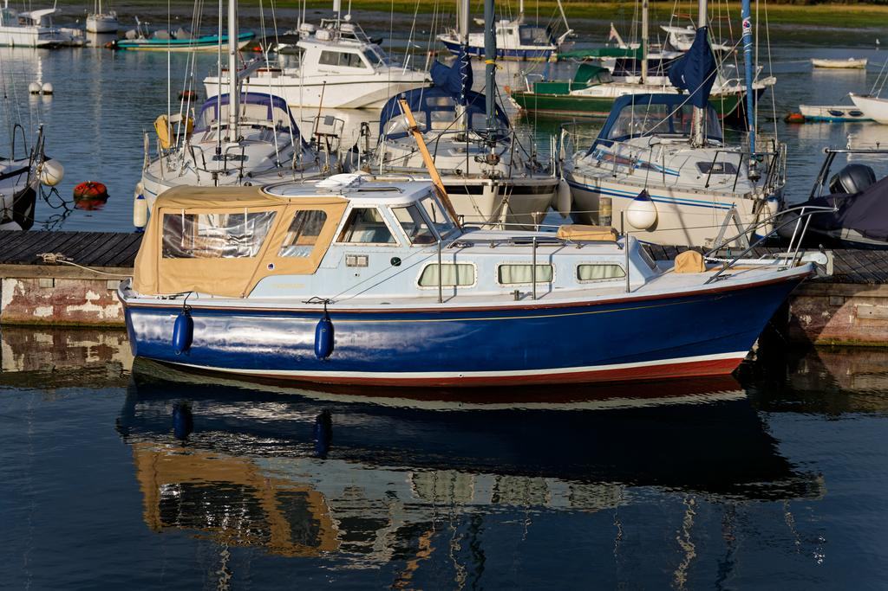

# Model Output Gallery

Generated on: 2026-09-27 22:58:22 BST

- *Evaluation lane:* assisted
- *Prompt hints:* the image's description and keyword hints were included in the prompt, so field content may be copied from them rather than seen
- *Assessment:* General checks + metadata fields and duplicate keywords; length limits and factual accuracy not assessed
- *Input image:* JPEG, 9,805 x 6,538 pixels (64.1 MP), 54.2 MB

This run records model responses to one shared image and prompt (evaluation
lane: assisted). Mechanical checks are not factual-accuracy judgments; inspect
the image, prompt and final answers before choosing a model. Results do not
establish fitness for other tasks.

Complete per-model evidence artifact with image metadata, the source prompt, a
facts-only chooser, and full generated or crash output for every attempted
model.

## Reference Image



## Current-run Chooser

Mechanical observations and captured resource facts for this run only. No concerns detected does not mean the response fulfilled an arbitrary prompt or described the image accurately. Consult the assessment scope above. Total time is end-to-end; throughput covers generation only and requires at least 16 generated tokens. Prefill/first is the measured time to first token (input preparation, prefill and the first decode step) when captured, else upstream's model-loop first-token time; Prompt tok is the full rendered prompt including image tokens, which drives prefill cost. For cross-attention architectures the token count reflects the tokenised text burden only, not total vision prefill compute.

<!-- markdownlint-disable MD034 MD037 MD049 -->

| Model                                                                                                                               | Mechanical checks      | Total s | Gen TPS    | Prefill/first s | Peak GB | Prompt tok | Gen tok | Observations                                                                                                       |
|-------------------------------------------------------------------------------------------------------------------------------------|------------------------|---------|------------|-----------------|---------|------------|---------|--------------------------------------------------------------------------------------------------------------------|
| [`mlx-community/ERNIE-4.5-VL-28B-A3B-Thinking-4bit`](#model-mlx-community-ernie-45-vl-28b-a3b-thinking-4bit)                        | `no concerns detected` | 8.87s   | 108 tok/s  | 1.47            | 19      | 1,646      | 540     | none                                                                                                               |
| [`mlx-community/InternVL3-14B-4bit`](#model-mlx-community-internvl3-14b-4bit)                                                       | `no concerns detected` | 6.26s   | 52.1 tok/s | 2.31            | 10      | 2,120      | 103     | none                                                                                                               |
| [`mlx-community/InternVL3-8B-bf16`](#model-mlx-community-internvl3-8b-bf16)                                                         | `no concerns detected` | 6.28s   | 35.2 tok/s | 1.58            | 17      | 2,120      | 79      | none                                                                                                               |
| [`mlx-community/Llama-3.2-11B-Vision-Instruct-8bit`](#model-mlx-community-llama-32-11b-vision-instruct-8bit)                        | `no concerns detected` | 10.48s  | 20.9 tok/s | 2.34            | 15      | 309        | 114     | none                                                                                                               |
| [`mlx-community/MiniCPM-V-4.6-4bit`](#model-mlx-community-minicpm-v-46-4bit)                                                        | `no concerns detected` | 5.33s   | 237 tok/s  | 1.05            | 3.3     | 938        | 564     | none                                                                                                               |
| [`mlx-community/MiniCPM-o-4_5-4bit`](#model-mlx-community-minicpm-o-45-4bit)                                                        | `no concerns detected` | 3.54s   | 102 tok/s  | 0.83            | 7.0     | 398        | 93      | none                                                                                                               |
| [`mlx-community/Ministral-3-14B-Instruct-2512-mxfp4`](#model-mlx-community-ministral-3-14b-instruct-2512-mxfp4)                     | `no concerns detected` | 8.18s   | 63.8 tok/s | 2.77            | 13      | 2,935      | 199     | none                                                                                                               |
| [`mlx-community/Ministral-3-3B-Instruct-2512-4bit`](#model-mlx-community-ministral-3-3b-instruct-2512-4bit)                         | `no concerns detected` | 4.36s   | 175 tok/s  | 1.76            | 7.8     | 2,934      | 121     | none                                                                                                               |
| [`mlx-community/Molmo2-8B-4bit`](#model-mlx-community-molmo2-8b-4bit)                                                               | `no concerns detected` | 6.38s   | 70.1 tok/s | 1.59            | 8.6     | 1,531      | 181     | none                                                                                                               |
| [`mlx-community/North-Micro-Vision-Instruct-4bit`](#model-mlx-community-north-micro-vision-instruct-4bit)                           | `no concerns detected` | 5.94s   | 151 tok/s  | 2.94            | 3.9     | 4,091      | 108     | none                                                                                                               |
| [`mlx-community/Ornith-1.5-35B-A3B-OptiQ-4bit`](#model-mlx-community-ornith-15-35b-a3b-optiq-4bit)                                  | `no concerns detected` | 6.66s   | 79.8 tok/s | 1.43            | 24      | 1,295      | 130     | none                                                                                                               |
| [`mlx-community/Qwen3-VL-2B-Thinking-bf16`](#model-mlx-community-qwen3-vl-2b-thinking-bf16)                                         | `no concerns detected` | 28.60s  | 84.5 tok/s | 16.04           | 8.4     | 16,556     | 901     | none                                                                                                               |
| [`mlx-community/Qwen3-VL-30B-A3B-Instruct-4bit`](#model-mlx-community-qwen3-vl-30b-a3b-instruct-4bit)                               | `no concerns detected` | 42.99s  | 75.0 tok/s | 37.35           | 23      | 16,554     | 168     | none                                                                                                               |
| [`mlx-community/Qwen3-VL-32B-Instruct-4bit`](#model-mlx-community-qwen3-vl-32b-instruct-4bit)                                       | `no concerns detected` | 76.85s  | 20.5 tok/s | 64.01           | 26      | 16,554     | 190     | none                                                                                                               |
| [`mlx-community/Qwen3-VL-8B-Instruct-4bit`](#model-mlx-community-qwen3-vl-8b-instruct-4bit)                                         | `no concerns detected` | 43.29s  | 69.1 tok/s | 39.09           | 11      | 16,554     | 120     | none                                                                                                               |
| [`mlx-community/Qwen3.5-35B-A3B-4bit`](#model-mlx-community-qwen35-35b-a3b-4bit)                                                    | `no concerns detected` | 44.16s  | 73.7 tok/s | 38.20           | 25      | 16,569     | 123     | none                                                                                                               |
| [`mlx-community/Qwen3.5-9B-MLX-4bit`](#model-mlx-community-qwen35-9b-mlx-4bit)                                                      | `no concerns detected` | 37.66s  | 89.3 tok/s | 33.05           | 11      | 16,569     | 111     | none                                                                                                               |
| [`mlx-community/Qwen3.8-27B-nvfp4`](#model-mlx-community-qwen38-27b-nvfp4)                                                          | `no concerns detected` | 56.30s  | 29.4 tok/s | 48.26           | 21      | 16,569     | 128     | none                                                                                                               |
| [`mlx-community/aya-vision-8b-4bit`](#model-mlx-community-aya-vision-8b-4bit)                                                       | `no concerns detected` | 5.51s   | 102 tok/s  | 1.73            | 6.5     | 2,098      | 143     | none                                                                                                               |
| [`mlx-community/diffusiongemma-26B-A4B-it-mxfp8`](#model-mlx-community-diffusiongemma-26b-a4b-it-mxfp8)                             | `no concerns detected` | 7.15s   | 57.2 tok/s | 2.70            | 28      | 597        | 81      | none                                                                                                               |
| [`mlx-community/gemma-4-12B-it-4bit`](#model-mlx-community-gemma-4-12b-it-4bit)                                                     | `no concerns detected` | 5.82s   | 61.2 tok/s | 1.11            | 7.6     | 601        | 112     | none                                                                                                               |
| [`mlx-community/gemma-4-26b-a4b-it-4bit`](#model-mlx-community-gemma-4-26b-a4b-it-4bit)                                             | `no concerns detected` | 5.64s   | 110 tok/s  | 1.17            | 16      | 601        | 106     | none                                                                                                               |
| [`mlx-community/gemma-4-31b-it-4bit`](#model-mlx-community-gemma-4-31b-it-4bit)                                                     | `no concerns detected` | 9.72s   | 26.9 tok/s | 1.80            | 20      | 601        | 113     | none                                                                                                               |
| [`mlx-community/granite-4.0-3b-vision-4bit`](#model-mlx-community-granite-40-3b-vision-4bit)                                        | `no concerns detected` | 3.73s   | 174 tok/s  | 1.45            | 4.6     | 1,384      | 91      | none                                                                                                               |
| [`nativ-community/MiMo-V2.6-Distill-Qwen-9B-MLX-4bit`](#model-nativ-community-mimo-v26-distill-qwen-9b-mlx-4bit)                    | `no concerns detected` | 34.47s  | 87.4 tok/s | 30.37           | 11      | 16,566     | 123     | none                                                                                                               |
| [`nativ-community/Mistral-Small-3.2-24B-Instruct-2506-4bit`](#model-nativ-community-mistral-small-32-24b-instruct-2506-4bit)        | `no concerns detected` | 8.84s   | 35.9 tok/s | 2.05            | 18      | 1,281      | 144     | none                                                                                                               |
| [`nativ-community/Nemotron-3-Nano-Omni-30B-A3B-Reasoning-4bit`](#model-nativ-community-nemotron-3-nano-omni-30b-a3b-reasoning-4bit) | `no concerns detected` | 9.20s   | 135 tok/s  | 4.98            | 23      | 3,636      | 120     | none                                                                                                               |
| [`LiquidAI/LFM2.5-VL-450M-MLX-bf16`](#model-liquidai-lfm25-vl-450m-mlx-bf16)                                                        | `concerns detected`    | 302.10s | 462 tok/s  | 0.69            | 1.9     | 2,123      | 96      | duplicate keywords; prompt hint repeated                                                                           |
| [`mlx-community/Devstral-Small-2-24B-Instruct-2512-5bit`](#model-mlx-community-devstral-small-2-24b-instruct-2512-5bit)             | `concerns detected`    | 10.78s  | 29.0 tok/s | 3.71            | 23      | 2,402      | 119     | prompt hint repeated                                                                                               |
| [`mlx-community/GLM-4.6V-Flash-4bit`](#model-mlx-community-glm-46v-flash-4bit)                                                      | `concerns detected`    | 9.27s   | 70.4 tok/s | 5.93            | 8.7     | 6,393      | 83      | prompt hint repeated                                                                                               |
| [`mlx-community/GLM-4.6V-nvfp4`](#model-mlx-community-glm-46v-nvfp4)                                                                | `concerns detected`    | 23.58s  | 39.0 tok/s | 13.24           | 78      | 6,393      | 117     | prompt hint repeated                                                                                               |
| [`mlx-community/Idefics3-8B-Llama3-bf16`](#model-mlx-community-idefics3-8b-llama3-bf16)                                             | `concerns detected`    | 7.89s   | 32.7 tok/s | 1.99            | 18      | 2,620      | 89      | prompt hint repeated                                                                                               |
| [`mlx-community/Phi-3.5-vision-instruct-bf16`](#model-mlx-community-phi-35-vision-instruct-bf16)                                    | `concerns detected`    | 4.24s   | 55.6 tok/s | 0.87            | 9.3     | 1,144      | 98      | prompt hint repeated                                                                                               |
| [`mlx-community/Qwen2-VL-7B-Instruct-4bit`](#model-mlx-community-qwen2-vl-7b-instruct-4bit)                                         | `concerns detected`    | 43.34s  | 87.1 tok/s | 40.09           | 9.3     | 16,565     | 107     | prompt hint repeated                                                                                               |
| [`mlx-community/SmolVLM2-2.2B-Instruct-mlx`](#model-mlx-community-smolvlm2-22b-instruct-mlx)                                        | `concerns detected`    | 3.96s   | 128 tok/s  | 1.30            | 5.6     | 1,438      | 118     | prompt hint repeated                                                                                               |
| [`mlx-community/Step-3.7-Flash-oQ3e`](#model-mlx-community-step-37-flash-oq3e)                                                      | `concerns detected`    | 39.70s  | 49.5 tok/s | 22.62           | 92      | 3,498      | 111     | prompt hint repeated                                                                                               |
| [`mlx-community/X-Reasoner-7B-8bit`](#model-mlx-community-x-reasoner-7b-8bit)                                                       | `concerns detected`    | 20.19s  | 57.7 tok/s | 13.88           | 14      | 16,565     | 215     | duplicate keywords                                                                                                 |
| [`mlx-community/gemma-3-27b-it-qat-4bit`](#model-mlx-community-gemma-3-27b-it-qat-4bit)                                             | `concerns detected`    | 9.22s   | 30.8 tok/s | 1.66            | 17      | 596        | 127     | unsupplied place name                                                                                              |
| [`mlx-community/gemma-4-e4b-it-4bit`](#model-mlx-community-gemma-4-e4b-it-4bit)                                                     | `concerns detected`    | 4.09s   | 123 tok/s  | 0.95            | 5.9     | 597        | 93      | duplicate keywords                                                                                                 |
| [`mlx-community/pixtral-12b-8bit`](#model-mlx-community-pixtral-12b-8bit)                                                           | `concerns detected`    | 7.91s   | 39.5 tok/s | 2.30            | 16      | 3,125      | 119     | prompt hint repeated                                                                                               |
| [`nativ-community/Mage-VL-OptiQ-4bit`](#model-nativ-community-mage-vl-optiq-4bit)                                                   | `concerns detected`    | 5.21s   | 129 tok/s  | 2.36            | 5.4     | 4,217      | 118     | prompt hint repeated                                                                                               |
| [`mlx-community/FastVLM-0.5B-bf16`](#model-mlx-community-fastvlm-05b-bf16)                                                          | `major concerns`       | 3.36s   | 320 tok/s  | 1.29            | 2.2     | 341        | 38      | labelled fields not detected                                                                                       |
| [`mlx-community/Kimi-VL-A3B-Thinking-2506-8bit`](#model-mlx-community-kimi-vl-a3b-thinking-2506-8bit)                               | `major concerns`       | 21.43s  | 59.4 tok/s | 1.46            | 20      | 1,331      | 1,000   | repeated text; labelled fields not detected; cut off at token limit; incomplete thinking block; duplicate keywords |
| [`mlx-community/LFM2.5-VL-3B-OptiQ-4bit`](#model-mlx-community-lfm25-vl-3b-optiq-4bit)                                              | `major concerns`       | 3.91s   | 203 tok/s  | 1.25            | 4.0     | 2,115      | 122     | labelled fields not detected                                                                                       |
| [`mlx-community/Muse-Glimmer-30B-OptiQ-4bit`](#model-mlx-community-muse-glimmer-30b-optiq-4bit)                                     | `major concerns`       | 52.96s  | 24.5 tok/s | 7.84            | 25      | 4,410      | 1,000   | control tokens visible; labelled fields not detected; cut off at token limit; role tokens visible                  |
| [`mlx-community/SmolVLM-256M-Instruct-4bit`](#model-mlx-community-smolvlm-256m-instruct-4bit)                                       | `major concerns`       | 2.60s   | 321 tok/s  | 0.99            | 1.1     | 1,217      | 39      | labelled fields not detected                                                                                       |
| [`mlx-community/gemma-3n-E4B-it-4bit`](#model-mlx-community-gemma-3n-e4b-it-4bit)                                                   | `major concerns`       | 5.20s   | 74.5 tok/s | 1.03            | 7.2     | 595        | 114     | labelled fields not detected                                                                                       |
| [`mlx-community/granite-vision-3.2-2b-nvfp4`](#model-mlx-community-granite-vision-32-2b-nvfp4)                                      | `major concerns`       | 5.56s   | 133 tok/s  | 3.38            | 4.4     | 5,666      | 82      | labelled fields not detected                                                                                       |
| [`mlx-community/llm-jp-4-vl-9b-mlx-4bit`](#model-mlx-community-llm-jp-4-vl-9b-mlx-4bit)                                             | `major concerns`       | 3.83s   | 107 tok/s  | 1.61            | 6.7     | 2,201      | 18      | control tokens visible; labelled fields not detected                                                               |
| [`mlx-community/nanoLLaVA-1.5-4bit`](#model-mlx-community-nanollava-15-4bit)                                                        | `major concerns`       | 2.37s   | 222 tok/s  | 0.85            | 1.8     | 337        | 23      | labelled fields not detected                                                                                       |
<!-- markdownlint-enable MD034 MD037 MD049 -->

## Resource Highlights

Quickest completion without detected concerns (end-to-end, including model load): `mlx-community/MiniCPM-o-4_5-4bit` at 3.54s

Lowest peak memory among completions without detected concerns: `mlx-community/MiniCPM-V-4.6-4bit` at 3.3 GB

Decode tok/s stays per model in the chooser and is not averaged across models: tokenizers, image-token expansion and reasoning lengths differ too much for a cross-model mean to guide a choice.

## Avoid for This Run

<!-- markdownlint-disable MD034 MD037 MD049 -->

| Model                                                                                                 | Mechanical checks | Observations                                                                                                       |
|-------------------------------------------------------------------------------------------------------|-------------------|--------------------------------------------------------------------------------------------------------------------|
| [`mlx-community/FastVLM-0.5B-bf16`](#model-mlx-community-fastvlm-05b-bf16)                            | `major concerns`  | labelled fields not detected                                                                                       |
| [`mlx-community/Kimi-VL-A3B-Thinking-2506-8bit`](#model-mlx-community-kimi-vl-a3b-thinking-2506-8bit) | `major concerns`  | repeated text; labelled fields not detected; cut off at token limit; incomplete thinking block; duplicate keywords |
| [`mlx-community/LFM2.5-VL-3B-OptiQ-4bit`](#model-mlx-community-lfm25-vl-3b-optiq-4bit)                | `major concerns`  | labelled fields not detected                                                                                       |
| [`mlx-community/Muse-Glimmer-30B-OptiQ-4bit`](#model-mlx-community-muse-glimmer-30b-optiq-4bit)       | `major concerns`  | control tokens visible; labelled fields not detected; cut off at token limit; role tokens visible                  |
| [`mlx-community/SmolVLM-256M-Instruct-4bit`](#model-mlx-community-smolvlm-256m-instruct-4bit)         | `major concerns`  | labelled fields not detected                                                                                       |
| [`mlx-community/gemma-3n-E4B-it-4bit`](#model-mlx-community-gemma-3n-e4b-it-4bit)                     | `major concerns`  | labelled fields not detected                                                                                       |
| [`mlx-community/granite-vision-3.2-2b-nvfp4`](#model-mlx-community-granite-vision-32-2b-nvfp4)        | `major concerns`  | labelled fields not detected                                                                                       |
| [`mlx-community/llm-jp-4-vl-9b-mlx-4bit`](#model-mlx-community-llm-jp-4-vl-9b-mlx-4bit)               | `major concerns`  | control tokens visible; labelled fields not detected                                                               |
| [`mlx-community/nanoLLaVA-1.5-4bit`](#model-mlx-community-nanollava-15-4bit)                          | `major concerns`  | labelled fields not detected                                                                                       |
<!-- markdownlint-enable MD034 MD037 MD049 -->

## Output at a Glance

A compact preview of each model's final answer (or failure evidence for crashes), in chooser order. Where the requested catalogue fields were detected, the preview shows a little of each: the title, the start of the description, and the first keywords with their count, so the weakest field is not hidden behind a long description. Otherwise it is the first 280 characters. A closed reasoning trace is left out of the preview and reported as an omitted-character count; the complete output, trace included, is in the model's evidence block below.

<!-- markdownlint-disable MD034 MD037 MD049 -->

| Model                                                                                                                               | Mechanical checks      | Output preview                                                                                                                                                                                                                                                                                                                                                                        |
|-------------------------------------------------------------------------------------------------------------------------------------|------------------------|---------------------------------------------------------------------------------------------------------------------------------------------------------------------------------------------------------------------------------------------------------------------------------------------------------------------------------------------------------------------------------------|
| [`mlx-community/ERNIE-4.5-VL-28B-A3B-Thinking-4bit`](#model-mlx-community-ernie-45-vl-28b-a3b-thinking-4bit)                        | `no concerns detected` | Title: Blue and light blue motor cabin cruiser at a UK marina \| Description: On September 26th, 2026, a blue and light blue motor cabin cruiser with a tan canop... \| Keywords (15): Blue and light blue motor cabin cruiser, tan canopy, calm water, marina, reflection, UK, yacht, boat fender, ...[1,523 characters of reasoning omitted; complete output in the evidence block] |
| [`mlx-community/InternVL3-14B-4bit`](#model-mlx-community-internvl3-14b-4bit)                                                       | `no concerns detected` | Title: Blue Cabin Cruiser at Marina \| Description: A blue cabin cruiser with a tan canopy is moored at a marina dock, surrounded by sailboats and leisure boats on c... \| Keywords (20): Boat, Boat canopy, Boat fender, Boating, Cabin cruiser, Calm Water, Dock, Harbor, Marina, Mast, Mooring, ...                                                                               |
| [`mlx-community/InternVL3-8B-bf16`](#model-mlx-community-internvl3-8b-bf16)                                                         | `no concerns detected` | Title: Blue Cabin Cruiser at Marina Dock \| Description: A blue and light blue motor cabin cruiser with a tan canopy is moored at a marina, reflecting in calm water... \| Keywords (13): Boat, Boat canopy, Boat fender, Cabin cruiser, Calm Water, Dock, Marina, Motorboat, Nautical, Reflection, ...                                                                               |
| [`mlx-community/Llama-3.2-11B-Vision-Instruct-8bit`](#model-mlx-community-llama-32-11b-vision-instruct-8bit)                        | `no concerns detected` | Title: Blue and Tan Motor Cabin Cruiser at Marina Dock \| Description: A blue and tan motor cabin cruiser is moored at a marina dock on a calm day, with the ear... \| Keywords (10): Motor cabin cruiser, Marina dock, Calm water, Early evening, Tan canopy, Blue hull, Sailboats, Leisure boats, ...                                                                               |
| [`mlx-community/MiniCPM-V-4.6-4bit`](#model-mlx-community-minicpm-v-46-4bit)                                                        | `no concerns detected` | Title: Blue Cabin Cruiser Moored Calm Harbor \| Description: A blue cabin cruiser with tan canopy is moored at a marina, reflecting on calm water surrounded by other s... \| Keywords (17): boat, cabin cruiser, canopy, mooring, calm water, harbor, marina, sailboats, reflection, fender, mast, ...[1,844 characters of reasoning omitted; complete output in the evidence block] |
| [`mlx-community/MiniCPM-o-4_5-4bit`](#model-mlx-community-minicpm-o-45-4bit)                                                        | `no concerns detected` | Title: Blue Motor Cabin Cruiser at Calm Marina Dock \| Description: A blue and light blue motor cabin cruiser with a tan canopy is moored at a marina, reflecting in... \| Keywords (16): Boat, Cabin cruiser, Canopy, Dock, Marina, Motorboat, Reflection, Sailboat, Water, Blue hull, Tan canopy, ...                                                                               |
| [`mlx-community/Ministral-3-14B-Instruct-2512-mxfp4`](#model-mlx-community-ministral-3-14b-instruct-2512-mxfp4)                     | `no concerns detected` | Title: **"Classic Cabin Cruiser at Sunset Marina – Calm Water Reflections"** \| Description: A well-maintained **blue and light blue motor cabin cruiser** with a tan ca... \| Keywords (20): Boat, cabin cruiser, marina, moored vessel, calm water, reflections, early evening light, tan canopy, ...                                                                               |
| [`mlx-community/Ministral-3-3B-Instruct-2512-4bit`](#model-mlx-community-ministral-3-3b-instruct-2512-4bit)                         | `no concerns detected` | Title: Evening Marina Mooring: Blue Cabin Cruiser Reflection \| Description: A blue and light-blue motor cabin cruiser with tan canopy is securely moored at a dock... \| Keywords (13): blue motor cabin cruiser, marina dock, calm water reflections, tan boat canopy, sailboats, leisure yachts, ...                                                                               |
| [`mlx-community/Molmo2-8B-4bit`](#model-mlx-community-molmo2-8b-4bit)                                                               | `no concerns detected` | Title: Blue Cabin Cruiser Moored at Calm Marina Dock \| Description: A blue and light blue motor cabin cruiser with a tan canopy is moored at a marina dock, surrou... \| Keywords (36): Boat, Boat canopy, Boat fender, Cabin cruiser, Calm Water, Dock, Harbor, Marina, Mast, Mooring, Motorboat, ...                                                                               |
| [`mlx-community/North-Micro-Vision-Instruct-4bit`](#model-mlx-community-north-micro-vision-instruct-4bit)                           | `no concerns detected` | Title: Blue and Tan Boat at Marina Dock \| Description: A blue and light blue motor cabin cruiser with a tan canopy is moored at a marina dock. The boat is surr... \| Keywords (19): Boat, Boat canopy, Boat fender, Boating, Cabin cruiser, Calm Water, Dock, Harbor, Marina, Mooring, Motorboat, ...                                                                               |
| [`mlx-community/Ornith-1.5-35B-A3B-OptiQ-4bit`](#model-mlx-community-ornith-15-35b-a3b-optiq-4bit)                                  | `no concerns detected` | Title: Blue and Cream Motor Cabin Cruiser Moored at Marina \| Description: A blue-hulled motor cabin cruiser with cream cabin trim and a tan canvas canopy, christened... \| Keywords (18): Motorboat, Cabin cruiser, Marina, Sailboat, Dock, Water reflection, Boat fender, Boat canopy, Mooring, ...                                                                                |
| [`mlx-community/Qwen3-VL-2B-Thinking-bf16`](#model-mlx-community-qwen3-vl-2b-thinking-bf16)                                         | `no concerns detected` | Title: Blue Cabin Cruiser at Marina \| Description: A blue and light blue cabin cruiser named "EVENHAZE" with tan canopy moored at a marina dock under early even... \| Keywords (16): Boat, Dock, Marina, Calm Water, Reflection, Mooring, Sailboat, Motorboat, Cabin cruiser, Tan canopy, Fender, ...[3,130 characters of reasoning omitted; complete output in the evidence block] |
| [`mlx-community/Qwen3-VL-30B-A3B-Instruct-4bit`](#model-mlx-community-qwen3-vl-30b-a3b-instruct-4bit)                               | `no concerns detected` | Title: Blue Cabin Cruiser Moored at Marina \| Description: A blue and light blue motor cabin cruiser with a tan canopy is moored at a wooden dock in a marina, surrou... \| Keywords (20): Boat, Boat canopy, Boat fender, Boating, Cabin cruiser, Calm Water, Dock, Harbor, Marina, Mast, Mooring, ...                                                                               |
| [`mlx-community/Qwen3-VL-32B-Instruct-4bit`](#model-mlx-community-qwen3-vl-32b-instruct-4bit)                                       | `no concerns detected` | Title: Blue Cabin Cruiser Moored at Marina Dock \| Description: A blue and light blue cabin cruiser named "EVENHAZE" with a tan canopy is moored at a wooden dock in a... \| Keywords (18): Cabin cruiser, Marina, Dock, Mooring, Sailboat, Motorboat, Watercraft, Yacht, Boat canopy, Boat fender, ...                                                                               |
| [`mlx-community/Qwen3-VL-8B-Instruct-4bit`](#model-mlx-community-qwen3-vl-8b-instruct-4bit)                                         | `no concerns detected` | Title: Blue Cabin Cruiser Moored at Sunset Marina \| Description: A blue and light blue cabin cruiser named 'Evenhaze' with tan canopy is moored at a marina dock durin... \| Keywords (18): cabin cruiser, boat canopy, fender, marina, dock, sailboat, motorboat, calm water, reflection, harbor, ...                                                                               |
| [`mlx-community/Qwen3.5-35B-A3B-4bit`](#model-mlx-community-qwen35-35b-a3b-4bit)                                                    | `no concerns detected` | Title: Blue and tan motor cruiser moored at marina \| Description: This blue and tan motor cabin cruiser named 'Evenhaze' is moored at a wooden marina dock on c... \| Keywords (19): Boat canopy, Boat fender, Boating, Cabin cruiser, Calm Water, Dock, Harbor, Marina, Mast, Mooring, Motorboat, ...                                                                               |
| [`mlx-community/Qwen3.5-9B-MLX-4bit`](#model-mlx-community-qwen35-9b-mlx-4bit)                                                      | `no concerns detected` | Title: Evenhaze Cabin Cruiser Moored at Marina Dock \| Description: The blue and light blue cabin cruiser named Evenhaze, with a tan canvas canopy, is moored at... \| Keywords (15): Evenhaze, cabin cruiser, tan canopy, marina, dock, sailboats, leisure craft, evening light, water reflection, ...                                                                               |
| [`mlx-community/Qwen3.8-27B-nvfp4`](#model-mlx-community-qwen38-27b-nvfp4)                                                          | `no concerns detected` | Title: Blue motor cruiser moored at a Cornish marina \| Description: The "Evenhaze," a blue motor cabin cruiser with a tan cabin canopy, is moored alongside a weather... \| Keywords (16): Blue motor cruiser, Cornish harbour, Evenhaze, Marina, Moored boat, Tan canopy, Wooden dock, Sailboats, ...                                                                               |
| [`mlx-community/aya-vision-8b-4bit`](#model-mlx-community-aya-vision-8b-4bit)                                                       | `no concerns detected` | Title: Blue Motorboat at Marina Dock \| Description: A blue and light blue motor cabin cruiser with a tan canopy is moored at a marina dock alongside other sail... \| Keywords (17): Motorboat, Marina, Calm Water, Reflective Surface, Evening Light, Blue Hull, White Trim, Red Keel, Sailboats, ...                                                                               |
| [`mlx-community/diffusiongemma-26B-A4B-it-mxfp8`](#model-mlx-community-diffusiongemma-26b-a4b-it-mxfp8)                             | `no concerns detected` | Title: Blue and Light Blue Motor Cabin Cruiser Moored at Marina \| Description: A blue and light blue motor cabin cruiser with a tan canopy is moored at a marina d... \| Keywords (14): Boat, cabin cruiser, motorboat, marina, dock, harbor, reflection, water, nautical, mooring, fender, yacht, ...                                                                               |
| [`mlx-community/gemma-4-12B-it-4bit`](#model-mlx-community-gemma-4-12b-it-4bit)                                                     | `no concerns detected` | Title: Blue Motor Cabin Cruiser Moored at a Marina \| Description: A blue and light blue motor cabin cruiser with a tan canopy is moored at a dock, surrounded by oth... \| Keywords (20): Boat, Boat canopy, Boat fender, Boating, Cabin cruiser, Calm Water, Dock, Harbor, Marina, Mast, Mooring, ...                                                                               |
| [`mlx-community/gemma-4-26b-a4b-it-4bit`](#model-mlx-community-gemma-4-26b-a4b-it-4bit)                                             | `no concerns detected` | Title: Blue motor cabin cruiser moored at a marina \| Description: A blue and light blue motor cabin cruiser with a tan canopy sits moored at a dock alongside vari... \| Keywords (17): Blue motorboat, boat canopy, boat fender, boating, cabin cruiser, calm water, dock, harbour, marina, mast, ...                                                                               |
| [`mlx-community/gemma-4-31b-it-4bit`](#model-mlx-community-gemma-4-31b-it-4bit)                                                     | `no concerns detected` | Title: Blue Motor Cabin Cruiser Moored at a Marina \| Description: A blue and light blue motor cabin cruiser with a tan canopy is moored at a marina dock on 26 Septe... \| Keywords (17): Boat, Boat canopy, Boat fender, Boating, Cabin cruiser, Calm water, Dock, Harbor, Marina, Mast, Mooring, ...                                                                               |
| [`mlx-community/granite-4.0-3b-vision-4bit`](#model-mlx-community-granite-40-3b-vision-4bit)                                        | `no concerns detected` | Title: "Marina Calm: Blue Motor Cabin Cruiser" \| Description: A blue and light blue motor cabin cruiser with a tan canopy moored at a marina dock, surrounded by other... \| Keywords (10): Motor cabin cruiser, Blue and light blue, Tan canopy, Marina, Sailboats, Leisure boats, Evening light, ...                                                                               |
| [`nativ-community/MiMo-V2.6-Distill-Qwen-9B-MLX-4bit`](#model-nativ-community-mimo-v26-distill-qwen-9b-mlx-4bit)                    | `no concerns detected` | Title: Blue and Light Blue Canopy Cruiser Moored at Marina Dock \| Description: A blue and light blue motor cabin cruiser with a tan canvas canopy is moored alongs... \| Keywords (15): motor cabin cruiser, blue hull, light blue paint, tan canvas canopy, marina dock, moored boat, calm water, ...                                                                               |
| [`nativ-community/Mistral-Small-3.2-24B-Instruct-2506-4bit`](#model-nativ-community-mistral-small-32-24b-instruct-2506-4bit)        | `no concerns detected` | Title: Blue Cabin Cruiser at Marina \| Description: A blue and light blue motor cabin cruiser with a tan canopy is moored at a marina dock on 26 September 2026, alo... \| Keywords (18): Boat, Cabin cruiser, Marina, Dock, Calm water, Reflection, Tan canopy, Sailboats, Leisure boats, Mooring, ...                                                                               |
| [`nativ-community/Nemotron-3-Nano-Omni-30B-A3B-Reasoning-4bit`](#model-nativ-community-nemotron-3-nano-omni-30b-a3b-reasoning-4bit) | `no concerns detected` | Title: Evenhaze Motor Cruiser at Marina Dock \| Description: A blue and light blue motor cabin cruiser named "Evenhaze," featuring a tan canopy, is moored at a wooden d... \| Keywords (16): Boat, Boat canopy, Boat fender, Cabin cruiser, Calm Water, Dock, Harbor, Marina, Motorboat, Nautical, ...                                                                               |
| [`LiquidAI/LFM2.5-VL-450M-MLX-bf16`](#model-liquidai-lfm25-vl-450m-mlx-bf16)                                                        | `concerns detected`    | Title: Boat Docking at a Marina \| Description: A blue and light blue motor cabin cruiser with a tan canopy is moored at a marina dock alongside other sailboats a... \| Keywords (14): Boat, Boat, Cabin, Cruiser, Dock, Marina, Reflection, Sailboat, Sailing, Water, Reflection, Rope, Sailboat, ...                                                                               |
| [`mlx-community/Devstral-Small-2-24B-Instruct-2512-5bit`](#model-mlx-community-devstral-small-2-24b-instruct-2512-5bit)             | `concerns detected`    | Title: Blue and Light Blue Motor Cabin Cruiser at Marina \| Description: A blue and light blue motor cabin cruiser with a tan canopy is moored at a marina dock along... \| Keywords (20): Boat, Boat canopy, Boat fender, Boating, Cabin cruiser, Calm Water, Dock, Harbor, Marina, Mast, Mooring, ...                                                                               |
| [`mlx-community/GLM-4.6V-Flash-4bit`](#model-mlx-community-glm-46v-flash-4bit)                                                      | `concerns detected`    | Title: Blue Motor Cabin Cruiser at Marina \| Description: A blue and light blue motor cabin cruiser with a tan canopy is moored at a marina dock, surrounded by other sailbo... \| Keywords (9): Boat, Cabin cruiser, Marina, Motorboat, Reflection, Tan canopy, Watercraft, Blue motorboat, Calm water                                                                               |
| [`mlx-community/GLM-4.6V-nvfp4`](#model-mlx-community-glm-46v-nvfp4)                                                                | `concerns detected`    | Title: Blue and light blue motor cruiser with tan canopy at marina dock \| Description: A blue and light blue motor cabin cruiser with a tan canopy is moored at a ma... \| Keywords (20): Boat, Boat canopy, Boat fender, Boating, Cabin cruiser, Calm Water, Dock, Harbor, Marina, Mast, Mooring, ...                                                                               |
| [`mlx-community/Idefics3-8B-Llama3-bf16`](#model-mlx-community-idefics3-8b-llama3-bf16)                                             | `concerns detected`    | Title: Blue and Light Blue Motor Cabin Cruiser at Marina Dock. \| Description: A blue and light blue motor cabin cruiser with a tan canopy is moored at a marina dock al... \| Keywords (10): blue, light blue, motor cabin cruiser, tan canopy, marina dock, sailboats, leisure boats, calm water, ...                                                                               |
| [`mlx-community/Phi-3.5-vision-instruct-bf16`](#model-mlx-community-phi-35-vision-instruct-bf16)                                    | `concerns detected`    | Title: "Evening Reflections on a Calm Harbor" \| Description: A blue and light blue motorboat with a tan canopy is moored at a marina dock, surrounded by other sailboats and lei... \| Keywords (10): boat, motorboat, canopy, marina, dock, sailboat, calm water, reflection, early evening, nautical                                                                               |
| [`mlx-community/Qwen2-VL-7B-Instruct-4bit`](#model-mlx-community-qwen2-vl-7b-instruct-4bit)                                         | `concerns detected`    | Title: Blue Motor Cabin Cruiser at Marina \| Description: A blue and light blue motor cabin cruiser with a tan canopy moored at a marina dock alongside other sailboa... \| Keywords (20): Boat, Boat canopy, Boat fender, Boating, Cabin cruiser, Calm Water, Dock, Harbor, Marina, Mast, Mooring, ...                                                                               |
| [`mlx-community/SmolVLM2-2.2B-Instruct-mlx`](#model-mlx-community-smolvlm2-22b-instruct-mlx)                                        | `concerns detected`    | Title: Blue and Light Blue Motor Cabin Cruiser Moored at Marina \| Description: A blue and light blue motor cabin cruiser with a tan canopy moored at a marina dock a... \| Keywords (19): Boat, Boat canopy, Boat fender, Boating, Cabin cruiser, Calm Water, Dock, Harbor, Marina, Mast, Mooring, ...                                                                               |
| [`mlx-community/Step-3.7-Flash-oQ3e`](#model-mlx-community-step-37-flash-oq3e)                                                      | `concerns detected`    | Title: Blue cabin cruiser moored at marina dock \| Description: A blue and light blue motor cabin cruiser with a tan canopy is moored at a marina dock alongside othe... \| Keywords (20): Boat, Boat canopy, Boat fender, Boating, Cabin cruiser, Calm Water, Dock, Harbor, Marina, Mast, Mooring, ...                                                                               |
| [`mlx-community/X-Reasoner-7B-8bit`](#model-mlx-community-x-reasoner-7b-8bit)                                                       | `concerns detected`    | Title: Blue Cabin Cruiser at Marina Dock \| Description: A blue and light blue motor cabin cruiser named "Evenhaze" is moored at a marina dock, surrounded by sailboats... \| Keywords (33): Blue cabin cruiser, Evenhaze, marina dock, sailboats, leisure boats, calm water, early evening light, ...                                                                                |
| [`mlx-community/gemma-3-27b-it-qat-4bit`](#model-mlx-community-gemma-3-27b-it-qat-4bit)                                             | `concerns detected`    | Title: Blue Cabin Cruiser Moored at Plymouth Marina \| Description: A blue and light blue cabin cruiser with a tan canopy is moored at a marina dock in Plymouth,... \| Keywords (18): Boat, Cabin cruiser, Motorboat, Mooring, Marina, Dock, Sailboat, Yacht, Watercraft, Reflection, Calm Water, ...                                                                                |
| [`mlx-community/gemma-4-e4b-it-4bit`](#model-mlx-community-gemma-4-e4b-it-4bit)                                                     | `concerns detected`    | Title: Blue Motor Cabin Cruiser Moored at Calm Marina Dock \| Description: A blue and light blue motor cabin cruiser is gently moored alongside a marina dock, refle... \| Keywords (15): Motorboat, Cabin Cruiser, Marina, Dock, Mooring, Boat, Watercraft, Reflection, Sailboat, Yacht, Nautical, ...                                                                               |
| [`mlx-community/pixtral-12b-8bit`](#model-mlx-community-pixtral-12b-8bit)                                                           | `concerns detected`    | Title: Blue Cabin Cruiser Moored at Marina Dock \| Description: A blue and light blue motor cabin cruiser with a tan canopy is moored at a marina dock, surrounded by... \| Keywords (20): Boat, Boat canopy, Boat fender, Boating, Cabin cruiser, Calm water, Dock, Harbor, Marina, Mast, Mooring, ...                                                                               |
| [`nativ-community/Mage-VL-OptiQ-4bit`](#model-nativ-community-mage-vl-optiq-4bit)                                                   | `concerns detected`    | Title: Blue and Light Blue Motor Cabin Cruiser with Tan Canopy Moored at Marina Dock \| Description: A blue and light blue motor cabin cruiser with a tan canopy is m... \| Keywords (20): Boat, Boat canopy, Boat fender, Boating, Cabin cruiser, Calm Water, Dock, Harbor, Marina, Mast, Mooring, ...                                                                               |
| [`mlx-community/FastVLM-0.5B-bf16`](#model-mlx-community-fastvlm-05b-bf16)                                                          | `major concerns`       | A serene marina scene featuring a blue and light blue motor cabin cruiser moored alongside other sailboats and leisure boats on calm water, with a clear reflection in the early evening light.                                                                                                                                                                                       |
| [`mlx-community/Kimi-VL-A3B-Thinking-2506-8bit`](#model-mlx-community-kimi-vl-a3b-thinking-2506-8bit)                               | `major concerns`       | Title: (not detected) \| Description: Combine the context and visible details. Mention the boat type, location (marina), time of day (early evening), and distinct... \| Keywords (100): Need 10-18 unique, comma-separated. Include boat types (motor cabin cruiser, sailboat, leisure boat, dock, ...                                                                               |
| [`mlx-community/LFM2.5-VL-3B-OptiQ-4bit`](#model-mlx-community-lfm25-vl-3b-optiq-4bit)                                              | `major concerns`       | Title: Blue and white motor cabin cruiser at marina dock \| Description: A blue and light blue motor cabin cruiser with a tan canopy is moored at a marina dock alongside other sailboats and leisure boats on calm water, casting clear reflections in the early evenin... \| Keywords: (not detected)                                                                               |
| [`mlx-community/Muse-Glimmer-30B-OptiQ-4bit`](#model-mlx-community-muse-glimmer-30b-optiq-4bit)                                     | `major concerns`       | Title: (not detected) \| Description: (not detected) \| Keywords (20): We need title 5-10 words. Concrete., ...                                                                                                                                                                                                                                                                       |
| [`mlx-community/SmolVLM-256M-Instruct-4bit`](#model-mlx-community-smolvlm-256m-instruct-4bit)                                       | `major concerns`       | A 5-10-word, 1-2-sentence, factual description, combining relevant context with the main visible subject, setting, action, lighting, and distinctive details.                                                                                                                                                                                                                         |
| [`mlx-community/gemma-3n-E4B-it-4bit`](#model-mlx-community-gemma-3n-e4b-it-4bit)                                                   | `major concerns`       | A blue and light blue motor cabin cruiser with a tan canopy is moored at a marina dock alongside other sailboats and motorboats on calm water, reflecting the warm light of the early evening sun. The boat is positioned in the foreground, with its reflection clearly visible on t...                                                                                              |
| [`mlx-community/granite-vision-3.2-2b-nvfp4`](#model-mlx-community-granite-vision-32-2b-nvfp4)                                      | `major concerns`       | Title: "Tranquil Marina Reflections" \| Description: (not detected) \| Keywords (20): Boat, Boat canopy, Boat fender, Boating, Cabin cruiser, Calm Water, Dock, Harbor, Marina, Mast, Mooring, ...                                                                                                                                                                                    |
| [`mlx-community/llm-jp-4-vl-9b-mlx-4bit`](#model-mlx-community-llm-jp-4-vl-9b-mlx-4bit)                                             | `major concerns`       | <\|channel\|> analysis<\|message\|> The image shows a blue and white boat with a tan colored canopy.                                                                                                                                                                                                                                                                                  |
| [`mlx-community/nanoLLaVA-1.5-4bit`](#model-mlx-community-nanollava-15-4bit)                                                        | `major concerns`       | "Boat in a Marina at a Dock with a Motorboat and Canopy in the Early Evening Light"                                                                                                                                                                                                                                                                                                   |
<!-- markdownlint-enable MD034 MD037 MD049 -->

## Run Stamps

- `mlx-vlm`: `0.7.3`
- `mlx`: `0.32.3.dev20260927+02ce1fb6a`
- `transformers`: `5.17.0`
- `tokenizers`: `0.23.2`
- `huggingface-hub`: `1.33.0`
- *Python Version:* 3.14.7
- *OS:* Darwin 27.0.0
- *macOS Version:* 27.0
- *GPU/Chip:* Apple M5 Max
- *MLX Device:* Apple M5 Max
- *GPU Architecture:* applegpu_g17s
- *RAM:* 128.0 GB
- *Recommended Working Set:* 115 GB
- *Fused Attention:* Available

## Image Metadata

- *Description:* A blue and light blue motor cabin cruiser with a tan canopy
  moored at a marina dock alongside other sailboats and leisure boats on calm
  water, casting clear reflections in the early evening light.
- *Keywords:* Boat, Boat canopy, Boat fender, Boating, Cabin cruiser, Calm
  Water, Dock, Harbor, Marina, Mast, Mooring, Motorboat, Nautical, Reflection,
  Rope, Sailboat, Sailing, Water reflection, Watercraft, Yacht, blue boat,
  boatyard, coastal, cruiser, daytime, harbour, holiday, jetty, leisure,
  marine, maritime, moored, motor cruiser, navigation, outdoor, pier, pontoon,
  port, quay, recreation, sea, seaside, summer, sunny, transportation, travel,
  vacation, vessel, vintage boat, water, waterfront, yachting
- *Date:* 2026-09-26 17:36:29 UTC+01:00
- *Time:* 17:36:29
- *GPS:* 50.682100°N, 3.466600°W

## Prompt

<!-- markdownlint-disable MD011 MD028 MD037 MD045 -->
>
> Create British-English catalogue metadata from the image and supplied
> context.
>
> Treat any capture date/time and GPS as authoritative facts, but do not claim
> they are visible. Descriptive hints may be incomplete or wrong: retain
> details supported by the image, correct conflicts, and add important visible
> details. Prefer image evidence when a hint conflicts, and omit uncertain
> details.
>
> Context: Authoritative context:
> &#45; Capture date/time: 2026-09-26 17:36:29 UTC+01:00
> &#45; GPS: 50.682100°N, 3.466600°W
>
> &#8203;Descriptive hints:
> &#45; Description hint: A blue and light blue motor cabin cruiser with a tan
> canopy moored at a marina dock alongside other sailboats and leisure boats
> on calm water, casting clear reflections in the early evening light.
> &#45; Keyword hints: Boat, Boat canopy, Boat fender, Boating, Cabin cruiser,
> Calm Water, Dock, Harbor, Marina, Mast, Mooring, Motorboat, Nautical,
> Reflection, Rope, Sailboat, Sailing, Water reflection, Watercraft, Yacht
>
> &#8203;Write:
> &#45; a concrete 5-10-word title;
> &#45; a 1-2-sentence factual description combining relevant context with the
> main visible subject, setting, action, lighting, and distinctive details;
> &#45; 10-18 unique, comma-separated keywords covering relevant context and
> visible details.
>
> &#8203;Return exactly these three sections and nothing else:
> &#8203;Title:
> &#8203;Description:
> &#8203;Keywords:
<!-- markdownlint-enable MD011 MD028 MD037 MD045 -->

## Complete Per-model Evidence

Complete generated or crash evidence for every attempted model.

<a id="model-mlx-community-ernie-45-vl-28b-a3b-thinking-4bit"></a>

### mlx-community/ERNIE-4.5-VL-28B-A3B-Thinking-4bit

<details>
<summary>Complete evidence: mlx-community/ERNIE-4.5-VL-28B-A3B-Thinking-4bit</summary>

- *Execution:* completed
- *Mechanical checks:* no concerns detected
- *Assessment:* General checks + metadata fields and duplicate keywords;
  length limits and factual accuracy not assessed
- *Maintainer status:* none
- *Observations:* none
- *Arch supported by installed mlx-vlm:* yes (model_type ernie4_5_moe_vl)
- *Model load time:* 1.65s
- *Generation time:* 6.47s
- *Total time:* 8.87s
- *Prompt preparation time:* 0.745
- *First-token latency:* 0.748
- *Cleanup time:* 0.119
- *Prompt tokens:* 1,646
- *Generation tokens:* 540
- *Total tokens:* 2,186
- *Prompt throughput (raw):* 2,200 tok/s
- *Generation throughput (raw):* 108 tok/s
- *Peak memory (GB):* 19
- *Active memory (GB):* 17
- *Cache memory (GB):* 0.15
- *Model-load active memory (GB):* 17.4
- *Post-cleanup active memory (GB):* 0.000609
- *Post-cleanup cache memory (GB):* 0.0
- *Stop reason:* completed
- *Requested maximum tokens:* 1000
- *Rendered prompt characters:* 1523
- *Processor:* mlx_vlm.models.ernie4_5_moe_vl.processing_ernie4_5_moe_vl.Ernie4_5_VLProcessor
- *Tokenizer:* mlx_vlm.models.ernie4_5_moe_vl.processing_ernie4_5_moe_vl.Ernie4_5_VLTokenizer
- *Requested model revision:* not requested
- *Resolved model revision:* 846ea5576854468f25af3767d769b0805b1b08b6
- *Resolved snapshot path:* ~/.cache/huggingface/hub/models--mlx-community--ERNIE-4.5-VL-28B-A3B-Thinking-4bit/snapshots/846ea5576854468f25af3767d769b0805b1b08b6
- *Generation settings:* {"enable_thinking": true, "max_tokens": 1000,
  "prefill_step_size": 2048, "repetition_context_size": 20,
  "repetition_penalty": 1.0, "seed": 0, "temperature": 0.6, "thinking_budget":
  800, "thinking_end_token": "&lt;/think&gt;", "thinking_start_token":
  "&lt;think&gt;", "top_p": 0.95}
- *EOS token:* &lt;/s&gt;

*Readable output:*

<pre class="model-output-readable">
Alright, let's get to work. I'm looking at this image of a marina, and my job is to create some metadata. First, I need to break down what I see. It's a classic British marina scene, right? I see a bunch of boats, a mix of sailboats and motorboats. The main thing is a blue and light blue motor cabin cruiser with a tan canopy, moored up. The water's calm, reflecting the boats and the sky. The light is soft, late afternoon or early evening. The location looks like the UK, based on the hints, and the GPS coordinates confirm it.

I'm going to create the title first. It needs to be concise. I'm thinking "Blue and light blue motor cabin cruiser at a UK marina" is good. Now, the description. I need to weave in the context, the date, and the location, and the key details. I'll start with the date and location: "On September 26th, 2026, this blue and light blue motor cabin cruiser with a tan canopy is moored in the calm, calm waters of a UK marina, its reflection clearly visible in the evening light." Perfect, it covers everything.

Finally, the keywords. I'll pick the most relevant ones. I've got to include things like "blue motor cabin cruiser," "tan canopy," "calm water," "marina," "reflection," "UK," "yacht," "boat fender," "dock," "motorboat," "nautical," "water reflection," "sailboat," "boating," and "mooring." I've got to be thorough and specific, so I'm using those.

Okay, let's check the output: title, description, keywords. Good. Everything is accurate. I've followed all the instructions.
&lt;/think&gt;

Title: Blue and light blue motor cabin cruiser at a UK marina

Description: On September 26th, 2026, a blue and light blue motor cabin cruiser with a tan canopy is moored in the calm, calm waters of a UK marina, its reflection clearly visible in the evening light.

Keywords: Blue and light blue motor cabin cruiser, tan canopy, calm water, marina, reflection, UK, yacht, boat fender, dock, motorboat, nautical, water reflection, sailboat, boating, mooring.
</pre>

<details>
<summary>Exact raw output</summary>

```text
Alright, let's get to work. I'm looking at this image of a marina, and my job is to create some metadata. First, I need to break down what I see. It's a classic British marina scene, right? I see a bunch of boats, a mix of sailboats and motorboats. The main thing is a blue and light blue motor cabin cruiser with a tan canopy, moored up. The water's calm, reflecting the boats and the sky. The light is soft, late afternoon or early evening. The location looks like the UK, based on the hints, and the GPS coordinates confirm it.

I'm going to create the title first. It needs to be concise. I'm thinking "Blue and light blue motor cabin cruiser at a UK marina" is good. Now, the description. I need to weave in the context, the date, and the location, and the key details. I'll start with the date and location: "On September 26th, 2026, this blue and light blue motor cabin cruiser with a tan canopy is moored in the calm, calm waters of a UK marina, its reflection clearly visible in the evening light." Perfect, it covers everything.

Finally, the keywords. I'll pick the most relevant ones. I've got to include things like "blue motor cabin cruiser," "tan canopy," "calm water," "marina," "reflection," "UK," "yacht," "boat fender," "dock," "motorboat," "nautical," "water reflection," "sailboat," "boating," and "mooring." I've got to be thorough and specific, so I'm using those.

Okay, let's check the output: title, description, keywords. Good. Everything is accurate. I've followed all the instructions.
</think>

Title: Blue and light blue motor cabin cruiser at a UK marina

Description: On September 26th, 2026, a blue and light blue motor cabin cruiser with a tan canopy is moored in the calm, calm waters of a UK marina, its reflection clearly visible in the evening light.

Keywords: Blue and light blue motor cabin cruiser, tan canopy, calm water, marina, reflection, UK, yacht, boat fender, dock, motorboat, nautical, water reflection, sailboat, boating, mooring.
```

</details>

</details>

---

<a id="model-mlx-community-internvl3-14b-4bit"></a>

### mlx-community/InternVL3-14B-4bit

<details>
<summary>Complete evidence: mlx-community/InternVL3-14B-4bit</summary>

- *Execution:* completed
- *Mechanical checks:* no concerns detected
- *Assessment:* General checks + metadata fields and duplicate keywords;
  length limits and factual accuracy not assessed
- *Maintainer status:* none
- *Observations:* none
- *Arch supported by installed mlx-vlm:* yes (model_type internvl_chat)
- *Model load time:* 1.19s
- *Generation time:* 4.29s
- *Total time:* 6.26s
- *Prompt preparation time:* 0.767
- *First-token latency:* 1.57
- *Cleanup time:* 0.124
- *Prompt tokens:* 2,120
- *Generation tokens:* 103
- *Total tokens:* 2,223
- *Prompt throughput (raw):* 1,350 tok/s
- *Generation throughput (raw):* 52.1 tok/s
- *Peak memory (GB):* 10
- *Active memory (GB):* 8.9
- *Cache memory (GB):* 0.51
- *Model-load active memory (GB):* 8.94
- *Post-cleanup active memory (GB):* 0.00212
- *Post-cleanup cache memory (GB):* 0.0
- *Stop reason:* completed
- *Requested maximum tokens:* 1000
- *Rendered prompt characters:* 1338
- *Image placeholders:* 1
- *Processor:* mlx_vlm.models.internvl_chat.processor.InternVLChatProcessor
- *Tokenizer:* transformers.models.qwen2.tokenization_qwen2.Qwen2Tokenizer
- *Requested model revision:* not requested
- *Resolved model revision:* 26328eaab82cdc642fa3b73d8fa0b73db398710d
- *Resolved snapshot path:* ~/.cache/huggingface/hub/models--mlx-community--InternVL3-14B-4bit/snapshots/26328eaab82cdc642fa3b73d8fa0b73db398710d
- *Generation settings:* {"max_tokens": 1000, "prefill_step_size": 2048,
  "seed": 0, "temperature": 0.0, "top_p": 1.0}
- *EOS token:* <\|im_end\|>

*Readable output:*

<pre class="model-output-readable">
Title: Blue Cabin Cruiser at Marina

Description:
A blue cabin cruiser with a tan canopy is moored at a marina dock, surrounded by sailboats and leisure boats on calm water, reflecting in the early evening light.

Keywords:
Boat, Boat canopy, Boat fender, Boating, Cabin cruiser, Calm Water, Dock, Harbor, Marina, Mast, Mooring, Motorboat, Nautical, Reflection, Rope, Sailboat, Sailing, Water reflection, Watercraft, Yacht
</pre>

</details>

---

<a id="model-mlx-community-internvl3-8b-bf16"></a>

### mlx-community/InternVL3-8B-bf16

<details>
<summary>Complete evidence: mlx-community/InternVL3-8B-bf16</summary>

- *Execution:* completed
- *Mechanical checks:* no concerns detected
- *Assessment:* General checks + metadata fields and duplicate keywords;
  length limits and factual accuracy not assessed
- *Maintainer status:* none
- *Observations:* none
- *Arch supported by installed mlx-vlm:* yes (model_type internvl_chat)
- *Model load time:* 1.67s
- *Generation time:* 3.83s
- *Total time:* 6.28s
- *Prompt preparation time:* 0.774
- *First-token latency:* 0.851
- *Cleanup time:* 0.109
- *Prompt tokens:* 2,120
- *Generation tokens:* 79
- *Total tokens:* 2,199
- *Prompt throughput (raw):* 2,490 tok/s
- *Generation throughput (raw):* 35.2 tok/s
- *Peak memory (GB):* 17
- *Active memory (GB):* 16
- *Cache memory (GB):* 0.17
- *Model-load active memory (GB):* 15.9
- *Post-cleanup active memory (GB):* 0.00243
- *Post-cleanup cache memory (GB):* 0.0
- *Stop reason:* completed
- *Requested maximum tokens:* 1000
- *Rendered prompt characters:* 1338
- *Image placeholders:* 1
- *Processor:* mlx_vlm.models.internvl_chat.processor.InternVLChatProcessor
- *Tokenizer:* transformers.models.qwen2.tokenization_qwen2.Qwen2Tokenizer
- *Requested model revision:* not requested
- *Resolved model revision:* e0df3dd79263467173214b67ef6d6a0cc5a475fd
- *Resolved snapshot path:* ~/.cache/huggingface/hub/models--mlx-community--InternVL3-8B-bf16/snapshots/e0df3dd79263467173214b67ef6d6a0cc5a475fd
- *Generation settings:* {"max_tokens": 1000, "prefill_step_size": 2048,
  "seed": 0, "temperature": 0.0, "top_p": 1.0}
- *EOS token:* <\|im_end\|>

*Readable output:*

<pre class="model-output-readable">
Title: Blue Cabin Cruiser at Marina Dock
Description: A blue and light blue motor cabin cruiser with a tan canopy is moored at a marina, reflecting in calm water during early evening light.
Keywords: Boat, Boat canopy, Boat fender, Cabin cruiser, Calm Water, Dock, Marina, Motorboat, Nautical, Reflection, Sailboat, Water reflection, Watercraft
</pre>

</details>

---

<a id="model-mlx-community-llama-32-11b-vision-instruct-8bit"></a>

### mlx-community/Llama-3.2-11B-Vision-Instruct-8bit

<details>
<summary>Complete evidence: mlx-community/Llama-3.2-11B-Vision-Instruct-8bit</summary>

- *Execution:* completed
- *Mechanical checks:* no concerns detected
- *Assessment:* General checks + metadata fields and duplicate keywords;
  length limits and factual accuracy not assessed
- *Maintainer status:* none
- *Observations:* none
- *Arch supported by installed mlx-vlm:* yes (model_type mllama)
- *Model load time:* 1.87s
- *Generation time:* 7.80s
- *Total time:* 10.48s
- *Prompt preparation time:* 0.808
- *First-token latency:* 1.63
- *Cleanup time:* 0.126
- *Prompt tokens:* 309
- *Generation tokens:* 114
- *Total tokens:* 423
- *Prompt throughput (raw):* 190 tok/s
- *Generation throughput (raw):* 20.9 tok/s
- *Peak memory (GB):* 15
- *Active memory (GB):* 11
- *Cache memory (GB):* 0.59
- *Model-load active memory (GB):* 11.3
- *Post-cleanup active memory (GB):* 0.00389
- *Post-cleanup cache memory (GB):* 0.0
- *Stop reason:* completed
- *Requested maximum tokens:* 1000
- *Rendered prompt characters:* 1437
- *Image placeholders:* 1
- *Processor:* mlx_vlm.models.mllama.processing_mllama.MllamaProcessor
- *Tokenizer:* transformers.tokenization_utils_tokenizers.TokenizersBackend
- *Requested model revision:* not requested
- *Resolved model revision:* 8451adc50203b50b8f4199e75e753fb9c06e2af6
- *Resolved snapshot path:* ~/.cache/huggingface/hub/models--mlx-community--Llama-3.2-11B-Vision-Instruct-8bit/snapshots/8451adc50203b50b8f4199e75e753fb9c06e2af6
- *Generation settings:* {"max_tokens": 1000, "prefill_step_size": 2048,
  "seed": 0, "temperature": 0.0, "top_p": 1.0}
- *EOS token:* <\|eot_id\|>

*Readable output:*

<pre class="model-output-readable">
Title: Blue and Tan Motor Cabin Cruiser at Marina Dock

Description: A blue and tan motor cabin cruiser is moored at a marina dock on a calm day, with the early evening sun casting a warm glow on the water and reflecting off the calm surface. The boat is surrounded by other sailboats and leisure boats, with its tan canopy and blue hull standing out against the serene backdrop.

Keywords: Motor cabin cruiser, Marina dock, Calm water, Early evening, Tan canopy, Blue hull, Sailboats, Leisure boats, Reflections, Watercraft.
</pre>

</details>

---

<a id="model-mlx-community-minicpm-v-46-4bit"></a>

### mlx-community/MiniCPM-V-4.6-4bit

<details>
<summary>Complete evidence: mlx-community/MiniCPM-V-4.6-4bit</summary>

- *Execution:* completed
- *Mechanical checks:* no concerns detected
- *Assessment:* General checks + metadata fields and duplicate keywords;
  length limits and factual accuracy not assessed
- *Maintainer status:* none
- *Observations:* none
- *Arch supported by installed mlx-vlm:* yes (model_type minicpmv4_6)
- *Model load time:* 1.03s
- *Generation time:* 3.43s
- *Total time:* 5.33s
- *Prompt preparation time:* 0.86
- *First-token latency:* 0.246
- *Cleanup time:* 0.149
- *Prompt tokens:* 938
- *Generation tokens:* 564
- *Total tokens:* 1,502
- *Prompt throughput (raw):* 3,809 tok/s
- *Generation throughput (raw):* 237 tok/s
- *Peak memory (GB):* 3.3
- *Active memory (GB):* 2.2
- *Cache memory (GB):* 0.06
- *Model-load active memory (GB):* 2.16
- *Post-cleanup active memory (GB):* 0.00439
- *Post-cleanup cache memory (GB):* 0.0
- *Stop reason:* completed
- *Requested maximum tokens:* 1000
- *Rendered prompt characters:* 1401
- *Image placeholders:* 1
- *Processor:* mlx_vlm.models.minicpmv4_6.processing_minicpmv4_6.MiniCPMVProcessor
- *Tokenizer:* transformers.models.qwen2.tokenization_qwen2.Qwen2Tokenizer
- *Requested model revision:* not requested
- *Resolved model revision:* 86cd463d33a946e4481b77e3c10fc63121b60a19
- *Resolved snapshot path:* ~/.cache/huggingface/hub/models--mlx-community--MiniCPM-V-4.6-4bit/snapshots/86cd463d33a946e4481b77e3c10fc63121b60a19
- *Generation settings:* {"max_tokens": 1000, "prefill_step_size": 2048,
  "repetition_context_size": 20, "repetition_penalty": 1.0, "seed": 0,
  "temperature": 0.7, "top_k": 0, "top_p": 1.0}
- *EOS token:* <\|im_end\|>

*Readable output:*

<pre class="model-output-readable">
&lt;think&gt;
We need to create a title, description, and keywords based on the image. First, let's extract the main subject. The image shows a blue and light blue motor cabin cruiser with a tan canopy. It's moored at a marina with other boats. The water is calm with reflections.

Now, for the title: need to be 5-10 words. Let's try: Blue Cabin Cruiser Moored at Calm Marina Harbor.

But should be concise. Maybe: Blue Cabin Cruiser Moored Calm Water Harbor.

Now description: Combine the main subject with context. The boat is docked, surrounded by other sailboats, calm water, reflections.

Keywords: Need 10-18 unique, covering relevant context and visible details. Let's list: boat, cabin cruiser, canopy, mooring, calm water, harbor, marina, sailboats, reflection, fender, mast, nautical, watercraft, dock, rope, sailing, boat, maritime, nautical vessels, etc.

We need to ensure they are unique and cover the details. Let's list:

1. boat
2. cabin cruiser
3. canopy
4. mooring
5. calm water
6. harbor
7. marina
8. sailboats
9. reflection
10. fender
11. mast
12. nautical
13. boat docking
14. water reflection
15. motorboat
16. dock
17. ship
18. maritime

But need to make sure they are unique and cover the main elements. Also, the description should combine relevant context.

Now, combine:

Title: Blue Cabin Cruiser Moored Calm Harbor

Description: A blue cabin cruiser with tan canopy is moored at a marina, reflecting on calm water, surrounded by other sailboats.

Keywords: boat, cabin cruiser, canopy, mooring, calm water, harbor, marina, sailboats, reflection, fender, mast, nautical, watercraft, dock, rope, sailing, maritime, vessel

Let's check count: I have 18 items, which is within 10-18.

Make sure they are unique: each keyword is different from others.

Final output should have exactly Title, Description, Keywords.
&lt;/think&gt;

Title: Blue Cabin Cruiser Moored Calm Harbor
Description: A blue cabin cruiser with tan canopy is moored at a marina, reflecting on calm water surrounded by other sailboats.
Keywords: boat, cabin cruiser, canopy, mooring, calm water, harbor, marina, sailboats, reflection, fender, mast, nautical, watercraft, dock, sailing, maritime, vessel
</pre>

<details>
<summary>Exact raw output</summary>

```text
<think>
We need to create a title, description, and keywords based on the image. First, let's extract the main subject. The image shows a blue and light blue motor cabin cruiser with a tan canopy. It's moored at a marina with other boats. The water is calm with reflections.

Now, for the title: need to be 5-10 words. Let's try: Blue Cabin Cruiser Moored at Calm Marina Harbor.

But should be concise. Maybe: Blue Cabin Cruiser Moored Calm Water Harbor.

Now description: Combine the main subject with context. The boat is docked, surrounded by other sailboats, calm water, reflections.

Keywords: Need 10-18 unique, covering relevant context and visible details. Let's list: boat, cabin cruiser, canopy, mooring, calm water, harbor, marina, sailboats, reflection, fender, mast, nautical, watercraft, dock, rope, sailing, boat, maritime, nautical vessels, etc.

We need to ensure they are unique and cover the details. Let's list:

1. boat
2. cabin cruiser
3. canopy
4. mooring
5. calm water
6. harbor
7. marina
8. sailboats
9. reflection
10. fender
11. mast
12. nautical
13. boat docking
14. water reflection
15. motorboat
16. dock
17. ship
18. maritime

But need to make sure they are unique and cover the main elements. Also, the description should combine relevant context.

Now, combine:

Title: Blue Cabin Cruiser Moored Calm Harbor

Description: A blue cabin cruiser with tan canopy is moored at a marina, reflecting on calm water, surrounded by other sailboats.

Keywords: boat, cabin cruiser, canopy, mooring, calm water, harbor, marina, sailboats, reflection, fender, mast, nautical, watercraft, dock, rope, sailing, maritime, vessel

Let's check count: I have 18 items, which is within 10-18.

Make sure they are unique: each keyword is different from others.

Final output should have exactly Title, Description, Keywords.
</think>

Title: Blue Cabin Cruiser Moored Calm Harbor
Description: A blue cabin cruiser with tan canopy is moored at a marina, reflecting on calm water surrounded by other sailboats.
Keywords: boat, cabin cruiser, canopy, mooring, calm water, harbor, marina, sailboats, reflection, fender, mast, nautical, watercraft, dock, sailing, maritime, vessel
```

</details>

</details>

---

<a id="model-mlx-community-minicpm-o-45-4bit"></a>

### mlx-community/MiniCPM-o-4_5-4bit

<details>
<summary>Complete evidence: mlx-community/MiniCPM-o-4_5-4bit</summary>

- *Execution:* completed
- *Mechanical checks:* no concerns detected
- *Assessment:* General checks + metadata fields and duplicate keywords;
  length limits and factual accuracy not assessed
- *Maintainer status:* none
- *Observations:* none
- *Arch supported by installed mlx-vlm:* yes (model_type minicpmo)
- *Model load time:* 1.15s
- *Generation time:* 1.75s
- *Total time:* 3.54s
- *Prompt preparation time:* 0.635
- *First-token latency:* 0.236
- *Cleanup time:* 0.117
- *Prompt tokens:* 398
- *Generation tokens:* 93
- *Total tokens:* 491
- *Prompt throughput (raw):* 1,687 tok/s
- *Generation throughput (raw):* 102 tok/s
- *Peak memory (GB):* 7.0
- *Active memory (GB):* 6.1
- *Cache memory (GB):* 0.09
- *Model-load active memory (GB):* 6.15
- *Post-cleanup active memory (GB):* 0.0047
- *Post-cleanup cache memory (GB):* 0.0
- *Stop reason:* completed
- *Requested maximum tokens:* 1000
- *Rendered prompt characters:* 1388
- *Image placeholders:* 1
- *Processor:* mlx_vlm.models.minicpmo.processing_minicpmo.MiniCPMOProcessor
- *Tokenizer:* transformers.models.qwen2.tokenization_qwen2.Qwen2Tokenizer
- *Requested model revision:* not requested
- *Resolved model revision:* 592c09d85e7bffbc8f8e45a417aa8e9a96119814
- *Resolved snapshot path:* ~/.cache/huggingface/hub/models--mlx-community--MiniCPM-o-4_5-4bit/snapshots/592c09d85e7bffbc8f8e45a417aa8e9a96119814
- *Generation settings:* {"max_tokens": 1000, "prefill_step_size": 2048,
  "seed": 0, "temperature": 0.6, "top_k": 20, "top_p": 0.95}
- *EOS token:* <\|im_end\|>

*Readable output:*

<pre class="model-output-readable">
Title: Blue Motor Cabin Cruiser at Calm Marina Dock

Description: A blue and light blue motor cabin cruiser with a tan canopy is moored at a marina, reflecting in calm water under early evening light, surrounded by other boats.

Keywords: Boat, Cabin cruiser, Canopy, Dock, Marina, Motorboat, Reflection, Sailboat, Water, Blue hull, Tan canopy, Mooring, Calm water, Nautical, Harbor, Leisure boats
</pre>

</details>

---

<a id="model-mlx-community-ministral-3-14b-instruct-2512-mxfp4"></a>

### mlx-community/Ministral-3-14B-Instruct-2512-mxfp4

<details>
<summary>Complete evidence: mlx-community/Ministral-3-14B-Instruct-2512-mxfp4</summary>

- *Execution:* completed
- *Mechanical checks:* no concerns detected
- *Assessment:* General checks + metadata fields and duplicate keywords;
  length limits and factual accuracy not assessed
- *Maintainer status:* none
- *Observations:* none
- *Arch supported by installed mlx-vlm:* yes (model_type mistral3)
- *Model load time:* 1.59s
- *Generation time:* 5.89s
- *Total time:* 8.18s
- *Prompt preparation time:* 0.685
- *First-token latency:* 2.14
- *Cleanup time:* 0.114
- *Prompt tokens:* 2,935
- *Generation tokens:* 199
- *Total tokens:* 3,134
- *Prompt throughput (raw):* 1,372 tok/s
- *Generation throughput (raw):* 63.8 tok/s
- *Peak memory (GB):* 13
- *Active memory (GB):* 8.0
- *Cache memory (GB):* 0.60
- *Model-load active memory (GB):* 8.01
- *Post-cleanup active memory (GB):* 0.00497
- *Post-cleanup cache memory (GB):* 0.0
- *Stop reason:* completed
- *Requested maximum tokens:* 1000
- *Rendered prompt characters:* 3771
- *Processor:* mlx_vlm.models.mistral3.processing_mistral3.Mistral3Processor
- *Tokenizer:* transformers.tokenization_utils_tokenizers.TokenizersBackend
- *Requested model revision:* not requested
- *Resolved model revision:* 7c992876448fc5426841a85c6eb951b056fe38d2
- *Resolved snapshot path:* ~/.cache/huggingface/hub/models--mlx-community--Ministral-3-14B-Instruct-2512-mxfp4/snapshots/7c992876448fc5426841a85c6eb951b056fe38d2
- *Generation settings:* {"max_tokens": 1000, "prefill_step_size": 2048,
  "seed": 0, "temperature": 0.0, "top_p": 1.0}
- *EOS token:* &lt;/s&gt;

*Readable output:*

<pre class="model-output-readable">
Title:
**"Classic Cabin Cruiser at Sunset Marina – Calm Water Reflections"**

Description:
A well-maintained **blue and light blue motor cabin cruiser** with a tan canopy is moored at a marina dock in the UK, surrounded by sailboats and leisure boats on calm water. The scene captures early evening light with clear reflections, set at **50.682100°N, 3.466600°W** on **26 September 2026**.

Keywords:
Boat, cabin cruiser, marina, moored vessel, calm water, reflections, early evening light, tan canopy, blue hull, leisure boats, sailboats, dock, nautical setting, UK coastal waters, 2026-09-26, 50.682100°N 3.466600°W, boating, watercraft, harbour, nautical photography
</pre>

</details>

---

<a id="model-mlx-community-ministral-3-3b-instruct-2512-4bit"></a>

### mlx-community/Ministral-3-3B-Instruct-2512-4bit

<details>
<summary>Complete evidence: mlx-community/Ministral-3-3B-Instruct-2512-4bit</summary>

- *Execution:* completed
- *Mechanical checks:* no concerns detected
- *Assessment:* General checks + metadata fields and duplicate keywords;
  length limits and factual accuracy not assessed
- *Maintainer status:* none
- *Observations:* none
- *Arch supported by installed mlx-vlm:* yes (model_type mistral3)
- *Model load time:* 1.19s
- *Generation time:* 2.46s
- *Total time:* 4.36s
- *Prompt preparation time:* 0.697
- *First-token latency:* 1.11
- *Cleanup time:* 0.103
- *Prompt tokens:* 2,934
- *Generation tokens:* 121
- *Total tokens:* 3,055
- *Prompt throughput (raw):* 2,632 tok/s
- *Generation throughput (raw):* 175 tok/s
- *Peak memory (GB):* 7.8
- *Active memory (GB):* 2.8
- *Cache memory (GB):* 0.38
- *Model-load active memory (GB):* 2.75
- *Post-cleanup active memory (GB):* 0.00523
- *Post-cleanup cache memory (GB):* 0.0
- *Stop reason:* completed
- *Requested maximum tokens:* 1000
- *Rendered prompt characters:* 3770
- *Processor:* mlx_vlm.models.mistral3.processing_mistral3.Mistral3Processor
- *Tokenizer:* transformers.tokenization_utils_tokenizers.TokenizersBackend
- *Requested model revision:* not requested
- *Resolved model revision:* a962dcb09eee4169c890e544c9eb938f1113fdee
- *Resolved snapshot path:* ~/.cache/huggingface/hub/models--mlx-community--Ministral-3-3B-Instruct-2512-4bit/snapshots/a962dcb09eee4169c890e544c9eb938f1113fdee
- *Generation settings:* {"max_tokens": 1000, "prefill_step_size": 2048,
  "seed": 0, "temperature": 0.0, "top_p": 1.0}
- *EOS token:* &lt;/s&gt;

*Readable output:*

<pre class="model-output-readable">
Title:
Evening Marina Mooring: Blue Cabin Cruiser Reflection

Description:
A blue and light-blue motor cabin cruiser with tan canopy is securely moored at a dock in a calm marina during early evening light, surrounded by sailboats and leisure craft. Its clear water reflections accentuate the tranquil, nautical atmosphere.

Keywords:
blue motor cabin cruiser, marina dock, calm water reflections, tan boat canopy, sailboats, leisure yachts, early evening lighting, mooring ropes, nautical setting, dockside scene, watercraft, cabin cruiser, harbor ambiance.
</pre>

</details>

---

<a id="model-mlx-community-molmo2-8b-4bit"></a>

### mlx-community/Molmo2-8B-4bit

<details>
<summary>Complete evidence: mlx-community/Molmo2-8B-4bit</summary>

- *Execution:* completed
- *Mechanical checks:* no concerns detected
- *Assessment:* General checks + metadata fields and duplicate keywords;
  length limits and factual accuracy not assessed
- *Maintainer status:* none
- *Observations:* none
- *Arch supported by installed mlx-vlm:* yes (model_type molmo2)
- *Model load time:* 1.29s
- *Generation time:* 4.18s
- *Total time:* 6.38s
- *Prompt preparation time:* 0.905
- *First-token latency:* 0.755
- *Cleanup time:* 0.129
- *Prompt tokens:* 1,531
- *Generation tokens:* 181
- *Total tokens:* 1,712
- *Prompt throughput (raw):* 2,027 tok/s
- *Generation throughput (raw):* 70.1 tok/s
- *Peak memory (GB):* 8.6
- *Active memory (GB):* 6.5
- *Cache memory (GB):* 0.31
- *Model-load active memory (GB):* 6.45
- *Post-cleanup active memory (GB):* 0.00554
- *Post-cleanup cache memory (GB):* 0.0
- *Stop reason:* completed
- *Requested maximum tokens:* 1000
- *Rendered prompt characters:* 1371
- *Image placeholders:* 1
- *Processor:* mlx_vlm.models.molmo2.processing.Molmo2Processor
- *Tokenizer:* transformers.tokenization_utils_tokenizers.TokenizersBackend
- *Requested model revision:* not requested
- *Resolved model revision:* 4fcbe926577641af12aa5086cf5c292db9dd9730
- *Resolved snapshot path:* ~/.cache/huggingface/hub/models--mlx-community--Molmo2-8B-4bit/snapshots/4fcbe926577641af12aa5086cf5c292db9dd9730
- *Generation settings:* {"max_tokens": 1000, "prefill_step_size": 2048,
  "seed": 0, "temperature": 0.0, "top_p": 1.0}
- *EOS token:* <\|im_end\|>

*Readable output:*

<pre class="model-output-readable">
Title: Blue Cabin Cruiser Moored at Calm Marina Dock

Description: A blue and light blue motor cabin cruiser with a tan canopy is moored at a marina dock, surrounded by other sailboats and leisure boats on calm water. The scene is set in early evening light, with clear reflections visible on the water's surface.

Keywords: Boat, Boat canopy, Boat fender, Cabin cruiser, Calm Water, Dock, Harbor, Marina, Mast, Mooring, Motorboat, Nautical, Reflection, Rope, Sailboat, Sailing, Water reflection, Watercraft, Yacht, Boat mooring, Boat dock, Boat reflection, Boat mast, Boat rope, Boat sailboat, Boat leisure, Boat harbor, Boat early evening, Boat calm water, Boat moored, Boat marina, Boat nautical, Boat watercraft, Boat yacht, Boat boat, Boat boat boat
</pre>

</details>

---

<a id="model-mlx-community-north-micro-vision-instruct-4bit"></a>

### mlx-community/North-Micro-Vision-Instruct-4bit

<details>
<summary>Complete evidence: mlx-community/North-Micro-Vision-Instruct-4bit</summary>

- *Execution:* completed
- *Mechanical checks:* no concerns detected
- *Assessment:* General checks + metadata fields and duplicate keywords;
  length limits and factual accuracy not assessed
- *Maintainer status:* none
- *Observations:* none
- *Arch supported by installed mlx-vlm:* yes (model_type cohere_compass)
- *Model load time:* 1.16s
- *Generation time:* 3.66s
- *Total time:* 5.94s
- *Prompt preparation time:* 1.12
- *First-token latency:* 2.03
- *Cleanup time:* 0.113
- *Prompt tokens:* 4,091
- *Generation tokens:* 108
- *Total tokens:* 4,199
- *Prompt throughput (raw):* 2,014 tok/s
- *Generation throughput (raw):* 151 tok/s
- *Peak memory (GB):* 3.9
- *Active memory (GB):* 2.2
- *Cache memory (GB):* 0.65
- *Model-load active memory (GB):* 2.18
- *Post-cleanup active memory (GB):* 0.00647
- *Post-cleanup cache memory (GB):* 0.0
- *Stop reason:* completed
- *Requested maximum tokens:* 1000
- *Rendered prompt characters:* 1464
- *Processor:* mlx_vlm.models.cohere_compass.processing_cohere_compass.CohereCompassProcessor
- *Tokenizer:* transformers.models.cohere.tokenization_cohere.CohereTokenizer
- *Requested model revision:* not requested
- *Resolved model revision:* 87466363e6c5f57adf91c18c3a62c3c74765f8df
- *Resolved snapshot path:* ~/.cache/huggingface/hub/models--mlx-community--North-Micro-Vision-Instruct-4bit/snapshots/87466363e6c5f57adf91c18c3a62c3c74765f8df
- *Generation settings:* {"max_tokens": 1000, "prefill_step_size": 2048,
  "seed": 0, "temperature": 0.7, "top_k": 20, "top_p": 0.8}
- *EOS token:* <\|END_OF_TURN_TOKEN\|>

*Readable output:*

<pre class="model-output-readable">
Title: Blue and Tan Boat at Marina Dock

Description: A blue and light blue motor cabin cruiser with a tan canopy is moored at a marina dock. The boat is surrounded by other sailboats and leisure boats on calm water, with clear reflections visible in the early evening light.

Keywords: Boat, Boat canopy, Boat fender, Boating, Cabin cruiser, Calm Water, Dock, Harbor, Marina, Mooring, Motorboat, Nautical, Reflection, Rope, Sailboat, Sailing, Water reflection, Watercraft, Yacht
</pre>

</details>

---

<a id="model-mlx-community-ornith-15-35b-a3b-optiq-4bit"></a>

### mlx-community/Ornith-1.5-35B-A3B-OptiQ-4bit

<details>
<summary>Complete evidence: mlx-community/Ornith-1.5-35B-A3B-OptiQ-4bit</summary>

- *Execution:* completed
- *Mechanical checks:* no concerns detected
- *Assessment:* General checks + metadata fields and duplicate keywords;
  length limits and factual accuracy not assessed
- *Maintainer status:* none
- *Observations:* none
- *Arch supported by installed mlx-vlm:* yes (model_type qwen3_5_moe)
- *Model load time:* 2.73s
- *Generation time:* 3.06s
- *Total time:* 6.66s
- *Prompt preparation time:* 0.865
- *First-token latency:* 0.652
- *Cleanup time:* 0.139
- *Prompt tokens:* 1,295
- *Generation tokens:* 130
- *Total tokens:* 1,425
- *Prompt throughput (raw):* 1,985 tok/s
- *Generation throughput (raw):* 79.8 tok/s
- *Peak memory (GB):* 24
- *Active memory (GB):* 23
- *Cache memory (GB):* 0.14
- *Model-load active memory (GB):* 23.1
- *Post-cleanup active memory (GB):* 0.00698
- *Post-cleanup cache memory (GB):* 0.0
- *Stop reason:* completed
- *Requested maximum tokens:* 1000
- *Rendered prompt characters:* 1424
- *Processor:* mlx_vlm.models.qwen3_vl.processing_qwen3_vl.Qwen3VLProcessor
- *Tokenizer:* transformers.models.qwen2.tokenization_qwen2.Qwen2Tokenizer
- *Requested model revision:* not requested
- *Resolved model revision:* 4620fdbbd1e7a1f14f936d49f1aa012abcda4569
- *Resolved snapshot path:* ~/.cache/huggingface/hub/models--mlx-community--Ornith-1.5-35B-A3B-OptiQ-4bit/snapshots/4620fdbbd1e7a1f14f936d49f1aa012abcda4569
- *Generation settings:* {"max_tokens": 1000, "prefill_step_size": 2048,
  "seed": 0, "temperature": 1.0, "top_k": 20, "top_p": 0.95}
- *EOS token:* <\|im_end\|>

*Readable output:*

<pre class="model-output-readable">
Title:
Blue and Cream Motor Cabin Cruiser Moored at Marina

Description:
A blue-hulled motor cabin cruiser with cream cabin trim and a tan canvas canopy, christened Evenhaie, is moored at a concrete marina dock in calm water. It casts a clear reflection alongside a dense cluster of sailboats and leisure boats in the soft early-evening light.

Keywords:
Motorboat, Cabin cruiser, Marina, Sailboat, Dock, Water reflection, Boat fender, Boat canopy, Mooring, Calm water, Nautical, Watercraft, Yacht, Mast, Rope, Harbor, Sailing, Boating
</pre>

</details>

---

<a id="model-mlx-community-qwen3-vl-2b-thinking-bf16"></a>

### mlx-community/Qwen3-VL-2B-Thinking-bf16

<details>
<summary>Complete evidence: mlx-community/Qwen3-VL-2B-Thinking-bf16</summary>

- *Execution:* completed
- *Mechanical checks:* no concerns detected
- *Assessment:* General checks + metadata fields and duplicate keywords;
  length limits and factual accuracy not assessed
- *Maintainer status:* none
- *Observations:* none
- *Arch supported by installed mlx-vlm:* yes (model_type qwen3_vl)
- *Model load time:* 0.82s
- *Generation time:* 26.70s
- *Total time:* 28.60s
- *Prompt preparation time:* 1.06
- *First-token latency:* 14.8
- *Cleanup time:* 0.116
- *Prompt tokens:* 16,556
- *Generation tokens:* 901
- *Total tokens:* 17,457
- *Prompt throughput (raw):* 1,115 tok/s
- *Generation throughput (raw):* 84.5 tok/s
- *Peak memory (GB):* 8.4
- *Active memory (GB):* 4.3
- *Cache memory (GB):* 2.7
- *Model-load active memory (GB):* 4.26
- *Post-cleanup active memory (GB):* 0.00767
- *Post-cleanup cache memory (GB):* 0.0
- *Stop reason:* completed
- *Requested maximum tokens:* 1000
- *Rendered prompt characters:* 1413
- *Processor:* mlx_vlm.models.qwen3_vl.processing_qwen3_vl.Qwen3VLProcessor
- *Tokenizer:* transformers.models.qwen2.tokenization_qwen2.Qwen2Tokenizer
- *Requested model revision:* not requested
- *Resolved model revision:* c325e5ea14c215bb08fa0d668c81fa2581f9050b
- *Resolved snapshot path:* ~/.cache/huggingface/hub/models--mlx-community--Qwen3-VL-2B-Thinking-bf16/snapshots/c325e5ea14c215bb08fa0d668c81fa2581f9050b
- *Generation settings:* {"enable_thinking": true, "max_tokens": 1000,
  "prefill_step_size": 2048, "repetition_context_size": 20,
  "repetition_penalty": 1.0, "seed": 0, "temperature": 1.0, "thinking_budget":
  800, "thinking_end_token": "&lt;/think&gt;", "thinking_start_token":
  "&lt;think&gt;", "top_k": 20, "top_p": 0.95}
- *EOS token:* <\|im_end\|>

*Readable output:*

<pre class="model-output-readable">
Got it, let's tackle this. First, the title needs to be concise. The main subject is the blue and light blue motor cabin cruiser. Let's see: "Blue Motor Cruiser at Marina" – that's 5 words. Wait, maybe "Cabin Cruiser Docked at Marina" but let's check. The image has a blue boat with a tan canopy, so title should reflect that.

Description: Needs to include context, setting, action, lighting, details. The capture date is 2026-09-26 17:36:29 UTC+01:00, but the description hints mention early evening light. So "Evening light reflects on the blue cabin cruiser 'EVENHAZE' moored at a marina dock with sailboats, calm water, tan canopy, and fenders." Wait, the context says capture date is 2026-09-26 17:36 UTC+01:00, but the description hint says early evening. But the task says treat capture date/time as authoritative, so the time is given. But the description should combine relevant context with visible details. The main subject is the blue motor cruiser (the one with "EVENHAZE" on it), docked at marina, other boats in background, calm water, reflections. So "A blue and light blue cabin cruiser named 'EVENHAZE' with tan canopy moored at a marina dock during early evening, with calm water reflecting its hull and surrounding sailboats."

Wait, the description should combine context and visible details. Context includes capture date/time, but the description should mention the time (early evening) as per hint. Wait, the descriptive hints say "early evening light". So the description should include that. Also, the main subject is the blue motor cruiser, so focus on that.

Keywords: Need 10-18 unique, comma-separated. From context: Boat, Dock, Marina, Calm Water, Reflection, Mooring, Sailboat, Motorboat, Cabin cruiser, Tan canopy. Also, "EVENHAZE" is a name, so "Boat name EVENHAZE" might be included? Wait, keyword hints include "Cabin cruiser" so that's a keyword. Also "Motorboat", "Boat fender" (since there are blue fenders on the boat), "Rope" (maybe the ropes on the dock?), "Watercraft", "Nautical", "Sailing". Let's check the image: the boat has blue hull, light blue superstructure, tan canopy, blue fenders, dock, other sailboats, calm water, reflection. So keywords: Boat, Dock, Marina, Calm Water, Reflection, Mooring, Sailboat, Motorboat, Cabin cruiser, Tan canopy, Fender, Rope, Watercraft, Nautical, Sailing, Boating. Wait, need to be unique. Let's list them:

- Boat (primary)
- Dock (where it's moored)
- Marina (the setting)
- Calm Water (the water condition)
- Reflection (on the water)
- Mooring (how it's docked)
- Sailboat (in the background)
- Motorboat (the type of boat)
- Cabin cruiser (the type of vessel)
- Tan canopy (distinctive detail)
- Fender (the blue fenders)
- Rope (maybe the rope on the dock, but is that visible? The image shows the dock with ropes, maybe)
- Watercraft (general term)
- Nautical (related to the context)
- Sailing (the background boats have masts, so sailing)
- Boating (the activity)

Wait, let's check the context: "Authoritative context" has GPS coordinates, but we can't include that as a keyword. The keywords need to be from the descriptive
&lt;/think&gt;

Title: Blue Cabin Cruiser at Marina
Description: A blue and light blue cabin cruiser named "EVENHAZE" with tan canopy moored at a marina dock under early evening light, reflecting on calm water alongside sailboats and leisure boats.
Keywords: Boat, Dock, Marina, Calm Water, Reflection, Mooring, Sailboat, Motorboat, Cabin cruiser, Tan canopy, Fender, Rope, Watercraft, Nautical, Sailing, Boating
</pre>

<details>
<summary>Exact raw output</summary>

```text
Got it, let's tackle this. First, the title needs to be concise. The main subject is the blue and light blue motor cabin cruiser. Let's see: "Blue Motor Cruiser at Marina" – that's 5 words. Wait, maybe "Cabin Cruiser Docked at Marina" but let's check. The image has a blue boat with a tan canopy, so title should reflect that.

Description: Needs to include context, setting, action, lighting, details. The capture date is 2026-09-26 17:36:29 UTC+01:00, but the description hints mention early evening light. So "Evening light reflects on the blue cabin cruiser 'EVENHAZE' moored at a marina dock with sailboats, calm water, tan canopy, and fenders." Wait, the context says capture date is 2026-09-26 17:36 UTC+01:00, but the description hint says early evening. But the task says treat capture date/time as authoritative, so the time is given. But the description should combine relevant context with visible details. The main subject is the blue motor cruiser (the one with "EVENHAZE" on it), docked at marina, other boats in background, calm water, reflections. So "A blue and light blue cabin cruiser named 'EVENHAZE' with tan canopy moored at a marina dock during early evening, with calm water reflecting its hull and surrounding sailboats."

Wait, the description should combine context and visible details. Context includes capture date/time, but the description should mention the time (early evening) as per hint. Wait, the descriptive hints say "early evening light". So the description should include that. Also, the main subject is the blue motor cruiser, so focus on that.

Keywords: Need 10-18 unique, comma-separated. From context: Boat, Dock, Marina, Calm Water, Reflection, Mooring, Sailboat, Motorboat, Cabin cruiser, Tan canopy. Also, "EVENHAZE" is a name, so "Boat name EVENHAZE" might be included? Wait, keyword hints include "Cabin cruiser" so that's a keyword. Also "Motorboat", "Boat fender" (since there are blue fenders on the boat), "Rope" (maybe the ropes on the dock?), "Watercraft", "Nautical", "Sailing". Let's check the image: the boat has blue hull, light blue superstructure, tan canopy, blue fenders, dock, other sailboats, calm water, reflection. So keywords: Boat, Dock, Marina, Calm Water, Reflection, Mooring, Sailboat, Motorboat, Cabin cruiser, Tan canopy, Fender, Rope, Watercraft, Nautical, Sailing, Boating. Wait, need to be unique. Let's list them:

- Boat (primary)
- Dock (where it's moored)
- Marina (the setting)
- Calm Water (the water condition)
- Reflection (on the water)
- Mooring (how it's docked)
- Sailboat (in the background)
- Motorboat (the type of boat)
- Cabin cruiser (the type of vessel)
- Tan canopy (distinctive detail)
- Fender (the blue fenders)
- Rope (maybe the rope on the dock, but is that visible? The image shows the dock with ropes, maybe)
- Watercraft (general term)
- Nautical (related to the context)
- Sailing (the background boats have masts, so sailing)
- Boating (the activity)

Wait, let's check the context: "Authoritative context" has GPS coordinates, but we can't include that as a keyword. The keywords need to be from the descriptive
</think>

Title: Blue Cabin Cruiser at Marina  
Description: A blue and light blue cabin cruiser named "EVENHAZE" with tan canopy moored at a marina dock under early evening light, reflecting on calm water alongside sailboats and leisure boats.  
Keywords: Boat, Dock, Marina, Calm Water, Reflection, Mooring, Sailboat, Motorboat, Cabin cruiser, Tan canopy, Fender, Rope, Watercraft, Nautical, Sailing, Boating
```

</details>

</details>

---

<a id="model-mlx-community-qwen3-vl-30b-a3b-instruct-4bit"></a>

### mlx-community/Qwen3-VL-30B-A3B-Instruct-4bit

<details>
<summary>Complete evidence: mlx-community/Qwen3-VL-30B-A3B-Instruct-4bit</summary>

- *Execution:* completed
- *Mechanical checks:* no concerns detected
- *Assessment:* General checks + metadata fields and duplicate keywords;
  length limits and factual accuracy not assessed
- *Maintainer status:* none
- *Observations:* none
- *Arch supported by installed mlx-vlm:* yes (model_type qwen3_vl_moe)
- *Model load time:* 1.94s
- *Generation time:* 39.60s
- *Total time:* 42.99s
- *Prompt preparation time:* 1.45
- *First-token latency:* 36.1
- *Cleanup time:* 0.144
- *Prompt tokens:* 16,554
- *Generation tokens:* 168
- *Total tokens:* 16,722
- *Prompt throughput (raw):* 458 tok/s
- *Generation throughput (raw):* 75.0 tok/s
- *Peak memory (GB):* 23
- *Active memory (GB):* 18
- *Cache memory (GB):* 2.3
- *Model-load active memory (GB):* 18.3
- *Post-cleanup active memory (GB):* 0.00798
- *Post-cleanup cache memory (GB):* 0.0
- *Stop reason:* completed
- *Requested maximum tokens:* 1000
- *Rendered prompt characters:* 1405
- *Processor:* mlx_vlm.models.qwen3_vl.processing_qwen3_vl.Qwen3VLProcessor
- *Tokenizer:* transformers.models.qwen2.tokenization_qwen2.Qwen2Tokenizer
- *Requested model revision:* not requested
- *Resolved model revision:* 0555d34cb1ed80c0e61a5635194c70027b4c2ff3
- *Resolved snapshot path:* ~/.cache/huggingface/hub/models--mlx-community--Qwen3-VL-30B-A3B-Instruct-4bit/snapshots/0555d34cb1ed80c0e61a5635194c70027b4c2ff3
- *Generation settings:* {"max_tokens": 1000, "prefill_step_size": 2048,
  "repetition_context_size": 20, "repetition_penalty": 1.0, "seed": 0,
  "temperature": 0.7, "top_k": 20, "top_p": 0.8}
- *EOS token:* <\|im_end\|>

*Readable output:*

<pre class="model-output-readable">
Title:
Blue Cabin Cruiser Moored at Marina

Description:
A blue and light blue motor cabin cruiser with a tan canopy is moored at a wooden dock in a marina, surrounded by other boats. The calm water reflects the vessel and surrounding boats under early evening light, captured at 2026-09-26 17:36:29 UTC+01:00 at 50.682100°N, 3.466600°W.

Keywords:
Boat, Boat canopy, Boat fender, Boating, Cabin cruiser, Calm Water, Dock, Harbor, Marina, Mast, Mooring, Motorboat, Nautical, Reflection, Rope, Sailboat, Sailing, Water reflection, Watercraft, Yacht
</pre>

</details>

---

<a id="model-mlx-community-qwen3-vl-32b-instruct-4bit"></a>

### mlx-community/Qwen3-VL-32B-Instruct-4bit

<details>
<summary>Complete evidence: mlx-community/Qwen3-VL-32B-Instruct-4bit</summary>

- *Execution:* completed
- *Mechanical checks:* no concerns detected
- *Assessment:* General checks + metadata fields and duplicate keywords;
  length limits and factual accuracy not assessed
- *Maintainer status:* none
- *Observations:* none
- *Arch supported by installed mlx-vlm:* yes (model_type qwen3_vl)
- *Model load time:* 2.07s
- *Generation time:* 73.29s
- *Total time:* 76.85s
- *Prompt preparation time:* 1.48
- *First-token latency:* 62.8
- *Cleanup time:* 0.168
- *Prompt tokens:* 16,554
- *Generation tokens:* 190
- *Total tokens:* 16,744
- *Prompt throughput (raw):* 264 tok/s
- *Generation throughput (raw):* 20.5 tok/s
- *Peak memory (GB):* 26
- *Active memory (GB):* 20
- *Cache memory (GB):* 5.5
- *Model-load active memory (GB):* 19.6
- *Post-cleanup active memory (GB):* 0.00829
- *Post-cleanup cache memory (GB):* 0.0
- *Stop reason:* completed
- *Requested maximum tokens:* 1000
- *Rendered prompt characters:* 1405
- *Processor:* mlx_vlm.models.qwen3_vl.processing_qwen3_vl.Qwen3VLProcessor
- *Tokenizer:* transformers.models.qwen2.tokenization_qwen2.Qwen2Tokenizer
- *Requested model revision:* not requested
- *Resolved model revision:* 6e5644d3ea4b953b5221ffd02339bf897041038a
- *Resolved snapshot path:* ~/.cache/huggingface/hub/models--mlx-community--Qwen3-VL-32B-Instruct-4bit/snapshots/6e5644d3ea4b953b5221ffd02339bf897041038a
- *Generation settings:* {"max_tokens": 1000, "prefill_step_size": 2048,
  "repetition_context_size": 20, "repetition_penalty": 1.0, "seed": 0,
  "temperature": 0.7, "top_k": 20, "top_p": 0.8}
- *EOS token:* <\|im_end\|>

*Readable output:*

<pre class="model-output-readable">
Title: Blue Cabin Cruiser Moored at Marina Dock

Description: A blue and light blue cabin cruiser named "EVENHAZE" with a tan canopy is moored at a wooden dock in a marina, surrounded by sailboats and leisure craft on calm water. The scene, captured on 2026-09-26 at 17:36:29 UTC+01:00 near 50.682100°N, 3.466600°W, features clear reflections in the water under early evening light, with blue fenders and a wooden trim accenting the vessel.

Keywords: Cabin cruiser, Marina, Dock, Mooring, Sailboat, Motorboat, Watercraft, Yacht, Boat canopy, Boat fender, Calm water, Reflection, Water reflection, Nautical, Harbor, Rope, Mast, Early evening light
</pre>

</details>

---

<a id="model-mlx-community-qwen3-vl-8b-instruct-4bit"></a>

### mlx-community/Qwen3-VL-8B-Instruct-4bit

<details>
<summary>Complete evidence: mlx-community/Qwen3-VL-8B-Instruct-4bit</summary>

- *Execution:* completed
- *Mechanical checks:* no concerns detected
- *Assessment:* General checks + metadata fields and duplicate keywords;
  length limits and factual accuracy not assessed
- *Maintainer status:* none
- *Observations:* none
- *Arch supported by installed mlx-vlm:* yes (model_type qwen3_vl)
- *Model load time:* 0.95s
- *Generation time:* 40.83s
- *Total time:* 43.29s
- *Prompt preparation time:* 1.5
- *First-token latency:* 37.9
- *Cleanup time:* 0.124
- *Prompt tokens:* 16,554
- *Generation tokens:* 120
- *Total tokens:* 16,674
- *Prompt throughput (raw):* 437 tok/s
- *Generation throughput (raw):* 69.1 tok/s
- *Peak memory (GB):* 11
- *Active memory (GB):* 5.8
- *Cache memory (GB):* 3.4
- *Model-load active memory (GB):* 5.77
- *Post-cleanup active memory (GB):* 0.0086
- *Post-cleanup cache memory (GB):* 0.0
- *Stop reason:* completed
- *Requested maximum tokens:* 1000
- *Rendered prompt characters:* 1405
- *Processor:* mlx_vlm.models.qwen3_vl.processing_qwen3_vl.Qwen3VLProcessor
- *Tokenizer:* transformers.models.qwen2.tokenization_qwen2.Qwen2Tokenizer
- *Requested model revision:* not requested
- *Resolved model revision:* defcdea7cc7a4b0858fea563cbbce171d328e457
- *Resolved snapshot path:* ~/.cache/huggingface/hub/models--mlx-community--Qwen3-VL-8B-Instruct-4bit/snapshots/defcdea7cc7a4b0858fea563cbbce171d328e457
- *Generation settings:* {"max_tokens": 1000, "prefill_step_size": 2048,
  "repetition_context_size": 20, "repetition_penalty": 1.0, "seed": 0,
  "temperature": 0.7, "top_k": 20, "top_p": 0.8}
- *EOS token:* <\|im_end\|>

*Readable output:*

<pre class="model-output-readable">
Title: Blue Cabin Cruiser Moored at Sunset Marina

Description: A blue and light blue cabin cruiser named 'Evenhaze' with tan canopy is moored at a marina dock during early evening light, casting clear reflections on calm water alongside other sailboats. The scene features wooden docks, white and blue sailboats, and a serene harbor atmosphere.

Keywords: cabin cruiser, boat canopy, fender, marina, dock, sailboat, motorboat, calm water, reflection, harbor, nautical, watercraft, yacht, mast, mooring, rope, sunset, early evening
</pre>

</details>

---

<a id="model-mlx-community-qwen35-35b-a3b-4bit"></a>

### mlx-community/Qwen3.5-35B-A3B-4bit

<details>
<summary>Complete evidence: mlx-community/Qwen3.5-35B-A3B-4bit</summary>

- *Execution:* completed
- *Mechanical checks:* no concerns detected
- *Assessment:* General checks + metadata fields and duplicate keywords;
  length limits and factual accuracy not assessed
- *Maintainer status:* none
- *Observations:* none
- *Arch supported by installed mlx-vlm:* yes (model_type qwen3_5_moe)
- *Model load time:* 2.80s
- *Generation time:* 39.87s
- *Total time:* 44.16s
- *Prompt preparation time:* 1.48
- *First-token latency:* 37
- *Cleanup time:* 0.156
- *Prompt tokens:* 16,569
- *Generation tokens:* 123
- *Total tokens:* 16,692
- *Prompt throughput (raw):* 448 tok/s
- *Generation throughput (raw):* 73.7 tok/s
- *Peak memory (GB):* 25
- *Active memory (GB):* 20
- *Cache memory (GB):* 0.90
- *Model-load active memory (GB):* 20.4
- *Post-cleanup active memory (GB):* 0.00911
- *Post-cleanup cache memory (GB):* 0.0
- *Stop reason:* completed
- *Requested maximum tokens:* 1000
- *Rendered prompt characters:* 1424
- *Processor:* mlx_vlm.models.qwen3_vl.processing_qwen3_vl.Qwen3VLProcessor
- *Tokenizer:* transformers.tokenization_utils_tokenizers.TokenizersBackend
- *Requested model revision:* not requested
- *Resolved model revision:* 1e20fd8d42056f870933bf98ca6211024744f7ec
- *Resolved snapshot path:* ~/.cache/huggingface/hub/models--mlx-community--Qwen3.5-35B-A3B-4bit/snapshots/1e20fd8d42056f870933bf98ca6211024744f7ec
- *Generation settings:* {"max_tokens": 1000, "prefill_step_size": 2048,
  "seed": 0, "temperature": 1.0, "top_k": 20, "top_p": 0.95}
- *EOS token:* <\|im_end\|>

*Readable output:*

<pre class="model-output-readable">
Title: Blue and tan motor cruiser moored at marina

Description: This blue and tan motor cabin cruiser named 'Evenhaze' is moored at a wooden marina dock on calm water during late afternoon, casting a clear reflection in the golden light. Surrounding it are various sailboats with tall masts and protective canvas covers.

Keywords: Boat canopy, Boat fender, Boating, Cabin cruiser, Calm Water, Dock, Harbor, Marina, Mast, Mooring, Motorboat, Nautical, Reflection, Rope, Sailboat, Sailing, Water reflection, Watercraft, Yacht
</pre>

</details>

---

<a id="model-mlx-community-qwen35-9b-mlx-4bit"></a>

### mlx-community/Qwen3.5-9B-MLX-4bit

<details>
<summary>Complete evidence: mlx-community/Qwen3.5-9B-MLX-4bit</summary>

- *Execution:* completed
- *Mechanical checks:* no concerns detected
- *Assessment:* General checks + metadata fields and duplicate keywords;
  length limits and factual accuracy not assessed
- *Maintainer status:* none
- *Observations:* none
- *Arch supported by installed mlx-vlm:* yes (model_type qwen3_5)
- *Model load time:* 1.86s
- *Generation time:* 34.30s
- *Total time:* 37.66s
- *Prompt preparation time:* 1.49
- *First-token latency:* 31.8
- *Cleanup time:* 0.128
- *Prompt tokens:* 16,569
- *Generation tokens:* 111
- *Total tokens:* 16,680
- *Prompt throughput (raw):* 520 tok/s
- *Generation throughput (raw):* 89.3 tok/s
- *Peak memory (GB):* 11
- *Active memory (GB):* 6.0
- *Cache memory (GB):* 1.2
- *Model-load active memory (GB):* 5.96
- *Post-cleanup active memory (GB):* 0.00964
- *Post-cleanup cache memory (GB):* 0.0
- *Stop reason:* completed
- *Requested maximum tokens:* 1000
- *Rendered prompt characters:* 1424
- *Processor:* mlx_vlm.models.qwen3_vl.processing_qwen3_vl.Qwen3VLProcessor
- *Tokenizer:* transformers.tokenization_utils_tokenizers.TokenizersBackend
- *Requested model revision:* not requested
- *Resolved model revision:* 938d8919941c6e7efd3c7150eff7fe9d12afa631
- *Resolved snapshot path:* ~/.cache/huggingface/hub/models--mlx-community--Qwen3.5-9B-MLX-4bit/snapshots/938d8919941c6e7efd3c7150eff7fe9d12afa631
- *Generation settings:* {"max_tokens": 1000, "prefill_step_size": 2048,
  "seed": 0, "temperature": 0.0, "top_p": 1.0}
- *EOS token:* <\|im_end\|>

*Readable output:*

<pre class="model-output-readable">
Title:
Evenhaze Cabin Cruiser Moored at Marina Dock

Description:
The blue and light blue cabin cruiser named Evenhaze, with a tan canvas canopy, is moored at a wooden dock in a calm marina, surrounded by sailboats and leisure craft under soft evening light that creates clear reflections on the water.

Keywords:
Evenhaze, cabin cruiser, tan canopy, marina, dock, sailboats, leisure craft, evening light, water reflection, mooring, rope, fender, hull, cabin, nautical
</pre>

<details>
<summary>Exact raw output</summary>

```text
Title:  
Evenhaze Cabin Cruiser Moored at Marina Dock

Description:  
The blue and light blue cabin cruiser named Evenhaze, with a tan canvas canopy, is moored at a wooden dock in a calm marina, surrounded by sailboats and leisure craft under soft evening light that creates clear reflections on the water.

Keywords:  
Evenhaze, cabin cruiser, tan canopy, marina, dock, sailboats, leisure craft, evening light, water reflection, mooring, rope, fender, hull, cabin, nautical
```

</details>

</details>

---

<a id="model-mlx-community-qwen38-27b-nvfp4"></a>

### mlx-community/Qwen3.8-27B-nvfp4

<details>
<summary>Complete evidence: mlx-community/Qwen3.8-27B-nvfp4</summary>

- *Execution:* completed
- *Mechanical checks:* no concerns detected
- *Assessment:* General checks + metadata fields and duplicate keywords;
  length limits and factual accuracy not assessed
- *Maintainer status:* none
- *Observations:* none
- *Arch supported by installed mlx-vlm:* yes (model_type qwen3_5)
- *Model load time:* 2.10s
- *Generation time:* 52.62s
- *Total time:* 56.30s
- *Prompt preparation time:* 1.57
- *First-token latency:* 47
- *Cleanup time:* 0.153
- *Prompt tokens:* 16,569
- *Generation tokens:* 128
- *Total tokens:* 16,697
- *Prompt throughput (raw):* 352 tok/s
- *Generation throughput (raw):* 29.4 tok/s
- *Peak memory (GB):* 21
- *Active memory (GB):* 16
- *Cache memory (GB):* 1.9
- *Model-load active memory (GB):* 16.1
- *Post-cleanup active memory (GB):* 0.0101
- *Post-cleanup cache memory (GB):* 0.0
- *Stop reason:* completed
- *Requested maximum tokens:* 1000
- *Rendered prompt characters:* 1424
- *Processor:* mlx_vlm.models.qwen3_vl.processing_qwen3_vl.Qwen3VLProcessor
- *Tokenizer:* transformers.models.qwen2.tokenization_qwen2.Qwen2Tokenizer
- *Requested model revision:* not requested
- *Resolved model revision:* 5ff8ef173ad0d7c3aae92f0be43031a6ab8067c6
- *Resolved snapshot path:* ~/.cache/huggingface/hub/models--mlx-community--Qwen3.8-27B-nvfp4/snapshots/5ff8ef173ad0d7c3aae92f0be43031a6ab8067c6
- *Generation settings:* {"max_tokens": 1000, "prefill_step_size": 2048,
  "seed": 0, "temperature": 1.0, "top_k": 20, "top_p": 0.95}
- *EOS token:* <\|im_end\|>

*Readable output:*

<pre class="model-output-readable">
Title:
Blue motor cruiser moored at a Cornish marina

Description:
The "Evenhaze," a blue motor cabin cruiser with a tan cabin canopy, is moored alongside a weathered wooden dock in a busy harbour. The boat sits on calm water with clear reflections, surrounded by numerous moored sailboats under the golden light of late afternoon.

Keywords:
Blue motor cruiser, Cornish harbour, Evenhaze, Marina, Moored boat, Tan canopy, Wooden dock, Sailboats, Nautical, Reflections, Boat fender, Watercraft, Coastal, Yacht, Water surface, Dockside
</pre>

</details>

---

<a id="model-mlx-community-aya-vision-8b-4bit"></a>

### mlx-community/aya-vision-8b-4bit

<details>
<summary>Complete evidence: mlx-community/aya-vision-8b-4bit</summary>

- *Execution:* completed
- *Mechanical checks:* no concerns detected
- *Assessment:* General checks + metadata fields and duplicate keywords;
  length limits and factual accuracy not assessed
- *Maintainer status:* none
- *Observations:* none
- *Arch supported by installed mlx-vlm:* yes (model_type aya_vision)
- *Model load time:* 1.21s
- *Generation time:* 3.14s
- *Total time:* 5.51s
- *Prompt preparation time:* 1.15
- *First-token latency:* 0.728
- *Cleanup time:* 0.119
- *Prompt tokens:* 2,098
- *Generation tokens:* 143
- *Total tokens:* 2,241
- *Prompt throughput (raw):* 2,882 tok/s
- *Generation throughput (raw):* 102 tok/s
- *Peak memory (GB):* 6.5
- *Active memory (GB):* 5.5
- *Cache memory (GB):* 0.35
- *Model-load active memory (GB):* 5.46
- *Post-cleanup active memory (GB):* 0.0115
- *Post-cleanup cache memory (GB):* 0.0
- *Stop reason:* completed
- *Requested maximum tokens:* 1000
- *Rendered prompt characters:* 4271
- *Image placeholders:* 1
- *Processor:* mlx_vlm.models.aya_vision.processing_aya_vision.AyaVisionOutputProcessor
- *Tokenizer:* transformers.models.cohere.tokenization_cohere.CohereTokenizer
- *Requested model revision:* not requested
- *Resolved model revision:* 3e679b3e08f04d741c8965ebf0cb258295e8acf7
- *Resolved snapshot path:* ~/.cache/huggingface/hub/models--mlx-community--aya-vision-8b-4bit/snapshots/3e679b3e08f04d741c8965ebf0cb258295e8acf7
- *Generation settings:* {"max_tokens": 1000, "prefill_step_size": 2048,
  "seed": 0, "temperature": 0.0, "top_p": 1.0}
- *EOS token:* <\|END_OF_TURN_TOKEN\|>

*Readable output:*

<pre class="model-output-readable">
Title: Blue Motorboat at Marina Dock

Description: A blue and light blue motor cabin cruiser with a tan canopy is moored at a marina dock alongside other sailboats and leisure boats on calm water, casting clear reflections in the early evening light. The boat's distinctive features include a blue hull, white trim, and a red-painted keel. The surrounding marina is bustling with activity, and the calm water reflects the boats and the nearby buildings.

Keywords: Motorboat, Marina, Calm Water, Reflective Surface, Evening Light, Blue Hull, White Trim, Red Keel, Sailboats, Leisure Boats, Dock, Harbor, Nautical, Reflection, Watercraft, Yacht, Mooring
</pre>

</details>

---

<a id="model-mlx-community-diffusiongemma-26b-a4b-it-mxfp8"></a>

### mlx-community/diffusiongemma-26B-A4B-it-mxfp8

<details>
<summary>Complete evidence: mlx-community/diffusiongemma-26B-A4B-it-mxfp8</summary>

- *Execution:* completed
- *Mechanical checks:* no concerns detected
- *Assessment:* General checks + metadata fields and duplicate keywords;
  length limits and factual accuracy not assessed
- *Maintainer status:* none
- *Observations:* none
- *Arch supported by installed mlx-vlm:* yes (model_type diffusion_gemma)
- *Model load time:* 3.57s
- *Generation time:* 2.71s
- *Total time:* 7.15s
- *Prompt preparation time:* 0.863
- *First-token latency:* 0.333
- *Cleanup time:* 0.15
- *Prompt tokens:* 597
- *Generation tokens:* 81
- *Total tokens:* 678
- *Prompt throughput (raw):* 1,793 tok/s
- *Generation throughput (raw):* 57.2 tok/s
- *Peak memory (GB):* 28
- *Active memory (GB):* 27
- *Cache memory (GB):* 0.01
- *Model-load active memory (GB):* 27.2
- *Post-cleanup active memory (GB):* 0.0115
- *Post-cleanup cache memory (GB):* 0.0
- *Stop reason:* completed
- *Requested maximum tokens:* 1000
- *Rendered prompt characters:* 1359
- *Image placeholders:* 1
- *Processor:* mlx_vlm.models.diffusion_gemma.processing_diffusion_gemma.DiffusionGemma4Processor
- *Tokenizer:* transformers.models.gemma.tokenization_gemma.GemmaTokenizer
- *Requested model revision:* not requested
- *Resolved model revision:* ded389e478f86d498ad9e7f47666e83b166a28f1
- *Resolved snapshot path:* ~/.cache/huggingface/hub/models--mlx-community--diffusiongemma-26B-A4B-it-mxfp8/snapshots/ded389e478f86d498ad9e7f47666e83b166a28f1
- *Generation settings:* {"max_tokens": 1000, "prefill_step_size": 2048,
  "seed": 0, "temperature": 0.0, "top_p": 1.0}
- *EOS token:* &lt;eos&gt;

*Readable output:*

<pre class="model-output-readable">
Title: Blue and Light Blue Motor Cabin Cruiser Moored at Marina
Description: A blue and light blue motor cabin cruiser with a tan canopy is moored at a marina dock on calm water during the early evening.
Keywords: Boat, cabin cruiser, motorboat,, marina, dock, harbor, reflection, water, nautical, mooring, fender, yacht, sailing, watercraft
</pre>

</details>

---

<a id="model-mlx-community-gemma-4-12b-it-4bit"></a>

### mlx-community/gemma-4-12B-it-4bit

<details>
<summary>Complete evidence: mlx-community/gemma-4-12B-it-4bit</summary>

- *Execution:* completed
- *Mechanical checks:* no concerns detected
- *Assessment:* General checks + metadata fields and duplicate keywords;
  length limits and factual accuracy not assessed
- *Maintainer status:* none
- *Observations:* none
- *Arch supported by installed mlx-vlm:* yes (model_type gemma4_unified)
- *Model load time:* 2.00s
- *Generation time:* 2.95s
- *Total time:* 5.82s
- *Prompt preparation time:* 0.868
- *First-token latency:* 0.358
- *Cleanup time:* 0.123
- *Prompt tokens:* 601
- *Generation tokens:* 112
- *Total tokens:* 713
- *Prompt throughput (raw):* 1,679 tok/s
- *Generation throughput (raw):* 61.2 tok/s
- *Peak memory (GB):* 7.6
- *Active memory (GB):* 6.8
- *Cache memory (GB):* 0.33
- *Model-load active memory (GB):* 6.76
- *Post-cleanup active memory (GB):* 0.0131
- *Post-cleanup cache memory (GB):* 0.0
- *Stop reason:* completed
- *Requested maximum tokens:* 1000
- *Rendered prompt characters:* 1387
- *Image placeholders:* 1
- *Processor:* mlx_vlm.models.gemma4_unified.processing_gemma4_unified.Gemma4UnifiedProcessor
- *Tokenizer:* transformers.models.gemma.tokenization_gemma.GemmaTokenizer
- *Requested model revision:* not requested
- *Resolved model revision:* 73bcf09092aa277861d5a191b989b666f7f32e8f
- *Resolved snapshot path:* ~/.cache/huggingface/hub/models--mlx-community--gemma-4-12B-it-4bit/snapshots/73bcf09092aa277861d5a191b989b666f7f32e8f
- *Generation settings:* {"max_tokens": 1000, "prefill_step_size": 2048,
  "seed": 0, "temperature": 1.0, "top_k": 64, "top_p": 0.95}
- *EOS token:* &lt;eos&gt;

*Readable output:*

<pre class="model-output-readable">
Title: Blue Motor Cabin Cruiser Moored at a Marina

Description: A blue and light blue motor cabin cruiser with a tan canopy is moored at a dock, surrounded by other boats on calm water. The scene is captured in the evening light, creating clear reflections on the water's surface.

Keywords: Boat, Boat canopy, Boat fender, Boating, Cabin cruiser, Calm Water, Dock, Harbor, Marina, Mast, Mooring, Motorboat, Nautical, Reflection, Rope, Sailboat, Sailing, Water reflection, Watercraft, Yacht
</pre>

</details>

---

<a id="model-mlx-community-gemma-4-26b-a4b-it-4bit"></a>

### mlx-community/gemma-4-26b-a4b-it-4bit

<details>
<summary>Complete evidence: mlx-community/gemma-4-26b-a4b-it-4bit</summary>

- *Execution:* completed
- *Mechanical checks:* no concerns detected
- *Assessment:* General checks + metadata fields and duplicate keywords;
  length limits and factual accuracy not assessed
- *Maintainer status:* none
- *Observations:* none
- *Arch supported by installed mlx-vlm:* yes (model_type gemma4)
- *Model load time:* 2.64s
- *Generation time:* 2.14s
- *Total time:* 5.64s
- *Prompt preparation time:* 0.846
- *First-token latency:* 0.417
- *Cleanup time:* 0.139
- *Prompt tokens:* 601
- *Generation tokens:* 106
- *Total tokens:* 707
- *Prompt throughput (raw):* 1,441 tok/s
- *Generation throughput (raw):* 110 tok/s
- *Peak memory (GB):* 16
- *Active memory (GB):* 15
- *Cache memory (GB):* 0.22
- *Model-load active memory (GB):* 15.4
- *Post-cleanup active memory (GB):* 0.0136
- *Post-cleanup cache memory (GB):* 0.0
- *Stop reason:* completed
- *Requested maximum tokens:* 1000
- *Rendered prompt characters:* 1387
- *Image placeholders:* 1
- *Processor:* mlx_vlm.models.gemma4.processing_gemma4.Gemma4Processor
- *Tokenizer:* transformers.models.gemma.tokenization_gemma.GemmaTokenizer
- *Requested model revision:* not requested
- *Resolved model revision:* 0d77464eeb233a2da68ebf9d7dc4edaac7db956d
- *Resolved snapshot path:* ~/.cache/huggingface/hub/models--mlx-community--gemma-4-26b-a4b-it-4bit/snapshots/0d77464eeb233a2da68ebf9d7dc4edaac7db956d
- *Generation settings:* {"max_tokens": 1000, "prefill_step_size": 2048,
  "seed": 0, "temperature": 1.0, "top_k": 64, "top_p": 0.95}
- *EOS token:* &lt;eos&gt;

*Readable output:*

<pre class="model-output-readable">
Title: Blue motor cabin cruiser moored at a marina
Description: A blue and light blue motor cabin cruiser with a tan canopy sits moored at a dock alongside various sailboats on calm water during the early evening. The scene features clear reflections on the water's surface under soft, late-afternoon light.
Keywords: Blue motorboat, boat canopy, boat fender, boating, cabin cruiser, calm water, dock, harbour, marina, mast, mooring, nautical, reflection, sailboat, water reflection, watercraft, yacht
</pre>

</details>

---

<a id="model-mlx-community-gemma-4-31b-it-4bit"></a>

### mlx-community/gemma-4-31b-it-4bit

<details>
<summary>Complete evidence: mlx-community/gemma-4-31b-it-4bit</summary>

- *Execution:* completed
- *Mechanical checks:* no concerns detected
- *Assessment:* General checks + metadata fields and duplicate keywords;
  length limits and factual accuracy not assessed
- *Maintainer status:* none
- *Observations:* none
- *Arch supported by installed mlx-vlm:* yes (model_type gemma4)
- *Model load time:* 2.86s
- *Generation time:* 6.01s
- *Total time:* 9.72s
- *Prompt preparation time:* 0.844
- *First-token latency:* 1.06
- *Cleanup time:* 0.151
- *Prompt tokens:* 601
- *Generation tokens:* 113
- *Total tokens:* 714
- *Prompt throughput (raw):* 568 tok/s
- *Generation throughput (raw):* 26.9 tok/s
- *Peak memory (GB):* 20
- *Active memory (GB):* 18
- *Cache memory (GB):* 0.80
- *Model-load active memory (GB):* 18.4
- *Post-cleanup active memory (GB):* 0.0141
- *Post-cleanup cache memory (GB):* 0.0
- *Stop reason:* completed
- *Requested maximum tokens:* 1000
- *Rendered prompt characters:* 1387
- *Image placeholders:* 1
- *Processor:* mlx_vlm.models.gemma4.processing_gemma4.Gemma4Processor
- *Tokenizer:* transformers.models.gemma.tokenization_gemma.GemmaTokenizer
- *Requested model revision:* not requested
- *Resolved model revision:* 696d436c404745a59f30e4939a658162b0a9e57f
- *Resolved snapshot path:* ~/.cache/huggingface/hub/models--mlx-community--gemma-4-31b-it-4bit/snapshots/696d436c404745a59f30e4939a658162b0a9e57f
- *Generation settings:* {"max_tokens": 1000, "prefill_step_size": 2048,
  "seed": 0, "temperature": 1.0, "top_k": 64, "top_p": 0.95}
- *EOS token:* &lt;eos&gt;

*Readable output:*

<pre class="model-output-readable">
Title: Blue Motor Cabin Cruiser Moored at a Marina
Description: A blue and light blue motor cabin cruiser with a tan canopy is moored at a marina dock on 26 September 2026, casting clear reflections on the calm water. The vessel is positioned alongside various sailboats and leisure craft during the early evening light.
Keywords: Boat, Boat canopy, Boat fender, Boating, Cabin cruiser, Calm water, Dock, Harbor, Marina, Mast, Mooring, Motorboat, Nautical, Reflection, Sailboat, Watercraft, Yacht
</pre>

</details>

---

<a id="model-mlx-community-granite-40-3b-vision-4bit"></a>

### mlx-community/granite-4.0-3b-vision-4bit

<details>
<summary>Complete evidence: mlx-community/granite-4.0-3b-vision-4bit</summary>

- *Execution:* completed
- *Mechanical checks:* no concerns detected
- *Assessment:* General checks + metadata fields and duplicate keywords;
  length limits and factual accuracy not assessed
- *Maintainer status:* none
- *Observations:* none
- *Arch supported by installed mlx-vlm:* yes (model_type granite4_vision)
- *Model load time:* 0.61s
- *Generation time:* 1.98s
- *Total time:* 3.73s
- *Prompt preparation time:* 1.13
- *First-token latency:* 0.453
- *Cleanup time:* 0.111
- *Prompt tokens:* 1,384
- *Generation tokens:* 91
- *Total tokens:* 1,475
- *Prompt throughput (raw):* 3,057 tok/s
- *Generation throughput (raw):* 174 tok/s
- *Peak memory (GB):* 4.6
- *Active memory (GB):* 3.0
- *Cache memory (GB):* 0.23
- *Model-load active memory (GB):* 3.03
- *Post-cleanup active memory (GB):* 0.0149
- *Post-cleanup cache memory (GB):* 0.0
- *Stop reason:* completed
- *Requested maximum tokens:* 1000
- *Rendered prompt characters:* 1557
- *Image placeholders:* 1
- *Processor:* mlx_vlm.models.granite4_vision.processing_granite4_vision.Granite4VisionProcessor
- *Tokenizer:* transformers.models.gpt2.tokenization_gpt2.GPT2Tokenizer
- *Requested model revision:* not requested
- *Resolved model revision:* 70fe1d89f42c71b5635cd945ed304bed438fa1e3
- *Resolved snapshot path:* ~/.cache/huggingface/hub/models--mlx-community--granite-4.0-3b-vision-4bit/snapshots/70fe1d89f42c71b5635cd945ed304bed438fa1e3
- *Generation settings:* {"max_tokens": 1000, "prefill_step_size": 2048,
  "seed": 0, "temperature": 0.0, "top_p": 1.0}
- *EOS token:* <\|end_of_text\|>

*Readable output:*

<pre class="model-output-readable">
Title: "Marina Calm: Blue Motor Cabin Cruiser"
Description: A blue and light blue motor cabin cruiser with a tan canopy moored at a marina dock, surrounded by other sailboats and leisure boats, reflecting the serene water under the evening light.
Keywords: Motor cabin cruiser, Blue and light blue, Tan canopy, Marina, Sailboats, Leisure boats, Evening light, Water reflection, Mooring, Nautical setting.
</pre>

</details>

---

<a id="model-nativ-community-mimo-v26-distill-qwen-9b-mlx-4bit"></a>

### nativ-community/MiMo-V2.6-Distill-Qwen-9B-MLX-4bit

<details>
<summary>Complete evidence: nativ-community/MiMo-V2.6-Distill-Qwen-9B-MLX-4bit</summary>

- *Execution:* completed
- *Mechanical checks:* no concerns detected
- *Assessment:* General checks + metadata fields and duplicate keywords;
  length limits and factual accuracy not assessed
- *Maintainer status:* none
- *Observations:* none
- *Arch supported by installed mlx-vlm:* yes (model_type qwen3_5)
- *Model load time:* 1.25s
- *Generation time:* 31.79s
- *Total time:* 34.47s
- *Prompt preparation time:* 1.42
- *First-token latency:* 29.1
- *Cleanup time:* 0.141
- *Prompt tokens:* 16,566
- *Generation tokens:* 123
- *Total tokens:* 16,689
- *Prompt throughput (raw):* 568 tok/s
- *Generation throughput (raw):* 87.4 tok/s
- *Peak memory (GB):* 11
- *Active memory (GB):* 6.0
- *Cache memory (GB):* 1.2
- *Model-load active memory (GB):* 5.97
- *Post-cleanup active memory (GB):* 0.0171
- *Post-cleanup cache memory (GB):* 0.0
- *Stop reason:* completed
- *Requested maximum tokens:* 1000
- *Rendered prompt characters:* 1419
- *Processor:* mlx_vlm.models.qwen3_vl.processing_qwen3_vl.Qwen3VLProcessor
- *Tokenizer:* transformers.models.qwen2.tokenization_qwen2.Qwen2Tokenizer
- *Requested model revision:* not requested
- *Resolved model revision:* 3ea706a5e7b8aefb85bf37e72fe610613a50ca27
- *Resolved snapshot path:* ~/.cache/huggingface/hub/models--nativ-community--MiMo-V2.6-Distill-Qwen-9B-MLX-4bit/snapshots/3ea706a5e7b8aefb85bf37e72fe610613a50ca27
- *Generation settings:* {"max_tokens": 1000, "prefill_step_size": 2048,
  "seed": 0, "temperature": 0.6, "top_k": 20, "top_p": 0.95}
- *EOS token:* <\|im_end\|>

*Readable output:*

<pre class="model-output-readable">
Title:
Blue and Light Blue Canopy Cruiser Moored at Marina Dock

Description:
A blue and light blue motor cabin cruiser with a tan canvas canopy is moored alongside a wooden dock, framed by neighbouring sailboats and leisure craft on calm water; the late-afternoon light creates clear reflections and a warm tan accent on the tan canvas.

Keywords:
motor cabin cruiser, blue hull, light blue paint, tan canvas canopy, marina dock, moored boat, calm water, reflections, sailing boats, leisure craft, wooden dock, early evening light, fenders, mooring lines, harbour
</pre>

</details>

---

<a id="model-nativ-community-mistral-small-32-24b-instruct-2506-4bit"></a>

### nativ-community/Mistral-Small-3.2-24B-Instruct-2506-4bit

<details>
<summary>Complete evidence: nativ-community/Mistral-Small-3.2-24B-Instruct-2506-4bit</summary>

- *Execution:* completed
- *Mechanical checks:* no concerns detected
- *Assessment:* General checks + metadata fields and duplicate keywords;
  length limits and factual accuracy not assessed
- *Maintainer status:* none
- *Observations:* none
- *Arch supported by installed mlx-vlm:* yes (model_type mistral3)
- *Model load time:* 2.07s
- *Generation time:* 6.07s
- *Total time:* 8.84s
- *Prompt preparation time:* 0.693
- *First-token latency:* 1.42
- *Cleanup time:* 0.125
- *Prompt tokens:* 1,281
- *Generation tokens:* 144
- *Total tokens:* 1,425
- *Prompt throughput (raw):* 903 tok/s
- *Generation throughput (raw):* 35.9 tok/s
- *Peak memory (GB):* 18
- *Active memory (GB):* 15
- *Cache memory (GB):* 0.28
- *Model-load active memory (GB):* 15.1
- *Post-cleanup active memory (GB):* 0.0174
- *Post-cleanup cache memory (GB):* 0.0
- *Stop reason:* completed
- *Requested maximum tokens:* 1000
- *Rendered prompt characters:* 1333
- *Processor:* mlx_vlm.models.mistral3.processing_mistral3.Mistral3Processor
- *Tokenizer:* transformers.tokenization_utils_tokenizers.TokenizersBackend
- *Requested model revision:* not requested
- *Resolved model revision:* bdbeb0d8c89eb01efd49b01139eaa9f5fa3fe19b
- *Resolved snapshot path:* ~/.cache/huggingface/hub/models--nativ-community--Mistral-Small-3.2-24B-Instruct-2506-4bit/snapshots/bdbeb0d8c89eb01efd49b01139eaa9f5fa3fe19b
- *Generation settings:* {"max_tokens": 1000, "prefill_step_size": 2048,
  "seed": 0, "temperature": 0.15, "top_p": 1.0}
- *EOS token:* &lt;/s&gt;

*Readable output:*

<pre class="model-output-readable">
Title:
Blue Cabin Cruiser at Marina

Description:
A blue and light blue motor cabin cruiser with a tan canopy is moored at a marina dock on 26 September 2026, alongside other sailboats and leisure boats, reflecting in calm water.

Keywords:
Boat, Cabin cruiser, Marina, Dock, Calm water, Reflection, Tan canopy, Sailboats, Leisure boats, Mooring, Early evening light, 2026-09-26, 50.682100°N, 3.466600°W, Nautical, Watercraft, Motorboat, Boating
</pre>

</details>

---

<a id="model-nativ-community-nemotron-3-nano-omni-30b-a3b-reasoning-4bit"></a>

### nativ-community/Nemotron-3-Nano-Omni-30B-A3B-Reasoning-4bit

<details>
<summary>Complete evidence: nativ-community/Nemotron-3-Nano-Omni-30B-A3B-Reasoning-4bit</summary>

- *Execution:* completed
- *Mechanical checks:* no concerns detected
- *Assessment:* General checks + metadata fields and duplicate keywords;
  length limits and factual accuracy not assessed
- *Maintainer status:* none
- *Observations:* none
- *Arch supported by installed mlx-vlm:* yes (model_type
  nemotronh_nano_omni_reasoning_v3 via nemotron_h_nano_omni)
- *Model load time:* 2.56s
- *Generation time:* 5.87s
- *Total time:* 9.20s
- *Prompt preparation time:* 0.769
- *First-token latency:* 4.31
- *Cleanup time:* 0.145
- *Prompt tokens:* 3,636
- *Generation tokens:* 120
- *Total tokens:* 3,756
- *Prompt throughput (raw):* 844 tok/s
- *Generation throughput (raw):* 135 tok/s
- *Peak memory (GB):* 23
- *Active memory (GB):* 20
- *Cache memory (GB):* 0.15
- *Model-load active memory (GB):* 19.7
- *Post-cleanup active memory (GB):* 0.0176
- *Post-cleanup cache memory (GB):* 0.0
- *Stop reason:* completed
- *Requested maximum tokens:* 1000
- *Rendered prompt characters:* 1415
- *Image placeholders:* 1
- *Processor:* mlx_vlm.models.nemotron_h_nano_omni.processing_nemotron_h_nano_omni.NemotronHNanoOmniProcessor
- *Tokenizer:* transformers.tokenization_utils_tokenizers.TokenizersBackend
- *Requested model revision:* not requested
- *Resolved model revision:* 75c89904e1c2a045098d9111e7cb250a4d8adcec
- *Resolved snapshot path:* ~/.cache/huggingface/hub/models--nativ-community--Nemotron-3-Nano-Omni-30B-A3B-Reasoning-4bit/snapshots/75c89904e1c2a045098d9111e7cb250a4d8adcec
- *Generation settings:* {"max_tokens": 1000, "prefill_step_size": 2048,
  "repetition_context_size": 20, "repetition_penalty": 1.0, "seed": 0,
  "temperature": 0.6, "top_p": 0.95}
- *EOS token:* <\|im_end\|>

*Readable output:*

<pre class="model-output-readable">

Title: Evenhaze Motor Cruiser at Marina Dock

Description: A blue and light blue motor cabin cruiser named "Evenhaze," featuring a tan canopy, is moored at a wooden dock in a calm harbor, with its clear reflection visible in the water under early evening light, surrounded by other sailboats and leisure craft.

Keywords: Boat, Boat canopy, Boat fender, Cabin cruiser, Calm Water, Dock, Harbor, Marina, Motorboat, Nautical, Reflection, Rope, Sailboat, Sailing, Watercraft, Yacht
</pre>

</details>

---

<a id="model-liquidai-lfm25-vl-450m-mlx-bf16"></a>

### LiquidAI/LFM2.5-VL-450M-MLX-bf16

<details>
<summary>Complete evidence: LiquidAI/LFM2.5-VL-450M-MLX-bf16</summary>

- *Execution:* completed
- *Mechanical checks:* concerns detected
- *Assessment:* General checks + metadata fields and duplicate keywords;
  length limits and factual accuracy not assessed
- *Maintainer status:* none
- *Observations:* Duplicate keywords: boat, reflection, sailboat; Repeats the
  prompt's hint instead of describing the image: description
- *Arch supported by installed mlx-vlm:* yes (model_type lfm2-vl via lfm2_vl)
- *Model load time:* 300.24s
- *Generation time:* 0.90s
- *Total time:* 302.10s
- *Prompt preparation time:* 0.577
- *First-token latency:* 0.128
- *Cleanup time:* 0.0859
- *Prompt tokens:* 2,123
- *Generation tokens:* 96
- *Total tokens:* 2,219
- *Prompt throughput (raw):* 16,645 tok/s
- *Generation throughput (raw):* 462 tok/s
- *Peak memory (GB):* 1.9
- *Active memory (GB):* 0.90
- *Cache memory (GB):* 0.06
- *Model-load active memory (GB):* 0.897
- *Post-cleanup active memory (GB):* 0.000134
- *Post-cleanup cache memory (GB):* 0.0
- *Stop reason:* completed
- *Requested maximum tokens:* 1000
- *Rendered prompt characters:* 1384
- *Image placeholders:* 1
- *Processor:* transformers.models.lfm2_vl.processing_lfm2_vl.Lfm2VlProcessor
- *Tokenizer:* transformers.tokenization_utils_tokenizers.TokenizersBackend
- *Requested model revision:* not requested
- *Resolved model revision:* ed71acdae0799c98cb450787d049d1343b65cd52
- *Resolved snapshot path:* ~/.cache/huggingface/hub/models--LiquidAI--LFM2.5-VL-450M-MLX-bf16/snapshots/ed71acdae0799c98cb450787d049d1343b65cd52
- *Generation settings:* {"max_tokens": 1000, "prefill_step_size": 2048,
  "seed": 0, "temperature": 0.0, "top_p": 1.0}
- *EOS token:* <\|im_end\|>

*Readable output:*

<pre class="model-output-readable">
Title:
Boat Docking at a Marina

Description:
A blue and light blue motor cabin cruiser with a tan canopy is moored at a marina dock alongside other sailboats and leisure boats on calm water, casting clear reflections in the early evening light.

Keywords:
Boat, Boat, Cabin, Cruiser, Dock, Marina, Reflection, Sailboat, Sailing, Water, Reflection, Rope, Sailboat, Nautical
</pre>

</details>

---

<a id="model-mlx-community-devstral-small-2-24b-instruct-2512-5bit"></a>

### mlx-community/Devstral-Small-2-24B-Instruct-2512-5bit

<details>
<summary>Complete evidence: mlx-community/Devstral-Small-2-24B-Instruct-2512-5bit</summary>

- *Execution:* completed
- *Mechanical checks:* concerns detected
- *Assessment:* General checks + metadata fields and duplicate keywords;
  length limits and factual accuracy not assessed
- *Maintainer status:* none
- *Observations:* Repeats the prompt's hint instead of describing the image:
  description
- *Arch supported by installed mlx-vlm:* yes (model_type mistral3)
- *Model load time:* 2.34s
- *Generation time:* 7.82s
- *Total time:* 10.78s
- *Prompt preparation time:* 0.612
- *First-token latency:* 3.07
- *Cleanup time:* 0.113
- *Prompt tokens:* 2,402
- *Generation tokens:* 119
- *Total tokens:* 2,521
- *Prompt throughput (raw):* 783 tok/s
- *Generation throughput (raw):* 29.0 tok/s
- *Peak memory (GB):* 23
- *Active memory (GB):* 18
- *Cache memory (GB):* 0.47
- *Model-load active memory (GB):* 18
- *Post-cleanup active memory (GB):* 0.000396
- *Post-cleanup cache memory (GB):* 0.0
- *Stop reason:* completed
- *Requested maximum tokens:* 1000
- *Rendered prompt characters:* 1333
- *Processor:* mlx_vlm.models.mistral3.processing_mistral3.Mistral3Processor
- *Tokenizer:* transformers.tokenization_utils_tokenizers.TokenizersBackend
- *Requested model revision:* not requested
- *Resolved model revision:* 0a970d20ad7da57b0e2accc35c5b8628f5d02063
- *Resolved snapshot path:* ~/.cache/huggingface/hub/models--mlx-community--Devstral-Small-2-24B-Instruct-2512-5bit/snapshots/0a970d20ad7da57b0e2accc35c5b8628f5d02063
- *Generation settings:* {"max_tokens": 1000, "prefill_step_size": 2048,
  "seed": 0, "temperature": 0.15, "top_p": 1.0}
- *EOS token:* &lt;/s&gt;

*Readable output:*

<pre class="model-output-readable">
Title:
Blue and Light Blue Motor Cabin Cruiser at Marina

Description:
A blue and light blue motor cabin cruiser with a tan canopy is moored at a marina dock alongside other sailboats and leisure boats on calm water, casting clear reflections in the early evening light.

Keywords:
Boat, Boat canopy, Boat fender, Boating, Cabin cruiser, Calm Water, Dock, Harbor, Marina, Mast, Mooring, Motorboat, Nautical, Reflection, Rope, Sailboat, Sailing, Water reflection, Watercraft, Yacht
</pre>

</details>

---

<a id="model-mlx-community-glm-46v-flash-4bit"></a>

### mlx-community/GLM-4.6V-Flash-4bit

<details>
<summary>Complete evidence: mlx-community/GLM-4.6V-Flash-4bit</summary>

- *Execution:* completed
- *Mechanical checks:* concerns detected
- *Assessment:* General checks + metadata fields and duplicate keywords;
  length limits and factual accuracy not assessed
- *Maintainer status:* none
- *Observations:* Repeats the prompt's hint instead of describing the image:
  description
- *Arch supported by installed mlx-vlm:* yes (model_type glm4v)
- *Model load time:* 1.46s
- *Generation time:* 7.11s
- *Total time:* 9.27s
- *Prompt preparation time:* 0.696
- *First-token latency:* 5.3
- *Cleanup time:* 0.114
- *Prompt tokens:* 6,393
- *Generation tokens:* 83
- *Total tokens:* 6,476
- *Prompt throughput (raw):* 1,207 tok/s
- *Generation throughput (raw):* 70.4 tok/s
- *Peak memory (GB):* 8.7
- *Active memory (GB):* 7.1
- *Cache memory (GB):* 0.47
- *Model-load active memory (GB):* 7.07
- *Post-cleanup active memory (GB):* 0.00123
- *Post-cleanup cache memory (GB):* 0.0
- *Stop reason:* completed
- *Requested maximum tokens:* 1000
- *Rendered prompt characters:* 1414
- *Image placeholders:* 1
- *Processor:* mlx_vlm.models.glm4v.processing.Glm46VProcessor
- *Tokenizer:* transformers.tokenization_utils_tokenizers.TokenizersBackend
- *Requested model revision:* not requested
- *Resolved model revision:* bd7b20686e8cbf22ad221a3de8399cdc5a2a7e0e
- *Resolved snapshot path:* ~/.cache/huggingface/hub/models--mlx-community--GLM-4.6V-Flash-4bit/snapshots/bd7b20686e8cbf22ad221a3de8399cdc5a2a7e0e
- *Generation settings:* {"max_tokens": 1000, "prefill_step_size": 2048,
  "seed": 0, "temperature": 0.8, "top_k": 2, "top_p": 0.6}
- *EOS token:* <\|endoftext\|>

*Readable output:*

<pre class="model-output-readable">
Title: Blue Motor Cabin Cruiser at Marina
Description: A blue and light blue motor cabin cruiser with a tan canopy is moored at a marina dock, surrounded by other sailboats and leisure boats on calm water, casting clear reflections in the early evening light.
Keywords: Boat, Cabin cruiser, Marina, Motorboat, Reflection, Tan canopy, Watercraft, Blue motorboat, Calm water
</pre>

</details>

---

<a id="model-mlx-community-glm-46v-nvfp4"></a>

### mlx-community/GLM-4.6V-nvfp4

<details>
<summary>Complete evidence: mlx-community/GLM-4.6V-nvfp4</summary>

- *Execution:* completed
- *Mechanical checks:* concerns detected
- *Assessment:* General checks + metadata fields and duplicate keywords;
  length limits and factual accuracy not assessed
- *Maintainer status:* none
- *Observations:* Repeats the prompt's hint instead of describing the image:
  description
- *Arch supported by installed mlx-vlm:* yes (model_type glm4v_moe)
- *Model load time:* 6.57s
- *Generation time:* 16.24s
- *Total time:* 23.58s
- *Prompt preparation time:* 0.758
- *First-token latency:* 12.1
- *Cleanup time:* 0.239
- *Prompt tokens:* 6,393
- *Generation tokens:* 117
- *Total tokens:* 6,510
- *Prompt throughput (raw):* 529 tok/s
- *Generation throughput (raw):* 39.0 tok/s
- *Peak memory (GB):* 78
- *Active memory (GB):* 62
- *Cache memory (GB):* 1.4
- *Model-load active memory (GB):* 61.9
- *Post-cleanup active memory (GB):* 0.00154
- *Post-cleanup cache memory (GB):* 0.0
- *Stop reason:* completed
- *Requested maximum tokens:* 1000
- *Rendered prompt characters:* 1414
- *Image placeholders:* 1
- *Processor:* mlx_vlm.models.glm4v_moe.processing.Glm46VMoEProcessor
- *Tokenizer:* transformers.tokenization_utils_tokenizers.TokenizersBackend
- *Requested model revision:* not requested
- *Resolved model revision:* 2da6855d4e28a0e61c84543262074bc17ac27d6e
- *Resolved snapshot path:* ~/.cache/huggingface/hub/models--mlx-community--GLM-4.6V-nvfp4/snapshots/2da6855d4e28a0e61c84543262074bc17ac27d6e
- *Generation settings:* {"max_tokens": 1000, "prefill_step_size": 2048,
  "seed": 0, "temperature": 0.8, "top_k": 2, "top_p": 0.6}
- *EOS token:* <\|endoftext\|>

*Readable output:*

<pre class="model-output-readable">
Title: Blue and light blue motor cruiser with tan canopy at marina dock
Description: A blue and light blue motor cabin cruiser with a tan canopy is moored at a marina dock alongside other sailboats and leisure boats on calm water, casting clear reflections in the early evening light.
Keywords: Boat, Boat canopy, Boat fender, Boating, Cabin cruiser, Calm Water, Dock, Harbor, Marina, Mast, Mooring, Motorboat, Nautical, Reflection, Rope, Sailboat, Sailing, Water reflection, Watercraft, Yacht
</pre>

</details>

---

<a id="model-mlx-community-idefics3-8b-llama3-bf16"></a>

### mlx-community/Idefics3-8B-Llama3-bf16

<details>
<summary>Complete evidence: mlx-community/Idefics3-8B-Llama3-bf16</summary>

- *Execution:* completed
- *Mechanical checks:* concerns detected
- *Assessment:* General checks + metadata fields and duplicate keywords;
  length limits and factual accuracy not assessed
- *Maintainer status:* none
- *Observations:* Repeats the prompt's hint instead of describing the image:
  description
- *Arch supported by installed mlx-vlm:* yes (model_type idefics3)
- *Model load time:* 2.19s
- *Generation time:* 4.72s
- *Total time:* 7.89s
- *Prompt preparation time:* 0.967
- *First-token latency:* 1.14
- *Cleanup time:* 0.123
- *Prompt tokens:* 2,620
- *Generation tokens:* 89
- *Total tokens:* 2,709
- *Prompt throughput (raw):* 2,304 tok/s
- *Generation throughput (raw):* 32.7 tok/s
- *Peak memory (GB):* 18
- *Active memory (GB):* 17
- *Cache memory (GB):* 0.43
- *Model-load active memory (GB):* 16.9
- *Post-cleanup active memory (GB):* 0.0018
- *Post-cleanup cache memory (GB):* 0.0
- *Stop reason:* completed
- *Requested maximum tokens:* 1000
- *Rendered prompt characters:* 1370
- *Image placeholders:* 1
- *Processor:* mlx_vlm.models.idefics3.processing_idefics3.Idefics3Processor
- *Tokenizer:* transformers.tokenization_utils_tokenizers.TokenizersBackend
- *Requested model revision:* not requested
- *Resolved model revision:* 8c2a30c48864f3251701b7bde40f601d25535098
- *Resolved snapshot path:* ~/.cache/huggingface/hub/models--mlx-community--Idefics3-8B-Llama3-bf16/snapshots/8c2a30c48864f3251701b7bde40f601d25535098
- *Generation settings:* {"max_tokens": 1000, "prefill_step_size": 2048,
  "seed": 0, "temperature": 0.0, "top_p": 1.0}
- *EOS token:* <\|end_of_text\|>

*Readable output:*

<pre class="model-output-readable">
 Title: Blue and Light Blue Motor Cabin Cruiser at Marina Dock.
Description: A blue and light blue motor cabin cruiser with a tan canopy is moored at a marina dock alongside other sailboats and leisure boats on calm water, casting clear reflections in the early evening light.
Keywords: blue, light blue, motor cabin cruiser, tan canopy, marina dock, sailboats, leisure boats, calm water, early evening light, reflections.
</pre>

</details>

---

<a id="model-mlx-community-phi-35-vision-instruct-bf16"></a>

### mlx-community/Phi-3.5-vision-instruct-bf16

<details>
<summary>Complete evidence: mlx-community/Phi-3.5-vision-instruct-bf16</summary>

- *Execution:* completed
- *Mechanical checks:* concerns detected
- *Assessment:* General checks + metadata fields and duplicate keywords;
  length limits and factual accuracy not assessed
- *Maintainer status:* none
- *Observations:* Repeats the prompt's hint instead of describing the image:
  description
- *Arch supported by installed mlx-vlm:* yes (model_type phi3_v)
- *Model load time:* 1.02s
- *Generation time:* 2.64s
- *Total time:* 4.24s
- *Prompt preparation time:* 0.574
- *First-token latency:* 0.309
- *Cleanup time:* 0.101
- *Prompt tokens:* 1,144
- *Generation tokens:* 98
- *Total tokens:* 1,242
- *Prompt throughput (raw):* 3,699 tok/s
- *Generation throughput (raw):* 55.6 tok/s
- *Peak memory (GB):* 9.3
- *Active memory (GB):* 8.3
- *Cache memory (GB):* 0.52
- *Model-load active memory (GB):* 8.3
- *Post-cleanup active memory (GB):* 0.00705
- *Post-cleanup cache memory (GB):* 0.0
- *Stop reason:* completed
- *Requested maximum tokens:* 1000
- *Rendered prompt characters:* 1354
- *Image placeholders:* 1
- *Processor:* mlx_vlm.models.phi3_v.processing_phi3_v.Phi3VProcessor
- *Tokenizer:* transformers.tokenization_utils_tokenizers.TokenizersBackend
- *Requested model revision:* not requested
- *Resolved model revision:* d8da684308c275a86659e2b36a9189b2f4aec8ea
- *Resolved snapshot path:* ~/.cache/huggingface/hub/models--mlx-community--Phi-3.5-vision-instruct-bf16/snapshots/d8da684308c275a86659e2b36a9189b2f4aec8ea
- *Generation settings:* {"max_tokens": 1000, "prefill_step_size": 2048,
  "seed": 0, "temperature": 0.0, "top_p": 1.0}
- *EOS token:* <\|endoftext\|>

*Readable output:*

<pre class="model-output-readable">
Title: "Evening Reflections on a Calm Harbor"

Description: A blue and light blue motorboat with a tan canopy is moored at a marina dock, surrounded by other sailboats and leisure boats on calm water, reflecting the early evening light.

Keywords: boat, motorboat, canopy, marina, dock, sailboat, calm water, reflection, early evening, nautical
</pre>

</details>

---

<a id="model-mlx-community-qwen2-vl-7b-instruct-4bit"></a>

### mlx-community/Qwen2-VL-7B-Instruct-4bit

<details>
<summary>Complete evidence: mlx-community/Qwen2-VL-7B-Instruct-4bit</summary>

- *Execution:* completed
- *Mechanical checks:* concerns detected
- *Assessment:* General checks + metadata fields and duplicate keywords;
  length limits and factual accuracy not assessed
- *Maintainer status:* none
- *Observations:* Repeats the prompt's hint instead of describing the image:
  description
- *Arch supported by installed mlx-vlm:* yes (model_type qwen2_vl)
- *Model load time:* 0.83s
- *Generation time:* 41.33s
- *Total time:* 43.34s
- *Prompt preparation time:* 1.17
- *First-token latency:* 39
- *Cleanup time:* 0.116
- *Prompt tokens:* 16,565
- *Generation tokens:* 107
- *Total tokens:* 16,672
- *Prompt throughput (raw):* 425 tok/s
- *Generation throughput (raw):* 87.1 tok/s
- *Peak memory (GB):* 9.3
- *Active memory (GB):* 4.7
- *Cache memory (GB):* 1.4
- *Model-load active memory (GB):* 4.68
- *Post-cleanup active memory (GB):* 0.00736
- *Post-cleanup cache memory (GB):* 0.0
- *Stop reason:* completed
- *Requested maximum tokens:* 1000
- *Rendered prompt characters:* 1463
- *Processor:* mlx_vlm.models.qwen2_vl.processing_qwen2_vl.Qwen2VLProcessor
- *Tokenizer:* transformers.models.qwen2.tokenization_qwen2.Qwen2Tokenizer
- *Requested model revision:* not requested
- *Resolved model revision:* 1c638e970be36948e087e77d103b9147e1a9a1dd
- *Resolved snapshot path:* ~/.cache/huggingface/hub/models--mlx-community--Qwen2-VL-7B-Instruct-4bit/snapshots/1c638e970be36948e087e77d103b9147e1a9a1dd
- *Generation settings:* {"max_tokens": 1000, "prefill_step_size": 2048,
  "seed": 0, "temperature": 0.0, "top_p": 1.0}
- *EOS token:* <\|im_end\|>

*Readable output:*

<pre class="model-output-readable">
Title: Blue Motor Cabin Cruiser at Marina

Description: A blue and light blue motor cabin cruiser with a tan canopy moored at a marina dock alongside other sailboats and leisure boats on calm water, casting clear reflections in the early evening light.

Keywords: Boat, Boat canopy, Boat fender, Boating, Cabin cruiser, Calm Water, Dock, Harbor, Marina, Mast, Mooring, Motorboat, Nautical, Reflection, Rope, Sailboat, Sailing, Water reflection, Watercraft, Yacht
</pre>

</details>

---

<a id="model-mlx-community-smolvlm2-22b-instruct-mlx"></a>

### mlx-community/SmolVLM2-2.2B-Instruct-mlx

<details>
<summary>Complete evidence: mlx-community/SmolVLM2-2.2B-Instruct-mlx</summary>

- *Execution:* completed
- *Mechanical checks:* concerns detected
- *Assessment:* General checks + metadata fields and duplicate keywords;
  length limits and factual accuracy not assessed
- *Maintainer status:* none
- *Observations:* Repeats the prompt's hint instead of describing the image:
  description
- *Arch supported by installed mlx-vlm:* yes (model_type smolvlm)
- *Model load time:* 0.68s
- *Generation time:* 2.22s
- *Total time:* 3.96s
- *Prompt preparation time:* 1.06
- *First-token latency:* 0.379
- *Cleanup time:* 0.102
- *Prompt tokens:* 1,438
- *Generation tokens:* 118
- *Total tokens:* 1,556
- *Prompt throughput (raw):* 3,797 tok/s
- *Generation throughput (raw):* 128 tok/s
- *Peak memory (GB):* 5.6
- *Active memory (GB):* 4.5
- *Cache memory (GB):* 0.40
- *Model-load active memory (GB):* 4.5
- *Post-cleanup active memory (GB):* 0.0104
- *Post-cleanup cache memory (GB):* 0.0
- *Stop reason:* completed
- *Requested maximum tokens:* 1000
- *Rendered prompt characters:* 1365
- *Image placeholders:* 1
- *Processor:* mlx_vlm.models.smolvlm.processing_smolvlm.SmolVLMProcessor
- *Tokenizer:* transformers.tokenization_utils_tokenizers.TokenizersBackend
- *Requested model revision:* not requested
- *Resolved model revision:* 844516024a1c4400d34489b89ee067d794e432ed
- *Resolved snapshot path:* ~/.cache/huggingface/hub/models--mlx-community--SmolVLM2-2.2B-Instruct-mlx/snapshots/844516024a1c4400d34489b89ee067d794e432ed
- *Generation settings:* {"max_tokens": 1000, "prefill_step_size": 2048,
  "seed": 0, "temperature": 0.0, "top_p": 1.0}
- *EOS token:* <end_of_utterance>

*Readable output:*

<pre class="model-output-readable">
 Title: Blue and Light Blue Motor Cabin Cruiser Moored at Marina
Description: A blue and light blue motor cabin cruiser with a tan canopy moored at a marina dock alongside other sailboats and leisure boats on calm water, casting clear reflections in the early evening light.
Keywords: Boat, Boat canopy, Boat fender, Boating, Cabin cruiser, Calm Water, Dock, Harbor, Marina, Mast, Mooring, Motorboat, Nautical, Reflection, Rope, Sailboat, Sailing, Watercraft, Yacht
</pre>

</details>

---

<a id="model-mlx-community-step-37-flash-oq3e"></a>

### mlx-community/Step-3.7-Flash-oQ3e

<details>
<summary>Complete evidence: mlx-community/Step-3.7-Flash-oQ3e</summary>

- *Execution:* completed
- *Mechanical checks:* concerns detected
- *Assessment:* General checks + metadata fields and duplicate keywords;
  length limits and factual accuracy not assessed
- *Maintainer status:* none
- *Observations:* Repeats the prompt's hint instead of describing the image:
  description
- *Arch supported by installed mlx-vlm:* yes (model_type step3p7)
- *Model load time:* 13.71s
- *Generation time:* 24.87s
- *Total time:* 39.70s
- *Prompt preparation time:* 1.11
- *First-token latency:* 20.7
- *Cleanup time:* 0.362
- *Prompt tokens:* 3,498
- *Generation tokens:* 111
- *Total tokens:* 3,609
- *Prompt throughput (raw):* 169 tok/s
- *Generation throughput (raw):* 49.5 tok/s
- *Peak memory (GB):* 92
- *Active memory (GB):* 85
- *Cache memory (GB):* 0.41
- *Model-load active memory (GB):* 85
- *Post-cleanup active memory (GB):* 0.0106
- *Post-cleanup cache memory (GB):* 0.0
- *Stop reason:* completed
- *Requested maximum tokens:* 1000
- *Rendered prompt characters:* 1411
- *Processor:* mlx_vlm.models.step3p7.processing_step3p7.Step3VLProcessor
- *Tokenizer:* transformers.tokenization_utils_tokenizers.TokenizersBackend
- *Requested model revision:* not requested
- *Resolved model revision:* 41d17ee00e168a2918bb839e4a7b6e445c6f03f1
- *Resolved snapshot path:* ~/.cache/huggingface/hub/models--mlx-community--Step-3.7-Flash-oQ3e/snapshots/41d17ee00e168a2918bb839e4a7b6e445c6f03f1
- *Generation settings:* {"max_tokens": 1000, "prefill_step_size": 2048,
  "seed": 0, "temperature": 0.0, "top_p": 1.0}
- *EOS token:* <\|im_end\|>

*Readable output:*

<pre class="model-output-readable">
Title:
Blue cabin cruiser moored at marina dock

Description:
A blue and light blue motor cabin cruiser with a tan canopy is moored at a marina dock alongside other sailboats and leisure boats on calm water, casting clear reflections in the early evening light.

Keywords:
Boat, Boat canopy, Boat fender, Boating, Cabin cruiser, Calm Water, Dock, Harbor, Marina, Mast, Mooring, Motorboat, Nautical, Reflection, Rope, Sailboat, Sailing, Water reflection, Watercraft, Yacht
</pre>

</details>

---

<a id="model-mlx-community-x-reasoner-7b-8bit"></a>

### mlx-community/X-Reasoner-7B-8bit

<details>
<summary>Complete evidence: mlx-community/X-Reasoner-7B-8bit</summary>

- *Execution:* completed
- *Mechanical checks:* concerns detected
- *Assessment:* General checks + metadata fields and duplicate keywords;
  length limits and factual accuracy not assessed
- *Maintainer status:* none
- *Observations:* Duplicate keywords: harbor
- *Arch supported by installed mlx-vlm:* yes (model_type qwen2_5_vl)
- *Model load time:* 1.29s
- *Generation time:* 17.61s
- *Total time:* 20.19s
- *Prompt preparation time:* 1.28
- *First-token latency:* 12.7
- *Cleanup time:* 0.109
- *Prompt tokens:* 16,565
- *Generation tokens:* 215
- *Total tokens:* 16,780
- *Prompt throughput (raw):* 1,303 tok/s
- *Generation throughput (raw):* 57.7 tok/s
- *Peak memory (GB):* 14
- *Active memory (GB):* 9.5
- *Cache memory (GB):* 1.4
- *Model-load active memory (GB):* 9.46
- *Post-cleanup active memory (GB):* 0.0109
- *Post-cleanup cache memory (GB):* 0.0
- *Stop reason:* completed
- *Requested maximum tokens:* 1000
- *Rendered prompt characters:* 1463
- *Processor:* mlx_vlm.models.qwen2_5_vl.processing_qwen2_5_vl.Qwen2_5_VLProcessor
- *Tokenizer:* transformers.models.qwen2.tokenization_qwen2.Qwen2Tokenizer
- *Requested model revision:* not requested
- *Resolved model revision:* 21732e74613b465bc98e9d5ec210aba5c7adbcc1
- *Resolved snapshot path:* ~/.cache/huggingface/hub/models--mlx-community--X-Reasoner-7B-8bit/snapshots/21732e74613b465bc98e9d5ec210aba5c7adbcc1
- *Generation settings:* {"max_tokens": 1000, "prefill_step_size": 2048,
  "seed": 0, "temperature": 0.0, "top_p": 1.0}
- *EOS token:* <\|im_end\|>

*Readable output:*

<pre class="model-output-readable">
Title:
Blue Cabin Cruiser at Marina Dock

Description:
A blue and light blue motor cabin cruiser named "Evenhaze" is moored at a marina dock, surrounded by sailboats and leisure boats, with calm water reflecting the scene under early evening light. The boat's tan canopy and fenders are clearly visible, emphasizing its well-maintained condition.

Keywords:
Blue cabin cruiser, Evenhaze, marina dock, sailboats, leisure boats, calm water, early evening light, tan canopy, fenders, motorboat, nautical, reflection, water, marina, harbor, boat, boat canopy, boat fender, boating, dock, harbor, mast, mooring, rope, sailboat, sailing, watercraft, yacht, GPS coordinates, capture date/time, 2026-09-26 17:36:29 UTC+01:00, 50.682100°N, 3.466600°W
</pre>

<details>
<summary>Exact raw output</summary>

```text
Title:
Blue Cabin Cruiser at Marina Dock

Description:
A blue and light blue motor cabin cruiser named "Evenhaze" is moored at a marina dock, surrounded by sailboats and leisure boats, with calm water reflecting the scene under early evening light. The boat's tan canopy and fenders are clearly visible, emphasizing its well-maintained condition.

Keywords: 
Blue cabin cruiser, Evenhaze, marina dock, sailboats, leisure boats, calm water, early evening light, tan canopy, fenders, motorboat, nautical, reflection, water, marina, harbor, boat, boat canopy, boat fender, boating, dock, harbor, mast, mooring, rope, sailboat, sailing, watercraft, yacht, GPS coordinates, capture date/time, 2026-09-26 17:36:29 UTC+01:00, 50.682100°N, 3.466600°W
```

</details>

</details>

---

<a id="model-mlx-community-gemma-3-27b-it-qat-4bit"></a>

### mlx-community/gemma-3-27b-it-qat-4bit

<details>
<summary>Complete evidence: mlx-community/gemma-3-27b-it-qat-4bit</summary>

- *Execution:* completed
- *Mechanical checks:* concerns detected
- *Assessment:* General checks + metadata fields and duplicate keywords;
  length limits and factual accuracy not assessed
- *Maintainer status:* none
- *Observations:* Names a place the prompt did not supply: Plymouth Devon
- *Arch supported by installed mlx-vlm:* yes (model_type gemma3)
- *Model load time:* 2.59s
- *Generation time:* 5.79s
- *Total time:* 9.22s
- *Prompt preparation time:* 0.821
- *First-token latency:* 0.934
- *Cleanup time:* 0.145
- *Prompt tokens:* 596
- *Generation tokens:* 127
- *Total tokens:* 723
- *Prompt throughput (raw):* 638 tok/s
- *Generation throughput (raw):* 30.8 tok/s
- *Peak memory (GB):* 17
- *Active memory (GB):* 16
- *Cache memory (GB):* 0.45
- *Model-load active memory (GB):* 16.1
- *Post-cleanup active memory (GB):* 0.012
- *Post-cleanup cache memory (GB):* 0.0
- *Stop reason:* completed
- *Requested maximum tokens:* 1000
- *Rendered prompt characters:* 1388
- *Image placeholders:* 1
- *Processor:* mlx_vlm.models.gemma3.processing_gemma3.Gemma3Processor
- *Tokenizer:* transformers.models.gemma.tokenization_gemma.GemmaTokenizer
- *Requested model revision:* not requested
- *Resolved model revision:* fc4e000f32af1b7b6779294e490a7d2a80bac611
- *Resolved snapshot path:* ~/.cache/huggingface/hub/models--mlx-community--gemma-3-27b-it-qat-4bit/snapshots/fc4e000f32af1b7b6779294e490a7d2a80bac611
- *Generation settings:* {"max_tokens": 1000, "prefill_step_size": 2048,
  "seed": 0, "temperature": 0.0, "top_k": 64, "top_p": 0.95}
- *EOS token:* &lt;eos&gt;

*Readable output:*

<pre class="model-output-readable">
Title: Blue Cabin Cruiser Moored at Plymouth Marina

Description: A blue and light blue cabin cruiser with a tan canopy is moored at a marina dock in Plymouth, Devon, on 26 September 2026 at 17:36, alongside other vessels, with clear reflections on calm water under evening light. The boat features blue fenders and a dark red waterline.

Keywords: Boat, Cabin cruiser, Motorboat, Mooring, Marina, Dock, Sailboat, Yacht, Watercraft, Reflection, Calm Water, Boat fender, Rope, Plymouth, Devon, Evening light, Water reflection, Blue hull
</pre>

</details>

---

<a id="model-mlx-community-gemma-4-e4b-it-4bit"></a>

### mlx-community/gemma-4-e4b-it-4bit

<details>
<summary>Complete evidence: mlx-community/gemma-4-e4b-it-4bit</summary>

- *Execution:* completed
- *Mechanical checks:* concerns detected
- *Assessment:* General checks + metadata fields and duplicate keywords;
  length limits and factual accuracy not assessed
- *Maintainer status:* none
- *Observations:* Duplicate keywords: motorboat
- *Arch supported by installed mlx-vlm:* yes (model_type gemma4)
- *Model load time:* 1.72s
- *Generation time:* 1.71s
- *Total time:* 4.09s
- *Prompt preparation time:* 0.647
- *First-token latency:* 0.186
- *Cleanup time:* 0.123
- *Prompt tokens:* 597
- *Generation tokens:* 93
- *Total tokens:* 690
- *Prompt throughput (raw):* 3,208 tok/s
- *Generation throughput (raw):* 123 tok/s
- *Peak memory (GB):* 5.9
- *Active memory (GB):* 5.2
- *Cache memory (GB):* 0.08
- *Model-load active memory (GB):* 5.16
- *Post-cleanup active memory (GB):* 0.0147
- *Post-cleanup cache memory (GB):* 0.0
- *Stop reason:* completed
- *Requested maximum tokens:* 1000
- *Rendered prompt characters:* 1359
- *Image placeholders:* 1
- *Processor:* mlx_vlm.models.gemma4.processing_gemma4.Gemma4Processor
- *Tokenizer:* transformers.models.gemma.tokenization_gemma.GemmaTokenizer
- *Requested model revision:* not requested
- *Resolved model revision:* 475b9088d29754a3379866cf5aeb6b41acd313c2
- *Resolved snapshot path:* ~/.cache/huggingface/hub/models--mlx-community--gemma-4-e4b-it-4bit/snapshots/475b9088d29754a3379866cf5aeb6b41acd313c2
- *Generation settings:* {"max_tokens": 1000, "prefill_step_size": 2048,
  "seed": 0, "temperature": 1.0, "top_k": 64, "top_p": 0.95}
- *EOS token:* &lt;eos&gt;

*Readable output:*

<pre class="model-output-readable">
Title: Blue Motor Cabin Cruiser Moored at Calm Marina Dock
Description: A blue and light blue motor cabin cruiser is gently moored alongside a marina dock, reflected clearly in the calm evening waters. Surrounding sailboats and leisure boats add to the peaceful harbor scene.
Keywords: Motorboat, Cabin Cruiser, Marina, Dock, Mooring, Boat, Watercraft, Reflection, Sailboat, Yacht, Nautical, Harbor, Calm Water, Boat Canopy, Motorboat
</pre>

</details>

---

<a id="model-mlx-community-pixtral-12b-8bit"></a>

### mlx-community/pixtral-12b-8bit

<details>
<summary>Complete evidence: mlx-community/pixtral-12b-8bit</summary>

- *Execution:* completed
- *Mechanical checks:* concerns detected
- *Assessment:* General checks + metadata fields and duplicate keywords;
  length limits and factual accuracy not assessed
- *Maintainer status:* none
- *Observations:* Repeats the prompt's hint instead of describing the image:
  description
- *Arch supported by installed mlx-vlm:* yes (model_type pixtral)
- *Model load time:* 1.87s
- *Generation time:* 5.33s
- *Total time:* 7.91s
- *Prompt preparation time:* 0.707
- *First-token latency:* 1.67
- *Cleanup time:* 0.128
- *Prompt tokens:* 3,125
- *Generation tokens:* 119
- *Total tokens:* 3,244
- *Prompt throughput (raw):* 1,876 tok/s
- *Generation throughput (raw):* 39.5 tok/s
- *Peak memory (GB):* 16
- *Active memory (GB):* 13
- *Cache memory (GB):* 0.59
- *Model-load active memory (GB):* 13.5
- *Post-cleanup active memory (GB):* 0.0163
- *Post-cleanup cache memory (GB):* 0.0
- *Stop reason:* completed
- *Requested maximum tokens:* 1000
- *Rendered prompt characters:* 1333
- *Processor:* mlx_vlm.models.pixtral.processing_pixtral.PixtralProcessor
- *Tokenizer:* transformers.tokenization_utils_tokenizers.TokenizersBackend
- *Requested model revision:* not requested
- *Resolved model revision:* 79e24b66302d4ac5e75491767f8914b2aa6ac1f8
- *Resolved snapshot path:* ~/.cache/huggingface/hub/models--mlx-community--pixtral-12b-8bit/snapshots/79e24b66302d4ac5e75491767f8914b2aa6ac1f8
- *Generation settings:* {"max_tokens": 1000, "prefill_step_size": 2048,
  "seed": 0, "temperature": 0.0, "top_p": 1.0}
- *EOS token:* &lt;/s&gt;

*Readable output:*

<pre class="model-output-readable">
Title:
Blue Cabin Cruiser Moored at Marina Dock

Description:
A blue and light blue motor cabin cruiser with a tan canopy is moored at a marina dock, surrounded by sailboats and leisure boats on calm water, with clear reflections in the early evening light.

Keywords:
Boat, Boat canopy, Boat fender, Boating, Cabin cruiser, Calm water, Dock, Harbor, Marina, Mast, Mooring, Motorboat, Nautical, Reflection, Rope, Sailboat, Sailing, Water reflection, Watercraft, Yacht
</pre>

</details>

---

<a id="model-nativ-community-mage-vl-optiq-4bit"></a>

### nativ-community/Mage-VL-OptiQ-4bit

<details>
<summary>Complete evidence: nativ-community/Mage-VL-OptiQ-4bit</summary>

- *Execution:* completed
- *Mechanical checks:* concerns detected
- *Assessment:* General checks + metadata fields and duplicate keywords;
  length limits and factual accuracy not assessed
- *Maintainer status:* none
- *Observations:* Repeats the prompt's hint instead of describing the image:
  description
- *Arch supported by installed mlx-vlm:* yes (model_type mage_vl)
- *Model load time:* 0.89s
- *Generation time:* 3.28s
- *Total time:* 5.21s
- *Prompt preparation time:* 1.03
- *First-token latency:* 1.48
- *Cleanup time:* 0.108
- *Prompt tokens:* 4,217
- *Generation tokens:* 118
- *Total tokens:* 4,335
- *Prompt throughput (raw):* 2,845 tok/s
- *Generation throughput (raw):* 129 tok/s
- *Peak memory (GB):* 5.4
- *Active memory (GB):* 3.9
- *Cache memory (GB):* 0.72
- *Model-load active memory (GB):* 3.93
- *Post-cleanup active memory (GB):* 0.0166
- *Post-cleanup cache memory (GB):* 0.0
- *Stop reason:* completed
- *Requested maximum tokens:* 1000
- *Rendered prompt characters:* 1463
- *Processor:* mlx_vlm.models.mage_vl.processing_mage_vl.MageVLProcessor
- *Tokenizer:* transformers.models.qwen2.tokenization_qwen2.Qwen2Tokenizer
- *Requested model revision:* not requested
- *Resolved model revision:* 4f0a424370e54984ed783db8f8633a219c72db78
- *Resolved snapshot path:* ~/.cache/huggingface/hub/models--nativ-community--Mage-VL-OptiQ-4bit/snapshots/4f0a424370e54984ed783db8f8633a219c72db78
- *Generation settings:* {"max_tokens": 1000, "prefill_step_size": 2048,
  "seed": 0, "temperature": 0.0, "top_p": 1.0}
- *EOS token:* <\|im_end\|>

*Readable output:*

<pre class="model-output-readable">
Title: Blue and Light Blue Motor Cabin Cruiser with Tan Canopy Moored at Marina Dock

Description: A blue and light blue motor cabin cruiser with a tan canopy is moored at a marina dock alongside other sailboats and leisure boats on calm water, casting clear reflections in the early evening light.

Keywords: Boat, Boat canopy, Boat fender, Boating, Cabin cruiser, Calm Water, Dock, Harbor, Marina, Mast, Mooring, Motorboat, Nautical, Reflection, Rope, Sailboat, Sailing, Water reflection, Watercraft, Yacht
</pre>

</details>

---

<a id="model-mlx-community-fastvlm-05b-bf16"></a>

### mlx-community/FastVLM-0.5B-bf16

<details>
<summary>Complete evidence: mlx-community/FastVLM-0.5B-bf16</summary>

- *Execution:* completed
- *Mechanical checks:* major concerns
- *Assessment:* General checks + metadata fields and duplicate keywords;
  length limits and factual accuracy not assessed
- *Maintainer status:* none
- *Observations:* Required labelled fields not detected: title, description,
  keywords
- *Arch supported by installed mlx-vlm:* yes (model_type llava_qwen2 via
  fastvlm)
- *Model load time:* 0.68s
- *Generation time:* 1.41s
- *Total time:* 3.36s
- *Prompt preparation time:* 1.27
- *First-token latency:* 0.104
- *Cleanup time:* 0.0998
- *Prompt tokens:* 341
- *Generation tokens:* 38
- *Total tokens:* 379
- *Prompt throughput (raw):* 3,264 tok/s
- *Generation throughput (raw):* 320 tok/s
- *Peak memory (GB):* 2.2
- *Active memory (GB):* 1.2
- *Cache memory (GB):* 0.02
- *Model-load active memory (GB):* 1.25
- *Post-cleanup active memory (GB):* 0.00092
- *Post-cleanup cache memory (GB):* 0.0
- *Stop reason:* completed
- *Requested maximum tokens:* 1000
- *Rendered prompt characters:* 1428
- *Image placeholders:* 1
- *Processor:* mlx_vlm.models.fastvlm.processing.FastVLMProcessor
- *Tokenizer:* transformers.models.qwen2.tokenization_qwen2.Qwen2Tokenizer
- *Requested model revision:* not requested
- *Resolved model revision:* 81ffe929046666c43de53691147b1669ba0f3a4c
- *Resolved snapshot path:* ~/.cache/huggingface/hub/models--mlx-community--FastVLM-0.5B-bf16/snapshots/81ffe929046666c43de53691147b1669ba0f3a4c
- *Generation settings:* {"max_tokens": 1000, "prefill_step_size": 2048,
  "seed": 0, "temperature": 0.0, "top_p": 1.0}
- *EOS token:* <\|im_end\|>

*Readable output:*

<pre class="model-output-readable">
A serene marina scene featuring a blue and light blue motor cabin cruiser moored alongside other sailboats and leisure boats on calm water, with a clear reflection in the early evening light.
</pre>

</details>

---

<a id="model-mlx-community-kimi-vl-a3b-thinking-2506-8bit"></a>

### mlx-community/Kimi-VL-A3B-Thinking-2506-8bit

<details>
<summary>Complete evidence: mlx-community/Kimi-VL-A3B-Thinking-2506-8bit</summary>

- *Execution:* completed
- *Mechanical checks:* major concerns
- *Assessment:* General checks + metadata fields and duplicate keywords;
  length limits and factual accuracy not assessed
- *Maintainer status:* observation needs reproduction
- *Observations:* Response repeats the same text; Required labelled fields not
  detected: title; Response appears cut off at the token limit; Internal
  reasoning block appears incomplete; Duplicate keywords: dock, marina, calm
  water, reflections, early evening, blue hull, tan canopy, blue and light
  blue, marina dock, leisure boats, early evening light, blue and light blue
  hull, other sailboats, correct conflicts, moored
- *Arch supported by installed mlx-vlm:* yes (model_type kimi_vl)
- *Model load time:* 2.45s
- *Generation time:* 18.28s
- *Total time:* 21.43s
- *Prompt preparation time:* 0.685
- *First-token latency:* 0.727
- *Cleanup time:* 0.138
- *Prompt tokens:* 1,331
- *Generation tokens:* 1,000
- *Total tokens:* 2,331
- *Prompt throughput (raw):* 1,832 tok/s
- *Generation throughput (raw):* 59.4 tok/s
- *Peak memory (GB):* 20
- *Active memory (GB):* 18
- *Cache memory (GB):* 1.4
- *Model-load active memory (GB):* 17.8
- *Post-cleanup active memory (GB):* 0.00308
- *Post-cleanup cache memory (GB):* 0.0
- *Stop reason:* max_tokens
- *Requested maximum tokens:* 1000
- *Rendered prompt characters:* 1520
- *Processor:* mlx_vlm.models.kimi_vl.processing_kimi_vl.KimiVLProcessor
- *Tokenizer:* transformers.tokenization_utils_tokenizers.TokenizersBackend
- *Requested model revision:* not requested
- *Resolved model revision:* e5abbe34cbfabd829fafd0362856e5b468d19f85
- *Resolved snapshot path:* ~/.cache/huggingface/hub/models--mlx-community--Kimi-VL-A3B-Thinking-2506-8bit/snapshots/e5abbe34cbfabd829fafd0362856e5b468d19f85
- *Generation settings:* {"max_tokens": 1000, "prefill_step_size": 2048,
  "seed": 0, "temperature": 0.6, "top_p": 1.0}
- *EOS token:* [EOS]

*Readable output:*

<pre class="model-output-readable">
◁think▷Okay, let's tackle this task step by step. First, I need to create a British-English catalogue metadata based on the provided context and image. The key points from the context are the capture date/time (2026-09-26 17:36:29 UTC+01:00) and GPS coordinates (50.682100°N, 3.466600°W). The descriptive hints mention a blue and light blue motor cabin cruiser with a tan canopy at a marina, with reflections, early evening light, calm water, and other boats in the background.

The image shows a blue and light blue motor cabin cruiser with a tan canopy, docked at a marina. There are other sailboats and leisure boats around, calm water with reflections, and the lighting suggests early evening. The boat has a tan canopy, blue hull, and is moored at a dock. The background includes other vessels and calm water reflections.

Now, for the title: needs to be 5-10 words. Maybe something like "Motor cabin cruiser moored at marina in early evening light."

Description: Combine the context and visible details. Mention the boat type, location (marina), time of day (early evening), and distinctive features (tan canopy, blue hull, reflections). So, "A blue and light blue motor cabin cruiser with a tan canopy moored at a marina dock alongside other sailboats and leisure boats on calm water, casting clear reflections in the early evening light."

Keywords: Need 10-18 unique, comma-separated. Include boat types (motor cabin cruiser, sailboat, leisure boat, dock, marina, calm water, reflections, early evening, blue hull, tan canopy, blue and light blue), plus the GPS and date/time. Wait, the user said to treat capture date/time and GPS as authoritative but not claim they are visible. So maybe exclude them from keywords. Focus on visible details. So keywords: Motor cabin cruiser, blue hull, light blue, tan canopy, marina dock, sailboats, leisure boats, calm water, reflections, early evening, blue and light blue, blue hull, tan canopy, marina, dock, other boats, water reflection.

Wait, need to check if "blue and light blue" is redundant. Maybe combine. Also, "motor cabin cruiser" and "cruise" or "motorboat". Let's list the visible unique elements: blue and light blue hull, tan canopy, marina dock, other boats (sailboats, leisure boats), calm water, reflections, early evening light, blue hull, tan canopy, dock, marina. Maybe 10-18. Let's count: Motor cabin cruiser, blue and light blue hull, tan canopy, marina dock, other sailboats, leisure boats, calm water, reflections, early evening light, blue hull, tan canopy, dock, marina, calm water, other boats. That's 13. Maybe add "moored" as a keyword? But the hint says "moored" is already in hints. Wait the keywords from hints include "Mooring" but the user said to retain details supported by the image, correct conflicts, omit uncertain. The image shows the boat moored, so "moored" is visible. But the hints include "Mooring" so maybe include that. Wait the user said to prefer image evidence over hints. The image shows the boat is moored, so include "moored". But the hints might have "Mooring" which is similar. Let's check the hints: the hints include "Mooring" so maybe include that. But the user says to prefer image evidence. The image shows the boat is moored, so "moored" is visible. So include "moored". But the hints have "Mooring" – perhaps the user wants to use the hint's terms. Wait, the instructions say "retain details supported by the image, correct conflicts, and add important visible details. Prefer image evidence when a hint conflicts, and omit uncertain details." So if the image shows the boat is moored, then "moored" is a visible detail, so include it. But the hints have "Mooring" which is similar. Maybe use "moored" instead. Let's list keywords: Motor cabin cruiser, blue and light blue hull, tan canopy, marina dock, other sailboats, leisure boats, calm water, reflections, early evening light, moored, blue hull, tan canopy, marina, dock, calm water, other boats. Wait, need to make sure 10-18. Let's count: Motor cabin cruiser, blue and light blue hull, tan canopy, marina dock, other sailboats, leisure boats, calm water, reflections, early evening light, moored, blue hull, tan canopy, marina, dock, calm water, other boats. That's 14. Maybe combine "blue hull" and "blue and light
</pre>

</details>

---

<a id="model-mlx-community-lfm25-vl-3b-optiq-4bit"></a>

### mlx-community/LFM2.5-VL-3B-OptiQ-4bit

<details>
<summary>Complete evidence: mlx-community/LFM2.5-VL-3B-OptiQ-4bit</summary>

- *Execution:* completed
- *Mechanical checks:* major concerns
- *Assessment:* General checks + metadata fields and duplicate keywords;
  length limits and factual accuracy not assessed
- *Maintainer status:* none
- *Observations:* Required labelled fields not detected: keywords
- *Arch supported by installed mlx-vlm:* yes (model_type lfm2_vl)
- *Model load time:* 1.24s
- *Generation time:* 1.85s
- *Total time:* 3.91s
- *Prompt preparation time:* 0.817
- *First-token latency:* 0.495
- *Cleanup time:* 0.105
- *Prompt tokens:* 2,115
- *Generation tokens:* 122
- *Total tokens:* 2,237
- *Prompt throughput (raw):* 4,275 tok/s
- *Generation throughput (raw):* 203 tok/s
- *Peak memory (GB):* 4.0
- *Active memory (GB):* 2.8
- *Cache memory (GB):* 0.08
- *Model-load active memory (GB):* 2.81
- *Post-cleanup active memory (GB):* 0.00336
- *Post-cleanup cache memory (GB):* 0.0
- *Stop reason:* completed
- *Requested maximum tokens:* 1000
- *Rendered prompt characters:* 1384
- *Image placeholders:* 1
- *Processor:* transformers.models.lfm2_vl.processing_lfm2_vl.Lfm2VlProcessor
- *Tokenizer:* transformers.tokenization_utils_tokenizers.TokenizersBackend
- *Requested model revision:* not requested
- *Resolved model revision:* 7886c0b4a4b529265c226a45aa8763ea9ac46ebd
- *Resolved snapshot path:* ~/.cache/huggingface/hub/models--mlx-community--LFM2.5-VL-3B-OptiQ-4bit/snapshots/7886c0b4a4b529265c226a45aa8763ea9ac46ebd
- *Generation settings:* {"max_tokens": 1000, "prefill_step_size": 2048,
  "seed": 0, "temperature": 0.0, "top_p": 1.0}
- *EOS token:* <\|im_end\|>

*Readable output:*

<pre class="model-output-readable">
Title: Blue and white motor cabin cruiser at marina dock
Description: A blue and light blue motor cabin cruiser with a tan canopy is moored at a marina dock alongside other sailboats and leisure boats on calm water, casting clear reflections in the early evening light. Keyword: Boat, Boat canopy, Boat fender, Boating, Cabin cruiser, Calm Water, Dock, Harbor, Marina, Mast, Mooring, Motorboat, Nautical, Reflection, Rope, Sailboat, Sailing, Water reflection, Watercraft, Yacht.
</pre>

</details>

---

<a id="model-mlx-community-muse-glimmer-30b-optiq-4bit"></a>

### mlx-community/Muse-Glimmer-30B-OptiQ-4bit

<details>
<summary>Complete evidence: mlx-community/Muse-Glimmer-30B-OptiQ-4bit</summary>

- *Execution:* completed
- *Mechanical checks:* major concerns
- *Assessment:* General checks + metadata fields and duplicate keywords;
  length limits and factual accuracy not assessed
- *Maintainer status:* observation needs reproduction
- *Observations:* Unrecognised model control tokens remain visible; Required
  labelled fields not detected: title, description; Response appears cut off
  at the token limit; Conversation-role control tokens remain visible
- *Arch supported by installed mlx-vlm:* yes (model_type muse_glimmer)
- *Model load time:* 3.39s
- *Generation time:* 48.72s
- *Total time:* 52.96s
- *Prompt preparation time:* 0.839
- *First-token latency:* 7.14
- *Cleanup time:* 0.16
- *Prompt tokens:* 4,410
- *Generation tokens:* 1,000
- *Total tokens:* 5,410
- *Prompt throughput (raw):* 618 tok/s
- *Generation throughput (raw):* 24.5 tok/s
- *Peak memory (GB):* 25
- *Active memory (GB):* 24
- *Cache memory (GB):* 0.23
- *Model-load active memory (GB):* 23.9
- *Post-cleanup active memory (GB):* 0.00595
- *Post-cleanup cache memory (GB):* 0.0
- *Stop reason:* max_tokens
- *Requested maximum tokens:* 1000
- *Rendered prompt characters:* 1571
- *Processor:* mlx_vlm.models.muse_glimmer.processing_muse_glimmer.MuseGlimmerProcessor
- *Tokenizer:* transformers.tokenization_utils_tokenizers.TokenizersBackend
- *Requested model revision:* not requested
- *Resolved model revision:* 98377360cbc84f982e90336f956b08adb46cad88
- *Resolved snapshot path:* ~/.cache/huggingface/hub/models--mlx-community--Muse-Glimmer-30B-OptiQ-4bit/snapshots/98377360cbc84f982e90336f956b08adb46cad88
- *Generation settings:* {"max_tokens": 1000, "prefill_step_size": 2048,
  "seed": 0, "temperature": 1.0, "top_k": 64, "top_p": 0.95}
- *EOS token:* <\|end_of_text\|>

*Readable output:*

<pre class="model-output-readable">
 to=self&lt;|message|&gt;Create British-English catalogue metadata from the image and supplied context.

Treat any capture date/time and GPS as authoritative facts, but do not claim they are visible. Descriptive hints may be incomplete or wrong: retain details supported by the image, correct conflicts, and add important visible details. Prefer image evidence when a hint conflicts, and omit uncertain details.

Context: Authoritative context:
- Capture date/time: 2026-09-26 17:36:29 UTC+01:00
- GPS: 50.682100°N, 3.466600°W

Descriptive hints:
- Description hint: A blue and light blue motor cabin cruiser with a tan canopy moored at a marina dock alongside other sailboats and leisure boats on calm water, casting clear reflections in the early evening light.
- Keyword hints: Boat, Boat canopy, Boat fender, Boating, Cabin cruiser, Calm Water, Dock, Harbor, Marina, Mast, Mooring, Motorboat, Nautical, Reflection, Rope, Sailboat, Sailing, Water reflection, Watercraft, Yacht

Write:
- a concrete 5-10-word title;
- a 1-2-sentence factual description combining relevant context with the main visible subject, setting, action, lighting, and distinctive details;
- 10-18 unique, comma-separated keywords covering relevant context and visible details.

Return exactly these three sections and nothing else:
Title:
Description:
Keywords:

We need title 5-10 words. Concrete.

Description 1-2 sentence factual description combining relevant context with main visible subject, setting, action, lighting, distinctive details. Include capture date/time? It says treat any capture date/time and GPS as authoritative facts, but do not claim they are visible. So we can mention? Possibly include in description? Might be metadata. Probably include date/time? The description should combine relevant context with main visible subject... Could mention captured on 2026-09-26. Could include GPS? Maybe not necessary. Probably mention location? GPS is 50.682100°N, 3.466600°W. That's near... maybe Exmouth? That's Devon. Could just say at marina. Might be okay to include date.

Do not claim they are visible. So we cannot say "the image shows date". We can say "captured on...". That's fine.

Distinctive details: boat named EVENHAZE, blue hull with red boot stripe, light blue superstructure, tan bimini canopy, blue fenders, moored at wooden dock, sailboats behind, calm water reflection, late afternoon light.

Early evening light hint. Capture time 17:36:29 UTC+01:00 = 5:36pm, so late afternoon/early evening.

Title: 5-10 words. Eg "Blue Cabin Cruiser Evenhaze Moored at Marina Dock". That's 7 words? Blue(1) Cabin(2) Cruiser(3) Evenhaze(4) Moored(5) at(6) Marina(7) Dock(8). Good.

Description: 1-2 sentence. Should be factual. Include capture date/time and GPS? Might be relevant context. Could say "Captured on 2026-09-26 at 17:36:29 UTC+01:00 at 50.682100°N, 3.466600°W, the motor cabin cruiser Evenhaze..." That might be okay. Not claiming visible.

Make sure British-English: moor, etc. Use British spelling.

Keywords: 10-18 unique comma-separated. Use hints but also add visible details: Evenhaze, blue hull, red boot stripe, tan canopy, etc. Use keywords list.

Let's craft.

Title: Blue Cabin Cruiser Evenhaze Moored at Marina Dock

That's 8 words.

Description: Captured on 2026-09-26 at 17:36:29 UTC+01:00 at 50.682100°N, 3.466600°W, the blue-hulled motor cabin cruiser Evenhaze with a tan sprayhood is moored alongside a wooden pontoon in a busy marina. It sits among sailboats and leisure craft on calm water in late afternoon light, with clear reflections and blue fenders visible along its hull.

That's two sentences. Good.

Keywords: maybe 13-15 items.

Boat, Motor cabin cruiser, Evenhaze, Blue hull, Tan canopy, Marina, Dock, Mooring, Sailboat, Calm water, Reflection, Fenders, Pontoon, Nautical

Need comma-separated. Unique.

Ensure 10-18. Let's produce 15.

Keywords: Cabin cruiser, Motorboat, Evenhaze, Blue hull, Red boot stripe, Tan sprayhood, Marina, Dock, Pontoon, Mooring, Sailboat, Calm water, Water
</pre>

<details>
<summary>Exact raw output</summary>

```text
 to=self<|message|>Create British-English catalogue metadata from the image and supplied context.

Treat any capture date/time and GPS as authoritative facts, but do not claim they are visible. Descriptive hints may be incomplete or wrong: retain details supported by the image, correct conflicts, and add important visible details. Prefer image evidence when a hint conflicts, and omit uncertain details.

Context: Authoritative context:
- Capture date/time: 2026-09-26 17:36:29 UTC+01:00
- GPS: 50.682100°N, 3.466600°W

Descriptive hints:
- Description hint: A blue and light blue motor cabin cruiser with a tan canopy moored at a marina dock alongside other sailboats and leisure boats on calm water, casting clear reflections in the early evening light.
- Keyword hints: Boat, Boat canopy, Boat fender, Boating, Cabin cruiser, Calm Water, Dock, Harbor, Marina, Mast, Mooring, Motorboat, Nautical, Reflection, Rope, Sailboat, Sailing, Water reflection, Watercraft, Yacht

Write:
- a concrete 5-10-word title;
- a 1-2-sentence factual description combining relevant context with the main visible subject, setting, action, lighting, and distinctive details;
- 10-18 unique, comma-separated keywords covering relevant context and visible details.

Return exactly these three sections and nothing else:
Title:
Description:
Keywords:

We need title 5-10 words. Concrete.

Description 1-2 sentence factual description combining relevant context with main visible subject, setting, action, lighting, distinctive details. Include capture date/time? It says treat any capture date/time and GPS as authoritative facts, but do not claim they are visible. So we can mention? Possibly include in description? Might be metadata. Probably include date/time? The description should combine relevant context with main visible subject... Could mention captured on 2026-09-26. Could include GPS? Maybe not necessary. Probably mention location? GPS is 50.682100°N, 3.466600°W. That's near... maybe Exmouth? That's Devon. Could just say at marina. Might be okay to include date.

Do not claim they are visible. So we cannot say "the image shows date". We can say "captured on...". That's fine.

Distinctive details: boat named EVENHAZE, blue hull with red boot stripe, light blue superstructure, tan bimini canopy, blue fenders, moored at wooden dock, sailboats behind, calm water reflection, late afternoon light.

Early evening light hint. Capture time 17:36:29 UTC+01:00 = 5:36pm, so late afternoon/early evening.

Title: 5-10 words. Eg "Blue Cabin Cruiser Evenhaze Moored at Marina Dock". That's 7 words? Blue(1) Cabin(2) Cruiser(3) Evenhaze(4) Moored(5) at(6) Marina(7) Dock(8). Good.

Description: 1-2 sentence. Should be factual. Include capture date/time and GPS? Might be relevant context. Could say "Captured on 2026-09-26 at 17:36:29 UTC+01:00 at 50.682100°N, 3.466600°W, the motor cabin cruiser Evenhaze..." That might be okay. Not claiming visible.

Make sure British-English: moor, etc. Use British spelling.

Keywords: 10-18 unique comma-separated. Use hints but also add visible details: Evenhaze, blue hull, red boot stripe, tan canopy, etc. Use keywords list.

Let's craft.

Title: Blue Cabin Cruiser Evenhaze Moored at Marina Dock

That's 8 words.

Description: Captured on 2026-09-26 at 17:36:29 UTC+01:00 at 50.682100°N, 3.466600°W, the blue-hulled motor cabin cruiser Evenhaze with a tan sprayhood is moored alongside a wooden pontoon in a busy marina. It sits among sailboats and leisure craft on calm water in late afternoon light, with clear reflections and blue fenders visible along its hull.

That's two sentences. Good.

Keywords: maybe 13-15 items.

Boat, Motor cabin cruiser, Evenhaze, Blue hull, Tan canopy, Marina, Dock, Mooring, Sailboat, Calm water, Reflection, Fenders, Pontoon, Nautical

Need comma-separated. Unique.

Ensure 10-18. Let's produce 15.

Keywords: Cabin cruiser, Motorboat, Evenhaze, Blue hull, Red boot stripe, Tan sprayhood, Marina, Dock, Pontoon, Mooring, Sailboat, Calm water, Water
```

</details>

</details>

---

<a id="model-mlx-community-smolvlm-256m-instruct-4bit"></a>

### mlx-community/SmolVLM-256M-Instruct-4bit

<details>
<summary>Complete evidence: mlx-community/SmolVLM-256M-Instruct-4bit</summary>

- *Execution:* completed
- *Mechanical checks:* major concerns
- *Assessment:* General checks + metadata fields and duplicate keywords;
  length limits and factual accuracy not assessed
- *Maintainer status:* none
- *Observations:* Required labelled fields not detected: title, description,
  keywords
- *Arch supported by installed mlx-vlm:* yes (model_type idefics3)
- *Model load time:* 0.32s
- *Generation time:* 1.11s
- *Total time:* 2.60s
- *Prompt preparation time:* 1.16
- *First-token latency:* 0.123
- *Cleanup time:* 0.0872
- *Prompt tokens:* 1,217
- *Generation tokens:* 39
- *Total tokens:* 1,256
- *Prompt throughput (raw):* 9,927 tok/s
- *Generation throughput (raw):* 321 tok/s
- *Peak memory (GB):* 1.1
- *Active memory (GB):* 0.16
- *Cache memory (GB):* 0.10
- *Model-load active memory (GB):* 0.16
- *Post-cleanup active memory (GB):* 0.0103
- *Post-cleanup cache memory (GB):* 0.0
- *Stop reason:* completed
- *Requested maximum tokens:* 1000
- *Rendered prompt characters:* 1365
- *Image placeholders:* 1
- *Processor:* mlx_vlm.models.idefics3.processing_idefics3.Idefics3Processor
- *Tokenizer:* transformers.models.gpt2.tokenization_gpt2.GPT2Tokenizer
- *Requested model revision:* not requested
- *Resolved model revision:* 69cb5195f414ceb6398c5581254673d2c6c8d0d8
- *Resolved snapshot path:* ~/.cache/huggingface/hub/models--mlx-community--SmolVLM-256M-Instruct-4bit/snapshots/69cb5195f414ceb6398c5581254673d2c6c8d0d8
- *Generation settings:* {"max_tokens": 1000, "prefill_step_size": 2048,
  "seed": 0, "temperature": 0.0, "top_p": 1.0}
- *EOS token:* <\|im_end\|>

*Readable output:*

<pre class="model-output-readable">
 A 5-10-word, 1-2-sentence, factual description, combining relevant context with the main visible subject, setting, action, lighting, and distinctive details.
</pre>

</details>

---

<a id="model-mlx-community-gemma-3n-e4b-it-4bit"></a>

### mlx-community/gemma-3n-E4B-it-4bit

<details>
<summary>Complete evidence: mlx-community/gemma-3n-E4B-it-4bit</summary>

- *Execution:* completed
- *Mechanical checks:* major concerns
- *Assessment:* General checks + metadata fields and duplicate keywords;
  length limits and factual accuracy not assessed
- *Maintainer status:* none
- *Observations:* Required labelled fields not detected: title, description,
  keywords
- *Arch supported by installed mlx-vlm:* yes (model_type gemma3n)
- *Model load time:* 1.80s
- *Generation time:* 2.56s
- *Total time:* 5.20s
- *Prompt preparation time:* 0.817
- *First-token latency:* 0.307
- *Cleanup time:* 0.121
- *Prompt tokens:* 595
- *Generation tokens:* 114
- *Total tokens:* 709
- *Prompt throughput (raw):* 1,941 tok/s
- *Generation throughput (raw):* 74.5 tok/s
- *Peak memory (GB):* 7.2
- *Active memory (GB):* 5.8
- *Cache memory (GB):* 0.05
- *Model-load active memory (GB):* 5.83
- *Post-cleanup active memory (GB):* 0.0126
- *Post-cleanup cache memory (GB):* 0.0
- *Stop reason:* completed
- *Requested maximum tokens:* 1000
- *Rendered prompt characters:* 1390
- *Image placeholders:* 1
- *Processor:* mlx_vlm.models.gemma3n.processing_gemma3n.Gemma3nProcessor
- *Tokenizer:* transformers.models.gemma.tokenization_gemma.GemmaTokenizer
- *Requested model revision:* not requested
- *Resolved model revision:* 505468a22e5703ff090e222aae9beedec49b383f
- *Resolved snapshot path:* ~/.cache/huggingface/hub/models--mlx-community--gemma-3n-E4B-it-4bit/snapshots/505468a22e5703ff090e222aae9beedec49b383f
- *Generation settings:* {"max_tokens": 1000, "prefill_step_size": 2048,
  "seed": 0, "temperature": 0.0, "top_k": 64, "top_p": 0.95}
- *EOS token:* &lt;eos&gt;

*Readable output:*

<pre class="model-output-readable">
A blue and light blue motor cabin cruiser with a tan canopy is moored at a marina dock alongside other sailboats and motorboats on calm water, reflecting the warm light of the early evening sun. The boat is positioned in the foreground, with its reflection clearly visible on the water's surface. The dock is made of weathered wood and concrete, and the surrounding water is a deep blue. Other boats of various sizes and colors are visible in the background, adding to the marina setting. The overall scene is peaceful and serene, capturing a moment of calm in the harbor.
</pre>

</details>

---

<a id="model-mlx-community-granite-vision-32-2b-nvfp4"></a>

### mlx-community/granite-vision-3.2-2b-nvfp4

<details>
<summary>Complete evidence: mlx-community/granite-vision-3.2-2b-nvfp4</summary>

- *Execution:* completed
- *Mechanical checks:* major concerns
- *Assessment:* General checks + metadata fields and duplicate keywords;
  length limits and factual accuracy not assessed
- *Maintainer status:* none
- *Observations:* Required labelled fields not detected: description
- *Arch supported by installed mlx-vlm:* yes (model_type granite_vision)
- *Model load time:* 0.43s
- *Generation time:* 4.00s
- *Total time:* 5.56s
- *Prompt preparation time:* 1.13
- *First-token latency:* 2.38
- *Cleanup time:* 0.1
- *Prompt tokens:* 5,666
- *Generation tokens:* 82
- *Total tokens:* 5,748
- *Prompt throughput (raw):* 2,378 tok/s
- *Generation throughput (raw):* 133 tok/s
- *Peak memory (GB):* 4.4
- *Active memory (GB):* 2.4
- *Cache memory (GB):* 1.3
- *Model-load active memory (GB):* 2.36
- *Post-cleanup active memory (GB):* 0.015
- *Post-cleanup cache memory (GB):* 0.0
- *Stop reason:* completed
- *Requested maximum tokens:* 1000
- *Rendered prompt characters:* 1510
- *Image placeholders:* 1
- *Processor:* mlx_vlm.models.granite_vision.processing_granite_vision.GraniteVisionProcessor
- *Tokenizer:* transformers.models.gpt2.tokenization_gpt2.GPT2Tokenizer
- *Requested model revision:* not requested
- *Resolved model revision:* f0c70965cdae87ebf38e84ff958e841ad943e8e6
- *Resolved snapshot path:* ~/.cache/huggingface/hub/models--mlx-community--granite-vision-3.2-2b-nvfp4/snapshots/f0c70965cdae87ebf38e84ff958e841ad943e8e6
- *Generation settings:* {"max_tokens": 1000, "prefill_step_size": 2048,
  "seed": 0, "temperature": 0.0, "top_p": 1.0}
- *EOS token:* <\|end_of_text\|>

*Readable output:*

<pre class="model-output-readable">
Title: "Tranquil Marina Reflections"
Keywords: Boat, Boat canopy, Boat fender, Boating, Cabin cruiser, Calm Water, Dock, Harbor, Marina, Mast, Mooring, Motorboat, Nautical, Reflection, Rope, Sailboat, Sailing, Water reflection, Watercraft, Yacht
</pre>

</details>

---

<a id="model-mlx-community-llm-jp-4-vl-9b-mlx-4bit"></a>

### mlx-community/llm-jp-4-vl-9b-mlx-4bit

<details>
<summary>Complete evidence: mlx-community/llm-jp-4-vl-9b-mlx-4bit</summary>

- *Execution:* completed
- *Mechanical checks:* major concerns
- *Assessment:* General checks + metadata fields and duplicate keywords;
  length limits and factual accuracy not assessed
- *Maintainer status:* observation needs reproduction
- *Observations:* Unrecognised model control tokens remain visible; Required
  labelled fields not detected: title, description, keywords
- *Arch supported by installed mlx-vlm:* yes (model_type llmjpvl)
- *Model load time:* 1.22s
- *Generation time:* 1.78s
- *Total time:* 3.83s
- *Prompt preparation time:* 0.83
- *First-token latency:* 0.835
- *Cleanup time:* 0.191
- *Prompt tokens:* 2,201
- *Generation tokens:* 18
- *Total tokens:* 2,219
- *Prompt throughput (raw):* 2,637 tok/s
- *Generation throughput (raw):* 107 tok/s
- *Peak memory (GB):* 6.7
- *Active memory (GB):* 5.7
- *Cache memory (GB):* 0.35
- *Model-load active memory (GB):* 5.7
- *Post-cleanup active memory (GB):* 0.0154
- *Post-cleanup cache memory (GB):* 0.0
- *Stop reason:* completed
- *Requested maximum tokens:* 1000
- *Rendered prompt characters:* 1592
- *Image placeholders:* 1
- *Processor:* transformers_modules._9c056d48b1e611dc586139a5deb927ae363cfe6f.0e62407644efd7c3.processing_llmjpvl.LLMjpVLProcessor
- *Tokenizer:* transformers.tokenization_utils_tokenizers.TokenizersBackend
- *Requested model revision:* not requested
- *Resolved model revision:* 9c056d48b1e611dc586139a5deb927ae363cfe6f
- *Resolved snapshot path:* ~/.cache/huggingface/hub/models--mlx-community--llm-jp-4-vl-9b-mlx-4bit/snapshots/9c056d48b1e611dc586139a5deb927ae363cfe6f
- *Generation settings:* {"max_tokens": 1000, "prefill_step_size": 2048,
  "seed": 0, "temperature": 0.0, "top_p": 1.0}
- *EOS token:* <\|return\|>

*Readable output:*

<pre class="model-output-readable">
&lt;|channel|&gt; analysis&lt;|message|&gt; The image shows a blue and white boat with a tan colored canopy.
</pre>

<details>
<summary>Exact raw output</summary>

```text
<|channel|> analysis<|message|> The image shows a blue and white boat with a tan colored canopy.
```

</details>

</details>

---

<a id="model-mlx-community-nanollava-15-4bit"></a>

### mlx-community/nanoLLaVA-1.5-4bit

<details>
<summary>Complete evidence: mlx-community/nanoLLaVA-1.5-4bit</summary>

- *Execution:* completed
- *Mechanical checks:* major concerns
- *Assessment:* General checks + metadata fields and duplicate keywords;
  length limits and factual accuracy not assessed
- *Maintainer status:* none
- *Observations:* Required labelled fields not detected: title, description,
  keywords
- *Arch supported by installed mlx-vlm:* yes (model_type llava-qwen2 via
  llava_bunny)
- *Model load time:* 0.53s
- *Generation time:* 0.96s
- *Total time:* 2.37s
- *Prompt preparation time:* 0.878
- *First-token latency:* 0.091
- *Cleanup time:* 0.117
- *Prompt tokens:* 337
- *Generation tokens:* 23
- *Total tokens:* 360
- *Prompt throughput (raw):* 3,702 tok/s
- *Generation throughput (raw):* 222 tok/s
- *Peak memory (GB):* 1.8
- *Active memory (GB):* 0.61
- *Cache memory (GB):* 0.28
- *Model-load active memory (GB):* 0.614
- *Post-cleanup active memory (GB):* 0.016
- *Post-cleanup cache memory (GB):* 0.0
- *Stop reason:* completed
- *Requested maximum tokens:* 1000
- *Rendered prompt characters:* 1419
- *Image placeholders:* 1
- *Processor:* transformers.models.qwen2.tokenization_qwen2.Qwen2Tokenizer
- *Tokenizer:* transformers.models.qwen2.tokenization_qwen2.Qwen2Tokenizer
- *Requested model revision:* not requested
- *Resolved model revision:* 5240204744963d72823e5de933c528c4aa82dfca
- *Resolved snapshot path:* ~/.cache/huggingface/hub/models--mlx-community--nanoLLaVA-1.5-4bit/snapshots/5240204744963d72823e5de933c528c4aa82dfca
- *Generation settings:* {"max_tokens": 1000, "prefill_step_size": 2048,
  "seed": 0, "temperature": 0.0, "top_p": 1.0}
- *EOS token:* <\|im_end\|>

*Readable output:*

<pre class="model-output-readable">
"Boat in a Marina at a Dock with a Motorboat and Canopy in the Early Evening Light"
</pre>

</details>

---
