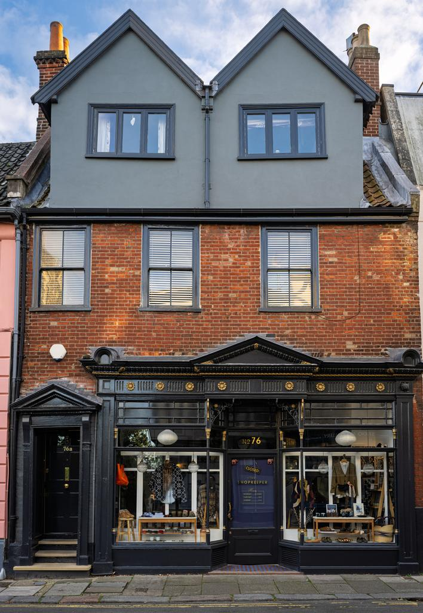

# Model Output Gallery

Generated on: 2026-10-10 23:49:31 BST

- *Evaluation lane:* assisted
- *Prompt hints:* the image's description and keyword hints were included in the prompt, so field content may be copied from them rather than seen
- *Assessment:* General checks + metadata fields and duplicate keywords; length limits and factual accuracy not assessed
- *Input image:* JPEG, 5,800 x 8,389 pixels (48.7 MP), 40.8 MB

This run records model responses to one shared image and prompt (evaluation
lane: assisted). Mechanical checks are not factual-accuracy judgments; inspect
the image, prompt and final answers before choosing a model. Results do not
establish fitness for other tasks.

Complete per-model evidence artifact with image metadata, the source prompt, a
facts-only chooser, and full generated or crash output for every attempted
model.

## Reference Image



## Current-run Chooser

Mechanical observations and captured resource facts for this run only. No concerns detected does not mean the response fulfilled an arbitrary prompt or described the image accurately. Consult the assessment scope above. Total time is end-to-end; throughput covers generation only and requires at least 16 generated tokens. Prefill/first is the measured time to first token (input preparation, prefill and the first decode step) when captured, else upstream's model-loop first-token time; Prompt tok is the full rendered prompt including image tokens, which drives prefill cost. For cross-attention architectures the token count reflects the tokenised text burden only, not total vision prefill compute.

<!-- markdownlint-disable MD034 MD037 MD049 -->

| Model                                                                                                                               | Mechanical checks               | Total s | Gen TPS    | Prefill/first s | Peak GB | Prompt tok | Gen tok | Observations                                                                                      |
|-------------------------------------------------------------------------------------------------------------------------------------|---------------------------------|---------|------------|-----------------|---------|------------|---------|---------------------------------------------------------------------------------------------------|
| [`LiquidAI/LFM2.5-VL-450M-MLX-bf16`](#model-liquidai-lfm25-vl-450m-mlx-bf16)                                                        | `no concerns detected`          | 1.77s   | 484 tok/s  | 0.52            | 1.9     | 2,144      | 83      | none                                                                                              |
| [`TechnoBaptist/Ternary-Bonsai-2-27B-mlx-2bit`](#model-technobaptist-ternary-bonsai-2-27b-mlx-2bit)                                 | `no concerns detected`          | 67.45s  | 36.2 tok/s | 59.75           | 17      | 16,586     | 182     | none                                                                                              |
| [`mlx-community/AREX-2-4bit`](#model-mlx-community-arex-2-4bit)                                                                     | `no concerns detected`          | 56.81s  | 30.7 tok/s | 49.16           | 21      | 16,586     | 137     | none                                                                                              |
| [`mlx-community/Devstral-Small-2-24B-Instruct-2512-5bit`](#model-mlx-community-devstral-small-2-24b-instruct-2512-5bit)             | `no concerns detected`          | 10.69s  | 30.1 tok/s | 3.63            | 23      | 2,498      | 134     | none                                                                                              |
| [`mlx-community/GLM-4.6V-nvfp4`](#model-mlx-community-glm-46v-nvfp4)                                                                | `no concerns detected`          | 34.07s  | 44.1 tok/s | 19.45           | 78      | 6,445      | 145     | none                                                                                              |
| [`mlx-community/Idefics3-8B-Llama3-bf16`](#model-mlx-community-idefics3-8b-llama3-bf16)                                             | `no concerns detected`          | 9.93s   | 34.4 tok/s | 1.65            | 18      | 2,641      | 200     | none                                                                                              |
| [`mlx-community/InternVL3-14B-4bit`](#model-mlx-community-internvl3-14b-4bit)                                                       | `no concerns detected`          | 6.11s   | 56.3 tok/s | 2.05            | 10      | 2,142      | 134     | none                                                                                              |
| [`mlx-community/InternVL3-8B-bf16`](#model-mlx-community-internvl3-8b-bf16)                                                         | `no concerns detected`          | 6.33s   | 36.8 tok/s | 1.33            | 17      | 2,142      | 104     | none                                                                                              |
| [`mlx-community/MiniCPM-V-4.6-4bit`](#model-mlx-community-minicpm-v-46-4bit)                                                        | `no concerns detected`          | 4.91s   | 300 tok/s  | 0.75            | 3.2     | 963        | 826     | none                                                                                              |
| [`mlx-community/MiniCPM-o-4_5-4bit`](#model-mlx-community-minicpm-o-45-4bit)                                                        | `no concerns detected`          | 2.98s   | 104 tok/s  | 0.63            | 7.0     | 420        | 94      | none                                                                                              |
| [`mlx-community/Ministral-3-14B-Instruct-2512-mxfp4`](#model-mlx-community-ministral-3-14b-instruct-2512-mxfp4)                     | `no concerns detected`          | 8.28s   | 65.7 tok/s | 2.79            | 13      | 3,031      | 244     | none                                                                                              |
| [`mlx-community/Ministral-3-3B-Instruct-2512-4bit`](#model-mlx-community-ministral-3-3b-instruct-2512-4bit)                         | `no concerns detected`          | 3.87s   | 184 tok/s  | 1.45            | 8.1     | 3,030      | 166     | none                                                                                              |
| [`mlx-community/Ornith-1.5-35B-A3B-OptiQ-4bit`](#model-mlx-community-ornith-15-35b-a3b-optiq-4bit)                                  | `no concerns detected`          | 5.45s   | 101 tok/s  | 1.10            | 25      | 1,330      | 127     | none                                                                                              |
| [`mlx-community/Phi-3.5-vision-instruct-bf16`](#model-mlx-community-phi-35-vision-instruct-bf16)                                    | `no concerns detected`          | 4.71s   | 56.0 tok/s | 0.74            | 9.3     | 1,169      | 147     | none                                                                                              |
| [`mlx-community/Qwen3-Omni-30B-A3B-Instruct-4bit`](#model-mlx-community-qwen3-omni-30b-a3b-instruct-4bit)                           | `no concerns detected`          | 24.63s  | 71.1 tok/s | 19.57           | 26      | 12,814     | 141     | none                                                                                              |
| [`mlx-community/Qwen3-VL-8B-Instruct-4bit`](#model-mlx-community-qwen3-vl-8b-instruct-4bit)                                         | `no concerns detected`          | 37.25s  | 68.9 tok/s | 34.24           | 11      | 16,570     | 87      | none                                                                                              |
| [`mlx-community/Qwen3.5-35B-A3B-4bit`](#model-mlx-community-qwen35-35b-a3b-4bit)                                                    | `no concerns detected`          | 38.66s  | 108 tok/s  | 34.05           | 25      | 16,586     | 140     | none                                                                                              |
| [`mlx-community/Qwen3.8-27B-nvfp4`](#model-mlx-community-qwen38-27b-nvfp4)                                                          | `no concerns detected`          | 59.46s  | 29.0 tok/s | 52.22           | 21      | 16,586     | 128     | none                                                                                              |
| [`mlx-community/Step-3.7-Flash-oQ3e`](#model-mlx-community-step-37-flash-oq3e)                                                      | `no concerns detected`          | 48.27s  | 47.4 tok/s | 30.14           | 92      | 3,522      | 117     | none                                                                                              |
| [`mlx-community/aya-vision-8b-4bit`](#model-mlx-community-aya-vision-8b-4bit)                                                       | `no concerns detected`          | 4.76s   | 101 tok/s  | 1.51            | 6.5     | 2,123      | 125     | none                                                                                              |
| [`mlx-community/diffusiongemma-26B-A4B-it-mxfp8`](#model-mlx-community-diffusiongemma-26b-a4b-it-mxfp8)                             | `no concerns detected`          | 6.79s   | 49.6 tok/s | 2.94            | 28      | 626        | 95      | none                                                                                              |
| [`mlx-community/gemma-3-27b-it-qat-4bit`](#model-mlx-community-gemma-3-27b-it-qat-4bit)                                             | `no concerns detected`          | 9.64s   | 29.9 tok/s | 1.40            | 17      | 625        | 161     | none                                                                                              |
| [`mlx-community/gemma-4-12B-it-4bit`](#model-mlx-community-gemma-4-12b-it-4bit)                                                     | `no concerns detected`          | 5.13s   | 60.0 tok/s | 0.88            | 7.7     | 630        | 106     | none                                                                                              |
| [`mlx-community/gemma-4-26b-a4b-it-4bit`](#model-mlx-community-gemma-4-26b-a4b-it-4bit)                                             | `no concerns detected`          | 4.93s   | 110 tok/s  | 0.93            | 16      | 630        | 104     | none                                                                                              |
| [`mlx-community/gemma-4-31b-it-4bit`](#model-mlx-community-gemma-4-31b-it-4bit)                                                     | `no concerns detected`          | 8.92s   | 26.3 tok/s | 1.61            | 20      | 630        | 109     | none                                                                                              |
| [`mlx-community/gemma-4-e4b-it-4bit`](#model-mlx-community-gemma-4-e4b-it-4bit)                                                     | `no concerns detected`          | 3.58s   | 125 tok/s  | 0.65            | 6.0     | 626        | 104     | none                                                                                              |
| [`mlx-community/granite-4.0-3b-vision-4bit`](#model-mlx-community-granite-40-3b-vision-4bit)                                        | `no concerns detected`          | 3.33s   | 174 tok/s  | 1.11            | 4.6     | 1,420      | 160     | none                                                                                              |
| [`mlx-community/pixtral-12b-8bit`](#model-mlx-community-pixtral-12b-8bit)                                                           | `no concerns detected`          | 8.70s   | 34.7 tok/s | 2.76            | 16      | 3,297      | 133     | none                                                                                              |
| [`nativ-community/Mage-VL-OptiQ-4bit`](#model-nativ-community-mage-vl-optiq-4bit)                                                   | `no concerns detected`          | 5.34s   | 119 tok/s  | 2.20            | 5.4     | 4,188      | 198     | none                                                                                              |
| [`nativ-community/Mistral-Small-3.2-24B-Instruct-2506-4bit`](#model-nativ-community-mistral-small-32-24b-instruct-2506-4bit)        | `no concerns detected`          | 8.22s   | 35.1 tok/s | 2.01            | 18      | 1,353      | 136     | none                                                                                              |
| [`mlx-community/GLM-4.6V-Flash-4bit`](#model-mlx-community-glm-46v-flash-4bit)                                                      | `concerns detected`             | 11.08s  | 77.7 tok/s | 7.08            | 8.7     | 6,445      | 181     | duplicate keywords                                                                                |
| [`mlx-community/LFM2.5-VL-3B-OptiQ-4bit`](#model-mlx-community-lfm25-vl-3b-optiq-4bit)                                              | `concerns detected`             | 2.99s   | 211 tok/s  | 0.99            | 4.0     | 2,136      | 112     | prompt hint repeated; unsupplied place name                                                       |
| [`mlx-community/Llama-3.2-11B-Vision-Instruct-8bit`](#model-mlx-community-llama-32-11b-vision-instruct-8bit)                        | `concerns detected`             | 13.42s  | 20.6 tok/s | 2.00            | 15      | 329        | 194     | duplicate keywords                                                                                |
| [`mlx-community/Molmo2-8B-4bit`](#model-mlx-community-molmo2-8b-4bit)                                                               | `concerns detected`             | 5.38s   | 72.5 tok/s | 1.18            | 8.3     | 1,356      | 187     | duplicate keywords                                                                                |
| [`mlx-community/North-Micro-Vision-Instruct-4bit`](#model-mlx-community-north-micro-vision-instruct-4bit)                           | `concerns detected`             | 4.93s   | 209 tok/s  | 2.70            | 3.9     | 4,093      | 126     | prompt hint repeated                                                                              |
| [`mlx-community/Qwen3-VL-30B-A3B-Instruct-4bit`](#model-mlx-community-qwen3-vl-30b-a3b-instruct-4bit)                               | `concerns detected`             | 36.59s  | 84.9 tok/s | 32.24           | 23      | 16,570     | 133     | unsupplied place name                                                                             |
| [`mlx-community/SmolVLM2-2.2B-Instruct-mlx`](#model-mlx-community-smolvlm2-22b-instruct-mlx)                                        | `concerns detected`             | 3.07s   | 121 tok/s  | 0.99            | 5.6     | 1,463      | 102     | prompt hint repeated                                                                              |
| [`nativ-community/Nemotron-3-Nano-Omni-30B-A3B-Reasoning-4bit`](#model-nativ-community-nemotron-3-nano-omni-30b-a3b-reasoning-4bit) | `concerns detected`             | 8.47s   | 152 tok/s  | 4.77            | 23      | 3,681      | 117     | duplicate keywords                                                                                |
| [`sahilchachra/LensVLM-9B-MXFP4`](#model-sahilchachra-lensvlm-9b-mxfp4)                                                             | `concerns detected`             | 4.44s   | 104 tok/s  | 1.44            | 7.5     | 1,872      | 136     | prompt hint repeated                                                                              |
| [`mlx-community/ERNIE-4.5-VL-28B-A3B-Thinking-4bit`](#model-mlx-community-ernie-45-vl-28b-a3b-thinking-4bit)                        | `major concerns: answer format` | 15.65s  | 81.5 tok/s | 1.23            | 19      | 1,669      | 1,000   | cut off at token limit; duplicate keywords                                                        |
| [`mlx-community/FastVLM-0.5B-bf16`](#model-mlx-community-fastvlm-05b-bf16)                                                          | `major concerns: answer format` | 2.50s   | 367 tok/s  | 0.94            | 2.1     | 363        | 30      | labelled fields not detected                                                                      |
| [`mlx-community/InternVL3_5-1B-4bit`](#model-mlx-community-internvl35-1b-4bit)                                                      | `major concerns: generation`    | 2.23s   | 410 tok/s  | 0.72            | 2.1     | 2,145      | 200     | repeated text; stopped early: repeating; duplicate keywords                                       |
| [`mlx-community/Kimi-VL-A3B-Thinking-2506-8bit`](#model-mlx-community-kimi-vl-a3b-thinking-2506-8bit)                               | `major concerns: generation`    | 19.06s  | 65.6 tok/s | 1.23            | 20      | 1,326      | 1,000   | labelled fields not detected; cut off at token limit; incomplete thinking block                   |
| [`mlx-community/MolmoPoint-8B-4bit`](#model-mlx-community-molmopoint-8b-4bit)                                                       | `major concerns: generation`    | 11.28s  | 31.5 tok/s | 2.87            | 13      | 3,174      | 200     | repeated text; stopped early: repeating; duplicate keywords                                       |
| [`mlx-community/Muse-Glimmer-30B-OptiQ-4bit`](#model-mlx-community-muse-glimmer-30b-optiq-4bit)                                     | `major concerns: answer format` | 51.69s  | 25.0 tok/s | 8.22            | 25      | 4,458      | 1,000   | control tokens visible; labelled fields not detected; cut off at token limit; role tokens visible |
| [`mlx-community/Qwen2-VL-2B-mlx`](#model-mlx-community-qwen2-vl-2b-mlx)                                                             | `major concerns: generation`    | 42.65s  | 123 tok/s  | 32.89           | 9.4     | 16,581     | 1,000   | repeated text; cut off at token limit                                                             |
| [`mlx-community/SmolVLM-256M-Instruct-4bit`](#model-mlx-community-smolvlm-256m-instruct-4bit)                                       | `major concerns: answer format` | 1.93s   | 506 tok/s  | 0.77            | 1.1     | 1,242      | 80      | labelled fields not detected                                                                      |
| [`mlx-community/X-Reasoner-7B-8bit`](#model-mlx-community-x-reasoner-7b-8bit)                                                       | `major concerns: generation`    | 37.90s  | 52.8 tok/s | 15.51           | 14      | 16,581     | 1,000   | repeated text; cut off at token limit; duplicate keywords                                         |
| [`mlx-community/gemma-3n-E4B-it-4bit`](#model-mlx-community-gemma-3n-e4b-it-4bit)                                                   | `major concerns: answer format` | 7.27s   | 83.5 tok/s | 0.81            | 7.2     | 624        | 352     | labelled fields not detected                                                                      |
| [`mlx-community/granite-vision-3.2-2b-nvfp4`](#model-mlx-community-granite-vision-32-2b-nvfp4)                                      | `major concerns: answer format` | 5.70s   | 134 tok/s  | 3.95            | 4.4     | 5,877      | 85      | labelled fields not detected; duplicate keywords                                                  |
| [`mlx-community/llm-jp-4-vl-9b-mlx-4bit`](#model-mlx-community-llm-jp-4-vl-9b-mlx-4bit)                                             | `major concerns: answer format` | 3.30s   | 102 tok/s  | 1.39            | 6.7     | 2,234      | 26      | control tokens visible; labelled fields not detected                                              |
| [`mlx-community/nanoLLaVA-1.5-4bit`](#model-mlx-community-nanollava-15-4bit)                                                        | `major concerns: generation`    | 2.20s   | 328 tok/s  | 0.59            | 1.8     | 359        | 200     | repeated text; stopped early: repeating; labelled fields not detected                             |
| [`vikhyatk/moondream2`](#model-vikhyatk-moondream2)                                                                                 | `major concerns: answer format` | 2.64s   | 160 tok/s  | 0.81            | 4.8     | 1,041      | 57      | labelled fields not detected                                                                      |
<!-- markdownlint-enable MD034 MD037 MD049 -->

## Resource Highlights

Quickest completion without detected concerns (end-to-end, including model load): `LiquidAI/LFM2.5-VL-450M-MLX-bf16` at 1.77s

Lowest peak memory among completions without detected concerns: `LiquidAI/LFM2.5-VL-450M-MLX-bf16` at 1.9 GB

Decode tok/s stays per model in the chooser and is not averaged across models: tokenizers, image-token expansion and reasoning lengths differ too much for a cross-model mean to guide a choice.

## Major Mechanical Concerns in This Run

<!-- markdownlint-disable MD034 MD037 MD049 -->

| Model                                                                                                        | Mechanical checks               | Observations                                                                                      |
|--------------------------------------------------------------------------------------------------------------|---------------------------------|---------------------------------------------------------------------------------------------------|
| [`mlx-community/ERNIE-4.5-VL-28B-A3B-Thinking-4bit`](#model-mlx-community-ernie-45-vl-28b-a3b-thinking-4bit) | `major concerns: answer format` | cut off at token limit; duplicate keywords                                                        |
| [`mlx-community/FastVLM-0.5B-bf16`](#model-mlx-community-fastvlm-05b-bf16)                                   | `major concerns: answer format` | labelled fields not detected                                                                      |
| [`mlx-community/InternVL3_5-1B-4bit`](#model-mlx-community-internvl35-1b-4bit)                               | `major concerns: generation`    | repeated text; stopped early: repeating; duplicate keywords                                       |
| [`mlx-community/Kimi-VL-A3B-Thinking-2506-8bit`](#model-mlx-community-kimi-vl-a3b-thinking-2506-8bit)        | `major concerns: generation`    | labelled fields not detected; cut off at token limit; incomplete thinking block                   |
| [`mlx-community/MolmoPoint-8B-4bit`](#model-mlx-community-molmopoint-8b-4bit)                                | `major concerns: generation`    | repeated text; stopped early: repeating; duplicate keywords                                       |
| [`mlx-community/Muse-Glimmer-30B-OptiQ-4bit`](#model-mlx-community-muse-glimmer-30b-optiq-4bit)              | `major concerns: answer format` | control tokens visible; labelled fields not detected; cut off at token limit; role tokens visible |
| [`mlx-community/Qwen2-VL-2B-mlx`](#model-mlx-community-qwen2-vl-2b-mlx)                                      | `major concerns: generation`    | repeated text; cut off at token limit                                                             |
| [`mlx-community/SmolVLM-256M-Instruct-4bit`](#model-mlx-community-smolvlm-256m-instruct-4bit)                | `major concerns: answer format` | labelled fields not detected                                                                      |
| [`mlx-community/X-Reasoner-7B-8bit`](#model-mlx-community-x-reasoner-7b-8bit)                                | `major concerns: generation`    | repeated text; cut off at token limit; duplicate keywords                                         |
| [`mlx-community/gemma-3n-E4B-it-4bit`](#model-mlx-community-gemma-3n-e4b-it-4bit)                            | `major concerns: answer format` | labelled fields not detected                                                                      |
| [`mlx-community/granite-vision-3.2-2b-nvfp4`](#model-mlx-community-granite-vision-32-2b-nvfp4)               | `major concerns: answer format` | labelled fields not detected; duplicate keywords                                                  |
| [`mlx-community/llm-jp-4-vl-9b-mlx-4bit`](#model-mlx-community-llm-jp-4-vl-9b-mlx-4bit)                      | `major concerns: answer format` | control tokens visible; labelled fields not detected                                              |
| [`mlx-community/nanoLLaVA-1.5-4bit`](#model-mlx-community-nanollava-15-4bit)                                 | `major concerns: generation`    | repeated text; stopped early: repeating; labelled fields not detected                             |
| [`vikhyatk/moondream2`](#model-vikhyatk-moondream2)                                                          | `major concerns: answer format` | labelled fields not detected                                                                      |
<!-- markdownlint-enable MD034 MD037 MD049 -->

## Output at a Glance

A compact preview of each model's final answer (or failure evidence for crashes), in chooser order. Where the requested catalogue fields were detected, the preview shows a little of each: the title, the start of the description, and the first keywords with their count, so the weakest field is not hidden behind a long description. Otherwise it is the first 280 characters. A closed reasoning trace is left out of the preview and reported as an omitted-character count; the complete output, trace included, is in the model's evidence block below.

<!-- markdownlint-disable MD034 MD037 MD049 -->

| Model                                                                                                                               | Mechanical checks      | Output preview                                                                                                                                                                                                                                                                                                                                                                        |
|-------------------------------------------------------------------------------------------------------------------------------------|------------------------|---------------------------------------------------------------------------------------------------------------------------------------------------------------------------------------------------------------------------------------------------------------------------------------------------------------------------------------------------------------------------------------|
| [`LiquidAI/LFM2.5-VL-450M-MLX-bf16`](#model-liquidai-lfm25-vl-450m-mlx-bf16)                                                        | `no concerns detected` | Title: The Shopkeeper Store \| Description: A charming brick building with a black-painted storefront and a red brick middle story, featuring a gabled roof with two dormers a... \| Keywords (14): brick building, black storefront, red brick, gable, entrance, shopfront, architecture, British, ...                                                                               |
| [`TechnoBaptist/Ternary-Bonsai-2-27B-mlx-2bit`](#model-technobaptist-ternary-bonsai-2-27b-mlx-2bit)                                 | `no concerns detected` | Title: The Shopkeeper Boutique at Number 76 \| Description: A street-level view of The Shopkeeper boutique at No. 76, featuring a black-painted storefront with gol... \| Keywords (18): The Shopkeeper, boutique, storefront, red brick, sash window, gable, gold detailing, black paint, chimney, ...                                                                               |
| [`mlx-community/AREX-2-4bit`](#model-mlx-community-arex-2-4bit)                                                                     | `no concerns detected` | Title: The Shopkeeper Store, No. 76, Black Shopfront with Gold Detailing \| Description: A street-level view of The Shopkeeper Store at No. 76, featuring a tradi... \| Keywords (20): Adobe Stock, Any Vision, Chimney, Entrance, Europe, Gable, Objects, Red brick, Roof, Sash Window, Shopfront, ...                                                                               |
| [`mlx-community/Devstral-Small-2-24B-Instruct-2512-5bit`](#model-mlx-community-devstral-small-2-24b-instruct-2512-5bit)             | `no concerns detected` | Title: The Shopkeeper Store, No. 76, UK \| Description: A traditional British boutique at No. 76, featuring a black-painted storefront with gold detailing, red brick m... \| Keywords (20): The Shopkeeper Store, No. 76, UK, boutique, black storefront, gold detailing, red brick, sash windows, ...                                                                               |
| [`mlx-community/GLM-4.6V-nvfp4`](#model-mlx-community-glm-46v-nvfp4)                                                                | `no concerns detected` | Title: Traditional British Shopfront Exterior \| Description: A street-level architectural view of The Shopkeeper Store at No. 76, featuring a black-painted ground... \| Keywords (18): The Shopkeeper Store, No. 76, black-painted storefront, gold detailing, red brick building, sash windows, ...                                                                                |
| [`mlx-community/Idefics3-8B-Llama3-bf16`](#model-mlx-community-idefics3-8b-llama3-bf16)                                             | `no concerns detected` | Title: Traditional British Shopfront with Red Brick Upper Story and Gabled Dormers. \| Description: The exterior of The Shopkeeper Store, located at No. 76, feat... \| Keywords (20): adobe stock, any vision, chimney, entrance, europe, gable, objects, red brick, roof, sash window, shopfront, ...                                                                               |
| [`mlx-community/InternVL3-14B-4bit`](#model-mlx-community-internvl3-14b-4bit)                                                       | `no concerns detected` | Title: British Architectural Boutique, No. 76 \| Description: The exterior of The Shopkeeper Store at No. 76, captured on 2026-10-10 at 17:21 UTC+01:00, features a... \| Keywords (19): Adobe Stock, Chimney, Entrance, Europe, Gable, Objects, Red brick, Roof, Sash Window, Shopfront, Signage, ...                                                                                |
| [`mlx-community/InternVL3-8B-bf16`](#model-mlx-community-internvl3-8b-bf16)                                                         | `no concerns detected` | Title: Traditional British Boutique Storefront \| Description: The Shopkeeper Store at No. 76 features a black-painted storefront with gold detailing, red bric... \| Keywords (15): British, architecture, boutique, brick building, brick wall, black storefront, gold detailing, gabled dormers, ...                                                                               |
| [`mlx-community/MiniCPM-V-4.6-4bit`](#model-mlx-community-minicpm-v-46-4bit)                                                        | `no concerns detected` | Title: Shopfront Storefront Display \| Description: The shopfront at No. 76 shows a traditional black-painted exterior with gold detailing, evident in the sas... \| Keywords (19): British, commercial, storefront, boutique, red brick, gable, sash windows, entrance, gold detailing, shopfront, ...[2,706 characters of reasoning omitted; complete output in the evidence block] |
| [`mlx-community/MiniCPM-o-4_5-4bit`](#model-mlx-community-minicpm-o-45-4bit)                                                        | `no concerns detected` | Title: Boutique Shopfront with Red Brick and Gabled Dormers \| Description: A historic British storefront at 76 features red brick, black trim, gold accents, and s... \| Keywords (16): boutique, shopfront, red brick, gable, dormer, sash window, black trim, gold detailing, chimney, entrance, ...                                                                               |
| [`mlx-community/Ministral-3-14B-Instruct-2512-mxfp4`](#model-mlx-community-ministral-3-14b-instruct-2512-mxfp4)                     | `no concerns detected` | Title: **The Shopkeeper Store, No. 76 – Traditional UK Boutique Exterior** \| Description: A street-level photograph of **The Shopkeeper Store** at **No. 76**, captured on **10 Octobe... \| Keywords (20): The Shopkeeper Store, No. 76, UK boutique, traditional shopfront, black-painted store, ...                                                                               |
| [`mlx-community/Ministral-3-3B-Instruct-2512-4bit`](#model-mlx-community-ministral-3-3b-instruct-2512-4bit)                         | `no concerns detected` | Title: **The Shopkeeper’s Last Hour: No. 76’s Retro Boutique** \| Description: A quaint UK brick storefront at No. 76, captured on 2026-10-10, shows a vintage... \| Keywords (14): red-brick sash windows, black-gold shopfront, gabled dormers, slate roof, vintage boutique, UK brick building, ...                                                                                |
| [`mlx-community/Ornith-1.5-35B-A3B-OptiQ-4bit`](#model-mlx-community-ornith-15-35b-a3b-optiq-4bit)                                  | `no concerns detected` | Title: The Shopkeeper Store No. 76 Victorian Brick Shopfront \| Description: A street-level view of The Shopkeeper Store at No. 76, presenting a traditional black-painted... \| Keywords (19): shopfront, brick building, storefront, shop, sash window, gable, chimney, entrance, roof, signage, ...                                                                                |
| [`mlx-community/Phi-3.5-vision-instruct-bf16`](#model-mlx-community-phi-35-vision-instruct-bf16)                                    | `no concerns detected` | Title: Traditional British Shopfront at No. 76 \| Description: The Shopkeeper Store at No. 76 showcases a classic black-painted facade with gold accents, set against a r... \| Keywords (22): British, Shopkeeper, Store, No. 76, black-painted, gold-accented, red brick, entrance, sash windows, ...                                                                               |
| [`mlx-community/Qwen3-Omni-30B-A3B-Instruct-4bit`](#model-mlx-community-qwen3-omni-30b-a3b-instruct-4bit)                           | `no concerns detected` | Title: The Shopkeeper boutique storefront in the UK \| Description: The exterior of 'The Shopkeeper' boutique at No. 76, a traditional British shop with a blac... \| Keywords (18): shopfront, boutique, red brick, gable, sash window, shopkeeper, storefront, building exterior, united kingdom, ...                                                                               |
| [`mlx-community/Qwen3-VL-8B-Instruct-4bit`](#model-mlx-community-qwen3-vl-8b-instruct-4bit)                                         | `no concerns detected` | Title: Black-Framed Shopfront with Red Brick Facade \| Description: A boutique store at No. 76 in the UK, featuring a black-painted storefront with gold detailing,... \| Keywords (10): boutique, shopfront, red brick, black paint, gold detailing, sash window, gable, chimney, United Kingdom, ...                                                                                |
| [`mlx-community/Qwen3.5-35B-A3B-4bit`](#model-mlx-community-qwen35-35b-a3b-4bit)                                                    | `no concerns detected` | Title: The Shopkeeper Boutique at No. 76 in UK \| Description: This image captures the traditional exterior of The Shopkeeper Store at No. 76, featuring a black-painted storefront wit... \| Keywords (18): shopfront, signage, red brick, black paint, gold detailing, sash windows, gabled roof, ...                                                                               |
| [`mlx-community/Qwen3.8-27B-nvfp4`](#model-mlx-community-qwen38-27b-nvfp4)                                                          | `no concerns detected` | Title: The Shopkeeper Storefront at No. 76, Red Brick Facade \| Description: A street-level view of a boutique storefront at No. 76, featuring a black-painted shop... \| Keywords (16): The Shopkeeper, shopfront, red brick, sash windows, gable, dormer, black facade, gold detailing, boutique, ...                                                                               |
| [`mlx-community/Step-3.7-Flash-oQ3e`](#model-mlx-community-step-37-flash-oq3e)                                                      | `no concerns detected` | Title: The Shopkeeper Storefront at 76a, Norwich \| Description: A street-level view of the traditional black-painted storefront of The Shopkeeper at No. 76, fe... \| Keywords (18): Adobe Stock, Any Vision, boutique, brick building, brick wall, british, building exterior, chimney, entrance, ...                                                                               |
| [`mlx-community/aya-vision-8b-4bit`](#model-mlx-community-aya-vision-8b-4bit)                                                       | `no concerns detected` | Title: Shopkeeper Store, No. 76, British Boutique \| Description: This image captures the exterior of The Shopkeeper Store, a boutique located at No. 76, showca... \| Keywords (13): British, boutique, architectural detail, brick building, brick wall, Europe, Gable, objects, red brick, roof, ...                                                                               |
| [`mlx-community/diffusiongemma-26B-A4B-it-mxfp8`](#model-mlx-community-diffusiongemma-26b-a4b-it-mxfp8)                             | `no concerns detected` | Title: Exterior of The Shopkeeper Boutique at No. 76 \| Description: A street-level architectural view of a three-story brick building featuring a black-painted storefront w... \| Keywords (14): United Kingdom, architecture, brick building, shopfront, red brick, sash window, gable, chimney, ...                                                                               |
| [`mlx-community/gemma-3-27b-it-qat-4bit`](#model-mlx-community-gemma-3-27b-it-qat-4bit)                                             | `no concerns detected` | Title: The Shopkeeper Store, No. 76 – Norwich Street Architecture \| Description: Captured on 10th October 2026 at 17:21 UTC+01:00, this street-level view shows th... \| Keywords (20): The Shopkeeper Store, No. 76, Norwich, United Kingdom, architecture, architectural detail, brick building, ...                                                                               |
| [`mlx-community/gemma-4-12B-it-4bit`](#model-mlx-community-gemma-4-12b-it-4bit)                                                     | `no concerns detected` | Title: Architecture of The Shopkeeper Store in the United Kingdom \| Description: A street-level view of a traditional brick building featuring a black-painted storefront... \| Keywords (16): United Kingdom, architecture, boutique, shopfront, red brick, sash window, gable, signage, retail, ...                                                                                |
| [`mlx-community/gemma-4-26b-a4b-it-4bit`](#model-mlx-community-gemma-4-26b-a4b-it-4bit)                                             | `no concerns detected` | Title: Traditional brick storefront with black wooden details \| Description: A street-level view of The Shopkeeper Store features a black-painted storefront wit... \| Keywords (16): architecture, boutique, brick building, building exterior, chimney, entrance, gable, red brick, sash window, ...                                                                               |
| [`mlx-community/gemma-4-31b-it-4bit`](#model-mlx-community-gemma-4-31b-it-4bit)                                                     | `no concerns detected` | Title: Exterior of The Shopkeeper Store at No. 76 \| Description: A street-level view of The Shopkeeper Store featuring a black-painted storefront with gold det... \| Keywords (16): architecture, boutique, British, red brick, shopfront, sash window, gable, United Kingdom, building exterior, ...                                                                               |
| [`mlx-community/gemma-4-e4b-it-4bit`](#model-mlx-community-gemma-4-e4b-it-4bit)                                                     | `no concerns detected` | Title: Traditional British Shopfront Facade with Dormer Windows \| Description: A street-level view of The Shopkeeper's store, featuring a contrast between the gr... \| Keywords (15): shopfront, red brick, slate grey, dormer windows, facade, architecture, boutique, high street, traditional, ...                                                                               |
| [`mlx-community/granite-4.0-3b-vision-4bit`](#model-mlx-community-granite-40-3b-vision-4bit)                                        | `no concerns detected` | Title: "The Shopkeeper Store Exterior" \| Description: "A street-level view of The Shopkeeper Store, No. 76, showcases a traditional black-painted storefront with go... \| Keywords (26): The Shopkeeper Store, No. 76, black-painted storefront, gold detailing, red brick, twin dormers, gabled, ...                                                                               |
| [`mlx-community/pixtral-12b-8bit`](#model-mlx-community-pixtral-12b-8bit)                                                           | `no concerns detected` | Title: Traditional Shopfront in Historic British Building \| Description: The image captures the exterior of The Shopkeeper Store at No. 76, showcasing a traditi... \| Keywords (24): Adobe Stock, Any Vision, Chimney, Entrance, Europe, Gable, Objects, Red brick, Roof, Sash Window, Shopfront, ...                                                                               |
| [`nativ-community/Mage-VL-OptiQ-4bit`](#model-nativ-community-mage-vl-optiq-4bit)                                                   | `no concerns detected` | Title: The Shopkeeper Storefront at No. 76, a traditional British brick building wit... \| Description: A street-level view of The Shopkeeper Store, located at No. 7... \| Keywords (19): Shopkeeper, No. 76, red brick, sash window, gable, dormer, black storefront, gold detailing, mannequins, ...                                                                               |
| [`nativ-community/Mistral-Small-3.2-24B-Instruct-2506-4bit`](#model-nativ-community-mistral-small-32-24b-instruct-2506-4bit)        | `no concerns detected` | Title: Traditional British Boutique Shopfront \| Description: A detailed view of The Shopkeeper Store at No. 76, captured on October 10, 2026, showcasing its orna... \| Keywords (18): United Kingdom, boutique, shopfront, red brick, sash windows, gabled dormers, gold detailing, black facade, ...                                                                               |
| [`mlx-community/GLM-4.6V-Flash-4bit`](#model-mlx-community-glm-46v-flash-4bit)                                                      | `concerns detected`    | Title: The Shopkeeper Store Exterior \| Description: The image shows the exterior of The Shopkeeper Store, located at No. 76, captured on 2026-10-10 17:21:00 UTC+01:00... \| Keywords (23): The Shopkeeper Store, No. 76, black-painted storefront, gold detailing, red brick, three sash windows, ...                                                                               |
| [`mlx-community/LFM2.5-VL-3B-OptiQ-4bit`](#model-mlx-community-lfm25-vl-3b-optiq-4bit)                                              | `concerns detected`    | Title: The Shopkeeper Store, No. 76, London \| Description: A traditional black-painted storefront with gold detailing, red brick middle story, and twin slate-gr... \| Keywords (19): Adobe Stock, Any Vision, Chimney, Entrance, Europe, Gable, Objects, Red brick, Roof, Sash Window, Shopfront, ...                                                                               |
| [`mlx-community/Llama-3.2-11B-Vision-Instruct-8bit`](#model-mlx-community-llama-32-11b-vision-instruct-8bit)                        | `concerns detected`    | Title: Traditional British Shopfront with Gabled Dormers \| Description: The image captures a traditional British shopfront with gabled dormers, situated in a historic building with a re... \| Keywords (30): traditional british shopfront, gabled dormers, red brick façade, historic building, ...                                                                               |
| [`mlx-community/Molmo2-8B-4bit`](#model-mlx-community-molmo2-8b-4bit)                                                               | `concerns detected`    | Title: Traditional British Shopfront at No. 76, London \| Description: A street-level view of The Shopkeeper Store at No. 76, London, captured on October 10, 2... \| Keywords (25): London, Shopkeeper Store, No. 76, British architecture, traditional shopfront, red brick, sash windows, gable, ...                                                                               |
| [`mlx-community/North-Micro-Vision-Instruct-4bit`](#model-mlx-community-north-micro-vision-instruct-4bit)                           | `concerns detected`    | Title: The Shopkeeper Store Entrance \| Description: A street-level architectural view of the exterior of The Shopkeeper Store, located at No. 7 6, featuring a tra... \| Keywords (19): Adobe Stock, Any Vision, Chimney, Entrance, Europe, Gable, Objects, Red brick, Roof, Sash Window, Signage, ...                                                                               |
| [`mlx-community/Qwen3-VL-30B-A3B-Instruct-4bit`](#model-mlx-community-qwen3-vl-30b-a3b-instruct-4bit)                               | `concerns detected`    | Title: The Shopkeeper Store, 76, Brighton \| Description: The exterior of The Shopkeeper Store at No. 76 in Brighton, a boutique with a traditional black-painted storefro... \| Keywords (19): The Shopkeeper, No. 76, Brighton, shopfront, boutique, black storefront, gold detailing, red brick, ...                                                                               |
| [`mlx-community/SmolVLM2-2.2B-Instruct-mlx`](#model-mlx-community-smolvlm2-22b-instruct-mlx)                                        | `concerns detected`    | Title: The Shopkeeper Store \| Description: A traditional black-painted storefront with gold detailing, a red brick middle story with three sash windows, and twi... \| Keywords (20): Adobe Stock, Any Vision, Chimney, Entrance, Europe, Gable, Objects, Red brick, Roof, Sash Window, Shopfront, ...                                                                               |
| [`nativ-community/Nemotron-3-Nano-Omni-30B-A3B-Reasoning-4bit`](#model-nativ-community-nemotron-3-nano-omni-30b-a3b-reasoning-4bit) | `concerns detected`    | Title: The Shopkeeper Store Exterior \| Description: A street-level view of The Shopkeeper Store at No. 76, showcasing its traditional black-painted storefront with go... \| Keywords (17): The Shopkeeper Store, No. 76, black storefront, gold detailing, red brick facade, twin gabled dormers, ...                                                                               |
| [`sahilchachra/LensVLM-9B-MXFP4`](#model-sahilchachra-lensvlm-9b-mxfp4)                                                             | `concerns detected`    | Title: No. 76 The Shopkeeper Store \| Description: A street-level architectural view of the exterior of The Shopkeeper Store, located at No. 76, featuring a trad... \| Keywords (20): Adobe Stock, Any Vision, Chimney, Entrance, Europe, Gable, Objects, Red brick, Roof, Sash Window, Shopfront, ...                                                                               |
| [`mlx-community/ERNIE-4.5-VL-28B-A3B-Thinking-4bit`](#model-mlx-community-ernie-45-vl-28b-a3b-thinking-4bit)                        | `major concerns`       | Title: The Shopkeeper Store, No. 76, St. Helier \| Description: A late afternoon street-level view of The Shopkeeper Store at No. 76, a traditional building w... \| Keywords (36): The Shopkeeper Store, No. 76, St. Helier, United Kingdom, British, Architecture, Shopfront, Street View, Brick, ...[2,638 characters of reasoning omitted; complete output in the evidence block] |
| [`mlx-community/FastVLM-0.5B-bf16`](#model-mlx-community-fastvlm-05b-bf16)                                                          | `major concerns`       | A detailed description of the image, including the main subject, setting, action, lighting, and distinctive details, along with relevant context and keywords.                                                                                                                                                                                                                        |
| [`mlx-community/InternVL3_5-1B-4bit`](#model-mlx-community-internvl35-1b-4bit)                                                      | `major concerns`       | Title: Architectural view of The Shopkeeper Store \| Description: The image showcases a traditional British brick building with a black-painted storefront fea... \| Keywords (49): The Shopkeeper Store, No. 76, black-painted, gold detailing, red brick, sash window, gable, entrance, European, ...                                                                               |
| [`mlx-community/Kimi-VL-A3B-Thinking-2506-8bit`](#model-mlx-community-kimi-vl-a3b-thinking-2506-8bit)                               | `major concerns`       | Title: "Traditional British boutique shopfront at No. 76, featuring red brick facade... \| Description: "Street-level view of The Shopkeeper Store, a traditional British boutique located at No. 76, featuring a red brick facade, black storefront with gold detailing... \| Keywords: (not detected)                                                                               |
| [`mlx-community/MolmoPoint-8B-4bit`](#model-mlx-community-molmopoint-8b-4bit)                                                       | `major concerns`       | Title: Traditional British Shopfront with Gold Detailing and Red Brick \| Description: A street-level view of The Shopkeeper Store at No. 76 in the United Kin... \| Keywords (37): United Kingdom, United Kingdom, United Kingdom, United Kingdom, United Kingdom, United Kingdom, United Kingdom, ...                                                                               |
| [`mlx-community/Muse-Glimmer-30B-OptiQ-4bit`](#model-mlx-community-muse-glimmer-30b-optiq-4bit)                                     | `major concerns`       | Title: (not detected) \| Description: (not detected) \| Keywords (11): We need title 5-10 words. Concrete. Maybe "The Shopkeeper Store No 76 Exterior Norwich". Need check GPS 52...., ...                                                                                                                                                                                            |
| [`mlx-community/Qwen2-VL-2B-mlx`](#model-mlx-community-qwen2-vl-2b-mlx)                                                             | `major concerns`       | Title: A Street-Level Architectural View of The Shopkeeper Store \| Description: A 5-10-word title that captures the essence of the image, focusing on the mai... \| Keywords (12): Exterior, Traditional, Black-painted, Gold detailing, Brick wall, Red brick, Sash window, Twin dormers, Closed, ...                                                                               |
| [`mlx-community/SmolVLM-256M-Instruct-4bit`](#model-mlx-community-smolvlm-256m-instruct-4bit)                                       | `major concerns`       | The shop is a 5-10-word, 1-2-minute description, focusing on the exterior of The Shopkeeper Store, which is a 5-10-word, 1-2-minute description, focusing on the shop's architectural detail, and the details of the building, including the red brick, attic dormer, and two sash wi...                                                                                              |
| [`mlx-community/X-Reasoner-7B-8bit`](#model-mlx-community-x-reasoner-7b-8bit)                                                       | `major concerns`       | Title: The Shopkeeper Store, No.76, UK \| Description: A traditional British storefront at No.76, featuring a black-painted ground floor with gold detailing, red... \| Keywords (223): The Shopkeeper Store, No.76, UK, closed sign, black storefront, gold detailing, red brick, gabled dormers, ...                                                                                |
| [`mlx-community/gemma-3n-E4B-it-4bit`](#model-mlx-community-gemma-3n-e4b-it-4bit)                                                   | `major concerns`       | ```json<br>{<br>"title": "A street-level view of The Shopkeeper Store, located at No. 76, featuring a traditional black-painted storefront adorned with gold detailing on the ground floor, a red brick middle story with three sash windows, and two slate-grey gabled dormers on the uppe...                                                                                        |
| [`mlx-community/granite-vision-3.2-2b-nvfp4`](#model-mlx-community-granite-vision-32-2b-nvfp4)                                      | `major concerns`       | Title: "The Shopkeeper's Storefront" \| Description: (not detected) \| Keywords (11): "Traditional Black-Painted Storefront", "Red Brick Middle Story", "Three Sash Windows", ...                                                                                                                                                                                                     |
| [`mlx-community/llm-jp-4-vl-9b-mlx-4bit`](#model-mlx-community-llm-jp-4-vl-9b-mlx-4bit)                                             | `major concerns`       | <\|channel\|> analysis<\|message\|> The image shows a brick building with a black storefront and a grey upper level with two dormers.                                                                                                                                                                                                                                                 |
| [`mlx-community/nanoLLaVA-1.5-4bit`](#model-mlx-community-nanollava-15-4bit)                                                        | `major concerns`       | Title: "The Shopkeeper Store: A Street-Level Architectural View of The Shopfront" \| Description: A detailed view of the shopfront of The Shopkeeper Store, featuring a traditional black-painted storefront with gold detailing on the ground floor, red brick middle s... \| Keywords: (not detected)                                                                               |
| [`vikhyatk/moondream2`](#model-vikhyatk-moondream2)                                                                                 | `major concerns`       | Title: The Shopkeeper Store, located at No. 76, features a traditional black-painted... \| Description: (not detected) \| Keywords: (not detected)                                                                                                                                                                                                                                    |
<!-- markdownlint-enable MD034 MD037 MD049 -->

## Run Stamps

- `mlx-vlm`: `0.7.7`
- `mlx`: `0.32.4.dev20261010+06eb7483f`
- `transformers`: `5.19.0`
- `tokenizers`: `0.23.3`
- `huggingface-hub`: `2.2.0`
- *Python Version:* 3.14.7
- *OS:* Darwin 27.0.0
- *macOS Version:* 27.0.1
- *GPU/Chip:* Apple M5 Max
- *MLX Device:* Apple M5 Max
- *GPU Architecture:* applegpu_g17s
- *RAM:* 128.0 GB
- *Recommended Working Set:* 115 GB
- *Fused Attention:* Available

## Image Metadata

- *Description:* A street-level architectural view of the exterior of The
  Shopkeeper Store, located at No. 76, featuring a traditional black-painted
  storefront adorned with gold detailing on the ground floor, a red brick
  middle story with three sash windows, and twin slate-grey gabled dormers on
  the upper level.
- *Keywords:* Adobe Stock, Any Vision, Chimney, Entrance, Europe, Gable,
  Objects, Red brick, Roof, Sash Window, Shopfront, Signage, United Kingdom,
  architectural detail, architecture, boutique, brick building, brick wall,
  british, building exterior, building facade, city, clothing display,
  clothing store, cloudy sky, commercial, daytime, display window, english,
  entrance door, exterior, facade, facade architecture, front door, gable
  roof, gabled, heritage, historic, historic architecture, nobody, old town,
  outdoors, pediment, quaint, residential building, retail, retail store,
  shop, sidewalk, small business, store window, storefront, street, street
  view, townhouse, traditional, urban, urban area, victorian, vintage
- *Date:* 2026-10-10 17:21:00 UTC+01:00
- *Time:* 17:21:00
- *GPS:* 52.629112°N, 1.288265°E

## Prompt

<!-- markdownlint-disable MD011 MD028 MD037 MD045 -->
>
> Create British-English catalogue metadata from the image and supplied
> context.
>
> Treat any capture date/time and GPS as authoritative facts, but do not claim
> they are visible. Descriptive hints may be incomplete or wrong: retain
> details supported by the image, correct conflicts, and add important visible
> details. Prefer image evidence when a hint conflicts, and omit uncertain
> details.
>
> Context: Authoritative context:
> &#45; Capture date/time: 2026-10-10 17:21:00 UTC+01:00
> &#45; GPS: 52.629112°N, 1.288265°E
>
> &#8203;Descriptive hints:
> &#45; Description hint: A street-level architectural view of the exterior of The
> Shopkeeper Store, located at No. 76, featuring a traditional black-painted
> storefront adorned with gold detailing on the ground floor, a red brick
> middle story with three sash windows, and twin slate-grey gabled dormers on
> the upper level.
> &#45; Keyword hints: Adobe Stock, Any Vision, Chimney, Entrance, Europe, Gable,
> Objects, Red brick, Roof, Sash Window, Shopfront, Signage, United Kingdom,
> architectural detail, architecture, boutique, brick building, brick wall,
> british, building exterior
>
> &#8203;Write:
> &#45; a concrete 5-10-word title;
> &#45; a 1-2-sentence factual description combining relevant context with the
> main visible subject, setting, action, lighting, and distinctive details;
> &#45; 10-18 unique, comma-separated keywords covering relevant context and
> visible details.
>
> &#8203;Return exactly these three sections and nothing else:
> &#8203;Title:
> &#8203;Description:
> &#8203;Keywords:
<!-- markdownlint-enable MD011 MD028 MD037 MD045 -->

## Complete Per-model Evidence

Complete generated or crash evidence for every attempted model.

<a id="model-liquidai-lfm25-vl-450m-mlx-bf16"></a>

### LiquidAI/LFM2.5-VL-450M-MLX-bf16

<details>
<summary>Complete evidence: LiquidAI/LFM2.5-VL-450M-MLX-bf16</summary>

- *Execution:* completed
- *Mechanical checks:* no concerns detected
- *Assessment:* General checks + metadata fields and duplicate keywords;
  length limits and factual accuracy not assessed
- *Maintainer status:* none
- *Observations:* none
- *Arch supported by installed mlx-vlm:* yes (model_type lfm2-vl via lfm2_vl)
- *Model load time:* 0.38s
- *Generation time:* 0.70s
- *Total time:* 1.77s
- *Prompt preparation time:* 0.407
- *First-token latency:* 0.13
- *Cleanup time:* 0.0672
- *Prompt tokens:* 2,144
- *Generation tokens:* 83
- *Total tokens:* 2,227
- *Prompt throughput (raw):* 16,502 tok/s
- *Generation throughput (raw):* 484 tok/s
- *Peak memory (GB):* 1.9
- *Active memory (GB):* 0.90
- *Cache memory (GB):* 0.08
- *Model-load active memory (GB):* 0.897
- *Post-cleanup active memory (GB):* 0.000134
- *Post-cleanup cache memory (GB):* 0.0
- *Stop reason:* completed
- *Requested maximum tokens:* 1000
- *Rendered prompt characters:* 1520
- *Image placeholders:* 1
- *Processor:* transformers.models.lfm2_vl.processing_lfm2_vl.Lfm2VlProcessor
- *Tokenizer:* transformers.tokenization_utils_tokenizers.TokenizersBackend
- *Requested model revision:* not requested
- *Resolved model revision:* ed71acdae0799c98cb450787d049d1343b65cd52
- *Resolved snapshot path:* ~/.cache/huggingface/hub/models--LiquidAI--LFM2.5-VL-450M-MLX-bf16/snapshots/ed71acdae0799c98cb450787d049d1343b65cd52
- *Generation settings:* {"max_tokens": 1000, "prefill_step_size": 2048,
  "seed": 0, "temperature": 0.0, "top_p": 1.0}
- *EOS token:* <\|im_end\|>

*Readable output:*

<pre class="model-output-readable">
Title:
The Shopkeeper Store

Description:
A charming brick building with a black-painted storefront and a red brick middle story, featuring a gabled roof with two dormers and a gable entrance.

Keywords:
brick building, black storefront, red brick, gable, entrance, shopfront, architecture, British, building exterior, shop, windows, doors, signage, United Kingdom
</pre>

</details>

---

<a id="model-technobaptist-ternary-bonsai-2-27b-mlx-2bit"></a>

### TechnoBaptist/Ternary-Bonsai-2-27B-mlx-2bit

<details>
<summary>Complete evidence: TechnoBaptist/Ternary-Bonsai-2-27B-mlx-2bit</summary>

- *Execution:* completed
- *Mechanical checks:* no concerns detected
- *Assessment:* General checks + metadata fields and duplicate keywords;
  length limits and factual accuracy not assessed
- *Maintainer status:* none
- *Observations:* none
- *Arch supported by installed mlx-vlm:* yes (model_type
  prism_hadamard_qwen35)
- *Model load time:* 1.61s
- *Generation time:* 64.78s
- *Total time:* 67.45s
- *Prompt preparation time:* 1.04
- *First-token latency:* 58.8
- *Cleanup time:* 0.145
- *Prompt tokens:* 16,586
- *Generation tokens:* 182
- *Total tokens:* 16,768
- *Prompt throughput (raw):* 282 tok/s
- *Generation throughput (raw):* 36.2 tok/s
- *Peak memory (GB):* 17
- *Active memory (GB):* 8.6
- *Cache memory (GB):* 3.3
- *Model-load active memory (GB):* 8.6
- *Post-cleanup active memory (GB):* 0.00113
- *Post-cleanup cache memory (GB):* 0.0
- *Stop reason:* completed
- *Requested maximum tokens:* 1000
- *Rendered prompt characters:* 1560
- *Processor:* mlx_vlm.models.qwen3_vl.processing_qwen3_vl.Qwen3VLProcessor
- *Tokenizer:* transformers.models.qwen2.tokenization_qwen2.Qwen2Tokenizer
- *Requested model revision:* not requested
- *Resolved model revision:* 498775b03b55d038f716fea2568bf6ae6b8e0b5e
- *Resolved snapshot path:* ~/.cache/huggingface/hub/models--TechnoBaptist--Ternary-Bonsai-2-27B-mlx-2bit/snapshots/498775b03b55d038f716fea2568bf6ae6b8e0b5e
- *Generation settings:* {"max_tokens": 1000, "prefill_step_size": 2048,
  "seed": 0, "temperature": 0.0, "top_p": 1.0}
- *EOS token:* <\|im_end\|>

*Readable output:*

<pre class="model-output-readable">
Title: The Shopkeeper Boutique at Number 76

Description: A street-level view of The Shopkeeper boutique at No. 76, featuring a black-painted storefront with gold detailing and a "CLOSED" sign, set beneath a red brick middle story with three sash windows and twin slate-grey gabled dormers. The scene is captured on 10 October 2026 at 17:21 UTC+01:00 at 52.629112°N, 1.288265°E, with soft daylight illuminating the architectural details.

Keywords: The Shopkeeper, boutique, storefront, red brick, sash window, gable, gold detailing, black paint, chimney, entrance, signage, architectural detail, brick building, United Kingdom, Europe, shopfront, roof, objects
</pre>

</details>

---

<a id="model-mlx-community-arex-2-4bit"></a>

### mlx-community/AREX-2-4bit

<details>
<summary>Complete evidence: mlx-community/AREX-2-4bit</summary>

- *Execution:* completed
- *Mechanical checks:* no concerns detected
- *Assessment:* General checks + metadata fields and duplicate keywords;
  length limits and factual accuracy not assessed
- *Maintainer status:* none
- *Observations:* none
- *Arch supported by installed mlx-vlm:* yes (model_type qwen3_5)
- *Model load time:* 2.18s
- *Generation time:* 53.63s
- *Total time:* 56.81s
- *Prompt preparation time:* 0.978
- *First-token latency:* 48.4
- *Cleanup time:* 0.125
- *Prompt tokens:* 16,586
- *Generation tokens:* 137
- *Total tokens:* 16,723
- *Prompt throughput (raw):* 343 tok/s
- *Generation throughput (raw):* 30.7 tok/s
- *Peak memory (GB):* 21
- *Active memory (GB):* 16
- *Cache memory (GB):* 1.9
- *Model-load active memory (GB):* 16.1
- *Post-cleanup active memory (GB):* 0.00164
- *Post-cleanup cache memory (GB):* 0.0
- *Stop reason:* completed
- *Requested maximum tokens:* 1000
- *Rendered prompt characters:* 1560
- *Processor:* mlx_vlm.models.qwen3_vl.processing_qwen3_vl.Qwen3VLProcessor
- *Tokenizer:* transformers.models.qwen3_5.tokenization_qwen3_5.Qwen3_5Tokenizer
- *Requested model revision:* not requested
- *Resolved model revision:* 02551ee54839c7541ea5adb44b83c9aa86aeb4f5
- *Resolved snapshot path:* ~/.cache/huggingface/hub/models--mlx-community--AREX-2-4bit/snapshots/02551ee54839c7541ea5adb44b83c9aa86aeb4f5
- *Generation settings:* {"max_tokens": 1000, "prefill_step_size": 2048,
  "seed": 0, "temperature": 0.0, "top_p": 1.0}
- *EOS token:* <\|im_end\|>

*Readable output:*

<pre class="model-output-readable">
Title: The Shopkeeper Store, No. 76, Black Shopfront with Gold Detailing
Description: A street-level view of The Shopkeeper Store at No. 76, featuring a traditional black-painted Victorian shopfront with gold detailing, a red brick middle story with three sash windows, and twin slate-grey gabled dormers above, captured on a partly cloudy day.
Keywords: Adobe Stock, Any Vision, Chimney, Entrance, Europe, Gable, Objects, Red brick, Roof, Sash Window, Shopfront, Signage, United Kingdom, architectural detail, architecture, boutique, brick building, brick wall, british, building exterior
</pre>

</details>

---

<a id="model-mlx-community-devstral-small-2-24b-instruct-2512-5bit"></a>

### mlx-community/Devstral-Small-2-24B-Instruct-2512-5bit

<details>
<summary>Complete evidence: mlx-community/Devstral-Small-2-24B-Instruct-2512-5bit</summary>

- *Execution:* completed
- *Mechanical checks:* no concerns detected
- *Assessment:* General checks + metadata fields and duplicate keywords;
  length limits and factual accuracy not assessed
- *Maintainer status:* none
- *Observations:* none
- *Arch supported by installed mlx-vlm:* yes (model_type mistral3)
- *Model load time:* 2.13s
- *Generation time:* 8.10s
- *Total time:* 10.69s
- *Prompt preparation time:* 0.447
- *First-token latency:* 3.22
- *Cleanup time:* 0.108
- *Prompt tokens:* 2,498
- *Generation tokens:* 134
- *Total tokens:* 2,632
- *Prompt throughput (raw):* 777 tok/s
- *Generation throughput (raw):* 30.1 tok/s
- *Peak memory (GB):* 23
- *Active memory (GB):* 18
- *Cache memory (GB):* 0.51
- *Model-load active memory (GB):* 18
- *Post-cleanup active memory (GB):* 0.0019
- *Post-cleanup cache memory (GB):* 0.0
- *Stop reason:* completed
- *Requested maximum tokens:* 1000
- *Rendered prompt characters:* 1469
- *Processor:* mlx_vlm.models.mistral3.processing_mistral3.Mistral3Processor
- *Tokenizer:* transformers.tokenization_utils_tokenizers.TokenizersBackend
- *Requested model revision:* not requested
- *Resolved model revision:* 0a970d20ad7da57b0e2accc35c5b8628f5d02063
- *Resolved snapshot path:* ~/.cache/huggingface/hub/models--mlx-community--Devstral-Small-2-24B-Instruct-2512-5bit/snapshots/0a970d20ad7da57b0e2accc35c5b8628f5d02063
- *Generation settings:* {"max_tokens": 1000, "prefill_step_size": 2048,
  "seed": 0, "temperature": 0.15, "top_p": 1.0}
- *EOS token:* &lt;/s&gt;

*Readable output:*

<pre class="model-output-readable">
Title:
The Shopkeeper Store, No. 76, UK

Description:
A traditional British boutique at No. 76, featuring a black-painted storefront with gold detailing, red brick mid-level with sash windows, and slate-grey gabled dormers under a partly cloudy sky.

Keywords:
The Shopkeeper Store, No. 76, UK, boutique, black storefront, gold detailing, red brick, sash windows, gabled dormers, slate-grey roof, partly cloudy sky, architectural detail, brick building, British architecture, shopfront, signage, chimney, entrance, Europe, United Kingdom
</pre>

</details>

---

<a id="model-mlx-community-glm-46v-nvfp4"></a>

### mlx-community/GLM-4.6V-nvfp4

<details>
<summary>Complete evidence: mlx-community/GLM-4.6V-nvfp4</summary>

- *Execution:* completed
- *Mechanical checks:* no concerns detected
- *Assessment:* General checks + metadata fields and duplicate keywords;
  length limits and factual accuracy not assessed
- *Maintainer status:* none
- *Observations:* none
- *Arch supported by installed mlx-vlm:* yes (model_type glm4v_moe)
- *Model load time:* 10.81s
- *Generation time:* 22.74s
- *Total time:* 34.07s
- *Prompt preparation time:* 0.511
- *First-token latency:* 17.9
- *Cleanup time:* 0.262
- *Prompt tokens:* 6,445
- *Generation tokens:* 145
- *Total tokens:* 6,590
- *Prompt throughput (raw):* 361 tok/s
- *Generation throughput (raw):* 44.1 tok/s
- *Peak memory (GB):* 78
- *Active memory (GB):* 62
- *Cache memory (GB):* 1.4
- *Model-load active memory (GB):* 61.9
- *Post-cleanup active memory (GB):* 0.00305
- *Post-cleanup cache memory (GB):* 0.0
- *Stop reason:* completed
- *Requested maximum tokens:* 1000
- *Rendered prompt characters:* 1550
- *Image placeholders:* 1
- *Processor:* mlx_vlm.models.glm4v_moe.processing.Glm46VMoEProcessor
- *Tokenizer:* transformers.tokenization_utils_tokenizers.TokenizersBackend
- *Requested model revision:* not requested
- *Resolved model revision:* 2da6855d4e28a0e61c84543262074bc17ac27d6e
- *Resolved snapshot path:* ~/.cache/huggingface/hub/models--mlx-community--GLM-4.6V-nvfp4/snapshots/2da6855d4e28a0e61c84543262074bc17ac27d6e
- *Generation settings:* {"max_tokens": 1000, "prefill_step_size": 2048,
  "seed": 0, "temperature": 0.8, "top_k": 2, "top_p": 0.6}
- *EOS token:* <\|endoftext\|>

*Readable output:*

<pre class="model-output-readable">
Title: Traditional British Shopfront Exterior

Description: A street-level architectural view of The Shopkeeper Store at No. 76, featuring a black-painted ground floor with gold detailing, red brick middle story with three sash windows, and twin slate-grey gabled dormers on the upper level, captured on 2026-10-10 at 17:21 UTC+01:00.

Keywords: The Shopkeeper Store, No. 76, black-painted storefront, gold detailing, red brick building, sash windows, slate-grey gabled dormers, traditional architecture, British shopfront, architectural detail, boutique, brick wall, entrance, signage, chimney, roof, United Kingdom, Europe
</pre>

</details>

---

<a id="model-mlx-community-idefics3-8b-llama3-bf16"></a>

### mlx-community/Idefics3-8B-Llama3-bf16

<details>
<summary>Complete evidence: mlx-community/Idefics3-8B-Llama3-bf16</summary>

- *Execution:* completed
- *Mechanical checks:* no concerns detected
- *Assessment:* General checks + metadata fields and duplicate keywords;
  length limits and factual accuracy not assessed
- *Maintainer status:* none
- *Observations:* none
- *Arch supported by installed mlx-vlm:* yes (model_type idefics3)
- *Model load time:* 1.86s
- *Generation time:* 7.46s
- *Total time:* 9.93s
- *Prompt preparation time:* 0.596
- *First-token latency:* 1.08
- *Cleanup time:* 0.109
- *Prompt tokens:* 2,641
- *Generation tokens:* 200
- *Total tokens:* 2,841
- *Prompt throughput (raw):* 2,448 tok/s
- *Generation throughput (raw):* 34.4 tok/s
- *Peak memory (GB):* 18
- *Active memory (GB):* 17
- *Cache memory (GB):* 0.46
- *Model-load active memory (GB):* 16.9
- *Post-cleanup active memory (GB):* 0.00331
- *Post-cleanup cache memory (GB):* 0.0
- *Stop reason:* completed
- *Requested maximum tokens:* 1000
- *Rendered prompt characters:* 1506
- *Image placeholders:* 1
- *Processor:* mlx_vlm.models.idefics3.processing_idefics3.Idefics3Processor
- *Tokenizer:* transformers.tokenization_utils_tokenizers.TokenizersBackend
- *Requested model revision:* not requested
- *Resolved model revision:* 8c2a30c48864f3251701b7bde40f601d25535098
- *Resolved snapshot path:* ~/.cache/huggingface/hub/models--mlx-community--Idefics3-8B-Llama3-bf16/snapshots/8c2a30c48864f3251701b7bde40f601d25535098
- *Generation settings:* {"max_tokens": 1000, "prefill_step_size": 2048,
  "seed": 0, "temperature": 0.0, "top_p": 1.0}
- *EOS token:* <\|end_of_text\|>

*Readable output:*

<pre class="model-output-readable">
 Title: Traditional British Shopfront with Red Brick Upper Story and Gabled Dormers.

Description: The exterior of The Shopkeeper Store, located at No. 76, features a traditional black-painted storefront adorned with gold detailing on the ground floor, a red brick middle story with three sash windows, and twin slate-grey gabled dormers on the upper level. The building's architectural style is reminiscent of classic British design, with a focus on symmetry and attention to detail. The black-painted shopfront is a striking contrast to the red brick upper story, and the gabled dormers add a touch of elegance to the overall design. The building is well-maintained and appears to be in good condition.

Keywords: adobe stock, any vision, chimney, entrance, europe, gable, objects, red brick, roof, sash window, shopfront, signage, united kingdom, architectural detail, architecture, boutique, brick building, brick wall, british, building exterior.
</pre>

</details>

---

<a id="model-mlx-community-internvl3-14b-4bit"></a>

### mlx-community/InternVL3-14B-4bit

<details>
<summary>Complete evidence: mlx-community/InternVL3-14B-4bit</summary>

- *Execution:* completed
- *Mechanical checks:* no concerns detected
- *Assessment:* General checks + metadata fields and duplicate keywords;
  length limits and factual accuracy not assessed
- *Maintainer status:* none
- *Observations:* none
- *Arch supported by installed mlx-vlm:* yes (model_type internvl_chat)
- *Model load time:* 1.13s
- *Generation time:* 4.44s
- *Total time:* 6.11s
- *Prompt preparation time:* 0.532
- *First-token latency:* 1.54
- *Cleanup time:* 0.107
- *Prompt tokens:* 2,142
- *Generation tokens:* 134
- *Total tokens:* 2,276
- *Prompt throughput (raw):* 1,389 tok/s
- *Generation throughput (raw):* 56.3 tok/s
- *Peak memory (GB):* 10
- *Active memory (GB):* 8.9
- *Cache memory (GB):* 0.51
- *Model-load active memory (GB):* 8.95
- *Post-cleanup active memory (GB):* 0.00362
- *Post-cleanup cache memory (GB):* 0.0
- *Stop reason:* completed
- *Requested maximum tokens:* 1000
- *Rendered prompt characters:* 1474
- *Image placeholders:* 1
- *Processor:* mlx_vlm.models.internvl_chat.processor.InternVLChatProcessor
- *Tokenizer:* transformers.models.qwen2.tokenization_qwen2.Qwen2Tokenizer
- *Requested model revision:* not requested
- *Resolved model revision:* 26328eaab82cdc642fa3b73d8fa0b73db398710d
- *Resolved snapshot path:* ~/.cache/huggingface/hub/models--mlx-community--InternVL3-14B-4bit/snapshots/26328eaab82cdc642fa3b73d8fa0b73db398710d
- *Generation settings:* {"max_tokens": 1000, "prefill_step_size": 2048,
  "seed": 0, "temperature": 0.0, "top_p": 1.0}
- *EOS token:* <\|im_end\|>

*Readable output:*

<pre class="model-output-readable">
Title:
British Architectural Boutique, No. 76

Description:
The exterior of The Shopkeeper Store at No. 76, captured on 2026-10-10 at 17:21 UTC+01:00, features a traditional black-painted storefront with gold detailing, red brick middle story, and slate-grey gabled dormers.

Keywords:
Adobe Stock, Chimney, Entrance, Europe, Gable, Objects, Red brick, Roof, Sash Window, Shopfront, Signage, United Kingdom, architectural detail, architecture, boutique, brick building, brick wall, British, building exterior
</pre>

</details>

---

<a id="model-mlx-community-internvl3-8b-bf16"></a>

### mlx-community/InternVL3-8B-bf16

<details>
<summary>Complete evidence: mlx-community/InternVL3-8B-bf16</summary>

- *Execution:* completed
- *Mechanical checks:* no concerns detected
- *Assessment:* General checks + metadata fields and duplicate keywords;
  length limits and factual accuracy not assessed
- *Maintainer status:* none
- *Observations:* none
- *Arch supported by installed mlx-vlm:* yes (model_type internvl_chat)
- *Model load time:* 1.63s
- *Generation time:* 4.16s
- *Total time:* 6.33s
- *Prompt preparation time:* 0.526
- *First-token latency:* 0.818
- *Cleanup time:* 0.108
- *Prompt tokens:* 2,142
- *Generation tokens:* 104
- *Total tokens:* 2,246
- *Prompt throughput (raw):* 2,617 tok/s
- *Generation throughput (raw):* 36.8 tok/s
- *Peak memory (GB):* 17
- *Active memory (GB):* 16
- *Cache memory (GB):* 0.17
- *Model-load active memory (GB):* 15.9
- *Post-cleanup active memory (GB):* 0.00393
- *Post-cleanup cache memory (GB):* 0.0
- *Stop reason:* completed
- *Requested maximum tokens:* 1000
- *Rendered prompt characters:* 1474
- *Image placeholders:* 1
- *Processor:* mlx_vlm.models.internvl_chat.processor.InternVLChatProcessor
- *Tokenizer:* transformers.models.qwen2.tokenization_qwen2.Qwen2Tokenizer
- *Requested model revision:* not requested
- *Resolved model revision:* e0df3dd79263467173214b67ef6d6a0cc5a475fd
- *Resolved snapshot path:* ~/.cache/huggingface/hub/models--mlx-community--InternVL3-8B-bf16/snapshots/e0df3dd79263467173214b67ef6d6a0cc5a475fd
- *Generation settings:* {"max_tokens": 1000, "prefill_step_size": 2048,
  "seed": 0, "temperature": 0.0, "top_p": 1.0}
- *EOS token:* <\|im_end\|>

*Readable output:*

<pre class="model-output-readable">
Title: Traditional British Boutique Storefront

Description: The Shopkeeper Store at No. 76 features a black-painted storefront with gold detailing, red brick middle story, and slate-grey gabled dormers, captured in natural light on October 10, 2026.

Keywords: British, architecture, boutique, brick building, brick wall, black storefront, gold detailing, gabled dormers, red brick, sash windows, shopfront, United Kingdom, storefront, traditional, window display
</pre>

</details>

---

<a id="model-mlx-community-minicpm-v-46-4bit"></a>

### mlx-community/MiniCPM-V-4.6-4bit

<details>
<summary>Complete evidence: mlx-community/MiniCPM-V-4.6-4bit</summary>

- *Execution:* completed
- *Mechanical checks:* no concerns detected
- *Assessment:* General checks + metadata fields and duplicate keywords;
  length limits and factual accuracy not assessed
- *Maintainer status:* none
- *Observations:* none
- *Arch supported by installed mlx-vlm:* yes (model_type minicpmv4_6)
- *Model load time:* 0.84s
- *Generation time:* 3.51s
- *Total time:* 4.91s
- *Prompt preparation time:* 0.552
- *First-token latency:* 0.234
- *Cleanup time:* 0.093
- *Prompt tokens:* 963
- *Generation tokens:* 826
- *Total tokens:* 1,789
- *Prompt throughput (raw):* 4,124 tok/s
- *Generation throughput (raw):* 300 tok/s
- *Peak memory (GB):* 3.2
- *Active memory (GB):* 2.2
- *Cache memory (GB):* 0.06
- *Model-load active memory (GB):* 2.16
- *Post-cleanup active memory (GB):* 0.0062
- *Post-cleanup cache memory (GB):* 0.0
- *Stop reason:* completed
- *Requested maximum tokens:* 1000
- *Rendered prompt characters:* 1537
- *Image placeholders:* 1
- *Processor:* mlx_vlm.models.minicpmv4_6.processing_minicpmv4_6.MiniCPMVProcessor
- *Tokenizer:* transformers.models.qwen2.tokenization_qwen2.Qwen2Tokenizer
- *Requested model revision:* not requested
- *Resolved model revision:* 86cd463d33a946e4481b77e3c10fc63121b60a19
- *Resolved snapshot path:* ~/.cache/huggingface/hub/models--mlx-community--MiniCPM-V-4.6-4bit/snapshots/86cd463d33a946e4481b77e3c10fc63121b60a19
- *Generation settings:* {"max_tokens": 1000, "prefill_step_size": 2048,
  "seed": 0, "temperature": 0.7, "top_k": 0, "top_p": 1.0}
- *EOS token:* <\|im_end\|>

*Readable output:*

<pre class="model-output-readable">
&lt;think&gt;
We have a task to create a concrete 5-10 word title, a 1-2 sentence factual description, and then 10-18 unique, comma-separated keywords. The context gives us authoritative facts and hints.

First, let's craft the title. It should be concise, 5-10 words. Based on the image, the store is "The Shopkeeper Store" at No. 76. So title could be "Shopfront Storefront Display".

Now, the description: combine relevant context with the main visible subject, setting, action, lighting, and distinctive details. We need to describe the building, the store, the style, and the surroundings.

Keywords: we need 10-18 unique, covering relevant context and visible details. Let's list: British, commercial, storefront, shop, brick, gable, windows, entrance, signage, architecture, boutique, red brick, black, gold, sash, window, chimney, street, exterior. But need to ensure they are unique and cover the main details.

We'll compile: British, commercial, storefront, boutique, red brick, gable, sash windows, entrance, gold detailing, shopfront, UK, architecture, exterior, chimney, street, windows, black, brick, signage.

Count: let's list each keyword and ensure 10-18 distinct.

Check for overlap: "British", "commercial", "shopfront", "store", "boutique", "red brick", "gable", "sash windows", "entrance", "gold detailing", "shopfront", "UK", "architecture", "exterior", "chimney", "street", "windows", "black", "brick", "signage".

We can select 15 distinct keywords. Let's make sure they are unique and cover the main visible details.

Final output must be exactly Title, Description, Keywords. So we'll write:

Title: Shopfront Storefront Display

Description: The shopfront at No. 76 shows a traditional black-painted exterior with gold detailing, evident in the sash windows and gabled dormers.

Keywords: British, commercial, storefront, boutique, red brick, gable, sash windows, entrance, gold detailing, shopfront, UK, architecture, exterior, chimney, street, windows, black, brick, signage.

I'll count the keywords: let's list them:

1. British
2. commercial
3. storefront
4. boutique
5. red brick
6. gable
7. sash windows
8. entrance
9. gold detailing
10. shopfront
11. UK
12. architecture
13. exterior
14. chimney
15. street
16. windows
17. black
18. brick
19. signage

Wait, that's more than 18. But we need 10-18 unique. Let's ensure each is unique. I'll list them:

- British
- commercial
- storefront
- boutique
- red brick
- gable
- sash windows
- entrance
- gold detailing
- shopfront
- UK
- architecture
- exterior
- chimney
- street
- windows
- black
- brick
- signage

That's 19 items. But we need 10-18, so we'll choose the top 18 unique.

Now, combine everything.
&lt;/think&gt;

Title: Shopfront Storefront Display
Description: The shopfront at No. 76 shows a traditional black-painted exterior with gold detailing, evident in the sash windows and gabled dormers.
Keywords: British, commercial, storefront, boutique, red brick, gable, sash windows, entrance, gold detailing, shopfront, UK, architecture, exterior, chimney, street, windows, black, brick, signage
</pre>

<details>
<summary>Exact raw output</summary>

```text
<think>
We have a task to create a concrete 5-10 word title, a 1-2 sentence factual description, and then 10-18 unique, comma-separated keywords. The context gives us authoritative facts and hints. 

First, let's craft the title. It should be concise, 5-10 words. Based on the image, the store is "The Shopkeeper Store" at No. 76. So title could be "Shopfront Storefront Display". 

Now, the description: combine relevant context with the main visible subject, setting, action, lighting, and distinctive details. We need to describe the building, the store, the style, and the surroundings. 

Keywords: we need 10-18 unique, covering relevant context and visible details. Let's list: British, commercial, storefront, shop, brick, gable, windows, entrance, signage, architecture, boutique, red brick, black, gold, sash, window, chimney, street, exterior. But need to ensure they are unique and cover the main details. 

We'll compile: British, commercial, storefront, boutique, red brick, gable, sash windows, entrance, gold detailing, shopfront, UK, architecture, exterior, chimney, street, windows, black, brick, signage. 

Count: let's list each keyword and ensure 10-18 distinct. 

Check for overlap: "British", "commercial", "shopfront", "store", "boutique", "red brick", "gable", "sash windows", "entrance", "gold detailing", "shopfront", "UK", "architecture", "exterior", "chimney", "street", "windows", "black", "brick", "signage". 

We can select 15 distinct keywords. Let's make sure they are unique and cover the main visible details. 

Final output must be exactly Title, Description, Keywords. So we'll write:

Title: Shopfront Storefront Display

Description: The shopfront at No. 76 shows a traditional black-painted exterior with gold detailing, evident in the sash windows and gabled dormers.

Keywords: British, commercial, storefront, boutique, red brick, gable, sash windows, entrance, gold detailing, shopfront, UK, architecture, exterior, chimney, street, windows, black, brick, signage. 

I'll count the keywords: let's list them:

1. British
2. commercial
3. storefront
4. boutique
5. red brick
6. gable
7. sash windows
8. entrance
9. gold detailing
10. shopfront
11. UK
12. architecture
13. exterior
14. chimney
15. street
16. windows
17. black
18. brick
19. signage

Wait, that's more than 18. But we need 10-18 unique. Let's ensure each is unique. I'll list them:

- British
- commercial
- storefront
- boutique
- red brick
- gable
- sash windows
- entrance
- gold detailing
- shopfront
- UK
- architecture
- exterior
- chimney
- street
- windows
- black
- brick
- signage

That's 19 items. But we need 10-18, so we'll choose the top 18 unique. 

Now, combine everything.
</think>

Title: Shopfront Storefront Display
Description: The shopfront at No. 76 shows a traditional black-painted exterior with gold detailing, evident in the sash windows and gabled dormers.
Keywords: British, commercial, storefront, boutique, red brick, gable, sash windows, entrance, gold detailing, shopfront, UK, architecture, exterior, chimney, street, windows, black, brick, signage
```

</details>

</details>

---

<a id="model-mlx-community-minicpm-o-45-4bit"></a>

### mlx-community/MiniCPM-o-4_5-4bit

<details>
<summary>Complete evidence: mlx-community/MiniCPM-o-4_5-4bit</summary>

- *Execution:* completed
- *Mechanical checks:* no concerns detected
- *Assessment:* General checks + metadata fields and duplicate keywords;
  length limits and factual accuracy not assessed
- *Maintainer status:* none
- *Observations:* none
- *Arch supported by installed mlx-vlm:* yes (model_type minicpmo)
- *Model load time:* 1.02s
- *Generation time:* 1.53s
- *Total time:* 2.98s
- *Prompt preparation time:* 0.408
- *First-token latency:* 0.239
- *Cleanup time:* 0.0964
- *Prompt tokens:* 420
- *Generation tokens:* 94
- *Total tokens:* 514
- *Prompt throughput (raw):* 1,755 tok/s
- *Generation throughput (raw):* 104 tok/s
- *Peak memory (GB):* 7.0
- *Active memory (GB):* 6.2
- *Cache memory (GB):* 0.13
- *Model-load active memory (GB):* 6.15
- *Post-cleanup active memory (GB):* 0.00651
- *Post-cleanup cache memory (GB):* 0.0
- *Stop reason:* completed
- *Requested maximum tokens:* 1000
- *Rendered prompt characters:* 1524
- *Image placeholders:* 1
- *Processor:* mlx_vlm.models.minicpmo.processing_minicpmo.MiniCPMOProcessor
- *Tokenizer:* transformers.models.qwen2.tokenization_qwen2.Qwen2Tokenizer
- *Requested model revision:* not requested
- *Resolved model revision:* 592c09d85e7bffbc8f8e45a417aa8e9a96119814
- *Resolved snapshot path:* ~/.cache/huggingface/hub/models--mlx-community--MiniCPM-o-4_5-4bit/snapshots/592c09d85e7bffbc8f8e45a417aa8e9a96119814
- *Generation settings:* {"max_tokens": 1000, "prefill_step_size": 2048,
  "seed": 0, "temperature": 0.6, "top_k": 20, "top_p": 0.95}
- *EOS token:* <\|im_end\|>

*Readable output:*

<pre class="model-output-readable">
Title: Boutique Shopfront with Red Brick and Gabled Dormers

Description: A historic British storefront at 76 features red brick, black trim, gold accents, and slate-grey gabled dormers under daylight, capturing traditional UK architecture.

Keywords: boutique, shopfront, red brick, gable, dormer, sash window, black trim, gold detailing, chimney, entrance, United Kingdom, architecture, building exterior, brick wall, Europe, storefront
</pre>

</details>

---

<a id="model-mlx-community-ministral-3-14b-instruct-2512-mxfp4"></a>

### mlx-community/Ministral-3-14B-Instruct-2512-mxfp4

<details>
<summary>Complete evidence: mlx-community/Ministral-3-14B-Instruct-2512-mxfp4</summary>

- *Execution:* completed
- *Mechanical checks:* no concerns detected
- *Assessment:* General checks + metadata fields and duplicate keywords;
  length limits and factual accuracy not assessed
- *Maintainer status:* none
- *Observations:* none
- *Arch supported by installed mlx-vlm:* yes (model_type mistral3)
- *Model load time:* 1.31s
- *Generation time:* 6.51s
- *Total time:* 8.28s
- *Prompt preparation time:* 0.449
- *First-token latency:* 2.36
- *Cleanup time:* 0.0918
- *Prompt tokens:* 3,031
- *Generation tokens:* 244
- *Total tokens:* 3,275
- *Prompt throughput (raw):* 1,285 tok/s
- *Generation throughput (raw):* 65.7 tok/s
- *Peak memory (GB):* 13
- *Active memory (GB):* 8.0
- *Cache memory (GB):* 0.60
- *Model-load active memory (GB):* 8.01
- *Post-cleanup active memory (GB):* 0.00677
- *Post-cleanup cache memory (GB):* 0.0
- *Stop reason:* completed
- *Requested maximum tokens:* 1000
- *Rendered prompt characters:* 3907
- *Processor:* mlx_vlm.models.mistral3.processing_mistral3.Mistral3Processor
- *Tokenizer:* transformers.tokenization_utils_tokenizers.TokenizersBackend
- *Requested model revision:* not requested
- *Resolved model revision:* 7c992876448fc5426841a85c6eb951b056fe38d2
- *Resolved snapshot path:* ~/.cache/huggingface/hub/models--mlx-community--Ministral-3-14B-Instruct-2512-mxfp4/snapshots/7c992876448fc5426841a85c6eb951b056fe38d2
- *Generation settings:* {"max_tokens": 1000, "prefill_step_size": 2048,
  "seed": 0, "temperature": 0.0, "top_p": 1.0}
- *EOS token:* &lt;/s&gt;

*Readable output:*

<pre class="model-output-readable">
Title:
**The Shopkeeper Store, No. 76 – Traditional UK Boutique Exterior**

Description:
A street-level photograph of **The Shopkeeper Store** at **No. 76**, captured on **10 October 2026** in the UK (52.629112°N, 1.288265°E), showcasing its **black-painted ground-floor shopfront with gold detailing**, **red-brick mid-level with three sash windows**, and **slate-grey gabled dormers** under a partly cloudy sky. The storefront displays mannequins and accessories, while the adjacent entrance (No. 76a) features a black door with a small window.

Keywords:
**The Shopkeeper Store, No. 76, UK boutique, traditional shopfront, black-painted store, gold architectural detailing, red brick building, sash windows, gabled dormers, slate-grey roof, chimney, street-level architecture, UK retail store, closed sign, mannequins, exterior view, 2026 photograph, European architecture, brickwork, UK location**
</pre>

</details>

---

<a id="model-mlx-community-ministral-3-3b-instruct-2512-4bit"></a>

### mlx-community/Ministral-3-3B-Instruct-2512-4bit

<details>
<summary>Complete evidence: mlx-community/Ministral-3-3B-Instruct-2512-4bit</summary>

- *Execution:* completed
- *Mechanical checks:* no concerns detected
- *Assessment:* General checks + metadata fields and duplicate keywords;
  length limits and factual accuracy not assessed
- *Maintainer status:* none
- *Observations:* none
- *Arch supported by installed mlx-vlm:* yes (model_type mistral3)
- *Model load time:* 1.05s
- *Generation time:* 2.36s
- *Total time:* 3.87s
- *Prompt preparation time:* 0.449
- *First-token latency:* 1.02
- *Cleanup time:* 0.0924
- *Prompt tokens:* 3,030
- *Generation tokens:* 166
- *Total tokens:* 3,196
- *Prompt throughput (raw):* 2,976 tok/s
- *Generation throughput (raw):* 184 tok/s
- *Peak memory (GB):* 8.1
- *Active memory (GB):* 2.8
- *Cache memory (GB):* 0.41
- *Model-load active memory (GB):* 2.75
- *Post-cleanup active memory (GB):* 0.00703
- *Post-cleanup cache memory (GB):* 0.0
- *Stop reason:* completed
- *Requested maximum tokens:* 1000
- *Rendered prompt characters:* 3906
- *Processor:* mlx_vlm.models.mistral3.processing_mistral3.Mistral3Processor
- *Tokenizer:* transformers.tokenization_utils_tokenizers.TokenizersBackend
- *Requested model revision:* not requested
- *Resolved model revision:* a962dcb09eee4169c890e544c9eb938f1113fdee
- *Resolved snapshot path:* ~/.cache/huggingface/hub/models--mlx-community--Ministral-3-3B-Instruct-2512-4bit/snapshots/a962dcb09eee4169c890e544c9eb938f1113fdee
- *Generation settings:* {"max_tokens": 1000, "prefill_step_size": 2048,
  "seed": 0, "temperature": 0.0, "top_p": 1.0}
- *EOS token:* &lt;/s&gt;

*Readable output:*

<pre class="model-output-readable">
Title:
**The Shopkeeper’s Last Hour: No. 76’s Retro Boutique**

Description:
A quaint UK brick storefront at No. 76, captured on 2026-10-10, shows a vintage shop closed under clear blue skies, blending traditional red-brick sash windows with a striking black-and-gold shopfront. The gabled dormers and slate roof add historic charm, while mannequins and seasonal decor hint at a curated retail space.

Keywords:
red-brick sash windows, black-gold shopfront, gabled dormers, slate roof, vintage boutique, UK brick building, closed storefront, gold detailing, mannequin displays, historic architecture, European street scene, shop signage, brick wall, vintage lighting.
</pre>

</details>

---

<a id="model-mlx-community-ornith-15-35b-a3b-optiq-4bit"></a>

### mlx-community/Ornith-1.5-35B-A3B-OptiQ-4bit

<details>
<summary>Complete evidence: mlx-community/Ornith-1.5-35B-A3B-OptiQ-4bit</summary>

- *Execution:* completed
- *Mechanical checks:* no concerns detected
- *Assessment:* General checks + metadata fields and duplicate keywords;
  length limits and factual accuracy not assessed
- *Maintainer status:* none
- *Observations:* none
- *Arch supported by installed mlx-vlm:* yes (model_type qwen3_5_moe)
- *Model load time:* 2.54s
- *Generation time:* 2.36s
- *Total time:* 5.45s
- *Prompt preparation time:* 0.527
- *First-token latency:* 0.626
- *Cleanup time:* 0.121
- *Prompt tokens:* 1,330
- *Generation tokens:* 127
- *Total tokens:* 1,457
- *Prompt throughput (raw):* 2,126 tok/s
- *Generation throughput (raw):* 101 tok/s
- *Peak memory (GB):* 25
- *Active memory (GB):* 23
- *Cache memory (GB):* 0.15
- *Model-load active memory (GB):* 23.1
- *Post-cleanup active memory (GB):* 0.00941
- *Post-cleanup cache memory (GB):* 0.0
- *Stop reason:* completed
- *Requested maximum tokens:* 1000
- *Rendered prompt characters:* 1560
- *Processor:* mlx_vlm.models.qwen3_vl.processing_qwen3_vl.Qwen3VLProcessor
- *Tokenizer:* transformers.models.qwen3_5.tokenization_qwen3_5.Qwen3_5Tokenizer
- *Requested model revision:* not requested
- *Resolved model revision:* 4620fdbbd1e7a1f14f936d49f1aa012abcda4569
- *Resolved snapshot path:* ~/.cache/huggingface/hub/models--mlx-community--Ornith-1.5-35B-A3B-OptiQ-4bit/snapshots/4620fdbbd1e7a1f14f936d49f1aa012abcda4569
- *Generation settings:* {"max_tokens": 1000, "prefill_step_size": 2048,
  "seed": 0, "temperature": 1.0, "top_k": 20, "top_p": 0.95}
- *EOS token:* <\|im_end\|>

*Readable output:*

<pre class="model-output-readable">
Title:
The Shopkeeper Store No. 76 Victorian Brick Shopfront

Description:
A street-level view of The Shopkeeper Store at No. 76, presenting a traditional black-painted storefront with gold detailing on the ground floor, a red brick middle storey with three sash windows, and twin slate-grey gabled dormers under a cloudy sky.

Keywords:
shopfront, brick building, storefront, shop, sash window, gable, chimney, entrance, roof, signage, architectural detail, exterior, british, boutique, United Kingdom, objects, Europe, Any Vision, Adobe Stock
</pre>

</details>

---

<a id="model-mlx-community-phi-35-vision-instruct-bf16"></a>

### mlx-community/Phi-3.5-vision-instruct-bf16

<details>
<summary>Complete evidence: mlx-community/Phi-3.5-vision-instruct-bf16</summary>

- *Execution:* completed
- *Mechanical checks:* no concerns detected
- *Assessment:* General checks + metadata fields and duplicate keywords;
  length limits and factual accuracy not assessed
- *Maintainer status:* none
- *Observations:* none
- *Arch supported by installed mlx-vlm:* yes (model_type phi3_v)
- *Model load time:* 0.92s
- *Generation time:* 3.37s
- *Total time:* 4.71s
- *Prompt preparation time:* 0.419
- *First-token latency:* 0.316
- *Cleanup time:* 0.104
- *Prompt tokens:* 1,169
- *Generation tokens:* 147
- *Total tokens:* 1,316
- *Prompt throughput (raw):* 3,697 tok/s
- *Generation throughput (raw):* 56.0 tok/s
- *Peak memory (GB):* 9.3
- *Active memory (GB):* 8.3
- *Cache memory (GB):* 0.62
- *Model-load active memory (GB):* 8.3
- *Post-cleanup active memory (GB):* 0.00947
- *Post-cleanup cache memory (GB):* 0.0
- *Stop reason:* completed
- *Requested maximum tokens:* 1000
- *Rendered prompt characters:* 1490
- *Image placeholders:* 1
- *Processor:* mlx_vlm.models.phi3_v.processing_phi3_v.Phi3VProcessor
- *Tokenizer:* transformers.tokenization_utils_tokenizers.TokenizersBackend
- *Requested model revision:* not requested
- *Resolved model revision:* d8da684308c275a86659e2b36a9189b2f4aec8ea
- *Resolved snapshot path:* ~/.cache/huggingface/hub/models--mlx-community--Phi-3.5-vision-instruct-bf16/snapshots/d8da684308c275a86659e2b36a9189b2f4aec8ea
- *Generation settings:* {"max_tokens": 1000, "prefill_step_size": 2048,
  "seed": 0, "temperature": 0.0, "top_p": 1.0}
- *EOS token:* <\|endoftext\|>

*Readable output:*

<pre class="model-output-readable">
Title: Traditional British Shopfront at No. 76

Description: The Shopkeeper Store at No. 76 showcases a classic black-painted facade with gold accents, set against a red brick background, featuring a black entrance and sash windows.

Keywords: British, Shopkeeper, Store, No. 76, black-painted, gold-accented, red brick, entrance, sash windows, traditional, architecture, boutique, brick building, gabled dormers, street-level view, United Kingdom, black storefront, black door, black signage, twin gables, European style, traditional design
</pre>

</details>

---

<a id="model-mlx-community-qwen3-omni-30b-a3b-instruct-4bit"></a>

### mlx-community/Qwen3-Omni-30B-A3B-Instruct-4bit

<details>
<summary>Complete evidence: mlx-community/Qwen3-Omni-30B-A3B-Instruct-4bit</summary>

- *Execution:* completed
- *Mechanical checks:* no concerns detected
- *Assessment:* General checks + metadata fields and duplicate keywords;
  length limits and factual accuracy not assessed
- *Maintainer status:* none
- *Observations:* none
- *Arch supported by installed mlx-vlm:* yes (model_type qwen3_omni_moe)
- *Model load time:* 2.28s
- *Generation time:* 21.55s
- *Total time:* 24.63s
- *Prompt preparation time:* 0.788
- *First-token latency:* 18.9
- *Cleanup time:* 0.14
- *Prompt tokens:* 12,814
- *Generation tokens:* 141
- *Total tokens:* 12,955
- *Prompt throughput (raw):* 679 tok/s
- *Generation throughput (raw):* 71.1 tok/s
- *Peak memory (GB):* 26
- *Active memory (GB):* 22
- *Cache memory (GB):* 1.8
- *Model-load active memory (GB):* 21.8
- *Post-cleanup active memory (GB):* 0.0101
- *Post-cleanup cache memory (GB):* 0.0
- *Stop reason:* completed
- *Requested maximum tokens:* 1000
- *Rendered prompt characters:* 1541
- *Processor:* mlx_vlm.models.qwen3_omni_moe.processing_qwen3_omni_moe.Qwen3OmniMoeProcessor
- *Tokenizer:* transformers.models.qwen2.tokenization_qwen2.Qwen2Tokenizer
- *Requested model revision:* not requested
- *Resolved model revision:* 93b3cbddd65ed4babff8f22fba491cdba7a21778
- *Resolved snapshot path:* ~/.cache/huggingface/hub/models--mlx-community--Qwen3-Omni-30B-A3B-Instruct-4bit/snapshots/93b3cbddd65ed4babff8f22fba491cdba7a21778
- *Generation settings:* {"max_tokens": 1000, "prefill_step_size": 2048,
  "seed": 0, "temperature": 0.0, "top_p": 1.0}
- *EOS token:* <\|im_end\|>

*Readable output:*

<pre class="model-output-readable">
Title: The Shopkeeper boutique storefront in the UK

Description: The exterior of 'The Shopkeeper' boutique at No. 76, a traditional British shop with a black-painted facade and gold detailing, is pictured on a street with red brick walls and a grey upper floor. The store features large display windows and a dark blue door with a 'CLOSED' sign, located in a historic-looking building with a gabled roof and brick chimney.

Keywords: shopfront, boutique, red brick, gable, sash window, shopkeeper, storefront, building exterior, united kingdom, british, architecture, architectural detail, brick building, brick wall, entrance, signage, chimney, roof
</pre>

</details>

---

<a id="model-mlx-community-qwen3-vl-8b-instruct-4bit"></a>

### mlx-community/Qwen3-VL-8B-Instruct-4bit

<details>
<summary>Complete evidence: mlx-community/Qwen3-VL-8B-Instruct-4bit</summary>

- *Execution:* completed
- *Mechanical checks:* no concerns detected
- *Assessment:* General checks + metadata fields and duplicate keywords;
  length limits and factual accuracy not assessed
- *Maintainer status:* none
- *Observations:* none
- *Arch supported by installed mlx-vlm:* yes (model_type qwen3_vl)
- *Model load time:* 0.85s
- *Generation time:* 35.51s
- *Total time:* 37.25s
- *Prompt preparation time:* 0.876
- *First-token latency:* 33.5
- *Cleanup time:* 0.109
- *Prompt tokens:* 16,570
- *Generation tokens:* 87
- *Total tokens:* 16,657
- *Prompt throughput (raw):* 495 tok/s
- *Generation throughput (raw):* 68.9 tok/s
- *Peak memory (GB):* 11
- *Active memory (GB):* 5.8
- *Cache memory (GB):* 3.4
- *Model-load active memory (GB):* 5.77
- *Post-cleanup active memory (GB):* 0.0107
- *Post-cleanup cache memory (GB):* 0.0
- *Stop reason:* completed
- *Requested maximum tokens:* 1000
- *Rendered prompt characters:* 1541
- *Processor:* mlx_vlm.models.qwen3_vl.processing_qwen3_vl.Qwen3VLProcessor
- *Tokenizer:* transformers.models.qwen2.tokenization_qwen2.Qwen2Tokenizer
- *Requested model revision:* not requested
- *Resolved model revision:* defcdea7cc7a4b0858fea563cbbce171d328e457
- *Resolved snapshot path:* ~/.cache/huggingface/hub/models--mlx-community--Qwen3-VL-8B-Instruct-4bit/snapshots/defcdea7cc7a4b0858fea563cbbce171d328e457
- *Generation settings:* {"max_tokens": 1000, "prefill_step_size": 2048,
  "seed": 0, "temperature": 0.7, "top_k": 20, "top_p": 0.8}
- *EOS token:* <\|im_end\|>

*Readable output:*

<pre class="model-output-readable">
Title: Black-Framed Shopfront with Red Brick Facade

Description: A boutique store at No. 76 in the UK, featuring a black-painted storefront with gold detailing, red brick walls, and slate-grey gabled dormers under a partly cloudy sky.

Keywords: boutique, shopfront, red brick, black paint, gold detailing, sash window, gable, chimney, United Kingdom, architectural detail
</pre>

</details>

---

<a id="model-mlx-community-qwen35-35b-a3b-4bit"></a>

### mlx-community/Qwen3.5-35B-A3B-4bit

<details>
<summary>Complete evidence: mlx-community/Qwen3.5-35B-A3B-4bit</summary>

- *Execution:* completed
- *Mechanical checks:* no concerns detected
- *Assessment:* General checks + metadata fields and duplicate keywords;
  length limits and factual accuracy not assessed
- *Maintainer status:* none
- *Observations:* none
- *Arch supported by installed mlx-vlm:* yes (model_type qwen3_5_moe)
- *Model load time:* 2.42s
- *Generation time:* 35.35s
- *Total time:* 38.66s
- *Prompt preparation time:* 0.874
- *First-token latency:* 33.3
- *Cleanup time:* 0.133
- *Prompt tokens:* 16,586
- *Generation tokens:* 140
- *Total tokens:* 16,726
- *Prompt throughput (raw):* 499 tok/s
- *Generation throughput (raw):* 108 tok/s
- *Peak memory (GB):* 25
- *Active memory (GB):* 20
- *Cache memory (GB):* 0.90
- *Model-load active memory (GB):* 20.4
- *Post-cleanup active memory (GB):* 0.0112
- *Post-cleanup cache memory (GB):* 0.0
- *Stop reason:* completed
- *Requested maximum tokens:* 1000
- *Rendered prompt characters:* 1560
- *Processor:* mlx_vlm.models.qwen3_vl.processing_qwen3_vl.Qwen3VLProcessor
- *Tokenizer:* transformers.models.qwen3_5.tokenization_qwen3_5.Qwen3_5Tokenizer
- *Requested model revision:* not requested
- *Resolved model revision:* 1e20fd8d42056f870933bf98ca6211024744f7ec
- *Resolved snapshot path:* ~/.cache/huggingface/hub/models--mlx-community--Qwen3.5-35B-A3B-4bit/snapshots/1e20fd8d42056f870933bf98ca6211024744f7ec
- *Generation settings:* {"max_tokens": 1000, "prefill_step_size": 2048,
  "seed": 0, "temperature": 1.0, "top_k": 20, "top_p": 0.95}
- *EOS token:* <\|im_end\|>

*Readable output:*

<pre class="model-output-readable">
Title: The Shopkeeper Boutique at No. 76 in UK

Description: This image captures the traditional exterior of The Shopkeeper Store at No. 76, featuring a black-painted storefront with ornate gold detailing, red brick walls, and sash windows under a slate-grey gabled roof. The scene is set during late autumn sunlight in the UK, highlighting the building's architectural details and boutique charm.

Keywords: shopfront, signage, red brick, black paint, gold detailing, sash windows, gabled roof, traditional architecture, boutique, United Kingdom, street-level view, late autumn, architectural detail, brick wall, entrance, chimney, roof, building exterior
</pre>

</details>

---

<a id="model-mlx-community-qwen38-27b-nvfp4"></a>

### mlx-community/Qwen3.8-27B-nvfp4

<details>
<summary>Complete evidence: mlx-community/Qwen3.8-27B-nvfp4</summary>

- *Execution:* completed
- *Mechanical checks:* no concerns detected
- *Assessment:* General checks + metadata fields and duplicate keywords;
  length limits and factual accuracy not assessed
- *Maintainer status:* none
- *Observations:* none
- *Arch supported by installed mlx-vlm:* yes (model_type qwen3_5)
- *Model load time:* 1.92s
- *Generation time:* 56.64s
- *Total time:* 59.46s
- *Prompt preparation time:* 0.871
- *First-token latency:* 51.4
- *Cleanup time:* 0.135
- *Prompt tokens:* 16,586
- *Generation tokens:* 128
- *Total tokens:* 16,714
- *Prompt throughput (raw):* 322 tok/s
- *Generation throughput (raw):* 29.0 tok/s
- *Peak memory (GB):* 21
- *Active memory (GB):* 16
- *Cache memory (GB):* 1.9
- *Model-load active memory (GB):* 16.1
- *Post-cleanup active memory (GB):* 0.0117
- *Post-cleanup cache memory (GB):* 0.0
- *Stop reason:* completed
- *Requested maximum tokens:* 1000
- *Rendered prompt characters:* 1560
- *Processor:* mlx_vlm.models.qwen3_vl.processing_qwen3_vl.Qwen3VLProcessor
- *Tokenizer:* transformers.models.qwen3_5.tokenization_qwen3_5.Qwen3_5Tokenizer
- *Requested model revision:* not requested
- *Resolved model revision:* 5ff8ef173ad0d7c3aae92f0be43031a6ab8067c6
- *Resolved snapshot path:* ~/.cache/huggingface/hub/models--mlx-community--Qwen3.8-27B-nvfp4/snapshots/5ff8ef173ad0d7c3aae92f0be43031a6ab8067c6
- *Generation settings:* {"max_tokens": 1000, "prefill_step_size": 2048,
  "seed": 0, "temperature": 1.0, "top_k": 20, "top_p": 0.95}
- *EOS token:* <\|im_end\|>

*Readable output:*

<pre class="model-output-readable">
Title:
The Shopkeeper Storefront at No. 76, Red Brick Facade

Description:
A street-level view of a boutique storefront at No. 76, featuring a black-painted shopfront with gold floral detailing beneath three red brick sash windows. The upper level displays a slate-grey facade with twin gabled dormers and two chimney stacks under a blue sky.

Keywords:
The Shopkeeper, shopfront, red brick, sash windows, gable, dormer, black facade, gold detailing, boutique, architecture, United Kingdom, brick building, roof, signage, entrance, Europe
</pre>

</details>

---

<a id="model-mlx-community-step-37-flash-oq3e"></a>

### mlx-community/Step-3.7-Flash-oQ3e

<details>
<summary>Complete evidence: mlx-community/Step-3.7-Flash-oQ3e</summary>

- *Execution:* completed
- *Mechanical checks:* no concerns detected
- *Assessment:* General checks + metadata fields and duplicate keywords;
  length limits and factual accuracy not assessed
- *Maintainer status:* none
- *Observations:* none
- *Arch supported by installed mlx-vlm:* yes (model_type step3p7)
- *Model load time:* 14.75s
- *Generation time:* 32.61s
- *Total time:* 48.27s
- *Prompt preparation time:* 0.883
- *First-token latency:* 27.8
- *Cleanup time:* 0.605
- *Prompt tokens:* 3,522
- *Generation tokens:* 117
- *Total tokens:* 3,639
- *Prompt throughput (raw):* 127 tok/s
- *Generation throughput (raw):* 47.4 tok/s
- *Peak memory (GB):* 92
- *Active memory (GB):* 85
- *Cache memory (GB):* 0.41
- *Model-load active memory (GB):* 85
- *Post-cleanup active memory (GB):* 0.0122
- *Post-cleanup cache memory (GB):* 0.0
- *Stop reason:* completed
- *Requested maximum tokens:* 1000
- *Rendered prompt characters:* 1547
- *Processor:* mlx_vlm.models.step3p7.processing_step3p7.Step3VLProcessor
- *Tokenizer:* transformers.tokenization_utils_tokenizers.TokenizersBackend
- *Requested model revision:* not requested
- *Resolved model revision:* 41d17ee00e168a2918bb839e4a7b6e445c6f03f1
- *Resolved snapshot path:* ~/.cache/huggingface/hub/models--mlx-community--Step-3.7-Flash-oQ3e/snapshots/41d17ee00e168a2918bb839e4a7b6e445c6f03f1
- *Generation settings:* {"max_tokens": 1000, "prefill_step_size": 2048,
  "seed": 0, "temperature": 0.0, "top_p": 1.0}
- *EOS token:* <\|im_end\|>

*Readable output:*

<pre class="model-output-readable">
Title:
The Shopkeeper Storefront at 76a, Norwich
Description:
A street-level view of the traditional black-painted storefront of The Shopkeeper at No. 76, featuring gold detailing, a red brick upper story with sash windows, and twin slate-grey gabled dormers under a bright, partly cloudy sky.
Keywords:
Adobe Stock, Any Vision, boutique, brick building, brick wall, british, building exterior, chimney, entrance, Europe, gable, objects, red brick, roof, sash window, shopfront, signage, United Kingdom
</pre>

</details>

---

<a id="model-mlx-community-aya-vision-8b-4bit"></a>

### mlx-community/aya-vision-8b-4bit

<details>
<summary>Complete evidence: mlx-community/aya-vision-8b-4bit</summary>

- *Execution:* completed
- *Mechanical checks:* no concerns detected
- *Assessment:* General checks + metadata fields and duplicate keywords;
  length limits and factual accuracy not assessed
- *Maintainer status:* none
- *Observations:* none
- *Arch supported by installed mlx-vlm:* yes (model_type aya_vision)
- *Model load time:* 1.13s
- *Generation time:* 2.76s
- *Total time:* 4.76s
- *Prompt preparation time:* 0.853
- *First-token latency:* 0.758
- *Cleanup time:* 0.101
- *Prompt tokens:* 2,123
- *Generation tokens:* 125
- *Total tokens:* 2,248
- *Prompt throughput (raw):* 2,803 tok/s
- *Generation throughput (raw):* 101 tok/s
- *Peak memory (GB):* 6.5
- *Active memory (GB):* 5.5
- *Cache memory (GB):* 0.35
- *Model-load active memory (GB):* 5.46
- *Post-cleanup active memory (GB):* 0.0131
- *Post-cleanup cache memory (GB):* 0.0
- *Stop reason:* completed
- *Requested maximum tokens:* 1000
- *Rendered prompt characters:* 4407
- *Image placeholders:* 1
- *Processor:* mlx_vlm.models.aya_vision.processing_aya_vision.AyaVisionOutputProcessor
- *Tokenizer:* transformers.models.cohere.tokenization_cohere.CohereTokenizer
- *Requested model revision:* not requested
- *Resolved model revision:* 3e679b3e08f04d741c8965ebf0cb258295e8acf7
- *Resolved snapshot path:* ~/.cache/huggingface/hub/models--mlx-community--aya-vision-8b-4bit/snapshots/3e679b3e08f04d741c8965ebf0cb258295e8acf7
- *Generation settings:* {"max_tokens": 1000, "prefill_step_size": 2048,
  "seed": 0, "temperature": 0.0, "top_p": 1.0}
- *EOS token:* <\|END_OF_TURN_TOKEN\|>

*Readable output:*

<pre class="model-output-readable">
Title: Shopkeeper Store, No. 76, British Boutique
Description: This image captures the exterior of The Shopkeeper Store, a boutique located at No. 76, showcasing its traditional British architecture. The storefront is painted black with gold detailing on the ground floor, while the middle story features red brick with three sash windows. Twin slate-grey gabled dormers adorn the upper level, adding to the building's charm.
Keywords: British, boutique, architectural detail, brick building, brick wall, Europe, Gable, objects, red brick, roof, sash window, signage, United Kingdom
</pre>

</details>

---

<a id="model-mlx-community-diffusiongemma-26b-a4b-it-mxfp8"></a>

### mlx-community/diffusiongemma-26B-A4B-it-mxfp8

<details>
<summary>Complete evidence: mlx-community/diffusiongemma-26B-A4B-it-mxfp8</summary>

- *Execution:* completed
- *Mechanical checks:* no concerns detected
- *Assessment:* General checks + metadata fields and duplicate keywords;
  length limits and factual accuracy not assessed
- *Maintainer status:* none
- *Observations:* none
- *Arch supported by installed mlx-vlm:* yes (model_type diffusion_gemma)
- *Model load time:* 3.27s
- *Generation time:* 2.94s
- *Total time:* 6.79s
- *Prompt preparation time:* 0.543
- *First-token latency:* 0.317
- *Cleanup time:* 0.141
- *Prompt tokens:* 626
- *Generation tokens:* 95
- *Total tokens:* 721
- *Prompt throughput (raw):* 1,974 tok/s
- *Generation throughput (raw):* 49.6 tok/s
- *Peak memory (GB):* 28
- *Active memory (GB):* 27
- *Cache memory (GB):* 0.01
- *Model-load active memory (GB):* 27.2
- *Post-cleanup active memory (GB):* 0.0131
- *Post-cleanup cache memory (GB):* 0.0
- *Stop reason:* completed
- *Requested maximum tokens:* 1000
- *Rendered prompt characters:* 1495
- *Image placeholders:* 1
- *Processor:* mlx_vlm.models.diffusion_gemma.processing_diffusion_gemma.DiffusionGemma4Processor
- *Tokenizer:* transformers.models.gemma.tokenization_gemma.GemmaTokenizer
- *Requested model revision:* not requested
- *Resolved model revision:* ded389e478f86d498ad9e7f47666e83b166a28f1
- *Resolved snapshot path:* ~/.cache/huggingface/hub/models--mlx-community--diffusiongemma-26B-A4B-it-mxfp8/snapshots/ded389e478f86d498ad9e7f47666e83b166a28f1
- *Generation settings:* {"max_tokens": 1000, "prefill_step_size": 2048,
  "seed": 0, "temperature": 0.0, "top_p": 1.0}
- *EOS token:* &lt;eos&gt;

*Readable output:*

<pre class="model-output-readable">
Title: Exterior of The Shopkeeper Boutique at No. 76
Description: A street-level architectural view of a three-story brick building featuring a black-painted storefront with gold detailing, red brick, and twin slate-grey gabled dormers.
Keywords: United Kingdom, architecture, brick building, shopfront, red brick, sash window, gable, chimney, building exterior, entrance, signage, architectural detail, urban, traditional
</pre>

</details>

---

<a id="model-mlx-community-gemma-3-27b-it-qat-4bit"></a>

### mlx-community/gemma-3-27b-it-qat-4bit

<details>
<summary>Complete evidence: mlx-community/gemma-3-27b-it-qat-4bit</summary>

- *Execution:* completed
- *Mechanical checks:* no concerns detected
- *Assessment:* General checks + metadata fields and duplicate keywords;
  length limits and factual accuracy not assessed
- *Maintainer status:* none
- *Observations:* none
- *Arch supported by installed mlx-vlm:* yes (model_type gemma3)
- *Model load time:* 2.35s
- *Generation time:* 6.78s
- *Total time:* 9.64s
- *Prompt preparation time:* 0.482
- *First-token latency:* 0.948
- *Cleanup time:* 0.137
- *Prompt tokens:* 625
- *Generation tokens:* 161
- *Total tokens:* 786
- *Prompt throughput (raw):* 660 tok/s
- *Generation throughput (raw):* 29.9 tok/s
- *Peak memory (GB):* 17
- *Active memory (GB):* 16
- *Cache memory (GB):* 0.48
- *Model-load active memory (GB):* 16.1
- *Post-cleanup active memory (GB):* 0.0136
- *Post-cleanup cache memory (GB):* 0.0
- *Stop reason:* completed
- *Requested maximum tokens:* 1000
- *Rendered prompt characters:* 1524
- *Image placeholders:* 1
- *Processor:* mlx_vlm.models.gemma3.processing_gemma3.Gemma3Processor
- *Tokenizer:* transformers.models.gemma.tokenization_gemma.GemmaTokenizer
- *Requested model revision:* not requested
- *Resolved model revision:* fc4e000f32af1b7b6779294e490a7d2a80bac611
- *Resolved snapshot path:* ~/.cache/huggingface/hub/models--mlx-community--gemma-3-27b-it-qat-4bit/snapshots/fc4e000f32af1b7b6779294e490a7d2a80bac611
- *Generation settings:* {"max_tokens": 1000, "prefill_step_size": 2048,
  "seed": 0, "temperature": 0.0, "top_k": 64, "top_p": 0.95}
- *EOS token:* &lt;eos&gt;

*Readable output:*

<pre class="model-output-readable">
Title: The Shopkeeper Store, No. 76 – Norwich Street Architecture

Description: Captured on 10th October 2026 at 17:21 UTC+01:00, this street-level view shows the black and gold storefront of The Shopkeeper Store at No. 76, featuring a red brick middle story and slate-grey gabled dormers. The building is situated on a Norwich street, illuminated by daylight with a clear sky.

Keywords: The Shopkeeper Store, No. 76, Norwich, United Kingdom, architecture, architectural detail, brick building, brick wall, shopfront, sash window, gable, roof, dormer, black paint, gold detailing, signage, entrance, boutique, daylight, street level
</pre>

</details>

---

<a id="model-mlx-community-gemma-4-12b-it-4bit"></a>

### mlx-community/gemma-4-12B-it-4bit

<details>
<summary>Complete evidence: mlx-community/gemma-4-12B-it-4bit</summary>

- *Execution:* completed
- *Mechanical checks:* no concerns detected
- *Assessment:* General checks + metadata fields and duplicate keywords;
  length limits and factual accuracy not assessed
- *Maintainer status:* none
- *Observations:* none
- *Arch supported by installed mlx-vlm:* yes (model_type gemma4_unified)
- *Model load time:* 1.90s
- *Generation time:* 2.65s
- *Total time:* 5.13s
- *Prompt preparation time:* 0.553
- *First-token latency:* 0.395
- *Cleanup time:* 0.119
- *Prompt tokens:* 630
- *Generation tokens:* 106
- *Total tokens:* 736
- *Prompt throughput (raw):* 1,596 tok/s
- *Generation throughput (raw):* 60.0 tok/s
- *Peak memory (GB):* 7.7
- *Active memory (GB):* 6.8
- *Cache memory (GB):* 0.34
- *Model-load active memory (GB):* 6.76
- *Post-cleanup active memory (GB):* 0.0147
- *Post-cleanup cache memory (GB):* 0.0
- *Stop reason:* completed
- *Requested maximum tokens:* 1000
- *Rendered prompt characters:* 1523
- *Image placeholders:* 1
- *Processor:* mlx_vlm.models.gemma4_unified.processing_gemma4_unified.Gemma4UnifiedProcessor
- *Tokenizer:* transformers.models.gemma.tokenization_gemma.GemmaTokenizer
- *Requested model revision:* not requested
- *Resolved model revision:* 73bcf09092aa277861d5a191b989b666f7f32e8f
- *Resolved snapshot path:* ~/.cache/huggingface/hub/models--mlx-community--gemma-4-12B-it-4bit/snapshots/73bcf09092aa277861d5a191b989b666f7f32e8f
- *Generation settings:* {"max_tokens": 1000, "prefill_step_size": 2048,
  "seed": 0, "temperature": 1.0, "top_k": 64, "top_p": 0.95}
- *EOS token:* &lt;eos&gt;

*Readable output:*

<pre class="model-output-readable">
Title:
Architecture of The Shopkeeper Store in the United Kingdom

Description:
A street-level view of a traditional brick building featuring a black-painted storefront with gold detailing and twin grey gabled dormers. The storefront displays merchandise for The Shopkeeper Store at No. 76.

Keywords:
United Kingdom, architecture, boutique, shopfront, red brick, sash window, gable, signage, retail, building exterior, chimney, gold detailing, city street, Victorian style, commercial property, storefront window
</pre>

</details>

---

<a id="model-mlx-community-gemma-4-26b-a4b-it-4bit"></a>

### mlx-community/gemma-4-26b-a4b-it-4bit

<details>
<summary>Complete evidence: mlx-community/gemma-4-26b-a4b-it-4bit</summary>

- *Execution:* completed
- *Mechanical checks:* no concerns detected
- *Assessment:* General checks + metadata fields and duplicate keywords;
  length limits and factual accuracy not assessed
- *Maintainer status:* none
- *Observations:* none
- *Arch supported by installed mlx-vlm:* yes (model_type gemma4)
- *Model load time:* 2.51s
- *Generation time:* 1.88s
- *Total time:* 4.93s
- *Prompt preparation time:* 0.504
- *First-token latency:* 0.442
- *Cleanup time:* 0.155
- *Prompt tokens:* 630
- *Generation tokens:* 104
- *Total tokens:* 734
- *Prompt throughput (raw):* 1,426 tok/s
- *Generation throughput (raw):* 110 tok/s
- *Peak memory (GB):* 16
- *Active memory (GB):* 15
- *Cache memory (GB):* 0.23
- *Model-load active memory (GB):* 15.4
- *Post-cleanup active memory (GB):* 0.0152
- *Post-cleanup cache memory (GB):* 0.0
- *Stop reason:* completed
- *Requested maximum tokens:* 1000
- *Rendered prompt characters:* 1523
- *Image placeholders:* 1
- *Processor:* mlx_vlm.models.gemma4.processing_gemma4.Gemma4Processor
- *Tokenizer:* transformers.models.gemma.tokenization_gemma.GemmaTokenizer
- *Requested model revision:* not requested
- *Resolved model revision:* 0d77464eeb233a2da68ebf9d7dc4edaac7db956d
- *Resolved snapshot path:* ~/.cache/huggingface/hub/models--mlx-community--gemma-4-26b-a4b-it-4bit/snapshots/0d77464eeb233a2da68ebf9d7dc4edaac7db956d
- *Generation settings:* {"max_tokens": 1000, "prefill_step_size": 2048,
  "seed": 0, "temperature": 1.0, "top_k": 64, "top_p": 0.95}
- *EOS token:* &lt;eos&gt;

*Readable output:*

<pre class="model-output-readable">
Title: Traditional brick storefront with black wooden details
Description: A street-level view of The Shopkeeper Store features a black-painted storefront with gold accents, red brick walls, and slate-grey gabled dormers. The building's traditional architecture showcases sash windows and classic design elements under soft daylight.
Keywords: architecture, boutique, brick building, building exterior, chimney, entrance, gable, red brick, sash window, shopfront, signage, United Kingdom, Europe, street level, traditional, urban
</pre>

</details>

---

<a id="model-mlx-community-gemma-4-31b-it-4bit"></a>

### mlx-community/gemma-4-31b-it-4bit

<details>
<summary>Complete evidence: mlx-community/gemma-4-31b-it-4bit</summary>

- *Execution:* completed
- *Mechanical checks:* no concerns detected
- *Assessment:* General checks + metadata fields and duplicate keywords;
  length limits and factual accuracy not assessed
- *Maintainer status:* none
- *Observations:* none
- *Arch supported by installed mlx-vlm:* yes (model_type gemma4)
- *Model load time:* 2.64s
- *Generation time:* 5.76s
- *Total time:* 8.92s
- *Prompt preparation time:* 0.49
- *First-token latency:* 1.14
- *Cleanup time:* 0.133
- *Prompt tokens:* 630
- *Generation tokens:* 109
- *Total tokens:* 739
- *Prompt throughput (raw):* 551 tok/s
- *Generation throughput (raw):* 26.3 tok/s
- *Peak memory (GB):* 20
- *Active memory (GB):* 18
- *Cache memory (GB):* 0.82
- *Model-load active memory (GB):* 18.4
- *Post-cleanup active memory (GB):* 0.0157
- *Post-cleanup cache memory (GB):* 0.0
- *Stop reason:* completed
- *Requested maximum tokens:* 1000
- *Rendered prompt characters:* 1523
- *Image placeholders:* 1
- *Processor:* mlx_vlm.models.gemma4.processing_gemma4.Gemma4Processor
- *Tokenizer:* transformers.models.gemma.tokenization_gemma.GemmaTokenizer
- *Requested model revision:* not requested
- *Resolved model revision:* 696d436c404745a59f30e4939a658162b0a9e57f
- *Resolved snapshot path:* ~/.cache/huggingface/hub/models--mlx-community--gemma-4-31b-it-4bit/snapshots/696d436c404745a59f30e4939a658162b0a9e57f
- *Generation settings:* {"max_tokens": 1000, "prefill_step_size": 2048,
  "seed": 0, "temperature": 1.0, "top_k": 64, "top_p": 0.95}
- *EOS token:* &lt;eos&gt;

*Readable output:*

<pre class="model-output-readable">
Title: Exterior of The Shopkeeper Store at No. 76
Description: A street-level view of The Shopkeeper Store featuring a black-painted storefront with gold detailing, red brick walls, and twin slate-grey gabled dormers. The building is located in the United Kingdom and is captured under soft evening light.
Keywords: architecture, boutique, British, red brick, shopfront, sash window, gable, United Kingdom, building exterior, storefront, signage, architectural detail, Europe, chimney, entrance, brick building
</pre>

</details>

---

<a id="model-mlx-community-gemma-4-e4b-it-4bit"></a>

### mlx-community/gemma-4-e4b-it-4bit

<details>
<summary>Complete evidence: mlx-community/gemma-4-e4b-it-4bit</summary>

- *Execution:* completed
- *Mechanical checks:* no concerns detected
- *Assessment:* General checks + metadata fields and duplicate keywords;
  length limits and factual accuracy not assessed
- *Maintainer status:* none
- *Observations:* none
- *Arch supported by installed mlx-vlm:* yes (model_type gemma4)
- *Model load time:* 1.57s
- *Generation time:* 1.49s
- *Total time:* 3.58s
- *Prompt preparation time:* 0.494
- *First-token latency:* 0.185
- *Cleanup time:* 0.101
- *Prompt tokens:* 626
- *Generation tokens:* 104
- *Total tokens:* 730
- *Prompt throughput (raw):* 3,378 tok/s
- *Generation throughput (raw):* 125 tok/s
- *Peak memory (GB):* 6.0
- *Active memory (GB):* 5.2
- *Cache memory (GB):* 0.08
- *Model-load active memory (GB):* 5.16
- *Post-cleanup active memory (GB):* 0.0162
- *Post-cleanup cache memory (GB):* 0.0
- *Stop reason:* completed
- *Requested maximum tokens:* 1000
- *Rendered prompt characters:* 1495
- *Image placeholders:* 1
- *Processor:* mlx_vlm.models.gemma4.processing_gemma4.Gemma4Processor
- *Tokenizer:* transformers.models.gemma.tokenization_gemma.GemmaTokenizer
- *Requested model revision:* not requested
- *Resolved model revision:* 475b9088d29754a3379866cf5aeb6b41acd313c2
- *Resolved snapshot path:* ~/.cache/huggingface/hub/models--mlx-community--gemma-4-e4b-it-4bit/snapshots/475b9088d29754a3379866cf5aeb6b41acd313c2
- *Generation settings:* {"max_tokens": 1000, "prefill_step_size": 2048,
  "seed": 0, "temperature": 1.0, "top_k": 64, "top_p": 0.95}
- *EOS token:* &lt;eos&gt;

*Readable output:*

<pre class="model-output-readable">
Title: Traditional British Shopfront Facade with Dormer Windows
Description: A street-level view of The Shopkeeper's store, featuring a contrast between the ground floor's black facade and the upper stories of red brick and slate grey. The building exhibits classic British architectural details under natural lighting.
Keywords: shopfront, red brick, slate grey, dormer windows, facade, architecture, boutique, high street, traditional, victorian, terraced, detail, urban, United Kingdom, building exterior
</pre>

</details>

---

<a id="model-mlx-community-granite-40-3b-vision-4bit"></a>

### mlx-community/granite-4.0-3b-vision-4bit

<details>
<summary>Complete evidence: mlx-community/granite-4.0-3b-vision-4bit</summary>

- *Execution:* completed
- *Mechanical checks:* no concerns detected
- *Assessment:* General checks + metadata fields and duplicate keywords;
  length limits and factual accuracy not assessed
- *Maintainer status:* none
- *Observations:* none
- *Arch supported by installed mlx-vlm:* yes (model_type granite4_vision)
- *Model load time:* 0.57s
- *Generation time:* 2.03s
- *Total time:* 3.33s
- *Prompt preparation time:* 0.705
- *First-token latency:* 0.457
- *Cleanup time:* 0.102
- *Prompt tokens:* 1,420
- *Generation tokens:* 160
- *Total tokens:* 1,580
- *Prompt throughput (raw):* 3,108 tok/s
- *Generation throughput (raw):* 174 tok/s
- *Peak memory (GB):* 4.6
- *Active memory (GB):* 3.0
- *Cache memory (GB):* 0.25
- *Model-load active memory (GB):* 3.03
- *Post-cleanup active memory (GB):* 0.0165
- *Post-cleanup cache memory (GB):* 0.0
- *Stop reason:* completed
- *Requested maximum tokens:* 1000
- *Rendered prompt characters:* 1693
- *Image placeholders:* 1
- *Processor:* mlx_vlm.models.granite4_vision.processing_granite4_vision.Granite4VisionProcessor
- *Tokenizer:* transformers.models.gpt2.tokenization_gpt2.GPT2Tokenizer
- *Requested model revision:* not requested
- *Resolved model revision:* 70fe1d89f42c71b5635cd945ed304bed438fa1e3
- *Resolved snapshot path:* ~/.cache/huggingface/hub/models--mlx-community--granite-4.0-3b-vision-4bit/snapshots/70fe1d89f42c71b5635cd945ed304bed438fa1e3
- *Generation settings:* {"max_tokens": 1000, "prefill_step_size": 2048,
  "seed": 0, "temperature": 0.0, "top_p": 1.0}
- *EOS token:* <\|end_of_text\|>

*Readable output:*

<pre class="model-output-readable">
Title: "The Shopkeeper Store Exterior"
Description: "A street-level view of The Shopkeeper Store, No. 76, showcases a traditional black-painted storefront with gold detailing, a red brick middle story, and twin slate-grey gabled dormers."
Keywords: The Shopkeeper Store, No. 76, black-painted storefront, gold detailing, red brick, twin dormers, gabled, exterior, UK, architecture, boutique, brick building, British, storefront, signage, chimney, entrance, architectural detail, Europe, objects, lighting, capture date, 2026-10-10 17:21:00 UTC+01:00, GPS, 52.629112°N, 1.288265°E.
</pre>

</details>

---

<a id="model-mlx-community-pixtral-12b-8bit"></a>

### mlx-community/pixtral-12b-8bit

<details>
<summary>Complete evidence: mlx-community/pixtral-12b-8bit</summary>

- *Execution:* completed
- *Mechanical checks:* no concerns detected
- *Assessment:* General checks + metadata fields and duplicate keywords;
  length limits and factual accuracy not assessed
- *Maintainer status:* none
- *Observations:* none
- *Arch supported by installed mlx-vlm:* yes (model_type pixtral)
- *Model load time:* 1.65s
- *Generation time:* 6.61s
- *Total time:* 8.70s
- *Prompt preparation time:* 0.432
- *First-token latency:* 2.36
- *Cleanup time:* 0.11
- *Prompt tokens:* 3,297
- *Generation tokens:* 133
- *Total tokens:* 3,430
- *Prompt throughput (raw):* 1,400 tok/s
- *Generation throughput (raw):* 34.7 tok/s
- *Peak memory (GB):* 16
- *Active memory (GB):* 13
- *Cache memory (GB):* 0.63
- *Model-load active memory (GB):* 13.5
- *Post-cleanup active memory (GB):* 0.0179
- *Post-cleanup cache memory (GB):* 0.0
- *Stop reason:* completed
- *Requested maximum tokens:* 1000
- *Rendered prompt characters:* 1469
- *Processor:* mlx_vlm.models.pixtral.processing_pixtral.PixtralProcessor
- *Tokenizer:* transformers.tokenization_utils_tokenizers.TokenizersBackend
- *Requested model revision:* not requested
- *Resolved model revision:* 79e24b66302d4ac5e75491767f8914b2aa6ac1f8
- *Resolved snapshot path:* ~/.cache/huggingface/hub/models--mlx-community--pixtral-12b-8bit/snapshots/79e24b66302d4ac5e75491767f8914b2aa6ac1f8
- *Generation settings:* {"max_tokens": 1000, "prefill_step_size": 2048,
  "seed": 0, "temperature": 0.0, "top_p": 1.0}
- *EOS token:* &lt;/s&gt;

*Readable output:*

<pre class="model-output-readable">
### Title:
Traditional Shopfront in Historic British Building

### Description:
The image captures the exterior of The Shopkeeper Store at No. 76, showcasing a traditional black-painted storefront with gold detailing, set against a backdrop of red brick and slate-grey gabled dormers.

### Keywords:
Adobe Stock, Any Vision, Chimney, Entrance, Europe, Gable, Objects, Red brick, Roof, Sash Window, Shopfront, Signage, United Kingdom, architectural detail, architecture, boutique, brick building, brick wall, british, building exterior, historic, traditional, storefront, window display
</pre>

</details>

---

<a id="model-nativ-community-mage-vl-optiq-4bit"></a>

### nativ-community/Mage-VL-OptiQ-4bit

<details>
<summary>Complete evidence: nativ-community/Mage-VL-OptiQ-4bit</summary>

- *Execution:* completed
- *Mechanical checks:* no concerns detected
- *Assessment:* General checks + metadata fields and duplicate keywords;
  length limits and factual accuracy not assessed
- *Maintainer status:* none
- *Observations:* none
- *Arch supported by installed mlx-vlm:* yes (model_type mage_vl)
- *Model load time:* 0.84s
- *Generation time:* 3.87s
- *Total time:* 5.34s
- *Prompt preparation time:* 0.624
- *First-token latency:* 1.64
- *Cleanup time:* 0.114
- *Prompt tokens:* 4,188
- *Generation tokens:* 198
- *Total tokens:* 4,386
- *Prompt throughput (raw):* 2,548 tok/s
- *Generation throughput (raw):* 119 tok/s
- *Peak memory (GB):* 5.4
- *Active memory (GB):* 3.9
- *Cache memory (GB):* 0.76
- *Model-load active memory (GB):* 3.94
- *Post-cleanup active memory (GB):* 0.0182
- *Post-cleanup cache memory (GB):* 0.0
- *Stop reason:* completed
- *Requested maximum tokens:* 1000
- *Rendered prompt characters:* 1599
- *Processor:* mlx_vlm.models.mage_vl.processing_mage_vl.MageVLProcessor
- *Tokenizer:* transformers.models.qwen2.tokenization_qwen2.Qwen2Tokenizer
- *Requested model revision:* not requested
- *Resolved model revision:* 4f0a424370e54984ed783db8f8633a219c72db78
- *Resolved snapshot path:* ~/.cache/huggingface/hub/models--nativ-community--Mage-VL-OptiQ-4bit/snapshots/4f0a424370e54984ed783db8f8633a219c72db78
- *Generation settings:* {"max_tokens": 1000, "prefill_step_size": 2048,
  "seed": 0, "temperature": 0.0, "top_p": 1.0}
- *EOS token:* <\|im_end\|>

*Readable output:*

<pre class="model-output-readable">
Title: The Shopkeeper Storefront at No. 76, a traditional British brick building with ornate black and gold detailing

Description: A street-level view of The Shopkeeper Store, located at No. 76, showcasing a red brick facade with three sash windows on the middle story, a black-painted storefront with gold decorative elements, and twin slate-grey gabled dormers on the upper level. The shopfront features large display windows with mannequins and merchandise, a black door with the number 76, and a "CLOSED" sign on the entrance. The building is set against a clear sky with a brick chimney visible on the left.

Keywords: Shopkeeper, No. 76, red brick, sash window, gable, dormer, black storefront, gold detailing, mannequins, display windows, brick building, traditional architecture, boutique, United Kingdom, shopfront, signage, entrance, chimney, roof
</pre>

</details>

---

<a id="model-nativ-community-mistral-small-32-24b-instruct-2506-4bit"></a>

### nativ-community/Mistral-Small-3.2-24B-Instruct-2506-4bit

<details>
<summary>Complete evidence: nativ-community/Mistral-Small-3.2-24B-Instruct-2506-4bit</summary>

- *Execution:* completed
- *Mechanical checks:* no concerns detected
- *Assessment:* General checks + metadata fields and duplicate keywords;
  length limits and factual accuracy not assessed
- *Maintainer status:* none
- *Observations:* none
- *Arch supported by installed mlx-vlm:* yes (model_type mistral3)
- *Model load time:* 1.86s
- *Generation time:* 5.89s
- *Total time:* 8.22s
- *Prompt preparation time:* 0.452
- *First-token latency:* 1.6
- *Cleanup time:* 0.124
- *Prompt tokens:* 1,353
- *Generation tokens:* 136
- *Total tokens:* 1,489
- *Prompt throughput (raw):* 845 tok/s
- *Generation throughput (raw):* 35.1 tok/s
- *Peak memory (GB):* 18
- *Active memory (GB):* 15
- *Cache memory (GB):* 0.28
- *Model-load active memory (GB):* 15.1
- *Post-cleanup active memory (GB):* 0.0184
- *Post-cleanup cache memory (GB):* 0.0
- *Stop reason:* completed
- *Requested maximum tokens:* 1000
- *Rendered prompt characters:* 1469
- *Processor:* mlx_vlm.models.mistral3.processing_mistral3.Mistral3Processor
- *Tokenizer:* transformers.tokenization_utils_tokenizers.TokenizersBackend
- *Requested model revision:* not requested
- *Resolved model revision:* bdbeb0d8c89eb01efd49b01139eaa9f5fa3fe19b
- *Resolved snapshot path:* ~/.cache/huggingface/hub/models--nativ-community--Mistral-Small-3.2-24B-Instruct-2506-4bit/snapshots/bdbeb0d8c89eb01efd49b01139eaa9f5fa3fe19b
- *Generation settings:* {"max_tokens": 1000, "prefill_step_size": 2048,
  "seed": 0, "temperature": 0.15, "top_p": 1.0}
- *EOS token:* &lt;/s&gt;

*Readable output:*

<pre class="model-output-readable">
Title:
Traditional British Boutique Shopfront

Description:
A detailed view of The Shopkeeper Store at No. 76, captured on October 10, 2026, showcasing its ornate black-painted shopfront with gold detailing, red brick middle story, and slate-grey gabled dormers under a partly cloudy sky.

Keywords:
United Kingdom, boutique, shopfront, red brick, sash windows, gabled dormers, gold detailing, black facade, architectural detail, chimney, entrance, signage, street view, British architecture, urban scene, lighting, partly cloudy sky, 2026 capture
</pre>

</details>

---

<a id="model-mlx-community-glm-46v-flash-4bit"></a>

### mlx-community/GLM-4.6V-Flash-4bit

<details>
<summary>Complete evidence: mlx-community/GLM-4.6V-Flash-4bit</summary>

- *Execution:* completed
- *Mechanical checks:* concerns detected
- *Assessment:* General checks + metadata fields and duplicate keywords;
  length limits and factual accuracy not assessed
- *Maintainer status:* none
- *Observations:* Duplicate keywords: red brick
- *Arch supported by installed mlx-vlm:* yes (model_type glm4v)
- *Model load time:* 1.19s
- *Generation time:* 9.41s
- *Total time:* 11.08s
- *Prompt preparation time:* 0.459
- *First-token latency:* 6.67
- *Cleanup time:* 0.0925
- *Prompt tokens:* 6,445
- *Generation tokens:* 181
- *Total tokens:* 6,626
- *Prompt throughput (raw):* 966 tok/s
- *Generation throughput (raw):* 77.7 tok/s
- *Peak memory (GB):* 8.7
- *Active memory (GB):* 7.1
- *Cache memory (GB):* 0.47
- *Model-load active memory (GB):* 7.08
- *Post-cleanup active memory (GB):* 0.00274
- *Post-cleanup cache memory (GB):* 0.0
- *Stop reason:* completed
- *Requested maximum tokens:* 1000
- *Rendered prompt characters:* 1550
- *Image placeholders:* 1
- *Processor:* mlx_vlm.models.glm4v.processing.Glm46VProcessor
- *Tokenizer:* transformers.tokenization_utils_tokenizers.TokenizersBackend
- *Requested model revision:* not requested
- *Resolved model revision:* bd7b20686e8cbf22ad221a3de8399cdc5a2a7e0e
- *Resolved snapshot path:* ~/.cache/huggingface/hub/models--mlx-community--GLM-4.6V-Flash-4bit/snapshots/bd7b20686e8cbf22ad221a3de8399cdc5a2a7e0e
- *Generation settings:* {"max_tokens": 1000, "prefill_step_size": 2048,
  "seed": 0, "temperature": 0.8, "top_k": 2, "top_p": 0.6}
- *EOS token:* <\|endoftext\|>

*Readable output:*

<pre class="model-output-readable">
Title: The Shopkeeper Store Exterior
Description: The image shows the exterior of The Shopkeeper Store, located at No. 76, captured on 2026-10-10 17:21:00 UTC+01:00 at 52.629112°N, 1.288265°E. The traditional black-painted storefront with gold detailing features a red brick middle story with three sash windows and twin slate-grey gabled dormers on the upper level.
Keywords: The Shopkeeper Store, No. 76, black-painted storefront, gold detailing, red brick, three sash windows, twin slate-grey gabled dormers, architectural exterior, boutique, brick building, British, building exterior, chimney, entrance, gable, red brick, roof, sash window, shopfront, signage, United Kingdom, architectural detail, architecture
</pre>

</details>

---

<a id="model-mlx-community-lfm25-vl-3b-optiq-4bit"></a>

### mlx-community/LFM2.5-VL-3B-OptiQ-4bit

<details>
<summary>Complete evidence: mlx-community/LFM2.5-VL-3B-OptiQ-4bit</summary>

- *Execution:* completed
- *Mechanical checks:* concerns detected
- *Assessment:* General checks + metadata fields and duplicate keywords;
  length limits and factual accuracy not assessed
- *Maintainer status:* none
- *Observations:* Repeats the prompt's hint text: description; Names a place
  the prompt did not supply: London
- *Arch supported by installed mlx-vlm:* yes (model_type lfm2_vl)
- *Model load time:* 0.91s
- *Generation time:* 1.52s
- *Total time:* 2.99s
- *Prompt preparation time:* 0.546
- *First-token latency:* 0.469
- *Cleanup time:* 0.0815
- *Prompt tokens:* 2,136
- *Generation tokens:* 112
- *Total tokens:* 2,248
- *Prompt throughput (raw):* 4,555 tok/s
- *Generation throughput (raw):* 211 tok/s
- *Peak memory (GB):* 4.0
- *Active memory (GB):* 2.8
- *Cache memory (GB):* 0.08
- *Model-load active memory (GB):* 2.82
- *Post-cleanup active memory (GB):* 0.00516
- *Post-cleanup cache memory (GB):* 0.0
- *Stop reason:* completed
- *Requested maximum tokens:* 1000
- *Rendered prompt characters:* 1520
- *Image placeholders:* 1
- *Processor:* transformers.models.lfm2_vl.processing_lfm2_vl.Lfm2VlProcessor
- *Tokenizer:* transformers.tokenization_utils_tokenizers.TokenizersBackend
- *Requested model revision:* not requested
- *Resolved model revision:* 7886c0b4a4b529265c226a45aa8763ea9ac46ebd
- *Resolved snapshot path:* ~/.cache/huggingface/hub/models--mlx-community--LFM2.5-VL-3B-OptiQ-4bit/snapshots/7886c0b4a4b529265c226a45aa8763ea9ac46ebd
- *Generation settings:* {"max_tokens": 1000, "prefill_step_size": 2048,
  "seed": 0, "temperature": 0.0, "top_p": 1.0}
- *EOS token:* <\|im_end\|>

*Readable output:*

<pre class="model-output-readable">
Title: The Shopkeeper Store, No. 76, London
Description: A traditional black-painted storefront with gold detailing, red brick middle story, and twin slate-grey gabled dormers on the upper level, located at No. 76 in London.
Keywords: Adobe Stock, Any Vision, Chimney, Entrance, Europe, Gable, Objects, Red brick, Roof, Sash Window, Shopfront, Signage, United Kingdom, architecture, boutique, brick building, brick wall, british, building exterior
</pre>

</details>

---

<a id="model-mlx-community-llama-32-11b-vision-instruct-8bit"></a>

### mlx-community/Llama-3.2-11B-Vision-Instruct-8bit

<details>
<summary>Complete evidence: mlx-community/Llama-3.2-11B-Vision-Instruct-8bit</summary>

- *Execution:* completed
- *Mechanical checks:* concerns detected
- *Assessment:* General checks + metadata fields and duplicate keywords;
  length limits and factual accuracy not assessed
- *Maintainer status:* none
- *Observations:* Duplicate keywords: historic building, dormer windows,
  traditional architecture, brick fa ade, modern architecture, classic
  architecture, quiet street scene, warm tones, black and gold accents
- *Arch supported by installed mlx-vlm:* yes (model_type mllama)
- *Model load time:* 1.50s
- *Generation time:* 11.45s
- *Total time:* 13.42s
- *Prompt preparation time:* 0.462
- *First-token latency:* 1.57
- *Cleanup time:* 0.0992
- *Prompt tokens:* 329
- *Generation tokens:* 194
- *Total tokens:* 523
- *Prompt throughput (raw):* 210 tok/s
- *Generation throughput (raw):* 20.6 tok/s
- *Peak memory (GB):* 15
- *Active memory (GB):* 11
- *Cache memory (GB):* 0.66
- *Model-load active memory (GB):* 11.4
- *Post-cleanup active memory (GB):* 0.00569
- *Post-cleanup cache memory (GB):* 0.0
- *Stop reason:* completed
- *Requested maximum tokens:* 1000
- *Rendered prompt characters:* 1573
- *Image placeholders:* 1
- *Processor:* mlx_vlm.models.mllama.processing_mllama.MllamaProcessor
- *Tokenizer:* transformers.tokenization_utils_tokenizers.TokenizersBackend
- *Requested model revision:* not requested
- *Resolved model revision:* 8451adc50203b50b8f4199e75e753fb9c06e2af6
- *Resolved snapshot path:* ~/.cache/huggingface/hub/models--mlx-community--Llama-3.2-11B-Vision-Instruct-8bit/snapshots/8451adc50203b50b8f4199e75e753fb9c06e2af6
- *Generation settings:* {"max_tokens": 1000, "prefill_step_size": 2048,
  "seed": 0, "temperature": 0.0, "top_p": 1.0}
- *EOS token:* <\|eot_id\|>

*Readable output:*

<pre class="model-output-readable">
Title: Traditional British Shopfront with Gabled Dormers

Description: The image captures a traditional British shopfront with gabled dormers, situated in a historic building with a red brick façade, showcasing a mix of modern and classic architectural elements. The scene is set in a quiet street, with the shopfront's black and gold details standing out against the warm brick tones.

Keywords: traditional british shopfront, gabled dormers, red brick façade, historic building, modern and classic architecture, quiet street, black and gold details, warm brick tones, shopfront, gabled roof, dormer windows, traditional architecture, historic building, brick façade, modern architecture, classic architecture, quiet street scene, warm tones, black and gold accents, traditional shopfront, gabled roofline, dormer windows, traditional architecture, historic building, brick façade, modern architecture, classic architecture, quiet street scene, warm tones, black and gold accents.
</pre>

</details>

---

<a id="model-mlx-community-molmo2-8b-4bit"></a>

### mlx-community/Molmo2-8B-4bit

<details>
<summary>Complete evidence: mlx-community/Molmo2-8B-4bit</summary>

- *Execution:* completed
- *Mechanical checks:* concerns detected
- *Assessment:* General checks + metadata fields and duplicate keywords;
  length limits and factual accuracy not assessed
- *Maintainer status:* none
- *Observations:* Duplicate keywords: chimney, united kingdom
- *Arch supported by installed mlx-vlm:* yes (model_type molmo2)
- *Model load time:* 1.06s
- *Generation time:* 3.77s
- *Total time:* 5.38s
- *Prompt preparation time:* 0.544
- *First-token latency:* 0.665
- *Cleanup time:* 0.0891
- *Prompt tokens:* 1,356
- *Generation tokens:* 187
- *Total tokens:* 1,543
- *Prompt throughput (raw):* 2,039 tok/s
- *Generation throughput (raw):* 72.5 tok/s
- *Peak memory (GB):* 8.3
- *Active memory (GB):* 6.5
- *Cache memory (GB):* 0.30
- *Model-load active memory (GB):* 6.45
- *Post-cleanup active memory (GB):* 0.00734
- *Post-cleanup cache memory (GB):* 0.0
- *Stop reason:* completed
- *Requested maximum tokens:* 1000
- *Rendered prompt characters:* 1507
- *Image placeholders:* 1
- *Processor:* mlx_vlm.models.molmo2.processing.Molmo2Processor
- *Tokenizer:* transformers.tokenization_utils_tokenizers.TokenizersBackend
- *Requested model revision:* not requested
- *Resolved model revision:* 4fcbe926577641af12aa5086cf5c292db9dd9730
- *Resolved snapshot path:* ~/.cache/huggingface/hub/models--mlx-community--Molmo2-8B-4bit/snapshots/4fcbe926577641af12aa5086cf5c292db9dd9730
- *Generation settings:* {"max_tokens": 1000, "prefill_step_size": 2048,
  "seed": 0, "temperature": 0.0, "top_p": 1.0}
- *EOS token:* <\|im_end\|>

*Readable output:*

<pre class="model-output-readable">
Title: Traditional British Shopfront at No. 76, London

Description: A street-level view of The Shopkeeper Store at No. 76, London, captured on October 10, 2026. The building features a black-painted storefront with gold detailing, a red brick middle story with three sash windows, and twin slate-grey gabled dormers on the upper level. The scene is set against a clear blue sky with scattered clouds, showcasing the architectural details and traditional design of this boutique shop.

Keywords: London, Shopkeeper Store, No. 76, British architecture, traditional shopfront, red brick, sash windows, gable, chimney, gold detailing, black storefront, boutique, street-level view, architectural detail, United Kingdom, Adobe Stock, Any Vision, Chimney, Entrance, Europe, Roof, Shopfront, Signage, United Kingdom, building exterior
</pre>

</details>

---

<a id="model-mlx-community-north-micro-vision-instruct-4bit"></a>

### mlx-community/North-Micro-Vision-Instruct-4bit

<details>
<summary>Complete evidence: mlx-community/North-Micro-Vision-Instruct-4bit</summary>

- *Execution:* completed
- *Mechanical checks:* concerns detected
- *Assessment:* General checks + metadata fields and duplicate keywords;
  length limits and factual accuracy not assessed
- *Maintainer status:* none
- *Observations:* Repeats the prompt's hint text: description
- *Arch supported by installed mlx-vlm:* yes (model_type cohere_compass)
- *Model load time:* 0.94s
- *Generation time:* 3.31s
- *Total time:* 4.93s
- *Prompt preparation time:* 0.67
- *First-token latency:* 2.08
- *Cleanup time:* 0.0884
- *Prompt tokens:* 4,093
- *Generation tokens:* 126
- *Total tokens:* 4,219
- *Prompt throughput (raw):* 1,969 tok/s
- *Generation throughput (raw):* 209 tok/s
- *Peak memory (GB):* 3.9
- *Active memory (GB):* 2.2
- *Cache memory (GB):* 0.65
- *Model-load active memory (GB):* 2.18
- *Post-cleanup active memory (GB):* 0.0089
- *Post-cleanup cache memory (GB):* 0.0
- *Stop reason:* completed
- *Requested maximum tokens:* 1000
- *Rendered prompt characters:* 1600
- *Processor:* mlx_vlm.models.cohere_compass.processing_cohere_compass.CohereCompassProcessor
- *Tokenizer:* transformers.models.cohere.tokenization_cohere.CohereTokenizer
- *Requested model revision:* not requested
- *Resolved model revision:* 87466363e6c5f57adf91c18c3a62c3c74765f8df
- *Resolved snapshot path:* ~/.cache/huggingface/hub/models--mlx-community--North-Micro-Vision-Instruct-4bit/snapshots/87466363e6c5f57adf91c18c3a62c3c74765f8df
- *Generation settings:* {"max_tokens": 1000, "prefill_step_size": 2048,
  "seed": 0, "temperature": 0.7, "top_k": 20, "top_p": 0.8}
- *EOS token:* <\|END_OF_TURN_TOKEN\|>

*Readable output:*

<pre class="model-output-readable">
Title: The Shopkeeper Store Entrance

Description: A street-level architectural view of the exterior of The Shopkeeper Store, located at No. 7 6, featuring a traditional black-painted storefront adorned with gold detailing on the ground floor, a red brick middle story with three sash windows, and twin slate- grey gabled dormers on the upper level.

Keywords: Adobe Stock, Any Vision, Chimney, Entrance, Europe, Gable, Objects, Red brick, Roof, Sash Window, Signage, United Kingdom, architectural detail, architecture, boutique, brick building, brick wall, british, building exterior
</pre>

</details>

---

<a id="model-mlx-community-qwen3-vl-30b-a3b-instruct-4bit"></a>

### mlx-community/Qwen3-VL-30B-A3B-Instruct-4bit

<details>
<summary>Complete evidence: mlx-community/Qwen3-VL-30B-A3B-Instruct-4bit</summary>

- *Execution:* completed
- *Mechanical checks:* concerns detected
- *Assessment:* General checks + metadata fields and duplicate keywords;
  length limits and factual accuracy not assessed
- *Maintainer status:* none
- *Observations:* Names a place the prompt did not supply: Brighton
- *Arch supported by installed mlx-vlm:* yes (model_type qwen3_vl_moe)
- *Model load time:* 1.87s
- *Generation time:* 33.81s
- *Total time:* 36.59s
- *Prompt preparation time:* 0.894
- *First-token latency:* 31.5
- *Cleanup time:* 0.125
- *Prompt tokens:* 16,570
- *Generation tokens:* 133
- *Total tokens:* 16,703
- *Prompt throughput (raw):* 527 tok/s
- *Generation throughput (raw):* 84.9 tok/s
- *Peak memory (GB):* 23
- *Active memory (GB):* 18
- *Cache memory (GB):* 2.3
- *Model-load active memory (GB):* 18.3
- *Post-cleanup active memory (GB):* 0.0104
- *Post-cleanup cache memory (GB):* 0.0
- *Stop reason:* completed
- *Requested maximum tokens:* 1000
- *Rendered prompt characters:* 1541
- *Processor:* mlx_vlm.models.qwen3_vl.processing_qwen3_vl.Qwen3VLProcessor
- *Tokenizer:* transformers.models.qwen2.tokenization_qwen2.Qwen2Tokenizer
- *Requested model revision:* not requested
- *Resolved model revision:* 0555d34cb1ed80c0e61a5635194c70027b4c2ff3
- *Resolved snapshot path:* ~/.cache/huggingface/hub/models--mlx-community--Qwen3-VL-30B-A3B-Instruct-4bit/snapshots/0555d34cb1ed80c0e61a5635194c70027b4c2ff3
- *Generation settings:* {"max_tokens": 1000, "prefill_step_size": 2048,
  "seed": 0, "temperature": 0.7, "top_k": 20, "top_p": 0.8}
- *EOS token:* <\|im_end\|>

*Readable output:*

<pre class="model-output-readable">
Title: The Shopkeeper Store, 76, Brighton
Description: The exterior of The Shopkeeper Store at No. 76 in Brighton, a boutique with a traditional black-painted storefront and gold detailing. The building features a red brick facade, sash windows, and twin grey gabled dormers under a blue sky. The shop is currently closed.
Keywords: The Shopkeeper, No. 76, Brighton, shopfront, boutique, black storefront, gold detailing, red brick, sash window, gabled dormers, United Kingdom, architecture, building exterior, retail, door, signage, closed, shopkeeper, brick building
</pre>

</details>

---

<a id="model-mlx-community-smolvlm2-22b-instruct-mlx"></a>

### mlx-community/SmolVLM2-2.2B-Instruct-mlx

<details>
<summary>Complete evidence: mlx-community/SmolVLM2-2.2B-Instruct-mlx</summary>

- *Execution:* completed
- *Mechanical checks:* concerns detected
- *Assessment:* General checks + metadata fields and duplicate keywords;
  length limits and factual accuracy not assessed
- *Maintainer status:* none
- *Observations:* Repeats the prompt's hint text: description
- *Arch supported by installed mlx-vlm:* yes (model_type smolvlm)
- *Model load time:* 0.59s
- *Generation time:* 1.84s
- *Total time:* 3.07s
- *Prompt preparation time:* 0.631
- *First-token latency:* 0.395
- *Cleanup time:* 0.0988
- *Prompt tokens:* 1,463
- *Generation tokens:* 102
- *Total tokens:* 1,565
- *Prompt throughput (raw):* 3,706 tok/s
- *Generation throughput (raw):* 121 tok/s
- *Peak memory (GB):* 5.6
- *Active memory (GB):* 4.5
- *Cache memory (GB):* 0.40
- *Model-load active memory (GB):* 4.51
- *Post-cleanup active memory (GB):* 0.012
- *Post-cleanup cache memory (GB):* 0.0
- *Stop reason:* completed
- *Requested maximum tokens:* 1000
- *Rendered prompt characters:* 1501
- *Image placeholders:* 1
- *Processor:* mlx_vlm.models.smolvlm.processing_smolvlm.SmolVLMProcessor
- *Tokenizer:* transformers.tokenization_utils_tokenizers.TokenizersBackend
- *Requested model revision:* not requested
- *Resolved model revision:* 844516024a1c4400d34489b89ee067d794e432ed
- *Resolved snapshot path:* ~/.cache/huggingface/hub/models--mlx-community--SmolVLM2-2.2B-Instruct-mlx/snapshots/844516024a1c4400d34489b89ee067d794e432ed
- *Generation settings:* {"max_tokens": 1000, "prefill_step_size": 2048,
  "seed": 0, "temperature": 0.0, "top_p": 1.0}
- *EOS token:* <end_of_utterance>

*Readable output:*

<pre class="model-output-readable">
 Title: The Shopkeeper Store
Description: A traditional black-painted storefront with gold detailing, a red brick middle story with three sash windows, and twin slate-grey gabled dormers.
Keywords: Adobe Stock, Any Vision, Chimney, Entrance, Europe, Gable, Objects, Red brick, Roof, Sash Window, Shopfront, Signage, United Kingdom, architectural detail, architecture, boutique, brick building, brick wall, british, building exterior
</pre>

</details>

---

<a id="model-nativ-community-nemotron-3-nano-omni-30b-a3b-reasoning-4bit"></a>

### nativ-community/Nemotron-3-Nano-Omni-30B-A3B-Reasoning-4bit

<details>
<summary>Complete evidence: nativ-community/Nemotron-3-Nano-Omni-30B-A3B-Reasoning-4bit</summary>

- *Execution:* completed
- *Mechanical checks:* concerns detected
- *Assessment:* General checks + metadata fields and duplicate keywords;
  length limits and factual accuracy not assessed
- *Maintainer status:* none
- *Observations:* Duplicate keywords: united kingdom
- *Arch supported by installed mlx-vlm:* yes (model_type
  nemotronh_nano_omni_reasoning_v3 via nemotron_h_nano_omni)
- *Model load time:* 2.39s
- *Generation time:* 5.54s
- *Total time:* 8.47s
- *Prompt preparation time:* 0.51
- *First-token latency:* 4.3
- *Cleanup time:* 0.126
- *Prompt tokens:* 3,681
- *Generation tokens:* 117
- *Total tokens:* 3,798
- *Prompt throughput (raw):* 856 tok/s
- *Generation throughput (raw):* 152 tok/s
- *Peak memory (GB):* 23
- *Active memory (GB):* 20
- *Cache memory (GB):* 0.15
- *Model-load active memory (GB):* 19.7
- *Post-cleanup active memory (GB):* 0.0187
- *Post-cleanup cache memory (GB):* 0.0
- *Stop reason:* completed
- *Requested maximum tokens:* 1000
- *Rendered prompt characters:* 1551
- *Image placeholders:* 1
- *Processor:* mlx_vlm.models.nemotron_h_nano_omni.processing_nemotron_h_nano_omni.NemotronHNanoOmniProcessor
- *Tokenizer:* transformers.tokenization_utils_tokenizers.TokenizersBackend
- *Requested model revision:* not requested
- *Resolved model revision:* 75c89904e1c2a045098d9111e7cb250a4d8adcec
- *Resolved snapshot path:* ~/.cache/huggingface/hub/models--nativ-community--Nemotron-3-Nano-Omni-30B-A3B-Reasoning-4bit/snapshots/75c89904e1c2a045098d9111e7cb250a4d8adcec
- *Generation settings:* {"max_tokens": 1000, "prefill_step_size": 2048,
  "seed": 0, "temperature": 0.6, "top_p": 0.95}
- *EOS token:* <\|im_end\|>

*Readable output:*

<pre class="model-output-readable">

Title: The Shopkeeper Store Exterior

Description: A street-level view of The Shopkeeper Store at No. 76, showcasing its traditional black-painted storefront with gold detailing, red brick facade, and twin grey gabled dormers under a blue sky.

Keywords: The Shopkeeper Store, No. 76, black storefront, gold detailing, red brick facade, twin gabled dormers, sash windows, shopfront, boutique, United Kingdom, architectural detail, brick building, entrance, signage, United Kingdom, architecture, british
</pre>

</details>

---

<a id="model-sahilchachra-lensvlm-9b-mxfp4"></a>

### sahilchachra/LensVLM-9B-MXFP4

<details>
<summary>Complete evidence: sahilchachra/LensVLM-9B-MXFP4</summary>

- *Execution:* completed
- *Mechanical checks:* concerns detected
- *Assessment:* General checks + metadata fields and duplicate keywords;
  length limits and factual accuracy not assessed
- *Maintainer status:* none
- *Observations:* Repeats the prompt's hint text: description
- *Arch supported by installed mlx-vlm:* yes (model_type qwen3_5)
- *Model load time:* 1.13s
- *Generation time:* 2.75s
- *Total time:* 4.44s
- *Prompt preparation time:* 0.54
- *First-token latency:* 0.916
- *Cleanup time:* 0.108
- *Prompt tokens:* 1,872
- *Generation tokens:* 136
- *Total tokens:* 2,008
- *Prompt throughput (raw):* 2,043 tok/s
- *Generation throughput (raw):* 104 tok/s
- *Peak memory (GB):* 7.5
- *Active memory (GB):* 5.7
- *Cache memory (GB):* 0.20
- *Model-load active memory (GB):* 5.69
- *Post-cleanup active memory (GB):* 0.0192
- *Post-cleanup cache memory (GB):* 0.0
- *Stop reason:* completed
- *Requested maximum tokens:* 1000
- *Rendered prompt characters:* 1560
- *Processor:* mlx_vlm.models.qwen3_vl.processing_qwen3_vl.Qwen3VLProcessor
- *Tokenizer:* transformers.models.qwen3_5.tokenization_qwen3_5.Qwen3_5Tokenizer
- *Requested model revision:* not requested
- *Resolved model revision:* 23ae80ae9a7d0b8ce975f5a409ba6f017699af6c
- *Resolved snapshot path:* ~/.cache/huggingface/hub/models--sahilchachra--LensVLM-9B-MXFP4/snapshots/23ae80ae9a7d0b8ce975f5a409ba6f017699af6c
- *Generation settings:* {"max_tokens": 1000, "prefill_step_size": 2048,
  "seed": 0, "temperature": 0.0, "top_p": 1.0}
- *EOS token:* <\|im_end\|>

*Readable output:*

<pre class="model-output-readable">
Title:
No. 76 The Shopkeeper Store

Description:
A street-level architectural view of the exterior of The Shopkeeper Store, located at No. 76, featuring a traditional black-painted storefront adorned with gold detailing on the ground floor, a red brick middle story with three sash windows, and twin slate-grey gabled dormers on the upper level.

Keywords:
Adobe Stock, Any Vision, Chimney, Entrance, Europe, Gable, Objects, Red brick, Roof, Sash Window, Shopfront, Signage, United Kingdom, architectural detail, architecture, boutique, brick building, brick wall, british, building exterior
</pre>

</details>

---

<a id="model-mlx-community-ernie-45-vl-28b-a3b-thinking-4bit"></a>

### mlx-community/ERNIE-4.5-VL-28B-A3B-Thinking-4bit

<details>
<summary>Complete evidence: mlx-community/ERNIE-4.5-VL-28B-A3B-Thinking-4bit</summary>

- *Execution:* completed
- *Mechanical checks:* major concerns
- *Assessment:* General checks + metadata fields and duplicate keywords;
  length limits and factual accuracy not assessed
- *Maintainer status:* none
- *Observations:* Response appears cut off at the token limit; Duplicate
  keywords: no 76, st helier
- *Arch supported by installed mlx-vlm:* yes (model_type ernie4_5_moe_vl)
- *Model load time:* 1.59s
- *Generation time:* 13.51s
- *Total time:* 15.65s
- *Prompt preparation time:* 0.541
- *First-token latency:* 0.747
- *Cleanup time:* 0.109
- *Prompt tokens:* 1,669
- *Generation tokens:* 1,000
- *Total tokens:* 2,669
- *Prompt throughput (raw):* 2,234 tok/s
- *Generation throughput (raw):* 81.5 tok/s
- *Peak memory (GB):* 19
- *Active memory (GB):* 17
- *Cache memory (GB):* 0.17
- *Model-load active memory (GB):* 17.4
- *Post-cleanup active memory (GB):* 0.00212
- *Post-cleanup cache memory (GB):* 0.0
- *Stop reason:* max_tokens
- *Requested maximum tokens:* 1000
- *Rendered prompt characters:* 1659
- *Processor:* mlx_vlm.models.ernie4_5_moe_vl.processing_ernie4_5_moe_vl.Ernie4_5_VLProcessor
- *Tokenizer:* mlx_vlm.models.ernie4_5_moe_vl.processing_ernie4_5_moe_vl.Ernie4_5_VLTokenizer
- *Requested model revision:* not requested
- *Resolved model revision:* 846ea5576854468f25af3767d769b0805b1b08b6
- *Resolved snapshot path:* ~/.cache/huggingface/hub/models--mlx-community--ERNIE-4.5-VL-28B-A3B-Thinking-4bit/snapshots/846ea5576854468f25af3767d769b0805b1b08b6
- *Generation settings:* {"enable_thinking": true, "max_tokens": 1000,
  "prefill_step_size": 2048, "seed": 0, "temperature": 0.6, "thinking_budget":
  800, "thinking_end_token": "&lt;/think&gt;", "thinking_start_token":
  "&lt;think&gt;", "top_p": 0.95}
- *EOS token:* &lt;/s&gt;

*Readable output:*

<pre class="model-output-readable">
Alright, let's get this done. I need to create some metadata for this image of a shop front, something that will be useful for a stock photo site or archive. First things first, I'll need a title. I want something short and sweet, but descriptive. "The Shopkeeper Store, No. 76, St. Helier" sounds good. It's specific, and the location is important.

Next, the description. I need to weave in all the important details. I'll start with the basics: the store, the address, the architectural style. The image is a street-level shot, so I'll mention the traditional black storefront with gold detailing. The middle section has red brick, and the upper level has the dormers. I'll mention the time of day, which is late afternoon, with the sun low. Then I'll add the specifics of the store's goods, like the leather and homewares. I'll make sure it's concise, factual, and grabs the eye. Okay, here we go: "A late afternoon street-level shot of The Shopkeeper Store at No. 76, a traditional brick and stone building with a black-painted shopfront, featuring a red brick middle section, twin gabled dormers, and a welcome sign for a shop selling leather goods and homewares."

Finally, the keywords. I need a solid list. I'll start with the essentials: "The Shopkeeper Store", "No. 76", "St. Helier", "United Kingdom", "British", "Architecture", "Shopfront", "Street View", "Brick", "Red Brick", "Gable", "Dormer", "Shopkeeper", "Store", "Retail", "Boutique", "Traditional", "Storefront", "Building Exterior", "Shopkeeper Store", "No 76", "St Helier", "UK", "England", "Town", "Cobblestone", "Sash Window", "Street Scene", "Urban", "Architectural Detail", "Vintage", "Heritage", "Victorian", "Edwardian", "Chimney", "Roof", "Signage", "Black", "Gold", "Leather", "Homeware", "Goods", "Textiles", "Shoes", "Handbags", "Furniture", "Rug", "Vintage", "Antique", "Handmade", "Artisan", "Craft", "Gothic Revival", "Neoclassical", "Estate", "Building", "Street", "Building Exterior", "Shopkeeper", "Shopkeeper Store", "No 76", "St Helier", "UK", "England", "British", "Architecture", "Shopfront", "Street View", "Brick", "Red Brick", "Gable", "Dormer", "Shopkeeper", "Store", "Retail", "Boutique", "Traditional", "Storefront", "Building Exterior", "Shopkeeper Store", "No 76", "St Helier", "UK", "England", "Town", "Cobblestone", "Sash Window", "Street Scene", "Urban", "Architectural Detail", "Vintage", "Heritage", "Victorian", "Edwardian", "Chimney", "Roof", "Signage", "Black", "Gold", "Leather", "Homeware", "Goods", "Textiles", "Shoes", "Handbags", "Furniture", "Rug", "Vintage", "Antique", "Handmade", "Artisan", "Craft", "Gothic Rev
&lt;/think&gt;

Title: The Shopkeeper Store, No. 76, St. Helier

Description: A late afternoon street-level view of The Shopkeeper Store at No. 76, a traditional building with a black-painted shopfront, featuring red brick, gabled dormers, and a welcome sign for a shop selling leather goods and homewares.

Keywords: The Shopkeeper Store, No. 76, St. Helier, United Kingdom, British, Architecture, Shopfront, Street View, Brick, Red Brick, Gable, Dormer, Shopkeeper, Store, Retail, Boutique, Traditional, Building Exterior, Shopkeeper Store, No 76, St Helier, UK, England, Town, Cobblestone, Sash Window, Street Scene, Urban, Architectural Detail, Vintage, Heritage, Victorian, Edwardian, Chimney, Roof, Signage,
</pre>

<details>
<summary>Exact raw output</summary>

```text
Alright, let's get this done. I need to create some metadata for this image of a shop front, something that will be useful for a stock photo site or archive. First things first, I'll need a title. I want something short and sweet, but descriptive. "The Shopkeeper Store, No. 76, St. Helier" sounds good. It's specific, and the location is important.

Next, the description. I need to weave in all the important details. I'll start with the basics: the store, the address, the architectural style. The image is a street-level shot, so I'll mention the traditional black storefront with gold detailing. The middle section has red brick, and the upper level has the dormers. I'll mention the time of day, which is late afternoon, with the sun low. Then I'll add the specifics of the store's goods, like the leather and homewares. I'll make sure it's concise, factual, and grabs the eye. Okay, here we go: "A late afternoon street-level shot of The Shopkeeper Store at No. 76, a traditional brick and stone building with a black-painted shopfront, featuring a red brick middle section, twin gabled dormers, and a welcome sign for a shop selling leather goods and homewares."

Finally, the keywords. I need a solid list. I'll start with the essentials: "The Shopkeeper Store", "No. 76", "St. Helier", "United Kingdom", "British", "Architecture", "Shopfront", "Street View", "Brick", "Red Brick", "Gable", "Dormer", "Shopkeeper", "Store", "Retail", "Boutique", "Traditional", "Storefront", "Building Exterior", "Shopkeeper Store", "No 76", "St Helier", "UK", "England", "Town", "Cobblestone", "Sash Window", "Street Scene", "Urban", "Architectural Detail", "Vintage", "Heritage", "Victorian", "Edwardian", "Chimney", "Roof", "Signage", "Black", "Gold", "Leather", "Homeware", "Goods", "Textiles", "Shoes", "Handbags", "Furniture", "Rug", "Vintage", "Antique", "Handmade", "Artisan", "Craft", "Gothic Revival", "Neoclassical", "Estate", "Building", "Street", "Building Exterior", "Shopkeeper", "Shopkeeper Store", "No 76", "St Helier", "UK", "England", "British", "Architecture", "Shopfront", "Street View", "Brick", "Red Brick", "Gable", "Dormer", "Shopkeeper", "Store", "Retail", "Boutique", "Traditional", "Storefront", "Building Exterior", "Shopkeeper Store", "No 76", "St Helier", "UK", "England", "Town", "Cobblestone", "Sash Window", "Street Scene", "Urban", "Architectural Detail", "Vintage", "Heritage", "Victorian", "Edwardian", "Chimney", "Roof", "Signage", "Black", "Gold", "Leather", "Homeware", "Goods", "Textiles", "Shoes", "Handbags", "Furniture", "Rug", "Vintage", "Antique", "Handmade", "Artisan", "Craft", "Gothic Rev
</think>

Title: The Shopkeeper Store, No. 76, St. Helier

Description: A late afternoon street-level view of The Shopkeeper Store at No. 76, a traditional building with a black-painted shopfront, featuring red brick, gabled dormers, and a welcome sign for a shop selling leather goods and homewares.

Keywords: The Shopkeeper Store, No. 76, St. Helier, United Kingdom, British, Architecture, Shopfront, Street View, Brick, Red Brick, Gable, Dormer, Shopkeeper, Store, Retail, Boutique, Traditional, Building Exterior, Shopkeeper Store, No 76, St Helier, UK, England, Town, Cobblestone, Sash Window, Street Scene, Urban, Architectural Detail, Vintage, Heritage, Victorian, Edwardian, Chimney, Roof, Signage,
```

</details>

</details>

---

<a id="model-mlx-community-fastvlm-05b-bf16"></a>

### mlx-community/FastVLM-0.5B-bf16

<details>
<summary>Complete evidence: mlx-community/FastVLM-0.5B-bf16</summary>

- *Execution:* completed
- *Mechanical checks:* major concerns
- *Assessment:* General checks + metadata fields and duplicate keywords;
  length limits and factual accuracy not assessed
- *Maintainer status:* none
- *Observations:* Required labelled fields not detected: title, description,
  keywords
- *Arch supported by installed mlx-vlm:* yes (model_type llava_qwen2 via
  fastvlm)
- *Model load time:* 0.60s
- *Generation time:* 1.03s
- *Total time:* 2.50s
- *Prompt preparation time:* 0.867
- *First-token latency:* 0.109
- *Cleanup time:* 0.0811
- *Prompt tokens:* 363
- *Generation tokens:* 30
- *Total tokens:* 393
- *Prompt throughput (raw):* 3,330 tok/s
- *Generation throughput (raw):* 367 tok/s
- *Peak memory (GB):* 2.1
- *Active memory (GB):* 1.2
- *Cache memory (GB):* 0.03
- *Model-load active memory (GB):* 1.25
- *Post-cleanup active memory (GB):* 0.00243
- *Post-cleanup cache memory (GB):* 0.0
- *Stop reason:* completed
- *Requested maximum tokens:* 1000
- *Rendered prompt characters:* 1564
- *Image placeholders:* 1
- *Processor:* mlx_vlm.models.fastvlm.processing.FastVLMProcessor
- *Tokenizer:* transformers.models.qwen2.tokenization_qwen2.Qwen2Tokenizer
- *Requested model revision:* not requested
- *Resolved model revision:* 81ffe929046666c43de53691147b1669ba0f3a4c
- *Resolved snapshot path:* ~/.cache/huggingface/hub/models--mlx-community--FastVLM-0.5B-bf16/snapshots/81ffe929046666c43de53691147b1669ba0f3a4c
- *Generation settings:* {"max_tokens": 1000, "prefill_step_size": 2048,
  "seed": 0, "temperature": 0.0, "top_p": 1.0}
- *EOS token:* <\|im_end\|>

*Readable output:*

<pre class="model-output-readable">
A detailed description of the image, including the main subject, setting, action, lighting, and distinctive details, along with relevant context and keywords.
</pre>

</details>

---

<a id="model-mlx-community-internvl35-1b-4bit"></a>

### mlx-community/InternVL3_5-1B-4bit

<details>
<summary>Complete evidence: mlx-community/InternVL3_5-1B-4bit</summary>

- *Execution:* completed
- *Mechanical checks:* major concerns
- *Assessment:* General checks + metadata fields and duplicate keywords;
  length limits and factual accuracy not assessed
- *Maintainer status:* observation needs reproduction
- *Observations:* Response repeats the same text; Generation was stopped early
  after sustained repeated output; Duplicate keywords: signage, photo
- *Arch supported by installed mlx-vlm:* yes (model_type internvl)
- *Model load time:* 0.50s
- *Generation time:* 1.21s
- *Total time:* 2.23s
- *Prompt preparation time:* 0.516
- *First-token latency:* 0.223
- *Cleanup time:* 0.0857
- *Prompt tokens:* 2,145
- *Generation tokens:* 200
- *Total tokens:* 2,345
- *Prompt throughput (raw):* 9,612 tok/s
- *Generation throughput (raw):* 410 tok/s
- *Peak memory (GB):* 2.1
- *Active memory (GB):* 1.1
- *Cache memory (GB):* 0.61
- *Model-load active memory (GB):* 1.09
- *Post-cleanup active memory (GB):* 0.00425
- *Post-cleanup cache memory (GB):* 0.0
- *Stop reason:* repetition_abort
- *Requested maximum tokens:* 1000
- *Rendered prompt characters:* 1512
- *Processor:* mlx_vlm.models.internvl.processing_internvl.InternVLProcessor
- *Tokenizer:* transformers.models.qwen2.tokenization_qwen2.Qwen2Tokenizer
- *Requested model revision:* not requested
- *Resolved model revision:* f9d179a8be8ac53e96c6ee5cce8493856d4b8f09
- *Resolved snapshot path:* ~/.cache/huggingface/hub/models--mlx-community--InternVL3_5-1B-4bit/snapshots/f9d179a8be8ac53e96c6ee5cce8493856d4b8f09
- *Generation settings:* {"max_tokens": 1000, "prefill_step_size": 2048,
  "seed": 0, "temperature": 0.0, "top_p": 1.0}
- *EOS token:* <\|im_end\|>

*Readable output:*

<pre class="model-output-readable">
Title: Architectural view of The Shopkeeper Store

Description: The image showcases a traditional British brick building with a black-painted storefront featuring gold detailing, located at No. 76, with a middle story and three sash windows, and a gabled dormer on the upper level.

Keywords: The Shopkeeper Store, No. 76, black-painted, gold detailing, red brick, sash window, gable, entrance, European, boutique, signage, British, architectural detail, building exterior, store, clock, GPS, 52.629112°N, 1.288265°E, photo, photo editing, vintage, UK, street view, signage, shop, signage, building, photo, photo, photo, photo, photo, photo, photo, photo, photo, photo, photo, photo, photo, photo, photo, photo, photo, photo, photo, photo, photo,
</pre>

</details>

---

<a id="model-mlx-community-kimi-vl-a3b-thinking-2506-8bit"></a>

### mlx-community/Kimi-VL-A3B-Thinking-2506-8bit

<details>
<summary>Complete evidence: mlx-community/Kimi-VL-A3B-Thinking-2506-8bit</summary>

- *Execution:* completed
- *Mechanical checks:* major concerns
- *Assessment:* General checks + metadata fields and duplicate keywords;
  length limits and factual accuracy not assessed
- *Maintainer status:* observation needs reproduction
- *Observations:* Required labelled fields not detected: keywords; Response
  appears cut off at the token limit; Internal reasoning block appears
  incomplete
- *Arch supported by installed mlx-vlm:* yes (model_type kimi_vl)
- *Model load time:* 2.10s
- *Generation time:* 16.47s
- *Total time:* 19.06s
- *Prompt preparation time:* 0.48
- *First-token latency:* 0.649
- *Cleanup time:* 0.107
- *Prompt tokens:* 1,326
- *Generation tokens:* 1,000
- *Total tokens:* 2,326
- *Prompt throughput (raw):* 2,043 tok/s
- *Generation throughput (raw):* 65.6 tok/s
- *Peak memory (GB):* 20
- *Active memory (GB):* 18
- *Cache memory (GB):* 1.4
- *Model-load active memory (GB):* 17.8
- *Post-cleanup active memory (GB):* 0.0049
- *Post-cleanup cache memory (GB):* 0.0
- *Stop reason:* max_tokens
- *Requested maximum tokens:* 1000
- *Rendered prompt characters:* 1656
- *Processor:* mlx_vlm.models.kimi_vl.processing_kimi_vl.KimiVLProcessor
- *Tokenizer:* transformers.tokenization_utils_tokenizers.TokenizersBackend
- *Requested model revision:* not requested
- *Resolved model revision:* e5abbe34cbfabd829fafd0362856e5b468d19f85
- *Resolved snapshot path:* ~/.cache/huggingface/hub/models--mlx-community--Kimi-VL-A3B-Thinking-2506-8bit/snapshots/e5abbe34cbfabd829fafd0362856e5b468d19f85
- *Generation settings:* {"max_tokens": 1000, "prefill_step_size": 2048,
  "seed": 0, "temperature": 0.6, "top_p": 1.0}
- *EOS token:* [EOS]

*Readable output:*

<pre class="model-output-readable">
◁think▷Okay, let's tackle this task step by step. First, I need to create a British-English catalogue metadata based on the provided context and image. The key is to stay true to the authoritative information and the descriptive hints while also incorporating visible details from the image.

Starting with the title: The image shows a street-level view of a building at No. 76, which is "The Shopkeeper Store" as indicated by the signage. The building has a traditional black storefront with gold detailing, red brick, slate grey upper floors, and dormers. The date is 2026-10-10 17:21:00 UTC+01:00, and the location is 52.629112°N, 1.288265°E in the UK. The keywords include elements like chimney, entrance, sash windows, brick, etc.

For the description, I need to combine the context with visible details. The store is a boutique shop with a black storefront and red brick facade. The building has three sash windows, a chimney, and is in the UK. The storefront is closed, and there are display windows with items inside. The lighting is bright, suggesting it's daytime. Also, the architectural style is traditional British.

Now, the keywords should be 10-18 unique terms. Let's list them: "Adobe Stock, Any Vision, Chimney, Entrance, Europe, Gable, Objects, Red brick, Roof, Sash Window, Shopfront, Signage, United Kingdom, architectural detail, architecture, boutique, brick wall, british, building exterior, closed, display windows, daylight, timber door." Wait, but "Adobe Stock" and "Any Vision" are probably watermarks, but the user said to treat capture date/time and GPS as authoritative, but not claim they are visible. Maybe include "Adobe Stock" as a keyword if it's part of the watermark, but perhaps they are not visible. Wait, the user's instructions say to omit uncertain details. So maybe exclude those watermarks. Let me check the hints again. The hints include "Adobe Stock, Any Vision" as keywords but the image might have watermarks. Since the user says to omit uncertain details, maybe exclude those. So adjust keywords to visible elements: "Chimney, Entrance, Europe, Gable, Objects, Red brick, Roof, Sash Window, Shopfront, Signage, United Kingdom, architectural detail, architecture, boutique, brick wall, british, building exterior, closed, display windows, daylight."

Wait, the user's instructions say to prefer image evidence over hints. The image shows "No 76" on the door and the store name "The Shopkeeper". So include "No 76" and "The Shopkeeper Store" as visible details. Also, the store is closed (sign says "CLOSED"). So update keywords to include those. Let's check: "Chimney, Entrance, Europe, Gable, Objects, Red brick, Roof, Sash Window, Shopfront, Signage, United Kingdom, architectural detail, architecture, boutique, brick wall, british, building exterior, closed, display windows, daylight, No 76, The Shopkeeper Store". That's 18 keywords.

Title: "Traditional British boutique shopfront at No. 76, featuring red brick facade, black storefront with gold detailing, and gabled roof". Wait, the roof is slate grey, not sure if "gabled roof" is correct. The upper part is slate grey, so maybe "slate-tiled roof". But the hints mention "Gable" and "Roof". The image has dormers on the upper level, so "gabled dormers" might be better. Let me check the image again. The upper part is a grey slate roof with dormers. So "Gabled dormers on slate roof" could be accurate. But the user's hints mention "Roof" and "Gable". So maybe "Gabled dormers on slate roof". But the hints say to retain details supported by the image. The dormers are part of the upper floor, so "Gabled dormers" is correct.

Title: "Traditional British boutique shopfront at No. 76 with red brick facade, black storefront, and gabled dormers on slate roof". Then the description should mention the store being closed, the entrance, sash windows, etc.

Putting it all together:

Title: "Traditional British boutique shopfront at No. 76 with red brick facade, black storefront, and gabled dormers on slate roof"

Description: "Street-level view of The Shopkeeper Store, a traditional British boutique located at No. 76, featuring a red brick facade, black storefront with gold detailing, three sash windows, a timber door, and gabled dormers on a slate roof, captured on 2026-10-10 at 17:
</pre>

<details>
<summary>Exact raw output</summary>

```text
◁think▷Okay, let's tackle this task step by step. First, I need to create a British-English catalogue metadata based on the provided context and image. The key is to stay true to the authoritative information and the descriptive hints while also incorporating visible details from the image.

Starting with the title: The image shows a street-level view of a building at No. 76, which is "The Shopkeeper Store" as indicated by the signage. The building has a traditional black storefront with gold detailing, red brick, slate grey upper floors, and dormers. The date is 2026-10-10 17:21:00 UTC+01:00, and the location is 52.629112°N, 1.288265°E in the UK. The keywords include elements like chimney, entrance, sash windows, brick, etc.

For the description, I need to combine the context with visible details. The store is a boutique shop with a black storefront and red brick facade. The building has three sash windows, a chimney, and is in the UK. The storefront is closed, and there are display windows with items inside. The lighting is bright, suggesting it's daytime. Also, the architectural style is traditional British.

Now, the keywords should be 10-18 unique terms. Let's list them: "Adobe Stock, Any Vision, Chimney, Entrance, Europe, Gable, Objects, Red brick, Roof, Sash Window, Shopfront, Signage, United Kingdom, architectural detail, architecture, boutique, brick wall, british, building exterior, closed, display windows, daylight, timber door." Wait, but "Adobe Stock" and "Any Vision" are probably watermarks, but the user said to treat capture date/time and GPS as authoritative, but not claim they are visible. Maybe include "Adobe Stock" as a keyword if it's part of the watermark, but perhaps they are not visible. Wait, the user's instructions say to omit uncertain details. So maybe exclude those watermarks. Let me check the hints again. The hints include "Adobe Stock, Any Vision" as keywords but the image might have watermarks. Since the user says to omit uncertain details, maybe exclude those. So adjust keywords to visible elements: "Chimney, Entrance, Europe, Gable, Objects, Red brick, Roof, Sash Window, Shopfront, Signage, United Kingdom, architectural detail, architecture, boutique, brick wall, british, building exterior, closed, display windows, daylight."

Wait, the user's instructions say to prefer image evidence over hints. The image shows "No 76" on the door and the store name "The Shopkeeper". So include "No 76" and "The Shopkeeper Store" as visible details. Also, the store is closed (sign says "CLOSED"). So update keywords to include those. Let's check: "Chimney, Entrance, Europe, Gable, Objects, Red brick, Roof, Sash Window, Shopfront, Signage, United Kingdom, architectural detail, architecture, boutique, brick wall, british, building exterior, closed, display windows, daylight, No 76, The Shopkeeper Store". That's 18 keywords. 

Title: "Traditional British boutique shopfront at No. 76, featuring red brick facade, black storefront with gold detailing, and gabled roof". Wait, the roof is slate grey, not sure if "gabled roof" is correct. The upper part is slate grey, so maybe "slate-tiled roof". But the hints mention "Gable" and "Roof". The image has dormers on the upper level, so "gabled dormers" might be better. Let me check the image again. The upper part is a grey slate roof with dormers. So "Gabled dormers on slate roof" could be accurate. But the user's hints mention "Roof" and "Gable". So maybe "Gabled dormers on slate roof". But the hints say to retain details supported by the image. The dormers are part of the upper floor, so "Gabled dormers" is correct. 

Title: "Traditional British boutique shopfront at No. 76 with red brick facade, black storefront, and gabled dormers on slate roof". Then the description should mention the store being closed, the entrance, sash windows, etc. 

Putting it all together:

Title: "Traditional British boutique shopfront at No. 76 with red brick facade, black storefront, and gabled dormers on slate roof"

Description: "Street-level view of The Shopkeeper Store, a traditional British boutique located at No. 76, featuring a red brick facade, black storefront with gold detailing, three sash windows, a timber door, and gabled dormers on a slate roof, captured on 2026-10-10 at 17:
```

</details>

</details>

---

<a id="model-mlx-community-molmopoint-8b-4bit"></a>

### mlx-community/MolmoPoint-8B-4bit

<details>
<summary>Complete evidence: mlx-community/MolmoPoint-8B-4bit</summary>

- *Execution:* completed
- *Mechanical checks:* major concerns
- *Assessment:* General checks + metadata fields and duplicate keywords;
  length limits and factual accuracy not assessed
- *Maintainer status:* observation needs reproduction
- *Observations:* Response repeats the same text; Generation was stopped early
  after sustained repeated output; Duplicate keywords: united kingdom
- *Arch supported by installed mlx-vlm:* yes (model_type molmo_point)
- *Model load time:* 1.40s
- *Generation time:* 9.21s
- *Total time:* 11.28s
- *Prompt preparation time:* 0.653
- *First-token latency:* 2.23
- *Cleanup time:* 0.0968
- *Prompt tokens:* 3,174
- *Generation tokens:* 200
- *Total tokens:* 3,374
- *Prompt throughput (raw):* 1,425 tok/s
- *Generation throughput (raw):* 31.5 tok/s
- *Peak memory (GB):* 13
- *Active memory (GB):* 8.6
- *Cache memory (GB):* 6.8
- *Model-load active memory (GB):* 7.23
- *Post-cleanup active memory (GB):* 0.00797
- *Post-cleanup cache memory (GB):* 0.0
- *Stop reason:* repetition_abort
- *Requested maximum tokens:* 1000
- *Rendered prompt characters:* 1507
- *Image placeholders:* 1
- *Processor:* mlx_vlm.models.molmo_point.processing_molmo_point.MolmoPointProcessor
- *Tokenizer:* transformers.tokenization_utils_tokenizers.TokenizersBackend
- *Requested model revision:* not requested
- *Resolved model revision:* 9bab196f867ceedecdb1eab071395bfedcd62538
- *Resolved snapshot path:* ~/.cache/huggingface/hub/models--mlx-community--MolmoPoint-8B-4bit/snapshots/9bab196f867ceedecdb1eab071395bfedcd62538
- *Generation settings:* {"max_tokens": 1000, "prefill_step_size": 2048,
  "seed": 0, "temperature": 0.0, "top_p": 1.0}
- *EOS token:* <\|im_end\|>

*Readable output:*

<pre class="model-output-readable">
Title: Traditional British Shopfront with Gold Detailing and Red Brick

Description: A street-level view of The Shopkeeper Store at No. 76 in the United Kingdom, featuring a black-painted ground floor with gold detailing, a red brick middle story with three sash windows, and twin slate-grey gabled dormers on the upper level. The image captures the building's traditional architecture and boutique aesthetic on a clear day.

Keywords: United Kingdom, United Kingdom, United Kingdom, United Kingdom, United Kingdom, United Kingdom, United Kingdom, United Kingdom, United Kingdom, United Kingdom, United Kingdom, United Kingdom, United Kingdom, United Kingdom, United Kingdom, United Kingdom, United Kingdom, United Kingdom, United Kingdom, United Kingdom, United Kingdom, United Kingdom, United Kingdom, United Kingdom, United Kingdom, United Kingdom, United Kingdom, United Kingdom, United Kingdom, United Kingdom, United Kingdom, United Kingdom, United Kingdom, United Kingdom, United Kingdom, United Kingdom, United
</pre>

</details>

---

<a id="model-mlx-community-muse-glimmer-30b-optiq-4bit"></a>

### mlx-community/Muse-Glimmer-30B-OptiQ-4bit

<details>
<summary>Complete evidence: mlx-community/Muse-Glimmer-30B-OptiQ-4bit</summary>

- *Execution:* completed
- *Mechanical checks:* major concerns
- *Assessment:* General checks + metadata fields and duplicate keywords;
  length limits and factual accuracy not assessed
- *Maintainer status:* observation needs reproduction
- *Observations:* Unrecognised model control tokens remain visible; Required
  labelled fields not detected: title, description; Response appears cut off
  at the token limit; Conversation-role control tokens remain visible
- *Arch supported by installed mlx-vlm:* yes (model_type muse_glimmer)
- *Model load time:* 2.93s
- *Generation time:* 48.17s
- *Total time:* 51.69s
- *Prompt preparation time:* 0.563
- *First-token latency:* 7.7
- *Cleanup time:* 0.13
- *Prompt tokens:* 4,458
- *Generation tokens:* 1,000
- *Total tokens:* 5,458
- *Prompt throughput (raw):* 579 tok/s
- *Generation throughput (raw):* 25.0 tok/s
- *Peak memory (GB):* 25
- *Active memory (GB):* 24
- *Cache memory (GB):* 0.23
- *Model-load active memory (GB):* 23.9
- *Post-cleanup active memory (GB):* 0.00838
- *Post-cleanup cache memory (GB):* 0.0
- *Stop reason:* max_tokens
- *Requested maximum tokens:* 1000
- *Rendered prompt characters:* 1707
- *Processor:* mlx_vlm.models.muse_glimmer.processing_muse_glimmer.MuseGlimmerProcessor
- *Tokenizer:* transformers.tokenization_utils_tokenizers.TokenizersBackend
- *Requested model revision:* not requested
- *Resolved model revision:* 98377360cbc84f982e90336f956b08adb46cad88
- *Resolved snapshot path:* ~/.cache/huggingface/hub/models--mlx-community--Muse-Glimmer-30B-OptiQ-4bit/snapshots/98377360cbc84f982e90336f956b08adb46cad88
- *Generation settings:* {"max_tokens": 1000, "prefill_step_size": 2048,
  "seed": 0, "temperature": 1.0, "top_k": 64, "top_p": 0.95}
- *EOS token:* <\|end_of_text\|>

*Readable output:*

<pre class="model-output-readable">
 to=self&lt;|message|&gt;Create British-English catalogue metadata from the image and supplied context.

Treat any capture date/time and GPS as authoritative facts, but do not claim they are visible. Descriptive hints may be incomplete or wrong: retain details supported by the image, correct conflicts, and add important visible details. Prefer image evidence when a hint conflicts, and omit uncertain details.

Context: Authoritative context:
- Capture date/time: 2026-10-10 17:21:00 UTC+01:00
- GPS: 52.629112°N, 1.288265°E

Descriptive hints:
- Description hint: A street-level architectural view of the exterior of The Shopkeeper Store, located at No. 76, featuring a traditional black-painted storefront adorned with gold detailing on the ground floor, a red brick middle story with three sash windows, and twin slate-grey gabled dormers on the upper level.
- Keyword hints: Adobe Stock, Any Vision, Chimney, Entrance, Europe, Gable, Objects, Red brick, Roof, Sash Window, Shopfront, Signage, United Kingdom, architectural detail, architecture, boutique, brick building, brick wall, british, building exterior

Write:
- a concrete 5-10-word title;
- a 1-2-sentence factual description combining relevant context with the main visible subject, setting, action, lighting, and distinctive details;
- 10-18 unique, comma-separated keywords covering relevant context and visible details.

Return exactly these three sections and nothing else:
Title:
Description:
Keywords:

We need title 5-10 words. Concrete. Maybe "The Shopkeeper Store No 76 Exterior Norwich". Need check GPS 52.629112°N, 1.288265°E. That's Norwich, England. The Shopkeeper at 76? Possibly 76a entrance left. The store is The Shopkeeper, No 76. Upper twin gabled dormers slate-grey. Red brick middle story with three windows. Black storefront with gold detailing. Closed sign on door. Entrance 76a to left.

Description 1-2 sentence factual description combining relevant context with main visible subject, setting, action, lighting, distinctive details. Capture date/time 2026-10-10 17:21:00 UTC+01:00. GPS given. Don't claim visible. Should mention street-level architectural view of exterior of The Shopkeeper at No.76, etc. Daylight, partly cloudy sky. No people visible? Possibly none. Should mention closed sign.

Keywords: 10-18 unique comma-separated. Include Adobe Stock, Any Vision? Maybe those are hints for source? Probably include. Keywords hints list includes Adobe Stock, Any Vision, Chimney, Entrance, Europe, Gable, Objects, Red brick, Roof, Sash Window, Shopfront, Signage, United Kingdom, architectural detail, architecture, boutique, brick building, brick wall, british, building exterior.

We should include relevant visible details: dormer, gable, chimneys, 76a door, bay windows, display, etc.

Make sure keywords unique comma-separated.

Title: maybe 7 words: "The Shopkeeper Store Exterior No 76 Norwich". That's 7? The(1) Shopkeeper(2) Store(3) Exterior(4) No(5) 76(6) Norwich(7). Good.

Description: Street-level view of the exterior of The Shopkeeper boutique at No. 76, captured on 2026-10-10 at 17:21 UTC+01:00 at GPS 52.629112°N, 1.288265°E. The three-storey red-brick building has a black-painted shopfront with gold detailing, large bow windows displaying clothing and accessories, a central door marked Closed, and twin slate-grey gabled dormers above three sash windows under a partly cloudy sky.

That's one sentence? Could be two sentences. Keep 1-2 sentences.

Make sure not claim capture date/time visible. It's okay to state captured on... Might be okay.

Keywords list: maybe 15 items.

Keywords: The Shopkeeper, No 76, Norwich, United Kingdom, building exterior, red brick, sash window, shopfront, boutique, gabled dormer, chimney, black facade, gold detailing, signage, entrance, architectural detail

Need comma-separated. Ensure 10-18 unique.

Maybe include Adobe Stock, Any Vision? Hints include them maybe as source metadata. Might be appropriate to include. But keywords should cover relevant context and visible details. Might include Adobe Stock as per hint. Could include. Safer to follow hints.

The hint list includes Adobe Stock, Any Vision. Could include both.

Let's produce:

Title:
The Shopkeeper Store Exterior No 76 Norwich

Description:
Street-level view of the exterior of The Shopkeeper boutique at No.
</pre>

<details>
<summary>Exact raw output</summary>

```text
 to=self<|message|>Create British-English catalogue metadata from the image and supplied context.

Treat any capture date/time and GPS as authoritative facts, but do not claim they are visible. Descriptive hints may be incomplete or wrong: retain details supported by the image, correct conflicts, and add important visible details. Prefer image evidence when a hint conflicts, and omit uncertain details.

Context: Authoritative context:
- Capture date/time: 2026-10-10 17:21:00 UTC+01:00
- GPS: 52.629112°N, 1.288265°E

Descriptive hints:
- Description hint: A street-level architectural view of the exterior of The Shopkeeper Store, located at No. 76, featuring a traditional black-painted storefront adorned with gold detailing on the ground floor, a red brick middle story with three sash windows, and twin slate-grey gabled dormers on the upper level.
- Keyword hints: Adobe Stock, Any Vision, Chimney, Entrance, Europe, Gable, Objects, Red brick, Roof, Sash Window, Shopfront, Signage, United Kingdom, architectural detail, architecture, boutique, brick building, brick wall, british, building exterior

Write:
- a concrete 5-10-word title;
- a 1-2-sentence factual description combining relevant context with the main visible subject, setting, action, lighting, and distinctive details;
- 10-18 unique, comma-separated keywords covering relevant context and visible details.

Return exactly these three sections and nothing else:
Title:
Description:
Keywords:

We need title 5-10 words. Concrete. Maybe "The Shopkeeper Store No 76 Exterior Norwich". Need check GPS 52.629112°N, 1.288265°E. That's Norwich, England. The Shopkeeper at 76? Possibly 76a entrance left. The store is The Shopkeeper, No 76. Upper twin gabled dormers slate-grey. Red brick middle story with three windows. Black storefront with gold detailing. Closed sign on door. Entrance 76a to left.

Description 1-2 sentence factual description combining relevant context with main visible subject, setting, action, lighting, distinctive details. Capture date/time 2026-10-10 17:21:00 UTC+01:00. GPS given. Don't claim visible. Should mention street-level architectural view of exterior of The Shopkeeper at No.76, etc. Daylight, partly cloudy sky. No people visible? Possibly none. Should mention closed sign.

Keywords: 10-18 unique comma-separated. Include Adobe Stock, Any Vision? Maybe those are hints for source? Probably include. Keywords hints list includes Adobe Stock, Any Vision, Chimney, Entrance, Europe, Gable, Objects, Red brick, Roof, Sash Window, Shopfront, Signage, United Kingdom, architectural detail, architecture, boutique, brick building, brick wall, british, building exterior.

We should include relevant visible details: dormer, gable, chimneys, 76a door, bay windows, display, etc.

Make sure keywords unique comma-separated.

Title: maybe 7 words: "The Shopkeeper Store Exterior No 76 Norwich". That's 7? The(1) Shopkeeper(2) Store(3) Exterior(4) No(5) 76(6) Norwich(7). Good.

Description: Street-level view of the exterior of The Shopkeeper boutique at No. 76, captured on 2026-10-10 at 17:21 UTC+01:00 at GPS 52.629112°N, 1.288265°E. The three-storey red-brick building has a black-painted shopfront with gold detailing, large bow windows displaying clothing and accessories, a central door marked Closed, and twin slate-grey gabled dormers above three sash windows under a partly cloudy sky.

That's one sentence? Could be two sentences. Keep 1-2 sentences.

Make sure not claim capture date/time visible. It's okay to state captured on... Might be okay.

Keywords list: maybe 15 items.

Keywords: The Shopkeeper, No 76, Norwich, United Kingdom, building exterior, red brick, sash window, shopfront, boutique, gabled dormer, chimney, black facade, gold detailing, signage, entrance, architectural detail

Need comma-separated. Ensure 10-18 unique.

Maybe include Adobe Stock, Any Vision? Hints include them maybe as source metadata. Might be appropriate to include. But keywords should cover relevant context and visible details. Might include Adobe Stock as per hint. Could include. Safer to follow hints.

The hint list includes Adobe Stock, Any Vision. Could include both.

Let's produce:

Title:
The Shopkeeper Store Exterior No 76 Norwich

Description:
Street-level view of the exterior of The Shopkeeper boutique at No. 
```

</details>

</details>

---

<a id="model-mlx-community-qwen2-vl-2b-mlx"></a>

### mlx-community/Qwen2-VL-2B-mlx

<details>
<summary>Complete evidence: mlx-community/Qwen2-VL-2B-mlx</summary>

- *Execution:* completed
- *Mechanical checks:* major concerns
- *Assessment:* General checks + metadata fields and duplicate keywords;
  length limits and factual accuracy not assessed
- *Maintainer status:* observation needs reproduction
- *Observations:* Response repeats the same text; Response appears cut off at
  the token limit
- *Arch supported by installed mlx-vlm:* yes (model_type qwen2_vl)
- *Model load time:* 0.78s
- *Generation time:* 41.00s
- *Total time:* 42.65s
- *Prompt preparation time:* 0.852
- *First-token latency:* 32.1
- *Cleanup time:* 0.0909
- *Prompt tokens:* 16,581
- *Generation tokens:* 1,000
- *Total tokens:* 17,581
- *Prompt throughput (raw):* 516 tok/s
- *Generation throughput (raw):* 123 tok/s
- *Peak memory (GB):* 9.4
- *Active memory (GB):* 4.4
- *Cache memory (GB):* 0.81
- *Model-load active memory (GB):* 4.43
- *Post-cleanup active memory (GB):* 0.00978
- *Post-cleanup cache memory (GB):* 0.0
- *Stop reason:* max_tokens
- *Requested maximum tokens:* 1000
- *Rendered prompt characters:* 1599
- *Processor:* mlx_vlm.models.qwen2_vl.processing_qwen2_vl.Qwen2VLProcessor
- *Tokenizer:* transformers.models.qwen2.tokenization_qwen2.Qwen2Tokenizer
- *Requested model revision:* not requested
- *Resolved model revision:* d8c7c767e2e2c62cda8a51943276458ea6ad43bc
- *Resolved snapshot path:* ~/.cache/huggingface/hub/models--mlx-community--Qwen2-VL-2B-mlx/snapshots/d8c7c767e2e2c62cda8a51943276458ea6ad43bc
- *Generation settings:* {"max_tokens": 1000, "prefill_step_size": 2048,
  "seed": 0, "temperature": 0.1, "top_k": 1, "top_p": 0.001}
- *EOS token:* <\|im_end\|>

*Readable output:*

<pre class="model-output-readable">
Title: A Street-Level Architectural View of The Shopkeeper Store

Description: A 5-10-word title that captures the essence of the image, focusing on the main subject and setting.

Keywords: Exterior, Traditional, Black-painted, Gold detailing, Brick wall, Red brick, Sash window, Twin dormers, Closed, Shopfront, Signage, United Kingdom

Title: A Street-Level View of The Shopkeeper Store

Description: A 1-2-sentence factual description combining relevant context with the main visible subject, setting, action, lighting, and distinctive details.

Keywords: Street-level, Exterior, Traditional, Black-painted, Gold detailing, Brick wall, Red brick, Sash window, Twin dormers, Closed, Shopfront, Signage, United Kingdom

Title: A Street-Level View of The Shopkeeper Store

Description: A 10-18 unique, comma-separated keywords covering relevant context and visible details.

Keywords: Street-level, Exterior, Traditional, Black-painted, Gold detailing, Brick wall, Red brick, Sash window, Twin dormers, Closed, Shopfront, Signage, United Kingdom

Title: A Street-Level View of The Shopkeeper Store

Description: A 5-10-word title that captures the essence of the image, focusing on the main subject and setting.

Keywords: Exterior, Traditional, Black-painted, Gold detailing, Brick wall, Red brick, Sash window, Twin dormers, Closed, Shopfront, Signage, United Kingdom

Title: A Street-Level View of The Shopkeeper Store

Description: A 1-2-sentence factual description combining relevant context with the main visible subject, setting, action, lighting, and distinctive details.

Keywords: Street-level, Exterior, Traditional, Black-painted, Gold detailing, Brick wall, Red brick, Sash window, Twin dormers, Closed, Shopfront, Signage, United Kingdom

Title: A Street-Level View of The Shopkeeper Store

Description: A 10-18 unique, comma-separated keywords covering relevant context and visible details.

Keywords: Street-level, Exterior, Traditional, Black-painted, Gold detailing, Brick wall, Red brick, Sash window, Twin dormers, Closed, Shopfront, Signage, United Kingdom

Title: A Street-Level View of The Shopkeeper Store

Description: A 5-10-word title that captures the essence of the image, focusing on the main subject and setting.

Keywords: Street-level, Exterior, Traditional, Black-painted, Gold detailing, Brick wall, Red brick, Sash window, Twin dormers, Closed, Shopfront, Signage, United Kingdom

Title: A Street-Level View of The Shopkeeper Store

Description: A 1-2-sentence factual description combining relevant context with the main visible subject, setting, action, lighting, and distinctive details.

Keywords: Street-level, Exterior, Traditional, Black-painted, Gold detailing, Brick wall, Red brick, Sash window, Twin dormers, Closed, Shopfront, Signage, United Kingdom

Title: A Street-Level View of The Shopkeeper Store

Description: A 10-18 unique, comma-separated keywords covering relevant context and visible details.

Keywords: Street-level, Exterior, Traditional, Black-painted, Gold detailing, Brick wall, Red brick, Sash window, Twin dormers, Closed, Shopfront, Signage, United Kingdom

Title: A Street-Level View of The Shopkeeper Store

Description: A 5-10-word title that captures the essence of the image, focusing on the main subject and setting.

Keywords: Street-level, Exterior, Traditional, Black-painted, Gold detailing, Brick wall, Red brick, Sash window, Twin dormers, Closed, Shopfront, Signage, United Kingdom

Title: A Street-Level View of The Shopkeeper Store

Description: A 1-2-sentence factual description combining relevant context with the main visible subject, setting, action, lighting, and distinctive details.

Keywords: Street-level, Exterior, Traditional, Black-painted, Gold detailing, Brick wall, Red brick, Sash window, Twin dormers, Closed, Shopfront, Signage, United Kingdom

Title: A Street-Level View of The Shopkeeper Store

Description: A 10-18 unique, comma-separated keywords covering relevant context and visible details.

Keywords: Street-level, Exterior, Traditional, Black-painted, Gold detailing, Brick wall, Red brick, Sash window, Twin dormers, Closed, Shopfront, Signage, United Kingdom

Title: A Street-Level View of The Shopkeeper Store

Description: A 5-10-word title that captures the essence of the image, focusing on the main subject and setting.

Keywords: Street-level, Exterior, Traditional, Black-painted, Gold detailing, Brick wall, Red brick,
</pre>

</details>

---

<a id="model-mlx-community-smolvlm-256m-instruct-4bit"></a>

### mlx-community/SmolVLM-256M-Instruct-4bit

<details>
<summary>Complete evidence: mlx-community/SmolVLM-256M-Instruct-4bit</summary>

- *Execution:* completed
- *Mechanical checks:* major concerns
- *Assessment:* General checks + metadata fields and duplicate keywords;
  length limits and factual accuracy not assessed
- *Maintainer status:* none
- *Observations:* Required labelled fields not detected: title, description,
  keywords
- *Arch supported by installed mlx-vlm:* yes (model_type idefics3)
- *Model load time:* 0.29s
- *Generation time:* 0.93s
- *Total time:* 1.93s
- *Prompt preparation time:* 0.702
- *First-token latency:* 0.124
- *Cleanup time:* 0.0857
- *Prompt tokens:* 1,242
- *Generation tokens:* 80
- *Total tokens:* 1,322
- *Prompt throughput (raw):* 10,010 tok/s
- *Generation throughput (raw):* 506 tok/s
- *Peak memory (GB):* 1.1
- *Active memory (GB):* 0.16
- *Cache memory (GB):* 0.11
- *Model-load active memory (GB):* 0.161
- *Post-cleanup active memory (GB):* 0.0118
- *Post-cleanup cache memory (GB):* 0.0
- *Stop reason:* completed
- *Requested maximum tokens:* 1000
- *Rendered prompt characters:* 1501
- *Image placeholders:* 1
- *Processor:* mlx_vlm.models.idefics3.processing_idefics3.Idefics3Processor
- *Tokenizer:* transformers.models.gpt2.tokenization_gpt2.GPT2Tokenizer
- *Requested model revision:* not requested
- *Resolved model revision:* 69cb5195f414ceb6398c5581254673d2c6c8d0d8
- *Resolved snapshot path:* ~/.cache/huggingface/hub/models--mlx-community--SmolVLM-256M-Instruct-4bit/snapshots/69cb5195f414ceb6398c5581254673d2c6c8d0d8
- *Generation settings:* {"max_tokens": 1000, "prefill_step_size": 2048,
  "seed": 0, "temperature": 0.0, "top_p": 1.0}
- *EOS token:* <\|im_end\|>

*Readable output:*

<pre class="model-output-readable">
 The shop is a 5-10-word, 1-2-minute description, focusing on the exterior of The Shopkeeper Store, which is a 5-10-word, 1-2-minute description, focusing on the shop's architectural detail, and the details of the building, including the red brick, attic dormer, and two sash windows.
</pre>

</details>

---

<a id="model-mlx-community-x-reasoner-7b-8bit"></a>

### mlx-community/X-Reasoner-7B-8bit

<details>
<summary>Complete evidence: mlx-community/X-Reasoner-7B-8bit</summary>

- *Execution:* completed
- *Mechanical checks:* major concerns
- *Assessment:* General checks + metadata fields and duplicate keywords;
  length limits and factual accuracy not assessed
- *Maintainer status:* observation needs reproduction
- *Observations:* Response repeats the same text; Response appears cut off at
  the token limit; Duplicate keywords: closed sign, boutique, traditional,
  entrance, building, closed, closed boutique, closed building front door,
  closed shop front door, closed store front door, closed boutique front door,
  closed building entrance door, closed shop entrance door, closed store
  entrance door, closed boutique entrance door, closed building exterior door,
  closed shop exterior door, closed store exterior door, closed boutique
  exterior door
- *Arch supported by installed mlx-vlm:* yes (model_type qwen2_5_vl)
- *Model load time:* 1.32s
- *Generation time:* 34.44s
- *Total time:* 37.90s
- *Prompt preparation time:* 2.13
- *First-token latency:* 14.6
- *Cleanup time:* 0.18
- *Prompt tokens:* 16,581
- *Generation tokens:* 1,000
- *Total tokens:* 17,581
- *Prompt throughput (raw):* 1,132 tok/s
- *Generation throughput (raw):* 52.8 tok/s
- *Peak memory (GB):* 14
- *Active memory (GB):* 9.5
- *Cache memory (GB):* 1.3
- *Model-load active memory (GB):* 9.46
- *Post-cleanup active memory (GB):* 0.0125
- *Post-cleanup cache memory (GB):* 0.0
- *Stop reason:* max_tokens
- *Requested maximum tokens:* 1000
- *Rendered prompt characters:* 1599
- *Processor:* mlx_vlm.models.qwen2_5_vl.processing_qwen2_5_vl.Qwen2_5_VLProcessor
- *Tokenizer:* transformers.models.qwen2.tokenization_qwen2.Qwen2Tokenizer
- *Requested model revision:* not requested
- *Resolved model revision:* 21732e74613b465bc98e9d5ec210aba5c7adbcc1
- *Resolved snapshot path:* ~/.cache/huggingface/hub/models--mlx-community--X-Reasoner-7B-8bit/snapshots/21732e74613b465bc98e9d5ec210aba5c7adbcc1
- *Generation settings:* {"max_tokens": 1000, "prefill_step_size": 2048,
  "seed": 0, "temperature": 0.0, "top_p": 1.0}
- *EOS token:* <\|im_end\|>

*Readable output:*

<pre class="model-output-readable">
Title:
The Shopkeeper Store, No.76, UK

Description:
A traditional British storefront at No.76, featuring a black-painted ground floor with gold detailing, red brick middle story, and twin slate-grey gabled dormers, with closed signage and merchandise displayed in the windows. The setting is a street-level view under a partly cloudy sky, with the GPS coordinates provided.

Keywords: The Shopkeeper Store, No.76, UK, closed sign, black storefront, gold detailing, red brick, gabled dormers, sash windows, street-level view, partly cloudy, GPS coordinates, architectural detail, boutique, brick building, building exterior, United Kingdom, Europe, architectural, traditional, shopfront, signage, merchandise, entrance, chimney, roof, red brick wall, boutique, shop, store, exterior, building, architecture, street, closed, day, lighting, windows, doors, door, entrance, facade, gable, dormer, slate, grey, brick, red, black, gold, traditional, European, architectural style, building, structure, exterior detail, shop window, display, closed, sign, closed sign, closed door, closed storefront, closed shop, closed business, closed store, closed boutique, closed shopfront, closed building, closed structure, closed architecture, closed building exterior, closed shop exterior, closed store exterior, closed boutique exterior, closed building front, closed shop front, closed store front, closed boutique front, closed building facade, closed shop facade, closed store facade, closed boutique facade, closed building exterior detail, closed shop exterior detail, closed store exterior detail, closed boutique exterior detail, closed building architectural detail, closed shop architectural detail, closed store architectural detail, closed boutique architectural detail, closed building window, closed shop window, closed store window, closed boutique window, closed building door, closed shop door, closed store door, closed boutique door, closed building entrance, closed shop entrance, closed store entrance, closed boutique entrance, closed building front door, closed shop front door, closed store front door, closed boutique front door, closed building entrance door, closed shop entrance door, closed store entrance door, closed boutique entrance door, closed building exterior door, closed shop exterior door, closed store exterior door, closed boutique exterior door, closed building front door, closed shop front door, closed store front door, closed boutique front door, closed building entrance door, closed shop entrance door, closed store entrance door, closed boutique entrance door, closed building exterior door, closed shop exterior door, closed store exterior door, closed boutique exterior door, closed building front door, closed shop front door, closed store front door, closed boutique front door, closed building entrance door, closed shop entrance door, closed store entrance door, closed boutique entrance door, closed building exterior door, closed shop exterior door, closed store exterior door, closed boutique exterior door, closed building front door, closed shop front door, closed store front door, closed boutique front door, closed building entrance door, closed shop entrance door, closed store entrance door, closed boutique entrance door, closed building exterior door, closed shop exterior door, closed store exterior door, closed boutique exterior door, closed building front door, closed shop front door, closed store front door, closed boutique front door, closed building entrance door, closed shop entrance door, closed store entrance door, closed boutique entrance door, closed building exterior door, closed shop exterior door, closed store exterior door, closed boutique exterior door, closed building front door, closed shop front door, closed store front door, closed boutique front door, closed building entrance door, closed shop entrance door, closed store entrance door, closed boutique entrance door, closed building exterior door, closed shop exterior door, closed store exterior door, closed boutique exterior door, closed building front door, closed shop front door, closed store front door, closed boutique front door, closed building entrance door, closed shop entrance door, closed store entrance door, closed boutique entrance door, closed building exterior door, closed shop exterior door, closed store exterior door, closed boutique exterior door, closed building front door, closed shop front door, closed store front door, closed boutique front door, closed building entrance door, closed shop entrance door, closed store entrance door, closed boutique entrance door, closed building exterior door, closed shop exterior door, closed store exterior door, closed boutique exterior door, closed building front door, closed shop front door, closed store front door, closed boutique front door, closed building entrance door, closed shop entrance door, closed store entrance door, closed boutique entrance door, closed building exterior door, closed shop exterior door, closed store exterior door, closed boutique exterior door, closed building front door, closed shop front door, closed store front door, closed boutique front door, closed building entrance door, closed shop entrance door, closed store entrance door, closed boutique entrance door, closed building exterior door, closed shop exterior door, closed store exterior door, closed boutique
</pre>

</details>

---

<a id="model-mlx-community-gemma-3n-e4b-it-4bit"></a>

### mlx-community/gemma-3n-E4B-it-4bit

<details>
<summary>Complete evidence: mlx-community/gemma-3n-E4B-it-4bit</summary>

- *Execution:* completed
- *Mechanical checks:* major concerns
- *Assessment:* General checks + metadata fields and duplicate keywords;
  length limits and factual accuracy not assessed
- *Maintainer status:* none
- *Observations:* Required labelled fields not detected: title, description,
  keywords
- *Arch supported by installed mlx-vlm:* yes (model_type gemma3n)
- *Model load time:* 1.70s
- *Generation time:* 5.02s
- *Total time:* 7.27s
- *Prompt preparation time:* 0.511
- *First-token latency:* 0.347
- *Cleanup time:* 0.118
- *Prompt tokens:* 624
- *Generation tokens:* 352
- *Total tokens:* 976
- *Prompt throughput (raw):* 1,800 tok/s
- *Generation throughput (raw):* 83.5 tok/s
- *Peak memory (GB):* 7.2
- *Active memory (GB):* 5.8
- *Cache memory (GB):* 0.05
- *Model-load active memory (GB):* 5.83
- *Post-cleanup active memory (GB):* 0.0141
- *Post-cleanup cache memory (GB):* 0.0
- *Stop reason:* completed
- *Requested maximum tokens:* 1000
- *Rendered prompt characters:* 1526
- *Image placeholders:* 1
- *Processor:* mlx_vlm.models.gemma3n.processing_gemma3n.Gemma3nProcessor
- *Tokenizer:* transformers.models.gemma.tokenization_gemma.GemmaTokenizer
- *Requested model revision:* not requested
- *Resolved model revision:* 505468a22e5703ff090e222aae9beedec49b383f
- *Resolved snapshot path:* ~/.cache/huggingface/hub/models--mlx-community--gemma-3n-E4B-it-4bit/snapshots/505468a22e5703ff090e222aae9beedec49b383f
- *Generation settings:* {"max_tokens": 1000, "prefill_step_size": 2048,
  "seed": 0, "temperature": 0.0, "top_k": 64, "top_p": 0.95}
- *EOS token:* &lt;eos&gt;

*Readable output:*

<pre class="model-output-readable">
&#96;&#96;&#96;json
{
  "title": "A street-level view of The Shopkeeper Store, located at No. 76, featuring a traditional black-painted storefront adorned with gold detailing on the ground floor, a red brick middle story with three sash windows, and two slate-grey gabled dormers on the upper level.",
  "date": "2026-10-10 17:21:00 UTC+01:00",
  "location": {
    "latitude": 52.629112,
    "longitude": 1.288265
  },
  "description": "A street-level view of The Shopkeeper Store, located at No. 76, featuring a traditional black-painted storefront adorned with gold detailing on the ground floor, a red brick middle story with three sash windows, and two slate-grey gabled dormers on the upper level.",
  "keywords": [
    "Adobe Stock",
    "Any Vision",
    "Chimney",
    "Entrance",
    "Europe",
    "Gable",
    "Shopfront",
    "Signage",
    "United Kingdom",
    "Architectural Detail",
    "Architecture",
    "Building Exterior",
    "Brick Building",
    "Sash Window",
    "Shopfront",
    "Signage",
    "United Kingdom",
    "Architectural Detail",
    "Architecture",
    "Building Exterior",
    "Brick Building",
    "Sash Window"
  ]
}
&#96;&#96;&#96;
</pre>

<details>
<summary>Exact raw output</summary>

````text
```json
{
  "title": "A street-level view of The Shopkeeper Store, located at No. 76, featuring a traditional black-painted storefront adorned with gold detailing on the ground floor, a red brick middle story with three sash windows, and two slate-grey gabled dormers on the upper level.",
  "date": "2026-10-10 17:21:00 UTC+01:00",
  "location": {
    "latitude": 52.629112,
    "longitude": 1.288265
  },
  "description": "A street-level view of The Shopkeeper Store, located at No. 76, featuring a traditional black-painted storefront adorned with gold detailing on the ground floor, a red brick middle story with three sash windows, and two slate-grey gabled dormers on the upper level.",
  "keywords": [
    "Adobe Stock",
    "Any Vision",
    "Chimney",
    "Entrance",
    "Europe",
    "Gable",
    "Shopfront",
    "Signage",
    "United Kingdom",
    "Architectural Detail",
    "Architecture",
    "Building Exterior",
    "Brick Building",
    "Sash Window",
    "Shopfront",
    "Signage",
    "United Kingdom",
    "Architectural Detail",
    "Architecture",
    "Building Exterior",
    "Brick Building",
    "Sash Window"
  ]
}
```
````

</details>

</details>

---

<a id="model-mlx-community-granite-vision-32-2b-nvfp4"></a>

### mlx-community/granite-vision-3.2-2b-nvfp4

<details>
<summary>Complete evidence: mlx-community/granite-vision-3.2-2b-nvfp4</summary>

- *Execution:* completed
- *Mechanical checks:* major concerns
- *Assessment:* General checks + metadata fields and duplicate keywords;
  length limits and factual accuracy not assessed
- *Maintainer status:* none
- *Observations:* Required labelled fields not detected: description;
  Duplicate keywords: brick wall
- *Arch supported by installed mlx-vlm:* yes (model_type granite_vision)
- *Model load time:* 0.40s
- *Generation time:* 4.59s
- *Total time:* 5.70s
- *Prompt preparation time:* 0.705
- *First-token latency:* 3.26
- *Cleanup time:* 0.103
- *Prompt tokens:* 5,877
- *Generation tokens:* 85
- *Total tokens:* 5,962
- *Prompt throughput (raw):* 1,802 tok/s
- *Generation throughput (raw):* 134 tok/s
- *Peak memory (GB):* 4.4
- *Active memory (GB):* 2.4
- *Cache memory (GB):* 1.3
- *Model-load active memory (GB):* 2.36
- *Post-cleanup active memory (GB):* 0.0166
- *Post-cleanup cache memory (GB):* 0.0
- *Stop reason:* completed
- *Requested maximum tokens:* 1000
- *Rendered prompt characters:* 1646
- *Image placeholders:* 1
- *Processor:* mlx_vlm.models.granite_vision.processing_granite_vision.GraniteVisionProcessor
- *Tokenizer:* transformers.models.gpt2.tokenization_gpt2.GPT2Tokenizer
- *Requested model revision:* not requested
- *Resolved model revision:* f0c70965cdae87ebf38e84ff958e841ad943e8e6
- *Resolved snapshot path:* ~/.cache/huggingface/hub/models--mlx-community--granite-vision-3.2-2b-nvfp4/snapshots/f0c70965cdae87ebf38e84ff958e841ad943e8e6
- *Generation settings:* {"max_tokens": 1000, "prefill_step_size": 2048,
  "seed": 0, "temperature": 0.0, "top_p": 1.0}
- *EOS token:* <\|end_of_text\|>

*Readable output:*

<pre class="model-output-readable">
Title: "The Shopkeeper's Storefront"
Keywords: "Traditional Black-Painted Storefront", "Red Brick Middle Story", "Three Sash Windows", "Twin Slate-Grey Gabled Dormers", "Brick Wall", "British Building Exterior", "Architectural Detail", "Architecture", "Boutique", "Brick Building", "Brick Wall"
</pre>

</details>

---

<a id="model-mlx-community-llm-jp-4-vl-9b-mlx-4bit"></a>

### mlx-community/llm-jp-4-vl-9b-mlx-4bit

<details>
<summary>Complete evidence: mlx-community/llm-jp-4-vl-9b-mlx-4bit</summary>

- *Execution:* completed
- *Mechanical checks:* major concerns
- *Assessment:* General checks + metadata fields and duplicate keywords;
  length limits and factual accuracy not assessed
- *Maintainer status:* observation needs reproduction
- *Observations:* Unrecognised model control tokens remain visible; Required
  labelled fields not detected: title, description, keywords
- *Arch supported by installed mlx-vlm:* yes (model_type llmjpvl)
- *Model load time:* 1.08s
- *Generation time:* 1.65s
- *Total time:* 3.30s
- *Prompt preparation time:* 0.567
- *First-token latency:* 0.857
- *Cleanup time:* 0.167
- *Prompt tokens:* 2,234
- *Generation tokens:* 26
- *Total tokens:* 2,260
- *Prompt throughput (raw):* 2,607 tok/s
- *Generation throughput (raw):* 102 tok/s
- *Peak memory (GB):* 6.7
- *Active memory (GB):* 5.7
- *Cache memory (GB):* 0.35
- *Model-load active memory (GB):* 5.7
- *Post-cleanup active memory (GB):* 0.017
- *Post-cleanup cache memory (GB):* 0.0
- *Stop reason:* completed
- *Requested maximum tokens:* 1000
- *Rendered prompt characters:* 1728
- *Image placeholders:* 1
- *Processor:* transformers_modules._9c056d48b1e611dc586139a5deb927ae363cfe6f.0e62407644efd7c3.processing_llmjpvl.LLMjpVLProcessor
- *Tokenizer:* transformers.tokenization_utils_tokenizers.TokenizersBackend
- *Requested model revision:* not requested
- *Resolved model revision:* 9c056d48b1e611dc586139a5deb927ae363cfe6f
- *Resolved snapshot path:* ~/.cache/huggingface/hub/models--mlx-community--llm-jp-4-vl-9b-mlx-4bit/snapshots/9c056d48b1e611dc586139a5deb927ae363cfe6f
- *Generation settings:* {"max_tokens": 1000, "prefill_step_size": 2048,
  "seed": 0, "temperature": 0.0, "top_p": 1.0}
- *EOS token:* <\|return\|>

*Readable output:*

<pre class="model-output-readable">
&lt;|channel|&gt; analysis&lt;|message|&gt; The image shows a brick building with a black storefront and a grey upper level with two dormers.
</pre>

<details>
<summary>Exact raw output</summary>

```text
<|channel|> analysis<|message|> The image shows a brick building with a black storefront and a grey upper level with two dormers.
```

</details>

</details>

---

<a id="model-mlx-community-nanollava-15-4bit"></a>

### mlx-community/nanoLLaVA-1.5-4bit

<details>
<summary>Complete evidence: mlx-community/nanoLLaVA-1.5-4bit</summary>

- *Execution:* completed
- *Mechanical checks:* major concerns
- *Assessment:* General checks + metadata fields and duplicate keywords;
  length limits and factual accuracy not assessed
- *Maintainer status:* observation needs reproduction
- *Observations:* Response repeats the same text; Generation was stopped early
  after sustained repeated output; Required labelled fields not detected:
  keywords
- *Arch supported by installed mlx-vlm:* yes (model_type llava-qwen2 via
  llava_bunny)
- *Model load time:* 0.47s
- *Generation time:* 1.20s
- *Total time:* 2.20s
- *Prompt preparation time:* 0.526
- *First-token latency:* 0.0898
- *Cleanup time:* 0.097
- *Prompt tokens:* 359
- *Generation tokens:* 200
- *Total tokens:* 559
- *Prompt throughput (raw):* 3,996 tok/s
- *Generation throughput (raw):* 328 tok/s
- *Peak memory (GB):* 1.8
- *Active memory (GB):* 0.62
- *Cache memory (GB):* 0.63
- *Model-load active memory (GB):* 0.616
- *Post-cleanup active memory (GB):* 0.0176
- *Post-cleanup cache memory (GB):* 0.0
- *Stop reason:* repetition_abort
- *Requested maximum tokens:* 1000
- *Rendered prompt characters:* 1555
- *Image placeholders:* 1
- *Processor:* transformers.models.qwen2.tokenization_qwen2.Qwen2Tokenizer
- *Tokenizer:* transformers.models.qwen2.tokenization_qwen2.Qwen2Tokenizer
- *Requested model revision:* not requested
- *Resolved model revision:* 5240204744963d72823e5de933c528c4aa82dfca
- *Resolved snapshot path:* ~/.cache/huggingface/hub/models--mlx-community--nanoLLaVA-1.5-4bit/snapshots/5240204744963d72823e5de933c528c4aa82dfca
- *Generation settings:* {"max_tokens": 1000, "prefill_step_size": 2048,
  "seed": 0, "temperature": 0.0, "top_p": 1.0}
- *EOS token:* <\|im_end\|>

*Readable output:*

<pre class="model-output-readable">
Title: "The Shopkeeper Store: A Street-Level Architectural View of The Shopfront"
Description: A detailed view of the shopfront of The Shopkeeper Store, featuring a traditional black-painted storefront with gold detailing on the ground floor, red brick middle story with three sash windows, and twin slate-grey gabled dormers on the upper level. The building is situated at No. 76, located at No. 76, No. 76, No. 76, No. 76, No. 76, No. 76, No. 76, No. 76, No. 76, No. 76, No. 76, No. 76, No. 76, No. 76, No. 76, No. 76, No. 76, No. 76, No. 76,
</pre>

</details>

---

<a id="model-vikhyatk-moondream2"></a>

### vikhyatk/moondream2

<details>
<summary>Complete evidence: vikhyatk/moondream2</summary>

- *Execution:* completed
- *Mechanical checks:* major concerns
- *Assessment:* General checks + metadata fields and duplicate keywords;
  length limits and factual accuracy not assessed
- *Maintainer status:* none
- *Observations:* Required labelled fields not detected: description, keywords
- *Arch supported by installed mlx-vlm:* yes (model_type moondream1 via
  moondream2)
- *Model load time:* 0.88s
- *Generation time:* 1.16s
- *Total time:* 2.64s
- *Prompt preparation time:* 0.583
- *First-token latency:* 0.245
- *Cleanup time:* 0.111
- *Prompt tokens:* 1,041
- *Generation tokens:* 57
- *Total tokens:* 1,098
- *Prompt throughput (raw):* 4,253 tok/s
- *Generation throughput (raw):* 160 tok/s
- *Peak memory (GB):* 4.8
- *Active memory (GB):* 3.8
- *Cache memory (GB):* 0.27
- *Model-load active memory (GB):* 3.75
- *Post-cleanup active memory (GB):* 0.0193
- *Post-cleanup cache memory (GB):* 0.0
- *Stop reason:* completed
- *Requested maximum tokens:* 1000
- *Rendered prompt characters:* 1448
- *Processor:* mlx_vlm.models.moondream2.processing_moondream2.Moondream2Processor
- *Tokenizer:* transformers.tokenization_utils_tokenizers.TokenizersBackend
- *Requested model revision:* not requested
- *Resolved model revision:* 5d6c926f44e26b07957b0dd315bbedcb4c17a5fe
- *Resolved snapshot path:* ~/.cache/huggingface/hub/models--vikhyatk--moondream2/snapshots/5d6c926f44e26b07957b0dd315bbedcb4c17a5fe
- *Generation settings:* {"max_tokens": 1000, "prefill_step_size": 2048,
  "seed": 0, "temperature": 0.0, "top_p": 1.0}
- *EOS token:* <\|endoftext\|>

*Readable output:*

<pre class="model-output-readable">
Title: The Shopkeeper Store, located at No. 76, features a traditional black-painted storefront adorned with gold detailing on the ground floor, a red brick middle story with three sash windows, and twin slate-grey gabled dormers on the upper level. The shopfront displays clothing and accessories in its windows.
</pre>

</details>

---
