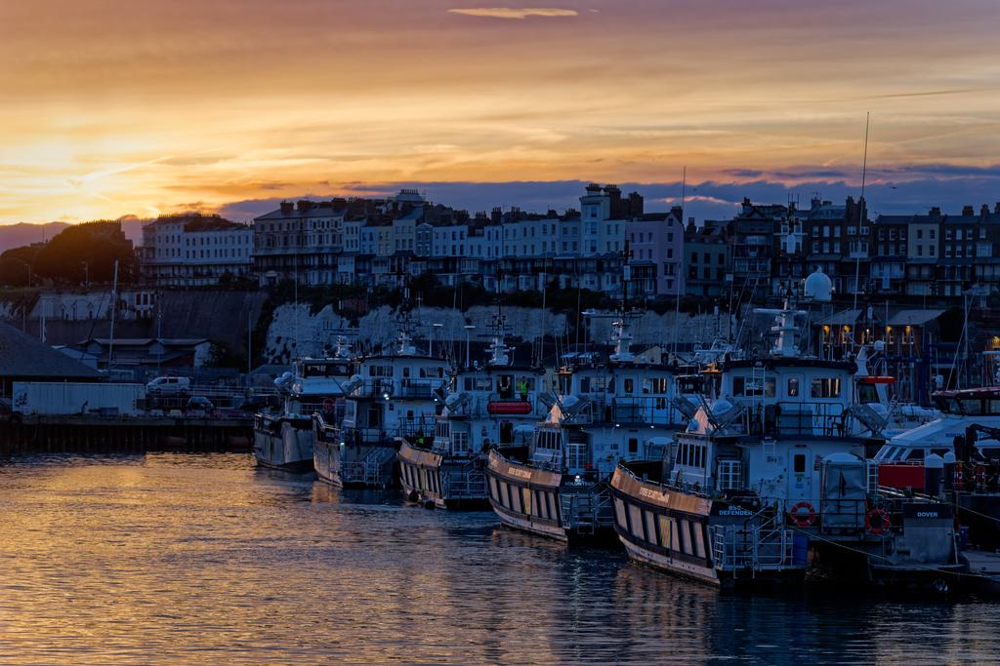

# Model Output Gallery

Generated on: 2026-10-08 22:45:53 BST

- *Evaluation lane:* assisted
- *Prompt hints:* the image's description and keyword hints were included in the prompt, so field content may be copied from them rather than seen
- *Assessment:* General checks + metadata fields and duplicate keywords; length limits and factual accuracy not assessed
- *Input image:* JPEG, 9,641 x 6,427 pixels (62.0 MP), 58.1 MB

This run records model responses to one shared image and prompt (evaluation
lane: assisted). Mechanical checks are not factual-accuracy judgments; inspect
the image, prompt and final answers before choosing a model. Results do not
establish fitness for other tasks.

Complete per-model evidence artifact with image metadata, the source prompt, a
facts-only chooser, and full generated or crash output for every attempted
model.

## Reference Image



## Current-run Chooser

Mechanical observations and captured resource facts for this run only. No concerns detected does not mean the response fulfilled an arbitrary prompt or described the image accurately. Consult the assessment scope above. Total time is end-to-end; throughput covers generation only and requires at least 16 generated tokens. Prefill/first is the measured time to first token (input preparation, prefill and the first decode step) when captured, else upstream's model-loop first-token time; Prompt tok is the full rendered prompt including image tokens, which drives prefill cost. For cross-attention architectures the token count reflects the tokenised text burden only, not total vision prefill compute.

<!-- markdownlint-disable MD034 MD037 MD049 -->

| Model                                                                                                                               | Mechanical checks      | Total s | Gen TPS    | Prefill/first s | Peak GB | Prompt tok | Gen tok | Observations                                                                                      |
|-------------------------------------------------------------------------------------------------------------------------------------|------------------------|---------|------------|-----------------|---------|------------|---------|---------------------------------------------------------------------------------------------------|
| [`LiquidAI/LFM2.5-VL-450M-MLX-bf16`](#model-liquidai-lfm25-vl-450m-mlx-bf16)                                                        | `no concerns detected` | 2.03s   | 493 tok/s  | 0.64            | 1.9     | 2,103      | 58      | none                                                                                              |
| [`mlx-community/GLM-4.6V-Flash-4bit`](#model-mlx-community-glm-46v-flash-4bit)                                                      | `no concerns detected` | 8.62s   | 78.7 tok/s | 5.60            | 8.7     | 6,339      | 98      | none                                                                                              |
| [`mlx-community/Idefics3-8B-Llama3-bf16`](#model-mlx-community-idefics3-8b-llama3-bf16)                                             | `no concerns detected` | 8.11s   | 35.4 tok/s | 1.81            | 18      | 2,601      | 130     | none                                                                                              |
| [`mlx-community/InternVL3-14B-4bit`](#model-mlx-community-internvl3-14b-4bit)                                                       | `no concerns detected` | 5.81s   | 56.9 tok/s | 2.03            | 10      | 2,091      | 113     | none                                                                                              |
| [`mlx-community/InternVL3-8B-bf16`](#model-mlx-community-internvl3-8b-bf16)                                                         | `no concerns detected` | 5.89s   | 37.5 tok/s | 1.47            | 17      | 2,091      | 80      | none                                                                                              |
| [`mlx-community/Kimi-VL-A3B-Thinking-2506-8bit`](#model-mlx-community-kimi-vl-a3b-thinking-2506-8bit)                               | `no concerns detected` | 19.27s  | 66.1 tok/s | 1.38            | 20      | 1,312      | 995     | none                                                                                              |
| [`mlx-community/MiniCPM-V-4.6-4bit`](#model-mlx-community-minicpm-v-46-4bit)                                                        | `no concerns detected` | 4.85s   | 302 tok/s  | 0.99            | 3.2     | 910        | 662     | none                                                                                              |
| [`mlx-community/MiniCPM-o-4_5-4bit`](#model-mlx-community-minicpm-o-45-4bit)                                                        | `no concerns detected` | 3.18s   | 106 tok/s  | 0.76            | 7.0     | 369        | 88      | none                                                                                              |
| [`mlx-community/Ministral-3-14B-Instruct-2512-mxfp4`](#model-mlx-community-ministral-3-14b-instruct-2512-mxfp4)                     | `no concerns detected` | 6.89s   | 66.2 tok/s | 2.81            | 13      | 2,905      | 140     | none                                                                                              |
| [`mlx-community/Ministral-3-3B-Instruct-2512-4bit`](#model-mlx-community-ministral-3-3b-instruct-2512-4bit)                         | `no concerns detected` | 3.83s   | 188 tok/s  | 1.56            | 7.8     | 2,904      | 132     | none                                                                                              |
| [`mlx-community/Molmo2-8B-4bit`](#model-mlx-community-molmo2-8b-4bit)                                                               | `no concerns detected` | 5.24s   | 71.7 tok/s | 1.41            | 8.5     | 1,502      | 148     | none                                                                                              |
| [`mlx-community/North-Micro-Vision-Instruct-4bit`](#model-mlx-community-north-micro-vision-instruct-4bit)                           | `no concerns detected` | 5.24s   | 209 tok/s  | 2.73            | 3.9     | 4,065      | 148     | none                                                                                              |
| [`mlx-community/Ornith-1.5-35B-A3B-OptiQ-4bit`](#model-mlx-community-ornith-15-35b-a3b-optiq-4bit)                                  | `no concerns detected` | 5.69s   | 106 tok/s  | 1.21            | 24      | 1,267      | 129     | none                                                                                              |
| [`mlx-community/Phi-3.5-vision-instruct-bf16`](#model-mlx-community-phi-35-vision-instruct-bf16)                                    | `no concerns detected` | 4.72s   | 59.1 tok/s | 0.82            | 9.3     | 1,115      | 144     | none                                                                                              |
| [`mlx-community/Qwen3-Omni-30B-A3B-Instruct-4bit`](#model-mlx-community-qwen3-omni-30b-a3b-instruct-4bit)                           | `no concerns detected` | 27.35s  | 65.4 tok/s | 22.01           | 26      | 12,768     | 136     | none                                                                                              |
| [`mlx-community/Qwen3-VL-30B-A3B-Instruct-4bit`](#model-mlx-community-qwen3-vl-30b-a3b-instruct-4bit)                               | `no concerns detected` | 40.99s  | 83.0 tok/s | 36.42           | 23      | 16,525     | 133     | none                                                                                              |
| [`mlx-community/Qwen3-VL-8B-Instruct-4bit`](#model-mlx-community-qwen3-vl-8b-instruct-4bit)                                         | `no concerns detected` | 41.11s  | 67.9 tok/s | 37.51           | 11      | 16,525     | 112     | none                                                                                              |
| [`mlx-community/Qwen3.5-35B-A3B-4bit`](#model-mlx-community-qwen35-35b-a3b-4bit)                                                    | `no concerns detected` | 38.57s  | 102 tok/s  | 33.60           | 25      | 16,541     | 152     | none                                                                                              |
| [`mlx-community/Qwen3.8-27B-nvfp4`](#model-mlx-community-qwen38-27b-nvfp4)                                                          | `no concerns detected` | 59.97s  | 27.4 tok/s | 52.44           | 21      | 16,541     | 121     | none                                                                                              |
| [`mlx-community/aya-vision-8b-4bit`](#model-mlx-community-aya-vision-8b-4bit)                                                       | `no concerns detected` | 4.95s   | 102 tok/s  | 1.61            | 6.5     | 2,070      | 132     | none                                                                                              |
| [`mlx-community/gemma-3-27b-it-qat-4bit`](#model-mlx-community-gemma-3-27b-it-qat-4bit)                                             | `no concerns detected` | 8.74s   | 31.5 tok/s | 1.46            | 17      | 572        | 138     | none                                                                                              |
| [`mlx-community/gemma-4-12B-it-4bit`](#model-mlx-community-gemma-4-12b-it-4bit)                                                     | `no concerns detected` | 5.08s   | 61.3 tok/s | 0.97            | 7.6     | 577        | 108     | none                                                                                              |
| [`mlx-community/gemma-4-26b-a4b-it-4bit`](#model-mlx-community-gemma-4-26b-a4b-it-4bit)                                             | `no concerns detected` | 4.84s   | 125 tok/s  | 1.01            | 16      | 577        | 106     | none                                                                                              |
| [`mlx-community/gemma-4-31b-it-4bit`](#model-mlx-community-gemma-4-31b-it-4bit)                                                     | `no concerns detected` | 8.95s   | 26.3 tok/s | 1.69            | 20      | 577        | 107     | none                                                                                              |
| [`mlx-community/gemma-4-e4b-it-4bit`](#model-mlx-community-gemma-4-e4b-it-4bit)                                                     | `no concerns detected` | 3.66s   | 126 tok/s  | 0.80            | 5.9     | 573        | 79      | none                                                                                              |
| [`mlx-community/pixtral-12b-8bit`](#model-mlx-community-pixtral-12b-8bit)                                                           | `no concerns detected` | 7.68s   | 40.0 tok/s | 2.44            | 16      | 3,095      | 119     | none                                                                                              |
| [`nativ-community/Mage-VL-OptiQ-4bit`](#model-nativ-community-mage-vl-optiq-4bit)                                                   | `no concerns detected` | 4.61s   | 129 tok/s  | 2.18            | 5.4     | 4,188      | 118     | none                                                                                              |
| [`nativ-community/Mistral-Small-3.2-24B-Instruct-2506-4bit`](#model-nativ-community-mistral-small-32-24b-instruct-2506-4bit)        | `no concerns detected` | 7.37s   | 36.8 tok/s | 1.94            | 18      | 1,251      | 114     | none                                                                                              |
| [`nativ-community/Nemotron-3-Nano-Omni-30B-A3B-Reasoning-4bit`](#model-nativ-community-nemotron-3-nano-omni-30b-a3b-reasoning-4bit) | `no concerns detected` | 8.44s   | 156 tok/s  | 4.67            | 23      | 3,606      | 132     | none                                                                                              |
| [`mlx-community/Devstral-Small-2-24B-Instruct-2512-5bit`](#model-mlx-community-devstral-small-2-24b-instruct-2512-5bit)             | `concerns detected`    | 10.08s  | 30.5 tok/s | 3.50            | 23      | 2,372      | 117     | prompt hint repeated                                                                              |
| [`mlx-community/ERNIE-4.5-VL-28B-A3B-Thinking-4bit`](#model-mlx-community-ernie-45-vl-28b-a3b-thinking-4bit)                        | `concerns detected`    | 9.53s   | 126 tok/s  | 1.29            | 19      | 1,617      | 758     | duplicate keywords                                                                                |
| [`mlx-community/GLM-4.6V-nvfp4`](#model-mlx-community-glm-46v-nvfp4)                                                                | `concerns detected`    | 21.98s  | 45.3 tok/s | 12.41           | 78      | 6,339      | 106     | prompt hint repeated                                                                              |
| [`mlx-community/LFM2.5-VL-3B-OptiQ-4bit`](#model-mlx-community-lfm25-vl-3b-optiq-4bit)                                              | `concerns detected`    | 3.35s   | 213 tok/s  | 1.17            | 4.0     | 2,094      | 92      | prompt hint repeated                                                                              |
| [`mlx-community/SmolVLM2-2.2B-Instruct-mlx`](#model-mlx-community-smolvlm2-22b-instruct-mlx)                                        | `concerns detected`    | 3.51s   | 118 tok/s  | 1.14            | 5.6     | 1,407      | 114     | prompt hint repeated                                                                              |
| [`mlx-community/Step-3.7-Flash-oQ3e`](#model-mlx-community-step-37-flash-oq3e)                                                      | `concerns detected`    | 39.52s  | 49.0 tok/s | 22.58           | 92      | 3,468      | 112     | prompt hint repeated                                                                              |
| [`mlx-community/diffusiongemma-26B-A4B-it-mxfp8`](#model-mlx-community-diffusiongemma-26b-a4b-it-mxfp8)                             | `concerns detected`    | 6.21s   | 78.5 tok/s | 2.26            | 28      | 573        | 90      | prompt hint repeated                                                                              |
| [`mlx-community/granite-4.0-3b-vision-4bit`](#model-mlx-community-granite-40-3b-vision-4bit)                                        | `concerns detected`    | 3.22s   | 182 tok/s  | 1.21            | 4.8     | 1,366      | 104     | prompt hint repeated                                                                              |
| [`mlx-community/FastVLM-0.5B-bf16`](#model-mlx-community-fastvlm-05b-bf16)                                                          | `major concerns`       | 2.85s   | 369 tok/s  | 1.17            | 2.2     | 312        | 44      | labelled fields not detected                                                                      |
| [`mlx-community/InternVL3_5-1B-4bit`](#model-mlx-community-internvl35-1b-4bit)                                                      | `major concerns`       | 2.66s   | 365 tok/s  | 0.89            | 2.1     | 2,094      | 200     | repeated text; stopped early: repeating; duplicate keywords                                       |
| [`mlx-community/Llama-3.2-11B-Vision-Instruct-8bit`](#model-mlx-community-llama-32-11b-vision-instruct-8bit)                        | `major concerns`       | 38.49s  | 19.5 tok/s | 2.16            | 15      | 290        | 667     | repeated text; duplicate keywords                                                                 |
| [`mlx-community/MolmoPoint-8B-4bit`](#model-mlx-community-molmopoint-8b-4bit)                                                       | `major concerns`       | 8.78s   | 32.2 tok/s | 2.95            | 13      | 3,104      | 113     | labelled fields not detected                                                                      |
| [`mlx-community/Muse-Glimmer-30B-OptiQ-4bit`](#model-mlx-community-muse-glimmer-30b-optiq-4bit)                                     | `major concerns`       | 55.17s  | 23.4 tok/s | 8.87            | 25      | 4,390      | 1,000   | control tokens visible; labelled fields not detected; cut off at token limit; role tokens visible |
| [`mlx-community/Qwen2-VL-2B-mlx`](#model-mlx-community-qwen2-vl-2b-mlx)                                                             | `major concerns`       | 40.66s  | 122 tok/s  | 37.11           | 9.4     | 16,536     | 225     | stopped early: repeating; duplicate keywords                                                      |
| [`mlx-community/SmolVLM-256M-Instruct-4bit`](#model-mlx-community-smolvlm-256m-instruct-4bit)                                       | `major concerns`       | 2.29s   | 468 tok/s  | 1.00            | 1.1     | 1,186      | 22      | labelled fields not detected                                                                      |
| [`mlx-community/X-Reasoner-7B-8bit`](#model-mlx-community-x-reasoner-7b-8bit)                                                       | `major concerns`       | 19.70s  | 58.9 tok/s | 14.17           | 14      | 16,536     | 200     | repeated text; stopped early: repeating; duplicate keywords                                       |
| [`mlx-community/gemma-3n-E4B-it-4bit`](#model-mlx-community-gemma-3n-e4b-it-4bit)                                                   | `major concerns`       | 4.42s   | 98.9 tok/s | 0.87            | 7.2     | 571        | 132     | labelled fields not detected                                                                      |
| [`mlx-community/granite-vision-3.2-2b-nvfp4`](#model-mlx-community-granite-vision-32-2b-nvfp4)                                      | `major concerns`       | 5.14s   | 145 tok/s  | 3.17            | 4.3     | 5,615      | 86      | labelled fields not detected; duplicate keywords                                                  |
| [`mlx-community/llm-jp-4-vl-9b-mlx-4bit`](#model-mlx-community-llm-jp-4-vl-9b-mlx-4bit)                                             | `major concerns`       | 3.46s   | 108 tok/s  | 1.54            | 6.7     | 2,174      | 18      | control tokens visible; labelled fields not detected                                              |
| [`mlx-community/nanoLLaVA-1.5-4bit`](#model-mlx-community-nanollava-15-4bit)                                                        | `major concerns`       | 5.02s   | 311 tok/s  | 0.71            | 1.8     | 308        | 1,000   | repeated text; labelled fields not detected; cut off at token limit                               |
| [`vikhyatk/moondream2`](#model-vikhyatk-moondream2)                                                                                 | `major concerns`       | 4.57s   | 166 tok/s  | 0.98            | 4.8     | 1,011      | 48      | labelled fields not detected; prompt hint repeated                                                |
<!-- markdownlint-enable MD034 MD037 MD049 -->

## Resource Highlights

Quickest completion without detected concerns (end-to-end, including model load): `LiquidAI/LFM2.5-VL-450M-MLX-bf16` at 2.03s

Lowest peak memory among completions without detected concerns: `LiquidAI/LFM2.5-VL-450M-MLX-bf16` at 1.9 GB

Decode tok/s stays per model in the chooser and is not averaged across models: tokenizers, image-token expansion and reasoning lengths differ too much for a cross-model mean to guide a choice.

## Avoid for This Run

<!-- markdownlint-disable MD034 MD037 MD049 -->

| Model                                                                                                        | Mechanical checks | Observations                                                                                      |
|--------------------------------------------------------------------------------------------------------------|-------------------|---------------------------------------------------------------------------------------------------|
| [`mlx-community/FastVLM-0.5B-bf16`](#model-mlx-community-fastvlm-05b-bf16)                                   | `major concerns`  | labelled fields not detected                                                                      |
| [`mlx-community/InternVL3_5-1B-4bit`](#model-mlx-community-internvl35-1b-4bit)                               | `major concerns`  | repeated text; stopped early: repeating; duplicate keywords                                       |
| [`mlx-community/Llama-3.2-11B-Vision-Instruct-8bit`](#model-mlx-community-llama-32-11b-vision-instruct-8bit) | `major concerns`  | repeated text; duplicate keywords                                                                 |
| [`mlx-community/MolmoPoint-8B-4bit`](#model-mlx-community-molmopoint-8b-4bit)                                | `major concerns`  | labelled fields not detected                                                                      |
| [`mlx-community/Muse-Glimmer-30B-OptiQ-4bit`](#model-mlx-community-muse-glimmer-30b-optiq-4bit)              | `major concerns`  | control tokens visible; labelled fields not detected; cut off at token limit; role tokens visible |
| [`mlx-community/Qwen2-VL-2B-mlx`](#model-mlx-community-qwen2-vl-2b-mlx)                                      | `major concerns`  | stopped early: repeating; duplicate keywords                                                      |
| [`mlx-community/SmolVLM-256M-Instruct-4bit`](#model-mlx-community-smolvlm-256m-instruct-4bit)                | `major concerns`  | labelled fields not detected                                                                      |
| [`mlx-community/X-Reasoner-7B-8bit`](#model-mlx-community-x-reasoner-7b-8bit)                                | `major concerns`  | repeated text; stopped early: repeating; duplicate keywords                                       |
| [`mlx-community/gemma-3n-E4B-it-4bit`](#model-mlx-community-gemma-3n-e4b-it-4bit)                            | `major concerns`  | labelled fields not detected                                                                      |
| [`mlx-community/granite-vision-3.2-2b-nvfp4`](#model-mlx-community-granite-vision-32-2b-nvfp4)               | `major concerns`  | labelled fields not detected; duplicate keywords                                                  |
| [`mlx-community/llm-jp-4-vl-9b-mlx-4bit`](#model-mlx-community-llm-jp-4-vl-9b-mlx-4bit)                      | `major concerns`  | control tokens visible; labelled fields not detected                                              |
| [`mlx-community/nanoLLaVA-1.5-4bit`](#model-mlx-community-nanollava-15-4bit)                                 | `major concerns`  | repeated text; labelled fields not detected; cut off at token limit                               |
| [`vikhyatk/moondream2`](#model-vikhyatk-moondream2)                                                          | `major concerns`  | labelled fields not detected; prompt hint repeated                                                |
<!-- markdownlint-enable MD034 MD037 MD049 -->

## Output at a Glance

A compact preview of each model's final answer (or failure evidence for crashes), in chooser order. Where the requested catalogue fields were detected, the preview shows a little of each: the title, the start of the description, and the first keywords with their count, so the weakest field is not hidden behind a long description. Otherwise it is the first 280 characters. A closed reasoning trace is left out of the preview and reported as an omitted-character count; the complete output, trace included, is in the model's evidence block below.

<!-- markdownlint-disable MD034 MD037 MD049 -->

| Model                                                                                                                               | Mechanical checks      | Output preview                                                                                                                                                                                                                                                                                                                                                                        |
|-------------------------------------------------------------------------------------------------------------------------------------|------------------------|---------------------------------------------------------------------------------------------------------------------------------------------------------------------------------------------------------------------------------------------------------------------------------------------------------------------------------------------------------------------------------------|
| [`LiquidAI/LFM2.5-VL-450M-MLX-bf16`](#model-liquidai-lfm25-vl-450m-mlx-bf16)                                                        | `no concerns detected` | Title: Harbor at Dusk \| Description: A serene harbor scene at sunset, with moored boats and a backdrop of a dramatic skyline. \| Keywords (10): Harbor, sunset, boats, skyline, Dover, Dusk, England, maritime, coastal, reflection                                                                                                                                                  |
| [`mlx-community/GLM-4.6V-Flash-4bit`](#model-mlx-community-glm-46v-flash-4bit)                                                      | `no concerns detected` | Title: Ramsgate Harbour Patrol Boats at Sunset \| Description: UK Border Security Command patrol vessels, including BSC Defender, are moored side-by-side in Ramsgate Harbour, Kent,... \| Keywords (12): Border security vessels, Ramsgate Harbour, Kent, Patrol boat, Sunset, Cliffside skyline, ...                                                                                |
| [`mlx-community/Idefics3-8B-Llama3-bf16`](#model-mlx-community-idefics3-8b-llama3-bf16)                                             | `no concerns detected` | Title: UK Border Security Command Patrol Vessels in Ramsgate Harbour, Kent. \| Description: The BSC Defender and BSC Volunteer, two UK Border Security Command patrol vessels... \| Keywords (11): uk border security command, patrol vessels, ramsgate harbour, kent, bsc defender, bsc volunteer, ...                                                                               |
| [`mlx-community/InternVL3-14B-4bit`](#model-mlx-community-internvl3-14b-4bit)                                                       | `no concerns detected` | Title: Ramsgate Harbour Sunset with Patrol Boats \| Description: The image captures a serene sunset at Ramsgate Harbour, Kent, with several UK Border Security Comma... \| Keywords (19): Border security vessels, Buildings, Coast, Dusk, England, Fleet, Harbor, Horizon, Kent, Lifebuoy, Marina, ...                                                                               |
| [`mlx-community/InternVL3-8B-bf16`](#model-mlx-community-internvl3-8b-bf16)                                                         | `no concerns detected` | Title: Sunset at Ramsgate Harbour \| Description: Border security patrol vessels are moored in Ramsgate Harbour against a dramatic sunset, with the town's cliffside... \| Keywords (15): Border security vessels, Ramsgate, Kent, Dusk, England, Maritime, Patrol boats, Marina, Mooring, Horizon, ...                                                                               |
| [`mlx-community/Kimi-VL-A3B-Thinking-2506-8bit`](#model-mlx-community-kimi-vl-a3b-thinking-2506-8bit)                               | `no concerns detected` | Title: UK Border Security Vessels Moored at Ramsgate Harbour, Kent, at Dusk \| Description: UK Border Security patrol boats, including the Defender and Volunteer,... \| Keywords (12): UK Border Security vessels, Patrol boat, Patrol boats, Ramsgate, Harbor, Marina, Dusk, Town skyline, Coast, ...[3,714 characters of reasoning omitted; complete output in the evidence block] |
| [`mlx-community/MiniCPM-V-4.6-4bit`](#model-mlx-community-minicpm-v-46-4bit)                                                        | `no concerns detected` | Title: Border Patrol Boats in Ramsgate Harbor at Sunset \| Description: British Border Security Command patrol boats, including BSC Defender and Volunteer, ar... \| Keywords (18): border, security, patrol, boats, Ramsgate, harbor, Kent, dusk, sunset, lifebuoys, mooring, maritime, reflected, ...[2,120 characters of reasoning omitted; complete output in the evidence block] |
| [`mlx-community/MiniCPM-o-4_5-4bit`](#model-mlx-community-minicpm-o-45-4bit)                                                        | `no concerns detected` | Title: Ramsgate Harbour Patrol Boats at Sunset \| Description: Border security patrol vessels moored in Ramsgate Harbour, Kent, with dramatic sunset lighting reflec... \| Keywords (18): Border security vessels, Buildings, Coast, Dusk, England, Fleet, Harbor, Horizon, Kent, Lifebuoy, Marina, ...                                                                               |
| [`mlx-community/Ministral-3-14B-Instruct-2512-mxfp4`](#model-mlx-community-ministral-3-14b-instruct-2512-mxfp4)                     | `no concerns detected` | Title: **BSC Patrol Vessels at Ramsgate Harbour Sunset** \| Description: A fleet of UK Border Security Command patrol boats, including the *BSC Defender* and *BSC... \| Keywords (16): Border Security Command, BSC Defender, BSC Volunteer, Ramsgate Harbour, Kent, patrol boats, maritime fleet, ...                                                                               |
| [`mlx-community/Ministral-3-3B-Instruct-2512-4bit`](#model-mlx-community-ministral-3-3b-instruct-2512-4bit)                         | `no concerns detected` | Title: Ramsgate Sunset: Border Patrol Boats at Dusk \| Description: At Ramsgate Harbour, Kent, two UK Border Security Command patrol vessels—*BSC Defender* and *... \| Keywords (14): Border Security Command, Kent, Ramsgate Harbour, sunset lighting, moored patrol boats, coastal town skyline, ...                                                                               |
| [`mlx-community/Molmo2-8B-4bit`](#model-mlx-community-molmo2-8b-4bit)                                                               | `no concerns detected` | Title: Ramsgate Harbour Sunset: Border Security Vessels Moored \| Description: At dusk in Ramsgate Harbour, Kent, a row of Border Security Command patrol vessels, in... \| Keywords (24): Border security vessels, Buildings, Coast, Dover, Dusk, England, Fleet, Harbor, Horizon, Kent, Lifebuoy, ...                                                                               |
| [`mlx-community/North-Micro-Vision-Instruct-4bit`](#model-mlx-community-north-micro-vision-instruct-4bit)                           | `no concerns detected` | Title: UK Border Security Patrol Vessels at Ramsgate Harbour Sunset \| Description: At dusk, UK Border Security Command patrol vessels, including the BSC Defender an... \| Keywords (20): Border security vessels, Buildings, Coast, Dover, Dusk, England, Fleet, Harbor, Horizon, Kent, Lifebuoy, ...                                                                               |
| [`mlx-community/Ornith-1.5-35B-A3B-OptiQ-4bit`](#model-mlx-community-ornith-15-35b-a3b-optiq-4bit)                                  | `no concerns detected` | Title: Border Command Patrol Vessels Moored at Ramsgate at Dusk \| Description: UK Border Security Command patrol vessels, including the BSC Defender and BSC Volun... \| Keywords (18): Border security vessels, Patrol boats, Ramsgate, Kent, England, Coast, Dusk, Sunset, Harbor, Marina, Port, ...                                                                               |
| [`mlx-community/Phi-3.5-vision-instruct-bf16`](#model-mlx-community-phi-35-vision-instruct-bf16)                                    | `no concerns detected` | Title: Ramsgate Harbour Sunset with Border Security Vessels \| Description: The sun sets over Ramsgate Harbour, with Border Security Command patrol vessels, includi... \| Keywords (19): Border Security, Ramsgate, Harbour, Sunset, Patrol Vessels, Dover, Dusk, England, Coast, Fleet, Maritime, ...                                                                               |
| [`mlx-community/Qwen3-Omni-30B-A3B-Instruct-4bit`](#model-mlx-community-qwen3-omni-30b-a3b-instruct-4bit)                           | `no concerns detected` | Title: Border Security Command vessels moored at Ramsgate Harbour \| Description: UK Border Security Command patrol boats, including the BSC Defender and BSC Volunte... \| Keywords (20): Border security vessels, Buildings, Coast, Dover, Dusk, England, Fleet, Harbor, Horizon, Kent, Lifebuoy, ...                                                                               |
| [`mlx-community/Qwen3-VL-30B-A3B-Instruct-4bit`](#model-mlx-community-qwen3-vl-30b-a3b-instruct-4bit)                               | `no concerns detected` | Title: Border Security Command Vessels at Ramsgate Harbour \| Description: At dusk on October 3, 2026, a fleet of UK Border Security Command patrol vessels, inclu... \| Keywords (19): Border security vessels, Patrol boats, Ramsgate Harbour, Kent, England, Dusk, Sunset, Reflection, Lifebuoy, ...                                                                               |
| [`mlx-community/Qwen3-VL-8B-Instruct-4bit`](#model-mlx-community-qwen3-vl-8b-instruct-4bit)                                         | `no concerns detected` | Title: Border Security Boats at Sunset in Ramsgate Harbour \| Description: UK Border Security Command patrol boats, including the BSC Defender and BSC Volunteer, a... \| Keywords (16): Border security vessels, Ramsgate Harbour, Kent, Dover, Sunset, England, Patrol boat, Harbour, Reflection, ...                                                                               |
| [`mlx-community/Qwen3.5-35B-A3B-4bit`](#model-mlx-community-qwen35-35b-a3b-4bit)                                                    | `no concerns detected` | Title: UK Border Vessels at Ramsgate Sunset \| Description: Captured on October 3rd, 2026, during the golden hour of dusk, a fleet of UK Border Security Command p... \| Keywords (18): UK Border Security Command, BSC Defender, BSC Volunteer, Ramsgate, Dover, Kent, Dusk, Sunset, Patrol boats, ...                                                                               |
| [`mlx-community/Qwen3.8-27B-nvfp4`](#model-mlx-community-qwen38-27b-nvfp4)                                                          | `no concerns detected` | Title: UK Border Security Command Vessels in Ramsgate Harbour \| Description: A fleet of Border Security Command patrol vessels, including the BSC Defender, is moored... \| Keywords (16): Border Security Command, Ramsgate, Harbour, Kent, Patrol vessels, BSC Defender, BSC Volunteer, Sunset, ...                                                                                |
| [`mlx-community/aya-vision-8b-4bit`](#model-mlx-community-aya-vision-8b-4bit)                                                       | `no concerns detected` | Title: Border Security Command Patrols Kent's Ramsgate Harbour \| Description: At dusk, the UK Border Security Command's patrol vessels, including the BSC Defender a... \| Keywords (20): Border security vessels, Buildings, Coast, Dover, Dusk, England, Fleet, Harbor, Horizon, Kent, Lifebuoy, ...                                                                               |
| [`mlx-community/gemma-3-27b-it-qat-4bit`](#model-mlx-community-gemma-3-27b-it-qat-4bit)                                             | `no concerns detected` | Title: Ramsgate Harbour: UK Border Security Vessels at Sunset \| Description: Captured on 3rd October 2026 at 18:18 UTC+01:00, UK Border Security Command patrol vesse... \| Keywords (18): Ramsgate, Kent, UK Border Security Command, BSC Defender, BSC Volunteer, patrol boats, harbour, marina, ...                                                                               |
| [`mlx-community/gemma-4-12B-it-4bit`](#model-mlx-community-gemma-4-12b-it-4bit)                                                     | `no concerns detected` | Title: Fishing vessels and town skyline at sunset in Ramsgate Harbour \| Description: Several fishing vessels are moored side-by-side in Ramsgate Harbour as a dramatic s... \| Keywords (18): Ramsgate, Kent, England, Harbor, Port, Maritime, Fishing boats, Fleet, Mooring, Sunset, Dusk, Coast, ...                                                                               |
| [`mlx-community/gemma-4-26b-a4b-it-4bit`](#model-mlx-community-gemma-4-26b-a4b-it-4bit)                                             | `no concerns detected` | Title: Border Security Command patrol vessels moored at sunset \| Description: UK Border Security Command patrol vessels, including the BSC Defender and BSC V... \| Keywords (15): Border security vessels, Kent, maritime, patrol boats, sunset, harbour, pier, reflection, England, dusk, boats, ...                                                                               |
| [`mlx-community/gemma-4-31b-it-4bit`](#model-mlx-community-gemma-4-31b-it-4bit)                                                     | `no concerns detected` | Title: UK Border Security Command vessels in Ramsgate Harbour \| Description: UK Border Security Command patrol vessels, including the BSC Defender, are moore... \| Keywords (17): Border security vessels, BSC Defender, buildings, coast, dusk, England, fleet, harbor, horizon, Kent, lifebuoy, ...                                                                               |
| [`mlx-community/gemma-4-e4b-it-4bit`](#model-mlx-community-gemma-4-e4b-it-4bit)                                                     | `no concerns detected` | Title: Patrol Vessels Moored in Ramsgate Harbour Sunset \| Description: UK Border Security Command vessels are moored in Ramsgate Harbour, Kent, silhouetted ag... \| Keywords (15): Ramsgate, Kent, Border Security, Patrol Vessels, Sunset, Harbour, Coast, Maritime, Mooring, Skyline, Defender, ...                                                                               |
| [`mlx-community/pixtral-12b-8bit`](#model-mlx-community-pixtral-12b-8bit)                                                           | `no concerns detected` | Title: Border Security Vessels at Sunset in Ramsgate Harbour \| Description: Border security patrol vessels, including the BSC Defender and BSC Volunteer, are moored... \| Keywords (23): Border security vessels, Buildings, Coast, Dover, Dusk, England, Fleet, Harbor, Horizon, Kent, Lifebuoy, ...                                                                               |
| [`nativ-community/Mage-VL-OptiQ-4bit`](#model-nativ-community-mage-vl-optiq-4bit)                                                   | `no concerns detected` | Title: BSC Patrol Vessels Moored at Ramsgate Harbour at Dusk \| Description: UK Border Security Command patrol boats, including the BSC Defender and BSC Volunteer, a... \| Keywords (20): Border security vessels, Buildings, Coast, Dover, Dusk, England, Fleet, Harbor, Horizon, Kent, Lifebuoy, ...                                                                               |
| [`nativ-community/Mistral-Small-3.2-24B-Instruct-2506-4bit`](#model-nativ-community-mistral-small-32-24b-instruct-2506-4bit)        | `no concerns detected` | Title: Border Security Patrol Boats at Sunset \| Description: UK Border Security Command patrol vessels, including the BSC Defender and BSC Volunteer, are moored i... \| Keywords (18): Border security vessels, Ramsgate Harbour, Patrol boats, Sunset, Cliffside buildings, Marina, Reflections, ...                                                                               |
| [`nativ-community/Nemotron-3-Nano-Omni-30B-A3B-Reasoning-4bit`](#model-nativ-community-nemotron-3-nano-omni-30b-a3b-reasoning-4bit) | `no concerns detected` | Title: BSC Patrol Boats at Ramsgate Harbour Sunset \| Description: At 18:18 UTC+01:00 on October 3, 2026, UK Border Security Command patrol vessels, including th... \| Keywords (17): Border security, Patrol boats, Ramsgate Harbour, Sunset, Kent, Maritime, Fleet, Coast, Buildings, Cliffside, ...                                                                               |
| [`mlx-community/Devstral-Small-2-24B-Instruct-2512-5bit`](#model-mlx-community-devstral-small-2-24b-instruct-2512-5bit)             | `concerns detected`    | Title: UK Border Security Patrol Boats at Sunset \| Description: UK Border Security Command patrol vessels, including the BSC Defender and BSC Volunteer, are m... \| Keywords (19): UK Border Security Command, patrol boats, Ramsgate Harbour, Kent, sunset, cliffside buildings, moored vessels, ...                                                                               |
| [`mlx-community/ERNIE-4.5-VL-28B-A3B-Thinking-4bit`](#model-mlx-community-ernie-45-vl-28b-a3b-thinking-4bit)                        | `concerns detected`    | Title: Sunset over Ramsgate Harbour \| Description: A panoramic view of Ramsgate Harbour in Kent, England, during sunset. Terraced houses on cliffside cliffs are silh... \| Keywords (43): Ramsgate, Kent, England, sunset, dusk, harbour, port, sea, coast, boat, lifeboat, lifebuoy, row houses, ...[1,955 characters of reasoning omitted; complete output in the evidence block] |
| [`mlx-community/GLM-4.6V-nvfp4`](#model-mlx-community-glm-46v-nvfp4)                                                                | `concerns detected`    | Title: Ramsgate Harbour Sunset with Patrol Vessels \| Description: UK Border Security Command patrol vessels, including the BSC Defender and BSC Volunteer, are moore... \| Keywords (19): Border security vessels, Buildings, Coast, Dover, Dusk, England, Fleet, Harbor, Horizon, Kent, Lifebuoy, ...                                                                               |
| [`mlx-community/LFM2.5-VL-3B-OptiQ-4bit`](#model-mlx-community-lfm25-vl-3b-optiq-4bit)                                              | `concerns detected`    | Title: Border security vessels docked in Ramsgate Harbour at sunset \| Description: Patrol boats moored side-by-side in Ramsgate Harbour, Kent, against a dramatic s... \| Keywords (17): Border security vessels, UK, Coast, Dover, Dusk, England, Fleet, Harbor, Horizon, Kent, Lifebuoy, Marina, ...                                                                               |
| [`mlx-community/SmolVLM2-2.2B-Instruct-mlx`](#model-mlx-community-smolvlm2-22b-instruct-mlx)                                        | `concerns detected`    | Title: Border Security Command Patrol Vessels in Ramsgate Harbour \| Description: Border Security Command patrol vessels, including the BSC Defender and BSC Voluntee... \| Keywords (20): Border security vessels, Buildings, Coast, Dover, Dusk, England, Fleet, Harbor, Horizon, Kent, Lifebuoy, ...                                                                               |
| [`mlx-community/Step-3.7-Flash-oQ3e`](#model-mlx-community-step-37-flash-oq3e)                                                      | `concerns detected`    | Title: UK Border Security Command vessels moored at Ramsgate Harbour at sunset \| Description: UK Border Security Command patrol vessels, including the BSC Defender... \| Keywords (20): Border security vessels, Buildings, Coast, Dover, Dusk, England, Fleet, Harbor, Horizon, Kent, Lifebuoy, ...                                                                                |
| [`mlx-community/diffusiongemma-26B-A4B-it-mxfp8`](#model-mlx-community-diffusiongemma-26b-a4b-it-mxfp8)                             | `concerns detected`    | Title: UK Border Security Patrol Vessels at Ramsgate Harbour at Sunset \| Description: UK Border Security Command patrol vessels, including the BSC Defender and V... \| Keywords (15): Ramsgate, Kent, Border security, patrol boats, harbor, harborfront, sunset, dusk, coast, maritime, mooring, ...                                                                               |
| [`mlx-community/granite-4.0-3b-vision-4bit`](#model-mlx-community-granite-40-3b-vision-4bit)                                        | `concerns detected`    | Title: "Border Security Vessels at Sunset" \| Description: "Two patrol boats, the BSC Defender and BSC Volunteer, are moored side-by-side in Ramsgate Harbour,... \| Keywords (15): Border security, patrol boats, BSC Defender, BSC Volunteer, Ramsgate Harbour, Kent, sunset, cliffside skyline, ...                                                                                |
| [`mlx-community/FastVLM-0.5B-bf16`](#model-mlx-community-fastvlm-05b-bf16)                                                          | `major concerns`       | A tranquil evening at Ramsgate Harbour, where the BSC Defender and BSC Volunteer patrol vessels stand side-by-side against a breathtaking sunset, with the town's cliffside skyline softly illuminated by the fading light.                                                                                                                                                           |
| [`mlx-community/InternVL3_5-1B-4bit`](#model-mlx-community-internvl35-1b-4bit)                                                      | `major concerns`       | Title: Moored Patrol Vessels at Ramsgate Harbour, Kent, During Sunset \| Description: The image captures a serene sunset over Ramsgate Harbour, featuring BSC pat... \| Keywords (59): Ramsgate, Kent, Sunset, BSC patrol, harbor, mooring, Dover, Fleet, Maritime, Coast, Dusk, England, Lifebuoy, ...                                                                               |
| [`mlx-community/Llama-3.2-11B-Vision-Instruct-8bit`](#model-mlx-community-llama-32-11b-vision-instruct-8bit)                        | `major concerns`       | Title: Ramsgate Harbour Sunset with Border Security Vessels \| Description: The image captures a serene sunset scene in Ramsgate Harbour, featuring a fleet of border security... \| Keywords (45): Border security vessels, Ramsgate Harbour, sunset, BSC Defender, BSC Volunteer, moored vessels, ...                                                                               |
| [`mlx-community/MolmoPoint-8B-4bit`](#model-mlx-community-molmopoint-8b-4bit)                                                       | `major concerns`       | Ramsgate Harbour Sunset: Border Security Vessels Moored<br><br>Border security patrol boats, including BSC Defender and BSC Volunteer, are moored side-by-side in Ramsgate Harbour, Kent, against a dramatic sunset. The scene captures the town's cliffside skyline and the reflective wat...                                                                                        |
| [`mlx-community/Muse-Glimmer-30B-OptiQ-4bit`](#model-mlx-community-muse-glimmer-30b-optiq-4bit)                                     | `major concerns`       | Title: (not detected) \| Description: (not detected) \| Keywords (2): Need title 5-10 words., ...                                                                                                                                                                                                                                                                                     |
| [`mlx-community/Qwen2-VL-2B-mlx`](#model-mlx-community-qwen2-vl-2b-mlx)                                                             | `major concerns`       | Title: Border Security Command vessels in Ramsgate Harbour at sunset \| Description: The image shows a marina in Ramsgate, Kent, UK. There are several large boats moo... \| Keywords (22): Border Security Command vessels, Ramsgate Harbour, sunset, boats, buildings, reflection, Kent, UK, sea, ...                                                                               |
| [`mlx-community/SmolVLM-256M-Instruct-4bit`](#model-mlx-community-smolvlm-256m-instruct-4bit)                                       | `major concerns`       | Brokewater, BSC, Dusk, England, Marina, Port, Ramsgate, Reflection                                                                                                                                                                                                                                                                                                                    |
| [`mlx-community/X-Reasoner-7B-8bit`](#model-mlx-community-x-reasoner-7b-8bit)                                                       | `major concerns`       | Title: Dusk at Ramsgate: Border Security Vessels \| Description: UK Border Security Command patrol boats, including the BSC Defender and Volunteer, are moored side-... \| Keywords (53): UK Border Security Command, BSC Defender, BSC Volunteer, Ramsgate Harbour, Kent, Dusk, Sunset, Cliffside, ...                                                                               |
| [`mlx-community/gemma-3n-E4B-it-4bit`](#model-mlx-community-gemma-3n-e4b-it-4bit)                                                   | `major concerns`       | Title: (not detected) \| Description: A row of fishing boats, including the "BOS Defender" and "BOS Volunteer," are moored side-by-side in the harbor of Ramsgate... \| Keywords (20): fishing boats, BOS Defender, BOS Volunteer, Ramsgate, Kent, harbor, mooring, sunset, pier, cityscape, boats, ...                                                                               |
| [`mlx-community/granite-vision-3.2-2b-nvfp4`](#model-mlx-community-granite-vision-32-2b-nvfp4)                                      | `major concerns`       | Title: "Ramsgate Harbour Patrol Boats at Dusk" \| Description: (not detected) \| Keywords (18): Border Security Vessels, Ramsgate Harbour, Kent, England, Sunset, Coast, Dover, Horizon, Lifebuoy, Marina, ...                                                                                                                                                                        |
| [`mlx-community/llm-jp-4-vl-9b-mlx-4bit`](#model-mlx-community-llm-jp-4-vl-9b-mlx-4bit)                                             | `major concerns`       | <\|channel\|> analysis<\|message\|> The image shows a harbor with several boats docked in a row.                                                                                                                                                                                                                                                                                      |
| [`mlx-community/nanoLLaVA-1.5-4bit`](#model-mlx-community-nanollava-15-4bit)                                                        | `major concerns`       | Title: "UK Border Security Command Patrol Vessels in Ramsgate Harbour, Kent, Dusk, E... \| Description: (not detected) \| Keywords: (not detected)                                                                                                                                                                                                                                    |
| [`vikhyatk/moondream2`](#model-vikhyatk-moondream2)                                                                                 | `major concerns`       | Ramsgate Harbour, Kent, UK Border Security Command patrol vessels, including the BSC Defender and BSC Volunteer, are moored side-by-side in Ramsgate Harbour, Kent, against a dramatic sunset and the town's cliffside skyline.                                                                                                                                                       |
<!-- markdownlint-enable MD034 MD037 MD049 -->

## Run Stamps

- `mlx-vlm`: `0.7.7`
- `mlx`: `0.32.4.dev20261008+3c40e8f92`
- `transformers`: `5.19.0`
- `tokenizers`: `0.23.2`
- `huggingface-hub`: `1.33.0`
- *Python Version:* 3.14.7
- *OS:* Darwin 27.0.0
- *macOS Version:* 27.0.1
- *GPU/Chip:* Apple M5 Max
- *MLX Device:* Apple M5 Max
- *GPU Architecture:* applegpu_g17s
- *RAM:* 128.0 GB
- *Recommended Working Set:* 115 GB
- *Fused Attention:* Available

## Image Metadata

- *Description:* UK Border Security Command patrol vessels, including the BSC
  Defender and BSC Volunteer, are moored side-by-side in Ramsgate Harbour,
  Kent, against a dramatic sunset and the town's cliffside skyline.
- *Keywords:* Border security vessels, Buildings, Coast, Dover, Dusk, England,
  Fleet, Harbor, Horizon, Kent, Lifebuoy, Marina, Maritime, Mooring, Patrol
  boat, Patrol boats, Pier, Port, Ramsgate, Reflection, Sea, Ships, Sky,
  Sunset, Twilight, Vessel, Water reflection, Waterfront, architecture, boat,
  border security, calm water, chalk cliff, cliffs, coastal, coastal town,
  coastline, cutter, dawn, docked, english channel, evening, golden hour,
  marine, moored, nautical, ocean, patrol, radar, scenic, seaside, security,
  sunrise, townscape, transportation, united kingdom, water
- *Date:* 2026-10-03 18:18:19 UTC+01:00
- *Time:* 18:18:19

## Prompt

<!-- markdownlint-disable MD011 MD028 MD037 MD045 -->
>
> Create British-English catalogue metadata from the image and supplied
> context.
>
> Treat any capture date/time and GPS as authoritative facts, but do not claim
> they are visible. Descriptive hints may be incomplete or wrong: retain
> details supported by the image, correct conflicts, and add important visible
> details. Prefer image evidence when a hint conflicts, and omit uncertain
> details.
>
> Context: Authoritative context:
> &#45; Capture date/time: 2026-10-03 18:18:19 UTC+01:00
>
> &#8203;Descriptive hints:
> &#45; Description hint: UK Border Security Command patrol vessels, including the
> BSC Defender and BSC Volunteer, are moored side-by-side in Ramsgate
> Harbour, Kent, against a dramatic sunset and the town's cliffside skyline.
> &#45; Keyword hints: Border security vessels, Buildings, Coast, Dover, Dusk,
> England, Fleet, Harbor, Horizon, Kent, Lifebuoy, Marina, Maritime, Mooring,
> Patrol boat, Patrol boats, Pier, Port, Ramsgate, Reflection
>
> &#8203;Write:
> &#45; a concrete 5-10-word title;
> &#45; a 1-2-sentence factual description combining relevant context with the
> main visible subject, setting, action, lighting, and distinctive details;
> &#45; 10-18 unique, comma-separated keywords covering relevant context and
> visible details.
>
> &#8203;Return exactly these three sections and nothing else:
> &#8203;Title:
> &#8203;Description:
> &#8203;Keywords:
<!-- markdownlint-enable MD011 MD028 MD037 MD045 -->

## Complete Per-model Evidence

Complete generated or crash evidence for every attempted model.

<a id="model-liquidai-lfm25-vl-450m-mlx-bf16"></a>

### LiquidAI/LFM2.5-VL-450M-MLX-bf16

<details>
<summary>Complete evidence: LiquidAI/LFM2.5-VL-450M-MLX-bf16</summary>

- *Execution:* completed
- *Mechanical checks:* no concerns detected
- *Assessment:* General checks + metadata fields and duplicate keywords;
  length limits and factual accuracy not assessed
- *Maintainer status:* none
- *Observations:* none
- *Arch supported by installed mlx-vlm:* yes (model_type lfm2-vl via lfm2_vl)
- *Model load time:* 0.33s
- *Generation time:* 0.76s
- *Total time:* 2.03s
- *Prompt preparation time:* 0.551
- *First-token latency:* 0.108
- *Cleanup time:* 0.0623
- *Prompt tokens:* 2,103
- *Generation tokens:* 58
- *Total tokens:* 2,161
- *Prompt throughput (raw):* 19,528 tok/s
- *Generation throughput (raw):* 493 tok/s
- *Peak memory (GB):* 1.9
- *Active memory (GB):* 0.90
- *Cache memory (GB):* 0.08
- *Model-load active memory (GB):* 0.897
- *Post-cleanup active memory (GB):* 0.000134
- *Post-cleanup cache memory (GB):* 0.0
- *Stop reason:* completed
- *Requested maximum tokens:* 1000
- *Rendered prompt characters:* 1349
- *Image placeholders:* 1
- *Processor:* transformers.models.lfm2_vl.processing_lfm2_vl.Lfm2VlProcessor
- *Tokenizer:* transformers.tokenization_utils_tokenizers.TokenizersBackend
- *Requested model revision:* not requested
- *Resolved model revision:* ed71acdae0799c98cb450787d049d1343b65cd52
- *Resolved snapshot path:* ~/.cache/huggingface/hub/models--LiquidAI--LFM2.5-VL-450M-MLX-bf16/snapshots/ed71acdae0799c98cb450787d049d1343b65cd52
- *Generation settings:* {"max_tokens": 1000, "prefill_step_size": 2048,
  "seed": 0, "temperature": 0.0, "top_p": 1.0}
- *EOS token:* <\|im_end\|>

*Readable output:*

<pre class="model-output-readable">
Title:
Harbor at Dusk

Description:
A serene harbor scene at sunset, with moored boats and a backdrop of a dramatic skyline.

Keywords:
Harbor, sunset, boats, skyline, Dover, Dusk, England, maritime, coastal, reflection
</pre>

</details>

---

<a id="model-mlx-community-glm-46v-flash-4bit"></a>

### mlx-community/GLM-4.6V-Flash-4bit

<details>
<summary>Complete evidence: mlx-community/GLM-4.6V-Flash-4bit</summary>

- *Execution:* completed
- *Mechanical checks:* no concerns detected
- *Assessment:* General checks + metadata fields and duplicate keywords;
  length limits and factual accuracy not assessed
- *Maintainer status:* none
- *Observations:* none
- *Arch supported by installed mlx-vlm:* yes (model_type glm4v)
- *Model load time:* 1.18s
- *Generation time:* 6.85s
- *Total time:* 8.62s
- *Prompt preparation time:* 0.574
- *First-token latency:* 5.06
- *Cleanup time:* 0.0856
- *Prompt tokens:* 6,339
- *Generation tokens:* 98
- *Total tokens:* 6,437
- *Prompt throughput (raw):* 1,252 tok/s
- *Generation throughput (raw):* 78.7 tok/s
- *Peak memory (GB):* 8.7
- *Active memory (GB):* 7.1
- *Cache memory (GB):* 0.47
- *Model-load active memory (GB):* 7.07
- *Post-cleanup active memory (GB):* 0.00123
- *Post-cleanup cache memory (GB):* 0.0
- *Stop reason:* completed
- *Requested maximum tokens:* 1000
- *Rendered prompt characters:* 1379
- *Image placeholders:* 1
- *Processor:* mlx_vlm.models.glm4v.processing.Glm46VProcessor
- *Tokenizer:* transformers.tokenization_utils_tokenizers.TokenizersBackend
- *Requested model revision:* not requested
- *Resolved model revision:* bd7b20686e8cbf22ad221a3de8399cdc5a2a7e0e
- *Resolved snapshot path:* ~/.cache/huggingface/hub/models--mlx-community--GLM-4.6V-Flash-4bit/snapshots/bd7b20686e8cbf22ad221a3de8399cdc5a2a7e0e
- *Generation settings:* {"max_tokens": 1000, "prefill_step_size": 2048,
  "seed": 0, "temperature": 0.8, "top_k": 2, "top_p": 0.6}
- *EOS token:* <\|endoftext\|>

*Readable output:*

<pre class="model-output-readable">
Title: Ramsgate Harbour Patrol Boats at Sunset
Description: UK Border Security Command patrol vessels, including BSC Defender, are moored side-by-side in Ramsgate Harbour, Kent, during a dramatic sunset with the town's cliffside skyline in the background.
Keywords: Border security vessels, Ramsgate Harbour, Kent, Patrol boat, Sunset, Cliffside skyline, UK Border Security Command, BSC Defender, Mooring, Maritime, Dusk, England
</pre>

</details>

---

<a id="model-mlx-community-idefics3-8b-llama3-bf16"></a>

### mlx-community/Idefics3-8B-Llama3-bf16

<details>
<summary>Complete evidence: mlx-community/Idefics3-8B-Llama3-bf16</summary>

- *Execution:* completed
- *Mechanical checks:* no concerns detected
- *Assessment:* General checks + metadata fields and duplicate keywords;
  length limits and factual accuracy not assessed
- *Maintainer status:* none
- *Observations:* none
- *Arch supported by installed mlx-vlm:* yes (model_type idefics3)
- *Model load time:* 1.86s
- *Generation time:* 5.49s
- *Total time:* 8.11s
- *Prompt preparation time:* 0.756
- *First-token latency:* 1.06
- *Cleanup time:* 0.108
- *Prompt tokens:* 2,601
- *Generation tokens:* 130
- *Total tokens:* 2,731
- *Prompt throughput (raw):* 2,444 tok/s
- *Generation throughput (raw):* 35.4 tok/s
- *Peak memory (GB):* 18
- *Active memory (GB):* 17
- *Cache memory (GB):* 0.43
- *Model-load active memory (GB):* 16.9
- *Post-cleanup active memory (GB):* 0.0018
- *Post-cleanup cache memory (GB):* 0.0
- *Stop reason:* completed
- *Requested maximum tokens:* 1000
- *Rendered prompt characters:* 1335
- *Image placeholders:* 1
- *Processor:* mlx_vlm.models.idefics3.processing_idefics3.Idefics3Processor
- *Tokenizer:* transformers.tokenization_utils_tokenizers.TokenizersBackend
- *Requested model revision:* not requested
- *Resolved model revision:* 8c2a30c48864f3251701b7bde40f601d25535098
- *Resolved snapshot path:* ~/.cache/huggingface/hub/models--mlx-community--Idefics3-8B-Llama3-bf16/snapshots/8c2a30c48864f3251701b7bde40f601d25535098
- *Generation settings:* {"max_tokens": 1000, "prefill_step_size": 2048,
  "seed": 0, "temperature": 0.0, "top_p": 1.0}
- *EOS token:* <\|end_of_text\|>

*Readable output:*

<pre class="model-output-readable">
 Title: UK Border Security Command Patrol Vessels in Ramsgate Harbour, Kent.

Description: The BSC Defender and BSC Volunteer, two UK Border Security Command patrol vessels, are moored side-by-side in Ramsgate Harbour, Kent, against a dramatic sunset and the town's cliffside skyline. The vessels are equipped with lifebuoys and are part of the maritime security fleet that patrols the English coast.

Keywords: uk border security command, patrol vessels, ramsgate harbour, kent, bsc defender, bsc volunteer, cliffside skyline, sunset, maritime security fleet, english coast, lifebuoys.
</pre>

</details>

---

<a id="model-mlx-community-internvl3-14b-4bit"></a>

### mlx-community/InternVL3-14B-4bit

<details>
<summary>Complete evidence: mlx-community/InternVL3-14B-4bit</summary>

- *Execution:* completed
- *Mechanical checks:* no concerns detected
- *Assessment:* General checks + metadata fields and duplicate keywords;
  length limits and factual accuracy not assessed
- *Maintainer status:* none
- *Observations:* none
- *Arch supported by installed mlx-vlm:* yes (model_type internvl_chat)
- *Model load time:* 1.09s
- *Generation time:* 4.02s
- *Total time:* 5.81s
- *Prompt preparation time:* 0.684
- *First-token latency:* 1.37
- *Cleanup time:* 0.113
- *Prompt tokens:* 2,091
- *Generation tokens:* 113
- *Total tokens:* 2,204
- *Prompt throughput (raw):* 1,531 tok/s
- *Generation throughput (raw):* 56.9 tok/s
- *Peak memory (GB):* 10
- *Active memory (GB):* 8.9
- *Cache memory (GB):* 0.51
- *Model-load active memory (GB):* 8.94
- *Post-cleanup active memory (GB):* 0.00212
- *Post-cleanup cache memory (GB):* 0.0
- *Stop reason:* completed
- *Requested maximum tokens:* 1000
- *Rendered prompt characters:* 1303
- *Image placeholders:* 1
- *Processor:* mlx_vlm.models.internvl_chat.processor.InternVLChatProcessor
- *Tokenizer:* transformers.models.qwen2.tokenization_qwen2.Qwen2Tokenizer
- *Requested model revision:* not requested
- *Resolved model revision:* 26328eaab82cdc642fa3b73d8fa0b73db398710d
- *Resolved snapshot path:* ~/.cache/huggingface/hub/models--mlx-community--InternVL3-14B-4bit/snapshots/26328eaab82cdc642fa3b73d8fa0b73db398710d
- *Generation settings:* {"max_tokens": 1000, "prefill_step_size": 2048,
  "seed": 0, "temperature": 0.0, "top_p": 1.0}
- *EOS token:* <\|im_end\|>

*Readable output:*

<pre class="model-output-readable">
Title:
Ramsgate Harbour Sunset with Patrol Boats

Description:
The image captures a serene sunset at Ramsgate Harbour, Kent, with several UK Border Security Command patrol vessels, including the BSC Defender and BSC Volunteer, moored side-by-side against the backdrop of the town's cliffside skyline.

Keywords:
Border security vessels, Buildings, Coast, Dusk, England, Fleet, Harbor, Horizon, Kent, Lifebuoy, Marina, Maritime, Mooring, Patrol boat, Patrol boats, Pier, Port, Ramsgate, Reflection
</pre>

</details>

---

<a id="model-mlx-community-internvl3-8b-bf16"></a>

### mlx-community/InternVL3-8B-bf16

<details>
<summary>Complete evidence: mlx-community/InternVL3-8B-bf16</summary>

- *Execution:* completed
- *Mechanical checks:* no concerns detected
- *Assessment:* General checks + metadata fields and duplicate keywords;
  length limits and factual accuracy not assessed
- *Maintainer status:* none
- *Observations:* none
- *Arch supported by installed mlx-vlm:* yes (model_type internvl_chat)
- *Model load time:* 1.58s
- *Generation time:* 3.60s
- *Total time:* 5.89s
- *Prompt preparation time:* 0.7
- *First-token latency:* 0.795
- *Cleanup time:* 0.102
- *Prompt tokens:* 2,091
- *Generation tokens:* 80
- *Total tokens:* 2,171
- *Prompt throughput (raw):* 2,630 tok/s
- *Generation throughput (raw):* 37.5 tok/s
- *Peak memory (GB):* 17
- *Active memory (GB):* 16
- *Cache memory (GB):* 0.17
- *Model-load active memory (GB):* 15.9
- *Post-cleanup active memory (GB):* 0.00243
- *Post-cleanup cache memory (GB):* 0.0
- *Stop reason:* completed
- *Requested maximum tokens:* 1000
- *Rendered prompt characters:* 1303
- *Image placeholders:* 1
- *Processor:* mlx_vlm.models.internvl_chat.processor.InternVLChatProcessor
- *Tokenizer:* transformers.models.qwen2.tokenization_qwen2.Qwen2Tokenizer
- *Requested model revision:* not requested
- *Resolved model revision:* e0df3dd79263467173214b67ef6d6a0cc5a475fd
- *Resolved snapshot path:* ~/.cache/huggingface/hub/models--mlx-community--InternVL3-8B-bf16/snapshots/e0df3dd79263467173214b67ef6d6a0cc5a475fd
- *Generation settings:* {"max_tokens": 1000, "prefill_step_size": 2048,
  "seed": 0, "temperature": 0.0, "top_p": 1.0}
- *EOS token:* <\|im_end\|>

*Readable output:*

<pre class="model-output-readable">
Title: Sunset at Ramsgate Harbour
Description: Border security patrol vessels are moored in Ramsgate Harbour against a dramatic sunset, with the town's cliffside skyline in the background.
Keywords: Border security vessels, Ramsgate, Kent, Dusk, England, Maritime, Patrol boats, Marina, Mooring, Horizon, Lifebuoy, Reflection, Coast, Fleet, Buildings
</pre>

</details>

---

<a id="model-mlx-community-kimi-vl-a3b-thinking-2506-8bit"></a>

### mlx-community/Kimi-VL-A3B-Thinking-2506-8bit

<details>
<summary>Complete evidence: mlx-community/Kimi-VL-A3B-Thinking-2506-8bit</summary>

- *Execution:* completed
- *Mechanical checks:* no concerns detected
- *Assessment:* General checks + metadata fields and duplicate keywords;
  length limits and factual accuracy not assessed
- *Maintainer status:* none
- *Observations:* none
- *Arch supported by installed mlx-vlm:* yes (model_type kimi_vl)
- *Model load time:* 2.18s
- *Generation time:* 16.42s
- *Total time:* 19.27s
- *Prompt preparation time:* 0.655
- *First-token latency:* 0.665
- *Cleanup time:* 0.151
- *Prompt tokens:* 1,312
- *Generation tokens:* 995
- *Total tokens:* 2,307
- *Prompt throughput (raw):* 1,974 tok/s
- *Generation throughput (raw):* 66.1 tok/s
- *Peak memory (GB):* 20
- *Active memory (GB):* 18
- *Cache memory (GB):* 1.6
- *Model-load active memory (GB):* 17.8
- *Post-cleanup active memory (GB):* 0.00339
- *Post-cleanup cache memory (GB):* 0.0
- *Stop reason:* completed
- *Requested maximum tokens:* 1000
- *Rendered prompt characters:* 1485
- *Processor:* mlx_vlm.models.kimi_vl.processing_kimi_vl.KimiVLProcessor
- *Tokenizer:* transformers.tokenization_utils_tokenizers.TokenizersBackend
- *Requested model revision:* not requested
- *Resolved model revision:* e5abbe34cbfabd829fafd0362856e5b468d19f85
- *Resolved snapshot path:* ~/.cache/huggingface/hub/models--mlx-community--Kimi-VL-A3B-Thinking-2506-8bit/snapshots/e5abbe34cbfabd829fafd0362856e5b468d19f85
- *Generation settings:* {"max_tokens": 1000, "prefill_step_size": 2048,
  "seed": 0, "temperature": 0.6, "top_p": 1.0}
- *EOS token:* [EOS]

*Readable output:*

<pre class="model-output-readable">
◁think▷Okay, let's tackle this task step by step. First, I need to create a British-English catalogue metadata based on the provided context and image. The key points from the context are: UK Border Security Command patrol vessels (Defender and Volunteer) moored in Ramsgate Harbour, Kent, during dusk, with the town's cliffside buildings and sunset. The image shows several boats docked, a harbor scene at dusk, with buildings in the background. The capture date/time is 2026-10-03 18:18:19 UTC+01:00.

For the title, I need a 5-10 word title that captures the main elements. Maybe something like "UK Border Patrol Vessels Moored at Ramsgate Harbour, Kent, at Dusk". That's concise and includes the key elements.

Next, the description. It needs to be 1-2 sentences, combining context, subject, setting, action, lighting, and details. The vessels are moored, sunset, town skyline. So: "UK Border Security patrol boats, including the Defender and Volunteer, are moored in Ramsgate Harbour, Kent, during a vibrant sunset with the town's cliffside buildings in the background."

For keywords, list 10-18 unique ones. From the hints: Border security vessels, Buildings, Coast, Dover (though it's Ramsgate, maybe 'Harbor' is better), Dusk, England, Fleet, Marina, Maritime, Mooring, Patrol boat, Patrol boats, Pier, Port, Ramsgate, Reflection. Wait, Dover is mentioned in hints but the image is Ramsgate. Should I include Dover? The context says Ramsgate, but the keyword hints have Dover. Maybe check the image. The image shows Ramsgate, so maybe correct that. So replace Dover with Ramsgate. Also, check for other elements: "Lifebuoy" is in hints but not visible. Maybe include "Harbor" instead. "Maritime" is there, "Fleet" maybe "Fleet of boats" but not sure. Let's list the visible elements: Border security vessels, Buildings, Coast, Dusk, England, Marina, Patrol boat, Patrol boats, Harbor, Ramsgate, Reflection, Port, Sunset, Town skyline. That's 12 keywords. Need to check if they are all visible. The boats are patrol boats, so "Patrol boat" and "Patrol boats" are there. Buildings are visible in the background. Harbor and Port are the same. So maybe consolidate to avoid duplicates. Maybe "Harbor, Ramsgate, Dusk, UK Border Security vessels, Patrol boats, Maritime, Reflection, Town skyline, England, Coast, Marina". That's 10. Wait, "England" is implied by Kent, but maybe include. Let's check the hints: the keywords include England, so include. So final keywords: Border security vessels, Patrol boat, Patrol boats, Ramsgate, Harbor, Marina, Dusk, Town skyline, Coast, England, Reflection, England (wait, no, England is already there. Maybe "England" is redundant. Let me check the hints again. The hints have England, so include. So maybe: Border security vessels, Patrol boat, Patrol boats, Ramsgate, Harbor, Marina, Dusk, Town skyline, Coast, England, Reflection, England. Wait, England is already mentioned. Hmm. Maybe "UK Border Security vessels, Patrol boat, Patrol boats, Ramsgate, Harbor, Marina, Dusk, Town skyline, Coast, England, Reflection, England". But that's two England. Maybe just "England" once. Alternatively, check if "UK Border Security" is better. Let's see the context says "UK Border Security Command patrol vessels", so "UK Border Security vessels" is good. So keywords: UK Border Security vessels, Patrol boat, Patrol boats, Ramsgate, Harbor, Marina, Dusk, Town skyline, Coast, England, Reflection. That's 10 unique. Maybe add "Fleet" if visible. The image has a fleet of boats, so "Fleet" could be added. So: UK Border Security vessels, Patrol boat, Patrol boats, Ramsgate, Harbor, Marina, Dusk, Town skyline, Coast, England, Reflection, Fleet. That's 11. That works.◁/think▷Title: UK Border Security Vessels Moored at Ramsgate Harbour, Kent, at Dusk
Description: UK Border Security patrol boats, including the Defender and Volunteer, are moored in Ramsgate Harbour, Kent, during a vibrant sunset with the town's cliffside buildings and coastal backdrop.
Keywords: UK Border Security vessels, Patrol boat, Patrol boats, Ramsgate, Harbor, Marina, Dusk, Town skyline, Coast, England, Reflection, Fleet
</pre>

<details>
<summary>Exact raw output</summary>

```text
◁think▷Okay, let's tackle this task step by step. First, I need to create a British-English catalogue metadata based on the provided context and image. The key points from the context are: UK Border Security Command patrol vessels (Defender and Volunteer) moored in Ramsgate Harbour, Kent, during dusk, with the town's cliffside buildings and sunset. The image shows several boats docked, a harbor scene at dusk, with buildings in the background. The capture date/time is 2026-10-03 18:18:19 UTC+01:00. 

For the title, I need a 5-10 word title that captures the main elements. Maybe something like "UK Border Patrol Vessels Moored at Ramsgate Harbour, Kent, at Dusk". That's concise and includes the key elements.

Next, the description. It needs to be 1-2 sentences, combining context, subject, setting, action, lighting, and details. The vessels are moored, sunset, town skyline. So: "UK Border Security patrol boats, including the Defender and Volunteer, are moored in Ramsgate Harbour, Kent, during a vibrant sunset with the town's cliffside buildings in the background."

For keywords, list 10-18 unique ones. From the hints: Border security vessels, Buildings, Coast, Dover (though it's Ramsgate, maybe 'Harbor' is better), Dusk, England, Fleet, Marina, Maritime, Mooring, Patrol boat, Patrol boats, Pier, Port, Ramsgate, Reflection. Wait, Dover is mentioned in hints but the image is Ramsgate. Should I include Dover? The context says Ramsgate, but the keyword hints have Dover. Maybe check the image. The image shows Ramsgate, so maybe correct that. So replace Dover with Ramsgate. Also, check for other elements: "Lifebuoy" is in hints but not visible. Maybe include "Harbor" instead. "Maritime" is there, "Fleet" maybe "Fleet of boats" but not sure. Let's list the visible elements: Border security vessels, Buildings, Coast, Dusk, England, Marina, Patrol boat, Patrol boats, Harbor, Ramsgate, Reflection, Port, Sunset, Town skyline. That's 12 keywords. Need to check if they are all visible. The boats are patrol boats, so "Patrol boat" and "Patrol boats" are there. Buildings are visible in the background. Harbor and Port are the same. So maybe consolidate to avoid duplicates. Maybe "Harbor, Ramsgate, Dusk, UK Border Security vessels, Patrol boats, Maritime, Reflection, Town skyline, England, Coast, Marina". That's 10. Wait, "England" is implied by Kent, but maybe include. Let's check the hints: the keywords include England, so include. So final keywords: Border security vessels, Patrol boat, Patrol boats, Ramsgate, Harbor, Marina, Dusk, Town skyline, Coast, England, Reflection, England (wait, no, England is already there. Maybe "England" is redundant. Let me check the hints again. The hints have England, so include. So maybe: Border security vessels, Patrol boat, Patrol boats, Ramsgate, Harbor, Marina, Dusk, Town skyline, Coast, England, Reflection, England. Wait, England is already mentioned. Hmm. Maybe "UK Border Security vessels, Patrol boat, Patrol boats, Ramsgate, Harbor, Marina, Dusk, Town skyline, Coast, England, Reflection, England". But that's two England. Maybe just "England" once. Alternatively, check if "UK Border Security" is better. Let's see the context says "UK Border Security Command patrol vessels", so "UK Border Security vessels" is good. So keywords: UK Border Security vessels, Patrol boat, Patrol boats, Ramsgate, Harbor, Marina, Dusk, Town skyline, Coast, England, Reflection. That's 10 unique. Maybe add "Fleet" if visible. The image has a fleet of boats, so "Fleet" could be added. So: UK Border Security vessels, Patrol boat, Patrol boats, Ramsgate, Harbor, Marina, Dusk, Town skyline, Coast, England, Reflection, Fleet. That's 11. That works.◁/think▷Title: UK Border Security Vessels Moored at Ramsgate Harbour, Kent, at Dusk  
Description: UK Border Security patrol boats, including the Defender and Volunteer, are moored in Ramsgate Harbour, Kent, during a vibrant sunset with the town's cliffside buildings and coastal backdrop.  
Keywords: UK Border Security vessels, Patrol boat, Patrol boats, Ramsgate, Harbor, Marina, Dusk, Town skyline, Coast, England, Reflection, Fleet
```

</details>

</details>

---

<a id="model-mlx-community-minicpm-v-46-4bit"></a>

### mlx-community/MiniCPM-V-4.6-4bit

<details>
<summary>Complete evidence: mlx-community/MiniCPM-V-4.6-4bit</summary>

- *Execution:* completed
- *Mechanical checks:* no concerns detected
- *Assessment:* General checks + metadata fields and duplicate keywords;
  length limits and factual accuracy not assessed
- *Maintainer status:* none
- *Observations:* none
- *Arch supported by installed mlx-vlm:* yes (model_type minicpmv4_6)
- *Model load time:* 0.88s
- *Generation time:* 3.19s
- *Total time:* 4.85s
- *Prompt preparation time:* 0.768
- *First-token latency:* 0.238
- *Cleanup time:* 0.0923
- *Prompt tokens:* 910
- *Generation tokens:* 662
- *Total tokens:* 1,572
- *Prompt throughput (raw):* 3,823 tok/s
- *Generation throughput (raw):* 302 tok/s
- *Peak memory (GB):* 3.2
- *Active memory (GB):* 2.2
- *Cache memory (GB):* 0.06
- *Model-load active memory (GB):* 2.16
- *Post-cleanup active memory (GB):* 0.00469
- *Post-cleanup cache memory (GB):* 0.0
- *Stop reason:* completed
- *Requested maximum tokens:* 1000
- *Rendered prompt characters:* 1366
- *Image placeholders:* 1
- *Processor:* mlx_vlm.models.minicpmv4_6.processing_minicpmv4_6.MiniCPMVProcessor
- *Tokenizer:* transformers.models.qwen2.tokenization_qwen2.Qwen2Tokenizer
- *Requested model revision:* not requested
- *Resolved model revision:* 86cd463d33a946e4481b77e3c10fc63121b60a19
- *Resolved snapshot path:* ~/.cache/huggingface/hub/models--mlx-community--MiniCPM-V-4.6-4bit/snapshots/86cd463d33a946e4481b77e3c10fc63121b60a19
- *Generation settings:* {"max_tokens": 1000, "prefill_step_size": 2048,
  "seed": 0, "temperature": 0.7, "top_k": 0, "top_p": 1.0}
- *EOS token:* <\|im_end\|>

*Readable output:*

<pre class="model-output-readable">
&lt;think&gt;
We need to create a title, description, and keywords based on the image. First, let's extract the key elements: British-English catalogue metadata, capture date/time given as authoritative (2026-10-03 18:18:19 UTC+01:00), and description should combine relevant context (border security vessels, BSC Defender and Volunteer, Ramsgate Harbour, Kent, setting, action, lighting, distinctive details).

For the title, need to be concise, 5-10 words. Let's brainstorm: "Border Patrol Boats Moored in Ramsgate Harbor at Sunset".

Now description: Combine the context and visible details. Mention the vessels (border security), the name BSC Defender and Volunteer, location (Ramsgate Harbour, Kent), setting (dusk with sunset), and visible details like lifebuoys, buildings, etc.

Keywords: need 10-18 unique, covering relevant context and visible details. Let's list: border, security, patrol, vessels, Ramsgate, harbor, Kent, dusk, sunset, lifebuoys, mooring, boats, maritime, reflected, buildings, cliffside, command, fleet, waters, public, emergency, etc. Ensure they are unique and cover the context and visible details.

Now, let's construct:

Title: Border Patrol Boats in Ramsgate Harbor at Sunset

Description: British Border Security Command patrol boats, including BSC Defender and Volunteer, are moored in Ramsgate Harbour during dusk, with sunset lighting and distinctive lifebuoys.

Keywords: border, security, patrol, boats, Ramsgate, harbor, Kent, dusk, sunset, lifebuoys, mooring, maritime, reflected, buildings, cliffside, command, fleet, waters, public, emergency.

Count the keywords: I'll list them and ensure they are 10-18 unique.

Let me check:

1. border
2. security
3. patrol
4. boats
5. Ramsgate
6. harbor
7. Kent
8. dusk
9. sunset
10. lifebuoys
11. mooring
12. maritime
13. reflected
14. buildings
15. cliffside
16. command
17. fleet
18. waters

That's 18 unique keywords. They cover relevant context and visible details.

Now, ensure the title is 5-10 words: "Border Patrol Boats in Ramsgate Harbor at Sunset" is 5 words. Good.

Finally, output exactly Title, Description, Keywords.
&lt;/think&gt;

Title: Border Patrol Boats in Ramsgate Harbor at Sunset

Description: British Border Security Command patrol boats, including BSC Defender and Volunteer, are moored in Ramsgate Harbour during dusk, with sunset lighting and distinctive lifebuoys.

Keywords: border, security, patrol, boats, Ramsgate, harbor, Kent, dusk, sunset, lifebuoys, mooring, maritime, reflected, buildings, cliffside, command, fleet, waters
</pre>

<details>
<summary>Exact raw output</summary>

```text
<think>
We need to create a title, description, and keywords based on the image. First, let's extract the key elements: British-English catalogue metadata, capture date/time given as authoritative (2026-10-03 18:18:19 UTC+01:00), and description should combine relevant context (border security vessels, BSC Defender and Volunteer, Ramsgate Harbour, Kent, setting, action, lighting, distinctive details).

For the title, need to be concise, 5-10 words. Let's brainstorm: "Border Patrol Boats Moored in Ramsgate Harbor at Sunset".

Now description: Combine the context and visible details. Mention the vessels (border security), the name BSC Defender and Volunteer, location (Ramsgate Harbour, Kent), setting (dusk with sunset), and visible details like lifebuoys, buildings, etc.

Keywords: need 10-18 unique, covering relevant context and visible details. Let's list: border, security, patrol, vessels, Ramsgate, harbor, Kent, dusk, sunset, lifebuoys, mooring, boats, maritime, reflected, buildings, cliffside, command, fleet, waters, public, emergency, etc. Ensure they are unique and cover the context and visible details.

Now, let's construct:

Title: Border Patrol Boats in Ramsgate Harbor at Sunset

Description: British Border Security Command patrol boats, including BSC Defender and Volunteer, are moored in Ramsgate Harbour during dusk, with sunset lighting and distinctive lifebuoys.

Keywords: border, security, patrol, boats, Ramsgate, harbor, Kent, dusk, sunset, lifebuoys, mooring, maritime, reflected, buildings, cliffside, command, fleet, waters, public, emergency.

Count the keywords: I'll list them and ensure they are 10-18 unique.

Let me check:

1. border
2. security
3. patrol
4. boats
5. Ramsgate
6. harbor
7. Kent
8. dusk
9. sunset
10. lifebuoys
11. mooring
12. maritime
13. reflected
14. buildings
15. cliffside
16. command
17. fleet
18. waters

That's 18 unique keywords. They cover relevant context and visible details.

Now, ensure the title is 5-10 words: "Border Patrol Boats in Ramsgate Harbor at Sunset" is 5 words. Good.

Finally, output exactly Title, Description, Keywords.
</think>

Title: Border Patrol Boats in Ramsgate Harbor at Sunset

Description: British Border Security Command patrol boats, including BSC Defender and Volunteer, are moored in Ramsgate Harbour during dusk, with sunset lighting and distinctive lifebuoys.

Keywords: border, security, patrol, boats, Ramsgate, harbor, Kent, dusk, sunset, lifebuoys, mooring, maritime, reflected, buildings, cliffside, command, fleet, waters
```

</details>

</details>

---

<a id="model-mlx-community-minicpm-o-45-4bit"></a>

### mlx-community/MiniCPM-o-4_5-4bit

<details>
<summary>Complete evidence: mlx-community/MiniCPM-o-4_5-4bit</summary>

- *Execution:* completed
- *Mechanical checks:* no concerns detected
- *Assessment:* General checks + metadata fields and duplicate keywords;
  length limits and factual accuracy not assessed
- *Maintainer status:* none
- *Observations:* none
- *Arch supported by installed mlx-vlm:* yes (model_type minicpmo)
- *Model load time:* 1.01s
- *Generation time:* 1.60s
- *Total time:* 3.18s
- *Prompt preparation time:* 0.569
- *First-token latency:* 0.216
- *Cleanup time:* 0.0936
- *Prompt tokens:* 369
- *Generation tokens:* 88
- *Total tokens:* 457
- *Prompt throughput (raw):* 1,711 tok/s
- *Generation throughput (raw):* 106 tok/s
- *Peak memory (GB):* 7.0
- *Active memory (GB):* 6.1
- *Cache memory (GB):* 0.09
- *Model-load active memory (GB):* 6.15
- *Post-cleanup active memory (GB):* 0.005
- *Post-cleanup cache memory (GB):* 0.0
- *Stop reason:* completed
- *Requested maximum tokens:* 1000
- *Rendered prompt characters:* 1353
- *Image placeholders:* 1
- *Processor:* mlx_vlm.models.minicpmo.processing_minicpmo.MiniCPMOProcessor
- *Tokenizer:* transformers.models.qwen2.tokenization_qwen2.Qwen2Tokenizer
- *Requested model revision:* not requested
- *Resolved model revision:* 592c09d85e7bffbc8f8e45a417aa8e9a96119814
- *Resolved snapshot path:* ~/.cache/huggingface/hub/models--mlx-community--MiniCPM-o-4_5-4bit/snapshots/592c09d85e7bffbc8f8e45a417aa8e9a96119814
- *Generation settings:* {"max_tokens": 1000, "prefill_step_size": 2048,
  "seed": 0, "temperature": 0.6, "top_k": 20, "top_p": 0.95}
- *EOS token:* <\|im_end\|>

*Readable output:*

<pre class="model-output-readable">
Title: Ramsgate Harbour Patrol Boats at Sunset

Description: Border security patrol vessels moored in Ramsgate Harbour, Kent, with dramatic sunset lighting reflecting on water and town skyline visible behind.

Keywords: Border security vessels, Buildings, Coast, Dusk, England, Fleet, Harbor, Horizon, Kent, Lifebuoy, Marina, Maritime, Mooring, Patrol boat, Pier, Port, Ramsgate, Reflection
</pre>

</details>

---

<a id="model-mlx-community-ministral-3-14b-instruct-2512-mxfp4"></a>

### mlx-community/Ministral-3-14B-Instruct-2512-mxfp4

<details>
<summary>Complete evidence: mlx-community/Ministral-3-14B-Instruct-2512-mxfp4</summary>

- *Execution:* completed
- *Mechanical checks:* no concerns detected
- *Assessment:* General checks + metadata fields and duplicate keywords;
  length limits and factual accuracy not assessed
- *Maintainer status:* none
- *Observations:* none
- *Arch supported by installed mlx-vlm:* yes (model_type mistral3)
- *Model load time:* 1.34s
- *Generation time:* 4.93s
- *Total time:* 6.89s
- *Prompt preparation time:* 0.603
- *First-token latency:* 2.23
- *Cleanup time:* 0.0916
- *Prompt tokens:* 2,905
- *Generation tokens:* 140
- *Total tokens:* 3,045
- *Prompt throughput (raw):* 1,300 tok/s
- *Generation throughput (raw):* 66.2 tok/s
- *Peak memory (GB):* 13
- *Active memory (GB):* 8.0
- *Cache memory (GB):* 0.56
- *Model-load active memory (GB):* 8.01
- *Post-cleanup active memory (GB):* 0.00526
- *Post-cleanup cache memory (GB):* 0.0
- *Stop reason:* completed
- *Requested maximum tokens:* 1000
- *Rendered prompt characters:* 3736
- *Processor:* mlx_vlm.models.mistral3.processing_mistral3.Mistral3Processor
- *Tokenizer:* transformers.tokenization_utils_tokenizers.TokenizersBackend
- *Requested model revision:* not requested
- *Resolved model revision:* 7c992876448fc5426841a85c6eb951b056fe38d2
- *Resolved snapshot path:* ~/.cache/huggingface/hub/models--mlx-community--Ministral-3-14B-Instruct-2512-mxfp4/snapshots/7c992876448fc5426841a85c6eb951b056fe38d2
- *Generation settings:* {"max_tokens": 1000, "prefill_step_size": 2048,
  "seed": 0, "temperature": 0.0, "top_p": 1.0}
- *EOS token:* &lt;/s&gt;

*Readable output:*

<pre class="model-output-readable">
Title:
**BSC Patrol Vessels at Ramsgate Harbour Sunset**

Description:
A fleet of UK Border Security Command patrol boats, including the *BSC Defender* and *BSC Volunteer*, is moored in Ramsgate Harbour, Kent, during a dramatic sunset. The scene captures the vessels’ reflections on calm waters, set against the town’s cliffside skyline and the fading golden-orange horizon.

Keywords:
Border Security Command, BSC Defender, BSC Volunteer, Ramsgate Harbour, Kent, patrol boats, maritime fleet, sunset, cliffside skyline, harbour mooring, calm waters, reflection, UK coast, dusk lighting, maritime security, English coastline
</pre>

</details>

---

<a id="model-mlx-community-ministral-3-3b-instruct-2512-4bit"></a>

### mlx-community/Ministral-3-3B-Instruct-2512-4bit

<details>
<summary>Complete evidence: mlx-community/Ministral-3-3B-Instruct-2512-4bit</summary>

- *Execution:* completed
- *Mechanical checks:* no concerns detected
- *Assessment:* General checks + metadata fields and duplicate keywords;
  length limits and factual accuracy not assessed
- *Maintainer status:* none
- *Observations:* none
- *Arch supported by installed mlx-vlm:* yes (model_type mistral3)
- *Model load time:* 0.96s
- *Generation time:* 2.26s
- *Total time:* 3.83s
- *Prompt preparation time:* 0.602
- *First-token latency:* 0.982
- *Cleanup time:* 0.0853
- *Prompt tokens:* 2,904
- *Generation tokens:* 132
- *Total tokens:* 3,036
- *Prompt throughput (raw):* 2,956 tok/s
- *Generation throughput (raw):* 188 tok/s
- *Peak memory (GB):* 7.8
- *Active memory (GB):* 2.8
- *Cache memory (GB):* 0.38
- *Model-load active memory (GB):* 2.75
- *Post-cleanup active memory (GB):* 0.00552
- *Post-cleanup cache memory (GB):* 0.0
- *Stop reason:* completed
- *Requested maximum tokens:* 1000
- *Rendered prompt characters:* 3735
- *Processor:* mlx_vlm.models.mistral3.processing_mistral3.Mistral3Processor
- *Tokenizer:* transformers.tokenization_utils_tokenizers.TokenizersBackend
- *Requested model revision:* not requested
- *Resolved model revision:* a962dcb09eee4169c890e544c9eb938f1113fdee
- *Resolved snapshot path:* ~/.cache/huggingface/hub/models--mlx-community--Ministral-3-3B-Instruct-2512-4bit/snapshots/a962dcb09eee4169c890e544c9eb938f1113fdee
- *Generation settings:* {"max_tokens": 1000, "prefill_step_size": 2048,
  "seed": 0, "temperature": 0.0, "top_p": 1.0}
- *EOS token:* &lt;/s&gt;

*Readable output:*

<pre class="model-output-readable">
Title:
Ramsgate Sunset: Border Patrol Boats at Dusk

Description:
At Ramsgate Harbour, Kent, two UK Border Security Command patrol vessels—*BSC Defender* and *BSC Volunteer*—moor side-by-side under a vibrant sunset, reflecting across the calm waters while the town’s cliff-top buildings loom in silhouette against the horizon.

Keywords:
Border Security Command, Kent, Ramsgate Harbour, sunset lighting, moored patrol boats, coastal town skyline, maritime scene, lifebuoy details, mooring lines, reflective water, cliffside buildings, dusk atmosphere, BSC Defender, BSC Volunteer.
</pre>

</details>

---

<a id="model-mlx-community-molmo2-8b-4bit"></a>

### mlx-community/Molmo2-8B-4bit

<details>
<summary>Complete evidence: mlx-community/Molmo2-8B-4bit</summary>

- *Execution:* completed
- *Mechanical checks:* no concerns detected
- *Assessment:* General checks + metadata fields and duplicate keywords;
  length limits and factual accuracy not assessed
- *Maintainer status:* none
- *Observations:* none
- *Arch supported by installed mlx-vlm:* yes (model_type molmo2)
- *Model load time:* 1.04s
- *Generation time:* 3.48s
- *Total time:* 5.24s
- *Prompt preparation time:* 0.701
- *First-token latency:* 0.742
- *Cleanup time:* 0.0923
- *Prompt tokens:* 1,502
- *Generation tokens:* 148
- *Total tokens:* 1,650
- *Prompt throughput (raw):* 2,025 tok/s
- *Generation throughput (raw):* 71.7 tok/s
- *Peak memory (GB):* 8.5
- *Active memory (GB):* 6.5
- *Cache memory (GB):* 0.31
- *Model-load active memory (GB):* 6.45
- *Post-cleanup active memory (GB):* 0.00584
- *Post-cleanup cache memory (GB):* 0.0
- *Stop reason:* completed
- *Requested maximum tokens:* 1000
- *Rendered prompt characters:* 1336
- *Image placeholders:* 1
- *Processor:* mlx_vlm.models.molmo2.processing.Molmo2Processor
- *Tokenizer:* transformers.tokenization_utils_tokenizers.TokenizersBackend
- *Requested model revision:* not requested
- *Resolved model revision:* 4fcbe926577641af12aa5086cf5c292db9dd9730
- *Resolved snapshot path:* ~/.cache/huggingface/hub/models--mlx-community--Molmo2-8B-4bit/snapshots/4fcbe926577641af12aa5086cf5c292db9dd9730
- *Generation settings:* {"max_tokens": 1000, "prefill_step_size": 2048,
  "seed": 0, "temperature": 0.0, "top_p": 1.0}
- *EOS token:* <\|im_end\|>

*Readable output:*

<pre class="model-output-readable">
Title: Ramsgate Harbour Sunset: Border Security Vessels Moored

Description: At dusk in Ramsgate Harbour, Kent, a row of Border Security Command patrol vessels, including the BSC Defender and BSC Volunteer, are moored side-by-side against a dramatic sunset. The scene features the town's cliffside skyline reflected in the water, with lifebuoys visible on the vessels.

Keywords: Border security vessels, Buildings, Coast, Dover, Dusk, England, Fleet, Harbor, Horizon, Kent, Lifebuoy, Marina, Maritime, Mooring, Patrol boat, Patrol boats, Pier, Port, Ramsgate, Reflection, Sunset, Town skyline, Vessels moored, Water reflection
</pre>

</details>

---

<a id="model-mlx-community-north-micro-vision-instruct-4bit"></a>

### mlx-community/North-Micro-Vision-Instruct-4bit

<details>
<summary>Complete evidence: mlx-community/North-Micro-Vision-Instruct-4bit</summary>

- *Execution:* completed
- *Mechanical checks:* no concerns detected
- *Assessment:* General checks + metadata fields and duplicate keywords;
  length limits and factual accuracy not assessed
- *Maintainer status:* none
- *Observations:* none
- *Arch supported by installed mlx-vlm:* yes (model_type cohere_compass)
- *Model load time:* 0.98s
- *Generation time:* 3.44s
- *Total time:* 5.24s
- *Prompt preparation time:* 0.798
- *First-token latency:* 1.97
- *Cleanup time:* 0.0861
- *Prompt tokens:* 4,065
- *Generation tokens:* 148
- *Total tokens:* 4,213
- *Prompt throughput (raw):* 2,062 tok/s
- *Generation throughput (raw):* 209 tok/s
- *Peak memory (GB):* 3.9
- *Active memory (GB):* 2.2
- *Cache memory (GB):* 0.65
- *Model-load active memory (GB):* 2.18
- *Post-cleanup active memory (GB):* 0.00739
- *Post-cleanup cache memory (GB):* 0.0
- *Stop reason:* completed
- *Requested maximum tokens:* 1000
- *Rendered prompt characters:* 1429
- *Processor:* mlx_vlm.models.cohere_compass.processing_cohere_compass.CohereCompassProcessor
- *Tokenizer:* transformers.models.cohere.tokenization_cohere.CohereTokenizer
- *Requested model revision:* not requested
- *Resolved model revision:* 87466363e6c5f57adf91c18c3a62c3c74765f8df
- *Resolved snapshot path:* ~/.cache/huggingface/hub/models--mlx-community--North-Micro-Vision-Instruct-4bit/snapshots/87466363e6c5f57adf91c18c3a62c3c74765f8df
- *Generation settings:* {"max_tokens": 1000, "prefill_step_size": 2048,
  "seed": 0, "temperature": 0.7, "top_k": 20, "top_p": 0.8}
- *EOS token:* <\|END_OF_TURN_TOKEN\|>

*Readable output:*

<pre class="model-output-readable">
Title: UK Border Security Patrol Vessels at Ramsgate Harbour Sunset

Description: At dusk, UK Border Security Command patrol vessels, including the BSC Defender and BSC Volunteer, are moored side-by-side in Ramsgate Harbour, Kent, against a dramatic sunset and the town's cliffside skyline. The vessels, with their distinctive markings and lifebuoy, reflect the maritime and security focus of the location. The tranquil water and the backdrop of the town enhance the scene's serene yet vigilant atmosphere.

Keywords: Border security vessels, Buildings, Coast, Dover, Dusk, England, Fleet, Harbor, Horizon, Kent, Lifebuoy, Marina, Maritime, Mooring, Patrol boat, Patrol boats, Pier, Port, Ramsgate, Reflection
</pre>

</details>

---

<a id="model-mlx-community-ornith-15-35b-a3b-optiq-4bit"></a>

### mlx-community/Ornith-1.5-35B-A3B-OptiQ-4bit

<details>
<summary>Complete evidence: mlx-community/Ornith-1.5-35B-A3B-OptiQ-4bit</summary>

- *Execution:* completed
- *Mechanical checks:* no concerns detected
- *Assessment:* General checks + metadata fields and duplicate keywords;
  length limits and factual accuracy not assessed
- *Maintainer status:* none
- *Observations:* none
- *Arch supported by installed mlx-vlm:* yes (model_type qwen3_5_moe)
- *Model load time:* 2.57s
- *Generation time:* 2.42s
- *Total time:* 5.69s
- *Prompt preparation time:* 0.685
- *First-token latency:* 0.571
- *Cleanup time:* 0.124
- *Prompt tokens:* 1,267
- *Generation tokens:* 129
- *Total tokens:* 1,396
- *Prompt throughput (raw):* 2,217 tok/s
- *Generation throughput (raw):* 106 tok/s
- *Peak memory (GB):* 24
- *Active memory (GB):* 23
- *Cache memory (GB):* 0.15
- *Model-load active memory (GB):* 23.1
- *Post-cleanup active memory (GB):* 0.0079
- *Post-cleanup cache memory (GB):* 0.0
- *Stop reason:* completed
- *Requested maximum tokens:* 1000
- *Rendered prompt characters:* 1389
- *Processor:* mlx_vlm.models.qwen3_vl.processing_qwen3_vl.Qwen3VLProcessor
- *Tokenizer:* transformers.models.qwen3_5.tokenization_qwen3_5.Qwen3_5Tokenizer
- *Requested model revision:* not requested
- *Resolved model revision:* 4620fdbbd1e7a1f14f936d49f1aa012abcda4569
- *Resolved snapshot path:* ~/.cache/huggingface/hub/models--mlx-community--Ornith-1.5-35B-A3B-OptiQ-4bit/snapshots/4620fdbbd1e7a1f14f936d49f1aa012abcda4569
- *Generation settings:* {"max_tokens": 1000, "prefill_step_size": 2048,
  "seed": 0, "temperature": 1.0, "top_k": 20, "top_p": 0.95}
- *EOS token:* <\|im_end\|>

*Readable output:*

<pre class="model-output-readable">
Title: Border Command Patrol Vessels Moored at Ramsgate at Dusk

Description: UK Border Security Command patrol vessels, including the BSC Defender and BSC Volunteer, are moored side by side in Ramsgate Harbour against a glowing sunset sky. The town's cliffside skyline of buildings rises behind the fleet, their forms and warm light reflected in the calm water of the harbour.

Keywords: Border security vessels, Patrol boats, Ramsgate, Kent, England, Coast, Dusk, Sunset, Harbor, Marina, Port, Mooring, Reflection, Lifebuoy, Maritime, Fleet, Buildings, Horizon
</pre>

</details>

---

<a id="model-mlx-community-phi-35-vision-instruct-bf16"></a>

### mlx-community/Phi-3.5-vision-instruct-bf16

<details>
<summary>Complete evidence: mlx-community/Phi-3.5-vision-instruct-bf16</summary>

- *Execution:* completed
- *Mechanical checks:* no concerns detected
- *Assessment:* General checks + metadata fields and duplicate keywords;
  length limits and factual accuracy not assessed
- *Maintainer status:* none
- *Observations:* none
- *Arch supported by installed mlx-vlm:* yes (model_type phi3_v)
- *Model load time:* 0.90s
- *Generation time:* 3.26s
- *Total time:* 4.72s
- *Prompt preparation time:* 0.551
- *First-token latency:* 0.288
- *Cleanup time:* 0.0843
- *Prompt tokens:* 1,115
- *Generation tokens:* 144
- *Total tokens:* 1,259
- *Prompt throughput (raw):* 3,866 tok/s
- *Generation throughput (raw):* 59.1 tok/s
- *Peak memory (GB):* 9.3
- *Active memory (GB):* 8.3
- *Cache memory (GB):* 0.52
- *Model-load active memory (GB):* 8.3
- *Post-cleanup active memory (GB):* 0.00797
- *Post-cleanup cache memory (GB):* 0.0
- *Stop reason:* completed
- *Requested maximum tokens:* 1000
- *Rendered prompt characters:* 1319
- *Image placeholders:* 1
- *Processor:* mlx_vlm.models.phi3_v.processing_phi3_v.Phi3VProcessor
- *Tokenizer:* transformers.tokenization_utils_tokenizers.TokenizersBackend
- *Requested model revision:* not requested
- *Resolved model revision:* d8da684308c275a86659e2b36a9189b2f4aec8ea
- *Resolved snapshot path:* ~/.cache/huggingface/hub/models--mlx-community--Phi-3.5-vision-instruct-bf16/snapshots/d8da684308c275a86659e2b36a9189b2f4aec8ea
- *Generation settings:* {"max_tokens": 1000, "prefill_step_size": 2048,
  "seed": 0, "temperature": 0.0, "top_p": 1.0}
- *EOS token:* <\|endoftext\|>

*Readable output:*

<pre class="model-output-readable">
Title: Ramsgate Harbour Sunset with Border Security Vessels

Description: The sun sets over Ramsgate Harbour, with Border Security Command patrol vessels, including the BSC Defender and BSC Volunteer, moored side-by-side. The dramatic skyline and calm waters reflect the vibrant colors of the sunset.

Keywords: Border Security, Ramsgate, Harbour, Sunset, Patrol Vessels, Dover, Dusk, England, Coast, Fleet, Maritime, Mooring, Patrol Boat, Coast Guard, Harbor, Horizon, Kent, Lifebuoy, Marina
</pre>

</details>

---

<a id="model-mlx-community-qwen3-omni-30b-a3b-instruct-4bit"></a>

### mlx-community/Qwen3-Omni-30B-A3B-Instruct-4bit

<details>
<summary>Complete evidence: mlx-community/Qwen3-Omni-30B-A3B-Instruct-4bit</summary>

- *Execution:* completed
- *Mechanical checks:* no concerns detected
- *Assessment:* General checks + metadata fields and duplicate keywords;
  length limits and factual accuracy not assessed
- *Maintainer status:* none
- *Observations:* none
- *Arch supported by installed mlx-vlm:* yes (model_type qwen3_omni_moe)
- *Model load time:* 2.28s
- *Generation time:* 24.09s
- *Total time:* 27.35s
- *Prompt preparation time:* 0.96
- *First-token latency:* 21.1
- *Cleanup time:* 0.14
- *Prompt tokens:* 12,768
- *Generation tokens:* 136
- *Total tokens:* 12,904
- *Prompt throughput (raw):* 604 tok/s
- *Generation throughput (raw):* 65.4 tok/s
- *Peak memory (GB):* 26
- *Active memory (GB):* 22
- *Cache memory (GB):* 1.8
- *Model-load active memory (GB):* 21.8
- *Post-cleanup active memory (GB):* 0.00859
- *Post-cleanup cache memory (GB):* 0.0
- *Stop reason:* completed
- *Requested maximum tokens:* 1000
- *Rendered prompt characters:* 1370
- *Processor:* mlx_vlm.models.qwen3_omni_moe.processing_qwen3_omni_moe.Qwen3OmniMoeProcessor
- *Tokenizer:* transformers.models.qwen2.tokenization_qwen2.Qwen2Tokenizer
- *Requested model revision:* not requested
- *Resolved model revision:* 93b3cbddd65ed4babff8f22fba491cdba7a21778
- *Resolved snapshot path:* ~/.cache/huggingface/hub/models--mlx-community--Qwen3-Omni-30B-A3B-Instruct-4bit/snapshots/93b3cbddd65ed4babff8f22fba491cdba7a21778
- *Generation settings:* {"max_tokens": 1000, "prefill_step_size": 2048,
  "seed": 0, "temperature": 0.0, "top_p": 1.0}
- *EOS token:* <\|im_end\|>

*Readable output:*

<pre class="model-output-readable">
Title:
Border Security Command vessels moored at Ramsgate Harbour

Description:
UK Border Security Command patrol boats, including the BSC Defender and BSC Volunteer, are moored side-by-side in Ramsgate Harbour, Kent, England, during a dramatic sunset. The vessels are docked along a pier with the town's cliffside skyline and buildings visible in the background, reflecting the warm light on the water.

Keywords:
Border security vessels, Buildings, Coast, Dover, Dusk, England, Fleet, Harbor, Horizon, Kent, Lifebuoy, Marina, Maritime, Mooring, Patrol boat, Patrol boats, Pier, Port, Ramsgate, Reflection
</pre>

</details>

---

<a id="model-mlx-community-qwen3-vl-30b-a3b-instruct-4bit"></a>

### mlx-community/Qwen3-VL-30B-A3B-Instruct-4bit

<details>
<summary>Complete evidence: mlx-community/Qwen3-VL-30B-A3B-Instruct-4bit</summary>

- *Execution:* completed
- *Mechanical checks:* no concerns detected
- *Assessment:* General checks + metadata fields and duplicate keywords;
  length limits and factual accuracy not assessed
- *Maintainer status:* none
- *Observations:* none
- *Arch supported by installed mlx-vlm:* yes (model_type qwen3_vl_moe)
- *Model load time:* 1.90s
- *Generation time:* 38.02s
- *Total time:* 40.99s
- *Prompt preparation time:* 1.05
- *First-token latency:* 35.5
- *Cleanup time:* 0.135
- *Prompt tokens:* 16,525
- *Generation tokens:* 133
- *Total tokens:* 16,658
- *Prompt throughput (raw):* 466 tok/s
- *Generation throughput (raw):* 83.0 tok/s
- *Peak memory (GB):* 23
- *Active memory (GB):* 18
- *Cache memory (GB):* 2.3
- *Model-load active memory (GB):* 18.3
- *Post-cleanup active memory (GB):* 0.0089
- *Post-cleanup cache memory (GB):* 0.0
- *Stop reason:* completed
- *Requested maximum tokens:* 1000
- *Rendered prompt characters:* 1370
- *Processor:* mlx_vlm.models.qwen3_vl.processing_qwen3_vl.Qwen3VLProcessor
- *Tokenizer:* transformers.models.qwen2.tokenization_qwen2.Qwen2Tokenizer
- *Requested model revision:* not requested
- *Resolved model revision:* 0555d34cb1ed80c0e61a5635194c70027b4c2ff3
- *Resolved snapshot path:* ~/.cache/huggingface/hub/models--mlx-community--Qwen3-VL-30B-A3B-Instruct-4bit/snapshots/0555d34cb1ed80c0e61a5635194c70027b4c2ff3
- *Generation settings:* {"max_tokens": 1000, "prefill_step_size": 2048,
  "seed": 0, "temperature": 0.7, "top_k": 20, "top_p": 0.8}
- *EOS token:* <\|im_end\|>

*Readable output:*

<pre class="model-output-readable">
Title: Border Security Command Vessels at Ramsgate Harbour

Description: At dusk on October 3, 2026, a fleet of UK Border Security Command patrol vessels, including the BSC Defender and BSC Volunteer, are moored in Ramsgate Harbour. The boats are docked against a backdrop of the town's cliffside buildings, with the golden sunset reflecting on the water.

Keywords: Border security vessels, Patrol boats, Ramsgate Harbour, Kent, England, Dusk, Sunset, Reflection, Lifebuoy, Mooring, Maritime, Coast, Buildings, Horizon, Fleet, Dover, Harbour, Port, Pier
</pre>

</details>

---

<a id="model-mlx-community-qwen3-vl-8b-instruct-4bit"></a>

### mlx-community/Qwen3-VL-8B-Instruct-4bit

<details>
<summary>Complete evidence: mlx-community/Qwen3-VL-8B-Instruct-4bit</summary>

- *Execution:* completed
- *Mechanical checks:* no concerns detected
- *Assessment:* General checks + metadata fields and duplicate keywords;
  length limits and factual accuracy not assessed
- *Maintainer status:* none
- *Observations:* none
- *Arch supported by installed mlx-vlm:* yes (model_type qwen3_vl)
- *Model load time:* 0.89s
- *Generation time:* 39.16s
- *Total time:* 41.11s
- *Prompt preparation time:* 1.05
- *First-token latency:* 36.6
- *Cleanup time:* 0.106
- *Prompt tokens:* 16,525
- *Generation tokens:* 112
- *Total tokens:* 16,637
- *Prompt throughput (raw):* 452 tok/s
- *Generation throughput (raw):* 67.9 tok/s
- *Peak memory (GB):* 11
- *Active memory (GB):* 5.8
- *Cache memory (GB):* 3.4
- *Model-load active memory (GB):* 5.77
- *Post-cleanup active memory (GB):* 0.00921
- *Post-cleanup cache memory (GB):* 0.0
- *Stop reason:* completed
- *Requested maximum tokens:* 1000
- *Rendered prompt characters:* 1370
- *Processor:* mlx_vlm.models.qwen3_vl.processing_qwen3_vl.Qwen3VLProcessor
- *Tokenizer:* transformers.models.qwen2.tokenization_qwen2.Qwen2Tokenizer
- *Requested model revision:* not requested
- *Resolved model revision:* defcdea7cc7a4b0858fea563cbbce171d328e457
- *Resolved snapshot path:* ~/.cache/huggingface/hub/models--mlx-community--Qwen3-VL-8B-Instruct-4bit/snapshots/defcdea7cc7a4b0858fea563cbbce171d328e457
- *Generation settings:* {"max_tokens": 1000, "prefill_step_size": 2048,
  "seed": 0, "temperature": 0.7, "top_k": 20, "top_p": 0.8}
- *EOS token:* <\|im_end\|>

*Readable output:*

<pre class="model-output-readable">
Title: Border Security Boats at Sunset in Ramsgate Harbour

Description: UK Border Security Command patrol boats, including the BSC Defender and BSC Volunteer, are moored side-by-side in Ramsgate Harbour, Kent, under a dramatic sunset. The scene features calm waters reflecting golden light, with cliffside town buildings in the background.

Keywords: Border security vessels, Ramsgate Harbour, Kent, Dover, Sunset, England, Patrol boat, Harbour, Reflection, Lifebuoy, Coast, Marina, Maritime, Pier, Port, Horizon
</pre>

</details>

---

<a id="model-mlx-community-qwen35-35b-a3b-4bit"></a>

### mlx-community/Qwen3.5-35B-A3B-4bit

<details>
<summary>Complete evidence: mlx-community/Qwen3.5-35B-A3B-4bit</summary>

- *Execution:* completed
- *Mechanical checks:* no concerns detected
- *Assessment:* General checks + metadata fields and duplicate keywords;
  length limits and factual accuracy not assessed
- *Maintainer status:* none
- *Observations:* none
- *Arch supported by installed mlx-vlm:* yes (model_type qwen3_5_moe)
- *Model load time:* 2.41s
- *Generation time:* 35.09s
- *Total time:* 38.57s
- *Prompt preparation time:* 1.06
- *First-token latency:* 32.7
- *Cleanup time:* 0.132
- *Prompt tokens:* 16,541
- *Generation tokens:* 152
- *Total tokens:* 16,693
- *Prompt throughput (raw):* 506 tok/s
- *Generation throughput (raw):* 102 tok/s
- *Peak memory (GB):* 25
- *Active memory (GB):* 20
- *Cache memory (GB):* 0.91
- *Model-load active memory (GB):* 20.4
- *Post-cleanup active memory (GB):* 0.00972
- *Post-cleanup cache memory (GB):* 0.0
- *Stop reason:* completed
- *Requested maximum tokens:* 1000
- *Rendered prompt characters:* 1389
- *Processor:* mlx_vlm.models.qwen3_vl.processing_qwen3_vl.Qwen3VLProcessor
- *Tokenizer:* transformers.models.qwen3_5.tokenization_qwen3_5.Qwen3_5Tokenizer
- *Requested model revision:* not requested
- *Resolved model revision:* 1e20fd8d42056f870933bf98ca6211024744f7ec
- *Resolved snapshot path:* ~/.cache/huggingface/hub/models--mlx-community--Qwen3.5-35B-A3B-4bit/snapshots/1e20fd8d42056f870933bf98ca6211024744f7ec
- *Generation settings:* {"max_tokens": 1000, "prefill_step_size": 2048,
  "seed": 0, "temperature": 1.0, "top_k": 20, "top_p": 0.95}
- *EOS token:* <\|im_end\|>

*Readable output:*

<pre class="model-output-readable">
Title: UK Border Vessels at Ramsgate Sunset

Description: Captured on October 3rd, 2026, during the golden hour of dusk, a fleet of UK Border Security Command patrol boats—including the BSC Defender and BSC Volunteer—are moored in formation at Ramsgate Harbour. The vessels are silhouetted against the dramatic orange sky and the iconic white cliffs of Kent, with their names and Union Jack flags clearly visible on the hulls.

Keywords: UK Border Security Command, BSC Defender, BSC Volunteer, Ramsgate, Dover, Kent, Dusk, Sunset, Patrol boats, Mooring, Maritime, Coast, Reflections, White cliffs, Buildings, Pier, Harbour, England
</pre>

</details>

---

<a id="model-mlx-community-qwen38-27b-nvfp4"></a>

### mlx-community/Qwen3.8-27B-nvfp4

<details>
<summary>Complete evidence: mlx-community/Qwen3.8-27B-nvfp4</summary>

- *Execution:* completed
- *Mechanical checks:* no concerns detected
- *Assessment:* General checks + metadata fields and duplicate keywords;
  length limits and factual accuracy not assessed
- *Maintainer status:* none
- *Observations:* none
- *Arch supported by installed mlx-vlm:* yes (model_type qwen3_5)
- *Model load time:* 2.01s
- *Generation time:* 56.86s
- *Total time:* 59.97s
- *Prompt preparation time:* 1.08
- *First-token latency:* 51.5
- *Cleanup time:* 0.158
- *Prompt tokens:* 16,541
- *Generation tokens:* 121
- *Total tokens:* 16,662
- *Prompt throughput (raw):* 321 tok/s
- *Generation throughput (raw):* 27.4 tok/s
- *Peak memory (GB):* 21
- *Active memory (GB):* 16
- *Cache memory (GB):* 1.9
- *Model-load active memory (GB):* 16.1
- *Post-cleanup active memory (GB):* 0.0102
- *Post-cleanup cache memory (GB):* 0.0
- *Stop reason:* completed
- *Requested maximum tokens:* 1000
- *Rendered prompt characters:* 1389
- *Processor:* mlx_vlm.models.qwen3_vl.processing_qwen3_vl.Qwen3VLProcessor
- *Tokenizer:* transformers.models.qwen3_5.tokenization_qwen3_5.Qwen3_5Tokenizer
- *Requested model revision:* not requested
- *Resolved model revision:* 5ff8ef173ad0d7c3aae92f0be43031a6ab8067c6
- *Resolved snapshot path:* ~/.cache/huggingface/hub/models--mlx-community--Qwen3.8-27B-nvfp4/snapshots/5ff8ef173ad0d7c3aae92f0be43031a6ab8067c6
- *Generation settings:* {"max_tokens": 1000, "prefill_step_size": 2048,
  "seed": 0, "temperature": 1.0, "top_k": 20, "top_p": 0.95}
- *EOS token:* <\|im_end\|>

*Readable output:*

<pre class="model-output-readable">
Title:
UK Border Security Command Vessels in Ramsgate Harbour

Description:
A fleet of Border Security Command patrol vessels, including the BSC Defender, is moored in Ramsgate Harbour, Kent. The scene is illuminated by the golden light of a dramatic sunset reflecting on the water, with a cliffside town skyline in the background.

Keywords:
Border Security Command, Ramsgate, Harbour, Kent, Patrol vessels, BSC Defender, BSC Volunteer, Sunset, Reflection, Maritime, Dusk, Mooring, Fleet, Lifebuoy, Coast, England
</pre>

</details>

---

<a id="model-mlx-community-aya-vision-8b-4bit"></a>

### mlx-community/aya-vision-8b-4bit

<details>
<summary>Complete evidence: mlx-community/aya-vision-8b-4bit</summary>

- *Execution:* completed
- *Mechanical checks:* no concerns detected
- *Assessment:* General checks + metadata fields and duplicate keywords;
  length limits and factual accuracy not assessed
- *Maintainer status:* none
- *Observations:* none
- *Arch supported by installed mlx-vlm:* yes (model_type aya_vision)
- *Model load time:* 1.03s
- *Generation time:* 2.91s
- *Total time:* 4.95s
- *Prompt preparation time:* 1
- *First-token latency:* 0.712
- *Cleanup time:* 0.103
- *Prompt tokens:* 2,070
- *Generation tokens:* 132
- *Total tokens:* 2,202
- *Prompt throughput (raw):* 2,906 tok/s
- *Generation throughput (raw):* 102 tok/s
- *Peak memory (GB):* 6.5
- *Active memory (GB):* 5.5
- *Cache memory (GB):* 0.34
- *Model-load active memory (GB):* 5.46
- *Post-cleanup active memory (GB):* 0.0116
- *Post-cleanup cache memory (GB):* 0.0
- *Stop reason:* completed
- *Requested maximum tokens:* 1000
- *Rendered prompt characters:* 4236
- *Image placeholders:* 1
- *Processor:* mlx_vlm.models.aya_vision.processing_aya_vision.AyaVisionOutputProcessor
- *Tokenizer:* transformers.models.cohere.tokenization_cohere.CohereTokenizer
- *Requested model revision:* not requested
- *Resolved model revision:* 3e679b3e08f04d741c8965ebf0cb258295e8acf7
- *Resolved snapshot path:* ~/.cache/huggingface/hub/models--mlx-community--aya-vision-8b-4bit/snapshots/3e679b3e08f04d741c8965ebf0cb258295e8acf7
- *Generation settings:* {"max_tokens": 1000, "prefill_step_size": 2048,
  "seed": 0, "temperature": 0.0, "top_p": 1.0}
- *EOS token:* <\|END_OF_TURN_TOKEN\|>

*Readable output:*

<pre class="model-output-readable">
Title: Border Security Command Patrols Kent's Ramsgate Harbour

Description: At dusk, the UK Border Security Command's patrol vessels, including the BSC Defender and BSC Volunteer, are moored side-by-side in Ramsgate Harbour, Kent, against a dramatic sunset and the town's cliffside skyline. The boats reflect the vibrant hues of the setting sun, creating a picturesque scene.

Keywords: Border security vessels, Buildings, Coast, Dover, Dusk, England, Fleet, Harbor, Horizon, Kent, Lifebuoy, Marina, Maritime, Mooring, Patrol boat, Patrol boats, Pier, Port, Ramsgate, Reflection
</pre>

</details>

---

<a id="model-mlx-community-gemma-3-27b-it-qat-4bit"></a>

### mlx-community/gemma-3-27b-it-qat-4bit

<details>
<summary>Complete evidence: mlx-community/gemma-3-27b-it-qat-4bit</summary>

- *Execution:* completed
- *Mechanical checks:* no concerns detected
- *Assessment:* General checks + metadata fields and duplicate keywords;
  length limits and factual accuracy not assessed
- *Maintainer status:* none
- *Observations:* none
- *Arch supported by installed mlx-vlm:* yes (model_type gemma3)
- *Model load time:* 2.26s
- *Generation time:* 5.85s
- *Total time:* 8.74s
- *Prompt preparation time:* 0.603
- *First-token latency:* 0.885
- *Cleanup time:* 0.125
- *Prompt tokens:* 572
- *Generation tokens:* 138
- *Total tokens:* 710
- *Prompt throughput (raw):* 646 tok/s
- *Generation throughput (raw):* 31.5 tok/s
- *Peak memory (GB):* 17
- *Active memory (GB):* 16
- *Cache memory (GB):* 0.43
- *Model-load active memory (GB):* 16.1
- *Post-cleanup active memory (GB):* 0.0121
- *Post-cleanup cache memory (GB):* 0.0
- *Stop reason:* completed
- *Requested maximum tokens:* 1000
- *Rendered prompt characters:* 1353
- *Image placeholders:* 1
- *Processor:* mlx_vlm.models.gemma3.processing_gemma3.Gemma3Processor
- *Tokenizer:* transformers.models.gemma.tokenization_gemma.GemmaTokenizer
- *Requested model revision:* not requested
- *Resolved model revision:* fc4e000f32af1b7b6779294e490a7d2a80bac611
- *Resolved snapshot path:* ~/.cache/huggingface/hub/models--mlx-community--gemma-3-27b-it-qat-4bit/snapshots/fc4e000f32af1b7b6779294e490a7d2a80bac611
- *Generation settings:* {"max_tokens": 1000, "prefill_step_size": 2048,
  "seed": 0, "temperature": 0.0, "top_k": 64, "top_p": 0.95}
- *EOS token:* &lt;eos&gt;

*Readable output:*

<pre class="model-output-readable">
Title: Ramsgate Harbour: UK Border Security Vessels at Sunset

Description: Captured on 3rd October 2026 at 18:18 UTC+01:00, UK Border Security Command patrol vessels, including BSC Defender and BSC Volunteer, are moored in Ramsgate Harbour, Kent, illuminated against a vibrant sunset and the town’s cliffside buildings. The calm water reflects the lights of the vessels and the colourful sky.

Keywords: Ramsgate, Kent, UK Border Security Command, BSC Defender, BSC Volunteer, patrol boats, harbour, marina, mooring, sunset, dusk, buildings, coast, maritime, reflection, fleet, horizon, pier
</pre>

</details>

---

<a id="model-mlx-community-gemma-4-12b-it-4bit"></a>

### mlx-community/gemma-4-12B-it-4bit

<details>
<summary>Complete evidence: mlx-community/gemma-4-12B-it-4bit</summary>

- *Execution:* completed
- *Mechanical checks:* no concerns detected
- *Assessment:* General checks + metadata fields and duplicate keywords;
  length limits and factual accuracy not assessed
- *Maintainer status:* none
- *Observations:* none
- *Arch supported by installed mlx-vlm:* yes (model_type gemma4_unified)
- *Model load time:* 1.66s
- *Generation time:* 2.74s
- *Total time:* 5.08s
- *Prompt preparation time:* 0.661
- *First-token latency:* 0.353
- *Cleanup time:* 0.105
- *Prompt tokens:* 577
- *Generation tokens:* 108
- *Total tokens:* 685
- *Prompt throughput (raw):* 1,635 tok/s
- *Generation throughput (raw):* 61.3 tok/s
- *Peak memory (GB):* 7.6
- *Active memory (GB):* 6.8
- *Cache memory (GB):* 0.32
- *Model-load active memory (GB):* 6.76
- *Post-cleanup active memory (GB):* 0.0132
- *Post-cleanup cache memory (GB):* 0.0
- *Stop reason:* completed
- *Requested maximum tokens:* 1000
- *Rendered prompt characters:* 1352
- *Image placeholders:* 1
- *Processor:* mlx_vlm.models.gemma4_unified.processing_gemma4_unified.Gemma4UnifiedProcessor
- *Tokenizer:* transformers.models.gemma.tokenization_gemma.GemmaTokenizer
- *Requested model revision:* not requested
- *Resolved model revision:* 73bcf09092aa277861d5a191b989b666f7f32e8f
- *Resolved snapshot path:* ~/.cache/huggingface/hub/models--mlx-community--gemma-4-12B-it-4bit/snapshots/73bcf09092aa277861d5a191b989b666f7f32e8f
- *Generation settings:* {"max_tokens": 1000, "prefill_step_size": 2048,
  "seed": 0, "temperature": 1.0, "top_k": 64, "top_p": 0.95}
- *EOS token:* &lt;eos&gt;

*Readable output:*

<pre class="model-output-readable">
Title:
Fishing vessels and town skyline at sunset in Ramsgate Harbour

Description:
Several fishing vessels are moored side-by-side in Ramsgate Harbour as a dramatic sunset reflects off the water and the town's cliffside buildings. The scene captures the maritime character of the Kent coast during the evening glow.

Keywords:
Ramsgate, Kent, England, Harbor, Port, Maritime, Fishing boats, Fleet, Mooring, Sunset, Dusk, Coast, Reflection, Skyline, Buildings, Architecture, Sea, Water
</pre>

</details>

---

<a id="model-mlx-community-gemma-4-26b-a4b-it-4bit"></a>

### mlx-community/gemma-4-26b-a4b-it-4bit

<details>
<summary>Complete evidence: mlx-community/gemma-4-26b-a4b-it-4bit</summary>

- *Execution:* completed
- *Mechanical checks:* no concerns detected
- *Assessment:* General checks + metadata fields and duplicate keywords;
  length limits and factual accuracy not assessed
- *Maintainer status:* none
- *Observations:* none
- *Arch supported by installed mlx-vlm:* yes (model_type gemma4)
- *Model load time:* 2.32s
- *Generation time:* 1.86s
- *Total time:* 4.84s
- *Prompt preparation time:* 0.635
- *First-token latency:* 0.4
- *Cleanup time:* 0.125
- *Prompt tokens:* 577
- *Generation tokens:* 106
- *Total tokens:* 683
- *Prompt throughput (raw):* 1,441 tok/s
- *Generation throughput (raw):* 125 tok/s
- *Peak memory (GB):* 16
- *Active memory (GB):* 15
- *Cache memory (GB):* 0.22
- *Model-load active memory (GB):* 15.4
- *Post-cleanup active memory (GB):* 0.0137
- *Post-cleanup cache memory (GB):* 0.0
- *Stop reason:* completed
- *Requested maximum tokens:* 1000
- *Rendered prompt characters:* 1352
- *Image placeholders:* 1
- *Processor:* mlx_vlm.models.gemma4.processing_gemma4.Gemma4Processor
- *Tokenizer:* transformers.models.gemma.tokenization_gemma.GemmaTokenizer
- *Requested model revision:* not requested
- *Resolved model revision:* 0d77464eeb233a2da68ebf9d7dc4edaac7db956d
- *Resolved snapshot path:* ~/.cache/huggingface/hub/models--mlx-community--gemma-4-26b-a4b-it-4bit/snapshots/0d77464eeb233a2da68ebf9d7dc4edaac7db956d
- *Generation settings:* {"max_tokens": 1000, "prefill_step_size": 2048,
  "seed": 0, "temperature": 1.0, "top_k": 64, "top_p": 0.95}
- *EOS token:* &lt;eos&gt;

*Readable output:*

<pre class="model-output-readable">
Title: Border Security Command patrol vessels moored at sunset
Description: UK Border Security Command patrol vessels, including the BSC Defender and BSC Volunteer, are moored side-by-side in Ramsgate Harbour, Kent, against a dramatic sunset and the town's cliffside skyline. The evening light reflects off the water as the fleet rests in the port.
Keywords: Border security vessels, Kent, maritime, patrol boats, sunset, harbour, pier, reflection, England, dusk, boats, mooring, coastal, fleet, marina
</pre>

</details>

---

<a id="model-mlx-community-gemma-4-31b-it-4bit"></a>

### mlx-community/gemma-4-31b-it-4bit

<details>
<summary>Complete evidence: mlx-community/gemma-4-31b-it-4bit</summary>

- *Execution:* completed
- *Mechanical checks:* no concerns detected
- *Assessment:* General checks + metadata fields and duplicate keywords;
  length limits and factual accuracy not assessed
- *Maintainer status:* none
- *Observations:* none
- *Arch supported by installed mlx-vlm:* yes (model_type gemma4)
- *Model load time:* 2.52s
- *Generation time:* 5.77s
- *Total time:* 8.95s
- *Prompt preparation time:* 0.633
- *First-token latency:* 1.06
- *Cleanup time:* 0.128
- *Prompt tokens:* 577
- *Generation tokens:* 107
- *Total tokens:* 684
- *Prompt throughput (raw):* 542 tok/s
- *Generation throughput (raw):* 26.3 tok/s
- *Peak memory (GB):* 20
- *Active memory (GB):* 18
- *Cache memory (GB):* 0.78
- *Model-load active memory (GB):* 18.4
- *Post-cleanup active memory (GB):* 0.0142
- *Post-cleanup cache memory (GB):* 0.0
- *Stop reason:* completed
- *Requested maximum tokens:* 1000
- *Rendered prompt characters:* 1352
- *Image placeholders:* 1
- *Processor:* mlx_vlm.models.gemma4.processing_gemma4.Gemma4Processor
- *Tokenizer:* transformers.models.gemma.tokenization_gemma.GemmaTokenizer
- *Requested model revision:* not requested
- *Resolved model revision:* 696d436c404745a59f30e4939a658162b0a9e57f
- *Resolved snapshot path:* ~/.cache/huggingface/hub/models--mlx-community--gemma-4-31b-it-4bit/snapshots/696d436c404745a59f30e4939a658162b0a9e57f
- *Generation settings:* {"max_tokens": 1000, "prefill_step_size": 2048,
  "seed": 0, "temperature": 1.0, "top_k": 64, "top_p": 0.95}
- *EOS token:* &lt;eos&gt;

*Readable output:*

<pre class="model-output-readable">
Title: UK Border Security Command vessels in Ramsgate Harbour
Description: UK Border Security Command patrol vessels, including the BSC Defender, are moored side-by-side in Ramsgate Harbour, Kent, during a dramatic sunset. The town's cliffside skyline is visible in the background under a colourful dusk sky.
Keywords: Border security vessels, BSC Defender, buildings, coast, dusk, England, fleet, harbor, horizon, Kent, lifebuoy, marina, maritime, mooring, patrol boats, Ramsgate, sunset
</pre>

</details>

---

<a id="model-mlx-community-gemma-4-e4b-it-4bit"></a>

### mlx-community/gemma-4-e4b-it-4bit

<details>
<summary>Complete evidence: mlx-community/gemma-4-e4b-it-4bit</summary>

- *Execution:* completed
- *Mechanical checks:* no concerns detected
- *Assessment:* General checks + metadata fields and duplicate keywords;
  length limits and factual accuracy not assessed
- *Maintainer status:* none
- *Observations:* none
- *Arch supported by installed mlx-vlm:* yes (model_type gemma4)
- *Model load time:* 1.56s
- *Generation time:* 1.43s
- *Total time:* 3.66s
- *Prompt preparation time:* 0.637
- *First-token latency:* 0.174
- *Cleanup time:* 0.0982
- *Prompt tokens:* 573
- *Generation tokens:* 79
- *Total tokens:* 652
- *Prompt throughput (raw):* 3,294 tok/s
- *Generation throughput (raw):* 126 tok/s
- *Peak memory (GB):* 5.9
- *Active memory (GB):* 5.2
- *Cache memory (GB):* 0.08
- *Model-load active memory (GB):* 5.16
- *Post-cleanup active memory (GB):* 0.0147
- *Post-cleanup cache memory (GB):* 0.0
- *Stop reason:* completed
- *Requested maximum tokens:* 1000
- *Rendered prompt characters:* 1324
- *Image placeholders:* 1
- *Processor:* mlx_vlm.models.gemma4.processing_gemma4.Gemma4Processor
- *Tokenizer:* transformers.models.gemma.tokenization_gemma.GemmaTokenizer
- *Requested model revision:* not requested
- *Resolved model revision:* 475b9088d29754a3379866cf5aeb6b41acd313c2
- *Resolved snapshot path:* ~/.cache/huggingface/hub/models--mlx-community--gemma-4-e4b-it-4bit/snapshots/475b9088d29754a3379866cf5aeb6b41acd313c2
- *Generation settings:* {"max_tokens": 1000, "prefill_step_size": 2048,
  "seed": 0, "temperature": 1.0, "top_k": 64, "top_p": 0.95}
- *EOS token:* &lt;eos&gt;

*Readable output:*

<pre class="model-output-readable">
Title: Patrol Vessels Moored in Ramsgate Harbour Sunset
Description: UK Border Security Command vessels are moored in Ramsgate Harbour, Kent, silhouetted against a dramatic sunset over the town's skyline.
Keywords: Ramsgate, Kent, Border Security, Patrol Vessels, Sunset, Harbour, Coast, Maritime, Mooring, Skyline, Defender, Volunteer, England, Dusk, Fleet
</pre>

</details>

---

<a id="model-mlx-community-pixtral-12b-8bit"></a>

### mlx-community/pixtral-12b-8bit

<details>
<summary>Complete evidence: mlx-community/pixtral-12b-8bit</summary>

- *Execution:* completed
- *Mechanical checks:* no concerns detected
- *Assessment:* General checks + metadata fields and duplicate keywords;
  length limits and factual accuracy not assessed
- *Maintainer status:* none
- *Observations:* none
- *Arch supported by installed mlx-vlm:* yes (model_type pixtral)
- *Model load time:* 1.68s
- *Generation time:* 5.42s
- *Total time:* 7.68s
- *Prompt preparation time:* 0.58
- *First-token latency:* 1.88
- *Cleanup time:* 0.103
- *Prompt tokens:* 3,095
- *Generation tokens:* 119
- *Total tokens:* 3,214
- *Prompt throughput (raw):* 1,648 tok/s
- *Generation throughput (raw):* 40.0 tok/s
- *Peak memory (GB):* 16
- *Active memory (GB):* 13
- *Cache memory (GB):* 0.59
- *Model-load active memory (GB):* 13.5
- *Post-cleanup active memory (GB):* 0.0164
- *Post-cleanup cache memory (GB):* 0.0
- *Stop reason:* completed
- *Requested maximum tokens:* 1000
- *Rendered prompt characters:* 1298
- *Processor:* mlx_vlm.models.pixtral.processing_pixtral.PixtralProcessor
- *Tokenizer:* transformers.tokenization_utils_tokenizers.TokenizersBackend
- *Requested model revision:* not requested
- *Resolved model revision:* 79e24b66302d4ac5e75491767f8914b2aa6ac1f8
- *Resolved snapshot path:* ~/.cache/huggingface/hub/models--mlx-community--pixtral-12b-8bit/snapshots/79e24b66302d4ac5e75491767f8914b2aa6ac1f8
- *Generation settings:* {"max_tokens": 1000, "prefill_step_size": 2048,
  "seed": 0, "temperature": 0.0, "top_p": 1.0}
- *EOS token:* &lt;/s&gt;

*Readable output:*

<pre class="model-output-readable">
Title:
Border Security Vessels at Sunset in Ramsgate Harbour

Description:
Border security patrol vessels, including the BSC Defender and BSC Volunteer, are moored in Ramsgate Harbour, Kent, with the town's cliffside skyline and dramatic sunset in the background.

Keywords:
Border security vessels, Buildings, Coast, Dover, Dusk, England, Fleet, Harbor, Horizon, Kent, Lifebuoy, Marina, Maritime, Mooring, Patrol boat, Patrol boats, Pier, Port, Ramsgate, Reflection, Sunset, Vessel, Vessels
</pre>

</details>

---

<a id="model-nativ-community-mage-vl-optiq-4bit"></a>

### nativ-community/Mage-VL-OptiQ-4bit

<details>
<summary>Complete evidence: nativ-community/Mage-VL-OptiQ-4bit</summary>

- *Execution:* completed
- *Mechanical checks:* no concerns detected
- *Assessment:* General checks + metadata fields and duplicate keywords;
  length limits and factual accuracy not assessed
- *Maintainer status:* none
- *Observations:* none
- *Arch supported by installed mlx-vlm:* yes (model_type mage_vl)
- *Model load time:* 0.77s
- *Generation time:* 3.10s
- *Total time:* 4.61s
- *Prompt preparation time:* 0.734
- *First-token latency:* 1.47
- *Cleanup time:* 0.0929
- *Prompt tokens:* 4,188
- *Generation tokens:* 118
- *Total tokens:* 4,306
- *Prompt throughput (raw):* 2,852 tok/s
- *Generation throughput (raw):* 129 tok/s
- *Peak memory (GB):* 5.4
- *Active memory (GB):* 3.9
- *Cache memory (GB):* 0.72
- *Model-load active memory (GB):* 3.93
- *Post-cleanup active memory (GB):* 0.0167
- *Post-cleanup cache memory (GB):* 0.0
- *Stop reason:* completed
- *Requested maximum tokens:* 1000
- *Rendered prompt characters:* 1428
- *Processor:* mlx_vlm.models.mage_vl.processing_mage_vl.MageVLProcessor
- *Tokenizer:* transformers.models.qwen2.tokenization_qwen2.Qwen2Tokenizer
- *Requested model revision:* not requested
- *Resolved model revision:* 4f0a424370e54984ed783db8f8633a219c72db78
- *Resolved snapshot path:* ~/.cache/huggingface/hub/models--nativ-community--Mage-VL-OptiQ-4bit/snapshots/4f0a424370e54984ed783db8f8633a219c72db78
- *Generation settings:* {"max_tokens": 1000, "prefill_step_size": 2048,
  "seed": 0, "temperature": 0.0, "top_p": 1.0}
- *EOS token:* <\|im_end\|>

*Readable output:*

<pre class="model-output-readable">
Title: BSC Patrol Vessels Moored at Ramsgate Harbour at Dusk
Description: UK Border Security Command patrol boats, including the BSC Defender and BSC Volunteer, are docked side-by-side in Ramsgate Harbour, Kent, with the town's cliffside skyline and dramatic sunset in the background.
Keywords: Border security vessels, Buildings, Coast, Dover, Dusk, England, Fleet, Harbor, Horizon, Kent, Lifebuoy, Marina, Maritime, Mooring, Patrol boat, Patrol boats, Pier, Port, Ramsgate, Reflection
</pre>

</details>

---

<a id="model-nativ-community-mistral-small-32-24b-instruct-2506-4bit"></a>

### nativ-community/Mistral-Small-3.2-24B-Instruct-2506-4bit

<details>
<summary>Complete evidence: nativ-community/Mistral-Small-3.2-24B-Instruct-2506-4bit</summary>

- *Execution:* completed
- *Mechanical checks:* no concerns detected
- *Assessment:* General checks + metadata fields and duplicate keywords;
  length limits and factual accuracy not assessed
- *Maintainer status:* none
- *Observations:* none
- *Arch supported by installed mlx-vlm:* yes (model_type mistral3)
- *Model load time:* 1.75s
- *Generation time:* 5.04s
- *Total time:* 7.37s
- *Prompt preparation time:* 0.573
- *First-token latency:* 1.39
- *Cleanup time:* 0.111
- *Prompt tokens:* 1,251
- *Generation tokens:* 114
- *Total tokens:* 1,365
- *Prompt throughput (raw):* 903 tok/s
- *Generation throughput (raw):* 36.8 tok/s
- *Peak memory (GB):* 18
- *Active memory (GB):* 15
- *Cache memory (GB):* 0.28
- *Model-load active memory (GB):* 15.1
- *Post-cleanup active memory (GB):* 0.0169
- *Post-cleanup cache memory (GB):* 0.0
- *Stop reason:* completed
- *Requested maximum tokens:* 1000
- *Rendered prompt characters:* 1298
- *Processor:* mlx_vlm.models.mistral3.processing_mistral3.Mistral3Processor
- *Tokenizer:* transformers.tokenization_utils_tokenizers.TokenizersBackend
- *Requested model revision:* not requested
- *Resolved model revision:* bdbeb0d8c89eb01efd49b01139eaa9f5fa3fe19b
- *Resolved snapshot path:* ~/.cache/huggingface/hub/models--nativ-community--Mistral-Small-3.2-24B-Instruct-2506-4bit/snapshots/bdbeb0d8c89eb01efd49b01139eaa9f5fa3fe19b
- *Generation settings:* {"max_tokens": 1000, "prefill_step_size": 2048,
  "seed": 0, "temperature": 0.15, "top_p": 1.0}
- *EOS token:* &lt;/s&gt;

*Readable output:*

<pre class="model-output-readable">
Title:
Border Security Patrol Boats at Sunset

Description:
UK Border Security Command patrol vessels, including the BSC Defender and BSC Volunteer, are moored in Ramsgate Harbour, Kent, during a dramatic sunset, with the town's cliffside buildings in the background.

Keywords:
Border security vessels, Ramsgate Harbour, Patrol boats, Sunset, Cliffside buildings, Marina, Reflections, Dusk, England, Kent, BSC Defender, BSC Volunteer, Waterfront, Lifebuoys, Mooring, Pier, Horizon, Maritime
</pre>

</details>

---

<a id="model-nativ-community-nemotron-3-nano-omni-30b-a3b-reasoning-4bit"></a>

### nativ-community/Nemotron-3-Nano-Omni-30B-A3B-Reasoning-4bit

<details>
<summary>Complete evidence: nativ-community/Nemotron-3-Nano-Omni-30B-A3B-Reasoning-4bit</summary>

- *Execution:* completed
- *Mechanical checks:* no concerns detected
- *Assessment:* General checks + metadata fields and duplicate keywords;
  length limits and factual accuracy not assessed
- *Maintainer status:* none
- *Observations:* none
- *Arch supported by installed mlx-vlm:* yes (model_type
  nemotronh_nano_omni_reasoning_v3 via nemotron_h_nano_omni)
- *Model load time:* 2.27s
- *Generation time:* 5.52s
- *Total time:* 8.44s
- *Prompt preparation time:* 0.637
- *First-token latency:* 4.07
- *Cleanup time:* 0.126
- *Prompt tokens:* 3,606
- *Generation tokens:* 132
- *Total tokens:* 3,738
- *Prompt throughput (raw):* 886 tok/s
- *Generation throughput (raw):* 156 tok/s
- *Peak memory (GB):* 23
- *Active memory (GB):* 20
- *Cache memory (GB):* 0.15
- *Model-load active memory (GB):* 19.7
- *Post-cleanup active memory (GB):* 0.0172
- *Post-cleanup cache memory (GB):* 0.0
- *Stop reason:* completed
- *Requested maximum tokens:* 1000
- *Rendered prompt characters:* 1380
- *Image placeholders:* 1
- *Processor:* mlx_vlm.models.nemotron_h_nano_omni.processing_nemotron_h_nano_omni.NemotronHNanoOmniProcessor
- *Tokenizer:* transformers.tokenization_utils_tokenizers.TokenizersBackend
- *Requested model revision:* not requested
- *Resolved model revision:* 75c89904e1c2a045098d9111e7cb250a4d8adcec
- *Resolved snapshot path:* ~/.cache/huggingface/hub/models--nativ-community--Nemotron-3-Nano-Omni-30B-A3B-Reasoning-4bit/snapshots/75c89904e1c2a045098d9111e7cb250a4d8adcec
- *Generation settings:* {"max_tokens": 1000, "prefill_step_size": 2048,
  "seed": 0, "temperature": 0.6, "top_p": 0.95}
- *EOS token:* <\|im_end\|>

*Readable output:*

<pre class="model-output-readable">

Title: BSC Patrol Boats at Ramsgate Harbour Sunset

Description: At 18:18 UTC+01:00 on October 3, 2026, UK Border Security Command patrol vessels, including the BSC Defender and BSC Volunteer, are moored side-by-side in Ramsgate Harbour, Kent, against a dramatic sunset and the town's cliffside skyline.

Keywords: Border security, Patrol boats, Ramsgate Harbour, Sunset, Kent, Maritime, Fleet, Coast, Buildings, Cliffside, Mooring, Lifebuoy, Dusk, England, Horizon, Port, Reflection
</pre>

</details>

---

<a id="model-mlx-community-devstral-small-2-24b-instruct-2512-5bit"></a>

### mlx-community/Devstral-Small-2-24B-Instruct-2512-5bit

<details>
<summary>Complete evidence: mlx-community/Devstral-Small-2-24B-Instruct-2512-5bit</summary>

- *Execution:* completed
- *Mechanical checks:* concerns detected
- *Assessment:* General checks + metadata fields and duplicate keywords;
  length limits and factual accuracy not assessed
- *Maintainer status:* none
- *Observations:* Repeats the prompt's hint instead of describing the image:
  description
- *Arch supported by installed mlx-vlm:* yes (model_type mistral3)
- *Model load time:* 2.17s
- *Generation time:* 7.34s
- *Total time:* 10.08s
- *Prompt preparation time:* 0.554
- *First-token latency:* 2.87
- *Cleanup time:* 0.0994
- *Prompt tokens:* 2,372
- *Generation tokens:* 117
- *Total tokens:* 2,489
- *Prompt throughput (raw):* 827 tok/s
- *Generation throughput (raw):* 30.5 tok/s
- *Peak memory (GB):* 23
- *Active memory (GB):* 18
- *Cache memory (GB):* 0.47
- *Model-load active memory (GB):* 18
- *Post-cleanup active memory (GB):* 0.000396
- *Post-cleanup cache memory (GB):* 0.0
- *Stop reason:* completed
- *Requested maximum tokens:* 1000
- *Rendered prompt characters:* 1298
- *Processor:* mlx_vlm.models.mistral3.processing_mistral3.Mistral3Processor
- *Tokenizer:* transformers.tokenization_utils_tokenizers.TokenizersBackend
- *Requested model revision:* not requested
- *Resolved model revision:* 0a970d20ad7da57b0e2accc35c5b8628f5d02063
- *Resolved snapshot path:* ~/.cache/huggingface/hub/models--mlx-community--Devstral-Small-2-24B-Instruct-2512-5bit/snapshots/0a970d20ad7da57b0e2accc35c5b8628f5d02063
- *Generation settings:* {"max_tokens": 1000, "prefill_step_size": 2048,
  "seed": 0, "temperature": 0.15, "top_p": 1.0}
- *EOS token:* &lt;/s&gt;

*Readable output:*

<pre class="model-output-readable">
Title:
UK Border Security Patrol Boats at Sunset

Description:
UK Border Security Command patrol vessels, including the BSC Defender and BSC Volunteer, are moored side-by-side in Ramsgate Harbour, Kent, against a dramatic sunset and the town's cliffside skyline.

Keywords:
UK Border Security Command, patrol boats, Ramsgate Harbour, Kent, sunset, cliffside buildings, moored vessels, maritime, harbor, reflection, lifebuoy, maritime security, coastal town, dusk, patrol fleet, waterfront, mooring, horizon, maritime patrol
</pre>

</details>

---

<a id="model-mlx-community-ernie-45-vl-28b-a3b-thinking-4bit"></a>

### mlx-community/ERNIE-4.5-VL-28B-A3B-Thinking-4bit

<details>
<summary>Complete evidence: mlx-community/ERNIE-4.5-VL-28B-A3B-Thinking-4bit</summary>

- *Execution:* completed
- *Mechanical checks:* concerns detected
- *Assessment:* General checks + metadata fields and duplicate keywords;
  length limits and factual accuracy not assessed
- *Maintainer status:* none
- *Observations:* Duplicate keywords: kent, england, dusk, harbour town, royal
  navy boats, royal navy vessels, royal navy ships
- *Arch supported by installed mlx-vlm:* yes (model_type ernie4_5_moe_vl)
- *Model load time:* 1.59s
- *Generation time:* 7.30s
- *Total time:* 9.53s
- *Prompt preparation time:* 0.631
- *First-token latency:* 0.69
- *Cleanup time:* 0.102
- *Prompt tokens:* 1,617
- *Generation tokens:* 758
- *Total tokens:* 2,375
- *Prompt throughput (raw):* 2,343 tok/s
- *Generation throughput (raw):* 126 tok/s
- *Peak memory (GB):* 19
- *Active memory (GB):* 17
- *Cache memory (GB):* 0.17
- *Model-load active memory (GB):* 17.4
- *Post-cleanup active memory (GB):* 0.000609
- *Post-cleanup cache memory (GB):* 0.0
- *Stop reason:* completed
- *Requested maximum tokens:* 1000
- *Rendered prompt characters:* 1488
- *Processor:* mlx_vlm.models.ernie4_5_moe_vl.processing_ernie4_5_moe_vl.Ernie4_5_VLProcessor
- *Tokenizer:* mlx_vlm.models.ernie4_5_moe_vl.processing_ernie4_5_moe_vl.Ernie4_5_VLTokenizer
- *Requested model revision:* not requested
- *Resolved model revision:* 846ea5576854468f25af3767d769b0805b1b08b6
- *Resolved snapshot path:* ~/.cache/huggingface/hub/models--mlx-community--ERNIE-4.5-VL-28B-A3B-Thinking-4bit/snapshots/846ea5576854468f25af3767d769b0805b1b08b6
- *Generation settings:* {"enable_thinking": true, "max_tokens": 1000,
  "prefill_step_size": 2048, "seed": 0, "temperature": 0.6, "thinking_budget":
  800, "thinking_end_token": "&lt;/think&gt;", "thinking_start_token":
  "&lt;think&gt;", "top_p": 0.95}
- *EOS token:* &lt;/s&gt;

*Readable output:*

<pre class="model-output-readable">
Alright, let's get this done. I need to create metadata for this image, a coastal scene with a sunset and boats. First, I'll break down the instructions. I'm working with an image of a port, a sunset, and some hints. The hints are a bit messy, but the "authoritative" ones are what matter.

I need a title, a description, and keywords. The description needs to be factual. No guessing, just what I *see*. The hints give me a good starting point, but I have to be careful not to invent things. The hints mention a "UK Border Security Command patrol vessel," but the text itself doesn't *show* that. So, I'll focus on what's *actually* in the image. The "BSC Defender" and "BSC Volunteer" are in the hints, but I can't confirm those names.

I'm seeing a sunset over a harbor with a prominent cliff face. The buildings are "row houses" and "terraced houses." There are boats, possibly from the "Royal Navy," with "lifebuoys" and "life rings." The water is calm, and there's a "dusk" sky.

So, I'll start with a title. Something like "Sunset over Ramsgate Harbour" or "Dusk at the Kent Coast." I think "Sunset over Ramsgate Harbour" is perfect.

The description needs to be concise. I'll start with the setting: "A panoramic view of Ramsgate Harbour in Kent, England, during sunset." Then I'll add the details: "Terraced houses on cliffside cliffs are silhouetted against a dramatic dusk sky, with boats and a lifeboat moored in the calm, golden-hued water below." That hits all the key elements.

The keywords are next. I need to be comprehensive, but not too broad. I'll include the place, time, the main subject, the lighting, and the key features. I'll be sure to add things like "Ramsgate Harbour," "Kent," "sunset," "dusk," "harbour," "port," "coast," "sea," "boat," "lifeboat," "lifebuoy," "row houses," "cliffside," "harbour town," "marina," "harbor," "coastal," "maritime," and "dawn."

I'm happy with that. Let's get it formatted correctly.
&lt;/think&gt;

Title: Sunset over Ramsgate Harbour

Description: A panoramic view of Ramsgate Harbour in Kent, England, during sunset. Terraced houses on cliffside cliffs are silhouetted against a dramatic dusk sky, with boats and a lifeboat moored in the calm, golden-hued water below.

Keywords: Ramsgate, Kent, England, sunset, dusk, harbour, port, sea, coast, boat, lifeboat, lifebuoy, row houses, cliffside, harbour town, marina, harbor, coastal, maritime, dusk, evening, boats, mooring, reflection, cliffs, skyline, town, buildings, terraced houses, harbour town, Kent, coastal town, England, Royal Navy, Royal Navy boats, Royal Navy vessels, Royal Navy ships, Royal Navy lifeboat, Royal Navy lifeboats, Royal Navy vessels, Royal Navy boats, Royal Navy vessels, Royal Navy ships.
</pre>

<details>
<summary>Exact raw output</summary>

```text
Alright, let's get this done. I need to create metadata for this image, a coastal scene with a sunset and boats. First, I'll break down the instructions. I'm working with an image of a port, a sunset, and some hints. The hints are a bit messy, but the "authoritative" ones are what matter.

I need a title, a description, and keywords. The description needs to be factual. No guessing, just what I *see*. The hints give me a good starting point, but I have to be careful not to invent things. The hints mention a "UK Border Security Command patrol vessel," but the text itself doesn't *show* that. So, I'll focus on what's *actually* in the image. The "BSC Defender" and "BSC Volunteer" are in the hints, but I can't confirm those names.

I'm seeing a sunset over a harbor with a prominent cliff face. The buildings are "row houses" and "terraced houses." There are boats, possibly from the "Royal Navy," with "lifebuoys" and "life rings." The water is calm, and there's a "dusk" sky.

So, I'll start with a title. Something like "Sunset over Ramsgate Harbour" or "Dusk at the Kent Coast." I think "Sunset over Ramsgate Harbour" is perfect.

The description needs to be concise. I'll start with the setting: "A panoramic view of Ramsgate Harbour in Kent, England, during sunset." Then I'll add the details: "Terraced houses on cliffside cliffs are silhouetted against a dramatic dusk sky, with boats and a lifeboat moored in the calm, golden-hued water below." That hits all the key elements.

The keywords are next. I need to be comprehensive, but not too broad. I'll include the place, time, the main subject, the lighting, and the key features. I'll be sure to add things like "Ramsgate Harbour," "Kent," "sunset," "dusk," "harbour," "port," "coast," "sea," "boat," "lifeboat," "lifebuoy," "row houses," "cliffside," "harbour town," "marina," "harbor," "coastal," "maritime," and "dawn."

I'm happy with that. Let's get it formatted correctly.
</think>

Title: Sunset over Ramsgate Harbour

Description: A panoramic view of Ramsgate Harbour in Kent, England, during sunset. Terraced houses on cliffside cliffs are silhouetted against a dramatic dusk sky, with boats and a lifeboat moored in the calm, golden-hued water below.

Keywords: Ramsgate, Kent, England, sunset, dusk, harbour, port, sea, coast, boat, lifeboat, lifebuoy, row houses, cliffside, harbour town, marina, harbor, coastal, maritime, dusk, evening, boats, mooring, reflection, cliffs, skyline, town, buildings, terraced houses, harbour town, Kent, coastal town, England, Royal Navy, Royal Navy boats, Royal Navy vessels, Royal Navy ships, Royal Navy lifeboat, Royal Navy lifeboats, Royal Navy vessels, Royal Navy boats, Royal Navy vessels, Royal Navy ships.
```

</details>

</details>

---

<a id="model-mlx-community-glm-46v-nvfp4"></a>

### mlx-community/GLM-4.6V-nvfp4

<details>
<summary>Complete evidence: mlx-community/GLM-4.6V-nvfp4</summary>

- *Execution:* completed
- *Mechanical checks:* concerns detected
- *Assessment:* General checks + metadata fields and duplicate keywords;
  length limits and factual accuracy not assessed
- *Maintainer status:* none
- *Observations:* Repeats the prompt's hint instead of describing the image:
  description
- *Arch supported by installed mlx-vlm:* yes (model_type glm4v_moe)
- *Model load time:* 6.58s
- *Generation time:* 14.75s
- *Total time:* 21.98s
- *Prompt preparation time:* 0.632
- *First-token latency:* 11.3
- *Cleanup time:* 0.252
- *Prompt tokens:* 6,339
- *Generation tokens:* 106
- *Total tokens:* 6,445
- *Prompt throughput (raw):* 562 tok/s
- *Generation throughput (raw):* 45.3 tok/s
- *Peak memory (GB):* 78
- *Active memory (GB):* 62
- *Cache memory (GB):* 1.4
- *Model-load active memory (GB):* 61.9
- *Post-cleanup active memory (GB):* 0.00154
- *Post-cleanup cache memory (GB):* 0.0
- *Stop reason:* completed
- *Requested maximum tokens:* 1000
- *Rendered prompt characters:* 1379
- *Image placeholders:* 1
- *Processor:* mlx_vlm.models.glm4v_moe.processing.Glm46VMoEProcessor
- *Tokenizer:* transformers.tokenization_utils_tokenizers.TokenizersBackend
- *Requested model revision:* not requested
- *Resolved model revision:* 2da6855d4e28a0e61c84543262074bc17ac27d6e
- *Resolved snapshot path:* ~/.cache/huggingface/hub/models--mlx-community--GLM-4.6V-nvfp4/snapshots/2da6855d4e28a0e61c84543262074bc17ac27d6e
- *Generation settings:* {"max_tokens": 1000, "prefill_step_size": 2048,
  "seed": 0, "temperature": 0.8, "top_k": 2, "top_p": 0.6}
- *EOS token:* <\|endoftext\|>

*Readable output:*

<pre class="model-output-readable">
Title: Ramsgate Harbour Sunset with Patrol Vessels
Description: UK Border Security Command patrol vessels, including the BSC Defender and BSC Volunteer, are moored in Ramsgate Harbour, Kent, against a dramatic sunset and the town's cliffside skyline.
Keywords: Border security vessels, Buildings, Coast, Dover, Dusk, England, Fleet, Harbor, Horizon, Kent, Lifebuoy, Marina, Maritime, Mooring, Patrol boat, Pier, Port, Ramsgate, Reflection
</pre>

</details>

---

<a id="model-mlx-community-lfm25-vl-3b-optiq-4bit"></a>

### mlx-community/LFM2.5-VL-3B-OptiQ-4bit

<details>
<summary>Complete evidence: mlx-community/LFM2.5-VL-3B-OptiQ-4bit</summary>

- *Execution:* completed
- *Mechanical checks:* concerns detected
- *Assessment:* General checks + metadata fields and duplicate keywords;
  length limits and factual accuracy not assessed
- *Maintainer status:* none
- *Observations:* Repeats the prompt's hint instead of describing the image:
  description
- *Arch supported by installed mlx-vlm:* yes (model_type lfm2_vl)
- *Model load time:* 0.97s
- *Generation time:* 1.61s
- *Total time:* 3.35s
- *Prompt preparation time:* 0.754
- *First-token latency:* 0.464
- *Cleanup time:* 0.0818
- *Prompt tokens:* 2,094
- *Generation tokens:* 92
- *Total tokens:* 2,186
- *Prompt throughput (raw):* 4,514 tok/s
- *Generation throughput (raw):* 213 tok/s
- *Peak memory (GB):* 4.0
- *Active memory (GB):* 2.8
- *Cache memory (GB):* 0.08
- *Model-load active memory (GB):* 2.82
- *Post-cleanup active memory (GB):* 0.00366
- *Post-cleanup cache memory (GB):* 0.0
- *Stop reason:* completed
- *Requested maximum tokens:* 1000
- *Rendered prompt characters:* 1349
- *Image placeholders:* 1
- *Processor:* transformers.models.lfm2_vl.processing_lfm2_vl.Lfm2VlProcessor
- *Tokenizer:* transformers.tokenization_utils_tokenizers.TokenizersBackend
- *Requested model revision:* not requested
- *Resolved model revision:* 7886c0b4a4b529265c226a45aa8763ea9ac46ebd
- *Resolved snapshot path:* ~/.cache/huggingface/hub/models--mlx-community--LFM2.5-VL-3B-OptiQ-4bit/snapshots/7886c0b4a4b529265c226a45aa8763ea9ac46ebd
- *Generation settings:* {"max_tokens": 1000, "prefill_step_size": 2048,
  "seed": 0, "temperature": 0.0, "top_p": 1.0}
- *EOS token:* <\|im_end\|>

*Readable output:*

<pre class="model-output-readable">
Title: Border security vessels docked in Ramsgate Harbour at sunset
Description: Patrol boats moored side-by-side in Ramsgate Harbour, Kent, against a dramatic sunset and the town's cliffside skyline.
Keywords: Border security vessels, UK, Coast, Dover, Dusk, England, Fleet, Harbor, Horizon, Kent, Lifebuoy, Marina, Patrol boat, Patrol boats, Pier, Port, Reflection
</pre>

</details>

---

<a id="model-mlx-community-smolvlm2-22b-instruct-mlx"></a>

### mlx-community/SmolVLM2-2.2B-Instruct-mlx

<details>
<summary>Complete evidence: mlx-community/SmolVLM2-2.2B-Instruct-mlx</summary>

- *Execution:* completed
- *Mechanical checks:* concerns detected
- *Assessment:* General checks + metadata fields and duplicate keywords;
  length limits and factual accuracy not assessed
- *Maintainer status:* none
- *Observations:* Repeats the prompt's hint instead of describing the image:
  description
- *Arch supported by installed mlx-vlm:* yes (model_type smolvlm)
- *Model load time:* 0.60s
- *Generation time:* 2.11s
- *Total time:* 3.51s
- *Prompt preparation time:* 0.799
- *First-token latency:* 0.385
- *Cleanup time:* 0.0953
- *Prompt tokens:* 1,407
- *Generation tokens:* 114
- *Total tokens:* 1,521
- *Prompt throughput (raw):* 3,656 tok/s
- *Generation throughput (raw):* 118 tok/s
- *Peak memory (GB):* 5.6
- *Active memory (GB):* 4.5
- *Cache memory (GB):* 0.35
- *Model-load active memory (GB):* 4.5
- *Post-cleanup active memory (GB):* 0.0105
- *Post-cleanup cache memory (GB):* 0.0
- *Stop reason:* completed
- *Requested maximum tokens:* 1000
- *Rendered prompt characters:* 1330
- *Image placeholders:* 1
- *Processor:* mlx_vlm.models.smolvlm.processing_smolvlm.SmolVLMProcessor
- *Tokenizer:* transformers.tokenization_utils_tokenizers.TokenizersBackend
- *Requested model revision:* not requested
- *Resolved model revision:* 844516024a1c4400d34489b89ee067d794e432ed
- *Resolved snapshot path:* ~/.cache/huggingface/hub/models--mlx-community--SmolVLM2-2.2B-Instruct-mlx/snapshots/844516024a1c4400d34489b89ee067d794e432ed
- *Generation settings:* {"max_tokens": 1000, "prefill_step_size": 2048,
  "seed": 0, "temperature": 0.0, "top_p": 1.0}
- *EOS token:* <end_of_utterance>

*Readable output:*

<pre class="model-output-readable">
 Title: Border Security Command Patrol Vessels in Ramsgate Harbour
Description: Border Security Command patrol vessels, including the BSC Defender and BSC Volunteer, are moored side-by-side in Ramsgate Harbour, Kent, against a dramatic sunset and the town's cliffside skyline.
Keywords: Border security vessels, Buildings, Coast, Dover, Dusk, England, Fleet, Harbor, Horizon, Kent, Lifebuoy, Marina, Maritime, Mooring, Patrol boat, Patrol boats, Pier, Port, Ramsgate, Reflection
</pre>

</details>

---

<a id="model-mlx-community-step-37-flash-oq3e"></a>

### mlx-community/Step-3.7-Flash-oQ3e

<details>
<summary>Complete evidence: mlx-community/Step-3.7-Flash-oQ3e</summary>

- *Execution:* completed
- *Mechanical checks:* concerns detected
- *Assessment:* General checks + metadata fields and duplicate keywords;
  length limits and factual accuracy not assessed
- *Maintainer status:* none
- *Observations:* Repeats the prompt's hint instead of describing the image:
  description
- *Arch supported by installed mlx-vlm:* yes (model_type step3p7)
- *Model load time:* 13.72s
- *Generation time:* 24.87s
- *Total time:* 39.52s
- *Prompt preparation time:* 0.918
- *First-token latency:* 20.9
- *Cleanup time:* 0.291
- *Prompt tokens:* 3,468
- *Generation tokens:* 112
- *Total tokens:* 3,580
- *Prompt throughput (raw):* 166 tok/s
- *Generation throughput (raw):* 49.0 tok/s
- *Peak memory (GB):* 92
- *Active memory (GB):* 85
- *Cache memory (GB):* 0.39
- *Model-load active memory (GB):* 85
- *Post-cleanup active memory (GB):* 0.0107
- *Post-cleanup cache memory (GB):* 0.0
- *Stop reason:* completed
- *Requested maximum tokens:* 1000
- *Rendered prompt characters:* 1376
- *Processor:* mlx_vlm.models.step3p7.processing_step3p7.Step3VLProcessor
- *Tokenizer:* transformers.tokenization_utils_tokenizers.TokenizersBackend
- *Requested model revision:* not requested
- *Resolved model revision:* 41d17ee00e168a2918bb839e4a7b6e445c6f03f1
- *Resolved snapshot path:* ~/.cache/huggingface/hub/models--mlx-community--Step-3.7-Flash-oQ3e/snapshots/41d17ee00e168a2918bb839e4a7b6e445c6f03f1
- *Generation settings:* {"max_tokens": 1000, "prefill_step_size": 2048,
  "seed": 0, "temperature": 0.0, "top_p": 1.0}
- *EOS token:* <\|im_end\|>

*Readable output:*

<pre class="model-output-readable">
Title:
UK Border Security Command vessels moored at Ramsgate Harbour at sunset

Description:
UK Border Security Command patrol vessels, including the BSC Defender and BSC Volunteer, are moored side-by-side in Ramsgate Harbour, Kent, against a dramatic sunset and the town's cliffside skyline.

Keywords:
Border security vessels, Buildings, Coast, Dover, Dusk, England, Fleet, Harbor, Horizon, Kent, Lifebuoy, Marina, Maritime, Mooring, Patrol boat, Patrol boats, Pier, Port, Ramsgate, Reflection
</pre>

</details>

---

<a id="model-mlx-community-diffusiongemma-26b-a4b-it-mxfp8"></a>

### mlx-community/diffusiongemma-26B-A4B-it-mxfp8

<details>
<summary>Complete evidence: mlx-community/diffusiongemma-26B-A4B-it-mxfp8</summary>

- *Execution:* completed
- *Mechanical checks:* concerns detected
- *Assessment:* General checks + metadata fields and duplicate keywords;
  length limits and factual accuracy not assessed
- *Maintainer status:* none
- *Observations:* Repeats the prompt's hint instead of describing the image:
  description
- *Arch supported by installed mlx-vlm:* yes (model_type diffusion_gemma)
- *Model load time:* 3.24s
- *Generation time:* 2.27s
- *Total time:* 6.21s
- *Prompt preparation time:* 0.678
- *First-token latency:* 0.315
- *Cleanup time:* 0.124
- *Prompt tokens:* 573
- *Generation tokens:* 90
- *Total tokens:* 663
- *Prompt throughput (raw):* 1,820 tok/s
- *Generation throughput (raw):* 78.5 tok/s
- *Peak memory (GB):* 28
- *Active memory (GB):* 27
- *Cache memory (GB):* 0.01
- *Model-load active memory (GB):* 27.2
- *Post-cleanup active memory (GB):* 0.0116
- *Post-cleanup cache memory (GB):* 0.0
- *Stop reason:* completed
- *Requested maximum tokens:* 1000
- *Rendered prompt characters:* 1324
- *Image placeholders:* 1
- *Processor:* mlx_vlm.models.diffusion_gemma.processing_diffusion_gemma.DiffusionGemma4Processor
- *Tokenizer:* transformers.models.gemma.tokenization_gemma.GemmaTokenizer
- *Requested model revision:* not requested
- *Resolved model revision:* ded389e478f86d498ad9e7f47666e83b166a28f1
- *Resolved snapshot path:* ~/.cache/huggingface/hub/models--mlx-community--diffusiongemma-26B-A4B-it-mxfp8/snapshots/ded389e478f86d498ad9e7f47666e83b166a28f1
- *Generation settings:* {"max_tokens": 1000, "prefill_step_size": 2048,
  "seed": 0, "temperature": 0.0, "top_p": 1.0}
- *EOS token:* &lt;eos&gt;

*Readable output:*

<pre class="model-output-readable">
Title: UK Border Security Patrol Vessels at Ramsgate Harbour at Sunset
Description: UK Border Security Command patrol vessels, including the BSC Defender and Volunteer, are moored side-by-side in Ramsgate Harbour against a dramatic sunset and town skyline.
Keywords: Ramsgate, Kent, Border security, patrol boats, harbor, harborfront, sunset, dusk, coast, maritime, mooring, reflection, cliffs, skyline, England
</pre>

</details>

---

<a id="model-mlx-community-granite-40-3b-vision-4bit"></a>

### mlx-community/granite-4.0-3b-vision-4bit

<details>
<summary>Complete evidence: mlx-community/granite-4.0-3b-vision-4bit</summary>

- *Execution:* completed
- *Mechanical checks:* concerns detected
- *Assessment:* General checks + metadata fields and duplicate keywords;
  length limits and factual accuracy not assessed
- *Maintainer status:* none
- *Observations:* Repeats the prompt's hint instead of describing the image:
  description
- *Arch supported by installed mlx-vlm:* yes (model_type granite4_vision)
- *Model load time:* 0.57s
- *Generation time:* 1.79s
- *Total time:* 3.22s
- *Prompt preparation time:* 0.845
- *First-token latency:* 0.425
- *Cleanup time:* 0.092
- *Prompt tokens:* 1,366
- *Generation tokens:* 104
- *Total tokens:* 1,470
- *Prompt throughput (raw):* 3,213 tok/s
- *Generation throughput (raw):* 182 tok/s
- *Peak memory (GB):* 4.8
- *Active memory (GB):* 3.0
- *Cache memory (GB):* 0.23
- *Model-load active memory (GB):* 3.03
- *Post-cleanup active memory (GB):* 0.0149
- *Post-cleanup cache memory (GB):* 0.0
- *Stop reason:* completed
- *Requested maximum tokens:* 1000
- *Rendered prompt characters:* 1522
- *Image placeholders:* 1
- *Processor:* mlx_vlm.models.granite4_vision.processing_granite4_vision.Granite4VisionProcessor
- *Tokenizer:* transformers.models.gpt2.tokenization_gpt2.GPT2Tokenizer
- *Requested model revision:* not requested
- *Resolved model revision:* 70fe1d89f42c71b5635cd945ed304bed438fa1e3
- *Resolved snapshot path:* ~/.cache/huggingface/hub/models--mlx-community--granite-4.0-3b-vision-4bit/snapshots/70fe1d89f42c71b5635cd945ed304bed438fa1e3
- *Generation settings:* {"max_tokens": 1000, "prefill_step_size": 2048,
  "seed": 0, "temperature": 0.0, "top_p": 1.0}
- *EOS token:* <\|end_of_text\|>

*Readable output:*

<pre class="model-output-readable">
Title: "Border Security Vessels at Sunset"
Description: "Two patrol boats, the BSC Defender and BSC Volunteer, are moored side-by-side in Ramsgate Harbour, Kent, against a dramatic sunset and the town's cliffside skyline."
Keywords: Border security, patrol boats, BSC Defender, BSC Volunteer, Ramsgate Harbour, Kent, sunset, cliffside skyline, maritime, mooring, reflection, lifebuoy, buildings, coast, England.
</pre>

</details>

---

<a id="model-mlx-community-fastvlm-05b-bf16"></a>

### mlx-community/FastVLM-0.5B-bf16

<details>
<summary>Complete evidence: mlx-community/FastVLM-0.5B-bf16</summary>

- *Execution:* completed
- *Mechanical checks:* major concerns
- *Assessment:* General checks + metadata fields and duplicate keywords;
  length limits and factual accuracy not assessed
- *Maintainer status:* none
- *Observations:* Required labelled fields not detected: title, description,
  keywords
- *Arch supported by installed mlx-vlm:* yes (model_type llava_qwen2 via
  fastvlm)
- *Model load time:* 0.48s
- *Generation time:* 1.29s
- *Total time:* 2.85s
- *Prompt preparation time:* 1.08
- *First-token latency:* 0.1
- *Cleanup time:* 0.0765
- *Prompt tokens:* 312
- *Generation tokens:* 44
- *Total tokens:* 356
- *Prompt throughput (raw):* 3,117 tok/s
- *Generation throughput (raw):* 369 tok/s
- *Peak memory (GB):* 2.2
- *Active memory (GB):* 1.2
- *Cache memory (GB):* 0.03
- *Model-load active memory (GB):* 1.25
- *Post-cleanup active memory (GB):* 0.00092
- *Post-cleanup cache memory (GB):* 0.0
- *Stop reason:* completed
- *Requested maximum tokens:* 1000
- *Rendered prompt characters:* 1393
- *Image placeholders:* 1
- *Processor:* mlx_vlm.models.fastvlm.processing.FastVLMProcessor
- *Tokenizer:* transformers.models.qwen2.tokenization_qwen2.Qwen2Tokenizer
- *Requested model revision:* not requested
- *Resolved model revision:* 81ffe929046666c43de53691147b1669ba0f3a4c
- *Resolved snapshot path:* ~/.cache/huggingface/hub/models--mlx-community--FastVLM-0.5B-bf16/snapshots/81ffe929046666c43de53691147b1669ba0f3a4c
- *Generation settings:* {"max_tokens": 1000, "prefill_step_size": 2048,
  "seed": 0, "temperature": 0.0, "top_p": 1.0}
- *EOS token:* <\|im_end\|>

*Readable output:*

<pre class="model-output-readable">
A tranquil evening at Ramsgate Harbour, where the BSC Defender and BSC Volunteer patrol vessels stand side-by-side against a breathtaking sunset, with the town's cliffside skyline softly illuminated by the fading light.
</pre>

</details>

---

<a id="model-mlx-community-internvl35-1b-4bit"></a>

### mlx-community/InternVL3_5-1B-4bit

<details>
<summary>Complete evidence: mlx-community/InternVL3_5-1B-4bit</summary>

- *Execution:* completed
- *Mechanical checks:* major concerns
- *Assessment:* General checks + metadata fields and duplicate keywords;
  length limits and factual accuracy not assessed
- *Maintainer status:* observation needs reproduction
- *Observations:* Response repeats the same text; Generation was stopped early
  after sustained repeated output; Duplicate keywords: dover
- *Arch supported by installed mlx-vlm:* yes (model_type internvl)
- *Model load time:* 0.52s
- *Generation time:* 1.44s
- *Total time:* 2.66s
- *Prompt preparation time:* 0.691
- *First-token latency:* 0.215
- *Cleanup time:* 0.0861
- *Prompt tokens:* 2,094
- *Generation tokens:* 200
- *Total tokens:* 2,294
- *Prompt throughput (raw):* 9,737 tok/s
- *Generation throughput (raw):* 365 tok/s
- *Peak memory (GB):* 2.1
- *Active memory (GB):* 1.1
- *Cache memory (GB):* 0.29
- *Model-load active memory (GB):* 1.08
- *Post-cleanup active memory (GB):* 0.00274
- *Post-cleanup cache memory (GB):* 0.0
- *Stop reason:* repetition_abort
- *Requested maximum tokens:* 1000
- *Rendered prompt characters:* 1341
- *Processor:* mlx_vlm.models.internvl.processing_internvl.InternVLProcessor
- *Tokenizer:* transformers.models.qwen2.tokenization_qwen2.Qwen2Tokenizer
- *Requested model revision:* not requested
- *Resolved model revision:* f9d179a8be8ac53e96c6ee5cce8493856d4b8f09
- *Resolved snapshot path:* ~/.cache/huggingface/hub/models--mlx-community--InternVL3_5-1B-4bit/snapshots/f9d179a8be8ac53e96c6ee5cce8493856d4b8f09
- *Generation settings:* {"max_tokens": 1000, "prefill_step_size": 2048,
  "seed": 0, "temperature": 0.0, "top_p": 1.0}
- *EOS token:* <\|im_end\|>

*Readable output:*

<pre class="model-output-readable">
Title: Moored Patrol Vessels at Ramsgate Harbour, Kent, During Sunset

Description: The image captures a serene sunset over Ramsgate Harbour, featuring BSC patrol vessels, including the BSC Defender and BSC Volunteer, moored alongside other boats, with a dramatic skyline of buildings and a lifeguard lifebuoy visible.

Keywords: Ramsgate, Kent, Sunset, BSC patrol, harbor, mooring, Dover, Fleet, Maritime, Coast, Dusk, England, Lifebuoy, Marina, Patrol boats, Pier, Port, Dover, Horizon, Dover, Dover, Dover, Dover, Dover, Dover, Dover, Dover, Dover, Dover, Dover, Dover, Dover, Dover, Dover, Dover, Dover, Dover, Dover, Dover, Dover, Dover, Dover, Dover, Dover, Dover, Dover, Dover, Dover, Dover, Dover, Dover, Dover, Dover, Dover, Dover, Dover, Dover, Dover, Dover,
</pre>

</details>

---

<a id="model-mlx-community-llama-32-11b-vision-instruct-8bit"></a>

### mlx-community/Llama-3.2-11B-Vision-Instruct-8bit

<details>
<summary>Complete evidence: mlx-community/Llama-3.2-11B-Vision-Instruct-8bit</summary>

- *Execution:* completed
- *Mechanical checks:* major concerns
- *Assessment:* General checks + metadata fields and duplicate keywords;
  length limits and factual accuracy not assessed
- *Maintainer status:* observation needs reproduction
- *Observations:* Response repeats the same text; Duplicate keywords: sea
- *Arch supported by installed mlx-vlm:* yes (model_type mllama)
- *Model load time:* 1.52s
- *Generation time:* 36.34s
- *Total time:* 38.49s
- *Prompt preparation time:* 0.62
- *First-token latency:* 1.56
- *Cleanup time:* 0.0993
- *Prompt tokens:* 290
- *Generation tokens:* 667
- *Total tokens:* 957
- *Prompt throughput (raw):* 186 tok/s
- *Generation throughput (raw):* 19.5 tok/s
- *Peak memory (GB):* 15
- *Active memory (GB):* 11
- *Cache memory (GB):* 0.70
- *Model-load active memory (GB):* 11.4
- *Post-cleanup active memory (GB):* 0.00418
- *Post-cleanup cache memory (GB):* 0.0
- *Stop reason:* completed
- *Requested maximum tokens:* 1000
- *Rendered prompt characters:* 1402
- *Image placeholders:* 1
- *Processor:* mlx_vlm.models.mllama.processing_mllama.MllamaProcessor
- *Tokenizer:* transformers.tokenization_utils_tokenizers.TokenizersBackend
- *Requested model revision:* not requested
- *Resolved model revision:* 8451adc50203b50b8f4199e75e753fb9c06e2af6
- *Resolved snapshot path:* ~/.cache/huggingface/hub/models--mlx-community--Llama-3.2-11B-Vision-Instruct-8bit/snapshots/8451adc50203b50b8f4199e75e753fb9c06e2af6
- *Generation settings:* {"max_tokens": 1000, "prefill_step_size": 2048,
  "seed": 0, "temperature": 0.0, "top_p": 1.0}
- *EOS token:* <\|eot_id\|>

*Readable output:*

<pre class="model-output-readable">
Title: Ramsgate Harbour Sunset with Border Security Vessels

Description: The image captures a serene sunset scene in Ramsgate Harbour, featuring a fleet of border security vessels, including the BSC Defender and BSC Volunteer, moored alongside each other. The vessels are situated in the foreground, with the town's cliffside skyline and buildings visible in the background.

Keywords: Border security vessels, Ramsgate Harbour, sunset, BSC Defender, BSC Volunteer, moored vessels, cliffside skyline, buildings, harbour, sea, boats, vessels, security, maritime, port, marina, water, reflection, sky, clouds, sun, sea, seafront, sea view, sea and sky, sea and sky view, sea and sky view at sunset, sea and sky view at sunset with boats, sea and sky view at sunset with boats and buildings, sea and sky view at sunset with boats and buildings and cliffside, sea and sky view at sunset with boats and buildings and cliffside and harbour, sea and sky view at sunset with boats and buildings and cliffside and harbour and security, sea and sky view at sunset with boats and buildings and cliffside and harbour and security and maritime, sea and sky view at sunset with boats and buildings and cliffside and harbour and security and maritime and port, sea and sky view at sunset with boats and buildings and cliffside and harbour and security and maritime and port and marina, sea and sky view at sunset with boats and buildings and cliffside and harbour and security and maritime and port and marina and water, sea and sky view at sunset with boats and buildings and cliffside and harbour and security and maritime and port and marina and water and reflection, sea and sky view at sunset with boats and buildings and cliffside and harbour and security and maritime and port and marina and water and reflection and sky, sea and sky view at sunset with boats and buildings and cliffside and harbour and security and maritime and port and marina and water and reflection and sky and clouds, sea and sky view at sunset with boats and buildings and cliffside and harbour and security and maritime and port and marina and water and reflection and sky and clouds and sun, sea and sky view at sunset with boats and buildings and cliffside and harbour and security and maritime and port and marina and water and reflection and sky and clouds and sun and sea, sea and sky view at sunset with boats and buildings and cliffside and harbour and security and maritime and port and marina and water and reflection and sky and clouds and sun and sea and seafront, sea and sky view at sunset with boats and buildings and cliffside and harbour and security and maritime and port and marina and water and reflection and sky and clouds and sun and sea and seafront and sea view, sea and sky view at sunset with boats and buildings and cliffside and harbour and security and maritime and port and marina and water and reflection and sky and clouds and sun and sea and seafront and sea view and sea and sky, sea and sky view at sunset with boats and buildings and cliffside and harbour and security and maritime and port and marina and water and reflection and sky and clouds and sun and sea and seafront and sea view and sea and sky and sea and sky view.
</pre>

</details>

---

<a id="model-mlx-community-molmopoint-8b-4bit"></a>

### mlx-community/MolmoPoint-8B-4bit

<details>
<summary>Complete evidence: mlx-community/MolmoPoint-8B-4bit</summary>

- *Execution:* completed
- *Mechanical checks:* major concerns
- *Assessment:* General checks + metadata fields and duplicate keywords;
  length limits and factual accuracy not assessed
- *Maintainer status:* none
- *Observations:* Required labelled fields not detected: title, description,
  keywords
- *Arch supported by installed mlx-vlm:* yes (model_type molmo_point)
- *Model load time:* 1.43s
- *Generation time:* 6.47s
- *Total time:* 8.78s
- *Prompt preparation time:* 0.863
- *First-token latency:* 2.1
- *Cleanup time:* 0.0946
- *Prompt tokens:* 3,104
- *Generation tokens:* 113
- *Total tokens:* 3,217
- *Prompt throughput (raw):* 1,480 tok/s
- *Generation throughput (raw):* 32.2 tok/s
- *Peak memory (GB):* 13
- *Active memory (GB):* 8.6
- *Cache memory (GB):* 3.9
- *Model-load active memory (GB):* 7.23
- *Post-cleanup active memory (GB):* 0.00646
- *Post-cleanup cache memory (GB):* 0.0
- *Stop reason:* completed
- *Requested maximum tokens:* 1000
- *Rendered prompt characters:* 1336
- *Image placeholders:* 1
- *Processor:* mlx_vlm.models.molmo_point.processing_molmo_point.MolmoPointProcessor
- *Tokenizer:* transformers.tokenization_utils_tokenizers.TokenizersBackend
- *Requested model revision:* not requested
- *Resolved model revision:* 9bab196f867ceedecdb1eab071395bfedcd62538
- *Resolved snapshot path:* ~/.cache/huggingface/hub/models--mlx-community--MolmoPoint-8B-4bit/snapshots/9bab196f867ceedecdb1eab071395bfedcd62538
- *Generation settings:* {"max_tokens": 1000, "prefill_step_size": 2048,
  "seed": 0, "temperature": 0.0, "top_p": 1.0}
- *EOS token:* <\|im_end\|>

*Readable output:*

<pre class="model-output-readable">
Ramsgate Harbour Sunset: Border Security Vessels Moored

Border security patrol boats, including BSC Defender and BSC Volunteer, are moored side-by-side in Ramsgate Harbour, Kent, against a dramatic sunset. The scene captures the town's cliffside skyline and the reflective waters of the harbour.

Border security, Buildings, Coast, Dover, Dusk, England, Fleet, Harbour, Horizon, Kent, Lifebuoy, Marina, Maritime, Mooring, Patrol boat, Patrol boats, Pier, Port, Ramsgate, Reflection
</pre>

</details>

---

<a id="model-mlx-community-muse-glimmer-30b-optiq-4bit"></a>

### mlx-community/Muse-Glimmer-30B-OptiQ-4bit

<details>
<summary>Complete evidence: mlx-community/Muse-Glimmer-30B-OptiQ-4bit</summary>

- *Execution:* completed
- *Mechanical checks:* major concerns
- *Assessment:* General checks + metadata fields and duplicate keywords;
  length limits and factual accuracy not assessed
- *Maintainer status:* observation needs reproduction
- *Observations:* Unrecognised model control tokens remain visible; Required
  labelled fields not detected: title, description; Response appears cut off
  at the token limit; Conversation-role control tokens remain visible
- *Arch supported by installed mlx-vlm:* yes (model_type muse_glimmer)
- *Model load time:* 2.89s
- *Generation time:* 51.53s
- *Total time:* 55.17s
- *Prompt preparation time:* 0.728
- *First-token latency:* 8.18
- *Cleanup time:* 0.145
- *Prompt tokens:* 4,390
- *Generation tokens:* 1,000
- *Total tokens:* 5,390
- *Prompt throughput (raw):* 537 tok/s
- *Generation throughput (raw):* 23.4 tok/s
- *Peak memory (GB):* 25
- *Active memory (GB):* 24
- *Cache memory (GB):* 0.23
- *Model-load active memory (GB):* 23.9
- *Post-cleanup active memory (GB):* 0.00687
- *Post-cleanup cache memory (GB):* 0.0
- *Stop reason:* max_tokens
- *Requested maximum tokens:* 1000
- *Rendered prompt characters:* 1536
- *Processor:* mlx_vlm.models.muse_glimmer.processing_muse_glimmer.MuseGlimmerProcessor
- *Tokenizer:* transformers.tokenization_utils_tokenizers.TokenizersBackend
- *Requested model revision:* not requested
- *Resolved model revision:* 98377360cbc84f982e90336f956b08adb46cad88
- *Resolved snapshot path:* ~/.cache/huggingface/hub/models--mlx-community--Muse-Glimmer-30B-OptiQ-4bit/snapshots/98377360cbc84f982e90336f956b08adb46cad88
- *Generation settings:* {"max_tokens": 1000, "prefill_step_size": 2048,
  "seed": 0, "temperature": 1.0, "top_k": 64, "top_p": 0.95}
- *EOS token:* <\|end_of_text\|>

*Readable output:*

<pre class="model-output-readable">
 to=self&lt;|message|&gt;Create British-English catalogue metadata from the image and supplied context.

Treat any capture date/time and GPS as authoritative facts, but do not claim they are visible. Descriptive hints may be incomplete or wrong: retain details supported by the image, correct conflicts, and add important visible details. Prefer image evidence when a hint conflicts, and omit uncertain details.

Context: Authoritative context:
- Capture date/time: 2026-10-03 18:18:19 UTC+01:00

Descriptive hints:
- Description hint: UK Border Security Command patrol vessels, including the BSC Defender and BSC Volunteer, are moored side-by-side in Ramsgate Harbour, Kent, against a dramatic sunset and the town's cliffside skyline.
- Keyword hints: Border security vessels, Buildings, Coast, Dover, Dusk, England, Fleet, Harbor, Horizon, Kent, Lifebuoy, Marina, Maritime, Mooring, Patrol boat, Patrol boats, Pier, Port, Ramsgate, Reflection

Write:
- a concrete 5-10-word title;
- a 1-2-sentence factual description combining relevant context with the main visible subject, setting, action, lighting, and distinctive details;
- 10-18 unique, comma-separated keywords covering relevant context and visible details.

Return exactly these three sections and nothing else:
Title:
Description:
Keywords:

Need title 5-10 words.

Maybe "Border Security Command Vessels Moored at Ramsgate Harbour Sunset". That's 9 words? Count: Border(1) Security(2) Command(3) Vessels(4) Moored(5) at(6) Ramsgate(7) Harbour(8) Sunset(9). Good.

Description: 1-2 sentence factual description combining relevant context with main visible subject, setting, action, lighting, distinctive details.

We have capture date/time: 2026-10-03 18:18:19 UTC+01:00. Should include? Could mention time? Maybe not claim visible. "Treat any capture date/time and GPS as authoritative facts, but do not claim they are visible." So we can say captured on ...? Might be okay to include date in description? Probably factual description about image. Might incorporate date? Usually description of scene, not metadata. Safer to not mention date as visible. Could just describe scene. Maybe include "on 3 October 2026" as authoritative fact. Hmm instruction: Treat any capture date/time and GPS as authoritative facts, but do not claim they are visible. So we can mention capture date in description? Might be okay. Probably include as context. But description should combine relevant context with main visible subject, setting, action, lighting, distinctive details. Could mention sunset dusk.

We have vessels including BSC Defender and BSC Volunteer moored side-by-side in Ramsgate Harbour, Kent, against dramatic sunset and town's cliffside skyline. Image shows multiple patrol boats, white vessels with "Border Security Command" markings, lifebuoys, one labeled DOVER on stern, BSC DEFENDER visible. Also buildings on cliff, white chalk cliff, water reflection golden.

Keyword hints include Dover but image shows Dover on vessel maybe? The hint says Dover. Could be confusion. The harbour is Ramsgate. The vessel has DOVER. The keyword hints include Dover. Maybe keep.

We need 10-18 unique comma-separated keywords.

Let's produce keywords: Border Security Command, patrol vessels, Ramsgate Harbour, Kent, sunset, dusk, harbour, moored boats, cliffside buildings, white cliffs, water reflection, lifebuoys, maritime, England

That's 14.

Ensure unique.

Return exactly three sections.

Title:
Description:
Keywords:

No extra text.

Let's craft description: "UK Border Security Command patrol vessels, including BSC Defender and BSC Volunteer, are moored side-by-side in Ramsgate Harbour, Kent, at dusk with a golden sunset reflecting on the water. The fleet is lined along the quay beneath the town’s cliffside terraced houses and white chalk cliffs under a dramatic orange-purple sky."

That's one sentence? It's two sentences. Acceptable 1-2 sentence.

Make sure not claim date visible. Might not mention date. Could mention capture date? Might be okay to not mention. The instruction says treat capture date/time as authoritative facts, but do not claim they are visible. Could incorporate in description? Maybe not needed. Safer to leave out? The context is authoritative, so maybe incorporate. Hmm.

It says combining relevant context with main visible subject. Context includes capture date/time. Might be relevant. Could add "Captured on 3 October 2026 at 18:18 BST". But that's metadata. Might be okay.

Better keep description about visual. Maybe we can include date in a separate way? Might be confusing.

I think include date not required but allowed. I'll include a brief
</pre>

<details>
<summary>Exact raw output</summary>

```text
 to=self<|message|>Create British-English catalogue metadata from the image and supplied context.

Treat any capture date/time and GPS as authoritative facts, but do not claim they are visible. Descriptive hints may be incomplete or wrong: retain details supported by the image, correct conflicts, and add important visible details. Prefer image evidence when a hint conflicts, and omit uncertain details.

Context: Authoritative context:
- Capture date/time: 2026-10-03 18:18:19 UTC+01:00

Descriptive hints:
- Description hint: UK Border Security Command patrol vessels, including the BSC Defender and BSC Volunteer, are moored side-by-side in Ramsgate Harbour, Kent, against a dramatic sunset and the town's cliffside skyline.
- Keyword hints: Border security vessels, Buildings, Coast, Dover, Dusk, England, Fleet, Harbor, Horizon, Kent, Lifebuoy, Marina, Maritime, Mooring, Patrol boat, Patrol boats, Pier, Port, Ramsgate, Reflection

Write:
- a concrete 5-10-word title;
- a 1-2-sentence factual description combining relevant context with the main visible subject, setting, action, lighting, and distinctive details;
- 10-18 unique, comma-separated keywords covering relevant context and visible details.

Return exactly these three sections and nothing else:
Title:
Description:
Keywords:

Need title 5-10 words.

Maybe "Border Security Command Vessels Moored at Ramsgate Harbour Sunset". That's 9 words? Count: Border(1) Security(2) Command(3) Vessels(4) Moored(5) at(6) Ramsgate(7) Harbour(8) Sunset(9). Good.

Description: 1-2 sentence factual description combining relevant context with main visible subject, setting, action, lighting, distinctive details.

We have capture date/time: 2026-10-03 18:18:19 UTC+01:00. Should include? Could mention time? Maybe not claim visible. "Treat any capture date/time and GPS as authoritative facts, but do not claim they are visible." So we can say captured on ...? Might be okay to include date in description? Probably factual description about image. Might incorporate date? Usually description of scene, not metadata. Safer to not mention date as visible. Could just describe scene. Maybe include "on 3 October 2026" as authoritative fact. Hmm instruction: Treat any capture date/time and GPS as authoritative facts, but do not claim they are visible. So we can mention capture date in description? Might be okay. Probably include as context. But description should combine relevant context with main visible subject, setting, action, lighting, distinctive details. Could mention sunset dusk.

We have vessels including BSC Defender and BSC Volunteer moored side-by-side in Ramsgate Harbour, Kent, against dramatic sunset and town's cliffside skyline. Image shows multiple patrol boats, white vessels with "Border Security Command" markings, lifebuoys, one labeled DOVER on stern, BSC DEFENDER visible. Also buildings on cliff, white chalk cliff, water reflection golden.

Keyword hints include Dover but image shows Dover on vessel maybe? The hint says Dover. Could be confusion. The harbour is Ramsgate. The vessel has DOVER. The keyword hints include Dover. Maybe keep.

We need 10-18 unique comma-separated keywords.

Let's produce keywords: Border Security Command, patrol vessels, Ramsgate Harbour, Kent, sunset, dusk, harbour, moored boats, cliffside buildings, white cliffs, water reflection, lifebuoys, maritime, England

That's 14.

Ensure unique.

Return exactly three sections.

Title:
Description:
Keywords:

No extra text.

Let's craft description: "UK Border Security Command patrol vessels, including BSC Defender and BSC Volunteer, are moored side-by-side in Ramsgate Harbour, Kent, at dusk with a golden sunset reflecting on the water. The fleet is lined along the quay beneath the town’s cliffside terraced houses and white chalk cliffs under a dramatic orange-purple sky."

That's one sentence? It's two sentences. Acceptable 1-2 sentence.

Make sure not claim date visible. Might not mention date. Could mention capture date? Might be okay to not mention. The instruction says treat capture date/time as authoritative facts, but do not claim they are visible. Could incorporate in description? Maybe not needed. Safer to leave out? The context is authoritative, so maybe incorporate. Hmm.

It says combining relevant context with main visible subject. Context includes capture date/time. Might be relevant. Could add "Captured on 3 October 2026 at 18:18 BST". But that's metadata. Might be okay.

Better keep description about visual. Maybe we can include date in a separate way? Might be confusing.

I think include date not required but allowed. I'll include a brief
```

</details>

</details>

---

<a id="model-mlx-community-qwen2-vl-2b-mlx"></a>

### mlx-community/Qwen2-VL-2B-mlx

<details>
<summary>Complete evidence: mlx-community/Qwen2-VL-2B-mlx</summary>

- *Execution:* completed
- *Mechanical checks:* major concerns
- *Assessment:* General checks + metadata fields and duplicate keywords;
  length limits and factual accuracy not assessed
- *Maintainer status:* observation needs reproduction
- *Observations:* Generation was stopped early after sustained repeated
  output; Duplicate keywords: lifeboat station
- *Arch supported by installed mlx-vlm:* yes (model_type qwen2_vl)
- *Model load time:* 0.77s
- *Generation time:* 38.96s
- *Total time:* 40.66s
- *Prompt preparation time:* 0.924
- *First-token latency:* 36.2
- *Cleanup time:* 0.098
- *Prompt tokens:* 16,536
- *Generation tokens:* 225
- *Total tokens:* 16,761
- *Prompt throughput (raw):* 456 tok/s
- *Generation throughput (raw):* 122 tok/s
- *Peak memory (GB):* 9.4
- *Active memory (GB):* 4.4
- *Cache memory (GB):* 1.3
- *Model-load active memory (GB):* 4.43
- *Post-cleanup active memory (GB):* 0.00828
- *Post-cleanup cache memory (GB):* 0.0
- *Stop reason:* repetition_abort
- *Requested maximum tokens:* 1000
- *Rendered prompt characters:* 1428
- *Processor:* mlx_vlm.models.qwen2_vl.processing_qwen2_vl.Qwen2VLProcessor
- *Tokenizer:* transformers.models.qwen2.tokenization_qwen2.Qwen2Tokenizer
- *Requested model revision:* not requested
- *Resolved model revision:* d8c7c767e2e2c62cda8a51943276458ea6ad43bc
- *Resolved snapshot path:* ~/.cache/huggingface/hub/models--mlx-community--Qwen2-VL-2B-mlx/snapshots/d8c7c767e2e2c62cda8a51943276458ea6ad43bc
- *Generation settings:* {"max_tokens": 1000, "prefill_step_size": 2048,
  "seed": 0, "temperature": 0.1, "top_k": 1, "top_p": 0.001}
- *EOS token:* <\|im_end\|>

*Readable output:*

<pre class="model-output-readable">
Title: Border Security Command vessels in Ramsgate Harbour at sunset

Description: The image shows a marina in Ramsgate, Kent, UK. There are several large boats moored in the harbour, including Border Security Command vessels such as the BSC Defender and BSC Volunteer. The boats are moored alongside each other, with the harbour in the foreground and the town skyline in the background. The sky is illuminated by the setting sun, creating a dramatic and colourful sunset over the buildings and the harbour. The boats are silhouetted against the sunset, with the reflection of the water on the water surface adding to the overall composition. The image captures the contrast between the modern, high-tech vessels and the traditional, historic buildings in the background.

Keywords: Border Security Command vessels, Ramsgate Harbour, sunset, boats, buildings, reflection, Kent, UK, sea, harbour, mooring, lifebuoy, pier, lifeboat, lifeboat station, lifeboat station, lifeboat station, lifeboat station, lifeboat station, lifeboat station, lifeboat station, lifeboat station,
</pre>

</details>

---

<a id="model-mlx-community-smolvlm-256m-instruct-4bit"></a>

### mlx-community/SmolVLM-256M-Instruct-4bit

<details>
<summary>Complete evidence: mlx-community/SmolVLM-256M-Instruct-4bit</summary>

- *Execution:* completed
- *Mechanical checks:* major concerns
- *Assessment:* General checks + metadata fields and duplicate keywords;
  length limits and factual accuracy not assessed
- *Maintainer status:* none
- *Observations:* Required labelled fields not detected: title, description,
  keywords
- *Arch supported by installed mlx-vlm:* yes (model_type idefics3)
- *Model load time:* 0.32s
- *Generation time:* 1.05s
- *Total time:* 2.29s
- *Prompt preparation time:* 0.914
- *First-token latency:* 0.129
- *Cleanup time:* 0.09
- *Prompt tokens:* 1,186
- *Generation tokens:* 22
- *Total tokens:* 1,208
- *Prompt throughput (raw):* 9,174 tok/s
- *Generation throughput (raw):* 468 tok/s
- *Peak memory (GB):* 1.1
- *Active memory (GB):* 0.16
- *Cache memory (GB):* 0.10
- *Model-load active memory (GB):* 0.16
- *Post-cleanup active memory (GB):* 0.0103
- *Post-cleanup cache memory (GB):* 0.0
- *Stop reason:* completed
- *Requested maximum tokens:* 1000
- *Rendered prompt characters:* 1330
- *Image placeholders:* 1
- *Processor:* mlx_vlm.models.idefics3.processing_idefics3.Idefics3Processor
- *Tokenizer:* transformers.models.gpt2.tokenization_gpt2.GPT2Tokenizer
- *Requested model revision:* not requested
- *Resolved model revision:* 69cb5195f414ceb6398c5581254673d2c6c8d0d8
- *Resolved snapshot path:* ~/.cache/huggingface/hub/models--mlx-community--SmolVLM-256M-Instruct-4bit/snapshots/69cb5195f414ceb6398c5581254673d2c6c8d0d8
- *Generation settings:* {"max_tokens": 1000, "prefill_step_size": 2048,
  "seed": 0, "temperature": 0.0, "top_p": 1.0}
- *EOS token:* <\|im_end\|>

*Readable output:*

<pre class="model-output-readable">
 Brokewater, BSC, Dusk, England, Marina, Port, Ramsgate, Reflection
</pre>

</details>

---

<a id="model-mlx-community-x-reasoner-7b-8bit"></a>

### mlx-community/X-Reasoner-7B-8bit

<details>
<summary>Complete evidence: mlx-community/X-Reasoner-7B-8bit</summary>

- *Execution:* completed
- *Mechanical checks:* major concerns
- *Assessment:* General checks + metadata fields and duplicate keywords;
  length limits and factual accuracy not assessed
- *Maintainer status:* observation needs reproduction
- *Observations:* Response repeats the same text; Generation was stopped early
  after sustained repeated output; Duplicate keywords: horizon
- *Arch supported by installed mlx-vlm:* yes (model_type qwen2_5_vl)
- *Model load time:* 1.14s
- *Generation time:* 17.57s
- *Total time:* 19.70s
- *Prompt preparation time:* 0.985
- *First-token latency:* 13.3
- *Cleanup time:* 0.108
- *Prompt tokens:* 16,536
- *Generation tokens:* 200
- *Total tokens:* 16,736
- *Prompt throughput (raw):* 1,244 tok/s
- *Generation throughput (raw):* 58.9 tok/s
- *Peak memory (GB):* 14
- *Active memory (GB):* 9.5
- *Cache memory (GB):* 2.4
- *Model-load active memory (GB):* 9.46
- *Post-cleanup active memory (GB):* 0.011
- *Post-cleanup cache memory (GB):* 0.0
- *Stop reason:* repetition_abort
- *Requested maximum tokens:* 1000
- *Rendered prompt characters:* 1428
- *Processor:* mlx_vlm.models.qwen2_5_vl.processing_qwen2_5_vl.Qwen2_5_VLProcessor
- *Tokenizer:* transformers.models.qwen2.tokenization_qwen2.Qwen2Tokenizer
- *Requested model revision:* not requested
- *Resolved model revision:* 21732e74613b465bc98e9d5ec210aba5c7adbcc1
- *Resolved snapshot path:* ~/.cache/huggingface/hub/models--mlx-community--X-Reasoner-7B-8bit/snapshots/21732e74613b465bc98e9d5ec210aba5c7adbcc1
- *Generation settings:* {"max_tokens": 1000, "prefill_step_size": 2048,
  "seed": 0, "temperature": 0.0, "top_p": 1.0}
- *EOS token:* <\|im_end\|>

*Readable output:*

<pre class="model-output-readable">
Title:
Dusk at Ramsgate: Border Security Vessels

Description:
UK Border Security Command patrol boats, including the BSC Defender and Volunteer, are moored side-by-side in Ramsgate Harbour, Kent, against a dramatic sunset and the town's cliffside skyline, with reflections on the water and a mix of warm and cool lighting.

Keywords: UK Border Security Command, BSC Defender, BSC Volunteer, Ramsgate Harbour, Kent, Dusk, Sunset, Cliffside, Buildings, Marina, Mooring, Patrol boats, Lifebuoys, Reflections, Water, Horizon, England, Coast, Port, Maritime, Horizon, Pier, Horizon, Horizon, Horizon, Horizon, Horizon, Horizon, Horizon, Horizon, Horizon, Horizon, Horizon, Horizon, Horizon, Horizon, Horizon, Horizon, Horizon, Horizon, Horizon, Horizon, Horizon, Horizon, Horizon, Horizon, Horizon, Horizon, Horizon, Horizon, Horizon, Horizon, Horizon,
</pre>

</details>

---

<a id="model-mlx-community-gemma-3n-e4b-it-4bit"></a>

### mlx-community/gemma-3n-E4B-it-4bit

<details>
<summary>Complete evidence: mlx-community/gemma-3n-E4B-it-4bit</summary>

- *Execution:* completed
- *Mechanical checks:* major concerns
- *Assessment:* General checks + metadata fields and duplicate keywords;
  length limits and factual accuracy not assessed
- *Maintainer status:* none
- *Observations:* Required labelled fields not detected: title
- *Arch supported by installed mlx-vlm:* yes (model_type gemma3n)
- *Model load time:* 1.57s
- *Generation time:* 2.21s
- *Total time:* 4.42s
- *Prompt preparation time:* 0.619
- *First-token latency:* 0.289
- *Cleanup time:* 0.102
- *Prompt tokens:* 571
- *Generation tokens:* 132
- *Total tokens:* 703
- *Prompt throughput (raw):* 1,977 tok/s
- *Generation throughput (raw):* 98.9 tok/s
- *Peak memory (GB):* 7.2
- *Active memory (GB):* 5.8
- *Cache memory (GB):* 0.05
- *Model-load active memory (GB):* 5.83
- *Post-cleanup active memory (GB):* 0.0126
- *Post-cleanup cache memory (GB):* 0.0
- *Stop reason:* completed
- *Requested maximum tokens:* 1000
- *Rendered prompt characters:* 1355
- *Image placeholders:* 1
- *Processor:* mlx_vlm.models.gemma3n.processing_gemma3n.Gemma3nProcessor
- *Tokenizer:* transformers.models.gemma.tokenization_gemma.GemmaTokenizer
- *Requested model revision:* not requested
- *Resolved model revision:* 505468a22e5703ff090e222aae9beedec49b383f
- *Resolved snapshot path:* ~/.cache/huggingface/hub/models--mlx-community--gemma-3n-E4B-it-4bit/snapshots/505468a22e5703ff090e222aae9beedec49b383f
- *Generation settings:* {"max_tokens": 1000, "prefill_step_size": 2048,
  "seed": 0, "temperature": 0.0, "top_k": 64, "top_p": 0.95}
- *EOS token:* &lt;eos&gt;

*Readable output:*

<pre class="model-output-readable">
**Description:**

A row of fishing boats, including the "BOS Defender" and "BOS Volunteer," are moored side-by-side in the harbor of Ramsgate, Kent. The boats are lined up along a pier, with a colorful cityscape visible in the background under a vibrant sunset sky. The water reflects the warm hues of the sunset, creating a serene and picturesque scene.

**Keywords:**

fishing boats, BOS Defender, BOS Volunteer, Ramsgate, Kent, harbor, mooring, sunset, pier, cityscape, boats, water, reflection, UK, coastal, maritime, fishing, harbor scene, sunset view, coastal town.
</pre>

</details>

---

<a id="model-mlx-community-granite-vision-32-2b-nvfp4"></a>

### mlx-community/granite-vision-3.2-2b-nvfp4

<details>
<summary>Complete evidence: mlx-community/granite-vision-3.2-2b-nvfp4</summary>

- *Execution:* completed
- *Mechanical checks:* major concerns
- *Assessment:* General checks + metadata fields and duplicate keywords;
  length limits and factual accuracy not assessed
- *Maintainer status:* none
- *Observations:* Required labelled fields not detected: description;
  Duplicate keywords: patrol boats
- *Arch supported by installed mlx-vlm:* yes (model_type granite_vision)
- *Model load time:* 0.53s
- *Generation time:* 3.77s
- *Total time:* 5.14s
- *Prompt preparation time:* 0.833
- *First-token latency:* 2.38
- *Cleanup time:* 0.0846
- *Prompt tokens:* 5,615
- *Generation tokens:* 86
- *Total tokens:* 5,701
- *Prompt throughput (raw):* 2,359 tok/s
- *Generation throughput (raw):* 145 tok/s
- *Peak memory (GB):* 4.3
- *Active memory (GB):* 2.4
- *Cache memory (GB):* 1.2
- *Model-load active memory (GB):* 2.36
- *Post-cleanup active memory (GB):* 0.0151
- *Post-cleanup cache memory (GB):* 0.0
- *Stop reason:* completed
- *Requested maximum tokens:* 1000
- *Rendered prompt characters:* 1475
- *Image placeholders:* 1
- *Processor:* mlx_vlm.models.granite_vision.processing_granite_vision.GraniteVisionProcessor
- *Tokenizer:* transformers.models.gpt2.tokenization_gpt2.GPT2Tokenizer
- *Requested model revision:* not requested
- *Resolved model revision:* f0c70965cdae87ebf38e84ff958e841ad943e8e6
- *Resolved snapshot path:* ~/.cache/huggingface/hub/models--mlx-community--granite-vision-3.2-2b-nvfp4/snapshots/f0c70965cdae87ebf38e84ff958e841ad943e8e6
- *Generation settings:* {"max_tokens": 1000, "prefill_step_size": 2048,
  "seed": 0, "temperature": 0.0, "top_p": 1.0}
- *EOS token:* <\|end_of_text\|>

*Readable output:*

<pre class="model-output-readable">
Title: "Ramsgate Harbour Patrol Boats at Dusk"
Keywords: Border Security Vessels, Ramsgate Harbour, Kent, England, Sunset, Coast, Dover, Horizon, Lifebuoy, Marina, Maritime, Mooring, Patrol Boats, Patrol Boats, Pier, Port, Ramsgate, Reflection
</pre>

</details>

---

<a id="model-mlx-community-llm-jp-4-vl-9b-mlx-4bit"></a>

### mlx-community/llm-jp-4-vl-9b-mlx-4bit

<details>
<summary>Complete evidence: mlx-community/llm-jp-4-vl-9b-mlx-4bit</summary>

- *Execution:* completed
- *Mechanical checks:* major concerns
- *Assessment:* General checks + metadata fields and duplicate keywords;
  length limits and factual accuracy not assessed
- *Maintainer status:* observation needs reproduction
- *Observations:* Unrecognised model control tokens remain visible; Required
  labelled fields not detected: title, description, keywords
- *Arch supported by installed mlx-vlm:* yes (model_type llmjpvl)
- *Model load time:* 1.04s
- *Generation time:* 1.71s
- *Total time:* 3.46s
- *Prompt preparation time:* 0.708
- *First-token latency:* 0.815
- *Cleanup time:* 0.149
- *Prompt tokens:* 2,174
- *Generation tokens:* 18
- *Total tokens:* 2,192
- *Prompt throughput (raw):* 2,668 tok/s
- *Generation throughput (raw):* 108 tok/s
- *Peak memory (GB):* 6.7
- *Active memory (GB):* 5.7
- *Cache memory (GB):* 0.35
- *Model-load active memory (GB):* 5.7
- *Post-cleanup active memory (GB):* 0.0155
- *Post-cleanup cache memory (GB):* 0.0
- *Stop reason:* completed
- *Requested maximum tokens:* 1000
- *Rendered prompt characters:* 1557
- *Image placeholders:* 1
- *Processor:* transformers_modules._9c056d48b1e611dc586139a5deb927ae363cfe6f.0e62407644efd7c3.processing_llmjpvl.LLMjpVLProcessor
- *Tokenizer:* transformers.tokenization_utils_tokenizers.TokenizersBackend
- *Requested model revision:* not requested
- *Resolved model revision:* 9c056d48b1e611dc586139a5deb927ae363cfe6f
- *Resolved snapshot path:* ~/.cache/huggingface/hub/models--mlx-community--llm-jp-4-vl-9b-mlx-4bit/snapshots/9c056d48b1e611dc586139a5deb927ae363cfe6f
- *Generation settings:* {"max_tokens": 1000, "prefill_step_size": 2048,
  "seed": 0, "temperature": 0.0, "top_p": 1.0}
- *EOS token:* <\|return\|>

*Readable output:*

<pre class="model-output-readable">
&lt;|channel|&gt; analysis&lt;|message|&gt; The image shows a harbor with several boats docked in a row.
</pre>

<details>
<summary>Exact raw output</summary>

```text
<|channel|> analysis<|message|> The image shows a harbor with several boats docked in a row.
```

</details>

</details>

---

<a id="model-mlx-community-nanollava-15-4bit"></a>

### mlx-community/nanoLLaVA-1.5-4bit

<details>
<summary>Complete evidence: mlx-community/nanoLLaVA-1.5-4bit</summary>

- *Execution:* completed
- *Mechanical checks:* major concerns
- *Assessment:* General checks + metadata fields and duplicate keywords;
  length limits and factual accuracy not assessed
- *Maintainer status:* observation needs reproduction
- *Observations:* Response repeats the same text; Required labelled fields not
  detected: description, keywords; Response appears cut off at the token limit
- *Arch supported by installed mlx-vlm:* yes (model_type llava-qwen2 via
  llava_bunny)
- *Model load time:* 0.45s
- *Generation time:* 3.92s
- *Total time:* 5.02s
- *Prompt preparation time:* 0.646
- *First-token latency:* 0.0877
- *Cleanup time:* 0.0999
- *Prompt tokens:* 308
- *Generation tokens:* 1,000
- *Total tokens:* 1,308
- *Prompt throughput (raw):* 3,510 tok/s
- *Generation throughput (raw):* 311 tok/s
- *Peak memory (GB):* 1.8
- *Active memory (GB):* 0.61
- *Cache memory (GB):* 0.40
- *Model-load active memory (GB):* 0.614
- *Post-cleanup active memory (GB):* 0.0161
- *Post-cleanup cache memory (GB):* 0.0
- *Stop reason:* max_tokens
- *Requested maximum tokens:* 1000
- *Rendered prompt characters:* 1384
- *Image placeholders:* 1
- *Processor:* transformers.models.qwen2.tokenization_qwen2.Qwen2Tokenizer
- *Tokenizer:* transformers.models.qwen2.tokenization_qwen2.Qwen2Tokenizer
- *Requested model revision:* not requested
- *Resolved model revision:* 5240204744963d72823e5de933c528c4aa82dfca
- *Resolved snapshot path:* ~/.cache/huggingface/hub/models--mlx-community--nanoLLaVA-1.5-4bit/snapshots/5240204744963d72823e5de933c528c4aa82dfca
- *Generation settings:* {"max_tokens": 1000, "prefill_step_size": 2048,
  "seed": 0, "temperature": 0.0, "top_p": 1.0}
- *EOS token:* <\|im_end\|>

*Readable output:*

<pre class="model-output-readable">
Title: "UK Border Security Command Patrol Vessels in Ramsgate Harbour, Kent, Dusk, England, Fleet, Harbor, Maritime, Mooring, Patrol Boat, Pier, Port, Dusk, Coast, Dover, Dusk, England, Fleet, Harbor, Horizon, Kent, Lifebuoy, Marina, Maritime, Mooring, Patrol boat, Patrol boats, Pier, Port, Ramsgate, Dusk, Coast, Dover, Dusk, England, Fleet, Harbor, Horizon, Kent, Lifebuoy, Marina, Maritime, Mooring, Patrol boat, Patrol boats, Pier, Port, Ramsgate, Dusk, Coast, Dover, Dusk, England, Fleet, Harbor, Horizon, Kent, Lifebuoy, Marina, Maritime, Mooring, Patrol boat, Patrol boats, Pier, Port, Ramsgate, Dusk, Coast, Dover, Dusk, England, Fleet, Harbor, Horizon, Kent, Lifebuoy, Marina, Maritime, Mooring, Patrol boat, Patrol boats, Pier, Port, Ramsgate, Dusk, Coast, Dover, Dusk, England, Fleet, Harbor, Horizon, Kent, Lifebuoy, Marina, Maritime, Mooring, Patrol boat, Patrol boats, Pier, Port, Ramsgate, Dusk, Coast, Dover, Dusk, England, Fleet, Harbor, Horizon, Kent, Lifebuoy, Marina, Maritime, Mooring, Patrol boat, Patrol boats, Pier, Port, Ramsgate, Dusk, Coast, Dover, Dusk, England, Fleet, Harbor, Horizon, Kent, Lifebuoy, Marina, Maritime, Mooring, Patrol boat, Patrol boats, Pier, Port, Ramsgate, Dusk, Coast, Dover, Dusk, England, Fleet, Harbor, Horizon, Kent, Lifebuoy, Marina, Maritime, Mooring, Patrol boat, Patrol boats, Pier, Port, Ramsgate, Dusk, Coast, Dover, Dusk, England, Fleet, Harbor, Horizon, Kent, Lifebuoy, Marina, Maritime, Mooring, Patrol boat, Patrol boats, Pier, Port, Ramsgate, Dusk, Coast, Dover, Dusk, England, Fleet, Harbor, Horizon, Kent, Lifebuoy, Marina, Maritime, Mooring, Patrol boat, Patrol boats, Pier, Port, Ramsgate, Dusk, Coast, Dover, Dusk, England, Fleet, Harbor, Horizon, Kent, Lifebuoy, Marina, Maritime, Mooring, Patrol boat, Patrol boats, Pier, Port, Ramsgate, Dusk, Coast, Dover, Dusk, England, Fleet, Harbor, Horizon, Kent, Lifebuoy, Marina, Maritime, Mooring, Patrol boat, Patrol boats, Pier, Port, Ramsgate, Dusk, Coast, Dover, Dusk, England, Fleet, Harbor, Horizon, Kent, Lifebuoy, Marina, Maritime, Mooring, Patrol boat, Patrol boats, Pier, Port, Ramsgate, Dusk, Coast, Dover, Dusk, England, Fleet, Harbor, Horizon, Kent, Lifebuoy, Marina, Maritime, Mooring, Patrol boat, Patrol boats, Pier, Port, Ramsgate, Dusk, Coast, Dover, Dusk, England, Fleet, Harbor, Horizon, Kent, Lifebuoy, Marina, Maritime, Mooring, Patrol boat, Patrol boats, Pier, Port, Ramsgate, Dusk, Coast, Dover, Dusk, England, Fleet, Harbor, Horizon, Kent, Lifebuoy, Marina, Maritime, Mooring, Patrol boat, Patrol boats, Pier, Port, Ramsgate, Dusk, Coast, Dover, Dusk, England, Fleet, Harbor, Horizon, Kent, Lifebuoy, Marina, Maritime, Mooring, Patrol boat, Patrol boats, Pier, Port, Ramsgate, Dusk, Coast, Dover, Dusk, England, Fleet, Harbor, Horizon, Kent, Lifebuoy, Marina, Maritime, Mooring, Patrol boat, Patrol boats, Pier, Port, Ramsgate, Dusk, Coast, Dover, Dusk, England, Fleet, Harbor, Horizon, Kent, Lifebuoy, Marina, Maritime, Mooring, Patrol boat, Patrol boats, Pier, Port, Ramsgate, Dusk, Coast, Dover, Dusk, England, Fleet, Harbor, Horizon, Kent, Lifebuoy, Marina, Maritime, Mooring, Patrol boat, Patrol boats, Pier, Port, Ramsgate, Dusk, Coast, Dover, Dusk, England, Fleet, Harbor, Horizon, Kent, Lifebuoy, Marina, Maritime, Mooring, Patrol boat, Patrol boats, Pier, Port, Ramsgate, Dusk, Coast, Dover, Dusk, England, Fleet, Harbor
</pre>

</details>

---

<a id="model-vikhyatk-moondream2"></a>

### vikhyatk/moondream2

<details>
<summary>Complete evidence: vikhyatk/moondream2</summary>

- *Execution:* completed
- *Mechanical checks:* major concerns
- *Assessment:* General checks + metadata fields and duplicate keywords;
  length limits and factual accuracy not assessed
- *Maintainer status:* none
- *Observations:* Required labelled fields not detected: title, description,
  keywords; Repeats the prompt's hint instead of describing the image:
  description
- *Arch supported by installed mlx-vlm:* yes (model_type moondream1 via
  moondream2)
- *Model load time:* 2.52s
- *Generation time:* 1.27s
- *Total time:* 4.57s
- *Prompt preparation time:* 0.765
- *First-token latency:* 0.234
- *Cleanup time:* 0.0867
- *Prompt tokens:* 1,011
- *Generation tokens:* 48
- *Total tokens:* 1,059
- *Prompt throughput (raw):* 4,313 tok/s
- *Generation throughput (raw):* 166 tok/s
- *Peak memory (GB):* 4.8
- *Active memory (GB):* 3.8
- *Cache memory (GB):* 0.27
- *Model-load active memory (GB):* 3.75
- *Post-cleanup active memory (GB):* 0.0173
- *Post-cleanup cache memory (GB):* 0.0
- *Stop reason:* completed
- *Requested maximum tokens:* 1000
- *Rendered prompt characters:* 1277
- *Processor:* mlx_vlm.models.moondream2.processing_moondream2.Moondream2Processor
- *Tokenizer:* transformers.tokenization_utils_tokenizers.TokenizersBackend
- *Requested model revision:* not requested
- *Resolved model revision:* 5d6c926f44e26b07957b0dd315bbedcb4c17a5fe
- *Resolved snapshot path:* ~/.cache/huggingface/hub/models--vikhyatk--moondream2/snapshots/5d6c926f44e26b07957b0dd315bbedcb4c17a5fe
- *Generation settings:* {"max_tokens": 1000, "prefill_step_size": 2048,
  "seed": 0, "temperature": 0.0, "top_p": 1.0}
- *EOS token:* <\|endoftext\|>

*Readable output:*

<pre class="model-output-readable">
Ramsgate Harbour, Kent, UK Border Security Command patrol vessels, including the BSC Defender and BSC Volunteer, are moored side-by-side in Ramsgate Harbour, Kent, against a dramatic sunset and the town's cliffside skyline.
</pre>

</details>

---
