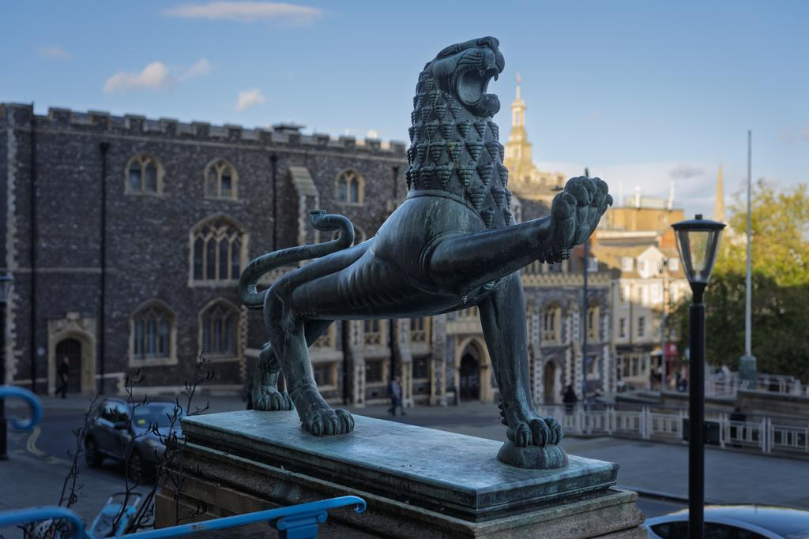

# Model Output Gallery

Generated on: 2026-10-11 00:35:32 BST

- *Evaluation lane:* assisted
- *Prompt hints:* the image's description and keyword hints were included in the prompt, so field content may be copied from them rather than seen
- *Assessment:* General checks + metadata fields and duplicate keywords; length limits and factual accuracy not assessed
- *Input image:* JPEG, 9,984 x 6,656 pixels (66.5 MP), 33.5 MB

This run records model responses to one shared image and prompt (evaluation
lane: assisted). Mechanical checks are not factual-accuracy judgments; inspect
the image, prompt and final answers before choosing a model. Results do not
establish fitness for other tasks.

Complete per-model evidence artifact with image metadata, the source prompt, a
facts-only chooser, and full generated or crash output for every attempted
model.

## Reference Image



## Current-run Chooser

Mechanical observations and captured resource facts for this run only. No concerns detected does not mean the response fulfilled an arbitrary prompt or described the image accurately. Consult the assessment scope above. Total time is end-to-end; throughput covers generation only and requires at least 16 generated tokens. Prefill/first is the measured time to first token (input preparation, prefill and the first decode step) when captured, else upstream's model-loop first-token time; Prompt tok is the full rendered prompt including image tokens, which drives prefill cost. For cross-attention architectures the token count reflects the tokenised text burden only, not total vision prefill compute.

<!-- markdownlint-disable MD034 MD037 MD049 -->

| Model                                                                                                                               | Mechanical checks               | Total s | Gen TPS             | Prefill/first s | Peak GB | Prompt tok | Gen tok | Observations                                                                                                          |
|-------------------------------------------------------------------------------------------------------------------------------------|---------------------------------|---------|---------------------|-----------------|---------|------------|---------|-----------------------------------------------------------------------------------------------------------------------|
| [`LiquidAI/LFM2.5-VL-450M-MLX-bf16`](#model-liquidai-lfm25-vl-450m-mlx-bf16)                                                        | `no concerns detected`          | 2.12s   | 409 tok/s           | 0.63            | 1.9     | 2,128      | 90      | none                                                                                                                  |
| [`TechnoBaptist/Ternary-Bonsai-2-27B-mlx-2bit`](#model-technobaptist-ternary-bonsai-2-27b-mlx-2bit)                                 | `no concerns detected`          | 68.57s  | 32.5 tok/s          | 61.98           | 17      | 16,574     | 125     | none                                                                                                                  |
| [`mlx-community/GLM-4.6V-Flash-4bit`](#model-mlx-community-glm-46v-flash-4bit)                                                      | `no concerns detected`          | 12.12s  | 76.4 tok/s          | 8.57            | 8.7     | 6,460      | 99      | none                                                                                                                  |
| [`mlx-community/GLM-4.6V-nvfp4`](#model-mlx-community-glm-46v-nvfp4)                                                                | `no concerns detected`          | 38.60s  | 37.0 tok/s          | 21.46           | 78      | 6,460      | 108     | none                                                                                                                  |
| [`mlx-community/InternVL3-14B-4bit`](#model-mlx-community-internvl3-14b-4bit)                                                       | `no concerns detected`          | 6.77s   | 53.5 tok/s          | 2.36            | 10      | 2,124      | 123     | none                                                                                                                  |
| [`mlx-community/MiniCPM-o-4_5-4bit`](#model-mlx-community-minicpm-o-45-4bit)                                                        | `no concerns detected`          | 3.25s   | 105 tok/s           | 0.68            | 7.0     | 402        | 91      | none                                                                                                                  |
| [`mlx-community/Ministral-3-14B-Instruct-2512-mxfp4`](#model-mlx-community-ministral-3-14b-instruct-2512-mxfp4)                     | `no concerns detected`          | 7.10s   | 64.4 tok/s          | 2.62            | 13      | 2,935      | 130     | none                                                                                                                  |
| [`mlx-community/Ministral-3-3B-Instruct-2512-4bit`](#model-mlx-community-ministral-3-3b-instruct-2512-4bit)                         | `no concerns detected`          | 5.20s   | 169 tok/s           | 1.65            | 7.8     | 2,934      | 128     | none                                                                                                                  |
| [`mlx-community/Molmo2-8B-4bit`](#model-mlx-community-molmo2-8b-4bit)                                                               | `no concerns detected`          | 6.38s   | 65.9 tok/s          | 1.46            | 8.1     | 1,535      | 181     | none                                                                                                                  |
| [`mlx-community/MolmoPoint-8B-4bit`](#model-mlx-community-molmopoint-8b-4bit)                                                       | `no concerns detected`          | 10.83s  | 29.8 tok/s          | 3.16            | 13      | 3,137      | 129     | none                                                                                                                  |
| [`mlx-community/North-Micro-Vision-Instruct-4bit`](#model-mlx-community-north-micro-vision-instruct-4bit)                           | `no concerns detected`          | 6.22s   | 143 tok/s           | 2.81            | 3.9     | 4,095      | 171     | none                                                                                                                  |
| [`mlx-community/Phi-3.5-vision-instruct-bf16`](#model-mlx-community-phi-35-vision-instruct-bf16)                                    | `no concerns detected`          | 5.98s   | 50.4 tok/s          | 0.93            | 9.3     | 1,149      | 128     | none                                                                                                                  |
| [`mlx-community/Qwen3-Omni-30B-A3B-Instruct-4bit`](#model-mlx-community-qwen3-omni-30b-a3b-instruct-4bit)                           | `no concerns detected`          | 30.73s  | 50.7 tok/s          | 24.96           | 26      | 12,801     | 109     | none                                                                                                                  |
| [`mlx-community/Qwen3-VL-30B-A3B-Instruct-4bit`](#model-mlx-community-qwen3-vl-30b-a3b-instruct-4bit)                               | `no concerns detected`          | 45.59s  | 75.5 tok/s          | 40.31           | 23      | 16,558     | 161     | none                                                                                                                  |
| [`mlx-community/Qwen3-VL-8B-Instruct-4bit`](#model-mlx-community-qwen3-vl-8b-instruct-4bit)                                         | `no concerns detected`          | 45.80s  | 62.3 tok/s          | 41.92           | 11      | 16,558     | 125     | none                                                                                                                  |
| [`mlx-community/Qwen3.5-35B-A3B-4bit`](#model-mlx-community-qwen35-35b-a3b-4bit)                                                    | `no concerns detected`          | 47.62s  | 49.1 tok/s          | 41.07           | 25      | 16,574     | 148     | none                                                                                                                  |
| [`mlx-community/Qwen3.8-27B-nvfp4`](#model-mlx-community-qwen38-27b-nvfp4)                                                          | `no concerns detected`          | 68.19s  | 27.6 tok/s          | 60.26           | 21      | 16,574     | 124     | none                                                                                                                  |
| [`mlx-community/Step-3.7-Flash-oQ3e`](#model-mlx-community-step-37-flash-oq3e)                                                      | `no concerns detected`          | 52.59s  | 48.7 tok/s          | 31.00           | 92      | 3,502      | 122     | none                                                                                                                  |
| [`mlx-community/X-Reasoner-7B-8bit`](#model-mlx-community-x-reasoner-7b-8bit)                                                       | `no concerns detected`          | 19.84s  | 52.8 tok/s          | 14.45           | 14      | 16,569     | 116     | none                                                                                                                  |
| [`mlx-community/aya-vision-8b-4bit`](#model-mlx-community-aya-vision-8b-4bit)                                                       | `no concerns detected`          | 5.15s   | 96.1 tok/s          | 1.61            | 6.5     | 2,100      | 119     | none                                                                                                                  |
| [`mlx-community/diffusiongemma-26B-A4B-it-mxfp8`](#model-mlx-community-diffusiongemma-26b-a4b-it-mxfp8)                             | `no concerns detected`          | 6.55s   | 77.5 tok/s          | 2.26            | 28      | 605        | 87      | none                                                                                                                  |
| [`mlx-community/gemma-3-27b-it-qat-4bit`](#model-mlx-community-gemma-3-27b-it-qat-4bit)                                             | `no concerns detected`          | 12.50s  | 19.6 tok/s          | 2.15            | 17      | 604        | 140     | none                                                                                                                  |
| [`mlx-community/gemma-4-26b-a4b-it-4bit`](#model-mlx-community-gemma-4-26b-a4b-it-4bit)                                             | `no concerns detected`          | 5.52s   | 99.4 tok/s          | 1.05            | 16      | 609        | 106     | none                                                                                                                  |
| [`mlx-community/gemma-4-e4b-it-4bit`](#model-mlx-community-gemma-4-e4b-it-4bit)                                                     | `no concerns detected`          | 3.83s   | 121 tok/s           | 0.80            | 5.9     | 605        | 87      | none                                                                                                                  |
| [`mlx-community/pixtral-12b-8bit`](#model-mlx-community-pixtral-12b-8bit)                                                           | `no concerns detected`          | 7.44s   | 40.2 tok/s          | 2.39            | 16      | 3,125      | 110     | none                                                                                                                  |
| [`nativ-community/Mage-VL-OptiQ-4bit`](#model-nativ-community-mage-vl-optiq-4bit)                                                   | `no concerns detected`          | 5.39s   | 126 tok/s           | 2.60            | 5.4     | 4,221      | 157     | none                                                                                                                  |
| [`nativ-community/Mistral-Small-3.2-24B-Instruct-2506-4bit`](#model-nativ-community-mistral-small-32-24b-instruct-2506-4bit)        | `no concerns detected`          | 15.04s  | 13.4 tok/s          | 2.57            | 18      | 1,281      | 133     | none                                                                                                                  |
| [`nativ-community/Nemotron-3-Nano-Omni-30B-A3B-Reasoning-4bit`](#model-nativ-community-nemotron-3-nano-omni-30b-a3b-reasoning-4bit) | `no concerns detected`          | 10.26s  | 122 tok/s           | 6.13            | 23      | 3,636      | 113     | none                                                                                                                  |
| [`sahilchachra/LensVLM-9B-MXFP4`](#model-sahilchachra-lensvlm-9b-mxfp4)                                                             | `no concerns detected`          | 5.77s   | 101 tok/s           | 1.50            | 7.5     | 1,886      | 223     | none                                                                                                                  |
| [`mlx-community/ERNIE-4.5-VL-28B-A3B-Thinking-4bit`](#model-mlx-community-ernie-45-vl-28b-a3b-thinking-4bit)                        | `concerns detected`             | 11.43s  | 93.4 tok/s          | 1.34            | 19      | 1,648      | 640     | duplicate keywords                                                                                                    |
| [`mlx-community/LFM2.5-VL-3B-OptiQ-4bit`](#model-mlx-community-lfm25-vl-3b-optiq-4bit)                                              | `concerns detected`             | 4.23s   | 201 tok/s           | 1.19            | 4.0     | 2,120      | 93      | prompt hint repeated                                                                                                  |
| [`mlx-community/gemma-4-12B-it-4bit`](#model-mlx-community-gemma-4-12b-it-4bit)                                                     | `concerns detected`             | 5.20s   | 58.6 tok/s          | 0.91            | 7.6     | 609        | 108     | duplicate keywords                                                                                                    |
| [`mlx-community/granite-4.0-3b-vision-4bit`](#model-mlx-community-granite-40-3b-vision-4bit)                                        | `concerns detected`             | 3.11s   | 170 tok/s           | 1.16            | 4.7     | 1,390      | 91      | prompt hint repeated                                                                                                  |
| [`mlx-community/granite-vision-3.2-2b-nvfp4`](#model-mlx-community-granite-vision-32-2b-nvfp4)                                      | `concerns detected`             | 5.61s   | 146 tok/s           | 2.82            | 4.2     | 5,595      | 230     | duplicate keywords                                                                                                    |
| [`mlx-community/FastVLM-0.5B-bf16`](#model-mlx-community-fastvlm-05b-bf16)                                                          | `major concerns: answer format` | 5.00s   | 305 tok/s           | 1.29            | 2.1     | 345        | 42      | labelled fields not detected; prompt hint repeated                                                                    |
| [`mlx-community/InternVL3_5-1B-4bit`](#model-mlx-community-internvl35-1b-4bit)                                                      | `major concerns: generation`    | 3.67s   | 225 tok/s           | 0.86            | 2.1     | 2,127      | 200     | repeated text; stopped early: repeating; duplicate keywords                                                           |
| [`mlx-community/Kimi-VL-A3B-Thinking-2506-8bit`](#model-mlx-community-kimi-vl-a3b-thinking-2506-8bit)                               | `major concerns: generation`    | 22.18s  | 55.7 tok/s          | 1.29            | 20      | 1,334      | 1,000   | labelled fields not detected; cut off at token limit; incomplete thinking block                                       |
| [`mlx-community/Llama-3.2-11B-Vision-Instruct-8bit`](#model-mlx-community-llama-32-11b-vision-instruct-8bit)                        | `major concerns: generation`    | 17.72s  | 15.6 tok/s          | 2.21            | 15      | 311        | 200     | repeated text; stopped early: repeating; duplicate keywords                                                           |
| [`mlx-community/MiniCPM-V-4.6-4bit`](#model-mlx-community-minicpm-v-46-4bit)                                                        | `major concerns: generation`    | 3.64s   | 208 tok/s           | 0.88            | 3.1     | 943        | 124     | incomplete thinking block                                                                                             |
| [`mlx-community/Muse-Glimmer-30B-OptiQ-4bit`](#model-mlx-community-muse-glimmer-30b-optiq-4bit)                                     | `major concerns: answer format` | 57.24s  | 22.7 tok/s          | 9.19            | 25      | 4,413      | 1,000   | control tokens visible; labelled fields not detected; cut off at token limit; role tokens visible; duplicate keywords |
| [`mlx-community/Qwen2-VL-2B-mlx`](#model-mlx-community-qwen2-vl-2b-mlx)                                                             | `major concerns: generation`    | 50.47s  | 113 tok/s           | 46.70           | 9.4     | 16,569     | 200     | repeated text; stopped early: repeating; duplicate keywords                                                           |
| [`mlx-community/SmolVLM-256M-Instruct-4bit`](#model-mlx-community-smolvlm-256m-instruct-4bit)                                       | `major concerns: answer format` | 2.92s   | 315 tok/s           | 0.89            | 1.1     | 1,218      | 45      | labelled fields not detected; prompt hint repeated                                                                    |
| [`mlx-community/SmolVLM2-2.2B-Instruct-mlx`](#model-mlx-community-smolvlm2-22b-instruct-mlx)                                        | `major concerns: generation`    | 4.00s   | 125 tok/s           | 1.03            | 5.6     | 1,439      | 200     | repeated text; stopped early: repeating; labelled fields not detected                                                 |
| [`mlx-community/gemma-3n-E4B-it-4bit`](#model-mlx-community-gemma-3n-e4b-it-4bit)                                                   | `major concerns: answer format` | 6.25s   | 65.4 tok/s          | 0.90            | 7.0     | 603        | 186     | labelled fields not detected                                                                                          |
| [`mlx-community/llm-jp-4-vl-9b-mlx-4bit`](#model-mlx-community-llm-jp-4-vl-9b-mlx-4bit)                                             | `major concerns: answer format` | 3.44s   | insufficient sample | 1.43            | 6.7     | 2,205      | 15      | control tokens visible; labelled fields not detected                                                                  |
| [`mlx-community/nanoLLaVA-1.5-4bit`](#model-mlx-community-nanollava-15-4bit)                                                        | `major concerns: answer format` | 2.51s   | 200 tok/s           | 0.63            | 1.8     | 341        | 162     | labelled fields not detected                                                                                          |
| [`vikhyatk/moondream2`](#model-vikhyatk-moondream2)                                                                                 | `major concerns: answer format` | 7.03s   | 165 tok/s           | 0.93            | 4.8     | 1,034      | 36      | labelled fields not detected; prompt hint repeated                                                                    |
<!-- markdownlint-enable MD034 MD037 MD049 -->

## Resource Highlights

Quickest completion without detected concerns (end-to-end, including model load): `LiquidAI/LFM2.5-VL-450M-MLX-bf16` at 2.12s

Lowest peak memory among completions without detected concerns: `LiquidAI/LFM2.5-VL-450M-MLX-bf16` at 1.9 GB

Decode tok/s stays per model in the chooser and is not averaged across models: tokenizers, image-token expansion and reasoning lengths differ too much for a cross-model mean to guide a choice.

## Major Mechanical Concerns in This Run

<!-- markdownlint-disable MD034 MD037 MD049 -->

| Model                                                                                                        | Mechanical checks               | Observations                                                                                                          |
|--------------------------------------------------------------------------------------------------------------|---------------------------------|-----------------------------------------------------------------------------------------------------------------------|
| [`mlx-community/FastVLM-0.5B-bf16`](#model-mlx-community-fastvlm-05b-bf16)                                   | `major concerns: answer format` | labelled fields not detected; prompt hint repeated                                                                    |
| [`mlx-community/InternVL3_5-1B-4bit`](#model-mlx-community-internvl35-1b-4bit)                               | `major concerns: generation`    | repeated text; stopped early: repeating; duplicate keywords                                                           |
| [`mlx-community/Kimi-VL-A3B-Thinking-2506-8bit`](#model-mlx-community-kimi-vl-a3b-thinking-2506-8bit)        | `major concerns: generation`    | labelled fields not detected; cut off at token limit; incomplete thinking block                                       |
| [`mlx-community/Llama-3.2-11B-Vision-Instruct-8bit`](#model-mlx-community-llama-32-11b-vision-instruct-8bit) | `major concerns: generation`    | repeated text; stopped early: repeating; duplicate keywords                                                           |
| [`mlx-community/MiniCPM-V-4.6-4bit`](#model-mlx-community-minicpm-v-46-4bit)                                 | `major concerns: generation`    | incomplete thinking block                                                                                             |
| [`mlx-community/Muse-Glimmer-30B-OptiQ-4bit`](#model-mlx-community-muse-glimmer-30b-optiq-4bit)              | `major concerns: answer format` | control tokens visible; labelled fields not detected; cut off at token limit; role tokens visible; duplicate keywords |
| [`mlx-community/Qwen2-VL-2B-mlx`](#model-mlx-community-qwen2-vl-2b-mlx)                                      | `major concerns: generation`    | repeated text; stopped early: repeating; duplicate keywords                                                           |
| [`mlx-community/SmolVLM-256M-Instruct-4bit`](#model-mlx-community-smolvlm-256m-instruct-4bit)                | `major concerns: answer format` | labelled fields not detected; prompt hint repeated                                                                    |
| [`mlx-community/SmolVLM2-2.2B-Instruct-mlx`](#model-mlx-community-smolvlm2-22b-instruct-mlx)                 | `major concerns: generation`    | repeated text; stopped early: repeating; labelled fields not detected                                                 |
| [`mlx-community/gemma-3n-E4B-it-4bit`](#model-mlx-community-gemma-3n-e4b-it-4bit)                            | `major concerns: answer format` | labelled fields not detected                                                                                          |
| [`mlx-community/llm-jp-4-vl-9b-mlx-4bit`](#model-mlx-community-llm-jp-4-vl-9b-mlx-4bit)                      | `major concerns: answer format` | control tokens visible; labelled fields not detected                                                                  |
| [`mlx-community/nanoLLaVA-1.5-4bit`](#model-mlx-community-nanollava-15-4bit)                                 | `major concerns: answer format` | labelled fields not detected                                                                                          |
| [`vikhyatk/moondream2`](#model-vikhyatk-moondream2)                                                          | `major concerns: answer format` | labelled fields not detected; prompt hint repeated                                                                    |
<!-- markdownlint-enable MD034 MD037 MD049 -->

## Output at a Glance

A compact preview of each model's final answer (or failure evidence for crashes), in chooser order. Where the requested catalogue fields were detected, the preview shows a little of each: the title, the start of the description, and the first keywords with their count, so the weakest field is not hidden behind a long description. Otherwise it is the first 280 characters. A closed reasoning trace is left out of the preview and reported as an omitted-character count; the complete output, trace included, is in the model's evidence block below.

<!-- markdownlint-disable MD034 MD037 MD049 -->

| Model                                                                                                                               | Mechanical checks      | Output preview                                                                                                                                                                                                                                                                                                                                                                        |
|-------------------------------------------------------------------------------------------------------------------------------------|------------------------|---------------------------------------------------------------------------------------------------------------------------------------------------------------------------------------------------------------------------------------------------------------------------------------------------------------------------------------------------------------------------------------|
| [`LiquidAI/LFM2.5-VL-450M-MLX-bf16`](#model-liquidai-lfm25-vl-450m-mlx-bf16)                                                        | `no concerns detected` | Title: Lion Statue at City Hall \| Description: A bronze lion statue stands prominently outside City Hall, overlooking the Market Place in Norwich, England. The sta... \| Keywords (10): Lion statue, City Hall, Norwich, England, Gothic architecture, historical landmark, statue, street scene, ...                                                                               |
| [`TechnoBaptist/Ternary-Bonsai-2-27B-mlx-2bit`](#model-technobaptist-ternary-bonsai-2-27b-mlx-2bit)                                 | `no concerns detected` | Title: Bronze Lion Statue Before Norwich Guildhall \| Description: A weathered bronze lion sculpture with an open mouth and raised paw stands on a stone plinth... \| Keywords (17): Bronze lion, Norwich Guildhall, Norwich, Norfolk, England, Gothic architecture, Historic landmark, Sculpture, ...                                                                                |
| [`mlx-community/GLM-4.6V-Flash-4bit`](#model-mlx-community-glm-46v-flash-4bit)                                                      | `no concerns detected` | Title: Bronze Lion Statue at Norwich Guildhall \| Description: A bronze lion sculpture stands prominently on a stone pedestal, with the historic 15th-century flint N... \| Keywords (9): Bronze Lion Statue, Norwich Guildhall, Historic Landmark, Gothic Architecture, Norwich, Norfolk, England, ...                                                                               |
| [`mlx-community/GLM-4.6V-nvfp4`](#model-mlx-community-glm-46v-nvfp4)                                                                | `no concerns detected` | Title: Bronze Lion Sculpture, Norwich Guildhall \| Description: A bronze lion sculpture by Alfred Hardiman stands prominently on a stone pedestal, overlooking a... \| Keywords (17): Bronze, Lion, Sculpture, Alfred Hardiman, Norwich Guildhall, 15th-century, Flint, Norwich, Norfolk, England, ...                                                                                |
| [`mlx-community/InternVL3-14B-4bit`](#model-mlx-community-internvl3-14b-4bit)                                                       | `no concerns detected` | Title: Norwich Lion Statue, Gothic Architecture \| Description: A bronze lion statue by Alfred Hardiman is prominently displayed in Norwich, England, with the historic Norwich G... \| Keywords (21): Adobe Stock, Alfred Hardiman, Blue sky, British heritage, Car, East Anglia, England, Europe, ...                                                                               |
| [`mlx-community/MiniCPM-o-4_5-4bit`](#model-mlx-community-minicpm-o-45-4bit)                                                        | `no concerns detected` | Title: Bronze Lion Statue in Norwich Market Place \| Description: A bronze lion sculpture stands prominently on a pedestal in Norwich, with the historic Norwich Gui... \| Keywords (12): Bronze lion, Norwich, Guildhall, Gothic Architecture, Statue, Sculpture, Market Place, Blue sky, England, ...                                                                               |
| [`mlx-community/Ministral-3-14B-Instruct-2512-mxfp4`](#model-mlx-community-ministral-3-14b-instruct-2512-mxfp4)                     | `no concerns detected` | Title: **Alfred Hardiman’s Lion Sculpture, Norwich Guildhall** \| Description: A bronze lion sculpture by Alfred Hardiman stands prominently on a stone pedestal o... \| Keywords (16): Lion sculpture, Alfred Hardiman, Norwich City Hall, Norwich Guildhall, Gothic architecture, flint building, ...                                                                               |
| [`mlx-community/Ministral-3-3B-Instruct-2512-4bit`](#model-mlx-community-ministral-3-3b-instruct-2512-4bit)                         | `no concerns detected` | Title: **Norwich Guildhall’s Alfred Hardiman Lion Statue** \| Description: A bronze lion sculpture by Alfred Hardiman stands prominently in Norwich’s Market Plac... \| Keywords (14): bronze lion, Norwich Guildhall, flintwork architecture, Alfred Hardiman, Market Place, East Anglia, England, ...                                                                               |
| [`mlx-community/Molmo2-8B-4bit`](#model-mlx-community-molmo2-8b-4bit)                                                               | `no concerns detected` | Title: Bronze Lion Statue Guards Norwich Guildhall, East Anglia \| Description: A bronze lion statue by Alfred Hardiman stands prominently in Norwich, Norfolk, En... \| Keywords (19): Norwich Guildhall, Bronze Lion Statue, Alfred Hardiman, East Anglia, Norfolk, England, Gothic Architecture, ...                                                                               |
| [`mlx-community/MolmoPoint-8B-4bit`](#model-mlx-community-molmopoint-8b-4bit)                                                       | `no concerns detected` | Title: Bronze Lion Statue in Norwich Market Place \| Description: A weathered bronze lion statue stands on a pedestal in Norwich's Market Place, overlooking the st... \| Keywords (17): Bronze lion, Norwich, Market Place, Guildhall, Norwich Guildhall, Street scene, Pedestrian, Car, Blue sky, ...                                                                               |
| [`mlx-community/North-Micro-Vision-Instruct-4bit`](#model-mlx-community-north-micro-vision-instruct-4bit)                           | `no concerns detected` | Title: "The Lion Statue at Norwich Guildhall" \| Description: A bronze lion sculpture by Alfred Hardiman stands prominently outside City Hall, overlooking the Ma... \| Keywords (20): Adobe Stock, Any Vision, Blue sky, British heritage, Car, East Anglia, England, Europe, Gothic Architecture, ...                                                                               |
| [`mlx-community/Phi-3.5-vision-instruct-bf16`](#model-mlx-community-phi-35-vision-instruct-bf16)                                    | `no concerns detected` | Title: "Norwich City Hall Lion Statue" \| Description: The bronze lion statue by Alfred Hardiman stands majestically outside City Hall in Norwich, Norfolk, England, wit... \| Keywords (17): Norwich, City Hall, Lion Statue, Alfred Hardiman, Bronze, Sculpture, Historic Landmark, 15th Century, ...                                                                               |
| [`mlx-community/Qwen3-Omni-30B-A3B-Instruct-4bit`](#model-mlx-community-qwen3-omni-30b-a3b-instruct-4bit)                           | `no concerns detected` | Title: Bronze Lion Sculpture in Norwich \| Description: A bronze lion sculpture stands prominently in the foreground, overlooking a street scene in Norwich, E... \| Keywords (18): Norwich, England, Lion, Sculpture, Bronze, Guildhall, Historic Landmark, British Heritage, Gothic Architecture, ...                                                                               |
| [`mlx-community/Qwen3-VL-30B-A3B-Instruct-4bit`](#model-mlx-community-qwen3-vl-30b-a3b-instruct-4bit)                               | `no concerns detected` | Title: Bronze lion statue in Norwich city centre \| Description: A weathered bronze lion sculpture stands prominently on a stone plinth in Norwich, Norfolk, England, with... \| Keywords (20): bronze lion, sculpture, Norwich Guildhall, Norfolk, England, British heritage, Gothic Architecture, ...                                                                               |
| [`mlx-community/Qwen3-VL-8B-Instruct-4bit`](#model-mlx-community-qwen3-vl-8b-instruct-4bit)                                         | `no concerns detected` | Title: Bronze Lion Statue at Norwich Guildhall \| Description: A bronze lion statue by Alfred Hardiman stands prominently in front of the historic Norwich Guildhall, its fie... \| Keywords (18): Bronze lion, Alfred Hardiman, Norwich Guildhall, Norwich, Norfolk, England, Gothic architecture, ...                                                                               |
| [`mlx-community/Qwen3.5-35B-A3B-4bit`](#model-mlx-community-qwen35-35b-a3b-4bit)                                                    | `no concerns detected` | Title: Bronze Lion Statue at Norwich Guildhall \| Description: A bronze lion sculpture by Alfred Hardiman stands guard outside the historic 15th-century flint N... \| Keywords (18): Bronze Lion, Norwich Guildhall, Alfred Hardiman, Gothic Architecture, Street Scene, Pedestrian, Market Place, ...                                                                               |
| [`mlx-community/Qwen3.8-27B-nvfp4`](#model-mlx-community-qwen38-27b-nvfp4)                                                          | `no concerns detected` | Title: Bronze Lion Statues at Norwich Guildhall \| Description: A pair of weathered bronze lion sculptures by Alfred Hardiman stand on a stone plinth in front o... \| Keywords (17): Bronze Sculpture, Lion Statue, Norwich Guildhall, Gothic Architecture, Alfred Hardiman, East Anglia, England, ...                                                                               |
| [`mlx-community/Step-3.7-Flash-oQ3e`](#model-mlx-community-step-37-flash-oq3e)                                                      | `no concerns detected` | Title: Bronze Lion Sculpture Outside Norwich Guildhall \| Description: A bronze lion sculpture by Alfred Hardiman stands on a stone plinth outside City Hall, ove... \| Keywords (20): Adobe Stock, Any Vision, Blue sky, British heritage, Car, East Anglia, England, Europe, Gothic Architecture, ...                                                                               |
| [`mlx-community/X-Reasoner-7B-8bit`](#model-mlx-community-x-reasoner-7b-8bit)                                                       | `no concerns detected` | Title: Norwich Guildhall Lion Statue \| Description: A bronze lion sculpture by Alfred Hardiman overlooks the Market Place from the balustrade of a bridge, with the histori... \| Keywords (21): Norwich, Norfolk, England, Guildhall, Lion, Bronze, Statue, Hardiman, Market Place, 15th-century, ...                                                                               |
| [`mlx-community/aya-vision-8b-4bit`](#model-mlx-community-aya-vision-8b-4bit)                                                       | `no concerns detected` | Title: Bronze Lion Statue Outside Norwich Guildhall \| Description: A bronze lion sculpture by Alfred Hardiman stands outside the historic Norwich Guildhall, overl... \| Keywords (17): Bronze, Lion, Sculpture, Norwich, Guildhall, Market Place, Historical, Architecture, East Anglia, England, ...                                                                               |
| [`mlx-community/diffusiongemma-26B-A4B-it-mxfp8`](#model-mlx-community-diffusiongemma-26b-a4b-it-mxfp8)                             | `no concerns detected` | Title: Bronze Lion Sculpture Outside Norwich Guildhall \| Description: A bronze lion sculpture by Alfred Hardiman stands outside the City Hall, overlooking the historic... \| Keywords (15): Norwich, Norfolk, England, British heritage, lion, sculpture, statue, Guildhall, Gothic architecture, ...                                                                               |
| [`mlx-community/gemma-3-27b-it-qat-4bit`](#model-mlx-community-gemma-3-27b-it-qat-4bit)                                             | `no concerns detected` | Title: Hardiman Lion Sculpture, Norwich Guildhall, Norfolk \| Description: Captured on 10 October 2026, this photograph shows Alfred Hardiman’s bronze lion sc... \| Keywords (19): Alfred Hardiman, Bronze sculpture, Lion, Statue, Norwich Guildhall, City Hall, Market Place, Historic landmark, ...                                                                               |
| [`mlx-community/gemma-4-26b-a4b-it-4bit`](#model-mlx-community-gemma-4-26b-a4b-it-4bit)                                             | `no concerns detected` | Title: Bronze lion sculpture overlooking historic Norwich Guildhall \| Description: A bronze lion sculpture by Alfred Hardiman stands in the foreground, overlooking t... \| Keywords (16): Alfred Hardiman, East Anglia, England, Europe, Gothic Architecture, Guildhall, Historic Landmark, Lion, ...                                                                               |
| [`mlx-community/gemma-4-e4b-it-4bit`](#model-mlx-community-gemma-4-e4b-it-4bit)                                                     | `no concerns detected` | Title: Bronze lion sculpture before historic Norwich Guildhall backdrop. \| Description: A detailed bronze lion sculpture rests on a pedestal, with the impressive,... \| Keywords (15): Norwich Guildhall, bronze sculpture, lion statue, Alfred Hardiman, historic landmark, Gothic architecture, ...                                                                               |
| [`mlx-community/pixtral-12b-8bit`](#model-mlx-community-pixtral-12b-8bit)                                                           | `no concerns detected` | Title: Bronze Lion Sculpture in Norwich Market Place \| Description: A bronze lion sculpture by Alfred Hardiman stands prominently in Norwich Market Place, with... \| Keywords (20): Adobe Stock, Any Vision, Blue sky, British heritage, Car, East Anglia, England, Europe, Gothic Architecture, ...                                                                                |
| [`nativ-community/Mage-VL-OptiQ-4bit`](#model-nativ-community-mage-vl-optiq-4bit)                                                   | `no concerns detected` | Title: Bronze Lion Sculpture at Norwich Guildhall, East Anglia \| Description: A bronze lion sculpture by Alfred Hardiman stands proudly on a stone pedestal ou... \| Keywords (17): Bronze Lion, Alfred Hardiman, Norwich Guildhall, Gothic Architecture, Historic Landmark, East Anglia, England, ...                                                                               |
| [`nativ-community/Mistral-Small-3.2-24B-Instruct-2506-4bit`](#model-nativ-community-mistral-small-32-24b-instruct-2506-4bit)        | `no concerns detected` | Title: Bronze Lion Statue at Norwich Guildhall \| Description: A bronze lion sculpture by Alfred Hardiman stands prominently outside City Hall, overlooking the Market P... \| Keywords (18): Norwich Guildhall, Bronze Lion Statue, Alfred Hardiman, City Hall, Market Place, Gothic Architecture, ...                                                                               |
| [`nativ-community/Nemotron-3-Nano-Omni-30B-A3B-Reasoning-4bit`](#model-nativ-community-nemotron-3-nano-omni-30b-a3b-reasoning-4bit) | `no concerns detected` | Title: Bronze Lion Statue at Norwich City Hall \| Description: A bronze lion sculpture by Alfred Hardiman stands proudly on its pedestal, overlooking the bustling Ma... \| Keywords (19): bronze lion, Alfred Hardiman, Norwich City Hall, Norwich Guildhall, flint building, Gothic architecture, ...                                                                               |
| [`sahilchachra/LensVLM-9B-MXFP4`](#model-sahilchachra-lensvlm-9b-mxfp4)                                                             | `no concerns detected` | Title: Norwich Lion Statue and Guildhall \| Description: A bronze lion sculpture stands outside City Hall overlooking the Market Place, with the historic 15th-ce... \| Keywords (20): Adobe Stock, Any Vision, Blue sky, British heritage, Car, East Anglia, England, Europe, Gothic Architecture, ...                                                                               |
| [`mlx-community/ERNIE-4.5-VL-28B-A3B-Thinking-4bit`](#model-mlx-community-ernie-45-vl-28b-a3b-thinking-4bit)                        | `concerns detected`    | Title: Bronze Lion Sculpture in Norwich \| Description: A bronze lion sculpture by Alfred Hardiman stands outside Norwich City Hall, overlooking the Market Plac... \| Keywords (52): Norwich, England, UK, city, street, lion, bronze, statue, sculpture, City Hall, Guildhall, Norwich Guildhall, ...[1,630 characters of reasoning omitted; complete output in the evidence block] |
| [`mlx-community/LFM2.5-VL-3B-OptiQ-4bit`](#model-mlx-community-lfm25-vl-3b-optiq-4bit)                                              | `concerns detected`    | Title: Bronze Lion Statue in Norwich, England \| Description: A bronze lion sculpture by Alfred Hardiman stands outside City Hall overlooking the Market Place,... \| Keywords (15): London, sculpture, lion, statue, city hall, market place, guildhall, historic, architecture, England, Europe, ...                                                                                |
| [`mlx-community/gemma-4-12B-it-4bit`](#model-mlx-community-gemma-4-12b-it-4bit)                                                     | `concerns detected`    | Title: Bronze Lion Sculpture in Front of Norwich Guildhall \| Description: A bronze lion sculpture by Alfred Hardiman stands in front of the historic 15th-century flint... \| Keywords (17): Norwich, Norfolk, England, Guildhall, Sculpture, Lion Statue, Gothic Architecture, British Heritage, ...                                                                                |
| [`mlx-community/granite-4.0-3b-vision-4bit`](#model-mlx-community-granite-40-3b-vision-4bit)                                        | `concerns detected`    | Title: "Bronze Lion Sculpture by Alfred Hardiman" \| Description: A bronze lion sculpture by Alfred Hardiman stands outside City Hall, overlooking the Market Place in Norwich,... \| Keywords (17): Bronze, Lion, Sculpture, Alfred Hardiman, City Hall, Market Place, Norwich, Norfolk, England, ...                                                                                |
| [`mlx-community/granite-vision-3.2-2b-nvfp4`](#model-mlx-community-granite-vision-32-2b-nvfp4)                                      | `concerns detected`    | Title: "Alfred Hardiman's Lion Sculpture at City Hall, Norwich" \| Description: A bronze lion sculpture by Alfred Hardiman stands proudly outside City Hall, o... \| Keywords (19): Alfred Hardiman, Lion Sculpture, City Hall, Norwich, Guildhall, Norwich, Norfolk, England, Gothic Architecture, ...                                                                               |
| [`mlx-community/FastVLM-0.5B-bf16`](#model-mlx-community-fastvlm-05b-bf16)                                                          | `major concerns`       | A bronze lion sculpture by Alfred Hardiman stands outside City Hall overlooking the Market Place, with the historic 15th-century flint Norwich Guildhall visible in the background in Norwich, Norfolk, England.                                                                                                                                                                      |
| [`mlx-community/InternVL3_5-1B-4bit`](#model-mlx-community-internvl35-1b-4bit)                                                      | `major concerns`       | Title: "Bronze Lion Sculpture at Norwich Guildhall, Norwich, England" \| Description: The image features a bronze lion sculpture by Alfred Hardiman, positioned o... \| Keywords (47): Alfred Hardiman, Norwich Guildhall, Gothic Architecture, British heritage, Lion, Norwich, Norwich City Hall, ...                                                                               |
| [`mlx-community/Kimi-VL-A3B-Thinking-2506-8bit`](#model-mlx-community-kimi-vl-a3b-thinking-2506-8bit)                               | `major concerns`       | ◁think▷Okay, let's tackle this task step by step. First, I need to create a British-English catalogue metadata based on the provided context and image. The key elements from the context are the capture date/time (2026-10-10 16:41:54 UTC+01:00) and GPS coordinates (52.628900°N,...                                                                                              |
| [`mlx-community/Llama-3.2-11B-Vision-Instruct-8bit`](#model-mlx-community-llama-32-11b-vision-instruct-8bit)                        | `major concerns`       | Title: Bronze Lion Statue in Front of Norwich Guildhall \| Description: A bronze lion statue stands proudly in front of the historic Norwich Guildhall, set against... \| Keywords (44): Bronze lion statue, Norwich Guildhall, historic building, Gothic architecture, sunny day, city of Norwich, ...                                                                               |
| [`mlx-community/MiniCPM-V-4.6-4bit`](#model-mlx-community-minicpm-v-46-4bit)                                                        | `major concerns`       | Title: Bronze Lion Statue at City Hall, Norwich, England \| Description: A grand bronze lion sculpture stands prominently outside City Hall, set against a historic... \| Keywords (21): British-English, bronze lion, City Hall, Norwich, England, historic, Gothic Architecture, Guildhall, Lion, ...                                                                               |
| [`mlx-community/Muse-Glimmer-30B-OptiQ-4bit`](#model-mlx-community-muse-glimmer-30b-optiq-4bit)                                     | `major concerns`       | Title: (not detected) \| Description: (not detected) \| Keywords (32): We need title 5-10 words. Concrete., ...                                                                                                                                                                                                                                                                       |
| [`mlx-community/Qwen2-VL-2B-mlx`](#model-mlx-community-qwen2-vl-2b-mlx)                                                             | `major concerns`       | Title: Bronze Lion Statue in Norwich, England \| Description: The bronze lion statue stands on the bridge in Norwich, Norfolk, England. It is a 15th-century flint Nor... \| Keywords (39): Bronze Lion Statue, Norwich, Norfolk, England, Guildhall, Historic Landmark, Lion, Statue, Sightseeing, ...                                                                               |
| [`mlx-community/SmolVLM-256M-Instruct-4bit`](#model-mlx-community-smolvlm-256m-instruct-4bit)                                       | `major concerns`       | A bronze-colored statue by Alfred Hardiman stands outside City Hall overlooking the Market Place, with the historic 15th-century flint Norwich Guildhall visible in the background in Norwich, Norfolk, England.                                                                                                                                                                      |
| [`mlx-community/SmolVLM2-2.2B-Instruct-mlx`](#model-mlx-community-smolvlm2-22b-instruct-mlx)                                        | `major concerns`       | Lion, City Hall, Norwich Guildhall, Sculpture, Sightseeing, Statue, Street Scene, Sculpture, Sightseeing, Statue, Sculpture, Sightseeing, Sculpture, Sightseeing, Sculpture, Sightseeing, Sculpture, Sculpture, Sculpture, Sculpture, Sculpture, Sculpture, Sculpture, Sculpture, Scu...                                                                                              |
| [`mlx-community/gemma-3n-E4B-it-4bit`](#model-mlx-community-gemma-3n-e4b-it-4bit)                                                   | `major concerns`       | A bronze lion sculpture by Alfred Hirst stands outside City Hall overlooking the Market Place, with the historic 15th-century Guildhall visible in the background in Norwich, England. The photo was taken on October 10, 2026, at 4:41:54 PM GMT, at coordinates 52.628900°N, 1.2925...                                                                                              |
| [`mlx-community/llm-jp-4-vl-9b-mlx-4bit`](#model-mlx-community-llm-jp-4-vl-9b-mlx-4bit)                                             | `major concerns`       | <\|channel\|> analysis<\|message\|> The image shows a bronze statue of a roaring lion.                                                                                                                                                                                                                                                                                                |
| [`mlx-community/nanoLLaVA-1.5-4bit`](#model-mlx-community-nanollava-15-4bit)                                                        | `major concerns`       | Title: A bronze lion sculpture by Alfred Hardiman stands outside City Hall overlooki... \| Description: A statue of a lion by Alfred Hardiman, located outside City Hall in Norwich, Norfolk, England. The statue is situated in front of the historic flint Norwich Gui... \| Keywords: (not detected)                                                                               |
| [`vikhyatk/moondream2`](#model-vikhyatk-moondream2)                                                                                 | `major concerns`       | A bronze lion sculpture by Alfred Hardiman stands outside City Hall overlooking the Market Place, with the historic 15th-century flint Norwich Guildhall visible in the background in Norwich, Norfolk, England.                                                                                                                                                                      |
<!-- markdownlint-enable MD034 MD037 MD049 -->

## Run Stamps

- `mlx-vlm`: `0.7.7`
- `mlx`: `0.32.4.dev20261010+06eb7483f`
- `transformers`: `5.19.0`
- `tokenizers`: `0.23.3`
- `huggingface-hub`: `2.2.0`
- *Python Version:* 3.14.7
- *OS:* Darwin 27.0.0
- *macOS Version:* 27.0.1
- *GPU/Chip:* Apple M5 Max
- *MLX Device:* Apple M5 Max
- *GPU Architecture:* applegpu_g17s
- *RAM:* 128.0 GB
- *Recommended Working Set:* 115 GB
- *Fused Attention:* Available

## Image Metadata

- *Description:* A bronze lion sculpture by Alfred Hardiman stands outside
  City Hall overlooking the Market Place, with the historic 15th-century flint
  Norwich Guildhall visible in the background in Norwich, Norfolk, England.
- *Keywords:* Adobe Stock, Any Vision, Blue sky, British heritage, Car, East
  Anglia, England, Europe, Gothic Architecture, Guildhall, Historic Landmark,
  Lion, Norfolk, Norwich, Norwich Guildhall, Pedestrian, Sculpture,
  Sightseeing, Statue, Street Scene, Street lamp, Tree, United Kingdom,
  architecture, bronze sculpture, city center, city hall, cityscape, civic
  building, cultural heritage, daytime, flint wall, great britain, historic,
  historic architecture, historic building, history, knapped flint, landmark,
  lion statue, majestic, medieval building, metal sculpture, monument, outdoor
  sculpture, patinated bronze, pedestal, plinth, public art, railing, roaring
  lion, stone facade, symbol, tourism, tourist attraction, travel, urban
- *Date:* 2026-10-10 16:41:54 UTC+01:00
- *Time:* 16:41:54
- *GPS:* 52.628900°N, 1.292500°E

## Prompt

<!-- markdownlint-disable MD011 MD028 MD037 MD045 -->
>
> Create British-English catalogue metadata from the image and supplied
> context.
>
> Treat any capture date/time and GPS as authoritative facts, but do not claim
> they are visible. Descriptive hints may be incomplete or wrong: retain
> details supported by the image, correct conflicts, and add important visible
> details. Prefer image evidence when a hint conflicts, and omit uncertain
> details.
>
> Context: Authoritative context:
> &#45; Capture date/time: 2026-10-10 16:41:54 UTC+01:00
> &#45; GPS: 52.628900°N, 1.292500°E
>
> &#8203;Descriptive hints:
> &#45; Description hint: A bronze lion sculpture by Alfred Hardiman stands
> outside City Hall overlooking the Market Place, with the historic
> 15th-century flint Norwich Guildhall visible in the background in Norwich,
> Norfolk, England.
> &#45; Keyword hints: Adobe Stock, Any Vision, Blue sky, British heritage, Car,
> East Anglia, England, Europe, Gothic Architecture, Guildhall, Historic
> Landmark, Lion, Norfolk, Norwich, Norwich Guildhall, Pedestrian, Sculpture,
> Sightseeing, Statue, Street Scene
>
> &#8203;Write:
> &#45; a concrete 5-10-word title;
> &#45; a 1-2-sentence factual description combining relevant context with the
> main visible subject, setting, action, lighting, and distinctive details;
> &#45; 10-18 unique, comma-separated keywords covering relevant context and
> visible details.
>
> &#8203;Return exactly these three sections and nothing else:
> &#8203;Title:
> &#8203;Description:
> &#8203;Keywords:
<!-- markdownlint-enable MD011 MD028 MD037 MD045 -->

## Complete Per-model Evidence

Complete generated or crash evidence for every attempted model.

<a id="model-liquidai-lfm25-vl-450m-mlx-bf16"></a>

### LiquidAI/LFM2.5-VL-450M-MLX-bf16

<details>
<summary>Complete evidence: LiquidAI/LFM2.5-VL-450M-MLX-bf16</summary>

- *Execution:* completed
- *Mechanical checks:* no concerns detected
- *Assessment:* General checks + metadata fields and duplicate keywords;
  length limits and factual accuracy not assessed
- *Maintainer status:* none
- *Observations:* none
- *Arch supported by installed mlx-vlm:* yes (model_type lfm2-vl via lfm2_vl)
- *Model load time:* 0.43s
- *Generation time:* 0.85s
- *Total time:* 2.12s
- *Prompt preparation time:* 0.52
- *First-token latency:* 0.124
- *Cleanup time:* 0.0952
- *Prompt tokens:* 2,128
- *Generation tokens:* 90
- *Total tokens:* 2,218
- *Prompt throughput (raw):* 17,107 tok/s
- *Generation throughput (raw):* 409 tok/s
- *Peak memory (GB):* 1.9
- *Active memory (GB):* 0.90
- *Cache memory (GB):* 0.07
- *Model-load active memory (GB):* 0.897
- *Post-cleanup active memory (GB):* 0.000134
- *Post-cleanup cache memory (GB):* 0.0
- *Stop reason:* completed
- *Requested maximum tokens:* 1000
- *Rendered prompt characters:* 1436
- *Image placeholders:* 1
- *Processor:* transformers.models.lfm2_vl.processing_lfm2_vl.Lfm2VlProcessor
- *Tokenizer:* transformers.tokenization_utils_tokenizers.TokenizersBackend
- *Requested model revision:* not requested
- *Resolved model revision:* ed71acdae0799c98cb450787d049d1343b65cd52
- *Resolved snapshot path:* ~/.cache/huggingface/hub/models--LiquidAI--LFM2.5-VL-450M-MLX-bf16/snapshots/ed71acdae0799c98cb450787d049d1343b65cd52
- *Generation settings:* {"max_tokens": 1000, "prefill_step_size": 2048,
  "seed": 0, "temperature": 0.0, "top_p": 1.0}
- *EOS token:* <\|im_end\|>

*Readable output:*

<pre class="model-output-readable">
Title:
Lion Statue at City Hall

Description:
A bronze lion statue stands prominently outside City Hall, overlooking the Market Place in Norwich, England. The statue, with its detailed armor and open mouth, is set against a backdrop of historic buildings and a clear blue sky.

Keywords:
Lion statue, City Hall, Norwich, England, Gothic architecture, historical landmark, statue, street scene, pedestrian, blue sky
</pre>

</details>

---

<a id="model-technobaptist-ternary-bonsai-2-27b-mlx-2bit"></a>

### TechnoBaptist/Ternary-Bonsai-2-27B-mlx-2bit

<details>
<summary>Complete evidence: TechnoBaptist/Ternary-Bonsai-2-27B-mlx-2bit</summary>

- *Execution:* completed
- *Mechanical checks:* no concerns detected
- *Assessment:* General checks + metadata fields and duplicate keywords;
  length limits and factual accuracy not assessed
- *Maintainer status:* none
- *Observations:* none
- *Arch supported by installed mlx-vlm:* yes (model_type
  prism_hadamard_qwen35)
- *Model load time:* 1.62s
- *Generation time:* 65.83s
- *Total time:* 68.57s
- *Prompt preparation time:* 1.11
- *First-token latency:* 61.1
- *Cleanup time:* 0.142
- *Prompt tokens:* 16,574
- *Generation tokens:* 125
- *Total tokens:* 16,699
- *Prompt throughput (raw):* 271 tok/s
- *Generation throughput (raw):* 32.5 tok/s
- *Peak memory (GB):* 17
- *Active memory (GB):* 8.6
- *Cache memory (GB):* 3.3
- *Model-load active memory (GB):* 8.6
- *Post-cleanup active memory (GB):* 0.00113
- *Post-cleanup cache memory (GB):* 0.0
- *Stop reason:* completed
- *Requested maximum tokens:* 1000
- *Rendered prompt characters:* 1476
- *Processor:* mlx_vlm.models.qwen3_vl.processing_qwen3_vl.Qwen3VLProcessor
- *Tokenizer:* transformers.models.qwen2.tokenization_qwen2.Qwen2Tokenizer
- *Requested model revision:* not requested
- *Resolved model revision:* 498775b03b55d038f716fea2568bf6ae6b8e0b5e
- *Resolved snapshot path:* ~/.cache/huggingface/hub/models--TechnoBaptist--Ternary-Bonsai-2-27B-mlx-2bit/snapshots/498775b03b55d038f716fea2568bf6ae6b8e0b5e
- *Generation settings:* {"max_tokens": 1000, "prefill_step_size": 2048,
  "seed": 0, "temperature": 0.0, "top_p": 1.0}
- *EOS token:* <\|im_end\|>

*Readable output:*

<pre class="model-output-readable">
Title: Bronze Lion Statue Before Norwich Guildhall

Description: A weathered bronze lion sculpture with an open mouth and raised paw stands on a stone plinth in the foreground, set against the blurred backdrop of the historic Norwich Guildhall and a blue sky. The scene is captured in the late afternoon, with a street lamp and parked cars visible in the surrounding urban setting.

Keywords: Bronze lion, Norwich Guildhall, Norwich, Norfolk, England, Gothic architecture, Historic landmark, Sculpture, Statue, Street scene, Blue sky, Car, Pedestrian, Sightseeing, British heritage, East Anglia, Europe
</pre>

</details>

---

<a id="model-mlx-community-glm-46v-flash-4bit"></a>

### mlx-community/GLM-4.6V-Flash-4bit

<details>
<summary>Complete evidence: mlx-community/GLM-4.6V-Flash-4bit</summary>

- *Execution:* completed
- *Mechanical checks:* no concerns detected
- *Assessment:* General checks + metadata fields and duplicate keywords;
  length limits and factual accuracy not assessed
- *Maintainer status:* none
- *Observations:* none
- *Arch supported by installed mlx-vlm:* yes (model_type glm4v)
- *Model load time:* 1.72s
- *Generation time:* 9.88s
- *Total time:* 12.12s
- *Prompt preparation time:* 0.505
- *First-token latency:* 8.09
- *Cleanup time:* 0.103
- *Prompt tokens:* 6,460
- *Generation tokens:* 99
- *Total tokens:* 6,559
- *Prompt throughput (raw):* 799 tok/s
- *Generation throughput (raw):* 76.4 tok/s
- *Peak memory (GB):* 8.7
- *Active memory (GB):* 7.1
- *Cache memory (GB):* 0.47
- *Model-load active memory (GB):* 7.08
- *Post-cleanup active memory (GB):* 0.00197
- *Post-cleanup cache memory (GB):* 0.0
- *Stop reason:* completed
- *Requested maximum tokens:* 1000
- *Rendered prompt characters:* 1466
- *Image placeholders:* 1
- *Processor:* mlx_vlm.models.glm4v.processing.Glm46VProcessor
- *Tokenizer:* transformers.tokenization_utils_tokenizers.TokenizersBackend
- *Requested model revision:* not requested
- *Resolved model revision:* bd7b20686e8cbf22ad221a3de8399cdc5a2a7e0e
- *Resolved snapshot path:* ~/.cache/huggingface/hub/models--mlx-community--GLM-4.6V-Flash-4bit/snapshots/bd7b20686e8cbf22ad221a3de8399cdc5a2a7e0e
- *Generation settings:* {"max_tokens": 1000, "prefill_step_size": 2048,
  "seed": 0, "temperature": 0.8, "top_k": 2, "top_p": 0.6}
- *EOS token:* <\|endoftext\|>

*Readable output:*

<pre class="model-output-readable">
Title: Bronze Lion Statue at Norwich Guildhall
Description: A bronze lion sculpture stands prominently on a stone pedestal, with the historic 15th-century flint Norwich Guildhall visible in the background in Norwich, Norfolk, England, captured on 2026-10-10 at 16:41:54 UTC+01:00.
Keywords: Bronze Lion Statue, Norwich Guildhall, Historic Landmark, Gothic Architecture, Norwich, Norfolk, England, Sculpture, British Heritage
</pre>

</details>

---

<a id="model-mlx-community-glm-46v-nvfp4"></a>

### mlx-community/GLM-4.6V-nvfp4

<details>
<summary>Complete evidence: mlx-community/GLM-4.6V-nvfp4</summary>

- *Execution:* completed
- *Mechanical checks:* no concerns detected
- *Assessment:* General checks + metadata fields and duplicate keywords;
  length limits and factual accuracy not assessed
- *Maintainer status:* none
- *Observations:* none
- *Arch supported by installed mlx-vlm:* yes (model_type glm4v_moe)
- *Model load time:* 13.60s
- *Generation time:* 24.39s
- *Total time:* 38.60s
- *Prompt preparation time:* 0.597
- *First-token latency:* 19.8
- *Cleanup time:* 0.399
- *Prompt tokens:* 6,460
- *Generation tokens:* 108
- *Total tokens:* 6,568
- *Prompt throughput (raw):* 326 tok/s
- *Generation throughput (raw):* 37.0 tok/s
- *Peak memory (GB):* 78
- *Active memory (GB):* 62
- *Cache memory (GB):* 1.4
- *Model-load active memory (GB):* 61.9
- *Post-cleanup active memory (GB):* 0.00228
- *Post-cleanup cache memory (GB):* 0.0
- *Stop reason:* completed
- *Requested maximum tokens:* 1000
- *Rendered prompt characters:* 1466
- *Image placeholders:* 1
- *Processor:* mlx_vlm.models.glm4v_moe.processing.Glm46VMoEProcessor
- *Tokenizer:* transformers.tokenization_utils_tokenizers.TokenizersBackend
- *Requested model revision:* not requested
- *Resolved model revision:* 2da6855d4e28a0e61c84543262074bc17ac27d6e
- *Resolved snapshot path:* ~/.cache/huggingface/hub/models--mlx-community--GLM-4.6V-nvfp4/snapshots/2da6855d4e28a0e61c84543262074bc17ac27d6e
- *Generation settings:* {"max_tokens": 1000, "prefill_step_size": 2048,
  "seed": 0, "temperature": 0.8, "top_k": 2, "top_p": 0.6}
- *EOS token:* <\|endoftext\|>

*Readable output:*

<pre class="model-output-readable">
Title: Bronze Lion Sculpture, Norwich Guildhall
Description: A bronze lion sculpture by Alfred Hardiman stands prominently on a stone pedestal, overlooking a street scene with the historic 15th-century flint Norwich Guildhall in the background, under a clear blue sky.
Keywords: Bronze, Lion, Sculpture, Alfred Hardiman, Norwich Guildhall, 15th-century, Flint, Norwich, Norfolk, England, Gothic Architecture, Historic Landmark, British Heritage, Street Scene, Pedestrian, Car, Blue Sky
</pre>

</details>

---

<a id="model-mlx-community-internvl3-14b-4bit"></a>

### mlx-community/InternVL3-14B-4bit

<details>
<summary>Complete evidence: mlx-community/InternVL3-14B-4bit</summary>

- *Execution:* completed
- *Mechanical checks:* no concerns detected
- *Assessment:* General checks + metadata fields and duplicate keywords;
  length limits and factual accuracy not assessed
- *Maintainer status:* none
- *Observations:* none
- *Arch supported by installed mlx-vlm:* yes (model_type internvl_chat)
- *Model load time:* 1.36s
- *Generation time:* 4.67s
- *Total time:* 6.77s
- *Prompt preparation time:* 0.736
- *First-token latency:* 1.71
- *Cleanup time:* 0.201
- *Prompt tokens:* 2,124
- *Generation tokens:* 123
- *Total tokens:* 2,247
- *Prompt throughput (raw):* 1,241 tok/s
- *Generation throughput (raw):* 53.5 tok/s
- *Peak memory (GB):* 10
- *Active memory (GB):* 8.9
- *Cache memory (GB):* 0.51
- *Model-load active memory (GB):* 8.94
- *Post-cleanup active memory (GB):* 0.00259
- *Post-cleanup cache memory (GB):* 0.0
- *Stop reason:* completed
- *Requested maximum tokens:* 1000
- *Rendered prompt characters:* 1390
- *Image placeholders:* 1
- *Processor:* mlx_vlm.models.internvl_chat.processor.InternVLChatProcessor
- *Tokenizer:* transformers.models.qwen2.tokenization_qwen2.Qwen2Tokenizer
- *Requested model revision:* not requested
- *Resolved model revision:* 26328eaab82cdc642fa3b73d8fa0b73db398710d
- *Resolved snapshot path:* ~/.cache/huggingface/hub/models--mlx-community--InternVL3-14B-4bit/snapshots/26328eaab82cdc642fa3b73d8fa0b73db398710d
- *Generation settings:* {"max_tokens": 1000, "prefill_step_size": 2048,
  "seed": 0, "temperature": 0.0, "top_p": 1.0}
- *EOS token:* <\|im_end\|>

*Readable output:*

<pre class="model-output-readable">
Title:
Norwich Lion Statue, Gothic Architecture

Description:
A bronze lion statue by Alfred Hardiman is prominently displayed in Norwich, England, with the historic Norwich Guildhall in the background. The scene is set on a clear day with blue skies, capturing the essence of British heritage and Gothic architecture.

Keywords:
Adobe Stock, Alfred Hardiman, Blue sky, British heritage, Car, East Anglia, England, Europe, Gothic Architecture, Guildhall, Historic Landmark, Lion, Market Place, Norfolk, Norwich, Norwich Guildhall, Pedestrian, Sculpture, Sightseeing, Statue, Street Scene
</pre>

</details>

---

<a id="model-mlx-community-minicpm-o-45-4bit"></a>

### mlx-community/MiniCPM-o-4_5-4bit

<details>
<summary>Complete evidence: mlx-community/MiniCPM-o-4_5-4bit</summary>

- *Execution:* completed
- *Mechanical checks:* no concerns detected
- *Assessment:* General checks + metadata fields and duplicate keywords;
  length limits and factual accuracy not assessed
- *Maintainer status:* none
- *Observations:* none
- *Arch supported by installed mlx-vlm:* yes (model_type minicpmo)
- *Model load time:* 1.23s
- *Generation time:* 1.55s
- *Total time:* 3.25s
- *Prompt preparation time:* 0.465
- *First-token latency:* 0.238
- *Cleanup time:* 0.11
- *Prompt tokens:* 402
- *Generation tokens:* 91
- *Total tokens:* 493
- *Prompt throughput (raw):* 1,686 tok/s
- *Generation throughput (raw):* 105 tok/s
- *Peak memory (GB):* 7.0
- *Active memory (GB):* 6.1
- *Cache memory (GB):* 0.09
- *Model-load active memory (GB):* 6.15
- *Post-cleanup active memory (GB):* 0.00516
- *Post-cleanup cache memory (GB):* 0.0
- *Stop reason:* completed
- *Requested maximum tokens:* 1000
- *Rendered prompt characters:* 1440
- *Image placeholders:* 1
- *Processor:* mlx_vlm.models.minicpmo.processing_minicpmo.MiniCPMOProcessor
- *Tokenizer:* transformers.models.qwen2.tokenization_qwen2.Qwen2Tokenizer
- *Requested model revision:* not requested
- *Resolved model revision:* 592c09d85e7bffbc8f8e45a417aa8e9a96119814
- *Resolved snapshot path:* ~/.cache/huggingface/hub/models--mlx-community--MiniCPM-o-4_5-4bit/snapshots/592c09d85e7bffbc8f8e45a417aa8e9a96119814
- *Generation settings:* {"max_tokens": 1000, "prefill_step_size": 2048,
  "seed": 0, "temperature": 0.6, "top_k": 20, "top_p": 0.95}
- *EOS token:* <\|im_end\|>

*Readable output:*

<pre class="model-output-readable">
Title: Bronze Lion Statue in Norwich Market Place

Description: A bronze lion sculpture stands prominently on a pedestal in Norwich, with the historic Norwich Guildhall visible in the background under a clear blue sky. The scene captures historic architecture and a calm street atmosphere during late afternoon.

Keywords: Bronze lion, Norwich, Guildhall, Gothic Architecture, Statue, Sculpture, Market Place, Blue sky, England, Pedestrian, Street Scene, Historic Landmark
</pre>

</details>

---

<a id="model-mlx-community-ministral-3-14b-instruct-2512-mxfp4"></a>

### mlx-community/Ministral-3-14B-Instruct-2512-mxfp4

<details>
<summary>Complete evidence: mlx-community/Ministral-3-14B-Instruct-2512-mxfp4</summary>

- *Execution:* completed
- *Mechanical checks:* no concerns detected
- *Assessment:* General checks + metadata fields and duplicate keywords;
  length limits and factual accuracy not assessed
- *Maintainer status:* none
- *Observations:* none
- *Arch supported by installed mlx-vlm:* yes (model_type mistral3)
- *Model load time:* 1.91s
- *Generation time:* 4.65s
- *Total time:* 7.10s
- *Prompt preparation time:* 0.523
- *First-token latency:* 2.13
- *Cleanup time:* 0.113
- *Prompt tokens:* 2,935
- *Generation tokens:* 130
- *Total tokens:* 3,065
- *Prompt throughput (raw):* 1,380 tok/s
- *Generation throughput (raw):* 64.4 tok/s
- *Peak memory (GB):* 13
- *Active memory (GB):* 8.0
- *Cache memory (GB):* 0.56
- *Model-load active memory (GB):* 8.01
- *Post-cleanup active memory (GB):* 0.00543
- *Post-cleanup cache memory (GB):* 0.0
- *Stop reason:* completed
- *Requested maximum tokens:* 1000
- *Rendered prompt characters:* 3823
- *Processor:* mlx_vlm.models.mistral3.processing_mistral3.Mistral3Processor
- *Tokenizer:* transformers.tokenization_utils_tokenizers.TokenizersBackend
- *Requested model revision:* not requested
- *Resolved model revision:* 7c992876448fc5426841a85c6eb951b056fe38d2
- *Resolved snapshot path:* ~/.cache/huggingface/hub/models--mlx-community--Ministral-3-14B-Instruct-2512-mxfp4/snapshots/7c992876448fc5426841a85c6eb951b056fe38d2
- *Generation settings:* {"max_tokens": 1000, "prefill_step_size": 2048,
  "seed": 0, "temperature": 0.0, "top_p": 1.0}
- *EOS token:* &lt;/s&gt;

*Readable output:*

<pre class="model-output-readable">
Title:
**Alfred Hardiman’s Lion Sculpture, Norwich Guildhall**

Description:
A bronze lion sculpture by Alfred Hardiman stands prominently on a stone pedestal outside Norwich City Hall, with the historic 15th-century Norwich Guildhall in the Gothic architectural background. The scene captures a clear autumn day with warm sunlight, emphasizing the lion’s dynamic pose and the flint-built heritage structure.

Keywords:
Lion sculpture, Alfred Hardiman, Norwich City Hall, Norwich Guildhall, Gothic architecture, flint building, bronze statue, Market Place, Norwich, Norfolk, England, British heritage, historic landmark, street scene, autumn lighting, urban sculpture
</pre>

</details>

---

<a id="model-mlx-community-ministral-3-3b-instruct-2512-4bit"></a>

### mlx-community/Ministral-3-3B-Instruct-2512-4bit

<details>
<summary>Complete evidence: mlx-community/Ministral-3-3B-Instruct-2512-4bit</summary>

- *Execution:* completed
- *Mechanical checks:* no concerns detected
- *Assessment:* General checks + metadata fields and duplicate keywords;
  length limits and factual accuracy not assessed
- *Maintainer status:* none
- *Observations:* none
- *Arch supported by installed mlx-vlm:* yes (model_type mistral3)
- *Model load time:* 2.23s
- *Generation time:* 2.41s
- *Total time:* 5.20s
- *Prompt preparation time:* 0.543
- *First-token latency:* 1.09
- *Cleanup time:* 0.122
- *Prompt tokens:* 2,934
- *Generation tokens:* 128
- *Total tokens:* 3,062
- *Prompt throughput (raw):* 2,683 tok/s
- *Generation throughput (raw):* 169 tok/s
- *Peak memory (GB):* 7.8
- *Active memory (GB):* 2.8
- *Cache memory (GB):* 0.38
- *Model-load active memory (GB):* 2.75
- *Post-cleanup active memory (GB):* 0.00569
- *Post-cleanup cache memory (GB):* 0.0
- *Stop reason:* completed
- *Requested maximum tokens:* 1000
- *Rendered prompt characters:* 3822
- *Processor:* mlx_vlm.models.mistral3.processing_mistral3.Mistral3Processor
- *Tokenizer:* transformers.tokenization_utils_tokenizers.TokenizersBackend
- *Requested model revision:* not requested
- *Resolved model revision:* a962dcb09eee4169c890e544c9eb938f1113fdee
- *Resolved snapshot path:* ~/.cache/huggingface/hub/models--mlx-community--Ministral-3-3B-Instruct-2512-4bit/snapshots/a962dcb09eee4169c890e544c9eb938f1113fdee
- *Generation settings:* {"max_tokens": 1000, "prefill_step_size": 2048,
  "seed": 0, "temperature": 0.0, "top_p": 1.0}
- *EOS token:* &lt;/s&gt;

*Readable output:*

<pre class="model-output-readable">
Title:
**Norwich Guildhall’s Alfred Hardiman Lion Statue**

Description:
A bronze lion sculpture by Alfred Hardiman stands prominently in Norwich’s Market Place, framed by the historic Gothic flintwork of Norwich Guildhall under a clear blue sky. The lion’s dynamic pose, raised front paw, and weathered patina contrast with the intricate medieval architecture in the background.

Keywords:
bronze lion, Norwich Guildhall, flintwork architecture, Alfred Hardiman, Market Place, East Anglia, England, Gothic style, historic landmark, Norwich cityscape, street sculpture, urban heritage, lion statue, Norwich Guildhall façade.
</pre>

</details>

---

<a id="model-mlx-community-molmo2-8b-4bit"></a>

### mlx-community/Molmo2-8B-4bit

<details>
<summary>Complete evidence: mlx-community/Molmo2-8B-4bit</summary>

- *Execution:* completed
- *Mechanical checks:* no concerns detected
- *Assessment:* General checks + metadata fields and duplicate keywords;
  length limits and factual accuracy not assessed
- *Maintainer status:* none
- *Observations:* none
- *Arch supported by installed mlx-vlm:* yes (model_type molmo2)
- *Model load time:* 1.40s
- *Generation time:* 4.21s
- *Total time:* 6.38s
- *Prompt preparation time:* 0.746
- *First-token latency:* 0.796
- *Cleanup time:* 0.108
- *Prompt tokens:* 1,535
- *Generation tokens:* 181
- *Total tokens:* 1,716
- *Prompt throughput (raw):* 1,928 tok/s
- *Generation throughput (raw):* 65.9 tok/s
- *Peak memory (GB):* 8.1
- *Active memory (GB):* 6.5
- *Cache memory (GB):* 0.31
- *Model-load active memory (GB):* 6.45
- *Post-cleanup active memory (GB):* 0.006
- *Post-cleanup cache memory (GB):* 0.0
- *Stop reason:* completed
- *Requested maximum tokens:* 1000
- *Rendered prompt characters:* 1423
- *Image placeholders:* 1
- *Processor:* mlx_vlm.models.molmo2.processing.Molmo2Processor
- *Tokenizer:* transformers.tokenization_utils_tokenizers.TokenizersBackend
- *Requested model revision:* not requested
- *Resolved model revision:* 4fcbe926577641af12aa5086cf5c292db9dd9730
- *Resolved snapshot path:* ~/.cache/huggingface/hub/models--mlx-community--Molmo2-8B-4bit/snapshots/4fcbe926577641af12aa5086cf5c292db9dd9730
- *Generation settings:* {"max_tokens": 1000, "prefill_step_size": 2048,
  "seed": 0, "temperature": 0.0, "top_p": 1.0}
- *EOS token:* <\|im_end\|>

*Readable output:*

<pre class="model-output-readable">
Title: Bronze Lion Statue Guards Norwich Guildhall, East Anglia

Description: A bronze lion statue by Alfred Hardiman stands prominently in Norwich, Norfolk, England, overlooking the Market Place. The sculpture, with its distinctive mane and open mouth, is set against the backdrop of the historic 15th-century Norwich Guildhall, its flint walls and Gothic architecture clearly visible. The scene is captured on a bright, sunny day with a clear blue sky, and includes a modern car and a streetlight in the foreground, highlighting the blend of historical and contemporary elements in the cityscape.

Keywords: Norwich Guildhall, Bronze Lion Statue, Alfred Hardiman, East Anglia, Norfolk, England, Gothic Architecture, Historic Landmark, Lion Sculpture, Street Scene, Blue Sky, Car, Streetlight, Norwich Market Place, Guildhall, Pedestrian, Sightseeing, Statue, British Heritage
</pre>

</details>

---

<a id="model-mlx-community-molmopoint-8b-4bit"></a>

### mlx-community/MolmoPoint-8B-4bit

<details>
<summary>Complete evidence: mlx-community/MolmoPoint-8B-4bit</summary>

- *Execution:* completed
- *Mechanical checks:* no concerns detected
- *Assessment:* General checks + metadata fields and duplicate keywords;
  length limits and factual accuracy not assessed
- *Maintainer status:* none
- *Observations:* none
- *Arch supported by installed mlx-vlm:* yes (model_type molmo_point)
- *Model load time:* 2.40s
- *Generation time:* 7.51s
- *Total time:* 10.83s
- *Prompt preparation time:* 0.905
- *First-token latency:* 2.19
- *Cleanup time:* 0.142
- *Prompt tokens:* 3,137
- *Generation tokens:* 129
- *Total tokens:* 3,266
- *Prompt throughput (raw):* 1,430 tok/s
- *Generation throughput (raw):* 29.8 tok/s
- *Peak memory (GB):* 13
- *Active memory (GB):* 8.6
- *Cache memory (GB):* 3.8
- *Model-load active memory (GB):* 7.23
- *Post-cleanup active memory (GB):* 0.00662
- *Post-cleanup cache memory (GB):* 0.0
- *Stop reason:* completed
- *Requested maximum tokens:* 1000
- *Rendered prompt characters:* 1423
- *Image placeholders:* 1
- *Processor:* mlx_vlm.models.molmo_point.processing_molmo_point.MolmoPointProcessor
- *Tokenizer:* transformers.tokenization_utils_tokenizers.TokenizersBackend
- *Requested model revision:* not requested
- *Resolved model revision:* 9bab196f867ceedecdb1eab071395bfedcd62538
- *Resolved snapshot path:* ~/.cache/huggingface/hub/models--mlx-community--MolmoPoint-8B-4bit/snapshots/9bab196f867ceedecdb1eab071395bfedcd62538
- *Generation settings:* {"max_tokens": 1000, "prefill_step_size": 2048,
  "seed": 0, "temperature": 0.0, "top_p": 1.0}
- *EOS token:* <\|im_end\|>

*Readable output:*

<pre class="model-output-readable">
Title: Bronze Lion Statue in Norwich Market Place

Description: A weathered bronze lion statue stands on a pedestal in Norwich's Market Place, overlooking the street. The statue, with its mouth open and one paw raised, is set against a backdrop of historic buildings, including the Norwich Guildhall. The scene captures a typical British street with pedestrians and cars, under a clear blue sky.

Keywords: Bronze lion, Norwich, Market Place, Guildhall, Norwich Guildhall, Street scene, Pedestrian, Car, Blue sky, Gothic architecture, Sculpture, Statue, East Anglia, England, European heritage, Public square, Urban landscape
</pre>

</details>

---

<a id="model-mlx-community-north-micro-vision-instruct-4bit"></a>

### mlx-community/North-Micro-Vision-Instruct-4bit

<details>
<summary>Complete evidence: mlx-community/North-Micro-Vision-Instruct-4bit</summary>

- *Execution:* completed
- *Mechanical checks:* no concerns detected
- *Assessment:* General checks + metadata fields and duplicate keywords;
  length limits and factual accuracy not assessed
- *Maintainer status:* none
- *Observations:* none
- *Arch supported by installed mlx-vlm:* yes (model_type cohere_compass)
- *Model load time:* 1.45s
- *Generation time:* 4.00s
- *Total time:* 6.22s
- *Prompt preparation time:* 0.756
- *First-token latency:* 2.08
- *Cleanup time:* 0.114
- *Prompt tokens:* 4,095
- *Generation tokens:* 171
- *Total tokens:* 4,266
- *Prompt throughput (raw):* 1,971 tok/s
- *Generation throughput (raw):* 143 tok/s
- *Peak memory (GB):* 3.9
- *Active memory (GB):* 2.2
- *Cache memory (GB):* 0.65
- *Model-load active memory (GB):* 2.18
- *Post-cleanup active memory (GB):* 0.00756
- *Post-cleanup cache memory (GB):* 0.0
- *Stop reason:* completed
- *Requested maximum tokens:* 1000
- *Rendered prompt characters:* 1516
- *Processor:* mlx_vlm.models.cohere_compass.processing_cohere_compass.CohereCompassProcessor
- *Tokenizer:* transformers.models.cohere.tokenization_cohere.CohereTokenizer
- *Requested model revision:* not requested
- *Resolved model revision:* 87466363e6c5f57adf91c18c3a62c3c74765f8df
- *Resolved snapshot path:* ~/.cache/huggingface/hub/models--mlx-community--North-Micro-Vision-Instruct-4bit/snapshots/87466363e6c5f57adf91c18c3a62c3c74765f8df
- *Generation settings:* {"max_tokens": 1000, "prefill_step_size": 2048,
  "seed": 0, "temperature": 0.7, "top_k": 20, "top_p": 0.8}
- *EOS token:* <\|END_OF_TURN_TOKEN\|>

*Readable output:*

<pre class="model-output-readable">
Title: "The Lion Statue at Norwich Guildhall"

Description: A bronze lion sculpture by Alfred Hardiman stands prominently outside City Hall, overlooking the Market Place in Norwich, Norfolk, England. The historic 1st-century Norwich Guildhall, featuring Gothic architecture, forms the backdrop. The statue, captured at 2006-10-10 16:41:55 UTC, showcases the detailed craftsmanship of the lion in mid-pounce, with its mouth open and front paws raised. The scene is bathed in natural light, highlighting the statue's weathered patina against the clear blue sky.

Keywords: Adobe Stock, Any Vision, Blue sky, British heritage, Car, East Anglia, England, Europe, Gothic Architecture, Guildhall, Historic Landmark, Lion, Norfolk, Norwich, Norwich Guildhall, Pedestrian, Sculpture, Sightseeing, Statue, Street Scene
</pre>

</details>

---

<a id="model-mlx-community-phi-35-vision-instruct-bf16"></a>

### mlx-community/Phi-3.5-vision-instruct-bf16

<details>
<summary>Complete evidence: mlx-community/Phi-3.5-vision-instruct-bf16</summary>

- *Execution:* completed
- *Mechanical checks:* no concerns detected
- *Assessment:* General checks + metadata fields and duplicate keywords;
  length limits and factual accuracy not assessed
- *Maintainer status:* none
- *Observations:* none
- *Arch supported by installed mlx-vlm:* yes (model_type phi3_v)
- *Model load time:* 1.95s
- *Generation time:* 3.48s
- *Total time:* 5.98s
- *Prompt preparation time:* 0.545
- *First-token latency:* 0.331
- *Cleanup time:* 0.11
- *Prompt tokens:* 1,149
- *Generation tokens:* 128
- *Total tokens:* 1,277
- *Prompt throughput (raw):* 3,471 tok/s
- *Generation throughput (raw):* 50.4 tok/s
- *Peak memory (GB):* 9.3
- *Active memory (GB):* 8.3
- *Cache memory (GB):* 0.52
- *Model-load active memory (GB):* 8.3
- *Post-cleanup active memory (GB):* 0.00762
- *Post-cleanup cache memory (GB):* 0.0
- *Stop reason:* completed
- *Requested maximum tokens:* 1000
- *Rendered prompt characters:* 1406
- *Image placeholders:* 1
- *Processor:* mlx_vlm.models.phi3_v.processing_phi3_v.Phi3VProcessor
- *Tokenizer:* transformers.tokenization_utils_tokenizers.TokenizersBackend
- *Requested model revision:* not requested
- *Resolved model revision:* d8da684308c275a86659e2b36a9189b2f4aec8ea
- *Resolved snapshot path:* ~/.cache/huggingface/hub/models--mlx-community--Phi-3.5-vision-instruct-bf16/snapshots/d8da684308c275a86659e2b36a9189b2f4aec8ea
- *Generation settings:* {"max_tokens": 1000, "prefill_step_size": 2048,
  "seed": 0, "temperature": 0.0, "top_p": 1.0}
- *EOS token:* <\|endoftext\|>

*Readable output:*

<pre class="model-output-readable">
Title: "Norwich City Hall Lion Statue"

Description: The bronze lion statue by Alfred Hardiman stands majestically outside City Hall in Norwich, Norfolk, England, with the historic 15th-century flint Norwich Guildhall in the background.

Keywords: Norwich, City Hall, Lion Statue, Alfred Hardiman, Bronze, Sculpture, Historic Landmark, 15th Century, Guildhall, Gothic Architecture, Pedestrian, Street Scene, Blue Sky, British Heritage, East Anglia, England, Europe
</pre>

</details>

---

<a id="model-mlx-community-qwen3-omni-30b-a3b-instruct-4bit"></a>

### mlx-community/Qwen3-Omni-30B-A3B-Instruct-4bit

<details>
<summary>Complete evidence: mlx-community/Qwen3-Omni-30B-A3B-Instruct-4bit</summary>

- *Execution:* completed
- *Mechanical checks:* no concerns detected
- *Assessment:* General checks + metadata fields and duplicate keywords;
  length limits and factual accuracy not assessed
- *Maintainer status:* none
- *Observations:* none
- *Arch supported by installed mlx-vlm:* yes (model_type qwen3_omni_moe)
- *Model load time:* 2.51s
- *Generation time:* 27.11s
- *Total time:* 30.73s
- *Prompt preparation time:* 1.09
- *First-token latency:* 24
- *Cleanup time:* 0.185
- *Prompt tokens:* 12,801
- *Generation tokens:* 109
- *Total tokens:* 12,910
- *Prompt throughput (raw):* 533 tok/s
- *Generation throughput (raw):* 50.7 tok/s
- *Peak memory (GB):* 26
- *Active memory (GB):* 22
- *Cache memory (GB):* 1.8
- *Model-load active memory (GB):* 21.8
- *Post-cleanup active memory (GB):* 0.00824
- *Post-cleanup cache memory (GB):* 0.0
- *Stop reason:* completed
- *Requested maximum tokens:* 1000
- *Rendered prompt characters:* 1457
- *Processor:* mlx_vlm.models.qwen3_omni_moe.processing_qwen3_omni_moe.Qwen3OmniMoeProcessor
- *Tokenizer:* transformers.models.qwen2.tokenization_qwen2.Qwen2Tokenizer
- *Requested model revision:* not requested
- *Resolved model revision:* 93b3cbddd65ed4babff8f22fba491cdba7a21778
- *Resolved snapshot path:* ~/.cache/huggingface/hub/models--mlx-community--Qwen3-Omni-30B-A3B-Instruct-4bit/snapshots/93b3cbddd65ed4babff8f22fba491cdba7a21778
- *Generation settings:* {"max_tokens": 1000, "prefill_step_size": 2048,
  "seed": 0, "temperature": 0.0, "top_p": 1.0}
- *EOS token:* <\|im_end\|>

*Readable output:*

<pre class="model-output-readable">
Title:
Bronze Lion Sculpture in Norwich

Description:
A bronze lion sculpture stands prominently in the foreground, overlooking a street scene in Norwich, England. The historic 15th-century flint Norwich Guildhall is visible in the background under a clear blue sky.

Keywords:
Norwich, England, Lion, Sculpture, Bronze, Guildhall, Historic Landmark, British Heritage, Gothic Architecture, East Anglia, Norfolk, Street Scene, Car, Pedestrian, Blue Sky, City Hall, Market Place, Alfred Hardiman
</pre>

</details>

---

<a id="model-mlx-community-qwen3-vl-30b-a3b-instruct-4bit"></a>

### mlx-community/Qwen3-VL-30B-A3B-Instruct-4bit

<details>
<summary>Complete evidence: mlx-community/Qwen3-VL-30B-A3B-Instruct-4bit</summary>

- *Execution:* completed
- *Mechanical checks:* no concerns detected
- *Assessment:* General checks + metadata fields and duplicate keywords;
  length limits and factual accuracy not assessed
- *Maintainer status:* none
- *Observations:* none
- *Arch supported by installed mlx-vlm:* yes (model_type qwen3_vl_moe)
- *Model load time:* 2.00s
- *Generation time:* 42.45s
- *Total time:* 45.59s
- *Prompt preparation time:* 1.12
- *First-token latency:* 39.3
- *Cleanup time:* 0.133
- *Prompt tokens:* 16,558
- *Generation tokens:* 161
- *Total tokens:* 16,719
- *Prompt throughput (raw):* 421 tok/s
- *Generation throughput (raw):* 75.5 tok/s
- *Peak memory (GB):* 23
- *Active memory (GB):* 18
- *Cache memory (GB):* 2.3
- *Model-load active memory (GB):* 18.3
- *Post-cleanup active memory (GB):* 0.00856
- *Post-cleanup cache memory (GB):* 0.0
- *Stop reason:* completed
- *Requested maximum tokens:* 1000
- *Rendered prompt characters:* 1457
- *Processor:* mlx_vlm.models.qwen3_vl.processing_qwen3_vl.Qwen3VLProcessor
- *Tokenizer:* transformers.models.qwen2.tokenization_qwen2.Qwen2Tokenizer
- *Requested model revision:* not requested
- *Resolved model revision:* 0555d34cb1ed80c0e61a5635194c70027b4c2ff3
- *Resolved snapshot path:* ~/.cache/huggingface/hub/models--mlx-community--Qwen3-VL-30B-A3B-Instruct-4bit/snapshots/0555d34cb1ed80c0e61a5635194c70027b4c2ff3
- *Generation settings:* {"max_tokens": 1000, "prefill_step_size": 2048,
  "seed": 0, "temperature": 0.7, "top_k": 20, "top_p": 0.8}
- *EOS token:* <\|im_end\|>

*Readable output:*

<pre class="model-output-readable">
Title: Bronze lion statue in Norwich city centre

Description: A weathered bronze lion sculpture stands prominently on a stone plinth in Norwich, Norfolk, England, with the historic flint Norwich Guildhall visible in the background under a clear blue sky. The lion, with its mouth open and one paw raised, is captured in a dynamic pose during late afternoon sunlight, overlooking a street scene with pedestrians and vehicles.

Keywords: bronze lion, sculpture, Norwich Guildhall, Norfolk, England, British heritage, Gothic Architecture, historic landmark, street scene, blue sky, daylight, urban, pedestrian, car, statue, East Anglia, Europe, Alfred Hardiman, 2026-10-10, 16:41:54 UTC+01:00
</pre>

</details>

---

<a id="model-mlx-community-qwen3-vl-8b-instruct-4bit"></a>

### mlx-community/Qwen3-VL-8B-Instruct-4bit

<details>
<summary>Complete evidence: mlx-community/Qwen3-VL-8B-Instruct-4bit</summary>

- *Execution:* completed
- *Mechanical checks:* no concerns detected
- *Assessment:* General checks + metadata fields and duplicate keywords;
  length limits and factual accuracy not assessed
- *Maintainer status:* none
- *Observations:* none
- *Arch supported by installed mlx-vlm:* yes (model_type qwen3_vl)
- *Model load time:* 0.92s
- *Generation time:* 43.94s
- *Total time:* 45.80s
- *Prompt preparation time:* 0.931
- *First-token latency:* 41.1
- *Cleanup time:* 0.134
- *Prompt tokens:* 16,558
- *Generation tokens:* 125
- *Total tokens:* 16,683
- *Prompt throughput (raw):* 403 tok/s
- *Generation throughput (raw):* 62.3 tok/s
- *Peak memory (GB):* 11
- *Active memory (GB):* 5.8
- *Cache memory (GB):* 3.4
- *Model-load active memory (GB):* 5.77
- *Post-cleanup active memory (GB):* 0.00887
- *Post-cleanup cache memory (GB):* 0.0
- *Stop reason:* completed
- *Requested maximum tokens:* 1000
- *Rendered prompt characters:* 1457
- *Processor:* mlx_vlm.models.qwen3_vl.processing_qwen3_vl.Qwen3VLProcessor
- *Tokenizer:* transformers.models.qwen2.tokenization_qwen2.Qwen2Tokenizer
- *Requested model revision:* not requested
- *Resolved model revision:* defcdea7cc7a4b0858fea563cbbce171d328e457
- *Resolved snapshot path:* ~/.cache/huggingface/hub/models--mlx-community--Qwen3-VL-8B-Instruct-4bit/snapshots/defcdea7cc7a4b0858fea563cbbce171d328e457
- *Generation settings:* {"max_tokens": 1000, "prefill_step_size": 2048,
  "seed": 0, "temperature": 0.7, "top_k": 20, "top_p": 0.8}
- *EOS token:* <\|im_end\|>

*Readable output:*

<pre class="model-output-readable">
Title: Bronze Lion Statue at Norwich Guildhall

Description: A bronze lion statue by Alfred Hardiman stands prominently in front of the historic Norwich Guildhall, its fierce roar captured in mid-motion. The scene is bathed in late afternoon light, with the Gothic architecture of the 15th-century building and a blue sky with scattered clouds forming a majestic backdrop.

Keywords: Bronze lion, Alfred Hardiman, Norwich Guildhall, Norwich, Norfolk, England, Gothic architecture, historic landmark, sculpture, statue, blue sky, pedestrian, car, street scene, East Anglia, British heritage, sightseeing, Market Place
</pre>

</details>

---

<a id="model-mlx-community-qwen35-35b-a3b-4bit"></a>

### mlx-community/Qwen3.5-35B-A3B-4bit

<details>
<summary>Complete evidence: mlx-community/Qwen3.5-35B-A3B-4bit</summary>

- *Execution:* completed
- *Mechanical checks:* no concerns detected
- *Assessment:* General checks + metadata fields and duplicate keywords;
  length limits and factual accuracy not assessed
- *Maintainer status:* none
- *Observations:* none
- *Arch supported by installed mlx-vlm:* yes (model_type qwen3_5_moe)
- *Model load time:* 2.55s
- *Generation time:* 44.09s
- *Total time:* 47.62s
- *Prompt preparation time:* 0.957
- *First-token latency:* 40.2
- *Cleanup time:* 0.182
- *Prompt tokens:* 16,574
- *Generation tokens:* 148
- *Total tokens:* 16,722
- *Prompt throughput (raw):* 412 tok/s
- *Generation throughput (raw):* 49.1 tok/s
- *Peak memory (GB):* 25
- *Active memory (GB):* 20
- *Cache memory (GB):* 0.90
- *Model-load active memory (GB):* 20.4
- *Post-cleanup active memory (GB):* 0.00937
- *Post-cleanup cache memory (GB):* 0.0
- *Stop reason:* completed
- *Requested maximum tokens:* 1000
- *Rendered prompt characters:* 1476
- *Processor:* mlx_vlm.models.qwen3_vl.processing_qwen3_vl.Qwen3VLProcessor
- *Tokenizer:* transformers.models.qwen3_5.tokenization_qwen3_5.Qwen3_5Tokenizer
- *Requested model revision:* not requested
- *Resolved model revision:* 1e20fd8d42056f870933bf98ca6211024744f7ec
- *Resolved snapshot path:* ~/.cache/huggingface/hub/models--mlx-community--Qwen3.5-35B-A3B-4bit/snapshots/1e20fd8d42056f870933bf98ca6211024744f7ec
- *Generation settings:* {"max_tokens": 1000, "prefill_step_size": 2048,
  "seed": 0, "temperature": 1.0, "top_k": 20, "top_p": 0.95}
- *EOS token:* <\|im_end\|>

*Readable output:*

<pre class="model-output-readable">
Title: Bronze Lion Statue at Norwich Guildhall

Description: A bronze lion sculpture by Alfred Hardiman stands guard outside the historic 15th-century flint Norwich Guildhall, overlooking the Market Place in Norwich, Norfolk. The statue, captured on October 10, 2026, is set against a backdrop of Gothic architecture under a clear blue sky, with pedestrians and vehicles adding life to the street scene.

Keywords: Bronze Lion, Norwich Guildhall, Alfred Hardiman, Gothic Architecture, Street Scene, Pedestrian, Market Place, Norfolk, England, European Heritage, Historic Landmark, Sculpture, City Life, Autumn Day, Blue Sky, Urban Setting, Tourist Attraction, Cultural Landmark
</pre>

</details>

---

<a id="model-mlx-community-qwen38-27b-nvfp4"></a>

### mlx-community/Qwen3.8-27B-nvfp4

<details>
<summary>Complete evidence: mlx-community/Qwen3.8-27B-nvfp4</summary>

- *Execution:* completed
- *Mechanical checks:* no concerns detected
- *Assessment:* General checks + metadata fields and duplicate keywords;
  length limits and factual accuracy not assessed
- *Maintainer status:* none
- *Observations:* none
- *Arch supported by installed mlx-vlm:* yes (model_type qwen3_5)
- *Model load time:* 2.22s
- *Generation time:* 64.76s
- *Total time:* 68.19s
- *Prompt preparation time:* 1.19
- *First-token latency:* 59.2
- *Cleanup time:* 0.143
- *Prompt tokens:* 16,574
- *Generation tokens:* 124
- *Total tokens:* 16,698
- *Prompt throughput (raw):* 280 tok/s
- *Generation throughput (raw):* 27.6 tok/s
- *Peak memory (GB):* 21
- *Active memory (GB):* 16
- *Cache memory (GB):* 1.9
- *Model-load active memory (GB):* 16.1
- *Post-cleanup active memory (GB):* 0.00988
- *Post-cleanup cache memory (GB):* 0.0
- *Stop reason:* completed
- *Requested maximum tokens:* 1000
- *Rendered prompt characters:* 1476
- *Processor:* mlx_vlm.models.qwen3_vl.processing_qwen3_vl.Qwen3VLProcessor
- *Tokenizer:* transformers.models.qwen3_5.tokenization_qwen3_5.Qwen3_5Tokenizer
- *Requested model revision:* not requested
- *Resolved model revision:* 5ff8ef173ad0d7c3aae92f0be43031a6ab8067c6
- *Resolved snapshot path:* ~/.cache/huggingface/hub/models--mlx-community--Qwen3.8-27B-nvfp4/snapshots/5ff8ef173ad0d7c3aae92f0be43031a6ab8067c6
- *Generation settings:* {"max_tokens": 1000, "prefill_step_size": 2048,
  "seed": 0, "temperature": 1.0, "top_k": 20, "top_p": 0.95}
- *EOS token:* <\|im_end\|>

*Readable output:*

<pre class="model-output-readable">
Title: Bronze Lion Statues at Norwich Guildhall

Description: A pair of weathered bronze lion sculptures by Alfred Hardiman stand on a stone plinth in front of the 15th-century flint Norwich Guildhall, with their open-mouthed poses and detailed manes set against the Gothic architecture under a blue sky.

Keywords: Bronze Sculpture, Lion Statue, Norwich Guildhall, Gothic Architecture, Alfred Hardiman, East Anglia, England, Historic Landmark, Blue Sky, Stone Plinth, Market Place, Norfolk, Sightseeing, Architectural Heritage, Sculpture, Car, Street Scene
</pre>

</details>

---

<a id="model-mlx-community-step-37-flash-oq3e"></a>

### mlx-community/Step-3.7-Flash-oQ3e

<details>
<summary>Complete evidence: mlx-community/Step-3.7-Flash-oQ3e</summary>

- *Execution:* completed
- *Mechanical checks:* no concerns detected
- *Assessment:* General checks + metadata fields and duplicate keywords;
  length limits and factual accuracy not assessed
- *Maintainer status:* none
- *Observations:* none
- *Arch supported by installed mlx-vlm:* yes (model_type step3p7)
- *Model load time:* 16.95s
- *Generation time:* 33.51s
- *Total time:* 52.59s
- *Prompt preparation time:* 2.12
- *First-token latency:* 27.1
- *Cleanup time:* 0.355
- *Prompt tokens:* 3,502
- *Generation tokens:* 122
- *Total tokens:* 3,624
- *Prompt throughput (raw):* 129 tok/s
- *Generation throughput (raw):* 48.7 tok/s
- *Peak memory (GB):* 92
- *Active memory (GB):* 85
- *Cache memory (GB):* 0.41
- *Model-load active memory (GB):* 85
- *Post-cleanup active memory (GB):* 0.0104
- *Post-cleanup cache memory (GB):* 0.0
- *Stop reason:* completed
- *Requested maximum tokens:* 1000
- *Rendered prompt characters:* 1463
- *Processor:* mlx_vlm.models.step3p7.processing_step3p7.Step3VLProcessor
- *Tokenizer:* transformers.tokenization_utils_tokenizers.TokenizersBackend
- *Requested model revision:* not requested
- *Resolved model revision:* 41d17ee00e168a2918bb839e4a7b6e445c6f03f1
- *Resolved snapshot path:* ~/.cache/huggingface/hub/models--mlx-community--Step-3.7-Flash-oQ3e/snapshots/41d17ee00e168a2918bb839e4a7b6e445c6f03f1
- *Generation settings:* {"max_tokens": 1000, "prefill_step_size": 2048,
  "seed": 0, "temperature": 0.0, "top_p": 1.0}
- *EOS token:* <\|im_end\|>

*Readable output:*

<pre class="model-output-readable">
Title:
Bronze Lion Sculpture Outside Norwich Guildhall

Description:
A bronze lion sculpture by Alfred Hardiman stands on a stone plinth outside City Hall, overlooking the Market Place in Norwich, Norfolk, with the historic 15th-century flint Norwich Guildhall visible in the background under a clear blue sky.

Keywords:
Adobe Stock, Any Vision, Blue sky, British heritage, Car, East Anglia, England, Europe, Gothic Architecture, Guildhall, Historic Landmark, Lion, Norfolk, Norwich, Norwich Guildhall, Pedestrian, Sculpture, Sightseeing, Statue, Street Scene
</pre>

</details>

---

<a id="model-mlx-community-x-reasoner-7b-8bit"></a>

### mlx-community/X-Reasoner-7B-8bit

<details>
<summary>Complete evidence: mlx-community/X-Reasoner-7B-8bit</summary>

- *Execution:* completed
- *Mechanical checks:* no concerns detected
- *Assessment:* General checks + metadata fields and duplicate keywords;
  length limits and factual accuracy not assessed
- *Maintainer status:* none
- *Observations:* none
- *Arch supported by installed mlx-vlm:* yes (model_type qwen2_5_vl)
- *Model load time:* 1.22s
- *Generation time:* 16.65s
- *Total time:* 19.84s
- *Prompt preparation time:* 1.96
- *First-token latency:* 13.6
- *Cleanup time:* 0.132
- *Prompt tokens:* 16,569
- *Generation tokens:* 116
- *Total tokens:* 16,685
- *Prompt throughput (raw):* 1,220 tok/s
- *Generation throughput (raw):* 52.8 tok/s
- *Peak memory (GB):* 14
- *Active memory (GB):* 9.5
- *Cache memory (GB):* 1.4
- *Model-load active memory (GB):* 9.46
- *Post-cleanup active memory (GB):* 0.0107
- *Post-cleanup cache memory (GB):* 0.0
- *Stop reason:* completed
- *Requested maximum tokens:* 1000
- *Rendered prompt characters:* 1515
- *Processor:* mlx_vlm.models.qwen2_5_vl.processing_qwen2_5_vl.Qwen2_5_VLProcessor
- *Tokenizer:* transformers.models.qwen2.tokenization_qwen2.Qwen2Tokenizer
- *Requested model revision:* not requested
- *Resolved model revision:* 21732e74613b465bc98e9d5ec210aba5c7adbcc1
- *Resolved snapshot path:* ~/.cache/huggingface/hub/models--mlx-community--X-Reasoner-7B-8bit/snapshots/21732e74613b465bc98e9d5ec210aba5c7adbcc1
- *Generation settings:* {"max_tokens": 1000, "prefill_step_size": 2048,
  "seed": 0, "temperature": 0.0, "top_p": 1.0}
- *EOS token:* <\|im_end\|>

*Readable output:*

<pre class="model-output-readable">
Title:
Norwich Guildhall Lion Statue

Description:
A bronze lion sculpture by Alfred Hardiman overlooks the Market Place from the balustrade of a bridge, with the historic 15th-century Norwich Guildhall in the background under a clear blue sky.

Keywords: Norwich, Norfolk, England, Guildhall, Lion, Bronze, Statue, Hardiman, Market Place, 15th-century, Gothic Architecture, Blue Sky, Historical Landmark, Pedestrian, Street Scene, East Anglia, Europe, Heritage, Sculpture, Tourism, Cityscape.
</pre>

</details>

---

<a id="model-mlx-community-aya-vision-8b-4bit"></a>

### mlx-community/aya-vision-8b-4bit

<details>
<summary>Complete evidence: mlx-community/aya-vision-8b-4bit</summary>

- *Execution:* completed
- *Mechanical checks:* no concerns detected
- *Assessment:* General checks + metadata fields and duplicate keywords;
  length limits and factual accuracy not assessed
- *Maintainer status:* none
- *Observations:* none
- *Arch supported by installed mlx-vlm:* yes (model_type aya_vision)
- *Model load time:* 1.30s
- *Generation time:* 2.85s
- *Total time:* 5.15s
- *Prompt preparation time:* 0.984
- *First-token latency:* 0.757
- *Cleanup time:* 0.146
- *Prompt tokens:* 2,100
- *Generation tokens:* 119
- *Total tokens:* 2,219
- *Prompt throughput (raw):* 2,772 tok/s
- *Generation throughput (raw):* 96.1 tok/s
- *Peak memory (GB):* 6.5
- *Active memory (GB):* 5.5
- *Cache memory (GB):* 0.35
- *Model-load active memory (GB):* 5.46
- *Post-cleanup active memory (GB):* 0.0112
- *Post-cleanup cache memory (GB):* 0.0
- *Stop reason:* completed
- *Requested maximum tokens:* 1000
- *Rendered prompt characters:* 4323
- *Image placeholders:* 1
- *Processor:* mlx_vlm.models.aya_vision.processing_aya_vision.AyaVisionOutputProcessor
- *Tokenizer:* transformers.models.cohere.tokenization_cohere.CohereTokenizer
- *Requested model revision:* not requested
- *Resolved model revision:* 3e679b3e08f04d741c8965ebf0cb258295e8acf7
- *Resolved snapshot path:* ~/.cache/huggingface/hub/models--mlx-community--aya-vision-8b-4bit/snapshots/3e679b3e08f04d741c8965ebf0cb258295e8acf7
- *Generation settings:* {"max_tokens": 1000, "prefill_step_size": 2048,
  "seed": 0, "temperature": 0.0, "top_p": 1.0}
- *EOS token:* <\|END_OF_TURN_TOKEN\|>

*Readable output:*

<pre class="model-output-readable">
Title: Bronze Lion Statue Outside Norwich Guildhall

Description: A bronze lion sculpture by Alfred Hardiman stands outside the historic Norwich Guildhall, overlooking the bustling Market Place. The lion, with its powerful stance and raised paw, is a prominent feature against the backdrop of the 15th-century building, while a blue sky and a lone pedestrian add to the scene.

Keywords: Bronze, Lion, Sculpture, Norwich, Guildhall, Market Place, Historical, Architecture, East Anglia, England, Heritage, Sightseeing, Statue, Street, Blue Sky, Pedestrian, Car
</pre>

</details>

---

<a id="model-mlx-community-diffusiongemma-26b-a4b-it-mxfp8"></a>

### mlx-community/diffusiongemma-26B-A4B-it-mxfp8

<details>
<summary>Complete evidence: mlx-community/diffusiongemma-26B-A4B-it-mxfp8</summary>

- *Execution:* completed
- *Mechanical checks:* no concerns detected
- *Assessment:* General checks + metadata fields and duplicate keywords;
  length limits and factual accuracy not assessed
- *Maintainer status:* none
- *Observations:* none
- *Arch supported by installed mlx-vlm:* yes (model_type diffusion_gemma)
- *Model load time:* 3.59s
- *Generation time:* 2.27s
- *Total time:* 6.55s
- *Prompt preparation time:* 0.649
- *First-token latency:* 0.323
- *Cleanup time:* 0.172
- *Prompt tokens:* 605
- *Generation tokens:* 87
- *Total tokens:* 692
- *Prompt throughput (raw):* 1,872 tok/s
- *Generation throughput (raw):* 77.5 tok/s
- *Peak memory (GB):* 28
- *Active memory (GB):* 27
- *Cache memory (GB):* 0.01
- *Model-load active memory (GB):* 27.2
- *Post-cleanup active memory (GB):* 0.0112
- *Post-cleanup cache memory (GB):* 0.0
- *Stop reason:* completed
- *Requested maximum tokens:* 1000
- *Rendered prompt characters:* 1411
- *Image placeholders:* 1
- *Processor:* mlx_vlm.models.diffusion_gemma.processing_diffusion_gemma.DiffusionGemma4Processor
- *Tokenizer:* transformers.models.gemma.tokenization_gemma.GemmaTokenizer
- *Requested model revision:* not requested
- *Resolved model revision:* ded389e478f86d498ad9e7f47666e83b166a28f1
- *Resolved snapshot path:* ~/.cache/huggingface/hub/models--mlx-community--diffusiongemma-26B-A4B-it-mxfp8/snapshots/ded389e478f86d498ad9e7f47666e83b166a28f1
- *Generation settings:* {"max_tokens": 1000, "prefill_step_size": 2048,
  "seed": 0, "temperature": 0.0, "top_p": 1.0}
- *EOS token:* &lt;eos&gt;

*Readable output:*

<pre class="model-output-readable">
Title: Bronze Lion Sculpture Outside Norwich Guildhall
Description: A bronze lion sculpture by Alfred Hardiman stands outside the City Hall, overlooking the historic 15th-century flint Norwich Guildhall under a clear sky.
Keywords: Norwich, Norfolk, England, British heritage, lion, sculpture, statue, Guildhall, Gothic architecture, historic landmark, East Anglia, street scene, sightseeing, bronze, Europe
</pre>

</details>

---

<a id="model-mlx-community-gemma-3-27b-it-qat-4bit"></a>

### mlx-community/gemma-3-27b-it-qat-4bit

<details>
<summary>Complete evidence: mlx-community/gemma-3-27b-it-qat-4bit</summary>

- *Execution:* completed
- *Mechanical checks:* no concerns detected
- *Assessment:* General checks + metadata fields and duplicate keywords;
  length limits and factual accuracy not assessed
- *Maintainer status:* none
- *Observations:* none
- *Arch supported by installed mlx-vlm:* yes (model_type gemma3)
- *Model load time:* 2.58s
- *Generation time:* 9.30s
- *Total time:* 12.50s
- *Prompt preparation time:* 0.598
- *First-token latency:* 1.56
- *Cleanup time:* 0.144
- *Prompt tokens:* 604
- *Generation tokens:* 140
- *Total tokens:* 744
- *Prompt throughput (raw):* 388 tok/s
- *Generation throughput (raw):* 19.6 tok/s
- *Peak memory (GB):* 17
- *Active memory (GB):* 16
- *Cache memory (GB):* 0.45
- *Model-load active memory (GB):* 16.1
- *Post-cleanup active memory (GB):* 0.0118
- *Post-cleanup cache memory (GB):* 0.0
- *Stop reason:* completed
- *Requested maximum tokens:* 1000
- *Rendered prompt characters:* 1440
- *Image placeholders:* 1
- *Processor:* mlx_vlm.models.gemma3.processing_gemma3.Gemma3Processor
- *Tokenizer:* transformers.models.gemma.tokenization_gemma.GemmaTokenizer
- *Requested model revision:* not requested
- *Resolved model revision:* fc4e000f32af1b7b6779294e490a7d2a80bac611
- *Resolved snapshot path:* ~/.cache/huggingface/hub/models--mlx-community--gemma-3-27b-it-qat-4bit/snapshots/fc4e000f32af1b7b6779294e490a7d2a80bac611
- *Generation settings:* {"max_tokens": 1000, "prefill_step_size": 2048,
  "seed": 0, "temperature": 0.0, "top_k": 64, "top_p": 0.95}
- *EOS token:* &lt;eos&gt;

*Readable output:*

<pre class="model-output-readable">
Title: Hardiman Lion Sculpture, Norwich Guildhall, Norfolk

Description: Captured on 10 October 2026, this photograph shows Alfred Hardiman’s bronze lion sculpture outside City Hall in Norwich, with the 15th-century flint Norwich Guildhall forming a historic backdrop. The scene is lit by late afternoon sunlight, casting shadows across the Market Place and highlighting the Gothic architecture.

Keywords: Alfred Hardiman, Bronze sculpture, Lion, Statue, Norwich Guildhall, City Hall, Market Place, Historic landmark, Gothic architecture, Flint building, Norfolk, Norwich, England, East Anglia, Pedestrian, Street scene, Sculpture, Sunlight, 15th century
</pre>

</details>

---

<a id="model-mlx-community-gemma-4-26b-a4b-it-4bit"></a>

### mlx-community/gemma-4-26b-a4b-it-4bit

<details>
<summary>Complete evidence: mlx-community/gemma-4-26b-a4b-it-4bit</summary>

- *Execution:* completed
- *Mechanical checks:* no concerns detected
- *Assessment:* General checks + metadata fields and duplicate keywords;
  length limits and factual accuracy not assessed
- *Maintainer status:* none
- *Observations:* none
- *Arch supported by installed mlx-vlm:* yes (model_type gemma4)
- *Model load time:* 2.74s
- *Generation time:* 2.12s
- *Total time:* 5.52s
- *Prompt preparation time:* 0.623
- *First-token latency:* 0.428
- *Cleanup time:* 0.155
- *Prompt tokens:* 609
- *Generation tokens:* 106
- *Total tokens:* 715
- *Prompt throughput (raw):* 1,422 tok/s
- *Generation throughput (raw):* 99.4 tok/s
- *Peak memory (GB):* 16
- *Active memory (GB):* 15
- *Cache memory (GB):* 0.22
- *Model-load active memory (GB):* 15.4
- *Post-cleanup active memory (GB):* 0.0133
- *Post-cleanup cache memory (GB):* 0.0
- *Stop reason:* completed
- *Requested maximum tokens:* 1000
- *Rendered prompt characters:* 1439
- *Image placeholders:* 1
- *Processor:* mlx_vlm.models.gemma4.processing_gemma4.Gemma4Processor
- *Tokenizer:* transformers.models.gemma.tokenization_gemma.GemmaTokenizer
- *Requested model revision:* not requested
- *Resolved model revision:* 0d77464eeb233a2da68ebf9d7dc4edaac7db956d
- *Resolved snapshot path:* ~/.cache/huggingface/hub/models--mlx-community--gemma-4-26b-a4b-it-4bit/snapshots/0d77464eeb233a2da68ebf9d7dc4edaac7db956d
- *Generation settings:* {"max_tokens": 1000, "prefill_step_size": 2048,
  "seed": 0, "temperature": 1.0, "top_k": 64, "top_p": 0.95}
- *EOS token:* &lt;eos&gt;

*Readable output:*

<pre class="model-output-readable">
Title: Bronze lion sculpture overlooking historic Norwich Guildhall

Description: A bronze lion sculpture by Alfred Hardiman stands in the foreground, overlooking the historic 15th-century flint Guildhall in Norwich, Norfolk. The scene captures the sculpture against a clear blue sky and historic Gothic architecture during late afternoon light.

Keywords: Alfred Hardiman, East Anglia, England, Europe, Gothic Architecture, Guildhall, Historic Landmark, Lion, Norfolk, Norwich, Sculpture, Statue, Street Scene, Blue sky, British heritage, Tourism
</pre>

</details>

---

<a id="model-mlx-community-gemma-4-e4b-it-4bit"></a>

### mlx-community/gemma-4-e4b-it-4bit

<details>
<summary>Complete evidence: mlx-community/gemma-4-e4b-it-4bit</summary>

- *Execution:* completed
- *Mechanical checks:* no concerns detected
- *Assessment:* General checks + metadata fields and duplicate keywords;
  length limits and factual accuracy not assessed
- *Maintainer status:* none
- *Observations:* none
- *Arch supported by installed mlx-vlm:* yes (model_type gemma4)
- *Model load time:* 1.71s
- *Generation time:* 1.53s
- *Total time:* 3.83s
- *Prompt preparation time:* 0.552
- *First-token latency:* 0.208
- *Cleanup time:* 0.174
- *Prompt tokens:* 605
- *Generation tokens:* 87
- *Total tokens:* 692
- *Prompt throughput (raw):* 2,914 tok/s
- *Generation throughput (raw):* 121 tok/s
- *Peak memory (GB):* 5.9
- *Active memory (GB):* 5.2
- *Cache memory (GB):* 0.08
- *Model-load active memory (GB):* 5.16
- *Post-cleanup active memory (GB):* 0.0139
- *Post-cleanup cache memory (GB):* 0.0
- *Stop reason:* completed
- *Requested maximum tokens:* 1000
- *Rendered prompt characters:* 1411
- *Image placeholders:* 1
- *Processor:* mlx_vlm.models.gemma4.processing_gemma4.Gemma4Processor
- *Tokenizer:* transformers.models.gemma.tokenization_gemma.GemmaTokenizer
- *Requested model revision:* not requested
- *Resolved model revision:* 475b9088d29754a3379866cf5aeb6b41acd313c2
- *Resolved snapshot path:* ~/.cache/huggingface/hub/models--mlx-community--gemma-4-e4b-it-4bit/snapshots/475b9088d29754a3379866cf5aeb6b41acd313c2
- *Generation settings:* {"max_tokens": 1000, "prefill_step_size": 2048,
  "seed": 0, "temperature": 1.0, "top_k": 64, "top_p": 0.95}
- *EOS token:* &lt;eos&gt;

*Readable output:*

<pre class="model-output-readable">
Title: Bronze lion sculpture before historic Norwich Guildhall backdrop.
Description: A detailed bronze lion sculpture rests on a pedestal, with the impressive, historic Norwich Guildhall complex visible in the background under a partly cloudy sky.
Keywords: Norwich Guildhall, bronze sculpture, lion statue, Alfred Hardiman, historic landmark, Gothic architecture, Norwich, Norfolk, England, architecture, city hall, heritage, Sightseeing, European, exterior
</pre>

</details>

---

<a id="model-mlx-community-pixtral-12b-8bit"></a>

### mlx-community/pixtral-12b-8bit

<details>
<summary>Complete evidence: mlx-community/pixtral-12b-8bit</summary>

- *Execution:* completed
- *Mechanical checks:* no concerns detected
- *Assessment:* General checks + metadata fields and duplicate keywords;
  length limits and factual accuracy not assessed
- *Maintainer status:* none
- *Observations:* none
- *Arch supported by installed mlx-vlm:* yes (model_type pixtral)
- *Model load time:* 1.82s
- *Generation time:* 5.13s
- *Total time:* 7.44s
- *Prompt preparation time:* 0.478
- *First-token latency:* 1.94
- *Cleanup time:* 0.116
- *Prompt tokens:* 3,125
- *Generation tokens:* 110
- *Total tokens:* 3,235
- *Prompt throughput (raw):* 1,615 tok/s
- *Generation throughput (raw):* 40.2 tok/s
- *Peak memory (GB):* 16
- *Active memory (GB):* 13
- *Cache memory (GB):* 0.59
- *Model-load active memory (GB):* 13.5
- *Post-cleanup active memory (GB):* 0.0155
- *Post-cleanup cache memory (GB):* 0.0
- *Stop reason:* completed
- *Requested maximum tokens:* 1000
- *Rendered prompt characters:* 1385
- *Processor:* mlx_vlm.models.pixtral.processing_pixtral.PixtralProcessor
- *Tokenizer:* transformers.tokenization_utils_tokenizers.TokenizersBackend
- *Requested model revision:* not requested
- *Resolved model revision:* 79e24b66302d4ac5e75491767f8914b2aa6ac1f8
- *Resolved snapshot path:* ~/.cache/huggingface/hub/models--mlx-community--pixtral-12b-8bit/snapshots/79e24b66302d4ac5e75491767f8914b2aa6ac1f8
- *Generation settings:* {"max_tokens": 1000, "prefill_step_size": 2048,
  "seed": 0, "temperature": 0.0, "top_p": 1.0}
- *EOS token:* &lt;/s&gt;

*Readable output:*

<pre class="model-output-readable">
Title:
Bronze Lion Sculpture in Norwich Market Place

Description:
A bronze lion sculpture by Alfred Hardiman stands prominently in Norwich Market Place, with the historic 15th-century Norwich Guildhall in the background under a clear blue sky.

Keywords:
Adobe Stock, Any Vision, Blue sky, British heritage, Car, East Anglia, England, Europe, Gothic Architecture, Guildhall, Historic Landmark, Lion, Norfolk, Norwich, Norwich Guildhall, Pedestrian, Sculpture, Sightseeing, Statue, Street Scene
</pre>

</details>

---

<a id="model-nativ-community-mage-vl-optiq-4bit"></a>

### nativ-community/Mage-VL-OptiQ-4bit

<details>
<summary>Complete evidence: nativ-community/Mage-VL-OptiQ-4bit</summary>

- *Execution:* completed
- *Mechanical checks:* no concerns detected
- *Assessment:* General checks + metadata fields and duplicate keywords;
  length limits and factual accuracy not assessed
- *Maintainer status:* none
- *Observations:* none
- *Arch supported by installed mlx-vlm:* yes (model_type mage_vl)
- *Model load time:* 0.80s
- *Generation time:* 3.85s
- *Total time:* 5.39s
- *Prompt preparation time:* 0.73
- *First-token latency:* 1.94
- *Cleanup time:* 0.106
- *Prompt tokens:* 4,221
- *Generation tokens:* 157
- *Total tokens:* 4,378
- *Prompt throughput (raw):* 2,171 tok/s
- *Generation throughput (raw):* 126 tok/s
- *Peak memory (GB):* 5.4
- *Active memory (GB):* 3.9
- *Cache memory (GB):* 0.76
- *Model-load active memory (GB):* 3.93
- *Post-cleanup active memory (GB):* 0.0158
- *Post-cleanup cache memory (GB):* 0.0
- *Stop reason:* completed
- *Requested maximum tokens:* 1000
- *Rendered prompt characters:* 1515
- *Processor:* mlx_vlm.models.mage_vl.processing_mage_vl.MageVLProcessor
- *Tokenizer:* transformers.models.qwen2.tokenization_qwen2.Qwen2Tokenizer
- *Requested model revision:* not requested
- *Resolved model revision:* 4f0a424370e54984ed783db8f8633a219c72db78
- *Resolved snapshot path:* ~/.cache/huggingface/hub/models--nativ-community--Mage-VL-OptiQ-4bit/snapshots/4f0a424370e54984ed783db8f8633a219c72db78
- *Generation settings:* {"max_tokens": 1000, "prefill_step_size": 2048,
  "seed": 0, "temperature": 0.0, "top_p": 1.0}
- *EOS token:* <\|im_end\|>

*Readable output:*

<pre class="model-output-readable">
Title: Bronze Lion Sculpture at Norwich Guildhall, East Anglia

Description: A bronze lion sculpture by Alfred Hardiman stands proudly on a stone pedestal outside City Hall, overlooking the historic Market Place in Norwich, Norfolk, England. The 15th-century flint Norwich Guildhall, with its Gothic architecture, is visible in the background, while the blue sky and a few clouds frame the scene. The sculpture, with its detailed features and dynamic pose, captures the essence of British heritage and civic pride.

Keywords: Bronze Lion, Alfred Hardiman, Norwich Guildhall, Gothic Architecture, Historic Landmark, East Anglia, England, Sculpture, Sightseeing, Street Scene, Pedestrian, Car, Blue sky, British heritage, Guildhall, Norfolk, Norwich
</pre>

</details>

---

<a id="model-nativ-community-mistral-small-32-24b-instruct-2506-4bit"></a>

### nativ-community/Mistral-Small-3.2-24B-Instruct-2506-4bit

<details>
<summary>Complete evidence: nativ-community/Mistral-Small-3.2-24B-Instruct-2506-4bit</summary>

- *Execution:* completed
- *Mechanical checks:* no concerns detected
- *Assessment:* General checks + metadata fields and duplicate keywords;
  length limits and factual accuracy not assessed
- *Maintainer status:* none
- *Observations:* none
- *Arch supported by installed mlx-vlm:* yes (model_type mistral3)
- *Model load time:* 1.99s
- *Generation time:* 12.53s
- *Total time:* 15.04s
- *Prompt preparation time:* 0.505
- *First-token latency:* 2.09
- *Cleanup time:* 0.293
- *Prompt tokens:* 1,281
- *Generation tokens:* 133
- *Total tokens:* 1,414
- *Prompt throughput (raw):* 613 tok/s
- *Generation throughput (raw):* 13.4 tok/s
- *Peak memory (GB):* 18
- *Active memory (GB):* 15
- *Cache memory (GB):* 0.28
- *Model-load active memory (GB):* 15.1
- *Post-cleanup active memory (GB):* 0.0161
- *Post-cleanup cache memory (GB):* 0.0
- *Stop reason:* completed
- *Requested maximum tokens:* 1000
- *Rendered prompt characters:* 1385
- *Processor:* mlx_vlm.models.mistral3.processing_mistral3.Mistral3Processor
- *Tokenizer:* transformers.tokenization_utils_tokenizers.TokenizersBackend
- *Requested model revision:* not requested
- *Resolved model revision:* bdbeb0d8c89eb01efd49b01139eaa9f5fa3fe19b
- *Resolved snapshot path:* ~/.cache/huggingface/hub/models--nativ-community--Mistral-Small-3.2-24B-Instruct-2506-4bit/snapshots/bdbeb0d8c89eb01efd49b01139eaa9f5fa3fe19b
- *Generation settings:* {"max_tokens": 1000, "prefill_step_size": 2048,
  "seed": 0, "temperature": 0.15, "top_p": 1.0}
- *EOS token:* &lt;/s&gt;

*Readable output:*

<pre class="model-output-readable">
Title:
Bronze Lion Statue at Norwich Guildhall

Description:
A bronze lion sculpture by Alfred Hardiman stands prominently outside City Hall, overlooking the Market Place with the historic 15th-century Norwich Guildhall in the background. The scene is bathed in late afternoon sunlight, highlighting the intricate details of the statue and the Gothic architecture.

Keywords:
Norwich Guildhall, Bronze Lion Statue, Alfred Hardiman, City Hall, Market Place, Gothic Architecture, Historic Landmark, Norwich, Norfolk, England, Pedestrian Street, Blue Sky, Street Lamp, Vehicles, 15th Century, Sculpture, British Heritage, Sightseeing
</pre>

</details>

---

<a id="model-nativ-community-nemotron-3-nano-omni-30b-a3b-reasoning-4bit"></a>

### nativ-community/Nemotron-3-Nano-Omni-30B-A3B-Reasoning-4bit

<details>
<summary>Complete evidence: nativ-community/Nemotron-3-Nano-Omni-30B-A3B-Reasoning-4bit</summary>

- *Execution:* completed
- *Mechanical checks:* no concerns detected
- *Assessment:* General checks + metadata fields and duplicate keywords;
  length limits and factual accuracy not assessed
- *Maintainer status:* none
- *Observations:* none
- *Arch supported by installed mlx-vlm:* yes (model_type
  nemotronh_nano_omni_reasoning_v3 via nemotron_h_nano_omni)
- *Model load time:* 2.63s
- *Generation time:* 7.06s
- *Total time:* 10.26s
- *Prompt preparation time:* 0.547
- *First-token latency:* 5.63
- *Cleanup time:* 0.132
- *Prompt tokens:* 3,636
- *Generation tokens:* 113
- *Total tokens:* 3,749
- *Prompt throughput (raw):* 646 tok/s
- *Generation throughput (raw):* 122 tok/s
- *Peak memory (GB):* 23
- *Active memory (GB):* 20
- *Cache memory (GB):* 0.15
- *Model-load active memory (GB):* 19.7
- *Post-cleanup active memory (GB):* 0.0163
- *Post-cleanup cache memory (GB):* 0.0
- *Stop reason:* completed
- *Requested maximum tokens:* 1000
- *Rendered prompt characters:* 1467
- *Image placeholders:* 1
- *Processor:* mlx_vlm.models.nemotron_h_nano_omni.processing_nemotron_h_nano_omni.NemotronHNanoOmniProcessor
- *Tokenizer:* transformers.tokenization_utils_tokenizers.TokenizersBackend
- *Requested model revision:* not requested
- *Resolved model revision:* 75c89904e1c2a045098d9111e7cb250a4d8adcec
- *Resolved snapshot path:* ~/.cache/huggingface/hub/models--nativ-community--Nemotron-3-Nano-Omni-30B-A3B-Reasoning-4bit/snapshots/75c89904e1c2a045098d9111e7cb250a4d8adcec
- *Generation settings:* {"max_tokens": 1000, "prefill_step_size": 2048,
  "seed": 0, "temperature": 0.6, "top_p": 0.95}
- *EOS token:* <\|im_end\|>

*Readable output:*

<pre class="model-output-readable">

Title: Bronze Lion Statue at Norwich City Hall
Description: A bronze lion sculpture by Alfred Hardiman stands proudly on its pedestal, overlooking the bustling Market Place with the historic 15th-century flint Norwich Guildhall visible in the background under a clear blue sky.
Keywords: bronze lion, Alfred Hardiman, Norwich City Hall, Norwich Guildhall, flint building, Gothic architecture, historic landmark, sculpture, statue, blue sky, East Anglia, England, Norfolk, British heritage, street scene, Market Place, pedestrian, car, European landmark
</pre>

</details>

---

<a id="model-sahilchachra-lensvlm-9b-mxfp4"></a>

### sahilchachra/LensVLM-9B-MXFP4

<details>
<summary>Complete evidence: sahilchachra/LensVLM-9B-MXFP4</summary>

- *Execution:* completed
- *Mechanical checks:* no concerns detected
- *Assessment:* General checks + metadata fields and duplicate keywords;
  length limits and factual accuracy not assessed
- *Maintainer status:* none
- *Observations:* none
- *Arch supported by installed mlx-vlm:* yes (model_type qwen3_5)
- *Model load time:* 1.43s
- *Generation time:* 3.71s
- *Total time:* 5.77s
- *Prompt preparation time:* 0.621
- *First-token latency:* 0.929
- *Cleanup time:* 0.136
- *Prompt tokens:* 1,886
- *Generation tokens:* 223
- *Total tokens:* 2,109
- *Prompt throughput (raw):* 2,030 tok/s
- *Generation throughput (raw):* 101 tok/s
- *Peak memory (GB):* 7.5
- *Active memory (GB):* 5.7
- *Cache memory (GB):* 0.21
- *Model-load active memory (GB):* 5.69
- *Post-cleanup active memory (GB):* 0.0168
- *Post-cleanup cache memory (GB):* 0.0
- *Stop reason:* completed
- *Requested maximum tokens:* 1000
- *Rendered prompt characters:* 1476
- *Processor:* mlx_vlm.models.qwen3_vl.processing_qwen3_vl.Qwen3VLProcessor
- *Tokenizer:* transformers.models.qwen3_5.tokenization_qwen3_5.Qwen3_5Tokenizer
- *Requested model revision:* not requested
- *Resolved model revision:* 23ae80ae9a7d0b8ce975f5a409ba6f017699af6c
- *Resolved snapshot path:* ~/.cache/huggingface/hub/models--sahilchachra--LensVLM-9B-MXFP4/snapshots/23ae80ae9a7d0b8ce975f5a409ba6f017699af6c
- *Generation settings:* {"max_tokens": 1000, "prefill_step_size": 2048,
  "seed": 0, "temperature": 0.0, "top_p": 1.0}
- *EOS token:* <\|im_end\|>

*Readable output:*

<pre class="model-output-readable">
The image features a prominent bronze lion sculpture, which the context identifies as being by Alfred Hardiman and located outside City Hall in Norwich. The visible text confirms the setting includes the "historic 15th-century flint Norwich Guildhall" in the background, aligning with the description of the location. The lighting suggests a clear day with a "Blue sky," and the overall scene captures a "Street Scene" in "Norfolk." Based on these details, I can formulate the required metadata.

Title:
Norwich Lion Statue and Guildhall

Description:
A bronze lion sculpture stands outside City Hall overlooking the Market Place, with the historic 15th-century flint Norwich Guildhall visible in the background. The scene is set in Norwich, Norfolk, England, under a clear sky.

Keywords:
Adobe Stock, Any Vision, Blue sky, British heritage, Car, East Anglia, England, Europe, Gothic Architecture, Guildhall, Historic Landmark, Lion, Norfolk, Norwich, Norwich Guildhall, Pedestrian, Sculpture, Sightseeing, Statue, Street Scene
</pre>

</details>

---

<a id="model-mlx-community-ernie-45-vl-28b-a3b-thinking-4bit"></a>

### mlx-community/ERNIE-4.5-VL-28B-A3B-Thinking-4bit

<details>
<summary>Complete evidence: mlx-community/ERNIE-4.5-VL-28B-A3B-Thinking-4bit</summary>

- *Execution:* completed
- *Mechanical checks:* concerns detected
- *Assessment:* General checks + metadata fields and duplicate keywords;
  length limits and factual accuracy not assessed
- *Maintainer status:* none
- *Observations:* Duplicate keywords: norwich, england, uk, pedestrian, stone
- *Arch supported by installed mlx-vlm:* yes (model_type ernie4_5_moe_vl)
- *Model load time:* 2.56s
- *Generation time:* 8.19s
- *Total time:* 11.43s
- *Prompt preparation time:* 0.666
- *First-token latency:* 0.756
- *Cleanup time:* 0.105
- *Prompt tokens:* 1,648
- *Generation tokens:* 640
- *Total tokens:* 2,288
- *Prompt throughput (raw):* 2,180 tok/s
- *Generation throughput (raw):* 93.4 tok/s
- *Peak memory (GB):* 19
- *Active memory (GB):* 17
- *Cache memory (GB):* 0.15
- *Model-load active memory (GB):* 17.4
- *Post-cleanup active memory (GB):* 0.00135
- *Post-cleanup cache memory (GB):* 0.0
- *Stop reason:* completed
- *Requested maximum tokens:* 1000
- *Rendered prompt characters:* 1575
- *Processor:* mlx_vlm.models.ernie4_5_moe_vl.processing_ernie4_5_moe_vl.Ernie4_5_VLProcessor
- *Tokenizer:* mlx_vlm.models.ernie4_5_moe_vl.processing_ernie4_5_moe_vl.Ernie4_5_VLTokenizer
- *Requested model revision:* not requested
- *Resolved model revision:* 846ea5576854468f25af3767d769b0805b1b08b6
- *Resolved snapshot path:* ~/.cache/huggingface/hub/models--mlx-community--ERNIE-4.5-VL-28B-A3B-Thinking-4bit/snapshots/846ea5576854468f25af3767d769b0805b1b08b6
- *Generation settings:* {"enable_thinking": true, "max_tokens": 1000,
  "prefill_step_size": 2048, "seed": 0, "temperature": 0.6, "thinking_budget":
  800, "thinking_end_token": "&lt;/think&gt;", "thinking_start_token":
  "&lt;think&gt;", "top_p": 0.95}
- *EOS token:* &lt;/s&gt;

*Readable output:*

<pre class="model-output-readable">
Alright, let's get this done. I need to create some metadata for this image of a lion statue in Norwich. First things first, the title. I need something short and sweet. "Bronze Lion Sculpture in Norwich" seems good. It's concise and descriptive.

Now for the description. I've got the context: it's a bronze lion statue in Norwich, and it's by Alfred Hardiman. The setting is City Hall, overlooking the Market Place, with the Guildhall in the background. The lighting is bright, daytime, with a clear blue sky. I'll combine all that. "A bronze lion sculpture by Alfred Hardiman stands outside Norwich City Hall, overlooking the Market Place in the historic city center of Norwich, England, with the 15th-century Guildhall in the background under a bright blue sky." That's a good, detailed sentence that covers everything.

Finally, the keywords. I need to be comprehensive. Let's see... Norwich, England, UK, city, street, lion, bronze, statue, sculpture, City Hall, Guildhall, Norwich Guildhall, Alfred Hardiman, market, market place, pedestrian, car, car park, car parked, car on the street, bollard, blue sky, daylight, sun, sunlit, daylight, historic, historic landmark, architectural, gothic, 15th century, fountain, fountain base, stone, stone wall, stone statue, bronze lion, gargoyle, gargoyles, gothic architecture, England, UK, Europe, East Anglia, sightseeing, tourist, pedestrian, urban, cityscape, panoramic, stone, stone carving, Norwich, Norfolk, UK England, London. I think I've got enough there. It covers the location, the object, the artist, the setting, and all the key details. I'm happy with that.
&lt;/think&gt;

Title: Bronze Lion Sculpture in Norwich

Description: A bronze lion sculpture by Alfred Hardiman stands outside Norwich City Hall, overlooking the Market Place in the historic city center of Norwich, England, with the 15th-century Guildhall in the background under a bright blue sky.

Keywords: Norwich, England, UK, city, street, lion, bronze, statue, sculpture, City Hall, Guildhall, Norwich Guildhall, Alfred Hardiman, market, market place, pedestrian, car, car park, bollard, blue sky, daylight, sun, sunlit, historic, historic landmark, architectural, gothic, 15th century, fountain, fountain base, stone, stone wall, stone statue, bronze lion, gargoyle, gothic architecture, England, UK, Europe, East Anglia, sightseeing, tourist, pedestrian, urban, cityscape, panoramic, stone, stone carving, Norwich, Norfolk, UK England, London
</pre>

<details>
<summary>Exact raw output</summary>

```text
Alright, let's get this done. I need to create some metadata for this image of a lion statue in Norwich. First things first, the title. I need something short and sweet. "Bronze Lion Sculpture in Norwich" seems good. It's concise and descriptive.

Now for the description. I've got the context: it's a bronze lion statue in Norwich, and it's by Alfred Hardiman. The setting is City Hall, overlooking the Market Place, with the Guildhall in the background. The lighting is bright, daytime, with a clear blue sky. I'll combine all that. "A bronze lion sculpture by Alfred Hardiman stands outside Norwich City Hall, overlooking the Market Place in the historic city center of Norwich, England, with the 15th-century Guildhall in the background under a bright blue sky." That's a good, detailed sentence that covers everything.

Finally, the keywords. I need to be comprehensive. Let's see... Norwich, England, UK, city, street, lion, bronze, statue, sculpture, City Hall, Guildhall, Norwich Guildhall, Alfred Hardiman, market, market place, pedestrian, car, car park, car parked, car on the street, bollard, blue sky, daylight, sun, sunlit, daylight, historic, historic landmark, architectural, gothic, 15th century, fountain, fountain base, stone, stone wall, stone statue, bronze lion, gargoyle, gargoyles, gothic architecture, England, UK, Europe, East Anglia, sightseeing, tourist, pedestrian, urban, cityscape, panoramic, stone, stone carving, Norwich, Norfolk, UK England, London. I think I've got enough there. It covers the location, the object, the artist, the setting, and all the key details. I'm happy with that.
</think>

Title: Bronze Lion Sculpture in Norwich

Description: A bronze lion sculpture by Alfred Hardiman stands outside Norwich City Hall, overlooking the Market Place in the historic city center of Norwich, England, with the 15th-century Guildhall in the background under a bright blue sky.

Keywords: Norwich, England, UK, city, street, lion, bronze, statue, sculpture, City Hall, Guildhall, Norwich Guildhall, Alfred Hardiman, market, market place, pedestrian, car, car park, bollard, blue sky, daylight, sun, sunlit, historic, historic landmark, architectural, gothic, 15th century, fountain, fountain base, stone, stone wall, stone statue, bronze lion, gargoyle, gothic architecture, England, UK, Europe, East Anglia, sightseeing, tourist, pedestrian, urban, cityscape, panoramic, stone, stone carving, Norwich, Norfolk, UK England, London
```

</details>

</details>

---

<a id="model-mlx-community-lfm25-vl-3b-optiq-4bit"></a>

### mlx-community/LFM2.5-VL-3B-OptiQ-4bit

<details>
<summary>Complete evidence: mlx-community/LFM2.5-VL-3B-OptiQ-4bit</summary>

- *Execution:* completed
- *Mechanical checks:* concerns detected
- *Assessment:* General checks + metadata fields and duplicate keywords;
  length limits and factual accuracy not assessed
- *Maintainer status:* none
- *Observations:* Repeats the prompt's hint text: description
- *Arch supported by installed mlx-vlm:* yes (model_type lfm2_vl)
- *Model load time:* 1.84s
- *Generation time:* 1.66s
- *Total time:* 4.23s
- *Prompt preparation time:* 0.704
- *First-token latency:* 0.495
- *Cleanup time:* 0.162
- *Prompt tokens:* 2,120
- *Generation tokens:* 93
- *Total tokens:* 2,213
- *Prompt throughput (raw):* 4,283 tok/s
- *Generation throughput (raw):* 201 tok/s
- *Peak memory (GB):* 4.0
- *Active memory (GB):* 2.8
- *Cache memory (GB):* 0.08
- *Model-load active memory (GB):* 2.82
- *Post-cleanup active memory (GB):* 0.00382
- *Post-cleanup cache memory (GB):* 0.0
- *Stop reason:* completed
- *Requested maximum tokens:* 1000
- *Rendered prompt characters:* 1436
- *Image placeholders:* 1
- *Processor:* transformers.models.lfm2_vl.processing_lfm2_vl.Lfm2VlProcessor
- *Tokenizer:* transformers.tokenization_utils_tokenizers.TokenizersBackend
- *Requested model revision:* not requested
- *Resolved model revision:* 7886c0b4a4b529265c226a45aa8763ea9ac46ebd
- *Resolved snapshot path:* ~/.cache/huggingface/hub/models--mlx-community--LFM2.5-VL-3B-OptiQ-4bit/snapshots/7886c0b4a4b529265c226a45aa8763ea9ac46ebd
- *Generation settings:* {"max_tokens": 1000, "prefill_step_size": 2048,
  "seed": 0, "temperature": 0.0, "top_p": 1.0}
- *EOS token:* <\|im_end\|>

*Readable output:*

<pre class="model-output-readable">
Title: Bronze Lion Statue in Norwich, England
Description: A bronze lion sculpture by Alfred Hardiman stands outside City Hall overlooking the Market Place, with the historic 15th-century flint Norwich Guildhall visible in the background under a blue sky.
Keywords: London, sculpture, lion, statue, city hall, market place, guildhall, historic, architecture, England, Europe, Norfolk, Norwich, pedestrian, street scene
</pre>

</details>

---

<a id="model-mlx-community-gemma-4-12b-it-4bit"></a>

### mlx-community/gemma-4-12B-it-4bit

<details>
<summary>Complete evidence: mlx-community/gemma-4-12B-it-4bit</summary>

- *Execution:* completed
- *Mechanical checks:* concerns detected
- *Assessment:* General checks + metadata fields and duplicate keywords;
  length limits and factual accuracy not assessed
- *Maintainer status:* none
- *Observations:* Duplicate keywords: sculpture
- *Arch supported by installed mlx-vlm:* yes (model_type gemma4_unified)
- *Model load time:* 1.82s
- *Generation time:* 2.76s
- *Total time:* 5.20s
- *Prompt preparation time:* 0.592
- *First-token latency:* 0.375
- *Cleanup time:* 0.209
- *Prompt tokens:* 609
- *Generation tokens:* 108
- *Total tokens:* 717
- *Prompt throughput (raw):* 1,623 tok/s
- *Generation throughput (raw):* 58.6 tok/s
- *Peak memory (GB):* 7.6
- *Active memory (GB):* 6.8
- *Cache memory (GB):* 0.33
- *Model-load active memory (GB):* 6.76
- *Post-cleanup active memory (GB):* 0.0128
- *Post-cleanup cache memory (GB):* 0.0
- *Stop reason:* completed
- *Requested maximum tokens:* 1000
- *Rendered prompt characters:* 1439
- *Image placeholders:* 1
- *Processor:* mlx_vlm.models.gemma4_unified.processing_gemma4_unified.Gemma4UnifiedProcessor
- *Tokenizer:* transformers.models.gemma.tokenization_gemma.GemmaTokenizer
- *Requested model revision:* not requested
- *Resolved model revision:* 73bcf09092aa277861d5a191b989b666f7f32e8f
- *Resolved snapshot path:* ~/.cache/huggingface/hub/models--mlx-community--gemma-4-12B-it-4bit/snapshots/73bcf09092aa277861d5a191b989b666f7f32e8f
- *Generation settings:* {"max_tokens": 1000, "prefill_step_size": 2048,
  "seed": 0, "temperature": 1.0, "top_k": 64, "top_p": 0.95}
- *EOS token:* &lt;eos&gt;

*Readable output:*

<pre class="model-output-readable">
Title:
Bronze Lion Sculpture in Front of Norwich Guildhall

Description:
A bronze lion sculpture by Alfred Hardiman stands in front of the historic 15th-century flint Norwich Guildhall in Norfolk, England. The statue is set against a backdrop of Gothic architecture under a clear blue sky.

Keywords:
Norwich, Norfolk, England, Guildhall, Sculpture, Lion Statue, Gothic Architecture, British Heritage, East Anglia, Landmark, City Hall, Historical Building, Sculpture, Tourism, Sculpture, Architecture, Street Scene
</pre>

</details>

---

<a id="model-mlx-community-granite-40-3b-vision-4bit"></a>

### mlx-community/granite-4.0-3b-vision-4bit

<details>
<summary>Complete evidence: mlx-community/granite-4.0-3b-vision-4bit</summary>

- *Execution:* completed
- *Mechanical checks:* concerns detected
- *Assessment:* General checks + metadata fields and duplicate keywords;
  length limits and factual accuracy not assessed
- *Maintainer status:* none
- *Observations:* Repeats the prompt's hint text: description
- *Arch supported by installed mlx-vlm:* yes (model_type granite4_vision)
- *Model load time:* 0.60s
- *Generation time:* 1.70s
- *Total time:* 3.11s
- *Prompt preparation time:* 0.796
- *First-token latency:* 0.397
- *Cleanup time:* 0.107
- *Prompt tokens:* 1,390
- *Generation tokens:* 91
- *Total tokens:* 1,481
- *Prompt throughput (raw):* 3,504 tok/s
- *Generation throughput (raw):* 170 tok/s
- *Peak memory (GB):* 4.7
- *Active memory (GB):* 3.0
- *Cache memory (GB):* 0.22
- *Model-load active memory (GB):* 3.03
- *Post-cleanup active memory (GB):* 0.0141
- *Post-cleanup cache memory (GB):* 0.0
- *Stop reason:* completed
- *Requested maximum tokens:* 1000
- *Rendered prompt characters:* 1609
- *Image placeholders:* 1
- *Processor:* mlx_vlm.models.granite4_vision.processing_granite4_vision.Granite4VisionProcessor
- *Tokenizer:* transformers.models.gpt2.tokenization_gpt2.GPT2Tokenizer
- *Requested model revision:* not requested
- *Resolved model revision:* 70fe1d89f42c71b5635cd945ed304bed438fa1e3
- *Resolved snapshot path:* ~/.cache/huggingface/hub/models--mlx-community--granite-4.0-3b-vision-4bit/snapshots/70fe1d89f42c71b5635cd945ed304bed438fa1e3
- *Generation settings:* {"max_tokens": 1000, "prefill_step_size": 2048,
  "seed": 0, "temperature": 0.0, "top_p": 1.0}
- *EOS token:* <\|end_of_text\|>

*Readable output:*

<pre class="model-output-readable">
Title: "Bronze Lion Sculpture by Alfred Hardiman"
Description: A bronze lion sculpture by Alfred Hardiman stands outside City Hall, overlooking the Market Place in Norwich, Norfolk, England.
Keywords: Bronze, Lion, Sculpture, Alfred Hardiman, City Hall, Market Place, Norwich, Norfolk, England, Gothic Architecture, Historic Landmark, Sightseeing, Pedestrian, Blue sky, Car, East Anglia, Europe
</pre>

</details>

---

<a id="model-mlx-community-granite-vision-32-2b-nvfp4"></a>

### mlx-community/granite-vision-3.2-2b-nvfp4

<details>
<summary>Complete evidence: mlx-community/granite-vision-3.2-2b-nvfp4</summary>

- *Execution:* completed
- *Mechanical checks:* concerns detected
- *Assessment:* General checks + metadata fields and duplicate keywords;
  length limits and factual accuracy not assessed
- *Maintainer status:* none
- *Observations:* Duplicate keywords: norwich
- *Arch supported by installed mlx-vlm:* yes (model_type granite_vision)
- *Model load time:* 0.42s
- *Generation time:* 4.40s
- *Total time:* 5.61s
- *Prompt preparation time:* 0.79
- *First-token latency:* 2.1
- *Cleanup time:* 0.102
- *Prompt tokens:* 5,595
- *Generation tokens:* 230
- *Total tokens:* 5,825
- *Prompt throughput (raw):* 2,666 tok/s
- *Generation throughput (raw):* 146 tok/s
- *Peak memory (GB):* 4.2
- *Active memory (GB):* 2.4
- *Cache memory (GB):* 0.97
- *Model-load active memory (GB):* 2.36
- *Post-cleanup active memory (GB):* 0.0142
- *Post-cleanup cache memory (GB):* 0.0
- *Stop reason:* completed
- *Requested maximum tokens:* 1000
- *Rendered prompt characters:* 1562
- *Image placeholders:* 1
- *Processor:* mlx_vlm.models.granite_vision.processing_granite_vision.GraniteVisionProcessor
- *Tokenizer:* transformers.models.gpt2.tokenization_gpt2.GPT2Tokenizer
- *Requested model revision:* not requested
- *Resolved model revision:* f0c70965cdae87ebf38e84ff958e841ad943e8e6
- *Resolved snapshot path:* ~/.cache/huggingface/hub/models--mlx-community--granite-vision-3.2-2b-nvfp4/snapshots/f0c70965cdae87ebf38e84ff958e841ad943e8e6
- *Generation settings:* {"max_tokens": 1000, "prefill_step_size": 2048,
  "seed": 0, "temperature": 0.0, "top_p": 1.0}
- *EOS token:* <\|end_of_text\|>

*Readable output:*

<pre class="model-output-readable">
Title: "Alfred Hardiman's Lion Sculpture at City Hall, Norwich"
Description: A bronze lion sculpture by Alfred Hardiman stands proudly outside City Hall, overlooking the Market Place. The historic 15th-century flint Norwich Guildhall is visible in the background, showcasing the rich architectural heritage of the area. The setting is a pedestrian street scene in Norwich, Norfolk, England, under a blue sky with a hint of the Gothic architecture of the Guildhall. The lion, a symbol of strength and courage, is a prominent feature in this urban landscape.
Keywords: Alfred Hardiman, Lion Sculpture, City Hall, Norwich, Guildhall, Norwich, Norfolk, England, Gothic Architecture, Sculpture, Street Scene, Pedestrian, Historic Landmark, Bronze, Blue Sky, European, Art, Architecture, Northern England.
</pre>

</details>

---

<a id="model-mlx-community-fastvlm-05b-bf16"></a>

### mlx-community/FastVLM-0.5B-bf16

<details>
<summary>Complete evidence: mlx-community/FastVLM-0.5B-bf16</summary>

- *Execution:* completed
- *Mechanical checks:* major concerns
- *Assessment:* General checks + metadata fields and duplicate keywords;
  length limits and factual accuracy not assessed
- *Maintainer status:* none
- *Observations:* Required labelled fields not detected: title, description,
  keywords; Repeats the prompt's hint text: description
- *Arch supported by installed mlx-vlm:* yes (model_type llava_qwen2 via
  fastvlm)
- *Model load time:* 2.28s
- *Generation time:* 1.43s
- *Total time:* 5.00s
- *Prompt preparation time:* 1.27
- *First-token latency:* 0.115
- *Cleanup time:* 0.092
- *Prompt tokens:* 345
- *Generation tokens:* 42
- *Total tokens:* 387
- *Prompt throughput (raw):* 2,993 tok/s
- *Generation throughput (raw):* 305 tok/s
- *Peak memory (GB):* 2.1
- *Active memory (GB):* 1.2
- *Cache memory (GB):* 0.02
- *Model-load active memory (GB):* 1.25
- *Post-cleanup active memory (GB):* 0.00166
- *Post-cleanup cache memory (GB):* 0.0
- *Stop reason:* completed
- *Requested maximum tokens:* 1000
- *Rendered prompt characters:* 1480
- *Image placeholders:* 1
- *Processor:* mlx_vlm.models.fastvlm.processing.FastVLMProcessor
- *Tokenizer:* transformers.models.qwen2.tokenization_qwen2.Qwen2Tokenizer
- *Requested model revision:* not requested
- *Resolved model revision:* 81ffe929046666c43de53691147b1669ba0f3a4c
- *Resolved snapshot path:* ~/.cache/huggingface/hub/models--mlx-community--FastVLM-0.5B-bf16/snapshots/81ffe929046666c43de53691147b1669ba0f3a4c
- *Generation settings:* {"max_tokens": 1000, "prefill_step_size": 2048,
  "seed": 0, "temperature": 0.0, "top_p": 1.0}
- *EOS token:* <\|im_end\|>

*Readable output:*

<pre class="model-output-readable">
A bronze lion sculpture by Alfred Hardiman stands outside City Hall overlooking the Market Place, with the historic 15th-century flint Norwich Guildhall visible in the background in Norwich, Norfolk, England.
</pre>

</details>

---

<a id="model-mlx-community-internvl35-1b-4bit"></a>

### mlx-community/InternVL3_5-1B-4bit

<details>
<summary>Complete evidence: mlx-community/InternVL3_5-1B-4bit</summary>

- *Execution:* completed
- *Mechanical checks:* major concerns
- *Assessment:* General checks + metadata fields and duplicate keywords;
  length limits and factual accuracy not assessed
- *Maintainer status:* observation needs reproduction
- *Observations:* Response repeats the same text; Generation was stopped early
  after sustained repeated output; Duplicate keywords: norwich guildhall,
  lion, norwich, southeast europe, southeast
- *Arch supported by installed mlx-vlm:* yes (model_type internvl)
- *Model load time:* 1.13s
- *Generation time:* 1.75s
- *Total time:* 3.67s
- *Prompt preparation time:* 0.779
- *First-token latency:* 0.237
- *Cleanup time:* 0.124
- *Prompt tokens:* 2,127
- *Generation tokens:* 200
- *Total tokens:* 2,327
- *Prompt throughput (raw):* 8,963 tok/s
- *Generation throughput (raw):* 225 tok/s
- *Peak memory (GB):* 2.1
- *Active memory (GB):* 1.1
- *Cache memory (GB):* 0.61
- *Model-load active memory (GB):* 1.08
- *Post-cleanup active memory (GB):* 0.0029
- *Post-cleanup cache memory (GB):* 0.0
- *Stop reason:* repetition_abort
- *Requested maximum tokens:* 1000
- *Rendered prompt characters:* 1428
- *Processor:* mlx_vlm.models.internvl.processing_internvl.InternVLProcessor
- *Tokenizer:* transformers.models.qwen2.tokenization_qwen2.Qwen2Tokenizer
- *Requested model revision:* not requested
- *Resolved model revision:* f9d179a8be8ac53e96c6ee5cce8493856d4b8f09
- *Resolved snapshot path:* ~/.cache/huggingface/hub/models--mlx-community--InternVL3_5-1B-4bit/snapshots/f9d179a8be8ac53e96c6ee5cce8493856d4b8f09
- *Generation settings:* {"max_tokens": 1000, "prefill_step_size": 2048,
  "seed": 0, "temperature": 0.0, "top_p": 1.0}
- *EOS token:* <\|im_end\|>

*Readable output:*

<pre class="model-output-readable">
Title: "Bronze Lion Sculpture at Norwich Guildhall, Norwich, England"

Description: The image features a bronze lion sculpture by Alfred Hardiman, positioned outside Norwich City Hall, with the historic 15th-century flint Norwich Guildhall visible in the background. The scene captures a sunny day with a blue sky, showcasing a street scene with pedestrians and a car, highlighting British heritage and Gothic architecture.

Keywords: Alfred Hardiman, Norwich Guildhall, Gothic Architecture, British heritage, Lion, Norwich, Norwich City Hall, Southeast Europe, East Anglia, Car, Pedestrian, Statue, Historic Landmark, Blue sky, Southeast, Southeast Europe, Norwich, England, Gothic, British, City Hall, Southeast, Norwich, Norwich, Norwich Guildhall, Lion, Norwich, Norwich, Norwich, Norwich, Norwich, Norwich, Norwich, Norwich, Norwich, Norwich, Norwich, Norwich, Norwich, Norwich, Norwich, Norwich, Norwich, Norwich, Norwich, Norwich, Norwich,
</pre>

</details>

---

<a id="model-mlx-community-kimi-vl-a3b-thinking-2506-8bit"></a>

### mlx-community/Kimi-VL-A3B-Thinking-2506-8bit

<details>
<summary>Complete evidence: mlx-community/Kimi-VL-A3B-Thinking-2506-8bit</summary>

- *Execution:* completed
- *Mechanical checks:* major concerns
- *Assessment:* General checks + metadata fields and duplicate keywords;
  length limits and factual accuracy not assessed
- *Maintainer status:* observation needs reproduction
- *Observations:* Required labelled fields not detected: title, description,
  keywords; Response appears cut off at the token limit; Internal reasoning
  block appears incomplete
- *Arch supported by installed mlx-vlm:* yes (model_type kimi_vl)
- *Model load time:* 2.38s
- *Generation time:* 19.25s
- *Total time:* 22.18s
- *Prompt preparation time:* 0.532
- *First-token latency:* 0.673
- *Cleanup time:* 0.162
- *Prompt tokens:* 1,334
- *Generation tokens:* 1,000
- *Total tokens:* 2,334
- *Prompt throughput (raw):* 1,981 tok/s
- *Generation throughput (raw):* 55.7 tok/s
- *Peak memory (GB):* 20
- *Active memory (GB):* 18
- *Cache memory (GB):* 1.4
- *Model-load active memory (GB):* 17.8
- *Post-cleanup active memory (GB):* 0.00356
- *Post-cleanup cache memory (GB):* 0.0
- *Stop reason:* max_tokens
- *Requested maximum tokens:* 1000
- *Rendered prompt characters:* 1572
- *Processor:* mlx_vlm.models.kimi_vl.processing_kimi_vl.KimiVLProcessor
- *Tokenizer:* transformers.tokenization_utils_tokenizers.TokenizersBackend
- *Requested model revision:* not requested
- *Resolved model revision:* e5abbe34cbfabd829fafd0362856e5b468d19f85
- *Resolved snapshot path:* ~/.cache/huggingface/hub/models--mlx-community--Kimi-VL-A3B-Thinking-2506-8bit/snapshots/e5abbe34cbfabd829fafd0362856e5b468d19f85
- *Generation settings:* {"max_tokens": 1000, "prefill_step_size": 2048,
  "seed": 0, "temperature": 0.6, "top_p": 1.0}
- *EOS token:* [EOS]

*Readable output:*

<pre class="model-output-readable">
◁think▷Okay, let's tackle this task step by step. First, I need to create a British-English catalogue metadata based on the provided context and image. The key elements from the context are the capture date/time (2026-10-10 16:41:54 UTC+01:00) and GPS coordinates (52.628900°N, 1.292500°E). The descriptive hints mention a bronze lion sculpture by Alfred Hardiman outside City Hall in Norwich, with the 15th-century flint Norwich Guildhall in the background. The keywords include Adobe Stock, Any Vision, Blue sky, British heritage, Car, East Anglia, England, Europe, Gothic Architecture, Guildhall, Historic Landmark, Lion, Norfolk, Norwich, Norwich Guildhall, Pedestrian, Sculpture, Sightseeing, Statue, Street Scene.

Now, looking at the image: the main subject is a bronze lion statue in the foreground, positioned on a pedestal. The background features a historic stone building (likely the Guildhall) with Gothic architecture, a blue sky, and some cars, pedestrians, and a street lamp. The lighting suggests it might be late afternoon or early evening.

For the title, something concise that captures the main elements: "Bronze Lion Statue at Norwich Guildhall, Historic Landmark in City Hall, East Anglia." That's 10 words.

The description should combine the context and visible details. Mention the lion sculpture by Alfred Hardiman, the Guildhall, the setting (Norwich, Norfolk), the time of day (implied by lighting), and key elements like the blue sky and Gothic architecture. So, "A bronze lion sculpture by Alfred Hardiman stands prominently on a pedestal overlooking the historic 15th-century flint Norwich Guildhall in Norwich, Norfolk, under a clear blue sky, with Gothic architecture and a bustling street scene in the background."

For keywords, list unique ones from the hints and visible details: Bronze Lion Statue, Alfred Hardiman, Norwich Guildhall, Gothic Architecture, Historic Landmark, City Hall, East Anglia, England, European Heritage, Pedestrian Area, Street Scene, Blue Sky. Let me check that they’re all present in the image or hints. Yes, most are covered. Also, include the GPS coordinates and date as authoritative facts. Wait, the user said to treat capture date/time and GPS as authoritative facts but not as visible. So include them as metadata but not in the description. So keywords should be visible details. Let me adjust. Maybe add "2026-10-10" but the user said not to include as visible. So focus on the image elements. Maybe "Blue Sky" is already covered. Let me check the hints again. The hints include "Blue sky" and "Street Scene". So the keywords should be unique and visible. Let me list them again:

Bronze Lion Statue, Alfred Hardiman, Norwich Guildhall, Gothic Architecture, Historic Landmark, City Hall, East Anglia, England, Pedestrian Area, Street Scene, Blue Sky. That's 10 keywords. Wait, the user asked for 10-18. Maybe include "Sculpture" as "Bronze Lion Statue" is already there. Maybe add "Norwich" and "Norfolk" as they are part of the context. Wait, the hints include "Norwich Guildhall" and "Norfolk". So perhaps include "Norwich" and "Norfolk" as separate keywords. Let me check the image: the background has "Norwich" in "Norwich Guildhall". So maybe add "Norwich" as a keyword. Similarly, "Guildhall" is already there. So revised keywords: Bronze Lion Statue, Alfred Hardiman, Norwich Guildhall, Gothic Architecture, Historic Landmark, City Hall, East Anglia, England, Pedestrian Area, Street Scene, Blue Sky, Norwich. That's 11. Maybe add "Historic Building" but that's not in the hints. Wait, the hints mention "Historic Landmark". So keep it as "Historic Landmark". Maybe add "Sculpture" but "Bronze Lion Statue" covers that. Let's stick to the 10-18 keywords. Let me check again. The image has a lion statue, the Guildhall, Gothic architecture, blue sky, street scene, pedestrians, cars, lamp post. So maybe include "Car" as a keyword. But "Street Scene" covers that. Maybe "Cars" is redundant. The hints have "Car" but not visible. Wait, the image shows a car in the background. Since the user said to retain visible details and prefer image evidence over conflicting hints, if the car is visible, include it. So add "Car". Then keywords: Bronze Lion Statue, Alfred Hardiman, Norwich Guildhall, Gothic Architecture, Historic Landmark, City Hall, East Anglia, England, Ped
</pre>

<details>
<summary>Exact raw output</summary>

```text
◁think▷Okay, let's tackle this task step by step. First, I need to create a British-English catalogue metadata based on the provided context and image. The key elements from the context are the capture date/time (2026-10-10 16:41:54 UTC+01:00) and GPS coordinates (52.628900°N, 1.292500°E). The descriptive hints mention a bronze lion sculpture by Alfred Hardiman outside City Hall in Norwich, with the 15th-century flint Norwich Guildhall in the background. The keywords include Adobe Stock, Any Vision, Blue sky, British heritage, Car, East Anglia, England, Europe, Gothic Architecture, Guildhall, Historic Landmark, Lion, Norfolk, Norwich, Norwich Guildhall, Pedestrian, Sculpture, Sightseeing, Statue, Street Scene.

Now, looking at the image: the main subject is a bronze lion statue in the foreground, positioned on a pedestal. The background features a historic stone building (likely the Guildhall) with Gothic architecture, a blue sky, and some cars, pedestrians, and a street lamp. The lighting suggests it might be late afternoon or early evening. 

For the title, something concise that captures the main elements: "Bronze Lion Statue at Norwich Guildhall, Historic Landmark in City Hall, East Anglia." That's 10 words. 

The description should combine the context and visible details. Mention the lion sculpture by Alfred Hardiman, the Guildhall, the setting (Norwich, Norfolk), the time of day (implied by lighting), and key elements like the blue sky and Gothic architecture. So, "A bronze lion sculpture by Alfred Hardiman stands prominently on a pedestal overlooking the historic 15th-century flint Norwich Guildhall in Norwich, Norfolk, under a clear blue sky, with Gothic architecture and a bustling street scene in the background."

For keywords, list unique ones from the hints and visible details: Bronze Lion Statue, Alfred Hardiman, Norwich Guildhall, Gothic Architecture, Historic Landmark, City Hall, East Anglia, England, European Heritage, Pedestrian Area, Street Scene, Blue Sky. Let me check that they’re all present in the image or hints. Yes, most are covered. Also, include the GPS coordinates and date as authoritative facts. Wait, the user said to treat capture date/time and GPS as authoritative facts but not as visible. So include them as metadata but not in the description. So keywords should be visible details. Let me adjust. Maybe add "2026-10-10" but the user said not to include as visible. So focus on the image elements. Maybe "Blue Sky" is already covered. Let me check the hints again. The hints include "Blue sky" and "Street Scene". So the keywords should be unique and visible. Let me list them again:

Bronze Lion Statue, Alfred Hardiman, Norwich Guildhall, Gothic Architecture, Historic Landmark, City Hall, East Anglia, England, Pedestrian Area, Street Scene, Blue Sky. That's 10 keywords. Wait, the user asked for 10-18. Maybe include "Sculpture" as "Bronze Lion Statue" is already there. Maybe add "Norwich" and "Norfolk" as they are part of the context. Wait, the hints include "Norwich Guildhall" and "Norfolk". So perhaps include "Norwich" and "Norfolk" as separate keywords. Let me check the image: the background has "Norwich" in "Norwich Guildhall". So maybe add "Norwich" as a keyword. Similarly, "Guildhall" is already there. So revised keywords: Bronze Lion Statue, Alfred Hardiman, Norwich Guildhall, Gothic Architecture, Historic Landmark, City Hall, East Anglia, England, Pedestrian Area, Street Scene, Blue Sky, Norwich. That's 11. Maybe add "Historic Building" but that's not in the hints. Wait, the hints mention "Historic Landmark". So keep it as "Historic Landmark". Maybe add "Sculpture" but "Bronze Lion Statue" covers that. Let's stick to the 10-18 keywords. Let me check again. The image has a lion statue, the Guildhall, Gothic architecture, blue sky, street scene, pedestrians, cars, lamp post. So maybe include "Car" as a keyword. But "Street Scene" covers that. Maybe "Cars" is redundant. The hints have "Car" but not visible. Wait, the image shows a car in the background. Since the user said to retain visible details and prefer image evidence over conflicting hints, if the car is visible, include it. So add "Car". Then keywords: Bronze Lion Statue, Alfred Hardiman, Norwich Guildhall, Gothic Architecture, Historic Landmark, City Hall, East Anglia, England, Ped
```

</details>

</details>

---

<a id="model-mlx-community-llama-32-11b-vision-instruct-8bit"></a>

### mlx-community/Llama-3.2-11B-Vision-Instruct-8bit

<details>
<summary>Complete evidence: mlx-community/Llama-3.2-11B-Vision-Instruct-8bit</summary>

- *Execution:* completed
- *Mechanical checks:* major concerns
- *Assessment:* General checks + metadata fields and duplicate keywords;
  length limits and factual accuracy not assessed
- *Maintainer status:* observation needs reproduction
- *Observations:* Response repeats the same text; Generation was stopped early
  after sustained repeated output; Duplicate keywords: statue of a lion, lion
  statue
- *Arch supported by installed mlx-vlm:* yes (model_type mllama)
- *Model load time:* 2.09s
- *Generation time:* 15.02s
- *Total time:* 17.72s
- *Prompt preparation time:* 0.594
- *First-token latency:* 1.66
- *Cleanup time:* 0.193
- *Prompt tokens:* 311
- *Generation tokens:* 200
- *Total tokens:* 511
- *Prompt throughput (raw):* 188 tok/s
- *Generation throughput (raw):* 15.6 tok/s
- *Peak memory (GB):* 15
- *Active memory (GB):* 11
- *Cache memory (GB):* 0.73
- *Model-load active memory (GB):* 11.4
- *Post-cleanup active memory (GB):* 0.00434
- *Post-cleanup cache memory (GB):* 0.0
- *Stop reason:* repetition_abort
- *Requested maximum tokens:* 1000
- *Rendered prompt characters:* 1489
- *Image placeholders:* 1
- *Processor:* mlx_vlm.models.mllama.processing_mllama.MllamaProcessor
- *Tokenizer:* transformers.tokenization_utils_tokenizers.TokenizersBackend
- *Requested model revision:* not requested
- *Resolved model revision:* 8451adc50203b50b8f4199e75e753fb9c06e2af6
- *Resolved snapshot path:* ~/.cache/huggingface/hub/models--mlx-community--Llama-3.2-11B-Vision-Instruct-8bit/snapshots/8451adc50203b50b8f4199e75e753fb9c06e2af6
- *Generation settings:* {"max_tokens": 1000, "prefill_step_size": 2048,
  "seed": 0, "temperature": 0.0, "top_p": 1.0}
- *EOS token:* <\|eot_id\|>

*Readable output:*

<pre class="model-output-readable">
Title: Bronze Lion Statue in Front of Norwich Guildhall

Description: A bronze lion statue stands proudly in front of the historic Norwich Guildhall, set against the backdrop of a sunny day in the city of Norwich, Norfolk, England. The statue's intricate details and the building's Gothic architecture are prominent features of the scene.

Keywords: Bronze lion statue, Norwich Guildhall, historic building, Gothic architecture, sunny day, city of Norwich, Norfolk, England, outdoor setting, statue, building, architecture, cityscape, outdoor scene, daytime scene, blue sky, green trees, street scene, people walking, cars parked, street lamps, statue of a lion, lion statue, bronze statue, statue of a lion, lion statue, lion statue, lion statue, lion statue, lion statue, lion statue, lion statue, lion statue, lion statue, lion statue, lion statue, lion statue, lion statue, lion statue, lion statue, lion statue, lion statue, lion statue, lion
</pre>

</details>

---

<a id="model-mlx-community-minicpm-v-46-4bit"></a>

### mlx-community/MiniCPM-V-4.6-4bit

<details>
<summary>Complete evidence: mlx-community/MiniCPM-V-4.6-4bit</summary>

- *Execution:* completed
- *Mechanical checks:* major concerns
- *Assessment:* General checks + metadata fields and duplicate keywords;
  length limits and factual accuracy not assessed
- *Maintainer status:* observation needs reproduction
- *Observations:* Internal reasoning block appears incomplete
- *Arch supported by installed mlx-vlm:* yes (model_type minicpmv4_6)
- *Model load time:* 1.42s
- *Generation time:* 1.48s
- *Total time:* 3.64s
- *Prompt preparation time:* 0.717
- *First-token latency:* 0.249
- *Cleanup time:* 0.122
- *Prompt tokens:* 943
- *Generation tokens:* 124
- *Total tokens:* 1,067
- *Prompt throughput (raw):* 3,782 tok/s
- *Generation throughput (raw):* 208 tok/s
- *Peak memory (GB):* 3.1
- *Active memory (GB):* 2.2
- *Cache memory (GB):* 0.06
- *Model-load active memory (GB):* 2.16
- *Post-cleanup active memory (GB):* 0.00485
- *Post-cleanup cache memory (GB):* 0.0
- *Stop reason:* completed
- *Requested maximum tokens:* 1000
- *Rendered prompt characters:* 1453
- *Image placeholders:* 1
- *Processor:* mlx_vlm.models.minicpmv4_6.processing_minicpmv4_6.MiniCPMVProcessor
- *Tokenizer:* transformers.models.qwen2.tokenization_qwen2.Qwen2Tokenizer
- *Requested model revision:* not requested
- *Resolved model revision:* 86cd463d33a946e4481b77e3c10fc63121b60a19
- *Resolved snapshot path:* ~/.cache/huggingface/hub/models--mlx-community--MiniCPM-V-4.6-4bit/snapshots/86cd463d33a946e4481b77e3c10fc63121b60a19
- *Generation settings:* {"max_tokens": 1000, "prefill_step_size": 2048,
  "seed": 0, "temperature": 0.7, "top_k": 0, "top_p": 1.0}
- *EOS token:* <\|im_end\|>

*Readable output:*

<pre class="model-output-readable">
&lt;think&gt;
Here's the response following the instructions:

Title:
Bronze Lion Statue at City Hall, Norwich, England

Description:
A grand bronze lion sculpture stands prominently outside City Hall, set against a historic backdrop with medieval architecture. The scene is illuminated by bright daylight, highlighting the sculpture's details and the surrounding area.

Keywords: British-English, bronze lion, City Hall, Norwich, England, historic, Gothic Architecture, Guildhall, Lion, Norfolk, Norwich Guildhall, statue, sightseeing, street scene, blue sky, heritage, architecture, market place, pedestrian, sculpture, Europe
</pre>

<details>
<summary>Exact raw output</summary>

```text
<think>
Here's the response following the instructions:

Title:
Bronze Lion Statue at City Hall, Norwich, England

Description:
A grand bronze lion sculpture stands prominently outside City Hall, set against a historic backdrop with medieval architecture. The scene is illuminated by bright daylight, highlighting the sculpture's details and the surrounding area.

Keywords: British-English, bronze lion, City Hall, Norwich, England, historic, Gothic Architecture, Guildhall, Lion, Norfolk, Norwich Guildhall, statue, sightseeing, street scene, blue sky, heritage, architecture, market place, pedestrian, sculpture, Europe
```

</details>

</details>

---

<a id="model-mlx-community-muse-glimmer-30b-optiq-4bit"></a>

### mlx-community/Muse-Glimmer-30B-OptiQ-4bit

<details>
<summary>Complete evidence: mlx-community/Muse-Glimmer-30B-OptiQ-4bit</summary>

- *Execution:* completed
- *Mechanical checks:* major concerns
- *Assessment:* General checks + metadata fields and duplicate keywords;
  length limits and factual accuracy not assessed
- *Maintainer status:* observation needs reproduction
- *Observations:* Unrecognised model control tokens remain visible; Required
  labelled fields not detected: title, description; Response appears cut off
  at the token limit; Conversation-role control tokens remain visible;
  Duplicate keywords: correct conflicts, and add important visible details
  prefer image evidence when a hint conflicts, and omit uncertain details
- *Arch supported by installed mlx-vlm:* yes (model_type muse_glimmer)
- *Model load time:* 3.26s
- *Generation time:* 53.31s
- *Total time:* 57.24s
- *Prompt preparation time:* 0.641
- *First-token latency:* 8.58
- *Cleanup time:* 0.171
- *Prompt tokens:* 4,413
- *Generation tokens:* 1,000
- *Total tokens:* 5,413
- *Prompt throughput (raw):* 515 tok/s
- *Generation throughput (raw):* 22.7 tok/s
- *Peak memory (GB):* 25
- *Active memory (GB):* 24
- *Cache memory (GB):* 0.23
- *Model-load active memory (GB):* 23.9
- *Post-cleanup active memory (GB):* 0.00703
- *Post-cleanup cache memory (GB):* 0.0
- *Stop reason:* max_tokens
- *Requested maximum tokens:* 1000
- *Rendered prompt characters:* 1623
- *Processor:* mlx_vlm.models.muse_glimmer.processing_muse_glimmer.MuseGlimmerProcessor
- *Tokenizer:* transformers.tokenization_utils_tokenizers.TokenizersBackend
- *Requested model revision:* not requested
- *Resolved model revision:* 98377360cbc84f982e90336f956b08adb46cad88
- *Resolved snapshot path:* ~/.cache/huggingface/hub/models--mlx-community--Muse-Glimmer-30B-OptiQ-4bit/snapshots/98377360cbc84f982e90336f956b08adb46cad88
- *Generation settings:* {"max_tokens": 1000, "prefill_step_size": 2048,
  "seed": 0, "temperature": 1.0, "top_k": 64, "top_p": 0.95}
- *EOS token:* <\|end_of_text\|>

*Readable output:*

<pre class="model-output-readable">
 to=self&lt;|message|&gt;Create British-English catalogue metadata from the image and supplied context.

Treat any capture date/time and GPS as authoritative facts, but do not claim they are visible. Descriptive hints may be incomplete or wrong: retain details supported by image, correct conflicts, and add important visible details. Prefer image evidence when a hint conflicts, and omit uncertain details.

Context: Authoritative context:
- Capture date/time: 2026-10-10 16:41:54 UTC+01:00
- GPS: 52.628900°N, 1.292500°E

Descriptive hints:
- Description hint: A bronze lion sculpture by Alfred Hardiman stands outside City Hall overlooking the Market Place, with the historic 15th-century flint Norwich Guildhall visible in the background in Norwich, Norfolk, England.
- Keyword hints: Adobe Stock, Any Vision, Blue sky, British heritage, Car, East Anglia, England, Europe, Gothic Architecture, Guildhall, Historic Landmark, Lion, Norfolk, Norwich, Norwich Guildhall, Pedestrian, Sculpture, Sightseeing, Statue, Street Scene

Write:
- a concrete 5-10-word title;
- a 1-2-sentence factual description combining relevant context with the main visible subject, setting, action, lighting, and distinctive details;
- 10-18 unique, comma-separated keywords covering relevant context and visible details.

Return exactly these three sections and nothing else:
Title:
Description:
Keywords:

We need title 5-10 words. Concrete.

Bronze lion statue on plinth with Norwich Guildhall behind. The statue is maybe the Norwich lion? Actually the lion sculpture by Alfred Hardiman stands outside City Hall overlooking Market Place? The hint says bronze lion sculpture by Alfred Hardiman stands outside City Hall overlooking Market Place, with historic 15th-century flint Norwich Guildhall visible in background in Norwich, Norfolk, England.

Image shows a bronze lion with green patina, rearing, mouth open, on a stone plinth. Background is stone building with Gothic windows, crenellated roof, arched doorways. There's a street lamp, blue railing, car, pedestrians.

GPS 52.6289 N 1.2925 E is Norwich. So fine.

We must not claim capture date/time visible. So don't mention date in description. Can use context but not claim visible.

We should retain details supported by image. The lion sculpture: bronze, green patina, rearing with one paw raised. Background building is Norwich Guildhall? The building looks like Guildhall. Might be City Hall? The hint says outside City Hall overlooking Market Place, with Guildhall visible. Could be correct. The image shows the building with crenellations and Gothic windows. Could be Norwich Guildhall. Might be consistent.

We should not claim author Alfred Hardiman? Hint says sculpture by Alfred Hardiman. Is that correct? Might be uncertain. The hint says description hint: A bronze lion sculpture by Alfred Hardiman stands outside City Hall... We can retain? The instruction: Descriptive hints may be incomplete or wrong: retain details supported by the image, correct conflicts, and add important visible details. Prefer image evidence when a hint conflicts, and omit uncertain details.

We cannot verify author from image. Might be uncertain. Probably safer to omit artist name? The hint is authoritative context? It says descriptive hints. Could be wrong. Might be risky. Possibly the lion is the "Norwich Lion" or "City Hall lions". Actually Norwich City Hall has two lions by Alfred Hardiman? Might be correct. Hmm.

The instruction says retain details supported by the image, correct conflicts, and add important visible details. Prefer image evidence when a hint conflicts, and omit uncertain details.

Artist name is not visible. So maybe omit. But it's context maybe accepted. The description hint includes it. Might be okay to include? Might be uncertain. Safer to say bronze lion sculpture. Not name artist.

Also "stands outside City Hall overlooking the Market Place" - image shows building behind. Could be Guildhall. Let's just say in Norwich city centre with historic Guildhall in background.

Make title 5-10 words. e.g. "Bronze Lion Statue with Norwich Guildhall Background". That's 6 words? Bronze(1) Lion(2) Statue(3) with(4) Norwich(5) Guildhall(6) Background(7). Good.

Description: 1-2 sentences factual description combining relevant context with main visible subject, setting, action, lighting, distinctive details.

We can say: A weathered bronze lion statue with a green patina stands on a stone plinth in the foreground, one forepaw raised, mouth open, against a bright blue sky. Behind it the historic flint Norwich Guildhall with Gothic windows and crenellated parapet is visible, with street scene elements including a lamp post, vehicles and pedestrians
</pre>

<details>
<summary>Exact raw output</summary>

```text
 to=self<|message|>Create British-English catalogue metadata from the image and supplied context.

Treat any capture date/time and GPS as authoritative facts, but do not claim they are visible. Descriptive hints may be incomplete or wrong: retain details supported by image, correct conflicts, and add important visible details. Prefer image evidence when a hint conflicts, and omit uncertain details.

Context: Authoritative context:
- Capture date/time: 2026-10-10 16:41:54 UTC+01:00
- GPS: 52.628900°N, 1.292500°E

Descriptive hints:
- Description hint: A bronze lion sculpture by Alfred Hardiman stands outside City Hall overlooking the Market Place, with the historic 15th-century flint Norwich Guildhall visible in the background in Norwich, Norfolk, England.
- Keyword hints: Adobe Stock, Any Vision, Blue sky, British heritage, Car, East Anglia, England, Europe, Gothic Architecture, Guildhall, Historic Landmark, Lion, Norfolk, Norwich, Norwich Guildhall, Pedestrian, Sculpture, Sightseeing, Statue, Street Scene

Write:
- a concrete 5-10-word title;
- a 1-2-sentence factual description combining relevant context with the main visible subject, setting, action, lighting, and distinctive details;
- 10-18 unique, comma-separated keywords covering relevant context and visible details.

Return exactly these three sections and nothing else:
Title:
Description:
Keywords:

We need title 5-10 words. Concrete.

Bronze lion statue on plinth with Norwich Guildhall behind. The statue is maybe the Norwich lion? Actually the lion sculpture by Alfred Hardiman stands outside City Hall overlooking Market Place? The hint says bronze lion sculpture by Alfred Hardiman stands outside City Hall overlooking Market Place, with historic 15th-century flint Norwich Guildhall visible in background in Norwich, Norfolk, England.

Image shows a bronze lion with green patina, rearing, mouth open, on a stone plinth. Background is stone building with Gothic windows, crenellated roof, arched doorways. There's a street lamp, blue railing, car, pedestrians.

GPS 52.6289 N 1.2925 E is Norwich. So fine.

We must not claim capture date/time visible. So don't mention date in description. Can use context but not claim visible.

We should retain details supported by image. The lion sculpture: bronze, green patina, rearing with one paw raised. Background building is Norwich Guildhall? The building looks like Guildhall. Might be City Hall? The hint says outside City Hall overlooking Market Place, with Guildhall visible. Could be correct. The image shows the building with crenellations and Gothic windows. Could be Norwich Guildhall. Might be consistent.

We should not claim author Alfred Hardiman? Hint says sculpture by Alfred Hardiman. Is that correct? Might be uncertain. The hint says description hint: A bronze lion sculpture by Alfred Hardiman stands outside City Hall... We can retain? The instruction: Descriptive hints may be incomplete or wrong: retain details supported by the image, correct conflicts, and add important visible details. Prefer image evidence when a hint conflicts, and omit uncertain details.

We cannot verify author from image. Might be uncertain. Probably safer to omit artist name? The hint is authoritative context? It says descriptive hints. Could be wrong. Might be risky. Possibly the lion is the "Norwich Lion" or "City Hall lions". Actually Norwich City Hall has two lions by Alfred Hardiman? Might be correct. Hmm.

The instruction says retain details supported by the image, correct conflicts, and add important visible details. Prefer image evidence when a hint conflicts, and omit uncertain details.

Artist name is not visible. So maybe omit. But it's context maybe accepted. The description hint includes it. Might be okay to include? Might be uncertain. Safer to say bronze lion sculpture. Not name artist.

Also "stands outside City Hall overlooking the Market Place" - image shows building behind. Could be Guildhall. Let's just say in Norwich city centre with historic Guildhall in background.

Make title 5-10 words. e.g. "Bronze Lion Statue with Norwich Guildhall Background". That's 6 words? Bronze(1) Lion(2) Statue(3) with(4) Norwich(5) Guildhall(6) Background(7). Good.

Description: 1-2 sentences factual description combining relevant context with main visible subject, setting, action, lighting, distinctive details.

We can say: A weathered bronze lion statue with a green patina stands on a stone plinth in the foreground, one forepaw raised, mouth open, against a bright blue sky. Behind it the historic flint Norwich Guildhall with Gothic windows and crenellated parapet is visible, with street scene elements including a lamp post, vehicles and pedestrians
```

</details>

</details>

---

<a id="model-mlx-community-qwen2-vl-2b-mlx"></a>

### mlx-community/Qwen2-VL-2B-mlx

<details>
<summary>Complete evidence: mlx-community/Qwen2-VL-2B-mlx</summary>

- *Execution:* completed
- *Mechanical checks:* major concerns
- *Assessment:* General checks + metadata fields and duplicate keywords;
  length limits and factual accuracy not assessed
- *Maintainer status:* observation needs reproduction
- *Observations:* Response repeats the same text; Generation was stopped early
  after sustained repeated output; Duplicate keywords: medieval town, medieval
  town square
- *Arch supported by installed mlx-vlm:* yes (model_type qwen2_vl)
- *Model load time:* 0.92s
- *Generation time:* 48.47s
- *Total time:* 50.47s
- *Prompt preparation time:* 1.07
- *First-token latency:* 45.7
- *Cleanup time:* 0.167
- *Prompt tokens:* 16,569
- *Generation tokens:* 200
- *Total tokens:* 16,769
- *Prompt throughput (raw):* 362 tok/s
- *Generation throughput (raw):* 113 tok/s
- *Peak memory (GB):* 9.4
- *Active memory (GB):* 4.4
- *Cache memory (GB):* 1.3
- *Model-load active memory (GB):* 4.43
- *Post-cleanup active memory (GB):* 0.00793
- *Post-cleanup cache memory (GB):* 0.0
- *Stop reason:* repetition_abort
- *Requested maximum tokens:* 1000
- *Rendered prompt characters:* 1515
- *Processor:* mlx_vlm.models.qwen2_vl.processing_qwen2_vl.Qwen2VLProcessor
- *Tokenizer:* transformers.models.qwen2.tokenization_qwen2.Qwen2Tokenizer
- *Requested model revision:* not requested
- *Resolved model revision:* d8c7c767e2e2c62cda8a51943276458ea6ad43bc
- *Resolved snapshot path:* ~/.cache/huggingface/hub/models--mlx-community--Qwen2-VL-2B-mlx/snapshots/d8c7c767e2e2c62cda8a51943276458ea6ad43bc
- *Generation settings:* {"max_tokens": 1000, "prefill_step_size": 2048,
  "seed": 0, "temperature": 0.1, "top_k": 1, "top_p": 0.001}
- *EOS token:* <\|im_end\|>

*Readable output:*

<pre class="model-output-readable">
Title: Bronze Lion Statue in Norwich, England

Description:
The bronze lion statue stands on the bridge in Norwich, Norfolk, England. It is a 15th-century flint Norwich Guildhall, with the historic building visible in the background. The statue is a symbol of the city and is a popular tourist attraction.

Keywords: Bronze Lion Statue, Norwich, Norfolk, England, Guildhall, Historic Landmark, Lion, Statue, Sightseeing, Street Scene, Bridge, City Hall, Flint, Medieval, Medieval Architecture, Medieval City, Medieval Guildhall, Medieval Statue, Medieval Town, Medieval Town Hall, Medieval Town Square, Medieval Town Square, Medieval Town Square, Medieval Town Square, Medieval Town Square, Medieval Town Square, Medieval Town Square, Medieval Town Square, Medieval Town Square, Medieval Town Square, Medieval Town Square, Medieval Town Square, Medieval Town Square, Medieval Town Square, Medieval Town Square, Medieval Town Square, Medieval Town Square, Medieval Town Square, Medieval Town
</pre>

</details>

---

<a id="model-mlx-community-smolvlm-256m-instruct-4bit"></a>

### mlx-community/SmolVLM-256M-Instruct-4bit

<details>
<summary>Complete evidence: mlx-community/SmolVLM-256M-Instruct-4bit</summary>

- *Execution:* completed
- *Mechanical checks:* major concerns
- *Assessment:* General checks + metadata fields and duplicate keywords;
  length limits and factual accuracy not assessed
- *Maintainer status:* none
- *Observations:* Required labelled fields not detected: title, description,
  keywords; Repeats the prompt's hint text: description
- *Arch supported by installed mlx-vlm:* yes (model_type idefics3)
- *Model load time:* 1.05s
- *Generation time:* 1.04s
- *Total time:* 2.92s
- *Prompt preparation time:* 0.829
- *First-token latency:* 0.124
- *Cleanup time:* 0.081
- *Prompt tokens:* 1,218
- *Generation tokens:* 45
- *Total tokens:* 1,263
- *Prompt throughput (raw):* 9,794 tok/s
- *Generation throughput (raw):* 315 tok/s
- *Peak memory (GB):* 1.1
- *Active memory (GB):* 0.16
- *Cache memory (GB):* 0.10
- *Model-load active memory (GB):* 0.16
- *Post-cleanup active memory (GB):* 0.01
- *Post-cleanup cache memory (GB):* 0.0
- *Stop reason:* completed
- *Requested maximum tokens:* 1000
- *Rendered prompt characters:* 1417
- *Image placeholders:* 1
- *Processor:* mlx_vlm.models.idefics3.processing_idefics3.Idefics3Processor
- *Tokenizer:* transformers.models.gpt2.tokenization_gpt2.GPT2Tokenizer
- *Requested model revision:* not requested
- *Resolved model revision:* 69cb5195f414ceb6398c5581254673d2c6c8d0d8
- *Resolved snapshot path:* ~/.cache/huggingface/hub/models--mlx-community--SmolVLM-256M-Instruct-4bit/snapshots/69cb5195f414ceb6398c5581254673d2c6c8d0d8
- *Generation settings:* {"max_tokens": 1000, "prefill_step_size": 2048,
  "seed": 0, "temperature": 0.0, "top_p": 1.0}
- *EOS token:* <\|im_end\|>

*Readable output:*

<pre class="model-output-readable">
 A bronze-colored statue by Alfred Hardiman stands outside City Hall overlooking the Market Place, with the historic 15th-century flint Norwich Guildhall visible in the background in Norwich, Norfolk, England.
</pre>

</details>

---

<a id="model-mlx-community-smolvlm2-22b-instruct-mlx"></a>

### mlx-community/SmolVLM2-2.2B-Instruct-mlx

<details>
<summary>Complete evidence: mlx-community/SmolVLM2-2.2B-Instruct-mlx</summary>

- *Execution:* completed
- *Mechanical checks:* major concerns
- *Assessment:* General checks + metadata fields and duplicate keywords;
  length limits and factual accuracy not assessed
- *Maintainer status:* observation needs reproduction
- *Observations:* Response repeats the same text; Generation was stopped early
  after sustained repeated output; Required labelled fields not detected:
  title, description, keywords
- *Arch supported by installed mlx-vlm:* yes (model_type smolvlm)
- *Model load time:* 0.64s
- *Generation time:* 2.63s
- *Total time:* 4.00s
- *Prompt preparation time:* 0.727
- *First-token latency:* 0.374
- *Cleanup time:* 0.0944
- *Prompt tokens:* 1,439
- *Generation tokens:* 200
- *Total tokens:* 1,639
- *Prompt throughput (raw):* 3,852 tok/s
- *Generation throughput (raw):* 125 tok/s
- *Peak memory (GB):* 5.6
- *Active memory (GB):* 4.5
- *Cache memory (GB):* 0.72
- *Model-load active memory (GB):* 4.5
- *Post-cleanup active memory (GB):* 0.0101
- *Post-cleanup cache memory (GB):* 0.0
- *Stop reason:* repetition_abort
- *Requested maximum tokens:* 1000
- *Rendered prompt characters:* 1417
- *Image placeholders:* 1
- *Processor:* mlx_vlm.models.smolvlm.processing_smolvlm.SmolVLMProcessor
- *Tokenizer:* transformers.tokenization_utils_tokenizers.TokenizersBackend
- *Requested model revision:* not requested
- *Resolved model revision:* 844516024a1c4400d34489b89ee067d794e432ed
- *Resolved snapshot path:* ~/.cache/huggingface/hub/models--mlx-community--SmolVLM2-2.2B-Instruct-mlx/snapshots/844516024a1c4400d34489b89ee067d794e432ed
- *Generation settings:* {"max_tokens": 1000, "prefill_step_size": 2048,
  "seed": 0, "temperature": 0.0, "top_p": 1.0}
- *EOS token:* <end_of_utterance>

*Readable output:*

<pre class="model-output-readable">
 Lion, City Hall, Norwich Guildhall, Sculpture, Sightseeing, Statue, Street Scene, Sculpture, Sightseeing, Statue, Sculpture, Sightseeing, Sculpture, Sightseeing, Sculpture, Sightseeing, Sculpture, Sculpture, Sculpture, Sculpture, Sculpture, Sculpture, Sculpture, Sculpture, Sculpture, Sculpture, Sculpture, Sculpture, Sculpture, Sculpture, Sculpture, Sculpture, Sculpture, Sculpture, Sculpture, Sculpture, Sculpture, Sculpture, Sculpture, Sculpture, Sculpture, Sculpture, Sculpture, Sculpture, Sculpture, Sculpture, Sculpture, Sculpture, Sculpture, Sculpture, Sculpture, Sculpture, Sculpture, Sculpture, Sculpture, Sculpture, Sculpture, Sculpture, Sculpture, Sculpture, Sculpture, Sculpture, Sculpture, Sculpture, Sculpture, Sculpture,
</pre>

</details>

---

<a id="model-mlx-community-gemma-3n-e4b-it-4bit"></a>

### mlx-community/gemma-3n-E4B-it-4bit

<details>
<summary>Complete evidence: mlx-community/gemma-3n-E4B-it-4bit</summary>

- *Execution:* completed
- *Mechanical checks:* major concerns
- *Assessment:* General checks + metadata fields and duplicate keywords;
  length limits and factual accuracy not assessed
- *Maintainer status:* none
- *Observations:* Required labelled fields not detected: title, description,
  keywords
- *Arch supported by installed mlx-vlm:* yes (model_type gemma3n)
- *Model load time:* 1.88s
- *Generation time:* 3.75s
- *Total time:* 6.25s
- *Prompt preparation time:* 0.59
- *First-token latency:* 0.354
- *Cleanup time:* 0.134
- *Prompt tokens:* 603
- *Generation tokens:* 186
- *Total tokens:* 789
- *Prompt throughput (raw):* 1,703 tok/s
- *Generation throughput (raw):* 65.4 tok/s
- *Peak memory (GB):* 7.0
- *Active memory (GB):* 5.8
- *Cache memory (GB):* 0.05
- *Model-load active memory (GB):* 5.83
- *Post-cleanup active memory (GB):* 0.0123
- *Post-cleanup cache memory (GB):* 0.0
- *Stop reason:* completed
- *Requested maximum tokens:* 1000
- *Rendered prompt characters:* 1442
- *Image placeholders:* 1
- *Processor:* mlx_vlm.models.gemma3n.processing_gemma3n.Gemma3nProcessor
- *Tokenizer:* transformers.models.gemma.tokenization_gemma.GemmaTokenizer
- *Requested model revision:* not requested
- *Resolved model revision:* 505468a22e5703ff090e222aae9beedec49b383f
- *Resolved snapshot path:* ~/.cache/huggingface/hub/models--mlx-community--gemma-3n-E4B-it-4bit/snapshots/505468a22e5703ff090e222aae9beedec49b383f
- *Generation settings:* {"max_tokens": 1000, "prefill_step_size": 2048,
  "seed": 0, "temperature": 0.0, "top_k": 64, "top_p": 0.95}
- *EOS token:* &lt;eos&gt;

*Readable output:*

<pre class="model-output-readable">
A bronze lion sculpture by Alfred Hirst stands outside City Hall overlooking the Market Place, with the historic 15th-century Guildhall visible in the background in Norwich, England. The photo was taken on October 10, 2026, at 4:41:54 PM GMT, at coordinates 52.628900°N, 1.292500°E. The image is a wide shot, capturing the entire scene with a clear blue sky and some clouds. The lion is positioned in the foreground, facing right, with its mouth open and a detailed mane. The Guildhall is a large, stone building with arched windows and a tower, providing a historical backdrop to the sculpture. The Market Place is visible in the background, with people walking around and cars parked nearby. The overall lighting is natural, suggesting it is daytime.
</pre>

</details>

---

<a id="model-mlx-community-llm-jp-4-vl-9b-mlx-4bit"></a>

### mlx-community/llm-jp-4-vl-9b-mlx-4bit

<details>
<summary>Complete evidence: mlx-community/llm-jp-4-vl-9b-mlx-4bit</summary>

- *Execution:* completed
- *Mechanical checks:* major concerns
- *Assessment:* General checks + metadata fields and duplicate keywords;
  length limits and factual accuracy not assessed
- *Maintainer status:* observation needs reproduction
- *Observations:* Unrecognised model control tokens remain visible; Required
  labelled fields not detected: title, description, keywords
- *Arch supported by installed mlx-vlm:* yes (model_type llmjpvl)
- *Model load time:* 1.23s
- *Generation time:* 1.58s
- *Total time:* 3.44s
- *Prompt preparation time:* 0.627
- *First-token latency:* 0.835
- *Cleanup time:* 0.177
- *Prompt tokens:* 2,205
- *Generation tokens:* 15
- *Total tokens:* 2,220
- *Prompt throughput (raw):* 2,641 tok/s
- *Generation throughput (raw):* 105 tok/s
- *Peak memory (GB):* 6.7
- *Active memory (GB):* 5.7
- *Cache memory (GB):* 0.35
- *Model-load active memory (GB):* 5.69
- *Post-cleanup active memory (GB):* 0.0146
- *Post-cleanup cache memory (GB):* 0.0
- *Stop reason:* completed
- *Requested maximum tokens:* 1000
- *Rendered prompt characters:* 1644
- *Image placeholders:* 1
- *Processor:* transformers_modules._9c056d48b1e611dc586139a5deb927ae363cfe6f.0e62407644efd7c3.processing_llmjpvl.LLMjpVLProcessor
- *Tokenizer:* transformers.tokenization_utils_tokenizers.TokenizersBackend
- *Requested model revision:* not requested
- *Resolved model revision:* 9c056d48b1e611dc586139a5deb927ae363cfe6f
- *Resolved snapshot path:* ~/.cache/huggingface/hub/models--mlx-community--llm-jp-4-vl-9b-mlx-4bit/snapshots/9c056d48b1e611dc586139a5deb927ae363cfe6f
- *Generation settings:* {"max_tokens": 1000, "prefill_step_size": 2048,
  "seed": 0, "temperature": 0.0, "top_p": 1.0}
- *EOS token:* <\|return\|>

*Readable output:*

<pre class="model-output-readable">
&lt;|channel|&gt; analysis&lt;|message|&gt; The image shows a bronze statue of a roaring lion.
</pre>

<details>
<summary>Exact raw output</summary>

```text
<|channel|> analysis<|message|> The image shows a bronze statue of a roaring lion.
```

</details>

</details>

---

<a id="model-mlx-community-nanollava-15-4bit"></a>

### mlx-community/nanoLLaVA-1.5-4bit

<details>
<summary>Complete evidence: mlx-community/nanoLLaVA-1.5-4bit</summary>

- *Execution:* completed
- *Mechanical checks:* major concerns
- *Assessment:* General checks + metadata fields and duplicate keywords;
  length limits and factual accuracy not assessed
- *Maintainer status:* none
- *Observations:* Required labelled fields not detected: keywords
- *Arch supported by installed mlx-vlm:* yes (model_type llava-qwen2 via
  llava_bunny)
- *Model load time:* 0.47s
- *Generation time:* 1.44s
- *Total time:* 2.51s
- *Prompt preparation time:* 0.588
- *First-token latency:* 0.0889
- *Cleanup time:* 0.1
- *Prompt tokens:* 341
- *Generation tokens:* 162
- *Total tokens:* 503
- *Prompt throughput (raw):* 3,834 tok/s
- *Generation throughput (raw):* 200 tok/s
- *Peak memory (GB):* 1.8
- *Active memory (GB):* 0.61
- *Cache memory (GB):* 0.28
- *Model-load active memory (GB):* 0.613
- *Post-cleanup active memory (GB):* 0.0152
- *Post-cleanup cache memory (GB):* 0.0
- *Stop reason:* completed
- *Requested maximum tokens:* 1000
- *Rendered prompt characters:* 1471
- *Image placeholders:* 1
- *Processor:* transformers.models.qwen2.tokenization_qwen2.Qwen2Tokenizer
- *Tokenizer:* transformers.models.qwen2.tokenization_qwen2.Qwen2Tokenizer
- *Requested model revision:* not requested
- *Resolved model revision:* 5240204744963d72823e5de933c528c4aa82dfca
- *Resolved snapshot path:* ~/.cache/huggingface/hub/models--mlx-community--nanoLLaVA-1.5-4bit/snapshots/5240204744963d72823e5de933c528c4aa82dfca
- *Generation settings:* {"max_tokens": 1000, "prefill_step_size": 2048,
  "seed": 0, "temperature": 0.0, "top_p": 1.0}
- *EOS token:* <\|im_end\|>

*Readable output:*

<pre class="model-output-readable">
Title: A bronze lion sculpture by Alfred Hardiman stands outside City Hall overlooking the Market Place, with the historic 15th-century flint Norwich Guildhall visible in the background in Norwich, Norfolk, England.
Description: A statue of a lion by Alfred Hardiman, located outside City Hall in Norwich, Norfolk, England. The statue is situated in front of the historic flint Norwich Guildhall. The image captures the statue in a sunny day, with the sky as the backdrop. The statue is the main subject, and it is set against the historical architecture of the flint Norwich Guildhall. The lighting is bright, and the statue is in focus, with the surrounding environment in the background. The image is a representation of the historical significance of the statue and the location of the city hall.
</pre>

</details>

---

<a id="model-vikhyatk-moondream2"></a>

### vikhyatk/moondream2

<details>
<summary>Complete evidence: vikhyatk/moondream2</summary>

- *Execution:* completed
- *Mechanical checks:* major concerns
- *Assessment:* General checks + metadata fields and duplicate keywords;
  length limits and factual accuracy not assessed
- *Maintainer status:* none
- *Observations:* Required labelled fields not detected: title, description,
  keywords; Repeats the prompt's hint text: description
- *Arch supported by installed mlx-vlm:* yes (model_type moondream1 via
  moondream2)
- *Model load time:* 5.18s
- *Generation time:* 1.15s
- *Total time:* 7.03s
- *Prompt preparation time:* 0.684
- *First-token latency:* 0.25
- *Cleanup time:* 0.0994
- *Prompt tokens:* 1,034
- *Generation tokens:* 36
- *Total tokens:* 1,070
- *Prompt throughput (raw):* 4,131 tok/s
- *Generation throughput (raw):* 165 tok/s
- *Peak memory (GB):* 4.8
- *Active memory (GB):* 3.8
- *Cache memory (GB):* 0.27
- *Model-load active memory (GB):* 3.75
- *Post-cleanup active memory (GB):* 0.017
- *Post-cleanup cache memory (GB):* 0.0
- *Stop reason:* completed
- *Requested maximum tokens:* 1000
- *Rendered prompt characters:* 1364
- *Processor:* mlx_vlm.models.moondream2.processing_moondream2.Moondream2Processor
- *Tokenizer:* transformers.tokenization_utils_tokenizers.TokenizersBackend
- *Requested model revision:* not requested
- *Resolved model revision:* 5d6c926f44e26b07957b0dd315bbedcb4c17a5fe
- *Resolved snapshot path:* ~/.cache/huggingface/hub/models--vikhyatk--moondream2/snapshots/5d6c926f44e26b07957b0dd315bbedcb4c17a5fe
- *Generation settings:* {"max_tokens": 1000, "prefill_step_size": 2048,
  "seed": 0, "temperature": 0.0, "top_p": 1.0}
- *EOS token:* <\|endoftext\|>

*Readable output:*

<pre class="model-output-readable">
A bronze lion sculpture by Alfred Hardiman stands outside City Hall overlooking the Market Place, with the historic 15th-century flint Norwich Guildhall visible in the background in Norwich, Norfolk, England.
</pre>

</details>

---
